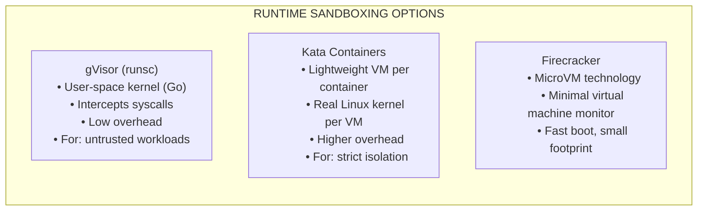
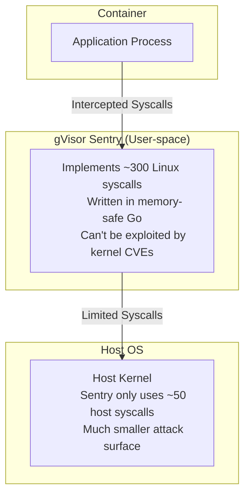
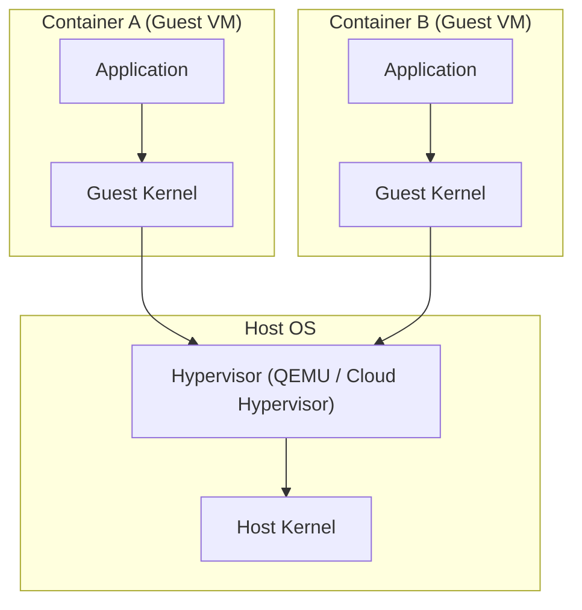
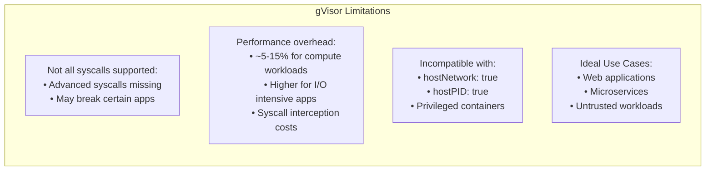

> **Complexity**: `[MEDIUM]` - Advanced container isolation
>
> **Time to Complete**: 40-45 minutes
>
> **Prerequisites**: Module 4.3 (Secrets Management), container runtime concepts

## What You'll Be Able to Do

After completing this module, you will be able to:

- **Evaluate** the isolation guarantees and performance trade-offs between standard runc, gVisor, and Kata Containers for different workload profiles.
- **Implement** RuntimeClass resources in Kubernetes to dynamically schedule untrusted workloads onto specifically sandboxed runtime environments.
- **Diagnose** application compatibility and scheduling failures caused by incomplete system call support or missing node runtime binaries.
- **Design** a risk-based scheduling strategy using `scheduling.nodeSelector` and tolerations to strictly dedicate specific cluster nodes to high-risk, sandboxed workloads.

---

## Why This Module Matters

In early 2019, the cloud-native infrastructure world was shaken by the disclosure of CVE-2019-5736, a devastating critical vulnerability discovered in the `runc` container runtime. Because `runc` serves as the underlying engine for Docker and almost all standard Kubernetes environments, the impact was ubiquitous. This vulnerability allowed a malicious process executed inside a seemingly isolated container to break out and systematically overwrite the host's native `runc` binary. By simply executing a carefully crafted payload, an attacker could instantaneously gain full root execution capabilities on the host node. Once an attacker breaches the host layer, they can pivot laterally to any other container running on that machine, siphon highly sensitive authentication secrets directly from the local kubelet, and orchestrate a complete compromise of the entire Kubernetes cluster.

For a massive, globally scaled e-commerce platform like Shopify—which relies heavily on multitenant Kubernetes architectures to execute and isolate thousands of independent merchant workloads—a container escape vulnerability of this magnitude represents an existential business risk. If a malicious actor could escape their designated container boundary and access a competitor's proprietary data, manipulate transaction flows, or intercept customer payment information, the financial impact would be catastrophic. The resulting regulatory fines, irreparable reputational damage, and direct lost revenue could easily scale into hundreds of millions of dollars. This incident brutally highlighted a fundamental engineering truth: standard Linux containers, which inherently share a single monolithic host kernel, are fundamentally not impenetrable security boundaries. They are merely namespaces and control groups providing an illusion of isolation. 

This is precisely where runtime sandboxing becomes an essential, non-negotiable layer of defense-in-depth architecture. By inserting a robust, hardware-backed or proxy-based isolation boundary—such as a user-space kernel proxy like gVisor or a lightweight micro-VM like Kata Containers—between the containerized application and the underlying host operating system, platform engineers can effectively neutralize entire classes of kernel-level zero-day exploits. In this comprehensive module, you will learn how to architect, configure, and seamlessly schedule these advanced sandboxing techniques to protect your most sensitive and untrusted workloads. Mastering these runtime isolation concepts is not only a critical capability for hardening enterprise production clusters, but it is also a heavily tested cornerstone of the CKS certification exam.

---

## The Container Isolation Problem

To truly understand why runtime sandboxing is necessary, we must first deconstruct how standard Linux containers actually function under the hood. When you deploy a typical Pod in Kubernetes using the default `runc` runtime, you are not creating a virtual machine. You are simply asking the Linux kernel to create a heavily restricted process using two core features: Namespaces (which limit what the process can see, such as network interfaces and process IDs) and Control Groups or cgroups (which limit what the process can use, such as CPU and memory). 

However, despite these restrictions, every single container on a worker node communicates directly with the exact same underlying host Linux kernel. The Linux kernel exposes an attack surface of over 300 different system calls (syscalls). If a security researcher or malicious actor discovers a buffer overflow or privilege escalation vulnerability in just one of those 300+ system calls, they can exploit it from inside the container. Because the kernel executing the vulnerable syscall is the host kernel, the exploit compromises the entire machine, instantly bypassing all Namespace and cgroup restrictions.

Consider the analogy of an apartment building. Standard containers are like individual apartments within the same large building. They have their own walls (namespaces) and their own utility meters (cgroups). But they all share the exact same structural foundation and central plumbing system (the host kernel). If someone introduces a catastrophic leak into the central plumbing from their specific apartment, the entire building is flooded, and every tenant is impacted. 

The diagram below illustrates this dangerous single point of failure inherent to standard container architectures:

```mermaid
flowchart TD
    subgraph Host ["HOST KERNEL (Single point of failure)"]
        Kernel["Kernel exploit from any container = Access to ALL containers and host"]
    end
    subgraph Pods ["STANDARD CONTAINER ISOLATION (runc)"]
        C1["Container A"]
        C2["Container B"]
        C3["Container C (attacker)"]
    end
    C1 -->|Syscalls| Kernel
    C2 -->|Syscalls| Kernel
    C3 -->|[Exploit] Malicious Syscalls| Kernel
```

> **Stop and think**: Standard containers share the host kernel directly -- all 300+ syscalls go straight to the kernel. gVisor intercepts these syscalls and reimplements them in userspace. What does this mean for an attacker trying to exploit a kernel vulnerability from inside a gVisor-sandboxed container?

---

## Sandboxing Solutions Overview

To mitigate the shared-kernel vulnerability, the cloud-native ecosystem developed alternative container runtimes designed to inject a strict isolation boundary between the container payload and the host kernel. This approach is collectively known as runtime sandboxing. By utilizing these alternative runtimes, you essentially change the fundamental physics of how your container communicates with the underlying infrastructure.

There are three primary methodologies for achieving this isolation, each balancing performance overhead against security guarantees in slightly different ways. These solutions are entirely transparent to Kubernetes; the Kubernetes control plane simply communicates with the local container runtime interface (CRI) on the node, oblivious to whether the CRI is provisioning a standard namespace or spinning up a dedicated virtual machine.

The following flowchart outlines the three dominant sandboxing technologies available in the modern cloud-native landscape:



By strategically deploying these tools, platform teams can run highly trusted internal services on fast, standard `runc` containers, while simultaneously routing unknown, untrusted, or multi-tenant code execution into heavily guarded Kata or gVisor sandboxes on the exact same cluster.

---

## gVisor Architecture and Deep Dive

gVisor, developed and open-sourced by Google, takes a fascinating software-based approach to isolation. Instead of relying on heavy hardware virtualization, gVisor introduces a user-space kernel—written entirely in the memory-safe Go programming language—that sits directly between the application and the host kernel. 

When an application running inside a gVisor sandbox attempts to execute a system call (like reading a file or opening a network socket), that call never reaches the host kernel. Instead, a specialized gVisor process known as the **Sentry** intercepts the request. The Sentry reimplements the logic of approximately 300 standard Linux system calls natively in user space. It performs the necessary actions, manages the container's simulated network stack, and orchestrates filesystem access via a secondary process called the **Gofer**. 

Because the Sentry is doing all the heavy lifting, it only needs to communicate with the host kernel using a drastically reduced footprint of about 50 highly audited, fundamental system calls. If an attacker attempts to exploit a newly discovered vulnerability in a complex Linux networking syscall, the exploit merely hits the Go-based Sentry simulation, rendering the payload inert and completely shielding the host kernel from the attack.



### Installing and Configuring gVisor on a Node

To utilize gVisor, the runtime binary (named `runsc`) must be physically installed and configured on your worker nodes. The CRI (such as containerd) must be instructed on how to invoke this new binary when requested by the kubelet. 

Here is how you would install the runtime on a Debian-based node:

```bash
# Add gVisor repository (Debian/Ubuntu)
curl -fsSL https://gvisor.dev/archive.key | sudo gpg --dearmor -o /usr/share/keyrings/gvisor-archive-keyring.gpg
echo "deb [arch=$(dpkg --print-architecture) signed-by=/usr/share/keyrings/gvisor-archive-keyring.gpg] https://storage.googleapis.com/gvisor/releases/ release main" | sudo tee /etc/apt/sources.list.d/gvisor.list

# Install
sudo apt update && sudo apt install -y runsc

# Verify
runsc --version
```

Once the binary is installed, you must update the containerd configuration to register `runsc` as a valid runtime handler. This tells containerd exactly how to bootstrap a gVisor sandbox.

```toml
# /etc/containerd/config.toml

# Add after [plugins."io.containerd.grpc.v1.cri".containerd.runtimes]

[plugins."io.containerd.grpc.v1.cri".containerd.runtimes.runsc]
  runtime_type = "io.containerd.runsc.v1"

[plugins."io.containerd.grpc.v1.cri".containerd.runtimes.runsc.options]
  TypeUrl = "io.containerd.runsc.v1.options"
```

After modifying the configuration file, you must restart the containerd daemon to load the new runtime plugins into memory.

```bash
sudo systemctl restart containerd
```

---

## Kata Containers Architecture

While gVisor relies on software interception, Kata Containers takes a hardware-centric approach. Kata operates on the philosophy that the only truly secure boundary is a hardware virtualization boundary. 

When you schedule a Pod using the Kata runtime, the CRI does not just spin up a namespace. Instead, it interacts with a hypervisor (such as QEMU or Cloud Hypervisor) to boot an extremely lightweight, dedicated Virtual Machine (VM) for that specific Pod. This MicroVM contains its own isolated, minimal Linux guest kernel. The containerized application runs on top of this guest kernel, completely detached from the host node's operating system.

Because Kata utilizes actual virtualization, it provides the robust security guarantees of a traditional VM while maintaining the lightning-fast boot times and standard OCI compatibility of a container. If a malicious process manages to execute a kernel exploit, it merely compromises the disposable guest kernel inside the MicroVM. The underlying host node, and all other tenant VMs residing upon it, remain completely untouched and secure. 



---

## RuntimeClass Implementation in Kubernetes

Installing the runtimes on the nodes is only the first half of the equation. To actually leverage these sandboxes in a Kubernetes environment, you must bridge the gap between the cluster's control plane and the node-level CRI configurations. This is accomplished using a powerful cluster-scoped Kubernetes API resource called a `RuntimeClass`.

A `RuntimeClass` object acts as a simple mapping dictionary. It defines a friendly, human-readable name (like `gvisor`) and maps it to the specific low-level handler string configured in the containerd settings (like `runsc`). 

### Creating RuntimeClass Resources

Let's define two separate `RuntimeClass` resources to support both gVisor and Kata in our cluster. Notice how the `handler` fields exactly match the internal plugin names defined in our CRI configuration.

```yaml
apiVersion: node.k8s.io/v1
kind: RuntimeClass
metadata:
  name: gvisor
handler: runsc  # Name in containerd config
```

```yaml
apiVersion: node.k8s.io/v1
kind: RuntimeClass
metadata:
  name: kata
handler: kata-qemu  # Name in containerd config
```

You can apply these definitions directly to your cluster using standard imperative commands:

```bash
cat <<EOF | kubectl apply -f -
apiVersion: node.k8s.io/v1
kind: RuntimeClass
metadata:
  name: gvisor
handler: runsc
EOF
```

### Using RuntimeClass in Workloads

Once the `RuntimeClass` objects are established in the control plane, developers and security teams can effortlessly mandate sandboxing for their applications. By simply adding the `spec.runtimeClassName` property to a Pod definition, the kubelet will automatically route the workload to the secure handler.

```yaml
apiVersion: v1
kind: Pod
metadata:
  name: sandboxed-pod
spec:
  runtimeClassName: gvisor  # Use gVisor instead of runc
  containers:
  - name: app
    image: nginx
```

If you apply a manifest like this, Kubernetes will provision the Pod using the gVisor Sentry. Let's look at a practical verification workflow:

```yaml
apiVersion: v1
kind: Pod
metadata:
  name: gvisor-test
spec:
  runtimeClassName: gvisor
  containers:
  - name: test
    image: nginx
```

```bash
# Create the pod
kubectl apply -f gvisor-pod.yaml

# Check runtime
kubectl get pod gvisor-test -o jsonpath='{.spec.runtimeClassName}'
# Output: gvisor

# Inside the container, check kernel version
kubectl exec gvisor-test -- uname -a
# Output shows "gVisor" instead of host kernel version

# Check dmesg (gVisor intercepts this)
kubectl exec gvisor-test -- dmesg 2>&1 | head -5
# Output shows gVisor's simulated kernel messages
```

### Scheduling Considerations and NodeSelectors

A critical architectural consideration arises when you operate heterogeneous clusters. It is highly unlikely that you will install gVisor or Kata binaries on every single worker node in a massive production environment. Often, sandboxing capabilities are reserved for specialized, high-capacity node pools. 

If a Pod requests a `RuntimeClass` but the scheduler places it on a node lacking the required binaries, the Pod will crash with a `RunContainerError`. To prevent this, the `RuntimeClass` API natively supports the `scheduling.nodeSelector` property. By defining this, you instruct the Kubernetes scheduler to automatically inject these node selectors into any Pod that references the RuntimeClass, guaranteeing safe placement.

```yaml
apiVersion: node.k8s.io/v1
kind: RuntimeClass
metadata:
  name: gvisor
handler: runsc
scheduling:
  nodeSelector:
    gvisor.kubernetes.io/enabled: "true"  # Only schedule on these nodes
  tolerations:
  - key: "gvisor"
    operator: "Equal"
    value: "true"
    effect: "NoSchedule"
```

To enable this scheduling flow, platform administrators must carefully label and taint their sandboxed worker nodes accordingly:

```bash
# Label nodes that have gVisor installed
kubectl label node worker1 gvisor.kubernetes.io/enabled=true

# Now pods with runtimeClassName: gvisor will only schedule on labeled nodes
```

### Advanced Administrative Scenarios

During the CKS exam, and in real-world platform administration, you will frequently need to audit your cluster to determine which workloads are bypassing your sandboxing policies. 

The following commands demonstrate how to dynamically query the Kubernetes API to identify workloads utilizing standard runtimes versus secure sandboxes:

```bash
# Find all pods without runtimeClassName
kubectl get pods -A -o json | jq -r '
  .items[] |
  select(.spec.runtimeClassName == null) |
  "\(.metadata.namespace)/\(.metadata.name)"
'

# Find pods with specific RuntimeClass
kubectl get pods -A -o json | jq -r '
  .items[] |
  select(.spec.runtimeClassName == "gvisor") |
  "\(.metadata.namespace)/\(.metadata.name)"
'
```

If you determine that specific namespaces must exclusively run sandboxed workloads, you can enforce this mandate dynamically using ValidatingAdmissionPolicies or third-party policy engines like OPA Gatekeeper. 

```yaml
# Use a ValidatingAdmissionPolicy (K8s 1.35+) or OPA/Gatekeeper
# Example with namespace annotation for documentation

apiVersion: v1
kind: Namespace
metadata:
  name: untrusted-workloads
  labels:
    security.kubernetes.io/sandbox-required: "true"
```

---

## Limitations and Performance Trade-offs

Security boundaries are never entirely free. The rigorous isolation provided by runtime sandboxing invariably introduces architectural complexities and performance penalties that engineers must carefully evaluate. 

Because gVisor intercepts and translates system calls in user space, every interaction with the filesystem or the network requires a context switch and proxy traversal. While CPU-bound calculations run at near-native speeds, I/O-heavy applications like massive relational databases or high-throughput message brokers will suffer noticeable latency degradation. Furthermore, because gVisor must manually implement every system call, newer or highly obscure Linux system calls may not be supported, leading to unexpected application crashes. 

Kata Containers, conversely, avoids the missing syscall problem by provisioning a real Linux kernel. However, spinning up an entire virtual machine demands a larger memory footprint and incurs slower startup times compared to traditional namespace isolation. 



> **What would happen if**: You deploy a high-performance database (PostgreSQL) inside a gVisor sandbox. The database uses memory-mapped files and direct I/O heavily. Would you expect the same performance as runc, and what trade-off are you making?

---

## Comparison: runc vs gVisor vs Kata

Understanding the distinct characteristics of each runtime is paramount for making informed architectural decisions. You must weigh the threat model of the workload against the performance budget of your infrastructure. 

The following matrix provides a comprehensive comparison of the three primary container execution models:

| Feature | runc (default) | gVisor | Kata |
|---|---|---|---|
| Isolation | Namespaces only | User-space kernel | VM per pod |
| Kernel sharing | Shared | Intercepted | Not shared |
| Overhead | Minimal | Low-Medium | Medium-High |
| Boot time | ~100ms | ~200ms | ~500ms |
| Memory | Low | Low-Medium | Higher |
| Compatibility | Full | Most apps | Most apps |
| Use case | General | Untrusted workloads | High security |

> **Pause and predict**: Your cluster runs both trusted internal microservices and untrusted customer-submitted code (like a CI/CD runner). Which workloads benefit most from runtime sandboxing, and would you sandbox everything or just specific workloads?

---

## Did You Know?

- **gVisor was developed by Google** in May 2018 and is the foundational security technology used underneath Google Cloud Run and other serverless GCP services to isolate tenant workloads.
- **Kata Containers merged from Intel Clear Containers and Hyper runV** in December 2017. It brilliantly leverages the same standardized OCI interface as runc, making it a frictionless, drop-in replacement.
- **The handler name in a RuntimeClass** resource object must character-for-character match the runtime binary name meticulously configured in the underlying containerd or CRI-O daemon settings.
- **AWS Fargate uses Firecracker**, another micro-VM technology similar to Kata but optimized for fast boot times.

---

## Common Mistakes

When implementing runtime sandboxing in production Kubernetes clusters, platform engineers frequently encounter a specific set of configuration pitfalls. Review the table below to avoid these standard architectural errors.

| Mistake | Why It Hurts | Solution |
|---------|--------------|----------|
| Wrong handler name | Pod fails to schedule because the CRI cannot locate the configured runtime binary. | Match the `handler` in RuntimeClass exactly with the containerd `config.toml`. |
| No RuntimeClass specified | Workload quietly uses default runc, leaving it vulnerable to kernel exploits. | Always create the RuntimeClass first and define it in the Pod `spec.runtimeClassName`. |
| gVisor on incompatible workload | Application crashes unexpectedly due to unimplemented advanced Linux syscalls. | Test application compatibility thoroughly and check the official gVisor syscall table before migrating. |
| Missing node selector | Pod schedules on a node lacking the runtime binary, causing an immediate `RunContainerError`. | Use the `scheduling.nodeSelector` block in the RuntimeClass to strictly pin workloads to capable nodes. |
| Expecting full syscall support | Heavy I/O applications or complex network apps fail to initialize completely. | Profile your application's syscall footprint using tools like `strace` to ensure compatibility. |
| Ignoring performance overhead | Database or message queue latency spikes significantly under high throughput loads. | Benchmark workloads specifically under the sandboxed runtime before moving to production. |
| Forgetting to label nodes | The scheduler cannot find any valid nodes that match the RuntimeClass selector. | Apply the correct labels (e.g., `gvisor.kubernetes.io/enabled: "true"`) to all nodes running the alternative runtime. |

---

## Quiz

Test your comprehension of runtime isolation concepts and Kubernetes integration through these rigorous, scenario-based questions.

<details>
<summary>1. **A critical kernel CVE is announced that allows container escape via a specific syscall. Your cluster runs 200 pods with standard runc and 10 pods with gVis**or. Which pods are vulnerable, and why does gVisor protect against this class of attack?</summary>
The 200 runc pods are vulnerable because their syscalls go directly to the host kernel -- the CVE exploit works directly. The 10 gVisor pods are likely protected because gVisor intercepts syscalls in its own userspace "Sentry" process, reimplementing them without touching the host kernel for most operations. The vulnerable syscall either isn't implemented by gVisor (blocked by default) or is handled in userspace where the kernel exploit doesn't apply. This is gVisor's core security model: reducing the kernel attack surface from 300+ syscalls to ~50 that actually reach the host kernel.
</details>

<details>
<summary>2. **Your team wants to sandbox CI/CD runner pods that execute untrusted customer code. They test with gVisor but the runners fail because they need to build Docker images (which requires `mount` syscalls and `overlayfs`). What alternative sandboxing approach would work for this use case?**</summary>
Kata Containers would be a better fit. Kata runs each pod in a lightweight VM with its own kernel, providing hardware-level isolation while supporting the full Linux syscall interface (including `mount`). gVisor doesn't support all syscalls needed for container-in-container builds. Alternatively, use rootless BuildKit or Kaniko for image building inside gVisor (they don't need privileged syscalls). Another option is dedicating specific nodes with Kata runtime for CI/CD workloads and using RuntimeClass (`spec.runtimeClassName: kata`) to schedule them appropriately.
</details>

<details>
<summary>3. **You create a RuntimeClass called `gvisor` and a pod with `runtimeClassName: gvisor`. The pod starts on `node-1` successfully but fails on `node-2` with "handler not found." What's the likely cause, and how do you ensure consistent runtime availability?**</summary>
The gVisor runtime handler (`runsc`) is installed and configured in containerd on `node-1` but not on `node-2`. RuntimeClass is a cluster-level resource, but the actual runtime binary must be installed on each node. Fix: (1) Install gVisor on all nodes, or (2) Use RuntimeClass `scheduling` field with `nodeSelector` to ensure gVisor pods only schedule on nodes with the runtime installed. Label gVisor-capable nodes (e.g., `runtime/gvisor: "true"`) and set `scheduling.nodeSelector` in the RuntimeClass. This prevents scheduling failures and ensures consistent behavior.
</details>

<details>
<summary>4. **Your security architect says "sandbox everything with gVisor for maximum security." Your performance team objects because database pods show 30% I/O latency increase under gVisor. How do you balance security and performance across different workload types?**</summary>
Don't sandbox everything uniformly. Use a risk-based approach: (1) High-risk workloads (untrusted code execution, public-facing services, multi-tenant workloads) get gVisor or Kata sandboxing via RuntimeClass. (2) Performance-sensitive workloads (databases, caches, message queues) stay on runc but get hardened with seccomp, AppArmor, non-root, read-only filesystem, and dropped capabilities. (3) Internal trusted services get standard security contexts without sandboxing. Create multiple RuntimeClasses (`standard`, `gvisor`, `kata`) and assign them based on workload risk profile. The 30% I/O overhead for databases is unacceptable, but for a web frontend handling untrusted input, it's a worthwhile security trade-off.
</details>

<details>
<summary>5. **You have successfully created a `RuntimeClass` for Kata Containers, but when developers deploy pods using `runtimeClassName: kata`, the pods remain in a `Pending` state indefinitely. What is the most likely architectural omission preventing the pods from scheduling?**</summary>
The most likely omission is that the cluster nodes lack the proper labels required by the `RuntimeClass`'s `scheduling.nodeSelector` configuration. If the `RuntimeClass` enforces that workloads only run on specific nodes via node selectors or tolerations, and no nodes possess those exact labels, the Kubernetes scheduler cannot find a valid placement. To diagnose this, inspect the pod's events using `kubectl describe pod` to reveal scheduler constraints. You must apply the matching label (e.g., `kata.kubernetes.io/enabled=true`) to the intended worker nodes to resolve the bottleneck and allow scheduling to proceed.
</details>

<details>
<summary>6. **An engineering team is migrating a legacy network-monitoring application to a Kubernetes cluster and decides to secure it using gVisor. However, upon deployment, the application immediately crashes, citing a failure to configure `hostNetwork: true`. Why does this occur, and how should you address it?**</summary>
The crash occurs because gVisor's architecture strictly isolates the container's network stack by simulating it within the user-space Sentry process, making it fundamentally incompatible with the `hostNetwork: true` directive. Sandboxing runtimes intentionally block access to the underlying host namespaces to prevent network-based container escapes or host interface snooping. To resolve this, you must either refactor the legacy application to operate within a standard isolated pod network or, if host network access is absolutely mandatory, revert the workload to standard `runc` while implementing strict network policies and AppArmor profiles to mitigate the risk.
</details>

<details>
<summary>7. **When evaluating performance overhead, a database administrator notes that a workload running on gVisor experiences significant latency during heavy read/write operations, whereas CPU-intensive calculations perform normally. What architectural characteristic of gVisor explains this specific performance degradation?**</summary>
This performance degradation is caused by the way gVisor intercepts and handles system calls through its user-space Sentry process. CPU-intensive calculations execute natively on the processor without requiring kernel intervention, meaning they incur almost zero overhead. However, read/write operations require frequent system calls to access the filesystem or network, forcing gVisor to intercept, translate, and proxy these requests via the Gofer process. This context-switching between user space and the proxy layer introduces significant latency for I/O-heavy workloads, making gVisor sub-optimal for high-throughput databases.
</details>

<details>
<summary>8. **Your organization requires extreme isolation for executing ephemeral, untrusted function-as-a-service (FaaS) workloads. You must choose between Kata Containers and standard runc, prioritizing absolute tenant separation even if it means sacrificing a few milliseconds of boot time. Which runtime should you choose and why?**</summary>
You should select Kata Containers for this extreme isolation requirement because it provisions a dedicated, lightweight virtual machine with a real, isolated Linux kernel for every single pod. While standard `runc` relies on shared kernel namespaces and cgroups—which are vulnerable to kernel-level escapes—Kata provides hardware-level virtualization that prevents a compromised function from accessing the host kernel. Although booting a micro-VM incurs a slight delay compared to spinning up a standard container namespace, the hardware boundary guarantees robust tenant separation for untrusted code execution.
</details>

---

## Hands-On Exercise

Solidify your theoretical understanding by executing these progressive administrative tasks in a live Kubernetes environment. Each step verifies your ability to configure and audit sandboxed container deployments.

<details>
<summary>Task 1: Verify Environment Readiness</summary>
Before applying API configurations, confirm that the underlying runtime binary is actually present on your worker node and verify the current state of cluster RuntimeClasses.

```bash
# Step 1: Check if gVisor is available (on lab environment)
runsc --version 2>/dev/null || echo "gVisor not installed (expected in exam environment)"

# Step 2: Check existing RuntimeClasses
kubectl get runtimeclass
```
</details>

<details>
<summary>Task 2: Implement the RuntimeClass Resource</summary>
Provision the cluster-scoped `RuntimeClass` object that maps the friendly name `gvisor` to the low-level `runsc` containerd handler.

```bash
# Step 3: Create RuntimeClass (works even if gVisor not installed)
cat <<EOF | kubectl apply -f -
apiVersion: node.k8s.io/v1
kind: RuntimeClass
metadata:
  name: gvisor
handler: runsc
EOF
```
</details>

<details>
<summary>Task 3: Deploy Standard and Sandboxed Workloads</summary>
Launch two identical Pods side-by-side. One will default to the standard shared `runc` kernel, while the other explicitly requests the isolated gVisor sandbox.

```bash
# Step 4: Create pod without sandboxing
cat <<EOF | kubectl apply -f -
apiVersion: v1
kind: Pod
metadata:
  name: standard-pod
spec:
  containers:
  - name: test
    image: busybox
    command: ["sleep", "3600"]
EOF

# Step 5: Create pod with sandboxing
cat <<EOF | kubectl apply -f -
apiVersion: v1
kind: Pod
metadata:
  name: sandboxed-pod
spec:
  runtimeClassName: gvisor
  containers:
  - name: test
    image: busybox
    command: ["sleep", "3600"]
EOF
```
</details>

<details>
<summary>Task 4: Inspect and Compare Runtime Implementations</summary>
Audit the running pods using JSONPath queries to explicitly reveal which Kubernetes runtime handler was injected into their pod specifications during admission.

```bash
# Step 6: Compare pod specs
echo "=== Standard Pod ==="
kubectl get pod standard-pod -o jsonpath='{.spec.runtimeClassName}'
echo ""

echo "=== Sandboxed Pod ==="
kubectl get pod sandboxed-pod -o jsonpath='{.spec.runtimeClassName}'
echo ""

# Step 7: List all RuntimeClasses
kubectl get runtimeclass -o wide
```
</details>

<details>
<summary>Task 5: Clean Up the Environment</summary>
Maintain cluster hygiene by forcefully purging the experimental pods and the custom RuntimeClass resource.

```bash
# Cleanup
kubectl delete pod standard-pod sandboxed-pod
kubectl delete runtimeclass gvisor
```
</details>

**Success criteria**: You have successfully mapped a low-level CRI handler to a Kubernetes abstraction and scheduled workloads that respect this strict security boundary.

---

## Summary

**Why Sandboxing?**
- Standard containers inherently share the host kernel, creating a massive single point of failure.
- A single successful kernel exploit guarantees full escalation and escape to the host operating system.
- Sandboxing fundamentally restructures this architecture by injecting a hard proxy or virtualization layer.

**gVisor (The User-Space Proxy)**:
- Provides an emulated user-space kernel written in memory-safe Go.
- Intercepts and translates over 300 risky syscalls down to a safe subset of 50.
- Introduces low compute overhead, making it ideal for untrusted, multi-tenant microservices.

**Kata Containers (The Micro-VM)**:
- Provisions a dedicated, isolated Virtual Machine and guest kernel for every single container.
- Guarantees full hardware-level isolation without sacrificing OCI compatibility.
- Introduces higher memory overhead and startup latency for maximum security posture.

**RuntimeClass Architecture**:
- Represents the native Kubernetes abstraction layer for interacting with alternative CRI runtimes.
- Requires exact handler string matching against the node's containerd `config.toml`.
- Allows precise node targeting and isolation via the `scheduling.nodeSelector` property.

**Exam Tips**:
- Memorize the exact YAML structure for defining a `RuntimeClass` and requesting it in a Pod via `spec.runtimeClassName`.
- Understand the nuanced performance and compatibility tradeoffs between gVisor (syscall interception) and Kata (VM virtualization).
- Be prepared to forcefully enforce RuntimeClass usage on specific namespaces using admission controllers.

---

## Part 4 Complete!

You've successfully finished **Minimize Microservice Vulnerabilities** (which constitutes a massive 20% of the CKS curriculum). You now possess deep, architectural expertise in:
- Crafting restrictive Security Contexts for pods and granular containers.
- Enforcing cluster-wide compliance using Pod Security Admission standards.
- Securing at-rest data through advanced Secrets management and encryption providers.
- Designing impenetrable execution environments using runtime sandboxing with gVisor and Kata.

**Next Part**: [Part 5: Supply Chain Security](/k8s/cks/part5-supply-chain-security/module-5.1-image-security/) - Learn how to shift security left by rigorously auditing container images, signing artifacts, and locking down the modern software supply chain.