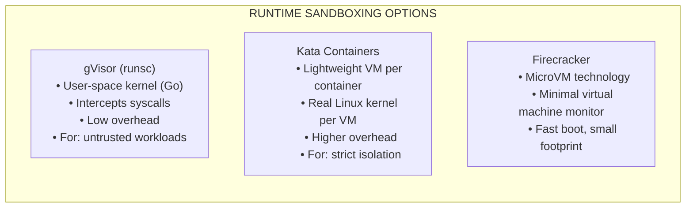
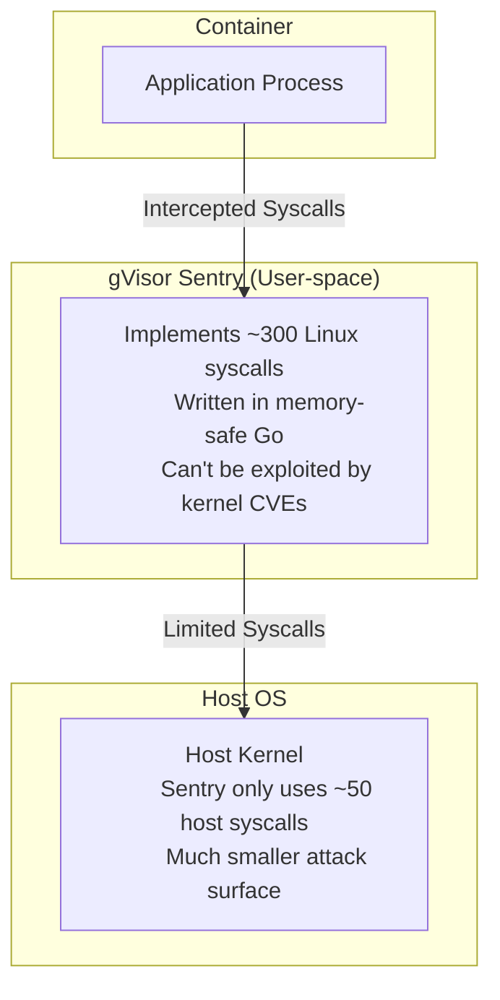
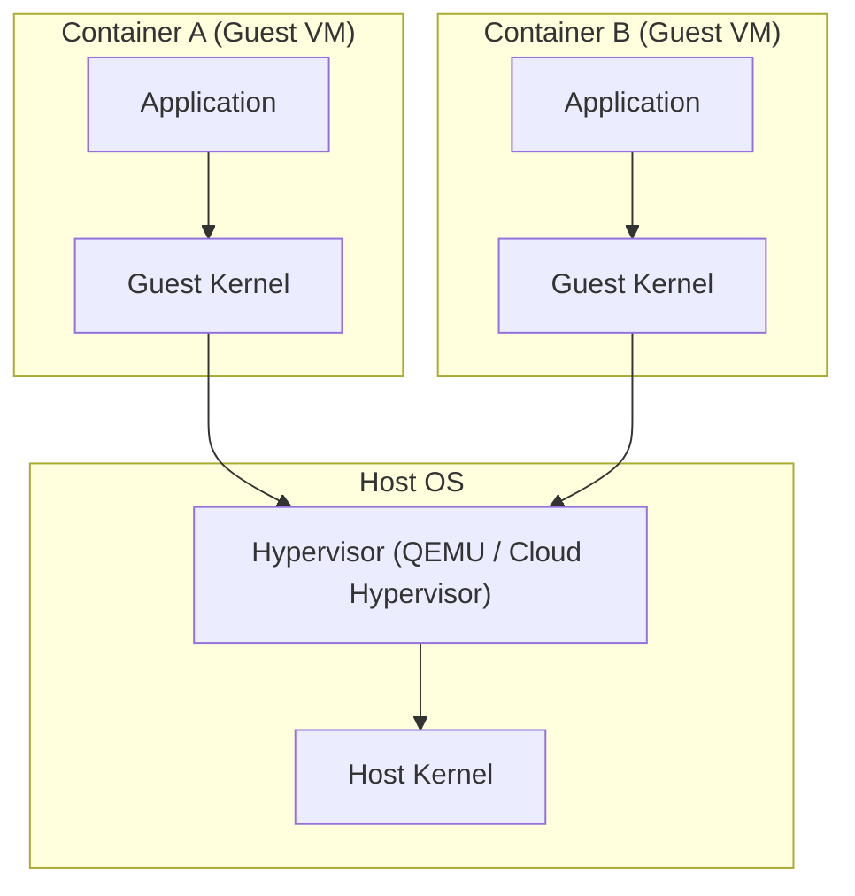
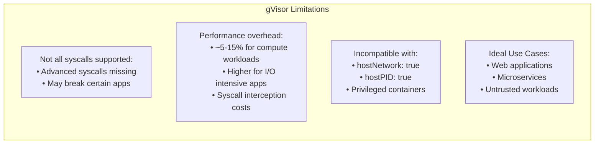

> **Complexity**: `[MEDIUM]` - Advanced container isolation
>
> **Time to Complete**: 40-45 minutes
>
> **Prerequisites**: Module 4.3 (Secrets Management), container runtime concepts

## What You'll Be Able to Do

After completing this module, you will be able to connect runtime choices to concrete workload risk, operational cost, and exam-grade Kubernetes configuration:

- **Evaluate** the isolation guarantees and performance trade-offs between standard runc, gVisor, and Kata Containers for different workload profiles.
- **Implement** RuntimeClass resources in Kubernetes to dynamically schedule untrusted workloads onto specifically sandboxed runtime environments.
- **Diagnose** application compatibility and scheduling failures caused by incomplete system call support or missing node runtime binaries.
- **Design** a risk-based scheduling strategy using `scheduling.nodeSelector` and tolerations to strictly dedicate specific cluster nodes to high-risk, sandboxed workloads.

---

## Why This Module Matters

In early 2019, the cloud-native infrastructure world was shaken by the disclosure of CVE-2019-5736, a devastating critical vulnerability discovered in the `runc` container runtime. Because `runc` serves as the underlying engine for Docker and almost all standard Kubernetes environments, the impact was ubiquitous. This vulnerability allowed a malicious process executed inside a seemingly isolated container to break out and systematically overwrite the host's native `runc` binary. By simply executing a carefully crafted payload, an attacker could instantaneously gain full root execution capabilities on the host node. Once an attacker breaches the host layer, they can pivot laterally to any other container running on that machine, siphon highly sensitive authentication secrets directly from the local kubelet, and orchestrate a complete compromise of the entire Kubernetes cluster.

For a massive, globally scaled e-commerce platform like Shopify—which relies heavily on multitenant Kubernetes architectures to execute and isolate thousands of independent merchant workloads—a container escape vulnerability of this magnitude represents an existential business risk. If a malicious actor could escape their designated container boundary and access a competitor's proprietary data, manipulate transaction flows, or intercept customer payment information, the financial impact would be catastrophic. The resulting regulatory fines, irreparable reputational damage, and direct lost revenue could easily scale into hundreds of millions of dollars. This incident brutally highlighted a fundamental engineering truth: standard Linux containers, which inherently share a single monolithic host kernel, are fundamentally not impenetrable security boundaries. They are merely namespaces and control groups providing an illusion of isolation. 

This is precisely where runtime sandboxing becomes an essential, non-negotiable layer of defense-in-depth architecture. By inserting a robust, hardware-backed or proxy-based isolation boundary—such as a user-space kernel proxy like gVisor or a lightweight micro-VM like Kata Containers—between the containerized application and the underlying host operating system, platform engineers can effectively neutralize entire classes of kernel-level zero-day exploits. In this comprehensive module, you will learn how to architect, configure, and seamlessly schedule these advanced sandboxing techniques to protect your most sensitive and untrusted workloads. Mastering these runtime isolation concepts is not only a critical capability for hardening enterprise production clusters, but it is also a heavily tested cornerstone of the CKS certification exam.

---

## The Container Isolation Problem

To truly understand why runtime sandboxing is necessary, we must first deconstruct how standard Linux containers actually function under the hood. When you deploy a typical Pod in Kubernetes using the default `runc` runtime, you are not creating a virtual machine. You are asking the Linux kernel to start a restricted process tree using namespaces, cgroups, capabilities, seccomp, Linux Security Modules, and filesystem mounts. Namespaces limit what the process can see, such as network interfaces and process IDs. Control groups limit what the process can use, such as CPU and memory. The runtime assembles those primitives into a container, then exits after the container process has been created.

That model is efficient because there is no second operating system to boot and no full hypervisor boundary to cross. It is also the reason containers feel so convenient in development and production: they start quickly, pack densely, and preserve normal Linux process semantics. The security catch is that every ordinary container on the node still uses the same host kernel. The boundary is a policy boundary inside one kernel, not a separate kernel boundary. If the workload can reach a vulnerable kernel interface, the code executing that interface is the same code that protects the node, kubelet, container runtime, local credentials, and every other Pod on the machine.

The Linux kernel exposes a large system call interface for filesystems, networking, process management, memory mapping, signals, timers, namespaces, and device access. Seccomp profiles can reduce that surface, and Pod Security controls can block many dangerous Pod shapes, but a standard `runc` container still depends on the host kernel correctly enforcing every relevant check. A kernel bug in a reachable path can collapse the distinction between "inside the container" and "on the node." That is the lesson CVE-2019-5736 made concrete for many platform teams: a runtime or kernel-level escape is not just a compromised Pod, it is a compromised scheduling unit for many Pods.

Consider the analogy of an apartment building. Standard containers are like individual apartments within the same large building. They have their own walls, door locks, utility meters, and lease rules, but they all share the same structural foundation and central plumbing system. If someone finds a way to damage the central system from one apartment, every tenant is exposed because the building itself is the shared dependency. Runtime sandboxing changes the architecture by inserting a second boundary between the tenant and the building systems. The goal is not to make every bug impossible; the goal is to make the most dangerous bug class hit a smaller, more disposable, or more isolated boundary first.

The diagram below illustrates this dangerous single point of failure in standard container architectures. The important part is not the number of containers, but the direction of the arrows: every container eventually asks the same host kernel to perform privileged operations on its behalf.

```mermaid
flowchart TD
    subgraph Host ["HOST KERNEL (Single point of failure)"]
        Kernel["Kernel exploit from any container = Access to ALL containers and host"]
    end
    subgraph Pods ["STANDARD CONTAINER ISOLATION (runc)"]
        C1["Container A"]
        C2["Container B"]
        C3["Container C (attacker)"]
    end
    C1 -->|Syscalls| Kernel
    C2 -->|Syscalls| Kernel
    C3 -->|[Exploit] Malicious Syscalls| Kernel
```

> **Stop and think**: Standard containers share the host kernel directly -- all 300+ syscalls go straight to the kernel. gVisor intercepts these syscalls and reimplements them in userspace. What does this mean for an attacker trying to exploit a kernel vulnerability from inside a gVisor-sandboxed container?

---

## Sandboxing Solutions Overview

To mitigate the shared-kernel risk, the cloud-native ecosystem developed alternative container runtimes that add a stricter isolation boundary between the application and the host. This approach is collectively known as runtime sandboxing. The Kubernetes API does not need to understand every implementation detail. It asks the kubelet to create a Pod, the kubelet asks the Container Runtime Interface implementation to run the Pod sandbox, and the CRI chooses a configured handler such as `runc`, `runsc`, or `kata-qemu`. The handler is where the node-level runtime decision becomes real.

The practical value is that a platform can run mixed trust levels in one cluster without treating every workload the same way. A stable internal metrics collector may use ordinary `runc` with strong Pod Security and a tight seccomp profile. A public code-runner, browser-rendering service, plugin execution system, or tenant-supplied function may request a stronger sandbox. The Kubernetes abstraction for that request is `RuntimeClass`; the node implementation behind it is a runtime handler configured in containerd, CRI-O, or a managed service runtime stack.

There are three common methodologies for achieving stronger isolation. gVisor intercepts application system calls and implements much of the Linux kernel interface in a userspace process called the Sentry. Kata Containers boots a lightweight virtual machine for the Pod, giving the workload its own guest kernel behind a hypervisor boundary. Firecracker is a microVM technology used by platforms that need very fast, dense virtual machines for serverless or untrusted workloads. These tools share a goal, but they are not interchangeable: the right choice depends on syscall compatibility, startup budget, memory overhead, node support, cloud provider features, and the severity of the tenant-separation requirement.

The following flowchart outlines the three dominant sandboxing technologies available in the modern cloud-native landscape. Read it as a decision map, not as a ranking. gVisor is attractive when you want a strong syscall mediation boundary with relatively low operational weight. Kata is attractive when a hardware virtualization boundary is the central requirement. Firecracker is usually consumed through a platform, such as Fargate or a serverless runtime, rather than installed manually as a Kubernetes RuntimeClass in a standard CKS lab.


```mermaid
flowchart LR
    subgraph Options ["RUNTIME SANDBOXING OPTIONS"]
        direction TB
        G["gVisor (runsc)
        • User-space kernel (Go)
        • Intercepts syscalls
        • Low overhead
        • For: untrusted workloads"]

        K["Kata Containers
        • Lightweight VM per container
        • Real Linux kernel per VM
        • Higher overhead
        • For: strict isolation"]

        F["Firecracker
        • MicroVM technology
        • Minimal virtual machine monitor
        • Fast boot, small footprint"]
    end
```

By strategically deploying these tools, platform teams can run trusted internal services on fast, standard `runc` containers while routing unknown, untrusted, or multi-tenant execution into guarded Kata or gVisor sandboxes in the same fleet. The design work is deciding which workloads deserve the extra boundary, which nodes are allowed to host them, and which failures should stop a rollout before an unsandboxed fallback happens silently.

---

## gVisor Architecture and Deep Dive

gVisor, developed and open-sourced by Google, takes a software-based approach to isolation. Instead of relying on a full hardware virtual machine for every Pod, gVisor introduces a user-space kernel written in Go that sits between the application and the host kernel. The runtime binary is called `runsc`, and Kubernetes normally reaches it through a container runtime handler registered in containerd or CRI-O. From the Pod author's perspective, the manifest changes by one field: `spec.runtimeClassName`.

When an application running inside a gVisor sandbox attempts to execute a system call, such as reading a file, opening a socket, changing a process attribute, or inspecting `/proc`, the call is intercepted before it can directly exercise the host kernel path. A specialized gVisor process known as the **Sentry** implements a large portion of the Linux system call interface in userspace. The Sentry owns the sandbox's view of processes, signals, memory mappings, network behavior, and many filesystem semantics. For file access, gVisor can involve a separate **Gofer** process that mediates access to host-backed filesystems without giving the application direct access to the host's namespace.

That architecture changes the exploit target. An attacker trying to trigger a kernel bug from inside a normal container is aiming at the host kernel directly. An attacker trying the same exploit inside gVisor first hits the Sentry implementation. If the syscall is not implemented, the call fails. If it is implemented differently from the kernel path that contains the vulnerability, the exploit loses the primitive it expected. If the Sentry itself contains a bug, the attacker still has to escape from a process intentionally designed to expose a smaller host-kernel interface than an ordinary application process.

This is why gVisor is especially useful for workloads that execute code the platform team did not write: hosted CI jobs, browser automation, plugin systems, notebook execution, tenant extensions, training sandboxes, and public-facing request handlers with high parser exposure. It is less compelling for workloads that already require privileged host integration, direct device access, or kernel features that gVisor intentionally does not expose. The right mental model is "reduce and mediate kernel attack surface," not "make Linux compatibility perfect."


```mermaid
flowchart TD
    subgraph Pod ["Container"]
        App["Application Process"]
    end
    subgraph gVisor ["gVisor Sentry (User-space)"]
        Sentry["Implements ~300 Linux syscalls
        Written in memory-safe Go
        Can't be exploited by kernel CVEs"]
    end
    subgraph Host ["Host OS"]
        Kernel["Host Kernel
        Sentry only uses ~50 host syscalls
        Much smaller attack surface"]
    end

    App -->|Intercepted Syscalls| Sentry
    Sentry -->|Limited Syscalls| Kernel
```

### Installing and Configuring gVisor on a Node

To use gVisor, the runtime binary named `runsc` and its containerd shim must be installed on every node that may run sandboxed Pods. This is a node responsibility, not a cluster API responsibility. A `RuntimeClass` object can exist in the Kubernetes API even if no node has the corresponding binary. In that broken state, Pods will either fail at container creation time or remain unschedulable if you added strict node selectors and no labeled nodes match.

Here is how you would install the runtime on a Debian-based node in a self-managed lab. Managed services often hide this step behind a provider feature such as GKE Sandbox, but the CKS exam commonly expects you to understand the node-level mapping.

```bash
# Add gVisor repository (Debian/Ubuntu)
curl -fsSL https://gvisor.dev/archive.key | sudo gpg --dearmor -o /usr/share/keyrings/gvisor-archive-keyring.gpg
echo "deb [arch=$(dpkg --print-architecture) signed-by=/usr/share/keyrings/gvisor-archive-keyring.gpg] https://storage.googleapis.com/gvisor/releases/ release main" | sudo tee /etc/apt/sources.list.d/gvisor.list

# Install
sudo apt update && sudo apt install -y runsc

# Verify
runsc --version
```

Once the binary is installed, update the containerd configuration to register `runsc` as a valid runtime handler. The important value is the handler name. Kubernetes will later send the handler string from the `RuntimeClass` object to the CRI implementation, so a spelling mismatch between `handler: runsc` and the containerd runtime key is enough to break Pod startup.

```toml
# /etc/containerd/config.toml

# Add after [plugins."io.containerd.grpc.v1.cri".containerd.runtimes]

[plugins."io.containerd.grpc.v1.cri".containerd.runtimes.runsc]
  runtime_type = "io.containerd.runsc.v1"

[plugins."io.containerd.grpc.v1.cri".containerd.runtimes.runsc.options]
  TypeUrl = "io.containerd.runsc.v1.options"
```

After modifying the configuration file, restart the containerd daemon to load the runtime plugin configuration. In a production rollout, drain the node or roll the node pool rather than restarting containerd underneath unrelated workloads during peak traffic.

```bash
sudo systemctl restart containerd
```

---

## Kata Containers Architecture

While gVisor relies on software interception, Kata Containers takes a hardware-centric approach. Kata operates on the philosophy that a strong tenant boundary should look like virtualization. When you schedule a Pod using a Kata runtime handler, the CRI does not merely create namespaces on the host. It asks the Kata stack to create a lightweight virtual machine through a hypervisor such as QEMU or Cloud Hypervisor, then runs the container workload inside that VM. The Pod still looks like a Kubernetes Pod, but the kernel serving the application is a guest kernel, not the host kernel.

The security implication is different from gVisor. With Kata, a workload that exploits a Linux kernel bug is attacking the guest kernel inside its own VM. The host kernel and neighboring Pods are separated by the hypervisor boundary. This is attractive for strict multi-tenancy, regulated environments, high-risk customer workloads, and cases where the application expects broad Linux compatibility but the platform cannot accept shared-kernel exposure. It is also a familiar story for security reviewers because the isolation boundary resembles the traditional VM model they already know how to reason about.

The cost is that every Pod needs more machinery. A guest kernel, VM memory, virtual devices, and a hypervisor process require resources that a namespace-only container does not. Startup can be slower, node density can be lower, and observability may require Kata-specific knowledge. Some host integrations that are simple with `runc` become more complex across the VM boundary. That does not make Kata worse than gVisor; it makes Kata a different tradeoff. Use it when the stronger virtualization boundary matters enough to justify the operational overhead.


```mermaid
flowchart TD
    subgraph PodA ["Container A (Guest VM)"]
        AppA["Application"]
        KernelA["Guest Kernel"]
        AppA --> KernelA
    end
    subgraph PodB ["Container B (Guest VM)"]
        AppB["Application"]
        KernelB["Guest Kernel"]
        AppB --> KernelB
    end

    subgraph Host ["Host OS"]
        Hyp["Hypervisor (QEMU / Cloud Hypervisor)"]
        HKernel["Host Kernel"]
        Hyp --> HKernel
    end

    KernelA --> Hyp
    KernelB --> Hyp
```

---

## RuntimeClass Implementation in Kubernetes

Installing runtimes on nodes is only the first half of the equation. To use those sandboxes in Kubernetes, you must bridge the cluster API to the node-level CRI configuration. That bridge is the cluster-scoped `RuntimeClass` resource. A `RuntimeClass` object gives users a stable Kubernetes name, such as `gvisor` or `kata`, and maps it to the low-level handler string configured in the node runtime, such as `runsc` or `kata-qemu`.

The most important operational detail is that `RuntimeClass` is declarative metadata; it does not install software. Creating `RuntimeClass/gvisor` does not put `runsc` on a node, does not restart containerd, does not label a node, and does not prove that the runtime works. It only gives the kubelet and CRI a name to request when a Pod says `runtimeClassName: gvisor`. That is why runtime sandboxing failures often look split-brained: the API object exists, but the node cannot honor it.

### Creating RuntimeClass Resources

Define separate `RuntimeClass` resources for each runtime profile you want users to select. Notice how the `handler` fields exactly match the internal plugin names defined in the CRI configuration. The `metadata.name` is the Kubernetes-facing name used in Pod specs; the `handler` is the node-runtime-facing string sent to containerd or CRI-O.

```yaml
apiVersion: node.k8s.io/v1
kind: RuntimeClass
metadata:
  name: gvisor
handler: runsc  # Name in containerd config
```

```yaml
apiVersion: node.k8s.io/v1
kind: RuntimeClass
metadata:
  name: kata
handler: kata-qemu  # Name in containerd config
```

You can apply these definitions directly to your cluster using standard imperative commands:

```bash
cat <<EOF | kubectl apply -f -
apiVersion: node.k8s.io/v1
kind: RuntimeClass
metadata:
  name: gvisor
handler: runsc
EOF
```

### Using RuntimeClass in Workloads

Once the `RuntimeClass` objects are established in the control plane, developers and security teams can request sandboxing by adding `spec.runtimeClassName` to a Pod template. For real applications, that field normally lives in the template section of a Deployment, Job, CronJob, StatefulSet, or another workload controller. Editing a one-off Pod proves the mechanism; editing the controller template makes the policy survive rollout and rescheduling.

```yaml
apiVersion: v1
kind: Pod
metadata:
  name: sandboxed-pod
spec:
  runtimeClassName: gvisor  # Use gVisor instead of runc
  containers:
  - name: app
    image: nginx
```

If you apply a manifest like this, Kubernetes will ask the node runtime to provision the Pod using the gVisor handler. A practical verification workflow should check the API intent, the Pod status, and node-level evidence. The API field proves the request; a running Pod proves the CRI accepted the handler; node process inspection proves the sandbox runtime actually participated.

```yaml
apiVersion: v1
kind: Pod
metadata:
  name: gvisor-test
spec:
  runtimeClassName: gvisor
  containers:
  - name: test
    image: nginx
```

```bash
# Create the pod
kubectl apply -f gvisor-pod.yaml

# Check runtime
kubectl get pod gvisor-test -o jsonpath='{.spec.runtimeClassName}'
# Output: gvisor

# Inside the container, check kernel version
kubectl exec gvisor-test -- uname -a
# Output shows "gVisor" instead of host kernel version

# Check dmesg (gVisor intercepts this)
kubectl exec gvisor-test -- dmesg 2>&1 | head -5
# Output shows gVisor's simulated kernel messages
```

### Scheduling Considerations and NodeSelectors

A critical architectural consideration appears as soon as you operate heterogeneous clusters. It is unlikely that every worker node in a large production fleet has the same runtime binaries, kernel version, virtualization support, nested virtualization permissions, security modules, and capacity headroom. Sandboxing capabilities are often reserved for dedicated node pools. That keeps the operational blast radius smaller and lets platform teams tune those nodes for the overhead profile of sandboxed workloads.

If a Pod requests a `RuntimeClass` but the scheduler places it on a node lacking the required handler, the Pod can fail with container creation errors after scheduling. That is a poor user experience because the scheduler said "yes" and the kubelet later reports that the node cannot run this shape. To prevent that split, the `RuntimeClass` API supports `scheduling.nodeSelector` and `scheduling.tolerations`. These constraints are merged into Pods that reference the RuntimeClass, so the scheduler sees the placement requirement before a node is chosen.

```yaml
apiVersion: node.k8s.io/v1
kind: RuntimeClass
metadata:
  name: gvisor
handler: runsc
scheduling:
  nodeSelector:
    gvisor.kubernetes.io/enabled: "true"  # Only schedule on these nodes
  tolerations:
  - key: "gvisor"
    operator: "Equal"
    value: "true"
    effect: "NoSchedule"
```

To enable this scheduling flow, platform administrators must label and, when appropriate, taint the sandbox-capable worker nodes. The label is the positive selector that says "this node has the runtime." The taint is the negative guardrail that keeps ordinary Pods away from a specialized pool unless they tolerate it through the RuntimeClass.

```bash
# Label nodes that have gVisor installed
kubectl label node worker1 gvisor.kubernetes.io/enabled=true

# Now pods with runtimeClassName: gvisor will only schedule on labeled nodes
```

### Advanced Administrative Scenarios

During the CKS exam, and in real-world platform administration, you will frequently need to audit your cluster to determine which workloads are bypassing sandboxing policies. The most direct query is a Pod inventory grouped by `spec.runtimeClassName`. A missing field usually means the default runtime, which is commonly `runc`, but the exact default depends on the node runtime configuration.

The following commands demonstrate how to query the Kubernetes API to identify workloads using default runtimes versus explicit sandboxes:

```bash
# Find all pods without runtimeClassName
kubectl get pods -A -o json | jq -r '
  .items[] |
  select(.spec.runtimeClassName == null) |
  "\(.metadata.namespace)/\(.metadata.name)"
'

# Find pods with specific RuntimeClass
kubectl get pods -A -o json | jq -r '
  .items[] |
  select(.spec.runtimeClassName == "gvisor") |
  "\(.metadata.namespace)/\(.metadata.name)"
'
```

If specific namespaces must exclusively run sandboxed workloads, enforce that mandate with admission control rather than relying on developer memory. A namespace label can document the requirement, and a ValidatingAdmissionPolicy or policy engine can reject Pods whose `runtimeClassName` is missing or set to an unapproved value. Runtime sandboxing is most reliable when it is treated as a platform contract, not an optional annotation.

```yaml
# Use a ValidatingAdmissionPolicy (K8s 1.35+) or OPA/Gatekeeper
# Example with namespace annotation for documentation

apiVersion: v1
kind: Namespace
metadata:
  name: untrusted-workloads
  labels:
    security.kubernetes.io/sandbox-required: "true"
```

### Accounting for Runtime Overhead

Sandboxed runtimes consume resources that ordinary Pods do not. A gVisor sandbox has extra processes for syscall mediation. A Kata sandbox has VM memory, virtual devices, and hypervisor overhead. Kubernetes can account for that through the `overhead` field on `RuntimeClass`, which lets the scheduler include per-Pod runtime overhead in placement decisions. Without overhead accounting, a node can look schedulable on paper while the runtime layer consumes enough extra memory to create pressure after Pods start.

```yaml
apiVersion: node.k8s.io/v1
kind: RuntimeClass
metadata:
  name: kata
handler: kata-qemu
overhead:
  podFixed:
    memory: "120Mi"
    cpu: "100m"
```

The exact numbers must come from measurement in your environment. Do not copy overhead values from another cluster without benchmarking the node image, hypervisor, workload profile, and runtime version you actually use. The exam usually cares that you know the field exists and understand why sandbox overhead is schedulable state. Production cares that the declared overhead is honest enough to prevent resource pressure and conservative enough to survive upgrades.

## Operating Sandboxed Node Pools

Runtime sandboxing is a node-pool design problem as much as a Pod-spec problem. A strong production pattern is to create a dedicated node pool for untrusted workloads, install and test the sandbox runtime there, label the nodes with a runtime-specific capability label, and taint the pool so only Pods requesting the RuntimeClass can land there. That gives security teams a visible boundary: untrusted code enters through a known namespace, receives a known RuntimeClass, and schedules only onto nodes prepared for that trust level.

This pattern also makes failures safer. If the gVisor pool is drained, full, or misconfigured, untrusted Pods should stay Pending or fail loudly. They should not fall back to default `runc` just because the cluster has spare capacity elsewhere. Silent fallback is one of the most dangerous runtime-sandboxing mistakes because it converts a security requirement into a best-effort hint. The right failure mode for a sandbox-required workload is "not admitted," "not scheduled," or "not started," not "started without the boundary."

A mature platform usually publishes a small set of runtime classes with clear names and owners. For example, `standard` may represent the default hardened runtime for trusted workloads, `gvisor` may represent syscall-mediated isolation for untrusted web-facing code, and `kata` may represent VM-backed isolation for tenant execution. Avoid creating many ad hoc RuntimeClasses with unclear semantics. If the names do not tell engineers what risk profile they are selecting, the platform will accumulate configuration drift and support tickets.

Admission policy completes the node-pool design. A namespace that runs customer plugins should require `runtimeClassName: gvisor` or `runtimeClassName: kata`. A namespace for databases may forbid sandbox classes if the platform has benchmarked unacceptable storage latency. A namespace for privileged node agents should reject sandboxed runtime names because those agents intentionally integrate with the host. The policy should encode the risk model directly: who may request the class, which namespaces require it, and which Pod features are incompatible with it.

Observability must include the runtime layer. Pod status and events tell you when Kubernetes cannot create a sandbox, but they may not explain the node-level cause. Containerd logs, CRI-O logs, kubelet events, `crictl inspectp`, and node process inspection reveal whether the requested handler exists, whether the shim started, and whether the sandbox process is healthy. For gVisor, seeing `runsc` or a runsc shim on the node is useful evidence. For Kata, seeing the Kata shim and hypervisor processes is useful evidence. The exact process names vary by runtime version and configuration, so use them as diagnostic clues rather than brittle policy checks.

Upgrade planning deserves special care. Sandboxed runtimes interact with kernel versions, container runtime versions, CNI plugins, storage drivers, and security modules. A node image upgrade that looks routine for `runc` can change syscall behavior, virtual device handling, or runtime shim compatibility for sandboxed workloads. Roll sandbox node pools separately, run compatibility tests before broad rollout, and keep a known-good node image available for rollback. This is especially important for teams that run externally supplied code, because they cannot predict every syscall or filesystem pattern a tenant will bring.

Cost planning is also part of the design. A sandboxed node pool can require larger nodes, more headroom, lower pod density, extra monitoring, and longer startup budgets. That cost may be exactly right for high-risk workloads, but it should be visible. Platform teams get better adoption when they explain which risk justifies the cost and which workloads should remain on hardened `runc` instead. Runtime sandboxing is a scalpel: it protects the workloads where shared-kernel risk dominates, while other controls protect lower-risk workloads more cheaply.

---

## Limitations and Performance Trade-offs

Security boundaries are never free. Runtime sandboxing introduces new processes, new configuration paths, and sometimes a new kernel boundary. The point is to pay that cost where the risk justifies it. If a workload executes untrusted code, receives attacker-controlled input at high volume, or belongs to a tenant you must isolate from other tenants, a sandbox can be worth substantial overhead. If a workload is a latency-sensitive database run by a trusted team on a dedicated node pool, the same overhead may be a poor tradeoff compared with seccomp, AppArmor or SELinux, non-root execution, read-only filesystems, NetworkPolicy, and strict RBAC.

gVisor's main limitation follows directly from its architecture. Because it intercepts and implements system calls in userspace, workload behavior that repeatedly crosses the kernel boundary can become slower. Filesystem-heavy workloads, networking-heavy workloads, memory-mapped file patterns, low-level debuggers, performance profilers, and applications that rely on unusual kernel features need careful compatibility testing. CPU-bound code that mostly stays in userspace may see much less difference because it does not constantly ask the runtime to translate kernel interactions.

Compatibility is the other major gVisor tradeoff. Linux is not just a syscall list; it is decades of subtle behavior in `/proc`, `/sys`, signals, sockets, filesystems, device handling, namespaces, and resource limits. gVisor implements enough of that interface for many server applications, but it intentionally does not expose every host capability. That is a security feature until an application expects the missing feature. When a workload fails under gVisor, use events, container logs, and syscall tracing in a test environment to distinguish "the application is broken" from "the application requires a Linux behavior this sandbox does not provide."

Kata's tradeoff is different. Because the workload gets a real guest kernel, broad Linux compatibility can be better for some applications, especially those that need kernel behavior gVisor does not emulate. The cost appears in VM startup, memory footprint, virtualized I/O, and hypervisor operations. Kata can be a better fit for strong tenant isolation or build workloads that need more Linux semantics, but it is not a free replacement for ordinary containers. Treat it like a specialized node capability, measure it like infrastructure, and document which workload classes may request it.

The most important compatibility rule is that runtime sandboxing conflicts with Pod features that deliberately pierce the host boundary. `hostNetwork: true`, `hostPID: true`, privileged containers, broad hostPath mounts, direct device access, and low-level node agents are often incompatible with the isolation goal. If a workload needs host access to function, a sandbox may either block it or create a false sense of security. In that case, put the workload on dedicated nodes, harden the host access path, and use runtime sandboxing for the workloads that do not require host integration.


```mermaid
flowchart TD
    subgraph Limits ["gVisor Limitations"]
        direction TB
        S["Not all syscalls supported:
        • Advanced syscalls missing
        • May break certain apps"]

        P["Performance overhead:
        • ~5-15% for compute workloads
        • Higher for I/O intensive apps
        • Syscall interception costs"]

        I["Incompatible with:
        • hostNetwork: true
        • hostPID: true
        • Privileged containers"]

        U["Ideal Use Cases:
        • Web applications
        • Microservices
        • Untrusted workloads"]
    end
```

> **What would happen if**: You deploy a high-performance database (PostgreSQL) inside a gVisor sandbox. The database uses memory-mapped files and direct I/O heavily. Would you expect the same performance as runc, and what trade-off are you making?

---

## Comparison: runc vs gVisor vs Kata

Understanding the distinct characteristics of each runtime is essential for making defensible architecture decisions. The right question is not "which runtime is most secure?" The right question is "which boundary matches this workload's trust level, compatibility needs, and operational budget?" A cluster that sandboxes everything without testing can create outages. A cluster that sandboxes nothing because some workloads are sensitive to overhead leaves high-risk code sitting on a shared kernel.

Use `runc` when the workload is trusted, ordinary hardening controls are adequate, and the platform needs maximum compatibility and density. Use gVisor when the workload is risky but compatible with a mediated syscall model: request handlers, plugin execution, tenant scripts, browser rendering, and many stateless services. Use Kata when tenant separation is the dominant requirement, a VM boundary is easier to justify to auditors, or the workload needs a fuller Linux interface than gVisor exposes. In all three cases, runtime choice complements, rather than replaces, Pod Security, RBAC, image provenance, NetworkPolicy, and node patching.

The following matrix provides a comparison of the three primary container execution models. The exact performance numbers vary by hardware, runtime version, kernel, storage path, and application behavior, so treat the table as a qualitative guide and benchmark your own workloads before making a production promise.

| Feature | runc (default) | gVisor | Kata |
|---|---|---|---|
| Isolation | Namespaces only | User-space kernel | VM per pod |
| Kernel sharing | Shared | Intercepted | Not shared |
| Overhead | Minimal | Low-Medium | Medium-High |
| Boot time | Fastest | Slightly slower | Slower than runc |
| Memory | Low | Low-Medium | Higher |
| Compatibility | Full | Most apps | Most apps |
| Use case | General | Untrusted workloads | High security |

> **Pause and predict**: Your cluster runs both trusted internal microservices and untrusted customer-submitted code (like a CI/CD runner). Which workloads benefit most from runtime sandboxing, and would you sandbox everything or just specific workloads?

## CKS Exam Pattern Walkthroughs

When the exam asks you to create a `RuntimeClass`, write the smallest correct object first: `apiVersion: node.k8s.io/v1`, `kind: RuntimeClass`, a valid `metadata.name`, and a `handler` that matches the runtime handler configured on the node. Do not invent a handler name in the Kubernetes YAML and expect the node to discover it. If containerd is configured with a `runsc` runtime key, the RuntimeClass handler must be `runsc`. If CRI-O is configured with a different handler string, the RuntimeClass must match that exact string.

When the exam asks why a Pod using `runtimeClassName: gvisor` fails, separate API existence from node capability. First verify the RuntimeClass exists with `kubectl get runtimeclass`. Then describe the Pod and read events for scheduler or kubelet messages. Then inspect the node or runtime configuration for the handler. A missing RuntimeClass is an API error; a missing node handler is a CRI or kubelet runtime error; a missing node label is a scheduler placement error. Naming the layer saves time.

When the exam includes heterogeneous nodes, use RuntimeClass scheduling rather than manually adding node selectors to every Pod. The `scheduling.nodeSelector` field expresses that any Pod requesting the class must land on nodes with the required capability label. Tolerations can be added to the RuntimeClass when the sandbox node pool is tainted. This is cleaner than copying labels into application manifests because the runtime owner controls placement requirements in one cluster-scoped object.

When the exam asks you to audit which Pods are sandboxed, query `spec.runtimeClassName` across namespaces. A missing field usually means the default runtime, but do not overclaim without knowing the node default. The safe exam answer is to identify Pods that explicitly request the sandbox and Pods that do not. In production, combine that query with admission policy so the audit becomes enforceable: protected namespaces should reject Pod templates without the required runtime class.

When the exam compares gVisor and Kata, anchor your answer in the boundary. gVisor reduces host-kernel exposure by intercepting and implementing Linux behavior in userspace. Kata gives the workload a guest kernel behind a lightweight VM. gVisor may be lighter for many stateless services but has syscall compatibility limits. Kata may provide stronger tenant separation and broader Linux behavior but costs more memory and startup time. That is the distinction graders expect you to explain under pressure.

---

## Did You Know?

- **gVisor was developed by Google** in May 2018 and is the foundational security technology used underneath Google Cloud Run and other serverless GCP services to isolate tenant workloads.
- **Kata Containers merged from Intel Clear Containers and Hyper runV** in December 2017. It brilliantly leverages the same standardized OCI interface as runc, making it a frictionless, drop-in replacement.
- **The handler name in a RuntimeClass** resource object must character-for-character match the runtime binary name meticulously configured in the underlying containerd or CRI-O daemon settings.
- **AWS Fargate uses Firecracker**, another micro-VM technology similar to Kata but optimized for fast boot times.

---

## Common Mistakes

When implementing runtime sandboxing in production Kubernetes clusters, platform engineers frequently encounter a specific set of configuration pitfalls. Review the table below to avoid these standard architectural errors.

| Mistake | Why It Hurts | Solution |
|---------|--------------|----------|
| Wrong handler name | Pod fails to schedule because the CRI is unable to locate the configured runtime binary. | Match the `handler` in RuntimeClass exactly with the containerd `config.toml`. |
| No RuntimeClass specified | Workload quietly uses default runc, leaving it vulnerable to kernel exploits. | Always create the RuntimeClass first and define it in the Pod `spec.runtimeClassName`. |
| gVisor on incompatible workload | Application crashes unexpectedly due to unimplemented advanced Linux syscalls. | Test application compatibility thoroughly and check the official gVisor syscall table before migrating. |
| Missing node selector | Pod schedules on a node lacking the runtime binary, causing an immediate `RunContainerError`. | Use the `scheduling.nodeSelector` block in the RuntimeClass to strictly pin workloads to capable nodes. |
| Expecting full syscall support | Heavy I/O applications or complex network apps fail to initialize completely. | Profile your application's syscall footprint using tools like `strace` to ensure compatibility. |
| Ignoring performance overhead | Database or message queue latency spikes significantly under high throughput loads. | Benchmark workloads specifically under the sandboxed runtime before moving to production. |
| Forgetting to label nodes | The scheduler cannot find any valid nodes that match the RuntimeClass selector. | Apply the correct labels (e.g., `gvisor.kubernetes.io/enabled: "true"`) to all nodes running the alternative runtime. |

---

## Quiz

Test your comprehension of runtime isolation concepts and Kubernetes integration through these rigorous, scenario-based questions.

<details>
<summary>1. **A critical kernel CVE is announced that allows container escape via a specific syscall. Your cluster runs 200 pods with standard runc and 10 pods with gVisor. Which pods are vulnerable, and why does gVisor protect against this class of attack?**</summary>
The 200 runc pods are vulnerable because their syscalls go directly to the host kernel -- the CVE exploit works directly. The 10 gVisor pods are likely protected because gVisor intercepts syscalls in its own userspace "Sentry" process, reimplementing them without touching the host kernel for most operations. The vulnerable syscall either isn't implemented by gVisor (blocked by default) or is handled in userspace where the kernel exploit doesn't apply. This is gVisor's core security model: reducing the kernel attack surface from 300+ syscalls to ~50 that actually reach the host kernel.
</details>

<details>
<summary>2. **Your team wants to sandbox CI/CD runner pods that execute untrusted customer code. They test with gVisor but the runners fail because they need to build Docker images (which requires `mount` syscalls and `overlayfs`). What alternative sandboxing approach would work for this use case?**</summary>
Kata Containers would be a better fit. Kata runs each pod in a lightweight VM with its own kernel, providing hardware-level isolation while supporting the full Linux syscall interface (including `mount`). gVisor doesn't support all syscalls needed for container-in-container builds. Alternatively, use rootless BuildKit or Kaniko for image building inside gVisor (they don't need privileged syscalls). Another option is dedicating specific nodes with Kata runtime for CI/CD workloads and using RuntimeClass (`spec.runtimeClassName: kata`) to schedule them appropriately.
</details>

<details>
<summary>3. **You create a RuntimeClass called `gvisor` and a pod with `runtimeClassName: gvisor`. The pod starts on `node-1` successfully but fails on `node-2` with "handler not found." What's the likely cause, and how do you ensure consistent runtime availability?**</summary>
The gVisor runtime handler (`runsc`) is installed and configured in containerd on `node-1` but not on `node-2`. RuntimeClass is a cluster-level resource, but the actual runtime binary must be installed on each node. Fix: (1) Install gVisor on all nodes, or (2) Use RuntimeClass `scheduling` field with `nodeSelector` to ensure gVisor pods only schedule on nodes with the runtime installed. Label gVisor-capable nodes (e.g., `runtime/gvisor: "true"`) and set `scheduling.nodeSelector` in the RuntimeClass. This prevents scheduling failures and ensures consistent behavior.
</details>

<details>
<summary>4. **Your security architect says "sandbox everything with gVisor for maximum security." Your performance team objects because database pods show 30% I/O latency increase under gVisor. How do you balance security and performance across different workload types?**</summary>
Don't sandbox everything uniformly. Use a risk-based approach: (1) High-risk workloads (untrusted code execution, public-facing services, multi-tenant workloads) get gVisor or Kata sandboxing via RuntimeClass. (2) Performance-sensitive workloads (databases, caches, message queues) stay on runc but get hardened with seccomp, AppArmor, non-root, read-only filesystem, and dropped capabilities. (3) Internal trusted services get standard security contexts without sandboxing. Create multiple RuntimeClasses (`standard`, `gvisor`, `kata`) and assign them based on workload risk profile. The 30% I/O overhead for databases is unacceptable, but for a web frontend handling untrusted input, it's a worthwhile security trade-off.
</details>

<details>
<summary>5. **You have successfully created a `RuntimeClass` for Kata Containers, but when developers deploy pods using `runtimeClassName: kata`, the pods remain in a `Pending` state indefinitely. What is the most likely architectural omission preventing the pods from scheduling?**</summary>
The most likely omission is that the cluster nodes lack the proper labels required by the `RuntimeClass`'s `scheduling.nodeSelector` configuration. If the `RuntimeClass` enforces that workloads only run on specific nodes via node selectors or tolerations, and no nodes possess those exact labels, the Kubernetes scheduler cannot find a valid placement. To diagnose this, inspect the pod's events using `kubectl describe pod` to reveal scheduler constraints. You must apply the matching label (e.g., `kata.kubernetes.io/enabled=true`) to the intended worker nodes to resolve the bottleneck and allow scheduling to proceed.
</details>

<details>
<summary>6. **An engineering team is migrating a legacy network-monitoring application to a Kubernetes cluster and decides to secure it using gVisor. However, upon deployment, the application immediately crashes, citing a failure to configure `hostNetwork: true`. Why does this occur, and how should you address it?**</summary>
The crash occurs because gVisor's architecture strictly isolates the container's network stack by simulating it within the user-space Sentry process, making it fundamentally incompatible with the `hostNetwork: true` directive. Sandboxing runtimes intentionally block access to the underlying host namespaces to prevent network-based container escapes or host interface snooping. To resolve this, you must either refactor the legacy application to operate within a standard isolated pod network or, if host network access is absolutely mandatory, revert the workload to standard `runc` while implementing strict network policies and AppArmor profiles to mitigate the risk.
</details>

<details>
<summary>7. **When evaluating performance overhead, a database administrator notes that a workload running on gVisor experiences significant latency during heavy read/write operations, whereas CPU-intensive calculations perform normally. What architectural characteristic of gVisor explains this specific performance degradation?**</summary>
This performance degradation is caused by the way gVisor intercepts and handles system calls through its user-space Sentry process. CPU-intensive calculations execute natively on the processor without requiring kernel intervention, meaning they incur almost zero overhead. However, read/write operations require frequent system calls to access the filesystem or network, forcing gVisor to intercept, translate, and proxy these requests via the Gofer process. This context-switching between user space and the proxy layer introduces significant latency for I/O-heavy workloads, making gVisor sub-optimal for high-throughput databases.
</details>

<details>
<summary>8. **Your organization requires extreme isolation for executing ephemeral, untrusted function-as-a-service (FaaS) workloads. You must choose between Kata Containers and standard runc, prioritizing absolute tenant separation even if it means sacrificing a few milliseconds of boot time. Which runtime should you choose and why?**</summary>
You should select Kata Containers for this extreme isolation requirement because it provisions a dedicated, lightweight virtual machine with a real, isolated Linux kernel for every single pod. While standard `runc` relies on shared kernel namespaces and cgroups—which are vulnerable to kernel-level escapes—Kata provides hardware-level virtualization that prevents a compromised function from accessing the host kernel. Although booting a micro-VM incurs a slight delay compared to spinning up a standard container namespace, the hardware boundary guarantees robust tenant separation for untrusted code execution.
</details>

---

## Hands-On Exercise

This lab uses a disposable local cluster and treats gVisor as a node-level capability. The exact install path varies by host operating system and kind image, so the diagnostic goal is as important as the happy path: prove that the RuntimeClass maps to a real handler and that a Pod requesting the handler does not silently fall back to the default runtime.

### Goal

Schedule a Pod onto the gVisor runtime, verify that Kubernetes requested the `runsc` handler, and inspect enough node evidence to distinguish a real sandbox from a merely present `RuntimeClass` object.

### Setup

- [ ] Start from a disposable Linux lab host or VM where Docker, kind, `kubectl`, and outbound package downloads are available.
- [ ] Create a kind cluster with a containerd runtime patch for the `runsc` handler.
- [ ] Install the `runsc` binary and `containerd-shim-runsc-v1` inside the kind node.
- [ ] Restart containerd inside the node container so the runtime handler is visible to kubelet.
- [ ] Label the kind node as gVisor-capable so RuntimeClass scheduling can target it.

```yaml
# kind-gvisor.yaml
kind: Cluster
apiVersion: kind.x-k8s.io/v1alpha4
name: cks-gvisor
nodes:
  - role: control-plane
containerdConfigPatches:
  - |-
    [plugins."io.containerd.grpc.v1.cri".containerd.runtimes.runsc]
      runtime_type = "io.containerd.runsc.v1"
```

```bash
kind create cluster --config kind-gvisor.yaml

docker exec cks-gvisor-control-plane bash -lc '
  apt-get update
  apt-get install -y curl gnupg
  curl -fsSL https://gvisor.dev/archive.key \
    | gpg --dearmor -o /usr/share/keyrings/gvisor-archive-keyring.gpg
  echo "deb [arch=$(dpkg --print-architecture) signed-by=/usr/share/keyrings/gvisor-archive-keyring.gpg] https://storage.googleapis.com/gvisor/releases release main" \
    > /etc/apt/sources.list.d/gvisor.list
  apt-get update
  apt-get install -y runsc
  runsc --version
'

docker exec cks-gvisor-control-plane bash -lc '
  pkill -HUP containerd || true
  sleep 5
  crictl info | grep -A20 runsc || true
'

kubectl label node cks-gvisor-control-plane gvisor.kubernetes.io/enabled=true
```

If `crictl info` does not show the handler after the signal, restart the kind node container or recreate the cluster with the same config after confirming `runsc` installation. In a managed cluster, replace this setup with the provider-supported sandbox feature and still perform the RuntimeClass and Pod verification steps.

### Step 1 - Create RuntimeClass

- [ ] Apply the gVisor RuntimeClass that maps Kubernetes name `gvisor` to CRI handler `runsc`.
- [ ] Verify that the RuntimeClass exists, exposes the expected handler, and carries the gVisor node selector.

```bash
cat <<'EOF' | kubectl apply -f -
apiVersion: node.k8s.io/v1
kind: RuntimeClass
metadata:
  name: gvisor
handler: runsc
scheduling:
  nodeSelector:
    gvisor.kubernetes.io/enabled: "true"
EOF

kubectl get runtimeclass gvisor -o yaml
```

<details>
<summary>Solution notes</summary>

The `metadata.name` is the value Pod authors use in `spec.runtimeClassName`. The `handler` value is the low-level CRI runtime handler. If those two names differ, that is acceptable as long as the handler exactly matches the node runtime configuration. The node selector prevents a Pod from landing on a node that has no `runsc` support.
</details>

### Step 2 - Schedule standard and sandboxed workloads

- [ ] Create standard and sandboxed BusyBox Pods side by side.
- [ ] Wait for both Pods to become Ready, or inspect events if the sandboxed Pod fails.
- [ ] Confirm the standard Pod has no runtime class and the sandboxed Pod explicitly requests `gvisor`.

```bash
cat <<'EOF' | kubectl apply -f -
apiVersion: v1
kind: Pod
metadata:
  name: standard-pod
spec:
  containers:
    - name: test
      image: busybox
      command: ["sleep", "3600"]
---
apiVersion: v1
kind: Pod
metadata:
  name: sandboxed-pod
spec:
  runtimeClassName: gvisor
  containers:
    - name: test
      image: busybox
      command: ["sleep", "3600"]
EOF

kubectl wait --for=condition=Ready pod/standard-pod --timeout=90s
kubectl wait --for=condition=Ready pod/sandboxed-pod --timeout=90s

kubectl get pod standard-pod -o jsonpath='{.spec.runtimeClassName}{"\n"}'
kubectl get pod sandboxed-pod -o jsonpath='{.spec.runtimeClassName}{"\n"}'
```

If the sandboxed Pod does not become Ready, run `kubectl describe pod sandboxed-pod` first. A missing RuntimeClass, missing node label, image pull problem, and missing CRI handler produce different events. Read the event layer before changing YAML.

### Step 3 - Inspect runtime evidence

- [ ] Inspect the Pod and node runtime to confirm the sandboxed Pod landed on the labeled node.
- [ ] Inspect the node process tree for `runsc` or the runsc containerd shim, then compare simple commands under both runtimes.

```bash
kubectl describe pod sandboxed-pod | sed -n '/Node:/,/Events:/p'

docker exec cks-gvisor-control-plane bash -lc '
  crictl pods --name sandboxed-pod
  ps aux | grep -E "runsc|containerd-shim-runsc" | grep -v grep || true
'

kubectl exec standard-pod -- uname -a
kubectl exec sandboxed-pod -- uname -a
kubectl exec sandboxed-pod -- dmesg 2>&1 | head -5
```

The exact `uname` and `dmesg` output depends on the gVisor version and platform, so avoid writing brittle assertions against one string. The durable checks are that the Pod requested the RuntimeClass, scheduled onto a capable node, reached Ready, and produced node-level evidence that `runsc` handled the sandbox.

### Verification

- [ ] Remove the gVisor node label and confirm a new `runtimeClassName: gvisor` Pod stays Pending because no capable node matches.
- [ ] Restore the label, record a small relative overhead test, and confirm no privileged or host namespace settings were added to make the sandbox work.

```bash
kubectl label node cks-gvisor-control-plane gvisor.kubernetes.io/enabled-

cat <<'EOF' | kubectl apply -f -
apiVersion: v1
kind: Pod
metadata:
  name: should-pend-without-label
spec:
  runtimeClassName: gvisor
  containers:
    - name: test
      image: busybox
      command: ["sleep", "300"]
EOF

kubectl describe pod should-pend-without-label | sed -n '/Events:/,$p'

kubectl label node cks-gvisor-control-plane gvisor.kubernetes.io/enabled=true
kubectl delete pod should-pend-without-label
```

This negative test proves that the RuntimeClass scheduling rule is doing real placement work. Without it, a sandboxed Pod might be accepted by the API and scheduled onto a node that cannot honor the runtime handler, which creates a later kubelet failure instead of an early scheduling signal.

### Cleanup

- [ ] Delete the test Pods, RuntimeClass, and disposable kind cluster.

```bash
kubectl delete pod standard-pod sandboxed-pod --ignore-not-found
kubectl delete runtimeclass gvisor --ignore-not-found
kind delete cluster --name cks-gvisor
```

### Success Criteria

- You created a RuntimeClass whose `handler` matches the node's `runsc` runtime handler.
- You scheduled a Pod with `spec.runtimeClassName: gvisor` and verified the field in the live Pod spec.
- You confirmed placement depends on a gVisor-capable node label.
- You collected node-level evidence that `runsc` participated in the sandboxed Pod.
- You can explain why RuntimeClass is not a substitute for installing and configuring the runtime on each capable node.

## Sources

- [Kubernetes RuntimeClass](https://kubernetes.io/docs/concepts/containers/runtime-class/) - Defines RuntimeClass, handler mapping, scheduling constraints, tolerations, and Pod overhead.
- [Kubernetes Pod Security Standards](https://kubernetes.io/docs/concepts/security/pod-security-standards/) - Baseline and Restricted policy controls that complement runtime sandboxing.
- [Kubernetes v1.12: Introducing RuntimeClass](https://kubernetes.io/blog/2018/10/10/kubernetes-v1.12-introducing-runtimeclass/) - Historical Kubernetes announcement explaining why mixed runtimes needed a first-class API.
- [Kubernetes blog: runc and CVE-2019-5736](https://kubernetes.io/blog/2019/02/11/runc-and-cve-2019-5736/) - Kubernetes project guidance on the runc container escape vulnerability.
- [Red Hat: runc malicious container escape](https://access.redhat.com/security/vulnerabilities/runcescape) - Vendor advisory describing CVE-2019-5736 impact and mitigation context.
- [MITRE CVE-2019-5736 record](https://cve.mitre.org/cgi-bin/cvename.cgi?name=CVE-2019-5736) - CVE record for the 2019 runc container escape.
- [gVisor documentation](https://gvisor.dev/docs/) - Official documentation for installing and operating gVisor.
- [gVisor architecture guide](https://gvisor.dev/docs/architecture_guide/) - Explains the Sentry, Gofer, and syscall-interception architecture.
- [gVisor Kubernetes quick start](https://gvisor.dev/docs/user_guide/quick_start/kubernetes/) - Official Kubernetes integration path for using `runsc` with RuntimeClass.
- [Kata Containers Learn](https://katacontainers.io/learn/) - Project overview for lightweight VM-backed container isolation.
- [Kata Containers GitHub repository](https://github.com/kata-containers/kata-containers) - Source and project documentation for Kata runtime components.
- [Google Cloud: About GKE Sandbox](https://cloud.google.com/kubernetes-engine/docs/concepts/sandbox-pods) - Managed Kubernetes documentation for gVisor-backed sandbox Pods.
- [Google Cloud: Configure GKE Sandbox](https://cloud.google.com/kubernetes-engine/docs/how-to/sandbox-pods) - Provider-supported enablement steps for sandboxed node pools.
- [AWS EKS Fargate](https://docs.aws.amazon.com/eks/latest/userguide/fargate.html) - AWS documentation for Fargate pod execution and isolation model.
- [AWS Firecracker announcement](https://aws.amazon.com/blogs/aws/firecracker-lightweight-virtualization-for-serverless-computing/) - AWS source describing Firecracker microVM use in serverless infrastructure.
- [containerd CRI configuration](https://github.com/containerd/containerd/blob/main/docs/cri/config.md) - Runtime handler configuration reference for containerd CRI.
- [CRI-O configuration reference](https://github.com/cri-o/cri-o/blob/main/docs/crio.conf.5.md) - Runtime table configuration reference for CRI-O.
- [NIST SP 800-190 Application Container Security Guide](https://csrc.nist.gov/publications/detail/sp/800-190/final) - Federal container security guidance covering runtime and host isolation risks.

## Next Module

[Module 5.1: Image Security](../part5-supply-chain-security/module-5.1-image-security/) - Shift from runtime isolation to supply-chain hardening by auditing container images, reducing image attack surface, and controlling which artifacts are allowed into the cluster.
