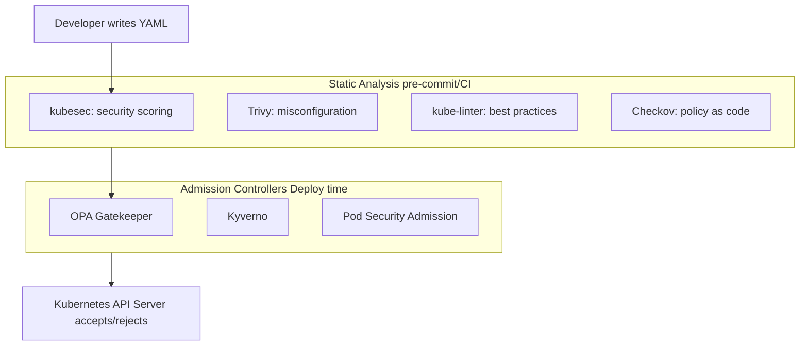
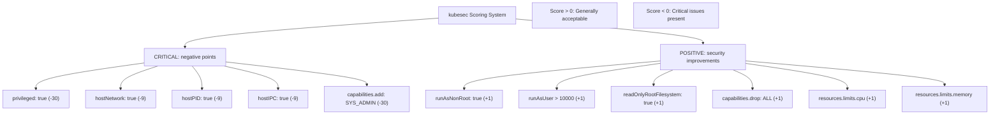
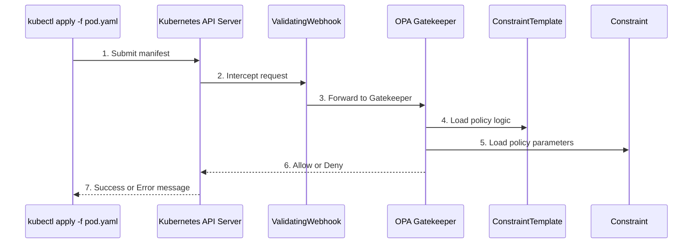

## What You'll Be Able to Do

After completing this extensive and in-depth module on static analysis and policy enforcement, you will be equipped to:

1. **Audit** Kubernetes manifests using the `kubesec` utility to identify critical security misconfigurations before they reach the cluster.
2. **Write** robust OPA Rego policies to evaluate and enforce custom organizational security rules during the admission phase.
3. **Deploy** OPA Gatekeeper ConstraintTemplates and Constraints for policy enforcement across multiple namespaces.
4. **Evaluate** the output of various static analysis tools, such as KubeLinter and Trivy, to prioritize security fixes systematically prior to deployment.
5. **Diagnose** rejected pod admissions by tracing Gatekeeper violations back to their originating Rego logic.
6. **Design** a comprehensive CI/CD pipeline stage that integrates multiple static analysis checks to establish a "shift-left" security paradigm.

## Why This Module Matters

The majority of real-world Kubernetes compromises can be traced back to a fundamental misconfiguration in a declarative manifest, often committed to a repository weeks or months before the actual breach. Attackers exploit these systemic over-privileges — such as containers running as root, unnecessary host-path mounts, exposed long-lived credentials in environment variables, and active default ServiceAccount tokens. The initial foothold in the [2018 Tesla cluster breach](/k8s/cks/part1-cluster-setup/module-1.5-gui-security/) <!-- incident-xref: tesla-2018-cryptojacking --> leveraged exactly this type of manifest-level oversight, allowing adversaries to access broad permissions that never should have been provisioned. Static analysis serves as the critical preemptive defense against these architectural errors. By scanning Infrastructure as Code (IaC) resources and YAML definitions directly in the CI/CD pipeline, static analysis tools catch severe security regressions long before the flawed manifest ever reaches a live production cluster.

Static analysis examines Kubernetes manifests before deployment, catching misconfigurations early. Tools like kubesec score security posture, while OPA Gatekeeper enforces policies at admission time. By identifying these flaws during the development phase, engineering teams can remediate vulnerabilities long before the code is merged into the main branch, let alone deployed. This "shift-left" approach drastically reduces the cost and complexity of security fixes. If a misconfiguration slips through the CI pipeline, admission controllers act as the final backstop. They evaluate every request made to the Kubernetes API server and possess the authority to reject any payload that violates organizational policy.

In the Certified Kubernetes Security Specialist (CKS) exam, you are expected to master both the proactive side (ad-hoc analysis using tools like kubesec) and the reactive side (strict policy enforcement using OPA Gatekeeper). You must be able to swiftly analyze manifests, identify why they pose a risk, and write the Rego policies necessary to prevent such risks from materializing in a live cluster. This module covers both ends of that spectrum in detail.

## Static Analysis Overview

To understand where static analysis fits into the deployment lifecycle, we must visualize the journey of a Kubernetes manifest from a developer's workstation to the API server. The pipeline typically involves multiple gates, each employing different tools with distinct areas of focus.



At the CI stage, tools parse the YAML files locally. They do not require a running Kubernetes cluster. They simply evaluate the text against known rulesets. If the YAML passes, it moves to the deployment phase, where tools like `kubectl` or ArgoCD attempt to apply it to the cluster. At this point, Admission Controllers take over, evaluating the live request against dynamic cluster state and policies.

> **Stop and think**: Image scanning finds CVEs in dependencies. Static analysis finds misconfigurations in your YAML. Which one catches a deployment with `privileged: true` and no security context? Which catches a vulnerable version of openssl? Why do you need both?

You need both because a perfectly secure, non-privileged pod can still run a vulnerable image that gets exploited, and a perfectly patched image can be deployed with full host privileges, allowing an attacker who finds a zero-day to escape the container.

## kubesec: Security Posture Scoring

`kubesec` is a specialized, open-source tool designed to quantify the security posture of Kubernetes resources. Unlike binary pass/fail linters, it assigns a numerical score to your manifests. This scoring system helps teams prioritize which fixes are most critical.

### Installation

You can run `kubesec` as a standalone binary, a Docker container, or even as a local HTTP server that accepts payloads. For CI environments, the binary is usually the fastest method.

```bash
# Download binary
wget https://github.com/controlplaneio/kubesec/releases/download/v2.13.0/kubesec_linux_amd64.tar.gz
tar -xzf kubesec_linux_amd64.tar.gz
sudo mv kubesec /usr/local/bin/

# Or use Docker
docker run -i kubesec/kubesec:v2 scan /dev/stdin < pod.yaml

# Or use online API
curl -sSX POST --data-binary @pod.yaml http://localhost:8080/scan
```
*(Note: Using a local container or endpoint avoids sending your proprietary manifests to external endpoints, which is a crucial consideration for corporate security policies.)*

### Basic Usage

Running the tool is straightforward. It accepts single files, multiple files, or standard input streams.

```bash
# Scan a file
kubesec scan pod.yaml

# Scan from stdin
cat pod.yaml | kubesec scan -

# Scan multiple files
kubesec scan deployment.yaml service.yaml
```

When you execute these commands, `kubesec` parses the YAML, identifies the Kubernetes resource kind, and applies its ruleset against the `spec`.

### Understanding kubesec Output

The output of `kubesec` is a highly structured JSON array. This makes it exceptionally easy to integrate into automated pipelines, such as Jenkins or GitHub Actions, where you might use tools like `jq` to parse the score and fail the build if it falls below a certain threshold.

```json
[
  {
    "object": "Pod/insecure-pod.default",
    "valid": true,
    "score": -30,
    "scoring": {
      "critical": [
        {
          "selector": "containers[] .securityContext .privileged == true",
          "reason": "Privileged containers can allow almost completely unrestricted host access",
          "points": -30
        }
      ],
      "advise": [
        {
          "selector": "containers[] .securityContext .runAsNonRoot == true",
          "reason": "Force the running image to run as a non-root user",
          "points": 1
        },
        {
          "selector": ".spec .serviceAccountName",
          "reason": "Service accounts restrict Kubernetes API access",
          "points": 3
        }
      ]
    }
  }
]
```

Notice the structure: it divides findings into categories like `critical` and `advise`. The `critical` section subtracts points, while the `advise` section suggests improvements that would add points.

### kubesec Scoring System

To effectively use `kubesec`, you must understand its weightings. Certain configurations are so dangerous that they single-handedly plunge the score into negative territory.



A positive score does not mean the application is invincible; it merely indicates that the manifest adheres to fundamental best practices. A negative score, however, is an immediate red flag.

- Negative score = critical issues

## kubesec Examples

Let's look at how these scores play out with real manifests.

### Insecure Pod

Here is a manifest that is frequently seen in quick-and-dirty development environments but should never reach production.

```yaml
# insecure-pod.yaml
apiVersion: v1
kind: Pod
metadata:
  name: insecure
spec:
  containers:
  - name: app
    image: nginx
    securityContext:
      privileged: true
```

When we scan this manifest, the result is devastating to the overall score.

```bash
kubesec scan insecure-pod.yaml
# Score: -30 (CRITICAL: privileged container)
```

The `privileged: true` flag tells the container runtime to lift almost all isolation barriers, effectively giving the container root access to the underlying worker node.

### Secure Pod

Conversely, here is a manifest crafted with defense-in-depth principles.

```yaml
# secure-pod.yaml
apiVersion: v1
kind: Pod
metadata:
  name: secure
spec:
  securityContext:
    runAsNonRoot: true
    runAsUser: 10001
  containers:
  - name: app
    image: nginx
    securityContext:
      allowPrivilegeEscalation: false
      readOnlyRootFilesystem: true
      capabilities:
        drop: ["ALL"]
    resources:
      limits:
        memory: "128Mi"
        cpu: "500m"
```

Scanning this manifest yields a vastly different result.

```bash
kubesec scan secure-pod.yaml
# Score: 7+ (multiple security best practices)
```

By dropping capabilities, setting a read-only root filesystem, and enforcing non-root execution, this pod ensures that even if the Nginx application is compromised, the attacker will find it incredibly difficult to pivot or escalate privileges.

## KubeLinter: Best Practices Validation

While `kubesec` is heavily focused on the security domain, other tools cast a wider net. KubeLinter is a static analysis tool that checks Kubernetes manifests against best practices and common misconfigurations. It's faster and more opinionated than kubesec, focusing comprehensively on deployment safety.

```bash
# Install
curl -sL https://github.com/stackrox/kube-linter/releases/latest/download/kube-linter-linux -o kube-linter
chmod +x kube-linter

# Lint a manifest
./kube-linter lint deployment.yaml

# Lint an entire directory
./kube-linter lint manifests/

# List all available checks
./kube-linter checks list
```

KubeLinter is particularly good at catching operational issues alongside security problems.

```bash
# Example output
deployment.yaml: (object: default/nginx apps/v1, Kind=Deployment)
  - container "nginx" does not have a read-only root file system
    (check: no-read-only-root-fs, remediation: Set readOnlyRootFilesystem to true)
  - container "nginx" has cpu limit 0 (check: unset-cpu-requirements)
  - container "nginx" is not set to runAsNonRoot (check: run-as-non-root)
```

Using both tools in tandem provides comprehensive coverage.

> **What would happen if**: You deploy OPA Gatekeeper with a constraint that requires all pods to have resource limits. Existing pods without limits continue running, but no new pods without limits can be created. A deployment scales up -- will the new replicas be created?

## OPA Gatekeeper

Open Policy Agent (OPA) Gatekeeper provides policy enforcement at admission time. While static analysis tools operate on flat YAML files, Gatekeeper operates inside the cluster, inspecting the live requests sent to the Kubernetes API.

**OPA Gatekeeper**:
- Evaluates policies written in Rego.
- Operates dynamically on incoming requests.
- Can audit existing cluster resources for compliance.

### Architecture

The integration between Kubernetes and Gatekeeper relies on the Admission Webhook mechanism.



- **Gatekeeper operates as a ValidatingAdmissionWebhook**, which means it can only allow or deny requests—it can't modify them. For mutation, use MutatingAdmissionWebhooks.

### Installing Gatekeeper

Setting up Gatekeeper involves applying its standard manifests, which create the necessary Custom Resource Definitions (CRDs), RBAC roles, and the controller pods themselves.

```bash
# Install using kubectl
kubectl apply -f https://raw.githubusercontent.com/open-policy-agent/gatekeeper/release-3.14/deploy/gatekeeper.yaml

# Verify installation
kubectl get pods -n gatekeeper-system
kubectl get crd | grep gatekeeper
```

It is vital to:
- Understand Gatekeeper CRDs (ConstraintTemplates and Constraints).

### Creating a Policy

Gatekeeper policies require two distinct objects: a `ConstraintTemplate` (the logic) and a `Constraint` (the application of that logic).

#### Step 1: ConstraintTemplate

The ConstraintTemplate embeds the Rego language code and defines a new CRD kind that will be used by the Constraint.

```yaml
apiVersion: templates.gatekeeper.sh/v1
kind: ConstraintTemplate
metadata:
  name: k8srequiredlabels
spec:
  crd:
    spec:
      names:
        kind: K8sRequiredLabels
      validation:
        openAPIV3Schema:
          type: object
          properties:
            labels:
              type: array
              items:
                type: string
  targets:
    - target: admission.k8s.gatekeeper.sh
      rego: |
        package k8srequiredlabels

        violation[{"msg": msg}] {
          provided := {label | input.review.object.metadata.labels[label]}
          required := {label | label := input.parameters.labels[_]}
          missing := required - provided
          count(missing) > 0
          msg := sprintf("Missing required labels: %v", [missing])
        }
```

#### Understanding Rego Syntax

To write custom policies, you need to understand how Gatekeeper evaluates Rego. Let's break down the `rego` block from the template above line-by-line:

- `package k8srequiredlabels`: The namespace for the logic.
- `violation[{"msg": msg}] {`: This is the entrypoint Gatekeeper looks for. If all statements inside the curly braces evaluate to `true`, a violation is generated.
- `input.review.object`: This critical object holds the payload of the request being evaluated.
- `provided := {label | input.review.object.metadata.labels[label]}`: Extracts the labels currently present.
- `required := {label | label := input.parameters.labels[_]}`: Extracts the parameters defined in the Constraint.
- `missing := required - provided`: Set math to find the difference.

#### Step 2: Constraint

Once the template is established, we create the Constraint to bind the logic to specific namespaces and resources.

```yaml
apiVersion: constraints.gatekeeper.sh/v1beta1
kind: K8sRequiredLabels
metadata:
  name: require-team-label
spec:
  match:
    kinds:
      - apiGroups: [""]
        kinds: ["Pod"]
    namespaces: ["production"]
  parameters:
    labels: ["team", "app"]
```

### Testing the Policy

With the policy active, we can observe the ValidatingAdmissionWebhook in action.

```bash
# This pod will be rejected
kubectl apply -f - <<EOF
apiVersion: v1
kind: Pod
metadata:
  name: unlabeled-pod
  namespace: production
spec:
  containers:
  - name: nginx
    image: nginx
EOF
# Error: Missing required labels: {"app", "team"}

# This pod will be allowed
kubectl apply -f - <<EOF
apiVersion: v1
kind: Pod
metadata:
  name: labeled-pod
  namespace: production
  labels:
    team: platform
    app: web
spec:
  containers:
  - name: nginx
    image: nginx
EOF
```

## Common Gatekeeper Policies

Below are standard policies you should be intimately familiar with for securing a cluster and for the CKS exam. To prevent multi-document YAML parsing errors during CI/CD, the ConstraintTemplate and the Constraint are separated.

### Block Privileged Containers

First, the template definition:

```yaml
apiVersion: templates.gatekeeper.sh/v1
kind: ConstraintTemplate
metadata:
  name: k8sblockprivileged
spec:
  crd:
    spec:
      names:
        kind: K8sBlockPrivileged
  targets:
    - target: admission.k8s.gatekeeper.sh
      rego: |
        package k8sblockprivileged

        violation[{"msg": msg}] {
          container := input.review.object.spec.containers[_]
          container.securityContext.privileged == true
          msg := sprintf("Privileged container not allowed: %v", [container.name])
        }
```

Then, the application of that template:

```yaml
apiVersion: constraints.gatekeeper.sh/v1beta1
kind: K8sBlockPrivileged
metadata:
  name: block-privileged-containers
spec:
  match:
    kinds:
      - apiGroups: [""]
        kinds: ["Pod"]
```

### Require Non-Root

```yaml
apiVersion: templates.gatekeeper.sh/v1
kind: ConstraintTemplate
metadata:
  name: k8srequirenonroot
spec:
  crd:
    spec:
      names:
        kind: K8sRequireNonRoot
  targets:
    - target: admission.k8s.gatekeeper.sh
      rego: |
        package k8srequirenonroot

        violation[{"msg": msg}] {
          container := input.review.object.spec.containers[_]
          not container.securityContext.runAsNonRoot
          msg := sprintf("Container must set runAsNonRoot: %v", [container.name])
        }
```

### Block :latest Tag

```yaml
apiVersion: templates.gatekeeper.sh/v1
kind: ConstraintTemplate
metadata:
  name: k8sblocklatesttag
spec:
  crd:
    spec:
      names:
        kind: K8sBlockLatestTag
  targets:
    - target: admission.k8s.gatekeeper.sh
      rego: |
        package k8sblocklatesttag

        violation[{"msg": msg}] {
          container := input.review.object.spec.containers[_]
          endswith(container.image, ":latest")
          msg := sprintf("Image with :latest tag not allowed: %v", [container.image])
        }

        violation[{"msg": msg}] {
          container := input.review.object.spec.containers[_]
          not contains(container.image, ":")
          msg := sprintf("Image without tag (defaults to :latest) not allowed: %v", [container.image])
        }
```

> **Pause and predict**: You scan a pod manifest with kubesec and get a score of +7. Your colleague scans a nearly identical manifest that adds `privileged: true` and gets -23. The score dropped by 30 points from a single field. Why does kubesec weight this so heavily?

The `privileged` flag effectively disables the cgroup and namespace isolation that makes a container a container. It gives the process inside the container the same direct access to host hardware and kernel resources as a process running directly on the node. A single compromised application with this flag leads to immediate node takeover.

## Real Exam Scenarios

In a practical or exam environment, you will be expected to synthesize these tools.

### Scenario 1: Scan Pod with kubesec

```bash
# Create test pod
cat <<EOF > test-pod.yaml
apiVersion: v1
kind: Pod
metadata:
  name: web
spec:
  containers:
  - name: nginx
    image: nginx
    securityContext:
      privileged: true
EOF

# Scan with kubesec
kubesec scan test-pod.yaml

# Fix the pod based on kubesec recommendations
cat <<EOF > test-pod-fixed.yaml
apiVersion: v1
kind: Pod
metadata:
  name: web
spec:
  securityContext:
    runAsNonRoot: true
    runAsUser: 10001
  containers:
  - name: nginx
    image: nginx
    securityContext:
      allowPrivilegeEscalation: false
      readOnlyRootFilesystem: true
      capabilities:
        drop: ["ALL"]
    resources:
      limits:
        memory: "128Mi"
        cpu: "500m"
EOF

kubesec scan test-pod-fixed.yaml
# Score should be positive now
```

### Scenario 2: Create Gatekeeper Policy

Here we define a requirement for resource limits, which prevents noisy-neighbor problems and potential Denial of Service (DoS) conditions on the node.

```bash
# Create ConstraintTemplate
cat <<EOF | kubectl apply -f -
apiVersion: templates.gatekeeper.sh/v1
kind: ConstraintTemplate
metadata:
  name: k8srequirelimits
spec:
  crd:
    spec:
      names:
        kind: K8sRequireLimits
  targets:
    - target: admission.k8s.gatekeeper.sh
      rego: |
        package k8srequirelimits

        violation[{"msg": msg}] {
          container := input.review.object.spec.containers[_]
          not container.resources.limits.memory
          msg := sprintf("Container must have memory limits: %v", [container.name])
        }

        violation[{"msg": msg}] {
          container := input.review.object.spec.containers[_]
          not container.resources.limits.cpu
          msg := sprintf("Container must have CPU limits: %v", [container.name])
        }
EOF

# Create Constraint
cat <<EOF | kubectl apply -f -
apiVersion: constraints.gatekeeper.sh/v1beta1
kind: K8sRequireLimits
metadata:
  name: require-resource-limits
spec:
  match:
    kinds:
      - apiGroups: [""]
        kinds: ["Pod"]
    namespaces: ["production"]
EOF

# Test - this should fail
kubectl run test --image=nginx -n production
# Error: Container must have memory limits

# Test - this should succeed
kubectl run test --image=nginx -n production \
  --limits='memory=128Mi,cpu=500m'
```

### Scenario 3: Audit Existing Violations

Gatekeeper does not actively terminate running pods that violate new policies. Instead, it relies on its audit functionality.
- **Gatekeeper supports audit mode**, which reports violations without blocking them. Great for rolling out new policies.

```bash
# Check constraint status for violations
kubectl get k8srequiredlabels require-team-label -o yaml

# Look at the status.violations section
kubectl get constraints -A -o json | \
  jq '.items[] | {name: .metadata.name, violations: .status.totalViolations}'
```

By querying the constraints and extracting `.status.totalViolations`, administrators can generate reports of non-compliant resources and systematically remediate them.

## Did You Know?

- **kubesec was created by Control Plane** (formerly Aqua) and analyzes over 40 distinct security contexts.
- **OPA uses Rego**, a purpose-built policy language created in 2016 for expressing complex access control rules.
- **Kubernetes 1.25** completely removed PodSecurityPolicies (PSP), making tools like OPA Gatekeeper the definitive standard.
- **Gatekeeper processes millions of requests** in large enterprise clusters daily; a poorly written Rego policy can add over 500 milliseconds of latency.

## Common Mistakes

| Mistake | Why It Hurts | Solution |
|---------|--------------|----------|
| Ignoring kubesec warnings | Deployments have known issues | Address critical findings |
| Complex Rego policies | Hard to debug and maintain | Start simple, test thoroughly |
| No exemptions | System pods blocked | Use match.excludedNamespaces |
| Audit mode forgotten | Violations not enforced | Change to enforce after testing |
| Missing error messages | Users confused | Include clear violation messages |
| Forgetting API groups | Constraint ignores resources | Specify `apiGroups: [""]` for core objects |
| Testing in production | Outages during deployment | Use `enforcementAction: dryrun` initially |
| Hardcoding parameters | Duplication of templates | Use `input.parameters` to make templates reusable |

## Quiz

1. **A developer submits a deployment manifest for review. You scan it with kubesec and get a score of -30. Without seeing the manifest, what configuration is almost certainly present, and what does the score tell you about deployment readiness?**
   <details>
   <summary>Answer</summary>
   A score of -30 almost certainly means `privileged: true` is set (it carries a -30 penalty alone). Other possibilities include `hostNetwork: true` or `hostPID: true` combined with other issues. The score tells you this manifest has critical security misconfigurations that enable container escape and full host access -- it should never be deployed to production. kubesec scores: positive means reasonable security posture, zero means minimal controls, negative means critical issues. A -30 is the worst category and indicates the deployment needs fundamental security redesign before proceeding.
   </details>

2. **Your organization uses OPA Gatekeeper to enforce that all pods must have resource limits. A deployment with 5 replicas is running without limits (created before the policy). The deployment scales to 10 replicas. What happens to the 5 new pods?**
   <details>
   <summary>Answer</summary>
   The 5 new pods are blocked by Gatekeeper. Admission controllers only validate new requests -- they don't retroactively enforce on existing resources. The existing 5 pods continue running without limits, but any new pod creation (including scale-up, rolling updates, or pod restarts) is blocked until the deployment spec includes resource limits. This is why Gatekeeper's audit feature is important: it identifies existing resources that violate policies. Use `enforcementAction: dryrun` during rollout to identify all violations before switching to `deny` enforcement.
   </details>

3. **During a CKS exam, you need to create a Gatekeeper policy that blocks images from untrusted registries. You write the ConstraintTemplate in Rego and apply it, but the Constraint you create doesn't seem to block anything. `kubectl get constraints` shows the constraint exists. What's the most common reason it's not working?**
   <details>
   <summary>Answer</summary>
   The most common issues: (1) The Constraint's `match` field doesn't select the right resources -- check that `kinds` includes `Pod` (with the `""` API group) and optionally `Deployment`, `StatefulSet`, etc. (2) The namespace where you're testing is excluded in the Constraint's `excludedNamespaces`. (3) The ConstraintTemplate has a Rego syntax error -- check `kubectl get constrainttemplate <name> -o yaml` for status errors. (4) The Constraint's `parameters` don't match what the Rego code expects. (5) Gatekeeper pods aren't running -- check `kubectl get pods -n gatekeeper-system`. Debug by creating a pod that should be blocked and checking `kubectl describe` for admission rejection messages.
   </details>

4. **Your team runs kubesec in CI/CD and blocks deployments with score below 0. A developer argues this is too strict because some legitimate workloads need `NET_ADMIN` capability (for a service mesh sidecar), which lowers the score. How do you balance security policy with legitimate needs?**
   <details>
   <summary>Answer</summary>
   Use a tiered approach: (1) Block score below -10 (critical issues like `privileged`) unconditionally -- no exceptions. (2) For scores between -10 and 0, require a security review and documented exception. (3) Use kubesec's JSON output to check specific critical findings rather than just the aggregate score. (4) Create namespace-specific policies: service mesh namespaces can have different kubesec thresholds than application namespaces. (5) Combine kubesec with Gatekeeper for more granular control -- Gatekeeper can enforce "NET_ADMIN only if the pod has a specific label" rather than a blanket score threshold. The goal is blocking truly dangerous configs while allowing justified exceptions with audit trails.
   </details>

5. **You are creating a new Gatekeeper ConstraintTemplate. Which field in the Rego code is responsible for reading the incoming YAML manifest that the user is attempting to apply?**
   <details>
   <summary>Answer</summary>
   The `input.review.object` field is responsible for this. When the Kubernetes API server sends the AdmissionReview request to the Gatekeeper webhook, the payload containing the manifest is placed inside this object structure. Your Rego code traverses this object (e.g., `input.review.object.metadata.labels`) to evaluate the fields.
   </details>

6. **A junior administrator creates a Gatekeeper policy that modifies incoming pod manifests to automatically add a default `app` label if it is missing. After applying it, the label is never added. Why does this fail?**
   <details>
   <summary>Answer</summary>
   Because Gatekeeper is implemented primarily as a ValidatingAdmissionWebhook. Validating webhooks can only return an "allow" or "deny" decision; they cannot alter the payload. To modify a manifest on the fly (such as injecting a label), you must use a MutatingAdmissionWebhook instead. While advanced configurations of Gatekeeper can perform mutation via specific CRDs, the standard Constraint framework is strictly validating.
   </details>

7. **You want to evaluate how many existing pods in the `legacy` namespace violate a newly proposed policy, but you cannot risk breaking any live applications. How should you deploy the Constraint?**
   <details>
   <summary>Answer</summary>
   You should set the `enforcementAction: dryrun` (or `warn` in newer versions) in the `spec` of the Constraint. This allows the webhook to evaluate the policy against incoming requests and existing resources (via the audit loop) and record the violations in the Constraint's `status.violations` field, all without actually denying the API requests.
   </details>

8. **If `kubesec` can statically analyze a YAML file and catch `privileged: true`, why bother deploying an OPA Gatekeeper policy to block `privileged: true` in the live cluster?**
   <details>
   <summary>Answer</summary>
   Defense in depth. Static analysis relies on the CI/CD pipeline being the only path to deployment. If an administrator manually runs `kubectl apply` from their laptop, bypassing the CI pipeline entirely, the static analysis check is circumvented. Gatekeeper acts as the final, unavoidable gate at the cluster level, ensuring the policy is enforced regardless of the deployment method.
   </details>

## Hands-On Exercise

**Task**: Use kubesec and create a Gatekeeper policy.

This exercise walks you through both ad-hoc scanning and cluster-level policy enforcement. Note that we use a local endpoint for `kubesec` to simulate a self-hosted CI/CD environment.

```bash
# Part 1: kubesec Analysis

# Create insecure pod
cat <<EOF > insecure.yaml
apiVersion: v1
kind: Pod
metadata:
  name: insecure
spec:
  containers:
  - name: app
    image: nginx
    securityContext:
      privileged: true
EOF

# Scan with kubesec (using API if not installed locally)
echo "=== kubesec Scan (Insecure) ==="
curl -sSX POST --data-binary @insecure.yaml http://localhost:8080/scan | jq '.[0].score'

# Create secure version
cat <<EOF > secure.yaml
apiVersion: v1
kind: Pod
metadata:
  name: secure
spec:
  securityContext:
    runAsNonRoot: true
    runAsUser: 10001
  containers:
  - name: app
    image: nginx
    securityContext:
      allowPrivilegeEscalation: false
      readOnlyRootFilesystem: true
      capabilities:
        drop: ["ALL"]
    resources:
      limits:
        memory: "128Mi"
        cpu: "500m"
EOF

echo "=== kubesec Scan (Secure) ==="
curl -sSX POST --data-binary @secure.yaml http://localhost:8080/scan | jq '.[0].score'

# Part 2: Gatekeeper Policy (if Gatekeeper is installed)

# Check if Gatekeeper is installed
if kubectl get crd constrainttemplates.templates.gatekeeper.sh &>/dev/null; then
  echo "=== Creating Gatekeeper Policy ==="

  # Create ConstraintTemplate
  cat <<EOF | kubectl apply -f -
apiVersion: templates.gatekeeper.sh/v1
kind: ConstraintTemplate
metadata:
  name: k8sblockdefaultnamespace
spec:
  crd:
    spec:
      names:
        kind: K8sBlockDefaultNamespace
  targets:
    - target: admission.k8s.gatekeeper.sh
      rego: |
        package k8sblockdefaultnamespace
        violation[{"msg": msg}] {
          input.review.object.metadata.namespace == "default"
          msg := "Deployments to default namespace are not allowed"
        }
EOF

  # Create Constraint in dryrun mode
  cat <<EOF | kubectl apply -f -
apiVersion: constraints.gatekeeper.sh/v1beta1
kind: K8sBlockDefaultNamespace
metadata:
  name: block-default-namespace
spec:
  enforcementAction: dryrun
  match:
    kinds:
      - apiGroups: [""]
        kinds: ["Pod"]
EOF

  echo "Policy created in dryrun mode"
else
  echo "Gatekeeper not installed, skipping policy creation"
fi

# Cleanup
rm -f insecure.yaml secure.yaml
```

**Success criteria**: Understand kubesec scoring and Gatekeeper policy structure.
- [ ] You successfully scanned a manifest locally and observed a negative score for critical issues.
- [ ] You deployed a ConstraintTemplate defining the policy logic in Rego.
- [ ] You deployed a Constraint to apply the logic using `enforcementAction: dryrun`.
- [ ] You verified the Constraint creation using `kubectl get constraints`.

## Summary

**kubesec**:
- Operates primarily in the CI/CD pipeline or locally.
- Security scoring tool that assigns negative points for severe misconfigurations.
- Highly automatable due to structured JSON outputs.

**OPA Gatekeeper**:
- Admission controller for policies operating dynamically at the cluster edge.
- Relies on the coupling of a ConstraintTemplate (the logic) and a Constraint (the binding).
- Utilizes the Rego policy language to evaluate the `input.review.object`.
- Supports critical operational states, like dryrun/audit modes.

**Best Practices**:
- Employ a tiered strategy: static analysis catches errors fast and cheaply, while admission controllers act as an immutable final barrier.
- 3. **Deploy** OPA Gatekeeper ConstraintTemplates and Constraints for policy enforcement universally across all sensitive namespaces.
- Thoroughly test all Rego logic outside the cluster before deploying.

## Next Module

[Module 5.4: Admission Controllers](../module-5.4-admission-controllers/) - Custom admission control for security. Explore how to build and integrate custom webhooks beyond OPA Gatekeeper to deeply integrate your organization's unique operational logic.