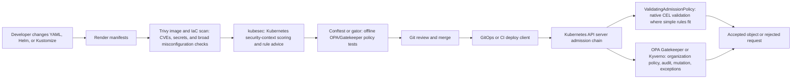

## What You'll Be Able to Do

After completing this module, you will be able to:

1. **Scan** Kubernetes manifests with `kubesec`, interpret positive and negative scoring, and turn rule-level output into practical remediation work.
2. **Write** small Rego policies for OPA Gatekeeper, package them as `ConstraintTemplate` resources, and bind them to workloads with `Constraint` resources.
3. **Compare** kubesec, Conftest, Gatekeeper, Kyverno, and ValidatingAdmissionPolicy so each control sits at the right stage of the delivery path.
4. **Design** a CI/CD policy gate that combines image vulnerability scanning, manifest scoring, offline policy tests, and cluster-side admission enforcement.
5. **Operate** policy rollout safely by using dry-run, warning, audit, mutation, failure-policy, and emergency-recovery patterns without accidentally disabling the guardrail.

## Why This Module Matters

Most Kubernetes security failures do not begin with an exotic exploit. They begin with an ordinary manifest that grants more authority than the workload needs, leaves a default open, or assumes that the deployment path is more controlled than it really is. A container that runs as root, adds `SYS_ADMIN`, mounts the Docker socket, uses the host network, or pulls an unpinned image can sit in Git for months before anyone notices. By the time the object reaches the API server, the insecure choice has often been copied into Helm values, Kustomize overlays, runbooks, dashboards, and incident response muscle memory.

Static analysis gives you a cheap place to catch those choices while they are still text. A local scanner can reject a pull request before the manifest becomes a live API object, which means the fix is a small YAML change rather than an emergency rollout. The tradeoff is that static analysis sees only the input files it is given. It cannot prove that every deployment path runs the scanner, it cannot see last-minute `kubectl patch` commands from an administrator, and it cannot enforce a rule against a controller that creates Pods from an API object the scanner never reviewed.

Admission control fills that gap by moving policy enforcement to the Kubernetes API boundary. OPA Gatekeeper, Kyverno, ValidatingAdmissionPolicy, Pod Security Admission, and custom webhooks all evaluate requests as the API server receives them. This position is powerful because every normal Kubernetes write path goes through admission, including GitOps controllers, CI deploy jobs, human `kubectl` sessions, operators, and higher-level controllers that create workload objects. It is also risky because a bad admission policy can block legitimate changes or turn a policy outage into a control-plane availability problem.

The CKS exam expects both sides of that reasoning. You need to scan a YAML file quickly with a tool such as kubesec, recognize why a negative score matters, and know which fields to change under pressure. You also need to understand how Rego-backed Gatekeeper policy is packaged, how a dry-run rollout differs from an enforcing rollout, and why policy engines are not interchangeable. A good answer is not "install OPA" or "run a scanner"; it is a layered design where each tool catches the failure mode it is actually positioned to catch.

The [2018 Tesla cluster breach](/k8s/cks/part1-cluster-setup/module-1.5-gui-security/) <!-- incident-xref: tesla-2018-cryptojacking --> remains a useful cross-reference because it shows how a Kubernetes mistake becomes an infrastructure compromise when metadata, credentials, and workload privileges align poorly. This module does not retell that incident. The lesson here is narrower: manifest review and admission policy should make dangerous privilege combinations hard to merge, hard to deploy, and visible when an exception is granted.

## Pipeline Placement: Static Analysis vs Admission Control

Security tools become easier to reason about when you draw the delivery path as a sequence of gates rather than a pile of scanners. The left side of the path runs before the cluster sees the manifest. That side is fast, cheap, and developer-friendly, so it should catch obvious problems such as privileged containers, missing `runAsNonRoot`, missing resource limits, untrusted image registries, and known vulnerable images. The right side of the path runs inside or at the edge of the cluster. That side is authoritative because it protects the API server no matter which client submits the request.


```mermaid
flowchart LR
    A[Developer changes YAML, Helm, or Kustomize] --> B[Render manifests]
    B --> C[Trivy image and IaC scan: CVEs, secrets, and broad misconfiguration checks]
    C --> D[kubesec: Kubernetes security-context scoring and rule advice]
    D --> E[Conftest or gator: offline OPA/Gatekeeper policy tests]
    E --> F[Git review and merge]
    F --> G[GitOps or CI deploy client]
    G --> H[Kubernetes API server admission chain]
    H --> I[ValidatingAdmissionPolicy: native CEL validation where simple rules fit]
    H --> J[OPA Gatekeeper or Kyverno: organization policy, audit, mutation, exceptions]
    I --> K[Accepted object or rejected request]
    J --> K
```

Trivy is useful near the start because it can scan container images for known vulnerabilities and scan Infrastructure-as-Code files for misconfigurations. kubesec is narrower and more Kubernetes-specific: it scores Pod-like resources according to security-context and workload hardening rules, which makes it excellent for a quick CKS-style manifest review. Conftest and `gator` are policy tests rather than general scanners. They let you run the same kind of logic your organization cares about before a merge, including rules that a generic scanner cannot know, such as "only the `payments` namespace may use this registry" or "every production Deployment must carry an owner label."

Admission tools should not be used as a substitute for CI checks. If a developer waits until Gatekeeper rejects a request, the feedback arrives after the merge, after the deploy job starts, and often after the rollout clock is already ticking. Conversely, CI checks should not be treated as a substitute for admission. A cluster with no admission backstop trusts every deployment path to be honest and complete, which is rarely true after emergency access, one-off maintenance scripts, operators, and multiple GitOps controllers enter the system.

The practical design is layered: image and filesystem scanning answer "is this artifact known to be vulnerable," kubesec answers "does this Kubernetes workload request dangerous privileges," offline OPA tests answer "does this manifest violate our custom policy," and admission control answers "should the API server accept this request right now." Each gate should emit a result that the next human or automation step can understand. A single red/green build with no rule-level explanation is not enough when the fix might be a missing label, a dangerous capability, a registry exception, or a webhook outage.

## kubesec: Scoring Kubernetes YAML Before Deploy

`kubesec` is a rule-based security risk analyzer for Kubernetes resources. It accepts YAML or JSON, validates Kubernetes object shape, applies a fixed set of selectors, and returns a JSON array with a score and rule-level findings. The important mental model is that kubesec is not a general-purpose policy engine. It is a focused scanner that rewards hardening fields and penalizes dangerous fields, which makes it especially useful for quick review of Pods, Deployments, StatefulSets, and DaemonSets where the dangerous choices live under a Pod template.

```bash
kubesec scan deployment.yaml
cat deployment.yaml | kubesec scan -
kubesec scan --kubernetes-version 1.35 deployment.yaml
kubesec scan --format json --output kubesec-results.json deployment.yaml
kubesec print-rules --format table
```

The current CLI exposes `scan`, `http`, `print-rules`, `version`, and shell-completion commands. The `scan` subcommand accepts a file path, `-` for standard input, or `/dev/stdin`, and its help output documents flags for output format, output location, exit code on failure, Kubernetes version, absolute file paths, schema location, and templated output. The `print-rules` subcommand is a useful study tool because it prints the selectors and point values instead of making you infer them from one scan result at a time.

kubesec scoring is intentionally asymmetrical. A manifest can collect a handful of positive points for setting `runAsNonRoot`, `readOnlyRootFilesystem`, resource limits, dropped capabilities, and other hardening fields, but one critical field can overwhelm those gains. In the current rule set, `privileged: true` and adding `SYS_ADMIN` each carry a negative thirty-point penalty, while `hostNetwork`, `hostPID`, and `hostIPC` each carry smaller but still serious negative scores. That shape is deliberate: a workload with several good defaults can still be unacceptable if one field lets the container reach host-level power.

```yaml
apiVersion: v1
kind: Pod
metadata:
  name: insecure-web
spec:
  containers:
    - name: web
      image: nginx:1.27
      securityContext:
        privileged: true
```

```bash
kubesec scan insecure-web.yaml | jq '.[0] | {object, valid, score, critical: .scoring.critical}'
```

The expected review is not "the score is bad" but "the workload asks for privileged container execution, which bypasses most of the isolation the Pod Security Standards expect ordinary application workloads to preserve." A high-value remediation would remove `privileged`, add `allowPrivilegeEscalation: false`, drop capabilities, set non-root execution, and make the root filesystem read-only if the application can tolerate it. A lower-value remediation would add a label or resource limit while leaving the privileged field untouched, because the highest-impact risk would still be present.

```yaml
apiVersion: v1
kind: Pod
metadata:
  name: hardened-web
spec:
  securityContext:
    runAsNonRoot: true
    runAsUser: 10001
    seccompProfile:
      type: RuntimeDefault
  containers:
    - name: web
      image: nginx:1.27
      securityContext:
        allowPrivilegeEscalation: false
        readOnlyRootFilesystem: true
        capabilities:
          drop: ["ALL"]
      resources:
        requests:
          cpu: 100m
          memory: 128Mi
        limits:
          cpu: 500m
          memory: 256Mi
```

The secure example is not universally deployable because real applications may need writable paths, extra Linux capabilities, or a non-default UID that exists in the image. That is why kubesec should be treated as a review aid rather than an oracle. The score tells you which fields deserve immediate attention, and the finding messages tell you why. The final decision still belongs to a policy owner who knows whether the workload is an ordinary web service, a privileged node agent, a service-mesh component, or a legacy application that needs a carefully documented exception.

kubesec can also run as a local HTTP server, but the hosted public API should be avoided for proprietary manifests. Kubernetes YAML often reveals image names, internal service names, namespaces, labels, cloud account structure, environment variable names, and sometimes literal secrets. If a pipeline uses the HTTP mode, run the server inside the trusted CI environment and post to `127.0.0.1` or an internal service. The same privacy rule applies to every external scanner: do not upload sensitive manifests to a service unless your organization has approved that data boundary.

```bash
kubesec http 127.0.0.1:8080
curl -sS -X POST --data-binary @deployment.yaml http://127.0.0.1:8080/scan
```

For GitHub Actions, the maintained kubesec action wraps the scanner and accepts inputs such as `input`, `format`, `template`, `output`, and `exit-code`. The simplest workflow scans one file and fails on the action's configured exit behavior. A more production-ready workflow renders Helm or Kustomize first, scans the rendered output, writes JSON or SARIF to an artifact, and uploads the result to code scanning only after the organization has decided how exception handling and sensitive metadata should work.

```yaml
name: kubesec
on:
  pull_request:
jobs:
  scan:
    runs-on: ubuntu-24.04
    steps:
      - uses: actions/checkout@v4
      - name: Render manifests
        run: kubectl kustomize deploy/overlays/prod > rendered.yaml
      - name: Run kubesec
        uses: controlplaneio/kubesec-action@master
        with:
          input: rendered.yaml
          format: json
          output: kubesec-results.json
```

The main limitation is that kubesec does not know your cluster's current state, RBAC relationships, exception process, or business policy. It can warn that a Pod has `hostNetwork: true`, but it cannot know whether the namespace is reserved for a CNI daemon that legitimately needs host networking. It can reward a read-only root filesystem, but it cannot know whether the image writes cache files under `/tmp` unless you test the workload. Treat kubesec as a fast first pass that catches dangerous defaults and forces reviewers to explain exceptions in writing.

Read kubesec output from the highest-risk finding down, not from the total score up. The total score is useful for an automated threshold, but the rule list tells you which field is doing the damage. A score of negative thirty caused by `privileged: true` deserves a different conversation from a score near zero caused by several missing positive controls. The first case is likely a hard rejection for ordinary applications. The second case may be a backlog item, a policy warning, or a request for the application team to prove why a hardening field is not compatible.

Automated thresholds should therefore be tiered rather than naive. A platform team might block any manifest with critical findings, require review for small negative scores, and warn on missing positive controls while teams migrate. That is more useful than declaring "score must be greater than zero" without understanding which rule failed. It also makes exceptions reviewable. An exception for a node-level agent that needs host networking should name the controller, namespace, ServiceAccount, image, owner, expiration date, and compensating controls. An exception that says only "kubesec failed" is not an exception; it is a bypass.

The rendered-manifest boundary is another common source of false confidence. If a Helm chart sets `securityContext` values from `values.yaml`, scanning only the chart template tells you less than scanning the output for the production values file. If Kustomize overlays add a sidecar, scanning only the base misses the sidecar. If a GitOps controller applies post-render patches, scan the post-rendered object. The closer the scanned file is to the object sent to the API server, the more meaningful the score becomes.

## OPA Gatekeeper: Rego-backed Admission Policy

OPA Gatekeeper brings Open Policy Agent into Kubernetes admission control. The Kubernetes API server sends an AdmissionReview to Gatekeeper's validating webhook, Gatekeeper evaluates the object against matching constraints, and the webhook response tells the API server whether to allow or reject the request. This placement means Gatekeeper protects the cluster even when a deploy path bypasses CI, but it also means Gatekeeper policies must be written, tested, and rolled out with the same care as any other control-plane dependency.

Gatekeeper separates reusable logic from concrete policy configuration. A `ConstraintTemplate` defines a new constraint kind, its parameter schema, and the Rego code that emits violations. A `Constraint` is an instance of that kind, with match rules and parameters. This split is similar to defining a function and then calling it with arguments: the template says how to check for missing labels, while the constraint says which resources need which labels in which namespaces.

```yaml
apiVersion: templates.gatekeeper.sh/v1
kind: ConstraintTemplate
metadata:
  name: k8srequiredlabels
spec:
  crd:
    spec:
      names:
        kind: K8sRequiredLabels
      validation:
        openAPIV3Schema:
          type: object
          properties:
            labels:
              type: array
              items:
                type: string
  targets:
    - target: admission.k8s.gatekeeper.sh
      rego: |
        package k8srequiredlabels

        violation[{"msg": msg, "details": {"missing_labels": missing}}] {
          provided := {label | input.review.object.metadata.labels[label]}
          required := {label | label := input.parameters.labels[_]}
          missing := required - provided
          count(missing) > 0
          msg := sprintf("missing required labels: %v", [missing])
        }
```

The Rego in this example is small, but it shows the pieces you must recognize in the exam. `package` names the policy namespace. `violation[...]` defines an output document that Gatekeeper treats as a rejected or reported finding. `input.review.object` is the Kubernetes object under review. `input.parameters` comes from the matching constraint, not from the submitted manifest. The expression `missing := required - provided` uses set difference, which is one reason Rego is compact for policy checks that compare desired and observed fields.

```yaml
apiVersion: constraints.gatekeeper.sh/v1beta1
kind: K8sRequiredLabels
metadata:
  name: require-production-labels
spec:
  enforcementAction: dryrun
  match:
    kinds:
      - apiGroups: ["apps"]
        kinds: ["Deployment"]
    namespaces: ["production"]
  parameters:
    labels: ["app.kubernetes.io/name", "owner"]
```

The `match` block is where many broken policies hide. A core `Pod` uses API group `""`, but a Deployment uses API group `"apps"`, and a policy that matches only Pods will not reject a Deployment template unless another mechanism expands or checks workload resources. Namespaces, excluded namespaces, namespace selectors, label selectors, scope, and name matching can all narrow the policy. Narrowing is good when it is deliberate. It is dangerous when the author tests in one namespace and accidentally excludes the namespace that matters.

Gatekeeper's `enforcementAction` is also easy to misread. The default behavior is denial for admission violations, but `dryrun` records violations without rejecting the request and `warn` can return user-facing warnings. The audit loop periodically evaluates existing resources against constraints and records violations in constraint status, metrics, and audit logs. That makes dry-run rollout practical: apply the policy, let audit show what already violates it, fix the backlog, and then switch the constraint to denial only when the blast radius is understood.

Modern Gatekeeper versions also support Rego v1 syntax through the `targets[].code[]` form, and Gatekeeper documentation notes that legacy `targets[].rego` takes precedence if both styles are present. For exam and troubleshooting purposes, you should be able to read the common `targets[].rego` examples because many clusters and public policy libraries still show that form. For production policy authorship, choose one style per template and document the Gatekeeper version, otherwise two engines in one template can confuse reviewers about which logic actually runs.

The Gatekeeper library is the fastest way to study production-shaped policies without inventing every template yourself. It contains templates, sample constraints, allowed examples, and disallowed examples for common controls such as required labels, allowed repositories, host filesystem restrictions, privilege controls, and Pod Security Standard-like checks. The useful habit is to read both the template and the samples. The template teaches the Rego pattern, while the sample constraints teach how a platform team exposes policy knobs safely.

Rego policy review should focus on input shape, absence handling, and message quality. Kubernetes objects often omit fields rather than setting them to false, so a rule that checks only `field == true` may miss the unsafe case where the field is absent and the runtime default is permissive. Rego also fails closed or open depending on how the rule is written: an undefined reference can make one expression false, which may prevent a violation from being emitted. Good Gatekeeper templates check missing and explicit-bad states, and the message should name the exact container, field, and expected value so the rejected user can fix the manifest without reading the policy source.

Parameter schemas deserve the same review as Rego. Gatekeeper `v1` ConstraintTemplates require structural schemas, including `type` declarations, so the Kubernetes API server can reject malformed constraints instead of letting Gatekeeper receive unusable parameters. That is a security improvement because a misspelled or wrongly shaped parameter can turn an enforcing policy into a policy that never matches the intended condition. When a template accepts lists such as allowed repositories, required labels, or exempt images, test an empty list, a malformed list, and a realistic list before approving the template.

## Gatekeeper Mutation, Audit, and Failure Modes

Gatekeeper began as a validation tool, but current Gatekeeper also has mutation CRDs for controlled changes at admission time. `AssignMetadata` changes labels or annotations, `Assign` changes fields outside metadata, `ModifySet` adds or removes list entries, and `AssignImage` changes parts of an image string. Mutation should be used sparingly because it can hide the difference between the manifest in Git and the object admitted to the cluster, but it is valuable for safe defaults such as adding an owner annotation, setting an image pull policy, or filling a missing security-context value.

```yaml
apiVersion: mutations.gatekeeper.sh/v1
kind: Assign
metadata:
  name: default-readonly-rootfs
spec:
  applyTo:
    - groups: [""]
      kinds: ["Pod"]
      versions: ["v1"]
  match:
    scope: Namespaced
    kinds:
      - apiGroups: ["*"]
        kinds: ["Pod"]
    namespaces: ["sandbox"]
  location: "spec.containers[name:*].securityContext.readOnlyRootFilesystem"
  parameters:
    pathTests:
      - subPath: "spec.containers[name:*].securityContext.readOnlyRootFilesystem"
        condition: MustNotExist
    assign:
      value: true
```

The key fields are `applyTo`, `match`, `location`, and `parameters.assign`. `applyTo` tells Gatekeeper the schema of the resources being mutated, which helps it reason about non-convergent mutations. `location` points at the field to change, and path tests keep the mutator from overwriting an explicit value or creating a parent structure by accident. If validation and mutation are both present, write the validation rule so it agrees with the mutation result; otherwise one webhook defaulting a field and another webhook rejecting the same field can create confusing rollout failures.

Audit is separate from admission. Admission evaluates a request as it arrives and can block that request. Audit periodically evaluates resources that already exist and reports violations. This distinction matters during rollout because existing Pods are not terminated just because a new constraint appears. A Deployment that already runs without resource limits may continue until a restart, scale-up, or rollout creates new Pods. Audit tells you what is already out of compliance so you can fix the workload before enforcement breaks the next controller action.

```bash
kubectl get constraints
kubectl get k8srequiredlabels require-production-labels -o yaml
kubectl get constraints -o json | jq '.items[] | {name: .metadata.name, violations: .status.totalViolations}'
```

Gatekeeper's failure modes are part of the security design, not an afterthought. The documented default is fail-open for webhook errors through `failurePolicy: Ignore`, which means constraints are not enforced when the webhook is down or unreachable. Setting the Gatekeeper `ValidatingWebhookConfiguration` to `failurePolicy: Fail` closes that bypass but introduces an availability dependency: if the webhook cannot answer, matching API requests fail. A production platform must choose deliberately, monitor the webhook, and keep an emergency recovery path for a bad policy or webhook outage.

The emergency recovery command is intentionally blunt because it removes Gatekeeper admission checks by deleting the validating webhook configuration. That can be the right move when the cluster cannot operate, but it also creates the exact gap an attacker or rushed operator could exploit. Treat this as a break-glass action with audit, notification, and a re-enable checklist. In a GitOps-managed cluster, make sure the operator or reconciler behavior is understood; otherwise the webhook may be recreated before the team finishes recovering, or it may stay disabled because nobody owns the drift.

```bash
kubectl delete validatingwebhookconfiguration gatekeeper-validating-webhook-configuration
```

The safest rollout pattern is boring and disciplined. Test the Rego offline, apply the template, apply the constraint in `dryrun`, wait for audit to find existing violations, fix or document exceptions, switch a small namespace to denial, and only then expand the match scope. Record exception owners and expiry dates in parameters or policy metadata. A policy with no exception process tends to be disabled under pressure; a policy with unlimited exceptions tends to become documentation instead of enforcement.

Operational ownership should also cover upgrades. Gatekeeper, Kubernetes admission APIs, and OPA syntax evolve, so a template that was normal two years ago may not be the style a new cluster prefers. Before upgrading Gatekeeper, run `gator verify` suites for your local policy library, confirm whether any templates mix legacy and newer code fields, and check webhook availability during a staged rollout. A policy engine upgrade should have the same quality bar as a controller upgrade because it can change what the API server accepts.

## Kyverno: YAML-native Policy for Kubernetes Teams

Kyverno is another Kubernetes-native policy engine, but it starts from a different authoring experience. Instead of asking policy authors to learn Rego, Kyverno policies are Kubernetes resources written in YAML, with validation, mutation, generation, image verification, exceptions, reports, and CLI testing built around Kubernetes object patterns. Teams often prefer Kyverno when platform engineers want policy definitions to look like the resources they already review every day, especially for straightforward checks such as required labels, disallowed hostPath volumes, image registry restrictions, and defaulting fields.

Kyverno validation rules have a failure action that can audit or enforce, which maps naturally to rollout stages. In Audit mode, violating resources are reported but not blocked. In Enforce mode, the admission request is denied. Kyverno can also perform background scans of existing resources, which gives teams a view similar to Gatekeeper audit. The important comparison is not which engine is "better"; it is which policy authoring model your organization can maintain safely and which features are needed for the specific control.

Kyverno mutation is usually easier to read for YAML-oriented teams because it can use strategic merge patches or JSON patches. A policy can add a label, set `imagePullPolicy`, inject a default security context, or generate supporting resources. That makes Kyverno attractive for guardrails that both validate and repair common omissions. The danger is the same as with any mutating admission system: the object that developers wrote may not be the object that runs, so GitOps diffing, troubleshooting, and ownership boundaries need clear expectations.

OPA and Gatekeeper are often better when policies need set logic, cross-object reasoning, external data, or a policy language that also runs outside Kubernetes. Rego can be reused across Conftest, OPA sidecars, authorization services, and Gatekeeper templates. Kyverno is often better when the target is Kubernetes-only and the policy can be expressed cleanly as a YAML pattern or patch. ValidatingAdmissionPolicy is best when the rule is simple enough for native CEL and the cluster owner wants to avoid a separate admission webhook dependency.

The exam-relevant skill is comparison under constraints. If the question asks for OPA Gatekeeper, write a ConstraintTemplate and Constraint. If the question describes YAML-native validation and mutation without Rego, Kyverno may be the better design answer. If the question says the cluster is Kubernetes 1.30 or newer and the rule is a simple field validation, mention ValidatingAdmissionPolicy as the in-tree option. Do not claim that one policy engine eliminates the need for the others; real platforms frequently use multiple layers because each layer has a different operational boundary.

## ValidatingAdmissionPolicy: Native CEL Admission in Kubernetes 1.30+

ValidatingAdmissionPolicy, often shortened to VAP, is the in-tree Kubernetes alternative for declarative validating admission. It reached general availability as part of the Kubernetes 1.30 release, and the Kubernetes documentation marks it as `Kubernetes v1.30 [stable]`. That version detail matters because it is easy to misstate the feature as newer than it is. On a current exam or production cluster, check the actual cluster version, but use 1.30 as the GA line.

VAP uses Common Expression Language, not Rego. A `ValidatingAdmissionPolicy` defines match constraints and validation expressions, while a `ValidatingAdmissionPolicyBinding` attaches the policy to a scope and chooses validation actions such as Deny, Warn, or Audit. For simple field checks, CEL is compact and avoids a separate webhook service. For complex organization policy, cross-resource inventory, mutation, or rich exception workflows, Gatekeeper or Kyverno may still be more appropriate.

```yaml
apiVersion: admissionregistration.k8s.io/v1
kind: ValidatingAdmissionPolicy
metadata:
  name: require-nonroot.example.com
spec:
  failurePolicy: Fail
  matchConstraints:
    resourceRules:
      - apiGroups: [""]
        apiVersions: ["v1"]
        operations: ["CREATE", "UPDATE"]
        resources: ["pods"]
  validations:
    - expression: "object.spec.containers.all(c, has(c.securityContext) && has(c.securityContext.runAsNonRoot) && c.securityContext.runAsNonRoot)"
      message: "all containers must set securityContext.runAsNonRoot to true"
---
apiVersion: admissionregistration.k8s.io/v1
kind: ValidatingAdmissionPolicyBinding
metadata:
  name: require-nonroot-production
spec:
  policyName: require-nonroot.example.com
  validationActions: ["Deny"]
  matchResources:
    namespaceSelector:
      matchLabels:
        environment: production
```

The expression receives strongly typed variables such as `object`, `oldObject`, `request`, `params`, and `namespaceObject`. For a create request, `object` is the incoming resource. For an update request, `oldObject` is the previous version. If a policy uses parameters, `params` is populated from the parameter resource selected by the binding. If no `paramKind` is specified, `params` is null. This design lets a platform team write one reusable expression and bind it with different parameter objects across namespaces or teams.

```yaml
apiVersion: admissionregistration.k8s.io/v1
kind: ValidatingAdmissionPolicy
metadata:
  name: require-label-prefix.example.com
spec:
  failurePolicy: Fail
  paramKind:
    apiVersion: v1
    kind: ConfigMap
  matchConstraints:
    resourceRules:
      - apiGroups: [""]
        apiVersions: ["v1"]
        operations: ["CREATE", "UPDATE"]
        resources: ["namespaces"]
  validations:
    - expression: "has(object.metadata.labels.owner) && object.metadata.labels.owner.startsWith(params.data.prefix)"
      message: "namespace owner label must use the configured prefix"
```

`paramKind` is powerful because it separates policy logic from per-environment values, but it creates missing-parameter decisions that must be explicit. Kubernetes bindings have `parameterNotFoundAction` behavior for parameter references; choosing Allow can make a missing parameter fail open, while choosing Deny with a failing policy can reject the request. The lesson is the same as Gatekeeper parameters: reusable validators are safer when the parameter resource lifecycle is owned, reviewed, and monitored.

VAP does not replace Gatekeeper in every environment. It validates; it does not provide Gatekeeper's Rego ecosystem, Gatekeeper library, mutation CRDs, or the same cross-tool portability with Conftest. It also does not replace Kyverno's generate, mutate, image verification, and reporting workflows. It does reduce moving parts for simple admission rules, and because evaluation happens in the API server rather than a separately hosted webhook, it removes one class of webhook availability problem. Use it when the expression is understandable, the rule is local to the request, and the team is comfortable reviewing CEL.

CEL review has its own traps. The expressions are compact, which makes simple rules pleasant and complex rules dense. Prefer several readable validations with specific messages over one long expression that tries to encode an entire security standard. Check create and update behavior separately, because `oldObject` is null on create and `object` can be null on delete. If a rule references `params`, decide what happens when the parameter object is missing before the policy reaches production. A native in-process policy can still create an outage if the expression is wrong and the binding denies the requests your controllers need.

The best use of VAP in a layered policy program is often as a stable baseline for local request checks. For example, a cluster owner can enforce namespace label shape, cap Deployment replicas, require simple security-context fields, or reject unsafe host namespace use without operating another webhook service. More contextual checks, such as "this registry is allowed only for this team unless a temporary exception exists," may still be clearer in Gatekeeper or Kyverno because those tools have mature policy packaging, reporting, and exception patterns.

## Conftest and gator: Offline Policy Tests

Conftest lets you test structured configuration files against Rego policies before the cluster sees them. It is not Kubernetes-specific; it can parse YAML, JSON, HCL, Dockerfiles, TOML, and other formats, which makes it useful for mixed platform repositories where Kubernetes manifests sit next to Terraform, CI definitions, and application configuration. The default policy directory is `policy`, but the `--policy` flag points at any policy directory, and `--data` loads external JSON or YAML data for exception lists, allowed registries, or team ownership maps.

```rego
package main

deny contains msg if {
  input.kind == "Deployment"
  container := input.spec.template.spec.containers[_]
  not container.securityContext.runAsNonRoot
  msg := sprintf("container %s must set runAsNonRoot", [container.name])
}
```

```bash
conftest test --policy policy deployment.yaml
conftest test --policy policy --output json deployment.yaml
conftest test --policy policy --parser yaml --trace deployment.yaml
conftest test --policy policy --data policy-data deployment.yaml
conftest test --policy policy --fail-on-warn deployment.yaml
```

The current `conftest test` help output confirms flags for policy path, data path, namespace, parser, output format, strict mode, Rego version, trace output, warning behavior, and no-fail behavior. The flags matter in CI because the same policy can be used for developer-friendly output during local work and machine-readable JSON or SARIF in a pipeline. `--trace` is especially useful when a Rego rule does not match the input shape you expected; it shows evaluation detail without requiring a live admission webhook.

`gator` is Gatekeeper's authorship and testing CLI. Where Conftest is general-purpose OPA testing, `gator test` evaluates resources against Gatekeeper ConstraintTemplates and Constraints. It accepts `--filename` inputs, directories, standard input, OCI policy images, `--output=json`, `--deny-only`, `--trace`, and verbose output. `gator verify` runs structured test suites with expected pass and fail cases, which is the stronger pattern for policy libraries because it lets maintainers prove that allowed examples stay allowed and disallowed examples stay blocked.

```bash
gator test --filename manifests-and-policies/
gator test --filename deployment.yaml --filename gatekeeper-policy/ --output=json
gator verify tests/required-labels-suite.yaml
gator verify tests/... --run required-labels//
```

Use Conftest when the policy is plain OPA/Rego over rendered files, especially when the same repository includes Kubernetes, Terraform, and pipeline configuration. Use gator when the policy artifact is a Gatekeeper template and constraint, and you want local behavior to match Gatekeeper's constraint framework more closely. A mature pipeline can use both: Conftest for broad repository policy and gator for admission-policy packages that will be installed into the cluster.

Offline tests should include positive and negative examples. A policy that rejects the bad manifest but has no allowed example can drift into overblocking. A policy that allows the good manifest but has no disallowed example can drift into a no-op. The Gatekeeper library's sample structure is a good model: keep the template, the constraint, an allowed resource, a disallowed resource, and a test suite together so policy reviewers can reason about intent and behavior in one directory.

A useful policy repository has the same shape as application code. Keep shared helper functions in one place, keep test fixtures close to the rules they exercise, and make CI run the tests on every pull request. Avoid letting every team copy a slightly different Rego snippet into its own folder, because small differences become audit gaps later. If an exception list is data rather than code, load it through `--data` in Conftest or through constraint parameters in Gatekeeper, then review changes to that data with the same seriousness as changes to the rule.

## CI/CD Integration Pattern

A production CI/CD gate should be explicit about what each tool owns. Trivy owns known vulnerabilities, secrets, and broad IaC misconfiguration coverage. kubesec owns Kubernetes security-context posture scoring. Conftest or gator owns custom organization policy before deployment. Gatekeeper, Kyverno, ValidatingAdmissionPolicy, and Pod Security Admission own cluster-side enforcement. Combining them is not duplication when each stage has a different input and a different bypass story.

```yaml
name: supply-chain-policy
on:
  pull_request:
jobs:
  policy:
    runs-on: ubuntu-24.04
    permissions:
      contents: read
      security-events: write
    steps:
      - uses: actions/checkout@v4
      - name: Render Kubernetes manifests
        run: kubectl kustomize deploy/overlays/prod > rendered.yaml
      - name: Trivy image and IaC scan
        run: trivy fs --scanners vuln,misconfig,secret --severity HIGH,CRITICAL .
      - name: kubesec manifest score
        run: kubesec scan --exit-code 2 --output kubesec-results.json rendered.yaml
      - name: Conftest organization policy
        run: conftest test --policy policy --output table rendered.yaml
      - name: Gatekeeper package test
        run: gator test --filename rendered.yaml --filename gatekeeper-policy/ --output=json
```

That workflow assumes the tools are installed in the runner image or an earlier setup step. The important point is the order and the ownership. Render first so scanners see the same Kubernetes resources the deploy job would apply. Run image and IaC scanning before Kubernetes-specific policy so vulnerable base images and leaked secrets are not hidden behind a manifest formatting failure. Run kubesec before custom policy because the kubesec score gives fast feedback for common CKS fields. Run Conftest or gator before merge so organization-specific policy failures are found before admission denial.

The pipeline should fail loudly for hard violations and report softly for adoption work. For example, a privileged production Pod may fail immediately, a missing optional owner label may warn for one sprint, and a new resource-limit policy may run in dry-run until the audit backlog is fixed. Do not mix those categories in one threshold without explanation. A single "policy failed" message frustrates developers and encourages bypasses. A result that names the field, rule, owner, severity, exception path, and remediation creates a feedback loop.

Exceptions need policy too. If a CNI DaemonSet needs host networking, record that exception in a narrow namespace, require a label or annotation with an owner, and make the admission rule check both the risky field and the exception marker. If a service mesh sidecar needs `NET_ADMIN`, scope the allowance to the sidecar name, image registry, namespace, and ServiceAccount rather than granting the capability to every container. A good exception is narrower than the policy it bypasses, expires by default, and is visible in audit or CI output.

Be careful with generated manifests. Helm templates, Kustomize overlays, Jsonnet, ytt, and operators can all produce resources that are absent from the source file a reviewer opens. Scanning the source chart only is weaker than scanning the rendered output for the target environment. For GitOps, the most reliable pattern is to run the same render command the controller will use, store the rendered output as a CI artifact, and point kubesec, Trivy, Conftest, and gator at that artifact.

Finally, close the loop after deployment. Admission rejection events, Gatekeeper audit metrics, Kyverno policy reports, VAP warnings, and CI scan artifacts should land somewhere operators actually read. A policy gate that nobody monitors becomes a source of surprise during incidents. A policy gate with observable adoption metrics lets the platform team see which teams need help, which rules are too noisy, and which exceptions should be retired.

One practical rollout metric is "policy distance to enforce." For each rule, track how many resources violate it, how many exceptions exist, which teams own the remaining violations, and which namespaces are already enforcing. That gives leadership and engineers a shared view of progress without pretending that every policy can become blocking on day one. It also prevents quiet regression: if a rule was nearly enforceable last week and suddenly has many new violations, the platform team can investigate before users normalize the drift.

Another practical metric is "bypass visibility." Count direct `kubectl` applies to sensitive namespaces, GitOps syncs that fail admission, webhook errors, dry-run violations, and CI policy failures. The goal is not to shame developers for hitting guardrails; it is to see which path creates risk. If most failures happen in local `kubectl` sessions, admission is proving its value and the team may need better preflight tooling. If most failures happen in CI after merge, the render-and-scan stage is too late. If policies are frequently disabled during incidents, exception and recovery design need attention.

## Did You Know?

- kubesec can print its own rule table with `kubesec print-rules`, which is the fastest way to see why a single field can dominate the final score.
- Gatekeeper's documented default webhook failure behavior is fail-open for webhook errors, so high-assurance clusters must decide deliberately whether to set `failurePolicy: Fail`.
- ValidatingAdmissionPolicy reached GA in Kubernetes 1.30, uses CEL, and can be parameterized through `paramKind` plus policy bindings.
- `gator test` mirrors Gatekeeper constraint evaluation more closely than generic Rego testing because it understands ConstraintTemplates and Constraints as Gatekeeper objects.

## Common Mistakes

| Mistake | Why It Hurts | Better Practice |
|---|---|---|
| Treating a positive kubesec score as a production approval | The score is a rule-weighted signal, not proof that the workload fits your threat model | Review the critical findings, workload purpose, namespace, ServiceAccount, and exception context |
| Scanning Helm or Kustomize source but not rendered manifests | The scanner may miss fields added by values, overlays, or templates | Render the target environment first and scan the rendered YAML artifact |
| Writing a Gatekeeper Constraint that matches the wrong API group | A policy for `apiGroups: [""]` catches Pods but not Deployments in `apps/v1` | Test both direct Pods and workload templates with gator or a staging cluster |
| Leaving Gatekeeper constraints in `dryrun` forever | Audit data exists, but admission never blocks the risky request | Define an adoption window, fix the backlog, and switch selected scopes to denial |
| Deleting the Gatekeeper webhook without a re-enable plan | Admission checks disappear until the webhook configuration is restored | Use break-glass procedures with audit, owner notification, and drift reconciliation |
| Using VAP for rules that need mutation or rich external state | CEL validation is intentionally simpler than a full policy engine | Use VAP for local request validation and Gatekeeper or Kyverno for broader policy needs |
| Testing only bad examples for Rego policy | The policy may become overbroad and block valid workloads | Keep allowed and disallowed fixtures beside each policy and run them in CI |
| Hiding every exception in CI variables | Reviewers cannot see which risky workloads are intentionally allowed | Store narrow, reviewed exceptions as policy data or constraint parameters with owners |

## Quiz

<details>
<summary>A Deployment scans with `kubesec` and receives a large negative score because one container sets `privileged: true`. Why is adding resource limits not enough to make this manifest safe?</summary>

Resource limits improve scheduling and noisy-neighbor control, but they do not undo privileged container execution. A privileged container can bypass many isolation boundaries and reach host-level capabilities that ordinary application workloads should not have. The correct remediation starts by removing or tightly justifying `privileged: true`, then adding defense-in-depth fields such as non-root execution, dropped capabilities, a runtime default seccomp profile, and a read-only root filesystem where the application supports it.
</details>

<details>
<summary>Why should a CI pipeline run both kubesec and Gatekeeper or ValidatingAdmissionPolicy instead of choosing only one?</summary>

kubesec gives fast pre-merge feedback on the rendered manifest, which keeps developers from waiting until deployment to learn about dangerous fields. Gatekeeper or ValidatingAdmissionPolicy protects the API server when a request bypasses that CI path, such as a manual `kubectl apply`, a controller-generated object, or a separate deployment pipeline. The two gates solve different bypass problems, so using both is defense in depth rather than duplication.
</details>

<details>
<summary>A Gatekeeper template works in testing, but the production constraint never blocks Deployments. What fields should you inspect first?</summary>

Inspect the constraint `match` block first, especially `apiGroups`, `kinds`, `namespaces`, `excludedNamespaces`, `namespaceSelector`, and `scope`. A policy that matches core Pods with `apiGroups: [""]` does not automatically match Deployments in the `apps` API group. Also inspect `enforcementAction`, because a constraint left in `dryrun` records violations without rejecting requests.
</details>

<details>
<summary>When is Kyverno a more natural choice than Gatekeeper for a Kubernetes policy?</summary>

Kyverno is often more natural when the policy is Kubernetes-only, YAML-native, and benefits from mutation, generation, image verification, policy reports, or exception workflows that are easy to express as Kubernetes resources. Gatekeeper is often stronger when a team wants Rego portability, set logic, reusable OPA policy, Gatekeeper library patterns, or the same language across Kubernetes and non-Kubernetes configuration.
</details>

<details>
<summary>What version line should you remember for ValidatingAdmissionPolicy, and what language does it use?</summary>

ValidatingAdmissionPolicy reached general availability in Kubernetes 1.30 and is documented as stable from v1.30. It uses Common Expression Language rather than Rego. A policy defines CEL expressions and a binding chooses scope and validation actions such as Deny, Warn, or Audit.
</details>

<details>
<summary>Why is `conftest test --policy policy deployment.yaml` useful before installing a Gatekeeper policy?</summary>

Conftest lets you exercise Rego against local structured files before the cluster sees the manifest. That catches input-shape mistakes, missing fields, and organization-specific policy failures in CI. For Gatekeeper-specific packages, `gator test` or `gator verify` is even closer to the admission artifact because it evaluates ConstraintTemplates and Constraints together.
</details>

<details>
<summary>What is the risk of configuring Gatekeeper to fail open, and what is the risk of configuring it to fail closed?</summary>

Fail-open behavior allows API requests to continue when the webhook is unreachable, so policy is not enforced during webhook outages. Fail-closed behavior rejects matching API requests when the webhook cannot answer, which improves policy assurance but can affect control-plane availability if Gatekeeper is unhealthy or a bad policy blocks recovery. Production clusters need monitoring, high availability, scoped exemptions, and a break-glass recovery plan whichever behavior they choose.
</details>

## Hands-On Exercise

Complete these tasks in a local kind or disposable test cluster. Keep all files in a throwaway working directory and avoid sending private manifests to hosted scanners.

- [ ] Render or create a simple Deployment manifest named `deployment.yaml` with one insecure field such as `privileged: true`.
- [ ] Run `kubesec scan deployment.yaml` and save the JSON output for review.
- [ ] Run `kubesec print-rules --format table` and identify the rule that explains the largest negative score.
- [ ] Patch the manifest to remove the dangerous field and add non-root execution, dropped capabilities, and resource limits.
- [ ] Write a Conftest Rego rule that denies Deployments whose containers do not set `runAsNonRoot`.
- [ ] Run `conftest test --policy policy deployment.yaml` against both the insecure and hardened versions.
- [ ] Create a Gatekeeper `ConstraintTemplate` and `Constraint` for the same rule, with the constraint set to `enforcementAction: dryrun`.
- [ ] Run `gator test --filename deployment.yaml --filename gatekeeper-policy/ --output=json` and compare the result with Conftest.
- [ ] If Gatekeeper is installed in a test cluster, apply the constraint and inspect `kubectl get constraints`.
- [ ] Switch only the test namespace from dry-run to denial, then confirm the insecure Deployment is rejected.
- [ ] Write one exception case and narrow it by namespace, ServiceAccount, image, or label rather than disabling the whole policy.
- [ ] Remove the test policies and manifests after recording the commands and expected outputs in your notes.

## Sources

- [kubesec.io documentation](https://kubesec.io/)
- [controlplaneio/kubesec README](https://github.com/controlplaneio/kubesec)
- [controlplaneio/kubesec-action README](https://raw.githubusercontent.com/controlplaneio/kubesec-action/master/README.md)
- [Open Policy Agent policy language documentation](https://www.openpolicyagent.org/docs/latest/policy-language/)
- [Gatekeeper ConstraintTemplates](https://open-policy-agent.github.io/gatekeeper/website/docs/constrainttemplates/)
- [Gatekeeper: How to use Gatekeeper](https://open-policy-agent.github.io/gatekeeper/website/docs/howto/)
- [Gatekeeper audit documentation](https://open-policy-agent.github.io/gatekeeper/website/docs/audit/)
- [Gatekeeper mutation documentation](https://open-policy-agent.github.io/gatekeeper/website/docs/mutation/)
- [Gatekeeper failing closed documentation](https://open-policy-agent.github.io/gatekeeper/website/docs/failing-closed/)
- [Gatekeeper emergency recovery documentation](https://open-policy-agent.github.io/gatekeeper/website/docs/emergency/)
- [Gatekeeper gator CLI documentation](https://open-policy-agent.github.io/gatekeeper/website/docs/gator/)
- [Gatekeeper policy library](https://github.com/open-policy-agent/gatekeeper-library)
- [Kyverno validate rules](https://kyverno.io/docs/policy-types/cluster-policy/validate/)
- [Kyverno mutate rules](https://kyverno.io/docs/policy-types/cluster-policy/mutate/)
- [Kubernetes Validating Admission Policy](https://kubernetes.io/docs/reference/access-authn-authz/validating-admission-policy/)
- [Kubernetes 1.30: Validating Admission Policy Is Generally Available](https://kubernetes.io/blog/2024/04/24/validating-admission-policy-ga/)
- [Conftest documentation](https://www.conftest.dev/)
- [Trivy misconfiguration scanning](https://trivy.dev/docs/latest/scanner/misconfiguration/)
- [CIS Kubernetes Benchmark](https://www.cisecurity.org/benchmark/kubernetes)
- [NIST SP 800-190: Application Container Security Guide](https://csrc.nist.gov/pubs/sp/800/190/final)
- [Kubernetes Pod Security Standards](https://kubernetes.io/docs/concepts/security/pod-security-standards/)

## Next Module

[Module 5.4: Admission Controllers](../module-5.4-admission-controllers/) - Build on this policy foundation by learning how Kubernetes admission controllers validate, mutate, and sequence requests before objects are persisted.
