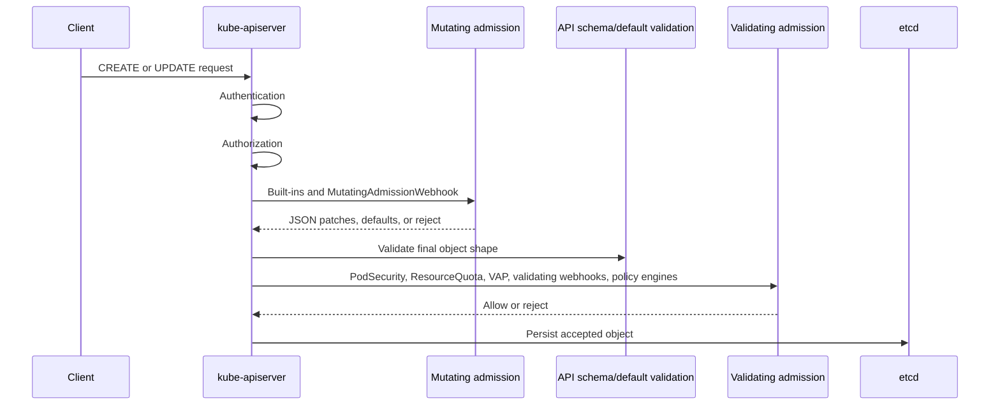

> **Complexity**: `[MEDIUM]` - Critical CKS policy boundary
>
> **Time to Complete**: 40-45 minutes
>
> **Prerequisites**: Module 5.3 (Static Analysis), API server request flow, Pod Security Admission

## What You'll Be Able to Do

After completing this module, you will be able to:

1. **Analyze** the Kubernetes admission sequence so mutating, validating, and quota decisions are placed at the correct point in the API request path.
2. **Configure** mutating and validating admission webhooks with failure policies, timeouts, side-effect declarations, and tight match rules.
3. **Compare** built-in admission controllers, ValidatingAdmissionPolicy, OPA Gatekeeper, and Kyverno for practical CKS policy enforcement.
4. **Design** safe rollout and recovery patterns for admission policies without creating avoidable control-plane outages.
5. **Apply** an exam workflow that diagnoses denied requests and builds a small validating policy in a disposable namespace.

## Why This Module Matters

Admission control is the last programmable checkpoint before the Kubernetes API server persists an object, which makes it the security boundary that still sees requests from `kubectl`, CI jobs, GitOps controllers, operators, and compromised automation after authentication and authorization have already succeeded. Authentication answers who sent the request, authorization answers whether that principal may perform the verb on the resource, and admission answers whether this particular object shape should enter cluster state right now. That position is powerful because it covers normal write paths, and it is dangerous because a broken policy can block the same controllers and operators you need for recovery. ([Kubernetes Admission Control](https://v1-35.docs.kubernetes.io/docs/reference/access-authn-authz/admission-controllers/))

CKS tasks usually test admission control as an operator skill rather than an API theory exercise. You may need to explain why a Pod was denied after RBAC allowed it, identify whether the rejection came from PodSecurity, ResourceQuota, ValidatingAdmissionPolicy, Gatekeeper, Kyverno, or a custom webhook, and then decide whether the correct fix is a manifest change, policy binding change, webhook timeout adjustment, or break-glass recovery. The fastest route is a precise mental model: mutating admission may change an object, validating admission may reject it, and quota enforcement is a validating admission decision that consumes namespace budget only when the final request shape fits the policy boundary. ([Kubernetes Dynamic Admission Control](https://v1-35.docs.kubernetes.io/docs/reference/access-authn-authz/extensible-admission-controllers/), [Kubernetes ResourceQuota Admission](https://v1-35.docs.kubernetes.io/docs/reference/access-authn-authz/admission-controllers/#resourcequota))

Admission policy is also where supply-chain controls become enforceable inside the cluster. Static analysis can reject a pull request, but admission can reject a live request that bypassed the pull request, including an emergency `kubectl apply`, a controller-generated Pod, or a workload copied from another namespace. Built-in controllers handle core invariants such as ServiceAccount automation, Pod Security enforcement, LimitRange defaulting, and ResourceQuota checks; external engines such as OPA Gatekeeper and Kyverno add organization-specific policy, audit, mutation, and exception workflows; ValidatingAdmissionPolicy adds native CEL validation without a separate webhook service. ([Kubernetes Admission Control](https://v1-35.docs.kubernetes.io/docs/reference/access-authn-authz/admission-controllers/), [ValidatingAdmissionPolicy](https://v1-35.docs.kubernetes.io/docs/reference/access-authn-authz/validating-admission-policy/), [Gatekeeper Introduction](https://open-policy-agent.github.io/gatekeeper/website/docs/), [Kyverno Documentation](https://kyverno.io/docs/))

A strong admission design starts with scope, then moves to language, then chooses failure behavior. Use built-ins when Kubernetes already owns the invariant. Use VAP when a short CEL expression can describe the request-local rule. Use Gatekeeper when Rego, OPA portability, audit, and constraints are the main requirement. Use Kyverno when YAML or CEL policy plus mutation, reports, image verification, or exceptions are the better operator fit. Only after that choice should you decide whether the control fails open or closed. That order keeps policy design tied to risk instead of tooling preference. ([Kubernetes Admission Control](https://v1-35.docs.kubernetes.io/docs/reference/access-authn-authz/admission-controllers/), [Gatekeeper Introduction](https://open-policy-agent.github.io/gatekeeper/website/docs/), [Kyverno ValidatingPolicy](https://kyverno.io/docs/policy-types/validating-policy/))

Keep an admission inventory before incidents happen. List each policy surface. Record who owns it. Record whether it mutates or validates. Record its match scope. Record its failure behavior. Record where violations appear. That inventory turns a denial into a lookup task instead of a cluster-wide search. It also helps reviewers spot overlapping rules, such as PodSecurity and a custom restricted-Pod policy both denying the same field with different messages. ([Kubernetes Admission Control](https://v1-35.docs.kubernetes.io/docs/reference/access-authn-authz/admission-controllers/), [Kubernetes Dynamic Admission Control](https://v1-35.docs.kubernetes.io/docs/reference/access-authn-authz/extensible-admission-controllers/))

## Admission Sequence and Ordering

The Kubernetes API server evaluates admission after authentication and authorization, and admission controllers are compiled-in plugins or runtime-configured webhooks that act on API requests before persistence. The public documentation describes two admission phases for webhooks: mutating webhooks run first and can modify the incoming object, then after all object modifications and API-server object validation are complete, validating webhooks run and can reject the request. Built-in admission plugins participate in the same admission chain according to their type, and the `--enable-admission-plugins` flag enables additional plugins without letting the operator choose a custom execution order by flag order. ([Kubernetes Admission Control](https://v1-35.docs.kubernetes.io/docs/reference/access-authn-authz/admission-controllers/), [Kubernetes Dynamic Admission Control](https://v1-35.docs.kubernetes.io/docs/reference/access-authn-authz/extensible-admission-controllers/))



Use the exam shorthand "mutating, validating, quota" as a reasoning model, but remember that quota is implemented by the `ResourceQuota` validating admission controller, not by a separate API-server phase named quota. The practical reason to place quota late in your mental model is that quota should observe the request after defaults and mutations have decided the resource requests, object count, and final namespace target. If a mutating webhook adds a sidecar with CPU and memory requests, or LimitRanger defaults missing resource requests, the quota decision should be reasoned about against that final admitted shape. ([Kubernetes ResourceQuota Admission](https://v1-35.docs.kubernetes.io/docs/reference/access-authn-authz/admission-controllers/#resourcequota), [Kubernetes LimitRanger Admission](https://v1-35.docs.kubernetes.io/docs/reference/access-authn-authz/admission-controllers/#limitranger))

Mutating admission is not a safe place to enforce a rule that depends on seeing the final object, because another mutating controller can still change the object later in the mutation phase and mutating webhooks may be reinvoked when later mutations occur. Kubernetes documentation advises policy authors who must see the final object state to use validating admission, and it separately documents reinvocation policy because mutating webhooks should be idempotent when they are run more than once. For CKS, that means a defaulting webhook can add labels or security context fields, but the final deny decision for "all containers must be non-root" belongs in PodSecurity, ValidatingAdmissionPolicy, Gatekeeper, Kyverno, or another validating control. ([Kubernetes Dynamic Admission Control](https://v1-35.docs.kubernetes.io/docs/reference/access-authn-authz/extensible-admission-controllers/))

The request operation matters. Admission webhooks can match `CREATE`, `UPDATE`, `DELETE`, and `CONNECT`, while admission controllers generally do not apply to read-only `GET`, `LIST`, or `WATCH` requests. A policy that denies unsafe Pods on `CREATE` but ignores `UPDATE` may let a user create a compliant Deployment and later patch the Pod template into a prohibited state. A policy that ignores `DELETE` may be fine for workload hardening, but it is wrong for protecting namespaces, policy resources, or break-glass labels from removal. ([Kubernetes Dynamic Admission Control](https://v1-35.docs.kubernetes.io/docs/reference/access-authn-authz/extensible-admission-controllers/), [ValidatingAdmissionPolicy](https://v1-35.docs.kubernetes.io/docs/reference/access-authn-authz/validating-admission-policy/))

When you debug ordering, keep the submitted object and the admitted object separate in your notes. The submitted object is what the client sent. The admitted object is what would be stored after defaulting and mutation. A deny message from a validator is usually about the admitted object. A quota message is also about the admitted object. That distinction explains why a user can say "my YAML did not request CPU" while ResourceQuota still rejects the request after LimitRanger added a default request. ([Kubernetes LimitRanger Admission](https://v1-35.docs.kubernetes.io/docs/reference/access-authn-authz/admission-controllers/#limitranger), [Kubernetes ResourceQuota Admission](https://v1-35.docs.kubernetes.io/docs/reference/access-authn-authz/admission-controllers/#resourcequota))

## Mutating and Validating Webhooks

`MutatingAdmissionWebhook` and `ValidatingAdmissionWebhook` are built-in admission controllers that execute webhook configurations stored in the Kubernetes API. A mutating webhook receives an `AdmissionReview` and can return a JSON patch that changes the object, while a validating webhook receives the final object and returns an allow or deny decision. Both webhook types are configured through `MutatingWebhookConfiguration` or `ValidatingWebhookConfiguration`, and the API server calls the target service or URL using the client configuration, CA bundle, match rules, selectors, and policy fields declared in those resources. ([Kubernetes Dynamic Admission Control](https://v1-35.docs.kubernetes.io/docs/reference/access-authn-authz/extensible-admission-controllers/))

```yaml
apiVersion: admissionregistration.k8s.io/v1
kind: ValidatingWebhookConfiguration
metadata:
  name: image-registry-policy.example.com
webhooks:
  - name: image-registry-policy.example.com
    admissionReviewVersions: ["v1"]
    sideEffects: None
    failurePolicy: Fail
    timeoutSeconds: 5
    matchPolicy: Equivalent
    rules:
      - apiGroups: [""]
        apiVersions: ["v1"]
        operations: ["CREATE", "UPDATE"]
        resources: ["pods"]
    clientConfig:
      service:
        namespace: policy-system
        name: image-policy-webhook
        path: /validate
      caBundle: REPLACE_WITH_BASE64_CA
```

The webhook fields are operational controls, not decoration. `failurePolicy: Fail` rejects matching requests when the webhook call fails or times out, which protects policy assurance but turns webhook health into an API availability dependency. `failurePolicy: Ignore` lets the request continue when the webhook cannot be reached, which preserves availability but creates a fail-open policy gap. `timeoutSeconds` bounds how long the API server waits for the webhook, and Kubernetes documents webhook timeouts and failure handling as first-class configuration because admission calls sit directly on the request path. The maximum is 30 seconds; the apiserver rejects webhook configs with `timeoutSeconds` above this. ([Kubernetes Dynamic Admission Control](https://v1-35.docs.kubernetes.io/docs/reference/access-authn-authz/extensible-admission-controllers/))

The webhook request and response both use `AdmissionReview`, so a correct webhook must understand the API version it receives and return the same version in its response. That detail matters during upgrades. A webhook that only handles old review versions can fail after configuration changes. A webhook that returns unclear messages turns every denial into a support ticket. Good webhooks return precise status messages, short timeouts, no external side effects when avoidable, and metrics that identify denial, timeout, and internal error paths. ([Kubernetes Dynamic Admission Control](https://v1-35.docs.kubernetes.io/docs/reference/access-authn-authz/extensible-admission-controllers/), [Admission Webhook Good Practices](https://v1-35.docs.kubernetes.io/docs/concepts/cluster-administration/admission-webhooks-good-practices/))

`sideEffects` tells the API server whether calling the webhook can create external effects, and it is especially important for dry-run requests because dry-run is supposed to avoid persistent changes. A webhook that calls an external ticket system, modifies a database, or writes to an inventory service during admission has created a rollback and dry-run problem, while a pure validator that only inspects the request can declare `None`. If your webhook has side effects on regular calls but honors dry-run requests, declare `sideEffects: NoneOnDryRun` instead. For v1 webhooks, only `None` and `NoneOnDryRun` are valid. CKS questions often expose this indirectly by showing dry-run failures, unexpected duplicate external actions, or a webhook that blocks harmless operations because its match rules are too broad. ([Kubernetes Dynamic Admission Control](https://v1-35.docs.kubernetes.io/docs/reference/access-authn-authz/extensible-admission-controllers/), [Admission Webhook Good Practices](https://v1-35.docs.kubernetes.io/docs/concepts/cluster-administration/admission-webhooks-good-practices/))

Match narrowly before you write complex logic. Use `rules` for resource groups, versions, operations, and resources; use namespace and object selectors when policy ownership allows labels to define scope; use `matchPolicy: Equivalent` when converted versions should be treated as the same target. A validating webhook that matches every namespace, every operation, and every resource can become the largest availability risk in the control plane, while a webhook that matches only Pods in production namespaces with a documented timeout and `sideEffects: None` is easier to reason about and easier to recover. ([Kubernetes Dynamic Admission Control](https://v1-35.docs.kubernetes.io/docs/reference/access-authn-authz/extensible-admission-controllers/), [Admission Webhook Good Practices](https://v1-35.docs.kubernetes.io/docs/concepts/cluster-administration/admission-webhooks-good-practices/))

Mutation should be conservative because it changes the object users believe they submitted. Adding a missing label, setting an image pull policy, or defaulting a security context can be defensible when the team documents the behavior and tests the result. Rewriting images, injecting sidecars, or changing resource requests can affect scheduling, quota, rollouts, and incident response. If mutation is necessary, make the patch idempotent, keep the match scope narrow, and pair it with a validating rule that explains the final required state. ([Kubernetes Dynamic Admission Control](https://v1-35.docs.kubernetes.io/docs/reference/access-authn-authz/extensible-admission-controllers/), [Gatekeeper Mutation](https://open-policy-agent.github.io/gatekeeper/website/docs/mutation/), [Kyverno MutatingPolicy](https://kyverno.io/docs/policy-types/mutating-policy/))

For the exam, treat webhook YAML as a troubleshooting artifact. Read the name first. Read the operations next. Read the resource rules after that. Then check selectors, timeout, failure policy, and side effects. If the webhook matches the wrong resource, policy logic is irrelevant. If the webhook points at a dead service, manifest fixes will not help. If dry-run requests fail because side effects are declared incorrectly, the object may never reach validation. ([Kubernetes Dynamic Admission Control](https://v1-35.docs.kubernetes.io/docs/reference/access-authn-authz/extensible-admission-controllers/))

## Built-In Admission Controllers

Built-in admission controllers are compiled into `kube-apiserver` and cover core Kubernetes invariants that most clusters should not reimplement with custom webhooks. Kubernetes v1.35 documentation lists default and optional controllers, and it marks the recommended default set as enabled by default; operators can enable additional plugins with `--enable-admission-plugins`, disable selected defaults with `--disable-admission-plugins`, and confirm the effective static Pod command on kubeadm-style control planes by inspecting the API server manifest. ([Kubernetes Admission Control](https://v1-35.docs.kubernetes.io/docs/reference/access-authn-authz/admission-controllers/))

Do not assume a managed cluster exposes the same admission knobs as a self-managed kubeadm cluster. Some providers own the API server flags. Some expose policy through managed Pod Security, VAP, Gatekeeper, Kyverno, or a provider policy layer. The CKS exam environment is closer to an operator-controlled cluster, so API server flags and static manifests may be visible. In production, the correct first step is to identify which admission controls the platform owner allows you to configure and which ones are fixed by the service. ([Kubernetes Admission Control](https://v1-35.docs.kubernetes.io/docs/reference/access-authn-authz/admission-controllers/))

`PodSecurity` implements the built-in Pod Security Admission controller and evaluates Pods against namespace labels that select the privileged, baseline, or restricted Pod Security Standards. It is a validating admission controller, so it rejects new or updated Pods that violate the configured enforce level, while warn and audit labels can surface policy feedback without denial. In CKS practice, PodSecurity is the fastest built-in answer when the task is "prevent privileged Pods in this namespace" and the policy maps cleanly to the Pod Security Standards. ([Kubernetes PodSecurity Admission](https://v1-35.docs.kubernetes.io/docs/reference/access-authn-authz/admission-controllers/#podsecurity), [Kubernetes Pod Security Standards](https://v1-35.docs.kubernetes.io/docs/concepts/security/pod-security-standards/))

Pod Security labels also have version semantics, which prevents silent behavior drift when Kubernetes changes a standard in a later release. Pinning an enforce version gives operators a predictable baseline, while using the latest version can make upgrades surface new warnings or denials. The exam usually focuses on the level labels, but production practice should record both the selected level and the selected version. That record helps teams explain why a Pod passed yesterday and failed after a namespace label or cluster version changed. ([Kubernetes PodSecurity Admission](https://v1-35.docs.kubernetes.io/docs/reference/access-authn-authz/admission-controllers/#podsecurity), [Kubernetes Pod Security Standards](https://v1-35.docs.kubernetes.io/docs/concepts/security/pod-security-standards/))

`ResourceQuota` validates whether a namespace request would exceed a `ResourceQuota` object, and Kubernetes documentation states that clusters using `ResourceQuota` objects must use this admission controller to enforce quota constraints. `LimitRanger` can mutate a request by applying default resource requests or limits from a `LimitRange`, and it can also validate that requested values stay inside minimum, maximum, and ratio constraints. Together they explain a common admission puzzle: a user submits a Pod with no resource requests, LimitRanger defaults the requests, and ResourceQuota then rejects the object because the namespace budget is exhausted. ([Kubernetes ResourceQuota Admission](https://v1-35.docs.kubernetes.io/docs/reference/access-authn-authz/admission-controllers/#resourcequota), [Kubernetes LimitRanger Admission](https://v1-35.docs.kubernetes.io/docs/reference/access-authn-authz/admission-controllers/#limitranger))

`ServiceAccount` is both mutating and validating, and Kubernetes strongly recommends enabling it for clusters that use ServiceAccount objects. It automates ServiceAccount behavior for Pods, which includes defaulting the ServiceAccount reference when needed and ensuring referenced ServiceAccounts are valid for the namespace. A CKS denial that mentions a missing ServiceAccount is therefore an admission rejection, not a scheduler failure, and the right fix is to create or select the expected ServiceAccount rather than editing node placement. ([Kubernetes ServiceAccount Admission](https://v1-35.docs.kubernetes.io/docs/reference/access-authn-authz/admission-controllers/#serviceaccount))

Other built-ins fill specific API safety roles. `NamespaceLifecycle` prevents operations in terminating namespaces and protects reserved namespaces from deletion; `DefaultStorageClass` and `DefaultIngressClass` provide defaulting for storage and ingress objects; `RuntimeClass` validates and mutates Pods that select a RuntimeClass with configured overhead; `NodeRestriction` limits kubelet changes to Node and Pod objects in ways that support node isolation. The exam does not require memorizing every controller, but it does expect you to separate built-in API invariants from custom organization policy that belongs in CEL, Gatekeeper, Kyverno, or a webhook. ([Kubernetes Admission Control](https://v1-35.docs.kubernetes.io/docs/reference/access-authn-authz/admission-controllers/))

The safest custom policy is the one you never had to write because a maintained built-in already fits the invariant. Do not write a webhook to replace ServiceAccount admission. Do not write a broad custom privileged-Pod rule before checking whether Pod Security Admission can cover the namespace. Do not write a custom namespace budget controller when ResourceQuota can express the limit. Custom admission should handle organization policy, not duplicate core API mechanics that Kubernetes already documents, tests, and ships with the API server. ([Kubernetes Admission Control](https://v1-35.docs.kubernetes.io/docs/reference/access-authn-authz/admission-controllers/))

## ValidatingAdmissionPolicy

ValidatingAdmissionPolicy, often shortened to VAP, is Kubernetes-native validating admission based on Common Expression Language. The Kubernetes v1.35 documentation marks it as `Kubernetes v1.30 [stable]`, and KEP-3488 is the enhancement record for CEL-based admission control. The operator value is straightforward: when a rule can be expressed as a readable CEL expression over the incoming request, VAP avoids operating a separate webhook service and evaluates inside the API server admission path. ([ValidatingAdmissionPolicy](https://v1-35.docs.kubernetes.io/docs/reference/access-authn-authz/validating-admission-policy/), [KEP-3488 CEL Admission Control](https://raw.githubusercontent.com/kubernetes/enhancements/master/keps/sig-api-machinery/3488-cel-admission-control/README.md))

```yaml
apiVersion: admissionregistration.k8s.io/v1
kind: ValidatingAdmissionPolicy
metadata:
  name: require-nonroot-pods.example.com
spec:
  failurePolicy: Fail
  matchConstraints:
    resourceRules:
      - apiGroups: [""]
        apiVersions: ["v1"]
        operations: ["CREATE", "UPDATE"]
        resources: ["pods"]
  validations:
    - expression: "object.spec.containers.all(c, has(c.securityContext) && has(c.securityContext.runAsNonRoot) && c.securityContext.runAsNonRoot)"
      message: "all containers must set securityContext.runAsNonRoot to true"
---
apiVersion: admissionregistration.k8s.io/v1
kind: ValidatingAdmissionPolicyBinding
metadata:
  name: require-nonroot-pods-production
spec:
  policyName: require-nonroot-pods.example.com
  validationActions: ["Deny"]
  matchResources:
    namespaceSelector:
      matchLabels:
        environment: production
```

The policy defines match constraints and CEL validations, while the binding attaches that policy to resources and chooses actions such as `Deny`, `Warn`, or `Audit`. CEL expressions can access variables such as `object`, `oldObject`, `request`, `params`, and `namespaceObject`, which lets a policy compare update state, inspect request metadata, read parameter resources, or use namespace labels in an admission decision. This design is best when the rule is local to the request and the expression is short enough that a reviewer can understand the deny path without a separate policy language tutorial. ([ValidatingAdmissionPolicy](https://v1-35.docs.kubernetes.io/docs/reference/access-authn-authz/validating-admission-policy/))

Readable CEL matters more than clever CEL. Prefer several validations with focused messages over one dense expression that encodes an entire standard. Check create and update behavior separately. Remember that `oldObject` is useful on update but not on create. Decide how missing labels, missing maps, and absent security contexts should behave before the policy reaches production. A short expression with a clear message is faster to operate during an outage than a compact expression that only its author understands. ([ValidatingAdmissionPolicy](https://v1-35.docs.kubernetes.io/docs/reference/access-authn-authz/validating-admission-policy/))

Parameter resources make VAP reusable. A policy can declare `paramKind`, and a binding can connect the policy to a parameter object such as a custom resource or ConfigMap, so different namespaces can use the same expression with different thresholds. That flexibility adds an operational requirement: the platform team must decide what happens when parameters are missing, malformed, or deleted, because a missing parameter should not quietly turn a production deny rule into a policy gap. ([ValidatingAdmissionPolicy](https://v1-35.docs.kubernetes.io/docs/reference/access-authn-authz/validating-admission-policy/))

Bindings are where a harmless VAP becomes an enforcing policy. A policy without an enforcing binding is only a definition. A binding with `Warn` can teach users before denial. A binding with `Audit` can record violations without blocking the request. A binding with `Deny` changes the API write path. During rollout, use labels and selectors to bind the policy to one namespace or team first, then expand after the denial messages and exception path are proven. ([ValidatingAdmissionPolicy](https://v1-35.docs.kubernetes.io/docs/reference/access-authn-authz/validating-admission-policy/))

A useful VAP test loop is short. Apply the policy. Apply the binding with `Warn` or `Audit`. Submit one allowed object. Submit one denied object. Read the warning or audit result. Switch to `Deny` only after the message names the exact missing field. This is also a good way to teach CEL to reviewers, because each expression has a concrete allowed case and a concrete denied case beside it. ([ValidatingAdmissionPolicy](https://v1-35.docs.kubernetes.io/docs/reference/access-authn-authz/validating-admission-policy/))

VAP is not a replacement for every policy engine. It validates; it does not mutate objects, generate resources, provide Gatekeeper's Rego library ecosystem, or provide Kyverno's full policy reporting and image verification workflow. Choose VAP for native, stable, request-local validations; choose Gatekeeper when Rego portability, constraint libraries, audit, or OPA integration matter; choose Kyverno when YAML or CEL policy authoring, mutation, generation, image verification, exceptions, and reports fit the team better. ([ValidatingAdmissionPolicy](https://v1-35.docs.kubernetes.io/docs/reference/access-authn-authz/validating-admission-policy/), [Gatekeeper Introduction](https://open-policy-agent.github.io/gatekeeper/website/docs/), [Kyverno ValidatingPolicy](https://kyverno.io/docs/policy-types/validating-policy/))

## OPA Gatekeeper

OPA Gatekeeper is a Kubernetes admission policy engine that runs as validating and mutating webhooks and executes policies with Open Policy Agent. Gatekeeper's documentation describes it as enforcing CRD-based policies through OPA, with native Kubernetes CRDs for constraints, constraint templates, mutation support, audit, and external data. The key packaging pattern is that a `ConstraintTemplate` defines reusable Rego and a parameter schema, while a `Constraint` instantiates that template with match rules and parameter values. ([Gatekeeper Introduction](https://open-policy-agent.github.io/gatekeeper/website/docs/), [Gatekeeper How To](https://open-policy-agent.github.io/gatekeeper/website/docs/howto/))

```yaml
apiVersion: templates.gatekeeper.sh/v1
kind: ConstraintTemplate
metadata:
  name: k8sallowedrepos
spec:
  crd:
    spec:
      names:
        kind: K8sAllowedRepos
      validation:
        openAPIV3Schema:
          type: object
          properties:
            repos:
              type: array
              items:
                type: string
  targets:
    - target: admission.k8s.gatekeeper.sh
      rego: |
        package k8sallowedrepos

        violation[{"msg": msg}] {
          container := input.review.object.spec.containers[_]
          not startswith_allowed(container.image)
          msg := sprintf("container %s uses disallowed image %s", [container.name, container.image])
        }

        startswith_allowed(image) {
          repo := input.parameters.repos[_]
          startswith(image, repo)
        }
---
apiVersion: constraints.gatekeeper.sh/v1beta1
kind: K8sAllowedRepos
metadata:
  name: only-approved-registries
spec:
  enforcementAction: dryrun
  match:
    kinds:
      - apiGroups: [""]
        kinds: ["Pod"]
    namespaces: ["admission-lab"]
  parameters:
    repos:
      - registry.example.com/
```

Gatekeeper match rules are often where production mistakes hide. The `match` field can select kinds, API groups, namespaces, excluded namespaces, namespace selectors, label selectors, scope, and names, and the documentation states that a resource must satisfy each top-level matcher to be in scope. A policy that matches core Pods with `apiGroups: [""]` will not automatically inspect Deployments in `apps/v1` unless the policy or engine expands workload resources, so exam debugging should start with kind, API group, namespace, and `enforcementAction` before rewriting Rego. ([Gatekeeper How To](https://open-policy-agent.github.io/gatekeeper/website/docs/howto/))

ConstraintTemplate review has two parts. First, review the Rego against the exact AdmissionReview input shape. Second, review the parameter schema that lets cluster operators instantiate the template safely. Gatekeeper `v1` ConstraintTemplates require structural schemas, including type declarations, so malformed constraints can be rejected by the API server. That is a security feature. A wrong parameter type can otherwise turn a policy into a no-op or make every request fail in a confusing way. ([Gatekeeper Constraint Templates](https://open-policy-agent.github.io/gatekeeper/website/docs/constrainttemplates/), [Gatekeeper How To](https://open-policy-agent.github.io/gatekeeper/website/docs/howto/))

Gatekeeper's default constraint behavior is denial, while `dryrun` and `warn` allow safer rollout. The audit controller periodically evaluates existing resources and records current violations in constraint status, including a `totalViolations` count, which means a platform team can install a new policy, observe the backlog, fix workloads, and then move a selected namespace from audit to denial. This matters because admission only evaluates new requests, while audit tells you what already exists before the policy became enforcing. ([Gatekeeper How To](https://open-policy-agent.github.io/gatekeeper/website/docs/howto/), [Gatekeeper Audit](https://open-policy-agent.github.io/gatekeeper/website/docs/audit/))

A good Gatekeeper rollout has a test artifact before it has a production denial. Use allowed and disallowed examples with `gator` or another local test path. Apply the template first. Apply constraints in `dryrun`. Read audit status. Fix existing resources or record narrow exceptions. Then move one namespace or one controller family to deny. This process is slower than a single cluster-wide apply, but it avoids learning from a broken production admission path. ([Gatekeeper Audit](https://open-policy-agent.github.io/gatekeeper/website/docs/audit/), [Gatekeeper How To](https://open-policy-agent.github.io/gatekeeper/website/docs/howto/))

Rego failures often come from missing fields. Kubernetes objects omit many optional fields. A container without `securityContext` does not have `securityContext.runAsNonRoot` set to false. It has no field there at all. Good Gatekeeper rules check both explicit bad values and missing required values. Good messages include the container name, the rejected field, and the expected value. That message quality matters because users see the denial before they see the template. ([Gatekeeper Constraint Templates](https://open-policy-agent.github.io/gatekeeper/website/docs/constrainttemplates/), [Gatekeeper How To](https://open-policy-agent.github.io/gatekeeper/website/docs/howto/))

Gatekeeper can also mutate objects through mutation CRDs such as `AssignMetadata`, `Assign`, `ModifySet`, and `AssignImage`. Mutation is useful for carefully scoped defaults, annotations, or image string changes, but it should not hide major security decisions from Git review. A policy program that mutates missing fields and then validates the result should keep the mutation and validation rules consistent, otherwise users see confusing rejections where one webhook adds a value and another rejects a related field. ([Gatekeeper Mutation](https://open-policy-agent.github.io/gatekeeper/website/docs/mutation/))

## Kyverno

Kyverno is the other policy engine you should recognize for CKS supply-chain work because it runs as a dynamic admission controller and applies matching policies to validating and mutating webhook callbacks from the API server. Kyverno documentation emphasizes Kubernetes-native policy types, YAML and CEL based authoring, admission enforcement, runtime scans, Policy Reports, CLI testing, and policy capabilities beyond validation such as mutation, generation, cleanup, image verification, and exceptions. ([Kyverno Documentation](https://kyverno.io/docs/), [How Kyverno Works](https://kyverno.io/docs/introduction/how-kyverno-works/))

Kyverno's architecture matters during troubleshooting because several controllers may be involved. The webhook handles AdmissionReview requests. Background and report controllers handle existing-resource scans and reports. Certificate management keeps the webhook TLS path valid. High availability depends on the installed controller replicas and the specific controller role. If a denial happens during admission, inspect the policy and webhook path. If an existing object appears in a report, inspect background scanning and report generation. Those are related signals, not the same execution path. ([How Kyverno Works](https://kyverno.io/docs/introduction/how-kyverno-works/), [Kyverno Documentation](https://kyverno.io/docs/))

```yaml
apiVersion: policies.kyverno.io/v1
kind: ValidatingPolicy
metadata:
  name: require-team-label
spec:
  validationActions: ["Deny"]
  matchConstraints:
    resourceRules:
      - apiGroups: [""]
        apiVersions: ["v1"]
        operations: ["CREATE", "UPDATE"]
        resources: ["pods"]
  validations:
    - message: "pods must set metadata.labels.team"
      expression: "'team' in object.metadata.?labels.orValue({})"
```

Kyverno and Gatekeeper differ most in authoring model and ecosystem fit. Gatekeeper is a strong choice when a team already uses OPA and Rego, wants portable policy logic, and values constraint templates plus the Gatekeeper policy library. Kyverno is often a stronger fit when the platform team wants policy definitions to look like Kubernetes resources, wants CEL-based validation with Kyverno extensions, or wants mutation, reporting, image verification, and exception workflows in one Kubernetes-native policy system. The correct exam answer follows the prompt: use Gatekeeper when asked for OPA, use Kyverno when asked for Kyverno, and mention VAP when the cluster can solve the validation natively. ([Gatekeeper Introduction](https://open-policy-agent.github.io/gatekeeper/website/docs/), [Kyverno ValidatingPolicy](https://kyverno.io/docs/policy-types/validating-policy/))

Kyverno's `ClusterPolicy` validate rules remain common in existing clusters and training material. Older examples usually set the spec-level `validationFailureAction: Enforce|Audit`, while Kyverno 1.13+ also supports the newer per-rule `failureAction` field where `Enforce` blocks noncompliant creates or updates and `Audit` records violations in PolicyReport or ClusterPolicyReport resources. Current Kyverno documentation also presents stable CEL-based `ValidatingPolicy` resources, which extend Kubernetes ValidatingAdmissionPolicy with Kyverno-specific fields for background processing, pipelines, reports, exceptions, and testing. In practice, check the installed Kyverno version and policy API before assuming which examples apply. ([Kyverno Validate Rules](https://kyverno.io/docs/policy-types/cluster-policy/validate/), [Kyverno ValidatingPolicy](https://kyverno.io/docs/policy-types/validating-policy/))

Kyverno is especially attractive when a team wants one policy system to both enforce and explain. A deny can return a user-facing message. An audit can create report data. A mutation can repair a missing default. An image policy can verify signed artifacts in the same ecosystem. That breadth is useful, but it also means policy authors must separate advisory checks from blocking checks. A noisy audit rule should not become an enforcing rule until the report data proves the organization can comply. ([Kyverno Documentation](https://kyverno.io/docs/), [Kyverno ValidatingPolicy](https://kyverno.io/docs/policy-types/validating-policy/))

Kyverno reports are useful because admission decisions are not the only compliance signal. Existing resources may predate a policy. Controllers may create Pods from templates later. A namespace owner may fix a manifest after seeing an audit result. Reports give the platform team a backlog, not only a rejection stream. That makes Kyverno adoption easier in large clusters, but the same caution applies: report noise must be triaged before a rule becomes an enforce action. ([How Kyverno Works](https://kyverno.io/docs/introduction/how-kyverno-works/), [Kyverno ValidatingPolicy](https://kyverno.io/docs/policy-types/validating-policy/))

## Failure Modes and Operations

Admission controllers fail in three broad ways: they deny the request correctly, they deny the request because the policy is wrong, or they fail to answer and force the API server to follow failure behavior. The first case is normal security feedback. The second case requires policy debugging, scope narrowing, dry-run rollout, or an exception. The third case is an availability design problem, because `failurePolicy: Fail` rejects matching requests when the webhook call has an error or timeout, while `failurePolicy: Ignore` allows those requests and weakens enforcement during the outage. ([Kubernetes Dynamic Admission Control](https://v1-35.docs.kubernetes.io/docs/reference/access-authn-authz/extensible-admission-controllers/), [Gatekeeper Failing Closed](https://open-policy-agent.github.io/gatekeeper/website/docs/failing-closed/))

Start every incident by classifying the failure before changing configuration. A correct denial needs a workload fix or an approved exception. A wrong denial needs policy rollback or scope reduction. A timeout needs webhook health data. A TLS error needs certificate and CA bundle checks. A match-scope mistake needs selector and rule inspection. Those categories lead to different fixes, and mixing them wastes time. A platform runbook should map common error strings to the policy object, webhook service, owning team, and recovery path. ([Kubernetes Dynamic Admission Control](https://v1-35.docs.kubernetes.io/docs/reference/access-authn-authz/extensible-admission-controllers/), [Admission Webhook Good Practices](https://v1-35.docs.kubernetes.io/docs/concepts/cluster-administration/admission-webhooks-good-practices/))

Timeouts deserve aggressive restraint. Kubernetes allows webhooks to set `timeoutSeconds`, and Kyverno exposes webhook timeout settings in its policy-specific webhook configuration, but longer timeouts mean ordinary API writes wait longer behind a slow policy path. A webhook that calls external services, performs network-heavy checks, or matches many resources can turn a small service slowdown into widespread `kubectl apply` latency. Prefer fast local evaluation, cached policy data, specific match rules, short timeouts, and clear metrics for rejection count, latency, and webhook errors. ([Kubernetes Dynamic Admission Control](https://v1-35.docs.kubernetes.io/docs/reference/access-authn-authz/extensible-admission-controllers/), [Kyverno ValidatingPolicy](https://kyverno.io/docs/policy-types/validating-policy/))

A high-assurance cluster may configure critical webhooks to fail closed, but it must also define recovery before the outage. Gatekeeper documents failing closed as a deliberate configuration choice and separately documents emergency recovery because deleting or bypassing a webhook configuration can restore API writes at the cost of temporarily removing enforcement. A good runbook names the exact webhook configuration, owner, symptoms, rollback command, audit requirement, and re-enable checklist, and it should be tested before a policy engine upgrade. ([Gatekeeper Failing Closed](https://open-policy-agent.github.io/gatekeeper/website/docs/failing-closed/), [Gatekeeper Emergency Recovery](https://open-policy-agent.github.io/gatekeeper/website/docs/emergency/))

Observability should explain who denied the request and why. Kubernetes exposes admission webhook metrics with labels for webhook name, operation, type, error type, and rejection code, and audit annotations can record which mutating webhook changed an object. Gatekeeper audit status, Kyverno Policy Reports, VAP warnings, API server audit logs, and normal `kubectl describe` events all tell different parts of the story. In an exam, start with the exact error message, then inspect the policy object, binding or constraint, namespace labels, webhook configuration, and API server logs only when the local evidence is insufficient. ([Kubernetes Dynamic Admission Control](https://v1-35.docs.kubernetes.io/docs/reference/access-authn-authz/extensible-admission-controllers/), [Gatekeeper Audit](https://open-policy-agent.github.io/gatekeeper/website/docs/audit/), [How Kyverno Works](https://kyverno.io/docs/introduction/how-kyverno-works/))

Policy engine upgrades are admission changes, not ordinary add-on upgrades. A new Gatekeeper, Kyverno, or Kubernetes minor version can change policy APIs, generated webhook configuration, CEL libraries, Rego behavior, or report formats. Test representative allowed and denied resources before upgrading. Keep rollback manifests close to the change. Watch webhook latency and rejection metrics during the rollout. If admission is part of your security boundary, the upgrade plan should include both correctness tests and availability tests. ([Gatekeeper How To](https://open-policy-agent.github.io/gatekeeper/website/docs/howto/), [Kyverno ValidatingPolicy](https://kyverno.io/docs/policy-types/validating-policy/), [ValidatingAdmissionPolicy](https://v1-35.docs.kubernetes.io/docs/reference/access-authn-authz/validating-admission-policy/))

Recovery practice should be narrow and rehearsed. Do not wait for a production outage to learn which webhook blocks namespace edits. Test a bad policy in a lab. Watch the denial. Roll it back. Test a webhook service outage. Watch the failure policy. Restore the service. These drills teach the team which controls fail open, which controls fail closed, and which resources stay available for repair. ([Kubernetes Dynamic Admission Control](https://v1-35.docs.kubernetes.io/docs/reference/access-authn-authz/extensible-admission-controllers/), [Gatekeeper Failing Closed](https://open-policy-agent.github.io/gatekeeper/website/docs/failing-closed/))

## Common CKS Exam Scenarios

If a Pod is rejected with a Pod Security error, inspect the namespace labels before changing the workload. `pod-security.kubernetes.io/enforce`, `audit`, and `warn` labels define the selected Pod Security Standard level and version, while the Pod spec reveals the violating field such as `privileged`, host namespaces, hostPath, added capabilities, or missing restricted-profile security context. The correct fix is often to remove the unsafe field from the manifest; weakening the namespace label is a policy exception that should be explicit and narrow. ([Kubernetes PodSecurity Admission](https://v1-35.docs.kubernetes.io/docs/reference/access-authn-authz/admission-controllers/#podsecurity), [Kubernetes Pod Security Standards](https://v1-35.docs.kubernetes.io/docs/concepts/security/pod-security-standards/))

If a request is denied by a validating webhook, read the webhook name in the error, then inspect the `ValidatingWebhookConfiguration` for `failurePolicy`, `timeoutSeconds`, `sideEffects`, namespace selectors, object selectors, and rules. A common fix is not to edit the application manifest at all; it may be to narrow a webhook that accidentally matches system namespaces, restore a CA bundle, restart an unhealthy webhook service, or move a new policy from `Fail` to `Ignore` only while the team repairs availability. ([Kubernetes Dynamic Admission Control](https://v1-35.docs.kubernetes.io/docs/reference/access-authn-authz/extensible-admission-controllers/), [Admission Webhook Good Practices](https://v1-35.docs.kubernetes.io/docs/concepts/cluster-administration/admission-webhooks-good-practices/))

If a namespace quota error appears after a manifest seemed valid, inspect the `ResourceQuota`, `LimitRange`, and the final resource requests on the object. LimitRanger may have defaulted requests that were absent in the submitted YAML, and ResourceQuota may reject the final object because the namespace would exceed CPU, memory, storage, object-count, or other quota constraints. The useful exam habit is to compare the submitted manifest, the namespace defaults, and the quota status rather than assuming the scheduler or kubelet caused the failure. ([Kubernetes ResourceQuota Admission](https://v1-35.docs.kubernetes.io/docs/reference/access-authn-authz/admission-controllers/#resourcequota), [Kubernetes LimitRanger Admission](https://v1-35.docs.kubernetes.io/docs/reference/access-authn-authz/admission-controllers/#limitranger))

If the task asks for a native policy in Kubernetes v1.30 or newer, write a ValidatingAdmissionPolicy and binding when the check is request-local and CEL is readable. If the task asks for OPA or Gatekeeper, write a ConstraintTemplate and Constraint. If the task asks for YAML-native mutation, generation, or image verification, Kyverno is usually the intended engine. This choice is a scope decision, not a ranking: the best control is the one that the cluster can operate safely and the policy owner can review accurately. ([ValidatingAdmissionPolicy](https://v1-35.docs.kubernetes.io/docs/reference/access-authn-authz/validating-admission-policy/), [Gatekeeper How To](https://open-policy-agent.github.io/gatekeeper/website/docs/howto/), [Kyverno Documentation](https://kyverno.io/docs/))

Use a short command sequence when time is limited. Read the exact error. Identify the admission component named in the error. Inspect namespace labels for Pod Security and VAP bindings. Inspect quota and limit ranges for budget errors. Inspect webhook configurations for failure policy, timeout, selectors, and service references. Inspect Gatekeeper constraints or Kyverno policies for audit versus deny behavior. Then make the smallest change that matches the failure category. That workflow prevents random edits to RBAC, scheduler settings, or image pull configuration when the API server has already told you admission is the blocker. ([Kubernetes Admission Control](https://v1-35.docs.kubernetes.io/docs/reference/access-authn-authz/admission-controllers/), [Kubernetes Dynamic Admission Control](https://v1-35.docs.kubernetes.io/docs/reference/access-authn-authz/extensible-admission-controllers/))

## Did You Know?

- **Admission can reject a request after RBAC allows it.** Authentication and authorization happen before admission, so a user can have permission to create Pods and still be denied by PodSecurity, quota, VAP, Gatekeeper, Kyverno, or a webhook.
- **VAP is stable from Kubernetes v1.30.** The v1.35 docs mark ValidatingAdmissionPolicy as stable and KEP-3488 records the CEL admission enhancement behind the feature.
- **Mutating webhooks are not final-state policy checks.** Kubernetes documents that validating admission should be used when a webhook needs to see the final object after all mutations are complete.
- **Failing closed is a tradeoff, not a slogan.** `failurePolicy: Fail` improves assurance during webhook errors, but it also makes webhook availability part of API-server write availability for matching requests.

## Common Mistakes

| Mistake | Why It Hurts | Better Practice |
|---|---|---|
| Treating admission as RBAC | The request may pass authorization and still be denied by object policy | Read the rejection source, then inspect the matching admission policy or namespace label |
| Enforcing final-state rules in a mutating webhook | Later mutation can change the object after the webhook saw it | Use validating admission for final deny decisions and keep mutation idempotent |
| Setting every webhook to `failurePolicy: Fail` | A policy outage can block broad API write paths | Fail closed only for scoped critical controls with health checks and a recovery runbook |
| Setting every webhook to `failurePolicy: Ignore` | Policy disappears during webhook errors or timeouts | Use fail-open only where availability clearly outranks enforcement, and monitor webhook errors |
| Matching all namespaces by default | System controllers and recovery operations may be blocked by app policy | Exclude or scope system namespaces and expand enforcement in stages |
| Forgetting ResourceQuota after LimitRanger | Defaults can add requests that consume quota | Inspect LimitRange defaults and quota status together during admission debugging |
| Using VAP for mutation or rich inventory policy | Native CEL validation does not mutate resources or replace full policy-engine workflows | Use VAP for request-local validation, Gatekeeper or Kyverno for broader policy programs |
| Leaving Gatekeeper or Kyverno in audit forever | Violations are recorded but risky requests keep entering the cluster | Define an adoption window, fix backlog, and switch selected scopes to denial |

## Quiz

<details>
<summary>A user can create Pods by RBAC, but `kubectl apply` returns a PodSecurity denial for `privileged: true`. What should you inspect first, and what is the safest fix?</summary>

Inspect the namespace Pod Security Admission labels and the Pod security context that triggered the denial. The safest fix is to remove `privileged: true` or move the workload to a tightly controlled namespace with a documented exception when privileged execution is truly required. The wrong fix is broadening RBAC, because authorization already allowed the request and admission rejected the object shape.
</details>

<details>
<summary>A mutating webhook adds a sidecar with resource requests, and the final Pod is rejected by quota. Why can that happen even though the submitted YAML had small requests?</summary>

Admission evaluates the request after mutation and defaulting, so ResourceQuota validates the final object that would be persisted rather than only the text the user submitted. If the sidecar or LimitRanger defaulting increases CPU or memory requests, the namespace quota may be exceeded. Diagnose this by checking the mutating policy, LimitRange, ResourceQuota status, and the effective Pod spec.
</details>

<details>
<summary>When would you choose ValidatingAdmissionPolicy instead of Gatekeeper for a CKS-style rule?</summary>

Choose ValidatingAdmissionPolicy when the cluster version supports it and the rule is a readable CEL validation over the admission request, such as requiring a label, limiting replicas, or checking a Pod field. Gatekeeper is better when the prompt asks for OPA, Rego, constraint templates, audit workflows, or policy library reuse. Kyverno is better when the prompt asks for YAML-native policy, mutation, generation, reports, or image verification.
</details>

<details>
<summary>A webhook uses `failurePolicy: Ignore` and its service is down. What happens to matching requests, and what security risk does that create?</summary>

With fail-open behavior, matching requests can continue when the webhook call fails, so policy is not enforced during the outage. That may be acceptable for low-risk advisory checks, but it is dangerous for controls such as image registry enforcement or privilege denial. The operational fix is to choose failure behavior deliberately, monitor webhook errors, and use scoped fail-closed policies where enforcement is mandatory.
</details>

<details>
<summary>A Gatekeeper constraint exists, but invalid Deployments are not denied. Which fields should you check before editing the Rego?</summary>

Check `enforcementAction`, `match.kinds`, `apiGroups`, namespaces, excluded namespaces, namespace selectors, object selectors, and whether the policy matches Pods but not workload controllers such as Deployments. A constraint in `dryrun` records violations without denial, and a constraint that only matches core Pods may miss `apps/v1` Deployment templates unless workload expansion or a matching template is configured.
</details>

<details>
<summary>A Kyverno policy is in Audit mode and reports violations, but users can still create matching Pods. Is Kyverno broken?</summary>

No. Audit mode is designed to allow the request while recording violations in policy reports and events, which is useful during rollout. To block new matching requests, change the policy action to an enforcing mode supported by the installed Kyverno API, verify the match scope, and test in a narrow namespace before expanding cluster-wide enforcement.
</details>

<details>
<summary>What is the exam-safe order for reasoning about an admitted Pod request that touches defaults, policy, and quota?</summary>

Reason from authentication and authorization into mutating admission, then API validation and validating admission, then ResourceQuota as a validating quota check before persistence. In practice, inspect mutating webhooks and LimitRanger for changed fields, inspect PodSecurity, VAP, Gatekeeper, Kyverno, or validating webhooks for deny decisions, and inspect ResourceQuota status when the error mentions namespace budget.
</details>

## Hands-On Exercise

Complete this lab in a disposable cluster where you can create namespaces and admission policies. The goal is to observe built-in admission behavior, create a native CEL validation rule, and practice the debugging path from denial message to policy source.

- [ ] Create a namespace named `admission-lab` and label it with `environment=production`.
- [ ] Add Pod Security labels that enforce the restricted profile in the namespace, then try to create a privileged Pod and record the admission error.
- [ ] Create a `ResourceQuota` that limits Pods and CPU requests in `admission-lab`, then create a `LimitRange` that defaults CPU requests for containers.
- [ ] Create a small Deployment without explicit CPU requests, observe whether LimitRanger defaults the requests, and check whether ResourceQuota allows or denies the final object.
- [ ] Apply a `ValidatingAdmissionPolicy` and binding that requires Pods in namespaces labeled `environment=production` to set `metadata.labels.team`.
- [ ] Try to create a Pod without the `team` label, confirm the VAP denial message, then add the label and confirm admission succeeds.
- [ ] Inspect the relevant policy objects with `kubectl get validatingadmissionpolicy`, `kubectl get validatingadmissionpolicybinding`, `kubectl describe resourcequota`, and `kubectl describe limitrange`.
- [ ] If Gatekeeper is installed, create the `K8sAllowedRepos` ConstraintTemplate and Constraint from this module in `dryrun`, then inspect `kubectl get constraints` and the constraint status.
- [ ] If Kyverno is installed, create an equivalent validating policy in Audit mode (Kyverno 1.14+; use `kyverno.io/v1 ClusterPolicy` for older installations), create one violating Pod, and inspect the generated report or event.
- [ ] Clean up by deleting the VAP binding, VAP, optional Gatekeeper or Kyverno policy resources, and the `admission-lab` namespace.

```yaml
apiVersion: admissionregistration.k8s.io/v1
kind: ValidatingAdmissionPolicy
metadata:
  name: require-team-label.example.com
spec:
  failurePolicy: Fail
  matchConstraints:
    resourceRules:
      - apiGroups: [""]
        apiVersions: ["v1"]
        operations: ["CREATE", "UPDATE"]
        resources: ["pods"]
  validations:
    - expression: "'team' in object.metadata.?labels.orValue({})"
      message: "pods in production namespaces must include metadata.labels.team"
---
apiVersion: admissionregistration.k8s.io/v1
kind: ValidatingAdmissionPolicyBinding
metadata:
  name: require-team-label-production
spec:
  policyName: require-team-label.example.com
  validationActions: ["Deny"]
  matchResources:
    namespaceSelector:
      matchLabels:
        environment: production
```

## Sources

- [Kubernetes Admission Control](https://v1-35.docs.kubernetes.io/docs/reference/access-authn-authz/admission-controllers/) - documents built-in admission controllers, recommended defaults, controller types, and ResourceQuota, LimitRanger, ServiceAccount, PodSecurity, and webhook controllers.
- [Kubernetes Dynamic Admission Control](https://v1-35.docs.kubernetes.io/docs/reference/access-authn-authz/extensible-admission-controllers/) - documents mutating and validating admission webhooks, ordering, side effects, timeouts, reinvocation, failure policy, metrics, and audit annotations.
- [Kubernetes Admission Webhook Good Practices](https://v1-35.docs.kubernetes.io/docs/concepts/cluster-administration/admission-webhooks-good-practices/) - gives operational guidance for safe webhook design and deployment.
- [Kubernetes ValidatingAdmissionPolicy](https://v1-35.docs.kubernetes.io/docs/reference/access-authn-authz/validating-admission-policy/) - documents CEL validation, policy bindings, validation actions, parameter resources, and request variables.
- [KEP-3488: CEL Admission Control](https://raw.githubusercontent.com/kubernetes/enhancements/master/keps/sig-api-machinery/3488-cel-admission-control/README.md) - enhancement proposal for ValidatingAdmissionPolicy and CEL-based admission control.
- [OPA Gatekeeper](https://open-policy-agent.github.io/gatekeeper/) - project entry point for Gatekeeper documentation.
- [Gatekeeper Introduction](https://open-policy-agent.github.io/gatekeeper/website/docs/) - describes Gatekeeper as a validating and mutating webhook using OPA with CRD-based policies and audit.
- [Gatekeeper How To](https://open-policy-agent.github.io/gatekeeper/website/docs/howto/) - documents ConstraintTemplates, Constraints, match fields, parameters, and enforcement actions.
- [Gatekeeper Audit](https://open-policy-agent.github.io/gatekeeper/website/docs/audit/) - documents audit behavior and violation reporting in constraint status.
- [Gatekeeper Failing Closed](https://open-policy-agent.github.io/gatekeeper/website/docs/failing-closed/) - documents fail-closed webhook operation and recovery considerations.
- [Gatekeeper Mutation](https://open-policy-agent.github.io/gatekeeper/website/docs/mutation/) - documents AssignMetadata, Assign, ModifySet, and AssignImage mutators.
- [Kyverno Documentation](https://kyverno.io/docs/) - project documentation entry point for Kyverno policy features.
- [How Kyverno Works](https://kyverno.io/docs/introduction/how-kyverno-works/) - documents Kyverno as a dynamic admission controller, policy engine, runtime scanner, and report producer.
- [Kyverno ValidatingPolicy](https://kyverno.io/docs/policy-types/validating-policy/) - documents stable CEL-based Kyverno validating policies, validation actions, background processing, reports, and exceptions.
- [Kyverno MutatingPolicy](https://kyverno.io/docs/policy-types/mutating-policy/) - documents Kyverno mutating policy behavior.
- [Kyverno Validate Rules](https://kyverno.io/docs/policy-types/cluster-policy/validate/) - documents classic ClusterPolicy validation, `failureAction`, Audit, and Enforce behavior.

## Next Module

[Module 5.5: Runtime Security](../module-5.5-runtime-security/) - Continue from admission-time policy into runtime detection and response for workloads that have already been admitted.
