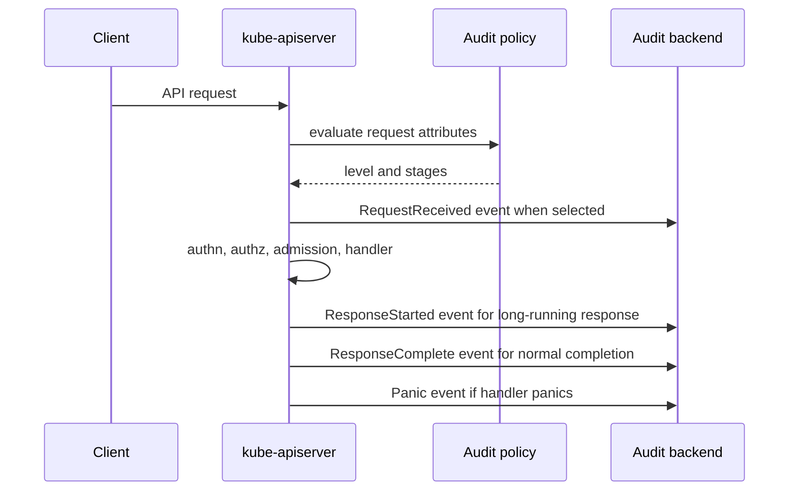

> **Complexity**: `[MEDIUM]` - Critical CKS control-plane forensics
>
> **Time to Complete**: 45-50 minutes
>
> **Prerequisites**: API server request flow, RBAC, JSON log analysis, static Pod manifests

## What You'll Be Able to Do

After completing this module, you will be able to analyze, configure, and troubleshoot Kubernetes audit logging as an operator practice rather than a passive log collection feature.

1. **Analyze** the audit event lifecycle, including policy levels, stage transitions, and which fields appear in each event.
2. **Configure** ordered audit policies that capture sensitive verbs, resources, namespaces, users, and subresources without leaking request bodies unnecessarily.
3. **Compare** file and webhook audit backends, including rotation limits, batching controls, buffers, retry behavior, throttling, and truncation.
4. **Troubleshoot** missing or dropped audit events caused by rule ordering, omitted stages, backend pressure, oversized requests, or incorrect API server flags.
5. **Build** a downstream audit pipeline pattern that ships API server events into durable storage and supports incident queries during CKS-style investigations.

## Why This Module Matters

Kubernetes audit logging records selected API server requests as audit events, so it is the control-plane evidence trail for questions such as who read a Secret, who created a privileged Pod, who changed RBAC, and which source IP started an exec session. The API server creates these records inside the request path, applies an audit policy to decide the level and stages to record, and then writes events to configured backends such as a local log file or an external webhook. ([Kubernetes Audit](https://v1-35.docs.kubernetes.io/docs/tasks/debug/debug-cluster/audit/))

The security value is not "more logs." The security value is deliberate visibility at the exact place where Kubernetes accepts or rejects API intent. A policy that logs every Secret at `RequestResponse` level can copy secret data into the audit store, while a policy that logs only a broad catch-all at `Metadata` level can miss the request body needed to reconstruct a dangerous RBAC change. The v1.35 audit policy API exposes per-rule levels, resources, verbs, namespaces, users, groups, non-resource URLs, `omitStages`, and `omitManagedFields`, so the operator's job is to choose evidence with a cost model. ([Audit Policy API](https://v1-35.docs.kubernetes.io/docs/reference/config-api/apiserver-audit.v1/), [Kubernetes Audit](https://v1-35.docs.kubernetes.io/docs/tasks/debug/debug-cluster/audit/))

CKS tasks tend to compress this topic into practical failures. You might receive an API server manifest with `--audit-policy-file` but no writable `--audit-log-path`, a policy where a broad `Metadata` rule appears before the `RequestResponse` rule that should catch RBAC changes, or a backend configuration that drops events because batch buffers cannot keep up. Solving those tasks requires reading policy order, confirming backend flags, generating a known API request, and proving that the resulting JSON event contains the expected `verb`, `user`, `objectRef`, `stage`, and `responseStatus` fields. ([Kube-apiserver Reference](https://v1-35.docs.kubernetes.io/docs/reference/command-line-tools-reference/kube-apiserver/), [Audit Event API](https://v1-35.docs.kubernetes.io/docs/reference/config-api/apiserver-audit.v1/))

Audit logging also has a production reliability boundary. Local file logging is easy to inspect during an exam, but it shares control-plane disk pressure and can be tampered with by a node-level attacker. Webhook logging can ship events off the control plane, but it adds queueing, batching, throttling, retry, and failure behavior that must be tuned deliberately. Kubernetes documents both backends as API server audit options, and the backend choice should be tied to retention, tamper resistance, latency, and how your incident-response system reads JSON events. ([Kubernetes Audit](https://v1-35.docs.kubernetes.io/docs/tasks/debug/debug-cluster/audit/), [Kube-apiserver Reference](https://v1-35.docs.kubernetes.io/docs/reference/command-line-tools-reference/kube-apiserver/))

For this module, keep one question in your head: "Which request would I need to prove later?" That question usually gives the right policy level. For Secret reads, `Metadata` proves access without duplicating the Secret body. For RBAC writes, `Request` or `RequestResponse` preserves the role or binding change. For health checks and high-volume watches, `None` or omitted stages can reduce noise. For failed admission policy decisions, audit annotations and response status often matter more than bodies. ([Kubernetes Audit](https://v1-35.docs.kubernetes.io/docs/tasks/debug/debug-cluster/audit/), [Pod Security Admission](https://v1-35.docs.kubernetes.io/docs/concepts/security/pod-security-admission/))

## Audit Event Lifecycle

An audit event begins when the API server receives a request and ends after the backend receives the stage records selected by policy. Kubernetes defines four audit stages: `RequestReceived` before the request is delegated to a handler, `ResponseStarted` emitted only for long-running requests such as watch or exec, once response headers are sent, `ResponseComplete` after the response body is complete, and `Panic` when request handling panics. Most policies omit `RequestReceived` because it duplicates many high-volume requests, but long-running requests such as watch or exec can make `ResponseStarted` evidence useful. ([Kubernetes Audit](https://v1-35.docs.kubernetes.io/docs/tasks/debug/debug-cluster/audit/), [Audit Event API](https://v1-35.docs.kubernetes.io/docs/reference/config-api/apiserver-audit.v1/))



The audit level controls how much event detail survives policy evaluation. `None` means no event is logged. `Metadata` logs request metadata such as user, timestamp, source IP, verb, URI, object reference, and response status without request or response bodies. `Request` adds the request body where applicable, and `RequestResponse` adds both request and response bodies where applicable. The generated API reference also documents that `requestObject` is recorded before version conversion, defaulting, admission, or merge handling, so logged request bodies should be read as submitted evidence rather than final persisted object state. ([Kubernetes Audit](https://v1-35.docs.kubernetes.io/docs/tasks/debug/debug-cluster/audit/), [Audit Event API](https://v1-35.docs.kubernetes.io/docs/reference/config-api/apiserver-audit.v1/))

Use `RequestResponse` with restraint. It can be appropriate for RBAC changes, policy resources, namespace deletion, or small security-critical APIs where response content matters, but it is a dangerous default for Secrets, TokenReviews, and large object updates. The audit API supports truncation controls at the API server, and `--audit-log-truncate-enabled` or `--audit-webhook-truncate-enabled` can cap oversized event payloads instead of letting a single large request dominate backend memory or disk. ([Kube-apiserver Reference](https://v1-35.docs.kubernetes.io/docs/reference/command-line-tools-reference/kube-apiserver/), [Audit Policy API](https://v1-35.docs.kubernetes.io/docs/reference/config-api/apiserver-audit.v1/))

An audit event has stable fields that make incident queries practical. `auditID` links stages of the same request, `user` records username and groups, `sourceIPs` records reported client IPs, `verb` records API intent, `objectRef` identifies the target resource or subresource, `requestURI` preserves the path, and `responseStatus` records the HTTP-style result. When a policy engine or admission controller adds audit annotations, those annotations can explain why an allowed or denied request violated a policy in audit mode. ([Audit Event API](https://v1-35.docs.kubernetes.io/docs/reference/config-api/apiserver-audit.v1/), [Pod Security Admission](https://v1-35.docs.kubernetes.io/docs/concepts/security/pod-security-admission/))

Do not treat `sourceIPs` as a perfect identity signal. It is useful for correlation, but identity still comes from Kubernetes authentication and authorization fields such as `user.username`, `user.groups`, and impersonation metadata. The authorization documentation describes Kubernetes authorizers as deciding whether an authenticated user can perform a verb on a resource, and audit records help you connect that authorization path to the request outcome. ([Kubernetes Authorization](https://v1-35.docs.kubernetes.io/docs/reference/access-authn-authz/authorization/), [Audit Event API](https://v1-35.docs.kubernetes.io/docs/reference/config-api/apiserver-audit.v1/))

## Audit Policy Structure and First Match

An audit policy is an `audit.k8s.io/v1` `Policy` object with a `rules` array, optional global settings such as `omitStages` and `omitManagedFields`, and per-rule match criteria. Kubernetes evaluates rules in order and uses only the first matching rule for a request, so place narrow sensitive rules before broad catch-all rules. A broad `Metadata` rule at the top can prevent a later `RequestResponse` RBAC rule from ever applying, and that is one of the fastest ways to fail an exam scenario. ([Kubernetes Audit](https://v1-35.docs.kubernetes.io/docs/tasks/debug/debug-cluster/audit/), [Audit Policy API](https://v1-35.docs.kubernetes.io/docs/reference/config-api/apiserver-audit.v1/))

```yaml
apiVersion: audit.k8s.io/v1
kind: Policy
omitStages:
  - RequestReceived
omitManagedFields: true
rules:
  - level: None
    nonResourceURLs:
      - /healthz*
      - /readyz*
      - /livez*
      - /version

  - level: Metadata
    resources:
      - group: ""
        resources: ["secrets"]

  - level: RequestResponse
    resources:
      - group: "rbac.authorization.k8s.io"
        resources: ["roles", "rolebindings", "clusterroles", "clusterrolebindings"]
    verbs: ["create", "update", "patch", "delete"]

  - level: RequestResponse
    resources:
      - group: ""
        resources: ["pods/exec", "pods/attach", "pods/portforward"]
    verbs: ["create"]

  - level: Request
    resources:
      - group: ""
        resources: ["pods"]
    verbs: ["create", "update", "patch", "delete"]

  - level: Metadata
```

Read a policy from top to bottom and ask what each rule excludes from later rules. The health-check rule removes noisy non-resource URLs. The Secret rule captures access metadata without body fields. The RBAC rule captures mutation bodies for permission changes. The Pod subresource rule catches `exec`, `attach`, and `portforward` because those are subresources and do not match a plain `pods` resource rule. The final catch-all keeps a minimal record for everything else. ([Kubernetes Audit](https://v1-35.docs.kubernetes.io/docs/tasks/debug/debug-cluster/audit/), [Audit Policy API](https://v1-35.docs.kubernetes.io/docs/reference/config-api/apiserver-audit.v1/))

Rule selectors are ANDed across the fields that are present in the rule. A rule with `verbs`, `resources`, and `namespaces` applies only when all three match. A rule with `users` or `userGroups` applies to those identities, and a rule with `nonResourceURLs` applies to paths that are not resource requests. That means namespace-specific evidence should use `namespaces`, identity-specific noise reduction should use `users` or `userGroups`, and API path noise should use `nonResourceURLs`. ([Audit Policy API](https://v1-35.docs.kubernetes.io/docs/reference/config-api/apiserver-audit.v1/))

The policy grammar distinguishes API groups from resources. Core resources such as Pods, Secrets, ConfigMaps, and Namespaces use `group: ""`; RBAC resources use `group: "rbac.authorization.k8s.io"`; admission or policy resources use their own API groups. A common policy bug is placing `clusterroles` under the core group or forgetting that subresources are written as resource strings such as `pods/exec`, `pods/log`, or `deployments/scale`. ([Audit Policy API](https://v1-35.docs.kubernetes.io/docs/reference/config-api/apiserver-audit.v1/), [Kubernetes Audit](https://v1-35.docs.kubernetes.io/docs/tasks/debug/debug-cluster/audit/))

`omitStages` can be global or per-rule. Use it to reduce duplicate records when you only need completed outcomes, but avoid hiding the only useful stage for long-running requests. `omitManagedFields` can remove the verbose managed fields data introduced by server-side apply, and the server-side apply enhancement record documents the policy and rule-level fields that let operators opt into omitting managed fields from audit logs. ([Kubernetes Audit](https://v1-35.docs.kubernetes.io/docs/tasks/debug/debug-cluster/audit/), [Server-side Apply KEP](https://github.com/kubernetes/enhancements/blob/master/keps/sig-api-machinery/555-server-side-apply/README.md))

The historical enhancement record for API audit logging reached stable status before modern KEP layout was consistent, while KEP-600 later proposed dynamic audit configuration and was withdrawn. The operator takeaway for Kubernetes v1.35 is to configure the supported static policy and backends through API server flags, not to rely on a dynamic audit configuration API. That history matters because older blog posts may mention dynamic audit objects that are not the current production path. ([API Audit Logging Enhancement](https://github.com/kubernetes/enhancements/issues/22), [KEP-600 Dynamic Audit Configuration](https://github.com/kubernetes/enhancements/blob/master/keps/sig-auth/600-dynamic-audit-configuration/README.md), [Kube-apiserver Reference](https://v1-35.docs.kubernetes.io/docs/reference/command-line-tools-reference/kube-apiserver/))

## API Server Flags and Backends

Audit logging does nothing until the API server has a policy file and at least one backend. On kubeadm-style clusters, those flags usually live in `/etc/kubernetes/manifests/kube-apiserver.yaml`, and the manifest also needs hostPath volumes for the policy and any local log directory. Kubernetes documents `--audit-policy-file` as the path to the policy file, `--audit-log-path` as the file backend path, and `--audit-webhook-config-file` as the kubeconfig for a webhook backend. ([Kubernetes Audit](https://v1-35.docs.kubernetes.io/docs/tasks/debug/debug-cluster/audit/), [Kube-apiserver Reference](https://v1-35.docs.kubernetes.io/docs/reference/command-line-tools-reference/kube-apiserver/))

```yaml
apiVersion: v1
kind: Pod
metadata:
  name: kube-apiserver
  namespace: kube-system
spec:
  containers:
    - name: kube-apiserver
      command:
        - kube-apiserver
        - --audit-policy-file=/etc/kubernetes/audit-policy.yaml
        - --audit-log-path=/var/log/kubernetes/audit/audit.log
        - --audit-log-maxage=30
        - --audit-log-maxbackup=10
        - --audit-log-maxsize=100
        - --audit-log-truncate-enabled=true
      volumeMounts:
        - name: audit-policy
          mountPath: /etc/kubernetes/audit-policy.yaml
          readOnly: true
        - name: audit-log
          mountPath: /var/log/kubernetes/audit
  volumes:
    - name: audit-policy
      hostPath:
        path: /etc/kubernetes/audit-policy.yaml
        type: File
    - name: audit-log
      hostPath:
        path: /var/log/kubernetes/audit
        type: DirectoryOrCreate
```

The file backend is the right CKS baseline because it is local, visible, and easy to verify with `tail` and `jq`. Its rotation flags have specific meanings: `--audit-log-maxage` controls days to retain old files, `--audit-log-maxbackup` controls how many rotated files to keep, and `--audit-log-maxsize` controls the maximum size in megabytes before rotation. Without these flags, the control-plane disk can become the hidden failure domain for a verbose policy. ([Kube-apiserver Reference](https://v1-35.docs.kubernetes.io/docs/reference/command-line-tools-reference/kube-apiserver/), [Kubernetes Audit](https://v1-35.docs.kubernetes.io/docs/tasks/debug/debug-cluster/audit/))

The webhook backend is the right production pattern when audit events need to leave the control-plane node quickly. Its kubeconfig describes the remote endpoint, CA data, and credentials, while API server flags control batching and delivery behavior. `--audit-webhook-batch-max-size`, `--audit-webhook-batch-max-wait`, `--audit-webhook-batch-buffer-size`, `--audit-webhook-batch-throttle-qps`, `--audit-webhook-batch-throttle-burst`, and `--audit-webhook-initial-backoff` tune the queue, batch size, wait time, throttling, and retry backoff that sit between the API server and the receiver. ([Kubernetes Audit](https://v1-35.docs.kubernetes.io/docs/tasks/debug/debug-cluster/audit/), [Kube-apiserver Reference](https://v1-35.docs.kubernetes.io/docs/reference/command-line-tools-reference/kube-apiserver/))

Batching is a tradeoff, not a pure optimization. Larger batches and longer waits reduce request count against the receiver but increase the amount of audit evidence held in memory before delivery. Smaller buffers surface pressure faster but can drop events during spikes. Throttling protects the receiver but can make the queue lag during an incident. Retry backoff controls how aggressively the API server retries a failing webhook, so it should match receiver recovery expectations and alerting. ([Kube-apiserver Reference](https://v1-35.docs.kubernetes.io/docs/reference/command-line-tools-reference/kube-apiserver/), [KEP-600 Dynamic Audit Configuration](https://github.com/kubernetes/enhancements/blob/master/keps/sig-auth/600-dynamic-audit-configuration/README.md))

```yaml
apiVersion: v1
kind: Config
clusters:
  - name: audit-receiver
    cluster:
      server: https://audit-receiver.security.example/audit
      certificate-authority: /etc/kubernetes/pki/audit-receiver-ca.crt
users:
  - name: kube-apiserver-audit
    user:
      client-certificate: /etc/kubernetes/pki/audit-client.crt
      client-key: /etc/kubernetes/pki/audit-client.key
contexts:
  - name: audit
    context:
      cluster: audit-receiver
      user: kube-apiserver-audit
current-context: audit
```

When both file and webhook backends are configured, treat them as two evidence paths with different failure modes. The file path helps local break-glass troubleshooting, while the webhook path supports external retention and tamper resistance. The API server still applies the policy before sending events, so two backends do not fix a policy that selected `None`, used the wrong API group, matched the wrong namespace, or omitted the only stage that would show the request. ([Kubernetes Audit](https://v1-35.docs.kubernetes.io/docs/tasks/debug/debug-cluster/audit/), [Audit Policy API](https://v1-35.docs.kubernetes.io/docs/reference/config-api/apiserver-audit.v1/))

## Gotchas That Break Investigations

First-match semantics are the most common audit policy bug. If a broad rule such as `- level: Metadata` appears before a narrower `RequestResponse` rule, the later rule never sees matching requests. During review, mark each sensitive scenario and walk down the policy until the first matching rule. If the match happens earlier than expected, move the sensitive rule upward or tighten the broad rule. ([Kubernetes Audit](https://v1-35.docs.kubernetes.io/docs/tasks/debug/debug-cluster/audit/), [Audit Policy API](https://v1-35.docs.kubernetes.io/docs/reference/config-api/apiserver-audit.v1/))

Pod Security Admission can generate audit annotations for policy violations when namespaces use audit labels, and those annotations appear on audit events rather than as ordinary Kubernetes `Event` objects. If a task asks for `PolicyViolation` evidence, read the audit event annotations and response status before searching workload logs. Admission denial, admission audit annotation, and Kubernetes `Event` resources are different signals. ([Pod Security Admission](https://v1-35.docs.kubernetes.io/docs/concepts/security/pod-security-admission/), [Audit Event API](https://v1-35.docs.kubernetes.io/docs/reference/config-api/apiserver-audit.v1/))

The `system:masters` group is a break-glass identity group, and clusters commonly bind it to the `cluster-admin` role through default RBAC. Audit policies can match `userGroups: ["system:masters"]`, which is useful for high-signal tracking of emergency administrator use. The gotcha is that this is not a substitute for RBAC review: if too many client certificates or identities are in that group, audit logs will prove privileged use after the fact, but they will not reduce the authority of those identities. ([Kubernetes Authorization](https://v1-35.docs.kubernetes.io/docs/reference/access-authn-authz/authorization/), [Kubernetes Audit](https://v1-35.docs.kubernetes.io/docs/tasks/debug/debug-cluster/audit/))

Oversized requests can produce oversized audit events, especially at `RequestResponse` level with large ConfigMaps, CRDs, managed fields, or bulk object responses. Use truncation flags and `omitManagedFields` to reduce payload risk, and prefer `Metadata` for sensitive high-volume resources where body content is not required for the investigation. If an exam prompt mentions missing bodies or truncated events, inspect both the policy level and the API server truncate settings. ([Kube-apiserver Reference](https://v1-35.docs.kubernetes.io/docs/reference/command-line-tools-reference/kube-apiserver/), [Server-side Apply KEP](https://github.com/kubernetes/enhancements/blob/master/keps/sig-api-machinery/555-server-side-apply/README.md))

Subresources are easy to miss. `kubectl exec` is not a plain Pod update, `kubectl logs` targets `pods/log`, port forwarding targets `pods/portforward`, and scaling can target a workload's `scale` subresource. If the policy only names `pods`, it may not capture the subresource operation you care about. For CKS troubleshooting, always compare the observed `requestURI` and `objectRef.subresource` against the policy's `resources` strings. ([Audit Event API](https://v1-35.docs.kubernetes.io/docs/reference/config-api/apiserver-audit.v1/), [Kubernetes Audit](https://v1-35.docs.kubernetes.io/docs/tasks/debug/debug-cluster/audit/))

Webhook delivery issues look like policy issues until you inspect backend pressure. A correct policy can still lose practical value when the receiver is down, buffers are too small, throttling is too strict, or TLS credentials in the webhook kubeconfig are wrong. Verify the API server flags, then verify receiver reachability, then generate one known request and search for its `auditID` or unique object name in the external store. ([Kubernetes Audit](https://v1-35.docs.kubernetes.io/docs/tasks/debug/debug-cluster/audit/), [Kube-apiserver Reference](https://v1-35.docs.kubernetes.io/docs/reference/command-line-tools-reference/kube-apiserver/))

## Downstream Pipeline Pattern

A downstream pipeline should preserve JSON audit events, protect them from control-plane disk loss, and make common incident fields searchable. The Kubernetes audit file backend writes line-oriented JSON events, so a log shipper can read `/var/log/kubernetes/audit/audit.log`, parse each line, add cluster metadata, and write the record to object storage, Loki, Elasticsearch, or another SIEM. Vector's file source reads local files, and its AWS S3 sink writes events to S3-compatible storage, which makes a compact example suitable for audit retention. ([Vector File Source](https://vector.dev/docs/reference/configuration/sources/file/), [Vector AWS S3 Sink](https://vector.dev/docs/reference/configuration/sinks/aws_s3/))

```toml
[sources.kube_audit]
type = "file"
include = ["/var/log/kubernetes/audit/audit.log"]
read_from = "end"

[transforms.parse_audit_json]
type = "remap"
inputs = ["kube_audit"]
source = '''
. = parse_json!(.message)
.cluster = "prod-us"
'''

[sinks.audit_s3]
type = "aws_s3"
inputs = ["parse_audit_json"]
bucket = "company-kubernetes-audit"
# %F = strftime YYYY-MM-DD; supported in Vector S3 sink key_prefix.
key_prefix = "cluster=prod-us/date=%F/"
compression = "gzip"
encoding.codec = "json"
```

Keep the pipeline example small because the policy is still the control point. A shipper cannot recover a request body that the audit policy chose not to log, and an S3 bucket cannot prove an exec session if the policy never matched `pods/exec`. The pipeline's job is durability, indexing, and access control; the policy's job is deciding which evidence exists. Use log storage permissions as carefully as Secret permissions because audit records can expose usernames, source addresses, object names, request bodies, and admission annotations. ([Audit Policy API](https://v1-35.docs.kubernetes.io/docs/reference/config-api/apiserver-audit.v1/), [Vector AWS S3 Sink](https://vector.dev/docs/reference/configuration/sinks/aws_s3/))

For incident queries, normalize around a small set of fields: `requestReceivedTimestamp`, `auditID`, `user.username`, `user.groups`, `verb`, `objectRef.resource`, `objectRef.subresource`, `objectRef.namespace`, `objectRef.name`, `sourceIPs`, `userAgent`, and `responseStatus.code`. Those fields come from the audit event API and let you answer who did what, where, when, and whether it succeeded without reading large request bodies first. ([Audit Event API](https://v1-35.docs.kubernetes.io/docs/reference/config-api/apiserver-audit.v1/))

```bash
jq -c '
  select(.objectRef.resource == "secrets" and .verb == "get")
  | {
      time: .requestReceivedTimestamp,
      user: .user.username,
      groups: .user.groups,
      namespace: .objectRef.namespace,
      secret: .objectRef.name,
      sourceIPs: .sourceIPs,
      status: .responseStatus.code
    }
' /var/log/kubernetes/audit/audit.log
```

## CKS Exam Workflow

Start with the API server manifest because flags decide whether the policy file and backend are even loaded. Confirm `--audit-policy-file`, then confirm either `--audit-log-path` with rotation flags or `--audit-webhook-config-file` with batching flags. On a static Pod control plane, also confirm that the policy file and log directory are mounted into the API server container, because a correct host file is useless when the container cannot read it. ([Kubernetes Audit](https://v1-35.docs.kubernetes.io/docs/tasks/debug/debug-cluster/audit/), [Kube-apiserver Reference](https://v1-35.docs.kubernetes.io/docs/reference/command-line-tools-reference/kube-apiserver/))

Next, generate a controlled request that should match the target rule. If the task asks for Secret access, create or read a disposable Secret in a disposable namespace and search for that namespace and object name. If the task asks for RBAC changes, create a small RoleBinding and search for `rbac.authorization.k8s.io`. If the task asks for exec capture, run an exec against a known Pod and search for `pods/exec` or `objectRef.subresource == "exec"`. ([Audit Event API](https://v1-35.docs.kubernetes.io/docs/reference/config-api/apiserver-audit.v1/), [Kubernetes Audit](https://v1-35.docs.kubernetes.io/docs/tasks/debug/debug-cluster/audit/))

When an expected event is missing, debug in this order: policy file path, YAML validity, rule ordering, resource group and subresource, verb, namespace selector, user or group selector, omitted stages, backend path or webhook configuration, and truncation or delivery pressure. That order mirrors the request lifecycle, so each step removes one class of failure before you change the policy. It also prevents the common mistake of making the catch-all rule more verbose when the real bug is that a narrow rule is below the catch-all. ([Kubernetes Audit](https://v1-35.docs.kubernetes.io/docs/tasks/debug/debug-cluster/audit/), [Audit Policy API](https://v1-35.docs.kubernetes.io/docs/reference/config-api/apiserver-audit.v1/))

```bash
sudo grep -- '--audit-' /etc/kubernetes/manifests/kube-apiserver.yaml
sudo ls -l /etc/kubernetes/audit-policy.yaml /var/log/kubernetes/audit
kubectl create namespace audit-lab
kubectl create secret generic audit-lab-secret -n audit-lab --from-literal=password=redacted
kubectl get secret audit-lab-secret -n audit-lab
sudo tail -n 200 /var/log/kubernetes/audit/audit.log | jq -c '
  select(.objectRef.namespace == "audit-lab")
  | {stage, level, verb, resource: .objectRef.resource, name: .objectRef.name, user: .user.username, status: .responseStatus.code}
'
kubectl delete namespace audit-lab
```

## Policy Review Drills

Review the policy as a sequence of evidence decisions. Mark the request you care about, then identify the first rule that matches its verb, group, resource, namespace, user, and URL form. Stop when the first match is found. Do not keep scanning for a better later rule. That habit matches the documented policy behavior and exposes the most common bad ordering before it reaches an API server. ([Kubernetes Audit](https://v1-35.docs.kubernetes.io/docs/tasks/debug/debug-cluster/audit/), [Audit Policy API](https://v1-35.docs.kubernetes.io/docs/reference/config-api/apiserver-audit.v1/))

Use levels as a deliberate evidence ladder. `Metadata` answers who, what, where, when, and whether the request succeeded. `Request` adds the submitted body and is useful for writes where the object diff matters. `RequestResponse` adds the response body and should be reserved for narrow, high-value cases. `None` is valid for noise, but only after you can explain why the request has low security value. ([Kubernetes Audit](https://v1-35.docs.kubernetes.io/docs/tasks/debug/debug-cluster/audit/), [Audit Event API](https://v1-35.docs.kubernetes.io/docs/reference/config-api/apiserver-audit.v1/))

Check resources by API group before checking resource names. A core Secret and an RBAC ClusterRole both look like ordinary YAML objects, but their audit policy groups differ. A core resource uses an empty group. RBAC resources use `rbac.authorization.k8s.io`. Admission and policy resources use their own groups. Wrong groups can make a rule look precise while it never matches the intended request. ([Audit Policy API](https://v1-35.docs.kubernetes.io/docs/reference/config-api/apiserver-audit.v1/))

Check subresources as separate evidence targets. Pod exec, attach, logs, and port-forward operations are request paths with subresource information, and they are often more security-relevant than ordinary Pod reads. A policy that proves Pod creation may still fail to prove shell access. Search one known event, read the `requestURI` and `objectRef.subresource`, then write the policy string that matches the observed request. ([Audit Event API](https://v1-35.docs.kubernetes.io/docs/reference/config-api/apiserver-audit.v1/), [Kubernetes Audit](https://v1-35.docs.kubernetes.io/docs/tasks/debug/debug-cluster/audit/))

Treat namespaces as scoping tools, not as a replacement for resource selection. A namespace rule can focus production evidence, but it cannot fix a wrong API group, missing subresource, or broad earlier rule. Cluster-scoped resources such as ClusterRoles and ClusterRoleBindings also do not have object namespaces, so a namespace filter can accidentally exclude the exact RBAC evidence you need. ([Audit Policy API](https://v1-35.docs.kubernetes.io/docs/reference/config-api/apiserver-audit.v1/), [Audit Event API](https://v1-35.docs.kubernetes.io/docs/reference/config-api/apiserver-audit.v1/))

Review user and group selectors with the same care as RBAC. A policy rule can match usernames or groups, including break-glass identities such as `system:masters`, but the audit rule does not grant or remove permission. Authorization still decides whether the request is allowed. Audit selection only decides which record is written after the request reaches the API server path. ([Kubernetes Authorization](https://v1-35.docs.kubernetes.io/docs/reference/access-authn-authz/authorization/), [Kubernetes Audit](https://v1-35.docs.kubernetes.io/docs/tasks/debug/debug-cluster/audit/))

Use `omitStages` after you know which stage answers the question. Many investigations need `ResponseComplete` because it includes the outcome. Long-running requests can surface through `ResponseStarted`. Panic records are rare but important when the handler fails. Omitting `RequestReceived` usually reduces duplicate noise, but stage trimming should follow evidence requirements rather than habit. ([Kubernetes Audit](https://v1-35.docs.kubernetes.io/docs/tasks/debug/debug-cluster/audit/), [Audit Event API](https://v1-35.docs.kubernetes.io/docs/reference/config-api/apiserver-audit.v1/))

## Backend Failure Drills

Separate policy selection from backend delivery during troubleshooting. A selected event can be lost from the place you are searching if the file path is not mounted, the directory is not writable, the webhook endpoint is unreachable, or batching is stalled. Prove selection with a local file when possible. Then prove delivery to the external backend with the same unique object name. ([Kubernetes Audit](https://v1-35.docs.kubernetes.io/docs/tasks/debug/debug-cluster/audit/), [Kube-apiserver Reference](https://v1-35.docs.kubernetes.io/docs/reference/command-line-tools-reference/kube-apiserver/))

For the file backend, debug path and rotation first. The API server writes inside its container view, so hostPath mounts must expose the policy file and log directory at the paths named by flags. Rotation settings then decide retention pressure. If the policy becomes more verbose, rotation must be revisited before the control-plane disk becomes the failure boundary. ([Kubernetes Audit](https://v1-35.docs.kubernetes.io/docs/tasks/debug/debug-cluster/audit/), [Kube-apiserver Reference](https://v1-35.docs.kubernetes.io/docs/reference/command-line-tools-reference/kube-apiserver/))

For the webhook backend, debug identity and transport before queue tuning. The kubeconfig must point to the receiver, trust the receiver certificate, and present credentials the receiver accepts. Only after TLS and authentication are proven should you tune batch size, wait time, buffer size, throttle QPS, throttle burst, initial backoff, and truncation. That order keeps network failures distinct from load failures. ([Kubernetes Audit](https://v1-35.docs.kubernetes.io/docs/tasks/debug/debug-cluster/audit/), [Kube-apiserver Reference](https://v1-35.docs.kubernetes.io/docs/reference/command-line-tools-reference/kube-apiserver/))

Interpret buffers as time-limited evidence storage. A bigger buffer can absorb a burst, but it also holds more undelivered events inside the API server process. A smaller buffer fails sooner under pressure, which may be easier to alert on. Throttling protects a receiver, but it can create lag when incident traffic rises. Pick these settings from measured receiver capacity, not from a generic template. ([Kube-apiserver Reference](https://v1-35.docs.kubernetes.io/docs/reference/command-line-tools-reference/kube-apiserver/), [KEP-600 Dynamic Audit Configuration](https://github.com/kubernetes/enhancements/blob/master/keps/sig-auth/600-dynamic-audit-configuration/README.md))

Use truncation as a reliability control, not as a substitute for policy design. Truncation can keep an oversized event from overwhelming a backend, but it can also remove body details that investigators expected. If bodies are routinely too large, reduce the level for noisy resources, omit managed fields, or scope the high-body rule to the exact operation. ([Kube-apiserver Reference](https://v1-35.docs.kubernetes.io/docs/reference/command-line-tools-reference/kube-apiserver/), [Server-side Apply KEP](https://github.com/kubernetes/enhancements/blob/master/keps/sig-api-machinery/555-server-side-apply/README.md))

Treat dual backends as redundancy with shared policy. A file backend and webhook backend can fail independently, but they both receive what the policy selected. If neither backend contains an event, suspect policy or stage selection first. If the file has the event and the external store does not, suspect webhook delivery, receiver parsing, shipper state, or downstream indexing. ([Kubernetes Audit](https://v1-35.docs.kubernetes.io/docs/tasks/debug/debug-cluster/audit/), [Vector File Source](https://vector.dev/docs/reference/configuration/sources/file/))

Validate downstream shippers with one event per scenario. A Secret get proves sensitive metadata. An RBAC patch proves request-body capture. A Pod exec proves subresource coverage. A denied policy request proves response status and annotations. Send those events through the shipper, then query the destination by object name, audit ID, user, and timestamp. ([Audit Event API](https://v1-35.docs.kubernetes.io/docs/reference/config-api/apiserver-audit.v1/), [Vector AWS S3 Sink](https://vector.dev/docs/reference/configuration/sinks/aws_s3/))

## Investigation Query Drills

Start every audit investigation with a time window and a target field. A known namespace, object name, user, source IP, or user agent reduces noise faster than reading full JSON bodies. The audit event API gives you stable fields for those filters, and those fields remain useful even when the policy level is only `Metadata`. ([Audit Event API](https://v1-35.docs.kubernetes.io/docs/reference/config-api/apiserver-audit.v1/))

For Secret incidents, search reads and writes separately. Reads answer exposure. Writes answer persistence changes. Deletes answer destructive activity. Keep the level at `Metadata` unless the investigation specifically requires body data and the organization accepts the exposure risk. In most production cases, knowing who touched which Secret is enough to start response and rotation. ([Kubernetes Audit](https://v1-35.docs.kubernetes.io/docs/tasks/debug/debug-cluster/audit/), [Audit Event API](https://v1-35.docs.kubernetes.io/docs/reference/config-api/apiserver-audit.v1/))

For RBAC incidents, preserve enough request body to reconstruct the permission change. Metadata can tell you that a RoleBinding changed, but it may not show the subject or role reference that created the escalation. A narrow `Request` or `RequestResponse` rule for RBAC mutation verbs is usually easier to defend than verbose body logging for every resource. ([Kubernetes Audit](https://v1-35.docs.kubernetes.io/docs/tasks/debug/debug-cluster/audit/), [Audit Policy API](https://v1-35.docs.kubernetes.io/docs/reference/config-api/apiserver-audit.v1/))

For admission and Pod Security questions, read response status and annotations together. A request can be allowed with an audit annotation, warned to the client, or denied with a response status. Those outcomes answer different questions. The audit event connects policy signal, identity, target object, and result in one place when the policy selected the request. ([Pod Security Admission](https://v1-35.docs.kubernetes.io/docs/concepts/security/pod-security-admission/), [Audit Event API](https://v1-35.docs.kubernetes.io/docs/reference/config-api/apiserver-audit.v1/))

For break-glass review, search high-privilege groups and unusual source locations. `system:masters` traffic may be authorized, but it should still be rare and explainable. Audit queries should show who used the identity, when it was used, which resources were touched, and whether the source IP matches the expected control-plane or administrator workstation path. ([Kubernetes Authorization](https://v1-35.docs.kubernetes.io/docs/reference/access-authn-authz/authorization/), [Audit Event API](https://v1-35.docs.kubernetes.io/docs/reference/config-api/apiserver-audit.v1/))

For CKS repair tasks, write the smallest policy change that proves the requested operation. Add one narrow rule. Move it above the broad rule. Generate one matching request. Query the event. Avoid changing unrelated rules because the exam usually scores the requested evidence path, and production change review should preserve unrelated logging behavior. ([Kubernetes Audit](https://v1-35.docs.kubernetes.io/docs/tasks/debug/debug-cluster/audit/), [Audit Policy API](https://v1-35.docs.kubernetes.io/docs/reference/config-api/apiserver-audit.v1/))

For upgrade review, compare audit output before and after changing Kubernetes versions, policy files, or server-side apply behavior. Audit event shapes are API objects, but body content can change when clients change submitted fields, managed fields grow, or admission behavior changes object defaults. Keep one allowed Pod create, one Secret read, one RBAC mutation, one subresource request, and one admission violation as regression probes. Run those probes after control-plane changes. Confirm stage, level, object reference, response status, annotations, and body presence. If managed fields dominate request bodies, review the policy-level and rule-level `omitManagedFields` decision. If the receiver starts rejecting events, check payload size before changing policy semantics. This review style keeps audit configuration tied to evidence requirements instead of letting upgrades silently change investigation quality. It also prevents the opposite failure, where a team disables useful body evidence because one noisy field made storage expensive. ([Audit Event API](https://v1-35.docs.kubernetes.io/docs/reference/config-api/apiserver-audit.v1/), [Server-side Apply KEP](https://github.com/kubernetes/enhancements/blob/master/keps/sig-api-machinery/555-server-side-apply/README.md), [Kube-apiserver Reference](https://v1-35.docs.kubernetes.io/docs/reference/command-line-tools-reference/kube-apiserver/))

For tamper review, assume local audit files are useful but not sufficient. A node-level attacker can target local files, static Pod manifests, or hostPath directories after gaining control-plane access. A webhook or shipper pipeline reduces that risk by moving events to storage with different credentials and retention controls. The policy still needs to select the evidence before shipment. The receiver still needs to preserve JSON fields. The storage layer still needs access control. During review, ask whether an attacker who can edit the API server manifest can also erase the only copy of the events that prove the edit. If the answer is yes, strengthen external delivery and alert on audit flag changes. This is why file logging is excellent for CKS visibility, while production incident response usually needs an off-node evidence path. ([Kubernetes Audit](https://v1-35.docs.kubernetes.io/docs/tasks/debug/debug-cluster/audit/), [Vector File Source](https://vector.dev/docs/reference/configuration/sources/file/), [Vector AWS S3 Sink](https://vector.dev/docs/reference/configuration/sinks/aws_s3/))

For receiver parsing review, preserve the original audit event before adding derived fields. A downstream tool can add cluster, environment, team, or retention metadata, but it should not discard `auditID`, `requestURI`, `objectRef`, `user`, `sourceIPs`, `stage`, `level`, `annotations`, or `responseStatus`. Those fields connect separate stages of the same request, identify the actor, name the target object, and show the result. If the pipeline parses JSON into a different schema, keep a raw copy or a faithful structured copy. If the pipeline stores only selected fields, document which investigations become impossible. For example, dropping `requestURI` can make unusual subresource paths harder to spot, and dropping annotations can hide policy audit signals. Pipeline normalization should improve queries without narrowing the evidence below what the policy deliberately collected. ([Audit Event API](https://v1-35.docs.kubernetes.io/docs/reference/config-api/apiserver-audit.v1/), [Vector File Source](https://vector.dev/docs/reference/configuration/sources/file/))

For policy change review, require each new rule to name a scenario, a level, and a cost. The scenario says what later question the rule answers. The level says whether metadata, request body, or response body is needed. The cost says which storage, sensitivity, or backend pressure the rule adds. A rule that cannot name its scenario is usually noise. A rule that cannot justify its level is usually too broad. A rule that cannot describe its cost will surprise the platform team later. This review is especially important for `RequestResponse`, wildcard resources, wildcard users, and namespace-wide rules. It is also useful for `None` rules because skipped events are evidence you chose not to have. In CKS, this thinking helps you explain the fix. In production, it gives reviewers a durable reason for accepting or rejecting the change. Add an owner for the rule. Add the expected retention period. Add the expected downstream destination. Add the expected test request. Add the field that proves success. Add the rollback path. Add the alert that should fire when the path fails. These notes turn audit policy from a silent YAML file into an operated control. They also keep body logging from spreading through copy and paste. When a reviewer sees `RequestResponse`, the reviewer should ask which body field is needed. When a reviewer sees a wildcard, the reviewer should ask which resources were considered and rejected. When a reviewer sees a `None` rule, the reviewer should ask which incident question will no longer be answerable. When a reviewer sees `omitStages`, the reviewer should ask which stage remains for outcome proof. When a reviewer sees a user-group selector, the reviewer should ask whether the selected group is stable. When a reviewer sees webhook batching changes, the reviewer should ask which receiver limit drove the setting. When a reviewer sees file rotation changes, the reviewer should ask how long local evidence remains during an external outage. When a reviewer sees truncation enabled, the reviewer should ask how investigators will recognize truncated records. These questions are mechanical, but they are not bureaucracy. They preserve the link between policy syntax, backend behavior, and investigation results. They also give new operators a checklist for reading existing clusters without rewriting them. Keep one written example beside the policy. Include the request, the selected rule, the expected level, the expected stage, and the query that proves the event landed. That example becomes a regression test for future edits. It also gives an incident responder a known-good shape when the next alert fires. If the example no longer works, fix the policy or backend before relying on the audit trail. Review those examples after every policy edit. Review them after every receiver change. Review them after every control-plane upgrade. Audit logging is only useful when the team can still produce the evidence it expects under current cluster behavior. Evidence that cannot be reproduced during practice will fail under incident pressure. ([Kubernetes Audit](https://v1-35.docs.kubernetes.io/docs/tasks/debug/debug-cluster/audit/), [Audit Policy API](https://v1-35.docs.kubernetes.io/docs/reference/config-api/apiserver-audit.v1/))

## Did You Know?

- Kubernetes audit policy rules are first-match, so a broad `Metadata` rule above a narrower `RequestResponse` rule changes evidence collection without producing a policy syntax error. ([Kubernetes Audit](https://v1-35.docs.kubernetes.io/docs/tasks/debug/debug-cluster/audit/))
- `Request` and `RequestResponse` levels can log request or response bodies, which means they can turn audit storage into another location containing sensitive payloads if used carelessly. ([Audit Policy API](https://v1-35.docs.kubernetes.io/docs/reference/config-api/apiserver-audit.v1/))
- `omitManagedFields` is available at policy and rule level so operators can reduce server-side-apply metadata in audit bodies without disabling audit logging. ([Server-side Apply KEP](https://github.com/kubernetes/enhancements/blob/master/keps/sig-api-machinery/555-server-side-apply/README.md))
- A webhook backend is configured with a kubeconfig-like file, but its delivery characteristics are controlled by API server flags for batching, buffers, throttling, truncation, and initial backoff. ([Kube-apiserver Reference](https://v1-35.docs.kubernetes.io/docs/reference/command-line-tools-reference/kube-apiserver/))

## Common Mistakes

| Mistake | Why It Hurts | Better Operator Move |
|---|---|---|
| Placing a catch-all `Metadata` rule first | Sensitive later rules never match because policy evaluation stops at the first match | Put narrow high-value rules above broad defaults and test with known requests |
| Logging Secrets at `RequestResponse` | Secret values can be copied into audit storage and downstream systems | Use `Metadata` for Secret access and rotate any values exposed by prior logs |
| Forgetting subresources | `pods/exec`, `pods/log`, and `pods/portforward` may not match a plain `pods` rule | Add explicit subresource resource strings for interactive access paths |
| Enabling file logging without rotation | Verbose policies can fill control-plane disk and destabilize the API server | Set max age, backup count, and size flags before increasing verbosity |
| Assuming webhook means durable evidence | Bad TLS, small buffers, receiver outage, or throttling can prevent delivery | Test receiver reachability and search for a controlled request in the external store |
| Ignoring audit annotations | Policy violations in audit mode can be recorded as event annotations instead of workload logs | Inspect `annotations`, `responseStatus`, and admission messages in the audit event |
| Treating `system:masters` as ordinary admin traffic | Break-glass use may be high risk even when it is authorized | Match and alert on that group while separately reviewing RBAC and certificate issuance |

## Knowledge Check

1. You need evidence that users accessed Secrets in `prod`, but you must not duplicate Secret values into the audit log. Which audit level and rule placement do you choose?

<details>
<summary>Answer</summary>

Use a narrow `Metadata` rule for core `secrets` before any broad catch-all rule, and add namespace or user selectors only when the scenario requires them. `Metadata` records the audit event lifecycle fields needed for investigation, including user, verb, namespace, object name, source IP, stage, and response status, while avoiding request and response bodies. If the current policy has a broad `RequestResponse` rule above the Secret rule, move the Secret rule higher because first-match ordering controls which level applies.
</details>

2. A policy tries to capture `kubectl exec`, but the only matching rule is `resources: ["pods"]` with verbs `["create", "update", "patch", "delete"]`. What is missing?

<details>
<summary>Answer</summary>

Add an explicit subresource rule for `pods/exec`, and usually include `pods/attach` and `pods/portforward` because those interactive paths are common incident targets. A plain `pods` rule does not prove that it matches every Pod subresource, so the troubleshooting path is to search a known exec request, read `objectRef.subresource`, and align the policy resource string with the observed audit event. This is a rule-ordering and resource-matching problem, not a backend problem.
</details>

3. The audit log file exists, but the control-plane disk keeps filling during load tests. Which file backend flags should you inspect first?

<details>
<summary>Answer</summary>

Inspect `--audit-log-maxage`, `--audit-log-maxbackup`, and `--audit-log-maxsize`, then review policy verbosity and omitted stages. The rotation flags bound local file retention by age, backup count, and megabytes per file, while policy tuning controls how much evidence is generated in the first place. If large bodies are part of the pressure, add truncation and use `omitManagedFields` where managed fields are not evidence for the investigation.
</details>

4. A webhook receiver is configured, but incident events never appear in S3. The policy is correct when tested against the local file backend. What backend controls should you check?

<details>
<summary>Answer</summary>

Check the webhook kubeconfig endpoint and CA first, then inspect the API server's webhook batch controls: max size, max wait, buffer size, throttle QPS, throttle burst, initial backoff, and truncation. A correct audit policy selects events before backend delivery, so missing external records after local file success usually point to TLS, receiver availability, queue pressure, throttling, or retry behavior. Generate one unique request and trace that object's name or `auditID` through the receiver logs and destination bucket.
</details>

5. A Pod Security namespace uses audit mode, and the team asks where to find `PolicyViolation` evidence. Where should you look?

<details>
<summary>Answer</summary>

Look in Kubernetes audit events, especially annotations and response fields, before searching application logs or ordinary Kubernetes `Event` objects. Pod Security Admission can add audit annotations when an object violates a configured audit level without necessarily denying the request. The evidence you need is the audit event that contains the admission annotation, request identity, target object, and response status, which is why the audit policy must retain enough metadata for those API requests.
</details>

6. A catch-all `Metadata` rule appears above a `RequestResponse` RBAC rule, and investigators cannot reconstruct who added `cluster-admin` to a subject. How do you fix the policy?

<details>
<summary>Answer</summary>

Move the RBAC mutation rule above the catch-all and match `group: "rbac.authorization.k8s.io"` with resources such as `roles`, `rolebindings`, `clusterroles`, and `clusterrolebindings` for create, update, patch, and delete. First-match semantics caused the broad metadata rule to win, so the request body was not captured for the RBAC change. After editing the policy and restarting or reloading the API server through its static Pod lifecycle, create a test RoleBinding and verify the event level and object reference.
</details>

7. You must ship audit logs to durable storage but keep exam troubleshooting easy on the control plane. Which architecture balances both needs?

<details>
<summary>Answer</summary>

Use both a rotated file backend and a webhook or shipper-based downstream pipeline, then test both with a controlled request. The file backend gives immediate local visibility with `tail` and `jq`, while the external path provides durability, retention, and tamper resistance. The downstream pipeline should preserve JSON fields such as user, verb, object reference, source IP, status, and audit ID, but it cannot recover evidence that the audit policy did not select.
</details>

## Hands-On Practice

- [ ] Configure an audit policy that captures Secret metadata, RBAC mutations, Pod subresource access, and a metadata catch-all while preserving the audit event lifecycle fields needed for incident review.
- [ ] Compare file backend rotation flags with webhook batch, buffer, retry, throttle, and truncation flags, then explain which failure each setting is meant to control.
- [ ] Troubleshoot a missing audit event by walking rule order, resource group, subresource, verb, namespace, user group, omitted stage, and backend delivery.
- [ ] Build a short downstream pipeline example that reads the audit log file, preserves JSON, and sends events into durable storage for later queries.

Create a disposable policy file and use it as a review artifact before touching a real API server manifest. The point of this practice is not to apply a policy to your current cluster blindly; it is to learn the operator reading path that CKS tasks expect. Review the order, identify the first matching rule for each scenario, and explain why body logging is or is not needed for the investigation. ([Kubernetes Audit](https://v1-35.docs.kubernetes.io/docs/tasks/debug/debug-cluster/audit/), [Audit Policy API](https://v1-35.docs.kubernetes.io/docs/reference/config-api/apiserver-audit.v1/))

```bash
cat > /tmp/cks-audit-policy.yaml <<'EOF'
apiVersion: audit.k8s.io/v1
kind: Policy
omitStages:
  - RequestReceived
omitManagedFields: true
rules:
  - level: None
    nonResourceURLs: ["/healthz*", "/readyz*", "/livez*", "/version"]
  - level: Metadata
    resources:
      - group: ""
        resources: ["secrets"]
  - level: RequestResponse
    resources:
      - group: "rbac.authorization.k8s.io"
        resources: ["roles", "rolebindings", "clusterroles", "clusterrolebindings"]
    verbs: ["create", "update", "patch", "delete"]
  - level: RequestResponse
    resources:
      - group: ""
        resources: ["pods/exec", "pods/attach", "pods/portforward"]
    verbs: ["create"]
  - level: Request
    resources:
      - group: ""
        resources: ["pods"]
    verbs: ["create", "update", "patch", "delete"]
  - level: Metadata
EOF

cat /tmp/cks-audit-policy.yaml
```

Use the review questions below against the policy. Which rule captures `kubectl get secret db -n prod`? Which rule captures a RoleBinding patch? Which rule captures exec? Which rule captures a health probe? Which sensitive request would still be captured only at the catch-all level? Answering these questions from top to bottom is the habit that prevents first-match mistakes in both CKS tasks and production reviews.

```bash
sudo grep -- '--audit-' /etc/kubernetes/manifests/kube-apiserver.yaml || true
sudo test -f /etc/kubernetes/audit-policy.yaml && sudo sed -n '1,160p' /etc/kubernetes/audit-policy.yaml
sudo test -d /var/log/kubernetes/audit && sudo ls -lh /var/log/kubernetes/audit
```

If you have a disposable cluster with audit logging enabled, generate one request for each target category and search the last part of the audit log. Use unique object names so you can separate your test from controller noise. Never use production Secret values for this exercise; the point is to prove metadata capture and policy matching, not to create sensitive data in a lab log.

```bash
kubectl create namespace audit-lab
kubectl create secret generic audit-lab-token -n audit-lab --from-literal=token=redacted
kubectl get secret audit-lab-token -n audit-lab
kubectl create role audit-lab-reader -n audit-lab --verb=get --resource=pods
kubectl create rolebinding audit-lab-reader -n audit-lab --role=audit-lab-reader --user=audit-user

sudo tail -n 500 /var/log/kubernetes/audit/audit.log | jq -c '
  select(.objectRef.namespace == "audit-lab")
  | {
      time: .requestReceivedTimestamp,
      level,
      stage,
      verb,
      group: .objectRef.apiGroup,
      resource: .objectRef.resource,
      subresource: .objectRef.subresource,
      name: .objectRef.name,
      user: .user.username,
      status: .responseStatus.code
    }
'

kubectl delete namespace audit-lab
rm -f /tmp/cks-audit-policy.yaml
```

## Next Module

[Module 6.2: Runtime Security with Falco](../module-6.2-falco/) - Detect suspicious container and host behavior after the API server has already accepted workload intent.

## Sources

- [Kubernetes v1.35: Auditing](https://v1-35.docs.kubernetes.io/docs/tasks/debug/debug-cluster/audit/)
- [Kubernetes v1.35: Audit API reference](https://v1-35.docs.kubernetes.io/docs/reference/config-api/apiserver-audit.v1/)
- [Kubernetes v1.35: kube-apiserver options](https://v1-35.docs.kubernetes.io/docs/reference/command-line-tools-reference/kube-apiserver/)
- [Kubernetes v1.35: Authorization overview](https://v1-35.docs.kubernetes.io/docs/reference/access-authn-authz/authorization/)
- [Kubernetes v1.35: Pod Security Admission](https://v1-35.docs.kubernetes.io/docs/concepts/security/pod-security-admission/)
- [Kubernetes Enhancements: API Audit Logging enhancement record](https://github.com/kubernetes/enhancements/issues/22)
- [Kubernetes Enhancements: KEP-600 Dynamic Audit Configuration](https://github.com/kubernetes/enhancements/blob/master/keps/sig-auth/600-dynamic-audit-configuration/README.md)
- [Kubernetes Enhancements: KEP-555 Server-side Apply audit policy fields](https://github.com/kubernetes/enhancements/blob/master/keps/sig-api-machinery/555-server-side-apply/README.md)
- [Vector documentation: file source](https://vector.dev/docs/reference/configuration/sources/file/)
- [Vector documentation: AWS S3 sink](https://vector.dev/docs/reference/configuration/sinks/aws_s3/)
