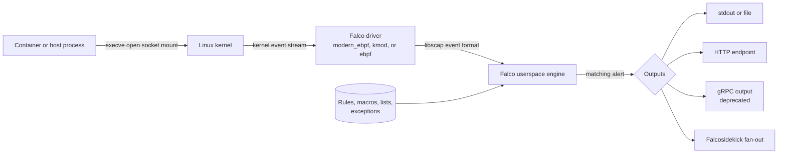
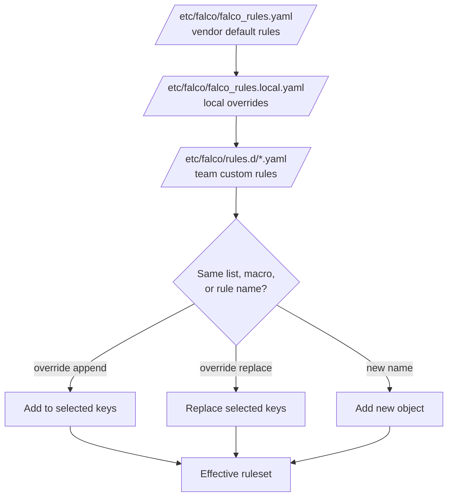

> **Complexity**: `[MEDIUM]` - Critical CKS runtime detection skill
>
> **Time to Complete**: 50-55 minutes
>
> **Prerequisites**: [Module 6.1 (Audit Logging)](../module-6.1-audit-logging/), Linux process and syscall basics, DaemonSet operations

## What You'll Be Able to Do

After completing this module, you will be able to analyze Falco as an operated runtime detection system rather than a background add-on that merely prints warnings.

1. **Analyze** why Kubernetes API audit logging and runtime syscall monitoring answer different incident questions, and decide which signal should prove a specific attacker action.
2. **Implement** custom Falco rules with conditions, output fields, priorities, tags, macros, lists, and rule-file overrides that survive upstream rule updates.
3. **Diagnose** missing or noisy Falco alerts by checking driver selection, rule load order, rule conditions, exception values, priority filters, and output routing.
4. **Design** an exception and tuning strategy that suppresses known-good behavior without disabling a high-value upstream rule across the entire cluster.
5. **Evaluate** modern eBPF, kernel module, and legacy eBPF driver choices for a Kubernetes node fleet with mixed kernel features and operational constraints.

## Why This Module Matters

Kubernetes audit logging records security-relevant actions that pass through `kube-apiserver`, including who sent a request, which resource or subresource it targeted, when the request moved through the audit stages, and which backend persisted the event. That evidence is essential for control-plane forensics, but it is intentionally scoped to API activity: once the API server has accepted a Pod, an attacker can run commands, read files, load tools, or open network connections inside a running container without producing another API request for each process or file operation. ([Kubernetes Audit](https://v1-35.docs.kubernetes.io/docs/tasks/debug/debug-cluster/audit/))

Runtime detection closes that gap by watching what processes actually do after scheduling and admission have already succeeded. The [2018 Tesla cryptojacking attack](/k8s/cks/part1-cluster-setup/module-1.5-gui-security/) <!-- incident-xref: tesla-2018-cryptojacking --> is the useful framing for this module: the security question is not only "which API object was created?" but also "what did the workload execute after it was running?" Falco answers that second question by consuming kernel events, evaluating them against rules, and emitting alerts when behavior matches suspicious process, file, network, or container patterns. ([Falco Event Sources](https://falco.org/docs/concepts/event-sources/), [Falco Kernel Events](https://falco.org/docs/concepts/event-sources/kernel/))

System calls are the right layer because every Linux process must ask the kernel to execute a new program, open a file, create a socket, mount a filesystem, or change process state. A shell launched through `kubectl exec`, a reverse shell spawned by an exploited web server, a container that starts with a host socket mounted, and a process reading `/etc/shadow` all become observable kernel events even when the Kubernetes API is quiet. Falco's default `syscall` source relies on a kernel driver to capture that event stream and send it to userspace, where Falco rules turn low-level events into operator-readable alerts. ([Falco Event Sources](https://falco.org/docs/concepts/event-sources/), [Falco Kernel Events Architecture](https://falco.org/docs/concepts/event-sources/kernel/architecture/))

The CKS value is practical, not theoretical. In the exam and in production, you may need to install Falco as a DaemonSet, choose a driver that works on the node kernel, add a custom rule for a suspicious behavior, tune a noisy default rule, explain why an alert disappeared after an exception, or route alerts to an HTTP endpoint. If you understand where Falco receives events, how rules are merged, and how outputs are configured, those tasks become a series of small checks instead of a search through unfamiliar YAML. ([Falco Deploy on Kubernetes](https://falco.org/docs/setup/kubernetes/), [Falco Rule Fields](https://falco.org/docs/reference/rules/rule-fields/))

## Falco Runtime Architecture

Falco has four runtime pieces you should separate in your notes: the workload that generates kernel activity, the driver that captures events from kernel space, the userspace engine that enriches and evaluates those events, and the output path that sends alerts to humans or downstream systems. Falco documentation describes the kernel-facing component as `libscap`, which gathers syscall data through the selected driver and gives Falco a consistent event format even though the kernel module, legacy eBPF probe, and modern eBPF probe cross the kernel/userspace boundary differently. ([Falco Kernel Events Architecture](https://falco.org/docs/concepts/event-sources/kernel/architecture/))



The default Falco event source is `syscall`, and rules are evaluated against the source that produced the event. Falco can also receive plugin events, but CKS runtime security work usually starts with kernel events because process execution, file access, network socket activity, and container metadata are the behaviors most directly tested. When a rule is written for the syscall source, the condition typically combines an event type such as `execve`, `open`, or `connect` with fields such as `proc.name`, `proc.cmdline`, `container.id`, `k8s.ns.name`, `k8s.pod.name`, and `fd.name`. ([Falco Event Sources](https://falco.org/docs/concepts/event-sources/), [Falco Condition Syntax](https://falco.org/docs/concepts/rules/conditions/))

The driver is not a detection rule. It is the capture mechanism. Falco still needs Kubernetes metadata, rules, and outputs to produce useful alerts. That distinction matters during troubleshooting: a node can have a working driver and still generate no alert because a rule was disabled, a rule file loaded in the wrong order, an exception matched, or the output channel was not enabled. Start by proving the driver can open the syscall source, then prove the rule should match, then prove the output path delivered the result. ([Falco Kernel Events](https://falco.org/docs/concepts/event-sources/kernel/), [Falco Outputs](https://falco.org/docs/concepts/outputs/))

## Driver Selection and Tradeoffs

Falco's current driver choices are modern eBPF, kernel module, and legacy eBPF. The current documentation lists the modern eBPF probe as the default driver, notes that Falco made modern eBPF the default starting in 0.38.0, and explains that the modern probe is included in the Falco binary with CO-RE support. The same documentation states that older hosts may need the kernel module, while the legacy eBPF probe is deprecated in Falco 0.43.0 and will be removed in a future release. ([Falco Download](https://falco.org/docs/setup/download/), [Falco Kernel Events](https://falco.org/docs/concepts/event-sources/kernel/))

| Driver | Best fit | Kernel and packaging signal | Security and operations tradeoff |
|---|---|---|---|
| `modern_ebpf` | Default choice for current Linux node pools when BPF ring buffer and BTF support are available | Modern eBPF is bundled in the userspace binary, uses CO-RE, and usually works on kernels `>= 5.8` when required features exist or are backported | Avoids building or downloading a separate driver object, supports a least-privileged capability model, and is the first option to try on contemporary Kubernetes nodes |
| `kmod` | Older or mixed fleets where broad kernel compatibility matters more than avoiding a kernel module | Kernel module artifacts can be installed by packages, `falcoctl driver`, or the driver-loader image, and prebuilt drivers are distributed for many kernel releases | Broad compatibility is valuable, but the module is kernel-version-bound and Falco documents that it requires full privileges rather than a Linux-capability-only mode |
| `ebpf` | Transitional fallback for older kernels that cannot run modern eBPF but can run the legacy probe | Legacy eBPF supports older kernel versions than modern eBPF, but it is deprecated in current Falco and uses `engine.kind=ebpf` | Treat as a compatibility bridge, not a new default; plan migration because deprecated paths eventually become upgrade risk |

Do not reduce this table to "eBPF is safer" or "kmod is faster." The exam-style decision depends on what the node can actually run. If a node has BTF and BPF ring buffer support, choose `modern_ebpf` first because it is the documented default and avoids separate driver installation. If the kernel is old and lacks those features, use `kmod` when compatibility is the priority. If a prompt gives a legacy kernel that supports the old eBPF probe but not modern eBPF, recognize `ebpf` as a transitional answer and mention its deprecation. ([Falco Kernel Events](https://falco.org/docs/concepts/event-sources/kernel/), [Falco 0.40.0 Release Notes](https://falco.org/blog/falco-0-40-0/))

The cleanest driver troubleshooting loop is local and measurable. Check the running node kernel with `uname -r`, inspect Falco pod logs for the driver that opened the syscall source, and verify feature support with `bpftool` when modern eBPF fails. Falco documents checks for BPF ring buffer support and tracing program support, and those checks are more precise than guessing from a distribution name. If Falco falls back to a different driver, capture the reason before changing Helm values. ([Falco Kernel Events](https://falco.org/docs/concepts/event-sources/kernel/))

```bash
kubectl logs -n falco daemonset/falco --tail=80
uname -r
sudo bpftool feature probe kernel | grep -E "map_type ringbuf|program_type tracing" || true
```

## Deploying Falco on Kubernetes

The Falco Helm installation path is intentionally small. Add the `falcosecurity` chart repository, install the `falco` chart into a namespace, and wait for pods. The Falco Kubernetes installation page states that the default Helm scenario adds Falco to all nodes with a DaemonSet, requires privileged operation for the kernel-event deployment, and uses Helm values for configuration. The Falco chart's values file exposes `controller.kind`, `driver.enabled`, `driver.kind`, `falcosidekick.enabled`, and Falco output settings, which makes Helm values the operator surface for CKS deployment changes. ([Falco Deploy on Kubernetes](https://falco.org/docs/setup/kubernetes/), [falcosecurity/charts values](https://github.com/falcosecurity/charts/blob/master/charts/falco/values.yaml))

```bash
helm repo add falcosecurity https://falcosecurity.github.io/charts
helm repo update

helm install falco falcosecurity/falco \
  --namespace falco \
  --create-namespace \
  --set tty=true \
  --set driver.kind=modern_ebpf

kubectl wait pods --for=condition=Ready --all -n falco
kubectl logs -n falco daemonset/falco --tail=80
```

The DaemonSet choice follows from the signal layer. A syscall monitor must run where the kernel events occur, so a normal Deployment with a few replicas cannot observe every node's process tree. The chart supports different controller modes for plugin-heavy scenarios, but the default Kubernetes runtime security case is a DaemonSet across Linux nodes. If a task asks why Falco needs elevated permissions, tie the answer to the driver: kernel-event collection needs host kernel access, and the chart defaults to privileged security contexts for driver-backed modes unless a least-privileged driver mode is explicitly configured. ([Falco Deploy on Kubernetes](https://falco.org/docs/setup/kubernetes/), [falcosecurity/charts values](https://github.com/falcosecurity/charts/blob/master/charts/falco/values.yaml))

Driver selection at deploy time is a Helm value, not a rule edit. Use `--set driver.kind=modern_ebpf` for the modern path, `--set driver.kind=kmod` for a kernel module fallback, or `--set driver.kind=auto` when you want the chart and loader path to decide from the node environment. When a question combines Falco with Kubernetes metadata or downstream routing, keep those concerns separate: the driver opens the syscall stream, Kubernetes metadata enriches the alert, and output values decide where the alert goes. ([Falco Download](https://falco.org/docs/setup/download/), [falcosecurity/charts values](https://github.com/falcosecurity/charts/blob/master/charts/falco/values.yaml))

## Rules, Conditions, Macros, and Lists

A Falco rule is a YAML object with required `rule`, `desc`, `condition`, `output`, and `priority` fields, and optional fields such as `tags`, `exceptions`, `enabled`, `source`, and warning controls. The `condition` is a Boolean expression over event fields, the `output` is the alert message with field substitutions, and the `priority` is one of the documented severity names from `emergency` through `debug`. ([Falco Basic Rule Elements](https://falco.org/docs/concepts/rules/basic-elements/), [Falco Rule Fields](https://falco.org/docs/reference/rules/rule-fields/))

```yaml
- rule: CKS Terminal Shell in Container
  desc: Detect an interactive shell process that starts inside a container.
  condition: >
    spawned_process
    and container
    and shell_procs
    and proc.tty != 0
  output: >
    Interactive shell in container |
    user=%user.name ns=%k8s.ns.name pod=%k8s.pod.name
    container=%container.name shell=%proc.name command=%proc.cmdline
  priority: NOTICE
  tags: [maturity_stable, container, shell, mitre_execution]
```

This example follows the same shape as Falco's documented shell-in-container examples: it looks for a spawned shell process, requires that the event happened in a container, and requires a terminal so a background shell-like child process does not automatically carry the same signal as an attached interactive session. The output fields are not decoration; they are the fields an operator uses to decide whether the event was a maintenance `kubectl exec`, a compromised app spawning `/bin/sh`, or a shell launched in a sensitive namespace. ([Falco Basic Rule Elements](https://falco.org/docs/concepts/rules/basic-elements/), [Falco Rules Examples](https://falco.org/docs/reference/rules/examples/))

```yaml
- list: cks_sensitive_mount_destinations
  items:
    - /proc
    - /var/run/docker.sock
    - /run/containerd/containerd.sock
    - /var/lib/kubelet
    - /etc/kubernetes
    - /root

- macro: cks_sensitive_mount
  condition: >
    container.mount.dest[/proc*] exists or
    container.mount.dest[/var/run/docker.sock] exists or
    container.mount.dest[/run/containerd/containerd.sock] exists or
    container.mount.dest[/var/lib/kubelet] exists or
    container.mount.dest[/etc/kubernetes] exists or
    container.mount.dest[/root*] exists

- rule: CKS Launch Sensitive Mount Container
  desc: Detect a container that starts with a host-sensitive mount visible inside the container.
  condition: >
    container_started
    and cks_sensitive_mount
    and not falco_sensitive_mount_containers
    and not user_sensitive_mount_containers
  output: >
    Container with sensitive host mount started |
    mounts=%container.mounts ns=%k8s.ns.name pod=%k8s.pod.name image=%container.image.repository
  priority: INFO
  tags: [maturity_sandbox, container, filesystem, mitre_execution]
```

The sensitive-mount pattern teaches why rules should compose smaller pieces. The list names the paths an operator cares about, the macro turns those paths into a reusable condition, and the rule combines the behavior with trusted-image exclusions. Falco's current public ruleset includes a `Launch Sensitive Mount Container` rule in the sandbox rules file, and that rule is intentionally a tuning candidate because node agents, CSI components, and security tools can legitimately mount host paths. ([Falco Default Rules](https://falco.org/docs/reference/rules/default-rules/), [falcosecurity/rules](https://github.com/falcosecurity/rules))

Macros and lists are how you keep a rule readable after the first version. A macro is a named condition snippet that can be reused inside other rules or macros; a list is a named collection of values that can be included inside a condition but is not itself parsed as a condition. Use a list when the change is "these more process names or image repositories are trusted." Use a macro when the change is "this whole behavior pattern counts as expected in our environment." ([Falco Basic Rule Elements](https://falco.org/docs/concepts/rules/basic-elements/), [Falco Rules](https://falco.org/docs/concepts/rules/))

```yaml
- list: cks_allowed_debug_images
  items:
    - docker.io/library/busybox
    - docker.io/nicolaka/netshoot

- macro: cks_expected_debug_shell
  condition: >
    k8s.ns.name = debug-lab
    and container.image.repository in (cks_allowed_debug_images)

- rule: CKS Terminal Shell in Container
  condition: and not cks_expected_debug_shell
  override:
    condition: append
```

In production, prefer appending a narrow condition or adding exception values over rewriting a full upstream rule. Rewriting the whole rule copies future maintenance into your local file, while a small append keeps the upstream rule recognizable and limits the diff you must review during a Falco upgrade. When appending to rules or macros, wrap original logic with clear parentheses where possible because logical operator precedence can otherwise create a broader condition than the author intended. ([Falco Overriding Rules](https://falco.org/docs/concepts/rules/overriding/))

## Rule File Load Order

Falco's default configuration loads `/etc/falco/falco_rules.yaml`, then `/etc/falco/falco_rules.local.yaml`, then custom rule files in `/etc/falco/rules.d`. The `rules_files` key controls that order, and the `-r` command-line flag can load one or more files or directories explicitly. The operational rule is simple: upstream defaults should remain reviewable, local overrides should come after the defaults they adjust, and custom files should be named so humans can predict load order. ([Falco Default and Local Rules](https://falco.org/docs/concepts/rules/default-custom/))



The merge model is where many CKS mistakes hide. A custom rule with a unique name adds a new detection. A later object with the same list, macro, or rule name can adjust the earlier object through an `override` section. Falco documents `append` and `replace` actions, including which keys each action can change for lists, macros, and rules. The deprecated `append: true` style appears in older examples, but current guidance is to use the explicit `override` section. ([Falco Overriding Rules](https://falco.org/docs/concepts/rules/overriding/))

Do not edit `falco_rules.yaml` as your normal operating surface. Treat it as vendor-shipped content that may be updated by packages, images, or `falcoctl` artifacts. Put local changes in `falco_rules.local.yaml` or in files under `rules.d`, and use Helm `customRules` when installing through the chart because the chart places custom rules in `/etc/falco/rules.d` and loads them according to `rules_files`. ([Falco Default and Local Rules](https://falco.org/docs/concepts/rules/default-custom/), [falcosecurity/charts values](https://github.com/falcosecurity/charts/blob/master/charts/falco/values.yaml))

## Exceptions Without Disabling Rules

Current Falco rules support an `exceptions` block that suppresses alert generation when a named set of field comparisons matches. The documented exception structure uses `fields`, `comps`, and `values`; `fields` and `comps` are parallel lists, while `values` is a list of tuples with values for those fields. Falco also documents shortcuts, including omitted values for later overrides and single-field exception forms, but the full form is clearest for CKS because you can explain exactly what is being suppressed. ([Falco Rule Exceptions](https://falco.org/docs/concepts/rules/exceptions/))

```yaml
- rule: Terminal shell in container
  exceptions:
    - name: expected_coredns_exec
      fields: [k8s.ns.name, k8s.pod.name, proc.name]
      comps: [=, startswith, in]
      values:
        - [kube-system, coredns-, [sh, ash]]
  override:
    exceptions: append
```

Read this exception as a sentence: suppress the terminal-shell rule only when the namespace is `kube-system`, the Pod name starts with `coredns-`, and the shell process name is one of the allowed shell names. It does not disable the rule globally. It does not suppress shells in other `kube-system` Pods. It does not suppress a shell in CoreDNS if the process name is not in the tuple. That narrowness is the difference between reducing known noise and erasing a detection category. ([Falco Rule Exceptions](https://falco.org/docs/concepts/rules/exceptions/), [Falco Overriding Rules](https://falco.org/docs/concepts/rules/overriding/))

Exceptions should be review artifacts. Record the alert sample that triggered the exception, the owner who approved it, the field tuple being matched, and an expiry or revalidation date. If the expected behavior stops happening, remove the exception. If the exception grows from one Pod family to a namespace wildcard, revisit the rule design because you may be converting a detection into an untracked allowlist. ([Falco Rule Exceptions](https://falco.org/docs/concepts/rules/exceptions/), [Falco Adoption of Rules in Production](https://falco.org/docs/concepts/rules/adoption/))

## Outputs and Alert Routing

Falco can send alerts to standard output, a file, syslog, a spawned program, an HTTP or HTTPS endpoint, and a gRPC client, with current documentation marking gRPC output and the embedded gRPC server as deprecated in Falco 0.43.0. Output configuration lives in `falco.yaml`, and JSON output adds structured fields such as `time`, `rule`, `priority`, `output`, `hostname`, `tags`, and `output_fields`. Use JSON when another system will parse the alert, and use text only when humans are reading a short local stream. ([Falco Outputs](https://falco.org/docs/concepts/outputs/), [Falco Output Channels](https://falco.org/docs/concepts/outputs/channels/))

| Output | CKS use | Operational caution |
|---|---|---|
| `stdout_output` | Fastest way to inspect alerts with `kubectl logs` during a lab or exam | Container log buffering can delay perceived output unless unbuffered output is used |
| `file_output` | Simple local file for host installs and quick demos | Falco does not rotate or truncate the file output, so use external rotation if the file is retained |
| `syslog_output` | Useful when host syslog is already collected centrally | Syslog priority follows the rule priority, so noisy low-priority rules can still create volume |
| `http_output` | Direct path to Falcosidekick or a webhook-style receiver | Use JSON and a valid endpoint; invalid TLS assumptions can hide delivery failures |
| `grpc_output` | Legacy integrations that still depend on Falco gRPC | Current Falco docs mark gRPC output deprecated, so prefer HTTP output or Falcosidekick for new designs |

Falcosidekick is the usual fan-out layer when one alert stream must reach multiple systems. Falco sends HTTP output to Falcosidekick, and Falcosidekick can forward to chat, alerting, logs, object storage, streaming, and other destinations; the docs and repository list outputs such as Slack, PagerDuty, Loki, and AWS S3. The practical design is to keep Falco focused on detection, then let Falcosidekick handle destination-specific formats, credentials, and routing. ([Falco Alerts Forwarding](https://falco.org/docs/concepts/outputs/forwarding/), [falcosecurity/falcosidekick](https://github.com/falcosecurity/falcosidekick))

```yaml
falco:
  json_output: true
  http_output:
    enabled: true
    url: http://falcosidekick.falco.svc.cluster.local:2801/
falcosidekick:
  enabled: true
```

Alert routing should include a priority floor. Falco rule priority names are ordered from emergency down to debug, and the style guidance maps file writes, sensitive reads, unexpected shells, and good-practice violations to different priority bands. In a noisy environment, route high-priority alerts to paging, medium-priority alerts to investigation queues, and low-priority alerts to storage or dashboards. Do not solve alert fatigue by disabling whole rule families before you have measured which rules, namespaces, images, and fields created the noise. ([Falco Basic Rule Elements](https://falco.org/docs/concepts/rules/basic-elements/), [Falco Alerts Forwarding](https://falco.org/docs/concepts/outputs/forwarding/))

| Priority | Example runtime use case | Initial route |
|---|---|---|
| `EMERGENCY` | Confirmed host compromise behavior that requires immediate cluster containment | Pager and incident bridge |
| `ALERT` | High-confidence container escape or host namespace manipulation | Pager and security queue |
| `CRITICAL` | Privilege escalation behavior with node impact | Pager during production hours |
| `ERROR` | Unauthorized write to sensitive host or container state | Security queue with short review target |
| `WARNING` | Unauthorized read of sensitive files or credentials | Security queue and durable storage |
| `NOTICE` | Unexpected interactive shell or network behavior that needs context | Investigation queue and correlation with audit logs |
| `INFORMATIONAL` | Good-practice violation such as a risky container shape | Dashboard, backlog, or compliance report |
| `DEBUG` | Very noisy exploratory rule or temporary lab rule | Local lab output or short-retention storage |

## Tuning Without Losing Detection

A strong Falco rollout follows a baseline-then-tighten loop. First, run the defaults in a limited environment and collect alert samples with full JSON. Second, group noise by rule, namespace, image, container, process, and parent process. Third, decide whether the behavior is expected, risky-but-accepted, or genuinely suspicious. Fourth, add the narrowest exception or condition append that describes the expected behavior. Fifth, lower the output route for remaining low-value alerts only after you know the rule still fires for your test case. ([Falco Rule Exceptions](https://falco.org/docs/concepts/rules/exceptions/), [Falco Adoption of Rules in Production](https://falco.org/docs/concepts/rules/adoption/))

The important habit is exception-not-disable. Disabling `Terminal shell in container` because SREs sometimes debug CoreDNS removes detection for every other unexpected shell. Adding a tuple for an approved Pod family keeps the rule alive everywhere else. Likewise, if a storage CSI driver legitimately mounts host paths, add a trusted-image or Pod-specific exception for that driver instead of removing sensitive-mount detection across the node fleet. ([Falco Overriding Rules](https://falco.org/docs/concepts/rules/overriding/), [falcosecurity/rules](https://github.com/falcosecurity/rules))

Priority floors are routing controls, not rule correctness controls. It is reasonable to send `NOTICE` shell alerts to a triage queue while paging only on `CRITICAL` or higher, but the lower-priority alert should still be stored when it is useful for later correlation. A container shell that looks harmless at noon may become important when the same Pod later reads a Secret file, opens an unusual outbound connection, or triggers an audit event for a suspicious `pods/exec` request. ([Falco Output Channels](https://falco.org/docs/concepts/outputs/channels/), [Kubernetes Audit](https://v1-35.docs.kubernetes.io/docs/tasks/debug/debug-cluster/audit/))

Use audit logs and Falco together. Audit logging can tell you which identity requested `pods/exec`, while Falco can tell you which shell and command line actually appeared inside the container. Falco output can include Kubernetes namespace and Pod fields, and audit events can include user, verb, object reference, subresource, and response status. Correlating those fields turns one alert into a timeline: who asked for access, which Pod received it, which process started, and what the process touched next. ([Kubernetes Audit](https://v1-35.docs.kubernetes.io/docs/tasks/debug/debug-cluster/audit/), [Falco Output Channels](https://falco.org/docs/concepts/outputs/channels/))

## CKS Exam Workflow

When asked to install Falco, start with the chart and then confirm the running driver. Use a DaemonSet for kernel-event coverage, check that pods are ready on the relevant nodes, read Falco logs for the engine driver, and generate a known event such as an interactive shell in a disposable Pod. If the alert does not appear, check the driver, then the rule, then the exception, then the output, in that order. ([Falco Deploy on Kubernetes](https://falco.org/docs/setup/kubernetes/), [Falco Kernel Events](https://falco.org/docs/concepts/event-sources/kernel/))

```bash
kubectl create namespace falco-lab
kubectl run shell-test -n falco-lab --image=busybox:1.36 --restart=Never -- sleep 3600
kubectl wait pod/shell-test -n falco-lab --for=condition=Ready --timeout=90s
kubectl exec -n falco-lab -it shell-test -- sh -c 'whoami; exit'
kubectl logs -n falco daemonset/falco --since=5m | grep -E "Terminal shell|shell in container" || true
kubectl delete namespace falco-lab
```

When asked to write a custom rule, copy the smallest local pattern rather than editing the vendor file. Put the new rule or override in `falco_rules.local.yaml` or a `rules.d` file, include `rule`, `desc`, `condition`, `output`, `priority`, and `tags`, then load or redeploy Falco according to the installation method. Test with one allowed case and one triggering case, and preserve the alert sample in your notes so the next operator can understand why the rule exists. ([Falco Default and Local Rules](https://falco.org/docs/concepts/rules/default-custom/), [Falco Custom Ruleset](https://falco.org/docs/concepts/rules/custom-ruleset/))

When asked why an expected alert was suppressed, read the effective rule and exceptions before changing priority. A matching exception is equivalent to adding a `not (...)` clause to the condition, so the rule may be correct and still produce no alert for that tuple. If the prompt mentions a noisy namespace, image, or command line, suspect an exception or appended condition. If the prompt mentions no events at all on one node, suspect driver startup or DaemonSet scheduling first. ([Falco Rule Exceptions](https://falco.org/docs/concepts/rules/exceptions/), [Falco Kernel Events Architecture](https://falco.org/docs/concepts/event-sources/kernel/architecture/))

When asked to route alerts, enable JSON and choose the simplest output that satisfies the receiver. Use `stdout_output` for local inspection, `file_output` for a quick host file with external rotation, `http_output` for Falcosidekick or a webhook receiver, and avoid new gRPC designs because current Falco marks that path deprecated. If Falcosidekick is enabled through the Helm chart, confirm Falco sends HTTP output to the sidekick service and confirm the sidekick destination configuration separately. ([Falco Output Channels](https://falco.org/docs/concepts/outputs/channels/), [Falco Alerts Forwarding](https://falco.org/docs/concepts/outputs/forwarding/))

## Runtime Investigation Drills

Start every Falco investigation with the alert source and the event fields. The rule name tells you which detection logic matched. The priority tells you the intended triage band. The `output_fields` object gives the process, parent, command line, user, namespace, Pod, container, image, and file or socket fields that the rule emitted. Read those fields before changing YAML. A tuning decision made without the actual matching fields often suppresses too much. JSON output makes this step repeatable because downstream tools can query the same keys. ([Falco Output Channels](https://falco.org/docs/concepts/outputs/channels/), [Falco Rule Fields](https://falco.org/docs/reference/rules/rule-fields/))

Separate "who requested access" from "what ran after access." Audit logs answer the first question when the API request is selected by policy. Falco answers the second question when the process appears on the node. If `kubectl exec` was used, search audit logs for the `pods/exec` request and search Falco for the shell or command. Match the namespace and Pod first. Then compare timestamps. Do not assume the Kubernetes user is visible in Falco alone. Falco may show the Linux user and process tree instead. ([Kubernetes Audit](https://v1-35.docs.kubernetes.io/docs/tasks/debug/debug-cluster/audit/), [Falco Output Channels](https://falco.org/docs/concepts/outputs/channels/))

For a shell alert, read the parent process. A shell started by `runc`, `containerd-shim`, or another container entrypoint path can mean an interactive entry or exec path. A shell started by `nginx`, `java`, `python`, or a web application process can mean remote code execution or an application feature that launches helpers. Those are different incidents. The rule name is only the starting point. The process tree decides the next question. Use parent command line, grandparent fields when present, and the Pod owner to choose the response path. ([Falco Basic Rule Elements](https://falco.org/docs/concepts/rules/basic-elements/), [Falco Condition Syntax](https://falco.org/docs/concepts/rules/conditions/))

For a sensitive-file alert, read the file path and process together. A package manager reading account files during an image build has different meaning from a web worker reading `/etc/shadow` at runtime. A host security agent may legitimately inspect sensitive files, but that exception should name the image, process, namespace, or path tuple. Do not add a broad process allowlist just because one alert was expected. File reads are often credential-access signals, and broad suppressions hide the next compromise. ([Falco Basic Rule Elements](https://falco.org/docs/concepts/rules/basic-elements/), [Falco Rule Exceptions](https://falco.org/docs/concepts/rules/exceptions/))

For a sensitive-mount alert, identify whether the workload was created by a node agent, storage component, security tool, or application team. Host paths such as container runtime sockets, kubelet directories, `/proc`, and Kubernetes control-plane files are powerful because they cross the normal container boundary. Some infrastructure DaemonSets need that access. Most application Pods do not. The right response may be an exception for a maintained node agent or a workload fix for an application manifest. Keep the exception tied to the workload that truly needs the mount. ([falcosecurity/rules](https://github.com/falcosecurity/rules), [Falco Rule Exceptions](https://falco.org/docs/concepts/rules/exceptions/))

For an unexpected network alert, inspect process lineage before blaming the destination. Many containers make legitimate outbound calls during startup, health checks, package updates, or service discovery. The suspicious part may be the binary that opened the socket, not the port alone. A shell, package manager, or system binary opening a new connection after compromise has a different signal than the main application connecting to its normal backend. Tune by process, namespace, image, and destination pattern. Avoid a cluster-wide port allowlist unless the service model truly needs it. ([Falco Condition Syntax](https://falco.org/docs/concepts/rules/conditions/), [Falco Basic Rule Elements](https://falco.org/docs/concepts/rules/basic-elements/))

For a dropped or missing alert, prove each layer in order. The DaemonSet must run on the node. The driver must open the syscall source. The ruleset must load without errors. The rule condition must match the event. The exception list must not match the event. The output channel must be enabled. The receiver must accept the alert. This order prevents a common failure: changing routing when the rule never matched, or changing rules when the driver never started. ([Falco Kernel Events](https://falco.org/docs/concepts/event-sources/kernel/), [Falco Output Channels](https://falco.org/docs/concepts/outputs/channels/))

## Rule Review Drills

Review a Falco rule from the bottom up once, then from the top down. Bottom up means reading priority, tags, and output first. That tells you what the rule claims to detect and what data an operator will see. Top down means reading macros, lists, and condition clauses in execution order. That tells you why the event matched. If those two readings disagree, the rule will be hard to operate. Fix the output or split the rule before adding more exceptions. ([Falco Basic Rule Elements](https://falco.org/docs/concepts/rules/basic-elements/), [Falco Rules](https://falco.org/docs/concepts/rules/))

Every condition should have an event anchor unless the rule deliberately uses metadata-only matching. Falco's docs warn that a condition that only checks `container.id` and `proc.name` can match every syscall performed by that process, because no specific syscall event was named. That can create noisy alerts. Use macros such as `spawned_process` or explicit event types when the behavior is process execution. Use open-file macros when the behavior is file access. Use socket fields when the behavior is network activity. ([Falco Basic Rule Elements](https://falco.org/docs/concepts/rules/basic-elements/), [Falco Condition Syntax](https://falco.org/docs/concepts/rules/conditions/))

Treat output fields as part of rule design. A rule that says "suspicious shell" but omits namespace, Pod, image, process, parent, and command line will slow every investigation. A rule that includes too many fields may still be useful, but only if downstream storage keeps them. Prefer fields that answer first-response questions: where did it run, which process ran, who ran it, what was the parent, what object was touched, and which image supplied the container. ([Falco Output Channels](https://falco.org/docs/concepts/outputs/channels/), [Falco Rule Fields](https://falco.org/docs/reference/rules/rule-fields/))

Use priorities as review prompts. `ERROR` should make you ask whether state was modified. `WARNING` should make you ask whether sensitive state was read. `NOTICE` should make you ask whether behavior was unexpected but needs context. `INFO` should make you ask whether the rule is mainly posture or good-practice feedback. A priority that is too high creates alert fatigue. A priority that is too low hides high-confidence compromise. Tie priority to response action. ([Falco Basic Rule Elements](https://falco.org/docs/concepts/rules/basic-elements/))

Use tags for ownership and search. Falco rules often include maturity, container, filesystem, process, shell, and MITRE-style tags. Local rules can add team, service, or CKS-lab tags when that helps routing and review. Tags should not replace the condition. They should help humans find related rules and help receivers route alert families. If a tag implies a stronger claim than the condition proves, change the tag or strengthen the condition. ([Falco Basic Rule Elements](https://falco.org/docs/concepts/rules/basic-elements/), [Falco Rule Fields](https://falco.org/docs/reference/rules/rule-fields/))

Prefer lists for data and macros for logic. A list of approved image repositories can grow without changing the shape of a condition. A macro that defines expected backup behavior can combine namespace, process, path, and schedule-related fields. Mixing those roles makes tuning harder. If a list starts to contain complicated logic, make a macro. If a macro is only a pile of string values, make a list. This separation keeps overrides smaller and easier to review. ([Falco Basic Rule Elements](https://falco.org/docs/concepts/rules/basic-elements/), [Falco Overriding Rules](https://falco.org/docs/concepts/rules/overriding/))

Review each exception as if it were code. It changes detection behavior. It should have a name, a field tuple, a reason, and a test case. The tuple should match the alert you observed, not a guessed future alert. If the exception uses `startswith`, `pmatch`, or `in`, explain why exact equality was too narrow. If the exception names a namespace only, ask why all Pods in that namespace deserve suppression. The narrower answer is usually better. ([Falco Rule Exceptions](https://falco.org/docs/concepts/rules/exceptions/))

## Deployment and Output Failure Drills

If Falco pods are pending, debug Kubernetes scheduling before debugging Falco. A DaemonSet still needs nodes that match selectors, tolerations, resources, and operating-system requirements. Falco's Helm docs call out Linux nodes and chart configuration. A Pod that never starts cannot prove driver failure. Check `kubectl describe pod`, node labels, taints, and the DaemonSet template first. Then read the container logs. This saves time when the real issue is a taint or missing namespace policy rather than Falco itself. ([Falco Deploy on Kubernetes](https://falco.org/docs/setup/kubernetes/), [falcosecurity/charts values](https://github.com/falcosecurity/charts/blob/master/charts/falco/values.yaml))

If Falco starts and exits, inspect driver messages before editing rules. Modern eBPF requires kernel features such as BPF ring buffer and BTF. The kernel module path may need a matching built or downloaded module. The legacy eBPF path may run on older kernels, but it is deprecated. Each failure points to a different fix. A YAML rule edit will not repair a missing kernel feature. A driver change will not repair a malformed rule file. Keep those failure classes separate. ([Falco Kernel Events](https://falco.org/docs/concepts/event-sources/kernel/), [Falco Download](https://falco.org/docs/setup/download/))

If the driver is `auto`, record what it selected. Auto selection can be useful during rollout, but it can also hide fleet differences. One node may run modern eBPF while another falls back because a feature is missing. That matters for troubleshooting and upgrade planning. During a CKS task, an explicit `driver.kind` value is easier to explain. During production rollout, an inventory of selected drivers per node is easier to support. ([falcosecurity/charts values](https://github.com/falcosecurity/charts/blob/master/charts/falco/values.yaml), [Falco Kernel Events](https://falco.org/docs/concepts/event-sources/kernel/))

If stdout appears delayed, remember that output buffering can be the reason. Falco documents that container logs may appear late when standard output is buffered, and it documents an unbuffered option for real-time flushing with a CPU cost. Do not assume the rule failed because `kubectl logs -f` looks quiet for a short period. Generate a unique event, wait briefly, then check recent logs and output settings. ([Falco Output Channels](https://falco.org/docs/concepts/outputs/channels/))

If file output grows without bound, the problem is not only Falco volume. Falco's file output does not rotate or truncate the file. The operator must add external rotation or choose another output path. That fact changes production architecture. A lab file is fine for learning. A production detection pipeline should ship alerts to a managed log path, object storage, SIEM, or Falcosidekick fan-out. ([Falco Output Channels](https://falco.org/docs/concepts/outputs/channels/), [Falco Alerts Forwarding](https://falco.org/docs/concepts/outputs/forwarding/))

If HTTP output reaches Falcosidekick but Slack is silent, split the path. Falco only needs to deliver JSON to the sidekick endpoint. Falcosidekick then owns destination credentials, templates, filters, and receiver errors. Check Falco logs for HTTP delivery. Check Falcosidekick logs for destination delivery. Check priority filters before changing the Falco rule. A sidekick priority floor can drop a `NOTICE` alert even when Falco emitted it correctly. ([Falco Alerts Forwarding](https://falco.org/docs/concepts/outputs/forwarding/), [falcosecurity/falcosidekick](https://github.com/falcosecurity/falcosidekick))

If a receiver needs durable evidence, preserve the original alert. Derived fields help search, but responders still need the original rule name, priority, output text, tags, host, source, time, and output fields. If a pipeline stores only a Slack message, later investigation loses process and Kubernetes metadata. If it stores only selected fields, document which questions can no longer be answered. Good routing keeps raw JSON available even when the human notification is short. ([Falco Output Channels](https://falco.org/docs/concepts/outputs/channels/), [Falco Alerts Forwarding](https://falco.org/docs/concepts/outputs/forwarding/))

If a rollout changes Falco rules, drivers, or outputs, run a small regression pack before calling it complete. Trigger one shell alert, one file-read alert if the lab image supports it, one expected exception, and one routed HTTP alert. Save the command, expected rule name, expected priority, and expected receiver. This turns a runtime security deployment into an operated control. It also gives new team members a known-good path when the next alert is missing. Repeat the pack after Kubernetes upgrades, kernel upgrades, Falco chart upgrades, and ruleset updates. Small tests catch silent drift before an incident does. Document the result in the change record. ([Falco Default and Local Rules](https://falco.org/docs/concepts/rules/default-custom/), [Falco Deploy on Kubernetes](https://falco.org/docs/setup/kubernetes/))

## Did You Know?

- Falco's modern eBPF probe is the documented default driver in current Falco, and the download docs state that this became the default starting with Falco 0.38.0. ([Falco Download](https://falco.org/docs/setup/download/))
- Falco's legacy eBPF probe and gRPC output are both documented as deprecated in Falco 0.43.0, so new CKS-style designs should prefer modern eBPF and HTTP output unless a prompt requires a legacy path. ([Falco Kernel Events](https://falco.org/docs/concepts/event-sources/kernel/), [Falco Output Channels](https://falco.org/docs/concepts/outputs/channels/))
- The default Falco rule loading order is default rules, local rules, then `rules.d`, which is why local overrides must load after the rule, macro, or list they adjust. ([Falco Default and Local Rules](https://falco.org/docs/concepts/rules/default-custom/))
- Falcosidekick acts as a central HTTP fan-out point for Falco alerts and can forward to chat, alerting, logs, storage, streaming, and response destinations. ([Falco Alerts Forwarding](https://falco.org/docs/concepts/outputs/forwarding/))

## Common Mistakes

| Mistake | Why It Hurts | Better Operator Move |
|---|---|---|
| Treating audit logs as runtime detection | API audit records prove API requests, but they do not record every process and file operation inside an already running container | Use audit logs for API identity and Falco for kernel-level runtime behavior, then correlate namespace, Pod, and time |
| Editing `/etc/falco/falco_rules.yaml` directly | Vendor rules can be replaced by packages, images, or `falcoctl`, and future reviewers cannot distinguish upstream from local intent | Put overrides in `falco_rules.local.yaml` or `rules.d` and use explicit `override` sections |
| Disabling a noisy rule globally | A single expected debug shell or trusted daemon can erase detection across unrelated namespaces and workloads | Add a narrow exception tuple or append a scoped condition that matches only the known-good behavior |
| Choosing `kmod` on every node by habit | The kernel module may work broadly, but current Falco defaults to modern eBPF when the node has the required features | Start with `modern_ebpf`, fall back only when feature checks or logs show it cannot run |
| Sending all alerts to PagerDuty | Low-priority tuning signals can overwhelm responders and make high-confidence alerts easier to miss | Route by priority and rule family, keeping lower-priority alerts searchable without paging every event |
| Expecting file output to manage itself | Falco documents that its file output does not rotate or truncate the file | Use stdout for Kubernetes logs, external log rotation for files, or HTTP output to a managed receiver |
| Debugging output before proving rule match | A silent receiver does not explain whether the driver failed, the rule did not match, or an exception suppressed the event | Prove driver startup, then rule condition, then exception behavior, then output delivery |

## Quiz

<details>
<summary>A team says Kubernetes audit logging already records `kubectl exec`, so Falco is unnecessary. What is the missing runtime signal?</summary>

Audit logging can record the API request for the `pods/exec` subresource, including the identity and target Pod when the policy selects that request. It does not record every process the user starts after the exec channel opens. Falco can observe the shell process and later file or network activity through kernel events, so the best answer is to use audit logs for API identity and Falco for runtime behavior inside the container.
</details>

<details>
<summary>A node pool runs Linux kernels with BTF and BPF ring buffer support. Which Falco driver should you choose first, and why?</summary>

Choose `modern_ebpf` first because current Falco documents it as the default driver, includes it in the userspace binary, and uses CO-RE so a separate driver object is not needed when the node has the required features. Keep `kmod` as the compatibility fallback for older nodes and treat legacy `ebpf` as transitional because current Falco marks that probe deprecated.
</details>

<details>
<summary>The `Terminal shell in container` rule does not fire for a planned exec into `kube-system/coredns-*`, but it fires elsewhere. What should you inspect?</summary>

Inspect the rule's exceptions and appended local conditions before changing the driver or output. A narrow exception on fields such as `k8s.ns.name`, `k8s.pod.name`, and `proc.name` can suppress exactly that expected shell while leaving the rule active for other Pods. If the behavior is approved, keep the exception narrow and documented; if it is not approved, remove the exception and retest.
</details>

<details>
<summary>You need to route Falco alerts to Slack, PagerDuty, Loki, and S3. Should Falco send directly to each destination?</summary>

Use Falco HTTP output to send structured JSON alerts to Falcosidekick, then let Falcosidekick fan out to the destination-specific integrations. Falco should remain the runtime detection engine, while Falcosidekick handles multiple destinations, formatting, credentials, priority filtering, and metrics. Confirm the Falco HTTP endpoint and the sidekick destination configuration separately.
</details>

<details>
<summary>A custom rule in `rules.d/custom.yaml` defines the same rule name as an upstream rule but omits `override`. What risk does that create?</summary>

It can replace or conflict with the upstream rule in a way that hides the operator's intent and makes upgrades difficult to review. The safer pattern is to use an explicit `override` section with `append` or `replace` for the specific keys being changed, or to create a uniquely named custom rule when the detection is genuinely separate from the upstream rule.
</details>

<details>
<summary>A Falco file output works during a lab, but the same pattern is proposed for production retention. What operational gap should you call out?</summary>

Falco writes file output when configured, but its documentation states that it does not rotate or truncate that file. Production retention needs external rotation, shipping, or an HTTP receiver such as Falcosidekick. Otherwise, a verbose rule or incident spike can create local disk pressure and still fail to give investigators durable off-node evidence.
</details>

## Hands-On Practice

- [ ] Complete the [Runtime Security with Falco Killercoda lab](https://killercoda.com/kubedojo/scenario/cks-6.2-falco) and record which Falco driver the lab environment uses.
- [ ] Install Falco with Helm in a disposable cluster, explicitly selecting `driver.kind=modern_ebpf`, then inspect the DaemonSet logs for the opened syscall source.
- [ ] Trigger an interactive shell in a disposable Pod and correlate the Falco alert with the namespace, Pod name, process name, parent process, command line, and user fields.
- [ ] Add a custom rule file under the local rules surface that detects a suspicious process in a container, then test both triggering and non-triggering cases.
- [ ] Add a narrow exception for an expected shell in one Pod family and prove that the same rule still fires in another namespace.
- [ ] Enable JSON HTTP output to a Falcosidekick endpoint in a lab chart install, then explain which route would page and which route would only store the alert.

Use this command sequence as the skeleton for a disposable lab. It intentionally creates a namespace, runs a short-lived debug target, generates a shell event, and removes the namespace afterward. If your lab already installed Falco, skip the Helm install and start at the namespace creation step.

```bash
helm repo add falcosecurity https://falcosecurity.github.io/charts
helm repo update
helm upgrade --install falco falcosecurity/falco \
  --namespace falco \
  --create-namespace \
  --set tty=true \
  --set driver.kind=modern_ebpf

kubectl wait pods --for=condition=Ready --all -n falco --timeout=180s
kubectl logs -n falco daemonset/falco --tail=80

kubectl create namespace falco-lab
kubectl run shell-test -n falco-lab --image=busybox:1.36 --restart=Never -- sleep 3600
kubectl wait pod/shell-test -n falco-lab --for=condition=Ready --timeout=90s
kubectl exec -n falco-lab -it shell-test -- sh -c 'id; whoami; exit'

kubectl logs -n falco daemonset/falco --since=5m | grep -E "shell|Terminal|container" || true
kubectl delete namespace falco-lab
```

For a custom-rule drill, write the rule below into the local override surface used by your installation method, then restart or redeploy Falco according to that method. The rule is intentionally narrow: it looks for a shell process inside containers in one lab namespace and emits fields that make diagnosis possible. Extend the rule only after you can prove the baseline event fires.

```yaml
- rule: CKS Lab Shell in Falco Namespace
  desc: Detect shell execution in the falco-lab namespace for runtime detection practice.
  condition: >
    spawned_process
    and container
    and k8s.ns.name = falco-lab
    and proc.name in (sh, bash, ash)
  output: >
    Shell in falco-lab |
    ns=%k8s.ns.name pod=%k8s.pod.name container=%container.name
    process=%proc.name parent=%proc.pname command=%proc.cmdline user=%user.name
  priority: NOTICE
  tags: [maturity_sandbox, container, shell, cks]
```

After the rule fires, add one exception for an approved Pod name and verify the rule still fires for a second Pod. That final step is the core lesson: a useful Falco deployment is not the one with the most alerts, but the one where every suppression is narrow enough that the remaining alerts still mean something.

```yaml
- rule: CKS Lab Shell in Falco Namespace
  exceptions:
    - name: allowed_shell_test
      fields: [k8s.pod.name, proc.name]
      comps: [=, in]
      values:
        - [shell-test, [sh, ash]]
  override:
    exceptions: append
```

## Next Module

[Module 6.3: Container Investigation](../module-6.3-container-investigation/) - Use runtime signals and container state to investigate what happened after an alert fires.

## Sources

- [Kubernetes v1.35: Auditing](https://v1-35.docs.kubernetes.io/docs/tasks/debug/debug-cluster/audit/) - documents API audit scope, stages, policy processing, and audit backends.
- [Falco: Event Sources](https://falco.org/docs/concepts/event-sources/) - documents event sources, the default syscall source, and source enablement controls.
- [Falco: Kernel Events](https://falco.org/docs/concepts/event-sources/kernel/) - documents supported drivers, modern eBPF requirements, least-privileged capability notes, and legacy eBPF deprecation.
- [Falco: Kernel Events Architecture](https://falco.org/docs/concepts/event-sources/kernel/architecture/) - documents `libscap`, driver/userspace boundaries, event format, API version, and schema version.
- [Falco: Download](https://falco.org/docs/setup/download/) - documents official artifacts, default modern eBPF driver status from Falco 0.38.0, container images, rules, plugins, and drivers.
- [Falco: Deploy on Kubernetes with Helm](https://falco.org/docs/setup/kubernetes/) - documents Helm repository setup, DaemonSet deployment, privileged kernel-event scenario, and chart configuration entry points.
- [falcosecurity/charts](https://github.com/falcosecurity/charts) - source repository for the Falco Helm charts used to deploy Falco and Falcosidekick on Kubernetes.
- [falcosecurity/charts Falco values](https://github.com/falcosecurity/charts/blob/master/charts/falco/values.yaml) - documents chart values for controller kind, driver kind, security context behavior, custom rules, Falcosidekick, and outputs.
- [Falco: Basic Elements of Falco Rules](https://falco.org/docs/concepts/rules/basic-elements/) - documents rule fields, condition structure, output format, priority names, macros, and lists.
- [Falco: Condition Syntax](https://falco.org/docs/concepts/rules/conditions/) - documents Boolean expressions, comparison operators, field checks, and event field use in rules.
- [Falco: Default and Local Rules Files](https://falco.org/docs/concepts/rules/default-custom/) - documents default rule-file load order, `rules_files`, `-r`, Helm custom rules, and `falcoctl` rule artifacts.
- [Falco: Overriding Rules](https://falco.org/docs/concepts/rules/overriding/) - documents `override`, `append`, `replace`, affected keys, load-order requirements, and deprecated `append: true` behavior.
- [Falco: Rule Exceptions](https://falco.org/docs/concepts/rules/exceptions/) - documents `exceptions`, `fields`, `comps`, `values`, shortcuts, and appending exception values.
- [Falco: Output Channels](https://falco.org/docs/concepts/outputs/channels/) - documents stdout, file, syslog, program, HTTP, JSON, and deprecated gRPC outputs.
- [Falco: Alerts Forwarding](https://falco.org/docs/concepts/outputs/forwarding/) - documents Falcosidekick as an HTTP fan-out proxy, priority filtering, metrics, and destination categories.
- [falcosecurity/falcosidekick](https://github.com/falcosecurity/falcosidekick) - source repository for Falcosidekick outputs including Slack, PagerDuty, Loki, AWS S3, and other integrations.
- [falcosecurity/rules](https://github.com/falcosecurity/rules) - source repository for maintained stable, incubating, and sandbox Falco rules including shell and sensitive-mount patterns.
