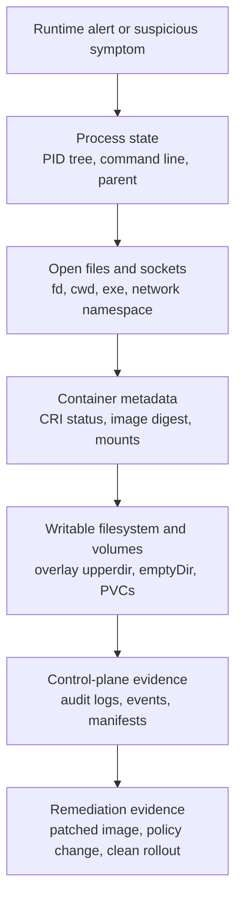
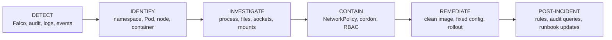

> **Complexity**: `[MEDIUM]` - CKS incident-response investigation skill
>
> **Time to Complete**: 45-50 minutes
>
> **Prerequisites**: [Module 6.2 (Runtime Security with Falco)](../module-6.2-falco/), [Module 6.1 (Audit Logging)](../module-6.1-audit-logging/), Linux process and namespace basics

## What You'll Be Able to Do

After completing this module, you will be able to investigate a suspicious container as live evidence rather than as a disposable Pod that can be deleted and recreated. The goal is disciplined response under exam pressure and production pressure, with commands chosen for evidence value, minimal disturbance, and careful written documentation.

1. **Trace** a Falco or audit alert to the namespace, Pod, node, CRI container ID, runtime state, and host PID that represent the same running workload.
2. **Diagnose** process, file, network, and namespace evidence using `kubectl logs`, `kubectl describe`, `kubectl debug`, `crictl`, `nsenter`, `/proc`, and runtime metadata.
3. **Implement** containment that slows or stops attacker activity with NetworkPolicy, node cordon, RBAC changes, and quota boundaries while preserving the evidence needed for diagnosis.
4. **Apply** an evidence-preservation workflow that captures runtime logs, audit records, Falco alerts, Pod manifests, container metadata, root filesystem changes, and mounted-volume state before remediation.
5. **Design** a CKS-style response plan that chooses when to observe, isolate, checkpoint, kill, rebuild, and document a compromised workload.

## Why This Module Matters

Module 6.2 taught you to generate and tune runtime alerts with Falco; this module starts after one of those alerts fires. A Falco shell alert, an audit event for `pods/exec`, or an application log entry gives you a pointer. It is not a complete incident record. The operator task is to turn that pointer into an evidence chain. Which Pod ran? Which node hosted it? Which CRI container instance backed it? Which Linux process represented it? Which files or sockets changed? Which containment action preserves enough state to answer those questions later? Those questions force you to connect Kubernetes API evidence with node runtime evidence instead of treating the Pod name as the whole case. For example, `production/web` may be a Deployment replica name that disappears after a rollout. The CRI container ID and runtime PID are more precise for the live instance that triggered the alert. The audit event may prove who requested an exec channel, while Falco proves which process appeared afterward. You need both when the question is "who did what" rather than merely "which object existed." ([Falco Output Channels](https://falco.org/docs/concepts/outputs/channels/), [Kubernetes Audit](https://v1-35.docs.kubernetes.io/docs/tasks/debug/debug-cluster/audit/), [crictl for Kubernetes Nodes](https://kubernetes.io/docs/tasks/debug/debug-cluster/crictl/))

NIST SP 800-61 frames incident response as preparation, detection and analysis, containment, eradication, recovery, and post-incident activity. Kubernetes does not change that lifecycle. It compresses the timeline. A controller can replace a Pod in seconds, and the old container's writable layer, process tree, and network sockets can vanish with it. The CKS habit is therefore to separate volatile evidence from rebuildable infrastructure. Collect process and network state first. Isolate the workload without destroying it when possible. Remediate only after the facts that disappear on restart have been captured. This is also why "just delete the Pod" is an answer only after you have decided which evidence you can afford to lose. In a real incident, that decision belongs in the timeline. "Deleted at 10:17 because exfiltration was active and sockets were already captured" is defensible. "Deleted because the Pod looked bad" is not an investigation record. ([NIST SP 800-61 Revision 2](https://csrc.nist.gov/pubs/sp/800/61/r2/final), [kubectl delete](https://v1-35.docs.kubernetes.io/docs/reference/kubectl/generated/kubectl_delete/))



The order matters because volatility is not evenly distributed. A process can exit before you finish reading the alert. An established TCP connection can close when you apply isolation. A restarted container can lose a writable overlay layer even though the Deployment object still exists. Pod manifests, audit records, and shipped Falco JSON are less volatile when they have already been written to durable storage. They still cannot reconstruct a process's open file descriptors after the process is gone. Treat the diagram as a pressure scale: the higher the evidence sits, the faster you should capture it and the more careful you should be before killing the workload. This is not a commandment to delay containment. It is a reminder to capture the fastest-disappearing facts before you take an action that will intentionally make them disappear. ([Linux proc filesystem](https://man7.org/linux/man-pages/man5/proc.5.html), [Falco Alerts Forwarding](https://falco.org/docs/concepts/outputs/forwarding/), [Kubernetes Audit](https://v1-35.docs.kubernetes.io/docs/tasks/debug/debug-cluster/audit/))

## Investigation Workflow

Use the existing five-stage workflow as a discipline, not as a checklist to race through. `DETECT` means preserving the original signal and its fields. `IDENTIFY` means resolving Kubernetes names to a node, a container ID, and a PID. `INVESTIGATE` means reading live state with the least invasive tool that answers the question. `CONTAIN` means reducing harm without erasing evidence unnecessarily. `REMEDIATE` means rebuilding trust from image, manifest, RBAC, network, and admission controls rather than merely deleting the Pod. Each stage should produce an artifact: an alert record, an identity chain, a set of observations, a containment change, and a remediation note. If a stage produces no artifact, the next responder has to trust your memory instead of inspecting evidence.

The artifact does not need to be elaborate during a CKS task. A saved YAML file, a copied command output, or a short note naming the PID and containment action is enough to prove the sequence. The point is to leave a trail that survives your terminal scrollback. ([NIST SP 800-61 Revision 2](https://csrc.nist.gov/pubs/sp/800/61/r2/final), [Kubernetes Ephemeral Containers](https://v1-35.docs.kubernetes.io/docs/concepts/workloads/pods/ephemeral-containers/))



The biggest beginner mistake is treating a container like an SSH host. A compromised Pod is not a pet machine that you log into and repair. It is a short-lived runtime object. Its current state may be the only copy of the attacker's command line, injected binary, socket destination, or modified file. Your first command should answer a preservation question: what signal do I need before this workload changes? Can I get that signal from outside the suspect container? That mental pause is what separates an investigation from a cleanup script. ([kubectl logs](https://v1-35.docs.kubernetes.io/docs/reference/kubectl/generated/kubectl_logs/), [kubectl describe](https://v1-35.docs.kubernetes.io/docs/reference/kubectl/generated/kubectl_describe/), [Linux proc filesystem](https://man7.org/linux/man-pages/man5/proc.5.html))

## The Exec Trap

`kubectl exec` is useful for administration, but it is a poor default for first response because it starts a command inside the target container. That new process can alter the process list you are trying to preserve. It can rely on tools that the attacker may have replaced. It can write shell history or temporary files depending on the image. It can also give the attacker another interactive surface if they still control the workload. The Kubernetes reference documents `kubectl exec` as command execution inside a container. The debugging documentation points to ephemeral containers as the purpose-built way to add troubleshooting tools to a running Pod without baking those tools into the original image. The exam distinction is simple: `exec` changes the suspect container, while `debug` adds a separate inspection container. There are still moments when `exec` is acceptable, such as a known lab Pod after you have already captured the required evidence. The mistake is using it as the first move on an active compromise. A first responder should be able to explain why each command was worth the evidence it might change. ([kubectl exec](https://v1-35.docs.kubernetes.io/docs/reference/kubectl/generated/kubectl_exec/), [Debug Running Pods](https://v1-35.docs.kubernetes.io/docs/tasks/debug/debug-application/debug-running-pod/), [Kubernetes Ephemeral Containers](https://v1-35.docs.kubernetes.io/docs/concepts/workloads/pods/ephemeral-containers/))

Ephemeral containers are not magic read-only forensics, but they are the better CKS tool because they add a separate debug container to the Pod. The target application container stays intact. The debug image can carry `ps`, `ss`, `lsof`, `find`, `jq`, and `tcpdump` without installing packages into the compromised image. Kubernetes documents that ephemeral containers are for troubleshooting. They can be targeted at another container when runtime support exists. They are also not regular app containers with ports, probes, or resource fields. Treat them as temporary inspection tools rather than a new sidecar design. In a distroless investigation, this is the difference between having tools beside the workload and mutating the workload to add tools. ([Kubernetes Ephemeral Containers](https://v1-35.docs.kubernetes.io/docs/concepts/workloads/pods/ephemeral-containers/), [kubectl debug](https://v1-35.docs.kubernetes.io/docs/reference/kubectl/generated/kubectl_debug/))

```bash
NS=production
POD=web-7d96c8f4d9-r2x5b
CONTAINER=app
kubectl get pod "$POD" -n "$NS" -o wide
kubectl logs "$POD" -n "$NS" -c "$CONTAINER" --since=30m
kubectl logs "$POD" -n "$NS" -c "$CONTAINER" --previous --since=2h || true
kubectl describe pod "$POD" -n "$NS"
kubectl debug -n "$NS" -it "pod/$POD" \
  --image=nicolaka/netshoot:latest \
  --target="$CONTAINER" \
  --container=investigator \
  -- /bin/bash
```

Inside the debug container, prefer observation commands that read kernel and namespace state instead of changing application state. If the process namespace is shared with the target, `ps -ef`, `ss -tnp`, `lsof -p <pid>`, and `/proc/<pid>` can show command lines, sockets, open files, current working directories, and mapped libraries. If targeting is not supported by the runtime, fall back to node-side `crictl` and `nsenter` rather than trying to install tools in the suspect container. Record that fallback in your notes. It explains why later evidence was collected from the node instead of from a Pod debug session. ([Debug Running Pods](https://v1-35.docs.kubernetes.io/docs/tasks/debug/debug-application/debug-running-pod/), [nsenter](https://man7.org/linux/man-pages/man1/nsenter.1.html), [Linux proc filesystem](https://man7.org/linux/man-pages/man5/proc.5.html))

## Tools and Evidence Surfaces

Each tool sees a different boundary. `kubectl` sees Kubernetes objects and API-server evidence. `kubectl debug` adds a debug container through Kubernetes control paths. `crictl` talks to the node's CRI runtime when the API server is incomplete or when you need container IDs and runtime status. `nsenter` crosses into Linux namespaces from the host once you know the target PID. `/proc` exposes live process metadata from the kernel. `runc state` can confirm low-level OCI runtime status when the node's runtime uses runc and exposes that state. The tool choice is therefore an evidence question, not a preference question. Ask which layer owns the fact you need before choosing the command. If the fact is "which user called `pods/exec`," stay with audit records. If the fact is "which binary owns this socket," move toward `/proc` and namespaces. If the fact is "which digest was pulled," read CRI status. This layer discipline saves time and reduces unnecessary mutation. ([kubectl get](https://v1-35.docs.kubernetes.io/docs/reference/kubectl/generated/kubectl_get/), [crictl for Kubernetes Nodes](https://kubernetes.io/docs/tasks/debug/debug-cluster/crictl/), [nsenter](https://man7.org/linux/man-pages/man1/nsenter.1.html), [runc state](https://github.com/opencontainers/runc/blob/main/man/runc-state.8.md))

| Tool surface | Best use during an investigation | Evidence it preserves or reveals | Main caution |
|---|---|---|---|
| `kubectl logs`, `describe`, `get events`, `get -o yaml` | Capture Kubernetes-visible context before the object changes | Container logs, restart history, image names, node placement, events, probes, volumes, service account, labels | Logs may be rotated or absent, and Kubernetes Events are not durable incident storage |
| `kubectl debug` ephemeral container | Inspect a live Pod that lacks tools or uses a distroless image | Process namespace, network namespace, `/proc`, target root through `/proc/<pid>/root` when visible | Adds a new container to the Pod and depends on runtime support for `--target` |
| `crictl` on the node | Resolve CRI Pod sandbox, container ID, image digest, runtime PID, mounts, and logs when Kubernetes API context is insufficient | CRI status and runtime metadata from the node | Requires node access and the correct CRI endpoint configuration |
| `nsenter` from the node | Enter target namespaces for process and network inspection without starting a process inside the target container | Host-side view of the target PID, PID namespace, network namespace, mount namespace | Still executes investigation commands in namespaces, so capture raw `/proc` data first when possible |
| `/proc/<pid>` | Read command line, executable link, cwd, fd table, memory maps, mounts, and per-process network files | Kernel-backed live process evidence | Disappears when the process exits and can be permission-limited |
| `runc state` | Confirm OCI runtime state where runc state is available beneath the CRI runtime | Runtime status, bundle path, PID, and lifecycle state | Runtime-specific; prefer CRI metadata unless the prompt points at runc directly |

Do not use these tools in a random order. Start with the least invasive surface that answers the current question. Descend toward the node only when Kubernetes-level evidence is not enough. That usually means `kubectl logs` and object snapshots first. Use `kubectl debug` when you need tools beside the workload. Use `crictl` when you need node runtime identity. Use `nsenter` or raw `/proc` when the live process state is the evidence. This sequence also creates a defensible chain for a reviewer: the investigation moved from API records, to debug observation, to runtime metadata, to kernel-backed process state. ([Kubernetes Ephemeral Containers](https://v1-35.docs.kubernetes.io/docs/concepts/workloads/pods/ephemeral-containers/), [crictl for Kubernetes Nodes](https://kubernetes.io/docs/tasks/debug/debug-cluster/crictl/), [Linux proc filesystem](https://man7.org/linux/man-pages/man5/proc.5.html))

## DETECT: Preserve the Original Signal

Detection begins with the alert fields, not with a guess about the attacker. A Falco JSON alert can include rule name, priority, hostname, Kubernetes namespace, Pod, container, image, process name, parent process, command line, user, file path, and socket fields depending on the rule output. Audit logs answer a different question. They record selected API requests, including user, verb, object reference, subresource, source IP, stage, and response status when the audit policy captures them. Read both signals as complementary. Falco can show that a shell process existed. Audit can show whether a Kubernetes identity requested `pods/exec` around the same time. A missing audit precursor does not prove no attacker existed; it only means the behavior may have started below the API layer or outside the selected audit policy. This is why detection notes should preserve negative findings too. "No matching `pods/exec` audit event under the current policy" is different from "no exec occurred." One statement describes your evidence. The other overclaims beyond the source. ([Falco Output Channels](https://falco.org/docs/concepts/outputs/channels/), [Kubernetes Audit](https://v1-35.docs.kubernetes.io/docs/tasks/debug/debug-cluster/audit/))

```bash
kubectl logs -n falco daemonset/falco --since=20m \
  | grep -E 'Terminal shell|suspicious|Unexpected|Sensitive' || true

kubectl get events -A --sort-by=.lastTimestamp \
  | grep -E 'Failed|Killing|BackOff|Unhealthy|Started' || true

kubectl get pod -A -o wide \
  | grep -E 'production|Running|CrashLoopBackOff|Error' || true
```

If Falco already forwards alerts to Falcosidekick or another durable receiver, preserve the receiver copy before touching the Pod. That copy gives you a stable timestamp, rule name, priority, host, and output fields even if the Falco DaemonSet log rolls or the node becomes unavailable. Module 6.1's audit-log workflow supplies the control-plane side of the timeline. Correlate the Falco runtime alert with audit records for `pods/exec`, Pod creation, RBAC changes, Secret reads, and NetworkPolicy edits before deciding that the runtime behavior appeared without an API precursor. Keep the original alert text even after you normalize fields into a ticket. The raw alert may contain process or file fields that were not mapped into your incident template. ([Falco Alerts Forwarding](https://falco.org/docs/concepts/outputs/forwarding/), [Kubernetes Audit](https://v1-35.docs.kubernetes.io/docs/tasks/debug/debug-cluster/audit/))

## IDENTIFY: Alert to Pod, Node, Container ID, and PID

The identity chain is the core CKS pattern: alert to namespace and Pod, Pod to node and container name, CRI metadata to container ID and image digest, container ID to host PID, and PID to `/proc` and namespaces. This chain prevents two common errors. The first is investigating a replacement Pod created after the alert. The second is inspecting the right Pod name but the wrong container inside a multi-container Pod. Use Pod UID, start time, node name, and container ID when the timing is ambiguous. A Deployment can reuse labels and names, but it cannot make a new container share the old runtime ID. Multi-container Pods make this more important. A sidecar may own the suspicious network connection while the main app owns the exposed port. An init container may have already exited, leaving only logs and status. The alert's container field and CRI container list keep you from flattening those different roles into one Pod-level assumption. When the alert omits a field, do not invent it. Derive it from Kubernetes status or CRI status and record the derivation. That small habit makes the chain auditable. ([kubectl get](https://v1-35.docs.kubernetes.io/docs/reference/kubectl/generated/kubectl_get/), [crictl for Kubernetes Nodes](https://kubernetes.io/docs/tasks/debug/debug-cluster/crictl/), [OCI Runtime State](https://github.com/opencontainers/runtime-spec/blob/main/runtime.md#state))

```mermaid
flowchart LR
    A[Falco alert<br/>rule + output_fields] --> B[Kubernetes object<br/>namespace + Pod + container]
    B --> C[Node<br/>spec.nodeName / alert hostname]
    C --> D[CRI Pod sandbox<br/>crictl pods]
    D --> E[CRI container ID<br/>crictl ps + inspect]
    E --> F[Runtime PID<br/>crictl inspect .info.pid]
    F --> G[/proc and namespaces<br/>exe, cwd, fd, maps, net]
```

```bash
NS=production
POD=web-7d96c8f4d9-r2x5b
CONTAINER=app
kubectl get pod "$POD" -n "$NS" \
  -o jsonpath='node={.spec.nodeName} phase={.status.phase} podIP={.status.podIP}{"\n"}'
kubectl get pod "$POD" -n "$NS" -o yaml > evidence-pod.yaml
kubectl describe pod "$POD" -n "$NS" > evidence-describe.txt
kubectl get events -n "$NS" \
  --field-selector involvedObject.name="$POD" \
  --sort-by=.lastTimestamp > evidence-events.txt
```

On the node, use CRI metadata before raw runtime commands because Kubernetes standardizes the CRI surface across container runtimes. The Kubernetes crictl documentation shows `crictl pods`, `crictl ps`, `crictl inspect`, `crictl logs`, and runtime endpoint configuration for debugging nodes. The `cri-tools` repository is the source for the `crictl` client, so it is the primary implementation reference when a command flag or output shape matters. This matters on mixed fleets. One node may run containerd, another may run CRI-O, and the CKS prompt may not tell you which runtime backs the kubelet. CRI commands keep the first investigation step portable. Drop to runtime-specific tools only when the CRI output cannot answer the question. ([crictl for Kubernetes Nodes](https://kubernetes.io/docs/tasks/debug/debug-cluster/crictl/), [kubernetes-sigs/cri-tools](https://github.com/kubernetes-sigs/cri-tools))

```bash
NS=production
POD=web-7d96c8f4d9-r2x5b
CONTAINER=app
sudo crictl pods --namespace "$NS" --name "$POD"
POD_ID=$(sudo crictl pods --namespace "$NS" --name "$POD" -q)
sudo crictl ps --pod "$POD_ID"
CID=$(sudo crictl ps --pod "$POD_ID" --name "$CONTAINER" -q)
sudo crictl inspect "$CID" > evidence-crictl-inspect.json
sudo crictl inspect "$CID" | jq -r '.status.id, .status.image.image, .status.imageRef, .info.pid'
PID=$(sudo crictl inspect "$CID" | jq -r '.info.pid')
sudo runc state "$CID" 2>/dev/null || true
```

The PID is the bridge from Kubernetes vocabulary to Linux evidence. Once you know it, `/proc/$PID` can show the executable symlink, current working directory, command line, environment, file descriptors, memory mappings, root filesystem view, mount information, and namespace handles. The man pages for `/proc`, `/proc/pid/exe`, `/proc/pid/cwd`, `/proc/pid/fd`, and `/proc/pid/maps` document these files as kernel interfaces. That is why they remain useful when the container image has no shell or package manager. They are also live views, not archived logs. Capture them before you restart, delete, or evict the workload. If the target process exits, `/proc/$PID` may now describe a different process or no process at all. ([Linux proc filesystem](https://man7.org/linux/man-pages/man5/proc.5.html), [/proc/pid/exe](https://man7.org/linux/man-pages/man5/proc_pid_exe.5.html), [/proc/pid/cwd](https://man7.org/linux/man-pages/man5/proc_pid_cwd.5.html), [/proc/pid/fd](https://man7.org/linux/man-pages/man5/proc_pid_fd.5.html), [/proc/pid/maps](https://man7.org/linux/man-pages/man5/proc_pid_maps.5.html))

## INVESTIGATE: Process, File, and Network State

Process inspection should answer three questions before it hunts for malware names: what process ran, who started it, and what it could see. A command line without a parent process can mislead you. `/bin/sh` launched by an authorized `kubectl exec` and `/bin/sh` launched by a vulnerable web server are different stories. Capture the PID tree, command lines, executable paths, cwd, and open descriptors before running broader searches. Those are the fields most likely to disappear when the process exits. Then classify the behavior. A child process of the application may suggest remote code execution or a dangerous feature. A child process of the container runtime may suggest an interactive exec or attach path. That distinction determines whether you investigate an application bug, an administrator action, or a stolen credential. Do not stop at process names that look familiar. `curl`, `sh`, `tar`, or `nc` may be legitimate in a debug image and alarming inside a production web server. The parent, command line, executable path, current directory, and open descriptors provide the context that the binary name lacks. ([Linux proc filesystem](https://man7.org/linux/man-pages/man5/proc.5.html), [/proc/pid/exe](https://man7.org/linux/man-pages/man5/proc_pid_exe.5.html), [/proc/pid/fd](https://man7.org/linux/man-pages/man5/proc_pid_fd.5.html))

```bash
PID=12345
sudo ps -eo pid,ppid,user,stat,etime,comm,args --forest | sed -n "1,80p"
sudo tr '\0' ' ' < "/proc/$PID/cmdline"; printf '\n'
sudo readlink "/proc/$PID/exe"
sudo readlink "/proc/$PID/cwd"
sudo ls -la "/proc/$PID/fd" | sed -n '1,80p'
sudo sed -n '1,80p' "/proc/$PID/maps"
sudo lsof -p "$PID" 2>/dev/null | sed -n '1,80p' || true
```

File investigation should distinguish the image filesystem from writable runtime state and mounted volumes. A container root filesystem commonly uses overlayfs. Lower layers come from the image. An upper layer captures modifications. Volume mounts such as `emptyDir` or PVCs can hold attacker-written files outside the image layer. Kernel overlayfs documentation describes the lower, upper, work, and merged directory model. CRI inspection and mount output tell you which paths in this specific container are image-backed, overlay-backed, or volume-backed. That distinction changes the evidence plan. A suspicious file in the overlay upper layer may disappear with the container. A suspicious file on a PVC may persist after Pod deletion and require storage-level handling. A projected Secret or ConfigMap is different again. Its contents may be controlled by Kubernetes objects, not by files written inside the container. When you find a credential-looking file, identify the mount source before you call it attacker-created. ([Overlay Filesystem](https://docs.kernel.org/filesystems/overlayfs.html), [crictl for Kubernetes Nodes](https://kubernetes.io/docs/tasks/debug/debug-cluster/crictl/), [kubectl get](https://v1-35.docs.kubernetes.io/docs/reference/kubectl/generated/kubectl_get/))

```bash
PID=12345
sudo find "/proc/$PID/root/tmp" "/proc/$PID/root/var/tmp" "/proc/$PID/root/dev/shm" \
  -xdev -type f -mmin -120 -ls 2>/dev/null | sed -n '1,80p'
sudo find "/proc/$PID/root" -xdev -perm -4000 -type f -ls 2>/dev/null | sed -n '1,80p'
sudo cat "/proc/$PID/mountinfo" | sed -n '1,120p'
sudo crictl inspect "$CID" | jq '.status.mounts // empty'
```

Network investigation should bind sockets back to processes before it labels a destination suspicious. A port number alone rarely proves intent. The decisive detail is whether the main application opened its normal backend connection or whether a shell, package manager, injected binary, or unexpected child process opened an outbound connection after the alert. Use `ss` on the host for a broad view. Then use `nsenter -t "$PID" -n` to inspect the target network namespace when the node view is too noisy. Capture established connections before isolation if you can do so quickly. Applying a deny-all policy may be the right containment move, but it can close the very socket that would have shown the remote endpoint. Also capture DNS context and routes when the question involves exfiltration. `/etc/resolv.conf`, the namespace route table, and the process that owns the socket can show whether the connection followed normal cluster resolution or bypassed it with a direct IP. ([nsenter](https://man7.org/linux/man-pages/man1/nsenter.1.html), [Linux proc filesystem](https://man7.org/linux/man-pages/man5/proc.5.html))

```bash
PID=12345
sudo ss -Htnp | sed -n '1,120p'
sudo nsenter -t "$PID" -n ss -Htnp
sudo nsenter -t "$PID" -n ss -Hulp
sudo cat "/proc/$PID/net/tcp" | sed -n '1,20p'
sudo cat "/proc/$PID/net/tcp6" | sed -n '1,20p'
```

When you use `nsenter`, be precise about which namespaces you need. Entering only the network namespace is enough to inspect sockets and routes. Adding the PID namespace helps when you want process IDs as the container sees them. Adding the mount namespace helps when you need file paths as the container sees them. The `nsenter` man page documents namespace selection flags such as `--target`, `--mount`, `--net`, `--pid`, `--uts`, `--ipc`, and `--user`. Avoid a blanket namespace entry when a narrower one answers the question. Narrow entry also makes your notes easier to defend. You can say exactly which view you entered and why. ([nsenter](https://man7.org/linux/man-pages/man1/nsenter.1.html))

```bash
PID=12345
sudo nsenter -t "$PID" -n ip addr
sudo nsenter -t "$PID" -n ip route
sudo nsenter -t "$PID" -p ps -ef
sudo nsenter -t "$PID" -m -p -n sh -c 'pwd; ps -ef; ss -tnp; ls -la /proc/1/fd'
```

## Image and Filesystem Forensics

Image identity matters because a tag is not evidence. Capture the Pod spec, the image tag, and the resolved image digest from runtime metadata. Compare that digest to the image you intend to redeploy. Kubernetes object state may show `image: repo/app:latest`, while CRI status can include an `imageRef` that points at the pulled digest. That digest is the stable artifact you can scan, block, or promote during remediation. It also prevents a subtle mistake: rebuilding from the same tag after the registry tag has moved and assuming you tested the compromised image. A digest ties the running container to a specific pulled artifact. During remediation, keep the old digest and the new digest in the note. That lets a reviewer verify that the clean rollout actually changed the artifact, not just restarted the same vulnerable build. ([kubectl get](https://v1-35.docs.kubernetes.io/docs/reference/kubectl/generated/kubectl_get/), [crictl for Kubernetes Nodes](https://kubernetes.io/docs/tasks/debug/debug-cluster/crictl/))

```bash
kubectl get pod "$POD" -n "$NS" \
  -o jsonpath='{range .spec.containers[*]}{.name}{" image="}{.image}{"\n"}{end}'
sudo crictl inspect "$CID" \
  | jq -r '.status.image.image, .status.imageRef, .info.runtimeSpec.root.path?'
sudo crictl images | grep -F "$(sudo crictl inspect "$CID" | jq -r '.status.image.image')" || true
```

For filesystem capture, decide whether you need a logical copy from the container's merged root, the overlay upper layer that represents changes, or mounted-volume copies. A merged-root archive is easier to inspect. It can also mix original image files with runtime changes. The upper layer is closer to "what changed," but it is runtime-specific and may require node access. Volumes need their own preservation path because a Pod deletion may leave a PVC intact but destroy an `emptyDir` with the Pod. In an exam, explain which copy you took and what it can prove. A root archive proves current visible contents. An upper-layer capture narrows changes. A volume copy preserves data that lives outside the container image. ([Overlay Filesystem](https://docs.kernel.org/filesystems/overlayfs.html), [Kubernetes Ephemeral Containers](https://v1-35.docs.kubernetes.io/docs/concepts/workloads/pods/ephemeral-containers/), [crictl for Kubernetes Nodes](https://kubernetes.io/docs/tasks/debug/debug-cluster/crictl/))

```bash
PID=12345
sudo tar --numeric-owner --xattrs --acls \
  -czf "container-root-${CID}.tar.gz" \
  -C "/proc/$PID/root" .
sudo tar --numeric-owner --xattrs --acls \
  -czf "container-tmp-${CID}.tar.gz" \
  -C "/proc/$PID/root/tmp" . 2>/dev/null || true
```

Do not overpromise container filesystem capture. A live archive can race with attacker activity. A file can change while you read it. A deleted file can remain reachable through an open descriptor even when it no longer appears in a directory listing. The CKS answer is not to build a perfect forensic appliance. It is to show the right sequence: isolate network paths, capture volatile state, snapshot the manifest and runtime metadata, copy the relevant filesystem or volume evidence, then rebuild from a known-good image and policy set. State the limitation in the incident note. Honest evidence boundaries are more useful than a confident but unsupported claim that the archive is complete. ([NIST SP 800-61 Revision 2](https://csrc.nist.gov/pubs/sp/800/61/r2/final), [Network Policies](https://v1-35.docs.kubernetes.io/docs/concepts/services-networking/network-policies/), [/proc/pid/fd](https://man7.org/linux/man-pages/man5/proc_pid_fd.5.html))

## CONTAIN: Reduce Harm Without Destroying Evidence

Containment is a tradeoff between stopping attacker action and preserving state. NetworkPolicy can block ingress and egress while leaving the Pod running, but only for traffic governed by a NetworkPolicy-capable CNI and only for selected Pods. Cordon can stop new scheduling on a suspect node without killing existing Pods. RBAC changes can revoke what the workload's service account can do through the API. A force delete stops the process quickly, but it also destroys volatile evidence and may trigger a controller to create a replacement. The right choice depends on active risk. If data is still leaving the cluster, isolate first and accept that some sockets may close. If the alert is historical and the process is idle, capture more before you change traffic. If the node itself is suspect, cordon before you create debug or replacement workloads there. That keeps new Pods away while you decide whether existing Pods must be drained, isolated, or preserved for a node-level investigation. ([Network Policies](https://v1-35.docs.kubernetes.io/docs/concepts/services-networking/network-policies/), [kubectl cordon](https://v1-35.docs.kubernetes.io/docs/reference/kubectl/generated/kubectl_cordon/), [RBAC Authorization](https://v1-35.docs.kubernetes.io/docs/reference/access-authn-authz/rbac/), [kubectl delete](https://v1-35.docs.kubernetes.io/docs/reference/kubectl/generated/kubectl_delete/))

| Containment action | Evidence impact | Best fit | CKS caution |
|---|---|---|---|
| Apply deny-all NetworkPolicy to the Pod's labels | Preserves process and filesystem state while cutting policy-governed traffic | Active exfiltration, command-and-control callbacks, lateral movement | Requires correct labels and a CNI that enforces NetworkPolicy |
| Cordon the node | Preserves existing Pods and stops new scheduling | Suspect node or runtime while investigation continues | Does not stop the compromised process already running |
| Remove or narrow RoleBindings for the service account | Preserves the Pod while reducing API authority | Workload token is being used against the API server | Existing tokens may remain mounted, but authorization decisions can change immediately |
| Scale controller to zero after capture | Stops replacement loops after evidence collection | Rebuilding from a clean image after snapshot | Scaling before capture can remove the only running evidence |
| Delete or force delete the Pod | Stops the process and controller may replace it | Severe active harm when observation is too risky | Loses process, socket, `emptyDir`, and writable-layer evidence |

```bash
NS=production
POD=web-7d96c8f4d9-r2x5b
kubectl get pod "$POD" -n "$NS" --show-labels
cat <<'EOF' | kubectl apply -f -
apiVersion: networking.k8s.io/v1
kind: NetworkPolicy
metadata:
  name: isolate-suspicious-pod
  namespace: production
spec:
  podSelector:
    matchLabels:
      app: web
      incident: cks-63
  policyTypes:
    - Ingress
    - Egress
  ingress: []
  egress: []
EOF
```

Use labels carefully because NetworkPolicy selects Pods by label, not by Pod name. If the existing labels would isolate every replica behind a Deployment, apply the policy with both labels in the selector; it matches zero Pods until the incident label exists, then add the label to atomically trigger isolation. This avoids a race window where the labeled Pod is still un-isolated. That label edit changes the Kubernetes object. Record the original manifest first and include the label change in the incident notes. Also verify the selected Pod count after applying the policy. A correct-looking deny-all policy that selects zero Pods is no containment at all, while a broad selector can create an outage across healthy replicas. Remember that NetworkPolicy does not itself select by node, image, or owner reference. If you need those fields, use `kubectl` to identify the Pod and then apply a label that turns your investigation decision into a policy selector. ([Network Policies](https://v1-35.docs.kubernetes.io/docs/concepts/services-networking/network-policies/), [kubectl get](https://v1-35.docs.kubernetes.io/docs/reference/kubectl/generated/kubectl_get/))

```bash
kubectl get pod "$POD" -n "$NS" -o yaml > evidence-before-label.yaml
kubectl label pod "$POD" -n "$NS" incident=cks-63 --overwrite
kubectl get networkpolicy isolate-suspicious-pod -n "$NS" -o yaml
```

RBAC quarantine is useful when the suspicious container has a mounted service account token and the alert suggests API activity. First identify the service account. Then test its current authority with `kubectl auth can-i --as=system:serviceaccount:<ns>:<sa>`. Then remove or narrow the binding that grants dangerous verbs. RBAC controls authorization decisions for API requests, so this can reduce blast radius while leaving the container's process and filesystem evidence in place. Do not confuse this with deleting the token file from the container. The token may still be mounted, but future API requests can be denied if the binding no longer grants the verb. Capture the original bindings so the containment action itself is reviewable. ([RBAC Authorization](https://v1-35.docs.kubernetes.io/docs/reference/access-authn-authz/rbac/), [kubectl auth can-i](https://v1-35.docs.kubernetes.io/docs/reference/kubectl/generated/kubectl_auth/kubectl_auth_can-i/))

```bash
SA=$(kubectl get pod "$POD" -n "$NS" -o jsonpath='{.spec.serviceAccountName}')
kubectl auth can-i --as="system:serviceaccount:$NS:$SA" --list -n "$NS"
kubectl get rolebinding,clusterrolebinding -A -o wide | grep "system:serviceaccount:$NS:$SA" || true
```

ResourceQuota is not a first containment lever for one running Pod, but it is a useful boundary for a quarantine namespace or a replacement rollout after an incident. If responders clone manifests, run debug workloads, or stage a clean replacement in a namespace, a quota can cap aggregate CPU, memory, object counts, and selected resource classes. That prevents the response environment from becoming a second resource incident. It also makes quarantine repeatable. A namespace with a known quota can host debug copies without accidentally creating unlimited Pods, Services, or storage claims while responders experiment. This is especially useful when the suspicious workload was part of an autoscaled or job-driven system. A bad clone of that workload can create many objects quickly. A quota turns the quarantine namespace into a bounded workspace instead of an open-ended copy of production risk. ([Resource Quotas](https://v1-35.docs.kubernetes.io/docs/concepts/policy/resource-quotas/))

## REMEDIATE: Rebuild Trust After Capture

Remediation starts after you have enough evidence to explain the compromise path. Delete-and-recreate is only safe when the image, manifest, RBAC, network policy, and admission posture no longer allow the same behavior. If the root cause was an overly broad service account, a writable root filesystem, an exposed debug endpoint, a missing NetworkPolicy, or an unpinned image tag, a replacement Pod with the same inputs can reproduce the same incident. A clean rollout should therefore name the trust boundary it restores. That may be a patched digest, a narrowed RoleBinding, a default-deny policy, an immutable image setting, or a removed volume mount. If you cannot name the changed control, you have probably restarted rather than remediated.

Remediation also needs a verification signal. Watch the rollout, check the new image digest, confirm the service account authority, and keep the isolation policy until the replacement behavior is proven. Then remove temporary incident labels and policies deliberately, not as forgotten debris. A final record should connect finding to fix: suspicious process came from writable upload path, fix removes write path; API abuse used broad service account, fix narrows binding; exfiltration used unrestricted egress, fix adds default deny and explicit allows. ([NIST SP 800-61 Revision 2](https://csrc.nist.gov/pubs/sp/800/61/r2/final), [RBAC Authorization](https://v1-35.docs.kubernetes.io/docs/reference/access-authn-authz/rbac/), [Network Policies](https://v1-35.docs.kubernetes.io/docs/concepts/services-networking/network-policies/), [kubectl get](https://v1-35.docs.kubernetes.io/docs/reference/kubectl/generated/kubectl_get/))

```bash
kubectl get pod "$POD" -n "$NS" -o yaml > evidence-final-pod.yaml
kubectl logs "$POD" -n "$NS" --all-containers --since=2h > evidence-final-logs.txt
kubectl delete pod "$POD" -n "$NS"
kubectl rollout status deployment/web -n "$NS" --timeout=120s
kubectl get pods -n "$NS" -l app=web -o wide
```

Post-incident changes should feed back into Modules 6.1 and 6.2. If audit logs did not capture the `pods/exec` request, update the audit policy. If Falco emitted the alert only to a DaemonSet log, route JSON alerts to durable storage. If the investigation required node access because the image lacked tools, that is acceptable. Do not solve it by adding shells and package managers to production images. Use ephemeral containers and node-side CRI tooling for investigation, then harden the workload image and runtime policy. The post-incident test is concrete: can you trigger a known shell alert, preserve it off-node, map it to a Pod and PID, isolate the Pod, and explain which control prevents recurrence? If the answer is no, the next incident will repeat the same confusion. Improve the rule output, audit selection, runbook command sequence, or containment template until the chain is repeatable under time pressure. ([Kubernetes Audit](https://v1-35.docs.kubernetes.io/docs/tasks/debug/debug-cluster/audit/), [Falco Alerts Forwarding](https://falco.org/docs/concepts/outputs/forwarding/), [Kubernetes Ephemeral Containers](https://v1-35.docs.kubernetes.io/docs/concepts/workloads/pods/ephemeral-containers/))

## CKS Exam Patterns

When a prompt gives you a Falco alert, write down the namespace, Pod, container name, node or hostname, process name, parent process, command line, and file or socket field before running commands. Then prove the Pod still exists. Capture its YAML and logs. Identify the node. Move to `crictl` only when you need the runtime container ID or PID. This pattern is faster than searching every node because the alert already contains most of the routing information. It also avoids a common exam trap: spending time on broad cluster inventory while the alert already tells you where to look. If the Pod is gone, do not pretend the live-state step succeeded. Say which evidence is now unavailable, then pivot to surviving evidence such as audit logs, Falco storage, controller history, image digest records, and any persistent volumes. ([Falco Output Channels](https://falco.org/docs/concepts/outputs/channels/), [kubectl get](https://v1-35.docs.kubernetes.io/docs/reference/kubectl/generated/kubectl_get/), [crictl for Kubernetes Nodes](https://kubernetes.io/docs/tasks/debug/debug-cluster/crictl/))

When a prompt says the container is distroless or has no shell, do not install tools or assume `kubectl exec` will work. Use `kubectl debug` with a tool image, or inspect from the node with `crictl`, `/proc`, and `nsenter`. If the runtime cannot target the process namespace, the node-side PID path is the reliable fallback because the kernel still knows the process even when the image has no userland tools. The absence of a shell in the image should be a hardening signal, not an investigation blocker. It tells you to bring tools from outside the suspect container. ([Debug Running Pods](https://v1-35.docs.kubernetes.io/docs/tasks/debug/debug-application/debug-running-pod/), [Kubernetes Ephemeral Containers](https://v1-35.docs.kubernetes.io/docs/concepts/workloads/pods/ephemeral-containers/), [nsenter](https://man7.org/linux/man-pages/man1/nsenter.1.html))

When a prompt asks you to isolate without deleting, use a label-specific deny-all NetworkPolicy and verify that it selects only the target Pod. If the prompt describes API abuse, also inspect the service account and RBAC bindings. If the prompt describes a suspicious node, cordon the node before creating more workloads there. These are containment actions that preserve more evidence than immediate deletion. The command is only half the answer. The other half is the evidence-loss tradeoff: NetworkPolicy can close sockets, cordon does not stop current processes, and RBAC changes reduce future API calls rather than existing file or network activity. State that tradeoff out loud in the exam answer. It shows that you are choosing containment, not blindly applying a familiar YAML pattern. ([Network Policies](https://v1-35.docs.kubernetes.io/docs/concepts/services-networking/network-policies/), [RBAC Authorization](https://v1-35.docs.kubernetes.io/docs/reference/access-authn-authz/rbac/), [kubectl cordon](https://v1-35.docs.kubernetes.io/docs/reference/kubectl/generated/kubectl_cordon/))

When a prompt asks for filesystem evidence before remediation, capture the Pod manifest, CRI inspect output, image digest, process metadata, relevant `/proc/$PID/root` paths, overlay or mount information, and volume paths. Do not rely on a fresh Pod from the same image as proof of what happened in the old writable layer. Overlay upper-layer changes and `emptyDir` contents are runtime state. A fresh Pod can help compare baseline files, but it is not a substitute for the compromised instance. State which copy is baseline and which copy is evidence from the incident. If the prompt gives you only a few minutes, prioritize the directories named by the alert, writable paths such as `/tmp`, and mounted volumes before trying to archive the entire root. ([Overlay Filesystem](https://docs.kernel.org/filesystems/overlayfs.html), [Linux proc filesystem](https://man7.org/linux/man-pages/man5/proc.5.html), [crictl for Kubernetes Nodes](https://kubernetes.io/docs/tasks/debug/debug-cluster/crictl/))

## Did You Know?

- Ephemeral containers are stable Kubernetes troubleshooting tools, but they are not regular app containers: Kubernetes documents restrictions around resources, ports, and probes, which is why they fit investigation better than application design. ([Kubernetes Ephemeral Containers](https://v1-35.docs.kubernetes.io/docs/concepts/workloads/pods/ephemeral-containers/))
- `crictl` is intentionally a node-debugging tool for CRI-compatible runtimes, and the `kubernetes-sigs/cri-tools` repository is the source for the client used in many Kubernetes node investigations. ([crictl for Kubernetes Nodes](https://kubernetes.io/docs/tasks/debug/debug-cluster/crictl/), [kubernetes-sigs/cri-tools](https://github.com/kubernetes-sigs/cri-tools))
- `/proc/<pid>/fd` shows file descriptors as symlinks from the kernel's view of the process, making it useful when the container image lacks `lsof` or when a deleted file remains open. ([/proc/pid/fd](https://man7.org/linux/man-pages/man5/proc_pid_fd.5.html))
- `kubectl drain` is usually a maintenance command, not the first investigation move, because it evicts workloads and can destroy the very runtime state you are trying to preserve. ([kubectl drain](https://v1-35.docs.kubernetes.io/docs/reference/kubectl/generated/kubectl_drain/))

## Common Mistakes

| Mistake | Why It Hurts | Better Operator Move |
|---|---|---|
| Running `kubectl exec` first | Starts a new process inside the suspect container and may change the evidence surface | Capture logs and manifests, then use `kubectl debug` or node-side inspection |
| Deleting the Pod immediately | Removes process state, network sockets, `emptyDir` data, and possibly the writable container layer | Isolate first when possible, then preserve evidence before deletion |
| Investigating the replacement Pod | A controller can create a new Pod with the same labels after the compromised one disappears | Match alert timestamp, Pod UID, node, container ID, and runtime PID |
| Applying NetworkPolicy to broad labels | Can isolate every replica of a workload or still miss the target if labels do not match | Snapshot the manifest, add a temporary incident label, and select only that label |
| Trusting image tags as evidence | Tags can move and do not prove the exact image instance that ran | Capture runtime `imageRef` and digest from CRI metadata |
| Ignoring mounted volumes | Attacker tools may live in `emptyDir`, PVCs, or projected paths rather than the image layer | Inspect mounts, `/proc/$PID/mountinfo`, CRI status, and relevant volume contents |
| Fixing detection but not retention | A Falco alert in a rolling DaemonSet log can vanish before review | Send Falco JSON and audit logs to durable storage before the next incident |

## Quiz

<details>
<summary>A Falco alert reports an interactive shell in `production/web`, but the image is distroless and has no shell. What should you do first?</summary>

Preserve the alert fields, capture the Pod YAML and logs, and use `kubectl debug` with a tool image or node-side `crictl` plus `/proc` to inspect the running process. Do not assume the image was impossible to compromise; an attacker can execute a downloaded binary from a writable path, a mounted volume, or another process context. The important CKS move is to investigate beside the container or from the node without installing tools into the suspect image.
</details>

<details>
<summary>You find active outbound connections from a compromised Pod and need to stop exfiltration without deleting the Pod. Which containment action best preserves evidence?</summary>

Apply a deny-all NetworkPolicy that selects only the target Pod, usually by first adding a temporary incident label after saving the original manifest. This can stop policy-governed ingress and egress while preserving process, file, and container metadata for investigation. Then capture sockets, process trees, CRI inspect output, and relevant filesystem evidence before deciding whether to delete or rebuild.
</details>

<details>
<summary>The security team asks for the host PID behind a suspicious container. Which command path gets you there?</summary>

Resolve namespace, Pod, container, and node from the alert or Pod status, then on the node use `crictl pods --namespace <ns> --name <pod> -q`, `crictl ps --pod <pod-id> --name <container> -q`, and `crictl inspect <container-id> | jq -r .info.pid`. That PID lets you read `/proc/<pid>` and use `nsenter` for namespace-specific process and network inspection.
</details>

<details>
<summary>A teammate wants to force delete the Pod because the Deployment will recreate it cleanly. What evidence should you capture first?</summary>

Capture the original alert, Pod YAML, `kubectl describe`, container logs including `--previous` where applicable, events, CRI inspect output, image digest, process tree, command lines, open file descriptors, network sockets, mount information, and any relevant writable filesystem or volume paths. A replacement Pod can prove that the controller still works, but it cannot reconstruct the old process tree or deleted writable layer.
</details>

<details>
<summary>The alert shows a suspicious API call from the workload's service account. How can you reduce blast radius while preserving the running Pod?</summary>

Identify the Pod's service account, run `kubectl auth can-i --as=system:serviceaccount:<ns>:<sa> --list`, and inspect RoleBindings or ClusterRoleBindings that grant risky verbs. Removing or narrowing those bindings changes authorization decisions for future API calls while leaving the Pod available for process and filesystem investigation. Record the original bindings before changing them so the incident timeline includes the containment action.
</details>

<details>
<summary>You have ten minutes to design the response plan for a live shell alert before the app owner deletes the Pod. What sequence should you propose?</summary>

Start with evidence that disappears fastest: preserve the Falco alert, capture Pod YAML, logs, events, node name, CRI container ID, PID, process tree, sockets, file descriptors, and mount information. Then apply the least destructive containment that matches the active risk, such as a target-specific deny-all NetworkPolicy for exfiltration or RBAC narrowing for API abuse. After that, copy relevant root filesystem or volume evidence, document limitations, delete or replace the Pod, and verify that remediation changed a concrete control such as image digest, RoleBinding, NetworkPolicy, or filesystem immutability. The plan should also name the point where you stop observing and start disrupting. That decision depends on active harm, not curiosity. If data is leaving, isolate sooner. If the socket is already closed and the process is stable, capture more before you terminate it.
</details>

## Hands-On Practice

- [ ] Complete the [Container Investigation Killercoda lab](https://killercoda.com/kubedojo/scenario/cks-6.3-container-investigation) and record the exact command chain from Pod name to node to CRI container ID to PID.
- [ ] Trigger or reuse a Falco shell alert from [Module 6.2](../module-6.2-falco/), then correlate the runtime alert with Pod YAML, container logs, events, and, if audit logging is enabled, a `pods/exec` audit record from [Module 6.1](../module-6.1-audit-logging/).
- [ ] Create a disposable Pod, snapshot its manifest and logs, add a temporary incident label, and apply a deny-all NetworkPolicy that selects only that Pod.
- [ ] Use `kubectl debug` with a tool image to inspect processes, `/proc/<pid>/fd`, current working directory, executable path, and network sockets without running commands through `kubectl exec` in the target container.
- [ ] On a lab node where you have access, use `crictl inspect` to capture image digest, runtime PID, and mounts, then inspect `/proc/<pid>/root`, `/proc/<pid>/maps`, and `/proc/<pid>/net/tcp`.
- [ ] Write a short incident note that separates detection evidence, identity resolution, live-state findings, containment actions, evidence captured, and remediation changes.

Use this disposable lab sequence to practice the containment half of the workflow. It creates a Pod with a writable file in `/tmp`, captures Kubernetes evidence, labels the single Pod for isolation, applies deny-all ingress and egress, and then removes the lab objects after you have inspected them. The lab is intentionally small so you can focus on sequence rather than tooling variety. Before you apply the policy, note what evidence exists at the Kubernetes layer. After you enter the debug container, note what evidence exists only in the live process or namespace view. After cleanup, ask which facts would still be available if you had skipped the capture steps. That self-check is the point of the exercise.

```bash
cat <<'EOF' | kubectl apply -f -
apiVersion: v1
kind: Namespace
metadata:
  name: cks-63-lab
---
apiVersion: v1
kind: Pod
metadata:
  name: suspicious-app
  namespace: cks-63-lab
  labels:
    app: suspicious
spec:
  containers:
    - name: app
      image: busybox:1.36
      command:
        - sh
        - -c
        - |
          echo 'suspicious data' > /tmp/exfil.txt
          while true; do sleep 10; done
EOF

kubectl wait pod/suspicious-app -n cks-63-lab --for=condition=Ready --timeout=90s
kubectl get pod suspicious-app -n cks-63-lab -o yaml > lab-pod-before.yaml
kubectl logs suspicious-app -n cks-63-lab > lab-pod-logs.txt
kubectl label pod suspicious-app -n cks-63-lab incident=cks-63 --overwrite

cat <<'EOF' | kubectl apply -f -
apiVersion: networking.k8s.io/v1
kind: NetworkPolicy
metadata:
  name: isolate-suspicious-app
  namespace: cks-63-lab
spec:
  podSelector:
    matchLabels:
      incident: cks-63
  policyTypes:
    - Ingress
    - Egress
  ingress: []
  egress: []
EOF

kubectl debug -n cks-63-lab -it pod/suspicious-app \
  --image=nicolaka/netshoot:latest \
  --target=app \
  --container=investigator \
  -- /bin/bash
```

Inside the debug container, run the following read-oriented checks. If the runtime does not expose the target process namespace to the debug container, exit and use the node-side `crictl` path from the earlier section instead. Compare what you see with the Pod manifest you saved before isolation. The manifest tells you expected image, command, mounts, and service account. The live namespace tells you what actually ran after scheduling. Investigation happens in the gap between those two views. A clean manifest with a suspicious process suggests runtime compromise or misuse after admission. A risky manifest with host mounts, broad service account access, or writable paths suggests the workload design itself made the incident easier. The response plan changes depending on which side of that gap explains the evidence.

```bash
ps -ef
ss -tnp
ls -la /proc/1/fd
readlink /proc/1/exe
readlink /proc/1/cwd
find /proc/1/root/tmp -type f -maxdepth 1 -ls 2>/dev/null
```

After practice, clean up only after you have confirmed which evidence files you captured and which questions they answer. The cleanup step should feel different from the containment step. Containment keeps the suspect object available while reducing harm. Cleanup removes the lab objects because the exercise is complete. In production, that same difference matters. You should know whether a command is preserving, isolating, collecting, or destroying evidence before you run it. If you cannot name that category, pause and choose a less destructive observation command first. That habit is what turns a fast response into a repeatable incident workflow.

```bash
kubectl delete namespace cks-63-lab
rm -f lab-pod-before.yaml lab-pod-logs.txt
```

## Next Module

[Module 6.4: Immutable Infrastructure](../module-6.4-immutable-infrastructure/) - Build runtime environments that reduce what attackers can modify after a container starts.

## Sources

- [NIST SP 800-61 Revision 2: Computer Security Incident Handling Guide](https://csrc.nist.gov/pubs/sp/800/61/r2/final) - primary incident-response lifecycle reference for preparation, detection and analysis, containment, eradication, recovery, and lessons learned.
- [Kubernetes v1.35: Debug Running Pods](https://v1-35.docs.kubernetes.io/docs/tasks/debug/debug-application/debug-running-pod/) - documents `kubectl debug`, ephemeral debug containers, copied Pods, and node debugging workflows.
- [Kubernetes v1.35: Ephemeral Containers](https://v1-35.docs.kubernetes.io/docs/concepts/workloads/pods/ephemeral-containers/) - documents the purpose, limitations, and troubleshooting role of ephemeral containers.
- [Kubernetes v1.35: kubectl debug](https://v1-35.docs.kubernetes.io/docs/reference/kubectl/generated/kubectl_debug/) - command reference for adding debug containers and creating debug copies.
- [Kubernetes v1.35: kubectl exec](https://v1-35.docs.kubernetes.io/docs/reference/kubectl/generated/kubectl_exec/) - command reference for executing commands inside existing containers.
- [Kubernetes v1.35: kubectl logs](https://v1-35.docs.kubernetes.io/docs/reference/kubectl/generated/kubectl_logs/) - command reference for current and previous container log capture.
- [Kubernetes v1.35: kubectl describe](https://v1-35.docs.kubernetes.io/docs/reference/kubectl/generated/kubectl_describe/) - command reference for object description and event context.
- [Kubernetes v1.35: kubectl get](https://v1-35.docs.kubernetes.io/docs/reference/kubectl/generated/kubectl_get/) - command reference for structured Kubernetes object retrieval.
- [Kubernetes v1.35: Network Policies](https://v1-35.docs.kubernetes.io/docs/concepts/services-networking/network-policies/) - primary reference for Pod isolation through ingress and egress policy.
- [Kubernetes v1.35: RBAC Authorization](https://v1-35.docs.kubernetes.io/docs/reference/access-authn-authz/rbac/) - primary reference for Roles, ClusterRoles, RoleBindings, ClusterRoleBindings, and authorization scope.
- [Kubernetes v1.35: Resource Quotas](https://v1-35.docs.kubernetes.io/docs/concepts/policy/resource-quotas/) - primary reference for namespace-scoped resource and object-count boundaries.
- [Kubernetes v1.35: kubectl auth can-i](https://v1-35.docs.kubernetes.io/docs/reference/kubectl/generated/kubectl_auth/kubectl_auth_can-i/) - command reference for testing effective authorization.
- [Kubernetes v1.35: kubectl cordon](https://v1-35.docs.kubernetes.io/docs/reference/kubectl/generated/kubectl_cordon/) - command reference for marking a node unschedulable during containment.
- [Kubernetes v1.35: kubectl drain](https://v1-35.docs.kubernetes.io/docs/reference/kubectl/generated/kubectl_drain/) - command reference for node maintenance behavior and eviction risk.
- [Kubernetes v1.35: Auditing](https://v1-35.docs.kubernetes.io/docs/tasks/debug/debug-cluster/audit/) - primary reference for API-server audit stages, policy, and backends used for incident correlation.
- [Kubernetes: Debugging Kubernetes Nodes with crictl](https://kubernetes.io/docs/tasks/debug/debug-cluster/crictl/) - official Kubernetes task reference for CRI runtime inspection with `crictl`.
- [kubernetes-sigs/cri-tools](https://github.com/kubernetes-sigs/cri-tools) - source repository for `crictl` and related CRI debugging tooling.
- [Falco: Output Channels](https://falco.org/docs/concepts/outputs/channels/) - documents Falco JSON output fields and alert delivery channels.
- [Falco: Alerts Forwarding](https://falco.org/docs/concepts/outputs/forwarding/) - documents Falcosidekick as the durable fan-out path for Falco alerts.
- [Falco: Kernel Events](https://falco.org/docs/concepts/event-sources/kernel/) - documents kernel-event runtime detection context that feeds Falco alerts.
- [Linux man-pages: nsenter](https://man7.org/linux/man-pages/man1/nsenter.1.html) - documents entering mount, network, PID, IPC, UTS, cgroup, time, and user namespaces.
- [Linux man-pages: proc](https://man7.org/linux/man-pages/man5/proc.5.html) - documents `/proc` as the process and kernel information filesystem.
- [Linux man-pages: /proc/pid/exe](https://man7.org/linux/man-pages/man5/proc_pid_exe.5.html) - documents the executable symlink used during process investigation.
- [Linux man-pages: /proc/pid/cwd](https://man7.org/linux/man-pages/man5/proc_pid_cwd.5.html) - documents the current-working-directory symlink used during process investigation.
- [Linux man-pages: /proc/pid/fd](https://man7.org/linux/man-pages/man5/proc_pid_fd.5.html) - documents file descriptor inspection for live processes.
- [Linux man-pages: /proc/pid/maps](https://man7.org/linux/man-pages/man5/proc_pid_maps.5.html) - documents memory map inspection for live processes.
- [Linux kernel docs: Overlay Filesystem](https://docs.kernel.org/filesystems/overlayfs.html) - documents lower, upper, work, and merged directory behavior for overlay-based filesystems.
- [opencontainers/runc: runc-state](https://github.com/opencontainers/runc/blob/main/man/runc-state.8.md) - documents the `runc state` command for OCI runtime state inspection.
- [Open Container Initiative Runtime Specification: State](https://github.com/opencontainers/runtime-spec/blob/main/runtime.md#state) - primary specification reference for runtime state fields and lifecycle concepts.
