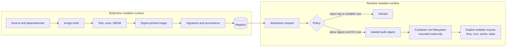
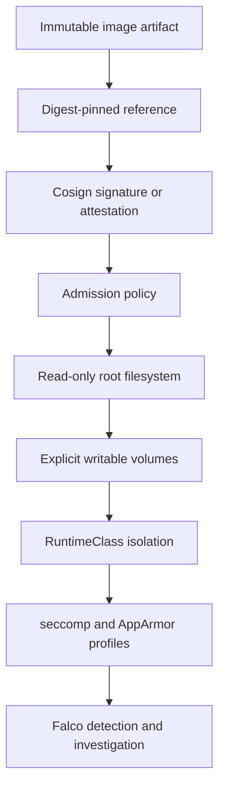

> **Complexity**: `[MEDIUM]` - CKS runtime hardening and policy enforcement
>
> **Time to Complete**: 45-50 minutes
>
> **Prerequisites**: [Module 6.2 (Runtime Security with Falco)](../module-6.2-falco/), [Module 6.3 (Container Investigation)](../module-6.3-container-investigation/), container image basics, and Kubernetes securityContext fundamentals

## What You'll Be Able to Do

After completing this module, you will be able to harden Kubernetes workloads so the runtime container is treated as a replaceable artifact rather than a mutable host.

1. **Apply** `readOnlyRootFilesystem`, Pod-level security defaults, and writable `emptyDir` mounts so an application can run without writing to its image filesystem.
2. **Design** an immutable image strategy that combines minimal base images, digest-pinned references, and signed image verification.
3. **Implement** admission policies that reject Pods with writable root filesystems or tag-only image references before those Pods reach a node.
4. **Evaluate** runtime defense-in-depth by combining immutable containers with RuntimeClass, seccomp, AppArmor, and Pod Security Standards controls.
5. **Compare** common mutable-container failure patterns and choose the correct scratch, cache, log, state, or configuration pattern for each one.

## Why This Module Matters

The runtime attacker model in this part of CKS is direct: after a Pod is admitted and scheduled, an attacker tries to execute code, write tools, modify files, create persistence, and expand from the compromised process to the surrounding cluster. [Module 6.2](../module-6.2-falco/) teaches how Falco detects that behavior through kernel events, and [Module 6.3](../module-6.3-container-investigation/) teaches how to inspect the container after an alert. Immutable infrastructure changes the incident before those tools ever fire because it removes the writable root filesystem that many post-exploitation playbooks assume will exist. ([Kubernetes Security Context](https://v1-35.docs.kubernetes.io/docs/tasks/configure-pod-container/security-context/), [Kubernetes Volumes](https://v1-35.docs.kubernetes.io/docs/concepts/storage/volumes/#emptydir))

Use the [Tesla cryptojacking incident](/k8s/cks/part1-cluster-setup/module-1.5-gui-security/) as the framing, not as a story to memorize. The useful security lesson is that an attacker who can create or control a workload usually wants a place to download binaries, unpack scripts, alter configuration, or leave artifacts that survive long enough to earn money or steal data. A read-only image root does not make the workload invulnerable, but it turns "write into the container and keep going" into "find an explicitly mounted writable path, or fail." ([Kubernetes Security Context](https://v1-35.docs.kubernetes.io/docs/tasks/configure-pod-container/security-context/), [NIST SP 800-190](https://csrc.nist.gov/pubs/sp/800/190/final))

The CKS exam usually tests this through concrete YAML rather than slogans. You may be given a Pod that writes to `/tmp`, logs to `/var/log`, runs as root, uses `nginx:latest`, and has no admission policy around it. The secure answer is not one field; it is a small design: build the image once, pin what is deployed, make the root filesystem read-only, mount only the writable directories the application truly needs, and enforce those decisions at admission so future Pods do not drift back to defaults. ([Kubernetes Images](https://v1-35.docs.kubernetes.io/docs/concepts/containers/images/), [Kubernetes Admission Controllers](https://v1-35.docs.kubernetes.io/docs/reference/access-authn-authz/admission-controllers/))

The cost-of-mutability calculation is also practical during response. If a running container can be patched in place, responders must decide which files changed legitimately, which came from the attacker, and which changes were introduced during emergency troubleshooting. That uncertainty widens blast radius because every writable path becomes evidence to preserve and every manual repair becomes another state variant to compare. When the workload is immutable, the response path from [Module 6.3](../module-6.3-container-investigation/) becomes cleaner: capture the live container, identify the writable mounts and suspicious processes, discard the compromised Pod, rebuild from versioned inputs, and redeploy a known digest rather than trusting repaired runtime state.

## Immutable Infrastructure Principle

NIST SP 800-190 describes containers as stateless entities that should be deployed but not changed: when a running container needs new contents, it is destroyed and replaced by a new container built from updated image inputs. That is the operational meaning of "immutable" in Kubernetes. You patch the Dockerfile, source, package lock, base image, or build pipeline; you do not `kubectl exec` into production and repair the live container by hand. ([NIST SP 800-190](https://csrc.nist.gov/pubs/sp/800/190/final))

This principle is sometimes summarized as "cattle, not pets," but the exam value is more precise than the slogan. A pet server accumulates undocumented state: packages installed during an outage, edited config files, temporary scripts, copied credentials, and one-off permissions. An immutable workload moves those changes into versioned inputs, rebuilds an artifact, and lets Kubernetes replace Pods from a Pod template. That makes rollback, scanning, provenance, and incident reconstruction easier because the runtime instance is not supposed to contain hidden changes. ([NIST SP 800-190](https://csrc.nist.gov/pubs/sp/800/190/final), [Kubernetes Images](https://v1-35.docs.kubernetes.io/docs/concepts/containers/images/))

The image and the container are different security surfaces. The image is a content-addressable artifact with a manifest, configuration, and filesystem layers. The container is a running process tree created from that artifact plus runtime settings, mounted volumes, credentials, and node-level isolation. Immutable infrastructure protects both surfaces: use digests and signatures so the artifact is the one you intended, then use runtime hardening so the running container cannot rewrite its own base filesystem. ([OCI Image Manifest](https://github.com/opencontainers/image-spec/blob/main/manifest.md), [OCI Content Descriptors](https://github.com/opencontainers/image-spec/blob/main/descriptor.md))



Read the diagram from left to right when you review a workload. Build-time mutation is allowed, but it must be recorded in the image artifact and its metadata. Runtime mutation is allowed only at named write points, such as an `emptyDir` scratch directory or a persistent data volume, and those mounts must be intentional enough that a reviewer can tell why they exist. ([Kubernetes Volumes](https://v1-35.docs.kubernetes.io/docs/concepts/storage/volumes/#emptydir), [Kubernetes Security Context](https://v1-35.docs.kubernetes.io/docs/tasks/configure-pod-container/security-context/))

An immutable design review should produce a clear contract. The image owns application binaries, language runtime files, static assets, and build-time configuration. Kubernetes objects own runtime configuration, credentials, resource controls, and scheduling intent. Volumes own data whose lifecycle differs from the image. If a proposed fix says "just exec into the container," it violates that contract because the change is neither in the image nor in a declared Kubernetes object. If a proposed fix says "mount this one cache directory," it can be reviewed because the write path, lifecycle, size, and owner are visible. ([NIST SP 800-190](https://csrc.nist.gov/pubs/sp/800/190/final), [Kubernetes Volumes](https://v1-35.docs.kubernetes.io/docs/concepts/storage/volumes/))

Replacement is also a recovery control. If a node crashes, a Pod is rescheduled, or a Deployment rolls forward, Kubernetes should be able to recreate the workload from source-of-truth objects and the referenced image digest. A mutable container breaks that promise because the live instance may contain files that no controller can recreate. During an incident, this difference matters. With immutable infrastructure, deleting a suspicious Pod removes the runtime instance and its ephemeral volumes, while the replacement starts from the known artifact and declared configuration. That gives responders a cleaner containment action than preserving an unknown, hand-mutated container. ([Kubernetes Images](https://v1-35.docs.kubernetes.io/docs/concepts/containers/images/), [Kubernetes Volumes](https://v1-35.docs.kubernetes.io/docs/concepts/storage/volumes/#emptydir))

## Read-Only Root Filesystems

The Kubernetes field that enforces the core runtime behavior is `securityContext.readOnlyRootFilesystem` on a container. The v1.35 generated API describes it as controlling whether the container has a read-only root filesystem, and the task documentation lists it as the setting that mounts the root filesystem as read-only. Because this is a container `SecurityContext` field, setting a Pod-level `securityContext` alone does not make every container root filesystem read-only. ([Kubernetes Security Context](https://v1-35.docs.kubernetes.io/docs/tasks/configure-pod-container/security-context/), [SecurityContext API](https://v1-35.docs.kubernetes.io/docs/reference/generated/kubernetes-api/v1.35/#securitycontext-v1-core))

Pod-level and container-level security contexts still work together. Pod-level fields such as `runAsNonRoot`, `runAsUser`, `runAsGroup`, `fsGroup`, and `seccompProfile` can establish defaults or shared behavior for the Pod, while container-level fields such as `readOnlyRootFilesystem`, `allowPrivilegeEscalation`, and `capabilities` apply to the individual container and can override overlapping Pod-level values. Use both levels deliberately so a reviewer can see which controls are Pod-wide and which controls are container-specific. ([Kubernetes Security Context](https://v1-35.docs.kubernetes.io/docs/tasks/configure-pod-container/security-context/))

```yaml
apiVersion: v1
kind: Pod
metadata:
  name: immutable-api
  labels:
    app: immutable-api
spec:
  securityContext:
    runAsNonRoot: true
    runAsUser: 10001
    runAsGroup: 10001
    fsGroup: 10001
    seccompProfile:
      type: RuntimeDefault
  containers:
    - name: api
      image: registry.example.com/platform/immutable-api@sha256:111122223333444455556666777788889999aaaabbbbccccddddeeeeffff0000
      ports:
        - containerPort: 8080
      securityContext:
        readOnlyRootFilesystem: true
        allowPrivilegeEscalation: false
        capabilities:
          drop: ["ALL"]
      volumeMounts:
        - name: tmp
          mountPath: /tmp
        - name: run
          mountPath: /run/immutable-api
        - name: cache
          mountPath: /var/cache/immutable-api
  volumes:
    - name: tmp
      emptyDir:
        medium: Memory
        sizeLimit: 64Mi
    - name: run
      emptyDir:
        medium: Memory
        sizeLimit: 16Mi
    - name: cache
      emptyDir:
        sizeLimit: 256Mi
```

This manifest separates identity, filesystem, and writable space. The Pod-level context says the workload should run as a non-root identity and use the runtime default seccomp profile. The container-level context makes the image root read-only, prevents privilege escalation, and drops Linux capabilities. The `emptyDir` mounts give the application specific write targets without reopening `/usr`, `/bin`, `/etc`, or the rest of the image filesystem. ([Kubernetes Security Context](https://v1-35.docs.kubernetes.io/docs/tasks/configure-pod-container/security-context/), [Kubernetes Volumes](https://v1-35.docs.kubernetes.io/docs/concepts/storage/volumes/#emptydir))

`emptyDir` is the usual escape hatch for immutable Pods because it is created when the Pod is assigned to a node, starts empty, can be shared by containers in the same Pod, and is deleted permanently when the Pod is removed from the node. A container crash does not delete the `emptyDir`, so the pattern supports ordinary restart behavior while still avoiding hidden writes into the image root. Memory-backed `emptyDir` mounts become tmpfs and count against memory, so use `sizeLimit` and resource limits when the write path can grow. ([Kubernetes Volumes](https://v1-35.docs.kubernetes.io/docs/concepts/storage/volumes/#emptydir))

Verify the control by testing both a forbidden write and an allowed write. A command that writes to `/root/proof.txt` or another image-root path should fail after the container is hardened. A command that writes to a mounted `/tmp` or `/run/app` path should succeed if that path was intentionally declared. Record both outputs. A failed root write proves the mount flag reached the runtime. A successful scratch write proves the application still has a sanctioned write path. If both writes succeed, the root is not protected. If both writes fail, the volume or ownership is wrong. This test is simple, but it prevents a common false pass where a manifest contains `readOnlyRootFilesystem: true` while the application still has a broad writable mount that covers the path being tested. Always test the path that represents the security claim. ([Kubernetes Security Context](https://v1-35.docs.kubernetes.io/docs/tasks/configure-pod-container/security-context/), [Kubernetes Volumes](https://v1-35.docs.kubernetes.io/docs/concepts/storage/volumes/#emptydir))

Apply the same reasoning to init containers and sidecars. An init container may legitimately write generated files into an `emptyDir` that the main container later reads, but it should not patch the main image filesystem at runtime. A log sidecar may need to read files from a shared volume, but it does not need the application root to be writable. A service-mesh sidecar may have its own writable paths, and those paths should be scoped to the sidecar rather than used as a reason to weaken the application container. Container-level security contexts let each container carry the filesystem rule it actually needs. ([Kubernetes Security Context](https://v1-35.docs.kubernetes.io/docs/tasks/configure-pod-container/security-context/), [Kubernetes Volumes](https://v1-35.docs.kubernetes.io/docs/concepts/storage/volumes/#emptydir))

Permissions still matter after the mount exists. If the Pod runs as UID `10001` and a mounted volume is owned by root with restrictive mode bits, the application may fail even though the path is writable in principle. Use build-time ownership, `fsGroup`, or an init container that prepares a named volume when the application needs a specific owner. Do not solve a permission problem by returning to UID 0 or making the image root writable. The secure path is to make identity, ownership, and writable mount lifecycle agree. ([Kubernetes Security Context](https://v1-35.docs.kubernetes.io/docs/tasks/configure-pod-container/security-context/), [Kubernetes Volumes](https://v1-35.docs.kubernetes.io/docs/concepts/storage/volumes/))

| Field | Scope | Immutable-infrastructure use | CKS review point |
|---|---|---|---|
| `readOnlyRootFilesystem: true` | Container | Mounts the container root filesystem read-only so writes must go to explicit volumes | Must be set on each regular container, and usually on init containers that do not need writes |
| `runAsNonRoot: true` | Pod or container | Prevents the workload from depending on UID 0 behavior | Pod-level value can cover containers unless a container overrides the related identity fields |
| `runAsUser` / `runAsGroup` | Pod or container | Makes the runtime identity explicit and compatible with mounted write paths | Pair with `fsGroup` or ownership-aware images when volumes need writes |
| `allowPrivilegeEscalation: false` | Container | Blocks gaining more privileges through setuid or similar mechanisms | Required by the Restricted Pod Security Standard for Linux containers |
| `capabilities.drop: ["ALL"]` | Container | Removes ambient Linux capabilities that most application processes do not need | Add back only a named capability with a clear reason and narrow workload scope |
| `seccompProfile.type: RuntimeDefault` | Pod or container | Uses the container runtime default syscall filter instead of leaving the workload unconfined | Restricted PSS requires an explicit allowed seccomp profile on Linux Pods |
| `appArmorProfile.type: RuntimeDefault` | Pod or container | Keeps AppArmor confinement enabled where supported by the node and runtime | Container-level AppArmor profile takes precedence over a Pod-level profile |

Do not confuse a read-only root filesystem with a stateless application. The application may still need durable state, but that state belongs in a database, object store, PersistentVolume, or another explicitly managed storage system rather than in the container image filesystem. Kubernetes documents that ephemeral volumes disappear with the Pod, while persistent volumes can outlive a Pod, so choose the volume type from the data lifecycle rather than from convenience. ([Kubernetes Volumes](https://v1-35.docs.kubernetes.io/docs/concepts/storage/volumes/), [NIST SP 800-190](https://csrc.nist.gov/pubs/sp/800/190/final))

## Minimal Images and Attack Surface

A read-only root filesystem is stronger when the image contains fewer tools that an attacker can reuse. Distroless images are designed to contain only the application and runtime dependencies, and the project documentation explicitly says they do not contain package managers, shells, or the other programs expected in a standard Linux distribution. That matters at runtime because a web exploit that reaches `sh`, `curl`, `apk`, or `apt` has a much easier path to downloading and staging more tools. ([Distroless](https://github.com/GoogleContainerTools/distroless))

Scratch images are the extreme form of that idea for statically linked binaries and very small runtimes. Docker documents `scratch` as a reserved minimal base image used to create a minimal image, which means there is no operating-system package set to update inside the final runtime layer. The tradeoff is compatibility: a dynamically linked binary, a program that expects CA certificates, or an application that shells out to helper binaries may fail unless those files are deliberately copied in during the build. ([Docker Scratch Base Images](https://docs.docker.com/build/building/base-images/#create-a-minimal-base-image-using-scratch))

Distroless and scratch do not replace vulnerability management. They reduce inventory, but the remaining runtime dependencies still need a build pipeline, scanner, update process, and rebuild cadence. NIST SP 800-190 calls out image vulnerabilities, image configuration defects, embedded malware, embedded clear-text secrets, and untrusted images as image-layer risks, so a minimal image should be treated as a smaller artifact to govern, not as proof that governance is unnecessary. ([NIST SP 800-190](https://csrc.nist.gov/pubs/sp/800/190/final), [Distroless](https://github.com/GoogleContainerTools/distroless))

The practical CKS pattern is a multi-stage build. Compile or assemble the application in a builder image that has compilers, package managers, and test tools, then copy only the runtime artifact and required data into a distroless or scratch final image. The final image should not need `apt`, `apk`, `bash`, test fixtures, source directories, or package caches because every operational change should come from rebuilding and redeploying the artifact. ([Distroless](https://github.com/GoogleContainerTools/distroless), [Docker Scratch Base Images](https://docs.docker.com/build/building/base-images/#create-a-minimal-base-image-using-scratch))

```dockerfile
# Build stage has tooling.
FROM golang:1.25 AS build
WORKDIR /src
COPY go.mod go.sum ./
RUN go mod download
COPY . .
RUN CGO_ENABLED=0 go build -trimpath -o /out/server ./cmd/server

# Runtime stage has the application only.
FROM scratch
COPY --from=build /out/server /server
USER 10001:10001
ENTRYPOINT ["/server"]
```

Debug images should stay out of production manifests. The distroless project publishes debug variants for troubleshooting, and those images intentionally change the runtime tool inventory. If an exam prompt or production control asks for an immutable workload, do not solve day-two debugging by replacing the production image with a shell-equipped debug image; use a controlled debug path and then rebuild the real image if the application needs a permanent change. ([Distroless](https://github.com/GoogleContainerTools/distroless), [Kubernetes Security Context](https://v1-35.docs.kubernetes.io/docs/tasks/configure-pod-container/security-context/))

Minimal images also change the investigation workflow. A normal container may let an operator run `ps`, `cat`, `find`, `curl`, or `sh` inside the compromised environment, while a distroless or scratch image may not contain those tools at all. That is a feature for attack resistance, but it means responders should be ready to use Kubernetes-native inspection, node-level container runtime tools, or ephemeral debug techniques covered in [Module 6.3](../module-6.3-container-investigation/) rather than assuming the production image can debug itself. The production image should serve the application, not act as a toolbox. ([Distroless](https://github.com/GoogleContainerTools/distroless), [Kubernetes Security Context](https://v1-35.docs.kubernetes.io/docs/tasks/configure-pod-container/security-context/))

A smaller image can make scanning and provenance more meaningful because there are fewer packages, files, and layers to explain. Distroless documentation explicitly frames the reduced runtime contents as improving scanner signal-to-noise and reducing the provenance burden to the dependencies the application needs. That does not remove the need to scan. It makes the scan easier to interpret because a finding is less likely to come from an unused shell, package manager, or distribution utility that should never have shipped in the runtime image. It also makes ownership clearer. The application team owns the binary and its direct runtime files. The platform team owns the base image policy. Security owns the acceptance gates. That split is easier to operate when the image has less accidental inventory. ([Distroless](https://github.com/GoogleContainerTools/distroless), [NIST SP 800-190](https://csrc.nist.gov/pubs/sp/800/190/final))

## Image Digests and Signing

Kubernetes image tags and image digests have different security properties. The Kubernetes v1.35 image documentation states that tags can be moved to point to different images, while digests are immutable hashes of image content and fixed to a specific version. That means `registry.example.com/api:prod` is an instruction to resolve a name, while `registry.example.com/api@sha256:...` is an instruction to run a specific content object. ([Kubernetes Images](https://v1-35.docs.kubernetes.io/docs/concepts/containers/images/))

Digest pinning also changes rollback and incident analysis. If a Deployment uses a tag and the registry changes what that tag points to, two Pods with the same manifest can end up running different bytes across time or across nodes. If the manifest uses a digest, Kubernetes runs the same image content whenever that reference is used, and the OCI descriptor model gives clients a digest, size, and media type for verifying referenced content. ([Kubernetes Images](https://v1-35.docs.kubernetes.io/docs/concepts/containers/images/), [OCI Content Descriptors](https://github.com/opencontainers/image-spec/blob/main/descriptor.md))

```yaml
# Mutable reference: useful for humans, risky as the deployed identity.
image: registry.example.com/payments/api:prod

# Immutable reference: the digest is the deployed identity.
image: registry.example.com/payments/api@sha256:22223333444455556666777788889999aaaabbbbccccddddeeeeffff00001111

# Tag plus digest: the tag documents intent, but Kubernetes pulls by digest.
image: registry.example.com/payments/api:v1.8.3@sha256:22223333444455556666777788889999aaaabbbbccccddddeeeeffff00001111
```

`imagePullPolicy: Always` is not a substitute for digest pinning. With a tag, `Always` tells the kubelet to resolve the image name each time it launches a container, and that resolution can still find a changed tag. With a digest, Kubernetes can pin the exact content even if a human-readable tag is also present, because the documentation states that only the digest is used for pulling when both are specified. ([Kubernetes Images](https://v1-35.docs.kubernetes.io/docs/concepts/containers/images/))

Signing adds a trust decision to the immutable content decision. Cosign documentation warns to sign container images by digest rather than tag so that the signature applies to the content you think you are signing, and Sigstore verification documentation covers verifying those signatures before trusting an image. In a secure pipeline, the image digest is built, scanned, signed, and then admitted only if the signature or attestation matches the expected identity. ([Cosign Signing](https://docs.sigstore.dev/cosign/signing/signing_with_containers/), [Cosign Verification](https://docs.sigstore.dev/cosign/verifying/verify/))

```bash
IMAGE=registry.example.com/payments/api@sha256:22223333444455556666777788889999aaaabbbbccccddddeeeeffff00001111

cosign sign "$IMAGE"
cosign verify "$IMAGE"
```

Keep the layers separate in your explanation. A digest answers "which bytes should run?" A signature answers "who vouched for those bytes, under which identity or key?" An admission controller answers "should this workload be accepted into this cluster right now?" A read-only root filesystem answers "can the accepted workload rewrite its own image filesystem after it starts?" Those controls compose, but none of them fully replaces the others. ([OCI Content Descriptors](https://github.com/opencontainers/image-spec/blob/main/descriptor.md), [Cosign Signing](https://docs.sigstore.dev/cosign/signing/signing_with_containers/), [Kubernetes Admission Controllers](https://v1-35.docs.kubernetes.io/docs/reference/access-authn-authz/admission-controllers/))

Use real digests from the registry in production and lab answers. A digest is not a decoration that can be invented in a manifest. It is the content identifier returned by the registry for a specific manifest or image index. In a real workflow, you build and push the image, resolve the digest, scan and sign that digest, and then deploy the digest-pinned reference. Keep the resolver step repeatable. Store the digest next to the build output. Review the digest in the change request. Roll back by returning to the previous digest. Treat a digest change as a production change, even when the tag text looks the same. If a prompt provides a registry and asks you to harden a manifest, retrieve or use the provided digest rather than copying a placeholder from a lesson. ([Kubernetes Images](https://v1-35.docs.kubernetes.io/docs/concepts/containers/images/), [OCI Content Descriptors](https://github.com/opencontainers/image-spec/blob/main/descriptor.md))

Signature verification should fail closed when it is used as an admission control. If an image has no matching signature, the signature comes from the wrong identity, or the attestation does not match the required policy, the Pod should not be admitted into the protected namespace. Kyverno verifyImages supports required verification, digest verification, and attestors, while Sigstore documents verification of signed images. This makes signing operationally useful because the signature is checked at the point where a workload asks to enter the cluster. Keep the human process aligned with that gate. Rotate keys deliberately. Review keyless identity patterns. Decide who can sign release images. Store verification failures where release owners can see them. A silent signature failure becomes a deployment mystery, but a visible failure becomes a supply-chain control. ([Kyverno Verify Images](https://kyverno.io/docs/policy-types/cluster-policy/verify-images/overview/), [Cosign Verification](https://docs.sigstore.dev/cosign/verifying/verify/))

## Admission Enforcement

Admission controllers are the cluster boundary where immutable-infrastructure rules become enforceable instead of advisory. Kubernetes admission control intercepts API requests after authentication and authorization but before persistence, then runs mutating admission before validating admission. [Module 5.4 (Admission Controllers)](/k8s/cks/part5-supply-chain-security/module-5.4-admission-controllers/) covers that mechanism in detail; here, the policy goal is narrower: reject Pods that would start with writable root filesystems or mutable image references. ([Kubernetes Admission Controllers](https://v1-35.docs.kubernetes.io/docs/reference/access-authn-authz/admission-controllers/))

Pod Security Standards are necessary but not sufficient for this module. The Restricted standard covers controls such as disallowing privilege escalation, requiring non-root execution, constraining capabilities, restricting volume types, and requiring allowed seccomp settings, but it does not by itself require every container to set `readOnlyRootFilesystem: true` or every image to use a digest. Custom admission fills that gap while Pod Security Admission continues to enforce the baseline Pod hardening profile. ([Pod Security Standards](https://v1-35.docs.kubernetes.io/docs/concepts/security/pod-security-standards/), [Kubernetes Admission Controllers](https://v1-35.docs.kubernetes.io/docs/reference/access-authn-authz/admission-controllers/))

Kyverno is a practical CKS-style policy engine because it validates Kubernetes resources directly with YAML policies. The Kyverno validate documentation explains pattern-based validation, deny rules, `foreach` processing for sub-elements such as containers, and `failureAction` behavior; the public policy catalog includes a require-read-only-root-filesystem policy and a require-image-digest policy. The example below keeps the exam idea visible: all regular containers must have a read-only root filesystem, and all regular container images must include a `@sha256:` digest. ([Kyverno Validate Rules](https://kyverno.io/docs/policy-types/cluster-policy/validate/), [Kyverno Read-Only Root Filesystem Policy](https://kyverno.io/policies/best-practices/require-ro-rootfs/require-ro-rootfs/), [Kyverno Require Image Digest Policy](https://kyverno.io/policies/other/require-image-digest/require-image-digest/))

```yaml
apiVersion: kyverno.io/v1
kind: ClusterPolicy
metadata:
  name: require-immutable-pods
spec:
  validationFailureAction: Enforce
  background: true
  rules:
    - name: require-read-only-rootfs
      match:
        any:
          - resources:
              kinds:
                - Pod
      validate:
        message: "Every container must set securityContext.readOnlyRootFilesystem to true."
        pattern:
          spec:
            =(initContainers):
              - securityContext:
                  readOnlyRootFilesystem: true
            containers:
              - securityContext:
                  readOnlyRootFilesystem: true
    - name: require-image-digests
      match:
        any:
          - resources:
              kinds:
                - Pod
      validate:
        message: "Every container image must be pinned with a sha256 digest."
        pattern:
          spec:
            =(initContainers):
              - image: "*@sha256:*"
            containers:
              - image: "*@sha256:*"
```

Production policies usually need to cover more than raw Pod objects. Controllers such as Deployments, DaemonSets, StatefulSets, Jobs, and CronJobs create Pod templates, and policy engines often provide auto-generation or separate rules so the same Pod-level expectations apply to those templates. Kyverno image verification can also mutate matching images to add digests and can enforce digest use while verifying signatures through attestors, which lets a cluster combine digest pinning, signature validation, and admission denial in one operated control. ([Kyverno Verify Images](https://kyverno.io/docs/policy-types/cluster-policy/verify-images/overview/), [Kubernetes Admission Controllers](https://v1-35.docs.kubernetes.io/docs/reference/access-authn-authz/admission-controllers/))

Roll out enforcement in a way that teaches developers before it blocks emergency work. A policy engine can run in audit mode to show which workloads would fail, then move selected namespaces to enforce mode after owners have fixed manifests. That staged rollout is not a weakening of the control. It is how you avoid learning during an outage that a critical workload writes to `/var/cache` or relies on a tag-only image. Export the audit results. Group them by owner. Fix the common patterns first. Then enforce by namespace or workload class. The final protected namespace should still enforce the rule, but the transition should produce an inventory of required write paths and image-reference fixes. ([Kyverno Validate Rules](https://kyverno.io/docs/policy-types/cluster-policy/validate/), [Kubernetes Admission Controllers](https://v1-35.docs.kubernetes.io/docs/reference/access-authn-authz/admission-controllers/))

Policy error messages are part of the control. A rejection that says "immutable policy failed" sends the developer back to guessing. A rejection that names `securityContext.readOnlyRootFilesystem` or says "image must include @sha256 digest" tells the developer what to change. This is especially important in CKS tasks because you need to prove that the right field caused the denial. Use messages that identify the missing field, the required value, and the scope of the rule. A precise denial speeds remediation without relaxing admission. It also reduces risky workarounds. Developers are less likely to request a broad exception when the message points to one missing field. ([Kyverno Validate Rules](https://kyverno.io/docs/policy-types/cluster-policy/validate/))

## Runtime Defense in Depth

Immutable infrastructure reduces the writable surface, but runtime isolation still matters because a process can exploit the kernel, abuse a mounted credential, open a network connection, or attack another workload without writing to the root filesystem. RuntimeClass, seccomp, AppArmor, and Pod Security Standards are defense-in-depth controls that sit beside immutability: they restrict how the process is run, which syscalls it can make, which profile confines it, and which Pod shapes the cluster will accept. ([Kubernetes RuntimeClass](https://v1-35.docs.kubernetes.io/docs/concepts/containers/runtime-class/), [Seccomp Tutorial](https://v1-35.docs.kubernetes.io/docs/tutorials/security/seccomp/), [AppArmor Tutorial](https://v1-35.docs.kubernetes.io/docs/tutorials/security/apparmor/), [Pod Security Standards](https://v1-35.docs.kubernetes.io/docs/concepts/security/pod-security-standards/))

RuntimeClass selects a container runtime configuration for a Pod. Kubernetes documentation describes it as a way to choose different runtime configurations, such as a runtime that uses hardware virtualization for workloads needing higher isolation at additional overhead. In an immutable design, a RuntimeClass does not make the filesystem read-only; it gives you a stronger execution boundary for workloads where a read-only root filesystem is not enough. ([Kubernetes RuntimeClass](https://v1-35.docs.kubernetes.io/docs/concepts/containers/runtime-class/))

Seccomp narrows the syscall interface. Kubernetes lets Pods and containers use seccomp profiles, and the tutorial states that most container runtimes provide a reasonable default set of allowed and blocked syscalls through `RuntimeDefault`. For CKS, the important pairing is simple: use `readOnlyRootFilesystem` to reduce file mutation, and use `seccompProfile.type: RuntimeDefault` to avoid leaving the process unconfined at the syscall layer. ([Seccomp Tutorial](https://v1-35.docs.kubernetes.io/docs/tutorials/security/seccomp/), [Kubernetes Security Context](https://v1-35.docs.kubernetes.io/docs/tasks/configure-pod-container/security-context/))

AppArmor narrows file and resource access through profiles on supported Linux nodes. The v1.35 AppArmor tutorial explains that profiles can be specified at Pod or container level, that the container profile takes precedence, and that profile types include `RuntimeDefault`, `Localhost`, and `Unconfined`. AppArmor is node and runtime dependent, so a manifest that explicitly requests a local profile must land on nodes where that profile is loaded. ([AppArmor Tutorial](https://v1-35.docs.kubernetes.io/docs/tutorials/security/apparmor/))



The layered model prevents a common overclaim. A signed image can still be misconfigured with a writable root filesystem. A read-only root filesystem can still run as root. A non-root process can still make unnecessary syscalls. A RuntimeClass can still run an image referenced by a mutable tag. A strong answer connects the controls instead of pretending that one control proves the whole workload is safe. ([Kubernetes Images](https://v1-35.docs.kubernetes.io/docs/concepts/containers/images/), [Pod Security Standards](https://v1-35.docs.kubernetes.io/docs/concepts/security/pod-security-standards/), [Kubernetes RuntimeClass](https://v1-35.docs.kubernetes.io/docs/concepts/containers/runtime-class/))

RuntimeClass also has a scheduling dimension. Kubernetes documentation explains that RuntimeClass can include scheduling constraints so Pods land on nodes that support the selected handler, and that a missing RuntimeClass or unsupported handler can cause Pod failure. Do not add `runtimeClassName` blindly to every workload during an immutable-infrastructure task. First confirm the class exists, the nodes support it, and the workload needs that isolation level. Then treat it as an added boundary on top of the read-only filesystem, not as a substitute for the filesystem control. ([Kubernetes RuntimeClass](https://v1-35.docs.kubernetes.io/docs/concepts/containers/runtime-class/))

Seccomp and AppArmor failures are usually environment mismatches or profile mismatches. A privileged container runs unconfined for seccomp, so privileged mode undermines that layer. A requested AppArmor `Localhost` profile must be loaded on the node, or the kubelet rejects the Pod. These details matter when a hardened Pod fails to start. Read the Pod events and distinguish a policy rejection from a runtime profile problem before changing the immutable settings. The fix may be node profile preparation, not making the container mutable again. ([Seccomp Tutorial](https://v1-35.docs.kubernetes.io/docs/tutorials/security/seccomp/), [AppArmor Tutorial](https://v1-35.docs.kubernetes.io/docs/tutorials/security/apparmor/))

## What Breaks in Practice

Most immutability failures are application assumptions, not Kubernetes bugs. A package may write a PID file under `/var/run`, a language runtime may cache bytecode under the application directory, a web server may try to write access logs under `/var/log`, or a startup script may copy default configuration into `/etc` on first run. With `readOnlyRootFilesystem: true`, those writes fail unless you redirect them to an explicit volume or change the application configuration. ([Kubernetes Security Context](https://v1-35.docs.kubernetes.io/docs/tasks/configure-pod-container/security-context/), [Kubernetes Volumes](https://v1-35.docs.kubernetes.io/docs/concepts/storage/volumes/#emptydir))

| Mutable default surface | Typical failure after root becomes read-only | Secure pattern | Avoid |
|---|---|---|---|
| `/tmp` scratch files | Uploads, sort files, or temporary archives fail with permission errors | Mount memory-backed `emptyDir` at `/tmp` with a `sizeLimit` | Reopening the whole root filesystem for convenience |
| `/var/run` or `/run` | PID files and Unix sockets cannot be created | Mount memory-backed `emptyDir` at the exact runtime directory | Mounting a broad writable `/var` tree |
| `/var/cache/app` | Framework or package cache cannot initialize | Mount disk-backed `emptyDir` at the app cache path and cap size | Letting cache grow without ephemeral-storage planning |
| `/var/log/app` | File logs fail or disappear with the container | Prefer stdout and stderr; use a named volume only when a sidecar requires files | Writing production evidence only inside a container filesystem |
| `/etc/app` generated config | First-run scripts cannot rewrite config files | Generate config at build time, mount ConfigMaps or Secrets, or render into `/run/app` | Mutating image config after deployment |
| Application state directory | SQLite files, queues, or local indexes vanish on replacement | Use a database, object store, PVC, or another explicit data system | Treating the image root as durable storage |

The table is also an exam workflow. When a Pod fails after you set a read-only root filesystem, inspect the error path, classify the path as scratch, runtime, cache, log, config, or state, and then choose the smallest writable mount or external store that matches that lifecycle. If you cannot explain why a directory must be writable, do not mount it writable by default. ([Kubernetes Volumes](https://v1-35.docs.kubernetes.io/docs/concepts/storage/volumes/#emptydir), [NIST SP 800-190](https://csrc.nist.gov/pubs/sp/800/190/final))

ConfigMaps and Secrets have their own immutability feature, but that feature solves a different problem. Kubernetes lets you mark individual ConfigMaps and Secrets immutable so their data cannot be changed in place, and the documentation says the change cannot be reverted without deleting and recreating the object. That protects configuration objects from accidental updates and can reduce API server watch load, while `readOnlyRootFilesystem` protects the container image filesystem from runtime writes. ([Immutable ConfigMaps](https://v1-35.docs.kubernetes.io/docs/concepts/configuration/configmap/#configmap-immutable), [Immutable Secrets](https://v1-35.docs.kubernetes.io/docs/concepts/configuration/secret/#immutable-secrets))

Init-on-first-run patterns deserve special scrutiny. Some images start by writing default files into `/etc`, installing plugins, creating users, or patching application directories. That pattern is convenient for mutable VMs but weak for immutable containers because it hides runtime state changes inside a startup side effect. Move those steps into the build stage, a controlled init container that writes to a named volume, or an operator-managed data store, and then make the main container root filesystem read-only. ([NIST SP 800-190](https://csrc.nist.gov/pubs/sp/800/190/final), [Kubernetes Volumes](https://v1-35.docs.kubernetes.io/docs/concepts/storage/volumes/))

Logging is a frequent source of accidental mutability. Kubernetes already collects stdout and stderr from containers, so many applications should log there instead of writing files under `/var/log`. File-based logging can still be valid when a sidecar tails a shared volume or a legacy application cannot be changed quickly, but that case should use an explicit volume with retention and shipping handled outside the image root. Name the log volume. Limit its size. Ship it promptly. Decide whether the log survives Pod deletion. Make those choices visible in the manifest or platform policy. Do not let "the app needs logs" become a reason to leave the entire filesystem writable. ([Kubernetes Volumes](https://v1-35.docs.kubernetes.io/docs/concepts/storage/volumes/#emptydir), [NIST SP 800-190](https://csrc.nist.gov/pubs/sp/800/190/final))

Configuration updates should follow the same replacement model. If a ConfigMap or Secret is mutable, a Pod may eventually observe a changed value depending on how the data is consumed and cached. If the object is marked immutable, Kubernetes requires delete and recreate for data changes. Either way, the container should not rewrite `/etc/app/config.yaml` inside the image root to represent new desired state. Put runtime configuration in Kubernetes objects, make those objects immutable when the operational model requires it, and roll Pods when the configuration contract changes. ([Immutable ConfigMaps](https://v1-35.docs.kubernetes.io/docs/concepts/configuration/configmap/#configmap-immutable), [Immutable Secrets](https://v1-35.docs.kubernetes.io/docs/concepts/configuration/secret/#immutable-secrets))

## CKS Exam Workflow

For a manifest-hardening task, work in this order: pin the image by digest, add Pod-level identity and seccomp defaults, set container-level `readOnlyRootFilesystem: true`, drop capabilities, disable privilege escalation, and then add named writable volumes only for paths the app demonstrably needs. This sequence keeps the answer readable because each field has a separate reason rather than becoming a pile of unrelated hardening snippets. It also helps you debug failures. If image pull fails, inspect the reference. If admission rejects the Pod, inspect the policy field named in the message. If the process starts and then exits, inspect the write path and ownership. Each failure points to one layer. ([Kubernetes Images](https://v1-35.docs.kubernetes.io/docs/concepts/containers/images/), [Kubernetes Security Context](https://v1-35.docs.kubernetes.io/docs/tasks/configure-pod-container/security-context/))

```yaml
apiVersion: v1
kind: Pod
metadata:
  name: mutable-demo
spec:
  containers:
    - name: app
      image: busybox:1.36
      command: ["sh", "-c", "echo starting; sleep 3600"]
```

The Pod above is the starting point, not the answer. It uses a tag, has no Pod-level runtime defaults, has a writable root filesystem by omission, and does not declare where writes are expected. A hardened CKS answer pins the image, adds security context at the right level, and creates named write paths such as `/tmp` instead of leaving the whole root filesystem writable. ([Kubernetes Images](https://v1-35.docs.kubernetes.io/docs/concepts/containers/images/), [SecurityContext API](https://v1-35.docs.kubernetes.io/docs/reference/generated/kubernetes-api/v1.35/#securitycontext-v1-core))

```yaml
apiVersion: v1
kind: Pod
metadata:
  name: immutable-demo
spec:
  securityContext:
    runAsNonRoot: true
    runAsUser: 10001
    runAsGroup: 10001
    seccompProfile:
      type: RuntimeDefault
  containers:
    - name: app
      image: busybox:1.36@sha256:3333444455556666777788889999aaaabbbbccccddddeeeeffff000011112222
      command: ["sh", "-c", "echo starting; sleep 3600"]
      securityContext:
        readOnlyRootFilesystem: true
        allowPrivilegeEscalation: false
        capabilities:
          drop: ["ALL"]
      volumeMounts:
        - name: tmp
          mountPath: /tmp
  volumes:
    - name: tmp
      emptyDir:
        medium: Memory
        sizeLimit: 32Mi
```

For an admission-policy task, first decide whether the prompt wants mutation, validation, or image verification. A pure validation task rejects noncompliant Pods and is easiest to explain. A mutation task can add defaults, but it can also hide developer intent if the team never sees the rejected shape. An image-verification task checks signatures and attestations and may also enforce digest use. Test the policy with a deliberately bad Pod. Then test it with the smallest corrected Pod. Keep the two manifests close together while you work. The contrast makes the policy behavior obvious. Tie your answer back to the request lifecycle from [Module 5.4](/k8s/cks/part5-supply-chain-security/module-5.4-admission-controllers/): admission happens before persistence, so it prevents a bad Pod from becoming cluster state. ([Kubernetes Admission Controllers](https://v1-35.docs.kubernetes.io/docs/reference/access-authn-authz/admission-controllers/), [Kyverno Verify Images](https://kyverno.io/docs/policy-types/cluster-policy/verify-images/overview/))

For an incident-explanation task, say exactly how mutability changed the blast radius. A writable root filesystem lets a compromised process place downloaded binaries, overwrite application files, edit startup scripts, drop web shells, or leave misleading artifacts in paths responders may trust. An immutable root turns those attempts into failed writes or redirects them into the few explicit volumes that [Module 6.2](../module-6.2-falco/) can monitor and [Module 6.3](../module-6.3-container-investigation/) can inspect. ([Kubernetes Security Context](https://v1-35.docs.kubernetes.io/docs/tasks/configure-pod-container/security-context/), [Kubernetes Volumes](https://v1-35.docs.kubernetes.io/docs/concepts/storage/volumes/#emptydir))

For time management, keep a short mental checklist. First, identify whether the task is asking for manifest hardening, image identity, admission policy, or incident reasoning. Second, apply the control at the correct layer. Third, run one positive and one negative test. A hardened Pod should reject a root write and permit only the declared scratch write. An admission policy should reject one bad manifest and admit one good manifest. A digest policy should fail on a tag-only image and pass on an image with `@sha256:`. Save the commands. Save the errors. Compare the accepted object with the rejected one. That gives you evidence for the answer and a faster path if the grader environment behaves differently. Those proofs are faster than rereading every field after each edit. ([Kubernetes Security Context](https://v1-35.docs.kubernetes.io/docs/tasks/configure-pod-container/security-context/), [Kyverno Validate Rules](https://kyverno.io/docs/policy-types/cluster-policy/validate/), [Kubernetes Images](https://v1-35.docs.kubernetes.io/docs/concepts/containers/images/))

## Did You Know?

- Kubernetes v1.35 documentation states that when an image reference includes both tag and digest, only the digest is used for pulling, so a tag can document human intent without becoming the deployed identity. ([Kubernetes Images](https://v1-35.docs.kubernetes.io/docs/concepts/containers/images/))
- The Restricted Pod Security Standard requires several adjacent hardening controls, including non-root execution and explicit allowed seccomp settings for Linux Pods, but custom admission is still needed if your standard requires read-only root filesystems. ([Pod Security Standards](https://v1-35.docs.kubernetes.io/docs/concepts/security/pod-security-standards/))
- `emptyDir.medium: Memory` creates a tmpfs-backed writable area, but files written there count against the memory limit of the container that wrote them, so immutable scratch paths still need resource planning. ([Kubernetes Volumes](https://v1-35.docs.kubernetes.io/docs/concepts/storage/volumes/#emptydir))
- Distroless images are signed with cosign according to the distroless documentation, which makes them useful examples when teaching the connection between minimal runtime images and image-signature verification. ([Distroless](https://github.com/GoogleContainerTools/distroless), [Cosign Verification](https://docs.sigstore.dev/cosign/verifying/verify/))

## Common Mistakes

| Mistake | Why It Hurts | Better Operator Move |
|---|---|---|
| Setting only Pod-level `securityContext` and assuming the root filesystem is read-only | `readOnlyRootFilesystem` is a container security context field, so the root filesystem remains writable unless each relevant container sets it | Put Pod-wide identity and seccomp defaults at Pod level, then set `readOnlyRootFilesystem: true` on containers |
| Pinning `imagePullPolicy: Always` but keeping a mutable tag | `Always` can re-resolve a moved tag, so it does not prove that the same bytes run every time | Use digest references, optionally with a tag plus digest for readability |
| Mounting a broad writable `/var` to fix one failing PID file | Broad writable mounts recreate much of the mutable filesystem the control was meant to remove | Mount a small `emptyDir` at the exact path the process needs, such as `/run/app` |
| Using a distroless debug image as the production fix | Debug variants intentionally add troubleshooting tools, changing the runtime inventory and attacker options | Use debug paths for investigation, then rebuild the real minimal image for production |
| Treating Pod Security Standards as the whole immutable policy | PSS covers important Pod hardening, but it does not require digest pinning or read-only root filesystems for every workload | Combine namespace PSS labels with a custom admission policy for immutable-specific requirements |
| Writing application logs only to files inside the container root | Logs disappear on replacement and may fail once the root filesystem is read-only | Prefer stdout and stderr, or mount an explicit log volume only when the logging architecture requires file handoff |
| Making `/tmp` writable but leaving cache and state unclassified | The next write failure will lead to another broad exception, and state may still live in the wrong lifecycle | Inventory scratch, cache, runtime, config, log, and durable state paths before choosing mounts |

## Quiz

<details>
<summary>A Pod sets `spec.securityContext.runAsNonRoot: true` but none of its containers set `readOnlyRootFilesystem`. Is the root filesystem immutable?</summary>

No. `runAsNonRoot` controls the runtime user expectation, while `readOnlyRootFilesystem` is a container-level `securityContext` field that mounts that container's root filesystem read-only. The correct fix is to keep useful Pod-level defaults such as `runAsNonRoot` and `seccompProfile`, then set `containers[*].securityContext.readOnlyRootFilesystem: true` for each application container that should be immutable.
</details>

<details>
<summary>An application fails after hardening because it writes a PID file under `/var/run/app/app.pid`. What is the smallest secure fix?</summary>

Mount an `emptyDir`, usually memory-backed, at `/var/run/app` or a more exact runtime directory and keep the rest of the root filesystem read-only. Reopening `/var` or disabling `readOnlyRootFilesystem` would solve the symptom by removing the control. The better answer classifies the path as runtime scratch, gives it a named writable mount, and caps the size where appropriate.
</details>

<details>
<summary>A team says `imagePullPolicy: Always` makes `registry.example.com/api:prod` safe because the kubelet always pulls the newest image. What is wrong with that reasoning?</summary>

It confuses freshness with immutability. A tag can move, so `Always` may pull different bytes at different times while the manifest still appears unchanged. A digest-pinned reference identifies the exact image content, and a signature verifies who vouched for that content. Use `Always` only for pull behavior, not as the deployed identity.
</details>

<details>
<summary>A Kyverno policy rejects Pods without digest-pinned images, but a Deployment with tag-only images still creates Pods. Where should you look?</summary>

Check whether the policy applies to controller Pod templates or only direct Pod objects. Workload controllers create Pods from templates, so production policy should cover Deployments, DaemonSets, StatefulSets, Jobs, CronJobs, or use the policy engine's auto-generation behavior where available. The admission concept is still the same: reject or mutate the request before it becomes persisted cluster state.
</details>

<details>
<summary>A signed distroless image runs with a writable root filesystem. Is the workload immutable enough for this module's goal?</summary>

No. The signature can prove the signed image content and signer identity, and the distroless base can reduce the tool inventory, but neither control stops the running container from writing into a writable root filesystem. The workload still needs container-level `readOnlyRootFilesystem: true`, explicit writable mounts, and runtime controls such as non-root execution and seccomp.
</details>

<details>
<summary>During an incident, Falco reports a shell process and investigators find downloaded tools under `/tmp`. Did the immutable design fail?</summary>

Not necessarily. `/tmp` may be an intentionally writable `emptyDir` so the application can function. The immutable root still protected image paths such as `/usr`, `/bin`, and `/etc`. The response is to inspect whether `/tmp` was required, whether its size and lifecycle were constrained, whether Falco rules monitored suspicious writes or executions there, and whether the attacker could persist beyond the Pod lifetime.
</details>

## Hands-On Practice

- [ ] Complete the [Immutable Infrastructure Killercoda lab](https://killercoda.com/kubedojo/scenario/cks-6.4-immutable-infrastructure) and record which writes fail before and after the explicit `emptyDir` mounts are added.
- [ ] Take a mutable Pod manifest, add Pod-level non-root and seccomp defaults, set container-level `readOnlyRootFilesystem: true`, and document every writable mount that remains.
- [ ] Convert a tag-only image reference to a digest-pinned reference, then explain why `imagePullPolicy` did not solve the same problem.
- [ ] Write an admission policy that rejects Pods missing `readOnlyRootFilesystem: true`, and test one rejected Pod plus one accepted Pod.
- [ ] Extend the policy or add a second rule so tag-only image references are rejected before the Pod is persisted.
- [ ] Pick one application image in a lab cluster and inventory its expected write paths: scratch, runtime socket, cache, log, config, and durable state.

Use this disposable drill to see the difference between root filesystem writes and explicit scratch writes. The first write should fail after the Pod is hardened, while the second write should succeed because `/tmp` is a named writable mount.

```bash
kubectl create namespace immutable-lab

kubectl run mutable-demo -n immutable-lab \
  --image=busybox:1.36 \
  --restart=Never \
  -- sleep 3600

kubectl wait pod/mutable-demo -n immutable-lab --for=condition=Ready --timeout=90s
kubectl exec -n immutable-lab mutable-demo -- sh -c 'echo can-write-root > /root/proof.txt; cat /root/proof.txt'
kubectl delete pod mutable-demo -n immutable-lab
```

Then apply a hardened manifest with `/tmp` mounted as `emptyDir` and repeat the write tests. In a real exam, you would use a real digest from the provided registry rather than the placeholder digest shown in the teaching manifest.

```bash
kubectl apply -n immutable-lab -f immutable-demo.yaml
kubectl wait pod/immutable-demo -n immutable-lab --for=condition=Ready --timeout=90s

kubectl exec -n immutable-lab immutable-demo -- sh -c 'echo root-write > /root/proof.txt'
kubectl exec -n immutable-lab immutable-demo -- sh -c 'echo tmp-write > /tmp/proof.txt; cat /tmp/proof.txt'

kubectl delete namespace immutable-lab
```

## Next Module

This is the final module in the CKS runtime security part. Return to the [CKS overview](/k8s/cks/) to review the full exam track and connect immutable infrastructure back to cluster setup, hardening, supply-chain security, runtime detection, and incident response.

## Sources

- [Kubernetes v1.35: Configure a Security Context for a Pod or Container](https://v1-35.docs.kubernetes.io/docs/tasks/configure-pod-container/security-context/) - documents Pod and container security contexts, `readOnlyRootFilesystem`, container overrides, capabilities, seccomp, AppArmor, and related runtime security fields.
- [Kubernetes v1.35 API Reference: SecurityContext](https://v1-35.docs.kubernetes.io/docs/reference/generated/kubernetes-api/v1.35/#securitycontext-v1-core) - generated API reference for container `SecurityContext` fields, including `readOnlyRootFilesystem`.
- [Kubernetes v1.35: Images](https://v1-35.docs.kubernetes.io/docs/concepts/containers/images/) - documents tags, digests, `latest`, digest pinning, tag plus digest behavior, and image pull policy defaults.
- [Kubernetes v1.35: Volumes and emptyDir](https://v1-35.docs.kubernetes.io/docs/concepts/storage/volumes/#emptydir) - documents `emptyDir` lifecycle, memory-backed tmpfs behavior, sharing between containers, and deletion when the Pod leaves the node.
- [Kubernetes v1.35: Pod Security Standards](https://v1-35.docs.kubernetes.io/docs/concepts/security/pod-security-standards/) - documents Baseline and Restricted controls for privilege, volume, non-root, seccomp, AppArmor, and related Pod hardening.
- [Kubernetes v1.35: Admission Controllers](https://v1-35.docs.kubernetes.io/docs/reference/access-authn-authz/admission-controllers/) - documents admission timing, mutating and validating phases, default admission plugins, and extensibility points.
- [Kubernetes v1.35: RuntimeClass](https://v1-35.docs.kubernetes.io/docs/concepts/containers/runtime-class/) - documents runtime handler selection, scheduling constraints, and the security/performance tradeoff for alternative runtimes.
- [Kubernetes v1.35: Restrict a Container's Syscalls with seccomp](https://v1-35.docs.kubernetes.io/docs/tutorials/security/seccomp/) - documents seccomp profiles, `RuntimeDefault`, unconfined behavior, and syscall restriction examples.
- [Kubernetes v1.35: Restrict a Container's Access to Resources with AppArmor](https://v1-35.docs.kubernetes.io/docs/tutorials/security/apparmor/) - documents AppArmor node prerequisites, Pod and container profile fields, and `RuntimeDefault`, `Localhost`, and `Unconfined` types.
- [Kubernetes v1.35: Immutable ConfigMaps](https://v1-35.docs.kubernetes.io/docs/concepts/configuration/configmap/#configmap-immutable) - documents immutable ConfigMap behavior, update restrictions, and watch-load benefits.
- [Kubernetes v1.35: Immutable Secrets](https://v1-35.docs.kubernetes.io/docs/concepts/configuration/secret/#immutable-secrets) - documents immutable Secret behavior, update restrictions, and kubelet watch behavior.
- [NIST SP 800-190: Application Container Security Guide](https://csrc.nist.gov/pubs/sp/800/190/final) - primary guidance for container immutability, image risks, runtime defense, data persistence, and container-specific vulnerability management.
- [OCI Image Manifest Specification](https://github.com/opencontainers/image-spec/blob/main/manifest.md) - defines the image manifest, content-addressable image goals, configuration descriptors, and layer descriptors.
- [OCI Content Descriptors](https://github.com/opencontainers/image-spec/blob/main/descriptor.md) - defines descriptors, digest fields, content addressability, and verification of content against a digest.
- [GoogleContainerTools Distroless](https://github.com/GoogleContainerTools/distroless) - documents distroless image contents, lack of package managers and shells, debug variants, and cosign verification guidance.
- [Docker: Create a Minimal Base Image Using scratch](https://docs.docker.com/build/building/base-images/#create-a-minimal-base-image-using-scratch) - documents the reserved `scratch` base-image pattern for minimal images.
- [Sigstore Cosign: Signing Containers](https://docs.sigstore.dev/cosign/signing/signing_with_containers/) - documents signing container images and the importance of signing by digest rather than tag.
- [Sigstore Cosign: Verifying Signatures](https://docs.sigstore.dev/cosign/verifying/verify/) - documents signature verification workflows for signed container images.
- [Kyverno: Validate Rules](https://kyverno.io/docs/policy-types/cluster-policy/validate/) - documents pattern validation, deny rules, `foreach`, and admission-time validation behavior.
- [Kyverno: Verify Images](https://kyverno.io/docs/policy-types/cluster-policy/verify-images/overview/) - documents image verification, digest mutation and verification, attestors, signatures, and verification order.
- [Kyverno Policy: Require Read-Only Root Filesystem](https://kyverno.io/policies/best-practices/require-ro-rootfs/require-ro-rootfs/) - policy catalog example requiring `securityContext.readOnlyRootFilesystem: true`.
- [Kyverno Policy: Require Image Digest](https://kyverno.io/policies/other/require-image-digest/require-image-digest/) - policy catalog example requiring image references to include digests.
