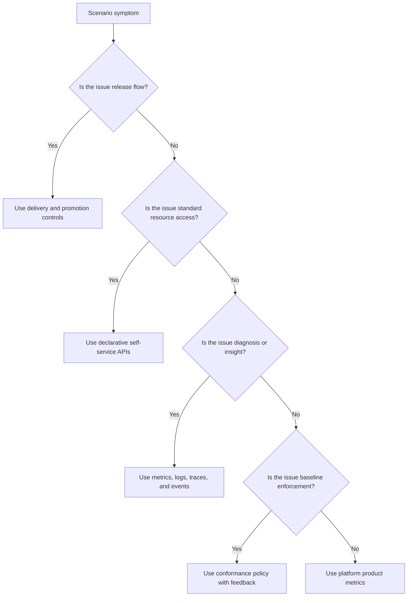

# CNPA Delivery, APIs, and Observability Review

> **CNPA Track** | Multiple-choice exam prep | **120 minutes** | **Prerequisites: CNPA core platform fundamentals** | **Kubernetes 1.35+**

## Learning Outcomes

- Compare continuous integration, continuous delivery, continuous deployment, progressive delivery, and promotion when evaluating delivery flow safety.
- Design a reconciliation-based provisioning API that hides provider details while exposing a stable self-service contract.
- Diagnose observability gaps by selecting metrics, logs, traces, conformance checks, and policy signals for a platform baseline.
- Evaluate platform success metrics such as adoption, developer satisfaction, time to first successful deploy, provisioning time, incident reduction, and policy compliance.
- Evaluate CNPA exam traps around delivery tooling, API style, and feedback loops without choosing tool-first answers.

## Why This Module Matters

Hypothetical scenario: a platform team announces that the new internal developer platform is ready because every application now has a pipeline template, a cluster namespace, and a dashboard folder. Two weeks later, a service team still waits for manual approvals before a database appears, a canary release cannot be traced through the service mesh, and nobody can say whether developers are deploying faster or simply opening fewer tickets because they gave up. The platform exists, but the operating model has not yet become a product with clear contracts, feedback loops, and measurable outcomes.

That situation is exactly where the CNPA exam likes to test judgment. The exam rarely asks you to memorize a single vendor command. It asks whether you can recognize a platform that improves delivery, provides self-service APIs, exposes useful observability, enforces conformance, and measures whether the work helped. A tool-first answer is tempting because tool names feel concrete, but the stronger answer usually describes a repeatable capability: a safe release pattern, a declarative request contract, a reconciliation loop, a telemetry model, or a metric tied to developer and reliability outcomes.

This module covers the parts of CNPA that prove a platform is not just a philosophy. If the previous module was about the platform as a product, this one is about how the product behaves in practice. You will review delivery and release language, self-service provisioning APIs, observability and conformance controls, platform measurement, and the exam traps that blur those areas together. Treat this as a diagnostic chapter: by the end, you should be able to read a scenario and decide whether the missing piece is a delivery control, an API contract, a signal, a policy, or a metric.

## Delivery Is More Than A Pipeline

Delivery questions are often framed with familiar pipeline words, but the platform judgment sits one layer above the pipeline file. A pipeline can compile, test, scan, and deploy an application, yet still leave the organization with slow handoffs and fragile release decisions. CNPA expects you to separate the activity of integrating code from the discipline of moving a verified artifact through environments with visible risk controls. A platform improves delivery when it makes the desired path easier than the improvised path, and when it lets teams repeat the same path under pressure.

The first distinction is between integration, delivery, deployment, progressive delivery, and promotion. Continuous integration is about frequently merging and verifying change, so it answers the question, "Is this change compatible with the main codebase?" Continuous delivery keeps the system in a deployable state, so it answers, "Could we release this safely when a human or policy decides?" Continuous deployment removes the manual release decision after checks pass, so it answers, "Will successful change automatically reach users?" Progressive delivery changes the rollout shape, so it answers, "How do we expose change gradually and observe risk before full exposure?"

| Term | Meaning |
|---|---|
| Continuous integration | Changes are merged and verified frequently |
| Continuous delivery | The system is always in a deployable state |
| Continuous deployment | Deployments happen automatically after checks pass |
| Progressive delivery | Release strategies such as canary or blue-green |
| Promotion | Moving the same artifact across environments with controls |

Promotion deserves special attention because it is where many exam traps hide. A platform-minded promotion flow does not rebuild a different artifact for each environment and hope the result is equivalent. It promotes the same verified artifact through development, staging, and production while changing environment configuration through controlled inputs. That distinction matters because reproducibility is not only a build concern; it is also a trust concern. If production runs a different image digest than the one tested in staging, the release evidence is weaker even if every pipeline job says green.

Continuous deployment and progressive delivery are also easy to confuse. Continuous deployment describes the automation decision after validation, while progressive delivery describes the exposure strategy during release. A team can have continuous deployment with a simple all-at-once rollout, and a team can have progressive delivery with a human approval before the canary begins. CNPA questions often reward the answer that keeps those concepts separate, because the operational controls are different. One control decides when release starts; the other controls how release reaches users.

The right answer is often the one that says "reduce manual handoffs and make outcomes reproducible." That sentence from the original review is worth keeping because it compresses the platform stance nicely. Manual handoffs are not always wrong, but they should be deliberate control points rather than hidden dependencies on one person's memory. Reproducible outcomes do not mean every service has an identical pipeline; they mean every service receives a predictable set of checks, approvals, rollout behaviors, rollback paths, and telemetry expectations that match its risk profile.

The following flow shows the exam-level relationship between integration, artifact creation, promotion, and release strategy. Notice that the artifact is built once, while policy, configuration, and rollout decisions travel with it. This is the mental model to use when a question asks whether a platform should standardize pipelines, release templates, environment promotion, or observability. The platform does not need to own every application decision, but it should provide a paved route where evidence follows the artifact.

```text
+-------------------+     ++-------------------+     ++-----------------------+
| Code integration  | --> | Verified artifact  | --> | Environment promotion |
| tests and scans   |     | image plus SBOM    |     | same digest, controls |
+-------------------+     ++-------------------+     ++-----------------------+
                                                            |
                                                            v
                                      ++--------------------------------------+
                                      | Release strategy and observation      |
                                      | canary, blue-green, rollback signals  |
                                      ++--------------------------------------+
```

A delivery platform also needs feedback in both directions. Forward feedback tells the deployer whether validation, policy, and rollout are succeeding. Backward feedback tells the platform team whether the delivery capability itself is useful: how long a service waits for promotion, how often releases require manual rescue, whether rollback is practiced, and whether teams bypass the standard path. Without backward feedback, a platform can look automated while still failing as a product.

Pause and predict: if a CNPA question says a team has automated builds and tests, but each production rollout still requires a spreadsheet, a manual image rebuild, and a private chat approval, which delivery concept is weakest? The best answer is not "install a CI server." The weak concept is controlled promotion and release governance, because the artifact and decision trail are not moving through a repeatable platform contract.

The platform team's responsibility is to design defaults that fit common workloads while leaving escape hatches for exceptional ones. A low-risk internal service might use automatic deployment after policy checks and health gates pass. A customer-facing service might use the same artifact, but with staged promotion, canary analysis, and a manual approval before broad exposure. The exam does not require you to choose a universal pattern; it asks you to notice that safe delivery combines automation, repeatability, observability, and clear responsibility boundaries.

## Platform APIs Turn Requests Into Reconciled Contracts

The exam often uses API language to test whether you understand self-service infrastructure. A provisioning API is platform-like when it lets a consumer describe desired capability without requiring them to know the provider-specific wiring behind it. That capability might be a database, a message queue, a namespace, a deployment environment, or an application scaffold. The platform value is not that every resource is a Kubernetes object; the value is that the consumer receives a stable contract, and the platform can reconcile that contract repeatedly until the real world matches the request.

Good platform APIs are declarative, return a stable desired state, hide implementation details behind a clear contract, and can be reconciled repeatedly. This is where CRDs, operators, and Crossplane-style abstractions matter. A CustomResourceDefinition gives Kubernetes a new API type, an operator or controller watches desired objects and acts on drift, and a Crossplane composition can map a claim into one or more provider resources. The point is not "Kubernetes everywhere." The point is exposing a safe, reusable interface to platform consumers.

When an API is declarative, the consumer says what they want rather than listing every step to create it. That is why a restaurant menu is a better analogy than a kitchen checklist. A diner orders a meal and expects the kitchen to handle ingredients, timing, substitutions, and plating. A platform consumer requests `PostgresInstance`, `Environment`, or `ServiceEndpoint` and expects the platform to handle provider accounts, network placement, credentials delivery, backup defaults, and policy checks. The consumer still needs meaningful choices, but the choices should be product choices rather than provider trivia.

The reconciliation loop is the reason declarative APIs remain useful after the first request. Imperative automation runs a sequence and stops, so drift becomes a separate detection problem. Reconciliation keeps comparing desired state with observed state, then acts again when the two diverge. That model fits cloud-native operations because infrastructure changes outside the original request: credentials rotate, nodes fail, quotas change, policies evolve, and providers return transient errors. A reconciler gives the platform a place to encode recovery behavior instead of forcing every user to become an infrastructure operator.

```yaml
apiVersion: platform.example.com/v1alpha1
kind: DatabaseClaim
metadata:
  name: orders-db
  namespace: orders-team
spec:
  engine: postgres
  size: small
  backupPolicy: daily
  environment: staging
```

This YAML is intentionally small because the consumer-facing API should be small. A real platform might map the claim to a managed database, network policy, secret distribution, monitoring rule, and backup configuration. The claim does not expose provider instance classes, subnet identifiers, or storage encryption flags unless those are meaningful product choices for the consumer. If the exam asks what makes a provisioning API self-service, the answer is not "users can submit YAML." The answer is that users receive a supported contract with guardrails, defaults, status, and reconciliation.

```bash
kubectl apply -f database-claim.yaml
kubectl get databaseclaims.platform.example.com -n orders-team
kubectl describe databaseclaim orders-db -n orders-team
```

Before running this, what output would you expect if the API is truly reconciled rather than a one-shot script? You should expect status that tells the consumer where the request is in its lifecycle, such as pending, provisioning, ready, failed with a reason, or waiting for a policy decision. A silent ticket-like API is weak because it sends the user away from the platform to ask what happened. A reconciled API should make progress, blockers, ownership, and next actions visible through the same interface that accepted the request.

Claims, composite resources, and provider resources are common Crossplane vocabulary, and CNPA scenarios can test the relationship without requiring deep implementation syntax. A claim is the consumer-facing request, the composite resource is the platform's abstract internal resource, and managed provider resources are the concrete cloud or infrastructure objects. That layering lets the platform change providers, defaults, or implementation details while preserving the request contract. It also gives platform engineers a control surface for policy and observability without asking every application team to learn the provider API.

| API Layer | Who Uses It | What It Protects | Exam Signal |
|---|---|---|---|
| Claim | Application or service team | Consumer experience and stable choices | Self-service without provider trivia |
| Composite resource | Platform team | Internal abstraction and lifecycle policy | Reusable platform product contract |
| Provider resource | Platform controller | Concrete infrastructure implementation | Hidden details, reconciled safely |

Recommended study anchors from the original review remain useful because they connect this module to the broader KubeDojo path:

- [Self-Service Infrastructure](../../../platform/disciplines/core-platform/platform-engineering/module-2.5-self-service-infrastructure/)
- [CRDs and Operators](../../../k8s/cka/part1-cluster-architecture/module-1.5-crds-operators/)
- [Crossplane](../../../platform/toolkits/infrastructure-networking/platforms/module-7.2-crossplane/)
- [Kubebuilder](../../../platform/toolkits/infrastructure-networking/platforms/module-3.4-kubebuilder/)

The exam may ask what makes a provisioning API "platform-like" rather than "ticket-like." A ticket can be useful for exceptions, approvals, and human conversation, but it is a poor primary interface for standard resources because it hides status and repeats manual work. A platform-like API has a schema, documented choices, validation, policy enforcement, status, ownership metadata, and a lifecycle. It can be used by humans, automation, and controllers because the contract is explicit instead of living in a queue description.

There is a tradeoff, though: every platform API becomes a product surface that someone must maintain. Too little abstraction exposes provider complexity to every service team. Too much abstraction creates a narrow platform that cannot satisfy real workload needs, so teams bypass it. The practical middle is to design APIs around recurring user jobs, then measure whether those APIs reduce lead time, support burden, and configuration errors. A good CNPA answer names that product feedback loop instead of pretending an API becomes valuable merely because it exists.

## Observability And Conformance Make The Platform Inspectable

Observability is not the same as logging, and it is not the same as a dashboard. CNPA wants you to understand the full picture: metrics show trends, logs show events and context, and traces show request flow across services. Those signals are most useful when they answer questions that operators did not fully predict at design time. Monitoring usually starts with predefined checks, while observability gives the team enough context to ask new questions during an unfamiliar failure.

A platform should provide observability defaults because individual teams are usually too busy shipping features to design complete telemetry from scratch. The platform can standardize instrumentation libraries, log formats, metric naming, trace propagation, alert routing, dashboard templates, and retention expectations. That does not mean every service emits identical signals. It means the platform gives every service a common floor so incidents do not begin with basic questions like which namespace owns the workload, where the logs live, or whether a request carries trace context across service boundaries.

| Signal | Best For | Platform Default | Common CNPA Trap |
|---|---|---|---|
| Metrics | Trends, rates, saturation, objective checks | Standard labels, service-level indicators, alert rules | Treating every label as harmless |
| Logs | Discrete events, local context, error detail | Structured fields and retention tiers | Treating logs as the whole observability system |
| Traces | Cross-service request paths and latency | Propagation, sampling, service maps | Assuming traces replace metrics |
| Conformance | Baseline behavior and policy evidence | Policy reports, standards checks, exceptions | Treating policy as security-only work |

High-cardinality data is a useful example of tradeoff thinking. A trace span may safely carry user or request identifiers because traces are sampled and queried differently from metrics. A Prometheus metric label with user identifiers can explode series cardinality and harm the monitoring system. The concept the exam wants is not "high cardinality is bad." The concept is "put detail in the telemetry layer designed for that query pattern." Good observability is a system design problem, not a contest to attach every attribute everywhere.

Conformance is the other half of inspectability. Observability tells you what is happening; conformance tells you whether what is happening matches the platform baseline. That baseline can include required labels, approved ingress patterns, resource limits, security contexts, image provenance, network policy, telemetry instrumentation, backup coverage, and release evidence. Policy tools such as Gatekeeper and Kyverno are commonly associated with security, but their platform role is broader. They help turn standards into visible, repeatable controls rather than private wiki pages.

| Trap | Better answer |
|---|---|
| Monitoring and observability are synonyms | Monitoring is predefined; observability supports new questions |
| High-cardinality data is always good | High-cardinality data is useful in the right telemetry layer, not as a blanket metric label strategy |
| Policies are only for security teams | Platform policies are part of the user experience and platform baseline |

Consider an application that passes its deployment pipeline but fails during a canary because latency rises only for traffic routed through one dependency. Metrics may show the error budget burn or p95 latency change, logs may reveal local timeout messages, and traces may show where the request path slows down. A conformance report may also reveal that the new workload lacks the standard timeout annotation or trace propagation configuration. The platform answer is not to pick one signal; it is to assemble enough signals that the team can diagnose cause and decide whether to continue, pause, or roll back.

```bash
kubectl get pods -n orders-team -l app=orders
kubectl logs -n orders-team deploy/orders --tail=100
kubectl get events -n orders-team --sort-by=.lastTimestamp
kubectl get policyreports -A
```

These commands are examples of local inspection, not a complete observability stack. They show why platform defaults matter: if workloads do not share labels, logging conventions, event visibility, and policy reporting, even simple triage becomes inconsistent. In a production platform, those local views should connect to centralized metrics, logs, traces, and conformance dashboards. CNPA questions frequently ask you to choose the missing building block, so pay attention to whether the scenario lacks trend data, event detail, request flow, or policy evidence.

Which approach would you choose here and why: adding another dashboard for every team, or standardizing the service labels, telemetry fields, and policy reports that make existing dashboards reliable? The second answer is usually stronger because platform observability begins with consistent signal production. Dashboards are presentation. Instrumentation, labels, ownership, and conformance evidence are the data contract that makes the presentation trustworthy.

The original review linked these observability and security anchors, and they remain the right study path for filling in details after the exam-level review:

- [What is Observability?](../../../platform/foundations/observability-theory/module-3.1-what-is-observability/)
- [The Three Pillars](../../../platform/foundations/observability-theory/module-3.2-the-three-pillars/)
- [From Data to Insight](../../../platform/foundations/observability-theory/module-3.4-from-data-to-insight/)
- [Security Mindset](../../../platform/foundations/security-principles/module-4.1-security-mindset/)
- [OPA & Gatekeeper](../../../platform/toolkits/security-quality/security-tools/module-4.2-opa-gatekeeper/)
- [Kyverno](../../../platform/toolkits/security-quality/security-tools/module-4.7-kyverno/)

Conformance should also be designed as a user experience. If a policy rejects a workload with a cryptic admission error, teams will treat the platform as a blocker. If the same policy provides a clear reason, a remediation path, and a documented exception process, it becomes a guardrail. CNPA often frames this as a cultural or product question: platform controls should reduce risk while helping teams succeed. A policy that is technically correct but operationally opaque is still an incomplete platform feature.

## Measuring Whether The Platform Helps

Platform measurement is small in the blueprint, but it is not soft. The exam wants to know whether you understand that a platform should be measured like a product. A platform can have impressive automation and still fail if developers avoid it, if provisioning takes too long, if reliability does not improve, or if the platform team cannot explain which outcomes changed. Measuring the platform is how you separate "we built a thing" from "we improved delivery and operations."

Useful measurement categories include adoption, developer satisfaction, time to first successful deploy, time to provision a standard service, error rate or incident reduction, and policy compliance or conformance. Adoption tells you whether teams choose the platform when they have alternatives. Satisfaction tells you whether the experience feels usable, not merely available. Time-based metrics reveal friction in common journeys. Reliability and conformance metrics show whether the platform improves operational quality rather than simply increasing deployment speed.

| Metric Category | Example Signal | What It Reveals | Misleading Version |
|---|---|---|---|
| Adoption | Percentage of services using the paved delivery path | Whether the platform is trusted | Counting accounts created but never used |
| Developer experience | Survey score plus qualitative friction themes | Whether the workflow feels productive | Asking only the platform team |
| Lead time | Time from merged change to successful deploy | Delivery flow health | Measuring build duration only |
| Provisioning speed | Time from standard request to ready resource | API and reconciliation effectiveness | Ignoring failed or abandoned requests |
| Reliability | Incident rate, rollback rate, error budget impact | Operational improvement | Counting alerts without severity context |
| Conformance | Percentage of workloads meeting baseline policies | Guardrail adoption and exceptions | Treating violations as only team failure |

The strongest platform metric set combines leading and lagging indicators. Time to first successful deploy is a leading signal because it shows whether a new service can travel the paved path quickly. Incident reduction is lagging because it takes time to prove. Policy compliance sits between them: it can improve quickly when defaults are good, but its real value appears when incidents are prevented or easier to diagnose. A single metric rarely tells the whole story, so CNPA answers that use adoption plus reliability plus developer outcomes are usually safer than answers that optimize one number in isolation.

Measurement also needs segmentation. A platform may work well for stateless HTTP services but poorly for batch jobs, data pipelines, or regulated workloads. If adoption is high only because one large team migrated many services, the overall percentage may hide poor fit elsewhere. If provisioning time is low only for happy-path resources, the metric may ignore requests that fail policy or wait for quota. A platform-as-product mindset asks whose job is easier, under what conditions, and where the next investment should go.

SRE concepts help because they connect platform work to reliability outcomes rather than activity counts. Incident management and postmortems ask whether the organization learns from failure, improves detection, and reduces repeat problems. A platform team can use those same ideas to measure whether standardized delivery, telemetry, and policy reduced incident impact. The point is to prove the platform improves outcomes, not just that it exists. That sentence is another original review anchor worth preserving because it is the exam stance in one line.

Recommended SRE anchors from the original review:

- [Incident Management](../../../platform/disciplines/core-platform/sre/module-1.5-incident-management/)
- [Postmortems](../../../platform/disciplines/core-platform/sre/module-1.6-postmortems/)

Hypothetical scenario: the platform team reports that pipeline executions increased by 30 percent after a new template launched. That sounds positive, but the team also learns that time to first successful deploy did not improve and failed provisioning requests doubled. A strong CNPA answer would not celebrate execution count by itself. It would ask whether the platform removed friction, whether the API contract is clear, whether policy failures are actionable, and whether teams are reaching production with less operational risk.

Platform metrics should drive product decisions, not vanity dashboards. If time to provision is slow because approvals are unclear, build a clearer approval path. If adoption is low because the API hides too much and cannot support real workload needs, adjust the product surface. If conformance is low because policy messages are confusing, improve feedback and examples. The exam rewards the answer that closes the loop from measurement to platform improvement because that is how the platform remains aligned with users.

## Worked Example: Reading A Platform Review Scenario

Worked examples matter for this topic because CNPA questions often sound like ordinary platform status updates. The wording may mention a pipeline, a portal, a dashboard, a policy engine, and a survey in the same paragraph. A hurried reader picks the most recognizable tool. A stronger reader asks which capability is failing and which evidence would prove improvement. This example walks that process slowly so you can practice the same diagnostic rhythm during the quiz and in later practice sets.

Exercise scenario: a platform team has standardized a service template for Kubernetes 1.35 clusters. The template creates a repository, a deployment manifest, a container build workflow, a default dashboard folder, and a namespace request. Three months later, teams report that preview environments are still slow to obtain, canary releases are paused because nobody trusts the telemetry, and the platform team cannot explain whether adoption improved developer experience. The facts sound broad, but each symptom points to a different platform capability.

Start with delivery. The scenario says a build workflow exists, but it does not say whether an artifact is promoted through environments, whether release evidence follows that artifact, or whether canary analysis has clear success criteria. That means the delivery gap is not necessarily the absence of CI. It is the absence of a trusted release path from verified change to controlled exposure. A correct answer would focus on promotion, rollout strategy, analysis signals, and rollback readiness instead of simply adding more jobs to the build workflow.

Next, inspect the API surface. A namespace request might be self-service, but the scenario says preview environments are slow to obtain. That phrasing suggests the platform may still depend on a queue, a hidden approval process, or manual wiring for resources that should be standard. A declarative claim for a preview environment would expose choices such as service name, environment type, data retention, policy profile, and telemetry profile. The platform would hide provider details, reconcile the request, and show status so the team can see whether it is waiting on quota, policy, or provisioning.

Then examine observability. A dashboard folder is not the same as trusted telemetry. The platform needs a baseline for metrics, logs, traces, events, and ownership labels before canary analysis becomes reliable. If a rollout pauses and nobody trusts the signal, the missing capability may be trace propagation, metric label consistency, log structure, alert thresholds, or comparison between canary and stable versions. The exam answer should explain which signal would answer the decision question, not merely claim that a dashboard exists.

Conformance enters when the platform standard must be applied consistently. If preview environments require labels, resource limits, approved images, network policy, or telemetry annotations, those requirements should be encoded as policy and reported clearly. The platform can use admission controls for hard rules and reports for gradual adoption. The review question is whether teams learn the standard before they are blocked, and whether exceptions are visible. Policy without explanation creates friction; explanation without enforcement creates drift.

Finally, read the measurement problem. The platform team cannot explain whether adoption improved developer experience, so feature completion is not enough. The review should ask for adoption by workload type, time to first successful preview environment, developer satisfaction themes, failed request rate, canary rollback rate, incident impact, and conformance trend. Those signals connect platform work to outcomes. If the only metric is how many repositories used the template, the platform may be measuring distribution rather than value.

The important habit is to avoid collapsing every symptom into one domain. Slow preview environments point toward API and reconciliation design. Untrusted canaries point toward delivery and observability. Unknown developer experience points toward product metrics and feedback. Baseline drift points toward conformance. A tool can support more than one domain, but the exam usually rewards the answer that names the missing capability first and the implementation option second.

You can apply the same reading pattern to nearly any CNPA review scenario. Underline the nouns that describe tools, then underline the verbs that describe what users cannot do. Users cannot promote safely, request repeatably, diagnose confidently, comply consistently, or prove value. The verbs usually reveal the platform capability. Once the capability is clear, tool choices become easier to evaluate because you can ask whether the option changes the outcome or merely adds another component.

## Exam Strategy For Tool-Heavy Distractors

Tool-heavy distractors are common because platform engineering has many recognizable projects. A question may mention Argo CD, Argo Rollouts, Crossplane, Backstage, OpenTelemetry, Prometheus, Kyverno, Gatekeeper, or a service catalog. Any of those tools can be valid in the right context, but none is automatically the answer. The CNPA mindset is capability-first: identify the problem, choose the control surface, then map the tool to the control surface only if the option actually closes the gap.

For delivery, ask whether the tool changes integration, promotion, deployment automation, rollout exposure, or release evidence. Argo Rollouts is relevant to progressive delivery, but it is not enough if the problem is rebuilding artifacts in every environment. A GitOps controller is relevant to desired-state deployment, but it is not enough if the problem is a missing rollback signal. A CI service is relevant to validation, but it is not enough if the problem is production approval hidden in private messages.

For platform APIs, ask whether the option creates a consumer contract or just exposes infrastructure details in a new place. A service catalog can improve discoverability, but it is not a reconciler by itself. A CRD can extend the API, but a poorly designed CRD can still leak provider complexity. Crossplane can compose infrastructure, but the exam answer should still mention claims, status, policy, and hidden provider resources. The tool is an implementation path; the self-service contract is the platform product.

For observability, ask which question the team cannot answer. If the scenario asks why a request is slow across services, traces are likely more relevant than another log sink. If the scenario asks whether latency is trending up after a rollout, metrics and service-level indicators matter. If the scenario asks why a pod was rejected, policy reports and events matter. If the scenario asks who owns a failing service, labels and metadata may be the missing baseline. The correct answer follows the diagnostic question.

For conformance, separate enforcement from communication. Gatekeeper and Kyverno can both enforce policies, but the platform outcome depends on how policies are introduced, reported, remediated, and excepted. A hard block may be correct for dangerous workloads, while a warning report may be better for a new standard that teams need time to adopt. CNPA distractors sometimes treat policy as purely a security function. A platform answer treats policy as part of the paved road's feedback system.

For measurement, be suspicious of activity counts when the question asks about success. Number of templates, pipeline executions, dashboard views, or catalog entries can be useful supporting data, but they rarely prove platform value alone. Pair them with journey metrics and outcomes: time to first successful deploy, time to provision, developer satisfaction, change failure rate, recovery time, and compliance trend. The best answer makes a decision possible, such as which API to improve next or whether a delivery control reduced release risk.

This strategy also protects you from overfitting to Kubernetes. Kubernetes is central to cloud-native platforms, and Kubernetes 1.35 continues the same API and controller principles that make reconciliation powerful. Still, CNPA is not asking you to make every solution a Kubernetes object. It is asking whether you understand cloud-native platform capabilities. Sometimes the best answer is an organizational or product decision: clarify ownership, publish a contract, measure a journey, or improve feedback before adding another controller.

## Patterns & Anti-Patterns

Patterns and anti-patterns are useful in this review because the same scenario can look correct from one angle and weak from another. A team may have automation but poor promotion, a declarative API but poor status, rich logs but weak tracing, or many metrics but no product decision. CNPA questions often include enough detail to make a shallow answer plausible. Your job is to identify the operating model behind the tool.

| Pattern | When To Use It | Why It Works | Scaling Consideration |
|---|---|---|---|
| Build once, promote with evidence | Services move through multiple environments | Preserves artifact trust and reduces environment drift | Store image digest, policy result, and rollout status together |
| Consumer-facing claims | Standard resources are requested repeatedly | Keeps provider details behind a stable contract | Version the API and publish migration guidance |
| Telemetry baseline by default | Teams share runtime and delivery patterns | Makes incidents diagnosable before teams customize | Define required labels, trace propagation, and alert ownership |
| Conformance with feedback | Standards must be enforced across teams | Turns policy into a guardrail rather than a surprise | Include exception workflow and remediation text |
| Product metrics for the platform | Platform team must prioritize investments | Links work to adoption, speed, reliability, and satisfaction | Segment by workload type and maturity |

The first pattern, build once and promote with evidence, is the backbone of safe delivery. It works because the thing tested is the thing released, and the controls applied along the path are visible. Evidence can include test results, vulnerability scan output, policy decisions, approval records, canary analysis, and rollback readiness. As the number of services grows, this evidence must be attached to artifacts and releases automatically because manual evidence collection becomes another hidden handoff.

Consumer-facing claims are the API pattern that keeps self-service from becoming self-managed complexity. The platform decides which choices are safe and meaningful, then hides provider details behind composition and reconciliation. That approach scales when the API is versioned, documented, and measured as a product surface. It fails when the platform team treats the claim schema as an internal implementation detail and changes fields without migration guidance.

Telemetry baselines and conformance feedback are companion patterns. Telemetry tells teams what happened, while conformance tells them whether the workload matches the platform's expected posture. Together, they let platform engineers move from "please follow the standard" to "the standard is encoded, visible, and actionable." The scaling challenge is to avoid turning every rule into a hard rejection. Some controls should block, some should warn, and some should report trends until the organization is ready for enforcement.

| Anti-Pattern | What Goes Wrong | Why Teams Fall Into It | Better Alternative |
|---|---|---|---|
| Pipeline equals platform | Delivery still depends on manual release knowledge | Pipeline templates are visible and easy to count | Standardize promotion, rollback, and telemetry expectations |
| Ticket-shaped self-service | Requests disappear into queues | Existing operations process is copied into a portal | Expose declarative APIs with status and ownership |
| Logs-only observability | Cross-service failures remain hard to diagnose | Logs feel concrete and familiar | Combine metrics, logs, traces, and events with common labels |
| Policy as a surprise gate | Teams learn standards only when blocked | Controls are added after incidents without UX design | Provide clear messages, dry-run reports, and examples |
| Vanity platform metrics | Activity rises while outcomes stay flat | Dashboards favor easy counts | Measure user journeys and reliability outcomes |

The most common anti-pattern is treating a pipeline as the whole platform. It is understandable because a pipeline is visible, demos well, and produces green or red output. The missing parts are usually promotion controls, environment consistency, rollout observation, and product feedback. The better alternative is to ask what a service team must do from code merge to safe production release, then remove unnecessary handoffs while preserving the controls that make release safe.

Another anti-pattern is a portal that only creates tickets. A portal can improve discoverability, but if every standard request still waits for a human to run a script, the platform has not created self-service. The stronger design exposes a declarative request, validates it, reconciles it, reports status, and routes exceptions explicitly. A CNPA answer should prefer that operating model because it gives users a contract and gives platform engineers a repeatable control surface.

## Decision Framework

When a CNPA scenario feels ambiguous, classify the missing capability before choosing the answer. Ask whether the problem is about moving change safely, requesting infrastructure safely, seeing system behavior, enforcing a baseline, or proving value. This prevents a tool name from pulling you toward the wrong domain. For example, Argo Rollouts might appear in a delivery question, Crossplane in an API question, OpenTelemetry in an observability question, and Kyverno in a conformance question, but the exam answer is usually the capability rather than the brand.



Use delivery and promotion controls when the scenario mentions releases, rollout risk, environment movement, approvals, rollback, or artifact identity. Use declarative self-service APIs when the scenario mentions repeated infrastructure requests, hidden provider details, status, drift, or reconciliation. Use observability when the scenario lacks the signals needed to explain behavior. Use conformance when the platform standard is known but inconsistently applied. Use product metrics when the question asks whether the platform is successful or where the platform team should invest next.

| Scenario Clue | Prefer This Capability | Avoid This Trap |
|---|---|---|
| "The build passes, but production release is manual and inconsistent." | Promotion and release strategy | Calling CI alone the answer |
| "Teams request the same database through tickets." | Declarative provisioning API | Building a prettier ticket form |
| "A canary fails, but no one can see where latency appears." | Metrics plus traces and logs | Adding only more deployment steps |
| "Workloads bypass required labels and security context." | Conformance policy with feedback | Treating standards as documentation only |
| "Leadership asks whether the platform is helping." | Adoption, satisfaction, lead time, reliability metrics | Counting platform features shipped |

The decision framework also helps with distractor answers. A question may include a correct tool applied to the wrong problem. Installing a policy engine will not by itself explain request latency during a canary. Adding traces will not by itself make a provisioning API declarative. Increasing deployment frequency will not prove the platform is healthy if incidents and developer frustration rise. The best answer matches the missing capability to the symptom, then names the operational feedback loop that keeps the capability useful.

## Did You Know?

- Kubernetes added CustomResourceDefinitions as the stable replacement for ThirdPartyResource in the 1.7 era, which is why modern platform APIs commonly extend the Kubernetes API instead of inventing a separate control plane.
- OpenTelemetry reached CNCF graduated status in 2024, reflecting how central common telemetry signals have become for cloud-native observability across languages and vendors.
- The DORA research program uses four key software delivery metrics: deployment frequency, lead time for changes, change failure rate, and failed deployment recovery time.
- Kubernetes 1.35 continues the long-running declarative control-plane model: users submit desired state to the API server, and controllers reconcile observed state toward that desired state.

## Common Mistakes

The table below preserves the original mistake themes while expanding the fix into the language the exam rewards. Notice that every mistake confuses an activity with an outcome: running CI is not the same as safe release, collecting logs is not the same as observability, and counting usage is not the same as proving platform value. When reviewing your own answer choices, ask whether the option improves the platform contract or merely names a tool.

| Mistake | Why It Happens | How to Fix It |
|---|---|---|
| Treating delivery as only "CI/CD" | Pipeline language is familiar, so teams forget CNPA also cares about promotion and safe release. | Include release strategy, environment flow, artifact identity, rollback, and observable rollout health. |
| Forgetting observability is a system property | The exam may separate telemetry collection from the ability to ask useful operational questions. | Explain the signal system: metrics for trends, logs for context, traces for flow, and events for local state changes. |
| Overfocusing on one metric | A platform can look busy and still be ineffective if the metric counts activity rather than outcomes. | Use adoption plus reliability plus developer outcomes, then segment by workload and user journey. |
| Treating APIs as implementation details | Engineers may focus on CRD mechanics instead of the consumer-facing platform contract. | Think self-service contract first: schema, defaults, validation, status, ownership, and reconciliation. |
| Assuming continuous deployment means progressive delivery | Both concepts appear near release automation, but they control different decisions. | Separate the automation trigger from the rollout exposure strategy and risk analysis. |
| Making policy invisible until admission rejection | Platform teams often add controls after incidents without designing feedback. | Provide dry-run reports, clear failure messages, remediation examples, and an exception path. |
| Calling a portal self-service when it only opens tickets | A user interface can hide that the backend process remains manual. | Expose declarative requests with lifecycle status, automated reconciliation, and explicit human approval only for exceptions. |

## Quiz

Use these questions as exam-style reasoning practice rather than recall. Each question describes a platform symptom and asks you to choose the capability that best matches the symptom. Read the details carefully because the distractors are often real platform tools applied to the wrong problem.

<details>
<summary>Question 1: Your team has automated builds, tests, and image scanning. Production release still requires rebuilding the image, pasting a digest into a spreadsheet, and waiting for a private approval message. What should you improve first?</summary>

Improve promotion and release controls, not the CI stage. The scenario says integration and validation already exist, but the artifact is not promoted through environments with repeatable evidence. Rebuilding for production weakens trust because the tested artifact may not be the released artifact. A stronger platform path would build once, attach validation evidence, promote the same digest, and make approvals visible through the release workflow.
</details>

<details>
<summary>Question 2: A service team requests the same managed database every sprint through a portal form, but the form only creates a ticket for an operator. What makes this platform API weak?</summary>

The interface is ticket-shaped rather than declarative and reconciled. It may be easier to discover than email, but it does not give the consumer a stable request schema, lifecycle status, or automatic drift correction. A stronger design would expose a claim or similar self-service contract with defaults, validation, policy, status, and reconciliation. Human review can still exist for exceptions, but it should not be the normal path for standard resources.
</details>

<details>
<summary>Question 3: A canary rollout shows higher latency, but each service dashboard looks normal and no one can follow a request across dependencies. Which observability gap matters most?</summary>

The missing signal is distributed tracing, supported by consistent service labels and propagation. Metrics can show that latency changed, and logs can show local errors, but traces explain the path a request took across services. The answer is not simply "more logs" because logs alone may not connect the dependency chain. A platform baseline should include trace propagation and enough metadata to correlate metrics, logs, and traces during rollout analysis.
</details>

<details>
<summary>Question 4: The platform team wants to enforce required labels, resource limits, and approved image registries. Teams complain that failures appear only as cryptic admission errors. What is the better platform response?</summary>

Improve conformance feedback while keeping appropriate guardrails. The standards may be valid, but the user experience is incomplete if teams cannot understand and fix failures. A better platform provides clear policy messages, examples, dry-run reporting, and an exception workflow for cases that need review. Removing policy entirely would reduce friction in the short term but would weaken the platform baseline.
</details>

<details>
<summary>Question 5: Leadership asks whether the platform is successful. The platform team reports that pipeline runs increased by 30 percent. Why is that answer incomplete?</summary>

Pipeline runs are an activity metric, not proof of platform value. The number may rise because adoption improved, but it may also rise because builds are flaky or teams are retrying failed workflows. A better answer combines adoption, developer satisfaction, time to first successful deploy, provisioning time, reliability outcomes, and conformance trends. Those metrics show whether the platform is helping users deliver safely, not merely whether machinery is busy.
</details>

<details>
<summary>Question 6: An exam option says continuous deployment and progressive delivery are the same because both automate release. Why is that a trap?</summary>

Continuous deployment describes when a validated change is deployed after checks pass, while progressive delivery describes how exposure is controlled during the rollout. They can be used together, but they solve different problems. A team can deploy automatically without canaries, and a team can use canaries with a manual approval before production exposure. The correct answer should keep automation trigger, promotion, and rollout strategy separate.
</details>

<details>
<summary>Question 7: A platform API exposes cloud subnet IDs, instance classes, provider account names, and backup scripts to every service team. It works, but developers avoid it. Which design problem should you diagnose?</summary>

The API leaks implementation details instead of presenting a product contract. Developers may technically be able to request infrastructure, but they are forced to understand provider-specific choices that the platform should normally encapsulate. A better design offers meaningful choices such as size, environment, retention, and availability requirements, then maps those choices to provider resources through composition and reconciliation. Usage metrics and feedback should confirm whether the new contract actually reduces friction.
</details>

## Hands-On Exercise

Exercise scenario: you are reviewing a proposed CNPA platform design for a team that wants safer delivery, self-service resource access, and better operational evidence. You will not build a full platform in this exercise. Instead, you will create a review artifact that classifies symptoms, maps them to platform capabilities, and checks whether the resulting design has the signals and metrics needed for a credible exam answer.

Create a scratch directory outside the repository or use a disposable note file. The goal is to practice reasoning, not to produce code for this site. If you do use commands, keep them local and avoid applying resources to a shared cluster. The YAML below is intentionally a sketch of a consumer-facing claim, so you can evaluate whether it hides the right details and exposes the right choices.

```yaml
apiVersion: platform.example.com/v1alpha1
kind: EnvironmentClaim
metadata:
  name: payments-preview
  namespace: payments-team
spec:
  delivery:
    promotionPolicy: staged
    rolloutStrategy: canary
  resources:
    database:
      engine: postgres
      size: small
      backupPolicy: daily
  observability:
    tracing: required
    metricsProfile: standard-http
  conformance:
    policyProfile: baseline
```

- [ ] Compare continuous integration, continuous delivery, continuous deployment, progressive delivery, and promotion by writing one sentence for each concept and one sentence explaining which part of the `EnvironmentClaim` relates to release safety.
- [ ] Design a reconciliation-based provisioning API review by naming the consumer-facing fields, the hidden provider details, the expected status conditions, and one policy that should validate the request before provisioning.
- [ ] Diagnose observability gaps by listing the metrics, logs, traces, events, and conformance reports needed to decide whether the canary can continue after latency rises.
- [ ] Evaluate platform success metrics by choosing at least four signals from adoption, developer satisfaction, time to first successful deploy, provisioning time, incident reduction, and policy compliance.
- [ ] Evaluate CNPA exam traps by writing three wrong tool-first answers for this scenario and then replacing each with a capability-first answer.

<details>
<summary>Solution outline for task 1</summary>

A strong answer separates the five delivery terms cleanly. Continuous integration verifies frequent merges, continuous delivery keeps the system deployable, continuous deployment automatically releases after checks, progressive delivery controls exposure with patterns such as canary or blue-green, and promotion moves the same artifact through environments with controls. In the sample claim, `promotionPolicy` and `rolloutStrategy` relate most directly to release safety, but the answer should also mention that artifact identity and evidence must travel through the workflow.
</details>

<details>
<summary>Solution outline for task 2</summary>

The consumer-facing fields include engine, size, backup policy, rollout strategy, telemetry requirements, and policy profile. Hidden details should include provider account, subnet, storage class, exact instance type, backup job implementation, and credentials wiring unless the consumer has a real product choice to make. Useful status conditions include accepted, validating, provisioning, ready, failed with reason, and waiting for approval. A policy might reject unsupported environments, missing ownership labels, or a database size that exceeds the team's quota.
</details>

<details>
<summary>Solution outline for task 3</summary>

Metrics should show request rate, error rate, duration, saturation, and canary-versus-stable comparison. Logs should include structured service, environment, trace ID, release, and error fields. Traces should show propagation across dependencies so the team can locate where latency increases. Events and policy reports should reveal rollout activity, admission decisions, required label conformance, and any missing telemetry configuration. The important point is to combine signals rather than treating one dashboard as the whole answer.
</details>

<details>
<summary>Solution outline for task 4</summary>

A balanced metric set might include platform adoption percentage, developer satisfaction survey themes, time from first repository creation to first successful deploy, time from claim submission to ready environment, rollback or incident rate after release, and policy compliance trend. The answer should explain what each metric reveals and where it can mislead. For example, adoption without satisfaction may hide forced usage, while deployment speed without incident context may hide unsafe change.
</details>

<details>
<summary>Solution outline for task 5</summary>

Wrong tool-first answers could include "install Argo Rollouts," "use Crossplane," and "add OpenTelemetry" without explaining the missing capability. Capability-first replacements are stronger: use progressive delivery with analysis and rollback, expose a declarative reconciled claim for standard resources, and provide metrics, logs, traces, and conformance reports that answer rollout questions. The tool may still be valid, but the exam answer should name why the capability solves the scenario.
</details>

## Sources

- [CNCF Certified Cloud Native Platform Associate](https://www.cncf.io/training/certification/cnpa/)
- [Kubernetes Custom Resources](https://kubernetes.io/docs/concepts/extend-kubernetes/api-extension/custom-resources/)
- [Kubernetes Controllers](https://kubernetes.io/docs/concepts/architecture/controller/)
- [Kubernetes Managing Resources](https://kubernetes.io/docs/concepts/cluster-administration/manage-deployment/)
- [Kubernetes Declarative Management](https://kubernetes.io/docs/tasks/manage-kubernetes-objects/declarative-config/)
- [Crossplane Composite Resources](https://docs.crossplane.io/latest/composition/composite-resources/)
- [Argo Rollouts Concepts](https://argo-rollouts.readthedocs.io/en/stable/concepts/)
- [OpenTelemetry Observability Primer](https://opentelemetry.io/docs/concepts/observability-primer/)
- [OpenTelemetry Traces](https://opentelemetry.io/docs/concepts/signals/traces/)
- [Prometheus Data Model](https://prometheus.io/docs/concepts/data_model/)
- [Kyverno Introduction](https://kyverno.io/docs/introduction/)
- [OPA Gatekeeper Documentation](https://open-policy-agent.github.io/gatekeeper/website/docs/)
- [DORA Four Keys](https://dora.dev/guides/dora-metrics-four-keys/)

## Next Module

Continue with [CNPA Practice Questions Set 1](./module-1.4-practice-questions-set-1/) to apply these delivery, API, observability, conformance, and measurement concepts under exam-style time pressure.
