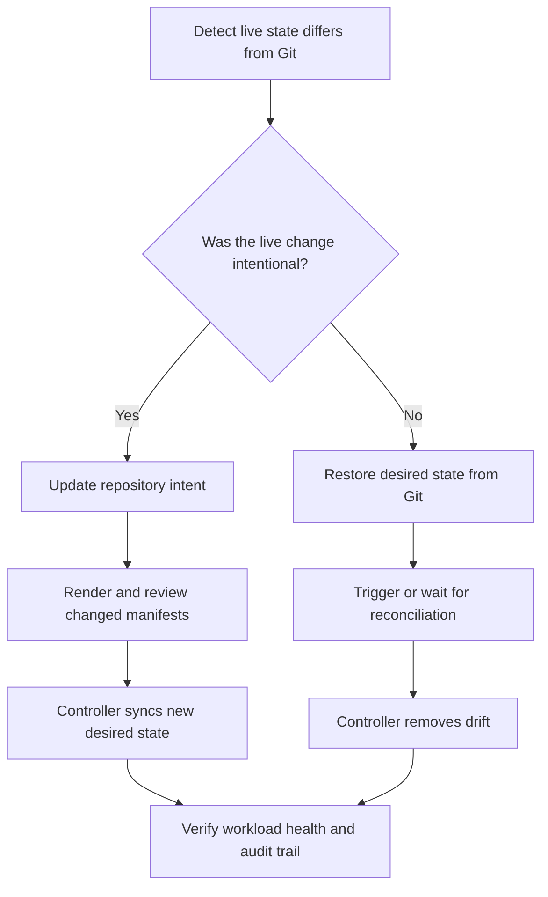
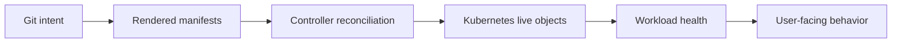

> **CNPE Track** | Complexity: `[COMPLEX]` | Time to Complete: 90-120 min
>
> **Prerequisites**: CNPE Exam Strategy and Environment, Kubernetes deployments and services, Git fundamentals, Helm or Kustomize basics, Argo CD or Flux basics, rollout health checks

## Learning Outcomes

After this module, you will be able to:

- **Design** a GitOps repository shape that separates reusable application intent from environment-specific delivery decisions.
- **Diagnose** the difference between desired state, live state, sync state, health state, and rollout state during delivery incidents.
- **Promote** a workload change between environments while preserving Git as the source of intent and avoiding untracked manual patches.
- **Evaluate** whether a direct rollout, canary, or blue-green strategy best fits a CNPE delivery scenario.
- **Verify** a GitOps delivery path end-to-end using controller status, Kubernetes runtime state, events, and rollback evidence.

## Why This Module Matters

A platform engineer joins an on-call bridge after a routine configuration change breaks checkout traffic. The CI job is green, the GitOps application says it has synchronized, and the deployment reports that a rollout completed, yet customers still receive errors from one environment and stale behavior from another. The team has commands, dashboards, and repository access, but nobody can immediately explain which system owns the truth.

That situation is exactly why CNPE treats delivery as an operating discipline instead of a tool checklist. A candidate who only remembers how to click sync or run `kubectl apply` will chase symptoms. A candidate who understands GitOps as a reconciliation system can decide where intent lives, which controller is responsible for convergence, and what evidence proves that the live cluster matches the expected release.

GitOps is powerful because it turns delivery into a controlled feedback loop. Git records intent, a controller compares that intent with the cluster, and reconciliation closes the gap when reality drifts. The difficult part is not the slogan. The difficult part is using that loop under time pressure when a repository layout is imperfect, a rollout is partially healthy, or a manual change has created drift that looks like a deployment bug.

> **The Control Loop Analogy**
>
> GitOps is less like a delivery truck and more like a thermostat. The desired temperature is not the same thing as the current temperature, and changing the thermostat is different from waving a fan at the room. The controller keeps comparing desired state with live state, and your job is to know which input to change when the room is wrong.

This module teaches the delivery path from beginner to senior level by building the same mental model in layers. First you will separate the states that GitOps systems report. Then you will read a repository layout as an operating contract. After that you will walk through a complete bootstrap, promotion, drift-recovery, and progressive-delivery sequence before practicing the same reasoning independently.

## Core Content

## Part 1: The GitOps State Model

GitOps becomes much easier once you stop treating "deployed" as a single word. In real systems, a change can be committed but not synced, synced but unhealthy, healthy but running the wrong image, or running correctly while the repository still contains a future change that has not been promoted. CNPE scenarios often hide the actual problem in one of those gaps.

The first professional habit is to ask which state you are observing. Desired state is the target described by Git and generated manifests. Live state is what the Kubernetes API currently stores. Sync state is the controller's comparison between desired and live state. Health state is the controller's interpretation of whether the live resources are usable. Rollout state is the workload controller's progress while replacing Pods.

| State | Owner | Question It Answers | Example Evidence | Common Trap |
|------|-------|---------------------|------------------|-------------|
| Desired state | Git repository and rendering tool | What should exist after reconciliation? | Kustomize overlay sets `replicas: 3` | Assuming a local edit exists in Git before it is committed |
| Rendered state | Helm, Kustomize, or another generator | What manifests will the controller apply? | `kustomize build overlays/staging` output | Debugging raw templates without checking rendered YAML |
| Live state | Kubernetes API server | What exists in the cluster right now? | `kubectl get deploy payment-api -n payments -o yaml` | Treating a manual live patch as the new source of truth |
| Sync state | GitOps controller | Do desired and live match from the controller's view? | Argo CD `Synced`, Flux `Ready=True` | Assuming sync means the application is healthy |
| Health state | GitOps controller and workload status | Are resources usable after they exist? | Deployment available condition, Pod readiness | Missing a bad readiness probe after sync succeeds |
| Rollout state | Kubernetes workload controller or rollout controller | Is traffic safely moving to the new revision? | `kubectl rollout status`, Rollout phase, analysis result | Stopping after a ReplicaSet exists without checking availability |

When a prompt says "the application did not deploy correctly," do not immediately edit YAML. First classify the failure. If desired state is wrong, fix the repository. If rendered state is wrong, fix the generator input or overlay. If live state differs from desired, inspect the GitOps controller. If sync is clean but health is bad, debug the workload. If health is good but users see mixed behavior, inspect rollout strategy and traffic routing.

```text
+------------------+        +-------------------+        +--------------------+
|      Git         |        |   GitOps Control  |        |    Kubernetes API  |
|  desired intent  | -----> |  render + compare | -----> |     live objects   |
+------------------+        +-------------------+        +--------------------+
        ^                             |                              |
        |                             v                              v
        |                    +-------------------+        +--------------------+
        |                    |  sync and health  |        |  pods and services |
        |                    |      signals      |        |   runtime state    |
        |                    +-------------------+        +--------------------+
        |                                                           |
        +----------------------- rollback or promotion evidence -----+
```

The diagram shows why a green signal in one box is not enough. Git may be correct while the controller lacks permission. The controller may be synchronized while Pods crash. Pods may be ready while a Service selector points at the wrong labels. A senior platform engineer verifies each boundary instead of assuming one successful command proves the entire path.

> **Pause and predict:** A GitOps application reports `Synced`, but the Deployment has zero available replicas. Which state is probably correct, and which state is probably failing? Write one sentence before reading the answer.

The likely answer is that desired and live state match from the controller's perspective, but health or rollout state is failing. The controller applied the manifests it intended to apply, so the next evidence should come from Deployment conditions, ReplicaSets, Pods, events, probes, and application logs. Editing the Application object first would be premature because the sync boundary is not where the evidence points.

A second common scenario is the reverse: the application is healthy, but the GitOps controller reports `OutOfSync`. That can happen when a person manually scales a Deployment, when a mutating admission controller adds fields the GitOps tool does not ignore, or when the rendering output changed after a dependency update. Health says the application is currently usable; sync says the operating contract has drifted.

For command examples, this module uses the full `kubectl` command name even though many engineers shorten it interactively in their own shells. That choice is intentional because copied lab blocks should run in non-interactive terminals, CI jobs, and exam scratch scripts without depending on local shell startup files. Reliability in examples matters for GitOps work because the learner should spend attention on reconciliation boundaries, not on a command wrapper that exists only on one workstation.

```bash
kubectl version --client
kubectl get namespaces
```

Use a consistent inspection order during exam work. Start with the GitOps object, then inspect the workload, then inspect Pods and events. This sequence prevents random-walk troubleshooting because each command answers a different question. If the controller says it cannot render manifests, Pod logs are noise. If Pods are crash-looping after a clean sync, repository structure is probably not the first problem.

```bash
APP_NAMESPACE="${APP_NAMESPACE:-argocd}"
APP_NAME="${APP_NAME:-payment-api-staging}"
WORKLOAD_NAMESPACE="${WORKLOAD_NAMESPACE:-payments}"

kubectl get application "$APP_NAME" -n "$APP_NAMESPACE" -o wide
kubectl describe application "$APP_NAME" -n "$APP_NAMESPACE"
kubectl get deploy -n "$WORKLOAD_NAMESPACE"
kubectl get pods -n "$WORKLOAD_NAMESPACE" -o wide
kubectl get events -n "$WORKLOAD_NAMESPACE" --sort-by=.lastTimestamp
```

If your environment uses Flux rather than Argo CD, the nouns change but the reasoning does not. Flux commonly exposes `GitRepository`, `Kustomization`, `HelmRepository`, and `HelmRelease` objects. Argo CD commonly exposes `Application` objects and may use `ApplicationSet` for generation. Both are reconciliation systems that compare declared intent with live resources.

```bash
kubectl get applications.argoproj.io -A 2>/dev/null || true
kubectl get applicationsets.argoproj.io -A 2>/dev/null || true
kubectl get gitrepositories.source.toolkit.fluxcd.io -A 2>/dev/null || true
kubectl get kustomizations.kustomize.toolkit.fluxcd.io -A 2>/dev/null || true
kubectl get helmreleases.helm.toolkit.fluxcd.io -A 2>/dev/null || true
```

The `2>/dev/null || true` pattern is useful in training environments because only one controller family may be installed. It is not a way to hide errors in production automation. In an exam lab, it lets you quickly discover which API types exist without failing the whole command sequence when a CRD is absent.

## Part 2: Repository Shape as an Operating Contract

A GitOps repository is not only a storage location for YAML. It is the operating contract that tells maintainers how changes move, where environment differences belong, and how to explain a live cluster from version history. A clear repo layout reduces cognitive load during incidents because the team knows where to look before they know what failed.

A practical layout separates application base intent from environment overlays. The base should describe what is generally true about the workload, such as container names, ports, labels, and default probes. Overlays should describe what changes by environment, such as replica count, image tag, namespace, resource limits, config references, or progressive delivery policy.

```text
apps/
  payment-api/
    base/
      deployment.yaml
      service.yaml
      kustomization.yaml
    overlays/
      dev/
        kustomization.yaml
        patch-replicas.yaml
        patch-image.yaml
      staging/
        kustomization.yaml
        patch-replicas.yaml
        patch-image.yaml
      prod/
        kustomization.yaml
        patch-replicas.yaml
        patch-image.yaml
platform/
  clusters/
    dev/
      payment-api-application.yaml
    staging/
      payment-api-application.yaml
    prod/
      payment-api-application.yaml
```

This structure is not the only valid answer, but it demonstrates the separation CNPE expects you to reason about. The `apps` tree explains how the workload is rendered. The `platform/clusters` tree explains which cluster or environment reconciles which overlay. Promotion can then be represented as a Git change to an overlay or as a branch/tag movement, depending on the platform's chosen policy.

| Repository Area | What Belongs There | What Usually Does Not Belong There | Reasoning Test |
|-----------------|--------------------|------------------------------------|----------------|
| `base/` | Shared Deployment, Service, labels, probes, default container shape | Production-only replica counts or secrets | Would this still be true in dev and staging? |
| `overlays/dev/` | Small scale, dev image tag, dev config references | Production traffic policy | Does this make local validation cheaper and safer? |
| `overlays/staging/` | Release-candidate image, staging config, production-like scale where useful | Unreviewed experimental patches | Does this mirror production enough to catch risk? |
| `overlays/prod/` | Approved image, production scale, production rollout policy | Debug-only sidecars unless explicitly approved | Can this change be defended during an incident review? |
| `platform/clusters/` | GitOps Application or Flux Kustomization pointing at overlays | Raw workload manifests duplicated from apps | Does this define reconciliation without hiding app intent? |

The key skill is knowing when duplication is harmful and when separation is intentional. Repeating the entire Deployment in every environment makes promotions risky because each environment can silently diverge. Keeping a small patch in each overlay is healthy because environment differences are visible and reviewable. A senior engineer does not eliminate all duplication; they preserve meaningful boundaries.

> **Active learning prompt:** Look at the repository tree above and imagine that staging runs image `1.8.2` while production runs `1.8.1`. Where should that difference appear, and what would be dangerous about changing the base Deployment directly?

The image difference should appear in the staging and production overlays or in a promotion mechanism that those overlays consume. Changing the base Deployment directly would affect every environment that references the base, which might unintentionally promote the image to production. The danger is not only that production changes; it is that Git history no longer shows a deliberate environment promotion.

Here is a minimal Kustomize base for a small service. The example is intentionally ordinary because the point is the delivery contract, not clever YAML. The labels are stable, the Service selects those labels, and the Deployment exposes a readiness probe so health can be verified after sync.

```yaml
apiVersion: apps/v1
kind: Deployment
metadata:
  name: payment-api
  labels:
    app.kubernetes.io/name: payment-api
spec:
  replicas: 2
  selector:
    matchLabels:
      app.kubernetes.io/name: payment-api
  template:
    metadata:
      labels:
        app.kubernetes.io/name: payment-api
    spec:
      containers:
        - name: payment-api
          image: nginx:1.27.4
          ports:
            - containerPort: 80
          readinessProbe:
            httpGet:
              path: /
              port: 80
            initialDelaySeconds: 3
            periodSeconds: 5
```

```yaml
apiVersion: v1
kind: Service
metadata:
  name: payment-api
  labels:
    app.kubernetes.io/name: payment-api
spec:
  selector:
    app.kubernetes.io/name: payment-api
  ports:
    - name: http
      port: 80
      targetPort: 80
```

```yaml
apiVersion: kustomize.config.k8s.io/v1beta1
kind: Kustomization
resources:
  - deployment.yaml
  - service.yaml
```

A staging overlay can then adjust only the pieces that differ. The overlay points back to the base, sets a namespace, and applies patches. In a real repository, image tags might be managed by an image automation controller or a release process, but the principle is the same: environment intent remains visible.

```yaml
apiVersion: kustomize.config.k8s.io/v1beta1
kind: Kustomization
namespace: payments-staging
resources:
  - ../../base
patches:
  - path: patch-replicas.yaml
  - path: patch-image.yaml
```

```yaml
apiVersion: apps/v1
kind: Deployment
metadata:
  name: payment-api
spec:
  replicas: 3
```

```yaml
apiVersion: apps/v1
kind: Deployment
metadata:
  name: payment-api
spec:
  template:
    spec:
      containers:
        - name: payment-api
          image: nginx:1.27.5
```

Before connecting a GitOps controller, render the overlay locally whenever the toolchain is available. This catches indentation errors, missing paths, and accidental cross-environment changes earlier than a controller reconciliation loop. Rendering is also a useful exam habit because it tells you whether the repo produces the object you think it produces.

```bash
kustomize build apps/payment-api/overlays/staging
```

If `kustomize` is not installed as a standalone binary, recent Kubernetes clients can render Kustomize directories through `kubectl`. The output should be treated as generated evidence, not as a file to hand-edit. If the rendered output is wrong, fix the overlay or base input that produced it.

```bash
kubectl kustomize apps/payment-api/overlays/staging
```

A Helm-based repository follows the same operating principles even though the files look different. The chart or dependency defines reusable structure. Environment values define differences. A GitOps object points at the chart and values for the target environment. The most common mistake is hiding environment-specific behavior inside chart templates until reviewers cannot see what promotion changes.

```text
charts/
  payment-api/
    Chart.yaml
    templates/
      deployment.yaml
      service.yaml
environments/
  dev/
    payment-api-values.yaml
  staging/
    payment-api-values.yaml
  prod/
    payment-api-values.yaml
platform/
  clusters/
    staging/
      payment-api-helmrelease.yaml
```

The choice between Helm and Kustomize should follow the shape of the problem. Kustomize is strong when you already have plain Kubernetes manifests and need overlays. Helm is strong when you need parameterized packaging, dependencies, and chart distribution. CNPE does not reward using the more complex tool by default; it rewards choosing the smallest tool that preserves reliable delivery.

| Decision Point | Prefer Kustomize When | Prefer Helm When | Verification Habit |
|----------------|-----------------------|------------------|--------------------|
| Packaging model | Manifests already exist and overlays are enough | You need a reusable chart with values | Render before sync and inspect generated objects |
| Environment differences | Differences are small patches | Differences are value-driven across many templates | Compare rendered dev and staging outputs |
| Dependencies | The app is self-contained | The app installs related resources as a unit | Check chart version and rendered dependency output |
| Review clarity | Reviewers should see direct Kubernetes patches | Reviewers understand chart values and templates | Confirm the diff shows intent rather than noise |
| Exam speed | The prompt asks for a small delivery fix | The prompt provides a chart or HelmRelease | Avoid tool migration unless required |

A clean repository is not perfect because it has no complexity. It is clean because complexity has an address. Base behavior lives in one place, environment differences live in another, and cluster reconciliation objects live where operators expect to find them. When the module later asks you to recover from drift, this structure will make the correct source of truth easier to identify.

The same rule applies when the repository grows beyond one service. Shared platform resources, application manifests, and environment registrations may live in separate directories or even separate repositories, but reviewers still need a predictable path from intent to reconciliation. If a change cannot be traced from a commit to a rendered object and then to a controller-owned live object, the layout is probably optimizing for authorship convenience instead of operational clarity.

## Part 3: Worked Example A, Bootstrap a Service Through GitOps

A worked example should show the whole path from repository intent to runtime evidence. In this scenario, the platform team must onboard `payment-api` into a staging environment. The service already has manifests, the target namespace is `payments-staging`, and the cluster is already running a GitOps controller. Your goal is to make the controller reconcile the overlay and then prove the workload is available.

The example uses Argo CD for the controller object because its `Application` resource is common in GitOps labs. If your lab uses Flux, keep the same reasoning and substitute the controller resource shown later in this section. The important sequence is repository layout, render check, controller registration, sync observation, runtime verification, and rollback readiness.

Start by creating the application files in a repository workspace. These commands are runnable in an empty directory and produce a small Kustomize structure. They do not apply anything to a cluster yet, which is deliberate because the first boundary to verify is rendered desired state.

```bash
mkdir -p apps/payment-api/base
mkdir -p apps/payment-api/overlays/staging
mkdir -p platform/clusters/staging

cat > apps/payment-api/base/deployment.yaml <<'YAML'
apiVersion: apps/v1
kind: Deployment
metadata:
  name: payment-api
  labels:
    app.kubernetes.io/name: payment-api
spec:
  replicas: 2
  selector:
    matchLabels:
      app.kubernetes.io/name: payment-api
  template:
    metadata:
      labels:
        app.kubernetes.io/name: payment-api
    spec:
      containers:
        - name: payment-api
          image: nginx:1.27.4
          ports:
            - containerPort: 80
          readinessProbe:
            httpGet:
              path: /
              port: 80
            initialDelaySeconds: 3
            periodSeconds: 5
YAML

cat > apps/payment-api/base/service.yaml <<'YAML'
apiVersion: v1
kind: Service
metadata:
  name: payment-api
  labels:
    app.kubernetes.io/name: payment-api
spec:
  selector:
    app.kubernetes.io/name: payment-api
  ports:
    - name: http
      port: 80
      targetPort: 80
YAML

cat > apps/payment-api/base/kustomization.yaml <<'YAML'
apiVersion: kustomize.config.k8s.io/v1beta1
kind: Kustomization
resources:
  - deployment.yaml
  - service.yaml
YAML
```

Add the staging overlay. The namespace declaration means the rendered objects will target `payments-staging` without duplicating namespace fields in every manifest. The image patch makes staging visibly different from base, which gives you something concrete to verify after reconciliation.

```bash
cat > apps/payment-api/overlays/staging/kustomization.yaml <<'YAML'
apiVersion: kustomize.config.k8s.io/v1beta1
kind: Kustomization
namespace: payments-staging
resources:
  - ../../base
patches:
  - path: patch-replicas.yaml
  - path: patch-image.yaml
YAML

cat > apps/payment-api/overlays/staging/patch-replicas.yaml <<'YAML'
apiVersion: apps/v1
kind: Deployment
metadata:
  name: payment-api
spec:
  replicas: 3
YAML

cat > apps/payment-api/overlays/staging/patch-image.yaml <<'YAML'
apiVersion: apps/v1
kind: Deployment
metadata:
  name: payment-api
spec:
  template:
    spec:
      containers:
        - name: payment-api
          image: nginx:1.27.5
YAML
```

Render the overlay before creating any GitOps object. This is the first explicit checkpoint in the delivery path. If rendering fails, the controller would fail too, but with more delay and more surrounding noise. If rendering succeeds, inspect the output for namespace, image, labels, Service selector, and replica count.

```bash
kubectl kustomize apps/payment-api/overlays/staging | grep -E 'name: payment-api|namespace: payments-staging|replicas:|image:|app.kubernetes.io/name'
```

A successful render should show the Deployment and Service named `payment-api`, the namespace `payments-staging`, the image `nginx:1.27.5`, and the staging replica count. If the Service selector and Pod template label differ, sync can still succeed while traffic fails. That is why rendering checks should include relationship fields, not only object existence.

> **Pause and predict:** If the overlay changes the Deployment label but not the Service selector, what will the GitOps controller likely report, and what will users likely experience?

The controller will likely report successful sync because the manifests are valid and applied. Users may still experience failure because the Service no longer selects the Pods. This is a classic example of sync state being clean while application health or traffic behavior is wrong, and it is why senior verification includes selectors, endpoints, and readiness rather than only controller status.

Now create an Argo CD `Application` that points at the staging overlay. Replace `https://example.com/org/platform-repo.git` with the actual repository URL in a real lab. The YAML itself is valid and shows the required fields: source repository, path, target revision, destination cluster, destination namespace, and sync policy.

```yaml
apiVersion: argoproj.io/v1alpha1
kind: Application
metadata:
  name: payment-api-staging
  namespace: argocd
spec:
  project: default
  source:
    repoURL: https://example.com/org/platform-repo.git
    targetRevision: main
    path: apps/payment-api/overlays/staging
  destination:
    server: https://kubernetes.default.svc
    namespace: payments-staging
  syncPolicy:
    automated:
      prune: true
      selfHeal: true
    syncOptions:
      - CreateNamespace=true
```

In a connected repository, commit the files and let the controller observe the change. The commit is part of the delivery evidence because it records intent. If a prompt requires a GitOps path, applying the rendered YAML directly with `kubectl apply` bypasses the path and creates a misleading success.

```bash
git status --short
git add apps/payment-api platform/clusters/staging
git commit -m "feat(delivery): onboard payment-api staging"
```

In an exam environment, the Git remote and controller permissions are usually preconfigured. After pushing, inspect the controller object rather than assuming the push has converged. A Git commit proves desired state changed; it does not prove the controller fetched, rendered, applied, or achieved health.

```bash
git push

kubectl get application payment-api-staging -n argocd -o wide
kubectl describe application payment-api-staging -n argocd
```

Read the status fields as a sequence of claims. A sync status of `Synced` means desired and live resources match according to Argo CD. A health status of `Healthy` means Argo CD considers the managed resources usable. A revision field tells you which Git revision was reconciled. If the revision is old, the controller may be healthy but not yet operating on your commit.

For Flux, the equivalent object might be a `Kustomization` that points at a `GitRepository`. The object names differ, but the same evidence sequence applies: source fetched, artifact created, kustomization reconciled, resources applied, workload healthy. The following YAML is a valid shape for Flux-style reconciliation.

```yaml
apiVersion: source.toolkit.fluxcd.io/v1
kind: GitRepository
metadata:
  name: platform-repo
  namespace: flux-system
spec:
  interval: 1m
  url: https://example.com/org/platform-repo.git
  ref:
    branch: main
---
apiVersion: kustomize.toolkit.fluxcd.io/v1
kind: Kustomization
metadata:
  name: payment-api-staging
  namespace: flux-system
spec:
  interval: 1m
  sourceRef:
    kind: GitRepository
    name: platform-repo
  path: ./apps/payment-api/overlays/staging
  prune: true
  wait: true
  targetNamespace: payments-staging
  timeout: 3m
```

After controller sync, verify Kubernetes runtime state. This is where many weak lab answers stop too early. A Deployment can exist before it is available, Pods can exist before readiness passes, and a Service can exist without endpoints. CNPE expects evidence that the workload is actually serving through the intended path.

```bash
kubectl get namespace payments-staging
kubectl get deploy payment-api -n payments-staging -o wide
kubectl rollout status deploy/payment-api -n payments-staging --timeout=120s
kubectl get rs,pods,svc,endpoints -n payments-staging -l app.kubernetes.io/name=payment-api
```

If the Deployment is available but endpoints are empty, compare the Service selector with the Pod labels. This is an instructional example of using the state model. Sync may be correct, live objects may exist, and rollout may be complete, yet traffic fails because object relationships are wrong. The fix belongs in Git because the incorrect relationship came from desired state.

```bash
kubectl get svc payment-api -n payments-staging -o jsonpath='{.spec.selector}{"\n"}'
kubectl get pods -n payments-staging -l app.kubernetes.io/name=payment-api --show-labels
```

The final bootstrap checkpoint is rollback readiness. A safe delivery path includes a way back to a known revision. For a newly onboarded service, rollback might mean reverting the commit that introduced the app or changing the overlay back to the previous image. You do not need to perform the rollback every time, but you should know which Git revision would restore the previous state.

```bash
git log --oneline --decorate -n 5
git show --stat --oneline HEAD
```

A good exam answer describes the path and the evidence. For example: "I added the staging overlay, rendered it locally, committed the GitOps Application, confirmed the controller reconciled the current commit, verified Deployment availability, checked endpoints, and identified the rollback commit." That answer shows delivery reasoning. "I applied YAML and Pods are running" does not.

## Part 4: Worked Example B, Promote a Change Without Breaking Drift Control

Promotion is where many GitOps mistakes become visible. A team updates an image in dev, validates it, and then wants the same release in staging. The dangerous shortcut is to patch the staging Deployment directly because it appears faster. The correct GitOps approach is to move the release intent through the repository path that staging reconciles.

In this example, dev already runs `nginx:1.27.6` and staging runs `nginx:1.27.5`. The task is to promote the image to staging while preserving Git history, environment boundaries, and controller ownership. The actual image is not important; the delivery reasoning is.

First inspect the current overlay difference. This is more reliable than guessing from memory because many incidents start with a stale assumption about which environment already changed. The `grep` command is simple, but the habit is professional: verify the input before editing the path.

```bash
grep -R "image:" apps/payment-api/overlays/dev apps/payment-api/overlays/staging
```

Assume the output shows dev ahead of staging. The promotion change belongs in the staging overlay, not in the base, because the task is not to update every environment. If production references the same base, changing the base would turn a staging promotion into a broader release.

```bash
perl -0pi -e 's/nginx:1\.27\.5/nginx:1.27.6/g' apps/payment-api/overlays/staging/patch-image.yaml

git diff -- apps/payment-api/overlays/staging/patch-image.yaml
```

Render the staging overlay again. A promotion should produce a small, explainable rendered difference. If rendering shows changes to labels, namespaces, probes, or Service ports, you have accidentally bundled unrelated changes with the promotion. That is a scope problem, not a GitOps controller problem.

```bash
kubectl kustomize apps/payment-api/overlays/staging | grep -E 'image:|replicas:|namespace:'
```

Commit the promotion with a message that identifies the environment and workload. Git history becomes the audit log of delivery intent, so vague messages such as "fix stuff" harm operations even when the YAML is technically correct. A useful commit message lets a reviewer understand the blast radius before opening the diff.

```bash
git add apps/payment-api/overlays/staging/patch-image.yaml
git commit -m "chore(delivery): promote payment-api staging image"
git push
```

Now watch the controller and workload. The controller evidence should show that staging reconciled the new revision. The workload evidence should show the new image, rollout progress, and available replicas. If the controller reports `Synced` against an old revision, wait or inspect source refresh rather than debugging Pods.

```bash
kubectl get application payment-api-staging -n argocd -o wide
kubectl get deploy payment-api -n payments-staging -o jsonpath='{.spec.template.spec.containers[0].image}{"\n"}'
kubectl rollout status deploy/payment-api -n payments-staging --timeout=120s
kubectl get pods -n payments-staging -l app.kubernetes.io/name=payment-api -o jsonpath='{range .items[*]}{.metadata.name}{" "}{.spec.containers[0].image}{" "}{.status.phase}{"\n"}{end}'
```

The promotion is complete only when the evidence aligns. Git contains the staging overlay change. The controller has reconciled the commit. Kubernetes shows the intended image. The rollout completed. Pods are ready. If any one of those statements is false, report the exact boundary that failed instead of saying "deployment failed."

> **What would happen if:** You manually run `kubectl set image deploy/payment-api payment-api=nginx:1.27.6 -n payments-staging` while Argo CD self-heal is enabled, but you do not commit the overlay change?

The live Deployment may briefly change, but the GitOps controller will detect drift and restore the image from Git. If self-heal is disabled, the live object may remain patched while the controller reports drift. Both outcomes are operationally worse than a clean promotion because the repository no longer explains the cluster.

Promotion design varies by organization. Some teams promote by editing environment overlays. Some promote by changing a version file consumed by multiple applications. Some promote by moving a Git tag that a controller tracks. The mechanism matters less than the invariant: a reviewer must be able to answer what changed, where it changed, who approved it, and how the live cluster converged.

| Promotion Style | How It Works | Strength | Risk to Watch |
|-----------------|--------------|----------|---------------|
| Overlay patch | Update staging or production overlay directly | Clear environment-specific diff | Repeated patches can become noisy over time |
| Version file | Environment reads image tags from a release file | Central release view for many apps | Tooling must make generated changes reviewable |
| Branch promotion | Controller tracks environment branch | Familiar Git workflow for teams | Branch drift can hide differences if unmanaged |
| Tag promotion | Controller tracks a tag or chart version | Immutable release reference when used well | Moving mutable tags can confuse audit history |
| Image automation | Controller updates image fields after policy match | Reduces manual toil for frequent releases | Policy must not promote unvalidated images |

A senior approach to promotion includes an explicit rollback plan. For overlay promotion, rollback is usually a Git revert of the promotion commit. For a chart version, rollback may mean restoring the previous chart or values version. For progressive delivery, rollback may involve aborting a rollout and reverting Git so the controller does not reintroduce the bad version.

```bash
git log --oneline -n 5 -- apps/payment-api/overlays/staging/patch-image.yaml
git revert --no-edit HEAD
git diff --stat HEAD~1..HEAD
```

Do not run the revert casually during a successful promotion exercise; know how you would run it and what evidence would prove rollback. A rollback is not complete when the Git command exits. It is complete when the controller reconciles the reverted desired state and the workload returns to the known good revision.

## Part 5: Worked Example C, Recover from Drift

Drift means live state differs from desired state outside the intended delivery path. The cause might be a manual patch, an emergency change, an admission controller mutation, a failed prune, or a controller configuration issue. The professional response is to identify whether the live change should become desired state or be overwritten by desired state.

Start with a concrete incident. A staging Deployment should run three replicas according to Git, but the live object shows five replicas. Users are not affected, so this is not a firefight. The question is whether someone intentionally scaled the service and forgot to commit the change, or whether an accidental manual patch should be corrected by reconciliation.

Inspect the live Deployment. The replica count is evidence, but it is not yet a decision. Also inspect annotations, managed fields when needed, events, and controller status. Some controllers or autoscalers may legitimately change fields that GitOps should ignore or own differently.

```bash
kubectl get deploy payment-api -n payments-staging -o jsonpath='{.spec.replicas}{"\n"}'
kubectl describe deploy payment-api -n payments-staging
kubectl get events -n payments-staging --sort-by=.lastTimestamp | tail -n 20
```

Inspect desired state from the repository. If the staging overlay says three replicas, Git intent is clear. If the base says two and the overlay says three, the overlay wins in the rendered output. Always check rendered desired state when patches are involved because reading only one file can mislead you.

```bash
grep -R "replicas:" apps/payment-api/base apps/payment-api/overlays/staging

kubectl kustomize apps/payment-api/overlays/staging | grep -A 4 -B 2 "replicas:"
```

Now inspect the controller's view. If Argo CD reports `OutOfSync`, the controller sees the difference. If self-heal is enabled, it may automatically restore three replicas. If self-heal is disabled, it may report drift until a sync occurs. If the controller reports `Synced` while live replicas differ, check whether the field is ignored or managed by another controller.

```bash
kubectl get application payment-api-staging -n argocd -o wide
kubectl describe application payment-api-staging -n argocd | sed -n '/Status:/,/Events:/p'
```

At this point, choose the source of truth. If five replicas are required because staging load tests need more capacity, update Git and let the controller reconcile that intent. If five replicas are accidental, let GitOps restore three replicas through sync or self-heal. Do not keep patching the live object until the alerts stop because that trains the platform to lie.



If the live change should become desired state, make the repository update. This preserves auditability and stops the controller from fighting the cluster. The code below changes the staging replica patch to five, renders it, and shows the diff for review.

```bash
perl -0pi -e 's/replicas: 3/replicas: 5/g' apps/payment-api/overlays/staging/patch-replicas.yaml

git diff -- apps/payment-api/overlays/staging/patch-replicas.yaml

kubectl kustomize apps/payment-api/overlays/staging | grep -A 2 -B 2 "replicas:"
```

If the live change should be removed, do not edit Git. Instead, let the GitOps controller restore desired state. Depending on controller policy, you may wait for self-heal, trigger a sync, or remove a live patch that another system owns. The exact command depends on the installed tool, but the decision remains the same: Git stays authoritative.

```bash
kubectl annotate application payment-api-staging -n argocd argocd.argoproj.io/refresh=normal --overwrite
kubectl get deploy payment-api -n payments-staging -w
```

If Flux is the controller, you would normally use the Flux CLI for reconciliation when available. Without the CLI, inspect the Flux objects and their conditions through Kubernetes resources. Again, the important part is verifying the source and reconciliation boundary.

```bash
kubectl get gitrepositories.source.toolkit.fluxcd.io -n flux-system
kubectl get kustomizations.kustomize.toolkit.fluxcd.io -n flux-system
kubectl describe kustomization payment-api-staging -n flux-system
```

Some drift is expected and should be configured intentionally. For example, an HPA may change replica counts, a service mesh injector may add sidecars, and a policy engine may add labels or defaults. Senior GitOps design defines which fields the delivery controller owns and which fields another controller owns. The mistake is not allowing any mutation; the mistake is allowing unexplained mutation.

| Drift Source | Example Symptom | Should Git Own It? | Senior Response |
|--------------|-----------------|--------------------|-----------------|
| Manual hotfix | Live image differs from overlay | Usually yes | Commit or revert the change through Git |
| HPA scaling | Live replicas differ from manifest | Often no after HPA exists | Remove fixed replica ownership or configure ignore rules carefully |
| Admission mutation | Extra labels, annotations, or sidecars appear | Depends on policy | Document the mutating controller and ignore only safe generated fields |
| Failed prune | Deleted Git object still exists in cluster | Yes | Check prune settings, finalizers, and controller permissions |
| Secret rotation | Secret data changes outside Git | Often no | Use External Secrets or sealed workflows rather than storing raw secret data |
| Emergency patch | Live config changes during incident | Temporarily maybe | Convert the accepted patch into Git or intentionally roll it back |

Drift recovery is complete only after three claims are true. The repository reflects the accepted desired state. The GitOps controller no longer reports unmanaged difference for fields it owns. The workload remains healthy after reconciliation. If you cannot prove all three, you have not finished the incident even if the immediate symptom disappeared.

## Part 6: Progressive Delivery as a Risk Control

Progressive delivery is the practice of exposing a change gradually, observing behavior, and either promoting or aborting based on evidence. It is not automatically better than a direct rollout. It is better when the cost of a bad release is high enough to justify additional controller objects, metrics, traffic routing, and operational complexity.

Use a direct Kubernetes rollout when the workload is low risk, the change is routine, the blast radius is small, and the platform does not require traffic shaping. Use canary delivery when you need a small percentage of traffic to test the new version before wider exposure. Use blue-green delivery when you need a full alternate stack and a controlled cutover point.

| Strategy | Best Fit | Operational Cost | Verification Focus |
|----------|----------|------------------|--------------------|
| Direct rollout | Simple stateless changes with acceptable rollback speed | Lowest | Deployment availability, ReplicaSets, events, logs |
| Canary | Gradual exposure with metric-based confidence | Medium | Traffic weights, analysis results, error rates |
| Blue-green | Fast cutover and fast rollback between full versions | Medium to high | Active service selector, preview service, readiness |
| Manual promotion | Human approval between stages | Medium | Approval evidence, hold points, environment state |
| Automated promotion | Frequent releases with reliable signals | Higher | Analysis templates, metric quality, abort behavior |

A CNPE prompt might not name the strategy. Instead, it might say that only a small percentage of users should see the new version, or that the team must be able to switch back quickly after validation. Translate those words into delivery requirements. "Small percentage" points toward canary. "Switch between two complete versions" points toward blue-green. "Just update staging" may not need progressive delivery at all.

> **Pause and decide:** Your team is changing a CSS color in an internal admin page used by ten people. Another team is changing payment authorization logic used by all customers. Which change deserves progressive delivery, and what evidence would justify that decision?

The payment authorization change deserves stronger progressive delivery because the blast radius and business risk are higher. The CSS change may be safe with a direct rollout and normal verification. The decision is not based on whether canary sounds modern; it is based on failure impact, detectability, rollback speed, and the quality of signals available during the release.

Argo Rollouts is one common Kubernetes-native way to express progressive delivery. The following canary example is intentionally small. It sets an initial traffic weight, pauses for observation, increases exposure, pauses again, and then completes if the rollout remains healthy. Real production setups often integrate service mesh or ingress traffic routing and metric analysis.

```yaml
apiVersion: argoproj.io/v1alpha1
kind: Rollout
metadata:
  name: payment-api
  namespace: payments-staging
spec:
  replicas: 4
  strategy:
    canary:
      steps:
        - setWeight: 20
        - pause:
            duration: 2m
        - setWeight: 50
        - pause:
            duration: 3m
  selector:
    matchLabels:
      app.kubernetes.io/name: payment-api
  template:
    metadata:
      labels:
        app.kubernetes.io/name: payment-api
    spec:
      containers:
        - name: payment-api
          image: nginx:1.27.6
          ports:
            - containerPort: 80
```

The progressive delivery object should still be managed through GitOps. Do not treat Argo Rollouts as an excuse to abandon repository intent. The GitOps controller reconciles the Rollout object, while the rollout controller manages staged exposure and ReplicaSets. That means you now have two control loops, and you must verify both.

```text
+-------------------+       +---------------------+       +----------------------+
| Git desired state | ----> | GitOps controller   | ----> | Rollout custom object |
| Rollout YAML      |       | syncs Rollout spec  |       | desired strategy      |
+-------------------+       +---------------------+       +----------------------+
                                                               |
                                                               v
                                                    +----------------------+
                                                    | Rollout controller   |
                                                    | shifts exposure      |
                                                    +----------------------+
                                                               |
                                                               v
                                                    +----------------------+
                                                    | ReplicaSets and Pods |
                                                    | serve live traffic   |
                                                    +----------------------+
```

Verification for progressive delivery must include more than Deployment availability. Check the GitOps application, the Rollout phase, the ReplicaSets, and the service or traffic router involved. If analysis is configured, inspect the analysis run and the metric result. A canary that reached the new ReplicaSet but failed analysis should not be described as successful.

```bash
kubectl get application payment-api-staging -n argocd -o wide
kubectl get rollout payment-api -n payments-staging -o wide
kubectl describe rollout payment-api -n payments-staging
kubectl get rs,pods -n payments-staging -l app.kubernetes.io/name=payment-api
kubectl get analysisruns -n payments-staging 2>/dev/null || true
```

When a progressive rollout fails, your first decision is whether to abort the rollout, fix Git, or both. If the new version is bad, aborting protects users quickly, but Git must also be reverted or updated so the GitOps controller does not reintroduce the same bad desired state. If the rollout object is misconfigured, the fix belongs in Git and should be reconciled normally.

A direct rollout failure and a canary failure have different evidence trails. Direct rollout focuses on Deployment conditions and ReplicaSets. Canary failure adds rollout steps, traffic weights, pauses, and analysis. Blue-green failure adds active and preview services. Do not use the same verification script for every strategy and assume it proves the same thing.

## Part 7: Senior Delivery Debugging Patterns

Senior platform engineers debug delivery by narrowing boundaries, not by collecting random outputs. They ask which controller owns the field, which state is wrong, and which evidence would falsify their current hypothesis. This makes them faster because they stop as soon as the boundary is identified.

A useful method is the "one boundary at a time" loop. First ask whether Git contains the intended change. Then ask whether rendering produces the intended manifests. Then ask whether the GitOps controller reconciled the intended revision. Then ask whether Kubernetes created the intended objects. Finally ask whether the workload is healthy and serving traffic. Each answer determines the next command.



If Git intent is wrong, do not inspect Pods yet. If rendering is wrong, do not restart the controller. If reconciliation is wrong, inspect source access, path, revision, permissions, and controller events. If live objects are wrong after sync, inspect pruning, ignored fields, and ownership. If workload health is wrong, inspect probes, images, config, scheduling, and application logs.

The following triage table maps symptoms to the first useful investigation. It is not a script to memorize; it is a reasoning aid. CNPE scenarios reward selecting the next best check because time is limited and noisy commands can obscure the real issue.

| Symptom | Likely Boundary | First Useful Check | Avoid This Shortcut |
|---------|-----------------|--------------------|---------------------|
| Controller cannot find path | Git source or repository layout | Confirm `path` and target revision exist | Recreating workloads manually |
| Controller says render failed | Helm or Kustomize input | Render locally and inspect error line | Restarting Pods that were never applied |
| `OutOfSync` after manual patch | Live state drift | Compare Git and live object field | Making another live patch |
| `Synced` but Pods crash | Workload health | Check Pod events, logs, probes, config | Editing the Application spec first |
| Rollout stuck mid-canary | Progressive delivery controller | Describe Rollout and analysis runs | Scaling ReplicaSets by hand |
| Service has no endpoints | Object relationship | Compare Service selector and Pod labels | Rebuilding the whole repo |
| Old image still running | Reconciliation or rollout state | Check controller revision and ReplicaSets | Assuming `git push` completed deployment |

A senior answer also distinguishes emergency response from durable repair. During an outage, a live patch may be acceptable if the platform's incident policy allows it and the team documents the deviation. After the incident, the accepted state must be captured in Git or intentionally reverted. GitOps does not mean humans never touch clusters; it means manual action is treated as exceptional and reconciled back into the operating contract.

Security and access control matter in delivery debugging. A controller may be unable to apply resources because its service account lacks permissions. A repository may be private or use an expired credential. A namespace may be blocked by policy. These are still GitOps failures, but they are not YAML syntax failures. Always read controller events before rewriting manifests.

```bash
kubectl get events -n argocd --sort-by=.lastTimestamp | tail -n 20
kubectl get events -n flux-system --sort-by=.lastTimestamp | tail -n 20 2>/dev/null || true
kubectl auth can-i create deployments --as system:serviceaccount:argocd:argocd-application-controller -n payments-staging
```

The `kubectl auth can-i` example is cluster-dependent because service account names vary by installation. Use it as a pattern: identify the controller identity, ask whether it can perform the required action, and compare the answer with the resource it failed to manage. Permission failures often masquerade as delivery failures until you inspect events.

Another senior habit is verifying negative space. If a Git commit removed a resource, check whether the resource was pruned. If a promotion should affect only staging, check that production did not change. If a rollback should restore the old image, check both current Pods and the desired overlay. Absence and containment are part of delivery evidence.

```bash
kubectl get deploy payment-api -n payments-prod -o jsonpath='{.spec.template.spec.containers[0].image}{"\n"}' 2>/dev/null || true
kubectl get deploy old-payment-worker -n payments-staging 2>/dev/null || true
git diff --name-only HEAD~1..HEAD
```

By the end of a delivery investigation, you should be able to write a short incident note that explains the boundary, cause, fix, and verification. For example: "The staging overlay had the correct image, but Argo CD reconciled an old revision because the Application tracked a stale branch. Updating the target revision and syncing reconciled commit `abc123`; rollout completed and endpoints pointed to ready Pods." That sentence is stronger than a transcript of commands because it explains causality.

## Did You Know?

- **GitOps was popularized through production operating lessons, not just deployment automation**: the key idea is that declarative intent plus reconciliation gives teams an auditable way to manage change, drift, and recovery.

- **A synchronized GitOps application can still be a broken application**: sync confirms that managed live resources match desired resources, but readiness probes, service selectors, config errors, and application dependencies still need runtime verification.

- **Progressive delivery adds another control loop**: a GitOps controller may sync the Rollout object while a rollout controller separately manages traffic shifting, pauses, analysis, and abort behavior.

- **Repository shape affects incident speed**: when base, overlay, and cluster registration files have clear responsibilities, responders can identify whether a failure belongs to app intent, environment policy, or controller configuration.

## Common Mistakes

| Mistake | Problem | How to Fix It |
|---------|----------------|---------------|
| Editing the live cluster first during a normal GitOps change | The cluster may temporarily look fixed while Git still contains the old intent, causing drift or self-heal reversal | Change the repository path the controller reconciles, then verify the controller applied the current revision |
| Treating `Synced` as proof that users are safe | Sync does not prove Pods are ready, endpoints exist, traffic shifted, or the application behaves correctly | Check sync, health, rollout status, Pods, endpoints, and events before declaring success |
| Putting environment-specific changes into the shared base | A staging-only promotion can leak into dev or production because every overlay inherits the base | Keep shared intent in base and put environment differences in overlays or release metadata |
| Switching delivery tools mid-task | Moving from Kustomize to Helm or Argo CD to Flux during a small fix increases risk and hides the original failure | Use the existing delivery path unless the prompt explicitly asks you to migrate or design a new path |
| Debugging rendered output by editing generated YAML | Generated manifests are symptoms of template or overlay input, so hand edits do not survive the next render | Fix chart values, Kustomize patches, or base manifests, then render again |
| Ignoring controller events and permissions | A repository or RBAC problem can look like a bad manifest until the controller explains what it cannot do | Read GitOps controller status, events, source conditions, and service account permissions |
| Forgetting rollback evidence | A change may appear successful until the team needs to restore the previous version quickly | Identify the prior Git revision, chart version, or overlay value before risky promotion and verify rollback after use |

## Quiz

1. **Your team promotes `payment-api` from dev to staging by changing the staging overlay, but the GitOps application still shows the previous commit after several minutes. Pods are healthy, yet they run the old image. What boundary should you investigate first, and why?**

   <details>
   <summary>Answer</summary>

   Investigate the controller source and revision boundary first. Git contains the intended staging change, but the controller has not reconciled that commit, so Pod debugging is premature. Check the Application or Flux Kustomization target revision, source refresh status, repository credentials, and controller events. The old healthy Pods only prove the previous desired state still works.

   </details>

2. **A service is `Synced` and `Healthy` in Argo CD, but users receive connection failures. You inspect the Service and find it has no endpoints. What should you compare next, and where should the fix be made if the mismatch came from the overlay?**

   <details>
   <summary>Answer</summary>

   Compare the Service selector with the labels on the Pods created by the Deployment or Rollout. If the overlay changed labels without updating the selector, the fix belongs in Git because the wrong relationship is part of desired state. After committing the fix, verify controller sync, endpoints, and workload readiness.

   </details>

3. **During an incident, someone manually scales staging from three replicas to five. The load test team confirms five replicas are now required for the rest of the day. Argo CD reports `OutOfSync`. How should you restore drift control without losing the operational intent?**

   <details>
   <summary>Answer</summary>

   Update the staging repository intent to five replicas, render the overlay, commit the change, and let the controller reconcile it. This converts an accepted live change into desired state. Simply forcing sync back to three replicas would remove a needed operational change, while leaving the live patch uncommitted would keep the platform in drift.

   </details>

4. **A CNPE prompt says a new checkout release should reach a small percentage of traffic first, pause for observation, and then continue only if metrics remain healthy. Which delivery strategy fits best, and what extra evidence must you collect beyond normal Deployment status?**

   <details>
   <summary>Answer</summary>

   Canary delivery fits best because the prompt requires gradual exposure and observation before broader rollout. Beyond normal Deployment status, inspect the Rollout object, canary steps, traffic weights, analysis runs or metric checks, ReplicaSets, and abort or promotion status. A Deployment being available is not enough to prove controlled exposure worked.

   </details>

5. **A teammate proposes moving a staging-only image promotion into the shared Kustomize base because it is fewer files to edit. Production also references the base. How do you evaluate that proposal?**

   <details>
   <summary>Answer</summary>

   Reject the proposal unless the intent is to promote every environment that inherits the base. A shared base change expands blast radius and can silently update production. The safer design is to update the staging overlay or the environment-specific release metadata, then verify that production rendered output remains unchanged.

   </details>

6. **Flux reports that a Kustomization reconciliation failed because a path does not exist, while Kubernetes still has old Pods running from the previous release. What should you do before changing workload manifests?**

   <details>
   <summary>Answer</summary>

   Fix the repository path, branch, or source configuration that Flux uses, because the failure occurs before workload manifests are applied. The old Pods only show that previous live state remains. Render the intended path locally if possible, correct the Flux Kustomization or repository layout, and then verify reconciliation and workload health.

   </details>

7. **A progressive rollout is stuck halfway through a canary. The GitOps application is `Synced`, and the new ReplicaSet exists. The rollout controller shows a failed analysis run. Should you patch the ReplicaSet directly, revert Git, or inspect the rollout policy first? Explain the decision.**

   <details>
   <summary>Answer</summary>

   Inspect the rollout policy and failed analysis first, because GitOps has already synced the Rollout object and the failure is inside the progressive delivery control loop. If the new version is bad, abort the rollout and revert or update Git so the bad desired state is not reintroduced. Patching ReplicaSets directly bypasses the controller and leaves the delivery contract unclear.

   </details>

## Hands-On Exercise

**Task**: Rehearse a GitOps delivery change end-to-end, then prove whether the failure boundary is Git intent, rendered output, controller reconciliation, Kubernetes live state, or workload health.

**Scenario**: You maintain `payment-api` in a training repository. Staging currently runs a known-good image. You need to promote a new image, verify the change through the GitOps path, simulate a drift condition, and decide whether to accept or revert the drift.

**Preparation**: Use an existing lab repository and cluster if your CNPE environment provides one. If no GitOps controller is installed, still complete the repository, render, and reasoning portions, then write down which controller checks would be required in a real environment.

### Steps

1. Create or locate a Kustomize or Helm path for a non-production `payment-api` environment.

2. Identify which files represent shared base intent, environment-specific intent, and cluster registration.

3. Render the environment locally and record the current image, namespace, replica count, Service selector, and Pod labels.

4. Change one visible delivery value in the environment-specific layer, such as image tag or replica count.

5. Render again and confirm that the output changed only in the intended environment.

6. Commit the repository change with a message that names the workload and environment.

7. Let the GitOps controller reconcile the change, or describe the exact controller object that would reconcile it if the lab lacks the controller.

8. Verify controller status, reconciled revision, workload rollout status, Pods, Service endpoints, and recent events.

9. Simulate drift by making a temporary live change in the non-production environment, such as scaling the Deployment, if your lab policy allows manual patches.

10. Decide whether the drift should become desired state or be reverted, then take the appropriate GitOps-safe action.

11. Identify the rollback path for the promotion and explain which Git revision or values change would restore the previous release.

12. Write a short delivery note that states the boundary you changed, the evidence you collected, and the rollback evidence you found.

### Suggested verification commands

```bash
WORKLOAD_NAMESPACE="${WORKLOAD_NAMESPACE:-payments-staging}"
APP_NAMESPACE="${APP_NAMESPACE:-argocd}"
APP_NAME="${APP_NAME:-payment-api-staging}"

git status --short
git diff --stat HEAD~1..HEAD

kubectl get application "$APP_NAME" -n "$APP_NAMESPACE" -o wide 2>/dev/null || true
kubectl get kustomizations.kustomize.toolkit.fluxcd.io -A 2>/dev/null || true
kubectl get deploy payment-api -n "$WORKLOAD_NAMESPACE" -o wide
kubectl rollout status deploy/payment-api -n "$WORKLOAD_NAMESPACE" --timeout=120s
kubectl get pods,svc,endpoints -n "$WORKLOAD_NAMESPACE" -l app.kubernetes.io/name=payment-api
kubectl get events -n "$WORKLOAD_NAMESPACE" --sort-by=.lastTimestamp | tail -n 20
```

### Success Criteria

- [ ] You can point to the exact repository file that represents the environment-specific delivery change.

- [ ] You rendered the manifests before controller reconciliation and verified that the generated output matched your intent.

- [ ] You verified the GitOps controller object or clearly identified which controller object would own reconciliation in the target environment.

- [ ] You confirmed workload health with rollout status, Pod readiness, Service endpoints, and recent events.

- [ ] You handled a drift scenario by choosing either repository update or controller reconciliation based on the source-of-truth decision.

- [ ] You identified a rollback path and explained what evidence would prove rollback completed.

- [ ] Your final delivery note distinguishes desired state, live state, sync state, health state, and rollout state.

## Sources

- [Kubernetes documentation: Deployments](https://kubernetes.io/docs/concepts/workloads/controllers/deployment/)
- [Kubernetes documentation: Services, Load Balancing, and Networking](https://kubernetes.io/docs/concepts/services-networking/service/)
- [Kubernetes documentation: kubectl rollout](https://kubernetes.io/docs/reference/kubectl/generated/kubectl_rollout/)
- [Kubernetes documentation: Kustomize](https://kubernetes.io/docs/tasks/manage-kubernetes-objects/kustomization/)
- [Helm documentation: Charts](https://helm.sh/docs/topics/charts/)
- [Argo CD documentation: Application specification](https://argo-cd.readthedocs.io/en/stable/user-guide/application-specification/)
- [Argo CD documentation: Auto Sync](https://argo-cd.readthedocs.io/en/stable/user-guide/auto_sync/)
- [Flux documentation: GitRepository](https://fluxcd.io/flux/components/source/gitrepositories/)
- [Flux documentation: Kustomization](https://fluxcd.io/flux/components/kustomize/kustomizations/)
- [Argo Rollouts documentation: Canary strategy](https://argo-rollouts.readthedocs.io/en/stable/features/canary/)

## Next Module

Continue with [CNPE Platform APIs and Self-Service Lab](./module-1.3-platform-apis-and-self-service-lab/), where the control loop becomes a user-facing platform contract.
