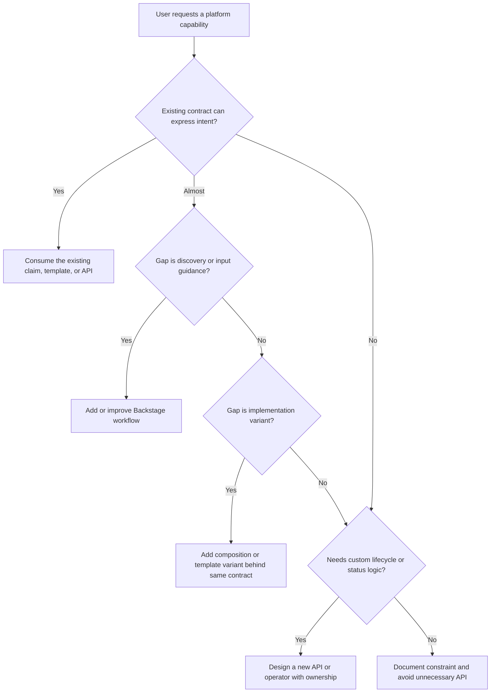

# CNPE Platform APIs and Self-Service Lab

> **CNPE Track** | Complexity: `[COMPLEX]` | Time to Complete: 75-90 min
>
> **Prerequisites**: CNPE Exam Strategy and Environment, Platform Engineering fundamentals, CRDs and Operators, Backstage, Crossplane, Kubebuilder, vCluster

## Learning Outcomes

After this module, you will be able to:

- distinguish platform API contracts from implementation resources without breaking controller ownership
- evaluate self-service tool choices across Backstage, Crossplane, Kubebuilder operators, and vCluster
- diagnose reconciliation failures using spec fields, status conditions, events, RBAC, and backing resources
- implement a governed self-service workspace claim while preserving safe defaults and status feedback
- decide when to consume an existing platform contract versus author a new platform API

## Why This Module Matters

Hypothetical scenario: a product team needs a test workspace for a new service before the end of the sprint. The platform already has a self-service contract that can create a namespace, attach a quota, apply baseline policy, and bind team access, but an engineer bypasses that contract and hand-writes the namespace, RoleBinding, Secret, Service, and Deployment manifests. The application appears to work for an hour, then a controller removes an unmanaged label, a policy check rejects a later rollout, and nobody can tell whether the problem belongs to the product team or the platform team because the original intent was never expressed through the platform API.

CNPE self-service questions test that exact boundary. The exam is not asking whether you can produce more YAML than the next candidate; it is asking whether you can recognize the contract that the platform team intended users to consume, operate through that contract, and troubleshoot the reconciliation path when the declared intent does not become a healthy workload. A good answer usually changes the highest-level object that still expresses the desired outcome, then reads status and events before touching anything the controller generated.

This module turns platform APIs into a practical troubleshooting model. You will read a CRD-backed contract as a user-facing product surface, compare portal templates with Crossplane claims, operators, and virtual clusters, and practice deciding whether a request should consume an existing abstraction or justify a new one. Keep Kubernetes 1.35+ behavior in mind throughout the lesson: the same control-loop principles still apply, but mature clusters increasingly expect declarative APIs, admission policy, and status conditions to carry the operational conversation.

## Platform APIs as Contracts, Not Piles of YAML

A platform API is a promise between the people who need outcomes and the platform that creates those outcomes. The user describes intent, the API server validates the shape of that intent, and a controller reconciles real resources until the world matches the declared contract. This is different from a convenience wrapper around YAML because the contract also defines ownership, defaulting, status feedback, and the safe boundary where users can make changes without fighting the implementation.

The simplest way to read a platform API is to separate the menu from the kitchen. The menu is the resource that a user is supposed to order from: a claim, a template input, a custom resource, or a portal form. The kitchen is the implementation behind it: Namespaces, Deployments, Services, Secrets, policies, cloud resources, generated ConfigMaps, and RBAC bindings. A platform can expose many implementation details internally, but a learner should first ask which object is the supported entry point.

```text
User Intent -> Platform Contract -> Platform Implementation

Example:
  Claim   -> Namespace + Policy + App Template -> Deployment, Service, Secret, RBAC
```

That original mental model is intentionally short because it is the core of the module. User intent should flow into a platform contract, and the implementation should be reconciled behind the contract rather than edited as a one-off artifact. When the contract is healthy, the user can explain the desired state in plain language, the platform can create the right resources consistently, and both sides can look at status to decide what happened next.

The first CNPE move is therefore not `kubectl apply` against every generated resource you can find. The first move is to locate the object that owns the user-facing intent and then read it carefully. In a Crossplane-based platform, that might be a claim whose fields describe class, region, size, and team ownership. In a Kubebuilder operator, it might be a custom resource whose spec declares the desired workspace. In Backstage, it might begin as a form-backed template that eventually commits or applies the custom resource.

Pause and predict: if a generated Deployment has the wrong replica count, what do you think happens when you patch the Deployment directly while the owning custom resource still says something else? The likely answer is that the next reconciliation puts the Deployment back, or a later drift check reports a mismatch. That is not a Kubernetes bug; it is the consequence of editing the kitchen after ordering from the menu, and it is why platform APIs must make supported change points obvious.

Good contracts reduce the number of fields that ordinary users must understand while preserving enough control to express real needs. A workspace contract might ask for `team`, `environment`, `quotaClass`, and `networkProfile` rather than exposing every Namespace label, NetworkPolicy selector, LimitRange setting, and RoleBinding subject. This is not hiding knowledge from users; it is moving repetitive expertise into a tested controller path so that the common request is safe by default and unusual requests receive deliberate review.

Bad contracts leak implementation details without giving users the power to reason about them. A self-service form with twenty loosely documented fields can be worse than raw Kubernetes because it looks safer than it is. If the user cannot tell which fields are required, which defaults will be applied, which resources are generated, and where status appears, the API is not yet a product surface. It is an implementation snapshot wearing a friendly name.

The CRD itself is also not the whole platform API. A CustomResourceDefinition defines the schema and storage for a kind, but useful self-service requires a controller, RBAC, admission behavior, documentation, and status conventions. If a claim exists but nothing reconciles it, the API server can store the object forever while the requested workspace never appears. That is why CNPE troubleshooting always pairs schema reading with controller and status inspection.

Kubernetes conditions are especially important because they turn a controller's internal decision into a user-readable signal. A condition such as `Ready=False` with a reason like `QuotaClassNotFound` is much better than a silent object that sits in the cluster with no generated resources. Conditions are not perfect, and controller authors can write vague messages, but a platform API without useful status forces users to guess, which defeats the purpose of self-service.

## Reading a CRD-Backed Contract

When you receive an unfamiliar custom resource, read it from the outside inward. Start with the kind and metadata, because they tell you the vocabulary and ownership context. Then read `spec` as the user's statement of intent, `status` as the platform's reply, and `metadata.ownerReferences` or labels as hints about generated resources. The goal is not to memorize every field; it is to identify which fields are safe user inputs and which fields are controller outputs.

A useful contract usually has a small set of user-facing fields that map to platform decisions. For example, `team` may select an identity group, `environment` may choose policy strength, `quotaClass` may map to ResourceQuota and LimitRange objects, and `networkProfile` may select one of several baseline NetworkPolicy templates. The implementation can be complex, but the contract should read like a request that a responsible platform could fulfill repeatedly.

```yaml
apiVersion: platform.example.com/v1alpha1
kind: TeamWorkspace
metadata:
  name: payments-dev
  namespace: platform-requests
spec:
  team: payments
  environment: dev
  quotaClass: small
  networkProfile: internal-only
  appTemplate: service-api
status:
  conditions:
    - type: Ready
      status: "False"
      reason: WaitingForNamespace
      message: Namespace payments-dev is being created
  generatedResources:
    - kind: Namespace
      name: payments-dev
```

This example is deliberately modest, but it contains the reading pattern you need. The `spec` says what the user wants, and the `status` says how far the platform has progressed. A learner should be able to explain that the request is for a development workspace for the payments team, using a small quota, an internal-only network profile, and a service API template. Nothing in that explanation requires opening the controller source code.

Before running this, what output do you expect from `kubectl get teamworkspace payments-dev -n platform-requests -o yaml` after the namespace has been created but the quota has not yet been applied? You should expect the same object with updated status, not a completely different user-facing resource. A good controller might change the `Ready` condition to `False` with a reason such as `WaitingForQuota`, and it might add the namespace to the generated resource list while leaving quota resources pending.

The important distinction is that status is descriptive, not a second place to declare intent. Users should not edit `status` to make an object appear healthy, just as they should not change a medical chart to cure a patient. In Kubernetes, status subresources exist so controllers can report observed state separately from desired state. For CNPE-style reasoning, that means you fix invalid `spec` inputs, missing dependencies, or controller permissions instead of overwriting the report card.

You should also inspect the CRD schema when the contract itself is unclear. The schema can reveal allowed enum values, required fields, defaulting behavior, and validation rules that a sample custom resource does not show. If `quotaClass` only accepts `small`, `medium`, and `large`, then a claim using `experimental` is a user input problem rather than a controller mystery. Schema reading is a fast way to avoid chasing symptoms in generated resources.

```bash
kubectl get crd teamworkspaces.platform.example.com -o yaml
kubectl explain teamworkspace.spec
kubectl explain teamworkspace.status.conditions
```

These commands are meant to establish the contract boundary. `kubectl get crd` shows the registered API surface, while `kubectl explain` uses the published schema to describe fields. In a real platform, the exact resource name may differ, but the diagnostic sequence remains the same: inspect the type, inspect the user-facing fields, and inspect the status fields that the controller writes back.

Events complement status because they show time-ordered observations from controllers, admission components, and the scheduler. Status tells you the current summary; events often tell you the recent path that led there. If a workspace claim is `Ready=False`, events might reveal that a namespace was created successfully, a ResourceQuota was rejected by admission, and a RoleBinding failed because the service account lacked permission. That sequence is much more useful than repeatedly applying the same manifest.

Do not confuse generated-resource discovery with permission to edit those resources. It is valid to inspect backing resources when status points there, because you need evidence. It is risky to patch those resources directly unless the platform contract explicitly says they are user-managed. The safer habit is to collect facts from generated objects, then return to the claim, composition, template, or controller configuration that owns the desired state.

## Choosing the Self-Service Surface

Self-service does not mean every user receives cluster-admin access and a pile of examples. It means the platform exposes the right level of abstraction for the job. Backstage, Crossplane, Kubebuilder operators, and vCluster can all participate in a self-service platform, but they solve different parts of the problem and create different ownership boundaries. A CNPE answer improves when you can describe which layer should handle the request and why.

Backstage is useful when discoverability and developer workflow matter. A Software Template can collect inputs, scaffold a repository, register a component, and trigger automation that creates or updates platform resources. The template is not necessarily the source of truth for the running infrastructure; it is often the front door that helps a user produce a valid request. Treat Backstage as the menu board and ordering workflow, not automatically as the reconciler that keeps every generated resource healthy.

Crossplane is useful when the platform needs composite resources and claims that reconcile infrastructure or Kubernetes resources over time. A platform team can define a composite type, bind it to a composition, and expose a claim that developers consume without learning the provider details underneath. This is powerful because it separates the user-facing contract from the implementation recipe, but it also means troubleshooting includes both the claim and the composed resources.

Kubebuilder and custom operators are useful when the domain has behavior that cannot be expressed cleanly as templated resources. If creating a workspace requires sequencing, external checks, finalizers, status aggregation, or ongoing repair, a controller can encode those rules. The tradeoff is operational responsibility: once you author a controller, you own reconcile logic, upgrades, failure handling, RBAC, metrics, and the user experience of status messages.

vCluster is useful when the desired self-service outcome is an isolated Kubernetes control plane rather than a single namespace or application scaffold. It can provide ephemeral environments, team sandboxes, or tenant isolation while sharing underlying worker capacity. The tradeoff is that users may now interact with a virtual cluster API, and platform operators must reason about synchronization, resource limits, and where policy is enforced. It is a strong fit for isolated experimentation, not a universal replacement for platform contracts.

| Surface | Best fit | Contract owner | Main troubleshooting evidence |
|---------|----------|----------------|-------------------------------|
| Backstage template | Discoverable workflow, repo scaffold, guided request creation | Portal and platform workflow maintainers | Template inputs, task logs, generated pull request or resource |
| Crossplane claim | Composed infrastructure or platform capability | Platform API and composition maintainers | Claim status, composite status, composed resource readiness |
| Kubebuilder operator | Custom domain behavior with ongoing reconciliation | Controller authors and platform operators | Custom resource status, controller logs, events, RBAC |
| vCluster | Tenant isolation, sandbox clusters, ephemeral control planes | Platform team running virtual cluster service | Virtual cluster status, syncer health, host-cluster resources |

This decision table matters because many exam distractors propose a technically possible but poorly scoped solution. You can write a custom controller for almost anything, but that does not make it the right first move. You can place a Backstage form in front of almost anything, but a form without reconciliation is a request launcher, not a durable platform API. You can create a virtual cluster for isolation, but it may be excessive for a simple team namespace with quota and policy.

Which approach would you choose here and why: a team asks for the same kind of namespace, quota, and access binding that five other teams already use, but they want the workflow to be easier to find? The conservative answer is usually to consume the existing contract and improve the portal entry point, not to author a new CRD. That preserves one implementation path while improving self-service discoverability.

The reverse situation also appears in real platforms. If many teams keep asking for a capability that requires platform engineers to manually stitch together several resources, a new or expanded contract may be justified. The signal is not novelty by itself; the signal is repeated demand, a stable policy boundary, a clear owner, and enough operational logic that centralizing the workflow reduces risk. A contract should graduate from repeated toil, not from curiosity.

Governance is not the opposite of self-service. The best platforms make the compliant path the easiest path by embedding policy into the contract. For a workspace API, this might mean allowed quota classes, mandatory owner labels, fixed network profiles, default deny ingress, and automated RoleBindings from approved identity groups. Users still move quickly, but they do so inside a route the platform can support, audit, and repair.

## Provisioning Without Bypassing Governance

Self-service provisioning starts with a request that the platform can validate. In a mature cluster, the user should be able to submit a small object or portal form and receive clear feedback about whether the platform accepted, rejected, or partially fulfilled it. That feedback is where governance becomes visible: invalid teams are rejected, unsupported quota classes produce explainable errors, and missing permissions surface as events or conditions rather than silent failures.

Exercise scenario: you are asked to create a team workspace for a development environment. The platform team has already provided a `TeamWorkspace` contract with `team`, `environment`, `quotaClass`, and `networkProfile` fields. Your task is not to create every underlying object by hand. Your task is to express the request through the contract, check the controller response, and avoid direct edits to generated resources unless the lab explicitly asks for investigation.

```yaml
apiVersion: platform.example.com/v1alpha1
kind: TeamWorkspace
metadata:
  name: payments-dev
  namespace: platform-requests
spec:
  team: payments
  environment: dev
  quotaClass: small
  networkProfile: internal-only
```

This request is intentionally small because a platform API should keep the common path narrow. The controller can translate `quotaClass: small` into concrete ResourceQuota and LimitRange objects, translate `networkProfile: internal-only` into policy, and translate `team: payments` into access bindings. If a learner is tempted to add every generated label, selector, and RoleBinding subject to the claim, that is a sign the abstraction is leaking.

Apply and inspect the request through the supported object first. The commands below assume the CRD exists in the lab cluster; if it does not, use the same reading pattern with any platform-track CRD or template available in your environment. The point is to learn the sequence, not to depend on this exact fictional API group.

```bash
kubectl apply -f teamworkspace.yaml
kubectl get teamworkspace payments-dev -n platform-requests -o yaml
kubectl describe teamworkspace payments-dev -n platform-requests
kubectl get events -n platform-requests --sort-by=.lastTimestamp
```

The healthy path should show accepted input, progressing status, and eventually a ready condition or equivalent signal. If the controller creates a namespace, quota, policy, and access binding, inspect them as evidence but resist treating them as the primary interface. Generated resources tell you what the controller did. The claim tells you what the platform is supposed to keep doing.

Governed self-service also depends on RBAC. A user may be allowed to create a claim in `platform-requests` without being allowed to create namespaces or cluster-wide roles directly. That is a feature, not a restriction to bypass. The platform controller can hold the broader permissions because it applies policy consistently, while users receive the narrow permission needed to request approved outcomes. This keeps accidental privilege expansion out of the normal developer workflow.

```bash
kubectl auth can-i create teamworkspaces.platform.example.com -n platform-requests
kubectl auth can-i create namespaces
kubectl auth can-i create rolebindings -n payments-dev
```

The expected answer for many users is yes to the first command and no to the direct implementation commands. That result shows the platform has separated request permission from infrastructure permission. If all three commands return yes for ordinary developers, the platform may still function, but it is relying on human restraint rather than an enforced contract boundary.

Admission policy can add another guardrail before the controller even runs. A validating rule might reject unknown quota classes, require an owner label, or prevent production workspaces from using a permissive network profile. A mutating rule might add standard labels or defaults. Admission does not replace reconciliation because it does not keep resources healthy over time, but it prevents invalid intent from entering the system and gives users faster feedback.

This is where the restaurant analogy from the original module still helps. A good platform API is like a menu, not a kitchen tour. The caller should order outcomes, and the platform should handle the cooking, plating, and cleanup. If the menu lets every customer rewrite the kitchen inventory during lunch, the result is not empowerment; it is a failure to define the operating boundary.

## Diagnosing Reconciliation Failures

Reconciliation failures become manageable when you keep three questions separate. Did the user express valid intent? Did the controller observe and accept that intent? Did every dependent resource become healthy? Mixing those questions is what leads people to patch random objects, restart controllers without evidence, or blame RBAC when the real problem is an unsupported field value.

Use the same sequence every time a claim or custom resource stays stuck. Read the custom resource, inspect `status.conditions`, inspect events, inspect backing resources, and then check RBAC or admission rules for the actor that should be performing the operation. That sequence starts with the contract and only moves downward when the contract points you there. It also preserves evidence for the platform owner, which matters when the fix belongs in the composition or controller rather than the user's request.

```bash
kubectl get <custom-resource> -o yaml
kubectl describe <custom-resource>
kubectl get events -A --sort-by=.lastTimestamp | tail -n 15
```

Those original verification commands are still the right compact starting point. `kubectl get` lets you compare spec and status, `kubectl describe` often aggregates conditions and recent events, and sorted events reveal recent failures across namespaces when the object is not namespace-scoped or when generated resources live elsewhere. In a larger cluster, you would narrow the event query to the relevant namespace or involved object once you know where the controller is acting.

The first failure family is invalid input. A field may be missing, an enum value may be unsupported, a referenced secret may not exist, or an environment value may violate policy. Invalid input should be fixed in the claim, template input, or custom resource spec because that is where the user expresses intent. If the controller reports `InvalidQuotaClass`, editing the generated ResourceQuota avoids the lesson and leaves the next reconciliation with the same bad request.

The second failure family is a blocked controller. The controller may be down, crash-looping, missing RBAC, unable to reach an external API, or failing to watch a resource after an upgrade. In that case, many user claims may be stuck at the same time, and their status messages may stop updating. The right evidence shifts toward controller Deployment health, logs, leader election, service account permissions, and metrics, but you still begin with the user object because it tells you which controller path should be active.

The third failure family is a dependent resource that failed after the controller accepted the claim. A namespace may exist, but a policy object may be rejected; a composite resource may exist, but one composed cloud resource may be unavailable; a virtual cluster may be created, but its syncer may be unhealthy. This is where backing resource inspection is useful. You are not editing generated objects first; you are following the status trail to find the failed dependency.

| Failure signal | Likely layer | Evidence to collect | Preferred fix location |
|----------------|--------------|---------------------|------------------------|
| Schema validation rejects the object | API server or admission | Error from apply, CRD schema, policy message | User input or platform validation docs |
| `Ready=False` with invalid field reason | Platform contract | Custom resource status, events | Claim spec or template input |
| Many claims stop progressing | Controller implementation | Controller Deployment, logs, leader election, metrics | Controller, RBAC, or runtime configuration |
| One generated object is rejected | Dependent resource | Owner references, generated object events, admission output | Composition, template, or claim field that produced it |
| User lacks create permission on claim | Access boundary | `kubectl auth can-i`, RoleBindings, identity mapping | RBAC for the request surface |

Notice that the preferred fix location is rarely "patch whatever looks broken." Controllers are designed to converge managed resources toward the desired state they understand. If you edit a managed resource outside the contract, the edit may be overwritten, ignored, or preserved as hidden drift that surprises the next upgrade. A strong platform engineer treats direct patches as investigation tools or emergency exceptions, then repairs the declarative source of truth.

Pause and predict: a workspace claim reports `Ready=False` because a generated RoleBinding is forbidden for the controller service account. Should the product team receive cluster-admin so they can create the RoleBinding manually? The better answer is no; fix the controller's RBAC or the platform composition. Giving the product team broad permission bypasses the contract, weakens governance, and still leaves future claims broken.

Events can be noisy, so read them with context. A scheduler event about a pending Pod may be downstream of a ResourceQuota problem. An admission rejection may appear both on the generated object and in the controller log. A missing owner reference may mean the resource was not generated by the platform at all. The skill is not collecting every possible signal; it is collecting the smallest evidence set that distinguishes user error, controller blockage, dependent resource failure, and access failure.

## Deciding Whether to Build or Consume

The build-versus-consume decision is a platform design question disguised as a lab task. If the existing platform API can express the desired outcome, consume it. If it almost can, ask whether configuration, documentation, or a portal template would close the gap. Authoring a new API should come after you identify a stable user need, a clear abstraction boundary, and ongoing reconciliation behavior that cannot be handled safely by existing contracts.

The cheapest correct solution often wins in CNPE reasoning. A Backstage template may be enough when the missing piece is discoverability. A new Crossplane composition may be enough when the contract exists but a new implementation flavor is needed. A new claim type may be justified when users need a distinct product with its own lifecycle, policy, and status. A custom operator may be justified when the desired behavior includes sequencing, health aggregation, finalizers, or domain logic that simple composition cannot express.

An existing API also carries social and operational value. It has documentation, RBAC, examples, dashboards, upgrade expectations, and users who already understand it. Creating a second API for a similar request splits that ecosystem. The immediate YAML might look cleaner, but the platform now has two places to apply policy, two status conventions, and two support paths. That is why "does the platform already have a contract?" is not a bureaucratic question; it is an operational risk question.

There are real reasons to author a new contract. If users repeatedly need a capability that has different lifecycle semantics, different ownership, different compliance rules, or different failure modes, forcing it through an old contract can be worse than building a new one. A production database claim and an ephemeral preview namespace might both create Kubernetes resources, but their backup, deletion, access, and audit expectations are not the same. Good platform APIs respect those differences.

Use a short design test before adding anything. Can you name the user, the intent, the lifecycle, the policy boundary, the owner, the status conditions, and the generated resources? Can you explain what happens when creation partially succeeds, when deletion is requested, and when an external dependency fails? If those answers are vague, the API is not ready. Improve the existing path or write an internal design note before creating a public contract.

The decision also depends on who will operate the result. A Backstage template that produces a pull request might be maintained by the developer experience team. A Crossplane composition that provisions cloud infrastructure might be owned by the platform infrastructure team. A custom controller might require on-call ownership from a team comfortable debugging reconcile loops. A vCluster service might involve cluster lifecycle, syncer behavior, host resource accounting, and policy enforcement. Ownership is part of the API, even when it does not appear in YAML.

One useful exam habit is to describe the smallest durable change. "Use the existing workspace claim and add a Backstage template that submits it" is a smaller durable change than "write a new operator for workspaces" when the contract already exists. "Add a composition variant behind the existing claim" is smaller than "create a second claim kind" when the user intent is unchanged. "Create a new API" becomes appropriate when the user intent itself is different enough that the old contract would become confusing.

## Patterns & Anti-Patterns

Strong platform APIs share a few practical patterns. They expose a stable intent model, keep implementation details behind the controller boundary, and publish enough status for users to act without privileged knowledge. The patterns below are not aesthetic preferences. They are ways to reduce support load while making self-service safer and easier to reason about under pressure.

| Pattern | When to Use It | Why It Works | Scaling Consideration |
|---------|----------------|--------------|-----------------------|
| Claim-first consumption | Users need a repeatable workspace, service, database, or environment | The claim captures intent while the platform owns generated resources | Keep claim fields narrow and versioned so old users are not broken by implementation changes |
| Portal front door | Users struggle to discover the correct API or provide valid inputs | A form or template guides input and can link documentation, ownership, and review | Keep the portal aligned with the underlying contract so it does not become a second source of truth |
| Status-led support | Users and operators need a shared view of progress and failure | Conditions, events, and generated resource references reduce guesswork | Standardize condition types and reasons across APIs where possible |
| Policy as default path | Governance must be enforced without manual review for every request | Admission, RBAC, and controller defaults make compliant use the easiest route | Review exceptions deliberately and avoid hidden bypasses in templates |

The first anti-pattern is editing generated resources directly as routine workflow. Teams fall into this because the generated object is visible and the failing symptom appears there. The better alternative is to find the owner, read the claim or composition that produced the object, and change the supported input or platform implementation. Direct edits may be acceptable during incident response, but they should become a follow-up repair to the contract, not a habit.

The second anti-pattern is treating the CRD as the entire platform. A CRD without a working controller, RBAC model, status convention, examples, and support ownership is just a storage extension. Teams fall into this because registering a kind feels like shipping an API. The better alternative is to define the full user journey: who can create the object, what fields they set, what reconciles it, what status means, and how failures are diagnosed.

The third anti-pattern is creating a new API for every request that feels slightly different. Teams fall into this because new kinds can make demos look clean, but the long-term cost appears in documentation, policy duplication, migrations, and support. The better alternative is to extend an existing contract when the user intent is the same, add implementation variants behind it when only the backend changes, and reserve new APIs for genuinely different lifecycle or ownership models.

The fourth anti-pattern is hiding all failure details behind a portal task log. A portal can improve experience, but a Kubernetes-backed platform still needs durable status on the resource that represents intent. If the Backstage task succeeds in submitting a claim and the claim later fails, the user should not have to dig through an old task run to understand current state. The better alternative is to link portal workflows to the live resource and teach users where status lives.

The fifth anti-pattern is giving broad permissions to make self-service "easier." It may reduce friction on day one, but it removes the platform's ability to guarantee safe defaults and audit the request path. The better alternative is narrow permission on claims or templates, broader permission only for trusted controllers, and clear break-glass procedures for exceptional cases. Self-service should transfer routine work to a controlled API, not transfer production risk to every user.

## Decision Framework

Use this framework whenever a CNPE prompt asks how to provide or troubleshoot self-service. Start by identifying the supported contract, then choose the lowest layer that can responsibly solve the problem. The framework is intentionally conservative because platform APIs become expensive when they multiply faster than the team can document, secure, and operate them.



This flowchart is not a mechanical substitute for judgment, but it prevents a common overreaction. Many requests sound like new APIs because the user describes a new experience, not a new lifecycle. If the desired state is still "give my team a governed workspace," a better portal workflow may be enough. If the desired state is "give my team an isolated control plane that can be deleted after a test window," vCluster or another environment API may be a better fit than stretching a namespace claim.

| Decision Question | Prefer Existing Contract When | Prefer New or Expanded API When |
|-------------------|-------------------------------|---------------------------------|
| Is the user intent already represented? | The current fields express the outcome with safe defaults | Users need a different lifecycle, owner, or policy model |
| Is the pain mostly discoverability? | A portal template, docs update, or example would guide users | Users still need unsupported behavior after guidance improves |
| Is the implementation changing behind the same promise? | A composition or template variant can satisfy the request | The promise itself changes and old status semantics no longer fit |
| Is ongoing reconciliation needed? | Existing controller already owns the desired state | New sequencing, finalizers, or external health checks are required |
| Can the team operate it? | Ownership and support already exist | A clear on-call and upgrade path is funded before launch |

When troubleshooting, use the same framework in reverse. If the user consumed an existing contract and the generated resource is wrong, inspect the claim and composition before patching the resource. If the portal task failed before creating a claim, inspect template inputs and task logs. If a virtual cluster is unhealthy, distinguish the user's workload from the virtual control plane and the host-cluster sync components. Each surface has a different evidence trail, and the correct trail follows ownership.

The framework also helps with exam wording. Prompts often include multiple plausible tools, and the wrong answer is often the one that ignores the current abstraction. "Use Kubebuilder to create a new controller" may be technically impressive, but it is not the best answer when a Crossplane claim already exists and only needs a composition fix. "Patch the generated Namespace" may be fast, but it does not respect controller ownership. "Read status, events, and RBAC, then fix the claim or controller path" usually maps better to platform engineering principles.

## Did You Know?

- Kubernetes CustomResourceDefinitions reached general availability in Kubernetes 1.16, which is why modern platform APIs often treat CRDs as normal cluster extension points rather than experimental add-ons.
- Crossplane uses composite resources and claims to separate consumer intent from provider-specific implementation, giving platform teams a formal way to publish APIs without exposing every cloud-resource field.
- Backstage Software Templates are built around a `template.yaml` definition and a task workflow, so they are excellent for guided creation but still need a durable source of truth for ongoing reconciliation.
- vCluster creates virtual Kubernetes control planes on top of shared host clusters, which makes it useful for sandbox and tenant workflows where namespace isolation alone is not enough.

## Common Mistakes

| Mistake | Why It Happens | How to Fix It |
|---------|----------------|---------------|
| Editing generated resources directly | The generated Deployment, Service, Secret, RBAC object, or policy is visible, so it feels like the fastest repair even though the controller owns it | Fix the claim, template, composition, or controller input that produced the resource, then use the generated object only as evidence |
| Treating the CRD as the whole solution | Registering a kind looks like shipping an API, but nothing useful happens without reconciliation, permissions, examples, and status feedback | Check the controller, RBAC, status path, and user documentation before declaring the platform API ready |
| Ignoring conditions | Teams focus on spec and generated resources while skipping the controller's most direct explanation of progress or failure | Read `status.conditions`, reasons, messages, and recent events before changing the resource |
| Rebuilding the platform API from scratch | A request sounds new, and writing a new kind feels cleaner than understanding the existing contract | Consume the existing abstraction when it expresses the outcome, and add variants behind it when only the implementation changes |
| Skipping RBAC checks | Self-service often grants permission to request outcomes but not to create the underlying resources directly | Use `kubectl auth can-i` against the claim and the generated resource types so the access boundary is explicit |
| Hiding reconciliation behind a portal only | A Backstage workflow creates the initial request, but users later need current state from the live cluster object | Link portal outputs to the durable claim or custom resource and teach users how to read status |
| Adding too many fields to the contract | Platform teams try to satisfy every edge case by exposing implementation knobs directly to users | Keep common fields small, provide documented profiles, and create an explicit exception or extension process for rare cases |

## Quiz

<details>
<summary>Scenario: a developer patches a generated Deployment replica count, but it changes back after a few minutes. How should you distinguish the platform API contract from implementation resources?</summary>

The generated Deployment is probably owned by a higher-level contract such as a claim, custom resource, composition, or template output. The right response is to find the owner and inspect the user-facing spec that declares the desired replica behavior rather than repeatedly patching the implementation. This is correct because controllers reconcile generated resources back toward the state they understand. Patching the Deployment may be useful as temporary evidence, but it is the wrong durable fix when the contract still declares another value.
</details>

<details>
<summary>Scenario: your team needs a guided workflow for an existing workspace claim that already creates namespaces, quota, and RBAC. How should you evaluate self-service tool choices?</summary>

Use the existing workspace claim as the durable contract and consider Backstage as the discoverable front door that helps users submit valid input. Crossplane or an operator may already be responsible for reconciliation, so creating a second API would split ownership without changing the intent. vCluster would only be appropriate if the team needs an isolated control plane rather than a governed namespace workspace. The best choice is the smallest layer that improves the user experience while preserving the existing contract.
</details>

<details>
<summary>Scenario: a claim is stuck with `Ready=False`, and events mention a forbidden RoleBinding. How do you diagnose the reconciliation failure?</summary>

Start with the claim's spec and status, then inspect events and the generated RoleBinding to confirm which service account attempted the action. A forbidden generated RoleBinding usually points to controller RBAC or composition design, not to a need for the product team to receive broad permissions. The fix belongs in the platform controller's permissions or the contract that produced the RoleBinding. This preserves governance because users keep narrow request permission while the controller performs approved implementation work.
</details>

<details>
<summary>Scenario: a platform request uses `quotaClass: experimental`, but the CRD schema only allows `small`, `medium`, and `large`. What should you implement or change?</summary>

This is an invalid user intent problem, so the immediate fix is to choose a supported quota class or ask the platform owner to add a documented class through the contract. You should not patch the generated ResourceQuota to mimic an experimental class because the claim still contains an unsupported value. If the new quota class represents a repeated and approved need, the platform team can implement it behind the same API. That approach keeps validation, documentation, and status feedback aligned.
</details>

<details>
<summary>Scenario: several teams ask for isolated Kubernetes control planes for short-lived testing. How do you decide whether to consume an existing contract or author a new platform API?</summary>

First check whether the platform already exposes a virtual-cluster or environment contract that captures isolated control planes as a supported outcome. If it does, consume that contract and improve discoverability if needed. If the existing workspace API only models namespaces and cannot represent virtual control-plane lifecycle, policy, deletion, and status, a new or expanded platform API may be justified. The decision turns on lifecycle and ownership, not on whether both options eventually create Kubernetes resources.
</details>

<details>
<summary>Scenario: a Backstage template task succeeds, but the requested workspace later reports a failed condition in the cluster. Where should support look next?</summary>

Support should follow the durable resource created by the template, such as the claim or custom resource, because that object represents ongoing intent after the portal task is finished. Backstage task logs explain request creation, but they do not necessarily describe later reconciliation failures. The claim's status, events, and generated resource references provide current evidence. This distinction prevents the portal from becoming a dead-end support surface.
</details>

<details>
<summary>Scenario: you are asked to add five fields that expose labels, policy selectors, quota details, and RoleBinding subjects directly on a workspace claim. What is the platform-design risk?</summary>

The risk is that the contract starts leaking implementation details and stops protecting users from low-level policy complexity. Some fields may be justified, but exposing every generated-resource knob makes the API harder to validate, document, and support. A better design is to offer profiles such as quota classes and network profiles, then let the controller translate them into implementation resources. That keeps the user-facing intent stable while giving platform owners room to change internals safely.
</details>

## Hands-On Exercise

Exercise scenario: you will build a self-service mental model for a CRD, claim, template, or virtual-environment contract that exists in your lab cluster or platform-track materials. If your local cluster does not provide the exact sample kind used above, choose another platform API and apply the same method. The purpose is to practice contract reading, governed provisioning, and reconciliation diagnosis without bypassing the platform boundary.

Start by choosing one candidate platform surface. A good candidate has a user-facing spec, a status path, and at least one generated or downstream resource. If you use a Backstage template rather than a live CRD, map the template inputs to the resource or repository changes it creates, then identify where ongoing state is recorded after the template task finishes.

- [ ] Identify the platform API contract and distinguish it from at least two implementation resources it creates or configures.
- [ ] Read the CRD schema, template definition, or claim documentation and list the user-facing spec fields that express intent.
- [ ] Submit or inspect a governed self-service workspace claim without directly creating the generated Namespace, quota, policy, or RBAC objects.
- [ ] Diagnose reconciliation state by collecting spec, status conditions, events, RBAC checks, and backing-resource evidence.
- [ ] Evaluate whether Backstage, Crossplane, a Kubebuilder operator, or vCluster is the right self-service surface for the request.
- [ ] Decide whether a new request should consume the existing platform contract or justify authoring a new platform API.

### Suggested Setup

Use a non-production Kubernetes 1.35+ cluster or a disposable training namespace. If your platform track lab provides sample CRDs, use those. If it does not, perform the read-only parts against any installed custom resource and treat the YAML examples in this module as design artifacts rather than cluster-ready definitions. Do not grant yourself extra permissions just to make generated-resource edits easier; the lab is about respecting the request boundary.

### Task 1: Find the Contract

Locate the object that users are supposed to create or submit. This might be a Crossplane claim, a custom resource managed by an operator, a Backstage template input, or a vCluster request. Write one sentence that names the user intent and one sentence that names at least two implementation resources behind it.

<details>
<summary>Solution guide</summary>

A strong answer separates the front door from the generated resources. For example: "The `TeamWorkspace` claim lets a team request a governed development namespace. The implementation may create a Namespace, ResourceQuota, LimitRange, NetworkPolicy, RoleBinding, and application scaffold." If your chosen surface is Backstage, name the template as the front door and then name the durable resource or repository changes that continue after the task finishes.
</details>

### Task 2: Read Spec and Status

Inspect the schema or example manifest and mark which fields are user intent and which fields are controller feedback. Pay special attention to enum values, required fields, defaulted fields, conditions, and generated resource references. If status is missing or vague, note what a better platform API would report.

<details>
<summary>Solution guide</summary>

User intent usually lives in `spec`, template parameters, or a claim form. Controller feedback usually lives in `status.conditions`, events, task logs, or generated resource references. Do not treat status as something users edit. A mature answer names at least one condition type, one reason or message, and one generated resource that can be inspected without becoming the new source of truth.
</details>

### Task 3: Verify Access Boundaries

Check whether the intended user can create the request object and whether that same user can create the underlying resources directly. Record the difference. A governed platform often allows the request and denies direct infrastructure creation, while the controller service account holds the broader implementation permission.

<details>
<summary>Solution guide</summary>

Use `kubectl auth can-i` for the request kind and a few generated resource kinds. If the user can create claims but cannot create namespaces or RoleBindings directly, the platform is enforcing a useful boundary. If the user can create everything, write down the risk: self-service may still work, but governance relies more on convention than on enforced permissions.
</details>

### Task 4: Trace a Reconciliation Failure

Find a failed or progressing object if one is available. If all objects are healthy, create a safe hypothetical by changing a local copy of the manifest to an unsupported value without applying it to a shared environment. Explain which evidence would identify invalid input, blocked controller, dependent resource failure, or RBAC failure.

<details>
<summary>Solution guide</summary>

For invalid input, the evidence is an apply error, admission message, schema mismatch, or condition reason tied to a field. For a blocked controller, look for many claims stuck together, controller Deployment problems, logs, leader election, or service account RBAC. For a dependent resource failure, follow generated resource references and events. For RBAC, compare what the user can do with what the controller service account must do.
</details>

### Task 5: Make the Build-or-Consume Decision

Write a short recommendation for one new platform request. State whether you would consume an existing contract, add a portal workflow, add an implementation variant, use vCluster, or author a new API. Include the reason, the owner, and the status signal you would expect users to read.

<details>
<summary>Solution guide</summary>

A strong recommendation includes the smallest durable change. For example: "Consume the existing workspace claim and add a Backstage template because the intent is unchanged and the pain is discoverability." Another valid answer might be: "Author a new virtual-environment API because namespace workspaces do not represent isolated control-plane lifecycle or deletion status." The answer should always name who operates the contract and how users know whether it is healthy.
</details>

### Verification Commands

Use the commands below with the real kind, name, and namespace from your lab. The first block preserves the compact verification sequence from the original module; the second block adds access-boundary checks that make governance visible.

```bash
kubectl get <custom-resource> -o yaml
kubectl describe <custom-resource>
kubectl get events -A --sort-by=.lastTimestamp | tail -n 15
```

```bash
kubectl auth can-i create teamworkspaces.platform.example.com -n platform-requests
kubectl auth can-i create namespaces
kubectl auth can-i create rolebindings -n payments-dev
kubectl get events -n platform-requests --sort-by=.lastTimestamp
```

### Success Criteria

By the end of the lab, your notes should prove that you can explain the contract in plain language, point to a live or designed status signal, describe generated resources without opening controller code, and recommend whether to consume or author a platform API. The practical standard is simple: another engineer should be able to read your notes and know which object to edit, which object only to inspect, and which team owns the next fix.

## Sources

- https://kubernetes.io/docs/concepts/extend-kubernetes/api-extension/custom-resources/
- https://kubernetes.io/docs/tasks/extend-kubernetes/custom-resources/custom-resource-definitions/
- https://kubernetes.io/docs/concepts/architecture/controller/
- https://kubernetes.io/docs/reference/access-authn-authz/rbac/
- https://kubernetes.io/docs/reference/kubectl/generated/kubectl_get/
- https://kubernetes.io/docs/reference/kubectl/generated/kubectl_describe/
- https://kubernetes.io/docs/reference/kubectl/generated/kubectl_auth/kubectl_auth_can-i/
- https://docs.crossplane.io/latest/concepts/claims/
- https://docs.crossplane.io/latest/concepts/composite-resources/
- https://backstage.io/docs/features/software-templates/
- https://book.kubebuilder.io/introduction
- https://www.vcluster.com/docs/vcluster

## Next Module

Continue with [CNPE Observability, Security, and Operations Lab](./module-1.4-observability-security-and-operations-lab/), where the platform contract is judged by its signals, policies, and incident response behavior.
