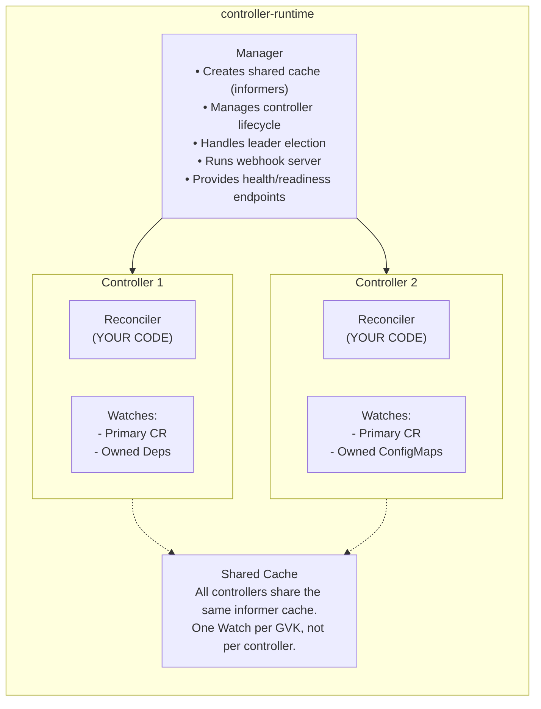
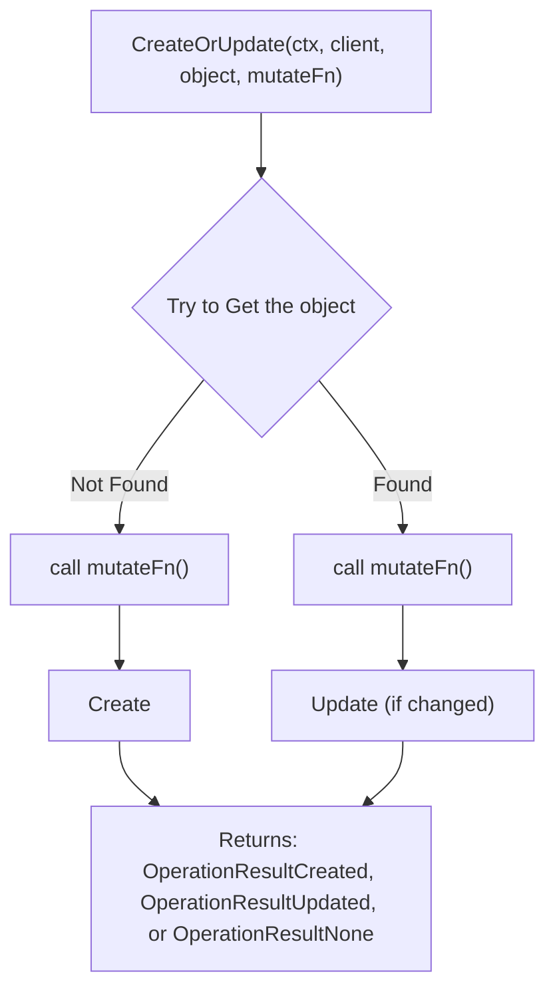

> **Complexity**: `[COMPLEX]` - Framework-based operator development
>
> **Time to Complete**: 4 hours
>
> **Prerequisites**: Module 1.3 (Building Controllers with client-go), Go 1.22+, Docker, access to a Kubernetes 1.35+ cluster

---

# Module 1.4: The Operator Pattern & Kubebuilder

## Learning Outcomes

After completing this module, you will be able to:

1. **Compare** Kubebuilder and Operator SDK choices for a Go operator, including when OLM packaging changes the decision.
2. **Scaffold and generate** a WebApp API with Kubebuilder, controller-gen markers, CRD manifests, RBAC, and deepcopy code.
3. **Implement and diagnose** a controller-runtime Reconciler that creates child resources, reports status, and handles drift.
4. **Validate and deploy** operator behavior with local execution, generated manifests, container images, and envtest-oriented checks.

## Why This Module Matters

Hypothetical scenario: a platform team owns a shared Kubernetes cluster where application teams can request internal web services through a custom `WebApp` resource. At first the team provides a runbook that tells developers how to create a Deployment, a Service, labels, resource settings, and a status annotation by hand, but the runbook drifts as new conventions appear. When a new Kubernetes 1.35 cluster lands, one namespace uses the new convention, another keeps the old labels, and support tickets start asking why dashboards and scaling tools disagree about what is actually ready.

Module 1.3 showed that a controller can close that gap because it continuously compares desired state with observed state and pushes the cluster toward convergence. The raw client-go version was useful because it exposed watches, informers, workqueues, clients, and retry behavior, but it also made you maintain every piece of plumbing yourself. Production operators usually need several APIs, generated CRDs, RBAC, status subresources, admission webhooks, leader election, metrics, health probes, tests, and release manifests, so repeating that plumbing is a poor use of engineering time.

Kubebuilder is the Kubernetes project that turns that controller idea into a productive development workflow. It uses controller-runtime underneath, which means the mental model from Module 1.3 still applies, but the framework supplies project layout, manager setup, shared caches, generator integration, and controller wiring. In this module you will keep the original WebApp operator shape, but you will learn why each generated piece exists, how the markers become cluster-facing YAML, and how to diagnose the common failure modes that appear when an operator is almost correct but not yet reliable.

The important shift is ownership of intent. A YAML manifest describes an object at one moment, while an operator describes a policy that should remain true over time, even after users edit child resources, pods roll over, or the controller restarts. Kubebuilder helps you express that policy with less boilerplate, but it does not remove the need for careful API design, idempotent reconciliation, explicit status, and narrow permissions. The framework accelerates the mechanics, while the engineering judgment still belongs to you.

## Compare Kubebuilder and Operator SDK Before You Scaffold

Kubebuilder and Operator SDK are often mentioned together because they solve overlapping problems, and that overlap can make the first decision feel larger than it really is. For a Go-based operator, both tools now use the Kubebuilder project layout and controller-runtime as the core library, so the Reconciler you write looks very similar in either project. The difference is mostly in distribution features, packaging workflow, and whether you need Operator Lifecycle Manager integration as a first-class path rather than a later release concern.

If you are learning the operator pattern or building a Go operator for internal platform automation, Kubebuilder is usually the cleaner starting point because it keeps the toolchain close to Kubernetes API machinery. It gives you generated APIs, controllers, markers, manifests, tests, and deployment scaffolding without adding a separate product distribution layer. Operator SDK becomes more attractive when your operator must ship through OLM catalogs, support Ansible or Helm implementations, or use scorecard checks as part of a broader Operator Framework workflow.

| Feature | Kubebuilder | Operator SDK |
|---------|-------------|--------------|
| Maintained by | Kubernetes SIG API Machinery | Operator Framework (Red Hat) |
| Language support | Go only | Go, Ansible, Helm |
| Project layout | Kubebuilder layout | Kubebuilder layout (since v1.25+) |
| OLM integration | Manual | Built-in |
| Scorecard testing | No | Yes |
| Dependency | controller-runtime | controller-runtime |
| Best for | Go operators, learning | OLM distribution, multi-language |

The table hides an operational lesson: framework choice should follow the lifecycle you need to support. A team that only runs the operator in its own clusters can keep packaging simple and focus on API correctness, reconciliation, observability, and tests. A team that distributes the operator to many external clusters needs upgrade channels, bundle metadata, compatibility signals, and documentation for administrators, so the extra Operator SDK machinery may pay for itself.

The shared core is controller-runtime, and that is where most day-to-day operator engineering happens. The Manager owns the cache, the client, the controller lifecycle, health and readiness endpoints, metrics, leader election, and webhook server. Each controller registers the primary resource it watches, optionally registers owned resources whose events should map back to the primary resource, and provides a Reconciler function that is called with a namespaced name rather than with a fully loaded object.



This architecture matters because it changes where you should look during debugging. If a Reconciler never runs, the problem may be watch registration, cache permissions, scheme registration, or the controller setup path rather than your business logic. If a Reconciler runs but cannot create a child object, the problem may be RBAC markers or generated manifests. If status never changes, the issue may be the status subresource, update conflicts, or an incomplete status write rather than the Deployment itself.

The cache also changes how you think about freshness. A Kubernetes controller is not a transaction processor that observes one event, calculates one response, and exits forever. It is an eventually consistent worker that may see repeated requests, delayed cache updates, and child-object events that all map back to the same parent. That is why controller-runtime encourages you to write reconciliation as a full convergence pass. You fetch the current parent, calculate desired children, apply changes, update status, and accept that another request may arrive soon.

Pause and predict: if five controllers inside the same manager all need to react to Pods, what changes when they share one cache instead of each opening a separate watch? The answer is not only lower API Server load; it is also a simpler mental model because each controller reads from the same informer-backed view, while the manager centralizes startup, shutdown, health, and leader election behavior.

## Scaffold and Generate the WebApp API

Scaffolding is not a substitute for design, but it is a way to start from a known-good structure instead of assembling a project from memory. Kubebuilder creates a Go module with a `cmd/main.go`, a `PROJECT` metadata file, kustomize bases under `config/`, generated RBAC paths, and an `internal/controller/` package. That layout gives future contributors obvious homes for API types, controller logic, manifests, tests, and release configuration.

```bash
# Download latest Kubebuilder (v4+)
curl -L -o kubebuilder "https://go.kubebuilder.io/dl/latest/$(go env GOOS)/$(go env GOARCH)"
chmod +x kubebuilder
sudo mv kubebuilder /usr/local/bin/

# Verify
kubebuilder version
```

Installing the CLI is only the first step; the more important choice is the domain and repository path. The domain becomes part of your API group, so `kubedojo.io` combined with group `apps` produces the group `apps.kubedojo.io`. The repository path becomes the Go module path, and changing it later after generated imports exist is possible but tedious enough that you should treat it as part of the API design conversation.

```bash
mkdir -p ~/extending-k8s/webapp-operator && cd ~/extending-k8s/webapp-operator

# Initialize with domain and repo
kubebuilder init --domain kubedojo.io --repo github.com/kubedojo/webapp-operator

# What was generated:
# ├── Dockerfile            # Multi-stage build for the operator
# ├── Makefile              # Build, test, deploy commands
# ├── PROJECT               # Kubebuilder metadata
# ├── cmd/
# │   └── main.go           # Entry point (Manager setup)
# ├── config/
# │   ├── default/          # Kustomize overlay combining everything
# │   ├── manager/          # Controller manager deployment
# │   ├── rbac/             # RBAC roles (auto-generated)
# │   └── prometheus/       # Metrics ServiceMonitor
# ├── hack/
# │   └── boilerplate.go.txt # License header for generated files
# └── internal/
#     └── controller/       # Controller implementations go here
```

The generated tree is intentionally split between source code and deployable configuration. The `api/` directory will hold versioned Go types that represent your Kubernetes API, while `internal/controller/` holds the controllers that make those APIs useful. The `config/` tree is not a random pile of YAML; it is a set of kustomize layers that compose CRDs, RBAC, manager Deployment, webhook configuration, metrics resources, and sample manifests.

This split is a useful guardrail when the project grows. API packages should remain focused on versioned types, defaults, validation markers, conversion code, and webhook methods, while controller packages should contain reconciliation logic and helper functions that operate on those types. Generated configuration should be treated as output from the source of truth, but it is still reviewed because it is what reaches the cluster. That separation keeps reviews clearer: an API review asks whether the user contract is right, while a controller review asks whether the behavior converges.

```bash
kubebuilder create api --group apps --version v1beta1 --kind WebApp

# Answer:
#   Create Resource [y/n]: y
#   Create Controller [y/n]: y

# New files:
# ├── api/
# │   └── v1beta1/
# │       ├── groupversion_info.go  # API group registration
# │       ├── webapp_types.go       # YOUR TYPE DEFINITIONS
# │       └── zz_generated.deepcopy.go  # Generated (do not edit)
# └── internal/
#     └── controller/
#         ├── webapp_controller.go       # YOUR RECONCILER
#         └── webapp_controller_test.go  # Test scaffold
```

The `create api` command asks two questions because a Kubernetes extension can define a resource without immediately managing it. Answering yes to the resource creates the Go type and CRD generation path; answering yes to the controller creates a Reconciler scaffold and manager registration. In most operator projects you want both, but separating those choices is useful when you define shared API packages consumed by another controller or when you are adding a controller later to an existing API.

Scaffolding also gives you a repeatable naming convention, and that convention matters more than it first appears. The group, version, kind, plural name, Go package, CRD filename, sample manifest path, and generated RBAC rules all need to agree. When those names drift, failures can look unrelated: a sample may apply to a different group, a controller may watch a type that was never registered, or a generated ClusterRole may omit permissions because the marker was attached to code that controller-gen did not scan. Keeping the scaffolded structure intact makes those mistakes easier to spot.

Before running this in your own terminal, ask what you expect `kubebuilder create api` to modify. A good prediction is that it changes both Go code and project metadata, because Kubebuilder must register the group/version/kind in the `PROJECT` file so later generators know which APIs exist. If a generated CRD appears to be missing, checking only the Go type is not enough; you also need to confirm the project metadata and generator commands still agree.

## Design API Types With Markers Instead of Handwritten CRDs

The API type is the contract your users will live with, so it deserves more care than the controller implementation receives on day one. A field name, default, enum, validation rule, status shape, print column, or scale subresource becomes part of how users script, debug, and automate around your operator. Kubebuilder markers let you keep that contract beside the Go type, then use controller-gen to produce the CRD YAML that the API Server understands.

The `WebAppSpec` below keeps the user-facing surface deliberately small: an image, optional replica count, port, environment variables, resource hints, and optional ingress configuration. The `WebAppStatus` reports ready and available replicas, a phase, conditions, and the observed generation. This split follows the Kubernetes convention that `spec` records desired state from the user and `status` records observed state from the controller, which avoids turning the custom resource into a confusing two-writer document.

The pointer on `Replicas` is not accidental. In Go API types, a pointer can distinguish "the user omitted this field" from "the user explicitly set this field to the zero value," which matters for defaulting and validation. The `Port` field is not a pointer here because the validation minimum makes zero invalid and the default marker gives the API Server a value before the controller relies on it. These small type choices become API behavior, so avoid treating the Go struct as a passive serialization detail.

```go
// api/v1beta1/webapp_types.go
package v1beta1

import (
	metav1 "k8s.io/apimachinery/pkg/apis/meta/v1"
)

// WebAppSpec defines the desired state of WebApp.
type WebAppSpec struct {
	// Image is the container image to deploy.
	// +kubebuilder:validation:Required
	// +kubebuilder:validation:MinLength=1
	// +kubebuilder:validation:MaxLength=255
	Image string `json:"image"`

	// Replicas is the desired number of pod replicas.
	// +kubebuilder:validation:Minimum=1
	// +kubebuilder:validation:Maximum=100
	// +kubebuilder:default=2
	Replicas *int32 `json:"replicas,omitempty"`

	// Port is the container port to expose.
	// +kubebuilder:validation:Minimum=1
	// +kubebuilder:validation:Maximum=65535
	// +kubebuilder:default=8080
	Port int32 `json:"port,omitempty"`

	// Env contains environment variables for the container.
	// +optional
	// +kubebuilder:validation:MaxItems=50
	Env []EnvVar `json:"env,omitempty"`

	// Resources defines CPU and memory limits.
	// +optional
	Resources *ResourceSpec `json:"resources,omitempty"`

	// Ingress configuration for external access.
	// +optional
	Ingress *IngressSpec `json:"ingress,omitempty"`
}

// EnvVar represents an environment variable.
type EnvVar struct {
	// +kubebuilder:validation:Required
	// +kubebuilder:validation:Pattern=`^[A-Z_][A-Z0-9_]*$`
	Name string `json:"name"`

	// +kubebuilder:validation:MaxLength=4096
	Value string `json:"value"`
}

// ResourceSpec defines resource limits.
type ResourceSpec struct {
	// +kubebuilder:default="100m"
	CPURequest string `json:"cpuRequest,omitempty"`
	// +kubebuilder:default="500m"
	CPULimit string `json:"cpuLimit,omitempty"`
	// +kubebuilder:default="128Mi"
	MemoryRequest string `json:"memoryRequest,omitempty"`
	// +kubebuilder:default="512Mi"
	MemoryLimit string `json:"memoryLimit,omitempty"`
}

// IngressSpec defines ingress configuration.
type IngressSpec struct {
	Enabled bool   `json:"enabled,omitempty"`
	Host    string `json:"host,omitempty"`
	// +kubebuilder:default="/"
	Path       string `json:"path,omitempty"`
	TLSEnabled bool   `json:"tlsEnabled,omitempty"`
}

// WebAppStatus defines the observed state of WebApp.
type WebAppStatus struct {
	// ReadyReplicas is the number of pods that are ready.
	ReadyReplicas int32 `json:"readyReplicas,omitempty"`

	// AvailableReplicas is the number of available pods.
	AvailableReplicas int32 `json:"availableReplicas,omitempty"`

	// Phase represents the current lifecycle phase.
	// +kubebuilder:validation:Enum=Pending;Deploying;Running;Degraded;Failed
	Phase string `json:"phase,omitempty"`

	// Conditions represent the latest observations.
	// +optional
	Conditions []metav1.Condition `json:"conditions,omitempty"`

	// ObservedGeneration is the last generation reconciled.
	ObservedGeneration int64 `json:"observedGeneration,omitempty"`
}

// +kubebuilder:object:root=true
// +kubebuilder:subresource:status
// +kubebuilder:subresource:scale:specpath=.spec.replicas,statuspath=.status.readyReplicas
// +kubebuilder:printcolumn:name="Image",type=string,JSONPath=`.spec.image`
// +kubebuilder:printcolumn:name="Desired",type=integer,JSONPath=`.spec.replicas`
// +kubebuilder:printcolumn:name="Ready",type=integer,JSONPath=`.status.readyReplicas`
// +kubebuilder:printcolumn:name="Phase",type=string,JSONPath=`.status.phase`
// +kubebuilder:printcolumn:name="Age",type=date,JSONPath=`.metadata.creationTimestamp`
// +kubebuilder:resource:shortName=wa,categories=all

// WebApp is the Schema for the webapps API.
type WebApp struct {
	metav1.TypeMeta   `json:",inline"`
	metav1.ObjectMeta `json:"metadata,omitempty"`

	Spec   WebAppSpec   `json:"spec,omitempty"`
	Status WebAppStatus `json:"status,omitempty"`
}

// +kubebuilder:object:root=true

// WebAppList contains a list of WebApp.
type WebAppList struct {
	metav1.TypeMeta `json:",inline"`
	metav1.ListMeta `json:"metadata,omitempty"`
	Items           []WebApp `json:"items"`
}

func init() {
	SchemeBuilder.Register(&WebApp{}, &WebAppList{})
}
```

Markers look like comments because Go needs to compile the file without knowing anything about Kubebuilder, but controller-gen treats them as structured input. That dual nature is useful and dangerous at the same time. A normal comment can be reworded freely, while a marker has a parser, supported fields, and generated output, so deleting or mistyping one changes the CRD, RBAC, webhook, or generated object code that reaches the cluster.

Status and scale markers are especially important for interoperability. A status subresource lets tools and users reason about controller progress without letting the controller overwrite spec fields, and the scale subresource lets generic Kubernetes tooling adjust replica count without knowing your whole custom schema. Printer columns serve a similar usability goal. They turn `kubectl get` into a useful triage view instead of forcing every user to inspect raw YAML for the image, desired replicas, ready replicas, and phase.

| Marker | Where | Effect |
|--------|-------|--------|
| `+kubebuilder:object:root=true` | Type | Marks as a root Kubernetes object |
| `+kubebuilder:subresource:status` | Type | Enables `/status` subresource |
| `+kubebuilder:subresource:scale:...` | Type | Enables `/scale` subresource |
| `+kubebuilder:printcolumn:...` | Type | Adds kubectl column |
| `+kubebuilder:resource:shortName=...` | Type | Sets short names and categories |
| `+kubebuilder:validation:Required` | Field | Field is required |
| `+kubebuilder:validation:Minimum=N` | Field | Numeric minimum |
| `+kubebuilder:validation:Maximum=N` | Field | Numeric maximum |
| `+kubebuilder:validation:MinLength=N` | Field | String minimum length |
| `+kubebuilder:validation:MaxLength=N` | Field | String maximum length |
| `+kubebuilder:validation:Pattern=...` | Field | Regex validation |
| `+kubebuilder:validation:Enum=...` | Field | Allowed values |
| `+kubebuilder:validation:MaxItems=N` | Field | Array max length |
| `+kubebuilder:default=...` | Field | Default value |
| `+optional` | Field | Field is optional |

Treat generation as part of compilation for a Kubernetes API, not as a release-time chore. When you change a marker, a field tag, or a type used by a CRD, you should regenerate manifests and inspect the diff before you run the controller. The API Server validates requests using the installed CRD, not the Go file in your editor, so stale manifests create a confusing split where your source code says one thing and the cluster enforces another.

Generation also exposes backwards compatibility decisions. Adding an optional field with a clear default is usually low risk, but renaming a field, tightening validation, changing enum values, or removing a printed column can break users and automation. Kubebuilder gives you the mechanics for producing the CRD, but it does not decide whether a `v1beta1` API change is acceptable. Treat every generated CRD diff as a contract review, not just a build artifact.

```bash
# Generate deepcopy methods and CRD manifests
make generate    # Runs controller-gen object
make manifests   # Runs controller-gen rbac:roleName=manager-role crd webhook

# Check the generated CRD
cat config/crd/bases/apps.kubedojo.io_webapps.yaml
```

Pause and predict: if you forget to run `make manifests` after changing `+kubebuilder:validation:Minimum=1` to a stricter value, what will happen when a user submits the old invalid resource? The API Server will keep enforcing the CRD that is actually installed, so the request may still pass validation until the regenerated and applied manifest reaches the cluster.

## Implement and Diagnose the Reconciler

The Reconciler is where your policy becomes behavior, but controller-runtime deliberately calls it with only a `ctrl.Request`. That request contains a name and namespace, not the full object, because workqueue events can be coalesced, repeated, or triggered by owned children. The correct first move is to fetch the current primary object, handle NotFound as a successful no-op, and then derive every child object from the current desired state rather than from the event that happened to wake the controller.

The WebApp controller below creates or updates a Deployment and a Service, sets owner references so garbage collection and owned watches work, writes status based on observed Deployment readiness, and requeues while the application is still becoming ready. This is a small operator, but it contains the patterns you will use in larger ones: defaulting defensive values, using deterministic names and labels, updating child resources idempotently, recording observed generation, and separating status updates from spec changes.

The controller also demonstrates why child resources should be named and labeled consistently. A deterministic child name lets the Reconciler fetch exactly the object it owns, while stable labels let Services select the correct Pods and dashboards group related resources. If the controller used random names, it would need an additional lookup strategy and cleanup policy. If it used inconsistent labels, the Service might route to the wrong pods or no pods at all, which would make a successful reconciliation look like an application outage.

```go
// internal/controller/webapp_controller.go
package controller

import (
	"context"
	"fmt"
	"time"

	appsv1 "k8s.io/api/apps/v1"
	corev1 "k8s.io/api/core/v1"
	"k8s.io/apimachinery/pkg/api/errors"
	"k8s.io/apimachinery/pkg/api/meta"
	metav1 "k8s.io/apimachinery/pkg/apis/meta/v1"
	"k8s.io/apimachinery/pkg/runtime"
	"k8s.io/apimachinery/pkg/types"
	"k8s.io/apimachinery/pkg/util/intstr"
	ctrl "sigs.k8s.io/controller-runtime"
	"sigs.k8s.io/controller-runtime/pkg/client"
	"sigs.k8s.io/controller-runtime/pkg/controller/controllerutil"
	"sigs.k8s.io/controller-runtime/pkg/log"

	appsv1beta1 "github.com/kubedojo/webapp-operator/api/v1beta1"
)

// WebAppReconciler reconciles a WebApp object.
type WebAppReconciler struct {
	client.Client
	Scheme *runtime.Scheme
}

// +kubebuilder:rbac:groups=apps.kubedojo.io,resources=webapps,verbs=get;list;watch;create;update;patch;delete
// +kubebuilder:rbac:groups=apps.kubedojo.io,resources=webapps/status,verbs=get;update;patch
// +kubebuilder:rbac:groups=apps.kubedojo.io,resources=webapps/finalizers,verbs=update
// +kubebuilder:rbac:groups=apps,resources=deployments,verbs=get;list;watch;create;update;patch;delete
// +kubebuilder:rbac:groups="",resources=services,verbs=get;list;watch;create;update;patch;delete
// +kubebuilder:rbac:groups="",resources=events,verbs=create;patch

func (r *WebAppReconciler) Reconcile(ctx context.Context, req ctrl.Request) (ctrl.Result, error) {
	logger := log.FromContext(ctx)

	// Step 1: Fetch the WebApp instance
	webapp := &appsv1beta1.WebApp{}
	if err := r.Get(ctx, req.NamespacedName, webapp); err != nil {
		if errors.IsNotFound(err) {
			// Object was deleted — nothing to do (owned resources are GC'd)
			logger.Info("WebApp not found, ignoring")
			return ctrl.Result{}, nil
		}
		return ctrl.Result{}, fmt.Errorf("fetching WebApp: %w", err)
	}

	// Step 2: Set defaults
	replicas := int32(2)
	if webapp.Spec.Replicas != nil {
		replicas = *webapp.Spec.Replicas
	}
	port := webapp.Spec.Port
	if port == 0 {
		port = 8080
	}

	// Step 3: Reconcile the Deployment
	deployment := &appsv1.Deployment{}
	deploymentName := types.NamespacedName{
		Name:      webapp.Name,
		Namespace: webapp.Namespace,
	}

	result, err := controllerutil.CreateOrUpdate(ctx, r.Client, deployment, func() error {
		// Set the deployment name/namespace if creating
		deployment.Name = webapp.Name
		deployment.Namespace = webapp.Namespace

		// Define labels
		labels := map[string]string{
			"app":                          webapp.Name,
			"app.kubernetes.io/managed-by": "webapp-operator",
			"app.kubernetes.io/part-of":    webapp.Name,
		}

		deployment.Spec = appsv1.DeploymentSpec{
			Replicas: &replicas,
			Selector: &metav1.LabelSelector{
				MatchLabels: labels,
			},
			Template: corev1.PodTemplateSpec{
				ObjectMeta: metav1.ObjectMeta{
					Labels: labels,
				},
				Spec: corev1.PodSpec{
					Containers: []corev1.Container{
						{
							Name:  "app",
							Image: webapp.Spec.Image,
							Ports: []corev1.ContainerPort{
								{
									ContainerPort: port,
									Protocol:      corev1.ProtocolTCP,
								},
							},
						},
					},
				},
			},
		}

		// Add env vars if specified
		if len(webapp.Spec.Env) > 0 {
			envVars := make([]corev1.EnvVar, len(webapp.Spec.Env))
			for i, e := range webapp.Spec.Env {
				envVars[i] = corev1.EnvVar{Name: e.Name, Value: e.Value}
			}
			deployment.Spec.Template.Spec.Containers[0].Env = envVars
		}

		// Set owner reference for garbage collection
		return controllerutil.SetControllerReference(webapp, deployment, r.Scheme)
	})

	if err != nil {
		return ctrl.Result{}, fmt.Errorf("reconciling deployment: %w", err)
	}

	if result != controllerutil.OperationResultNone {
		logger.Info("Deployment reconciled",
			"name", deploymentName, "operation", result)
	}

	// Step 4: Reconcile the Service
	service := &corev1.Service{
		ObjectMeta: metav1.ObjectMeta{
			Name:      webapp.Name,
			Namespace: webapp.Namespace,
		},
	}

	svcResult, err := controllerutil.CreateOrUpdate(ctx, r.Client, service, func() error {
		service.Spec = corev1.ServiceSpec{
			Selector: map[string]string{"app": webapp.Name},
			Ports: []corev1.ServicePort{
				{
					Port:       port,
					TargetPort: intstr.FromInt32(port),
					Protocol:   corev1.ProtocolTCP,
				},
			},
			Type: corev1.ServiceTypeClusterIP,
		}
		return controllerutil.SetControllerReference(webapp, service, r.Scheme)
	})

	if err != nil {
		return ctrl.Result{}, fmt.Errorf("reconciling service: %w", err)
	}

	if svcResult != controllerutil.OperationResultNone {
		logger.Info("Service reconciled",
			"name", webapp.Name, "operation", svcResult)
	}

	// Step 5: Update status
	// Re-fetch the deployment to get current status
	if err := r.Get(ctx, deploymentName, deployment); err != nil {
		return ctrl.Result{}, fmt.Errorf("fetching deployment status: %w", err)
	}

	phase := "Pending"
	if deployment.Status.ReadyReplicas == replicas {
		phase = "Running"
	} else if deployment.Status.ReadyReplicas > 0 {
		phase = "Deploying"
	}

	// Set conditions
	readyCondition := metav1.Condition{
		Type:               "Ready",
		ObservedGeneration: webapp.Generation,
		LastTransitionTime: metav1.Now(),
	}
	if phase == "Running" {
		readyCondition.Status = metav1.ConditionTrue
		readyCondition.Reason = "AllReplicasReady"
		readyCondition.Message = fmt.Sprintf("All %d replicas are ready", replicas)
	} else {
		readyCondition.Status = metav1.ConditionFalse
		readyCondition.Reason = "ReplicasNotReady"
		readyCondition.Message = fmt.Sprintf("%d/%d replicas ready",
			deployment.Status.ReadyReplicas, replicas)
	}

	webapp.Status.ReadyReplicas = deployment.Status.ReadyReplicas
	webapp.Status.AvailableReplicas = deployment.Status.AvailableReplicas
	webapp.Status.Phase = phase
	webapp.Status.ObservedGeneration = webapp.Generation
	meta.SetStatusCondition(&webapp.Status.Conditions, readyCondition)

	if err := r.Status().Update(ctx, webapp); err != nil {
		return ctrl.Result{}, fmt.Errorf("updating status: %w", err)
	}

	// If not fully ready, requeue to check again
	if phase != "Running" {
		return ctrl.Result{RequeueAfter: 10 * time.Second}, nil
	}

	return ctrl.Result{}, nil
}

// SetupWithManager sets up the controller with the Manager.
func (r *WebAppReconciler) SetupWithManager(mgr ctrl.Manager) error {
	return ctrl.NewControllerManagedBy(mgr).
		For(&appsv1beta1.WebApp{}).          // Watch WebApp (primary)
		Owns(&appsv1.Deployment{}).           // Watch owned Deployments
		Owns(&corev1.Service{}).              // Watch owned Services
		Named("webapp").
		Complete(r)
}
```

The code is easier to reason about if you read it as a sequence of convergence checks rather than as an event handler. It does not ask whether the event was a create, update, delete, or child-resource notification; it asks what should be true now. That is why the same function can create the Deployment on the first run, repair a manually edited image later, recreate a deleted child object, and refresh status after pods become ready.

Handling NotFound correctly is part of that convergence model. When the primary WebApp is deleted, queued requests may still exist because watches are asynchronous and child resources may emit final events. Returning an error in that case teaches the workqueue to retry a resource that should no longer exist. Returning success acknowledges that there is nothing left for this controller to do, while Kubernetes garbage collection handles children that have valid owner references.

The `CreateOrUpdate` helper is the compact version of a pattern you would otherwise write repeatedly. It tries to get the object, calls your mutation function, creates the object if it was missing, and updates it if the fetched object differs after mutation. The mutation function must be deterministic and complete enough to express the desired state, because any field you leave unmanaged may keep whatever value a previous writer placed there.



Idempotency is what keeps this from becoming noisy. If the live Deployment already matches the desired Deployment, controller-runtime does not need to issue an update, which reduces API traffic and avoids triggering unnecessary rollouts. If a user edits a managed field, the next reconciliation sees the difference, applies the mutation again, and updates the child object back to the operator-owned shape.

There is a subtle design choice inside every mutation function: which fields are truly owned by the operator. In the WebApp example, the operator owns the main container image, port, labels, selector, replica count, and Service shape because those are part of the WebApp abstraction. In a larger platform, you might intentionally preserve annotations injected by policy tools or sidecar configuration added by another controller. Idempotent does not mean overwriting everything; it means repeatedly applying the ownership model you chose.

| Return Value | Meaning |
|-------------|---------|
| `ctrl.Result{}, nil` | Success, do not requeue |
| `ctrl.Result{Requeue: true}, nil` | Success, requeue immediately |
| `ctrl.Result{RequeueAfter: 10*time.Second}, nil` | Success, requeue after delay |
| `ctrl.Result{}, err` | Error, requeue with exponential backoff |

Return values are a communication contract with the workqueue. A nil error with no requeue means reconciliation reached a stable point and future events can wake it again. A nil error with `RequeueAfter` means nothing failed, but the controller wants to check progress after a delay. A non-nil error means the attempt failed and controller-runtime should retry with its rate limiting behavior, which protects the API Server and external systems from tight retry loops.

This distinction becomes critical when a controller talks to systems outside Kubernetes. If an external API times out, returning an error is honest because the desired state was not reached and retry backoff is appropriate. If a Deployment is simply waiting for pods to become ready, returning `RequeueAfter` with a nil error is better because nothing failed. Mixing those cases makes logs noisy, hides real faults, and can turn normal rollout delay into a misleading stream of errors.

Stop and think: how can a controller efficiently ensure a Deployment's configuration matches the desired state, even if a cluster administrator manually alters the Deployment using `kubectl`? The controller avoids special-case drift detection by deriving the desired child object on every run and letting `CreateOrUpdate` compare that desired shape to the live object. This is the same declarative idea Kubernetes uses for built-in controllers, applied to your own resource.

## Build, Run, and Deploy the Operator

Running an operator locally is a useful development mode because it removes the container build loop while still talking to a real API Server. The usual sequence is generate code, generate manifests, install CRDs, start `make run`, and then create a sample custom resource from another terminal. This keeps feedback fast while you are still changing API fields, controller logic, and status behavior.

```bash
# Generate code and manifests
make generate
make manifests

# Install CRDs into your cluster
make install

# Run the operator locally (outside the cluster)
make run

# In another terminal, create a WebApp
cat << 'EOF' | kubectl apply -f -
apiVersion: apps.kubedojo.io/v1beta1
kind: WebApp
metadata:
  name: test-app
  namespace: default
spec:
  image: nginx:1.27
  replicas: 3
  port: 80
EOF

# Check results
kubectl get webapp test-app
kubectl get deployment test-app
kubectl get svc test-app
```

Local execution has one important limitation: it proves that the controller can run with your local kubeconfig, not that the in-cluster ServiceAccount has the permissions it needs. That is why RBAC generation and in-cluster deployment remain part of the learning path. A controller that works with your admin kubeconfig but fails in the cluster is often missing a marker, using a stale generated role, or deployed with a ServiceAccount that does not match the generated binding.

Local mode is still valuable because it shortens the edit-run-observe loop while you are shaping the API and Reconciler. You can run with a debugger, add temporary log lines, inspect generated manifests immediately, and reset a kind cluster when the CRD changes too much. The key is to treat local success as one signal rather than as the final proof. Before a change is production-ready, it must run through the same identity, image, flags, probes, and deployment path it will use in the cluster.

```bash
# Build the image
make docker-build IMG=webapp-operator:v0.1.0

# Load into kind (if using kind)
kind load docker-image webapp-operator:v0.1.0

# Deploy to cluster
make deploy IMG=webapp-operator:v0.1.0

# Check the operator is running
kubectl get pods -n webapp-operator-system
kubectl logs -n webapp-operator-system -l control-plane=controller-manager -f
```

The Makefile targets are wrappers around common generator, kustomize, test, and image commands, so you should read them instead of treating them as magic. In a team setting, these targets become the interface between development, CI, release automation, and documentation. If you add a new API group, webhook, or image tag convention, the Makefile and `config/` overlays are where that change becomes repeatable.

| Target | What It Does |
|--------|-------------|
| `make generate` | Run controller-gen to generate DeepCopy |
| `make manifests` | Generate CRD, RBAC, webhook YAML |
| `make install` | Install CRDs into the cluster |
| `make uninstall` | Remove CRDs from the cluster |
| `make run` | Run the operator locally |
| `make docker-build` | Build the operator container image |
| `make docker-push` | Push the image to a registry |
| `make deploy` | Deploy the operator to the cluster |
| `make undeploy` | Remove the operator from the cluster |
| `make test` | Run unit and integration tests |

Validation should happen at several layers because each layer catches a different class of defect. `make generate` catches broken type generation, `make manifests` catches invalid marker usage, local `make run` catches runtime logic and kubeconfig behavior, in-cluster deployment catches RBAC and manager configuration, and envtest can exercise controller logic against a real API Server without requiring a full cluster. No single check gives complete confidence, but together they make operator changes much less surprising.

Envtest deserves a place in that validation story because it sits between unit tests and full cluster tests. It starts API Server and etcd processes for the test, installs your CRDs, and lets the controller use real Kubernetes API behavior without scheduling pods or running kubelet. That makes it a strong fit for testing reconciliation of custom resources, status updates, validation expectations, and owner references. It will not prove that a Deployment's pods become ready, but it can prove that your controller creates the Deployment you intended.

## Configure the Manager as the Operator Runtime

Kubebuilder's generated `cmd/main.go` is sometimes ignored because it is scaffolded code, but it is the runtime boundary for your operator. The manager is where your scheme is assembled, flags are parsed, metrics and health endpoints are bound, leader election is configured, webhooks are registered, and controllers are attached. If the manager does not know about your API scheme, your client cannot decode the resource; if the controller is not registered, no reconciliation happens.

```go
// cmd/main.go (simplified, key sections)
package main

import (
	"crypto/tls"
	"flag"
	"os"

	"k8s.io/apimachinery/pkg/runtime"
	utilruntime "k8s.io/apimachinery/pkg/util/runtime"
	clientgoscheme "k8s.io/client-go/kubernetes/scheme"
	ctrl "sigs.k8s.io/controller-runtime"
	"sigs.k8s.io/controller-runtime/pkg/healthz"
	metricsserver "sigs.k8s.io/controller-runtime/pkg/metrics/server"
	"sigs.k8s.io/controller-runtime/pkg/webhook"

	appsv1beta1 "github.com/kubedojo/webapp-operator/api/v1beta1"
	"github.com/kubedojo/webapp-operator/internal/controller"
)

var scheme = runtime.NewScheme()

func init() {
	utilruntime.Must(clientgoscheme.AddToScheme(scheme))
	utilruntime.Must(appsv1beta1.AddToScheme(scheme))
}

func main() {
	var metricsAddr string
	var probeAddr string
	var enableLeaderElection bool
	flag.StringVar(&metricsAddr, "metrics-bind-address", "0", "Metrics endpoint address")
	flag.StringVar(&probeAddr, "health-probe-bind-address", ":8081", "Health probe address")
	flag.BoolVar(&enableLeaderElection, "leader-elect", false, "Enable leader election")
	flag.Parse()

	mgr, err := ctrl.NewManager(ctrl.GetConfigOrDie(), ctrl.Options{
		Scheme: scheme,
		Metrics: metricsserver.Options{
			BindAddress: metricsAddr,
		},
		WebhookServer: webhook.NewServer(webhook.Options{
			Port: 9443,
		}),
		HealthProbeBindAddress: probeAddr,
		LeaderElection:         enableLeaderElection,
		LeaderElectionID:       "webapp-operator.kubedojo.io",
	})
	if err != nil {
		os.Exit(1)
	}

	// Register the WebApp controller
	if err = (&controller.WebAppReconciler{
		Client: mgr.GetClient(),
		Scheme: mgr.GetScheme(),
	}).SetupWithManager(mgr); err != nil {
		os.Exit(1)
	}

	// Health and readiness probes
	mgr.AddHealthzCheck("healthz", healthz.Ping)
	mgr.AddReadyzCheck("readyz", healthz.Ping)

	// Start the manager (blocks until context cancelled)
	if err := mgr.Start(ctrl.SetupSignalHandler()); err != nil {
		os.Exit(1)
	}
}
```

The manager's shared cache deserves special attention because it is both a performance feature and a consistency boundary. A controller-runtime client reads many objects from the cache by default, which keeps reads fast and reduces API Server load, but it also means you should understand when cached reads are acceptable and when a direct API read may be needed. For most reconciliation paths, cached reads of Kubernetes objects are exactly what you want because controllers are designed around eventual consistency.

The scheme registration in `init()` is another small block with large consequences. Kubernetes clients need a scheme so they can map Go types to group, version, and kind information when encoding and decoding objects. If you forget to add your API to the scheme, the controller may compile but fail when it tries to work with your custom resource type. This is why Kubebuilder scaffolds scheme registration early and why generated API packages include registration helpers.

| Feature | How |
|---------|-----|
| Shared cache | One informer per GVK, shared across controllers |
| Leader election | Kubernetes Lease-based, built in |
| Health probes | `/healthz` and `/readyz` endpoints |
| Metrics | Prometheus-compatible `/metrics` |
| Webhook server | HTTPS server for admission webhooks |
| Graceful shutdown | SIGTERM handling, drains controllers |

Leader election prevents two replicas of the same controller manager from actively reconciling the same resources at the same time. That does not mean your reconciler can be sloppy, because retries, restarts, and delayed events still happen, but it does reduce duplicate active writers during normal high-availability deployment. Health and readiness probes then give Kubernetes a way to restart or hold traffic from the operator process if the manager is not healthy.

Metrics and probes also change how operators are supported after deployment. A manager that exposes readiness can be rolled safely because Kubernetes knows when the new process is ready to lead or serve webhooks. Metrics give you a way to observe reconcile errors, queue behavior, and runtime health over time. Without those surfaces, an operator failure often looks like silent drift until users notice child resources are no longer being repaired.

Stop and think: if the manager handles leader election, what happens if you run two instances of your operator simultaneously in the cluster? One instance should hold the active lease while the other waits, which gives you availability during restarts without letting both replicas race through the same reconciliation loop under normal conditions.

## Patterns & Anti-Patterns

Use the framework as a way to make intent explicit, not as a place to hide complexity. A strong Kubebuilder operator starts with a narrow API, clear ownership of child resources, deterministic reconciliation, and status that tells users what the controller has observed. That combination lets a user inspect one custom resource and understand the desired inputs, the latest controller progress, and the child resources that should exist because of it.

Pattern: design a small custom resource around user intent, then let the controller own the noisy Kubernetes details. The WebApp API does not ask users to write Deployment selectors, Service ports, or owner references because those are implementation details of the platform policy. This pattern scales when the operator owns a stable contract and can evolve its child-resource implementation without forcing every application team to rewrite their manifests.

Pattern: make every reconciliation path idempotent and deterministic. A Reconciler should be comfortable running again after a timeout, a restart, a duplicate event, a child-resource edit, or a stale cache read. Deterministic labels, names, owner references, and mutation functions make that possible because the controller can repeatedly calculate the same desired state from the same primary resource.

Pattern: report status as an operator interface, not as decorative metadata. Conditions, phase, ready replica counts, and observed generation help users and automation decide whether the controller has processed the latest spec. This becomes especially important when a cluster has many custom resources, because `kubectl get` print columns and status fields are the first triage surface most operators and developers will use.

Anti-pattern: hand-editing generated CRDs, RBAC, or deepcopy files to make a quick test pass. Teams fall into this when they are debugging under pressure and the YAML is easier to patch than the marker or Go type that produced it. The better alternative is to fix the source marker, rerun generation, and review the generated diff so source, manifests, and installed API remain aligned.

Anti-pattern: treating `Reconcile` like a create-or-update event callback. Kubernetes controllers receive requests because something may have changed, not because the request contains a complete event history. A better design ignores event type, fetches current state, handles deleted primaries cleanly, and derives desired children every time.

Anti-pattern: asking the operator to own fields that users or other controllers also own without a clear boundary. If the WebApp controller rewrites every field in a Deployment, it may fight with admission controllers, policy injectors, or administrators who are responsible for different settings. A better approach is to define which fields are managed by the operator, preserve intentionally external fields when appropriate, and document the ownership model in the API.

Pattern: keep failure messages and status conditions actionable. A phase like `Failed` is much less helpful than a condition with a type, status, reason, message, and observed generation that tells users what the controller tried to do. Good conditions reduce the need to read controller logs for routine triage. They also make automation safer because another tool can wait for a specific condition instead of parsing informal text from events or logs.

Anti-pattern: using the custom resource as a dumping ground for every possible Kubernetes option. This usually starts with a clean abstraction and slowly grows until the CRD mirrors a Deployment, Service, Ingress, and ConfigMap all at once. The better alternative is to decide which decisions the platform should standardize and which decisions should remain in lower-level resources. A custom API earns its keep when it simplifies repeated intent, not when it rebrands every built-in field.

## Decision Framework

Start by deciding whether you need a custom API at all. If a small number of static resources express the desired state and users can safely own those manifests, a Helm chart, kustomize package, or platform template may be enough. Choose an operator when the desired state must be maintained continuously, when status needs to summarize live cluster behavior, when child resources must be repaired after drift, or when the platform has a workflow that Kubernetes primitives cannot express directly.

Next, decide whether the operator should be built with Kubebuilder, Operator SDK, or lower-level client-go. Choose Kubebuilder for Go operators where you want the standard controller-runtime path, generated CRDs and RBAC, and a clean development layout. Choose Operator SDK when OLM packaging, scorecard checks, or non-Go operator types are part of the product requirement. Choose raw client-go only when you are building infrastructure that needs unusually custom watch behavior or when the framework abstractions get in the way for a specific, defensible reason.

Then decide how wide the API should be. A narrow `WebApp` abstraction is effective when the platform wants to own Deployment and Service conventions, but it would be frustrating if application teams need full control over every pod template detail. The practical test is whether the custom resource reduces repeated operational decisions without hiding choices that users legitimately need to make. If every new request becomes "please add one more field that maps directly to Deployment," the abstraction may be too thin or too broad.

Finally, decide what evidence will prove the operator works. For the WebApp controller, evidence includes generated CRDs that validate bad input, RBAC that allows only the required resources, a local run that creates Deployment and Service children, status that tracks readiness and observed generation, a scale subresource that works with `kubectl scale`, and a deployed manager that survives restarts. A mature project automates as much of that evidence as possible with generator checks, envtest, targeted integration tests, and release validation.

Use the same framework when reviewing an existing operator. Ask whether the API presents a stable user contract, whether generated manifests match source markers, whether reconciliation is idempotent, whether status explains progress, whether permissions are minimal but sufficient, and whether tests cover both happy-path convergence and common failure paths. This review style is more useful than asking whether the operator "uses Kubebuilder correctly" in the abstract. The framework is only successful when the resulting controller is predictable for users and maintainable for the team that owns it.

When the answer is still unclear, reduce the decision to the smallest risky assumption and test that assumption directly. If you are unsure whether the API is too narrow, ask a user to model two real application requests and watch where they need escape hatches. If you are unsure whether reconciliation is safe, write an envtest case that creates the parent, mutates the child, and verifies the controller repairs only the fields it owns. If you are unsure whether deployment is production-ready, run the manager with its generated ServiceAccount and inspect the exact forbidden errors, probes, and logs rather than relying on local administrator credentials. Operator design improves fastest when each uncertainty becomes a concrete check instead of a debate about style. This habit also keeps the team honest about scope, because a failed check points to the next engineering task instead of encouraging a larger and vaguer rewrite.

## Did You Know?

- **Kubebuilder and Operator SDK share the same core**: both use controller-runtime for Go operators, so Reconciler patterns, manager setup, cache behavior, and controller wiring carry across the two tools even when packaging workflows differ.
- **controller-gen reads marker comments as input**: `//+kubebuilder:` lines are parsed to generate CRDs, RBAC roles, webhook configurations, and object code, which is why a comment-looking typo can become a cluster-facing bug.
- **The status subresource is a separate write path**: enabling `+kubebuilder:subresource:status` lets the controller update observed state without taking ownership of the user's desired `spec`, which is a core Kubernetes API convention.
- **Kubernetes leader election commonly uses Lease objects**: controller-runtime can coordinate active manager replicas through the coordination API, giving operators a standard high-availability pattern without custom lock code.

## Common Mistakes

| Mistake | Why It Happens | How to Fix It |
|---------|----------------|---------------|
| Forgetting `make manifests` after changing markers | The Go source changed, but the installed CRD or RBAC YAML still reflects the old marker set | Run `make manifests` after marker changes and review the generated diff before applying it |
| Missing RBAC markers | The controller code reads or writes a resource that controller-gen was never told about | Add `+kubebuilder:rbac` markers for every resource and subresource the Reconciler uses |
| Not re-fetching before status update | The cached object or earlier copy has an outdated resource version, which causes conflicts | Fetch the latest object before `r.Status().Update()` and keep status updates narrow |
| Returning an error on primary NotFound | Deleted objects naturally produce queued requests, and retrying them creates useless work | Treat `errors.IsNotFound` for the primary resource as a successful no-op |
| Ignoring `ObservedGeneration` | Users cannot tell whether status describes the latest spec or an older reconciliation | Set `ObservedGeneration` after successfully processing the current object generation |
| Not using `controllerutil.SetControllerReference` | Child resources are not connected to the parent for garbage collection or owned watches | Set owner references on managed children and register owned resource watches in `SetupWithManager` |
| Using `r.Update()` instead of `r.Status().Update()` for status | The API Server separates desired spec writes from observed status writes | Use the status sub-client when changing status fields |
| Hardcoding child-resource assumptions without an ownership model | The operator can fight users, admission plugins, or other controllers over the same fields | Document managed fields and make mutation functions deterministic but intentionally scoped |

## Quiz

<details>
<summary>Question 1: Your team is starting a Go operator for internal platform automation, but another engineer suggests Operator SDK because it sounds more complete. How do you compare Kubebuilder and Operator SDK for this choice?</summary>

For a Go operator, both tools use controller-runtime and the Kubebuilder-style layout, so the Reconciler and API design work will be similar. Kubebuilder is the simpler default when the team wants a Kubernetes-native development workflow without OLM distribution features. Operator SDK becomes more compelling when OLM bundles, scorecard checks, or non-Go operator types are explicit requirements. The decision should follow the release and packaging model, not the assumption that one tool is universally more advanced.

</details>

<details>
<summary>Question 2: You changed a `+kubebuilder:validation:Maximum` marker, deployed the controller, and users can still create resources with values above the new limit. What do you check first?</summary>

Check whether `make manifests` was run and whether the regenerated CRD was applied to the cluster. The API Server validates custom resources using the installed CRD, not the Go source file in your repository. If the manifest was not regenerated or applied, the old schema is still active and the controller deployment cannot change that by itself. After applying the CRD, test with a rejected invalid resource so you know the validation path is enforcing the new rule.

</details>

<details>
<summary>Question 3: Your Reconciler creates Deployments successfully when run locally, but the in-cluster manager logs forbidden errors for Deployments. What likely failed in the generate and deploy path?</summary>

The likely failure is missing or stale RBAC generated from `+kubebuilder:rbac` markers. Local execution often uses your kubeconfig, which may have broad permissions, while the in-cluster manager runs as a ServiceAccount bound to generated roles. Add or fix the Deployment RBAC marker, run `make manifests`, and redeploy the manager manifests so the ServiceAccount receives the correct permissions. The controller logic may be fine even though the deployed identity cannot perform the operation.

</details>

<details>
<summary>Question 4: A user edits the managed Deployment image by hand, and the operator changes it back on the next reconciliation. Why is that expected, and when might it be a design problem?</summary>

It is expected because the operator derives the desired Deployment from the WebApp spec and uses an idempotent mutation function to enforce managed fields. If the image belongs to the WebApp contract, reverting manual edits is the correct repair behavior. It becomes a design problem if the operator rewrites fields that users reasonably expect to own or that another controller is responsible for injecting. In that case, the API boundary and mutation scope need to be clarified.

</details>

<details>
<summary>Question 5: A WebApp shows `metadata.generation: 5`, but `status.observedGeneration: 3`. What does that tell you about controller progress?</summary>

The status is not yet known to describe the latest spec because the controller has only reported successful observation through generation 3. The controller may be processing a backlog, failing before the status update, blocked by RBAC, or offline. This is why observed generation is more useful than a phase alone: it lets users distinguish stale status from current status. The next checks should include controller logs, workqueue errors, and whether status updates are succeeding.

</details>

<details>
<summary>Question 6: Your operator has two replicas after deployment, and you see only one actively reconciling resources. Why is that usually correct?</summary>

Controller-runtime manager deployments commonly use leader election so one replica holds the active lease while another waits as a standby. That avoids normal duplicate reconciliation by multiple managers while still allowing failover during restarts or node disruption. The standby replica is not wasted if availability matters, because it can take over when the leader stops renewing the lease. The Reconciler must still remain idempotent because retries and repeated events can happen even with leader election.

</details>

<details>
<summary>Question 7: You add `Owns(&appsv1.Deployment{})`, but deleting a child Deployment does not trigger repair. What relationship should you inspect?</summary>

Inspect whether the Deployment has an owner reference pointing to the WebApp with the correct API version, kind, name, and UID. `Owns` watches the child type, but the event handler maps child events back to parent reconciliation requests through owner references. If `SetControllerReference` failed or was never called, the child deletion may not enqueue the parent WebApp. Fix the owner reference path, then verify that deleting the child causes a new reconciliation.

</details>

## Hands-On Exercise

**Task**: Scaffold and implement a complete operator using Kubebuilder that manages WebApp resources, then prove that generation, local reconciliation, scaling, self-healing, and in-cluster deployment all work through observable checks.

This exercise keeps the same WebApp operator shape used throughout the lesson, but the goal is not to memorize commands. The goal is to connect each command to a verification point: project scaffolding creates the layout, API generation creates the contract, controller implementation creates the convergence loop, manifest generation produces cluster-facing YAML, local execution tests logic, and in-cluster deployment tests RBAC plus manager configuration. Work in a disposable directory and a disposable kind cluster so you can inspect generated files freely.

### Setup
```bash
kind create cluster --name kubebuilder-lab

# Install Kubebuilder if not already installed
curl -L -o kubebuilder "https://go.kubebuilder.io/dl/latest/$(go env GOOS)/$(go env GOARCH)"
chmod +x kubebuilder && sudo mv kubebuilder /usr/local/bin/
```

- [ ] **Task 1: Scaffold the WebApp project and API.** Create the Kubebuilder project, add the `apps/v1beta1` WebApp API, and confirm the generated `api/`, `internal/controller/`, and `config/` paths exist.

```bash
mkdir -p ~/extending-k8s/webapp-operator && cd ~/extending-k8s/webapp-operator
kubebuilder init --domain kubedojo.io --repo github.com/kubedojo/webapp-operator
kubebuilder create api --group apps --version v1beta1 --kind WebApp
```

<details>
<summary>Solution guidance</summary>

Answer yes to both resource and controller generation. Inspect the `PROJECT` file after generation and confirm the group, version, and kind are registered. If the API directory exists but later manifest generation does not include your CRD, the `PROJECT` metadata is one of the first places to inspect.

</details>

- [ ] **Task 2: Replace the generated API types.** Put the WebApp spec, status, validation markers, print columns, status subresource, and scale subresource from the module into `api/v1beta1/webapp_types.go`.

```bash
make generate
make manifests
```

<details>
<summary>Solution guidance</summary>

`make generate` should update deepcopy code, and `make manifests` should update the CRD under `config/crd/bases/`. Inspect the generated CRD for the validation fields, print columns, status subresource, and scale subresource. If you only edit Go code and skip generation, the cluster will not enforce the new API contract.

</details>

- [ ] **Task 3: Replace the generated controller.** Put the Reconciler from the module into `internal/controller/webapp_controller.go`, then confirm the RBAC markers cover WebApps, status, finalizers, Deployments, Services, and Events.

```bash
make manifests
make install
```

<details>
<summary>Solution guidance</summary>

Review `config/rbac/role.yaml` after running `make manifests`. You should see permissions for the custom resource, the status subresource, Deployments, Services, and Events. If the local controller later works but the deployed controller fails with forbidden errors, stale RBAC is the likely cause.

</details>

- [ ] **Task 4: Run locally and create a WebApp.** Start the controller outside the cluster, apply a sample WebApp from another terminal, and inspect the custom resource, Deployment, Service, and recent events.

```bash
# Terminal 1: Run the operator
make run

# Terminal 2: Create a WebApp
cat << 'EOF' | kubectl apply -f -
apiVersion: apps.kubedojo.io/v1beta1
kind: WebApp
metadata:
  name: kubebuilder-demo
spec:
  image: nginx:1.27
  replicas: 3
  port: 80
  env:
  - name: ENVIRONMENT
    value: production
EOF

# Verify
kubectl get webapp kubebuilder-demo
kubectl get deployment kubebuilder-demo
kubectl get svc kubebuilder-demo
kubectl get events --sort-by=.lastTimestamp | tail -10
```

<details>
<summary>Solution guidance</summary>

The WebApp should appear with printer columns, and the Deployment and Service should use the deterministic name `kubebuilder-demo`. If the WebApp exists but no children appear, inspect controller logs for RBAC, scheme, validation, or Reconciler errors. If children exist but status is stale, inspect the status update path and check for conflicts or missing status subresource generation.

</details>

- [ ] **Task 5: Test scaling and self-healing.** Use the scale subresource, then delete the child Deployment and verify the operator recreates it.

```bash
kubectl scale webapp kubebuilder-demo --replicas=5
sleep 10
kubectl get webapp kubebuilder-demo
kubectl get deployment kubebuilder-demo
```

```bash
kubectl delete deployment kubebuilder-demo
sleep 10
kubectl get deployment kubebuilder-demo   # Should be recreated
```

<details>
<summary>Solution guidance</summary>

Scaling proves that the CRD scale subresource maps `.spec.replicas` to `.status.readyReplicas`. Deleting the Deployment proves that owner references and `Owns(&appsv1.Deployment{})` are wired correctly enough to trigger repair. If deletion does not trigger repair, check the child object's owner references and the controller setup chain.

</details>

- [ ] **Task 6: Build and deploy the manager.** Build the operator image, load it into kind, deploy the manager, stop the local run, and confirm the in-cluster manager can reconcile with its generated ServiceAccount.

```bash
make docker-build IMG=webapp-operator:v0.1.0
kind load docker-image webapp-operator:v0.1.0 --name kubebuilder-lab
make deploy IMG=webapp-operator:v0.1.0

# Stop the local run (Ctrl+C in terminal 1)
# Check the deployed operator
kubectl get pods -n webapp-operator-system
```

<details>
<summary>Solution guidance</summary>

After deployment, create or edit a WebApp and confirm the in-cluster manager handles it without your local process. This is the step that catches ServiceAccount and RBAC mistakes that local execution can hide. Use logs from the manager namespace to separate image pull errors, startup errors, and reconciliation errors.

</details>

### Cleanup
```bash
make undeploy
make uninstall
kind delete cluster --name kubebuilder-lab
```

### Success Criteria
- [ ] Kubebuilder scaffolds the project without errors
- [ ] `make generate` and `make manifests` complete successfully
- [ ] CRD installs and `kubectl get webapps` works
- [ ] Creating a WebApp triggers Deployment and Service creation
- [ ] Printer columns show correct data
- [ ] Status subresource updates with readyReplicas and phase
- [ ] `kubectl scale` works via the scale subresource
- [ ] Self-healing works because a deleted Deployment is recreated
- [ ] Operator builds as a Docker image and deploys to the cluster

## Sources

- https://book.kubebuilder.io/
- https://book.kubebuilder.io/quick-start.html
- https://book.kubebuilder.io/reference/markers.html
- https://book.kubebuilder.io/reference/controller-gen.html
- https://pkg.go.dev/sigs.k8s.io/controller-runtime
- https://pkg.go.dev/sigs.k8s.io/controller-runtime/pkg/controller/controllerutil#CreateOrUpdate
- https://pkg.go.dev/sigs.k8s.io/controller-runtime/pkg/envtest
- https://kubernetes.io/docs/concepts/extend-kubernetes/api-extension/custom-resources/
- https://kubernetes.io/docs/tasks/extend-kubernetes/custom-resources/custom-resource-definitions/
- https://kubernetes.io/docs/reference/access-authn-authz/rbac/
- https://kubernetes.io/docs/concepts/overview/working-with-objects/owners-dependents/
- https://kubernetes.io/docs/concepts/architecture/leases/

## Next Module

[Module 1.5: Advanced Operator Development](../module-1.5-advanced-operators/) - Continue from this Kubebuilder foundation by adding finalizers, richer status conditions, Kubernetes events, and comprehensive envtest coverage for controllers that manage longer resource lifecycles.
