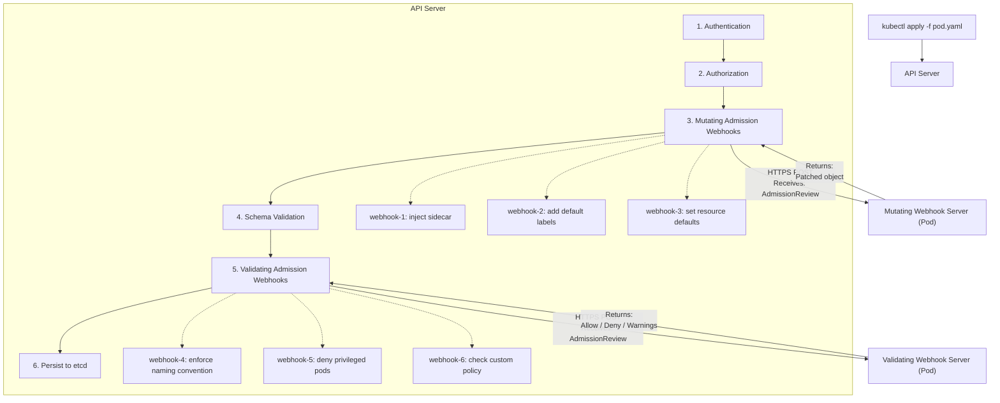
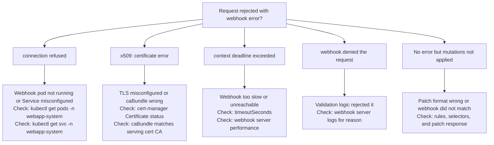

> **Complexity**: `[COMPLEX]` - Intercepting and modifying API requests
>
> **Time to Complete**: 4 hours
>
> **Prerequisites**: Module 1.1 (API Deep Dive), TLS/certificate basics

---

## What You'll Be Able to Do

After completing this module, you will be able to:

1. **Design** and implement a mutating admission webhook that injects sidecar containers, default labels, and resource defaults while remaining idempotent across retries and reinvocation.
2. **Evaluate** and construct a validating admission webhook that enforces custom policies such as image registry restrictions, naming conventions, and security constraints without surprising application teams.
3. **Implement** TLS certificate management, failure policies, namespace selectors, object selectors, match conditions, and timeout settings that keep admission enforcement reliable on Kubernetes 1.35 and newer clusters.
4. **Diagnose** webhook failures by reading admission errors, API server symptoms, webhook logs, certificate status, and dry-run behavior, then choosing the smallest safe remediation.

## Why This Module Matters

Hypothetical scenario: a platform team deploys a validating webhook to block Pods that use unapproved registries, and the policy works perfectly during normal business hours. Later, the webhook Deployment is drained onto a node that cannot reach its serving certificate Secret, the webhook endpoint disappears, and every new Pod creation that matches the webhook rules begins failing because the configuration uses `failurePolicy: Fail`. The application teams do not see a broken controller; they see ordinary `kubectl apply` commands rejected by the API server, because admission happens before the object ever reaches storage.

That scenario is not about an exotic Kubernetes bug. It is about the fact that admission webhooks sit directly in the request path for the Kubernetes API, after authentication and authorization but before persistence to etcd. A slow, unavailable, overbroad, or incorrectly trusted webhook can affect every matching `CREATE`, `UPDATE`, `DELETE`, or `CONNECT` operation in the cluster, so the same mechanism that gives you powerful governance can also create a large blast radius if it is treated like an ordinary application callback.

This module teaches admission webhooks as a control-plane design problem, not just as a code-generation exercise. You will compare mutating and validating behavior, inspect the `AdmissionReview` contract, use Kubebuilder-style webhook implementations for custom resources, reason through a standalone Pod sidecar injector, wire TLS with cert-manager, scope webhook matching, choose failure policies, and practice a debugging sequence that separates trust failures from network failures and policy denials.

The bouncer analogy is useful, but only if you keep the ordering precise. A validating webhook is like a bouncer who checks whether the request is allowed into the venue; it can say yes, say no, or return a warning, but it cannot change the object. A mutating webhook is more like a stylist at the same door; it can add a wristband, attach a label, or adjust the manifest before the bouncer sees it. Kubernetes runs mutating admission first and validating admission later, so validation always judges the final object after defaulting, patching, and reinvocation have had their chance to change it.

## Part 1: Webhook Architecture

Admission webhooks exist because the Kubernetes API needs extension points that are more flexible than built-in validation and less invasive than forking the API server. Authentication answers "who are you?", authorization answers "are you allowed to ask?", and admission answers "should this particular request be accepted in this cluster right now?" That last question needs cluster-specific context, such as namespace ownership, image registry rules, sidecar requirements, security defaults, and rollout guardrails that are not part of the generic Kubernetes schema.

The request path matters because admission webhooks are not background reconcilers. A controller can observe a stored object and repair it later, but a webhook participates in the synchronous API request. When a user submits a manifest, the API server calls matching webhooks over HTTPS, waits for responses, applies allowed mutations, evaluates validation decisions, and only then persists the final object. This is why webhook latency becomes API latency and webhook availability becomes API availability for matching requests.



The diagram shows three operational facts that are easy to miss when you first learn the feature. First, webhooks are called by the API server, not by `kubectl`, so the network path and trust chain must work from the control plane's perspective. Second, mutating webhooks can affect what validating webhooks later see, which means policy authors need to think about final state rather than original user input. Third, all of this happens before etcd, so a rejected request leaves no partially saved object behind.

Pause and predict: if a mutating webhook adds a required `team-owner` label and a validating webhook rejects objects without that label, what should happen when a user omits the label from the original manifest? The correct prediction is that the request can still be admitted if the mutating webhook matches, runs successfully, and adds the label before validation. If the mutation does not match because of a namespace selector or object selector, the validating webhook sees the unmodified object and should reject it.

The distinction between mutation and validation is partly about capability and partly about responsibility. Mutation is appropriate when the cluster can safely choose a default on the user's behalf, such as adding standard labels or injecting a sidecar when the user opted in. Validation is appropriate when the cluster must stop an unsafe or unsupported state, such as disallowing privileged containers or requiring a signed image registry. A webhook can both mutate and reject only if it is registered as mutating; a validating webhook must never rely on changing the object.

| Feature | Mutating | Validating |
|---------|----------|------------|
| Can modify the object | Yes, by returning JSON Patch | No, it returns allow, deny, and optional warnings |
| Can reject the request | Yes | Yes |
| Execution order | First, before final validation | Second, after all mutation passes finish |
| Typical use | Inject sidecars, set defaults, add labels | Enforce policies, naming rules, security rules |
| Repeat behavior | May be reinvoked when later mutations require another pass | Runs after mutation and does not patch the object |

Think of mutation as a contract to make the object more complete, not as permission to hide complexity from the user. If a sidecar injector adds a logging container, it should also be idempotent, add an annotation that explains what happened, and avoid touching namespaces where the platform itself is bootstrapping. If a defaulting webhook sets resources, it should choose conservative defaults and allow teams to override them when the custom resource model says overrides are valid.

The API contract between the API server and a webhook is `AdmissionReview`. The request includes a `uid` that the response must echo, the operation, the target resource, the namespace, the authenticated user information, the new object, and sometimes the old object. A validating webhook usually decodes the object and returns `allowed: true` or `allowed: false`; a mutating webhook returns `allowed: true` plus a base64-encoded JSON Patch and the patch type.

```json
{
  "apiVersion": "admission.k8s.io/v1",
  "kind": "AdmissionReview",
  "request": {
    "uid": "705ab4f5-6393-11e8-b7cc-42010a800002",
    "kind": {"group": "", "version": "v1", "kind": "Pod"},
    "resource": {"group": "", "version": "v1", "resource": "pods"},
    "namespace": "default",
    "operation": "CREATE",
    "userInfo": {
      "username": "admin",
      "groups": ["system:masters"]
    },
    "object": {
      "apiVersion": "v1",
      "kind": "Pod",
      "metadata": {"name": "my-pod", "namespace": "default"},
      "spec": {
        "containers": [{"name": "app", "image": "nginx:1.35"}]
      }
    },
    "oldObject": null
  }
}
```

The `userInfo` field is often the difference between a generic rule and a useful platform rule. For example, a policy can allow a break-glass group to create a privileged debug Pod in a controlled namespace while denying the same manifest from ordinary service accounts. Use that power carefully, because identity-aware exceptions become hard to reason about if they are scattered across webhook code, RBAC bindings, namespace labels, and out-of-band documentation.

```json
{
  "apiVersion": "admission.k8s.io/v1",
  "kind": "AdmissionReview",
  "response": {
    "uid": "705ab4f5-6393-11e8-b7cc-42010a800002",
    "allowed": true,
    "patchType": "JSONPatch",
    "patch": "W3sib3AiOiJhZGQiLCJwYXRoIjoiL3NwZWMvY29udGFpbmVycy8xIiwidmFsdWUiOnsi..."
  }
}
```

The response format also explains why webhook code should be boring and explicit. A malformed response is not just a failed HTTP call; it is a failed admission decision that may block the user's request. Your server should always return the same `apiVersion` and `kind`, echo the request UID, set `allowed`, include a clear denial message when rejecting, and avoid side effects unless the webhook declares and handles them correctly.

## Part 2: Implementing Webhooks with Kubebuilder

Kubebuilder is the usual starting point when the webhook belongs to a custom resource that you already manage with controller-runtime. It gives you typed Go structs, generated webhook manifests, test scaffolding, cert-manager overlays, and a manager that can serve the webhook endpoint alongside your controller. The main benefit is not that Kubebuilder hides admission; it is that it keeps admission logic close to the API type whose invariants you are enforcing.

For custom resources, defaulting and validation usually belong near the type definition because the rules are part of the API's contract. If `WebApp.spec.port` defaults to `8080`, that is not a controller preference; it is part of how the resource behaves when a user omits a field. If changing the port after creation is not supported, rejecting that update in admission gives users an immediate, clear error rather than letting a controller fail repeatedly after the object is already stored.

```bash
cd ~/extending-k8s/webapp-operator

# Create a defaulting mutating webhook.
kubebuilder create webhook --group apps --version v1beta1 --kind WebApp \
  --defaulting

# Create a validating webhook.
kubebuilder create webhook --group apps --version v1beta1 --kind WebApp \
  --validation

# Generated files:
# api/v1beta1/webapp_webhook.go          # webhook implementations
# api/v1beta1/webapp_webhook_test.go     # test scaffolding
# config/webhook/                        # webhook server config
# config/certmanager/                    # cert-manager integration
```

The generated defaulting hook feels simple because controller-runtime compares the object before and after your `Default` method and creates the patch for you. That simplicity is useful, but it also means your method must be deterministic. Do not set fields based on the current time, call out to another service, or append duplicate data every time the method runs. Admission may retry, and mutating webhooks can be reinvoked when another webhook changes the object later in the chain.

```go
// api/v1beta1/webapp_webhook.go
package v1beta1

import (
	"fmt"

	"k8s.io/apimachinery/pkg/runtime"
	ctrl "sigs.k8s.io/controller-runtime"
	logf "sigs.k8s.io/controller-runtime/pkg/log"
	"sigs.k8s.io/controller-runtime/pkg/webhook"
	"sigs.k8s.io/controller-runtime/pkg/webhook/admission"
)

var webapplog = logf.Log.WithName("webapp-webhook")

// SetupWebhookWithManager registers the webhooks with the manager.
func (r *WebApp) SetupWebhookWithManager(mgr ctrl.Manager) error {
	return ctrl.NewWebhookManagedBy(mgr).
		For(r).
		Complete()
}

// +kubebuilder:webhook:path=/mutate-apps-kubedojo-io-v1beta1-webapp,mutating=true,failurePolicy=fail,sideEffects=None,groups=apps.kubedojo.io,resources=webapps,verbs=create;update,versions=v1beta1,name=mwebapp.kb.io,admissionReviewVersions=v1

var _ webhook.Defaulter = &WebApp{}

// Default implements webhook.Defaulter.
// This is called for every CREATE and UPDATE of a WebApp.
func (r *WebApp) Default() {
	webapplog.Info("Applying defaults", "name", r.Name, "namespace", r.Namespace)

	// Set default replicas.
	if r.Spec.Replicas == nil {
		defaultReplicas := int32(2)
		r.Spec.Replicas = &defaultReplicas
		webapplog.Info("Set default replicas", "replicas", defaultReplicas)
	}

	// Set default port.
	if r.Spec.Port == 0 {
		r.Spec.Port = 8080
		webapplog.Info("Set default port", "port", 8080)
	}

	// Set default resource limits.
	if r.Spec.Resources == nil {
		r.Spec.Resources = &ResourceSpec{
			CPURequest:    "100m",
			CPULimit:      "500m",
			MemoryRequest: "128Mi",
			MemoryLimit:   "512Mi",
		}
		webapplog.Info("Set default resource limits")
	}

	// Ensure standard labels.
	if r.Labels == nil {
		r.Labels = make(map[string]string)
	}
	r.Labels["app.kubernetes.io/managed-by"] = "webapp-operator"
	r.Labels["app.kubernetes.io/part-of"] = r.Name

	// Ensure ingress path has a default.
	if r.Spec.Ingress != nil && r.Spec.Ingress.Path == "" {
		r.Spec.Ingress.Path = "/"
	}
}
```

The defaulting example deliberately avoids contacting the cluster, fetching a ConfigMap, or asking an external system for a decision. That design keeps the webhook fast, repeatable, and testable. If a default depends on mutable cluster state, consider whether the value belongs in a controller reconcile loop instead, because admission should make a narrow decision during an API request rather than perform broad orchestration.

Validation hooks should be strict about impossible states and generous about transitions that need a migration path. The `admission.Warnings` return value is useful because it lets you communicate that an accepted object uses a discouraged pattern. Warnings are not a substitute for policy, but they are a practical way to prepare teams before you convert a soft rule into a hard denial.

```go
// +kubebuilder:webhook:path=/validate-apps-kubedojo-io-v1beta1-webapp,mutating=false,failurePolicy=fail,sideEffects=None,groups=apps.kubedojo.io,resources=webapps,verbs=create;update;delete,versions=v1beta1,name=vwebapp.kb.io,admissionReviewVersions=v1

var _ webhook.Validator = &WebApp{}

// ValidateCreate implements webhook.Validator.
func (r *WebApp) ValidateCreate() (admission.Warnings, error) {
	webapplog.Info("Validating create", "name", r.Name)

	var warnings admission.Warnings

	if r.Spec.Image == "" {
		return warnings, fmt.Errorf("image must not be empty")
	}

	if isLatestTag(r.Spec.Image) {
		warnings = append(warnings,
			"Using ':latest' tag is not recommended for production. "+
				"Consider pinning to a specific version.")
	}

	if r.Spec.Replicas != nil && *r.Spec.Replicas > 50 {
		warnings = append(warnings,
			fmt.Sprintf("High replica count (%d). Ensure your cluster has sufficient resources.",
				*r.Spec.Replicas))
	}

	if r.Spec.Ingress != nil && r.Spec.Ingress.TLSEnabled && r.Spec.Ingress.Host == "" {
		return warnings, fmt.Errorf(
			"ingress.host is required when ingress.tlsEnabled is true")
	}

	if err := validateName(r.Name); err != nil {
		return warnings, err
	}

	return warnings, nil
}

// ValidateUpdate implements webhook.Validator.
func (r *WebApp) ValidateUpdate(old runtime.Object) (admission.Warnings, error) {
	webapplog.Info("Validating update", "name", r.Name)

	oldWebApp := old.(*WebApp)
	var warnings admission.Warnings

	if oldWebApp.Spec.Port != 0 && r.Spec.Port != oldWebApp.Spec.Port {
		return warnings, fmt.Errorf(
			"port cannot be changed after creation (was %d, attempting %d). "+
				"Delete and recreate the WebApp to change the port",
			oldWebApp.Spec.Port, r.Spec.Port)
	}

	oldReplicas := int32(2)
	if oldWebApp.Spec.Replicas != nil {
		oldReplicas = *oldWebApp.Spec.Replicas
	}
	newReplicas := int32(2)
	if r.Spec.Replicas != nil {
		newReplicas = *r.Spec.Replicas
	}

	diff := newReplicas - oldReplicas
	if diff < 0 {
		diff = -diff
	}
	if diff > 10 {
		warnings = append(warnings,
			fmt.Sprintf("Large scaling change: %d -> %d replicas. "+
				"Consider gradual scaling.", oldReplicas, newReplicas))
	}

	return warnings, nil
}

// ValidateDelete implements webhook.Validator.
func (r *WebApp) ValidateDelete() (admission.Warnings, error) {
	webapplog.Info("Validating delete", "name", r.Name)

	if r.Annotations != nil && r.Annotations["apps.kubedojo.io/prevent-deletion"] == "true" {
		return nil, fmt.Errorf(
			"WebApp %s has deletion protection enabled. "+
				"Remove the 'apps.kubedojo.io/prevent-deletion' annotation first",
			r.Name)
	}

	return nil, nil
}

func isLatestTag(image string) bool {
	if len(image) == 0 {
		return false
	}
	lastColon := -1
	lastSlash := -1
	for i, c := range image {
		if c == ':' {
			lastColon = i
		}
		if c == '/' {
			lastSlash = i
		}
	}
	if lastColon <= lastSlash {
		return true
	}
	tag := image[lastColon+1:]
	return tag == "latest"
}

func validateName(name string) error {
	if len(name) > 40 {
		return fmt.Errorf("name must be 40 characters or fewer (got %d)", len(name))
	}
	return nil
}
```

Before running this, what output do you expect if a user creates a `WebApp` with no image, TLS enabled ingress, and no ingress host? The empty image check should fail first because the function returns an error immediately, which means later checks do not run for that request. That ordering is acceptable when the first error is clear, but if you want users to fix several fields at once, you can accumulate validation errors and return a combined message.

The manager registration is small, but it is operationally important. Many teams generate webhook files and forget that the manager must actually serve them. The `ENABLE_WEBHOOKS` guard is also useful in tests and local controller development because it lets you run the controller without binding a webhook server or mounting certificates.

```go
// After setting up the controller.
if os.Getenv("ENABLE_WEBHOOKS") != "false" {
    if err = (&appsv1beta1.WebApp{}).SetupWebhookWithManager(mgr); err != nil {
        setupLog.Error(err, "unable to create webhook", "webhook", "WebApp")
        os.Exit(1)
    }
}
```

Kubebuilder is not mandatory, and it is not the right fit for every admission problem. It shines when the webhook belongs to a controller project and a typed API, but cluster-wide Pod injection, cross-resource governance, and third-party policy engines often use standalone servers or dedicated frameworks. The next section keeps the same `AdmissionReview` contract but removes the Kubebuilder convenience layer so you can see the patch mechanics directly.

## Part 3: Custom Webhook Server Without Kubebuilder

A standalone webhook server is just an HTTPS endpoint that accepts `AdmissionReview` objects and returns `AdmissionReview` decisions. That plain description is empowering because it means you can implement a webhook in any language that can parse JSON, serve TLS, and keep latency low. It is also sobering because the server must handle malformed input, nil request objects, concurrent calls, graceful shutdown, health checks, and Kubernetes object semantics without the guardrails that controller-runtime usually provides.

Standalone mutating webhooks are common for sidecar injection because the target resource is often a built-in Pod rather than one custom resource. Service mesh injectors, logging agents, security shims, and local development tools all follow this pattern: match a Pod creation request, decide whether injection is appropriate, and return a JSON Patch that appends a container or modifies metadata. The patch must be idempotent, because retries and reinvocation should never create duplicate sidecars.

```go
// cmd/sidecar-injector/main.go
package main

import (
	"context"
	"encoding/json"
	"fmt"
	"net/http"
	"os"
	"os/signal"
	"syscall"

	admissionv1 "k8s.io/api/admission/v1"
	corev1 "k8s.io/api/core/v1"
	metav1 "k8s.io/apimachinery/pkg/apis/meta/v1"
	"k8s.io/apimachinery/pkg/api/resource"
	"k8s.io/apimachinery/pkg/types"
	"k8s.io/klog/v2"
)

const (
	sidecarImage = "busybox:1.35.0"
	sidecarName  = "logging-sidecar"
	certFile     = "/etc/webhook/certs/tls.crt"
	keyFile      = "/etc/webhook/certs/tls.key"
)

type jsonPatchEntry struct {
	Op    string      `json:"op"`
	Path  string      `json:"path"`
	Value interface{} `json:"value,omitempty"`
}

func handleMutate(w http.ResponseWriter, r *http.Request) {
	klog.V(2).Info("Received admission request")

	var admissionReview admissionv1.AdmissionReview
	if err := json.NewDecoder(r.Body).Decode(&admissionReview); err != nil {
		klog.Errorf("Failed to decode request: %v", err)
		http.Error(w, err.Error(), http.StatusBadRequest)
		return
	}

	request := admissionReview.Request
	if request == nil {
		http.Error(w, "admission review request is required", http.StatusBadRequest)
		return
	}
	klog.Infof("Processing %s %s/%s by %s",
		request.Operation, request.Namespace, request.Name,
		request.UserInfo.Username)

	var pod corev1.Pod
	if err := json.Unmarshal(request.Object.Raw, &pod); err != nil {
		sendResponse(w, request.UID, false, fmt.Sprintf("Failed to decode pod: %v", err))
		return
	}

	if !shouldInject(&pod) {
		klog.Infof("Skipping injection for %s/%s", pod.Namespace, pod.Name)
		sendResponse(w, request.UID, true, "")
		return
	}

	for _, c := range pod.Spec.Containers {
		if c.Name == sidecarName {
			klog.Infof("Sidecar already present in %s/%s", pod.Namespace, pod.Name)
			sendResponse(w, request.UID, true, "")
			return
		}
	}

	sidecar := corev1.Container{
		Name:  sidecarName,
		Image: sidecarImage,
		Command: []string{
			"/bin/sh", "-c",
			"while true; do echo '[sidecar] heartbeat'; sleep 30; done",
		},
		Resources: corev1.ResourceRequirements{
			Limits: corev1.ResourceList{
				corev1.ResourceCPU:    resource.MustParse("50m"),
				corev1.ResourceMemory: resource.MustParse("64Mi"),
			},
			Requests: corev1.ResourceList{
				corev1.ResourceCPU:    resource.MustParse("10m"),
				corev1.ResourceMemory: resource.MustParse("32Mi"),
			},
		},
	}

	patches := []jsonPatchEntry{
		{
			Op:    "add",
			Path:  "/spec/containers/-",
			Value: sidecar,
		},
		{
			Op:    "add",
			Path:  "/metadata/annotations/sidecar.kubedojo.io~1injected",
			Value: "true",
		},
	}

	patchBytes, err := json.Marshal(patches)
	if err != nil {
		sendResponse(w, request.UID, false, fmt.Sprintf("Failed to marshal patch: %v", err))
		return
	}

	klog.Infof("Injecting sidecar into %s/%s", pod.Namespace, pod.Name)
	sendPatchResponse(w, request.UID, patchBytes)
}

func shouldInject(pod *corev1.Pod) bool {
	annotations := pod.GetAnnotations()
	if annotations == nil {
		return false
	}
	return annotations["sidecar.kubedojo.io/inject"] == "true"
}

func sendResponse(w http.ResponseWriter, uid types.UID, allowed bool, message string) {
	response := admissionv1.AdmissionReview{
		TypeMeta: metav1.TypeMeta{
			APIVersion: "admission.k8s.io/v1",
			Kind:       "AdmissionReview",
		},
		Response: &admissionv1.AdmissionResponse{
			UID:     uid,
			Allowed: allowed,
		},
	}
	if !allowed && message != "" {
		response.Response.Result = &metav1.Status{
			Message: message,
		}
	}

	w.Header().Set("Content-Type", "application/json")
	json.NewEncoder(w).Encode(response)
}

func sendPatchResponse(w http.ResponseWriter, uid types.UID, patch []byte) {
	patchType := admissionv1.PatchTypeJSONPatch
	response := admissionv1.AdmissionReview{
		TypeMeta: metav1.TypeMeta{
			APIVersion: "admission.k8s.io/v1",
			Kind:       "AdmissionReview",
		},
		Response: &admissionv1.AdmissionResponse{
			UID:       uid,
			Allowed:   true,
			PatchType: &patchType,
			Patch:     patch,
		},
	}

	w.Header().Set("Content-Type", "application/json")
	json.NewEncoder(w).Encode(response)
}

func main() {
	klog.InitFlags(nil)

	mux := http.NewServeMux()
	mux.HandleFunc("/mutate", handleMutate)
	mux.HandleFunc("/healthz", func(w http.ResponseWriter, r *http.Request) {
		w.WriteHeader(http.StatusOK)
		w.Write([]byte("ok"))
	})

	server := &http.Server{
		Addr:    ":8443",
		Handler: mux,
	}

	go func() {
		sigCh := make(chan os.Signal, 1)
		signal.Notify(sigCh, syscall.SIGINT, syscall.SIGTERM)
		<-sigCh
		klog.Info("Shutting down webhook server")
		server.Shutdown(context.Background())
	}()

	klog.Infof("Starting webhook server on :8443")
	if err := server.ListenAndServeTLS(certFile, keyFile); err != http.ErrServerClosed {
		klog.Fatalf("Failed to start server: %v", err)
	}
}
```

The important patch detail is the `/spec/containers/-` path. In JSON Patch, the trailing dash means "append to the array," which is safer than guessing a numeric index. The annotation path uses `~1` because JSON Pointer escapes `/` as `~1`; without that escaping, the API server would interpret the annotation key as multiple nested path segments and the patch would fail even though the Go object looked correct.

Idempotency is the difference between a useful injector and an outage generator. The example checks whether the sidecar already exists before building the patch, and it only injects when the user explicitly sets `sidecar.kubedojo.io/inject: "true"`. In production, you would also exclude system namespaces, avoid injecting into Pods that set `hostNetwork` if the sidecar cannot handle it, and test reinvocation with other mutating webhooks that might add containers or security contexts.

Which approach would you choose here and why: should the injector default to opt-in by annotation, opt-in by namespace label, or opt-out by annotation? For a learning lab, annotation opt-in is clearest because one manifest controls the outcome. For a platform feature, namespace opt-in often scales better because a team can enable injection for a workload boundary. Opt-out by annotation is powerful but risky, because a webhook outage or misconfiguration can surprise every namespace that matches the broad rule.

## Part 4: TLS and cert-manager

The API server calls webhooks over HTTPS and must trust the serving certificate presented by the webhook endpoint. That requirement is not optional decoration; it protects the control plane from sending admission objects, including user identity and object contents, to an endpoint that cannot prove its identity. A valid webhook setup therefore needs a serving certificate mounted into the webhook Pod and a `caBundle` in the webhook configuration so the API server can verify the certificate chain.

This trust model often confuses learners because the webhook Service is internal to the cluster. Internal does not mean trusted. The API server still performs a TLS handshake against the Service DNS name, and the certificate must contain names such as `webapp-webhook-service.webapp-system.svc` and `webapp-webhook-service.webapp-system.svc.cluster.local`. If the certificate names, Secret mount, Service name, namespace, or `caBundle` do not line up, the request fails before your handler code ever sees an `AdmissionReview`.

cert-manager is the practical choice for most clusters because it automates certificate issuance and renewal, and its CA injector can keep webhook configuration `caBundle` fields synchronized. The install command below pins a current cert-manager release that supports Kubernetes 1.35. Always check the cert-manager supported releases page before copying a version into production automation, because cert-manager version numbers do not track Kubernetes minor versions.

```bash
# Install cert-manager.
kubectl apply -f https://github.com/cert-manager/cert-manager/releases/download/v1.20.2/cert-manager.yaml

# Wait for it to be ready.
kubectl wait --for=condition=Available deployment -n cert-manager --all --timeout=120s
```

The simplest lab issuer is self-signed, which is fine for a controlled exercise but not a general enterprise PKI strategy. In a real organization, you might use a CA issuer, Vault issuer, ACME issuer for public endpoints, or another internal trust source that matches your security model. The webhook only cares that the certificate can be mounted by the server and trusted by the API server through the injected bundle.

```yaml
# config/certmanager/issuer.yaml
apiVersion: cert-manager.io/v1
kind: Issuer
metadata:
  name: webapp-selfsigned-issuer
  namespace: webapp-system
spec:
  selfSigned: {}
```

The `Certificate` resource binds identity to DNS names. If you later rename the Service, move the webhook to another namespace, or change from one Service name to another, you must update the certificate names and let cert-manager issue a replacement. Many webhook failures that look like mysterious `x509` errors are simply name mismatches between `clientConfig.service` and the certificate's subject alternative names.

```yaml
# config/certmanager/certificate.yaml
apiVersion: cert-manager.io/v1
kind: Certificate
metadata:
  name: webapp-webhook-cert
  namespace: webapp-system
spec:
  secretName: webapp-webhook-tls
  duration: 8760h
  renewBefore: 720h
  issuerRef:
    name: webapp-selfsigned-issuer
    kind: Issuer
  dnsNames:
  - webapp-webhook-service.webapp-system.svc
  - webapp-webhook-service.webapp-system.svc.cluster.local
```

Manual certificates still matter for understanding the moving parts and for isolated development environments. The OpenSSL flow creates a small CA, issues a server certificate for the webhook Service DNS names, stores the certificate as a Kubernetes TLS Secret, and prepares the CA bundle for insertion into a webhook configuration. Use it to learn the mechanics, then automate certificate lifecycle before relying on the webhook in a shared cluster.

```bash
# Generate CA.
openssl genrsa -out ca.key 2048
openssl req -new -x509 -days 365 -key ca.key -out ca.crt -subj "/CN=webapp-webhook-ca"

# Generate server certificate.
openssl genrsa -out server.key 2048
openssl req -new -key server.key -out server.csr \
  -subj "/CN=webapp-webhook-service.webapp-system.svc" \
  -config <(cat /etc/ssl/openssl.cnf <(printf "\n[SAN]\nsubjectAltName=DNS:webapp-webhook-service.webapp-system.svc,DNS:webapp-webhook-service.webapp-system.svc.cluster.local"))

openssl x509 -req -days 365 -in server.csr -CA ca.crt -CAkey ca.key \
  -CAcreateserial -out server.crt \
  -extensions SAN \
  -extfile <(cat /etc/ssl/openssl.cnf <(printf "\n[SAN]\nsubjectAltName=DNS:webapp-webhook-service.webapp-system.svc,DNS:webapp-webhook-service.webapp-system.svc.cluster.local"))

# Create the TLS secret.
kubectl create secret tls webapp-webhook-tls \
  --cert=server.crt --key=server.key \
  -n webapp-system

# Base64 encode CA for webhook config.
CA_BUNDLE=$(base64 < ca.crt | tr -d '\n')
```

The webhook configuration is where TLS trust, request matching, timeout behavior, failure behavior, and endpoint routing come together. With cert-manager CA injection, the `cert-manager.io/inject-ca-from` annotation points to the `Certificate`, and cert-manager populates the `caBundle` field for you. That automation reduces drift, but it does not remove the need to verify that the Service, path, port, and certificate names agree.

```yaml
# mutating-webhook.yaml
apiVersion: admissionregistration.k8s.io/v1
kind: MutatingWebhookConfiguration
metadata:
  name: webapp-mutating-webhook
  annotations:
    cert-manager.io/inject-ca-from: webapp-system/webapp-webhook-cert
webhooks:
- name: mwebapp.kubedojo.io
  admissionReviewVersions: ["v1"]
  sideEffects: None
  failurePolicy: Fail
  clientConfig:
    service:
      name: webapp-webhook-service
      namespace: webapp-system
      path: /mutate
      port: 443
    # caBundle is auto-injected by cert-manager.
  rules:
  - apiGroups: ["apps.kubedojo.io"]
    apiVersions: ["v1beta1"]
    operations: ["CREATE", "UPDATE"]
    resources: ["webapps"]
  namespaceSelector:
    matchExpressions:
    - key: kubernetes.io/metadata.name
      operator: NotIn
      values: ["kube-system", "kube-public"]
```

Validating webhook configuration looks similar, but the endpoint path and policy intent are different. The API server does not infer behavior from the endpoint name; it follows the registration object. If you accidentally set `mutating: false` in generated annotations but point to a mutate handler, the API server will not apply patches because a validating webhook response cannot mutate the object. Treat the registration as part of the API contract and review it as carefully as the Go code.

```yaml
# validating-webhook.yaml
apiVersion: admissionregistration.k8s.io/v1
kind: ValidatingWebhookConfiguration
metadata:
  name: webapp-validating-webhook
  annotations:
    cert-manager.io/inject-ca-from: webapp-system/webapp-webhook-cert
webhooks:
- name: vwebapp.kubedojo.io
  admissionReviewVersions: ["v1"]
  sideEffects: None
  failurePolicy: Fail
  clientConfig:
    service:
      name: webapp-webhook-service
      namespace: webapp-system
      path: /validate
      port: 443
  rules:
  - apiGroups: ["apps.kubedojo.io"]
    apiVersions: ["v1beta1"]
    operations: ["CREATE", "UPDATE", "DELETE"]
    resources: ["webapps"]
```

## Part 5: Failure Policies and Matching

Failure policy is the most visible reliability decision in admission webhook design. `Fail` means the API server rejects matching requests when the webhook cannot be reached, returns an error, or times out. `Ignore` means the API server lets the request continue without that webhook's decision. Neither value is universally correct; the right choice depends on whether the webhook is a security boundary, a convenience feature, or a migration tool.

Use `Fail` when admitting the object without the webhook would violate a hard safety guarantee, such as allowing untrusted images, bypassing Pod security requirements, or creating custom resources that the controller cannot support. Use `Ignore` when the webhook improves the object but should not block the cluster, such as optional sidecar injection, best-effort labeling, or warning-only enrichment. The design question is not "which option is safer?" but "which failure mode creates the smaller incident for this policy?"

| Policy | Behavior | Use When |
|--------|----------|----------|
| `Fail` | Matching request is rejected if the webhook call fails | Security-critical webhooks, strict API invariants, unsupported state prevention |
| `Ignore` | Matching request continues without that webhook decision | Optional mutation, migration warnings, best-effort enrichment |

```yaml
webhooks:
- name: security-policy.kubedojo.io
  failurePolicy: Fail
  timeoutSeconds: 5

- name: sidecar-injector.kubedojo.io
  failurePolicy: Ignore
  timeoutSeconds: 3
```

Pause and predict: you maintain two webhooks, one enforcing that images only come from a private registry and another injecting a monitoring sidecar. If the webhook server goes down, which failure policy should each use? The registry enforcer should usually fail closed because admitting arbitrary registries changes the security boundary. The monitoring sidecar should usually fail open because blocking all new application Pods during a monitoring outage creates a wider operational failure than temporarily missing a sidecar on new Pods.

Matching is the second half of reliability. A broad webhook rule increases API server work, creates more chances for accidental denial, and makes outage blast radius larger. Use `rules` to limit resources and operations, `namespaceSelector` to avoid system namespaces and select participating teams, `objectSelector` to match opt-in labels, and `matchConditions` when Kubernetes-native CEL expressions can describe the exact request shape.

```yaml
webhooks:
- name: mwebapp.kubedojo.io
  rules:
  - apiGroups: [""]
    apiVersions: ["v1"]
    operations: ["CREATE"]
    resources: ["pods"]
    scope: "Namespaced"

  namespaceSelector:
    matchLabels:
      webhook: enabled

  objectSelector:
    matchLabels:
      inject-sidecar: "true"

  timeoutSeconds: 10
  reinvocationPolicy: IfNeeded
```

`reinvocationPolicy: IfNeeded` is specific to mutating webhooks and is often misunderstood. Kubernetes may call a mutating webhook again if another mutating webhook changed the object after it ran and the earlier webhook might need to see the new state. This does not give you a stable ordering guarantee, and it does not excuse non-idempotent code. It is a safety valve for cooperative mutation, not a scheduling system for webhook dependencies.

Match conditions give you another way to reduce unnecessary calls by evaluating CEL expressions in the API server before the webhook is invoked. They are useful when labels and namespace selectors are not expressive enough, such as excluding `kube-` namespaces or only validating objects with a specific annotation. Keep match conditions readable, because a future incident responder should be able to understand why a request did or did not call the webhook.

```yaml
webhooks:
- name: vwebapp.kubedojo.io
  matchConditions:
  - name: "not-system-namespace"
    expression: "!request.namespace.startsWith('kube-')"
  - name: "has-annotation"
    expression: "object.metadata.annotations['validate'] == 'true'"
```

Matching choices should also be reviewed as part of change management, not only as code. If a team changes a namespace label that controls webhook participation, that label change can alter admission behavior for every workload in the namespace even though no webhook manifest changed. For that reason, mature platforms treat opt-in labels as part of the namespace contract, restrict who can change them, and include them in onboarding documentation. The goal is to make admission behavior predictable from the namespace metadata rather than hidden in a cluster-scoped object that application teams rarely inspect.

Timeouts deserve the same explicit ownership. A long timeout may feel safer because it gives the webhook more time to answer, but it also extends the time every matching API request can be stalled. A very short timeout reduces stall time but may create noisy intermittent failures if the webhook performs heavy decoding, logging, or remote calls. Start with a small value, measure admission latency under load, and then tune based on observed request behavior instead of copying the default into every configuration.

Kubernetes also offers ValidatingAdmissionPolicy, which uses CEL expressions for many validation cases without requiring a webhook server. That feature is not a drop-in replacement for every webhook, because it cannot call external systems or perform arbitrary mutation, but it is often the better answer for simple field checks. If your policy is "deny Pods without a label" or "deny images outside a pattern," evaluate CEL-based validation before deciding to own an HTTPS service in the control-plane request path.

There is also a social reason to prefer the simplest enforcement mechanism that works. A webhook is usually owned by a platform or security team, while the workloads it affects are owned by many application teams. When a denial happens, the user sees an API error during their deployment, not a ticket explaining your design history. The closer a rule is to native Kubernetes schema, CEL policy, or well-documented namespace configuration, the easier it is for users to predict and correct their own mistakes without waiting for a platform engineer.

## Part 6: Debugging Webhooks

Webhook debugging works best when you separate the failure into one of four categories: the API server did not match the webhook, the API server could not reach the webhook, the API server did not trust the webhook, or the webhook deliberately denied the request. The client-side error often compresses these categories into one unpleasant message, so your job is to restore the path one segment at a time instead of changing random YAML until the request succeeds.



Start with the registration object because it determines whether the API server even tries to call the server. Confirm the `rules`, operations, API groups, versions, resources, scope, selectors, match conditions, `failurePolicy`, `timeoutSeconds`, `sideEffects`, and `admissionReviewVersions`. A perfectly healthy webhook Pod cannot mutate a Pod if the webhook only matches a custom resource, and a perfect patch response is irrelevant if the namespace selector excludes the namespace you are testing.

Then inspect the server path from inside the cluster. The API server's network perspective is not identical to your laptop's perspective, so a local `curl` to a port-forward proves less than many people think. A temporary debug Pod that curls the Service DNS name can reveal missing Endpoints, wrong Service ports, readiness failures, and TLS name issues. Pair that network test with webhook server logs and cert-manager certificate status so you can tell whether the request reached your handler.

```bash
# Check webhook configurations.
kubectl get mutatingwebhookconfigurations
kubectl get validatingwebhookconfigurations
kubectl describe mutatingwebhookconfiguration webapp-mutating-webhook

# Check webhook pod logs.
kubectl logs -n webapp-system -l app=webapp-webhook -f

# Check cert-manager certificate status.
kubectl get certificate -n webapp-system
kubectl describe certificate webapp-webhook-cert -n webapp-system

# Check the TLS secret.
kubectl get secret webapp-webhook-tls -n webapp-system -o yaml

# Test webhook connectivity from inside the cluster.
URL="https://webapp-webhook-service"
URL+=".webapp-system.svc:443/healthz"
kubectl run test-curl --rm -it --image=curlimages/curl --restart=Never -- \
  curl -vk "$URL"

# Check API Server logs for webhook errors if you have access.
kubectl logs -n kube-system kube-apiserver-control-plane | grep webhook
```

Dry-run is one of the safest tools for admission testing, but it only works correctly when webhooks declare `sideEffects: None` or `NoneOnDryRun` as appropriate. A dry-run request still exercises admission, so it can reveal validation denials and mutation patches without storing the object. If dry-run fails because the webhook declares side effects incorrectly, fix the declaration or the webhook behavior before relying on it in CI validation.

Hypothetical scenario: a Pod with the injection annotation is accepted, but the sidecar is not present. The first thing to check is not the Go patch code; it is whether the mutating webhook matched the request at all. Inspect namespace labels, object labels, operation rules, API version, and the webhook's logs. If logs show the request and the response includes a patch, then inspect the patch path and response envelope. If logs show nothing, the problem is matching or connectivity rather than mutation logic.

A second useful debugging habit is to compare a matched positive case, an unmatched negative case, and a deliberately denied case. The positive case proves the webhook path works end to end, the negative case proves selectors limit the blast radius, and the denied case proves users receive an actionable message. Running only the happy path can hide dangerous overmatching, while running only denied requests can make a healthy webhook look broken. Admission systems are easiest to trust when you can explain all three outcomes.

Logging should be structured around the admission UID, operation, namespace, name, resource, and decision. Avoid logging entire object payloads by default because admission requests can include sensitive configuration, but do log enough metadata to correlate API server errors with webhook decisions. When a user reports a denial, you want to find the matching webhook log line quickly, confirm whether the request reached the server, and see the exact reason returned. Without that correlation, teams often waste time debugging certificates or Services for a denial that was actually policy logic working as written.

Metrics complete the picture that logs cannot provide alone. Track request count, allow count, deny count, warning count, latency, timeout count, and response errors for each webhook endpoint. These metrics tell you whether a rollout changed traffic volume, whether a new rule is denying more than expected, and whether latency is creeping toward `timeoutSeconds`. Because admission latency becomes API latency, alerting on webhook tail latency is more useful than alerting only when the Deployment has zero ready replicas.

Upgrade windows deserve dedicated admission testing. Kubernetes upgrades can change API server behavior, cert-manager upgrades can rotate certificates, and application platform upgrades can introduce new webhooks that interact with existing mutators. Before and after an upgrade, run server-side dry-run requests that should be allowed, denied, mutated, and ignored by selectors. This gives you a compact regression suite for the admission path and catches the kind of failure where every component is healthy in isolation but the composed request path is not.

## Patterns & Anti-Patterns

Admission webhook patterns are really blast-radius management patterns. The code that decides whether to admit a request may be small, but it is attached to the API server, so mature designs assume retries, upgrades, certificate renewal, node drains, apiserver restarts, and multiple platform teams adding their own webhooks over time. A webhook that works in a demo is only the first milestone; a webhook that can fail predictably is the production target.

| Pattern | When to Use It | Why It Works | Scaling Considerations |
|---------|----------------|--------------|------------------------|
| Narrow matching by resource, operation, namespace, and object | The webhook applies to a specific workload class or team boundary | The API server avoids unnecessary calls, and outages affect fewer requests | Keep selectors documented and test both matched and unmatched objects |
| Idempotent mutation with explicit markers | The webhook adds labels, annotations, sidecars, env vars, or defaults | Retries and reinvocation do not duplicate state or create conflicting patches | Add tests for already-mutated objects and for interaction with other mutators |
| High availability with short timeouts | The webhook enforces important policy in shared clusters | Multiple replicas and small timeouts reduce control-plane stalls | Spread replicas across nodes and monitor latency percentiles, not only uptime |
| Warning-first rollout for new validation | A policy is correct but existing workloads need migration time | Developers see feedback before the policy becomes a hard denial | Track warnings and publish the enforcement date in release notes |

Anti-patterns often begin as shortcuts that seem harmless in a development cluster. A broad webhook feels easier than designing selectors, `failurePolicy: Fail` feels safer than debating risk, and external lookups feel convenient when policy depends on a registry or ticketing system. In production, those shortcuts can turn ordinary dependency failures into API request failures, so each anti-pattern needs a better default.

| Anti-Pattern | What Goes Wrong | Better Alternative |
|--------------|-----------------|--------------------|
| Matching every Pod in every namespace | System components, installers, and unrelated teams inherit the webhook's outage risk | Exclude system namespaces and require namespace or object opt-in |
| Calling slow external services during admission | API requests wait on network dependencies outside the cluster | Cache policy data locally or use a controller to prepare in-cluster state |
| Non-idempotent JSON patches | Retries create duplicate containers, duplicate env vars, or conflicting annotations | Check existing state before patching and mark successful mutation |
| Using `Ignore` for hard security boundaries | Attackers or accidents can bypass policy during webhook outages | Use `Fail`, high availability, alerting, and a tested break-glass path |

The strongest practical pattern is to design every webhook with a retirement path. Some validation should move into CRD schemas, some simple rules should move into ValidatingAdmissionPolicy, and some defaulting should move into native API defaults when the platform matures. If the webhook has a narrow purpose and a clear owner, you can later replace it without rediscovering hidden policy dependencies across the cluster.

Another pattern is to stage enforcement with increasingly strict scopes. Begin in a development namespace, expand to a labeled pilot namespace, then expand to a track or environment only after you have observed warnings, denials, latency, and support tickets. The staged rollout is not bureaucracy; it is how you learn whether the policy describes real workload behavior. Admission rules often encode assumptions about image tags, labels, ownership, and update patterns, and those assumptions become visible only when real teams try to deploy through the gate.

Treat webhook manifests as production API surface, not generated leftovers. Generated names, paths, and annotations are easy to accept without review, but the cluster reads those fields as the source of truth. A small change to `resources`, `operations`, or `failurePolicy` can alter the behavior of thousands of future API requests. Put webhook configurations through the same review discipline as RBAC and NetworkPolicy: explain the actor, the resource, the condition, the failure mode, and the rollback plan in terms that an operator can verify during an incident.

## Decision Framework

Choosing an admission strategy starts with the type of decision you need to make. If the API schema can express the rule, use schema validation because it is fast, local, and versioned with the resource. If a CEL expression can express the validation against the request and object, evaluate ValidatingAdmissionPolicy before writing a webhook. If you must change the object, call external logic, inspect complex identity context, or coordinate custom behavior for built-in resources, a webhook may be justified.

```text
Need to change the incoming object?
  -> Yes: consider mutating webhook, then design idempotency and reinvocation tests.
  -> No: continue.

Can CRD schema or built-in Kubernetes validation express the rule?
  -> Yes: use schema or native validation.
  -> No: continue.

Can CEL ValidatingAdmissionPolicy express the rule without external calls?
  -> Yes: prefer CEL policy for lower operational burden.
  -> No: continue.

Does the rule require external state, custom code, or complex identity decisions?
  -> Yes: use a validating webhook with narrow matching and explicit failure policy.
  -> No: simplify the policy before adding admission infrastructure.
```

| Requirement | Best Fit | Reasoning |
|-------------|----------|-----------|
| Default missing fields on a custom resource | Kubebuilder mutating webhook | The rule belongs to the API type and can be tested with typed objects |
| Deny Pods that lack a required label | ValidatingAdmissionPolicy or validating webhook | Prefer CEL if the expression is simple and no external lookup is needed |
| Inject a sidecar into opted-in Pods | Mutating webhook | The object must be changed before persistence |
| Prevent unsupported immutable updates | Validating webhook or CRD validation | Use schema when possible; use webhook when comparing old and new objects needs code |
| Enforce registry allowlists with signed metadata | Validating webhook | The decision may require custom parsing, cache state, or identity-aware exceptions |

The framework is intentionally conservative because admission webhooks carry an operational tax. You must serve TLS, handle upgrades, maintain certificates, watch latency, document matching, test failure policy, and keep the code compatible with Kubernetes API changes. When the policy truly needs a webhook, that cost is worth paying. When a simpler Kubernetes-native mechanism can express the same rule, choosing the simpler mechanism is usually the more reliable platform decision.

Use this decision process again whenever a webhook grows. A webhook that began as one clear validation can slowly accumulate unrelated rules because the server already exists and the team knows how to deploy it. That convenience creates hidden coupling: one certificate, one Deployment, one failure policy, and one latency budget now cover several independent policies. If two rules have different owners, failure modes, or rollout schedules, they may deserve separate webhooks or a different enforcement mechanism even if they share implementation language.

Finally, include user experience in the decision. A denial message should identify the rejected field, explain the policy in cluster terms, and tell the user the next valid action. "Denied by webhook" is not a useful error, and neither is a message that only a platform maintainer can decode. Good admission design turns the API server into a precise feedback point; poor admission design turns it into a mysterious wall between developers and their workloads.

## Did You Know?

1. Kubernetes admission webhooks use `AdmissionReview` in the `admission.k8s.io/v1` API group, and `admissionReviewVersions` lets a webhook configuration declare which review versions it can handle.
2. The API server caps webhook `timeoutSeconds` at 30 seconds, which protects the control plane from waiting indefinitely on a slow external admission endpoint.
3. ValidatingAdmissionPolicy reached stable status in Kubernetes 1.30, making CEL-based validation a production-ready alternative for many rules that previously required validating webhooks.
4. cert-manager v1.20 lists support for Kubernetes 1.35, which is why the lab pins cert-manager v1.20.2 instead of assuming cert-manager versions follow Kubernetes minor numbers.

## Common Mistakes

| Mistake | Why It Happens | How to Fix It |
|---------|----------------|---------------|
| Missing TLS certificate | The webhook server starts without the Secret mounted or the certificate has not been issued yet | Mount the correct TLS Secret, check cert-manager `Certificate` status, and gate readiness on certificate availability |
| Wrong `caBundle` | The API server receives a certificate signed by a CA it does not trust | Use cert-manager CA injection or manually populate `caBundle` from the issuing CA, not the leaf certificate |
| Wrong Service name or namespace | The webhook configuration points at an endpoint that has no backing Service or Endpoints | Match `clientConfig.service.name`, namespace, port, and certificate DNS names exactly |
| Missing `sideEffects: None` for dry-run-safe webhooks | The author focuses on handler code and forgets admissionregistration requirements | Declare `None` only when the webhook has no side effects, then test `kubectl apply --dry-run=server` |
| `failurePolicy: Fail` on optional mutation | Teams treat every webhook as a security boundary | Use `Ignore` for best-effort sidecar injection or labeling, and reserve `Fail` for hard safety rules |
| Matching system namespaces | A broad rule catches kube-system, installers, or platform controllers | Add namespace selectors, match conditions, and explicit tests for excluded namespaces |
| Non-idempotent mutation | The patch appends state without checking whether the state already exists | Check containers, labels, annotations, env vars, and volumes before adding them |
| Slow external dependency in admission | The webhook calls a registry, ticket system, or remote API during the request | Cache required data in-cluster or move the long-running check to a controller and validate cached state |

## Quiz

<details>
<summary>1. Your team runs a mutating webhook that injects a logging sidecar and a validating webhook that blocks Pods with more than two containers. A user submits a Pod with two app containers and the injection annotation. What should you expect?</summary>

The Pod should be rejected if the injector matches and adds the sidecar before validation. Mutating admission runs before validating admission, so the validating webhook judges the final object, not the original user manifest. The object now has three containers, which violates the stated validation rule. The design fix is not to hope for ordering changes; it is to adjust the validation rule to account for platform-injected containers or use labels and annotations to distinguish user containers from injected support containers.
</details>

<details>
<summary>2. A developer creates a WebApp without resource limits, your mutating webhook adds defaults, and then your validating webhook rejects the object because the environment label is missing. Is the defaulted object stored in etcd?</summary>

No, the object is not stored at all. Admission is part of one API request transaction, so a later validation denial prevents the final object from being persisted even if earlier mutation succeeded. The developer will need to resubmit a corrected manifest, and the request will go through mutation and validation again. This is why denial messages should tell the user what to change rather than merely saying that admission failed.
</details>

<details>
<summary>3. A newly deployed validating webhook logs no requests, and `kubectl apply` reports that no mutation happened even though the webhook Pod is healthy. Which part of the design do you diagnose first?</summary>

Start with matching, not handler code. Inspect the `rules`, operations, API group, version, resource, namespace selector, object selector, and match conditions in the webhook configuration. A healthy server is irrelevant when the API server never selects the webhook for the request. After you confirm that the request should match, then check Service routing, TLS trust, and server logs to verify that the call reaches the handler.
</details>

<details>
<summary>4. Your API server reports `x509: certificate signed by unknown authority` when calling the webhook Service. The Service name is correct and the Pod is listening. What is the likely cause and fix?</summary>

The likely cause is that the API server does not trust the certificate chain presented by the webhook server. Internal cluster DNS does not make the endpoint trusted; the webhook configuration must include a `caBundle` that matches the issuing CA for the serving certificate. With cert-manager, check the `Certificate` status and the CA injection annotation on the webhook configuration. If managing certificates manually, ensure the bundle is the CA certificate, base64-encoded as required, and that the serving certificate contains the Service DNS names.
</details>

<details>
<summary>5. A platform owner wants to block unapproved registries but worries that legacy pipelines will fail immediately. How can a validating webhook support a safer migration?</summary>

The webhook can initially allow the request while returning admission warnings for images that violate the future policy. Those warnings appear to users without preventing the object from being stored, which gives teams feedback during a migration period. The platform team should measure warning frequency, publish the enforcement date, and then switch the same rule to a denial when the migration window closes. This approach evaluates policy impact before turning the webhook into a hard gate.
</details>

<details>
<summary>6. You are designing a sidecar injector for application namespaces. The sidecar is useful but not a security boundary. What failure policy and matching strategy would you choose?</summary>

Use narrow matching and usually `failurePolicy: Ignore`. The webhook should match only opted-in namespaces or opted-in objects, and it should exclude system namespaces so platform components do not depend on the injector. Failing open means new Pods can still be created during an injector outage, which is appropriate when missing the sidecar is less severe than blocking deployments. You should still alert on injector errors because a best-effort feature can silently lose coverage if nobody watches it.
</details>

<details>
<summary>7. Two mutating webhooks interact: one adds a proxy sidecar, and another adds a security context to every container. Sometimes the proxy sidecar lacks the security context. What should you change?</summary>

Set `reinvocationPolicy: IfNeeded` on the security-context mutating webhook and make the mutation idempotent. If the security-context webhook runs before the proxy injector, the later sidecar addition may create new state that the earlier webhook did not see. Reinvocation allows Kubernetes to call the earlier mutator again when needed, but it does not guarantee a hand-crafted order. The webhook must check existing container security contexts and only add missing fields so repeated calls remain safe.
</details>

## Hands-On Exercise

Exercise scenario: build and deploy a mutating webhook that auto-injects a logging sidecar into Pods that have the annotation `sidecar.kubedojo.io/inject: "true"`, with TLS managed by cert-manager. The goal is not to create a production service mesh; it is to practice the full admission path from certificate issuance through webhook registration and observable mutation.

Use a disposable kind cluster for the exercise. The commands assume you have `kind`, `kubectl`, Go tooling, and network access to the cert-manager release manifest. If you already have a lab cluster, you can adapt the namespace and cleanup commands, but keep the webhook isolated from shared namespaces while you test failure policy and selectors.

```bash
kind create cluster --name webhook-lab

kubectl apply -f https://github.com/cert-manager/cert-manager/releases/download/v1.20.2/cert-manager.yaml
kubectl wait --for=condition=Available deployment -n cert-manager --all --timeout=120s
```

### Task 1: Create the namespace and certificate resources

Create an isolated namespace, a self-signed issuer, and a certificate that matches the webhook Service DNS names. The certificate Secret is the file source for the webhook server's TLS listener, and the `Certificate` object is also the source for CA injection into the webhook configuration.

```bash
kubectl create namespace webhook-demo
```

```yaml
apiVersion: cert-manager.io/v1
kind: Issuer
metadata:
  name: selfsigned-issuer
  namespace: webhook-demo
spec:
  selfSigned: {}
---
apiVersion: cert-manager.io/v1
kind: Certificate
metadata:
  name: sidecar-webhook-cert
  namespace: webhook-demo
spec:
  secretName: sidecar-webhook-tls
  duration: 8760h
  renewBefore: 720h
  issuerRef:
    name: selfsigned-issuer
    kind: Issuer
  dnsNames:
  - sidecar-webhook.webhook-demo.svc
  - sidecar-webhook.webhook-demo.svc.cluster.local
```

Apply the YAML from a file named `webhook-cert.yaml`, then verify that cert-manager has issued the certificate before moving on. Waiting here avoids confusing a missing Secret with a broken webhook server later.

```bash
kubectl apply -f webhook-cert.yaml
kubectl wait --for=condition=Ready certificate/sidecar-webhook-cert -n webhook-demo --timeout=120s
kubectl get certificate -n webhook-demo
```

<details>
<summary>Solution notes for Task 1</summary>

The `Certificate` must include the Service DNS names that the API server will use when it calls the webhook. If the Secret does not appear, describe the `Certificate` and the `Issuer` before changing the webhook configuration. TLS errors are much easier to debug before admission traffic enters the picture.
</details>

### Task 2: Build and deploy the sidecar injector

Use the standalone Go server from Part 3 as the application logic, build it into an image, load it into the kind cluster, and deploy it with the TLS Secret mounted at `/etc/webhook/certs`. The Deployment should expose container port `8443` and have a readiness probe against `/healthz`, because the Service should only route traffic to Pods that can answer quickly.

```yaml
apiVersion: apps/v1
kind: Deployment
metadata:
  name: sidecar-webhook
  namespace: webhook-demo
spec:
  replicas: 2
  selector:
    matchLabels:
      app: sidecar-webhook
  template:
    metadata:
      labels:
        app: sidecar-webhook
    spec:
      containers:
      - name: webhook
        image: sidecar-webhook:0.1.0
        imagePullPolicy: IfNotPresent
        ports:
        - containerPort: 8443
        readinessProbe:
          httpGet:
            scheme: HTTPS
            path: /healthz
            port: 8443
        volumeMounts:
        - name: certs
          mountPath: /etc/webhook/certs
          readOnly: true
      volumes:
      - name: certs
        secret:
          secretName: sidecar-webhook-tls
```

<details>
<summary>Solution notes for Task 2</summary>

The exact image build commands depend on your local container tooling, but the Deployment shape is the important admission lesson. The webhook Pod must serve HTTPS on the port targeted by the Service, and the certificate files in the Secret must match the paths used by the Go server. Two replicas reduce disruption during a node drain, but you still need readiness and logs to detect failures.
</details>

### Task 3: Create the Service and MutatingWebhookConfiguration

Create a Service named `sidecar-webhook` in the `webhook-demo` namespace, then register a `MutatingWebhookConfiguration` that points at `/mutate`. The webhook should match Pod `CREATE` requests in namespaces labeled `webhook: enabled`, declare `sideEffects: None`, use `admissionReviewVersions: ["v1"]`, and use cert-manager CA injection.

```yaml
apiVersion: v1
kind: Service
metadata:
  name: sidecar-webhook
  namespace: webhook-demo
spec:
  selector:
    app: sidecar-webhook
  ports:
  - port: 443
    targetPort: 8443
```

```yaml
apiVersion: admissionregistration.k8s.io/v1
kind: MutatingWebhookConfiguration
metadata:
  name: sidecar-injector.kubedojo.io
  annotations:
    cert-manager.io/inject-ca-from: webhook-demo/sidecar-webhook-cert
webhooks:
- name: sidecar-injector.kubedojo.io
  admissionReviewVersions: ["v1"]
  sideEffects: None
  failurePolicy: Ignore
  timeoutSeconds: 3
  clientConfig:
    service:
      name: sidecar-webhook
      namespace: webhook-demo
      path: /mutate
      port: 443
  rules:
  - apiGroups: [""]
    apiVersions: ["v1"]
    operations: ["CREATE"]
    resources: ["pods"]
    scope: "Namespaced"
  namespaceSelector:
    matchLabels:
      webhook: enabled
```

<details>
<summary>Solution notes for Task 3</summary>

The lab uses `failurePolicy: Ignore` because the injector is optional. That choice lets Pod creation continue if the demo server is unavailable, which is appropriate for a sidecar that is not a security boundary. The namespace selector prevents the webhook from matching system namespaces and gives you an explicit opt-in switch for the test namespace.
</details>

### Task 4: Test matched and unmatched Pods

Create a test namespace, label it for webhook participation, and compare a Pod without the injection annotation to a Pod with the annotation. The first Pod should keep only its app container. The second Pod should include both `app` and `logging-sidecar`, and the injected annotation should be visible.

```bash
kubectl create namespace webhook-test
kubectl label namespace webhook-test webhook=enabled

kubectl run no-inject --image=nginx:1.35 --restart=Never -n webhook-test
kubectl get pod no-inject -n webhook-test -o jsonpath='{.spec.containers[*].name}'

cat << 'EOF' | kubectl apply -f -
apiVersion: v1
kind: Pod
metadata:
  name: with-inject
  namespace: webhook-test
  annotations:
    sidecar.kubedojo.io/inject: "true"
spec:
  containers:
  - name: app
    image: nginx:1.35
EOF

kubectl get pod with-inject -n webhook-test -o jsonpath='{.spec.containers[*].name}'
kubectl get pod with-inject -n webhook-test -o jsonpath='{.metadata.annotations}'
```

<details>
<summary>Solution notes for Task 4</summary>

If the annotated Pod is not mutated, check whether the namespace has the `webhook=enabled` label, then inspect the `MutatingWebhookConfiguration` and webhook logs. If the API server reports an `x509` error, return to the `Certificate`, CA injection annotation, and Service DNS names. If the logs show the request but the object is unchanged, inspect the JSON Patch paths and the response envelope.
</details>

### Task 5: Prove the selector limits blast radius

Create a Pod with the injection annotation in a namespace that is not labeled for webhook participation. It should not receive the sidecar, because the namespace selector prevents the API server from calling the webhook for that namespace. This test is as important as the positive case because it proves the webhook does not affect workloads outside its intended boundary.

```bash
kubectl create namespace webhook-unmatched

cat << 'EOF' | kubectl apply -f -
apiVersion: v1
kind: Pod
metadata:
  name: annotated-but-unmatched
  namespace: webhook-unmatched
  annotations:
    sidecar.kubedojo.io/inject: "true"
spec:
  containers:
  - name: app
    image: nginx:1.35
EOF

kubectl get pod annotated-but-unmatched -n webhook-unmatched -o jsonpath='{.spec.containers[*].name}'
```

<details>
<summary>Solution notes for Task 5</summary>

The expected container list is only `app`. If the sidecar appears in the unmatched namespace, the webhook configuration is broader than intended and should be fixed before any production rollout. In a real review, this negative test would be part of the merge gate for the webhook manifests.
</details>

### Task 6: Clean up the lab cluster

Delete the kind cluster when you finish. Admission webhooks are cluster-scoped configuration objects, so cleanup is simpler and safer when the entire disposable cluster is removed rather than trying to remember every object created during the exercise.

```bash
kind delete cluster --name webhook-lab
```

<details>
<summary>Solution notes for Task 6</summary>

If you ran the lab in a shared cluster instead of kind, delete the `MutatingWebhookConfiguration` before deleting the webhook Deployment. Removing the server first can leave a matching webhook configuration that points at an unavailable endpoint, which is exactly the failure mode this module is teaching you to avoid.
</details>

**Success Criteria**:

- [ ] cert-manager issues a valid certificate for the webhook Service DNS names.
- [ ] Webhook server starts, mounts the TLS Secret, and passes health checks.
- [ ] Pods without the injection annotation are not modified.
- [ ] Pods with the injection annotation get the `logging-sidecar` container injected.
- [ ] The injection annotation is set on injected Pods.
- [ ] Webhook logs show request processing for matched Pods.
- [ ] Pods in namespaces without the opt-in label are not affected.

## Sources

- [Kubernetes: Dynamic Admission Control](https://kubernetes.io/docs/reference/access-authn-authz/extensible-admission-controllers/)
- [Kubernetes: Admission Controllers](https://kubernetes.io/docs/reference/access-authn-authz/admission-controllers/)
- [Kubernetes: Validating Admission Policy](https://kubernetes.io/docs/reference/access-authn-authz/validating-admission-policy/)
- [Kubernetes API: MutatingWebhookConfiguration](https://kubernetes.io/docs/reference/kubernetes-api/extend-resources/mutating-webhook-configuration-v1/)
- [Kubernetes API: ValidatingWebhookConfiguration](https://kubernetes.io/docs/reference/kubernetes-api/extend-resources/validating-webhook-configuration-v1/)
- [Kubernetes API Concepts](https://kubernetes.io/docs/reference/using-api/api-concepts/)
- [Kubernetes: Pod Security Admission](https://kubernetes.io/docs/concepts/security/pod-security-admission/)
- [Kubernetes: Managing TLS in a Cluster](https://kubernetes.io/docs/tasks/tls/managing-tls-in-a-cluster/)
- [cert-manager: Installation with kubectl](https://cert-manager.io/docs/installation/kubectl/)
- [cert-manager: Certificate Resource](https://cert-manager.io/docs/usage/certificate/)
- [cert-manager: Supported Releases](https://cert-manager.io/docs/releases/)
- [Kubebuilder Book: Admission Webhook](https://book.kubebuilder.io/reference/admission-webhook)

## Next Module

[Module 1.7: Customizing the Scheduler](../module-1.7-scheduler-plugins/) - Extend the Kubernetes scheduler with custom scoring and filtering plugins.
