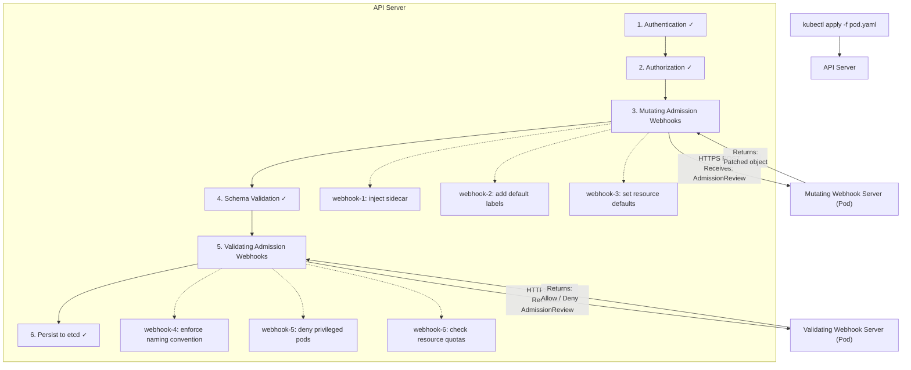
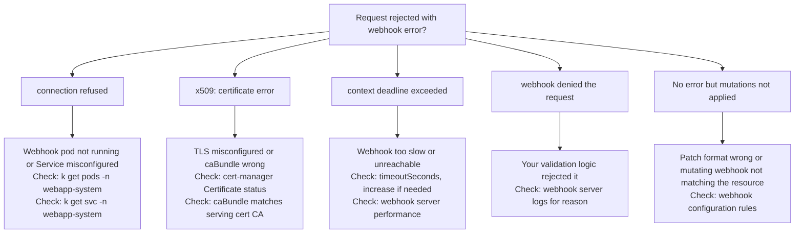

> **Complexity**: `[COMPLEX]` - Intercepting and modifying API requests
>
> **Time to Complete**: 4 hours
>
> **Prerequisites**: Module 1.1 (API Deep Dive), TLS/certificate basics

---

## What You'll Be Able to Do

After completing this module, you will be able to:

1. **Design** and implement a mutating admission webhook that seamlessly injects sidecar containers, enforces default labels, or hardcodes resource limits into incoming cluster requests.
2. **Evaluate** and construct a validating admission webhook that acts as a strict governance gate to enforce custom corporate policies (like restricting image registries, mandating naming conventions, and verifying security constraints).
3. **Implement** robust TLS certificate management, configure optimal failure policies, and apply precise namespace selectors to ensure webhook reliability and zero-downtime in production environments.
4. **Diagnose** and troubleshoot complex webhook failures using API Server audit logs, webhook timeout tuning, and strategic dry-run admission testing techniques.

---

## Why This Module Matters

In 2021, a well-documented incident at a major Fortune 500 financial institution resulted in a catastrophic four-hour deployment freeze across a massive 1,000-node production cluster. During a routine upgrade of their security infrastructure, the validation webhook responsible for scanning container image registries temporarily went offline. Because its failure policy was misconfigured to fail closed (`Fail`), the Kubernetes API server dutifully rejected every single Pod creation request across the entire fleet.

For four agonizing hours, automated scaling failed during peak trading hours, critical microservice deployments stalled, and the company lost an estimated $3.2 million in unprocessed transaction throughput. The root cause was not a complex network partition, a DNS failure, or a deep etcd corruption. It was a single misconfigured line of YAML in an admission webhook configuration that failed to account for high availability and blast radius. 

Admission webhooks give you a powerful checkpoint at the very front door of the Kubernetes API. Every `CREATE`, `UPDATE`, or `DELETE` request can be intercepted, inspected, and either modified (mutating) or rejected (validating) before the object is ever stored in etcd. This mechanism is the bedrock of Kubernetes extensibility. This is exactly how modern service meshes like Istio inject sidecar containers seamlessly without forcing developers to modify their Deployment YAML. This is how governance tools like OPA Gatekeeper enforce strict security policies such as blocking root access. Together with Custom Resource Definitions and custom controllers, admission webhooks give you absolute, granular control over the Kubernetes API lifecycle.

> **The Nightclub Bouncer Analogy**
>
> A validating webhook is akin to a strict bouncer at a nightclub. It checks your ID (validates the request against policies) and either lets you in or completely turns you away. It cannot change your outfit or alter your identity. A mutating webhook, on the other hand, operates like a stylist at the door—it can actively modify your appearance by adding a VIP wristband (injecting a sidecar container), changing your name tag (appending default labels), or handing you a venue map (setting resource defaults). The fundamental rule of the Kubernetes API pipeline is strict order: mutating webhooks always run first to apply changes, and validating webhooks run second to verify the final, modified state.

---

## Did You Know?

1. In 2024, production environments running service meshes report that the `istio-sidecar-injector` webhook handles up to 25,000 requests per minute in large clusters, dynamically intercepting every single Pod creation to add Envoy proxies.
2. Webhooks explicitly expose the `userInfo` object containing exact UID and group details of the requestor. This capability was leveraged heavily in the 2022 NSA/CISA Kubernetes Hardening Guidance to build identity-aware zero-trust architectures natively inside the cluster.
3. **ValidatingAdmissionPolicy (CEL-based) is replacing many webhooks**: Since Kubernetes 1.30, you can write validation policies directly in the cluster using Common Expression Language (CEL), drastically reducing the need to run and maintain external webhook servers for straightforward validation rules.
4. The Kubernetes API server imposes a strict hard limit of exactly 30 seconds for any admission webhook to respond. This threshold was established in late 2018 to protect the control plane and etcd from cascading resource exhaustion caused by slow external endpoints.

---

## Part 1: Webhook Architecture

Understanding the exact sequence of events inside the Kubernetes API server is critical for mastering webhooks. When a user submits a manifest, it passes through a gauntlet of checks. Authentication verifies identity, and Authorization (RBAC) verifies permissions. Only then do webhooks enter the picture.

### 1.1 How Admission Webhooks Work



### 1.2 Mutating vs Validating

| Feature | Mutating | Validating |
|---------|----------|------------|
| Can modify the object | Yes (via JSON patch) | No |
| Can reject the request | Yes | Yes |
| Execution order | First | Second (sees mutated object) |
| Typical use | Inject sidecars, set defaults, add labels | Enforce policies, naming rules |
| Runs how many times | May run again if other mutating webhooks change the object | Once (after all mutations) |

> **Stop and think**: Categorize these three real-world requirements. Are they Mutating or Validating?
> 1. Ensuring every Service uses `type: ClusterIP` unless explicitly approved.
> 2. Automatically adding a `team-owner` label based on the namespace the Pod is deployed to.
> 3. Blocking the deployment of any Pod that requests running as the `root` user.
> 
> *Answers: 1. Validating (rejecting invalid configs). 2. Mutating (modifying the object before saving). 3. Validating (enforcing a security policy).*

### 1.3 AdmissionReview API

The API Server sends an `AdmissionReview` request containing all the context about the resource being manipulated. Notice how it includes both the raw object structure and the user info.

```json
{
  "apiVersion": "admission.k8s.io/v1",
  "kind": "AdmissionReview",
  "request": {
    "uid": "705ab4f5-6393-11e8-b7cc-42010a800002",
    "kind": {"group": "", "version": "v1", "kind": "Pod"},
    "resource": {"group": "", "version": "v1", "resource": "pods"},
    "namespace": "default",
    "operation": "CREATE",
    "userInfo": {
      "username": "admin",
      "groups": ["system:masters"]
    },
    "object": {
      "apiVersion": "v1",
      "kind": "Pod",
      "metadata": {"name": "my-pod", "namespace": "default"},
      "spec": {
        "containers": [{"name": "app", "image": "nginx:1.35"}]
      }
    },
    "oldObject": null
  }
}
```

Your webhook responds by embedding the decision inside the same `AdmissionReview` envelope. For mutating webhooks, the `patch` field requires base64-encoded `JSONPatch` instructions.

```json
{
  "apiVersion": "admission.k8s.io/v1",
  "kind": "AdmissionReview",
  "response": {
    "uid": "705ab4f5-6393-11e8-b7cc-42010a800002",
    "allowed": true,
    "patchType": "JSONPatch",
    "patch": "W3sib3AiOiJhZGQiLCJwYXRoIjoiL3NwZWMvY29udGFpbmVycy8xIiwidmFsdWUiOnsi..."
  }
}
```

---

## Part 2: Implementing Webhooks with Kubebuilder

Kubebuilder abstracts away the boilerplate of parsing JSON payloads and dealing with raw JSONPatch bytes. It allows you to write clean Go code that operates directly on your highly-typed Go structs.

### 2.1 Scaffold the Webhook

To generate the foundational files, use the Kubebuilder CLI. This generates the necessary interfaces and testing mocks.

```bash
cd ~/extending-k8s/webapp-operator

# Create a defaulting (mutating) webhook
kubebuilder create webhook --group apps --version v1beta1 --kind WebApp \
  --defaulting

# Create a validating webhook
kubebuilder create webhook --group apps --version v1beta1 --kind WebApp \
  --validation

# Generated files:
# api/v1beta1/webapp_webhook.go          # YOUR webhook implementations
# api/v1beta1/webapp_webhook_test.go     # Test scaffolding
# config/webhook/                        # Webhook server config
# config/certmanager/                    # cert-manager integration
```

### 2.2 Defaulting (Mutating) Webhook

In the `Default` function, you simply modify the struct fields directly. The controller-runtime library intelligently compares the struct before and after your function executes, automatically generating the correct JSONPatch bytes to send back to the API Server.

```go
// api/v1beta1/webapp_webhook.go
package v1beta1

import (
	"fmt"

	"k8s.io/apimachinery/pkg/runtime"
	ctrl "sigs.k8s.io/controller-runtime"
	logf "sigs.k8s.io/controller-runtime/pkg/log"
	"sigs.k8s.io/controller-runtime/pkg/webhook"
	"sigs.k8s.io/controller-runtime/pkg/webhook/admission"
)

var webapplog = logf.Log.WithName("webapp-webhook")

// SetupWebhookWithManager registers the webhooks with the manager.
func (r *WebApp) SetupWebhookWithManager(mgr ctrl.Manager) error {
	return ctrl.NewWebhookManagedBy(mgr).
		For(r).
		Complete()
}

// +kubebuilder:webhook:path=/mutate-apps-kubedojo-io-v1beta1-webapp,mutating=true,failurePolicy=fail,sideEffects=None,groups=apps.kubedojo.io,resources=webapps,verbs=create;update,versions=v1beta1,name=mwebapp.kb.io,admissionReviewVersions=v1

var _ webhook.Defaulter = &WebApp{}

// Default implements webhook.Defaulter.
// This is called for every CREATE and UPDATE of a WebApp.
func (r *WebApp) Default() {
	webapplog.Info("Applying defaults", "name", r.Name, "namespace", r.Namespace)

	// Set default replicas
	if r.Spec.Replicas == nil {
		defaultReplicas := int32(2)
		r.Spec.Replicas = &defaultReplicas
		webapplog.Info("Set default replicas", "replicas", defaultReplicas)
	}

	// Set default port
	if r.Spec.Port == 0 {
		r.Spec.Port = 8080
		webapplog.Info("Set default port", "port", 8080)
	}

	// Set default resource limits
	if r.Spec.Resources == nil {
		r.Spec.Resources = &ResourceSpec{
			CPURequest:    "100m",
			CPULimit:      "500m",
			MemoryRequest: "128Mi",
			MemoryLimit:   "512Mi",
		}
		webapplog.Info("Set default resource limits")
	}

	// Ensure standard labels
	if r.Labels == nil {
		r.Labels = make(map[string]string)
	}
	r.Labels["app.kubernetes.io/managed-by"] = "webapp-operator"
	r.Labels["app.kubernetes.io/part-of"] = r.Name

	// Ensure ingress path has a default
	if r.Spec.Ingress != nil && r.Spec.Ingress.Path == "" {
		r.Spec.Ingress.Path = "/"
	}
}
```

### 2.3 Validating Webhook

Validating webhooks act as your strict policies. Notice that you can return `admission.Warnings`, which allows the resource to be persisted in etcd while simultaneously printing a yellow warning message directly into the developer's terminal running `kubectl`. This is crucial for smoothly deprecating old practices without causing hard outages.

```go
// +kubebuilder:webhook:path=/validate-apps-kubedojo-io-v1beta1-webapp,mutating=false,failurePolicy=fail,sideEffects=None,groups=apps.kubedojo.io,resources=webapps,verbs=create;update;delete,versions=v1beta1,name=vwebapp.kb.io,admissionReviewVersions=v1

var _ webhook.Validator = &WebApp{}

// ValidateCreate implements webhook.Validator.
func (r *WebApp) ValidateCreate() (admission.Warnings, error) {
	webapplog.Info("Validating create", "name", r.Name)

	var warnings admission.Warnings

	// Validate image is not 'latest'
	if r.Spec.Image == "" {
		return warnings, fmt.Errorf("image must not be empty")
	}

	if isLatestTag(r.Spec.Image) {
		warnings = append(warnings,
			"Using ':latest' tag is not recommended for production. "+
				"Consider pinning to a specific version.")
	}

	// Validate replicas
	if r.Spec.Replicas != nil && *r.Spec.Replicas > 50 {
		warnings = append(warnings,
			fmt.Sprintf("High replica count (%d). Ensure your cluster has sufficient resources.",
				*r.Spec.Replicas))
	}

	// Validate ingress TLS requires host
	if r.Spec.Ingress != nil && r.Spec.Ingress.TLSEnabled && r.Spec.Ingress.Host == "" {
		return warnings, fmt.Errorf(
			"ingress.host is required when ingress.tlsEnabled is true")
	}

	// Validate naming convention
	if err := validateName(r.Name); err != nil {
		return warnings, err
	}

	return warnings, nil
}

// ValidateUpdate implements webhook.Validator.
func (r *WebApp) ValidateUpdate(old runtime.Object) (admission.Warnings, error) {
	webapplog.Info("Validating update", "name", r.Name)

	oldWebApp := old.(*WebApp)
	var warnings admission.Warnings

	// Prevent changing the port on update (could break existing connections)
	if oldWebApp.Spec.Port != 0 && r.Spec.Port != oldWebApp.Spec.Port {
		return warnings, fmt.Errorf(
			"port cannot be changed after creation (was %d, attempting %d). "+
				"Delete and recreate the WebApp to change the port",
			oldWebApp.Spec.Port, r.Spec.Port)
	}

	// Warn on large scaling changes
	oldReplicas := int32(2)
	if oldWebApp.Spec.Replicas != nil {
		oldReplicas = *oldWebApp.Spec.Replicas
	}
	newReplicas := int32(2)
	if r.Spec.Replicas != nil {
		newReplicas = *r.Spec.Replicas
	}

	diff := newReplicas - oldReplicas
	if diff < 0 {
		diff = -diff
	}
	if diff > 10 {
		warnings = append(warnings,
			fmt.Sprintf("Large scaling change: %d -> %d replicas. "+
				"Consider gradual scaling.", oldReplicas, newReplicas))
	}

	return warnings, nil
}

// ValidateDelete implements webhook.Validator.
func (r *WebApp) ValidateDelete() (admission.Warnings, error) {
	webapplog.Info("Validating delete", "name", r.Name)

	// Example: prevent deletion of WebApps with a specific annotation
	if r.Annotations != nil && r.Annotations["apps.kubedojo.io/prevent-deletion"] == "true" {
		return nil, fmt.Errorf(
			"WebApp %s has deletion protection enabled. "+
				"Remove the 'apps.kubedojo.io/prevent-deletion' annotation first",
			r.Name)
	}

	return nil, nil
}

// Helper functions

func isLatestTag(image string) bool {
	// Check for :latest or no tag at all
	if len(image) == 0 {
		return false
	}
	// No colon = no tag = defaults to latest
	lastColon := -1
	lastSlash := -1
	for i, c := range image {
		if c == ':' {
			lastColon = i
		}
		if c == '/' {
			lastSlash = i
		}
	}
	// If no colon after the last slash, there's no tag
	if lastColon <= lastSlash {
		return true
	}
	tag := image[lastColon+1:]
	return tag == "latest"
}

func validateName(name string) error {
	if len(name) > 40 {
		return fmt.Errorf("name must be 40 characters or fewer (got %d)", len(name))
	}
	return nil
}
```

### 2.4 Register the Webhook

In `cmd/main.go`, we explicitly register the webhook with the global manager:

```go
// After setting up the controller
if os.Getenv("ENABLE_WEBHOOKS") != "false" {
    if err = (&appsv1beta1.WebApp{}).SetupWebhookWithManager(mgr); err != nil {
        setupLog.Error(err, "unable to create webhook", "webhook", "WebApp")
        os.Exit(1)
    }
}
```

---

## Part 3: Custom Webhook Server (Without Kubebuilder)

For broad infrastructure concerns—such as injecting sidecars into all Pods regardless of their specific controllers—you frequently need to build a standalone webhook server. Writing a raw HTTP server gives you low-level visibility into exactly how JSON patching operates.

### 3.1 Standalone Mutating Webhook

In this example, we parse the raw byte array of the incoming object, manually construct the `jsonPatchEntry` slice, and marshal the response. The API Server will interpret these JSONPatch instructions and apply them to the user's Pod.

```go
// cmd/sidecar-injector/main.go
package main

import (
	"context"
	"encoding/json"
	"fmt"
	"net/http"
	"os"
	"os/signal"
	"syscall"

	admissionv1 "k8s.io/api/admission/v1"
	corev1 "k8s.io/api/core/v1"
	metav1 "k8s.io/apimachinery/pkg/apis/meta/v1"
	"k8s.io/klog/v2"
)

const (
	sidecarImage = "busybox:1.35.0"
	sidecarName  = "logging-sidecar"
	certFile     = "/etc/webhook/certs/tls.crt"
	keyFile      = "/etc/webhook/certs/tls.key"
)

type jsonPatchEntry struct {
	Op    string      `json:"op"`
	Path  string      `json:"path"`
	Value interface{} `json:"value,omitempty"`
}

func handleMutate(w http.ResponseWriter, r *http.Request) {
	klog.V(2).Info("Received admission request")

	// Decode the AdmissionReview
	var admissionReview admissionv1.AdmissionReview
	if err := json.NewDecoder(r.Body).Decode(&admissionReview); err != nil {
		klog.Errorf("Failed to decode request: %v", err)
		http.Error(w, err.Error(), http.StatusBadRequest)
		return
	}

	request := admissionReview.Request
	klog.Infof("Processing %s %s/%s by %s",
		request.Operation, request.Namespace, request.Name,
		request.UserInfo.Username)

	// Decode the Pod
	var pod corev1.Pod
	if err := json.Unmarshal(request.Object.Raw, &pod); err != nil {
		sendResponse(w, request.UID, false, "", fmt.Sprintf("Failed to decode pod: %v", err))
		return
	}

	// Check if the sidecar should be injected
	if !shouldInject(&pod) {
		klog.Infof("Skipping injection for %s/%s", pod.Namespace, pod.Name)
		sendResponse(w, request.UID, true, "", "")
		return
	}

	// Check if sidecar already exists
	for _, c := range pod.Spec.Containers {
		if c.Name == sidecarName {
			klog.Infof("Sidecar already present in %s/%s", pod.Namespace, pod.Name)
			sendResponse(w, request.UID, true, "", "")
			return
		}
	}

	// Build JSON patch to inject sidecar
	sidecar := corev1.Container{
		Name:  sidecarName,
		Image: sidecarImage,
		Command: []string{
			"/bin/sh", "-c",
			"while true; do echo '[sidecar] heartbeat'; sleep 30; done",
		},
		Resources: corev1.ResourceRequirements{
			Limits: corev1.ResourceList{
				corev1.ResourceCPU:    resource.MustParse("50m"),
				corev1.ResourceMemory: resource.MustParse("64Mi"),
			},
			Requests: corev1.ResourceList{
				corev1.ResourceCPU:    resource.MustParse("10m"),
				corev1.ResourceMemory: resource.MustParse("32Mi"),
			},
		},
	}

	patches := []jsonPatchEntry{
		{
			Op:    "add",
			Path:  "/spec/containers/-",
			Value: sidecar,
		},
		{
			Op:    "add",
			Path:  "/metadata/annotations/sidecar.kubedojo.io~1injected",
			Value: "true",
		},
	}

	patchBytes, err := json.Marshal(patches)
	if err != nil {
		sendResponse(w, request.UID, false, "", fmt.Sprintf("Failed to marshal patch: %v", err))
		return
	}

	klog.Infof("Injecting sidecar into %s/%s", pod.Namespace, pod.Name)
	sendPatchResponse(w, request.UID, patchBytes)
}

func shouldInject(pod *corev1.Pod) bool {
	// Only inject if the annotation is set
	annotations := pod.GetAnnotations()
	if annotations == nil {
		return false
	}
	return annotations["sidecar.kubedojo.io/inject"] == "true"
}

func sendResponse(w http.ResponseWriter, uid types.UID, allowed bool, patchType string, message string) {
	response := admissionv1.AdmissionReview{
		TypeMeta: metav1.TypeMeta{
			APIVersion: "admission.k8s.io/v1",
			Kind:       "AdmissionReview",
		},
		Response: &admissionv1.AdmissionResponse{
			UID:     uid,
			Allowed: allowed,
		},
	}
	if !allowed && message != "" {
		response.Response.Result = &metav1.Status{
			Message: message,
		}
	}

	w.Header().Set("Content-Type", "application/json")
	json.NewEncoder(w).Encode(response)
}

func sendPatchResponse(w http.ResponseWriter, uid types.UID, patch []byte) {
	patchType := admissionv1.PatchTypeJSONPatch
	response := admissionv1.AdmissionReview{
		TypeMeta: metav1.TypeMeta{
			APIVersion: "admission.k8s.io/v1",
			Kind:       "AdmissionReview",
		},
		Response: &admissionv1.AdmissionResponse{
			UID:       uid,
			Allowed:   true,
			PatchType: &patchType,
			Patch:     patch,
		},
	}

	w.Header().Set("Content-Type", "application/json")
	json.NewEncoder(w).Encode(response)
}

func main() {
	klog.InitFlags(nil)

	mux := http.NewServeMux()
	mux.HandleFunc("/mutate", handleMutate)
	mux.HandleFunc("/healthz", func(w http.ResponseWriter, r *http.Request) {
		w.WriteHeader(http.StatusOK)
		w.Write([]byte("ok"))
	})

	server := &http.Server{
		Addr:    ":8443",
		Handler: mux,
	}

	// Graceful shutdown
	go func() {
		sigCh := make(chan os.Signal, 1)
		signal.Notify(sigCh, syscall.SIGINT, syscall.SIGTERM)
		<-sigCh
		klog.Info("Shutting down webhook server")
		server.Shutdown(context.Background())
	}()

	klog.Infof("Starting webhook server on :8443")
	if err := server.ListenAndServeTLS(certFile, keyFile); err != http.ErrServerClosed {
		klog.Fatalf("Failed to start server: %v", err)
	}
}
```

---

## Part 4: TLS and cert-manager

### 4.1 Why TLS Is Required

The API Server acts as the client invoking your webhook, and it inherently distrusts all external connections. It communicates exclusively over HTTPS. You must provide:
1. A valid TLS certificate mounted inside the webhook server Pod.
2. The `caBundle` field correctly populated in the `WebhookConfiguration` so the API Server can cryptographically verify the server's certificate signature.

### 4.2 Option 1: cert-manager (Recommended)

Managing TLS secrets manually is tedious and error-prone. The industry standard is utilizing `cert-manager` to automate issuance and dynamic `caBundle` injection.

```bash
# Install cert-manager
kubectl apply -f https://github.com/cert-manager/cert-manager/releases/download/v1.35.0/cert-manager.yaml

# Wait for it to be ready
kubectl wait --for=condition=Available deployment -n cert-manager --all --timeout=120s
```

Define the internal Issuer:

```yaml
# config/certmanager/issuer.yaml
apiVersion: cert-manager.io/v1
kind: Issuer
metadata:
  name: webapp-selfsigned-issuer
  namespace: webapp-system
spec:
  selfSigned: {}
```

Generate the Certificate tying back to your specific internal Service DNS names:

```yaml
# config/certmanager/certificate.yaml
apiVersion: cert-manager.io/v1
kind: Certificate
metadata:
  name: webapp-webhook-cert
  namespace: webapp-system
spec:
  secretName: webapp-webhook-tls
  duration: 8760h    # 1 year
  renewBefore: 720h  # Renew 30 days before expiry
  issuerRef:
    name: webapp-selfsigned-issuer
    kind: Issuer
  dnsNames:
  - webapp-webhook-service.webapp-system.svc
  - webapp-webhook-service.webapp-system.svc.cluster.local
```

### 4.3 Option 2: Self-Signed Certificates (Dev/Testing)

For rapid local testing without dependencies, you can utilize OpenSSL to generate the bundles directly.

```bash
# Generate CA
openssl genrsa -out ca.key 2048
openssl req -new -x509 -days 365 -key ca.key -out ca.crt -subj "/CN=webapp-webhook-ca"

# Generate server certificate
openssl genrsa -out server.key 2048
openssl req -new -key server.key -out server.csr \
  -subj "/CN=webapp-webhook-service.webapp-system.svc" \
  -config <(cat /etc/ssl/openssl.cnf <(printf "\n[SAN]\nsubjectAltName=DNS:webapp-webhook-service.webapp-system.svc,DNS:webapp-webhook-service.webapp-system.svc.cluster.local"))

openssl x509 -req -days 365 -in server.csr -CA ca.crt -CAkey ca.key \
  -CAcreateserial -out server.crt \
  -extensions SAN \
  -extfile <(cat /etc/ssl/openssl.cnf <(printf "\n[SAN]\nsubjectAltName=DNS:webapp-webhook-service.webapp-system.svc,DNS:webapp-webhook-service.webapp-system.svc.cluster.local"))

# Create the TLS secret
k create secret tls webapp-webhook-tls \
  --cert=server.crt --key=server.key \
  -n webapp-system

# Base64 encode CA for webhook config
CA_BUNDLE=$(cat ca.crt | base64 | tr -d '\n')
```

### 4.4 Webhook Configuration with caBundle Injection

Leveraging the `cert-manager.io/inject-ca-from` annotation is an elegant solution. The cert-manager injector controller observes this annotation, reads the dynamically generated certificate data, and populates the `caBundle` field for you seamlessly.

```yaml
# mutating-webhook.yaml
apiVersion: admissionregistration.k8s.io/v1
kind: MutatingWebhookConfiguration
metadata:
  name: webapp-mutating-webhook
  annotations:
    cert-manager.io/inject-ca-from: webapp-system/webapp-webhook-cert
webhooks:
- name: mwebapp.kubedojo.io
  admissionReviewVersions: ["v1"]
  sideEffects: None
  failurePolicy: Fail
  clientConfig:
    service:
      name: webapp-webhook-service
      namespace: webapp-system
      path: /mutate
      port: 443
    # caBundle is auto-injected by cert-manager
  rules:
  - apiGroups: ["apps.kubedojo.io"]
    apiVersions: ["v1beta1"]
    operations: ["CREATE", "UPDATE"]
    resources: ["webapps"]
  namespaceSelector:
    matchExpressions:
    - key: kubernetes.io/metadata.name
      operator: NotIn
      values: ["kube-system", "kube-public"]
```

```yaml
# validating-webhook.yaml
apiVersion: admissionregistration.k8s.io/v1
kind: ValidatingWebhookConfiguration
metadata:
  name: webapp-validating-webhook
  annotations:
    cert-manager.io/inject-ca-from: webapp-system/webapp-webhook-cert
webhooks:
- name: vwebapp.kubedojo.io
  admissionReviewVersions: ["v1"]
  sideEffects: None
  failurePolicy: Fail
  clientConfig:
    service:
      name: webapp-webhook-service
      namespace: webapp-system
      path: /validate
      port: 443
  rules:
  - apiGroups: ["apps.kubedojo.io"]
    apiVersions: ["v1beta1"]
    operations: ["CREATE", "UPDATE", "DELETE"]
    resources: ["webapps"]
```

---

## Part 5: Failure Policies and Matching

### 5.1 What Happens When the Webhook Is Down?

Your failure policy defines the resilience posture of your cluster. A webhook configured with `Fail` acts as a strict blockade. If the network drops or the pod crashes, the API Server will categorically reject requests until connectivity is restored.

| Policy | Behavior | Use When |
|--------|----------|----------|
| `Fail` | Request is rejected | Security-critical webhooks (deny privileged pods) |
| `Ignore` | Request is allowed without mutation/validation | Convenience webhooks (optional sidecars) |

```yaml
webhooks:
- name: security-policy.kubedojo.io
  failurePolicy: Fail         # Block if webhook is down
  timeoutSeconds: 5            # Default is 10, max is 30

- name: sidecar-injector.kubedojo.io
  failurePolicy: Ignore        # Allow if webhook is down
  timeoutSeconds: 3
```

> **Pause and predict**: Imagine you maintain two webhooks. One enforces that images only come from your private corporate registry to prevent malware. The other injects a monitoring sidecar into deployments. If your webhook server goes down, which failure policy should each webhook use?
>
> *Answer: The registry enforcer MUST use `Fail`. If it fails open (`Ignore`), developers could deploy malicious images from public registries during an outage, compromising the cluster. The monitoring sidecar should use `Ignore`. If it fails closed (`Fail`), no new applications can be deployed just because the monitoring system is temporarily down, which is a massive blast radius for a non-critical component.*

### 5.2 Matching and Filtering

To ensure high performance, limit the scope of your webhooks so the API server isn't forced to invoke them for unrelated resources. Broad scopes exponentially increase latency across the control plane.

```yaml
webhooks:
- name: mwebapp.kubedojo.io
  rules:
  - apiGroups: [""]
    apiVersions: ["v1"]
    operations: ["CREATE"]
    resources: ["pods"]
    scope: "Namespaced"          # Only namespaced resources

  # Only match specific namespaces
  namespaceSelector:
    matchLabels:
      webhook: enabled

  # Only match specific objects
  objectSelector:
    matchLabels:
      inject-sidecar: "true"

  # Timeout
  timeoutSeconds: 10

  # Reinvocation policy (for mutating)
  reinvocationPolicy: IfNeeded   # Re-run if another webhook mutated the object
```

### 5.3 Match Conditions (Kubernetes 1.30+)

Advanced filtering allows developers to construct granular inclusion logic natively evaluated in the API Server.

```yaml
webhooks:
- name: vwebapp.kubedojo.io
  matchConditions:
  - name: "not-system-namespace"
    expression: "!request.namespace.startsWith('kube-')"
  - name: "has-annotation"
    expression: "object.metadata.annotations['validate'] == 'true'"
```

---

## Part 6: Debugging Webhooks

Admission webhooks exist at a highly sensitive intersection of networking, cryptography, and orchestration. When things break, the errors surface at the client level (`kubectl`), masking the underlying server-side issue.

### 6.1 Common Failure Modes



### 6.2 Debugging Commands

Use these strategic diagnostic commands to bisect connectivity or trust issues. Note that testing from *inside* the cluster via a debug pod is the only way to accurately simulate the API server's network perspective.

```bash
# Check webhook configurations
k get mutatingwebhookconfigurations
k get validatingwebhookconfigurations
k describe mutatingwebhookconfiguration webapp-mutating-webhook

# Check webhook pod logs
k logs -n webapp-system -l app=webapp-webhook -f

# Check cert-manager certificate
k get certificate -n webapp-system
k describe certificate webapp-webhook-cert -n webapp-system

# Check the TLS secret
k get secret webapp-webhook-tls -n webapp-system -o yaml

# Test webhook connectivity from inside the cluster
URL="https://webapp-webhook-service"
URL+=".webapp-system.svc:443/healthz"
k run test-curl --rm -it --image=curlimages/curl --restart=Never -- \
  curl -vk $URL

# Check API Server logs for webhook errors (if you have access)
k logs -n kube-system kube-apiserver-<node> | grep webhook
```

---

## Common Mistakes

| Mistake | Problem | Solution |
|---------|---------|----------|
| Missing TLS certificate | API Server cannot connect to webhook | Use cert-manager or generate valid certs |
| Wrong `caBundle` | x509 trust errors | Ensure caBundle matches the cert's CA |
| Wrong Service name/namespace in config | Connection refused | Match exactly: `{svc}.{ns}.svc` |
| No `sideEffects: None` | Webhook calls fail on dry-run | Always set `sideEffects: None` unless you have side effects |
| `failurePolicy: Fail` on optional webhooks | Cluster breaks when webhook is down | Use `Ignore` for non-critical webhooks |
| Not excluding system namespaces | kube-system pods blocked by webhook | Add `namespaceSelector` to exclude system namespaces |
| Mutating webhook not idempotent | Duplicate sidecars on retry | Check if mutation already applied before patching |
| No health check endpoint | Cannot configure readiness probe | Add `/healthz` endpoint to webhook server |
| Webhook too slow | API calls time out | Keep webhook logic fast (<5 seconds) |

---

## Quiz

1. **You write a validating webhook that blocks any Pod with more than 2 containers. You also have a mutating webhook that injects a logging sidecar into every Pod. If a user submits a Pod with 2 containers, will it be admitted to the cluster?**
   <details>
   <summary>Answer</summary>
   The Pod will be rejected. This happens because mutating webhooks always execute first in the API server's admission pipeline. The mutating webhook intercepts the 2-container Pod and injects the sidecar, modifying the definition to have 3 containers. Afterwards, the validating webhook evaluates this final, mutated state. Since the Pod now has 3 containers, the validating webhook's policy is triggered and it rejects the request, preventing it from being stored in etcd.
   </details>

2. **A developer creates a deployment, but forgets to set resource limits. A mutating webhook catches this and injects default CPU and memory limits. A subsequent validating webhook rejects the deployment because the environment label is missing. Is the deployment saved in etcd with the new resource limits?**
   <details>
   <summary>Answer</summary>
   No, the deployment is not saved in etcd at all, and the mutation is effectively discarded. The admission control process is an all-or-nothing transaction at the API Server door. Even though the mutating webhook successfully processed the request and injected the resource limits, the subsequent validating webhook rejected the overall transaction. The client will receive an error about the missing environment label, and they will need to resubmit the corrected manifest, which will then go through the entire webhook chain again from the beginning.
   </details>

3. **You deploy a new webhook server and configure the `ValidatingWebhookConfiguration` with the correct service URL, but the API server refuses to send requests to it, logging an "x509: certificate signed by unknown authority" error. Why is this happening and how does `caBundle` solve it?**
   <details>
   <summary>Answer</summary>
   This happens because the Kubernetes API server strictly requires all webhook communication to be secured via HTTPS to prevent tampering. When you deploy a webhook, you are typically using a self-signed certificate or an internal CA (like cert-manager) rather than a globally trusted root CA. The API server does not automatically trust your internal certificates. You must provide the `caBundle` (the base64-encoded Certificate Authority public certificate) in the webhook configuration so the API server has the cryptographic proof needed to verify and trust the webhook server's TLS certificate during the handshake.
   </details>

4. **You have Webhook A (injects a database proxy sidecar) and Webhook B (adds a specific security context to all containers in a Pod). Both are mutating webhooks. Sometimes, the proxy sidecar injected by Webhook A is missing the security context from Webhook B. How does `reinvocationPolicy: IfNeeded` solve this race condition?**
   <details>
   <summary>Answer</summary>
   This race condition occurs because mutating webhooks do not have a guaranteed execution order. If Webhook B runs first, it adds the security context to the user's containers, and then Webhook A runs and injects the proxy sidecar (which won't have the security context). By setting `reinvocationPolicy: IfNeeded`, you instruct the API server to perform multiple passes through the mutating webhooks. If Webhook A modifies the Pod after Webhook B has already run, the API server will re-invoke Webhook B on the newly mutated object, ensuring the security context is applied to the newly injected sidecar container as well.
   </details>

5. **A cluster administrator configures a validating webhook to strictly enforce company naming conventions on all namespaces, setting `failurePolicy: Fail`. Later that night, the node hosting the webhook server goes offline. How will this impact users trying to create new namespaces?**
   <details>
   <summary>Answer</summary>
   Users will be completely blocked from creating new namespaces until the webhook server is restored. Because the `failurePolicy` is set to `Fail`, the API server treats the unavailability of the webhook as an automatic rejection of the admission request. The API server prioritizes strict policy enforcement over availability in this configuration. To prevent this from causing cluster-wide outages, critical webhooks should have highly available deployments (multiple replicas across different nodes) or, if strict enforcement isn't required, use `failurePolicy: Ignore` to allow requests through during an outage.
   </details>

6. **Your platform team wants to deprecate the use of the `latest` image tag across the cluster, but instantly blocking them with a validating webhook would break several legacy CI/CD pipelines. How can you use a webhook to prepare users for this change without causing immediate outages?**
   <details>
   <summary>Answer</summary>
   You can configure a validating webhook to allow the request but return an admission warning message. When the API server processes this response, it allows the object to be saved in etcd but passes the warning message back to the client, displaying it in yellow text in the user's `kubectl` output. This allows the legacy CI/CD pipelines to continue functioning without interruption while explicitly notifying developers that their manifests violate upcoming policies. Once developers have had time to update their manifests to use pinned versions, you can switch the webhook to return a hard denial.
   </details>

---

## Hands-On Exercise

**Task**: Build and deploy a mutating webhook that auto-injects a logging sidecar into Pods that have the annotation `sidecar.kubedojo.io/inject: "true"`, with TLS managed by cert-manager.

**Setup**:
```bash
kind create cluster --name webhook-lab

# Install cert-manager
kubectl apply -f https://github.com/cert-manager/cert-manager/releases/download/v1.35.0/cert-manager.yaml
kubectl wait --for=condition=Available deployment -n cert-manager --all --timeout=120s
```

**Steps**:

1. **Create the namespace and cert-manager resources**:
```bash
k create namespace webhook-demo

# Create self-signed issuer
cat << 'EOF' | k apply -f -
apiVersion: cert-manager.io/v1
kind: Issuer
metadata:
  name: selfsigned-issuer
  namespace: webhook-demo
spec:
  selfSigned: {}
EOF

# Create the Certificate separately for valid document streams
cat << 'EOF' | k apply -f -
apiVersion: cert-manager.io/v1
kind: Certificate
metadata:
  name: sidecar-webhook-cert
  namespace: webhook-demo
spec:
  secretName: sidecar-webhook-tls
  duration: 8760h
  renewBefore: 720h
  issuerRef:
    name: selfsigned-issuer
    kind: Issuer
  dnsNames:
  - sidecar-webhook.webhook-demo.svc
  - sidecar-webhook.webhook-demo.svc.cluster.local
EOF

# Verify certificate is ready
k get certificate -n webhook-demo
```

2. **Build the sidecar injector** from Part 3.1 (adapt the Go code specifically for this deployment logic).

3. **Create a Deployment for the webhook server** that actively mounts the TLS secret volume natively.

4. **Create the Service**:
```bash
cat << 'EOF' | k apply -f -
apiVersion: v1
kind: Service
metadata:
  name: sidecar-webhook
  namespace: webhook-demo
spec:
  selector:
    app: sidecar-webhook
  ports:
  - port: 443
    targetPort: 8443
EOF
```

5. **Create the MutatingWebhookConfiguration** with active cert-manager CA injection configured via annotations.

6. **Test the injection directly**:
```bash
# Pod without annotation — no injection
k run no-inject --image=nginx --restart=Never
k get pod no-inject -o jsonpath='{.spec.containers[*].name}'
# Expected: nginx

# Pod with annotation — should get sidecar
cat << 'EOF' | k apply -f -
apiVersion: v1
kind: Pod
metadata:
  name: with-inject
  annotations:
    sidecar.kubedojo.io/inject: "true"
spec:
  containers:
  - name: app
    image: nginx:1.35
EOF

k get pod with-inject -o jsonpath='{.spec.containers[*].name}'
# Expected: app logging-sidecar

# Check the injection annotation
k get pod with-inject -o jsonpath='{.metadata.annotations}'
```

7. **Cleanup**:
```bash
kind delete cluster --name webhook-lab
```

**Success Criteria**:
- [ ] cert-manager issues a valid certificate
- [ ] Webhook server starts and passes health checks
- [ ] Pods without annotation are not modified
- [ ] Pods with annotation get the sidecar container injected
- [ ] The injection annotation is set on injected pods
- [ ] Webhook logs show request processing
- [ ] Pods in `kube-system` are not affected (namespace selector)

---

## Next Module

[Module 1.7: Customizing the Scheduler](../module-1.7-scheduler-plugins/) - Extend the Kubernetes scheduler with custom scoring and filtering plugins.