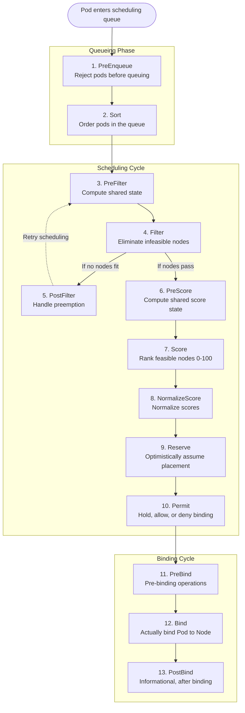
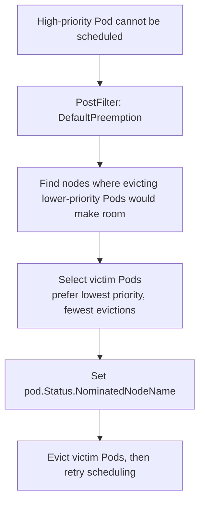

# Module 1.7: Customizing the Scheduler

> **Complexity**: `[COMPLEX]` - Extending Kubernetes scheduling decisions
>
> **Time to Complete**: 4 hours
>
> **Prerequisites**: Module 1.1 (API Deep Dive), understanding of Pod scheduling basics, and comfort reading Go interfaces

## Learning Outcomes

After completing this module, you will be able to:

1. **Design** a custom scheduling architecture that uses Scheduling Framework extension points for placement rules that native affinity, taints, tolerations, and topology spread constraints cannot express cleanly.
2. **Implement** custom Filter and Score plugins that use scheduler cache state, `CycleState`, plugin arguments, and Kubernetes 1.35-compatible framework interfaces without adding API server calls to the hot path.
3. **Evaluate** whether a placement requirement belongs in built-in scheduling primitives, a scheduler profile, a second scheduler binary, or a custom plugin compiled into the scheduler.
4. **Diagnose** scheduling failures by reading pod events, scheduler logs, profile names, plugin weights, leader election state, and framework extension-point behavior.
5. **Compare** the operational risks of Filter, Score, Reserve, Permit, Bind, and PostFilter logic when scheduler latency, preemption, and high availability matter.

## Why This Module Matters

Hypothetical scenario: your platform team runs one Kubernetes cluster for mixed workloads: latency-sensitive APIs, batch jobs, and GPU training pods. The default scheduler correctly honors CPU, memory, volumes, topology spread constraints, taints, tolerations, and affinity, yet your most expensive hardware still ends up underused because the scheduler cannot reason about an internal tier label, a GPU class annotation, and a business rule that treats some nodes as premium capacity. You can add more labels and affinity rules, but eventually the manifests start encoding policy that belongs in the platform, not in every application repository.

Scheduler customization matters because placement is one of the few control-plane decisions that directly affects reliability, cost, and incident blast radius before a workload ever starts. A bad admission policy can reject a manifest, but a bad scheduling decision can bind a pod to the wrong hardware, the wrong fault domain, or a node that looks feasible only because the policy was too generic. The Scheduling Framework gives you narrow hooks inside `kube-scheduler` so you can add domain-specific logic while still reusing the upstream queue, cache, preemption behavior, binding machinery, metrics, and leader election.

This module teaches the path from "I need custom placement behavior" to a deployable secondary scheduler. You will preserve the built-in scheduler model, add a Score plugin that prefers tiered nodes, add a Filter plugin that rejects incompatible GPU nodes, register those plugins in a scheduler binary, configure a `KubeSchedulerConfiguration` profile, and debug pods that request that scheduler by name. The goal is not to make every cluster run custom scheduler code; the goal is to know when the extra complexity is justified and how to keep it small when it is.

The most useful mindset is to treat the scheduler as a shared decision service. Application teams should describe workload intent, platform teams should expose safe placement policies, and the scheduler should combine those inputs with live cluster state. When custom scheduler code is written well, it removes repeated policy fragments from application manifests and makes the decision easier to test centrally. When it is written poorly, it hides critical behavior in a binary that only a few engineers understand, so this module keeps returning to observability, rollout boundaries, and failure modes.

## The Scheduling Framework as a Control Plane Contract

The Scheduling Framework is the extension mechanism inside `kube-scheduler`. It divides pod placement into a scheduling cycle, where the scheduler decides which node should run a pod, and a binding cycle, where that decision is written back to the API server. The scheduling cycle is synchronous for one pod at a time because the scheduler is maintaining a coherent view of cluster state while it filters and scores nodes. The binding cycle can run asynchronously because the expensive part is no longer choosing the node; it is making the API write and running any final binding hooks.

That split is the first design constraint for plugin authors. Anything that runs once per scheduling cycle can afford more work than logic that runs once per node, and anything in the binding cycle must treat the node decision as already made. If you put a network call inside `Score`, it may run across thousands of nodes for one pod. If you put irreversible side effects inside `Reserve`, you must also implement cleanup behavior for failures later in the cycle. Scheduler code is not ordinary controller code; it is hot-path control-plane code, and small latency mistakes multiply quickly.

The queueing phase deserves special attention because it determines when a pod is even considered. A `PreEnqueue` plugin can keep pods out of the active queue until required state exists, and a `Sort` plugin influences which pending pod gets scheduled first. Most custom scheduler work starts later, in filtering and scoring, because queue behavior changes fairness across workloads. If you do touch queueing, define the fairness contract explicitly: which pods wait, which pods jump ahead, and how operators can explain that behavior during an outage.



The diagram is easiest to read as a set of contracts rather than a menu of places to put code. `PreFilter` and `PreScore` are for per-pod preparation. `Filter` is for hard feasibility decisions, where a node either remains a candidate or disappears from consideration. `Score` is for preference, where each feasible node receives a value in the framework range. `NormalizeScore` is for converting a plugin's internal scale into the common range. `Reserve` and `Permit` are for coordination before binding, while `PreBind`, `Bind`, and `PostBind` are for the final write path.

The scheduler framework also gives you a useful mental model for performance reviews. Ask how often the hook runs, how much state it reads, and whether a failure should block scheduling or merely reduce preference. A once-per-pod hook can parse annotations, validate configuration, or build a small lookup map. A per-node hook should be closer to a table lookup and comparison. A binding hook should be treated as a short transaction because the pod has already been selected for a node and the user is waiting for that decision to become real.

| Extension Point | When It Runs | What It Does | Return Type |
|----------------|-------------|-------------|-------------|
| **PreEnqueue** | Before queuing | Gate pods from entering queue | Allow/Reject |
| **Sort** | Queue ordering | Prioritize pods in queue | Less function |
| **PreFilter** | Once per cycle | Compute shared filter state | Status |
| **Filter** | Per node | Eliminate infeasible nodes | Status (pass/fail) |
| **PostFilter** | After no node fits | Try preemption | Status + nominated node |
| **PreScore** | Once per cycle | Compute shared score state | Status |
| **Score** | Per node | Rank nodes 0-100 | Score + Status |
| **NormalizeScore** | After all scores | Normalize to [0,100] | Status |
| **Reserve** | After node selected | Optimistic reservation | Status |
| **Permit** | Before binding | Approve/deny/wait | Status + wait time |
| **PreBind** | Before actual bind | Pre-binding actions | Status |
| **Bind** | Binding | Bind pod to node | Status |
| **PostBind** | After binding | Cleanup, notifications | void |

The built-in scheduler already uses many plugins, and most clusters should exhaust those capabilities before writing custom code. `NodeResourcesFit` handles CPU and memory feasibility, `VolumeBinding` handles storage constraints, `PodTopologySpread` handles fault-domain distribution, and `TaintToleration` handles node reservation patterns. A custom plugin is appropriate when the rule depends on data or semantics that Kubernetes cannot represent as a normal pod constraint without making every workload author carry platform policy in their YAML.

This is why native primitives remain the baseline. Node affinity is excellent when the workload owner legitimately knows the required node label. Taints and tolerations are excellent when the platform owns a pool of nodes and only selected workloads may land there. Topology spread constraints are excellent when the failure-domain rule can be expressed by labels that already exist. A custom scheduler plugin becomes attractive when the rule is centralized, reused, versioned, and subtle enough that copying it into every workload creates more risk than compiling it once into the scheduler.

| Plugin | Extension Points | What It Does |
|--------|-----------------|-------------|
| NodeResourcesFit | PreFilter, Filter | Check CPU/memory availability |
| NodePorts | PreFilter, Filter | Check port availability |
| NodeAffinity | Filter, Score | Node affinity/anti-affinity rules |
| PodTopologySpread | PreFilter, Filter, PreScore, Score | Topology spread constraints |
| TaintToleration | Filter, PreScore, Score | Taint/toleration matching |
| InterPodAffinity | PreFilter, Filter, PreScore, Score | Pod affinity/anti-affinity |
| VolumeBinding | PreFilter, Filter, Reserve, PreBind | PV/PVC binding |
| DefaultPreemption | PostFilter | Preempt lower-priority pods |
| ImageLocality | Score | Prefer nodes with cached images |
| BalancedAllocation | Score | Balance resource usage across nodes |

Pause and predict: if a cluster has three thousand nodes and a Score plugin reads a ConfigMap from the API server for each node, what will happen to scheduling latency during a deployment surge? The important answer is not merely "it gets slower"; the API server and scheduler become coupled in the hottest loop of pod placement. The Scheduling Framework avoids that pattern by giving plugins access to scheduler snapshots and shared cycle state, so expensive or shared work happens outside the per-node function whenever possible.

The scheduler cache is therefore part of the plugin contract. When you read node information through the framework handle, you are reading the scheduler's snapshot of observed cluster state, not performing an API request for every decision. That distinction is essential for scale and for correctness. The scheduler's view changes as watches deliver updates, and the framework coordinates that view with scheduling cycles. If your plugin depends on platform data that is not already visible through watched Kubernetes objects, build a controller that projects that data into labels or resources before the scheduler needs it.

Another practical consequence is that plugin results should be explainable from Kubernetes objects. If a pod is rejected because a node lacks `gpu.kubedojo.io/type`, an operator should be able to inspect the node and see the missing label. If a pod is preferred because a node has a premium tier, the label should be visible and owned by a known automation path. Hidden data sources make scheduling decisions feel arbitrary, and arbitrary placement behavior is very hard to operate during incidents.

## Designing Plugins Around Hard Constraints and Soft Preferences

Custom scheduling starts with a placement statement, not with Go code. A hard statement sounds like "this pod must never run on a node without an approved GPU class." A soft statement sounds like "this pod should prefer premium nodes when they are available." The first belongs in a Filter plugin because a non-matching node must be removed from the candidate set; the second belongs in a Score plugin because the node may still be acceptable when capacity is tight. Confusing those two concepts is the most common design error in scheduler extensions.

The difference between "must" and "should" is not just grammar. A hard constraint changes the availability behavior of the application because the pod will remain Pending if no node passes the filter. That may be correct for regulated data, hardware compatibility, or licensing limits. A soft preference changes the ranking of feasible nodes, so the workload can still run when ideal capacity is unavailable. That is usually better for cost, locality, and performance hints. Every plugin design review should force the policy owner to say which failure mode they want.

When building a custom scheduler, you do not modify Kubernetes source directly. You create a Go module, import the upstream scheduler framework for the Kubernetes version you target, register your plugins with the scheduler command, and compile a scheduler binary. That binary can run as a second scheduler, or it can expose multiple profiles under different `schedulerName` values. The project layout below keeps plugin code, tests, deployment manifests, and the command entry point separate enough that a production team can review the blast radius of each change.

```text
scheduler-plugins/
├── go.mod
├── go.sum
├── cmd/
│   └── scheduler/
│       └── main.go            # Entry point
├── pkg/
│   └── plugins/
│       └── nodepreference/
│           ├── nodepreference.go   # Plugin implementation
│           └── nodepreference_test.go
└── manifests/
    ├── scheduler-config.yaml  # KubeSchedulerConfiguration
    └── deployment.yaml        # Secondary scheduler deployment
```

The Score plugin below ranks nodes based on a tier label. Nodes labeled `scheduling.kubedojo.io/tier: premium` receive a higher score than `standard` or unlabeled nodes, so mission-critical workloads drift toward more reliable hardware without making every workload author write a large node affinity stanza. The plugin reads from the scheduler's shared snapshot, not from the API server, and it accepts scores as structured arguments so operators can tune policy through configuration rather than recompiling the binary for every change.

This example intentionally uses node labels because labels are visible, cacheable, and already part of Kubernetes scheduling vocabulary. In a production system, those labels should be maintained by automation rather than by humans typing commands during an incident. A node inventory controller might set the tier label based on hardware class, maintenance state, or procurement metadata. The scheduler plugin should consume that normalized signal, not become responsible for discovering hardware facts itself. Keeping discovery outside the scheduler makes the plugin simpler and keeps placement latency predictable.

```go
// pkg/plugins/nodepreference/nodepreference.go
package nodepreference

import (
	"context"
	"fmt"

	v1 "k8s.io/api/core/v1"
	metav1 "k8s.io/apimachinery/pkg/apis/meta/v1"
	"k8s.io/apimachinery/pkg/runtime"
	"k8s.io/kubernetes/pkg/scheduler/framework"
)

const (
	// Name is the name of the plugin.
	Name = "NodePreference"

	// LabelKey is the node label key used for scoring.
	LabelKey = "scheduling.kubedojo.io/tier"
)

// NodePreference scores nodes based on a tier label.
type NodePreference struct {
	handle framework.Handle
	args   NodePreferenceArgs
}

// NodePreferenceArgs are the arguments for the plugin.
type NodePreferenceArgs struct {
	metav1.TypeMeta `json:",inline"`

	// TierScores maps tier label values to scores (0-100).
	TierScores map[string]int64 `json:"tierScores"`

	// DefaultScore is the score for nodes without the tier label.
	DefaultScore int64 `json:"defaultScore"`
}

var _ framework.ScorePlugin = &NodePreference{}
var _ framework.EnqueueExtensions = &NodePreference{}

// Name returns the name of the plugin.
func (pl *NodePreference) Name() string {
	return Name
}

// Score scores a node based on its tier label.
func (pl *NodePreference) Score(
	ctx context.Context,
	state *framework.CycleState,
	pod *v1.Pod,
	nodeName string,
) (int64, *framework.Status) {

	// Get the node info from the snapshot.
	nodeInfo, err := pl.handle.SnapshotSharedLister().NodeInfos().Get(nodeName)
	if err != nil {
		return 0, framework.AsStatus(fmt.Errorf("getting node %q: %w", nodeName, err))
	}

	node := nodeInfo.Node()

	// Check for the tier label.
	tierValue, exists := node.Labels[LabelKey]
	if !exists {
		return pl.args.DefaultScore, nil
	}

	// Look up the score for this tier.
	score, found := pl.args.TierScores[tierValue]
	if !found {
		return pl.args.DefaultScore, nil
	}

	return score, nil
}

// ScoreExtensions returns the score extension functions.
func (pl *NodePreference) ScoreExtensions() framework.ScoreExtensions {
	return pl
}

// NormalizeScore normalizes the scores to [0, MaxNodeScore].
func (pl *NodePreference) NormalizeScore(
	ctx context.Context,
	state *framework.CycleState,
	pod *v1.Pod,
	scores framework.NodeScoreList,
) *framework.Status {

	// Find max score.
	var maxScore int64
	for i := range scores {
		if scores[i].Score > maxScore {
			maxScore = scores[i].Score
		}
	}

	// Normalize to [0, 100].
	if maxScore == 0 {
		return nil
	}

	for i := range scores {
		scores[i].Score = (scores[i].Score * framework.MaxNodeScore) / maxScore
	}

	return nil
}

// EventsToRegister returns the events that trigger rescheduling.
func (pl *NodePreference) EventsToRegister() []framework.ClusterEventWithHint {
	return []framework.ClusterEventWithHint{
		{ClusterEvent: framework.ClusterEvent{Resource: framework.Node, ActionType: framework.Add | framework.Update}},
	}
}

// New creates a new NodePreference plugin.
func New(ctx context.Context, obj runtime.Object, handle framework.Handle) (framework.Plugin, error) {
	args, ok := obj.(*NodePreferenceArgs)
	if !ok {
		return nil, fmt.Errorf("want args to be of type NodePreferenceArgs, got %T", obj)
	}

	return &NodePreference{
		handle: handle,
		args:   *args,
	}, nil
}
```

This implementation illustrates the key Score pattern: keep the per-node function cheap, tolerate missing data, and return a deterministic value. The plugin does not try to bind the pod, mutate the node, or update labels. It simply answers "how desirable is this node for this pod under my policy?" and lets the rest of the scheduler combine that answer with other Score plugins. Before running this in a large cluster, what output distribution would you expect if premium nodes are full but standard nodes still have capacity?

The normalization function is small, but its design matters. It scales the highest configured score to the framework maximum and scales the rest proportionally. That is reasonable when tier values are relative preferences, but it can surprise you if the configured maximum tier is absent from the current feasible nodes. For example, if only standard and burstable nodes pass filtering, standard may normalize to the top score for that cycle. That is not a bug; it means "best among feasible nodes" rather than "globally premium." Tests should cover both interpretations so operators know what the score means.

Plugin arguments also need conservative defaults. The example gives unlabeled nodes a low default score, which keeps them usable but less attractive. A different environment might treat unlabeled nodes as configuration drift and reject them through a Filter plugin. Neither choice is universally correct. What matters is that the behavior is explicit, observable, and aligned with the risk of misplacement. For cost preference, a default score is usually fine. For security boundary placement, missing metadata should probably fail closed with a clear event message.

A Filter plugin is stricter. The GPU filter below reads a pod annotation in `PreFilter`, stores the result in `CycleState`, and then checks each node's GPU labels in `Filter`. The point of `PreFilter` is not only performance; it also makes the business rule explicit. If the pod does not ask for a GPU type, the plugin skips itself, which keeps ordinary workloads from being accidentally blocked by a GPU-specific policy.

The `CycleState` object is the framework's scratchpad for one scheduling cycle. It lets `PreFilter` parse and validate pod-level data once, then lets `Filter` reuse the result for each node. This is safer than reparsing annotations in a per-node loop and cleaner than storing per-pod state on the plugin struct, which may be shared across scheduling cycles. Treat `CycleState` as immutable once the per-node phase starts, and keep the stored data small enough that it does not become a hidden memory cost during scheduling pressure.

```go
// pkg/plugins/gpufilter/gpufilter.go
package gpufilter

import (
	"context"
	"fmt"
	"strconv"

	v1 "k8s.io/api/core/v1"
	"k8s.io/apimachinery/pkg/runtime"
	"k8s.io/kubernetes/pkg/scheduler/framework"
)

const (
	Name             = "GPUFilter"
	GPUCountLabel    = "gpu.kubedojo.io/count"
	GPUTypeLabel     = "gpu.kubedojo.io/type"
	PodGPUAnnotation = "scheduling.kubedojo.io/gpu-type"
)

type GPUFilter struct {
	handle framework.Handle
}

var _ framework.FilterPlugin = &GPUFilter{}
var _ framework.PreFilterPlugin = &GPUFilter{}

func (pl *GPUFilter) Name() string {
	return Name
}

// PreFilter checks if the pod needs GPU scheduling at all.
type preFilterState struct {
	requiredGPUType string
	needsGPU        bool
}

func (s *preFilterState) Clone() framework.StateData {
	return &preFilterState{
		requiredGPUType: s.requiredGPUType,
		needsGPU:        s.needsGPU,
	}
}

const preFilterStateKey = "PreFilter" + Name

func (pl *GPUFilter) PreFilter(
	ctx context.Context,
	state *framework.CycleState,
	pod *v1.Pod,
) (*framework.PreFilterResult, *framework.Status) {

	gpuType := pod.Annotations[PodGPUAnnotation]
	pfs := &preFilterState{
		requiredGPUType: gpuType,
		needsGPU:        gpuType != "",
	}

	state.Write(preFilterStateKey, pfs)

	if !pfs.needsGPU {
		// Skip the filter entirely; this pod does not need GPU placement.
		return nil, framework.NewStatus(framework.Skip)
	}

	return nil, nil
}

func (pl *GPUFilter) PreFilterExtensions() framework.PreFilterExtensions {
	return nil
}

// Filter checks if a node has the required GPU type and available GPUs.
func (pl *GPUFilter) Filter(
	ctx context.Context,
	state *framework.CycleState,
	pod *v1.Pod,
	nodeInfo *framework.NodeInfo,
) *framework.Status {

	// Read pre-filter state.
	data, err := state.Read(preFilterStateKey)
	if err != nil {
		return framework.AsStatus(fmt.Errorf("reading pre-filter state: %w", err))
	}
	pfs := data.(*preFilterState)

	if !pfs.needsGPU {
		return nil
	}

	node := nodeInfo.Node()

	// Check GPU type.
	nodeGPUType, exists := node.Labels[GPUTypeLabel]
	if !exists {
		return framework.NewStatus(framework.Unschedulable,
			fmt.Sprintf("node %s has no GPU type label", node.Name))
	}

	if nodeGPUType != pfs.requiredGPUType {
		return framework.NewStatus(framework.Unschedulable,
			fmt.Sprintf("node has GPU type %q, pod requires %q",
				nodeGPUType, pfs.requiredGPUType))
	}

	// Check GPU count.
	gpuCountStr, exists := node.Labels[GPUCountLabel]
	if !exists {
		return framework.NewStatus(framework.Unschedulable,
			fmt.Sprintf("node %s has no GPU count label", node.Name))
	}

	gpuCount, err := strconv.Atoi(gpuCountStr)
	if err != nil || gpuCount <= 0 {
		return framework.NewStatus(framework.Unschedulable,
			fmt.Sprintf("node %s has invalid GPU count: %s", node.Name, gpuCountStr))
	}

	return nil
}

func New(ctx context.Context, obj runtime.Object, handle framework.Handle) (framework.Plugin, error) {
	return &GPUFilter{handle: handle}, nil
}
```

Notice how the Filter plugin returns explanatory `Unschedulable` statuses instead of generic failures. Those messages become the raw material for debugging events, and they help distinguish "no GPU nodes exist" from "GPU nodes exist but have the wrong type label." Which approach would you choose here and why: a strict Filter that rejects nodes without labels, or a Score plugin that prefers labeled nodes but still allows unlabeled capacity? The answer depends on whether the policy represents safety, compliance, or merely cost optimization.

There is one more subtlety in the GPU example: the filter checks for label presence and label value, but it does not implement actual GPU accounting. In a real cluster, GPU availability is normally represented through device plugin resources such as `nvidia.com/gpu`, and the built-in resource plugins participate in fitting. A custom filter should complement those mechanisms rather than replace them. Use the custom label to express platform semantics like GPU class or topology, and let Kubernetes resource accounting decide whether the node has allocatable devices for the pod's request.

Testing a Filter plugin should include both positive and negative cases. A passing test proves only that the happy path works. Negative tests should cover missing pod annotations, missing node labels, mismatched GPU types, malformed count labels, and ordinary non-GPU pods that should skip the plugin. The quality of event messages matters here because those messages are what users see when their pods are Pending. A precise message can turn a scheduling ticket into a self-service label fix.

## Building, Registering, and Shipping a Scheduler Binary

The scheduler binary is ordinary Go code at the entry point and specialized framework code behind the registry. To compile a custom scheduler, instantiate the upstream scheduler command and register each plugin by name with a factory function. The name you register here must match the name used in `KubeSchedulerConfiguration`, and the argument object passed into `New` must match the plugin's expected runtime type. Many "plugin does not run" failures are simply name mismatches between `main.go`, configuration, and the pod's `schedulerName`.

Registration is also where you decide what code is available to profiles. A profile can enable or disable plugins, but it cannot use a plugin that was not compiled into the binary. That means a single binary serving several profiles should include the shared plugin set deliberately, and profile configuration should decide which policies apply to which pods. If two teams need incompatible versions of a plugin, that is a signal to consider separate scheduler binaries or to stabilize the plugin contract before sharing it.

```go
// cmd/scheduler/main.go
package main

import (
	"os"

	"k8s.io/component-base/cli"
	"k8s.io/kubernetes/cmd/kube-scheduler/app"

	"github.com/kubedojo/scheduler-plugins/pkg/plugins/gpufilter"
	"github.com/kubedojo/scheduler-plugins/pkg/plugins/nodepreference"
)

func main() {
	command := app.NewSchedulerCommand(
		app.WithPlugin(nodepreference.Name, nodepreference.New),
		app.WithPlugin(gpufilter.Name, gpufilter.New),
	)

	code := cli.Run(command)
	os.Exit(code)
}
```

Version alignment is not optional. Scheduler plugins import Kubernetes internals, and those packages follow the Kubernetes release train rather than a stable third-party library contract. Build the binary against the same minor version as the cluster you target; for this module, examples use Kubernetes v1.35.0. If your platform upgrades clusters, the scheduler binary should move through the same test and rollout process as the control plane, because a plugin compiled against the wrong dependency graph can fail before it ever reaches your placement logic.

This is different from most controller development, where client-go compatibility gives you more room across minor versions. Scheduler plugins sit closer to kube-scheduler internals, so the safest upgrade process is to rebuild, run unit tests, run a scheduling simulation or kind-based integration test, and then roll out the scheduler profile to a small workload class. If a control-plane upgrade is scheduled for the cluster, the custom scheduler should be part of the same readiness checklist. Otherwise you can accidentally upgrade the control plane while leaving a critical placement component behind.

```bash
# Initialize Go module
cd ~/extending-k8s/scheduler-plugins
go mod init github.com/kubedojo/scheduler-plugins

# Important: pin to the same Kubernetes version as your cluster
K8S_VERSION=v1.35.0
go get k8s.io/kubernetes@$K8S_VERSION
go get k8s.io/component-base@$K8S_VERSION

go mod tidy
go build -o custom-scheduler ./cmd/scheduler/
```

Containerizing the scheduler should feel like shipping any other small control-plane component: a reproducible build stage, a minimal runtime image, non-root execution, and an image tag that can be promoted through environments. The scheduler needs API permissions, not shell tools, so a distroless runtime is a sensible default. If your organization requires signed images or SBOMs, apply those controls here as you would for admission controllers and controllers that write cluster state.

Image tagging should be boring and traceable. Avoid mutable tags for production scheduler deployments because a rollout of scheduler code changes cluster placement behavior even when no application manifest changes. Tag images with a version, commit, or release identifier, record the Kubernetes minor version in release notes, and keep the `KubeSchedulerConfiguration` in source control beside the binary version. When an incident review asks why a pod moved to a different node class, you need to know both the plugin code and the profile configuration that were active at the time.

```dockerfile
# Dockerfile
FROM golang:1.24 AS builder
WORKDIR /workspace
COPY go.mod go.sum ./
RUN go mod download
COPY . .
RUN CGO_ENABLED=0 GOOS=linux go build -o custom-scheduler ./cmd/scheduler/

FROM gcr.io/distroless/static:nonroot
COPY --from=builder /workspace/custom-scheduler /custom-scheduler
USER 65532:65532
ENTRYPOINT ["/custom-scheduler"]
```

```bash
docker build -t custom-scheduler:v2.0.0 .
kind load docker-image custom-scheduler:v2.0.0 --name scheduler-lab
```

Exercise scenario: you build the image successfully, deploy it to `kube-system`, and see two healthy replicas, but pods requesting `custom-scheduler` remain Pending. Do not begin by changing plugin code. First check whether leader election succeeded, whether RBAC allows pod binding, whether the configuration file was mounted, and whether the profile name equals the pod's `spec.schedulerName`. Scheduler code is often blamed for failures caused by deployment wiring.

The fastest triage path is to separate "scheduler is not running" from "scheduler is running but not binding" from "scheduler is binding according to a policy I did not expect." A crash loop usually points to image, arguments, configuration, or dependency problems. A healthy scheduler with RBAC errors in logs points to permissions. A healthy scheduler that ignores pods usually points to `schedulerName` mismatch. A healthy scheduler that binds to unexpected nodes points to labels, plugin weights, normalization, or the interaction with built-in Score plugins.

## Configuring Profiles, RBAC, and Pod Opt-In

`KubeSchedulerConfiguration` is the control plane for your custom binary. It decides which profiles exist, which plugins are enabled or disabled at each extension point, which arguments are passed to plugins, and how Score plugins are weighted. A profile is addressed by `schedulerName`, so a pod that says `schedulerName: custom-scheduler` is asking for the profile with that exact name, not merely any scheduler deployment that happens to contain custom code.

Configuration should be reviewed with the same seriousness as code because it changes behavior without a compile step. Enabling a Filter plugin can make existing pods unschedulable. Raising a Score weight can shift traffic toward a smaller pool of nodes. Disabling a built-in plugin can remove a protection that application teams assumed was always present. Before a profile change reaches production, test it with representative pods and compare node choices against the previous profile so the tradeoff is visible.

```yaml
# manifests/scheduler-config.yaml
apiVersion: kubescheduler.config.k8s.io/v1
kind: KubeSchedulerConfiguration
leaderElection:
  leaderElect: true
  resourceNamespace: kube-system
  resourceName: custom-scheduler
profiles:
- schedulerName: custom-scheduler     # Pods reference this name
  plugins:
    # Enable our custom plugins
    filter:
      enabled:
      - name: GPUFilter
    score:
      enabled:
      - name: NodePreference
        weight: 25                     # Weight relative to other score plugins
    # Disable built-in plugins we're replacing
    # (usually you keep them all and just add yours)

  pluginConfig:
  - name: NodePreference
    args:
      tierScores:
        premium: 100
        standard: 50
        burstable: 20
      defaultScore: 10
```

The weight field deserves careful treatment. During scoring, multiple plugins emit values between zero and one hundred, and the scheduler combines those values using configured weights. A custom plugin with a very high weight can overpower built-in plugins such as image locality, balanced allocation, and inter-pod affinity. That may be correct when policy is explicit, but it is dangerous when the plugin is merely a convenience preference. A healthy review asks what must never be violated, what should usually be favored, and what should remain a tie-breaker.

A good weight-tuning exercise starts with examples rather than intuition. Pick a few pods, identify the nodes you expect them to prefer, and compute how the custom score interacts with built-in scores under light and heavy load. Then change one weight at a time and observe whether placement changes for the right reason. If a weight must be extremely high to produce the desired result, reconsider whether the rule is truly a preference or whether it should have been a Filter constraint.

```text
final_score(node) = SUM(plugin_score(node) * plugin_weight) / SUM(plugin_weights)
```

```yaml
plugins:
  score:
    enabled:
    - name: NodeResourcesFit
      weight: 1                    # Default
    - name: NodePreference
      weight: 25                   # 25x more important than default
    - name: InterPodAffinity
      weight: 2                    # 2x default
```

A secondary scheduler runs safely beside the default scheduler when pods explicitly opt in. Leader election is still important because multiple replicas of the same scheduler profile must not race to bind the same pod. The manifest below keeps the scheduler in `kube-system`, mounts configuration from a ConfigMap, exposes health probes, and gives the component conservative resource requests so it does not compete aggressively with application workloads.

Running a scheduler as a Deployment makes rollout familiar, but it does not make the component low impact. A broken scheduler profile affects every pod that asks for it, and a broken leader-election setup can leave pods Pending even when replicas look healthy at a glance. Readiness checks should prove that the scheduler process is alive, while operational dashboards should also track scheduling attempts, errors, and Pending pods by scheduler name. Health is not only "the pod is running"; health is "the scheduler is making correct binding progress."

```yaml
# manifests/deployment.yaml
apiVersion: apps/v1
kind: Deployment
metadata:
  name: custom-scheduler
  namespace: kube-system
  labels:
    component: custom-scheduler
spec:
  replicas: 2                    # HA with leader election
  selector:
    matchLabels:
      component: custom-scheduler
  template:
    metadata:
      labels:
        component: custom-scheduler
    spec:
      serviceAccountName: custom-scheduler
      containers:
      - name: scheduler
        image: custom-scheduler:v2.0.0
        command:
        - /custom-scheduler
        - --config=/etc/scheduler/config.yaml
        - --v=2
        volumeMounts:
        - name: config
          mountPath: /etc/scheduler
        resources:
          requests:
            cpu: 100m
            memory: 128Mi
          limits:
            cpu: 500m
            memory: 256Mi
        livenessProbe:
          httpGet:
            path: /healthz
            port: 10259
            scheme: HTTPS
          initialDelaySeconds: 15
        readinessProbe:
          httpGet:
            path: /healthz
            port: 10259
            scheme: HTTPS
      volumes:
      - name: config
        configMap:
          name: custom-scheduler-config
---
apiVersion: v1
kind: ConfigMap
metadata:
  name: custom-scheduler-config
  namespace: kube-system
data:
  config.yaml: |
    apiVersion: kubescheduler.config.k8s.io/v1
    kind: KubeSchedulerConfiguration
    leaderElection:
      leaderElect: true
      resourceNamespace: kube-system
      resourceName: custom-scheduler
    profiles:
    - schedulerName: custom-scheduler
      plugins:
        score:
          enabled:
          - name: NodePreference
            weight: 25
      pluginConfig:
      - name: NodePreference
        args:
          tierScores:
            premium: 100
            standard: 50
            burstable: 20
          defaultScore: 10
```

The RBAC surface is broad because the scheduler reads cluster state, watches pods and nodes, creates pod bindings, records events, and participates in leader election through Leases. Treat this as a privileged control-plane role and avoid adding permissions unrelated to scheduling. If a plugin needs data from a custom resource, add the narrow read permissions for that resource and document why the scheduler must read it; do not solve permission errors by granting broad wildcard access.

The least-privilege discussion can be uncomfortable because the scheduler genuinely needs powerful verbs on sensitive resources. The right compromise is not to under-permission the scheduler until it fails, but to keep the permission set tied to observable scheduler responsibilities. Pod binding requires create access to `pods/binding`. Event recording requires event write permissions. Leader election requires Lease permissions in the chosen namespace. A custom resource read should be justified by the plugin design and covered by tests that fail when the permission is absent.

```yaml
# manifests/rbac.yaml
apiVersion: v1
kind: ServiceAccount
metadata:
  name: custom-scheduler
  namespace: kube-system
---
apiVersion: rbac.authorization.k8s.io/v1
kind: ClusterRole
metadata:
  name: custom-scheduler
rules:
- apiGroups: [""]
  resources: ["pods", "nodes", "namespaces", "configmaps", "endpoints"]
  verbs: ["get", "list", "watch"]
- apiGroups: [""]
  resources: ["pods/binding", "pods/status"]
  verbs: ["create", "update", "patch"]
- apiGroups: [""]
  resources: ["events"]
  verbs: ["create", "patch", "update"]
- apiGroups: ["coordination.k8s.io"]
  resources: ["leases"]
  verbs: ["get", "list", "watch", "create", "update", "patch"]
- apiGroups: ["apps"]
  resources: ["replicasets", "statefulsets"]
  verbs: ["get", "list", "watch"]
- apiGroups: ["policy"]
  resources: ["poddisruptionbudgets"]
  verbs: ["get", "list", "watch"]
- apiGroups: ["storage.k8s.io"]
  resources: ["storageclasses", "csinodes", "csidrivers", "csistoragecapacities"]
  verbs: ["get", "list", "watch"]
---
apiVersion: rbac.authorization.k8s.io/v1
kind: ClusterRoleBinding
metadata:
  name: custom-scheduler
roleRef:
  apiGroup: rbac.authorization.k8s.io
  kind: ClusterRole
  name: custom-scheduler
subjects:
- kind: ServiceAccount
  name: custom-scheduler
  namespace: kube-system
```

Pods opt in with `spec.schedulerName`. If the field is omitted, the default scheduler handles the pod; if the field names a scheduler that is not running, the pod remains Pending until a matching scheduler binds it. Kubernetes does not fall back to the default scheduler for a pod that requested a different scheduler name, because fallback would reintroduce binding races and violate the pod's explicit placement contract.

That explicit opt-in is useful for safe rollout. You can start with one namespace, one workload class, or one Deployment template and compare behavior against the default scheduler before expanding adoption. It also means platform teams need a distribution mechanism for the field, such as Helm values, Kustomize patches, workload templates, or admission policies that default selected workloads to the custom scheduler. Without that mechanism, the custom scheduler may be correct but unused.

```yaml
apiVersion: v1
kind: Pod
metadata:
  name: gpu-workload
  annotations:
    scheduling.kubedojo.io/gpu-type: "a100"
spec:
  schedulerName: custom-scheduler      # Use our custom scheduler
  containers:
  - name: training
    image: nvidia/cuda:12.0-base
    resources:
      limits:
        nvidia.com/gpu: 1
```

Multiple profiles let one scheduler binary serve different placement policies while sharing the same internal cache. This is often more efficient than running separate scheduler deployments for each workload class, as long as the profiles can share the same compiled plugin set. Separate binaries make sense when teams need strict isolation, incompatible plugin dependencies, separate rollout windows, or different operational ownership.

Profiles are a strong fit when the variation is mostly configuration: different plugin weights, different enabled extension points, or different arguments for the same plugin. Separate binaries are a stronger fit when variation is code: one profile needs plugins that another team should not receive, or one scheduler must upgrade independently from another. The shared-cache benefit of profiles is real, but it should not override clear ownership boundaries in regulated or high-risk environments.

```yaml
apiVersion: kubescheduler.config.k8s.io/v1
kind: KubeSchedulerConfiguration
profiles:
- schedulerName: gpu-scheduler
  plugins:
    filter:
      enabled:
      - name: GPUFilter
    score:
      enabled:
      - name: NodePreference
        weight: 50

- schedulerName: low-latency-scheduler
  plugins:
    score:
      enabled:
      - name: NodePreference
        weight: 80
      disabled:
      - name: ImageLocality        # Disable image locality for latency workloads
  pluginConfig:
  - name: NodePreference
    args:
      tierScores:
        edge: 100
        regional: 60
      defaultScore: 0
```

| Approach | Pros | Cons |
|----------|------|------|
| **Multiple profiles (one binary)** | Shared cache, single deployment | Same plugins available for all profiles |
| **Multiple schedulers (separate binaries)** | Complete isolation, different plugins | Higher resource usage, separate caches |

## Debugging, Preemption, and Operational Guardrails

Debugging scheduler behavior starts with the pod, not with the plugin source. The pod's events tell you whether it was considered by the intended scheduler, whether filtering failed, and whether binding succeeded. The scheduler logs tell you whether the component loaded the expected configuration, acquired leadership, registered plugins, and reported plugin failures. Node labels and pod annotations tell you whether the policy inputs match the plugin's assumptions. A clean diagnosis walks through those layers before changing code.

Events have limits, but they are still the learner's best first signal. A FailedScheduling event can include messages from Filter plugins, while a Scheduled event identifies the scheduler that performed the binding. Logs add the scheduler-side context, especially for configuration loading, leader election, and plugin errors that may not surface clearly on a single pod. If events and logs disagree, prefer the object state as the source of truth and use logs to explain how the scheduler got there.

```bash
# Check scheduler events for a pod
kubectl describe pod gpu-workload | grep -A 15 "Events:"

# Look for scheduling failures
kubectl get events --field-selector reason=FailedScheduling --sort-by=.lastTimestamp

# View scheduler logs
kubectl logs -n kube-system -l component=custom-scheduler -f --tail=100

# Check if the custom scheduler is registered
kubectl get pods -n kube-system -l component=custom-scheduler

# Verify a pod is using the custom scheduler
kubectl get pod gpu-workload -o jsonpath='{.spec.schedulerName}'
```

When `Filter` rejects every feasible node, the scheduler can invoke `PostFilter`. The default `PostFilter` behavior is preemption, where lower-priority pods may be selected as victims so a higher-priority pod can fit. A custom `PostFilter` plugin should be rare because it changes failure recovery behavior rather than ordinary preference. If you do implement one, be precise about victim selection, namespace boundaries, priority semantics, and what happens when preemption is possible on several nodes.

Preemption is powerful because it changes the fate of pods that were already running. That makes it very different from ordinary filtering and scoring, which only affect a pending pod's destination. A custom preemption strategy can enforce organizational rules, but it can also surprise workload owners if victims are selected in ways that do not match priority classes or documented quotas. Prefer the built-in preemption behavior unless you can describe the victim-selection rule in plain language and validate it with tests.



Pause and predict: if a custom `PostFilter` plugin nominates a node after evicting lower-priority pods, does it directly bind the pending pod to that node? It does not. The pod still goes through scheduling again, because the scheduler must re-evaluate current cluster state after victims terminate and resources become available. This retry behavior is why preemption decisions must be deterministic, observable, and conservative.

Operational guardrails should be part of the design before the first plugin lands in a cluster. Keep plugin latency visible through scheduler metrics and logs. Fail closed only for safety or compliance constraints, not for convenience preferences. Use feature flags or separate scheduler profiles during rollout so a bad policy affects only pods that opt in. Build tests around missing labels, malformed annotations, empty configuration, and overloaded clusters, because those are the cases that distinguish robust scheduler code from a demo.

A production readiness checklist should include more than a successful pod placement. Confirm that the scheduler has alerts for crash loops, leader election failure, high scheduling latency, and Pending pods grouped by scheduler name. Confirm that plugin configuration changes are reviewed and rolled out deliberately. Confirm that the owning team knows how to disable the custom profile or move workloads back to the default scheduler when policy allows it. The scheduler is a platform feature, so rollback and support paths are part of the feature.

## Patterns & Anti-Patterns

The strongest scheduler customizations are narrow, explicit, and boring to operate. They add one domain concept that the built-in scheduler cannot model, they keep data access inside the scheduler cache or precomputed cycle state, and they preserve Kubernetes scheduling semantics instead of replacing them. The weakest customizations try to turn the scheduler into a general business-rules engine, remote policy client, or workload orchestrator. Use the table as a review checklist before you decide that a plugin is the right abstraction.

Patterns are useful because they describe the shape of decisions that remain reliable at scale. A Score plugin for preference keeps workloads running when the ideal node is unavailable. A Filter plugin for safety turns an invalid placement into an explicit Pending state. A PreFilter cache of per-pod derived state keeps the per-node loop cheap. Profiles keep operational overhead low when several policies can share one binary. These patterns work because each one respects the framework's purpose instead of trying to take over the entire scheduler.

| Pattern | When to Use It | Why It Works | Scaling Consideration |
|---------|----------------|--------------|-----------------------|
| Score for preference | A node is better but not required | Keeps capacity flexible under pressure | Normalize values and choose modest weights |
| Filter for safety | A node must never host the pod | Produces clear Pending behavior and event reasons | Keep checks cheap and messages specific |
| PreFilter shared state | Per-pod data is reused for many nodes | Avoids repeating expensive parsing or validation | Store only immutable data for the cycle |
| Profiles before binaries | Policies share the same plugin set | Reuses the scheduler cache and deployment | Separate binaries only for isolation needs |

| Anti-pattern | What Goes Wrong | Better Alternative |
|--------------|-----------------|-------------------|
| Remote calls in Score | Scheduling latency and API coupling explode under load | Sync data into labels, cache, or a local informer |
| All policy in Filter | Pods remain Pending even when a preference could be relaxed | Use Score for cost or locality preferences |
| Giant plugin weights | One custom score overrides resource balance and affinity | Use tests and observed placement to tune weights |
| Hidden schedulerName rollout | Teams forget to opt in and blame the plugin | Provide templates, admission checks, or clear defaults |

Anti-patterns usually begin as shortcuts. A remote call in `Score` is easy during a prototype because the external system already has the answer. A giant weight is easy when a demo pod lands on the wrong node. A Filter for every preference feels safe until it blocks a rollout during capacity pressure. The better alternative is to slow down design just enough to locate the right control point, then make that decision visible in configuration, tests, and events.

## Decision Framework

Choose the simplest scheduling mechanism that can express the rule without hiding policy in every application manifest. Native scheduling primitives are easier to support than custom binaries, and scheduler profiles are easier to support than separate scheduler deployments. A custom plugin earns its complexity only when the rule depends on information, scoring, or lifecycle behavior that Kubernetes cannot represent with existing fields. The framework below is intentionally conservative because scheduler code sits on a critical path.

This conservative bias is not resistance to extension; it is respect for where the scheduler sits in the system. Admission control can reject or mutate resources before they enter the cluster. Controllers can reconcile state after resources exist. The scheduler sits between intent and execution, and delays there directly delay pod startup. When a rule can be expressed before scheduling or after scheduling without losing correctness, those control points may be easier to test and operate than a custom scheduler plugin.

```text
Placement requirement
        |
        v
+------------------------------+
| Can built-in fields express  |
| the rule safely and clearly? |
+------------------------------+
        | yes                         | no
        v                             v
Use affinity, taints,        +------------------------------+
tolerations, topology        | Is the rule a hard safety or |
spread, resources, or        | compliance constraint?       |
priority classes             +------------------------------+
                                      | yes              | no
                                      v                  v
                              Write or enable a   +---------------------------+
                              Filter plugin       | Is it a ranking or cost   |
                                                  | preference among nodes?   |
                                                  +---------------------------+
                                                         | yes          | no
                                                         v              v
                                                   Write a Score   Reconsider the
                                                   plugin          control point
```

| Requirement | Best First Tool | Escalate To Plugin When | Avoid Plugin When |
|-------------|-----------------|--------------------------|------------------|
| Keep workloads away from dedicated nodes | Taints and tolerations | The rule depends on dynamic platform-owned labels | A simple taint expresses the contract |
| Prefer a hardware tier | Node affinity or Score plugin | Weighting must combine with several platform scores | A hard requirement would be safer |
| Spread replicas across zones | Topology spread constraints | Spread logic uses a custom topology source | Standard topology keys are enough |
| Enforce GPU class | Extended resources and node labels | Annotation-to-hardware matching is platform policy | Device plugin resources already encode the class |
| Coordinate external quota | Admission control or controller | Scheduling must wait before binding | A controller can reconcile after creation |

When evaluating alternatives, ask who owns the policy input, how quickly it changes, and what the failure mode should be. Labels maintained by a node inventory controller may be safe for scheduling, while data fetched from a billing API during `Score` is not. A policy that protects regulated data should fail closed and produce clear unschedulable events. A policy that saves a small amount of cost should fail open or be implemented as a lower-weight preference so workloads still run during partial outages.

You should also ask how the policy will be removed. Temporary placement rules have a way of becoming permanent because no one remembers why they were created. If a plugin exists to support a migration, encode that in the profile name, release notes, or configuration comments, and decide what signal proves the migration is complete. If a plugin represents enduring platform policy, define its owner and test suite. Scheduler behavior should not become institutional memory trapped in Go code.

## Did You Know?

- The Scheduling Framework became the recommended scheduler extension path after the older extender pattern proved too expensive for many hot-path decisions, because extenders depend on HTTP calls outside the scheduler process.
- A Kubernetes cluster can run multiple schedulers at the same time, but each pod is processed by the scheduler name in `spec.schedulerName`; there is no automatic fallback to `default-scheduler`.
- Score plugins use the framework range from `0` to `100`, and `NormalizeScore` exists so a plugin can compute on an internal scale while still combining fairly with built-in plugins.
- In Kubernetes 1.35, `KubeSchedulerConfiguration` uses the `kubescheduler.config.k8s.io/v1` API, so examples should not rely on older beta configuration versions.

## Common Mistakes

| Mistake | Why It Happens | How to Fix It |
|---------|----------------|---------------|
| Not pinning the Kubernetes version | Scheduler plugins import Kubernetes internals, so minor-version drift can break build or runtime behavior | Pin `k8s.io` dependencies to the cluster minor version and test during control-plane upgrades |
| Forgetting scheduler RBAC | The scheduler reads pods, nodes, storage objects, events, and leader-election Leases before it can bind anything | Apply a reviewed ClusterRole that grants only the resources the scheduler and plugins actually need |
| Returning scores outside the framework range | Plugin authors compute on a business scale and forget the scheduler combines plugin outputs | Return values in the `0` to `100` range or implement `NormalizeScore` carefully |
| Turning every preference into a Filter | Teams want strong policy but accidentally make pods Pending during ordinary capacity pressure | Use Filter for mandatory constraints and Score for preference, cost, or locality |
| Omitting leader election for replicas | Multiple scheduler replicas can race when they watch the same scheduler profile | Enable leader election with a unique Lease name per scheduler deployment |
| Mismatching `schedulerName` values | The pod, profile, and deployment are configured by different people or templates | Verify the pod's `spec.schedulerName` exactly matches the profile name |
| Reading remote services inside per-node hooks | The first version works in a small test cluster and then collapses during scale events | Precompute data, use informers, or store policy inputs as labels watched by the scheduler |
| Handling missing labels as panics | Test nodes are clean, but production nodes often have incomplete or delayed metadata | Treat missing labels as explicit pass, default score, or unschedulable status depending on policy |

## Quiz

<details>
<summary>Question 1: Your platform team needs GPU workloads to run only on nodes with an approved accelerator class, while also preferring premium nodes when several approved nodes are available. Which plugin types should you design, and why?</summary>

Use a Filter plugin for the approved accelerator class and a Score plugin for the premium-node preference. The accelerator class is a hard feasibility rule: if the node is not approved, the pod must not run there, so the node should be removed from consideration. Premium-node selection is a preference among nodes that already passed filtering, so a Score plugin can rank them while preserving fallback capacity. Using Filter for both rules would create unnecessary Pending pods when premium capacity is temporarily full.
</details>

<details>
<summary>Question 2: A Deployment creates GPU pods, but the pod template omits `schedulerName`. The `gpu-scheduler` deployment is healthy and has the right profile. What happens, and what should you inspect first?</summary>

The pods are handled by `default-scheduler`, because pods without an explicit scheduler name use the default scheduler. The custom scheduler will ignore them unless their `spec.schedulerName` matches its profile, so the first inspection should be the rendered pod template and a live pod's `.spec.schedulerName`. If the workload is managed by a Deployment, fix the pod template rather than patching individual pods. Events may still show ordinary default-scheduler failures, which can mislead you unless you confirm the scheduler name first.
</details>

<details>
<summary>Question 3: A Filter plugin parses a large annotation payload inside `Filter`, and scheduling slows down on a large node pool. How should you redesign the plugin?</summary>

Move the expensive parsing into `PreFilter` and store the result in `CycleState`. `Filter` runs per node, so repeated parsing multiplies by the number of candidate nodes for each pod. `PreFilter` runs once for the pod's scheduling cycle, which makes it the right place for validation and reusable derived state. The Filter function should then read the prepared state and perform only the cheap per-node comparison.
</details>

<details>
<summary>Question 4: A Score plugin gives premium nodes a raw score of `500`, but placement looks inconsistent after other built-in scores are included. What framework rule did the plugin violate?</summary>

The plugin violated the shared score scale. Scheduler Score plugins must return values in the framework range or normalize their internal values to that range with `NormalizeScore`. If a plugin uses a private scale without normalization, its score cannot be combined predictably with built-in plugins and configured weights. The fix is to map the internal tier values into `0` to `100` and then tune the plugin weight intentionally.
</details>

<details>
<summary>Question 5: A pod specifies `schedulerName: fast-scheduler`, but that scheduler has zero running replicas. The default scheduler is healthy. Will the pod be scheduled by the default scheduler?</summary>

No. Scheduler assignment is an explicit contract, so `default-scheduler` ignores pods that request another scheduler name. The pod remains Pending until a scheduler with the matching profile is running and able to bind it. This behavior prevents two schedulers from racing to bind the same pod, but it means custom schedulers need health monitoring and rollout discipline. Restore the scheduler or change the pod template to a valid scheduler name if the policy allows that fallback.
</details>

<details>
<summary>Question 6: Pods are landing on standard nodes even though your plugin scores premium nodes higher. Events show successful scheduling by the custom scheduler. What configuration areas should you compare before changing code?</summary>

Compare the custom plugin's weight with built-in Score plugin weights, then inspect the labels on the premium and standard nodes. A correct plugin can still lose the final weighted score if other plugins strongly prefer a standard node because of resource balance, pod affinity, or topology. You should also confirm that `NormalizeScore` preserves the intended difference between premium and standard values. Changing code before inspecting weights risks fixing the wrong layer.
</details>

<details>
<summary>Question 7: A custom PostFilter plugin nominates a node after selecting lower-priority victims for preemption. The pending pod is not bound immediately. Is that a bug?</summary>

That behavior is expected. PostFilter can help recover from a no-fit result, including nominating a node after preemption decisions, but the pod still must go through scheduling again after cluster state changes. Victim pods need time to terminate and resources must become visible before binding is safe. If the pod never binds, inspect preemption events, victim termination, priority classes, and whether another filter still rejects the nominated node.
</details>

## Hands-On Exercise

Exercise scenario: build a custom Score plugin that prefers nodes with a specific tier label, configure it through `KubeSchedulerConfiguration`, deploy it as a secondary scheduler, and verify that pod placement changes only for pods that opt in with `schedulerName: custom-scheduler`. The exercise uses `kind` so you can reason about scheduler behavior without touching a shared cluster. The implementation code comes from the earlier sections, and the verification steps focus on events, labels, scheduler logs, and placement outcomes.

**Setup**: the lab setup creates a disposable kind cluster with one control-plane node and three workers, which is enough to observe tier preference without risking a shared environment.

```bash
kind create cluster --name scheduler-lab --config - <<EOF
kind: Cluster
apiVersion: kind.x-k8s.io/v1alpha4
nodes:
- role: control-plane
- role: worker
- role: worker
- role: worker
EOF
```

**Tasks**: work through these steps in order, because each task validates one layer of the scheduler path before the next layer depends on it.

1. Label three worker nodes with the `premium`, `standard`, and `burstable` tiers.

```bash
# Get worker node names
NODES=$(kubectl get nodes --no-headers -o custom-columns=':metadata.name' | grep -v control-plane)

# Label them
NODE1=$(echo "$NODES" | sed -n '1p')
NODE2=$(echo "$NODES" | sed -n '2p')
NODE3=$(echo "$NODES" | sed -n '3p')

kubectl label node "$NODE1" scheduling.kubedojo.io/tier=premium
kubectl label node "$NODE2" scheduling.kubedojo.io/tier=standard
kubectl label node "$NODE3" scheduling.kubedojo.io/tier=burstable

# Verify labels
kubectl get nodes --show-labels | grep kubedojo
```

<details>
<summary>Solution notes for task 1</summary>

The important check is that all three worker nodes have distinct tier labels and that the control-plane node is not accidentally included. If a label command reports that the label already exists, add `--overwrite` only after confirming that you are in the disposable `scheduler-lab` cluster. The Score plugin depends on the exact label key `scheduling.kubedojo.io/tier`, so a typo will look like a scheduling preference failure later.
</details>

2. Create the Go project using the `NodePreference`, `GPUFilter`, and scheduler `main.go` code from the earlier sections.

<details>
<summary>Solution notes for task 2</summary>

Keep the package paths consistent with the imports in `cmd/scheduler/main.go`, or update the imports to match your local module path. Pin Kubernetes dependencies to v1.35.0 for this exercise. If `go mod tidy` fails, resolve version mismatches before building the image, because runtime debugging is much harder when the binary was compiled from an inconsistent dependency graph.
</details>

3. Build and load the scheduler image into the kind cluster.

```bash
docker build -t custom-scheduler:v2.0.0 .
kind load docker-image custom-scheduler:v2.0.0 --name scheduler-lab
```

<details>
<summary>Solution notes for task 3</summary>

The image must be visible to the kind nodes, not only to your local Docker daemon. If the scheduler pod later reports `ImagePullBackOff`, reload the image into the named kind cluster and confirm that the deployment references the same tag. This task proves only that the image is available; configuration and RBAC are verified in later tasks.
</details>

4. Deploy RBAC, the scheduler ConfigMap, and the scheduler Deployment from the configuration section.

```bash
kubectl apply -f manifests/rbac.yaml
kubectl apply -f manifests/scheduler-config.yaml
kubectl apply -f manifests/deployment.yaml
```

<details>
<summary>Solution notes for task 4</summary>

Apply RBAC before the Deployment so the scheduler starts with the permissions it needs. If you split ConfigMap and Deployment manifests differently than the examples, verify that the mounted path still resolves to `/etc/scheduler/config.yaml`. A scheduler pod that starts with a missing configuration file usually exits quickly, while an RBAC problem often appears as repeated watch or binding errors in logs.
</details>

5. Verify the custom scheduler is running and has acquired leadership.

```bash
kubectl get pods -n kube-system -l component=custom-scheduler
kubectl logs -n kube-system -l component=custom-scheduler --tail=20
```

<details>
<summary>Solution notes for task 5</summary>

With two replicas, only the elected leader actively schedules for the profile at a given moment. Healthy standby replicas are still valuable because they can take over after a failure. If both replicas continuously restart, inspect configuration loading first; if they run but do not schedule pods, inspect leader election and RBAC next.
</details>

6. Create opt-in test pods and compare their placement with default-scheduler pods.

```bash
# Create 5 pods with the custom scheduler
for i in $(seq 1 5); do
  kubectl run test-$i --image=nginx --restart=Never \
    --overrides='{
      "spec": {
        "schedulerName": "custom-scheduler"
      }
    }'
done

# Check which nodes they landed on
kubectl get pods -o wide | grep test-
# Most should be on the "premium" node due to higher score
```

```bash
for i in $(seq 1 5); do
  kubectl run default-$i --image=nginx --restart=Never
done
kubectl get pods -o wide | grep default-
# Default scheduler pods should not follow the custom tier preference
```

<details>
<summary>Solution notes for task 6</summary>

Do not expect every custom-scheduled pod to land on the premium node if resource pressure or other built-in scores make another node a better final choice. The expected signal is that opt-in pods show a stronger preference for the premium tier than default-scheduler pods. If there is no difference, inspect plugin weights, node labels, and whether the pod really used `custom-scheduler`.
</details>

7. Verify the scheduler name through events and clean up the lab.

```bash
kubectl describe pod test-1 | grep -A 5 "Events:"
# Should show "Scheduled" event from "custom-scheduler"

kind delete cluster --name scheduler-lab
```

<details>
<summary>Solution notes for task 7</summary>

The Scheduled event is your strongest proof that the intended scheduler bound the pod. Placement alone is not enough because a default-scheduler decision may coincidentally choose the same node. Clean up the kind cluster after the exercise so later scheduler experiments do not inherit labels, images, or pods from this run.
</details>

**Success Criteria**: treat the checklist as evidence that the scheduler binary, profile configuration, pod opt-in, and placement behavior all worked together rather than as isolated commands.

- [ ] Three worker nodes labeled with different tiers
- [ ] Custom scheduler image builds and loads into the kind cluster
- [ ] RBAC, ConfigMap, and Deployment apply without errors
- [ ] Custom scheduler deploys and reports healthy
- [ ] Pods with `schedulerName: custom-scheduler` are scheduled
- [ ] Premium-tier node receives more opt-in pods than burstable under light load
- [ ] Events show the custom scheduler name
- [ ] Default scheduler pods distribute differently from opt-in pods

## Sources

- https://kubernetes.io/docs/concepts/scheduling-eviction/kube-scheduler/
- https://kubernetes.io/docs/concepts/scheduling-eviction/scheduling-framework/
- https://kubernetes.io/docs/reference/scheduling/config/
- https://kubernetes.io/docs/tasks/extend-kubernetes/configure-multiple-schedulers/
- https://kubernetes.io/docs/concepts/scheduling-eviction/assign-pod-node/
- https://kubernetes.io/docs/concepts/scheduling-eviction/taint-and-toleration/
- https://kubernetes.io/docs/concepts/scheduling-eviction/topology-spread-constraints/
- https://kubernetes.io/docs/concepts/scheduling-eviction/pod-priority-preemption/
- https://kubernetes.io/docs/reference/command-line-tools-reference/kube-scheduler/
- https://github.com/kubernetes-sigs/scheduler-plugins
- https://pkg.go.dev/k8s.io/kubernetes/pkg/scheduler/framework

## Next Module

[Module 1.8: API Aggregation & Extension API Servers](../module-1.8-api-aggregation/) - Build custom API servers that extend the Kubernetes API beyond what CRDs can offer.
