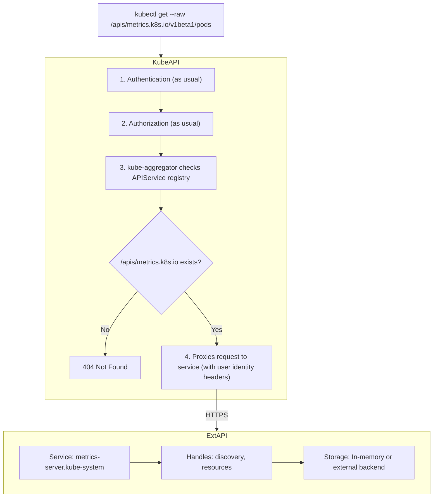
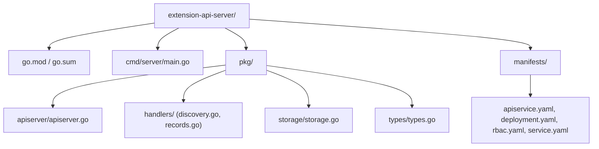

# Module 1.8: API Aggregation & Extension API Servers

> **Complexity**: `[COMPLEX]` - Building custom API servers
>
> **Time to Complete**: 5 hours
>
> **Prerequisites**: Module 1.6 (Admission Webhooks), understanding of TLS, HTTP REST APIs, RBAC, and Go basics

## Learning Outcomes

By the end of this module, you will be able to:

1. **Design** an API aggregation architecture that routes dynamic or externally stored data through the Kubernetes API without pushing high-volume records into etcd.
2. **Implement** the discovery, list, get, health, TLS, and routing contracts required for a Kubernetes extension API server in Go.
3. **Diagnose** `APIService` availability, discovery, TLS, authentication, and RBAC delegation failures by following the kube-aggregator request path.
4. **Evaluate** whether a feature belongs in a CRD, an admission webhook, a controller, or an aggregated API based on storage, traffic, authorization, and subresource requirements.

## Why This Module Matters

Hypothetical scenario: your platform team is asked to expose a large stream of application latency measurements through `kubectl` because developers already know how to use Kubernetes resource discovery, RBAC, namespace filtering, and JSONPath output. A quick first design creates a `LatencySample` CRD and a controller that writes every scrape as a Kubernetes object. The first demo looks elegant, but the design quietly turns the control plane datastore into a telemetry database, and that is not what etcd is built to be.

The problem is not that CRDs are weak. CRDs are one of the strongest extension mechanisms in Kubernetes because they give you schema validation, watch behavior, server-side apply, storage, admission integration, and familiar client behavior with very little custom code. The problem is that every CRD object is part of the cluster's declarative state. If you use that machinery for volatile measurements, expensive computed reports, or objects whose source of truth lives in a database outside the cluster, you pay the cost in the most sensitive place: the Kubernetes API server and its backing etcd cluster.

API aggregation solves a different class of problem. It lets the main Kubernetes API server keep acting as the front door, while a separate HTTPS service answers requests for a particular API group and version. A learner can still run `kubectl get datarecords -A`, RBAC can still be evaluated consistently, discovery can still list the resource, and client libraries can still speak Kubernetes-shaped HTTP, but the bytes do not have to be stored as CRD objects in etcd. That separation is why `metrics.k8s.io` and custom metrics adapters can feel native to users while serving data that is computed, cached, or read from another backend.

This module walks through that seam carefully because aggregated APIs are easy to misunderstand. They are not "CRDs with a custom database" as a simple feature toggle; they are full API servers that must implement Kubernetes discovery, object encoding, status responses, TLS, health checks, authentication handoff, and authorization decisions. You get unusual power, including custom storage and specialized subresources, but you also accept operational duties that the core API server normally handles for you.

The practical goal is not to make every platform API look like Kubernetes. The practical goal is to decide when the Kubernetes API boundary gives users a meaningful advantage over a separate CLI, dashboard, or service endpoint. Aggregation is compelling when the same people already rely on Kubernetes namespaces, RBAC, audit logs, resource discovery, and client tooling to do their work. It is much less compelling when the only reason is aesthetic consistency, because then the team accepts a custom API server without gaining much operational leverage.

A good aggregation design also protects the rest of the control plane from your product assumptions. If the external backend slows down, your API group should fail clearly without making unrelated native resources hard to list. If your response format changes, clients should see a versioned API contract rather than a surprise in a core group. If the API becomes popular, you can scale and cache your backend separately instead of discovering too late that your cluster datastore has become the accidental integration bus.

## CRDs vs API Aggregation

If the Kubernetes API server is a government building, CRDs are like adding a new department inside the building. They use the existing filing cabinets, the existing security desk, the existing archive process, and the existing public counter. An aggregated API server is more like an embassy inside the same building: visitors enter through the same front door and follow the same visible protocol, but requests for that embassy are routed to staff who run their own records system, apply specialized rules, and return answers in the format the building expects.

That analogy matters because the user experience can look almost identical while the implementation risk is completely different. A CRD author writes an OpenAPI schema and usually a controller; the Kubernetes API server stores the objects and handles the basic REST machinery. An aggregated API author writes the REST machinery directly. The kube-aggregator only decides that a request for a registered group and version should be proxied to your service; your service must then behave enough like Kubernetes for `kubectl`, controllers, discovery clients, and operators to trust it.

| Requirement | CRD | API Aggregation |
|------------|-----|-----------------|
| CRUD on YAML-like resources | Yes | Yes |
| Stored in etcd | Yes (automatic) | No (bring your own storage) |
| Standard RBAC | Yes (automatic) | You implement or delegate |
| Custom storage backend | No | Yes |
| Custom subresources (beyond status/scale) | Limited | Yes |
| Custom verbs (connect, proxy) | No | Yes |
| Computed/dynamic responses | Poor fit | Strong fit |
| Short-lived / volatile data | Wasteful (etcd) | Ideal |
| Custom admission logic | Via webhooks | Built into your server |
| Kubernetes watch support | Automatic | You implement |
| Effort to implement | Low | High |

Use a CRD when the resource is declarative desired state. If a human or controller creates an object, expects the object to persist, watches it for status, and wants Kubernetes to own validation and storage, a CRD is normally the right answer. A `BackupPolicy`, `DatabaseCluster`, `CertificateRequest`, or `NetworkIntent` usually belongs there because the cluster should remember it and reconcile around it. The moment you say "we need a custom object," your default should still be CRD until a specific requirement pushes you away.

Use API aggregation when the Kubernetes API shape is valuable but the Kubernetes storage model is wrong. External data sources, computed reports, high-frequency metrics, streaming operations, unusual subresources, and direct integration with a specialized backend are the common signals. For example, a compliance API might expose generated findings from a graph database, while a metrics API might return a fresh view from Prometheus or another time-series store. The object looks native to clients, but the source of truth remains where it belongs.

Pause and predict: what do you think happens if a controller updates a CRD object every few seconds for every pod on every node, and those updates include large status payloads? The workload may look harmless because each update is a normal Kubernetes request, yet the aggregate effect is repeated writes, watch fan-out, compaction pressure, and unnecessary history in etcd. That is the design pressure API aggregation is meant to relieve, not because it is easier, but because it moves the volatile part out of the core control plane.

The easiest review question is "would we want to restore this data from an etcd backup during a cluster recovery?" If the answer is yes, the resource is probably declarative state and should lean toward a CRD. If the answer is no because the data can be recomputed, re-queried, or expires quickly, an aggregated API may be a better fit. This recovery framing prevents a common mistake: confusing convenient access through Kubernetes with ownership by Kubernetes.

Another useful question is "who is allowed to make the final decision about this object?" A CRD usually means Kubernetes validation, admission, and controllers define the resource lifecycle. An aggregated API may need to combine Kubernetes RBAC with backend-specific authorization, because a user who can list a namespace in Kubernetes might not be allowed to read every record in an external database. That double authorization model is powerful, but it must be explicit or your API will surprise both cluster administrators and backend owners.

The following diagram preserves the basic request path you should keep in your head. The client does not call the extension service directly. The client calls the main Kubernetes API server, the normal authentication and authorization stages run first, and the aggregation layer consults the `APIService` registry to decide whether the path belongs to a proxied backend. Only after those checks does the request cross the internal HTTPS connection to your server.



The diagram also hints at the main security boundary. Your backend is not trusted simply because it is a Service in the cluster, and incoming identity headers are not trustworthy unless your server verifies that the request came from the aggregator front proxy. A direct call from another pod must not be able to forge `X-Remote-User: cluster-admin` and receive privileged data. That is why TLS, request-header authentication, auth delegation, network exposure, and RBAC are part of the design rather than deployment details you can bolt on later.

Notice that the aggregator does not make the backend magically stateless or safe. It gives the backend a place in the Kubernetes request path and a way to participate in discovery. Your server still owns its storage error handling, timeout budget, response size, and resource model. A slow backend query can become a slow Kubernetes API call for this group, so design timeouts and cache boundaries before users build automation that assumes the API responds like a native object store.

## The APIService Resource

An `APIService` object is the routing contract between the main API server and your extension server. It says that a group and version, such as `data.kubedojo.io/v1alpha1`, should be served by a named Kubernetes Service on a specific port. The object also includes priority values that affect discovery ordering and a certificate authority bundle that lets the aggregator verify the backend server certificate. If those details are wrong, your server can be perfectly healthy and still invisible to clients.

The name of the object is intentionally mechanical: `{version}.{group}`. That convention allows a human to inspect the registry and immediately see which version of which group is being delegated. It also keeps the routing table deterministic, which matters when several API groups and versions are installed in the same cluster. Before running this, what output do you expect from `kubectl get apiservice v1alpha1.data.kubedojo.io` if the Service exists but the TLS certificate does not match the Service DNS name?

```yaml
apiVersion: apiregistration.k8s.io/v1
kind: APIService
metadata:
  name: v1alpha1.data.kubedojo.io     # {version}.{group}
spec:
  group: data.kubedojo.io
  version: v1alpha1
  service:
    name: kubedojo-data-api            # Service name
    namespace: kubedojo-system          # Service namespace
    port: 443
  groupPriorityMinimum: 1000          # Priority over other groups
  versionPriority: 15                  # Priority over other versions
  caBundle: <base64-encoded-CA-cert>   # CA to verify backend TLS
  insecureSkipTLSVerify: false         # Never true in production
```

The two priority fields are easy to copy without understanding, but they deserve attention. `groupPriorityMinimum` controls the relative ordering of API groups during discovery, while `versionPriority` controls preferred version ordering inside the group. You normally choose values that make your group discoverable without competing with built-in Kubernetes groups. Registering an experimental server under a built-in group with inappropriate priority is not an experiment anymore; it can change how clients resolve resources that operators assume are native.

| Field | Description | Typical Value |
|-------|------------|---------------|
| `group` | API group this service handles | `data.kubedojo.io` |
| `version` | API version | `v1alpha1` |
| `service.name` | Kubernetes Service pointing to your server | `kubedojo-data-api` |
| `service.namespace` | Namespace of the Service | `kubedojo-system` |
| `service.port` | Port of the Service | `443` |
| `groupPriorityMinimum` | Priority for API group discovery (higher = more important) | `1000` |
| `versionPriority` | Priority within the group (higher = preferred version) | `15` |
| `caBundle` | Base64 CA cert for TLS verification | CA cert bytes |
| `insecureSkipTLSVerify` | Skip TLS verification (development only) | `false` |

The proxy step is also more specific than many first implementations assume. The original bearer token is not simply handed to your backend, because the backend should trust the aggregator as a front proxy and receive a normalized identity. In common extension API server setups, the aggregator authenticates to your server with its front-proxy client credentials, and the original user identity is conveyed through request headers such as `X-Remote-User` and `X-Remote-Group`. Your server must verify the proxy client before treating those headers as authoritative.

This trust model explains why extension API servers often need to read the `extension-apiserver-authentication` ConfigMap from `kube-system`. That ConfigMap contains request-header client configuration that lets the extension server validate the aggregator's client certificate and header names. Without that validation, the server cannot distinguish a real proxied request from a direct caller that copied header names from documentation. In other words, the header is not the proof; the verified front-proxy connection is the proof that makes the header meaningful.

```text
Original request:
  GET /apis/data.kubedojo.io/v1alpha1/namespaces/default/datarecords
  Authorization: Bearer <user-token>

Proxied request to your server:
  GET /apis/data.kubedojo.io/v1alpha1/namespaces/default/datarecords
  X-Remote-User: alice
  X-Remote-Group: developers
  X-Remote-Group: system:authenticated
  Authorization: Bearer <aggregator-token>
```

Pause and predict: the kube-aggregator passes the original user's identity through request headers after authenticating the user at the main API server. If your extension API server is also exposed through a NodePort, and a pod connects directly while forging those same headers, what should happen? The correct outcome is rejection unless the caller proves it is the trusted request-header client; otherwise you have built an authorization bypass with a Kubernetes-shaped interface.

You should also think about auditability at this boundary. The main API server can audit the incoming request to the aggregated path, but your backend may need its own logs to explain how Kubernetes identity mapped to backend access. Logging only the backend database account is not enough for investigations, and logging only the Kubernetes username may not explain why the backend rejected a query. A production design should record both identities, the namespace or resource scope, and the delegated authorization result without storing sensitive payload data.

## Building an Extension API Server

Building an extension API server means writing an HTTPS web service that follows Kubernetes API conventions closely enough for generic clients to operate. The service needs discovery endpoints so clients can find resources, resource endpoints so clients can list and get objects, health endpoints so the aggregator can decide whether routing is safe, and Kubernetes-style status objects so failures are understandable. If you skip one of these contracts, the symptom often appears somewhere else, such as a missing resource in `kubectl api-resources` or a confusing timeout from a controller.

The minimum resource surface below is intentionally small. It does not implement create, update, delete, patch, watch, OpenAPI, admission chains, conversion, or server-side apply, because the module focuses on the aggregation contract before the full production surface. That is a deliberate scaffold: first make discovery and read paths correct, then add mutating verbs and watch behavior only when your storage layer can support their consistency requirements.

This staged approach mirrors how native API features depend on one another. Discovery tells clients what exists; list and get prove that the object envelope is correct; status responses make failure behavior predictable; health and readiness tell the aggregator whether it should route traffic. Only after those fundamentals are dependable does it make sense to discuss watches, writes, conversion, or admission-like validation. If you reverse that order, you can spend days debugging advanced features while the API group is not even discoverable.

| Endpoint | Purpose | Required |
|----------|---------|----------|
| `/apis/{group}/{version}` | API resource discovery | Yes |
| `/apis/{group}` | Group discovery | Yes (for proper kubectl behavior) |
| `/apis` | Root discovery | Optional (aggregator handles this) |
| `/apis/{group}/{version}/{resource}` | List resources | Yes |
| `/apis/{group}/{version}/namespaces/{ns}/{resource}` | List namespaced resources | If namespaced |
| `/apis/{group}/{version}/namespaces/{ns}/{resource}/{name}` | Get single resource | Yes |
| `/healthz` | Health check | Yes |
| `/openapi/v2` or `/openapi/v3` | OpenAPI schema | Recommended |

The project structure separates the concerns you would expect in a small API server. Types define the JSON shape clients see, storage defines how records are found, handlers translate HTTP paths into Kubernetes-style responses, and the main entry point wires TLS and routing together. In a production server you would probably use the Kubernetes generic apiserver libraries or a framework, but a small direct HTTP implementation is useful because it reveals the exact protocol obligations that frameworks otherwise hide.

The folder names are not only cosmetic. They make ownership clearer when the implementation grows: storage engineers can reason about backend queries, API reviewers can inspect object shapes, and platform engineers can review routing and authentication. This separation also prevents a subtle failure mode where discovery logic starts making backend calls. Discovery should be cheap and reliable because clients and the aggregator may call it frequently; if discovery depends on a slow database, your entire API group can look unhealthy when only one dependency is degraded.



The API types embed `metav1.TypeMeta` and `metav1.ObjectMeta` because Kubernetes clients expect ordinary objects to carry kind, API version, name, namespace, labels, annotations, UID, creation timestamp, and resource version in familiar places. You are not required to make every backend record a Kubernetes object internally, but the response at the API boundary must look like one. That boundary is what lets `kubectl get`, JSONPath, table output, and generic serializers behave predictably.

Be careful not to treat metadata fields as meaningless decoration. Names and namespaces define the resource identity that users will type, resource versions shape list and watch semantics, and labels or annotations may become part of automation. If your backend cannot provide a stable UID or resource version, you need to decide how much Kubernetes compatibility you are honestly offering. A read-only reporting API can sometimes use simple generated values, while a controller-facing API needs stronger consistency guarantees.

```go
// pkg/types/types.go
package types

import metav1 "k8s.io/apimachinery/pkg/apis/meta/v1"

// DataRecord represents a record from an external database.
type DataRecord struct {
	metav1.TypeMeta   `json:",inline"`
	metav1.ObjectMeta `json:"metadata,omitempty"`

	Spec   DataRecordSpec   `json:"spec"`
	Status DataRecordStatus `json:"status,omitempty"`
}

type DataRecordSpec struct {
	// Source is the external database that holds this record.
	Source string `json:"source"`

	// Query is the query or key used to retrieve this record.
	Query string `json:"query"`

	// Data holds the record data as key-value pairs.
	Data map[string]string `json:"data,omitempty"`
}

type DataRecordStatus struct {
	// LastSyncTime is when the record was last read from the source.
	LastSyncTime metav1.Time `json:"lastSyncTime,omitempty"`

	// SyncStatus indicates whether the record is current.
	SyncStatus string `json:"syncStatus,omitempty"`
}

// DataRecordList is a list of DataRecord resources.
type DataRecordList struct {
	metav1.TypeMeta `json:",inline"`
	metav1.ListMeta `json:"metadata,omitempty"`

	Items []DataRecord `json:"items"`
}
```

The storage backend is deliberately in memory so the code remains readable, but the key idea is the same for PostgreSQL, Redis, Prometheus, or another service. The extension server owns the read path and translates Kubernetes list or get requests into backend operations. That means the backend can use its own indexes, retention policy, query language, and caching strategy, while the API server returns a Kubernetes object envelope to the caller.

In a real backend, list operations deserve special design. Kubernetes users expect list to be safe, but external databases may contain far more data than a native Kubernetes namespace would normally hold. Pagination, filtering, and timeout behavior should be designed before launch, not after a user runs `kubectl get datarecords -A -o yaml` and receives a response too large to handle. The Kubernetes API shape does not remove the need for database query discipline.

```go
// pkg/storage/storage.go
package storage

import (
	"fmt"
	"sync"
	"time"

	metav1 "k8s.io/apimachinery/pkg/apis/meta/v1"

	"github.com/kubedojo/extension-api/pkg/types"
)

// Store is an in-memory store that simulates an external database.
// In production, this would be a real database client.
type Store struct {
	mu      sync.RWMutex
	records map[string]map[string]*types.DataRecord // namespace -> name -> record
}

// NewStore creates a new in-memory store with seed data.
func NewStore() *Store {
	s := &Store{
		records: make(map[string]map[string]*types.DataRecord),
	}
	s.seed()
	return s
}

func (s *Store) seed() {
	now := metav1.Now()

	seedData := []types.DataRecord{
		{
			TypeMeta: metav1.TypeMeta{
				APIVersion: "data.kubedojo.io/v1alpha1",
				Kind:       "DataRecord",
			},
			ObjectMeta: metav1.ObjectMeta{
				Name:              "user-config",
				Namespace:         "default",
				CreationTimestamp: now,
				ResourceVersion:   "1",
				UID:               "a1b2c3d4-0001-0001-0001-000000000001",
			},
			Spec: types.DataRecordSpec{
				Source: "postgres",
				Query:  "SELECT * FROM config WHERE env='production'",
				Data: map[string]string{
					"max_connections": "100",
					"timeout_ms":      "5000",
					"log_level":       "info",
				},
			},
			Status: types.DataRecordStatus{
				LastSyncTime: now,
				SyncStatus:   "Current",
			},
		},
		{
			TypeMeta: metav1.TypeMeta{
				APIVersion: "data.kubedojo.io/v1alpha1",
				Kind:       "DataRecord",
			},
			ObjectMeta: metav1.ObjectMeta{
				Name:              "feature-flags",
				Namespace:         "default",
				CreationTimestamp: now,
				ResourceVersion:   "2",
				UID:               "a1b2c3d4-0001-0001-0001-000000000002",
			},
			Spec: types.DataRecordSpec{
				Source: "redis",
				Query:  "HGETALL feature:flags",
				Data: map[string]string{
					"dark_mode":     "true",
					"new_dashboard": "false",
					"beta_api":      "true",
				},
			},
			Status: types.DataRecordStatus{
				LastSyncTime: now,
				SyncStatus:   "Current",
			},
		},
		{
			TypeMeta: metav1.TypeMeta{
				APIVersion: "data.kubedojo.io/v1alpha1",
				Kind:       "DataRecord",
			},
			ObjectMeta: metav1.ObjectMeta{
				Name:              "metrics-config",
				Namespace:         "monitoring",
				CreationTimestamp: now,
				ResourceVersion:   "3",
				UID:               "a1b2c3d4-0001-0001-0001-000000000003",
			},
			Spec: types.DataRecordSpec{
				Source: "consul",
				Query:  "kv/monitoring/config",
				Data: map[string]string{
					"scrape_interval": "15s",
					"retention_days":  "30",
				},
			},
			Status: types.DataRecordStatus{
				LastSyncTime: metav1.NewTime(now.Add(-5 * time.Minute)),
				SyncStatus:   "Stale",
			},
		},
	}

	for i := range seedData {
		record := &seedData[i]
		ns := record.Namespace
		if s.records[ns] == nil {
			s.records[ns] = make(map[string]*types.DataRecord)
		}
		s.records[ns][record.Name] = record
	}
}

// List returns all records in a namespace (empty string = all namespaces).
func (s *Store) List(namespace string) []types.DataRecord {
	s.mu.RLock()
	defer s.mu.RUnlock()

	var result []types.DataRecord

	if namespace == "" {
		for _, nsRecords := range s.records {
			for _, r := range nsRecords {
				result = append(result, *r)
			}
		}
	} else {
		nsRecords, ok := s.records[namespace]
		if !ok {
			return nil
		}
		for _, r := range nsRecords {
			result = append(result, *r)
		}
	}

	return result
}

// Get returns a single record by namespace and name.
func (s *Store) Get(namespace, name string) (*types.DataRecord, error) {
	s.mu.RLock()
	defer s.mu.RUnlock()

	nsRecords, ok := s.records[namespace]
	if !ok {
		return nil, fmt.Errorf("not found")
	}

	record, ok := nsRecords[name]
	if !ok {
		return nil, fmt.Errorf("not found")
	}

	return record, nil
}
```

Discovery handlers are where many first attempts fail. `kubectl` does not know your resource exists because you wrote a Go struct; it knows because the aggregated endpoint returns `APIGroup` and `APIResourceList` payloads that describe group versions, resource names, scope, kind, verbs, short names, and categories. If this payload is missing, malformed, served at the wrong path, or delayed by a slow backend query, the aggregator marks the `APIService` unavailable and discovery clients stop seeing the group.

Discovery also defines the promise your server is making to clients. If the resource list says `watch` is supported, controllers may open watches. If it says `delete` is supported, operators may try to remove objects. If it marks the resource namespaced, clients will construct namespaced paths. Keep the advertised verbs and scope aligned with the handlers you actually wrote, because generic Kubernetes tooling believes discovery more than comments in your repository.

```go
// pkg/handlers/discovery.go
package handlers

import (
	"encoding/json"
	"net/http"

	metav1 "k8s.io/apimachinery/pkg/apis/meta/v1"
)

// HandleGroupDiscovery returns the API group information.
func HandleGroupDiscovery(w http.ResponseWriter, r *http.Request) {
	group := metav1.APIGroup{
		TypeMeta: metav1.TypeMeta{
			Kind:       "APIGroup",
			APIVersion: "v1",
		},
		Name: "data.kubedojo.io",
		Versions: []metav1.GroupVersionForDiscovery{
			{
				GroupVersion: "data.kubedojo.io/v1alpha1",
				Version:      "v1alpha1",
			},
		},
		PreferredVersion: metav1.GroupVersionForDiscovery{
			GroupVersion: "data.kubedojo.io/v1alpha1",
			Version:      "v1alpha1",
		},
	}

	w.Header().Set("Content-Type", "application/json")
	json.NewEncoder(w).Encode(group)
}

// HandleResourceDiscovery returns the available resources in the API group version.
func HandleResourceDiscovery(w http.ResponseWriter, r *http.Request) {
	resourceList := metav1.APIResourceList{
		TypeMeta: metav1.TypeMeta{
			Kind:       "APIResourceList",
			APIVersion: "v1",
		},
		GroupVersion: "data.kubedojo.io/v1alpha1",
		APIResources: []metav1.APIResource{
			{
				Name:         "datarecords",
				SingularName: "datarecord",
				Namespaced:   true,
				Kind:         "DataRecord",
				Verbs: metav1.Verbs{
					"get", "list",
				},
				ShortNames: []string{"dr"},
				Categories: []string{"all", "kubedojo"},
			},
		},
	}

	w.Header().Set("Content-Type", "application/json")
	json.NewEncoder(w).Encode(resourceList)
}
```

The resource handlers show the second contract: successful responses need Kubernetes object shapes, and unsuccessful responses should use `metav1.Status` instead of arbitrary plain text. That choice affects more than cosmetics. Generic clients inspect status reason and code fields, automation can distinguish not found from forbidden, and learners see errors that resemble native Kubernetes APIs instead of raw web-server behavior.

For authorization failures, the same principle applies. Return a Kubernetes-style forbidden status that explains the verb, resource, namespace, and reason as clearly as possible without leaking backend secrets. If the backend denies access because of a domain-specific rule, translate that decision into an HTTP status and message that Kubernetes users can act on. A vague 500 error teaches users to retry; a precise 403 teaches them to inspect RBAC or backend permissions.

```go
// pkg/handlers/records.go
package handlers

import (
	"encoding/json"
	"log"
	"net/http"
	"strings"

	metav1 "k8s.io/apimachinery/pkg/apis/meta/v1"

	"github.com/kubedojo/extension-api/pkg/storage"
	"github.com/kubedojo/extension-api/pkg/types"
)

// RecordHandler handles DataRecord requests.
type RecordHandler struct {
	Store *storage.Store
}

// HandleList handles LIST requests.
func (h *RecordHandler) HandleList(w http.ResponseWriter, r *http.Request) {
	namespace := extractNamespace(r.URL.Path)

	// Log the impersonated user (set by kube-aggregator).
	user := r.Header.Get("X-Remote-User")
	groups := r.Header.Get("X-Remote-Group")
	if user != "" {
		log.Printf("Request from user=%s groups=%s namespace=%s",
			user, groups, namespace)
	}

	records := h.Store.List(namespace)

	list := types.DataRecordList{
		TypeMeta: metav1.TypeMeta{
			APIVersion: "data.kubedojo.io/v1alpha1",
			Kind:       "DataRecordList",
		},
		ListMeta: metav1.ListMeta{
			ResourceVersion: "1",
		},
		Items: records,
	}

	if list.Items == nil {
		list.Items = []types.DataRecord{}
	}

	w.Header().Set("Content-Type", "application/json")
	json.NewEncoder(w).Encode(list)
}

// HandleGet handles GET requests for a single resource.
func (h *RecordHandler) HandleGet(w http.ResponseWriter, r *http.Request) {
	namespace := extractNamespace(r.URL.Path)
	name := extractName(r.URL.Path)

	record, err := h.Store.Get(namespace, name)
	if err != nil {
		status := metav1.Status{
			TypeMeta: metav1.TypeMeta{
				Kind:       "Status",
				APIVersion: "v1",
			},
			Status:  "Failure",
			Message: "datarecords \"" + name + "\" not found",
			Reason:  metav1.StatusReasonNotFound,
			Code:    http.StatusNotFound,
		}
		w.Header().Set("Content-Type", "application/json")
		w.WriteHeader(http.StatusNotFound)
		json.NewEncoder(w).Encode(status)
		return
	}

	w.Header().Set("Content-Type", "application/json")
	json.NewEncoder(w).Encode(record)
}

// extractNamespace extracts the namespace from the URL path.
// Path format: /apis/data.kubedojo.io/v1alpha1/namespaces/{namespace}/datarecords/...
func extractNamespace(path string) string {
	parts := strings.Split(path, "/")
	for i, part := range parts {
		if part == "namespaces" && i+1 < len(parts) {
			return parts[i+1]
		}
	}
	return "" // cluster-scoped or list all
}

// extractName extracts the resource name from the URL path.
func extractName(path string) string {
	parts := strings.Split(strings.TrimSuffix(path, "/"), "/")
	return parts[len(parts)-1]
}
```

The main server ties those handlers to exact paths. This direct multiplexer is not a complete production API server, but it makes the URL responsibility visible: namespaced and cluster-wide list paths are different paths, and the handler must intentionally support both. A common mistake is to test only the cluster-wide list and then discover that `kubectl get datarecords -n default` times out or returns 404 because the namespaced route was never registered.

```go
// cmd/server/main.go
package main

import (
	"context"
	"log"
	"net/http"
	"os"
	"os/signal"
	"strings"
	"syscall"
	"time"

	"github.com/kubedojo/extension-api/pkg/handlers"
	"github.com/kubedojo/extension-api/pkg/storage"
)

const (
	certFile = "/etc/apiserver/certs/tls.crt"
	keyFile  = "/etc/apiserver/certs/tls.key"
)

func main() {
	store := storage.NewStore()
	recordHandler := &handlers.RecordHandler{Store: store}

	mux := http.NewServeMux()

	// Health check.
	mux.HandleFunc("/healthz", func(w http.ResponseWriter, r *http.Request) {
		w.WriteHeader(http.StatusOK)
		w.Write([]byte("ok"))
	})

	// API group discovery.
	mux.HandleFunc("/apis/data.kubedojo.io", func(w http.ResponseWriter, r *http.Request) {
		if r.URL.Path == "/apis/data.kubedojo.io" ||
			r.URL.Path == "/apis/data.kubedojo.io/" {
			handlers.HandleGroupDiscovery(w, r)
			return
		}
		http.NotFound(w, r)
	})

	// Version resource discovery.
	mux.HandleFunc("/apis/data.kubedojo.io/v1alpha1", func(w http.ResponseWriter, r *http.Request) {
		if r.URL.Path == "/apis/data.kubedojo.io/v1alpha1" ||
			r.URL.Path == "/apis/data.kubedojo.io/v1alpha1/" {
			handlers.HandleResourceDiscovery(w, r)
			return
		}
		http.NotFound(w, r)
	})

	// Namespaced resource endpoints.
	mux.HandleFunc("/apis/data.kubedojo.io/v1alpha1/namespaces/", func(w http.ResponseWriter, r *http.Request) {
		path := r.URL.Path

		// Match: /apis/.../namespaces/{ns}/datarecords
		// Match: /apis/.../namespaces/{ns}/datarecords/{name}
		if strings.Contains(path, "/datarecords") {
			parts := strings.Split(strings.TrimSuffix(path, "/"), "/")
			drIdx := -1
			for i, p := range parts {
				if p == "datarecords" {
					drIdx = i
					break
				}
			}

			if drIdx == -1 {
				http.NotFound(w, r)
				return
			}

			if drIdx == len(parts)-1 {
				recordHandler.HandleList(w, r)
			} else {
				recordHandler.HandleGet(w, r)
			}
			return
		}

		http.NotFound(w, r)
	})

	// Cluster-wide list (all namespaces).
	mux.HandleFunc("/apis/data.kubedojo.io/v1alpha1/datarecords", func(w http.ResponseWriter, r *http.Request) {
		recordHandler.HandleList(w, r)
	})

	server := &http.Server{
		Addr:         ":8443",
		Handler:      mux,
		ReadTimeout:  10 * time.Second,
		WriteTimeout: 10 * time.Second,
	}

	go func() {
		sigCh := make(chan os.Signal, 1)
		signal.Notify(sigCh, syscall.SIGINT, syscall.SIGTERM)
		<-sigCh
		log.Println("Shutting down extension API server")
		ctx, cancel := context.WithTimeout(context.Background(), 5*time.Second)
		defer cancel()
		server.Shutdown(ctx)
	}()

	log.Println("Starting extension API server on :8443")
	if err := server.ListenAndServeTLS(certFile, keyFile); err != http.ErrServerClosed {
		log.Fatalf("Server failed: %v", err)
	}
}
```

This example is intentionally read-only, which is the safest place to start. The moment you add writes, you need a story for optimistic concurrency, resource versions, validation, defaulting, authorization for each verb, and conflict behavior. The moment you add watch, you need a durable event source or a cache that can stream changes without lying about ordering. Aggregation removes etcd pressure from the core API, but it does not remove the distributed systems work from your API design.

A read-only design can still be valuable in production. Metrics, compliance findings, inventory, external configuration views, and generated reports often need discovery and authorization more than mutation. That narrow scope lets you deliver a native experience while avoiding write-path complexity. It also gives you a clean upgrade path: if users later need create or update, you can evaluate whether those writes belong in the external backend, in a CRD that drives the backend, or in a separate workflow.

## Deployment, TLS, and Delegated Authentication

Deployment has four jobs: run the server, expose it through a stable Service, issue a certificate whose DNS names match that Service, and grant the server enough RBAC to participate in authentication and authorization delegation. Treat those as one system, not four independent YAML snippets. A correct `APIService` with a broken certificate fails; a correct certificate with missing discovery fails; a healthy server with missing delegated-auth permissions can accept traffic but make the wrong trust decision.

The dependency order is worth making boring. Create the namespace and ServiceAccount first, bind the permissions that let the server participate in delegated auth, issue the serving certificate, start the Deployment, expose it with a Service, and only then register the `APIService`. Registering too early is not fatal, but it creates noisy failure conditions that can hide the real readiness signal. In controlled rollouts, teams often apply the `APIService` last for exactly that reason.

First, cert-manager issues an internal certificate for the service DNS names used by the aggregator. A self-signed Issuer is fine for a lab because the `APIService` includes the CA bundle injected from the Certificate, but production teams usually anchor this in a cluster or organizational CA policy. The important requirement is not the issuer brand; it is that the aggregator verifies the backend endpoint it intended to reach, and that production does not rely on `insecureSkipTLSVerify`.

```yaml
# manifests/issuer.yaml
apiVersion: cert-manager.io/v1
kind: Issuer
metadata:
  name: api-selfsigned
  namespace: kubedojo-system
spec:
  selfSigned: {}
```

```yaml
# manifests/certificate.yaml
apiVersion: cert-manager.io/v1
kind: Certificate
metadata:
  name: kubedojo-data-api-cert
  namespace: kubedojo-system
spec:
  secretName: kubedojo-data-api-tls
  duration: 8760h
  renewBefore: 720h
  issuerRef:
    name: api-selfsigned
    kind: Issuer
  dnsNames:
  - kubedojo-data-api.kubedojo-system.svc
  - kubedojo-data-api.kubedojo-system.svc.cluster.local
```

The Deployment is ordinary Kubernetes, which is one of the pleasant parts of aggregated APIs. Your server is just a workload behind a Service, so you can use replicas, probes, resource requests, anti-affinity, Pod security settings, and normal rollout practices. The unusual part is that downtime or bad readiness behavior does not only affect one application; it can make an API group disappear from discovery and disrupt clients that expect that group to be part of the cluster API.

```yaml
# manifests/namespace.yaml
apiVersion: v1
kind: Namespace
metadata:
  name: kubedojo-system
```

```yaml
# manifests/deployment.yaml
apiVersion: apps/v1
kind: Deployment
metadata:
  name: kubedojo-data-api
  namespace: kubedojo-system
spec:
  replicas: 2
  selector:
    matchLabels:
      app: kubedojo-data-api
  template:
    metadata:
      labels:
        app: kubedojo-data-api
    spec:
      serviceAccountName: kubedojo-data-api
      containers:
      - name: server
        image: kubedojo-data-api:0.35.0
        ports:
        - containerPort: 8443
        volumeMounts:
        - name: certs
          mountPath: /etc/apiserver/certs
          readOnly: true
        readinessProbe:
          httpGet:
            path: /healthz
            port: 8443
            scheme: HTTPS
          initialDelaySeconds: 5
          periodSeconds: 10
        livenessProbe:
          httpGet:
            path: /healthz
            port: 8443
            scheme: HTTPS
          initialDelaySeconds: 15
          periodSeconds: 20
        resources:
          requests:
            cpu: 50m
            memory: 64Mi
          limits:
            cpu: 200m
            memory: 128Mi
      volumes:
      - name: certs
        secret:
          secretName: kubedojo-data-api-tls
```

```yaml
# manifests/service.yaml
apiVersion: v1
kind: Service
metadata:
  name: kubedojo-data-api
  namespace: kubedojo-system
spec:
  selector:
    app: kubedojo-data-api
  ports:
  - port: 443
    targetPort: 8443
    protocol: TCP
```

RBAC for an extension server is often confusing because there are two related but separate questions. First, what permissions does the server's ServiceAccount need so the server can validate delegated authentication and authorization? Second, what permissions should end users receive for the aggregated resources themselves? The lab focuses on the first question because it is required for safe identity handling; production systems also need clear user-facing roles for resources such as `datarecords`.

Do not merge those questions in policy reviews. The server ServiceAccount may need permission to create `SubjectAccessReview` objects so it can ask the main API server whether a user is allowed to perform an action. That does not mean ordinary users should receive broad permissions on the aggregated resources. Conversely, granting users access to `datarecords` does not automatically make the backend safe unless the extension server checks that identity and maps it to the backend authorization model.

```yaml
# manifests/serviceaccount.yaml
apiVersion: v1
kind: ServiceAccount
metadata:
  name: kubedojo-data-api
  namespace: kubedojo-system
```

```yaml
# manifests/clusterrole.yaml
apiVersion: rbac.authorization.k8s.io/v1
kind: ClusterRole
metadata:
  name: kubedojo-data-api
rules:
# The extension API server needs to read authentication config.
- apiGroups: [""]
  resources: ["namespaces"]
  verbs: ["get", "list", "watch"]
# For auth delegation (authn/authz).
- apiGroups: ["authentication.k8s.io"]
  resources: ["tokenreviews"]
  verbs: ["create"]
- apiGroups: ["authorization.k8s.io"]
  resources: ["subjectaccessreviews"]
  verbs: ["create"]
```

```yaml
# manifests/clusterrolebinding.yaml
apiVersion: rbac.authorization.k8s.io/v1
kind: ClusterRoleBinding
metadata:
  name: kubedojo-data-api
roleRef:
  apiGroup: rbac.authorization.k8s.io
  kind: ClusterRole
  name: kubedojo-data-api
subjects:
- kind: ServiceAccount
  name: kubedojo-data-api
  namespace: kubedojo-system
```

```yaml
# manifests/auth-delegator-binding.yaml
# Allow the extension API server to delegate authentication and authorization.
apiVersion: rbac.authorization.k8s.io/v1
kind: ClusterRoleBinding
metadata:
  name: kubedojo-data-api:system:auth-delegator
roleRef:
  apiGroup: rbac.authorization.k8s.io
  kind: ClusterRole
  name: system:auth-delegator
subjects:
- kind: ServiceAccount
  name: kubedojo-data-api
  namespace: kubedojo-system
```

```yaml
# manifests/auth-reader-binding.yaml
# Allow reading the extension API server authentication configmap.
apiVersion: rbac.authorization.k8s.io/v1
kind: RoleBinding
metadata:
  name: kubedojo-data-api:auth-reader
  namespace: kube-system
roleRef:
  apiGroup: rbac.authorization.k8s.io
  kind: Role
  name: extension-apiserver-authentication-reader
subjects:
- kind: ServiceAccount
  name: kubedojo-data-api
  namespace: kubedojo-system
```

Finally, the `APIService` registers the group and version. The cert-manager annotation injects the CA bundle from the Certificate so the aggregator can validate the backend TLS certificate. If you are troubleshooting, compare the Service DNS names, the certificate DNS names, the `service` reference, and the injected `caBundle` before changing application code. Many `FailedDiscoveryCheck` incidents are really certificate or Service routing issues.

```yaml
# manifests/apiservice.yaml
apiVersion: apiregistration.k8s.io/v1
kind: APIService
metadata:
  name: v1alpha1.data.kubedojo.io
  annotations:
    cert-manager.io/inject-ca-from: kubedojo-system/kubedojo-data-api-cert
spec:
  group: data.kubedojo.io
  version: v1alpha1
  service:
    name: kubedojo-data-api
    namespace: kubedojo-system
    port: 443
  groupPriorityMinimum: 1000
  versionPriority: 15
  insecureSkipTLSVerify: false
```

Which approach would you choose here and why: temporarily setting `insecureSkipTLSVerify: true`, or leaving TLS strict and using `kubectl describe apiservice` plus certificate inspection to debug the failure? The strict path takes a little longer, but it exercises the same trust chain production uses. The shortcut can hide a broken Service identity and can also train the team to accept a setting that should never survive a real rollout.

## Testing and Production Considerations

Once the deployment is installed, test the system from the outside inward. Start with the `APIService` condition, then discovery, then list and get operations, then raw endpoint access. This order mirrors the request path and keeps you from debugging a handler before you know the aggregator can even reach the backend. A failing list request with `APIService Available: False` is not primarily a storage bug; it is a registration, TLS, Service, health, or discovery bug until proven otherwise.

```bash
# Check APIService status.
kubectl get apiservice v1alpha1.data.kubedojo.io
# Should show "Available: True".

# Describe for details.
kubectl describe apiservice v1alpha1.data.kubedojo.io

# Check API discovery.
kubectl api-resources | grep kubedojo
# Should show: datarecords  dr  data.kubedojo.io/v1alpha1  true  DataRecord

# List all data records.
kubectl get datarecords --all-namespaces
kubectl get dr -A

# Get records in a specific namespace.
kubectl get dr -n default

# Get a specific record.
kubectl get dr user-config -n default -o yaml

# Raw API access.
kubectl get --raw /apis/data.kubedojo.io/v1alpha1 | jq .
kubectl get --raw /apis/data.kubedojo.io/v1alpha1/namespaces/default/datarecords | jq .
```

Debugging aggregated APIs is easiest when you avoid guessing which layer failed. `ServiceNotFound` points to the `APIService` backend reference. `FailedDiscoveryCheck` usually means health, TLS, routing, or discovery JSON failed. A resource that appears in discovery but returns forbidden points toward user authorization or delegated-auth handling. A namespaced request that fails while cluster-wide list works points toward path parsing and handler registration.

Build yourself a short diagnostic habit: condition, endpoints, logs, direct health check, discovery JSON, resource list, namespace list, single get. That order makes every check answer one question and narrows the next step. If you start by editing code whenever `kubectl get` fails, you will waste time on handler changes while the `APIService` still points at the wrong Service port. If you start with the route, each failure has a smaller search space.

```bash
# Check if the APIService is available.
kubectl get apiservice v1alpha1.data.kubedojo.io -o yaml

# Common status conditions:
# Available: True means routing and discovery are working.
# Available: False, reason: FailedDiscoveryCheck means the server is not answering discovery correctly.
# Available: False, reason: ServiceNotFound means the referenced Service does not exist.

# Check the extension API server logs.
kubectl logs -n kubedojo-system -l app=kubedojo-data-api -f

# Test connectivity directly from inside the cluster.
kubectl run test --rm -it --image=curlimages/curl --restart=Never -- \
  curl -vk https://kubedojo-data-api.kubedojo-system.svc.cluster.local:443/healthz

# Check if the aggregator can reach the service endpoints.
kubectl get endpoints -n kubedojo-system kubedojo-data-api
```

Production concerns mostly come from the fact that you now own the behavior normally provided by the core API server. Latency matters because `kubectl` users experience it as API latency, and controllers may retry or back off in ways that amplify slowness. Pagination matters because a single unbounded list can produce huge responses. Authorization matters because you may be translating Kubernetes verbs into backend permissions that do not map one-to-one. Watch matters because polling is expensive, but dishonest watch semantics can mislead controllers.

Observability should be designed around those concerns, not added as generic request logging. Track discovery latency separately from resource latency, because discovery failures remove the whole group from clients. Track backend timeout rates separately from user authorization failures, because the remediations are different. Track response sizes for list calls, because a few huge lists can create pressure even when request counts look normal. These measures help you keep the aggregated API dependable without pretending it is part of the core storage path.

| Concern | Solution |
|---------|----------|
| Database query latency | Cache results with TTL and expose freshness in status |
| High request volume | Add request coalescing, in-memory caches, or Redis-backed caches |
| Connection pooling | Use bounded database pools with timeouts and backpressure |
| Large response payloads | Implement pagination via `?limit=` and `continue` token |

High availability is not optional once clients depend on the API group. Run at least two replicas, spread them across nodes, use readiness probes that actually validate the serving path, and roll out gradually. If the server uses an external database, the database also needs high availability and clear timeout behavior; otherwise a healthy pod can become a slow proxy for an unhealthy dependency and drag discovery or list operations with it.

```yaml
spec:
  replicas: 2
  strategy:
    type: RollingUpdate
    rollingUpdate:
      maxUnavailable: 1
  template:
    spec:
      affinity:
        podAntiAffinity:
          preferredDuringSchedulingIgnoredDuringExecution:
          - weight: 100
            podAffinityTerm:
              labelSelector:
                matchLabels:
                  app: kubedojo-data-api
              topologyKey: kubernetes.io/hostname
```

Watch support is optional in a toy read-only API, but it becomes important when controllers consume your resource. Kubernetes watch is not just "send JSON in a loop"; clients expect event ordering, resource versions, reconnect behavior, and an honest relationship between list and watch. If your backend cannot provide a consistent change stream, you may be better off documenting list-only semantics than exposing a watch endpoint that drops updates silently.

```go
// Simplified watch implementation.
func (h *RecordHandler) HandleWatch(w http.ResponseWriter, r *http.Request) {
	flusher, ok := w.(http.Flusher)
	if !ok {
		http.Error(w, "streaming not supported", http.StatusInternalServerError)
		return
	}

	w.Header().Set("Content-Type", "application/json")
	w.Header().Set("Transfer-Encoding", "chunked")
	w.WriteHeader(http.StatusOK)
	flusher.Flush()

	ticker := time.NewTicker(30 * time.Second)
	defer ticker.Stop()

	for {
		select {
		case <-r.Context().Done():
			return
		case <-ticker.C:
			event := map[string]interface{}{
				"type":   "MODIFIED",
				"object": record,
			}
			json.NewEncoder(w).Encode(event)
			flusher.Flush()
		}
	}
}
```

Treat the watch example as a teaching sketch, not production code. A real implementation would define where `record` comes from, how resource versions advance, how bookmarks are handled, how clients resume after disconnects, and how a list response relates to the watch stream. This is also why aggregation is not a shortcut around API design; it is an invitation to implement an API that deserves to appear beside the native Kubernetes APIs.

If you cannot implement watch honestly, say so in discovery by omitting the verb. Kubernetes clients are capable of polling when they must, and a clear list-only API is easier to reason about than a watch stream that drops events or replays stale objects. This is especially important for APIs backed by analytical stores or external SaaS systems, where change streams may be delayed, compressed, or unavailable. Correctly limiting the API surface is a form of reliability work.

## Patterns & Anti-Patterns

The strongest aggregated APIs are narrow, deliberate, and honest about their source of truth. They do not try to recreate every Kubernetes feature immediately, and they do not hide backend limitations behind a native-looking resource name. Instead, they choose a resource model that maps cleanly to the external system, expose only verbs they can implement correctly, and make freshness, latency, and authorization visible enough for operators to reason about failures.

| Pattern | When to Use It | Why It Works | Scaling Consideration |
|---------|----------------|--------------|-----------------------|
| Read-through aggregated API | Data already lives in a database, metrics backend, or service | Keeps etcd out of the high-volume data path while preserving Kubernetes discovery | Add caching and pagination before broad rollout |
| Delegated authorization with backend checks | Kubernetes RBAC and backend permissions both matter | Lets the cluster decide who can call the API while the backend enforces domain-specific access | Log both Kubernetes user and backend decision reason |
| Minimal verb surface first | You can launch with `get` and `list` before writes | Reduces consistency and conflict complexity during early validation | Add `watch`, `create`, or `update` only after storage semantics are defined |
| Kubernetes-shaped errors | Clients need reliable automation behavior | `metav1.Status` lets tools distinguish not found, forbidden, and unavailable | Keep status codes consistent across handlers |

Anti-patterns usually come from treating aggregation as a way to avoid learning Kubernetes API behavior. Teams copy a web service behind an `APIService`, return arbitrary JSON, skip request-header authentication, and then wonder why clients behave strangely. The better mental model is stricter: if you choose to enter the Kubernetes API surface, you inherit the obligations of that surface, even when your storage is outside Kubernetes.

| Anti-pattern | What Goes Wrong | Better Alternative |
|--------------|-----------------|--------------------|
| Storing high-frequency telemetry in CRDs | etcd absorbs writes, watch traffic, and compaction pressure for data that is not desired state | Serve telemetry through an aggregated API backed by a metrics store |
| Trusting identity headers from any caller | Direct in-cluster requests can spoof users and groups | Verify the aggregator front-proxy client and restrict direct network access |
| Returning arbitrary JSON errors | `kubectl` and controllers cannot classify failures reliably | Return `metav1.Status` with reason, message, and HTTP code |
| Advertising verbs you cannot implement | Clients attempt watch, update, or delete paths that have weak semantics | Publish only the verbs that are correct today |

The final anti-pattern is overusing aggregation because it feels powerful. If your resource is normal declarative state, a CRD with validation and a controller is easier to operate, easier to review, and easier for other Kubernetes engineers to understand. Aggregation should earn its place with a real requirement: external storage, computed responses, high-volume volatile data, unusual verbs, specialized subresources, or a need to integrate a mature non-Kubernetes API behind Kubernetes authentication and discovery.

Patterns and anti-patterns also change as the API matures. A read-only aggregated API may start as a thin adapter over one backend, then grow caching, pagination, OpenAPI publishing, audit fields, and carefully scoped user roles. That growth is healthy when each feature strengthens a real contract. It becomes unhealthy when the server slowly rebuilds CRD behavior by hand, because at that point the simpler answer may be to move durable desired state back into a CRD and keep aggregation only for dynamic views.

## Decision Framework

Start every extension design by asking where the source of truth should live. If the cluster should remember the object and reconcile around it, choose a CRD. If another system already owns the data, or the data is too volatile or expensive for etcd, consider an aggregated API. If the goal is only to validate or mutate incoming requests for existing objects, admission webhooks are the better tool. If the goal is to react to objects and create side effects, a controller may be all you need.

| Question | Choose CRD When | Choose API Aggregation When | Choose Another Extension When |
|----------|-----------------|-----------------------------|-------------------------------|
| Where is the source of truth? | Kubernetes should store desired state | External service or computed backend owns it | Admission or controller behavior is enough |
| How often does data change? | Human or controller updates are moderate | Data changes frequently or is queried dynamically | Metrics adapter may already solve it |
| Which verbs are required? | Standard CRUD plus status or scale | Custom proxy, connect, or specialized read paths | Webhook if only admission-time logic is needed |
| How much API machinery do you want to own? | Prefer built-in storage, watch, validation | Will implement discovery, auth, errors, watch, and storage | Use a framework or existing adapter |
| What failure mode is acceptable? | Object storage follows control plane health | Backend health affects only this API group | Keep critical desired state in native APIs |

Read the table from left to right during design reviews. A single "yes" in the aggregation column is not enough; you need enough pressure to justify operating another API server. For example, "we want a custom storage backend" is a strong signal only if the data really cannot live in etcd. "We want a friendly `kubectl` interface" is not enough by itself, because CRDs already provide that interface with far less operational burden.

Exercise scenario: a team wants to expose compliance findings generated hourly from a graph database. Findings are large, computed, and retained outside the cluster for audit reasons, but operators want namespace-scoped `kubectl get findings` views with Kubernetes RBAC. This is a strong aggregation candidate because Kubernetes should authenticate and route the request, while the graph database should remain the storage and query engine. The same team might still use a CRD for the policy definitions that control which findings are generated.

Now evaluate a second scenario with the same discipline. A team wants users to define a desired backup schedule and have a controller create external backup jobs. That desired schedule should probably be a CRD because Kubernetes should store it, validate it, and let a controller reconcile it. The generated backup history might be served by an aggregated API if the records live in an external backup system. Splitting those responsibilities keeps desired state durable while leaving large historical data in the system that owns it.

The Extending Kubernetes track now fits together as a layered toolbox rather than a ladder where every later tool replaces earlier tools. CRDs define durable resource types, controllers reconcile them, Kubebuilder accelerates that work, admission webhooks intercept writes, scheduler plugins influence placement, and API aggregation exposes specialized API groups backed by custom logic or storage. Choosing well is less about prestige and more about keeping each responsibility in the component that can carry it safely.

| Module | Topic | Key Skill |
|--------|-------|-----------|
| 1.1 | API Deep Dive | Understanding the API Server pipeline and client-go |
| 1.2 | CRDs Advanced | Building production-grade Custom Resource Definitions |
| 1.3 | Controllers | Writing controllers from scratch with client-go |
| 1.4 | Kubebuilder | Using frameworks for efficient operator development |
| 1.5 | Advanced Operators | Finalizers, conditions, events, and testing |
| 1.6 | Admission Webhooks | Intercepting and modifying API requests |
| 1.7 | Scheduler Plugins | Customizing Kubernetes scheduling decisions |
| 1.8 | API Aggregation | Building custom API servers |

## Did You Know?

- **kube-aggregator is built into the API server**: It is not a separate deployed component. In Kubernetes 1.35 and later, the main API server binary includes the aggregation proxy and routes to registered `APIService` backends.
- **Metrics Server is an aggregated API**: The common `kubectl top` command queries `metrics.k8s.io`, which is served through API aggregation rather than stored as ordinary CRD objects.
- **etcd has practical storage limits**: etcd documents recommend a default backend quota of 2 GiB and discuss an 8 GiB maximum for normal environments, which is why volatile telemetry belongs elsewhere.
- **HPA custom metrics depend on this pattern**: Custom and external metrics APIs let autoscaling read dynamic measurements through Kubernetes-shaped endpoints without persisting every measurement in cluster state.

## Common Mistakes

| Mistake | Why It Happens | How to Fix It |
|---------|----------------|---------------|
| Wrong APIService name format | Engineers copy a group name and forget the required `{version}.{group}` object name | Name the object `v1alpha1.data.kubedojo.io` for the `data.kubedojo.io/v1alpha1` API |
| Missing or wrong CA bundle | The Service works internally, so TLS verification is treated as optional | Use CA injection or set `caBundle` from the certificate authority that signed the backend serving certificate |
| Broken discovery responses | The server handles resources but skips Kubernetes `APIGroup` and `APIResourceList` payloads | Implement `/apis/{group}` and `/apis/{group}/{version}` with correct Kubernetes discovery objects |
| Trusting request headers directly | The extension server sees `X-Remote-User` and assumes any caller is the aggregator | Configure request-header authentication, verify the front-proxy client, and restrict direct network access |
| Missing delegated-auth RBAC | Least privilege cleanup removes permissions the extension server needs to validate callers | Bind `system:auth-delegator` and `extension-apiserver-authentication-reader` to the server ServiceAccount |
| Service port mismatch | The Deployment listens on 8443, the Service maps 443, and the `APIService` references the wrong layer | Point `APIService.spec.service.port` at the Service port and map `targetPort` to the container port |
| Advertising unsupported verbs | Developers copy a full CRUD verb list from a CRD example | Publish only implemented verbs, then add write or watch support after storage semantics are correct |
| Forgetting namespaced paths | Cluster-wide list works, so namespaced routing is never tested | Implement both `/apis/{group}/{version}/{resource}` and `/apis/{group}/{version}/namespaces/{ns}/{resource}` paths |

## Quiz

<details>
<summary>1. Your team wants to expose billions of historical IoT telemetry records through standard `kubectl` commands. Which extension mechanism should you choose, and what storage consequence drives that decision?</summary>

Choose an aggregated API because the source data is high-volume telemetry, not declarative cluster state. A CRD would store every object in etcd, causing unnecessary writes, watch traffic, and storage pressure in the control plane datastore. The aggregated API lets the Kubernetes API server authenticate, authorize, discover, and route the request while your backend queries a time-series or analytical store. This preserves the familiar Kubernetes interface without making etcd responsible for historical telemetry.

</details>

<details>
<summary>2. A developer has RBAC allowing `get` on `datarecords`, but your extension server logs show no original bearer token when their request arrives. How should the user's identity reach the server?</summary>

The original user's token is authenticated by the main Kubernetes API server before proxying, and the backend should not expect to receive that original token directly. In the aggregated request path, the aggregator authenticates to the extension server as a trusted front proxy and forwards normalized identity in request headers such as `X-Remote-User` and `X-Remote-Group`. The extension server must verify that the proxy client is trusted before using those headers for authorization. If it simply accepts the headers from any caller, a direct in-cluster request could forge identity.

</details>

<details>
<summary>3. After installing the `APIService`, `kubectl api-resources` does not show `datarecords`, and the `APIService` reports `FailedDiscoveryCheck`. What do you inspect first?</summary>

Inspect the health endpoint, Service routing, TLS trust, and discovery payloads before debugging storage code. The aggregator needs to reach `/healthz`, `/apis/data.kubedojo.io`, and `/apis/data.kubedojo.io/v1alpha1`, and the discovery paths must return correctly shaped `APIGroup` and `APIResourceList` JSON. If the Service selector is wrong, the certificate does not match the service DNS name, or discovery returns arbitrary JSON, the API group will not appear. A working Pod alone is not enough because aggregation depends on the whole route.

</details>

<details>
<summary>4. During hardening, someone removes the `system:auth-delegator` and `extension-apiserver-authentication-reader` bindings from the extension server. What failure should you expect, and why?</summary>

Expect authentication and authorization delegation to fail or become unsafe, depending on how the server is implemented. The extension server needs delegated-auth permissions to ask the main API server about tokens and subject access when it participates in Kubernetes authentication and RBAC decisions. It also needs access to the extension API server authentication ConfigMap so it can validate the request-header client configuration. Removing those bindings may look like least privilege, but it removes the specific trust plumbing aggregated APIs depend on.

</details>

<details>
<summary>5. A GPU platform team proposes a `GPUTemperature` CRD updated every 5 seconds so HPA can scale notebook workloads. Why is that design risky, and what would aggregation change?</summary>

The CRD design turns short-lived metric samples into persistent Kubernetes objects, which makes etcd absorb frequent writes and causes watch fan-out for data that should age out quickly. That is risky because the control plane datastore is optimized for cluster state, not high-frequency telemetry. An aggregated metrics API can answer the HPA request by querying a metrics backend or node agent directly and returning only the current value. The user still gets a Kubernetes-shaped API, but the raw samples stay outside etcd.

</details>

<details>
<summary>6. Cluster-wide `kubectl get datarecords -A` works, but `kubectl get datarecords -n default` times out. Which implementation detail is most likely missing?</summary>

The server likely implements only the cluster-wide resource path and forgot the namespaced path. In an aggregated API, your HTTP router receives the exact Kubernetes URL, including `/namespaces/{namespace}/`, and must parse that path intentionally. The main API server will not automatically translate the namespaced request into your cluster-wide handler. Add a route for `/apis/{group}/{version}/namespaces/{namespace}/{resource}` and make the handler filter or query by namespace.

</details>

<details>
<summary>7. Evaluate whether this feature belongs in a CRD, an admission webhook, a controller, or an aggregated API: an experiment registers a new Deployment-like resource under the built-in `apps` group and normal Deployment clients start behaving strangely. What was the design mistake?</summary>

The team collided with a built-in API group and likely set priority values that caused discovery or routing confusion for clients expecting the native `apps` API. Aggregated APIs should normally use a distinct domain-style group name owned by the platform team, such as `data.kubedojo.io`, rather than reusing a core group. Priority fields are not harmless decoration; they influence preferred group and version behavior. Keep experimental APIs in separate groups and avoid competing with native Kubernetes resources.

</details>

<details>
<summary>8. A developer leaves `insecureSkipTLSVerify: true` in the `APIService` because the lab works. What production risk does that create?</summary>

It removes the aggregator's cryptographic verification of the backend service identity. If an attacker or misconfigured workload can intercept or impersonate the Service endpoint, the aggregator may send proxied API requests and identity headers to the wrong server. That can expose user identity, request details, and potentially sensitive response data. The fix is to use a serving certificate with the correct service DNS names and a `caBundle` that lets the aggregator verify it.

</details>

## Hands-On Exercise

Exercise scenario: you will build and deploy an extension API server that serves `DataRecord` resources backed by an in-memory store, register it through `APIService`, and access it through standard `kubectl` commands. The exercise uses a small read-only API because the goal is to make discovery, TLS, routing, and Kubernetes-shaped responses work before adding mutating verbs. Keep each manifest in a `manifests/` directory so the relationship between code and cluster objects stays clear.

**Setup**:

```bash
kind create cluster --name aggregation-lab

# Install cert-manager.
kubectl apply -f https://github.com/cert-manager/cert-manager/releases/latest/download/cert-manager.yaml
kubectl wait --for=condition=Available deployment -n cert-manager --all --timeout=120s
```

1. **Create the Go project environment**. Start with a clean module, create the directories shown earlier, and pin Kubernetes libraries to versions compatible with Kubernetes 1.35 so examples and API types line up with the target cluster version. If your local Go version is older than the module requires, upgrade Go before chasing Kubernetes errors.

```bash
mkdir -p ~/extending-k8s/extension-api && cd ~/extending-k8s/extension-api
go mod init github.com/kubedojo/extension-api
go get k8s.io/apimachinery@v0.35.0
mkdir -p cmd/server pkg/handlers pkg/storage pkg/types manifests
```

2. **Source the logic**. Copy the Go source files from the implementation sections into the matching project paths. After copying, run `go test ./...` even though there are no formal tests yet, because the command still catches missing imports, package name mistakes, and module resolution problems before you package the image.

3. **Build the container image**. The Dockerfile uses a Go builder image and a distroless runtime image so the final container contains only the compiled server. In a production build you would also add image signing, vulnerability scanning, and a reproducible version tag, but the lab keeps the image local to the Kind cluster.

```bash
# Create Dockerfile.
cat << 'DOCKERFILE' > Dockerfile
FROM golang:1.25 AS builder
WORKDIR /workspace
COPY go.mod go.sum ./
RUN go mod download
COPY . .
RUN CGO_ENABLED=0 GOOS=linux go build -o apiserver ./cmd/server/

FROM gcr.io/distroless/static:nonroot
COPY --from=builder /workspace/apiserver /apiserver
USER 65532:65532
ENTRYPOINT ["/apiserver"]
DOCKERFILE

docker build -t kubedojo-data-api:0.35.0 .
kind load docker-image kubedojo-data-api:0.35.0 --name aggregation-lab
```

4. **Deploy the infrastructure**. Apply the namespace, RBAC, certificate, Deployment, Service, and `APIService` manifests in dependency order. The important checkpoint is that the Certificate becomes ready before the server tries to mount it, and the server becomes ready before the aggregator polls discovery.

```bash
kubectl create namespace kubedojo-system

kubectl apply -f manifests/serviceaccount.yaml
kubectl apply -f manifests/clusterrole.yaml
kubectl apply -f manifests/clusterrolebinding.yaml
kubectl apply -f manifests/auth-delegator-binding.yaml
kubectl apply -f manifests/auth-reader-binding.yaml
kubectl apply -f manifests/issuer.yaml
kubectl apply -f manifests/certificate.yaml
kubectl apply -f manifests/deployment.yaml
kubectl apply -f manifests/service.yaml

kubectl wait --for=condition=Ready certificate -n kubedojo-system kubedojo-data-api-cert --timeout=60s
kubectl wait --for=condition=Ready pod -n kubedojo-system -l app=kubedojo-data-api --timeout=60s

kubectl apply -f manifests/apiservice.yaml
```

5. **Verify the APIService routing**. Do not skip the `describe` output if the first command shows `Available: False`; the condition reason usually points to the correct layer. Once discovery works, `kubectl api-resources` should show your resource with its short name and group, which proves clients can discover the API before they list objects.

```bash
kubectl get apiservice v1alpha1.data.kubedojo.io
kubectl describe apiservice v1alpha1.data.kubedojo.io

kubectl api-resources | grep data.kubedojo
# Should show: datarecords  dr  data.kubedojo.io/v1alpha1  true  DataRecord
```

6. **Access the aggregated resources with `kubectl`**. Compare the cluster-wide and namespace-scoped list requests because they exercise different URL paths in your router. Then use raw API requests to inspect the discovery and list payloads without table formatting, which helps you catch missing kind, API version, or metadata fields.

```bash
kubectl get datarecords -A
kubectl get dr -n default
kubectl get dr user-config -n default -o yaml
kubectl get dr -n monitoring -o yaml

kubectl get --raw /apis/data.kubedojo.io/v1alpha1 | jq .
kubectl get --raw /apis/data.kubedojo.io/v1alpha1/namespaces/default/datarecords | jq .
```

7. **Verify it behaves natively**. Native behavior is not only about successful list calls; it also includes short names, JSONPath, structured errors, and logs that show the identity passed through the front proxy. If these checks pass, you have the minimal shape of an aggregated API that ordinary Kubernetes tools can use.

```bash
kubectl get datarecords -n default user-config -o jsonpath='{.spec.data}'
kubectl describe dr user-config -n default
kubectl get dr does-not-exist -n default -o yaml
kubectl logs -n kubedojo-system -l app=kubedojo-data-api --tail=50
```

8. **Cleanup resources**. Delete the Kind cluster when you finish so the local APIService, certificate resources, and test image do not linger across unrelated labs.

```bash
kind delete cluster --name aggregation-lab
```

**Success Criteria Check**:

- [ ] Extension API server builds without Go compilation errors.
- [ ] cert-manager correctly provisions a valid internal TLS certificate.
- [ ] APIService transitions to `Available: True`.
- [ ] `kubectl api-resources` enumerates the custom `datarecords`.
- [ ] `kubectl get dr -A` pulls all configured seed records.
- [ ] `kubectl get dr -n default` retrieves namespace-filtered assets.
- [ ] `kubectl get dr user-config -n default -o yaml` prints the full schema.
- [ ] Querying an unknown record returns a structured 404 `metav1.Status`.
- [ ] Execution with the short name `dr` is functional.
- [ ] Pod logs show requests bearing request-header identity information.

## Sources

- https://kubernetes.io/docs/concepts/extend-kubernetes/api-extension/apiserver-aggregation/
- https://kubernetes.io/docs/tasks/extend-kubernetes/setup-extension-api-server/
- https://kubernetes.io/docs/reference/kubernetes-api/cluster-resources/api-service-v1/
- https://kubernetes.io/docs/reference/access-authn-authz/authentication/#authenticating-proxy
- https://kubernetes.io/docs/reference/access-authn-authz/rbac/
- https://kubernetes.io/docs/concepts/extend-kubernetes/api-extension/custom-resources/
- https://kubernetes.io/docs/tasks/run-application/horizontal-pod-autoscale/
- https://github.com/kubernetes/sample-apiserver
- https://github.com/kubernetes-sigs/metrics-server
- https://github.com/kubernetes-sigs/custom-metrics-apiserver
- https://etcd.io/docs/v3.6/dev-guide/limit/
- https://cert-manager.io/docs/usage/certificate/

## Next Module

[Extending Kubernetes Track Overview](./) - Review how CRDs, controllers, webhooks, scheduler plugins, and aggregated APIs fit together as a complete extension toolkit.
