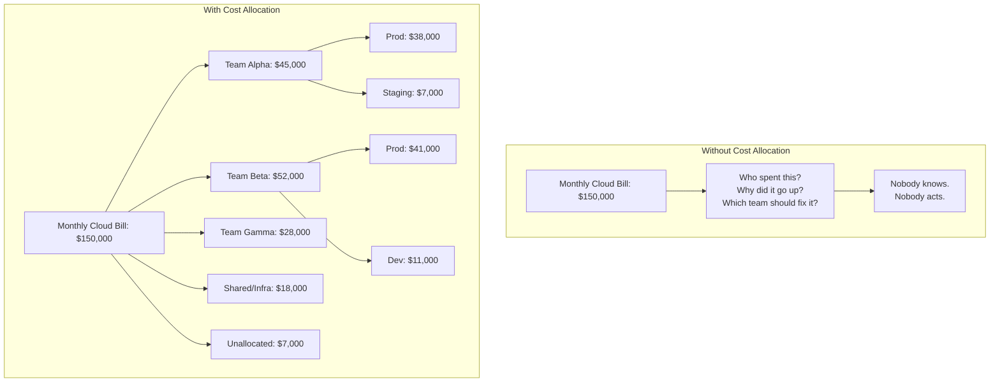
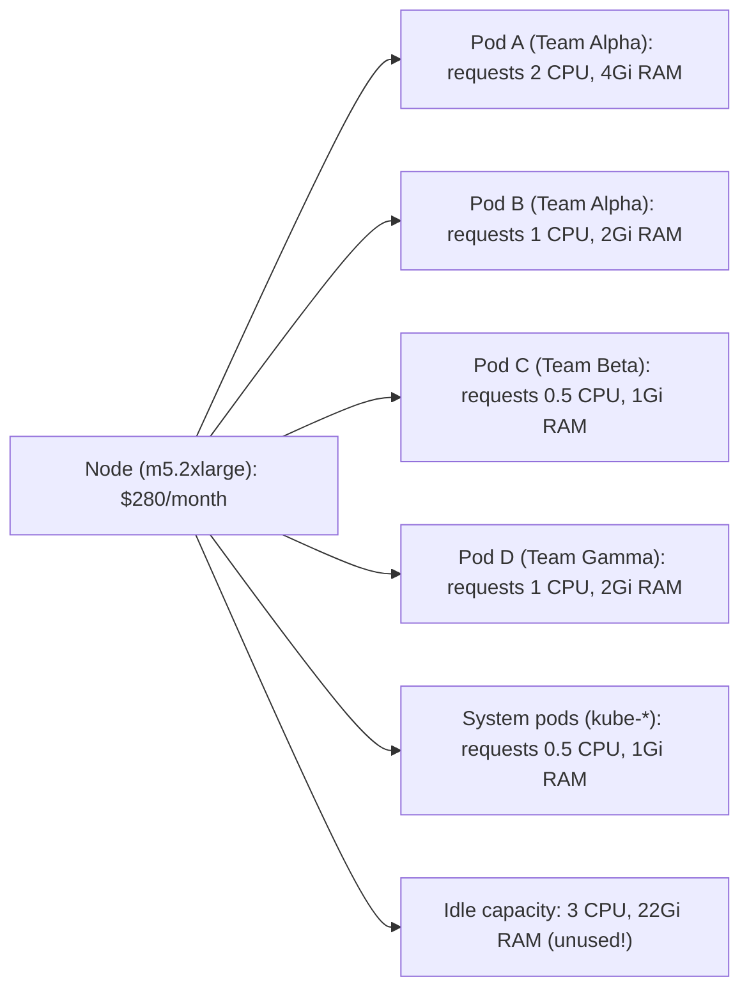
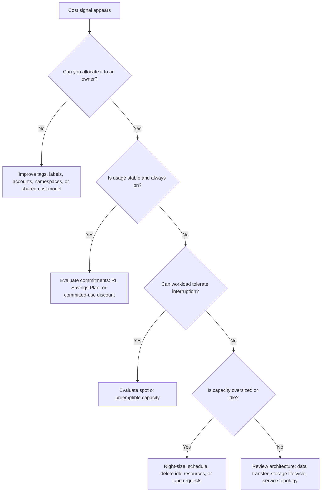

# Module 1.2: FinOps in Practice

> **Certification Track** | Complexity: `[MEDIUM]` | Time: 50 minutes

**Prerequisites**:
- [Module 1: FinOps Fundamentals](../module-1.1-finops-fundamentals/) - principles, lifecycle, and team structure
- Basic cloud familiarity with AWS, Azure, or Google Cloud concepts
- Basic Kubernetes familiarity with namespaces, pods, resource requests, and resource limits

> **Exam Coverage**: This module covers **FinOps Capabilities** and **Terminology & Cloud Bill** for learners preparing for the FinOps Certified Practitioner exam.

## Learning Outcomes

After completing this module, you will be able to:

1. **Implement** a cost allocation strategy using cloud tags, Kubernetes labels, and shared-cost distribution models.
2. **Evaluate** rate optimization options such as Reserved Instances, Savings Plans, committed discounts, and spot capacity.
3. **Diagnose** cloud bill line items, blended rates, amortized costs, and data transfer charges to find optimization opportunities.
4. **Optimize** Kubernetes workloads by right-sizing requests, scheduling non-production capacity, eliminating idle resources, and using OpenCost.

## Why This Module Matters

Hypothetical scenario: your platform team receives a monthly cloud invoice that is far above the expected budget, but the finance report only names services such as compute, storage, load balancing, and data transfer. Engineering leaders ask which team caused the increase, finance asks whether the variance is temporary or structural, and the product teams ask whether they must slow down delivery. Nobody can answer confidently because the bill describes provider resources, not the business systems that created those resources.

That moment is where FinOps moves from principle to practice. The previous module introduced the lifecycle and principles, but the daily work is more concrete: allocate spend to owners, forecast future cost, select commitment discounts carefully, right-size wasteful workloads, and read bill terminology without getting confused by accounting views. The useful practitioner is not the person who memorizes a term list. The useful practitioner can look at an ambiguous cost signal, ask the next diagnostic question, and guide engineers and finance toward a decision both sides can defend.

In this module you will build that practical path. We will start with cost allocation because every optimization depends on knowing who owns the usage. We will then connect budgets, forecasts, rate optimization, workload optimization, cloud billing, and Kubernetes-specific allocation into one operating model. Along the way, notice that the right answer is rarely "always buy the biggest discount" or "always cut the largest line item." FinOps is about matching the financial lever to the technical shape of the workload.

## Cost Allocation: Turning a Bill into Ownership

Cost allocation is the practice of mapping cloud spending to the teams, projects, services, and environments that generated it. It sits at the foundation of the Inform phase because every later activity depends on attribution. If you cannot answer "who spent what, on which service, for which business purpose," then optimization becomes a guessing exercise and budget conversations become political instead of operational.

The first useful mental model is to treat the cloud bill like a warehouse receipt with missing labels. The boxes may be real, the prices may be accurate, and the total may reconcile perfectly, but the receipt is not actionable until every box has an owner and purpose. Allocation adds those labels, and the labels must be consistent enough that engineering, finance, and product leaders can all trust the same view.



Tags in AWS and Azure, labels in Google Cloud and Kubernetes, and account or subscription boundaries all serve the same purpose: they attach business context to technical resources. A tag strategy should be boring on purpose. The keys should be few enough that engineers remember them, strict enough that reports are reliable, and stable enough that month-over-month trends are not broken by spelling changes or team reorganizations.

| Tag Key | Example Values | Purpose |
|---------|---------------|---------|
| `team` | alpha, beta, gamma | Who owns this resource? |
| `environment` | prod, staging, dev, test | What lifecycle stage? |
| `service` | payments, auth, search | What application? |
| `cost-center` | CC-1234, CC-5678 | Financial accounting code |
| `project` | phoenix, atlas | Business initiative |
| `managed-by` | terraform, helm, manual | How was it created? |

The mandatory set should usually start with `team`, `environment`, `service`, and a financial owner such as `cost-center`. The remaining keys can be added when they answer a real reporting question. Overly large tag dictionaries look mature in a spreadsheet but often fail in practice because engineers copy old examples, invent new values, or avoid creating resources when policy errors are unclear. The better path is a small required schema, strong validation at creation time, and automated defaults where the ownership context is already known.

Pause and predict: if a team tags production workloads but forgets development workloads, what kind of optimization conversation will become distorted first? The likely answer is not just "the dev bill is hidden." The deeper issue is that production efficiency may look worse than it really is because shared and non-production spend leaks into unallocated buckets, which means the wrong team may be pressured to fix the wrong problem.

Once allocation exists, the organization must decide how to communicate it. Showback means reporting costs to teams without charging their budget directly. Chargeback means the cost affects the team's financial plan. Both models are valid, but they create different incentives and require different levels of accuracy. A young FinOps practice often starts with showback because visibility is valuable even when allocation is imperfect. Chargeback usually requires stronger governance because teams will challenge any number that affects their budget.

| Aspect | Showback | Chargeback |
|--------|----------|------------|
| Financial impact | None - informational only | Direct - charges to team budget |
| Accountability | Soft - "you should know" | Hard - "you are paying for this" |
| Complexity | Lower - approximate allocation is OK | Higher - needs accurate, auditable allocation |
| Culture | Educational, non-threatening | Can create friction if perceived as unfair |
| Best for | Organizations starting FinOps (Crawl/Walk) | Mature organizations (Walk/Run) |
| Risk | Teams may ignore reports | Teams may game the system to reduce charges |

Shared costs are where allocation becomes an engineering design problem rather than a reporting exercise. Kubernetes control planes, shared monitoring, network appliances, artifact registries, CI systems, and platform teams often support many services at once. If those costs are left unallocated, product teams may believe their services are cheaper than they really are. If those costs are allocated unfairly, product teams may reject the model and treat FinOps reports as finance theater.

There are three common approaches. Proportional allocation splits shared cost based on usage, such as CPU requested, storage consumed, or traffic handled. Even split divides cost equally among all teams, which is simple but can subsidize heavy users. Fixed overhead charges a platform fee per team, which is predictable but less responsive to actual consumption. Mature practices often combine them: proportional allocation for measurable shared capacity, fixed overhead for baseline platform services, and a clearly tracked unallocated bucket that shrinks over time.

A useful allocation design also separates correctness from precision. Correctness means the model assigns cost to the right owner and explains the rule consistently. Precision means the model measures every component with fine detail. Early FinOps practices often need correctness first because a simple but trusted model changes behavior faster than a complex report nobody believes. As maturity grows, the team can add more precision for storage, network, idle capacity, and shared services.

The allocation model should be documented as an operating contract. It should say which tags are mandatory, which labels are inherited from namespaces, how shared costs are divided, how unallocated spend is handled, and how teams can challenge a report. That challenge path matters because it turns disagreement into data quality improvement. When a team proves a resource is mis-tagged, the fix should improve the model for every future report rather than becoming a one-time spreadsheet adjustment.

## Budgeting and Forecasting: Making Spend Predictable

Budgets and forecasts are often discussed together, but they answer different questions. A budget states what the organization intends or authorizes a team to spend. A forecast estimates what the team is likely to spend if current trends, commitments, launches, and architectural plans continue. Treating those as the same thing causes avoidable tension because a team can be inside its budget while the forecast shows a future overrun, or outside a static budget because the business grew faster than expected.

Cloud budgeting differs from traditional data center budgeting because capacity can be created faster than the finance cycle can react. In a data center, a purchasing workflow often slows down cost growth. In cloud, an autoscaler, build pipeline, batch job, or developer experiment can create spend immediately. That speed is useful, but it means the budget process must include alerts, ownership, and enough technical context to separate healthy growth from waste.

Before running the numbers, what output do you expect from a forecast that only extrapolates the last three months of spend during a major migration? It will probably look precise while missing the biggest change. Trend data is useful for stable systems, but planned launches, decommissioning work, commitment expirations, regional expansion, and migration waves can create step changes that a simple line cannot predict.

A fixed budget is easiest to communicate: Team Alpha gets a specific monthly amount, and any overage requires discussion. A variable budget connects cost to a business driver, such as active users, requests, transactions, or gigabytes processed. A threshold budget creates guardrails, such as alerting at several percentages and requiring approval past a defined limit. The right approach depends on the maturity of unit economics. If a team knows its cost per transaction, a variable budget can be fair. If it does not, a fixed budget plus regular review is often safer.

Forecasting also has levels of maturity. Trend-based forecasting extrapolates historical spend and works well for stable workloads. Driver-based forecasting models spend from business activity, which is more accurate when cost scales with traffic, accounts, messages, or data volume. Bottom-up forecasting asks teams to submit planned infrastructure changes, which catches migrations and launches but requires discipline. A strong FinOps practice combines these views instead of asking one formula to carry every context.

| Mistake | Why It Happens | Better Approach |
|---------|---------------|-----------------|
| Linear extrapolation only | Easy to calculate | Combine with driver-based for step changes |
| Ignoring seasonality | Using short data windows | Use 12+ months of data to capture seasonal patterns |
| Not accounting for commitments | Forecasting on-demand only | Factor in RI/SP expirations and renewals |
| Single-point estimates | Overconfidence | Use ranges: best case, expected, worst case |

Budgets become useful when the alert is tied to a decision, not when it merely announces pain. An alert at fifty percent of monthly spend might confirm that usage is tracking normally. An alert around three quarters might prompt a team lead to inspect anomalies. A near-limit alert might require a decision about feature rollout, capacity expansion, or approval. Without that decision path, alerts become background noise and teams learn to ignore them.

The exam angle is practical: expect scenario questions that ask whether an activity belongs to Inform, Optimize, or Operate. Allocation and visibility are Inform activities. Rightsizing, commitment planning, and idle resource removal are Optimize activities. Budget alerts, forecasting review, and policy enforcement are Operate activities. In real work those phases overlap, but the lifecycle tells you which question the activity is answering.

Forecasts should also include confidence, because cloud spend is not a single fixed destiny. A team might publish an expected case based on current traffic, a higher case based on a launch or seasonal event, and a lower case based on decommissioning work that is already scheduled. This framing prevents false certainty. Finance receives a planning range, engineering explains the drivers, and leadership can decide whether to approve growth, delay work, or invest in optimization before the bill arrives.

The most useful budget review is therefore a conversation about assumptions. If active users grew, a higher bill may be healthy. If cost per user grew without a product reason, the team should investigate efficiency. If spend changed because a commitment expired, the action is financial planning rather than application tuning. By separating volume, efficiency, and rate effects, the review becomes specific enough for someone to act.

## Rate Optimization: Paying Less for Stable Usage

Rate optimization reduces the price paid for a resource without necessarily changing the amount consumed. It is attractive because it can produce savings without a code change, but it also introduces commitment risk. The central question is not "which discount is largest?" The central question is "how stable is this workload, and how much flexibility do we need over the commitment period?"

Reserved Instances are the classic commitment model for virtual machines. You commit to a specific instance family, size or normalized capacity, operating system, tenancy, region, and term depending on the provider model. In exchange, the provider discounts the hourly rate. The discount can be substantial, but the commitment becomes waste if the workload disappears, changes shape, moves region, or migrates to another compute service.

| Pricing Model | Rate | Monthly Cost (m5.xlarge) | Savings vs. On-Demand |
|---------------|------|-------------------------|-----------------------|
| On-Demand (no commit) | $0.192/hour | $1,402/month | $0 (Base) |
| 1-Year RI | $0.120/hour | $876/month | $526/month (37%) |
| 3-Year RI | $0.075/hour | $548/month | $854/month (61%) |

The table illustrates why teams are tempted by the longest commitment. A three-year rate looks efficient when the instance runs continuously, but the discount is only valuable if the commitment is used. If the product is being redesigned, the instance type is changing, or the workload might move from nodes to serverless compute, the deeper discount can become stranded cost. That is why FinOps teams usually analyze historical usage, expected roadmap changes, and coverage targets before buying commitments.

Savings Plans and similar committed-use discounts move the commitment from a specific machine to a spend level or compute family. They are usually slightly less restrictive than traditional reservations, especially when workloads may shift across instance types, regions, or compute services. The tradeoff is that the organization still owes the committed amount even if actual usage falls below it. Flexibility reduces waste risk, but it does not eliminate commitment discipline.

| Aspect | Reserved Instances | Savings Plans |
|--------|-------------------|---------------|
| Commitment | Specific instance type + region | Dollar amount of compute per hour |
| Flexibility | Low (Standard) / Medium (Convertible) | High - applies across instance types |
| Discount depth | Slightly higher | Slightly lower |
| Best for | Stable, predictable workloads | Diverse or evolving workloads |

Break-even thinking is essential because upfront commitments distort intuition. If an all-upfront purchase costs $8,760 and saves $526 each month, the simple break-even point is the upfront cost divided by the monthly savings, which is about 16.6 months. That calculation is not the whole decision, because accounting treatment, cash constraints, and expected utilization also matter. Still, it gives engineers and finance a shared language for whether the discount has enough time to pay back.

Spot capacity, preemptible VMs, and low-priority VMs are a different kind of rate optimization. The provider discounts spare capacity deeply because it can reclaim that capacity with short notice. Spot works well for stateless, fault-tolerant, horizontally scalable, or checkpointed workloads. It is a poor fit for singleton services, databases without careful architecture, stateful control plane components, and critical workloads that cannot absorb interruption.

Hypothetical scenario: a platform team wants to reduce build infrastructure cost without slowing product delivery. CI runners are stateless, jobs can be retried, and the pipeline already stores artifacts outside the worker node. That workload is a strong candidate for spot nodes because interruption causes a retry, not data loss. The same reasoning would not apply to a primary database or a single-replica authentication service.

The safest commitment strategy is layered. Keep enough on-demand capacity for uncertainty and bursts, use commitments for the stable baseline, and use spot where interruption is acceptable. In Kubernetes, that often means separate node pools with taints, tolerations, disruption budgets, and workload labels that express which applications can run on cheaper but less reliable capacity. Rate optimization is therefore not only a finance decision; it depends on workload architecture.

Commitment coverage and commitment utilization are different metrics, and confusing them leads to poor decisions. Coverage asks what percentage of eligible usage received a discount. Utilization asks what percentage of purchased commitment was actually consumed. High coverage with low utilization means the organization bought too much or bought the wrong shape. Low coverage with high utilization may mean there is room to buy more, provided the baseline is still expected to remain stable.

Provider recommendations are useful inputs, but they should not replace business context. A recommendation engine can see historical hours, instance families, and rates, but it may not know that a service is being rewritten, a region will be retired, or a product line is about to launch. The FinOps practitioner adds that missing context by talking to engineering and product owners before accepting the suggested commitment. That human review is where expensive over-commitment is often prevented.

## Workload Optimization: Using Less Capacity

Workload optimization reduces the amount, size, or duration of resources consumed. It is different from rate optimization because it changes the demand side of the equation. If rate optimization is negotiating a better price for electricity, workload optimization is turning off unused lights, replacing wasteful equipment, and arranging rooms so heat and power are used more efficiently. Both matter, but they solve different problems.

Right-sizing is the practice of matching allocated capacity to observed need with enough headroom for safety. Most resources are oversized for understandable reasons. Engineers protect reliability, initial estimates are conservative, traffic patterns change, and old configurations rarely receive attention after launch. The waste becomes expensive when a large fleet keeps paying for capacity that never becomes useful work.

| Metric | Before Right-Sizing | After Right-Sizing |
|--------|---------------------|--------------------|
| Instance Type | m5.2xlarge | m5.large |
| Resources | 8 vCPU, 32 GB RAM | 2 vCPU, 8 GB RAM |
| Actual Peak Usage | 1.2 vCPU, 6.4 GB RAM | 1.2 vCPU, 6.4 GB RAM |
| Monthly Cost | $280.32 | $70.08 |

This example keeps the same observed peak but changes the purchased shape. The monthly cost falls from $280.32 to $70.08 for one instance, a reduction of $210.24. If fifty similar instances carry the same waste pattern, the monthly impact becomes $10,512. The important lesson is not the exact price; it is that rightsizing scales with repetition. Small configuration mistakes become large bills when repeated across fleets, namespaces, and environments.

A practical right-sizing process starts with data over a representative window, often fourteen to thirty days. CPU, memory, network, disk, latency, and restart behavior should be reviewed together because a low CPU graph does not prove a workload can safely shrink. The recommendation should include headroom, rollout timing, rollback criteria, and an owner. After the change, the team should watch performance indicators, not only cost, because optimization that creates incidents is not optimization.

Scheduling is another high-signal workload optimization because many non-production environments run continuously while people use them only during working hours. If a development or staging environment runs one hundred sixty-eight hours each week but is actively needed for fifty hours, the waste is structural. The calculation in the original module captures the intuition clearly: a ten-instance environment that costs $7,200 per month around the clock can fall to roughly $2,142 per month when scheduled for ten hours a day, five days a week.

Scheduling should be applied with care. A shared integration environment may need evening availability for teams in another time zone, automated tests may run overnight, and some staging systems support incident reproduction. The better pattern is to classify environments, publish the schedule, allow temporary overrides, and measure whether off-hours activity justifies the exception. Good scheduling policy feels like a service feature, not an arbitrary power switch.

Idle resource elimination catches resources that exist but no longer serve a purpose. These resources often survive because the work that created them finished, the owning team changed, or the resource is outside the normal application deployment path. The cloud provider still charges for them, and they rarely appear in application dashboards because no application actively depends on them.

| Idle Resource | How It Happens | Detection Method |
|---------------|---------------|------------------|
| Unattached EBS volumes | Instance terminated, volume remains | Filter for `available` state |
| Old snapshots | Backup snapshots never cleaned up | Age-based policies (>90 days) |
| Unused elastic IPs | Service moved, IP not released | Filter for unassociated IPs |
| Forgotten load balancers | No healthy targets registered | Check target group health |
| Orphaned databases | Dev DB from a project that ended | CPU utilization near 0% for 14+ days |
| Stale ECR images | Old container images accumulate | Lifecycle policies based on age/count |

Which approach would you choose first if a team must reduce cost this month but cannot change production code: rate optimization, scheduling, or idle cleanup? The answer depends on the workload. Idle cleanup is usually low risk when ownership is confirmed, scheduling is strong for non-production systems, and commitments are useful for stable baseline usage. The practical skill is choosing the lever that matches risk, time horizon, and reversibility.

Workload optimization should be measured against service outcomes, not only against the bill. A smaller instance that increases latency during peak traffic may push cost into user experience, incident response, or lost revenue. A strict schedule that blocks late-night testing may slow a release. A deleted snapshot may remove a recovery path that compliance expected. Good optimization proposals name the expected saving, the reliability risk, the validation signal, and the rollback plan.

Kubernetes makes this especially important because resource requests are both scheduling inputs and cost signals. If a team lowers CPU requests too far, pods may still run until the cluster becomes busy, then struggle to schedule or receive enough CPU. If memory requests are too low, eviction risk can increase. The right-sizing conversation should therefore include application owners, recent usage percentiles, restart history, latency objectives, and the autoscaler behavior that will react after the change.

## Cloud Billing Anatomy: Reading the Financial Signal

Cloud bills are detailed records of usage, price, discounts, credits, taxes, and allocation dimensions. They are also easy to misread because provider billing systems expose accounting views that are not always intuitive to engineers. A cost line can represent list price, actual charge, amortized commitment cost, blended rate, net cost after credits, or a transfer fee caused by architecture. FinOps practitioners must know which view they are using before drawing conclusions.

A line item usually describes a provider account, service, usage type, operation, region, quantity, rate, and cost. In AWS Cost and Usage Reports, for example, a compute line item may include the instance family, region-specific usage type, operation such as `RunInstances`, usage amount in hours, and unblended cost. The useful question is not only "how much did it cost?" but also "what technical behavior created this line?"

```text
Account:        123456789012
Service:        Amazon EC2
Usage Type:     USEast1-BoxUsage:m5.xlarge
Operation:      RunInstances
Usage Amount:   744 hours
Unblended Cost: $142.85
```

The most common billing terms describe different views of the same underlying usage. List price is the published on-demand price. On-demand cost is what the usage would cost without commitments. Unblended cost is the actual line-item charge before some allocation adjustments. Blended rate averages rates across discounted and non-discounted usage. Amortized cost spreads upfront commitments across the period they cover. Net cost reflects discounts, credits, and amortization after the provider applies them.

| Term | Definition | Example |
|------|-----------|---------|
| **On-demand cost** | The list price with no discounts | $0.192/hour for m5.xlarge |
| **Unblended cost** | The actual charge per line item, before any amortization | $142.85 for 744 hours of m5.xlarge |
| **Blended rate** | Average rate across on-demand and discounted usage | If 50% is on-demand ($0.192) and 50% is RI ($0.120), blended = $0.156 |
| **Amortized cost** | Upfront RI/SP payments spread evenly across the commitment period | $8,760 upfront RI / 12 months = $730/month |
| **Net cost** | Cost after all discounts, credits, and amortization | The "real" cost to the business |
| **List price** | Published on-demand price before any negotiation | The sticker price |

Amortization is especially important because upfront payments can create misleading spikes. If an organization pays $8,760 upfront for a one-year Reserved Instance on January first, the cash event happens immediately. Without amortization, January looks unusually expensive and later months look artificially cheap. With amortization, the internal cost view spreads the amount as $730 per month across the year, which better represents the cost of using the commitment.

```text
Team's cost = (Team's resource requests / Total node resources) × Node cost
```

Data transfer deserves special attention because it is often caused by architecture rather than raw traffic volume alone. Ingress is commonly free, but egress to the internet, cross-region traffic, cross-zone traffic, managed NAT processing, and private connectivity can all create charges. A chatty service pair split across zones can produce a surprise even when both services stay inside one region. A backup job that copies data across regions can turn a storage design into a network bill.

The exam often tests the distinction between compute, storage, and data transfer because all three appear in real optimization work. Compute waste is visible in idle nodes or oversized instances. Storage waste appears in snapshots, volumes, logs, and retained images. Data transfer waste appears in service topology, replication, NAT routing, and internet egress. A good diagnosis names the cost component before recommending a fix.

Bill analysis should also reconcile different views before escalation. Finance may look at invoice cost, engineering may look at amortized cost, and a dashboard may show net cost after credits. None of those views is automatically wrong, but each answers a different question. Cash planning cares about when money leaves the business. Service ownership cares about the cost of capacity consumed during the month. Optimization analysis often cares about the price that would change if usage or commitment coverage changed.

When a number looks surprising, trace it from business owner to technical resource to billing term. For example, a blended rate drop might be good news from a new commitment rather than evidence that engineers changed infrastructure. A net cost drop might come from temporary credits rather than real efficiency. An amortized cost increase might reveal a commitment purchase that finance approved but engineering has not yet mapped to services. The practitioner protects the organization from acting on the wrong interpretation.

## Kubernetes-Specific FinOps: Allocating Shared Cluster Cost

Kubernetes adds a layer of abstraction between the cloud bill and the workload owner. The provider bill usually shows nodes, disks, load balancers, network traffic, and managed control plane charges. The product team thinks in deployments, namespaces, services, and pods. FinOps for Kubernetes connects those views so a shared cluster can be allocated fairly without pretending every pod owns its own virtual machine.



The namespace is commonly the first allocation boundary because it often maps to a team, environment, or application domain. That mapping is not perfect, but it is operationally useful. If Team Alpha owns the `team-alpha` namespace, a report can connect its requested CPU, requested memory, persistent volume usage, load balancer usage, and allocated idle share to the team that can act. Labels then add a more granular view for service, application, environment, or cost center.

Kubernetes requests and limits matter because they describe different things. A request reserves schedulable capacity and strongly influences cost allocation. A limit caps possible usage but does not reserve capacity in the same way. Actual usage shows what the workload consumed, which can be useful for efficiency analysis, but request-based allocation is common because the scheduler treats requests as capacity that other pods cannot use.

| Concept | Scheduling | Cost Allocation | Why It Matters for FinOps |
|---------|-----------|-----------------|--------------------------|
| Requests | Used by scheduler to place pods | Used to calculate team's share of node cost | Over-requesting = paying for unused capacity |
| Limits | Not used for scheduling | Not typically used for allocation | Setting limits too high wastes memory |
| Actual usage | N/A | Some tools offer usage-based allocation | Most accurate but complex |

If a pod requests four CPU and usually uses half a CPU, a request-based model charges the team for the larger reservation because the cluster had to keep that capacity available. This feels strict at first, but it creates a healthy incentive. Teams that tune requests carefully pay less, the scheduler packs workloads more efficiently, and autoscalers can make better node decisions. The model turns a YAML field into a financial signal.

Labels bring the cloud tagging discipline into the cluster. They should be applied consistently to namespaces, deployments, pods, and any cost-bearing objects when possible. Kubernetes policy engines such as Kyverno or Gatekeeper can reject workloads missing required labels, while platform templates can make the compliant path easy. Enforcement is important because manual labeling campaigns decay quickly after the first announcement.

```yaml
apiVersion: v1
kind: Pod
metadata:
  name: payment-service
  namespace: team-alpha
  labels:
    app: payments
    team: alpha
    environment: production
    cost-center: "CC-1234"
```

OpenCost is a CNCF sandbox project for Kubernetes cost monitoring. It calculates cost by namespace, deployment, pod, container, label, storage, and network dimensions, usually backed by Prometheus metrics and cloud pricing data. The value is not only the dashboard. The value is that teams can see idle cost, request efficiency, and trend lines in the same language they use to operate applications.

```text
Pod cost = (CPU requests × CPU cost/hour) + (RAM requests × RAM cost/hour)
           + (PV storage × storage cost/hour) + (network × network cost/GB)

Idle cost = Total node cost - Sum of all pod costs

Cluster efficiency = Sum of pod costs / Total node cost × 100%
```

For hands-on OpenCost installation, dashboards, and right-sizing exercises, see our toolkit module: [Module 6.4: FinOps with OpenCost](/platform/toolkits/developer-experience/scaling-reliability/module-6.4-finops-opencost/). This module focuses on the practitioner reasoning you need before installing tools: what the numbers mean, which allocation basis is fair, and how to turn a cost report into an engineering action.

| Strategy | What It Does | Savings Potential |
|----------|-------------|-------------------|
| Right-size requests | Match requests to actual usage | 40-70% compute reduction |
| Namespace quotas | Cap resource usage per team | Prevents runaway spending |
| LimitRanges | Set default/max resource limits | Prevents oversized pods |
| Cluster autoscaling | Scale nodes based on demand | Avoid paying for idle nodes |
| Spot node pools | Run fault-tolerant workloads on spot | 60-90% node cost reduction |
| Schedule non-prod | Shut down dev/test after hours | 50-70% non-prod savings |
| Pod Disruption Budgets | Enable safe spot/preemptible use | Supports spot adoption |
| VPA (Vertical Pod Autoscaler) | Auto-adjust resource requests | Continuous right-sizing |

Kubernetes version 1.35+ does not change the FinOps fundamentals, but it keeps the operational context current. Resource requests, namespaces, labels, quotas, autoscaling, and admission policy remain the core levers. The practical skill is aligning those levers with cost visibility. A namespace quota without cost reporting may protect the cluster but fail to teach teams. A cost report without policy may inform teams but fail to prevent recurrence.

Exercise scenario: CloudCorp runs one EKS cluster with twenty-five on-demand nodes, six engineering or data teams, thirty percent tagging coverage, and no namespace-level cost reporting. The first action should not be to buy a large commitment or delete random resources. The first action is to make ownership visible through tags, labels, OpenCost, and a dashboard that shows team, service, and environment cost. Once the cost signal is trustworthy, the team can select optimization actions with less guesswork.

OpenCost reports become more valuable when teams review them beside Kubernetes manifests. A namespace that looks expensive may be paying for a necessary production workload, or it may be carrying outdated requests copied from an old template. A deployment with low actual CPU and high requested CPU is not automatically wrong if it has sharp bursts, but it does deserve investigation. The cost report identifies the question; the workload owner supplies the application context needed to answer it safely.

The platform team should keep a separate view of cluster efficiency. If every application is right-sized but nodes remain idle, the issue may be autoscaler configuration, node shapes, daemonset overhead, pod topology constraints, or unavailable smaller instance types. If nodes are tightly packed but teams still complain about cost, the issue may be the allocation model or the price of the baseline. Kubernetes FinOps improves when application efficiency and platform efficiency are measured together rather than blamed on one another.

## Patterns & Anti-Patterns

Patterns are repeatable approaches that preserve trust while reducing waste. Anti-patterns are common because they solve an immediate discomfort, such as a large bill or angry budget meeting, while creating a longer-term failure. The table format below is intentionally operational: it connects the behavior, the reason it works or fails, and the scaling consideration that matters when more teams join the platform.

| Pattern | When to Use It | Why It Works | Scaling Consideration |
|---------|----------------|--------------|-----------------------|
| Start with showback, then mature toward chargeback | Allocation quality is improving but not yet audit-grade | Teams learn their cost drivers before money is moved between budgets | Publish allocation rules and unresolved shared-cost buckets |
| Separate baseline, burst, and interruptible capacity | Workloads have mixed stability and criticality | Commitments cover steady usage while on-demand and spot handle uncertainty | Review commitment coverage monthly and keep interruption policies explicit |
| Enforce labels at creation time | Manual tag cleanup keeps falling behind | Non-compliant resources never enter the reporting system silently | Provide templates and helpful rejection messages so policy does not block delivery |
| Allocate idle cluster cost visibly | Shared clusters have unused capacity after pod costs are assigned | Teams see the cost of over-requesting and the platform team sees packing efficiency | Decide whether idle cost is charged proportionally or tracked as platform overhead |

| Anti-Pattern | What Goes Wrong | Better Alternative |
|--------------|-----------------|-------------------|
| Buying commitments before visibility exists | Discounts attach to the wrong baseline and unused commitments become waste | Analyze several months of stable usage and planned migrations first |
| Treating limits as allocation truth | Teams can set high limits that do not represent schedulable reservation | Use requests for primary allocation and actual usage for efficiency coaching |
| Hiding shared costs in an unallocated bucket forever | Product costs look artificially low and the platform team becomes the budget sink | Publish a shared-cost model and reduce the unallocated percentage over time |
| Optimizing only the largest line item | A large service may be efficient while smaller forgotten resources are pure waste | Pair top-spend analysis with efficiency and idle-resource scans |

The healthiest pattern is transparency before enforcement. If teams receive a report they cannot reproduce, they will argue about the report instead of improving the workload. If teams understand the allocation model, can see their own labels, and know how to reduce the number, the conversation changes. FinOps becomes a product feedback loop for infrastructure, not a finance inspection.

## Decision Framework

Use this decision framework when a cost signal arrives. It prevents the common mistake of jumping directly from "the bill is high" to "buy discounts" or "cut resources." Each branch asks what kind of cost you are seeing, who can act on it, and whether the remedy changes price, quantity, duration, or accountability. That sequence keeps the technical and financial diagnosis aligned.



| Situation | Primary Lever | Why | Watch Out For |
|-----------|---------------|-----|---------------|
| Unallocated spend is high | Allocation and governance | Optimization cannot be assigned yet | Do not punish teams for unclear ownership |
| Stable twenty-four-hour compute baseline | Rate optimization | Commitment discounts reduce unit price | Avoid over-coverage during migrations |
| Non-production runs continuously | Scheduling | Duration falls without changing app code | Check time zones and test schedules |
| Kubernetes requests exceed usage | Right-sizing | Reserved cluster capacity becomes available | Watch memory behavior and latency after changes |
| Cross-zone traffic spikes | Architecture review | Data transfer is created by topology | Keep availability and resilience requirements visible |
| Cluster idle cost grows | Autoscaling and packing | Nodes remain paid even when pods do little work | Separate system overhead from application over-requesting |

The framework is not a replacement for judgment. A heavily regulated workload may reject spot even if the application is stateless. A critical launch may justify temporary over-provisioning. A team may accept higher cost for lower operational risk during a migration. FinOps maturity means making those tradeoffs explicit, measured, and revisited instead of letting old assumptions become permanent spend.

## Did You Know?

- The FinOps Foundation describes capabilities across domains such as understanding cloud usage and cost, quantifying business value, optimizing rates, optimizing usage, managing anomalies, and managing commitments, which is why the practitioner role spans engineering, finance, and product conversations.
- Kubernetes cost allocation commonly uses resource requests because the scheduler reserves capacity from those requests, so an oversized request can increase allocated cost even when actual CPU usage is much lower.
- AWS Spot Instances can be interrupted with a two-minute warning, which is why resilient batch jobs and CI workers fit better than primary databases or singleton control-plane services.
- Amortizing a $8,760 upfront commitment across twelve months produces a $730 monthly internal cost view, which prevents a single purchase month from looking unusually expensive while later months look free.

## Common Mistakes

| Mistake | Why It Happens | How to Fix It |
|---------|---------------|---------------|
| Allocating by limits, not requests | Limits feel like "what you're using" | Use requests for the primary Kubernetes allocation model, then compare actual usage for efficiency coaching |
| Ignoring idle cluster cost | "Unallocated" seems like nobody's problem | Track idle cost explicitly and decide whether to allocate it proportionally or hold it as platform overhead |
| Tagging after the fact | "We'll tag resources later" | Enforce required tags and labels at creation time through policy, modules, and admission controls |
| Buying RIs without usage data | "Three-year commitment saves the most" | Analyze stable historical usage, roadmap changes, and commitment utilization before purchasing |
| Optimizing before understanding | The team wants quick savings after a large bill | Start with Inform: allocation, bill analysis, and ownership before choosing an optimization lever |
| Using on-demand for stable workloads | Defaults remain in place after launch | Review stable baseline compute for Savings Plans, Reserved Instances, or provider committed-use discounts |
| Treating budget alerts as the whole process | Alerts are easy to configure and hard to operationalize | Attach each threshold to a named owner, decision path, and review cadence |

## Quiz

Test your ability to choose FinOps practices from operational scenarios. Each answer explains why the correct option fits and why the distractors fail.

### Question 1

Team Beta exceeded its March cloud budget by $10,000. Finance sent a report showing the overage, but the amount was not deducted from Team Beta's next quarterly budget. Which model is being used?

A. Chargeback
B. Showback
C. Proportional allocation
D. Fixed overhead

<details>
<summary>Show answer and reasoning</summary>

**Correct answer: B. Showback.** Showback provides visibility without directly moving money from the team's budget, so it fits the report-only behavior. A is wrong because chargeback would create a financial consequence. C is wrong because proportional allocation describes how shared cost is split, not whether money is charged. D is wrong because fixed overhead is a shared-cost model, not a reporting consequence.

</details>

### Question 2

Your team evaluates four workloads for spot capacity: a production PostgreSQL database, a CI build runner fleet, a single-replica authentication service, and an etcd cluster. Which workload is the best candidate?

A. Production PostgreSQL database
B. CI build runner fleet
C. Single-replica authentication service
D. Kubernetes etcd cluster

<details>
<summary>Show answer and reasoning</summary>

**Correct answer: B. CI build runner fleet.** CI workers are usually stateless, retryable, and able to tolerate replacement when a spot interruption occurs. A is wrong because a primary database has state and availability constraints. C is wrong because a single replica has no redundancy during interruption. D is wrong because etcd is a critical control-plane dependency and should not be placed on reclaimable spare capacity.

</details>

### Question 3

An organization pays $8,760 upfront for a one-year reserved commitment on January first. Which internal monthly cost view best supports budgeting and allocation?

A. $8,760 in January and zero for the remaining months
B. $730 per month across the commitment period
C. The on-demand list price every month
D. Zero until the commitment expires

<details>
<summary>Show answer and reasoning</summary>

**Correct answer: B. $730 per month across the commitment period.** Amortization spreads the upfront payment over the months that benefit from the commitment. A is wrong because it reflects cash timing but distorts monthly service cost. C is wrong because list price ignores the purchased commitment. D is wrong because the workload still consumes a paid financial commitment even after the cash leaves the account.

</details>

### Question 4

Team Alpha's namespace has pods requesting 10 CPU, setting limits at 20 CPU, and averaging 2 CPU of actual usage. In a standard request-based Kubernetes allocation model, which CPU amount drives the team's cost share?

A. 2 CPU actual usage
B. 10 CPU requests
C. 20 CPU limits
D. Zero CPU because usage is below the request

<details>
<summary>Show answer and reasoning</summary>

**Correct answer: B. 10 CPU requests.** Requests reserve schedulable capacity, so they are commonly used to allocate node cost in Kubernetes FinOps tools. A is wrong because actual usage is useful for efficiency analysis but does not describe reserved capacity. C is wrong because limits cap maximum usage without serving as the normal allocation basis. D is wrong because low usage does not erase the capacity that was requested.

</details>

### Question 5

A service's compute footprint is stable, runs all day, and cannot tolerate interruption. The team needs a cost reduction next month but has already right-sized the workload. Which lever should they evaluate first?

A. Stronger memory limits
B. A provider commitment discount such as a Savings Plan
C. Spot-only node placement
D. Deleting unrelated snapshots

<details>
<summary>Show answer and reasoning</summary>

**Correct answer: B. A provider commitment discount such as a Savings Plan.** The workload is stable and always on, so rate optimization can reduce unit price without changing the application. A is wrong because limits do not reduce a correctly sized compute footprint by themselves. C is wrong because the workload cannot tolerate interruption. D may be useful elsewhere, but it does not reduce this service's compute rate.

</details>

### Question 6

A monthly bill shows a new spike in cross-zone data transfer after two chatty services were deployed across different availability zones. Which diagnosis is most useful?

A. The services created billable data transfer through topology
B. The services automatically moved to premium instance types
C. The provider charged internet ingress for internal requests
D. The storage tier changed because traffic crossed zones

<details>
<summary>Show answer and reasoning</summary>

**Correct answer: A. The services created billable data transfer through topology.** Cross-zone or cross-region communication can create network charges even when services remain inside one cloud provider. B is wrong because instance type changes would appear in compute usage, not data transfer. C is wrong because ingress is usually not the charge being diagnosed in this scenario. D is wrong because storage tiering is separate from service-to-service network placement.

</details>

### Question 7

CloudCorp has thirty percent tagging coverage, one shared EKS cluster, and no cost view by namespace. Leadership asks for immediate savings. What should the FinOps practitioner do first?

A. Buy the largest possible three-year commitment
B. Delete the highest-cost resources without owner confirmation
C. Create cost visibility with tags, labels, OpenCost, and owner dashboards
D. Move every workload to spot nodes

<details>
<summary>Show answer and reasoning</summary>

**Correct answer: C. Create cost visibility with tags, labels, OpenCost, and owner dashboards.** The organization cannot choose fair optimizations until it knows who owns the usage and which workloads create the cost. A is wrong because commitments can strand spend when the baseline is unknown. B is wrong because deleting resources without ownership creates reliability risk. D is wrong because many workloads cannot tolerate interruption and the cluster lacks the labels needed for safe placement.

</details>

## Hands-On Exercise: Cloud Cost Analysis

Exercise scenario: you are a new FinOps practitioner at CloudCorp. The monthly cloud bill is $120,000, the provider is AWS, and the organization has four engineering teams, one data team, and one platform team. The main Kubernetes footprint is an EKS cluster with twenty-five `m5.xlarge` on-demand nodes. Tagging coverage is thirty percent, and the current finance report has no reliable breakdown by team, namespace, service, or environment.

The goal is to apply the lifecycle rather than jump to a favorite tool. First, create visibility. Then choose rate and workload optimizations that match the workload shape. Finally, design governance that keeps the savings from disappearing after the first review. Write your own answer for each task before opening the solution, because the value is in practicing the decision sequence.

### Task 1: Build the Inform Plan

Define the first three actions you would take to create cost visibility for CloudCorp. Include one cloud-level action, one Kubernetes-level action, and one reporting action.

<details>
<summary>Solution</summary>

Start with a mandatory tag and label schema covering `team`, `environment`, `service`, and `cost-center`, then enforce it through cloud policy, infrastructure modules, and Kubernetes admission policy. Deploy OpenCost so the EKS cluster can report namespace, deployment, pod, storage, network, and idle cost. Build a shared dashboard that shows cost by team, service, environment, and unallocated spend so engineering leaders can validate ownership before optimization decisions are made.

</details>

### Task 2: Evaluate Rate Optimization

The cluster runs continuously, but some workloads are stable and some are experimental. Decide where on-demand, commitment discounts, and spot capacity fit.

<details>
<summary>Solution</summary>

Use commitments only for the stable baseline that is expected to run throughout the term, and prefer a flexible compute commitment if the workload mix may change. Keep on-demand capacity for uncertain growth, short-lived experiments, and workloads being migrated. Introduce spot node pools for stateless, retryable, and interruption-tolerant work such as CI workers, batch jobs, and extra web replicas, with taints, tolerations, and disruption budgets controlling placement.

</details>

### Task 3: Optimize Workload Shape

Average cluster CPU utilization is thirty-five percent, and OpenCost shows several namespaces with requests far above actual usage. Recommend a right-sizing and scheduling plan.

<details>
<summary>Solution</summary>

Review representative CPU and memory usage for at least two weeks, then tune requests for workloads with large gaps between requested and actual usage while preserving performance headroom. Use namespace quotas and LimitRanges to prevent future oversized requests from becoming normal. For non-production namespaces, publish a shutdown schedule with an override path, and pair it with autoscaling so nodes disappear when scheduled workloads stop.

</details>

### Task 4: Diagnose the Bill

The bill includes compute, storage, load balancer, NAT processing, and cross-zone transfer charges. Explain how you would determine which cost component should be investigated first.

<details>
<summary>Solution</summary>

Start with the largest variance from the previous baseline, not only the largest total line. Break the increase into compute, storage, and data transfer components, then map each component to owners through tags, labels, accounts, namespaces, and service topology. Compute variance may point to new nodes or oversized requests, storage variance may point to snapshots or retained volumes, and transfer variance may point to chatty services crossing zones, NAT routing, or regional replication.

</details>

### Task 5: Establish Operate Governance

Design a lightweight operating cadence that sustains the improvements without turning FinOps into a monthly blame meeting.

<details>
<summary>Solution</summary>

Create weekly or biweekly cost reviews focused on anomalies, decisions, and ownership changes rather than raw report reading. Configure budget and anomaly alerts with named responders and threshold actions. Review tagging coverage, unallocated spend, commitment utilization, and Kubernetes request efficiency on a regular cadence. Keep the conversation tied to business context so teams can distinguish healthy product growth from avoidable infrastructure waste.

</details>

### Success Criteria

You have completed this exercise successfully if you:

- [ ] Identified Inform actions that create visibility before optimization
- [ ] Recommended both rate optimization and workload optimization
- [ ] Connected Kubernetes requests, labels, namespaces, and OpenCost to cost allocation
- [ ] Explained at least one billing concept such as amortization, blended rate, or data transfer
- [ ] Included governance processes that make FinOps sustainable

## Sources

- [FinOps Foundation - Framework capabilities](https://www.finops.org/framework/capabilities/)
- [FinOps Foundation - FinOps phases](https://www.finops.org/framework/finops-phases/)
- [FinOps Foundation - Personas](https://www.finops.org/framework/personas/)
- [FinOps Foundation - Kubernetes and cloud native working group](https://www.finops.org/wg/kubernetes/)
- [OpenCost documentation](https://opencost.io/docs/)
- [AWS Billing and Cost Management - Budgets](https://docs.aws.amazon.com/cost-management/latest/userguide/budgets-managing-costs.html)
- [AWS Savings Plans User Guide](https://docs.aws.amazon.com/savingsplans/latest/userguide/what-is-savings-plans.html)
- [AWS EC2 Reserved Instances](https://docs.aws.amazon.com/AWSEC2/latest/UserGuide/ec2-reserved-instances.html)
- [AWS EC2 Spot Instances](https://docs.aws.amazon.com/AWSEC2/latest/UserGuide/using-spot-instances.html)
- [Azure Cost Management cost analysis](https://learn.microsoft.com/en-us/azure/cost-management-billing/costs/quick-acm-cost-analysis)
- [Google Cloud Billing budgets](https://cloud.google.com/billing/docs/how-to/budgets)
- [Kubernetes resource management for pods and containers](https://kubernetes.io/docs/concepts/configuration/manage-resources-containers/)
- [Kubernetes labels and selectors](https://kubernetes.io/docs/concepts/overview/working-with-objects/labels/)
- [Kubernetes ResourceQuotas](https://kubernetes.io/docs/concepts/policy/resource-quotas/)
- [FinOps Foundation](https://www.finops.org/)
- [Linux Foundation Training - FinOps Certified Practitioner](https://training.linuxfoundation.org/certification/finops-certified-practitioner/)

## Next Module

Next, continue with hands-on Kubernetes cost monitoring in [Module 6.4: FinOps with OpenCost](/platform/toolkits/developer-experience/scaling-reliability/module-6.4-finops-opencost/) to turn the allocation and optimization model into dashboards and operational practice.
