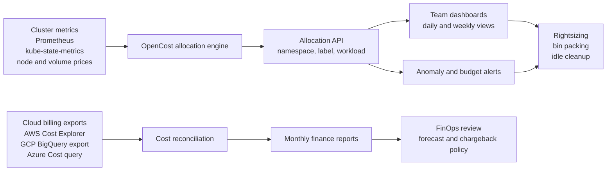
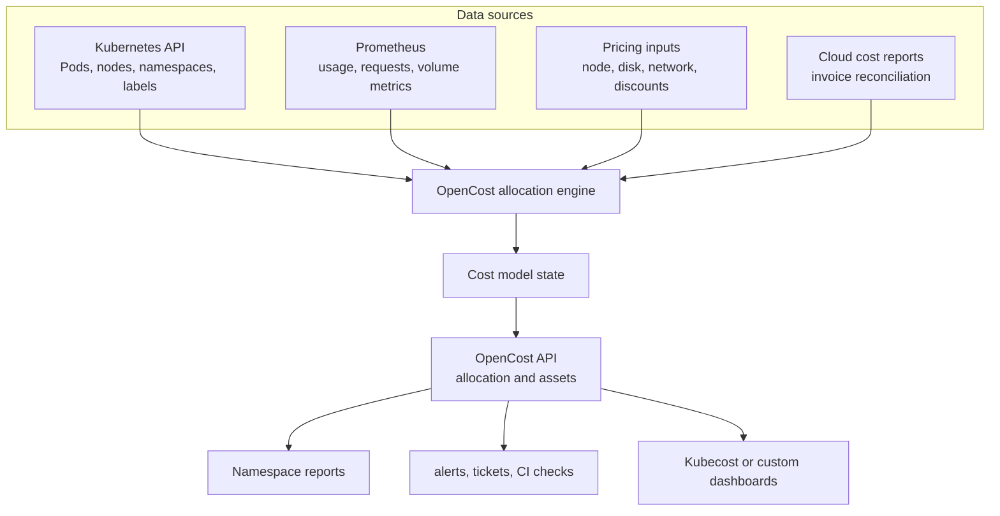
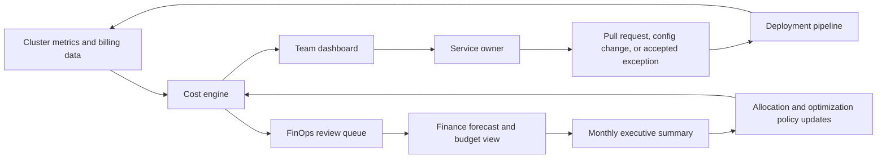

> **Certification Track** | Complexity: `[MEDIUM]` | Time: 50 minutes

## Overview

FinOps becomes useful when the practice can answer operational questions without a monthly archaeology project. Which namespace consumed the most memory yesterday? Which team owns the idle nodes? Which savings recommendation is safe enough to act on this week? Which anomaly should wake a human, and which one should be documented as planned growth? This module turns the FinOps framework into a Kubernetes implementation path. You will work from cost data sources, allocation rules, OpenCost and Kubecost workflows, optimization patterns, alerting policy, and reporting cadence until the practice has a repeatable operating rhythm.

The goal is not to buy a dashboard and declare success. A practical FinOps system has a data contract, a tagging contract, an allocation method, an exception process, and a feedback loop from finance to platform engineering. Billing exports explain the official invoice, but they arrive after usage has already happened. Metrics-based allocation explains Kubernetes behavior close to real time, but it estimates cloud cost from node pricing, persistent volume pricing, and observed usage. A useful implementation deliberately combines both views, reconciles them, and teaches teams how to act on the result.

## What You'll Be Able to Do

- Design a Kubernetes allocation model that maps namespace, label, team, product, shared platform, idle capacity, and discounts to accountable owners.
- Compare billing exports with metrics-based estimation, then choose the right data source for showback, chargeback, anomaly response, and executive reporting.
- Deploy and query OpenCost, use Kubecost dashboards and savings views, and explain how the two fit into a practical FinOps toolchain.
- Apply optimization patterns for rightsizing, bin packing, spot adoption, idle reclamation, anomaly alerting, and recurring cost reviews.

These outcomes are intentionally operational. By the end of the module, you should be able to sketch the data flow, defend an allocation rule, run a namespace cost query, triage a synthetic cost spike, and explain the difference between an engineering signal and an accounting record. The exact tool names may change over time, but the method is stable: collect reliable usage data, map it to owners, expose it at the right cadence, and turn recommendations into safe engineering changes.

## Why This Module Matters

Kubernetes is efficient at sharing infrastructure, which is exactly why it is hard to explain financially. A cloud bill usually sees instances, disks, load balancers, network transfer, managed control plane charges, support, taxes, commitments, and discounts. Engineering sees Deployments, Pods, namespaces, labels, resource requests, autoscalers, queues, and releases. FinOps in practice is the translation layer between those two worlds. Without that translation layer, finance argues about a bill nobody can operate, while engineering argues about metrics that do not reconcile to the invoice.

The practical failure mode is usually not a lack of good intentions. Teams may tag resources, install Prometheus, and publish a monthly dashboard, yet still miss the spend that matters. Idle node capacity can hide under a platform cost center. A namespace can look cheap because shared ingress or storage is not allocated. A team can rightsized a workload and still pay for an unused commitment. A chargeback program can create resentment if the allocation rule is opaque. A healthy implementation makes those tradeoffs explicit, documented, and reviewable.

The FinOps Foundation describes allocation as the capability that assigns and shares cost through accounts, tags, labels, and other metadata, and anomaly management as detection, investigation, and action workflows. See the [allocation capability](https://www.finops.org/framework/capabilities/allocation/) and [anomaly management capability](https://www.finops.org/framework/capabilities/anomaly-management/) for details. The OpenCost/Kubecost model uses the same source, but runs at Kubernetes operating speed with metadata and APIs. This module maps the FinOps ideas to the tools your teams already use on day-to-day clusters.

Use the [FinOps maturity model](https://www.finops.org/framework/maturity-model/) to keep improvements realistic: start with a crawl of one namespace, walk toward broader labels and cross-team reconciliation, then run at a sustainable steady state.

## Did You Know?

- The [CNCF FinOps for Kubernetes report](https://www.cncf.io/wp-content/uploads/2021/06/FINOPS_Kubernetes_Report.pdf) found that many organizations either did not monitor Kubernetes spend or relied on monthly estimates, which is a weak feedback loop for infrastructure that can change quickly.
- [OpenCost](https://opencost.io/docs/) depends on a Kubernetes cluster and Prometheus for time-series input into workload allocation.
- [Kubecost documentation](https://docs.kubecost.com/) shows alert families for allocation budgets, efficiency, spend change, updates, asset budgets, cloud cost budgets, and platform health.
- Kubernetes schedules Pods from declared resource requests, not observed runtime usage, so over-requesting can create expensive idle capacity. See [resource management for Pods and containers](https://kubernetes.io/docs/concepts/configuration/manage-resources-containers/).

## Implementation Map

A practical Kubernetes FinOps implementation has four layers. The first layer is the source layer, where official cloud billing data and near-real-time Kubernetes metrics are collected. The second layer is the allocation layer, where raw charges are mapped to ownership dimensions such as namespace, label, team, service, environment, product, and shared platform. The third layer is the action layer, where dashboards, alerts, tickets, pull requests, and savings recommendations give teams work they can perform. The fourth layer is the governance layer, where finance, platform, and product leaders agree on cadence, exception handling, and whether the practice is showback or chargeback.


```mermaid
flowchart LR
    Billing["Cloud billing exports<br/>AWS Cost Explorer<br/>GCP BigQuery export<br/>Azure Cost query"] --> Reconcile["Cost reconciliation"]
    Metrics["Cluster metrics<br/>Prometheus<br/>kube-state-metrics<br/>node and volume prices"] --> OpenCost["OpenCost allocation engine"]
    OpenCost --> API["Allocation API<br/>namespace, label, workload"]
    Reconcile --> Reports["Monthly finance reports"]
    API --> Dashboards["Team dashboards<br/>daily and weekly views"]
    API --> Alerts["Anomaly and budget alerts"]
    Dashboards --> Actions["Rightsizing<br/>bin packing<br/>idle cleanup"]
    Alerts --> Actions
    Reports --> Governance["FinOps review<br/>forecast and chargeback policy"]
```

This map also shows why one tool cannot solve the whole problem by itself. Billing exports are authoritative for invoice reconciliation, tax, support, credits, and committed-use discount treatment. Cluster metrics are better for explaining why a namespace was expensive today, why a workload is over-requested, or why a new node pool appeared after a release. The operating model needs both views, and it needs a documented rule for what happens when the two disagree. For example, a daily showback dashboard may use OpenCost estimates, while the monthly finance close may reconcile totals against the provider invoice.

## Allocation Methodology

Allocation is the method for turning a shared cluster into accountable cost objects. The most common first version is namespace allocation, because namespaces often map to teams, environments, applications, or tenants. A better version uses labels for `team`, `service`, `product`, `environment`, and `cost-center`, because namespaces alone cannot describe shared services, multi-tenant platforms, or a product that spans several namespaces. The best version treats metadata as an enforceable contract, not as decoration applied after the bill arrives.

Direct allocation should come first. If a cost can be mapped to a single owner without a judgment call, assign it directly. A Deployment in namespace `payments-prod` with label `team=payments` should belong to the payments team. A PersistentVolumeClaim used by that namespace should follow the same owner unless the platform has explicitly classified it as shared. A cloud load balancer created by a Service in that namespace should also follow the namespace or service owner when the linkage is available. Direct allocation is easy to explain, easy to audit, and easy to automate.

Shared cost allocation needs an explicit splitting algorithm. The FinOps Foundation calls out fixed, proportional, and proxy-metric sharing as common strategies for shared cost items. In Kubernetes, shared cost includes control plane overhead, system namespaces, logging, monitoring, ingress, service mesh, cluster autoscaler buffer, shared node idle capacity, support plans, and sometimes committed-use discounts. The wrong answer is to leave every shared cost in a platform bucket forever, because product teams then optimize only their visible workload costs and ignore the shared platform demand they create.

The fixed split algorithm assigns a predefined percentage to each owner. For example, a platform logging stack might be split equally across five product groups, or a shared test cluster might be split by an agreed budget percentage. Fixed splits are useful when usage data is unavailable, when cost is small, or when the organization wants predictable budgeting more than precision. The weakness is that teams cannot easily reduce their charge through better behavior, so fixed splits should be revisited during quarterly planning or replaced when better usage signals appear.

The proportional spend algorithm distributes shared cost according to each owner's direct cost. If team A has forty percent of direct namespace cost, team A receives forty percent of the shared cluster overhead. This is simple and often fair enough for node overhead, platform operations, and shared support charges. The weakness is that it can penalize teams with already expensive direct workloads, even if they do not drive the specific shared service. Use proportional spend for broad infrastructure overhead, not for a service whose usage can be measured more directly.

The proxy metric algorithm uses a workload signal as the split key. Logging can be split by ingested bytes, ingress by request count or transferred bytes, monitoring by time series cardinality, and idle node capacity by requested CPU and memory. Proxy metrics are the most actionable because they point to behavior a team can change. They are also the easiest to overcomplicate. A proxy metric must be stable, explainable, and cheap to collect. If a team cannot reproduce the number or understand the driver, the allocation will lose credibility.

Idle capacity deserves its own policy. Kubernetes cost tools often expose idle cost as the difference between node capacity cost and allocated workload cost. Some organizations keep idle in a platform account because platform engineering owns bin packing and cluster autoscaler configuration. Others share idle across teams in proportion to requested resources because workload requests drive scheduling and node scale-out. A mature model usually separates system idle, intentional headroom, and avoidable idle. Intentional headroom is a resilience decision; avoidable idle is an optimization backlog.

Discounts, commitments, and credits also need a rule. A savings plan, reserved instance, committed use discount, or enterprise discount can be applied centrally, proportionally, or directly to teams that committed demand. Central application simplifies finance reporting but hides the effective rate from engineers. Proportional application is easy to calculate but may reward teams that did not participate in commitment planning. Direct application best supports accountability, but it requires forecasting maturity and a governance process for underused commitments. Document the rule before teams see their first chargeback report.

| Shared cost type | Suggested split | Why it works |
| --- | --- | --- |
| Cluster control plane | Fixed or proportional direct cost | Usually small and broadly shared across cluster tenants |
| Idle node capacity | Requested CPU and memory, with platform-owned exception bucket | Requests drive scheduling pressure, but platform owns autoscaler and node mix |
| Logging platform | Ingested bytes or retained bytes | Teams can reduce verbose logs or adjust retention |
| Monitoring platform | Time series count or scrape samples | Teams can reduce cardinality and noisy metrics |
| Ingress and egress | Transferred bytes, request count, or service owner | Traffic usually has a measurable workload driver |
| Enterprise discount | Proportional eligible spend or direct commitment owner | Keeps the invoice reconciled while preserving ownership |

## Cost Data Sources

Billing exports and metrics-based estimation answer different questions. Billing exports are the system of record for what the provider will invoice. [AWS Cost Explorer](https://docs.aws.amazon.com/aws-cost-management/latest/APIReference/API_GetCostAndUsage.html) exposes cost and usage metrics with dimensions, tags, time ranges, and cost categories. [Google Cloud Billing export to BigQuery](https://cloud.google.com/billing/docs/how-to/export-data-bigquery) writes detailed billing data into BigQuery tables for attribution and audit workflows. [Azure Cost Management + Billing](https://learn.microsoft.com/en-us/azure/cost-management-billing/) provides scoped usage and invoice data for reconciliation. These exports are essential for finance close, amortization, tax, credits, support, and vendor negotiation, but they usually do not explain a Kubernetes namespace by themselves.

Metrics-based estimation starts inside the cluster. Prometheus collects container CPU, memory, persistent volume, network, and Kubernetes object metadata. kube-state-metrics exposes desired state such as resource requests, labels, namespaces, owner references, and pod phases. A cost engine joins those metrics with node, disk, load balancer, and network prices. The result is an estimate of how much each namespace, label, controller, or Pod consumed during a time window. It is not the legal invoice, but it is much closer to the engineering event that caused the cost.

Use billing exports for monthly reconciliation, budget variance, rate optimization, commitment planning, and executive summaries. Use metrics-based allocation for daily showback, release regression checks, rightsizing, idle cleanup, and anomaly triage. If a platform team waits for the invoice to notice a runaway namespace, the cost event is already old. If finance uses raw Prometheus estimates for statutory reporting, the numbers will not match credits, taxes, support charges, or negotiated rates. The implementation must state which source is authoritative for each decision.

The reconciliation process should be boring and repeatable. Start with the provider invoice total for a billing period. Subtract charges that are intentionally outside the Kubernetes scope, such as managed databases or SaaS line items. Compare the remaining cluster-related cost with the cost engine total for nodes, persistent volumes, load balancers, and network transfer. Investigate large gaps by category: missing clusters, missing cloud integration, unmodeled support costs, different discount treatment, delayed usage, or a metrics retention gap. Publish the reconciliation notes with the monthly report so teams understand why a daily estimate may differ from a final invoice.

Metadata quality is part of the data source, not an afterthought. A billing export without tags cannot allocate cloud resources to products. Prometheus metrics without stable labels cannot allocate Kubernetes usage to teams. Labels that change during a migration can split one service across several owners. A practical model defines required labels, validates them in CI or admission control, and maintains a small exception register. Exceptions should have owners and expiration dates. Otherwise "unallocated" becomes a permanent hiding place for spend that nobody wants to own.

## OpenCost Deep Dive

OpenCost is the [open source](https://opencost.io/docs/) cost allocation engine and specification for Kubernetes cost monitoring. In a typical deployment, it runs in the cluster, reads Kubernetes and Prometheus data, applies pricing configuration, and exposes allocation results through an API. The OpenCost documentation describes the [Allocation API](https://opencost.io/docs/integrations/api/) as a way to query cost and resource allocation for Kubernetes workloads with parameters such as `window`, `aggregate`, `includeIdle`, and `shareIdle`. That makes OpenCost useful for automation as well as for a human dashboard.

The OpenCost architecture has three practical inputs. The first input is Kubernetes metadata: namespaces, Pods, controllers, labels, annotations, nodes, PersistentVolumes, and Services. The second input is utilization and allocation metrics stored in Prometheus. The third input is pricing data from cloud provider integrations, custom pricing configuration, or public on-demand price tables. You can install the core workflow from the [OpenCost docs](https://opencost.io/docs/installation/install/) and validate implementation quality from the [OpenCost specification](https://opencost.io/docs/specification/). The allocation engine combines those inputs into cost records by cluster, node, namespace, controller, Pod, label, and service. The API then lets you choose the time window and aggregation that match the question.

OpenCost is especially valuable when the platform team wants vendor-neutral cost data. The OpenCost specification defines a methodology for measuring and allocating infrastructure and container costs in Kubernetes environments. That specification matters because it lets teams reason about the calculation instead of treating the dashboard as a black box. If a namespace cost changes, you should be able to trace the change to resource requests, actual usage, node price, idle allocation, persistent volume cost, or a shared-cost policy. Black-box cost numbers are hard to govern; explainable allocation can be reviewed.

The first operational decision is how to handle idle cost. If `includeIdle=true`, the API can show idle capacity as its own allocation. If `shareIdle=true`, the idle cost can be distributed across active allocations. Keeping idle separate is better for platform operations because it exposes bin packing and autoscaler opportunities. Sharing idle is better for chargeback when the organization wants the full cluster cost to land on consuming teams. Many organizations do both: daily engineering dashboards show idle separately, while monthly finance reports share idle according to the documented rule.

The second operational decision is aggregation. Namespace aggregation is a good starting point because it aligns with Kubernetes tenancy. Label aggregation is better when product ownership crosses namespaces or when a namespace contains several teams. Controller or Pod aggregation is best for rightsizing work because it points to the workload that should change. Cluster and node aggregation is best for platform capacity planning. A practical dashboard gives teams multiple views but keeps the default view stable enough that month-over-month trends remain meaningful.

The third operational decision is retention. Prometheus retention controls how far back the metrics-based cost model can see. If Prometheus keeps only a short window, daily triage will work but monthly reporting may become incomplete. If retention is long but high-cardinality labels explode storage, the observability platform can become expensive enough to distort the FinOps story. Align retention with reporting cadence: short, high-resolution data for incident triage; longer, lower-resolution data for trend reports; billing export data for finance close and audit history.


```mermaid
flowchart TB
    subgraph Sources["Data sources"]
        Kube["Kubernetes API<br/>Pods, nodes, namespaces, labels"]
        Prom["Prometheus<br/>usage, requests, volume metrics"]
        Prices["Pricing inputs<br/>node, disk, network, discounts"]
        Bills["Cloud cost reports<br/>invoice reconciliation"]
    end
    Kube --> Engine["OpenCost allocation engine"]
    Prom --> Engine
    Prices --> Engine
    Bills --> Engine
    Engine --> Store["Cost model state"]
    Store --> API["OpenCost API<br/>allocation and assets"]
    API --> Reports["Namespace reports"]
    API --> Automation["alerts, tickets, CI checks"]
    API --> Dashboards["Kubecost or custom dashboards"]
```

## Kubecost Deep Dive

Kubecost builds a broader product experience around Kubernetes cost data. For a practical FinOps rollout, the value is not just that a dashboard exists. The value is that product teams, platform teams, and finance stakeholders can look at allocation, assets, savings, alerts, budgets, and efficiency from one familiar place. A team lead can inspect namespace cost, a platform engineer can inspect underutilized nodes, and a FinOps practitioner can configure recurring updates or spend-change alerts without writing every query by hand.

The Kubecost Allocations view is the daily operating surface for showback. Set the window, aggregate by namespace or label, include or separate idle cost according to policy, and filter to a team, product, service, or environment. The important habit is to inspect both cost and efficiency. A namespace that costs more because it serves more customers may be healthy. A namespace that costs more because requests are inflated, Pods are abandoned, or volumes are unclaimed is an optimization candidate. FinOps should distinguish cost growth from waste growth.

The Kubecost Savings page is the optimization queue. The documentation describes panels for Kubernetes insights such as right-sizing cluster nodes, right-sizing container requests, abandoned workloads, unclaimed volumes, underutilized nodes, and persistent volume right-sizing, along with cloud insights such as reservations, orphaned resources, and spot instances. Treat these as hypotheses, not as automatic change requests. A recommendation becomes work only after the team checks service-level objectives, release timing, autoscaler behavior, disruption budgets, and whether a savings action shifts risk to another team.

Kubecost alerting turns cost visibility into response. Budget alerts tell an owner when a scope crosses a threshold. Efficiency alerts identify tenants operating below a target efficiency. Spend-change alerts compare current spend against a baseline and report unexpected movement. Recurring updates provide regular summaries. Diagnostic alerts monitor Kubecost and cluster health. The implementation question is who receives each class of alert. A namespace spend-change alert should go to the owning team. A cluster idle alert should go to platform engineering. A billing reconciliation gap should go to FinOps and finance.

The distinction between OpenCost, Kubecost community functionality, and enterprise Kubecost features should be explained early to avoid tool confusion. OpenCost is the open source cost model and API. Kubecost packages dashboards, workflows, alerts, and productized integrations around cost visibility and optimization. The [Kubecost documentation](https://docs.kubecost.com/) notes that deploying the open source OpenCost project directly provides the underlying cost allocation model without the same Kubecost UI, provider billing integration depth, RBAC/SAML support, and scale improvements available in Kubecost product tiers. The right choice depends on scale, governance, access control, and reporting needs.

A minimal adoption path is to start with OpenCost or Kubecost in one non-critical cluster, validate the calculations against a known node price, and build a namespace allocation report. The next step is to add required ownership labels and tune idle handling. After that, introduce savings review and alert routing. Only then should the organization attempt chargeback. If teams do not trust the data during showback, chargeback will turn every monthly report into a dispute.

## Optimization Patterns

Rightsizing is the first pattern because requests drive Kubernetes scheduling. The Kubernetes scheduler places Pods based on resource requests and node capacity, while limits influence runtime enforcement. If a Deployment requests two CPUs per Pod but usually uses a small fraction of that amount, the scheduler still reserves capacity as if the request were real demand. A rightsizing workflow compares request, limit, usage percentile, latency, error rate, and business criticality. The output is a pull request or workload change that lowers requests safely, not a blind slash to the lowest observed value.

Vertical Pod Autoscaler recommendations can help identify right-sized requests, while Horizontal Pod Autoscaler behavior decides replica count from observed metrics. Use those controls together with cost feedback. If VPA lowers per-Pod requests while HPA increases replicas, the net cost may rise or fall depending on workload shape. If HPA scales on CPU but memory requests are inflated, node count may still remain high. Good FinOps review asks whether the autoscaling target, request baseline, and node shape match the workload. It also checks whether downscale stabilization and disruption budgets prevent unsafe savings.

Bin packing is the second pattern. A cluster can have low average utilization and still be hard to pack if workload requests are fragmented across CPU, memory, GPU, storage, topology, taints, and node selectors. The platform team should review node pools by purpose, workload constraints, and dominant resource. A memory-heavy service on CPU-heavy nodes wastes CPU. A service pinned to a special node pool may block scale-down even when most Pods are idle. Bin packing often saves more through node-pool simplification than through tiny adjustments to individual Pods.

Spot, preemptible, and interruptible capacity are the third pattern. They can reduce compute rates, but only for workloads that can tolerate interruption. Batch jobs, stateless workers, queues with retry, CI runners, test environments, and horizontally replicated services are often good candidates. Single-replica databases, quorum-sensitive systems, and fragile stateful workloads are not. The practical implementation uses node pools with taints and tolerations, PodDisruptionBudgets, topology spread, graceful shutdown, queue retry, and a fallback path to on-demand capacity. FinOps should measure realized savings after interruptions, not just the list-price discount.

Idle resource reclamation is the fourth pattern. Idle cost comes from abandoned namespaces, unused PersistentVolumeClaims, quiet load balancers, old preview environments, paused deployments with attached disks, system DaemonSets on oversized node pools, and autoscaler headroom that never drains. Reclamation should be policy-based. For example, preview environments can expire after a defined period unless renewed. Development namespaces can scale down outside working hours. Unclaimed volumes can be flagged after a review window. The key is to create a safe deletion path with ownership checks, not a surprise cleanup that breaks a team.

Rate optimization is the fifth pattern, and it must follow usage understanding. Committed discounts are powerful when demand is stable, but they can fight rightsizing if purchased too early. If the organization commits to a large baseline before request cleanup and bin packing, future engineering savings may turn into unused commitment. FinOps should sequence the work: measure demand, remove obvious waste, separate stable baseline from variable demand, then buy commitments for the part that remains stable. The monthly report should track both realized savings and commitment utilization.

Optimization work should be prioritized by confidence, blast radius, and payback. A low-risk abandoned workload with a clear owner is a quick win. A production memory request change may save more but needs load testing and rollout guardrails. A node-pool migration might require scheduling policy, disruption planning, and incident rehearsal. A useful backlog records the recommendation, source signal, expected monthly impact, owner, risk, validation plan, and follow-up date. This turns cost optimization from random dashboard browsing into normal engineering work.

## Showback, Chargeback, And Ownership

Showback tells teams what their usage costs without moving money between budgets. It is the right first step because it builds literacy and trust. A showback report should include trend, owner, top workloads, idle share, shared-cost policy, anomaly notes, and the next recommended action. The tone matters. Showback should not shame teams for business growth. It should separate valuable growth from avoidable waste and give teams enough context to act. A product team that sees cost per request or cost per customer can make better tradeoffs than a team that sees only total spend.

Chargeback moves cost into team or product budgets. It creates sharper accountability, but it also creates sharper disputes. Before chargeback, the organization needs stable metadata, an allocation policy, exception handling, a reconciliation process, a dispute window, and executive sponsorship. The chargeback report should distinguish direct workload cost, shared platform cost, idle allocation, discounts, credits, and adjustments. Without that detail, teams will treat the number as a tax rather than a signal. Chargeback is a governance process, not a dashboard toggle.

Ownership patterns decide whether the practice changes behavior. Platform engineering should own the cost engine, metadata enforcement, cluster idle, node-pool strategy, and tool reliability. Product engineering should own workload requests, labels, lifecycle cleanup, service efficiency, and release-related anomalies. Finance should own budget alignment, invoice reconciliation, amortization policy, and executive reporting. FinOps practitioners coordinate the model and keep the feedback loop moving. When every alert goes to a central FinOps inbox, the practice becomes a reporting desk. When the right owner receives the right signal, the practice becomes operational.


```mermaid
flowchart LR
    Cluster["Cluster metrics and billing data"] --> Engine["Cost engine"]
    Engine --> TeamDash["Team dashboard"]
    Engine --> FinOps["FinOps review queue"]
    TeamDash --> Owner["Service owner"]
    Owner --> Action["Pull request, config change, or accepted exception"]
    Action --> Deploy["Deployment pipeline"]
    Deploy --> Cluster
    FinOps --> Finance["Finance forecast and budget view"]
    Finance --> Leaders["Monthly executive summary"]
    Leaders --> Policy["Allocation and optimization policy updates"]
    Policy --> Engine
```

## Anomaly Detection And Alerting

Cost anomaly detection should be scoped, routed, and explainable. The FinOps Foundation emphasizes that anomaly detection needs allocation metadata because the team handling the anomaly must be identifiable. A global cloud bill spike is not an actionable page. A message that says namespace `catalog-prod` increased compute cost by sixty percent after yesterday's release, mostly from new Pods requesting memory on on-demand nodes, is actionable. The alert should include the owner, time window, baseline, current spend, primary driver, and links to the dashboard and runbook.

Not every anomaly is bad. A planned product launch, migration rehearsal, seasonal traffic event, or load test can trigger a legitimate spike. The process should let teams pre-register expected anomalies with scope, time window, and owner. When the alert fires, the responder can classify it as expected growth, planned temporary usage, waste, misconfiguration, pricing change, or unknown. This classification matters because it feeds the next forecast. A planned launch should update the budget baseline; a misconfiguration should create a remediation item; an unknown spike should stay open until it has a cause.

Alert thresholds should match decision latency. A production namespace running far above its baseline may need same-day notification. A development namespace crossing a monthly budget may be a weekly review item. Idle node growth can be a platform ticket rather than a page. A missing Prometheus scrape should alert the platform team because it threatens data quality. A billing export delay should alert FinOps because reports may be incomplete. Cost alerting becomes noisy when every cost movement gets the same urgency. Route by ownership and urgency, not by fear.

The investigation path starts with scope. Check whether the spike is cluster-wide, node-pool-specific, namespace-specific, label-specific, or service-specific. Then compare usage and allocation signals: node count, requested CPU, requested memory, actual CPU, actual memory, persistent volumes, load balancers, network transfer, and idle cost. In Kubernetes, `kubectl describe nodes` can reveal allocatable capacity, requested resources, taints, labels, and pressure conditions. Kubecost or OpenCost can show whether the spend is attached to a namespace, a label, idle capacity, or a shared service.

An anomaly runbook should end with a decision. Remediate now, schedule a safe change, accept as planned growth, adjust the allocation rule, or escalate to finance for invoice review. The report should preserve evidence: alert time, affected owner, before and after cost, root cause, action taken, expected monthly impact, and whether the forecast changed. This is not paperwork for its own sake. It is how the next anomaly detector learns what normal looks like and how leadership learns whether cost spikes are business growth or operational waste.

## Reporting Cadences

Daily reporting is for operators. It should be narrow, fresh, and action-oriented: top namespace changes, new idle capacity, new unallocated spend, failed scrapes, expensive new volumes, and high-confidence savings recommendations. Daily reports should go to owners who can act. They should not be polished executive decks. A useful daily report creates tickets, pull requests, or accepted exceptions. If nobody changes anything after reading it, the report is too vague or routed to the wrong audience.

Weekly reporting is for team leads and platform planning. It should show trends by team, service, environment, and optimization backlog. Weekly review asks whether recommendations are moving, whether anomalies were classified, whether idle is shrinking, whether labels are compliant, and whether any cost growth is tied to product growth. This is also the right cadence for rightsizing review because teams can coordinate testing, rollout windows, and service-owner approval. Weekly reporting is where FinOps becomes part of normal engineering planning.

Monthly reporting is for finance and executives. It should reconcile to the provider invoice, explain variance from forecast, summarize major drivers, show unit economics where available, and identify decisions needed from leadership. The executive summary should be short: total spend, forecast variance, top changes, savings realized, savings pipeline, risk items, and asks. The details can live in an appendix or dashboard. Executives do not need every namespace; they need confidence that the practice can explain movement and guide tradeoffs.

A mature cadence also includes quarterly policy review. Allocation rules should be revisited when product ownership changes, clusters consolidate, shared services grow, discounts change, or chargeback starts. Optimization policies should be revisited when reliability targets change, new instance families become available, or Kubernetes features change the rightsizing workflow. Each review should produce a short changelog: which split rule changed, which label became required, which alert route moved, and which exception expired. Reporting without policy updates becomes stale because teams optimize against last quarter's assumptions. Policy without reporting becomes opinion because nobody can see whether the new rule improved behavior or only moved numbers between cost centers. The cadence keeps both sides connected so FinOps stays an operating practice rather than a one-time tooling project.

## Learner Check

Before moving to the quiz and hands-on lab, pause and test the implementation model against a real or imagined cluster. Pick one production namespace and identify the owner, team label, product label, service label, environment, top controller, requested CPU, requested memory, actual usage, persistent volumes, and load balancers. Then decide which costs are direct, which are shared, and which are idle. If you cannot answer those questions from your current tooling, the next improvement is not a better executive chart; it is better metadata, a documented allocation rule, and a cost engine query or dashboard that your teams already trust for day-to-day decisions.

Now test the workflow end to end. Suppose the namespace cost rises sharply after a release: decide which signal should arrive first, who should receive it, what dashboard they open, what command or API call they run, how they distinguish planned growth from waste, and how the result reaches the next forecast. Walk through the anomaly runbook categories from this module—expected growth, planned temporary usage, misconfiguration, pricing change, or unknown—and note which category your scenario would receive. If the answer depends on one person remembering how to query a spreadsheet, the practice is fragile. If the answer is a documented runbook with an owner, baseline, and feedback path into weekly and monthly reporting, the practice is ready to scale.

## Common Mistakes

| Mistake | Why it hurts | Better practice |
| --- | --- | --- |
| Treating a dashboard as the FinOps practice | Teams can view cost but do not know who owns action | Define owners, review cadence, and remediation workflow |
| Allocating only by namespace forever | Shared services and multi-namespace products become distorted | Add stable team, product, service, and environment labels |
| Hiding all idle cost in the platform budget | Workload requests can drive scale-out without accountability | Split idle by policy and keep avoidable idle visible |
| Starting with chargeback before showback trust exists | Teams dispute the model instead of improving usage | Run showback, reconcile data, and publish exception rules first |
| Buying commitments before rightsizing | Future savings can turn into underused commitments | Clean obvious waste before committing stable demand |
| Alerting only on total cloud bill movement | Responders cannot find the owner or root cause quickly | Alert by allocated scope with owner, driver, and baseline |
| Ignoring data freshness and retention | Daily triage and monthly reporting use incomplete windows | Align Prometheus retention, billing exports, and report cadence |

## Knowledge Check

<details>
<summary>Question 1: Which allocation method is usually the best first step for a shared Kubernetes cluster?</summary>

A. Put every cluster charge in a central platform budget until teams ask for details.
B. Allocate direct namespace and label costs first, then apply documented rules for shared and idle costs.
C. Split all Kubernetes costs equally across every engineering team, regardless of usage.
D. Wait for the cloud invoice and manually estimate every namespace from memory.

Answer: B is correct because direct allocation creates the clearest ownership signal, while documented shared-cost rules handle the costs that cannot be assigned directly. A hides accountability, C is easy but often unfair, and D is too late and too fragile for operational FinOps.
</details>

<details>
<summary>Question 2: When should a team prefer billing export data over metrics-based estimation?</summary>

A. When reconciling the monthly invoice, discounts, credits, support charges, and finance reporting.
B. When deciding whether a Pod request was too high during yesterday's release.
C. When finding which namespace created a new PersistentVolumeClaim today.
D. When checking whether HPA increased replicas during a traffic spike.

Answer: A is correct because billing exports are the authoritative source for invoice-level accounting. B, C, and D are better served by cluster metrics and allocation tools because they depend on recent Kubernetes behavior.
</details>

<details>
<summary>Question 3: What does OpenCost add to a Kubernetes FinOps implementation?</summary>

A. It replaces cloud billing systems and becomes the legal invoice.
B. It joins Kubernetes metadata, Prometheus metrics, and pricing inputs into workload allocation data exposed through an API.
C. It automatically deletes every idle namespace once a budget is crossed.
D. It guarantees that all workloads are safe to run on interruptible nodes.

Answer: B is correct because OpenCost is a cost allocation engine and API for Kubernetes cost monitoring. A overstates its accounting role, C describes a dangerous policy that OpenCost does not perform by default, and D confuses cost reporting with workload resilience engineering.
</details>

<details>
<summary>Question 4: Why can inflated Kubernetes resource requests increase cost even when actual CPU usage is low?</summary>

A. The scheduler uses declared requests to decide whether Pods fit on nodes, so inflated requests can force extra capacity.
B. Kubernetes always bills directly from actual CPU seconds, independent of node cost.
C. QoS classes delete Pods that request too much CPU.
D. Prometheus automatically lowers requests after it observes low usage.

Answer: A is correct because scheduling is based on requested resources and node capacity. B ignores the fact that most clusters pay for nodes and attached resources, C misstates QoS behavior, and D describes automation that Prometheus does not perform.
</details>

<details>
<summary>Question 5: What is the safest way to treat Kubecost savings recommendations?</summary>

A. Apply every recommendation immediately because it came from a cost tool.
B. Treat each recommendation as a hypothesis, then validate risk, ownership, service-level objectives, and rollout plan.
C. Ignore recommendations unless finance requests a budget reduction.
D. Convert every recommendation into chargeback penalties.

Answer: B is correct because savings work changes production systems and must respect reliability, ownership, and timing. A is unsafe, C wastes useful signals, and D turns optimization into punishment instead of collaboration.
</details>

<details>
<summary>Question 6: What information should a useful cost anomaly alert include?</summary>

A. Only the total cloud bill increase, because details can wait for the monthly meeting.
B. Owner, affected scope, time window, baseline, current movement, likely driver, and links to the relevant dashboard or runbook.
C. A generic message to every engineer so somebody notices.
D. A request for finance to explain Kubernetes scheduling.

Answer: B is correct because anomaly response depends on ownership, scope, baseline, and evidence. A is too vague, C creates noise, and D sends an engineering investigation to the wrong function.
</details>

## Hands-On Lab

### Setup

These commands are intended for a local lab on your workstation, so you can practice allocation queries without wiring a full cloud billing integration first. Assume `kind`, `kubectl`, `helm`, `curl`, and `jq` are installed, then work through the numbered steps below in order: create a disposable cluster, install Prometheus as the metrics backend, render and apply OpenCost from the Helm chart, and deploy a labeled sample workload in namespace `team-a`. Each step uses explicit namespaces and labels so the later Allocation API response has a predictable owner dimension to inspect.

1. Install `kind` and create a lab cluster.

```bash
kind version
kind create cluster --name finops-practice
```

2. Install Prometheus and render OpenCost into Kubernetes manifests via Helm, then apply with `kubectl`.

```bash
helm repo add prometheus-community https://prometheus-community.github.io/helm-charts
helm repo add opencost https://opencost.github.io/opencost-helm-chart
helm repo update

helm upgrade --install prometheus prometheus-community/prometheus \
  --namespace prometheus-system \
  --create-namespace

kubectl create namespace opencost

helm template opencost opencost/opencost \
  --namespace opencost \
  --set opencost.prometheus.internal.namespaceName=prometheus-system \
  --set opencost.prometheus.internal.serviceName=prometheus-server \
  --set opencost.prometheus.internal.scheme=http \
  --set opencost.prometheus.internal.port=9090 \
  | kubectl apply -n opencost -f -

kubectl wait --for=condition=Available deployment/opencost \
  --namespace opencost \
  --timeout=180s
```

3. Create one workload with ownership labels.

```bash
kubectl create namespace team-a
kubectl label namespace team-a team=payments environment=dev product=checkout

kubectl apply -n team-a -f - <<'EOF'
apiVersion: apps/v1
kind: Deployment
metadata:
  name: checkout-web
  labels:
    app: checkout-web
    team: payments
    product: checkout
    environment: dev
spec:
  replicas: 2
  selector:
    matchLabels:
      app: checkout-web
  template:
    metadata:
      labels:
        app: checkout-web
        team: payments
        product: checkout
        environment: dev
    spec:
      containers:
        - name: nginx
          image: nginx:1.27
          resources:
            requests:
              cpu: "500m"
              memory: "512Mi"
            limits:
              cpu: "750m"
              memory: "1Gi"
EOF
```

### Exercise: Querying OpenCost

After the cluster stabilizes, use the Allocation API workflow rather than a billing export to generate namespace-level cost rows for the last hour. Port-forward the OpenCost service, call `allocation/compute` with `aggregate=namespace`, keep idle visible but unshared (`includeIdle=true`, `shareIdle=false`), and inspect the first `data` element with `jq`. A healthy lab response is a JSON object whose rows include both `team-a` (from the labeled checkout Deployment) and `__unallocated__` (workloads or cluster cost not yet mapped to your ownership labels), which confirms the metrics path from Prometheus through OpenCost is producing allocation output you can automate against.

```bash
kubectl port-forward --namespace opencost service/opencost 9003:9003 &
PF_PID=$!

sleep 3
curl -s "http://127.0.0.1:9003/allocation/compute?window=1h&aggregate=namespace&includeIdle=true&shareIdle=false" | jq '.data[0]'

kill "$PF_PID"
```

### Acceptance checks

Confirm each item below before you delete the lab cluster, because a passing curl once does not prove the metrics and pricing inputs stayed healthy for the whole exercise window.

- [ ] `kind get clusters` includes `finops-practice`.
- [ ] `kubectl wait --for=condition=Available deployment/opencost -n opencost --timeout=180s` exits with zero.
- [ ] `kubectl get pods -n opencost --field-selector=status.phase=Running` returns at least one OpenCost pod.
- [ ] `kubectl port-forward --namespace opencost service/opencost 9003:9003` followed by the allocation curl command returns valid JSON with a `data` field.

### Cleanup

```bash
kind delete cluster --name finops-practice
```

## Sources

- [FinOps Framework overview](https://www.finops.org/framework/)
- [FinOps Maturity Model](https://www.finops.org/framework/maturity-model/)
- [FinOps Allocation capability](https://www.finops.org/framework/capabilities/allocation/)
- [FinOps Anomaly Management capability](https://www.finops.org/framework/capabilities/anomaly-management/)
- [OpenCost overview](https://opencost.io/docs/)
- [OpenCost installation](https://opencost.io/docs/installation/install/)
- [OpenCost API](https://opencost.io/docs/integrations/api/)
- [OpenCost specification](https://opencost.io/docs/specification/)
- [OpenCost API examples](https://opencost.io/docs/integrations/api-examples)
- [OpenCost GitHub repository](https://github.com/opencost/opencost)
- [Kubecost documentation](https://docs.kubecost.com/)
- [Kubecost API documentation](https://www.ibm.com/docs/en/kubecost/self-hosted/3.x?topic=apis-allocation-api)
- [AWS Cost Explorer API](https://docs.aws.amazon.com/aws-cost-management/latest/APIReference/API_GetCostAndUsage.html)
- [Google Cloud Billing export to BigQuery](https://cloud.google.com/billing/docs/how-to/export-data-bigquery)
- [Azure Cost Management + Billing](https://learn.microsoft.com/en-us/azure/cost-management-billing/)
- [Kubernetes resource management for Pods and containers](https://kubernetes.io/docs/concepts/configuration/manage-resources-containers/)
- [CNCF FinOps for Kubernetes report](https://www.cncf.io/wp-content/uploads/2021/06/FINOPS_Kubernetes_Report.pdf)

## Next Module

Return to the [K8S FinOps track overview](../) and use this module's implementation checklist as the operational companion to the FinOps fundamentals.
