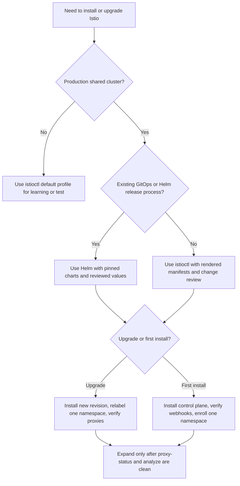

> **Complexity:** `MEDIUM`
> **Time to Complete:** 60-75 minutes
> **Kubernetes target:** v1.35+
> **Prerequisites:** [CKA Part 3: Services & Networking](/k8s/cka/part3-services-networking/), [Service Mesh Concepts](/platform/toolkits/infrastructure-networking/networking/module-5.2-service-mesh/), and a basic grasp of TLS handshakes, forward proxies, and reverse proxies.

## Learning Outcomes

After completing this module, you will be able to:

1. **Design** an Istio installation strategy that compares `istioctl`, Helm, profiles, revisions, and production upgrade boundaries.
2. **Implement** sidecar injection and ambient enrollment controls with namespace labels, workload labels, and safe verification commands.
3. **Evaluate** `istiod` and Envoy synchronization using `istioctl proxy-status`, `istioctl analyze`, Kubernetes events, and control-plane health signals.
4. **Diagnose** installation failures involving webhooks, revisions, certificates, CRDs, resource limits, and Kubernetes v1.35+ admission behavior.
5. **Compare** sidecar architecture with ambient mode by reasoning about resource cost, security boundaries, traffic capture, and operational tradeoffs.

## Why This Module Matters

Hypothetical scenario: a platform team adds Istio to a shared Kubernetes v1.35 production cluster because the organization wants mTLS, traffic policy, and better request telemetry without rewriting every service. The first development namespace works, so the team expands the mesh by labeling several application namespaces at once. Within an hour, some pods have Envoy sidecars, some do not, one namespace is using an older control-plane revision, and a new webhook failure blocks a rollout that was unrelated to the service mesh project. Nothing in that story requires exotic failure modes; it is the normal consequence of introducing a traffic interception layer without an installation plan.

Istio installation is not just "run a command and check for pods." You are adding a control plane that watches Kubernetes resources, translates Istio APIs into Envoy configuration, issues workload identities, manages admission webhooks, and changes the network path for every enrolled workload. A bad installation choice can leave the mesh technically running while still producing a fragile cluster: plaintext traffic may be accepted when the security team expected strict mTLS, workloads may connect to the wrong revision, or a gateway may depend on CRDs that were never installed cleanly.

The ICA exam expects you to operate Istio like infrastructure, not like a demo add-on. You need to know what `istiod` owns, what Envoy owns, what Kubernetes admission owns, and where the boundaries appear during troubleshooting. This module starts with the architecture because installation commands only make sense when you can predict which component should change after each command. By the end, you will have a repeatable way to choose an install method, enroll workloads safely, and prove that the control plane and data plane agree.

Think of Istio like a hospital nervous system, a useful analogy from the earlier draft of this module. `istiod` is the brain that interprets policy, routing, certificates, and service discovery; Envoy sidecars are the nerve endings attached to individual workloads; ambient mode moves part of that nerve layer into node-level and waypoint proxies. If the brain is temporarily unavailable, existing sidecars can keep using their last valid instructions, but new configuration and new identities stop flowing. If a workload never gets a nerve ending at all, it can look healthy in Kubernetes while still sitting outside the expected mesh security model.

## Istio Architecture: Control Plane, Data Plane, And Kubernetes

The easiest way to misunderstand Istio is to treat it as one big proxy. Istio is better modeled as a contract between three systems: Kubernetes stores desired state, `istiod` converts that state into mesh configuration, and Envoy or ambient data-plane components enforce the result close to the workload. Kubernetes remains the source of truth for Deployments, Services, Endpoints, Secrets, admission webhooks, and custom resources. Istio adds service-mesh APIs and a translation layer, but it does not replace the Kubernetes scheduler, kube-proxy, CNI plugin, or API server.

The control plane is the `istiod` Deployment in the `istio-system` namespace unless you intentionally choose a different namespace or revisioned layout. Modern `istiod` combines responsibilities that were once split across Pilot, Citadel, and Galley. Pilot-like behavior discovers Services and produces xDS configuration, Citadel-like behavior handles certificates and workload identity, and Galley-like validation behavior moved into webhooks and analysis tooling. That consolidation matters operationally because a single Deployment now sits on the path for configuration freshness, certificate issuance, validation, and discovery.

The data plane is where traffic decisions execute. In classic sidecar mode, each enrolled workload pod gets an Envoy container injected beside the application container. The pod's traffic is redirected through Envoy by iptables or equivalent capture rules, so the application keeps listening on its normal port while Envoy handles mTLS, retries, load balancing, telemetry, and route policy. In ambient mode, Istio removes the per-pod sidecar from the default path and uses node-level `ztunnel` plus optional waypoint proxies to provide different layers of mesh behavior. Sidecar mode gives very fine workload-local control; ambient mode reduces per-pod overhead but changes the troubleshooting map.

Here is the recovered architecture diagram from the original module, completed so it renders correctly while preserving the original `istiod`, Pilot, Citadel, Galley, and xDS concepts:

```text
┌─────────────────────────────────────────────────────────┐
│                        istiod                           │
│                                                         │
│  ┌─────────────┐  ┌─────────────┐  ┌─────────────────┐ │
│  │   Pilot     │  │   Citadel   │  │     Galley      │ │
│  │             │  │             │  │                 │ │
│  │  Config     │  │ Certificate │  │ Config          │ │
│  │ distribution│  │ management  │  │ validation      │ │
│  │  (xDS API)  │  │             │  │                 │ │
│  └──────┬──────┘  └──────┬──────┘  └────────┬────────┘ │
│         │                │                  │          │
└─────────┼────────────────┼──────────────────┼──────────┘
          │                │                  │
          v                v                  v
┌─────────────────────────────────────────────────────────┐
│                 Kubernetes API Server                   │
│ Services, Endpoints, CRDs, Secrets, Webhooks, Events     │
└─────────────────────────────────────────────────────────┘
          │
          v
┌─────────────────────────────────────────────────────────┐
│                 Envoy / Ambient Data Plane              │
│ Sidecars, ztunnel, waypoint proxies, gateways            │
└─────────────────────────────────────────────────────────┘
```

The diagram deliberately shows Kubernetes in the middle because installation failures often appear there first. A missing CRD prevents Istio custom resources from being stored, a failing mutating webhook prevents sidecar injection, and a broken validating webhook rejects configuration before Envoy ever sees it. When you debug an Istio install, do not jump straight to Envoy. First ask whether Kubernetes accepted the desired state, then ask whether `istiod` translated it, and only then ask whether the data plane applied it.

Pause and predict: if `istiod` is restarted while existing sidecar-injected pods keep running, what do you expect to happen to already-established application traffic, and what do you expect to happen to new mesh configuration? The expected answer is split. Existing Envoy sidecars continue processing traffic with the last accepted configuration, while new routing changes, fresh certificates, and newly started proxies may stall or age until `istiod` is healthy again. That distinction is why control-plane availability and data-plane continuity are related but not identical.

Istio installation also creates Kubernetes admission hooks, and that makes the API server part of the critical path for new pods. Automatic sidecar injection is usually implemented by namespace or pod labels that cause a mutating webhook to patch the pod spec before the pod is persisted. If the webhook is unreachable, configured with the wrong CA bundle, or points at a deleted revision, pod creation may fail or proceed without injection depending on policy and match rules. Your mental model should include the admission call because a "sidecar missing" problem can be an API-server admission problem, not a kubelet or Envoy problem.

The practical control-plane inspection starts with Kubernetes resources, then moves to Istio-aware checks. These commands are intentionally simple because the first pass should answer whether the expected components exist and whether Kubernetes is reporting readiness. Later checks will inspect xDS synchronization and analyzer output.

```bash
kubectl get namespace istio-system
kubectl get deployments,pods,services -n istio-system
kubectl get mutatingwebhookconfigurations,validatingwebhookconfigurations | grep istio
istioctl version
istioctl proxy-status
```

The same architecture can be reduced to a troubleshooting ladder. The API server stores resources and calls admission webhooks, `istiod` watches that state and produces xDS, and the data plane connects back to receive configuration and certificates. If any rung is broken, the next rung may show a symptom without owning the root cause. A missing sidecar can be caused by namespace labels, webhook health, revision targeting, or pod creation timing. A stale proxy can be caused by `istiod`, network reachability, invalid config, or proxy startup failure.

```text
+----------------------+      +----------------------+      +----------------------+
| Kubernetes API       | ---> | istiod control plane | ---> | Envoy or ambient     |
| CRDs and webhooks    |      | xDS and identity     |      | traffic enforcement  |
+----------------------+      +----------------------+      +----------------------+
        |                             |                             |
        v                             v                             v
+----------------------+      +----------------------+      +----------------------+
| Accepted resources   |      | Translated config    |      | Applied runtime view |
| Events and admission |      | Certificates issued  |      | Requests and metrics |
+----------------------+      +----------------------+      +----------------------+
```

That ladder is also how you avoid overfitting to one command. `kubectl get pods` is necessary but incomplete, because it only sees the Kubernetes runtime layer. `istioctl analyze` is necessary but incomplete, because it reasons about configuration more than live request success. `proxy-status` is necessary but incomplete, because it focuses on connected data-plane proxies. A strong installation check uses all three perspectives and then runs a small traffic test that proves the mesh behavior you intended.

Before running this, what output do you expect from `istioctl proxy-status` in a cluster where Istio is installed but no application workload has joined the mesh? A healthy answer may show no workload proxies, and that is not automatically a failure. `proxy-status` reports connected Envoy proxies, so an empty or small list can simply mean you have installed the control plane before enrolling applications. The command becomes powerful after injection because it reveals whether each proxy is synchronized with `istiod`.

## Installation Strategy: Profiles, `istioctl`, Helm, And Revisions

An installation strategy is a set of decisions, not a single installer preference. You decide how Istio artifacts enter the cluster, which profile or values define the starting point, whether upgrades use revisions, how gateways are managed, and how much of the mesh is allowed to change at once. `istioctl` is excellent for learning, validation, and operator-driven installs because it understands Istio profiles and can run analyzers before applying resources. Helm is often better for GitOps and platform teams that already manage cluster add-ons through chart versions, values files, pull requests, and environment overlays.

Profiles are convenient but easy to misuse. The `default` profile is a production-oriented baseline for the control plane. The `demo` profile is for experimentation and includes extra components or settings that make examples easy, not production governance better. The `minimal` profile can be useful when you want tight control over which gateways and add-ons exist. Ambient installs use an ambient-oriented profile and additional data-plane components. Treat a profile as a policy bundle with security, injection, gateway, and resource implications, not as a t-shirt size.

Version pinning belongs in the installation strategy as much as the profile does. Istio publishes supported Kubernetes version ranges, and the current documentation for the 1.29 line includes Kubernetes v1.35 in that tested range. A cluster running v1.35+ should still pin Istio to a reviewed version instead of following "latest" blindly, because mesh upgrades change webhooks, CRDs, proxy images, gateway behavior, and sometimes default analyzer messages. In practice, you want a written compatibility statement before the change and a rollback statement after the change.

Gateways deserve a separate installation decision even when the control plane is simple. Many teams install ingress gateways with Istio because examples do, then later discover that gateway ownership, load balancer annotations, certificate automation, and external DNS are controlled by a different platform group. The cleaner pattern is to install the control plane first, decide whether gateways are mesh-owned or platform-owned, and manage gateway charts or manifests as their own release surface. That separation keeps traffic entry points from being accidentally changed during a control-plane experiment.

The original module included a production caution around the `demo` profile. The example below preserves its core command asset while reframing the story as a clearly labeled exercise scenario. The important lesson is still the same: production installation should start from an intentional baseline, and strict mTLS should be expressed explicitly when the security requirement is strict encryption between mesh workloads.

Exercise scenario: a development cluster was installed with `profile=demo`, and the team now wants a production-like cluster that uses the default profile and strict namespace-wide mTLS. The safe correction is not to copy the demo command into production. Install an intentional profile, confirm control-plane health, then apply a security policy that matches the desired traffic posture.

```bash
# What the team should have done for production:
istioctl install --set profile=default

# Then explicitly set STRICT mTLS:
kubectl apply -f - <<EOF
apiVersion: security.istio.io/v1
kind: PeerAuthentication
metadata:
  name: default
  namespace: istio-system
spec:
  mtls:
    mode: STRICT
EOF
```

That command is runnable, but the operational decision behind it matters more than the syntax. A strict mesh-wide `PeerAuthentication` changes how workloads accept traffic, and it can break services that are not actually in the mesh or that depend on legacy plaintext paths. In a real migration, you would usually stage strict mTLS by namespace, verify application readiness, and use telemetry to confirm that expected clients are using mutual TLS before expanding the policy. The command teaches the shape of the resource; the rollout plan prevents avoidable outages.

`istioctl` gives you useful guardrails during installation because it can render manifests, apply profiles, and run preflight analysis. In exam conditions, you should know the install command, but in operations you should also know how to render and inspect what will be applied. Rendering is valuable because it exposes CRDs, Deployments, Services, webhooks, and gateways before they affect a live cluster. It also lets you review generated YAML in code review when a direct cluster install would be too opaque.

```bash
istioctl manifest generate --set profile=default > istio-default-rendered.yaml
istioctl install --set profile=default --skip-confirmation
kubectl wait --for=condition=available deployment/istiod -n istio-system --timeout=180s
istioctl verify-install
```

Helm changes the workflow by making the base chart, control-plane chart, CNI chart, gateway chart, and ambient components fit into a release-managed model. The tradeoff is that Helm will not automatically teach every operator the same Istio-specific profile vocabulary that `istioctl` exposes. That is not a weakness if your team already uses values files, chart pinning, and staged release promotion. It is a weakness if Helm becomes a copy-paste wrapper around values nobody understands.

```bash
helm repo add istio https://istio-release.storage.googleapis.com/charts
helm repo update

helm install istio-base istio/base -n istio-system --create-namespace --wait
helm install istiod istio/istiod -n istio-system --wait
kubectl wait --for=condition=available deployment/istiod -n istio-system --timeout=180s
istioctl proxy-status
```

Revisioned installs are the safer upgrade shape for clusters with important workloads. A revision is a label and control-plane identity that lets one `istiod` revision coexist with another, so namespaces can be moved gradually. Instead of upgrading the only control plane and hoping every injected workload follows cleanly, you install a new revision, relabel a test namespace, restart or roll out workloads there, and observe. When the new revision behaves correctly, you move more namespaces. If it fails, you can move the label back without forcing the entire cluster through one irreversible step.

```bash
istioctl install --set profile=default --set revision=canary --skip-confirmation
kubectl get pods -n istio-system -l app=istiod
kubectl label namespace payments istio.io/rev=canary --overwrite
kubectl rollout restart deployment -n payments
istioctl proxy-status
```

The revision label also prevents a common confusion between namespace enrollment and workload restart. Relabeling a namespace changes how future pod admission should behave, but it does not mutate already-created pods. Existing pods keep the sidecar and bootstrap configuration they received at creation time until they are restarted. This is why a revision migration plan always includes both the label operation and a workload rollout, plus a verification step that confirms proxies report the expected control-plane revision.

Revisions also make rollback language precise. Without revisions, rollback often means reinstalling a previous control plane or reverting a chart release and hoping proxies reconnect cleanly. With revisions, rollback can mean relabeling a namespace back to the previous revision and restarting workloads in that namespace. That still causes pod churn, so it is not free, but it is scoped and observable. The smaller rollback unit is the main reason revisioned installs are worth the extra labels and cleanup work.

Which approach would you choose here and why: `istioctl` direct install for a one-node practice cluster, or Helm charts for a regulated production platform with pull-request approvals? The practical answer is usually `istioctl` for the practice cluster because it is fast and clear, and Helm for the regulated platform because release artifacts, values files, and approvals matter. The deeper point is that the installer should match the governance model. A good installation method is the one your team can inspect, reproduce, upgrade, and roll back under pressure.

## Data Plane Enrollment: Sidecar Injection And Ambient Mode

Installing `istiod` does not put applications in the mesh. Enrollment is a separate decision that controls which workloads receive a sidecar, connect through ambient, or remain outside Istio. That separation is healthy because platform teams can install the control plane first, test admission behavior, and then enroll namespaces one at a time. It also means a cluster can be in a mixed state by design. The key is to make the mixed state visible and intentional instead of accidental.

Classic sidecar injection usually begins with a namespace label. The older label `istio-injection=enabled` tells the default injector to add sidecars. The revision label `istio.io/rev=<revision>` tells the namespace to use a specific control-plane revision. Do not use both labels on the same namespace unless you have verified exactly how your target Istio version resolves them, because competing enrollment labels are a common source of surprising injection behavior. Prefer revision labels in production upgrade workflows because they make ownership explicit.

```bash
kubectl create namespace sample
kubectl label namespace sample istio-injection=enabled
kubectl run web -n sample --image=nginx:1.29 --port=80
kubectl get pod -n sample -l run=web -o jsonpath='{.items[0].spec.containers[*].name}'
```

The expected container list should include the application container and `istio-proxy` after automatic injection succeeds. If the pod only contains `web`, check the namespace label, the mutating webhook configuration, and whether the pod was created before the namespace was labeled. Kubernetes admission is not retroactive. You can delete and recreate the pod, or roll out the owning Deployment, but you cannot label a namespace and expect already-running pods to grow sidecars.

Manual injection still matters for controlled demonstrations, disconnected workflows, and debugging. It renders the mutated manifest before it reaches the API server, which makes the sidecar addition visible. Manual injection is not usually the preferred production path because it bakes injection output into workload YAML and can drift from the active control-plane revision. Use it when you need to study or compare the injected pod spec, then return to admission-based injection for normal operations.

```bash
kubectl create deployment manual-web -n sample --image=nginx:1.29 --dry-run=client -o yaml > manual-web.yaml
istioctl kube-inject -f manual-web.yaml > manual-web-injected.yaml
kubectl apply -f manual-web-injected.yaml
kubectl get pod -n sample -l app=manual-web -o jsonpath='{.items[0].spec.containers[*].name}'
```

Sidecars are powerful because they put policy enforcement beside the application process. That same closeness is also the cost. Every sidecar consumes CPU, memory, startup time, image pulls, log volume, and configuration streams from `istiod`. In small clusters the overhead is easy to ignore. In larger clusters the sidecar fleet becomes a real capacity-planning input, especially for workloads that scale horizontally into hundreds or thousands of pods.

Ambient mode changes enrollment by moving the default Layer 4 secure overlay into `ztunnel` and using waypoint proxies when Layer 7 policy is needed. The operational benefit is that application pods do not receive an Envoy sidecar by default, which reduces pod-level resource overhead and avoids some sidecar lifecycle friction. The tradeoff is that troubleshooting moves from "inspect the pod's `istio-proxy` container" to "inspect node-level tunnels, waypoint resources, namespace labels, and policy attachment." Ambient mode is not magic; it is a different data-plane topology.

```bash
istioctl install --set profile=ambient --skip-confirmation
kubectl label namespace sample istio.io/dataplane-mode=ambient --overwrite
kubectl get pods -n istio-system
kubectl get namespace sample --show-labels
```

Ambient enrollment also changes how you talk about "being in the mesh." In sidecar mode, the visual proof is inside the pod spec because the sidecar container is present. In ambient mode, a workload can be enrolled without a visible `istio-proxy` container, so the proof shifts to namespace labels, `ztunnel` health, policy attachment, and traffic behavior. This is a common exam and operations trap. Do not declare ambient broken because the pod lacks a sidecar; that absence is part of the design.

Before choosing ambient, compare the policy requirements of the workload. If you only need secure service-to-service identity and basic traffic capture, ambient can reduce operational cost. If you rely heavily on per-workload Envoy filters, advanced Layer 7 routing at every pod, or existing sidecar-specific debugging habits, sidecars may still be the clearer choice. Ambient is an architecture option, not a universal replacement for every sidecar deployment.

The enrollment model should be written down before the first production namespace changes. A simple rule such as "new app namespaces use revision labels, shared infrastructure namespaces are excluded, and ambient is piloted only for stateless internal services" is much safer than ad hoc labeling. The rule gives reviewers something to evaluate and gives on-call engineers a baseline when a pod has unexpected containers or missing mesh identity. Installation architecture becomes operationally useful when it produces predictable labels.

Workload opt-out rules are just as important as opt-in rules. Some pods should not be injected because they run host networking, implement low-level networking, use unusual startup probes, or belong to namespaces where mesh interception would confuse platform services. Istio supports workload-level labels and annotations that can disable injection for specific pods, but those exceptions should be rare and documented. An exception that nobody remembers becomes a future mTLS or telemetry mystery when the workload behaves differently from its namespace.

## Evaluating Control-Plane And Proxy Synchronization

After installation and enrollment, the main question becomes whether the desired mesh state has reached the data plane. Kubernetes can show that pods are Running, but it cannot tell you whether Envoy has the latest clusters, listeners, routes, endpoints, and secrets. Istio's diagnostic commands fill that gap by querying `istiod` and connected proxies. The goal is not to memorize every output column; the goal is to know which layer is being inspected and what a mismatch means.

`istioctl proxy-status` is the broad synchronization view. It reports connected proxies and whether the major xDS resource types are in sync. A proxy can be Running from Kubernetes' perspective while still stale from Istio's perspective. Stale xDS often means the proxy has not accepted a recent configuration push, the control plane cannot reach it cleanly, or a bad configuration was rejected. If one proxy is stale, focus on that workload. If many proxies are stale, suspect `istiod`, cluster networking, or a broad configuration issue.

```bash
istioctl proxy-status
istioctl proxy-status deployment/web.sample
kubectl logs -n istio-system deployment/istiod --tail=100
```

`istioctl analyze` checks Istio configuration for known mistakes before or after applying it. It can catch conflicting virtual services, missing destination subsets, invalid gateway references, injection label issues, and other configuration problems that Kubernetes itself may accept because the YAML is structurally valid. Run it as a habit after installation and before major rollout changes. The analyzer is not a replacement for testing traffic, but it is a low-cost way to detect errors before they become confusing proxy behavior.

```bash
istioctl analyze --all-namespaces
istioctl analyze -n sample
kubectl get events -n sample --sort-by=.lastTimestamp
```

Envoy-specific inspection is more detailed and should follow a concrete question. If traffic to a service is failing, inspect clusters and endpoints. If routes are wrong, inspect routes and listeners. If mTLS is suspected, inspect secrets and authentication policy. Randomly dumping every proxy config is noisy. A senior troubleshooting habit is to start with the symptom, name the expected Envoy object, and then query that object directly.

```bash
istioctl proxy-config clusters deployment/web.sample
istioctl proxy-config listeners deployment/web.sample
istioctl proxy-config routes deployment/web.sample
istioctl proxy-config secrets deployment/web.sample
```

The Kubernetes view still matters because many Istio symptoms are caused by ordinary Kubernetes state. If a Service has no endpoints, Envoy cannot send traffic to healthy pods. If the pod never passed readiness, the endpoint slice may not contain it. If a NetworkPolicy blocks `istiod` or the webhook service, injection and xDS can fail in ways that look like mesh problems. Istio does not excuse you from Kubernetes fundamentals; it makes the consequences of weak fundamentals more visible.

```bash
kubectl get services,endpointslices -n sample
kubectl describe pod -n sample -l run=web
kubectl get events -n istio-system --sort-by=.lastTimestamp
kubectl get configmap -n istio-system
```

Pause and predict: a namespace is labeled correctly, a Deployment was restarted, the pod has an `istio-proxy` container, but `istioctl proxy-status` does not show it. What would you check next? Reason through the connection path: the proxy must start, bootstrap with the right discovery address, obtain identity, and connect back to `istiod`. Check the sidecar logs, the pod's readiness, the control-plane service, and `istiod` logs before changing routing policy.

Successful evaluation ends with evidence, not intuition. For a basic sidecar installation, good evidence includes `istiod` Available, webhooks present, target namespaces labeled intentionally, application pods showing expected containers, `proxy-status` in sync, and `analyze` clean or explained. For ambient, evidence includes ambient labels, healthy `ztunnel`, waypoint resources where required, and traffic tests that prove the intended security and routing behavior. Write those checks into runbooks because installation health is something you will need again during upgrades.

Evidence should also be time-aware. A proxy that is in sync immediately after install can become stale after a configuration change, and an analyzer result from yesterday does not prove today's merge is safe. For routine operations, capture the command, the namespace, the revision, and the approximate time of validation in the change record. During an incident, that record lets responders distinguish "the mesh was never healthy" from "the mesh was healthy before this later change."

One useful habit is to keep an installation evidence block in the pull request or change ticket. It can list the Istio version, Kubernetes version, install method, profile, revision name, namespaces touched, analyzer result, and a proxy-status sample. That record is not bureaucracy for its own sake. It is a compressed map of the architecture decisions that future operators need when the next upgrade, traffic policy, or certificate question appears.

## Diagnosing Installation Failures And Resource Pressure

Istio installation failures usually cluster around four boundaries: CRDs, admission, control-plane readiness, and data-plane resource pressure. CRD failures appear when Istio custom resources cannot be created or recognized. Admission failures appear when pod creation is blocked or injection does not happen. Control-plane failures appear when `istiod` is not ready or cannot distribute configuration. Resource-pressure failures appear when sidecars or gateways start but consume more CPU and memory than the cluster can comfortably provide.

CRD problems are often straightforward but high impact. If the base chart or `istioctl` base resources did not install correctly, Kubernetes may reject resources such as `VirtualService`, `DestinationRule`, `PeerAuthentication`, or `Gateway`. The failure message may look like an unknown kind or missing API version. Do not solve that by changing the application manifest. Confirm the CRDs exist, confirm their versions, and confirm that your installed Istio version supports the API you are using.

```bash
kubectl get crds | grep istio.io
kubectl explain virtualservice.spec
kubectl explain peerauthentication.spec
istioctl analyze --all-namespaces
```

Admission failures are more subtle because a failed webhook can block unrelated application teams. The mutating webhook is used for sidecar injection, while validating webhooks can reject invalid Istio configuration. If the webhook service points to a missing control-plane revision or has an invalid CA bundle, pod creation can fail with admission errors. If the webhook match rules do not select a namespace, pods are created without injection. Both outcomes are installation architecture problems, and both are visible from Kubernetes.

```bash
kubectl get mutatingwebhookconfiguration -o name | grep istio
kubectl get validatingwebhookconfiguration -o name | grep istio
kubectl describe mutatingwebhookconfiguration istio-sidecar-injector
kubectl get endpoints -n istio-system istiod
```

Control-plane readiness problems should be handled like any other critical Deployment, but with mesh-specific consequences in mind. Check rollout status, logs, service endpoints, certificates, and events. If `istiod` cannot start, new proxies cannot get configuration. If `istiod` starts but its service has no endpoints, admission and discovery calls fail. If it is overloaded, proxies may connect slowly or report stale resources. The symptom might appear in application traffic, but the root cause may be control-plane saturation.

```bash
kubectl rollout status deployment/istiod -n istio-system --timeout=180s
kubectl describe deployment istiod -n istio-system
kubectl top pods -n istio-system
kubectl logs -n istio-system deployment/istiod --tail=200
```

Resource pressure is where architecture and installation meet capacity planning. A sidecar fleet adds containers to pods, which changes scheduling, startup, CPU requests, memory requests, and node packing. If existing workloads were already close to node limits, sidecar injection can push pods into Pending, OOMKilled, or slow-start behavior. Gateways and `istiod` also need capacity. The right answer is not to remove requests blindly; it is to size the mesh components and rollout steps so the cluster can absorb the new data plane.

```bash
kubectl get pods -A --field-selector=status.phase=Pending
kubectl top pods -A --containers | grep istio-proxy
kubectl describe pod -n sample -l run=web
kubectl get resourcequota,limitrange -A
```

Troubleshooting improves when you separate "installation failed" from "installation succeeded but policy failed." If the webhook is broken, focus on admission. If proxy sync is stale, focus on xDS and connectivity. If traffic is denied under strict mTLS, inspect workload enrollment and authentication policy. If pods are Pending after injection, inspect resources and scheduling. Each branch has a different owner and a different rollback path, so naming the failure boundary reduces wasted changes.

Exercise scenario: a namespace has strict mTLS, one service is sidecar-injected, and another service in the same namespace was started before the injection label existed. The injected service rejects plaintext from the non-injected service. The fix is not to make the whole mesh permissive forever. Restart or redeploy the non-injected workload so it joins the mesh, verify both proxies appear in `proxy-status`, and only then keep the strict policy in place.

Certificate and trust-domain problems are another installation class that deserves early attention. Istio workload identity depends on certificates that tie workloads to SPIFFE-style identities, and those identities are what make mTLS policy meaningful. If workloads cannot obtain certificates, sidecars may start but fail to establish expected mesh communication. If trust domains or roots are changed without a migration plan, previously valid peers can stop trusting each other. For a first module, the important habit is to treat identity as part of installation, not as an afterthought reserved for a later security lesson.

When diagnosing a failed install under time pressure, write down the first failing boundary before changing anything. "CRDs missing," "mutating webhook unreachable," "namespace label wrong," "proxy stale," and "sidecar OOMKilled" are different diagnoses. Each one points to a smaller set of commands and a safer fix. This sounds basic, but it prevents the most expensive troubleshooting mistake: making broad install changes when the failure was caused by one namespace label or one resource request.

## Patterns & Anti-Patterns

Good Istio installations share one trait: they reduce surprise. They make ownership visible through labels, make upgrades reversible through revisions, and make troubleshooting repeatable through diagnostic commands. The patterns below are not fancy. They are deliberately boring because boring installation architecture is what lets application teams move quickly without learning every mesh edge case during an incident.

| Pattern | When To Use It | Why It Works | Scaling Consideration |
|---|---|---|---|
| Revisioned control-plane installs | Production upgrades, shared clusters, regulated environments | A namespace can move to a new `istiod` revision without forcing the whole cluster to switch at once. | Track namespace labels and remove old revisions only after all proxies have moved. |
| Namespace-by-namespace enrollment | Existing clusters with many teams | A small blast radius lets you observe injection, resource cost, and mTLS behavior before expanding. | Maintain an enrollment inventory so mixed mesh state is intentional. |
| Render-before-apply review | GitOps, platform change control, audit-heavy teams | Generated manifests expose CRDs, webhooks, Deployments, and gateway changes before they hit the API server. | Pin Istio versions and compare rendered output between upgrades. |
| Analyzer-gated rollout | Any cluster where Istio config is changed by humans | `istioctl analyze` catches common mistakes before Envoy behavior becomes confusing. | Run analyzers in CI and again against the live cluster after install. |

Anti-patterns usually come from treating Istio as an application library instead of shared infrastructure. A team copies a demo install command because it worked in a tutorial, labels every namespace because the first one succeeded, or deletes webhook resources because admission errors are blocking a deadline. Those actions can appear to fix the immediate symptom while leaving the cluster less secure and harder to upgrade.

| Anti-Pattern | What Goes Wrong | Better Alternative |
|---|---|---|
| Copying `profile=demo` into production | Demo-oriented settings and add-ons become a hidden production baseline. | Start from `default`, `minimal`, or an explicitly reviewed values file. |
| Mixing default injection and revision labels casually | Pods may bind to an unexpected control-plane revision or fail to inject consistently. | Use revision labels for production and document exceptions. |
| Enrolling all namespaces in one change | Resource pressure, admission failures, and mTLS breaks affect too many teams at once. | Enroll low-risk namespaces first, then expand with evidence. |
| Debugging only with `kubectl get pods` | Pods can be Running while Envoy is stale, uninjected, or connected to the wrong revision. | Pair Kubernetes checks with `proxy-status`, `analyze`, and targeted `proxy-config`. |

The pattern table and anti-pattern table should be used together. For example, revisioned installs reduce upgrade blast radius, but they also require clean namespace labeling discipline. Analyzer-gated rollout catches many configuration problems, but it cannot tell you whether your resource requests fit the cluster. Installation architecture is a layered defense. No single command makes it safe; repeated evidence makes it safe enough to expand.

## Decision Framework

Choose the installation path by starting with governance, not convenience. If you are learning for the ICA exam or building a disposable practice cluster, `istioctl install --set profile=default` gives the fastest feedback and the clearest connection between command and result. If you are operating a production platform through pull requests and release promotion, Helm values and chart versions may fit the existing workflow better. If you are upgrading a shared cluster, revisioned installation is the default decision unless the cluster is small enough that a single cutover is genuinely low risk.



The next decision is sidecar versus ambient. Sidecar mode is the conservative choice when you need mature per-workload Layer 7 behavior, existing operational knowledge, and direct proxy inspection in each pod. Ambient mode is attractive when the per-pod sidecar overhead is a significant concern and your policy model fits ambient's split between secure overlay and waypoint-based Layer 7 handling. Do not choose ambient only because it sounds newer. Choose it because the topology improves your operational tradeoff for a defined workload class.

| Decision | Prefer This When | Watch For |
|---|---|---|
| `istioctl` install | You need quick validation, exam practice, or Istio-native preflight checks. | Direct installs can bypass normal release review if used carelessly. |
| Helm install | Your platform already promotes charts through environments. | Values files must be reviewed with the same care as rendered YAML. |
| Revisioned upgrade | Multiple teams depend on the mesh. | Old and new revisions can coexist longer than intended if nobody tracks labels. |
| Sidecar data plane | You need mature per-pod Envoy behavior and direct proxy inspection. | Sidecar resource overhead scales with pod count. |
| Ambient data plane | You want lower pod-level overhead and workloads fit ambient policy boundaries. | Troubleshooting shifts to `ztunnel`, waypoint proxies, and attachment policy. |

Use the framework as a pre-change checklist. Name the installer, profile, revision plan, enrollment label, validation commands, rollback path, and capacity assumption before you touch the cluster. That may feel slower than a direct install command, but it is faster than discovering during an incident that nobody knows which namespaces are supposed to be injected or which revision a failing workload should be using.

The framework also helps you explain a design choice to reviewers. "We are using Helm" is not a design explanation; "we are using Helm because the platform already promotes add-ons through chart releases, with a new Istio revision and namespace-by-namespace migration" is. "We are using ambient" is not enough either; "we are piloting ambient for stateless internal services because pod-level sidecar overhead is the limiting constraint, while gateway-facing workloads stay on sidecars for mature Layer 7 controls" gives reviewers a real tradeoff to accept or challenge.

## Did You Know?

- Istio 1.5 consolidated several earlier control-plane components into `istiod`, which is why current installations focus so heavily on one Deployment in `istio-system`.
- The current Istio 1.29 documentation states compatibility testing through Kubernetes v1.35, making v1.35+ assumptions relevant for modern ICA practice.
- Kubernetes sidecar containers became stable in Kubernetes v1.33, but Istio's classic Envoy sidecar injection is still managed through Istio admission and pod mutation rather than that feature alone.
- Istio ambient mode reached general availability in the 1.24 release line, giving operators a supported sidecar-less data-plane option for suitable workloads.

## Common Mistakes

| Mistake | Why It Happens | How to Fix It |
|---|---|---|
| Installing the demo profile in a production cluster | Tutorials often use `demo` because it exposes many features quickly. | Use `default`, `minimal`, an ambient profile, or reviewed Helm values that match the environment. |
| Labeling a namespace and expecting existing pods to change | Admission only mutates pods during creation. | Restart Deployments or recreate pods after applying injection or revision labels. |
| Mixing `istio-injection=enabled` with `istio.io/rev` without a plan | Teams add labels incrementally during upgrades and forget the old one. | Prefer revision labels for production and remove ambiguous labels before rollout. |
| Checking only pod readiness after installation | Kubernetes readiness does not prove Envoy xDS synchronization. | Run `istioctl proxy-status`, `istioctl analyze`, and targeted `proxy-config` checks. |
| Enforcing strict mTLS before all required workloads are enrolled | Security policy gets applied faster than workload migration. | Stage policy by namespace, verify both client and server proxies, then expand strict mode. |
| Ignoring sidecar resource overhead | A small test namespace hides cluster-wide CPU and memory impact. | Measure `istio-proxy` resource use, adjust requests, and enroll namespaces gradually. |
| Deleting webhooks to unblock failed pod creation | Admission errors feel like Kubernetes friction during a deadline. | Fix the webhook service, CA bundle, revision target, or namespace labels instead of removing guardrails. |

## Quiz

<details>
<summary>1. Your team installed Istio with the default profile, labeled a namespace for injection, and then noticed that old pods still have only one container. What is the most likely explanation, and what should you do?</summary>

The likely explanation is that sidecar injection happens during Kubernetes admission when a pod is created, not retroactively after a namespace label changes. Restart the owning Deployments or recreate the pods so the mutating webhook can add `istio-proxy` during admission. Do not reinstall Istio just because old pods lack sidecars. If newly created pods also lack sidecars, then check namespace labels and the mutating webhook configuration.
</details>

<details>
<summary>2. A production platform wants to upgrade Istio without moving every application namespace at once. Which installation design best supports that goal?</summary>

A revisioned control-plane install best supports gradual production upgrades because old and new `istiod` revisions can coexist while namespaces move one at a time. The team should install the new revision, label one low-risk namespace with `istio.io/rev`, restart workloads there, and verify `proxy-status`. A direct in-place upgrade may work in a small cluster, but it gives fewer rollback boundaries. Helm or `istioctl` can both be used if the revision and validation plan are explicit.
</details>

<details>
<summary>3. A workload pod is Running and Ready, but `istioctl proxy-status` shows its proxy as stale. What boundary are you investigating?</summary>

You are investigating the synchronization boundary between `istiod` and the Envoy data plane, not basic Kubernetes pod scheduling. Check whether the sidecar can connect to discovery, whether `istiod` logs show push or connection errors, and whether recent configuration was rejected. Kubernetes readiness is still useful context, but it does not prove that xDS resources are current. The fix should target proxy connectivity or config validity before changing unrelated application YAML.
</details>

<details>
<summary>4. A namespace uses strict mTLS, and one client service suddenly cannot call a server after the server was injected. What is the safest first diagnosis?</summary>

First verify whether both client and server workloads are enrolled in the mesh and have valid proxies. Strict mTLS can reject plaintext clients, so a non-injected client may fail even if the server is healthy. Making the entire namespace permissive may restore traffic, but it weakens the security posture and hides the migration gap. A better fix is to enroll or restart the missing workload, confirm both proxies in `proxy-status`, and then keep strict policy if that was the requirement.
</details>

<details>
<summary>5. You are asked to choose between sidecar mode and ambient mode for a new internal service group. What tradeoff should drive the decision?</summary>

The key tradeoff is workload-local Envoy control versus reduced pod-level overhead and a different troubleshooting topology. Sidecar mode is strong when mature Layer 7 behavior and direct per-pod proxy inspection matter. Ambient mode can reduce sidecar lifecycle and resource cost when the service group fits its secure overlay and waypoint model. The decision should be tied to policy needs, debugging expectations, and capacity goals, not to novelty.
</details>

<details>
<summary>6. `istioctl analyze --all-namespaces` reports configuration warnings right after installation, but all Istio pods are Running. Should the team ignore the warnings?</summary>

No. Running pods only prove that the control-plane Deployment and related pods started; analyzer warnings can reveal configuration that Kubernetes accepted but Istio cannot apply correctly. The team should review each warning, decide whether it is expected, and fix real configuration mistakes before expanding enrollment. Ignoring analyzer output often turns a cheap preflight signal into a traffic debugging problem. A clean or explained analyzer result is part of installation evidence.
</details>

<details>
<summary>7. A Helm-based Istio install succeeds in staging, but production reviewers ask for rendered manifests before approval. Is that a reasonable request?</summary>

Yes. Rendered manifests show the actual CRDs, webhooks, Deployments, Services, and settings that will enter the cluster. Helm values can hide important differences, so reviewers need either rendered output or a strong diff process to understand the change. This does not mean Helm is a poor choice; it means Helm should be operated with release discipline. The same principle applies to `istioctl manifest generate` when using `istioctl`.
</details>

## Hands-On Exercise

This exercise is designed for a disposable Kubernetes v1.35+ practice cluster with `kubectl`, `istioctl`, and optionally Helm installed. Use a local cluster such as kind or another non-production environment. The goal is not to create a large application; the goal is to practice installation evidence, sidecar enrollment, analyzer checks, and a clear comparison between install choices.

- [ ] Task 1: Design an installation strategy comparing `istioctl`, Helm, profiles, and whether this practice cluster needs a revision.
- [ ] Task 2: Install Istio with an intentional profile, then verify `istiod`, webhooks, and CRDs from Kubernetes.
- [ ] Task 3: Implement sidecar injection for a `sample` namespace and prove that a newly created workload has `istio-proxy`.
- [ ] Task 4: Evaluate `istiod` and Envoy synchronization with `istioctl proxy-status`, `istioctl analyze`, and one targeted `proxy-config` command.
- [ ] Task 5: Diagnose one controlled failure by creating a pod before labeling the namespace, then explaining why it lacks a sidecar until recreated.
- [ ] Task 6: Compare sidecar and ambient architecture in a short note that names one resource advantage and one troubleshooting tradeoff.

<details>
<summary>Solution outline</summary>

Start by writing the chosen install method in one sentence. For a practice cluster, `istioctl install --set profile=default --skip-confirmation` is a reasonable choice because it is fast and easy to inspect. After installation, run `kubectl get pods -n istio-system`, `kubectl get crds | grep istio.io`, `kubectl get mutatingwebhookconfigurations,validatingwebhookconfigurations | grep istio`, `istioctl verify-install`, and `istioctl analyze --all-namespaces`.

Create the namespace, label it, and create a small workload. Run `kubectl get pod -n sample -o jsonpath='{.items[0].spec.containers[*].name}'` and confirm that `istio-proxy` appears beside the application container. Then run `istioctl proxy-status` and one targeted command such as `istioctl proxy-config clusters deployment/web.sample`. For the controlled failure, create a pod before labeling another namespace, label the namespace, and observe that the old pod does not change until it is recreated.
</details>

Use these commands as one possible implementation path:

```bash
istioctl install --set profile=default --skip-confirmation
kubectl wait --for=condition=available deployment/istiod -n istio-system --timeout=180s
istioctl verify-install
istioctl analyze --all-namespaces

kubectl create namespace sample
kubectl label namespace sample istio-injection=enabled
kubectl create deployment web -n sample --image=nginx:1.29
kubectl rollout status deployment/web -n sample --timeout=180s
kubectl get pod -n sample -l app=web -o jsonpath='{.items[0].spec.containers[*].name}'
istioctl proxy-status
```

<details>
<summary>Success criteria explanation</summary>

You are successful when the control plane is Available, Istio CRDs and webhooks exist, `istioctl verify-install` succeeds, and `istioctl analyze` is clean or every warning is explained. The `sample` namespace should have an injection label, newly created workload pods should include `istio-proxy`, and `proxy-status` should show synchronized proxies after the workload starts. Your diagnosis note should correctly state that admission is not retroactive. Your sidecar-versus-ambient note should mention both capacity and troubleshooting, because architecture decisions always trade one form of complexity for another.
</details>

## Sources

- https://istio.io/latest/docs/setup/install/istioctl/
- https://istio.io/latest/docs/setup/install/helm/
- https://istio.io/latest/docs/setup/additional-setup/config-profiles/
- https://istio.io/latest/docs/setup/additional-setup/sidecar-injection/
- https://istio.io/latest/docs/setup/upgrade/
- https://istio.io/latest/docs/ambient/
- https://istio.io/latest/docs/ambient/getting-started/
- https://istio.io/latest/docs/ops/diagnostic-tools/istioctl/
- https://istio.io/latest/docs/ops/diagnostic-tools/istioctl-analyze/
- https://istio.io/latest/docs/reference/commands/istioctl/
- https://kubernetes.io/docs/reference/access-authn-authz/admission-controllers/
- https://kubernetes.io/docs/concepts/extend-kubernetes/api-extension/custom-resources/
- https://www.envoyproxy.io/docs/envoy/latest/api-docs/xds_protocol

## Next Module

Continue to [Module 1.2: Istio Traffic Management](../module-1.2-istio-traffic-management/) to turn the installation foundation into routing, resilience, and rollout control.
