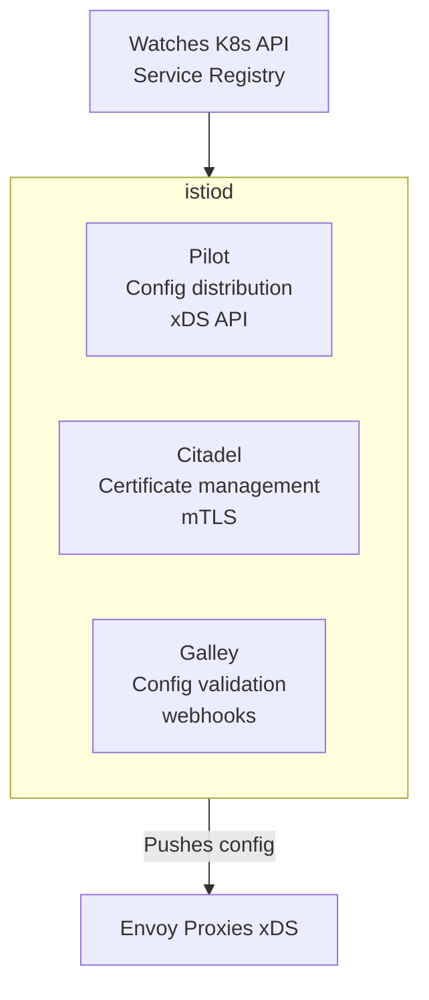
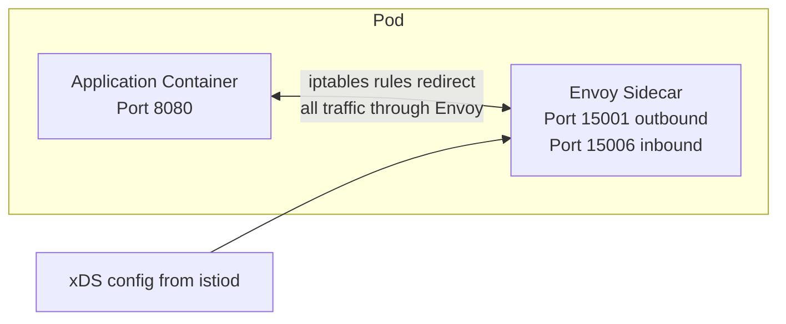
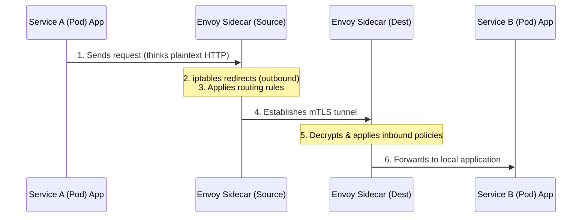
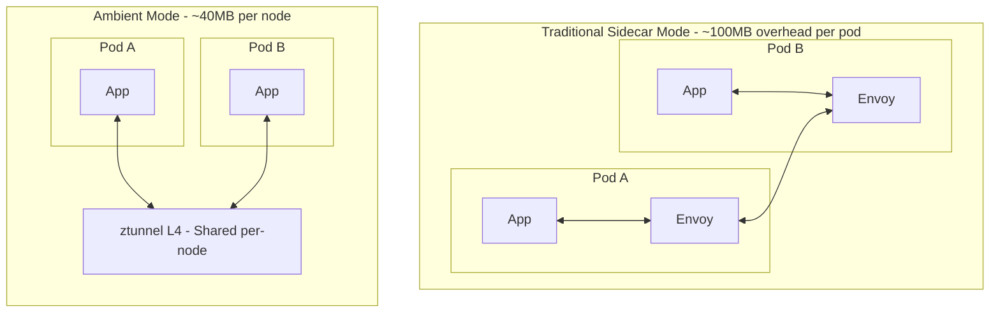

## Complexity: `[MEDIUM]`
## Time to Complete: 50-60 minutes

---

## Prerequisites

Before starting this module, you should have completed:
- [CKA Part 3: Services & Networking](/k8s/cka/part3-services-networking/) — Kubernetes networking fundamentals
- [Service Mesh Concepts](/platform/toolkits/infrastructure-networking/networking/module-5.2-service-mesh/) — Why service mesh exists
- Fundamental understanding of reverse proxies, iptables routing, and Transport Layer Security (TLS) concepts

---

## What You'll Be Able to Do

After completing this rigorous module, you will be able to perform the following advanced tasks:

1. **Design** an Istio installation strategy using `istioctl`, Helm charts, and the IstioOperator custom resource, evaluating the correct architectural profile for staging versus strict production environments.
2. **Implement** automatic and manual sidecar injection mechanisms across diverse namespace topologies, utilizing precision overrides via pod annotations.
3. **Diagnose** pods that fail to receive an Envoy proxy by tracing webhook configurations, namespace label matching, and evaluating the MutatingAdmissionWebhook flow.
4. **Compare** Istio's traditional sidecar architecture with the modern Ambient mode, measuring the resource overhead, security boundaries, and traffic paths of each.
5. **Debug** control plane synchronization anomalies by actively analyzing the xDS API data flows from the `istiod` control plane down to the distributed Envoy proxies.

---

## Why This Module Matters

In early 2024, a leading global logistics provider, "FreightFlow Dynamics," experienced an estimated $3.5 million revenue loss during a four-hour complete production outage. The root cause was entirely architectural. A junior infrastructure engineer attempted an in-place upgrade of the Istio control plane using a single CLI command without comprehensively understanding the mesh topology. The new version introduced a subtle semantic change to how routing resources matched hostnames, causing the ingress gateways to systematically blackhole all external API traffic. Had the engineering team utilized a controlled canary upgrade strategy—and fundamentally understood how the `istiod` component broadcasts configuration to the data plane—the anomaly would have been isolated to a single, innocuous test namespace, entirely averting the catastrophic outage.

Understanding Istio Installation and Architecture encompasses approximately 20% of the ICA certification exam objectives. You will be rigorously evaluated on your ability to deploy the mesh using varied methodologies, select appropriate installation profiles based on stringent operational requirements, manipulate sidecar injection behaviors, and troubleshoot catastrophic installation failures. 

Beyond passing an exam, architectural mastery empowers you to reason about system failures structurally. When a VirtualService fails to route traffic as intended, or when mutual TLS (mTLS) handshakes mysteriously fail across boundaries, the definitive answer is universally rooted in the architecture. It usually stems from an absent sidecar proxy, a misconfigured control plane, or a network partition preventing configuration distribution. 

> **The Central Nervous System Analogy**
>
> Conceptually model Istio as a complex biological nervous system. The `istiod` control plane acts as the brain—centralizing all decisions regarding traffic routing, cryptographic security policies, and telemetry aggregation. The Envoy sidecar proxies are the peripheral nerve endings distributed in every organ (Kubernetes pod). They locally execute the central brain's decisions at microsecond latency. If the brain temporarily loses connection, the nerve endings autonomously continue operating using their last known valid instructions. However, if a nerve ending is entirely missing because a sidecar was not injected, that specific organ operates blindly, disconnected from the security and routing policies of the broader organism.

---

## Did You Know?

- **Istio was originally comprised of three distinct control plane components**: Pilot (configuration), Mixer (telemetry), and Citadel (security). In March 2020 (Istio 1.5), these were consolidated into a single binary called `istiod`, radically simplifying operations and reducing control plane compute resource consumption by over 50 percent.
- **Every traditional Envoy sidecar proxy consumes approximately 50MB to 100MB of baseline memory**: In a heavily scaled cluster containing 2,000 pods, that footprint equates to nearly 200GB of RAM dedicated entirely to proxy overhead, highlighting the critical necessity of optimized proxy configurations.
- **Istio became the absolute first service mesh to officially graduate from the Cloud Native Computing Foundation (CNCF)**: This historic milestone was achieved in July 2023, permanently solidifying its position as the globally recognized industry standard for cloud-native networking.
- **Ambient mode achieved General Availability (GA) status in Istio version 1.24 (November 2024)**: This introduced a production-ready, sidecar-less architecture utilizing a shared per-node Rust-based `ztunnel`, slashing data plane resource consumption dramatically and fundamentally altering the future trajectory of the project.

---

## War Story: The Profile That Ate Production

**Characters:**
- Alex: DevOps engineer (3 years experience)
- Team: 5 engineers running 30 microservices

**The Incident:**

Alex had been running Istio in development for months using `istioctl install --set profile=demo`. Everything worked beautifully — comprehensive Kiali dashboards, deep Jaeger distributed traces, and rich Grafana metrics populated automatically. On deployment day, Alex assumed the development configuration was sound and ran the exact same command on the critical production cluster.

Three hours later, the billing and FinOps team reported that their monthly infrastructure invoice projection showed a massive 40% spike in underlying compute costs. The `demo` profile deploys all optional components with incredibly generous resource allocations. Kiali, Jaeger, and Grafana were each blindly consuming 2GB+ of RAM across 3 distinct replicas that the cluster fundamentally did not need.

But the truly catastrophic problem emerged a week later. The `demo` profile explicitly sets highly permissive mTLS — meaning services actively accept both strongly encrypted and completely unencrypted traffic to ease adoption. Alex falsely assumed mTLS was strictly enforced by default. A subsequent external security audit rapidly discovered plaintext, unencrypted traffic freely flowing between critical backend payment processing services.

**The Fix:**

```bash
# What Alex should have done for production:
istioctl install --set profile=default

# Then explicitly set STRICT mTLS:
kubectl apply -f - <<EOF
apiVersion: security.istio.io/v1
kind: PeerAuthentication
metadata:
  name: default
  namespace: istio-system
spec:
  mtls:
    mode: STRICT
EOF
```

**Lesson**: Installation profiles are emphatically not "t-shirt sizes" — they are robust, deeply opinionated configurations with massive security and financial implications. You must always deploy the `default` or `minimal` profile in any environment handling real traffic.

---

## Part 1: Istio Architecture Deep Dive

### 1.1 The Control Plane: istiod

Istio's control plane is a singular, highly optimized Go binary known as `istiod`. It typically runs as a horizontally scalable Deployment inside the dedicated `istio-system` namespace. Modern Istio consolidates what utilized to be three entirely separate, chatty microservices into this monolithic daemon.



**What each component fundamentally does:**

| Component | Responsibility | How It Works |
|-----------|---------------|--------------|
| **Pilot** | Service discovery & traffic config | Watches K8s Services, converts to Envoy config, pushes via xDS API |
| **Citadel** | Certificate authority | Issues SPIFFE certs to each proxy, rotates automatically |
| **Galley** | Config validation | Validates Istio resources via admission webhooks |

Pilot translates high-level Kubernetes abstractions and Istio Custom Resource Definitions (CRDs) into low-level Envoy configurations. Citadel acts as the Certificate Authority (CA), cryptographic identity provider, and key rotation manager. Galley protects the control plane by intercepting invalid configurations at the Kubernetes API layer before they can ever reach the data plane.

> **Stop and think**: If the `istiod` deployment crashes completely and is unavailable for ten minutes, what happens to the existing HTTP traffic flowing between two injected application pods?
>
> The existing traffic will continue to flow completely uninterrupted. The Envoy sidecars operate strictly in the data plane and hold a cached copy of all routing rules and certificates. They only require `istiod` when new configuration needs to be applied, when certificates expire, or when discovering entirely new endpoints.

### 1.2 The Data Plane: Envoy Proxies

Every application pod participating in the traditional mesh requires an Envoy sidecar container forcibly injected directly alongside the primary application container. This sidecar systematically intercepts every byte of inbound and outbound traffic via network-level magic.



When a pod is initialized, a specialized `istio-init` init container executes with `NET_ADMIN` elevated privileges. It injects complex `iptables` routing rules directly into the pod's isolated network namespace.

**Key Envoy ports you must memorize for debugging:**

| Port | Purpose |
|------|---------|
| 15001 | Outbound traffic listener |
| 15006 | Inbound traffic listener |
| 15010 | xDS (plaintext, istiod) |
| 15012 | xDS (mTLS, istiod) |
| 15014 | Control plane metrics |
| 15020 | Health checks |
| 15021 | Health check endpoint |
| 15090 | Envoy Prometheus metrics |

### 1.3 How Traffic Flows Within the Mesh

The true power of the sidecar architecture is its complete transparency to the application. Developers write code as if they are communicating over standard, plaintext local networks.



1. The source application initiates a request to a remote service cluster.
2. The kernel's `iptables` rules intercept the raw outbound packets and invisibly redirect them to local port 15001.
3. The Envoy proxy evaluates its loaded configuration (e.g., VirtualServices, subsets) and resolves the destination.
4. Envoy upgrades the connection, wrapping the plaintext request in a robust, authenticated mTLS tunnel.
5. The destination Envoy proxy receives the encrypted traffic on port 15006, cryptographically verifies the caller's SPIFFE identity, and decrypts the payload.
6. The clean, unencrypted traffic is passed directly to the receiving application over localhost.

---

## Part 2: Rigorous Installation Methods

### 2.1 Installing with istioctl (Recommended for Exam)

The dedicated `istioctl` command-line interface is Istio's primary imperative utility. It is aggressively fast, performs deep pre-flight validations, and is the absolute most critical method you must master for the ICA certification exam environment.

```bash
# Download istioctl
curl -L https://istio.io/downloadIstio | ISTIO_VERSION=1.35.0 sh -
cd istio-1.35.0
export PATH=$PWD/bin:$PATH

# Install with default profile
istioctl install --set profile=default -y

# Verify installation
istioctl verify-install
```

**What `istioctl install` structurally does:**
1. It reads the local environment and generates thousands of lines of Kubernetes YAML manifests derived from the selected profile.
2. It systematically applies them to the cluster in the strict dependency order required.
3. It actively waits for deployments, webhooks, and custom resources to report a ready state.
4. It reports final success or outputs detailed error diagnostics.

### 2.2 Analyzing Installation Profiles

Profiles serve as carefully curated templates of components and baseline configuration settings. **You must understand these distinct profiles inside and out for the exam:**

| Profile | istiod | Ingress GW | Egress GW | Use Case |
|---------|--------|-----------|----------|----------|
| `default` | Yes | Yes | No | **Production** |
| `demo` | Yes | Yes | Yes | Learning/testing |
| `minimal` | Yes | No | No | Control plane only |
| `remote` | No | No | No | Multi-cluster remote |
| `empty` | No | No | No | Custom build |
| `ambient` | Yes | Yes | No | Ambient mode (no sidecars) |

```bash
# See what a profile installs (without applying)
istioctl profile dump default

# Compare profiles
istioctl profile diff default demo

# Install with specific profile
istioctl install --set profile=demo -y

# Install with customizations
istioctl install --set profile=default \
  --set meshConfig.accessLogFile=/dev/stdout \
  --set values.global.proxy.resources.requests.memory=128Mi \
  -y
```

**Profile component structural comparison:**

```text
                    default    demo    minimal   ambient
                    ───────    ────    ───────   ───────
istiod              ✓          ✓       ✓         ✓
istio-ingressgateway ✓         ✓       ✗         ✓
istio-egressgateway  ✗         ✓       ✗         ✗
ztunnel              ✗         ✗       ✗         ✓
istio-cni            ✗         ✗       ✗         ✓
```

### 2.3 Installing Declaratively with Helm

While `istioctl` is imperative and excellent for exams or rapid prototyping, Helm provides granular control over individual values and integrates seamlessly into GitOps workflows like ArgoCD or Flux.

```bash
# Add Istio Helm repo
helm repo add istio https://istio-release.storage.googleapis.com/charts
helm repo update

# Install in order: base → istiod → gateway
# Step 1: CRDs and cluster-wide resources
helm install istio-base istio/base -n istio-system --create-namespace

# Step 2: Control plane
helm install istiod istio/istiod -n istio-system --wait

# Step 3: Ingress gateway (optional)
kubectl create namespace istio-ingress
helm install istio-ingress istio/gateway -n istio-ingress

# Verify
kubectl get pods -n istio-system
kubectl get pods -n istio-ingress
```

**When to employ Helm versus istioctl:**

| Scenario | Method |
|----------|--------|
| ICA exam | `istioctl` (fastest) |
| GitOps / ArgoCD | Helm charts |
| Custom operator pattern | IstioOperator CRD |
| Quick testing | `istioctl` |

### 2.4 Managing the IstioOperator CRD

The IstioOperator custom resource allows administrators to declaratively manage Istio configurations as native Kubernetes objects. Although modern best practices often push towards Helm for declarative setups, the Operator pattern remains highly prevalent in enterprise environments.

```yaml
# istio-operator.yaml
apiVersion: install.istio.io/v1alpha1
kind: IstioOperator
metadata:
  name: istio-control-plane
  namespace: istio-system
spec:
  profile: default
  meshConfig:
    accessLogFile: /dev/stdout
    enableTracing: true
    defaultConfig:
      tracing:
        zipkin:
          address: zipkin.istio-system:9411
  components:
    ingressGateways:
    - name: istio-ingressgateway
      enabled: true
      k8s:
        resources:
          requests:
            cpu: 200m
            memory: 256Mi
    egressGateways:
    - name: istio-egressgateway
      enabled: false
  values:
    global:
      proxy:
        resources:
          requests:
            cpu: 100m
            memory: 128Mi
          limits:
            cpu: 500m
            memory: 256Mi
```

```bash
# Apply with istioctl
istioctl install -f istio-operator.yaml -y

# Or install the operator and apply the CR
istioctl operator init
kubectl apply -f istio-operator.yaml
```

---

## Part 3: Sidecar Injection Mechanics

### 3.1 Orchestrating Automatic Sidecar Injection

Automatic sidecar injection is the industry standard approach. By labeling a namespace, you instruct Kubernetes to automatically pause any pod creation and hand the specification to Istio for modification.

```bash
# Enable automatic injection for a namespace
kubectl label namespace default istio-injection=enabled

# Verify the label
kubectl get namespace default --show-labels

# Deploy an app — sidecar is injected automatically
kubectl run nginx --image=nginx -n default
kubectl get pod nginx -o jsonpath='{.spec.containers[*].name}'
# Output: nginx istio-proxy

# Disable injection for a specific pod (opt-out)
kubectl run skip-mesh --image=nginx \
  --overrides='{"metadata":{"annotations":{"sidecar.istio.io/inject":"false"}}}'
```

**How the MutatingAdmissionWebhook fundamentally works:**

```text
1. Namespace has label: istio-injection=enabled
2. Pod is created
3. K8s API server calls istiod's MutatingWebhook
4. istiod injects istio-init (iptables setup) + istio-proxy (Envoy) containers
5. Pod starts with sidecar
```

### 3.2 Executing Manual Sidecar Injection

Manual injection is required when organizational policies strictly forbid namespace labeling or when you demand granular, static control over the emitted YAML manifests prior to deployment.

```bash
# Inject sidecar into a deployment YAML
istioctl kube-inject -f deployment.yaml | kubectl apply -f -

# Inject into an existing deployment
kubectl get deployment myapp -o yaml | istioctl kube-inject -f - | kubectl apply -f -

# Check injection status
istioctl analyze -n default
```

### 3.3 Fine-Grained Injection Control

You can override namespace-level decisions on a strict per-pod basis using Kubernetes annotations.

```yaml
# Per-pod annotation to disable injection
apiVersion: v1
kind: Pod
metadata:
  annotations:
    sidecar.istio.io/inject: "false"
spec:
  containers:
  - name: app
    image: myapp:latest
```

Conversely, you can forcefully opt-in a pod even if its parent namespace is entirely unenrolled from the mesh.

```yaml
# Per-pod annotation to enable injection (even without namespace label)
apiVersion: v1
kind: Pod
metadata:
  annotations:
    sidecar.istio.io/inject: "true"
  labels:
    sidecar.istio.io/inject: "true"
spec:
  containers:
  - name: app
    image: myapp:latest
```

**Critical injection priority hierarchy (highest to lowest):**

1. Pod annotation `sidecar.istio.io/inject`
2. Pod label `sidecar.istio.io/inject`
3. Namespace label `istio-injection`
4. Global mesh configuration default policy setting

### 3.4 Revision-Based Injection Strategies

Instead of relying on the blunt `istio-injection=enabled` label, modern operational standards demand revision labels to facilitate safe, zero-downtime canary upgrades.

```bash
# Install a specific revision
istioctl install --set revision=1-35 -y

# Label namespace with revision (not istio-injection)
kubectl label namespace default istio.io/rev=1-35

# This allows running two Istio versions simultaneously
```

---

## Part 4: Exploring Ambient Mode

Ambient mode represents a paradigm shift within Istio. It delivers a **sidecar-less** data plane architecture. Rather than penalizing every pod with the resource overhead of an individual Envoy proxy, Ambient mode intelligently bifurcates responsibilities:

1. **ztunnel (Zero Trust Tunnel)** — A highly optimized, Rust-based per-node L4 proxy daemon that handles mTLS, cryptographic identity, and basic L4 authorization.
2. **waypoint proxies** — Dedicated, optional per-namespace L7 Envoy proxies dynamically deployed only when advanced features (HTTP routing, retries, rate limiting) are explicitly requested.



```bash
# Install Istio with ambient profile
istioctl install --set profile=ambient -y

# Add a namespace to the ambient mesh
kubectl label namespace default istio.io/dataplane-mode=ambient

# Deploy a waypoint proxy for L7 features (optional)
istioctl waypoint apply -n default --enroll-namespace
```

> **Pause and predict**: In Ambient mode, if a developer deploys a VirtualService demanding a 50/50 HTTP traffic split, but fails to deploy a waypoint proxy, what occurs?
>
> The traffic split will be completely ignored. The core `ztunnel` exclusively operates at Layer 4 (TCP/mTLS) and cannot parse or route based on HTTP headers or Layer 7 abstractions. The traffic will simply route normally until an L7 waypoint proxy is explicitly provisioned to intercept and process those sophisticated rules.

**Architectural factor comparison:**

| Factor | Sidecar | Ambient |
|--------|---------|---------|
| Resource overhead | High (per-pod proxy) | Low (per-node ztunnel) |
| L7 features | Always available | Requires waypoint proxy |
| Maturity | Production-ready | GA as of Istio 1.24 |
| Application restarts | Required for injection | Not required |
| ICA exam | Primary focus | May appear |

---

## Part 5: Safely Upgrading the Mesh

### 5.1 The In-Place Upgrade Methodology

This is the simplest, most aggressive method. You mutate the existing control plane directly. It is heavily discouraged for mission-critical production clusters due to the extreme blast radius if the upgrade fails.

```bash
# Download new version
curl -L https://istio.io/downloadIstio | ISTIO_VERSION=1.36.0 sh -

# Upgrade control plane
istioctl upgrade -y

# Verify
istioctl version

# Restart workloads to get new sidecar version
kubectl rollout restart deployment -n default
```

### 5.2 Canary Upgrade Strategy (Recommended for Production)

The canary strategy completely mitigates risk by deploying the new `istiod` control plane version safely alongside the older, established version. Workloads are then migrated in a controlled, piecemeal fashion.

```bash
# Step 1: Install new revision alongside existing
istioctl install --set revision=1-36 -y

# Verify both versions running
kubectl get pods -n istio-system -l app=istiod

# Step 2: Move namespaces to new revision
kubectl label namespace default istio.io/rev=1-36 --overwrite
kubectl label namespace default istio-injection-  # Remove old label

# Step 3: Restart workloads to pick up new sidecars
kubectl rollout restart deployment -n default

# Step 4: Verify workloads use new proxy
istioctl proxy-status

# Step 5: Remove old control plane
istioctl uninstall --revision 1-35 -y
```

**Canary transition lifecycle:**

```mermaid
gantt
    title Canary Upgrade Timeline
    dateFormat X
    axisFormat %s
    section Control Plane
    istiod v1.35 (uninstall) :done, a1, 0, 5d
    istiod v1.36 :active, a2, 2d, 8d
    section Data Plane
    Namespace A (restart) :crit, a3, 4d, 1d
    Namespace B (restart) :crit, a4, 6d, 1d
```

---

## Part 6: Rigorously Verifying Your Installation

These imperative commands form your absolute core troubleshooting toolkit. You must instinctively know them for the exam and daily operations.

```bash
# Check all Istio components are healthy
istioctl verify-install

# Analyze configuration for issues
istioctl analyze --all-namespaces

# Check proxy sync status
istioctl proxy-status

# Check Istio version (client + control plane + data plane)
istioctl version

# List installed Istio components
kubectl get pods -n istio-system
kubectl get svc -n istio-system

# Check MutatingWebhookConfiguration (sidecar injection)
kubectl get mutatingwebhookconfigurations | grep istio

# Check if a namespace has injection enabled
kubectl get ns --show-labels | grep istio
```

---

## Common Installation & Architecture Mistakes

| Mistake | Symptom | Solution |
|---------|---------|----------|
| Using `demo` profile in production | High resource usage, permissive mTLS | Use `default` or `minimal` profile |
| Forgetting namespace label | Pods have no sidecar, no mesh features | `kubectl label ns <name> istio-injection=enabled` |
| Not restarting pods after labeling | Existing pods don't get sidecars | `kubectl rollout restart deployment -n <ns>` |
| Running `istioctl install` without `-y` | Hangs waiting for confirmation | Add `-y` flag (exam time is precious) |
| Ignoring `istioctl analyze` warnings | Misconfigurations go unnoticed | Run `istioctl analyze` after every change |
| Mixing injection label and revision label | Unpredictable injection behavior | Use one method per namespace |
| Not checking proxy-status after upgrade | Stale sidecars running old config | `istioctl proxy-status` to verify sync |
| Overlooking Ambient Waypoint Proxies | Advanced L7 routing rules fail to apply | Deploy a waypoint proxy using `istioctl waypoint apply` |

---

## Technical Knowledge Quiz

Assess your structural comprehension before proceeding to traffic management.

**Q1: Your organization mandates that no permissive default settings can be deployed to the Kubernetes cluster hosting the payment gateway. Which Istio installation profile is recommended for this production environment, and why?**

<details>
<summary>Show Answer</summary>

`default` — It installs istiod and the ingress gateway with production-appropriate resource settings. Unlike `demo`, it does not install the egress gateway or set permissive defaults.

**Why:** The `default` profile is heavily optimized to establish a strict, minimal attack surface immediately upon deployment. It provisions the exact resources necessary to scale a production control plane without enabling risky testing features. Utilizing the `demo` profile introduces extreme memory overhead and disables critical mTLS enforcement validations designed to protect real-world network paths.
</details>

**Q2: You have created a new namespace for a frontend web application. You want to ensure that every new pod deployed here automatically receives an Envoy sidecar proxy. What is the correct command sequence to accomplish this?**

<details>
<summary>Show Answer</summary>

```bash
kubectl label namespace <namespace> istio-injection=enabled
```

After labeling, existing pods must be restarted to get sidecars:
```bash
kubectl rollout restart deployment -n <namespace>
```

**Why:** Applying the namespace label informs the Kubernetes control plane that the MutatingAdmissionWebhook should intercept pod creation events for this specific domain. However, because Kubernetes evaluates webhooks exclusively during the pod initialization lifecycle phase, pre-existing pods remain completely unaffected. Executing a rollout restart intentionally forces Kubernetes to terminate and recreate the replica set, triggering the injection process for the fresh pods.
</details>

**Q3: A legacy architecture document from 2019 states that you must monitor the logs of the `Citadel` pod for mTLS certificate issues. However, you are running Istio v1.35. Why can't you find a Citadel pod, and where should you look instead?**

<details>
<summary>Show Answer</summary>

1. **Pilot** — Service discovery and traffic configuration (xDS)
2. **Citadel** — Certificate management for mTLS
3. **Galley** — Configuration validation

All merged into the single `istiod` binary since Istio 1.5.

**Why:** The Istio architecture underwent a massive consolidation effort to reduce moving parts and vastly improve operational simplicity. The independent microservices created severe synchronization and performance bottlenecks under load. Today, if you encounter an mTLS issuance issue, you must evaluate the standard logs of the unified `istiod` deployment running within the `istio-system` namespace.
</details>

**Q4: Your team needs to upgrade the production cluster from Istio v1.35 to v1.36. Management has explicitly forbidden in-place upgrades due to a previous outage. How do you perform a canary upgrade of Istio to ensure zero downtime?**

<details>
<summary>Show Answer</summary>

1. Install new version with `--set revision=<new>`: `istioctl install --set revision=1-36 -y`
2. Label namespaces with new revision: `kubectl label ns <ns> istio.io/rev=1-36`
3. Restart workloads: `kubectl rollout restart deployment -n <ns>`
4. Verify with `istioctl proxy-status`
5. Remove old version: `istioctl uninstall --revision 1-35 -y`

**Why:** A canary upgrade drastically reduces operational risk by allowing two totally distinct control planes to coexist safely. Workloads remain attached to the legacy control plane until their parent namespace label is explicitly updated to target the new revision. This strategy ensures that if the new version introduces regressions, rollback is as simple as reverting a namespace label and executing a fast pod restart.
</details>

**Q5: During an architectural review, a principal engineer asks about the performance overhead of the service mesh. You propose using Ambient mode. What is the architectural difference between Ambient mode's ztunnel and waypoint proxy?**

<details>
<summary>Show Answer</summary>

- **ztunnel**: Per-node L4 proxy. Handles mTLS encryption/decryption and L4 authorization. Runs as a DaemonSet. Always active in ambient mode.
- **waypoint proxy**: Optional per-namespace L7 proxy. Handles HTTP routing, L7 authorization policies, traffic management. Only deployed when L7 features are needed.

**Why:** The core philosophical advantage of Ambient mode is unbundling Layer 4 security from Layer 7 routing. The `ztunnel` ensures that zero-trust encryption is universally applied with absolute minimum latency footprint. Waypoint proxies are only instantiated when developers write complex VirtualServices that demand heavy HTTP header inspection, preserving massive amounts of cluster compute.
</details>

**Q6: You install Istio, verify all control plane pods are running, and label the `payment-processing` namespace for injection. However, when you deploy the application, the pods do not get sidecars. What diagnostic steps do you take?**

<details>
<summary>Show Answer</summary>

1. Verify label: `kubectl get ns <ns> --show-labels` (look for `istio-injection=enabled`)
2. Check MutatingWebhook: `kubectl get mutatingwebhookconfigurations | grep istio`
3. Check istiod is running: `kubectl get pods -n istio-system`
4. Check if pod has opt-out annotation: `sidecar.istio.io/inject: "false"`
5. Restart pods (existing pods don't get retroactive injection): `kubectl rollout restart deployment -n <ns>`

**Why:** Sidecar injection failures are fundamentally workflow interruptions between the Kubernetes API and the Istio webhook. First, verify that the developer didn't inject a hardcoded `false` annotation into their PodSpec, which permanently overrides namespace-level configurations. Next, confirm that the API server is successfully reaching `istiod`—network policies or broken webhooks are the primary culprits when valid labels fail to trigger an injection.
</details>

**Q7: Your DevOps team uses ArgoCD for GitOps deployments and wants to manage the Istio installation declaratively without using imperative CLI tools. What Helm charts are needed for a complete Istio installation, and in what strict order must they be applied?**

<details>
<summary>Show Answer</summary>

1. `istio/base` — CRDs and cluster-wide resources (namespace: `istio-system`)
2. `istio/istiod` — Control plane (namespace: `istio-system`)
3. `istio/gateway` — Ingress/egress gateway (namespace: `istio-ingress` or similar)

Order matters because istiod depends on the CRDs from base, and gateways depend on istiod.

**Why:** Kubernetes cannot instantiate resources of a specific custom kind until the Custom Resource Definitions (CRDs) are permanently registered with the API server. The `istio-base` chart guarantees that these structural definitions exist globally. Subsequently, the ingress gateways rely heavily on `istiod` for dynamic configuration updates; deploying them prematurely will result in failing readiness probes.
</details>

**Q8: You notice that a specific backend database pod is failing to start because the Envoy sidecar intercepts traffic before the database engine is ready to receive network connections. How can you disable sidecar injection exclusively for this single pod while leaving the rest of the namespace intact?**

<details>
<summary>Show Answer</summary>

You must selectively bypass the namespace's injection policy by targeting the specific pod definition. Apply the structural annotation `sidecar.istio.io/inject: "false"` directly within the deployment's PodTemplateSpec metadata.

**Why:** Because Istio evaluates injection logic hierarchically, a localized pod annotation completely supersedes broad namespace labels. This is essential for highly sensitive, legacy applications or complex database workloads that cannot tolerate the network interception mechanics or startup latency introduced by an Envoy sidecar proxy.
</details>

---

## Hands-On Exercise: Install and Explore Istio

### Objective
In this comprehensive procedural exercise, you will establish a local Kubernetes cluster, install the Istio service mesh, deploy a microservices application architecture with Envoy sidecars, and rigorously verify the data plane synchronization across your environment.

### Setup Phase

Prepare your local environment. Ensure you have `kind` and `kubectl` installed before proceeding.

<details>
<summary>View Setup Instructions</summary>

```bash
# Create a kind cluster (if not already running)
kind create cluster --name istio-lab

# Download and install Istio
curl -L https://istio.io/downloadIstio | ISTIO_VERSION=1.35.0 sh -
export PATH=$PWD/istio-1.35.0/bin:$PATH
```
</details>

### Progressive Execution Tasks

**Task 1: Bootstrap the Control Plane**
Your immediate objective is to bootstrap the Istio control plane using the testing profile. This provisions the core components necessary for educational purposes without imposing strict production limitations.

<details>
<summary>View Solution</summary>

```bash
istioctl install --set profile=demo -y
```

Validate your deployment:
```bash
# All pods should be Running
kubectl get pods -n istio-system

# Should show client, control plane, and data plane versions
istioctl version
```
</details>

**Task 2: Enable Interception and Deploy Workloads**
Configure the cluster so that any workload deployed into the standard namespace automatically receives an Envoy sidecar proxy. Next, unleash the microservices application.

<details>
<summary>View Solution</summary>

```bash
# Label the default namespace
kubectl label namespace default istio-injection=enabled

# Deploy the Bookinfo sample app
kubectl apply -f istio-1.35.0/samples/bookinfo/platform/kube/bookinfo.yaml

# Wait for pods
kubectl wait --for=condition=ready pod --all -n default --timeout=120s

# Verify each pod has 2 containers (app + istio-proxy)
kubectl get pods -n default
```
</details>

**Task 3: Validate Proxy Synchronization**
A successful mesh relies entirely on `istiod` communicating effectively with every sidecar proxy via the xDS protocol. Check the sync health of your entire data plane.

<details>
<summary>View Solution</summary>

```bash
# All proxies should show SYNCED
istioctl proxy-status
```

Expected output confirms health across all discovery services:
```text
NAME                                    CLUSTER   CDS    LDS    EDS    RDS    ECDS   ISTIOD
details-v1-xxx.default                  Synced    Synced Synced Synced Synced istiod-xxx
productpage-v1-xxx.default              Synced    Synced Synced Synced Synced istiod-xxx
ratings-v1-xxx.default                  Synced    Synced Synced Synced Synced istiod-xxx
reviews-v1-xxx.default                  Synced    Synced Synced Synced Synced istiod-xxx
```
</details>

**Task 4: Perform Architectural Analysis**
Execute a cluster-wide diagnostic check to ensure there are no severe misconfigurations or broken structural links hiding in your deployment.

<details>
<summary>View Solution</summary>

```bash
# Should report no issues
istioctl analyze --all-namespaces
```
</details>

**Task 5: Evaluate Differential Profiles**
Investigate the actual differences between the profile you applied and a strict production environment profile.

<details>
<summary>View Solution</summary>

```bash
# See the difference between default and demo
istioctl profile diff default demo
```
</details>

### Teardown and Cleanup

Ensure your local workstation resources are successfully reclaimed.

<details>
<summary>View Cleanup Instructions</summary>

```bash
kubectl delete -f istio-1.35.0/samples/bookinfo/platform/kube/bookinfo.yaml
istioctl uninstall --purge -y
kubectl delete namespace istio-system
kind delete cluster --name istio-lab
```
</details>

### Success Checklist
- [ ] You successfully established and targeted a local Kubernetes cluster.
- [ ] The Istio control plane is actively executing within the `istio-system` namespace.
- [ ] The Bookinfo application pods each display two containers running.
- [ ] Execution of the `proxy-status` command confirms total synchronization across all nodes.
- [ ] Configuration analysis via `istioctl` returns strictly zero critical errors.

---

## Next Module

Now that you possess a deeply engineered foundational mesh, continue to [Module 2: Traffic Management](../module-1.2-istio-traffic-management/) — the heaviest, most intensive ICA domain representing 35% of the exam. You will dive headfirst into configuring VirtualServices, implementing DestinationRules, constructing Gateways, and executing complex traffic shifting strategies.