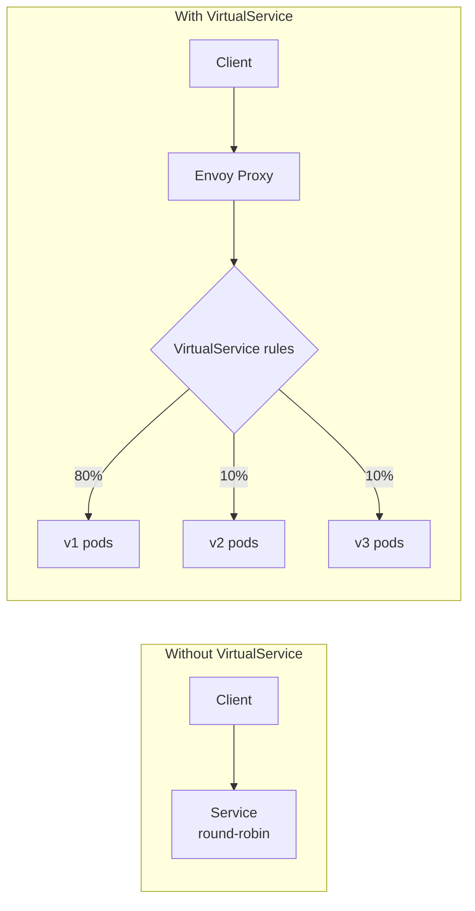
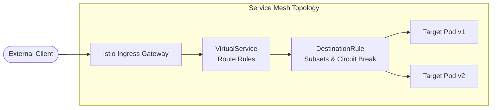
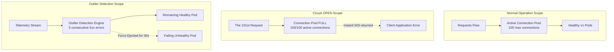

# Module 1.2: Istio Traffic Management

## Complexity: `[COMPLEX]`
## Time to Complete: 60-75 minutes

---

## Prerequisites

Before starting this module, you should have completed:
- [Module 1: Installation & Architecture](../module-1.1-istio-installation-architecture/) - Istio installation and sidecar injection
- [CKA Module 3.5: Gateway API](/k8s/cka/part3-services-networking/module-3.5-gateway-api/) - Kubernetes Gateway API basics
- Working knowledge of Kubernetes 1.35 Services, Deployments, labels, and readiness probes
- Understanding of HTTP routing concepts such as headers, paths, methods, status codes, and timeouts

---

## Learning Outcomes

After completing this module, you will be able to:

1. **Configure** VirtualService routing rules for header-based, path-based, and weighted traffic splitting across service versions.
2. **Implement** canary and blue-green deployment patterns using DestinationRules with traffic policies and subset definitions.
3. **Design** and **apply** resilience patterns, including circuit breaking, retries, timeouts, fault injection, and traffic mirroring.
4. **Diagnose** traffic routing failures using `istioctl analyze`, `istioctl proxy-config routes`, Envoy access logs, and service graph evidence.

## Why This Module Matters

Hypothetical scenario: your team has a stable checkout service running on Kubernetes 1.35, and the next release adds a fraud scoring call that must be tested with real production-shaped traffic. The application code is ready, the pods pass readiness checks, and the deployment has enough replicas for a small trial. The risk is not only whether the new code runs; the operational risk is whether the mesh sends the right percentage of traffic to the right pod group, stops retry storms when the dependency misbehaves, and gives you enough evidence to roll forward or roll back before customers notice.

Without a service mesh, release control often leaks into application code, custom ingress rules, or brittle scripts that patch Kubernetes Services under pressure. That approach makes traffic policy hard to audit because the routing decision is scattered across libraries, controllers, and deployment habits. Istio moves that decision into declarative resources that Envoy proxies can enforce consistently, so a platform engineer can describe the desired traffic shape while the application keeps serving ordinary HTTP.

The tradeoff is that Istio gives you a more powerful control plane, and powerful controls fail in precise ways. A VirtualService can reference a subset that no DestinationRule defines. A retry budget can multiply load during an outage. A Gateway can accept a hostname while the bound VirtualService never sees that same host. This module teaches the mental model behind those failures before asking you to apply YAML, because the ICA exam rewards operators who can reason from symptoms back to mesh configuration rather than memorize isolated fields.

Think of Istio traffic management like air traffic control for service calls. Services are airports, requests are flights, VirtualServices are flight plans, DestinationRules are runway and landing policies, and Gateways are the controlled entry points at the edge of the airspace. The controller does not rebuild the plane during flight; it changes where requests are allowed to go, how they are balanced, and what happens when a destination becomes unsafe.

## Core Resources: Routing Before Policy

Istio traffic management starts with a separation that is easy to say and surprisingly important during incidents: VirtualService decides where a request should go, while DestinationRule decides how traffic behaves once the destination has been chosen. That division lets you route a small percentage of requests to version two without changing the Kubernetes Service selector, and it lets you apply connection limits or outlier detection without changing the application container. When a mesh rule behaves strangely, first ask whether the routing decision is wrong, then ask whether the destination policy is missing or too strict.

The most common failure in early Istio rollouts is treating a subset name as if it were a Kubernetes object. A subset is not a Service, Deployment, or EndpointSlice. It is a label-based grouping declared inside a DestinationRule, and Envoy only knows how to resolve that name after Istiod has translated the DestinationRule into proxy configuration. The following exercise scenario preserves the same missing-subset shape you will diagnose in the lab: the route asks for `v2`, but the subset definition must exist separately.

```yaml
# Priya had this VirtualService:
apiVersion: networking.istio.io/v1
kind: VirtualService
metadata:
  name: payment
spec:
  hosts:
  - payment
  http:
  - route:
    - destination:
        host: payment
        subset: v2    # ← References a subset...
      weight: 100
```

```yaml
# But forgot this DestinationRule:
apiVersion: networking.istio.io/v1
kind: DestinationRule
metadata:
  name: payment
spec:
  host: payment
  subsets:            # ← ...that must be defined here
  - name: v1
    labels:
      version: v1
  - name: v2
    labels:
      version: v2
```

VirtualService evaluation is ordered, which means specific matches must appear before broad catch-all routes. Envoy receives a route table from Istiod and walks the HTTP route rules until it finds a match for the host, gateway context, and optional conditions such as headers or URI paths. If a catch-all route appears first, later rules may be perfectly valid YAML but practically unreachable. Pause and predict: if the default route to `v1` is placed above the `end-user: jason` match, which version will Jason receive, and what would you expect to see in the proxy route dump?



The `hosts` field in a VirtualService is not decorative. It identifies the service hostnames or external names to which the rule applies, and the same object can behave differently depending on whether traffic is internal to the mesh or entering through a Gateway. Short names such as `reviews` are convenient inside one namespace, but fully qualified service names are safer in shared platform examples because they reduce ambiguity across namespaces.

```yaml
apiVersion: networking.istio.io/v1
kind: VirtualService
metadata:
  name: reviews
spec:
  hosts:
  - reviews                    # Which service this applies to
  http:
  - match:                     # Conditions (optional)
    - headers:
        end-user:
          exact: jason         # If header matches...
    route:
    - destination:
        host: reviews
        subset: v2             # ...route to v2
  - route:                     # Default route (no match = catch-all)
    - destination:
        host: reviews
        subset: v1
```

| Field | Purpose | Example |
|-------|---------|---------|
| `hosts` | Services this rule applies to | `["reviews"]`, `["*.example.com"]` |
| `http[].match` | Conditions for routing | Headers, URI, method, query params |
| `http[].route` | Where to send traffic | Service host + subset + weight |
| `http[].timeout` | Request timeout | `10s` |
| `http[].retries` | Retry configuration | `attempts: 3` |
| `http[].fault` | Fault injection | `delay`, `abort` |
| `http[].mirror` | Traffic mirroring | Send copy to another service |

A DestinationRule attaches policy to a host and optionally to subsets under that host. Global traffic policy gives you one default behavior for the destination, and a subset-specific policy overrides that behavior for a named version. This is useful when a new version needs a different load-balancing mode or a tighter circuit breaker during a canary. The important habit is to define the subsets before sending traffic to them, then let `istioctl analyze` catch mismatched references before the rule reaches a production proxy.

```yaml
apiVersion: networking.istio.io/v1
kind: DestinationRule
metadata:
  name: reviews
spec:
  host: reviews                    # Which service
  trafficPolicy:                   # Global policies
    connectionPool:
      tcp:
        maxConnections: 100
      http:
        h2UpgradePolicy: DEFAULT
        http1MaxPendingRequests: 100
        http2MaxRequests: 1000
    loadBalancer:
      simple: ROUND_ROBIN          # or LEAST_CONN, RANDOM, PASSTHROUGH
    outlierDetection:
      consecutive5xxErrors: 5
      interval: 30s
      baseEjectionTime: 30s
  subsets:                          # Named versions
  - name: v1
    labels:
      version: v1
  - name: v2
    labels:
      version: v2
    trafficPolicy:                 # Per-subset override
      loadBalancer:
        simple: LEAST_CONN
  - name: v3
    labels:
      version: v3
```

Gateways solve a different problem from VirtualServices. A Gateway configures the Envoy workload at the mesh edge to accept traffic on specific ports, protocols, TLS modes, and hostnames. It does not tell the mesh where `/productpage` should go after the connection is accepted. That second decision still belongs in a VirtualService, which binds to the Gateway by name and supplies the route rules for the accepted host.

```yaml
apiVersion: networking.istio.io/v1
kind: Gateway
metadata:
  name: bookinfo-gateway
spec:
  selector:
    istio: ingressgateway           # Bind to Istio's ingress gateway
  servers:
  - port:
      number: 80
      name: http
      protocol: HTTP
    hosts:
    - "bookinfo.example.com"        # Accept traffic for this host
  - port:
      number: 443
      name: https
      protocol: HTTPS
    hosts:
    - "bookinfo.example.com"
    tls:
      mode: SIMPLE
      credentialName: bookinfo-tls   # K8s Secret with cert/key
```

```yaml
apiVersion: networking.istio.io/v1
kind: VirtualService
metadata:
  name: bookinfo
spec:
  hosts:
  - "bookinfo.example.com"
  gateways:
  - bookinfo-gateway               # Reference the Gateway
  http:
  - match:
    - uri:
        prefix: /productpage
    route:
    - destination:
        host: productpage
        port:
          number: 9080
  - match:
    - uri:
        prefix: /reviews
    route:
    - destination:
        host: reviews
```

The request path through ingress is therefore a chain of explicit handoffs. The external load balancer reaches the Istio ingress gateway workload. The Gateway server block decides whether the host, protocol, and port are accepted. The VirtualService attached to that Gateway decides the HTTP route, and the DestinationRule for the chosen host supplies subset and traffic policy. When ingress traffic reaches the gateway but never reaches the backend, debug the chain in that order.



ServiceEntry completes the resource set by adding external destinations to Istio's internal service registry. This matters when the mesh is configured with a default-deny egress posture, but it also matters when you want consistent timeout, retry, telemetry, or TLS policy for calls leaving the cluster. Treat ServiceEntry as a way to make an external host visible to the mesh control plane, not as a substitute for DNS or external authorization.

```yaml
apiVersion: networking.istio.io/v1
kind: ServiceEntry
metadata:
  name: external-api
spec:
  hosts:
  - api.external.com
  location: MESH_EXTERNAL             # Outside the mesh
  ports:
  - number: 443
    name: https
    protocol: TLS
  resolution: DNS
```

```yaml
# Now you can apply traffic rules to external services!
apiVersion: networking.istio.io/v1
kind: VirtualService
metadata:
  name: external-api-timeout
spec:
  hosts:
  - api.external.com
  http:
  - timeout: 5s
    route:
    - destination:
        host: api.external.com
```

In a permissive mesh, outbound traffic can still reach many external destinations without a ServiceEntry, so early tests may appear to work. In a locked-down mesh using `meshConfig.outboundTrafficPolicy.mode: REGISTRY_ONLY`, unregistered external hosts are blocked because the sidecar has no registry entry to use. The operational lesson is to test egress rules under the same mesh policy you expect in production, otherwise a demo that passes locally can fail immediately after a security hardening change.

## Release Routing With VirtualService and DestinationRule

Canary routing is the first traffic management pattern most teams adopt because it gives a controlled way to expose a new version to a small share of real requests. Kubernetes Deployments already know how to run multiple ReplicaSets, but a Kubernetes Service normally load-balances across every ready endpoint behind its selector. Istio adds a layer above that Service so you can keep both versions ready while using subsets and weights to decide how much traffic each one receives.

```yaml
apiVersion: networking.istio.io/v1
kind: VirtualService
metadata:
  name: reviews
spec:
  hosts:
  - reviews
  http:
  - route:
    - destination:
        host: reviews
        subset: v1
      weight: 80               # 80% to v1
    - destination:
        host: reviews
        subset: v2
      weight: 20               # 20% to v2
```

```yaml
apiVersion: networking.istio.io/v1
kind: DestinationRule
metadata:
  name: reviews
spec:
  host: reviews
  subsets:
  - name: v1
    labels:
      version: v1
  - name: v2
    labels:
      version: v2
```

Weighted routing is probabilistic over many requests, not a promise about each group of ten requests. A small curl loop may produce an uneven distribution because random load-balancing decisions need volume before they look close to the configured percentage. For rollout decisions, compare traffic weight with request volume, error rate, latency percentiles, and saturation signals over a meaningful window. Before running a rollout patch, pause and predict which two metrics would convince you to hold at twenty percent instead of moving to half traffic.

```bash
# Step 1: 90/10 split
kubectl apply -f - <<EOF
apiVersion: networking.istio.io/v1
kind: VirtualService
metadata:
  name: reviews
spec:
  hosts:
  - reviews
  http:
  - route:
    - destination:
        host: reviews
        subset: v1
      weight: 90
    - destination:
        host: reviews
        subset: v2
      weight: 10
EOF

# Monitor error rates... then increase

# Step 2: 50/50 split
kubectl patch virtualservice reviews --type merge -p '
spec:
  http:
  - route:
    - destination:
        host: reviews
        subset: v1
      weight: 50
    - destination:
        host: reviews
        subset: v2
      weight: 50'

# Step 3: Full rollout
kubectl patch virtualservice reviews --type merge -p '
spec:
  http:
  - route:
    - destination:
        host: reviews
        subset: v2
      weight: 100'
```

Header-based routing is useful when the safest first audience is not a percentage of the public, but a deterministic group such as test users, internal staff, or automated probes. This pattern reduces noise because the same user can consistently hit the same backend version, which makes debugging easier. The tradeoff is that your routing depends on a header being present and trustworthy, so edge proxies or test clients must set it deliberately.

```yaml
apiVersion: networking.istio.io/v1
kind: VirtualService
metadata:
  name: reviews
spec:
  hosts:
  - reviews
  http:
  # Rule 1: Route "jason" to v2
  - match:
    - headers:
        end-user:
          exact: jason
    route:
    - destination:
        host: reviews
        subset: v2
  # Rule 2: Route requests with "canary: true" header to v3
  - match:
    - headers:
        canary:
          exact: "true"
    route:
    - destination:
        host: reviews
        subset: v3
  # Rule 3: Everyone else goes to v1
  - route:
    - destination:
        host: reviews
        subset: v1
```

URI-based routing is common at the ingress edge because different paths often map to different backend services, API versions, or migration phases. `exact` is safest when a single page or endpoint must move as a unit, `prefix` is useful for API families, and `regex` should be reserved for cases that genuinely need pattern matching. Regex routes are powerful, but they are also harder to review quickly during an outage.

```yaml
apiVersion: networking.istio.io/v1
kind: VirtualService
metadata:
  name: bookinfo
spec:
  hosts:
  - bookinfo.example.com
  gateways:
  - bookinfo-gateway
  http:
  - match:
    - uri:
        exact: /productpage
    route:
    - destination:
        host: productpage
        port:
          number: 9080
  - match:
    - uri:
        prefix: /api/v1/reviews
    route:
    - destination:
        host: reviews
        port:
          number: 9080
  - match:
    - uri:
        regex: "/api/v[0-9]+/ratings"
    route:
    - destination:
        host: ratings
        port:
          number: 9080
```

| Type | Example | Matches |
|------|---------|---------|
| `exact` | `/productpage` | Only `/productpage` |
| `prefix` | `/api/v1` | `/api/v1`, `/api/v1/reviews`, etc. |
| `regex` | `/api/v[0-9]+` | `/api/v1`, `/api/v2`, etc. |

Blue-green deployment uses the same primitives as a canary, but the operating goal is different. Instead of gradually shifting traffic, you prepare the inactive color to receive all traffic, run checks against it, and then make one explicit routing switch. This is attractive when a database migration or external dependency makes partial exposure confusing. It is risky when the new color has not been warmed, because a sudden full shift can reveal capacity issues that a canary would have exposed earlier.

The practical release habit is to treat VirtualService, DestinationRule, and telemetry as one change set. Apply the DestinationRule first, confirm subsets resolve to ready pods, then apply the VirtualService that references those subsets. Use `istioctl analyze` before and after the change, and check generated route configuration when symptoms disagree with YAML. If the YAML says traffic should go to `v2` but the proxy route dump does not, you are debugging control-plane propagation or workload selection rather than application logic.

## Resilience: Timeouts, Retries, Faults, and Breakers

Fault injection is valuable because production failures rarely arrive as clean pod crashes. Dependencies become slow, return intermittent HTTP errors, reset connections, or fail only for a subset of users. Istio lets you inject those behaviors at the mesh layer so application teams can validate timeouts, fallbacks, and user-facing behavior without changing service code. The technique should be scoped carefully, because a fault rule is still real traffic policy once it reaches the proxy.

```yaml
apiVersion: networking.istio.io/v1
kind: VirtualService
metadata:
  name: ratings
spec:
  hosts:
  - ratings
  http:
  - fault:
      delay:
        percentage:
          value: 100            # 100% of requests get delayed
        fixedDelay: 7s          # 7 second delay
    route:
    - destination:
        host: ratings
        subset: v1
```

Delay injection tests whether callers have realistic timeouts and whether user flows degrade gracefully. If a frontend waits ten seconds for an upstream that normally responds in milliseconds, it may tie up worker threads and cause a wider slowdown. A mesh delay gives you a controlled way to prove that callers fail fast enough. Before running the next example, what output do you expect if the client timeout is shorter than the injected delay, and where would the resulting status code be generated?

```yaml
apiVersion: networking.istio.io/v1
kind: VirtualService
metadata:
  name: ratings
spec:
  hosts:
  - ratings
  http:
  - match:
    - headers:
        end-user:
          exact: jason
    fault:
      delay:
        percentage:
          value: 100
        fixedDelay: 7s
    route:
    - destination:
        host: ratings
        subset: v1
  - route:
    - destination:
        host: ratings
        subset: v1
```

Abort injection tests a different contract. Instead of making the upstream slow, Envoy returns a configured HTTP status for selected requests. This is useful when you need to prove that clients handle clear failures, such as `503 Service Unavailable`, without waiting for a real dependency to fail. Keep abort rules narrow and temporary unless you are intentionally modeling a failure mode in a non-production exercise.

```yaml
apiVersion: networking.istio.io/v1
kind: VirtualService
metadata:
  name: ratings
spec:
  hosts:
  - ratings
  http:
  - fault:
      abort:
        percentage:
          value: 50              # 50% of requests get aborted
        httpStatus: 503          # Return 503 Service Unavailable
    route:
    - destination:
        host: ratings
        subset: v1
```

Combined faults let you test layered client behavior, but they also make results harder to interpret. A request can be delayed, aborted, or complete normally depending on the configured percentages and the proxy decision for that request. Use combined faults when you are testing a mature fallback design, not when you are still trying to learn whether a single timeout works.

```yaml
apiVersion: networking.istio.io/v1
kind: VirtualService
metadata:
  name: ratings
spec:
  hosts:
  - ratings
  http:
  - fault:
      delay:
        percentage:
          value: 50
        fixedDelay: 5s
      abort:
        percentage:
          value: 10
        httpStatus: 500
    route:
    - destination:
        host: ratings
        subset: v1
```

Timeouts and retries should be designed together because they form one budget from the user's point of view. A timeout without retries can fail fast but may give up on transient network blips. Retries without a clear overall timeout can keep work alive long after the user has abandoned the request. The clean pattern is to decide the maximum end-to-end time the caller can afford, then divide that budget across attempts with enough margin for network variance.

```yaml
apiVersion: networking.istio.io/v1
kind: VirtualService
metadata:
  name: reviews
spec:
  hosts:
  - reviews
  http:
  - timeout: 3s                 # Fail if no response within 3 seconds
    route:
    - destination:
        host: reviews
        subset: v1
```

```yaml
apiVersion: networking.istio.io/v1
kind: VirtualService
metadata:
  name: reviews
spec:
  hosts:
  - reviews
  http:
  - retries:
      attempts: 3               # Retry up to 3 times
      perTryTimeout: 2s         # Each attempt gets 2 seconds
      retryOn: 5xx,reset,connect-failure,retriable-4xx
    route:
    - destination:
        host: reviews
        subset: v1
```

| Value | Retries When |
|-------|-------------|
| `5xx` | Server returns 5xx |
| `reset` | Connection reset |
| `connect-failure` | Can't connect |
| `retriable-4xx` | Specific 4xx codes (409) |
| `gateway-error` | 502, 503, 504 |

Retries are not free capacity. If a service is already failing under load, three retry attempts can turn one user request into several upstream attempts and accelerate the outage. That is why retries belong with circuit breaking and outlier detection. The proxy should have permission to try again for transient failures, but it also needs limits that stop extra work from overwhelming an unhealthy destination.

```yaml
apiVersion: networking.istio.io/v1
kind: DestinationRule
metadata:
  name: reviews
spec:
  host: reviews
  trafficPolicy:
    connectionPool:
      tcp:
        maxConnections: 100       # Max TCP connections
      http:
        http1MaxPendingRequests: 10  # Max queued requests
        http2MaxRequests: 100        # Max concurrent requests
        maxRequestsPerConnection: 10 # Max requests per connection
        maxRetries: 3                # Max concurrent retries
    outlierDetection:
      consecutive5xxErrors: 5     # Eject after 5 consecutive 5xx
      interval: 10s              # Check every 10 seconds
      baseEjectionTime: 30s      # Eject for at least 30 seconds
      maxEjectionPercent: 50     # Don't eject more than 50% of hosts
  subsets:
  - name: v1
    labels:
      version: v1
```

Connection-pool limits act like a bulkhead. They limit how much concurrent work a destination can receive through a proxy, and they return failures quickly when the configured pool is full. Outlier detection acts more like endpoint health scoring. It watches responses from individual upstream hosts and temporarily ejects hosts that cross the configured error threshold, while keeping healthy hosts in rotation.



Outlier detection settings should reflect how many endpoints you have and how noisy the service is during ordinary operation. Ejecting half the endpoints from a two-pod service may reduce available capacity so much that the remaining pod fails too. On larger services, stronger ejection can be reasonable because enough healthy endpoints remain to absorb traffic. This is why `maxEjectionPercent` and `minHealthPercent` are safety controls, not decorative fields.

```yaml
apiVersion: networking.istio.io/v1
kind: DestinationRule
metadata:
  name: reviews
spec:
  host: reviews
  trafficPolicy:
    outlierDetection:
      consecutive5xxErrors: 3     # Eject after 3 errors
      interval: 15s              # Evaluation interval
      baseEjectionTime: 30s      # Min ejection duration
      maxEjectionPercent: 30     # Max % of hosts ejected
      minHealthPercent: 70       # Only eject if >70% healthy
```

Traffic mirroring, also called shadowing, sends a copy of selected live requests to another destination while the original request continues to the primary route. Envoy discards the mirrored response, so users are not affected by the mirrored service's output. This is excellent for observing how a new version handles production-shaped payloads, but it can double backend work if you mirror too much traffic. Use it with capacity planning and make sure non-idempotent side effects are disabled or isolated in the mirrored service.

```yaml
apiVersion: networking.istio.io/v1
kind: VirtualService
metadata:
  name: reviews
spec:
  hosts:
  - reviews
  http:
  - route:
    - destination:
        host: reviews
        subset: v1
      weight: 100
    mirror:
      host: reviews
      subset: v2                 # Mirror to v2
    mirrorPercentage:
      value: 100                 # Mirror 100% of traffic
```

The deeper pattern is that resilience settings describe how failure should be contained, not how failure disappears. Timeouts bound waiting. Retries spend a small budget on transient recovery. Circuit breakers limit pressure. Outlier detection removes bad endpoints. Fault injection proves the design before the real failure arrives. Mirroring lets you compare behavior without giving the new version authority over the user response.

## Ingress, Egress, and Traffic Boundaries

Ingress traffic management is about accepting external requests safely and then handing them to the right internal route. The Gateway should be narrow enough to accept only the hostnames and protocols you intend to serve, while the VirtualService should express path and destination logic. When those responsibilities are mixed mentally, teams often debug the wrong object. A request that never reaches the Gateway is a load balancer, DNS, or certificate problem; a request that reaches the Gateway but hits the wrong service is usually a VirtualService problem.

```yaml
# Step 1: Gateway (the front door)
apiVersion: networking.istio.io/v1
kind: Gateway
metadata:
  name: httpbin-gateway
spec:
  selector:
    istio: ingressgateway
  servers:
  - port:
      number: 80
      name: http
      protocol: HTTP
    hosts:
    - "httpbin.example.com"
```

```yaml
# Step 2: VirtualService (routing rules)
apiVersion: networking.istio.io/v1
kind: VirtualService
metadata:
  name: httpbin
spec:
  hosts:
  - "httpbin.example.com"
  gateways:
  - httpbin-gateway
  http:
  - match:
    - uri:
        prefix: /status
    - uri:
        prefix: /delay
    route:
    - destination:
        host: httpbin
        port:
          number: 8000
```

Testing ingress from a local cluster usually means discovering the gateway address and then sending a request with the expected Host header. The Host header matters because the Gateway server and VirtualService host matching are host-aware. If you curl the IP without the correct host, you may prove only that the load balancer is reachable, not that the intended route is configured.

```bash
# Get the ingress gateway's external IP
export INGRESS_HOST=$(kubectl -n istio-system get service istio-ingressgateway \
  -o jsonpath='{.status.loadBalancer.ingress[0].ip}')
export INGRESS_PORT=$(kubectl -n istio-system get service istio-ingressgateway \
  -o jsonpath='{.spec.ports[?(@.name=="http2")].port}')

# For kind/minikube (NodePort):
export INGRESS_PORT=$(kubectl -n istio-system get service istio-ingressgateway \
  -o jsonpath='{.spec.ports[?(@.name=="http2")].nodePort}')
export INGRESS_HOST=$(kubectl get nodes -o jsonpath='{.items[0].status.addresses[?(@.type=="InternalIP")].address}')

# Test
curl -H "Host: httpbin.example.com" http://$INGRESS_HOST:$INGRESS_PORT/status/200
```

TLS at ingress adds another boundary decision: whether the gateway terminates TLS, passes encrypted traffic through based on SNI, or requires mutual TLS at the edge. `SIMPLE` termination is common for ordinary HTTPS. `PASSTHROUGH` keeps the encrypted stream intact and routes using SNI, which is useful when the backend must terminate TLS itself. Mutual modes add client certificate requirements, which can be appropriate for internal or partner traffic but require stronger certificate lifecycle management.

```bash
# Create TLS secret
kubectl create -n istio-system secret tls httpbin-tls \
  --key=httpbin.key \
  --cert=httpbin.crt
```

```yaml
apiVersion: networking.istio.io/v1
kind: Gateway
metadata:
  name: httpbin-gateway
spec:
  selector:
    istio: ingressgateway
  servers:
  - port:
      number: 443
      name: https
      protocol: HTTPS
    hosts:
    - "httpbin.example.com"
    tls:
      mode: SIMPLE                    # One-way TLS
      credentialName: httpbin-tls     # K8s Secret name
```

| Mode | Description |
|------|-------------|
| `SIMPLE` | Standard TLS termination workflow (only the server certificate is verified) |
| `MUTUAL` | Strict mTLS enforcement (explicitly mandates both client and server cryptographic certs) |
| `PASSTHROUGH` | Silently forward the fully encrypted traffic stream entirely as-is (SNI-based routing without termination) |
| `AUTO_PASSTHROUGH` | Operates identically to PASSTHROUGH but utilizes heavily automated SNI routing configurations |
| `ISTIO_MUTUAL` | Exclusively utilize Istio's deeply internal mTLS certificates (strictly designed for mesh-internal gateways) |

Egress traffic management is the mirror image of ingress from an operator's perspective. Instead of asking what outside users may send into the mesh, you ask what internal workloads may call outside the cluster and how those calls should be observed. A permissive egress posture is convenient during early development, but it weakens auditability because any workload can reach arbitrary external hosts. A registry-only posture makes external dependencies explicit.

```yaml
# In IstioOperator or mesh config
apiVersion: install.istio.io/v1alpha1
kind: IstioOperator
spec:
  meshConfig:
    outboundTrafficPolicy:
      mode: REGISTRY_ONLY          # Block unregistered external services
```

ServiceEntry is the basic allow-list object for that locked-down model. It describes the external host, protocol, port, resolution method, and whether the target is outside or inside the mesh. Once the host is present in the service registry, you can apply other Istio policies to it. That is the major advantage over a simple firewall rule: the mesh can observe and shape the traffic in the same control model used for internal services.

```yaml
# Allow access to an external API
apiVersion: networking.istio.io/v1
kind: ServiceEntry
metadata:
  name: google-api
spec:
  hosts:
  - "www.googleapis.com"
  ports:
  - number: 443
    name: https
    protocol: TLS
  location: MESH_EXTERNAL
  resolution: DNS
```

```yaml
# Optional: Apply traffic policy to external service
apiVersion: networking.istio.io/v1
kind: DestinationRule
metadata:
  name: google-api
spec:
  host: "www.googleapis.com"
  trafficPolicy:
    tls:
      mode: SIMPLE                 # Originate TLS to external service
```

An egress gateway gives you a central choke point for selected outbound traffic. That can simplify audit logging, firewall allow lists, and source IP control, but it also introduces another Envoy hop that must be monitored and scaled. Use it when the organization needs central control over outbound paths, not as a default answer for every external call.

```yaml
apiVersion: networking.istio.io/v1
kind: ServiceEntry
metadata:
  name: external-svc
spec:
  hosts:
  - external.example.com
  ports:
  - number: 443
    name: tls
    protocol: TLS
  location: MESH_EXTERNAL
  resolution: DNS
```

```yaml
apiVersion: networking.istio.io/v1
kind: Gateway
metadata:
  name: egress-gateway
spec:
  selector:
    istio: egressgateway
  servers:
  - port:
      number: 443
      name: tls
      protocol: TLS
    hosts:
    - external.example.com
    tls:
      mode: PASSTHROUGH
```

```yaml
apiVersion: networking.istio.io/v1
kind: VirtualService
metadata:
  name: external-through-egress
spec:
  hosts:
  - external.example.com
  gateways:
  - mesh                          # Internal mesh traffic
  - egress-gateway                # Egress gateway
  tls:
  - match:
    - gateways:
      - mesh
      port: 443
      sniHosts:
      - external.example.com
    route:
    - destination:
        host: istio-egressgateway.istio-system.svc.cluster.local
        port:
          number: 443
  - match:
    - gateways:
      - egress-gateway
      port: 443
      sniHosts:
      - external.example.com
    route:
    - destination:
        host: external.example.com
        port:
          number: 443
```

The diagnostic habit for boundaries is to follow the request through each explicit object. For ingress, verify external reachability, Gateway server match, VirtualService host and gateway binding, destination service, and subset policy. For egress, verify outbound mesh mode, ServiceEntry host, optional DestinationRule TLS settings, egress gateway selection, and the final external response. This keeps troubleshooting tied to the actual configuration chain instead of guessing from the symptom alone.

## Diagnosing Routes From Symptoms

Traffic management debugging becomes much easier when you separate desired configuration from delivered proxy configuration. The YAML stored in the Kubernetes API is the desired state. Istiod translates that desired state into Envoy listeners, routes, clusters, and endpoints. Each sidecar then receives a delivered view of the mesh that can vary by namespace, workload labels, gateway binding, and config propagation timing. When a request behaves incorrectly, do not stop after reading the manifest; confirm what the affected proxy actually received.

Start with the symptom and classify it by where the request failed. A client-side timeout points toward slow upstream behavior, missing timeout budgets, or a route that sends traffic into a delayed dependency. A local `503` from Envoy often points toward no healthy upstream, circuit breaking, outlier ejection, or a cluster that could not be resolved from a subset. A `404` at ingress often points toward host or path mismatch rather than a missing pod. This classification keeps you from changing random YAML while the real failure sits in a different layer.

For internal traffic, the useful question is which sidecar made the routing decision. If service `frontend` calls service `reviews`, the outbound sidecar attached to `frontend` normally evaluates the route for `reviews`. Looking only at the `reviews` pod can hide the problem because the request may never reach that workload. Inspecting outbound routes on the caller side and inbound listener behavior on the destination side gives you a clearer picture of where the request left the expected path.

For ingress traffic, the useful question is whether the request matched the gateway context before it matched a route. The same VirtualService can include rules for internal mesh traffic and rules attached to a named Gateway, but those contexts are not interchangeable. If the Host header does not match the Gateway server, or if the VirtualService is missing the gateway binding, Envoy may never evaluate the route you expected. This is why testing with the correct Host header is a real diagnostic step, not a cosmetic curl option.

The `istioctl analyze` command is a preflight tool, not a full runtime debugger. It is excellent at finding invalid references, conflicting host definitions, and common configuration mistakes before they become proxy behavior. It cannot prove that your canary is healthy, and it cannot tell you whether a client is sending the right header. Use it early because it catches avoidable authoring errors, then move to proxy inspection when the manifests look valid but runtime behavior is still wrong.

`istioctl proxy-config routes` helps answer whether Envoy has the route you think it has. A missing route suggests the VirtualService did not apply to that proxy, often because of host, namespace, export visibility, gateway context, or workload selection. A present route with the wrong destination suggests the rule order or match condition differs from your expectation. A present route with the right destination shifts attention toward clusters, endpoints, and health.

Clusters connect route destinations to upstream pools. If a route points to `reviews` subset `v2`, the proxy needs a generated cluster for that host and subset. When the cluster is missing, the DestinationRule may be absent, scoped differently, or not selecting the labels you expected. When the cluster exists but has no healthy endpoints, the issue may be Kubernetes readiness, pod labels, endpoint discovery, outlier ejection, or circuit breaking. The route and cluster views together narrow the problem faster than either view alone.

Envoy access logs are useful because they show what the proxy did for an actual request. A log entry can reveal the upstream cluster, response flags, route name, status code, and timing fields depending on the configured format. Response flags are especially helpful when the status code alone is ambiguous. A `503` caused by no healthy upstream is a different problem from a `503` returned by the application, and the remediation path changes accordingly.

Kiali and other service graph tools are most useful after you have enough traffic volume to see a pattern. A graph can quickly show that traffic is still reaching `v1`, that a canary receives less traffic than expected, or that failures cluster around one edge. The graph should not replace manifest and proxy inspection, because it summarizes observed behavior rather than explaining the control-plane rule that produced it. Treat it as a map that tells you where to zoom in.

Weighted routing requires enough observations before you declare the distribution wrong. A loop of ten requests can easily look uneven, while hundreds or thousands of requests should move closer to the configured split. If the distribution remains wrong at meaningful volume, check whether all callers are covered by the same VirtualService, whether some traffic bypasses the mesh, and whether gateway and mesh routes differ. Mixed paths are a common reason canaries look inconsistent across dashboards.

Header routing requires confidence that the header survives the full path to the sidecar that evaluates the route. Edge proxies, application gateways, browser behavior, or test tools may omit or normalize headers. Header names are case-insensitive in HTTP, but match values still need to match the configured rule. If a header route fails only through ingress, compare the external request with what the gateway forwards into the mesh before changing subset policy.

Timeout and retry diagnosis should include both caller intent and upstream reality. A timeout might mean the upstream is slow, but it might also mean the route budget is too strict for a valid long-running operation. A retry spike might mean the upstream is flaky, but it might also mean the route retries a non-idempotent operation that should not be retried at the mesh layer. Good diagnosis asks whether the policy matches the business operation, not only whether the YAML field is accepted.

Circuit-breaking diagnosis must distinguish protective failure from accidental failure. If a breaker returns local `503` responses under load, it may be doing exactly what you asked it to do by refusing excess work. The question is whether the threshold reflects real service capacity and whether clients degrade gracefully when the breaker opens. If the breaker trips during normal traffic, adjust capacity, route budgets, or thresholds; do not simply remove the breaker and allow overload to spread.

Outlier detection diagnosis needs endpoint context. If one pod is failing and gets ejected, the mesh is improving availability by keeping traffic away from that pod. If many pods get ejected at once, the service may be globally unhealthy or the thresholds may be too aggressive for a small replica count. Always compare ejection behavior with pod readiness, application logs, and upstream dependency health before deciding that Istio is the root cause.

The safest troubleshooting workflow is evidence-driven and reversible. Record the symptom, identify the proxy that made the decision, inspect routes and clusters, compare them with the intended VirtualService and DestinationRule, and only then apply a minimal correction. After the correction, verify both `istioctl analyze` and runtime behavior. This discipline matters on the ICA exam because many wrong answers are plausible if you skip one layer of the request path.

## Patterns & Anti-Patterns

Pattern one is the paired-subset rollout. Create or update the DestinationRule first, confirm that subset labels select ready pods, and only then apply the VirtualService that sends traffic to those subsets. This works because Envoy must resolve the destination cluster before it can route to it. At scale, the same pattern should be wrapped in review checks that reject subset references without matching DestinationRule entries.

Pattern two is bounded resilience. Every retry policy should have an overall timeout, a per-try timeout, and circuit-breaking limits that fit the service's capacity. This works because it gives the proxy a recovery budget and a stop condition. The scaling consideration is that different services need different budgets; a search suggestion endpoint can fail faster than a payment authorization call, and the mesh policy should reflect that difference.

Pattern three is boundary-specific ownership. Ingress teams should own Gateway host, TLS, and external route contracts, while service teams own service-local routing, subsets, and resilience policy. This works because it mirrors the path a request takes through the mesh. At scale, ownership must still meet in code review because a Gateway host and a VirtualService host must match for external traffic to reach the intended backend.

Pattern four is reversible traffic shifting. A canary should be a sequence of small declarative changes with an immediate rollback manifest or patch ready before the first traffic move. This works because the safest rollback is one you already know how to apply. The operational detail is to roll back the route before deleting the new Deployment, so the mesh stops selecting the risky version before Kubernetes removes pods.

The first anti-pattern is using a VirtualService as a dumping ground for unrelated rules. Teams fall into this when every route for a product domain is edited in one large object because it feels centralized. The result is fragile ordering and hard reviews. A better alternative is to keep route ownership clear and use naming, hosts, and gateways that reflect the traffic boundary each object controls.

The second anti-pattern is retrying every failure without asking whether the operation is safe to repeat. A GET request for a cached page is often safe to retry, while a non-idempotent write may create duplicate work unless the application has idempotency keys. Mesh retries cannot understand business semantics by themselves. The better approach is to combine application idempotency, route-specific retry settings, and conservative retry conditions.

The third anti-pattern is shadowing live traffic to a version that still writes to shared state. Mirroring discards the response, but it does not magically remove side effects from the mirrored service. Teams fall into this because the user-facing request remains safe, so the backend behavior gets less scrutiny. The better design is to make the mirrored version read-only, isolate its writes, or send it to a non-production dependency set.

The fourth anti-pattern is debugging only Kubernetes objects when the failing behavior lives in Envoy configuration. Kubernetes may show ready pods, correct Services, and valid YAML while a sidecar still has stale or unexpected route configuration. The better alternative is to compare desired config with generated proxy config using Istio tools, then decide whether the problem is authoring, propagation, or application behavior.

## Decision Framework

Start with the audience of the traffic change. If the new version should be seen by a deterministic group, choose header or cookie routing and keep the match above the default rule. If the new version should be sampled from general traffic, choose weighted routing and watch enough requests for the distribution to stabilize. If no user should receive the new version yet, choose mirroring and validate that mirrored requests cannot cause harmful side effects.

Next, decide whether the route crosses a boundary. Internal service-to-service traffic usually needs VirtualService and DestinationRule resources bound to the service host. Ingress traffic needs a Gateway plus a VirtualService that explicitly names that Gateway. Egress traffic needs ServiceEntry when the mesh is locked down, and it may need an egress gateway when audit, firewall, or source IP requirements demand central outbound control.

Then choose resilience settings from the failure mode you are trying to contain. Use timeouts when waiting is the risk. Use retries when transient failures are common and the operation is safe to repeat. Use connection pool limits when overload is the risk. Use outlier detection when individual endpoints become unhealthy while other endpoints can still serve. Use fault injection to prove that those assumptions hold before relying on them during an incident.

Finally, choose the evidence that will decide the next action. For a release, the evidence is request volume, error rate, latency, saturation, and user-impact signals. For an ingress issue, the evidence is host matching, Gateway acceptance, route selection, and backend response. For an egress issue, the evidence is registry visibility, TLS mode, gateway routing, and external status. A good traffic plan names the rule, the risk, the rollback, and the signal that tells you whether to proceed.

## Did You Know?

- Istio was announced in May 2017 as a collaboration involving Google, IBM, and Lyft, which is why Envoy remains central to its data-plane design.
- Istio networking examples now use `networking.istio.io/v1` for the core traffic management APIs shown in this module.
- Kubernetes 1.35 Services still use label-selected endpoints as the basic abstraction, so Istio subsets build on pod labels rather than replacing Kubernetes service discovery.
- Envoy can discard mirrored responses while still sending the mirrored request, which makes shadow testing safe for users only when backend side effects are controlled.

## Common Mistakes

| Mistake | Why It Happens | How to Fix It |
|---------|----------------|---------------|
| VirtualService references subset without DestinationRule | The route author treats subset names like standalone Kubernetes objects, so Envoy cannot resolve the destination cluster. | Create the DestinationRule with matching subset labels before applying the route, then run `istioctl analyze`. |
| Configuration weights do not sum to exactly 100 | Multiple authors patch the same route over time and forget that the route is one weighted set. | Review the whole route block and keep the active destination weights totalled to 100 before applying. |
| Gateway host does not match VirtualService host | Ingress ownership is split, and each team chooses a slightly different hostname or wildcard. | Match the Gateway `servers.hosts` and VirtualService `hosts`, then test with the expected Host header. |
| Missing `gateways:` field in an ingress VirtualService | The route works for mesh-internal calls, so the author assumes ingress will use it too. | Bind the VirtualService to the named Gateway for external traffic and keep a mesh route separate when needed. |
| Retries are configured without circuit breaking | The team wants quick recovery from transient errors but does not budget the extra upstream load. | Pair retries with overall timeouts, per-try timeouts, connection limits, and outlier detection. |
| Overall timeout is shorter than retry budget | The author configures `attempts` and `perTryTimeout` independently from the route timeout. | Set the overall timeout to cover the intended attempts or reduce the retry budget to fit the user deadline. |
| ServiceEntry is missing for a required external dependency | The mesh was tested in permissive mode but later hardened to `REGISTRY_ONLY`. | Declare every approved external host with ServiceEntry and verify egress behavior under the production mesh policy. |
| DestinationRule port or host points at the wrong target | The Service, subset, and policy names look similar across namespaces or versions. | Use fully qualified hostnames where ambiguity exists and compare generated clusters with proxy configuration. |

## Quiz

<details>
<summary>Question 1: Your team shifts 20% of `reviews` traffic to `v2`, but every selected request returns 503 while `v1` still works. What should you check first?</summary>

Check whether the VirtualService references a subset that the DestinationRule actually defines. A route can be syntactically valid while still pointing to an unresolved subset, and Envoy will not have a healthy upstream cluster for that destination. After confirming the DestinationRule, verify that the subset labels match ready pods. The correct fix is usually to create or correct the subset definition before changing the traffic weights again.

</details>

<details>
<summary>Question 2: A header-based canary rule for `x-test: canary` never matches, but the default route works. How do you reason through the failure?</summary>

First confirm that the client or upstream proxy is actually sending the header with the exact name and value expected by the VirtualService. Then check rule ordering, because a catch-all route above the header match will consume the request before the specific rule is evaluated. If traffic enters through a Gateway, verify that the VirtualService is bound to that Gateway and host. Only after those checks should you suspect application behavior, because routing happens before the request reaches the container.

```yaml
apiVersion: networking.istio.io/v1
kind: VirtualService
metadata:
  name: productpage
spec:
  hosts:
  - productpage
  http:
  - route:
    - destination:
        host: productpage
        subset: v1
      weight: 80
    - destination:
        host: productpage
        subset: v2
      weight: 20
```

</details>

<details>
<summary>Question 3: A route has `attempts: 3`, `perTryTimeout: 2s`, and an overall timeout of `3s`. What behavior should you expect?</summary>

The overall route timeout caps the total request lifetime, so the retry budget cannot fully run. One attempt can consume most of the budget, and a second attempt may be cut off before it has its own full per-try timeout. The result is often fewer real attempts than the route author intended. The fix is to calculate the user's deadline first, then choose attempt count and per-try timeout values that fit inside that deadline.

```yaml
apiVersion: networking.istio.io/v1
kind: VirtualService
metadata:
  name: ratings
spec:
  hosts:
  - ratings
  http:
  - fault:
      delay:
        percentage:
          value: 50
        fixedDelay: 5s
    route:
    - destination:
        host: ratings
```

</details>

<details>
<summary>Question 4: External traffic reaches the Istio ingress gateway, but `/productpage` does not reach the productpage service. What chain should you inspect?</summary>

Inspect the Gateway server host and port first, because the gateway must accept the request before routing can happen. Next inspect the bound VirtualService and confirm that its `hosts` and `gateways` fields match the Gateway context. Then inspect the path match and destination service port. If those objects look correct, compare generated proxy route configuration because the running Envoy config is the source of truth for the actual request path.

```yaml
meshConfig:
  outboundTrafficPolicy:
    mode: REGISTRY_ONLY
```

</details>

<details>
<summary>Question 5: You want to test `reviews v2` against real payloads, but no user should receive a `v2` response yet. Which traffic pattern fits?</summary>

Traffic mirroring fits because Envoy sends a copy of the request to the secondary destination while keeping the primary response path unchanged. The mirrored response is discarded, so users still receive the response from the stable route. The risk is backend side effects, not user-visible response selection. You should ensure the mirrored service cannot write to shared production state before enabling a large mirror percentage.

```yaml
mirror:
  host: reviews
  subset: v2
mirrorPercentage:
  value: 100
```

</details>

<details>
<summary>Question 6: A cluster switches to `REGISTRY_ONLY`, and calls to `www.googleapis.com` begin failing. What is the mesh-level fix?</summary>

Create a ServiceEntry for the external host so Istio adds it to the service registry, then apply any needed TLS policy with a DestinationRule. The failure appears after the policy change because permissive outbound behavior previously allowed unregistered external traffic. A firewall rule alone does not give the sidecar a registry entry. Testing should use the same outbound traffic policy that production uses.

```yaml
apiVersion: networking.istio.io/v1
kind: Gateway
metadata:
  name: frontend-gateway
spec:
  selector:
    istio: ingressgateway
  servers:
  - port:
      number: 443
      name: https
      protocol: HTTPS
    hosts:
    - "frontend.example.com"
    tls:
      mode: SIMPLE
      credentialName: frontend-tls
```

```yaml
apiVersion: networking.istio.io/v1
kind: VirtualService
metadata:
  name: frontend
spec:
  hosts:
  - "frontend.example.com"
  gateways:
  - frontend-gateway
  http:
  - route:
    - destination:
        host: frontend
        port:
          number: 80
```

</details>

<details>
<summary>Question 7: A canary looks healthy at low traffic, but latency spikes when you move to half traffic. Which Istio evidence helps decide whether to roll back?</summary>

Compare request volume, error rate, and latency by destination subset, then check whether circuit breakers or outlier detection are returning local 503 responses. If the spike is limited to the canary subset, the safer action is usually to move weight back to the stable subset while investigating. If all subsets slow down, the problem may be shared capacity, retries, or an upstream dependency. The key is to make the traffic decision from subset-specific telemetry rather than a single aggregate service graph.

```yaml
apiVersion: networking.istio.io/v1
kind: VirtualService
metadata:
  name: myapp
spec:
  hosts:
  - myapp
  http:
  - match:
    - headers:
        x-test:
          exact: canary
    route:
    - destination:
        host: myapp
        subset: v2
  - route:
    - destination:
        host: myapp
        subset: v1
```

</details>

## Hands-On Exercise: Traffic Management with Bookinfo

This exercise uses the Istio Bookinfo sample because it gives you visible behavior for traffic routing. The `reviews` service has multiple versions, and the product page shows different star behavior depending on which version receives the request. You will establish a baseline route, shift canary traffic, inject delay, and trigger circuit breaking. Run the commands in a disposable lab cluster, not in a shared production namespace.

### Setup

Install Istio with the demo profile if your lab cluster does not already have a compatible control plane, enable sidecar injection for the default namespace, deploy Bookinfo, and apply the sample DestinationRules and Gateway. The sample URLs are preserved here so the lab remains aligned with the original module assets. After setup, `istioctl analyze` should be clean before you start changing traffic rules.

<details>
<summary>Solution</summary>

```bash
# Ensure Istio is installed (from Module 1)
istioctl install --set profile=demo -y
kubectl label namespace default istio-injection=enabled

# Deploy Bookinfo
kubectl apply -f https://raw.githubusercontent.com/istio/istio/release-1.22/samples/bookinfo/platform/kube/bookinfo.yaml

# Wait for pods
kubectl wait --for=condition=ready pod --all -n default --timeout=120s

# Deploy all DestinationRules
kubectl apply -f https://raw.githubusercontent.com/istio/istio/release-1.22/samples/bookinfo/networking/destination-rule-all.yaml

# Deploy the Gateway
kubectl apply -f https://raw.githubusercontent.com/istio/istio/release-1.22/samples/bookinfo/networking/bookinfo-gateway.yaml

# Verify
istioctl analyze
```

</details>

### Task 1: Route All Traffic to v1

First create a stable baseline. Routing all `reviews` traffic to `v1` gives you a known state, and that known state makes later canary behavior easier to recognize. This task also confirms that the existing DestinationRule subsets are present before you start splitting traffic.

<details>
<summary>Solution</summary>

```bash
kubectl apply -f - <<EOF
apiVersion: networking.istio.io/v1
kind: VirtualService
metadata:
  name: reviews
spec:
  hosts:
  - reviews
  http:
  - route:
    - destination:
        host: reviews
        subset: v1
EOF
```

Verify by sending repeated product page requests. In the Bookinfo sample, `reviews v1` does not render stars, so a stable sequence with no stars indicates that the route is selecting the baseline subset.

```bash
# Port-forward to productpage
kubectl port-forward svc/productpage 9080:9080 &

# Send requests — should always be v1 (no stars)
for i in $(seq 1 10); do
  curl -s http://localhost:9080/productpage | grep -o "glyphicon-star" | wc -l
done
```

</details>

### Task 2: Canary - Send 20% to v2

Now split traffic between `v1` and `v2`. Do not expect an exact two-out-of-ten distribution in every tiny sample, because the configured weights converge over more requests. The learning goal is to see that both versions can receive traffic while the Kubernetes Service selector remains unchanged.

<details>
<summary>Solution</summary>

```bash
kubectl apply -f - <<EOF
apiVersion: networking.istio.io/v1
kind: VirtualService
metadata:
  name: reviews
spec:
  hosts:
  - reviews
  http:
  - route:
    - destination:
        host: reviews
        subset: v1
      weight: 80
    - destination:
        host: reviews
        subset: v2
      weight: 20
EOF
```

Verify the distribution with a larger loop. Requests that show black stars are reaching `v2`, and requests with no stars are still reaching `v1`.

```bash
for i in $(seq 1 20); do
  stars=$(curl -s http://localhost:9080/productpage | grep -o "glyphicon-star" | wc -l)
  echo "Request $i: $stars stars"
done
```

</details>

### Task 3: Inject a 3-second Delay

Apply a delay fault to the `ratings` service and observe the user-facing impact through the product page. This task demonstrates that resilience testing can be done in the mesh, but it also shows why fault rules must be scoped and removed after the test. A delay rule left behind is a production policy, not a comment.

<details>
<summary>Solution</summary>

```bash
kubectl apply -f - <<EOF
apiVersion: networking.istio.io/v1
kind: VirtualService
metadata:
  name: ratings
spec:
  hosts:
  - ratings
  http:
  - fault:
      delay:
        percentage:
          value: 100
        fixedDelay: 3s
    route:
    - destination:
        host: ratings
        subset: v1
EOF
```

Verify the added latency by timing a product page request. The elapsed time should include the injected delay if the route is active and the request path reaches `ratings`.

```bash
time curl -s http://localhost:9080/productpage > /dev/null
# Should show ~3+ seconds
```

</details>

### Task 4: Circuit Breaking

Apply restrictive connection pool settings to trigger local failures under concurrent load. This is intentionally harsh for a lab because you need visible evidence that the breaker is active. In a real service, tune these values from measured capacity and error budgets rather than copying lab thresholds.

<details>
<summary>Solution</summary>

```bash
kubectl apply -f - <<EOF
apiVersion: networking.istio.io/v1
kind: DestinationRule
metadata:
  name: reviews-cb
spec:
  host: reviews
  trafficPolicy:
    connectionPool:
      http:
        http1MaxPendingRequests: 1
        http2MaxRequests: 1
        maxRequestsPerConnection: 1
    outlierDetection:
      consecutive5xxErrors: 1
      interval: 1s
      baseEjectionTime: 30s
      maxEjectionPercent: 100
EOF
```

Generate local load with Fortio and look for `Code 503` responses. Those responses show the proxy refusing work because the configured limits were reached, which is the behavior a circuit breaker is supposed to provide under overload.

```bash
# Install fortio (Istio's load testing tool)
kubectl apply -f https://raw.githubusercontent.com/istio/istio/release-1.22/samples/httpbin/sample-client/fortio-deploy.yaml
kubectl wait --for=condition=ready pod -l app=fortio

# Send 20 concurrent connections
FORTIO_POD=$(kubectl get pods -l app=fortio -o jsonpath='{.items[0].metadata.name}')
kubectl exec $FORTIO_POD -c fortio -- fortio load -c 3 -qps 0 -n 30 -loglevel Warning \
  http://reviews:9080/reviews/1

# Look for "Code 503" responses — those are circuit breaker trips
```

</details>

### Success Criteria

- [ ] All traffic routes to the reviews `v1` destination and product page checks show no stars during the baseline task.
- [ ] A visible share of requests reaches `v2` after the weighted canary route is applied.
- [ ] Delay fault injection adds about three seconds to product page requests that traverse `ratings`.
- [ ] Circuit breaker settings return HTTP 503 responses under concurrent load in the lab.
- [ ] `istioctl analyze` reports no validation errors for the traffic management resources you keep.

### Cleanup

Remove the lab VirtualServices and the circuit-breaking DestinationRule after you finish. If you leave the port-forward running, stop it before closing the terminal so later tests do not reuse stale local state.

<details>
<summary>Solution</summary>

```bash
kill %1  # Stop port-forward
kubectl delete virtualservice reviews ratings
kubectl delete destinationrule reviews-cb
```

</details>

## Sources

- https://istio.io/latest/docs/concepts/traffic-management/
- https://istio.io/latest/docs/reference/config/networking/virtual-service/
- https://istio.io/latest/docs/reference/config/networking/destination-rule/
- https://istio.io/latest/docs/reference/config/networking/gateway/
- https://istio.io/latest/docs/reference/config/networking/service-entry/
- https://istio.io/latest/docs/tasks/traffic-management/request-routing/
- https://istio.io/latest/docs/tasks/traffic-management/traffic-shifting/
- https://istio.io/latest/docs/tasks/traffic-management/fault-injection/
- https://istio.io/latest/docs/tasks/traffic-management/circuit-breaking/
- https://istio.io/latest/docs/tasks/traffic-management/mirroring/
- https://istio.io/latest/docs/tasks/traffic-management/ingress/ingress-control/
- https://istio.io/latest/docs/tasks/traffic-management/egress/egress-control/
- https://kubernetes.io/docs/concepts/services-networking/service/

## Next Module

Continue to [Module 1.3: Istio Security & Troubleshooting](../module-1.3-istio-security-troubleshooting/) to connect traffic policy with mTLS, authorization, JWT authentication, and proxy-level debugging.
