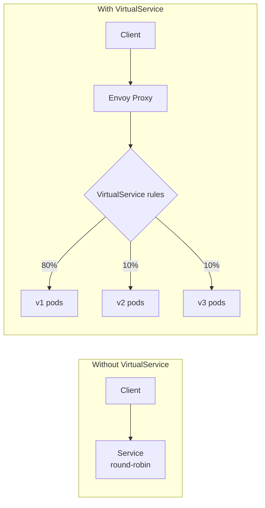
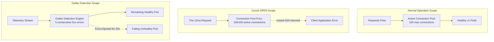

## Complexity: `[COMPLEX]`
## Time to Complete: 60-75 minutes

---

## Prerequisites

Before starting this module, you should have completed:
- [Module 1: Installation & Architecture](../module-1.1-istio-installation-architecture/) — Istio installation and sidecar injection
- [CKA Module 3.5: Gateway API](/k8s/cka/part3-services-networking/module-3.5-gateway-api/) — Kubernetes Gateway API basics
- Understanding of HTTP routing concepts (headers, paths, methods)

---

## What You'll Be Able to Do

After completing this module, you will be able to:

1. **Configure** VirtualService routing rules for header-based, path-based, and weighted traffic splitting across service versions.
2. **Implement** canary and blue-green deployment patterns using DestinationRules with traffic policies and subset definitions.
3. **Design** and **apply** resilience patterns (circuit breaking, retries, timeouts, fault injection) to systematically harden service-to-service communication.
4. **Diagnose** and **debug** complex traffic routing issues using `istioctl proxy-config routes`, Kiali service graphs, and Envoy access logs.

---

## Why This Module Matters

In November 2020, a prominent cloud-native e-commerce enterprise lost an estimated $3.5 million over a critical holiday shopping weekend. The root cause was not a database crash or a massive security breach, but a simple, misconfigured traffic routing rule. During an attempt to roll out a new recommendation engine via a canary deployment, a malformed route configuration caused 100% of user traffic to be directed to a subset of pods that had only been scaled to handle 5% of the aggregate load. The resulting cascading failure overwhelmed the cluster infrastructure, leading to a massive system-wide outage that persisted for hours. 

This catastrophic incident underscores a fundamental truth about modern distributed systems: traffic management is just as critical as the application code itself. Without a service mesh, implementing sophisticated routing strategies like canary deployments, blue-green rollouts, or circuit breaking requires injecting complex, highly customized logic directly into your application code. This tightly couples your infrastructure behavior to your business logic, creating fragile, rigid, and difficult-to-maintain systems.

Istio fundamentally changes this paradigm by extracting traffic management completely out of the application layer and placing it firmly into the infrastructure layer. By leveraging the advanced capabilities of the Envoy proxy sidecar architecture, Istio allows platform engineers to comprehensively control the flow of traffic with granular precision using simple, declarative Kubernetes YAML resources. This capability is not just a convenience; it is a critical requirement for operating highly available, resilient microservices at scale. It represents a staggering 35% of the ICA exam because mastering these precise traffic controls is exactly what separates a novice Kubernetes administrator from a senior platform engineer.

> **The Air Traffic Control Analogy**
>
> Think of Istio traffic management like air traffic control. Your services are airports. Without Istio, planes (requests) fly directly between airports with absolutely no coordination. With Istio, VirtualServices act as the highly detailed flight plans (dictating exactly where traffic goes), DestinationRules serve as the runway assignments and landing protocols (determining how traffic arrives), and Gateways function as the international terminals (managing how traffic enters and leaves the controlled airspace). Air traffic control never modifies the planes themselves — it simply controls the routes.

---

## What You'll Learn

By the end of this deep-dive module, you will thoroughly understand how to:
- Construct a VirtualService for complex HTTP routing, advanced traffic splitting, and synthetic fault injection.
- Leverage a DestinationRule for sophisticated load balancing, aggressive circuit breaking, and connection pool management.
- Establish robust Gateway and ServiceEntry configurations for secure ingress and egress traffic boundaries.
- Execute seamless canary deployments utilizing deterministic weighted routing.
- Fortify your applications by seamlessly configuring retries, timeouts, and circuit breakers.
- Inject calculated faults (delays and aborts) to validate chaos engineering resilience.
- Implement zero-risk traffic mirroring for safe, continuous testing in production environments.

---

## Did You Know?

- **Envoy Proxy Scale**: In 2022, Envoy Proxy (the underlying data plane engine powering Istio) successfully processed over 100 million requests per second globally across major enterprise cloud providers.
- **Original Collaboration**: Istio was originally announced in May 2017 as a groundbreaking joint open-source collaboration between Google, IBM, and Lyft, aiming to definitively solve the escalating microservice complexity problem.
- **Chaos Engineering ROI**: According to a 2021 industry study, platform teams that routinely practice fault injection and chaos testing (utilizing Istio's delay and abort faults) experience 40% fewer high-severity production outages compared to their peers.
- **Header Flexibility**: Istio can route traffic based on nearly any HTTP property, allowing platform teams to seamlessly route up to 15 different variations of a service simultaneously based purely on user-agent strings, cookies, or deeply custom headers.

---

## War Story: The Canary That Cooked the Kitchen

**Characters:**
- Priya: Senior SRE (5 years experience)
- Deployment: Payment service v2 featuring a new fraud detection algorithm

**The Incident:**

Priya carefully configured a 90/10 canary deployment for the payment service. Version 2 was steadily receiving 10% of the live traffic. The telemetry metrics looked fantastic — latency was perfectly stable, and the error rate remained at absolute zero. After 30 minutes of flawless operation, she shifted the traffic split to 50/50. Still perfectly stable. Feeling confident, she pushed the dial to a full 100% rollout.

Within 5 minutes, the payment service suddenly started returning a massive spike of 503 errors. This was not a minor blip — 30% of all payment requests globally were actively failing. The rapid response team rolled back to version 1 immediately, but the financial damage was already done: over $200,000 in failed transactional processing during a terrifying 7-minute window.

**What went wrong?**

The VirtualService was routing traffic by weight absolutely correctly, but Priya had forgotten to deploy the crucial DestinationRule. Without it, Istio fell back to using standard round-robin load balancing across all available endpoints — mixing both v1 and v2 indiscriminately. The VirtualService explicitly declared "send 100% to the v2 subset," but because there was no corresponding subset defined in the cluster, Istio simply couldn't find the requested subset and was forced to return a 503 Service Unavailable error.

**The missing piece:**

```yaml
# Priya had this VirtualService:
apiVersion: networking.istio.io/v1
kind: VirtualService
metadata:
  name: payment
spec:
  hosts:
  - payment
  http:
  - route:
    - destination:
        host: payment
        subset: v2    # ← References a subset...
      weight: 100
```

```yaml
# But forgot this DestinationRule:
apiVersion: networking.istio.io/v1
kind: DestinationRule
metadata:
  name: payment
spec:
  host: payment
  subsets:            # ← ...that must be defined here
  - name: v1
    labels:
      version: v1
  - name: v2
    labels:
      version: v2
```

**Lesson**: A VirtualService and a DestinationRule act as an inseparable pair. If your VirtualService explicitly references subsets, you MUST have a matching DestinationRule defining those subsets. Always execute `istioctl analyze` against your manifests before applying critical traffic rules.

---

## Part 1: Core Resources

### 1.1 VirtualService

The VirtualService defines the absolute **how** regarding request routing to a destination service. It securely intercepts traffic directly at the Envoy proxy sidecar and strictly applies routing rules long before the request ever reaches the final destination container. 



**Basic VirtualService Configuration:**

```yaml
apiVersion: networking.istio.io/v1
kind: VirtualService
metadata:
  name: reviews
spec:
  hosts:
  - reviews                    # Which service this applies to
  http:
  - match:                     # Conditions (optional)
    - headers:
        end-user:
          exact: jason         # If header matches...
    route:
    - destination:
        host: reviews
        subset: v2             # ...route to v2
  - route:                     # Default route (no match = catch-all)
    - destination:
        host: reviews
        subset: v1
```

> **Stop and think**: Why does Istio evaluate VirtualService HTTP match rules sequentially from top to bottom? Consider what would happen if the default catch-all route was placed at the very top of the configuration instead of the bottom. 

**Key fields:**

| Field | Purpose | Example |
|-------|---------|---------|
| `hosts` | Services this rule applies to | `["reviews"]`, `["*.example.com"]` |
| `http[].match` | Conditions for routing | Headers, URI, method, query params |
| `http[].route` | Where to send traffic | Service host + subset + weight |
| `http[].timeout` | Request timeout | `10s` |
| `http[].retries` | Retry configuration | `attempts: 3` |
| `http[].fault` | Fault injection | `delay`, `abort` |
| `http[].mirror` | Traffic mirroring | Send copy to another service |

### 1.2 DestinationRule

If VirtualService is the routing mechanism, the DestinationRule defines the stringent **policies** applied to the traffic *after* that routing decision has occurred. It configures granular parameters including load balancing behaviors, TCP connection pools, rapid outlier detection, and strict TLS enforcement settings for the target destination.

```yaml
apiVersion: networking.istio.io/v1
kind: DestinationRule
metadata:
  name: reviews
spec:
  host: reviews                    # Which service
  trafficPolicy:                   # Global policies
    connectionPool:
      tcp:
        maxConnections: 100
      http:
        h2UpgradePolicy: DEFAULT
        http1MaxPendingRequests: 100
        http2MaxRequests: 1000
    loadBalancer:
      simple: ROUND_ROBIN          # or LEAST_CONN, RANDOM, PASSTHROUGH
    outlierDetection:
      consecutive5xxErrors: 5
      interval: 30s
      baseEjectionTime: 30s
  subsets:                          # Named versions
  - name: v1
    labels:
      version: v1
  - name: v2
    labels:
      version: v2
    trafficPolicy:                 # Per-subset override
      loadBalancer:
        simple: LEAST_CONN
  - name: v3
    labels:
      version: v3
```

**Subsets** are fundamentally named groupings of pods securely selected by their inherent Kubernetes labels. The VirtualService directly references these subsets to accurately route packets to specific application versions. 

### 1.3 Gateway

The Gateway resource meticulously configures a powerful load balancer operating at the absolute edge of the service mesh, governing all incoming (ingress) or outgoing (egress) HTTP and TCP traffic. It seamlessly binds to an underlying Istio ingress or egress gateway workload pod.

```yaml
apiVersion: networking.istio.io/v1
kind: Gateway
metadata:
  name: bookinfo-gateway
spec:
  selector:
    istio: ingressgateway           # Bind to Istio's ingress gateway
  servers:
  - port:
      number: 80
      name: http
      protocol: HTTP
    hosts:
    - "bookinfo.example.com"        # Accept traffic for this host
  - port:
      number: 443
      name: https
      protocol: HTTPS
    hosts:
    - "bookinfo.example.com"
    tls:
      mode: SIMPLE
      credentialName: bookinfo-tls   # K8s Secret with cert/key
```

**Connect Gateway to VirtualService:**

```yaml
apiVersion: networking.istio.io/v1
kind: VirtualService
metadata:
  name: bookinfo
spec:
  hosts:
  - "bookinfo.example.com"
  gateways:
  - bookinfo-gateway               # Reference the Gateway
  http:
  - match:
    - uri:
        prefix: /productpage
    route:
    - destination:
        host: productpage
        port:
          number: 9080
  - match:
    - uri:
        prefix: /reviews
    route:
    - destination:
        host: reviews
```

**Traffic flow with Gateway Visualization:**


### 1.4 ServiceEntry

The ServiceEntry resource explicitly injects critical entries directly into Istio's internal service registry. This capability empowers operators to elegantly manage and govern traffic destined for completely external services just as if they were natively deployed within the local cluster mesh.

```yaml
apiVersion: networking.istio.io/v1
kind: ServiceEntry
metadata:
  name: external-api
spec:
  hosts:
  - api.external.com
  location: MESH_EXTERNAL             # Outside the mesh
  ports:
  - number: 443
    name: https
    protocol: TLS
  resolution: DNS
```

```yaml
# Now you can apply traffic rules to external services!
apiVersion: networking.istio.io/v1
kind: VirtualService
metadata:
  name: external-api-timeout
spec:
  hosts:
  - api.external.com
  http:
  - timeout: 5s
    route:
    - destination:
        host: api.external.com
```

**Why ServiceEntry fundamentally matters:**

By default, Istio's sidecar model is extremely permissive and allows all outbound external traffic. However, when security postures mandate utilizing `meshConfig.outboundTrafficPolicy.mode: REGISTRY_ONLY`, only officially registered services are technically accessible. In this fortified mode, establishing a ServiceEntry becomes an absolute requirement for any external communication access.

---

## Part 2: Traffic Shifting (Canary Deployments)

### 2.1 Weighted Routing

The most common and highly reliable canary deployment pattern — precisely splitting traffic by a calculated percentage across distinct versions:

```yaml
apiVersion: networking.istio.io/v1
kind: VirtualService
metadata:
  name: reviews
spec:
  hosts:
  - reviews
  http:
  - route:
    - destination:
        host: reviews
        subset: v1
      weight: 80               # 80% to v1
    - destination:
        host: reviews
        subset: v2
      weight: 20               # 20% to v2
```

```yaml
apiVersion: networking.istio.io/v1
kind: DestinationRule
metadata:
  name: reviews
spec:
  host: reviews
  subsets:
  - name: v1
    labels:
      version: v1
  - name: v2
    labels:
      version: v2
```

**Progressive rollout example sequence via bash:**

```bash
# Step 1: 90/10 split
kubectl apply -f - <<EOF
apiVersion: networking.istio.io/v1
kind: VirtualService
metadata:
  name: reviews
spec:
  hosts:
  - reviews
  http:
  - route:
    - destination:
        host: reviews
        subset: v1
      weight: 90
    - destination:
        host: reviews
        subset: v2
      weight: 10
EOF

# Monitor error rates... then increase

# Step 2: 50/50 split
kubectl patch virtualservice reviews --type merge -p '
spec:
  http:
  - route:
    - destination:
        host: reviews
        subset: v1
      weight: 50
    - destination:
        host: reviews
        subset: v2
      weight: 50'

# Step 3: Full rollout
kubectl patch virtualservice reviews --type merge -p '
spec:
  http:
  - route:
    - destination:
        host: reviews
        subset: v2
      weight: 100'
```

### 2.2 Header-Based Routing

For hyper-targeted releases, you can surgically route specific individual users, internal QA teams, or automated testing suites directly to a secluded version:

```yaml
apiVersion: networking.istio.io/v1
kind: VirtualService
metadata:
  name: reviews
spec:
  hosts:
  - reviews
  http:
  # Rule 1: Route "jason" to v2
  - match:
    - headers:
        end-user:
          exact: jason
    route:
    - destination:
        host: reviews
        subset: v2
  # Rule 2: Route requests with "canary: true" header to v3
  - match:
    - headers:
        canary:
          exact: "true"
    route:
    - destination:
        host: reviews
        subset: v3
  # Rule 3: Everyone else goes to v1
  - route:
    - destination:
        host: reviews
        subset: v1
```

### 2.3 URI-Based Routing

If you need to enforce strict structural routing based on precise URL paths, Istio provides profound flexibility:

```yaml
apiVersion: networking.istio.io/v1
kind: VirtualService
metadata:
  name: bookinfo
spec:
  hosts:
  - bookinfo.example.com
  gateways:
  - bookinfo-gateway
  http:
  - match:
    - uri:
        exact: /productpage
    route:
    - destination:
        host: productpage
        port:
          number: 9080
  - match:
    - uri:
        prefix: /api/v1/reviews
    route:
    - destination:
        host: reviews
        port:
          number: 9080
  - match:
    - uri:
        regex: "/api/v[0-9]+/ratings"
    route:
    - destination:
        host: ratings
        port:
          number: 9080
```

**Comprehensive Match types for URIs:**

| Type | Example | Matches |
|------|---------|---------|
| `exact` | `/productpage` | Only `/productpage` |
| `prefix` | `/api/v1` | `/api/v1`, `/api/v1/reviews`, etc. |
| `regex` | `/api/v[0-9]+` | `/api/v1`, `/api/v2`, etc. |

---

## Part 3: Fault Injection

Fault injection seamlessly allows platform operators to rigorously test exactly how the wider application handles abrupt upstream failures — all without actively breaking the underlying source code or shutting down functional services. This encapsulates the pinnacle of Netflix-style chaos engineering safely implemented directly at the mesh layer.

### 3.1 Delay Injection

Artificially simulate aggressive network latency and application stuttering:

```yaml
apiVersion: networking.istio.io/v1
kind: VirtualService
metadata:
  name: ratings
spec:
  hosts:
  - ratings
  http:
  - fault:
      delay:
        percentage:
          value: 100            # 100% of requests get delayed
        fixedDelay: 7s          # 7 second delay
    route:
    - destination:
        host: ratings
        subset: v1
```

**Selective targeted delay — only heavily affect highly specific test users:**

```yaml
apiVersion: networking.istio.io/v1
kind: VirtualService
metadata:
  name: ratings
spec:
  hosts:
  - ratings
  http:
  - match:
    - headers:
        end-user:
          exact: jason
    fault:
      delay:
        percentage:
          value: 100
        fixedDelay: 7s
    route:
    - destination:
        host: ratings
        subset: v1
  - route:
    - destination:
        host: ratings
        subset: v1
```

> **Pause and predict**: If we implement a 50% delay fault injection of 10 seconds on an upstream API, but the client application invoking this API has an internal, hardcoded timeout limit permanently set to 5 seconds, exactly what HTTP response will the end-user eventually experience when their request is selected for the delay?

### 3.2 Abort Injection

Surgically simulate terminal HTTP failures across the network graph:

```yaml
apiVersion: networking.istio.io/v1
kind: VirtualService
metadata:
  name: ratings
spec:
  hosts:
  - ratings
  http:
  - fault:
      abort:
        percentage:
          value: 50              # 50% of requests get aborted
        httpStatus: 503          # Return 503 Service Unavailable
    route:
    - destination:
        host: ratings
        subset: v1
```

### 3.3 Combined Faults

Apply both brutal network delay and immediate connection aborting simultaneously to validate absolute worst-case scenario handling architectures:

```yaml
apiVersion: networking.istio.io/v1
kind: VirtualService
metadata:
  name: ratings
spec:
  hosts:
  - ratings
  http:
  - fault:
      delay:
        percentage:
          value: 50
        fixedDelay: 5s
      abort:
        percentage:
          value: 10
        httpStatus: 500
    route:
    - destination:
        host: ratings
        subset: v1
```

In this precise configuration: 50% of requests are aggressively delayed by 5s, and entirely independently, 10% forcefully return HTTP 500 fatal errors.

---

## Part 4: Resilience

### 4.1 Timeouts

Aggressively prevent latent requests from hanging indefinitely and consuming vital thread resources across the infrastructure stack:

```yaml
apiVersion: networking.istio.io/v1
kind: VirtualService
metadata:
  name: reviews
spec:
  hosts:
  - reviews
  http:
  - timeout: 3s                 # Fail if no response within 3 seconds
    route:
    - destination:
        host: reviews
        subset: v1
```

### 4.2 Retries

Automatically and silently retry prematurely failed or sporadically dropped network requests:

```yaml
apiVersion: networking.istio.io/v1
kind: VirtualService
metadata:
  name: reviews
spec:
  hosts:
  - reviews
  http:
  - retries:
      attempts: 3               # Retry up to 3 times
      perTryTimeout: 2s         # Each attempt gets 2 seconds
      retryOn: 5xx,reset,connect-failure,retriable-4xx
    route:
    - destination:
        host: reviews
        subset: v1
```

**Highly Effective `retryOn` configuration values:**

| Value | Retries When |
|-------|-------------|
| `5xx` | Server returns 5xx |
| `reset` | Connection reset |
| `connect-failure` | Can't connect |
| `retriable-4xx` | Specific 4xx codes (409) |
| `gateway-error` | 502, 503, 504 |

> **Warning**: Keep in mind that implementing retries exponentially multiplies the system load. Setting 3 retries means a severely failing destination service suddenly gets slammed with up to 4x the expected traffic volume. Always rigidly combine your retries with strict circuit breaking thresholds.

### 4.3 Circuit Breaking

Actively prevent devastating cascading system failures by aggressively stopping traffic propagation to actively unhealthy compute instances:

```yaml
apiVersion: networking.istio.io/v1
kind: DestinationRule
metadata:
  name: reviews
spec:
  host: reviews
  trafficPolicy:
    connectionPool:
      tcp:
        maxConnections: 100       # Max TCP connections
      http:
        http1MaxPendingRequests: 10  # Max queued requests
        http2MaxRequests: 100        # Max concurrent requests
        maxRequestsPerConnection: 10 # Max requests per connection
        maxRetries: 3                # Max concurrent retries
    outlierDetection:
      consecutive5xxErrors: 5     # Eject after 5 consecutive 5xx
      interval: 10s              # Check every 10 seconds
      baseEjectionTime: 30s      # Eject for at least 30 seconds
      maxEjectionPercent: 50     # Don't eject more than 50% of hosts
  subsets:
  - name: v1
    labels:
      version: v1
```

**How robust circuit breaking functions at the Envoy level:**



### 4.4 Outlier Detection

Outlier detection is the critical active mechanism that decisively ejects deeply unhealthy or sporadically failing instances straight out of the active load balancing pool:

```yaml
apiVersion: networking.istio.io/v1
kind: DestinationRule
metadata:
  name: reviews
spec:
  host: reviews
  trafficPolicy:
    outlierDetection:
      consecutive5xxErrors: 3     # Eject after 3 errors
      interval: 15s              # Evaluation interval
      baseEjectionTime: 30s      # Min ejection duration
      maxEjectionPercent: 30     # Max % of hosts ejected
      minHealthPercent: 70       # Only eject if >70% healthy
```

---

## Part 5: Traffic Mirroring

Safely mirror (or completely shadow) live production traffic directly to an experimental service specifically for rigorous testing without fundamentally affecting the primary application flow. The carefully mirrored request is executed purely as a fire-and-forget operation — any and all backend responses from the shadow node are immediately discarded by Envoy.

```yaml
apiVersion: networking.istio.io/v1
kind: VirtualService
metadata:
  name: reviews
spec:
  hosts:
  - reviews
  http:
  - route:
    - destination:
        host: reviews
        subset: v1
      weight: 100
    mirror:
      host: reviews
      subset: v2                 # Mirror to v2
    mirrorPercentage:
      value: 100                 # Mirror 100% of traffic
```

**Critical Use cases for traffic mirroring:**
- Vetting a completely new application version using undeniably real production traffic loads.
- Meticulously comparing legacy v1 responses directly against new v2 responses without encountering any user-facing risk.
- Actively load testing a massive new deployment configuration seamlessly.
- Granularly capturing truly authentic traffic patterns specifically for deep debugging workflows.

---

## Part 6: Ingress Traffic

### 6.1 Configuring Ingress with Gateway

A complete architectural example demonstrating exactly how to securely expose a contained application specifically to unpredictable external internet traffic:

```yaml
# Step 1: Gateway (the front door)
apiVersion: networking.istio.io/v1
kind: Gateway
metadata:
  name: httpbin-gateway
spec:
  selector:
    istio: ingressgateway
  servers:
  - port:
      number: 80
      name: http
      protocol: HTTP
    hosts:
    - "httpbin.example.com"
```

```yaml
# Step 2: VirtualService (routing rules)
apiVersion: networking.istio.io/v1
kind: VirtualService
metadata:
  name: httpbin
spec:
  hosts:
  - "httpbin.example.com"
  gateways:
  - httpbin-gateway
  http:
  - match:
    - uri:
        prefix: /status
    - uri:
        prefix: /delay
    route:
    - destination:
        host: httpbin
        port:
          number: 8000
```

```bash
# Get the ingress gateway's external IP
export INGRESS_HOST=$(kubectl -n istio-system get service istio-ingressgateway \
  -o jsonpath='{.status.loadBalancer.ingress[0].ip}')
export INGRESS_PORT=$(kubectl -n istio-system get service istio-ingressgateway \
  -o jsonpath='{.spec.ports[?(@.name=="http2")].port}')

# For kind/minikube (NodePort):
export INGRESS_PORT=$(kubectl -n istio-system get service istio-ingressgateway \
  -o jsonpath='{.spec.ports[?(@.name=="http2")].nodePort}')
export INGRESS_HOST=$(kubectl get nodes -o jsonpath='{.items[0].status.addresses[?(@.type=="InternalIP")].address}')

# Test
curl -H "Host: httpbin.example.com" http://$INGRESS_HOST:$INGRESS_PORT/status/200
```

### 6.2 TLS at Ingress

Secure the ingress perimeter definitively by robustly binding highly secure cryptographic certificates directly to the Istio Gateway:

```bash
# Create TLS secret
kubectl create -n istio-system secret tls httpbin-tls \
  --key=httpbin.key \
  --cert=httpbin.crt
```

```yaml
apiVersion: networking.istio.io/v1
kind: Gateway
metadata:
  name: httpbin-gateway
spec:
  selector:
    istio: ingressgateway
  servers:
  - port:
      number: 443
      name: https
      protocol: HTTPS
    hosts:
    - "httpbin.example.com"
    tls:
      mode: SIMPLE                    # One-way TLS
      credentialName: httpbin-tls     # K8s Secret name
```

**Advanced TLS operational modes at the Gateway layer:**

| Mode | Description |
|------|-------------|
| `SIMPLE` | Standard TLS termination workflow (only the server certificate is verified) |
| `MUTUAL` | Strict mTLS enforcement (explicitly mandates both client and server cryptographic certs) |
| `PASSTHROUGH` | Silently forward the fully encrypted traffic stream entirely as-is (SNI-based routing without termination) |
| `AUTO_PASSTHROUGH` | Operates identically to PASSTHROUGH but utilizes heavily automated SNI routing configurations |
| `ISTIO_MUTUAL` | Exclusively utilize Istio's deeply internal mTLS certificates (strictly designed for mesh-internal gateways) |

---

## Part 7: Egress Traffic

### 7.1 Controlling Outbound Traffic

By absolute default, Istio's deployed sidecars will carelessly allow all outbound traffic to exit the mesh. To safely lock down this immense security vulnerability:

```yaml
# In IstioOperator or mesh config
apiVersion: install.istio.io/v1alpha1
kind: IstioOperator
spec:
  meshConfig:
    outboundTrafficPolicy:
      mode: REGISTRY_ONLY          # Block unregistered external services
```

### 7.2 ServiceEntry for External Access

When your egress policy is securely locked down, you must explicitly declare intended external destinations:

```yaml
# Allow access to an external API
apiVersion: networking.istio.io/v1
kind: ServiceEntry
metadata:
  name: google-api
spec:
  hosts:
  - "www.googleapis.com"
  ports:
  - number: 443
    name: https
    protocol: TLS
  location: MESH_EXTERNAL
  resolution: DNS
```

```yaml
# Optional: Apply traffic policy to external service
apiVersion: networking.istio.io/v1
kind: DestinationRule
metadata:
  name: google-api
spec:
  host: "www.googleapis.com"
  trafficPolicy:
    tls:
      mode: SIMPLE                 # Originate TLS to external service
```

### 7.3 Egress Gateway

To force absolutely all external traffic through a single, highly monitored, strictly dedicated egress gateway (essential for heavy corporate auditing and IP firewall control):

```yaml
apiVersion: networking.istio.io/v1
kind: ServiceEntry
metadata:
  name: external-svc
spec:
  hosts:
  - external.example.com
  ports:
  - number: 443
    name: tls
    protocol: TLS
  location: MESH_EXTERNAL
  resolution: DNS
```

```yaml
apiVersion: networking.istio.io/v1
kind: Gateway
metadata:
  name: egress-gateway
spec:
  selector:
    istio: egressgateway
  servers:
  - port:
      number: 443
      name: tls
      protocol: TLS
    hosts:
    - external.example.com
    tls:
      mode: PASSTHROUGH
```

```yaml
apiVersion: networking.istio.io/v1
kind: VirtualService
metadata:
  name: external-through-egress
spec:
  hosts:
  - external.example.com
  gateways:
  - mesh                          # Internal mesh traffic
  - egress-gateway                # Egress gateway
  tls:
  - match:
    - gateways:
      - mesh
      port: 443
      sniHosts:
      - external.example.com
    route:
    - destination:
        host: istio-egressgateway.istio-system.svc.cluster.local
        port:
          number: 443
  - match:
    - gateways:
      - egress-gateway
      port: 443
      sniHosts:
      - external.example.com
    route:
    - destination:
        host: external.example.com
        port:
          number: 443
```

---

## Common Mistakes

| Mistake | Symptom | Solution |
|---------|---------|----------|
| VirtualService references subset without DestinationRule | Immediate 503 errors, Envoy logs report `no healthy upstream` | Always ensure you thoroughly create a DestinationRule featuring matching subset definitions prior to routing. |
| Configuration weights don't sum strictly to exactly 100 | The Istiod control plane firmly rejects the configuration entirely, or produces highly unexpected distribution behavior. | Rigorously ensure that all routing weights assigned within the YAML strictly total exactly 100 to prevent failure. |
| The Gateway host completely fails to match the VirtualService host | The incoming ingress traffic enters the network but absolutely never manages to reach the intended destination service. | Defined Hosts must structurally match identically on a byte-for-byte level between the active Gateway and VirtualService objects. |
| Carelessly missing the critical `gateways:` field in the VirtualService | The routing operates flawlessly for internal mesh traffic, but violently fails for external ingress traffic. | Explicitly inject the `gateways: [gateway-name]` array property immediately for external traffic routing enablement. |
| Aggressively utilizing retries entirely without robust circuit breaking | A horrific retry storm develops, exponentially overwhelming the struggling, heavily failing target service into total collapse. | Always fundamentally mandate the pairing of retry budgets with strong outlier detection policies for essential resilience. |
| Overall timeout duration is much shorter than total retries * perTryTimeout | The strict overarching timeout ruthlessly kills the active retries extremely prematurely, negating the entire retry strategy. | Deliberately set the global `timeout` value decisively greater than or perfectly equal to `attempts` multiplied by the `perTryTimeout`. |
| ServiceEntry manifest is missing entirely for an external destination service | Continuous 502 errors instantly arise whenever the cluster is strictly operating in the secure `REGISTRY_ONLY` configuration mode. | Thoroughly author and deploy a distinct ServiceEntry manifest for every single external endpoint dependency your applications utilize. |
| Specifying the terribly wrong connection port inside the DestinationRule | A brutal connection refused error completely surfaces or causes an incredibly silent, difficult-to-trace network routing failure. | Explicitly guarantee your specified port numbers meticulously match perfectly with the bound underlying Kubernetes core Service resource. |

---

## Quiz

Test your deep technical knowledge:

**Q1: What is the relationship between VirtualService and DestinationRule?**

<details>
<summary>Show Answer</summary>

**VirtualService** defines *where* traffic goes (routing rules: match conditions, weights, hosts).
**DestinationRule** defines *how* traffic arrives (policies: load balancing, circuit breaking, subsets, TLS).

VirtualService is evaluated first to make the routing decision, and then the corresponding DestinationRule is applied to enforce the operational policies. If a VirtualService attempts to route traffic to a specific subset, that subset must be explicitly defined within the paired DestinationRule to avoid routing failures.

</details>

**Q2: Write a VirtualService that sends 80% of traffic to v1 and 20% to v2 of the "productpage" service.**

<details>
<summary>Show Answer</summary>

```yaml
apiVersion: networking.istio.io/v1
kind: VirtualService
metadata:
  name: productpage
spec:
  hosts:
  - productpage
  http:
  - route:
    - destination:
        host: productpage
        subset: v1
      weight: 80
    - destination:
        host: productpage
        subset: v2
      weight: 20
```

This VirtualService uses a weighted routing rule to split traffic between two different subsets. By explicitly setting the weights to 80 and 20, we guarantee that the traffic distribution aligns precisely with our canary rollout strategy. It is imperative that a corresponding DestinationRule exists to define what the `v1` and `v2` subsets actually correspond to in terms of Kubernetes pod labels. Without that accompanying DestinationRule, the Envoy proxy will not know how to resolve the subsets, resulting in immediate 503 errors for all incoming requests.

</details>

**Q3: How do you inject a 5-second delay into 50% of requests to the ratings service?**

<details>
<summary>Show Answer</summary>

```yaml
apiVersion: networking.istio.io/v1
kind: VirtualService
metadata:
  name: ratings
spec:
  hosts:
  - ratings
  http:
  - fault:
      delay:
        percentage:
          value: 50
        fixedDelay: 5s
    route:
    - destination:
        host: ratings
```

This configuration utilizes the `fault` block within the VirtualService to inject synthetic latency into the network path. By specifying a `fixedDelay` of 5 seconds and a `percentage` of 50, the Istio proxy will intentionally stall half of the incoming requests before forwarding them to the destination. This is a critical chaos engineering technique used to validate how upstream clients handle degraded performance. Always ensure that the clients invoking this service have timeouts configured that are appropriate for this induced latency.

</details>

**Q4: What is the difference between circuit breaking (connectionPool) and outlier detection?**

<details>
<summary>Show Answer</summary>

- **Connection pool (circuit breaking)**: Limits the *number* of connections/requests to a service. When limits are hit, new requests get 503. Protects the destination from overload.
- **Outlier detection**: Monitors individual endpoints for errors and *ejects* unhealthy ones from the pool. Remaining healthy endpoints still receive traffic.

A connection pool acts as a bulkhead to prevent overwhelming the target by limiting the sheer volume of concurrent connections. Outlier detection, on the other hand, is a continuous monitoring mechanism that observes the health of individual endpoints based on their response codes. Together, these two mechanisms form a robust circuit breaking strategy that ensures maximum availability during heavily degraded conditions.

</details>

**Q5: What does a Gateway resource actually do?**

<details>
<summary>Show Answer</summary>

Gateway configures a load balancer (typically the Istio ingress gateway pod) to accept traffic from outside the mesh. It specifies:
- Which ports to listen on
- Which protocols to accept (HTTP, HTTPS, TCP, TLS)
- Which hosts to accept traffic for
- TLS configuration (certificates, mTLS)

The Gateway resource is responsible for managing how traffic enters or exits the environment at the edge of the service mesh. However, it is crucial to understand that a Gateway does not contain any routing intelligence of its own. It merely opens the door; you must always bind a VirtualService to the Gateway to instruct Istio on how to route the traffic once it has securely entered the internal mesh.

</details>

**Q6: How do you restrict egress traffic to only registered services?**

<details>
<summary>Show Answer</summary>

Set the outbound traffic policy to `REGISTRY_ONLY`:

```yaml
meshConfig:
  outboundTrafficPolicy:
    mode: REGISTRY_ONLY
```

By default, Istio's sidecar proxies are configured to allow traffic to bypass the mesh and reach any external destination, which is a significant security risk in highly regulated environments. Changing the `outboundTrafficPolicy.mode` to `REGISTRY_ONLY` locks down this permissive behavior, establishing a robust default-deny posture for all external communications. Once this is firmly enforced, administrators must explicitly create ServiceEntry resources to register authorized external domains, heavily blocking any unregistered attempts.

</details>

**Q7: What is traffic mirroring and when would you use it?**

<details>
<summary>Show Answer</summary>

Traffic mirroring sends a copy of live traffic to a secondary service. The mirrored traffic is fire-and-forget — responses from the mirror are discarded and don't affect the primary request.

```yaml
mirror:
  host: reviews
  subset: v2
mirrorPercentage:
  value: 100
```

Traffic mirroring, often referred to as shadowing, is an incredibly powerful deployment pattern where a precise copy of live production traffic is heavily duplicated and aggressively sent directly to a completely secondary service version. The primary request continues to flow normally to the main service, while the mirrored request is handled entirely asynchronously. This highly advanced technique provides an absolutely zero-risk mechanism for validating new code against real-world data payloads and volatile access patterns before officially shifting any active production traffic routing.

</details>

**Q8: What happens if you configure retries with attempts: 3 and perTryTimeout: 2s, but the overall timeout is 3s?**

<details>
<summary>Show Answer</summary>

The overall timeout (3s) overrides the retry budget. With `perTryTimeout: 2s` and `attempts: 3`, you'd need 6s total for all retries. But the 3s timeout means at most the first attempt (2s) plus part of the second attempt can complete before the overall timeout kills the request.

In Istio, the global timeout strictly defined on a route takes absolute precedence over any configured retry budgets. If the overall timeout is strictly set to 3 seconds, the request will be forcefully terminated at that mark, regardless of how many retry attempts technically remain unused. As a foundational platform best practice, you must continuously calculate your aggressive timeouts to ensure that the global timeout is strictly greater than or perfectly equal to the number of attempts carefully multiplied by the individual per-try timeout.

</details>

**Q9: What is a ServiceEntry and when is it required?**

<details>
<summary>Show Answer</summary>

ServiceEntry adds external services to Istio's internal service registry. It's required when:
1. `outboundTrafficPolicy.mode` is `REGISTRY_ONLY` (external traffic is blocked by default)
2. You want to apply Istio traffic rules (timeouts, retries, fault injection) to external services
3. You want to monitor external service traffic through Istio's observability features

By explicitly incorporating external dependencies directly into the deep internal mesh's worldview, you instantly gain the powerful ability to apply highly standardized Istio traffic management policies strictly across those external calls. It naturally becomes an absolute architectural requirement when the wider cluster safely operates in an aggressively restricted `REGISTRY_ONLY` external egress mode. Furthermore, forcefully bringing external services into the central registry rapidly enables deep comprehensive telemetry, effectively allowing you to monitor massive third-party API performance securely.

</details>

**Q10: Write a Gateway + VirtualService to expose the "frontend" service on HTTPS at frontend.example.com.**

<details>
<summary>Show Answer</summary>

```yaml
apiVersion: networking.istio.io/v1
kind: Gateway
metadata:
  name: frontend-gateway
spec:
  selector:
    istio: ingressgateway
  servers:
  - port:
      number: 443
      name: https
      protocol: HTTPS
    hosts:
    - "frontend.example.com"
    tls:
      mode: SIMPLE
      credentialName: frontend-tls
```

```yaml
apiVersion: networking.istio.io/v1
kind: VirtualService
metadata:
  name: frontend
spec:
  hosts:
  - "frontend.example.com"
  gateways:
  - frontend-gateway
  http:
  - route:
    - destination:
        host: frontend
        port:
          number: 80
```

This robust architecture accurately splits the edge security configuration seamlessly into two entirely distinct layers of responsibility. The Gateway resource is solely and heavily focused on actively terminating the dense HTTPS connection on port 443 by explicitly referencing the secure `frontend-tls` Kubernetes secret object. Once the heavy TLS session is cleanly terminated and the incoming traffic is decrypted safely, the mapped VirtualService fully takes over to accurately analyze the internal HTTP headers and route the request locally to the internal `frontend` backend service.

</details>

**Q11: How do you route requests with the header `x-test: canary` to subset v2, and all other traffic to v1?**

<details>
<summary>Show Answer</summary>

```yaml
apiVersion: networking.istio.io/v1
kind: VirtualService
metadata:
  name: myapp
spec:
  hosts:
  - myapp
  http:
  - match:
    - headers:
        x-test:
          exact: canary
    route:
    - destination:
        host: myapp
        subset: v2
  - route:
    - destination:
        host: myapp
        subset: v1
```

Match rules are explicitly evaluated completely top-to-bottom. The first successful match definitively wins. The strict catch-all (no match defined) located at the bottom safely handles everything else. When a deep request aggressively arrives, the sidecar proxy heavily inspects the inbound HTTP headers to instantly see if the highly exact match for the header is present, accurately routing those specific requests to the defined target subset.

</details>

---

## Hands-On Exercise: Traffic Management with Bookinfo

### Objective
Deploy the extensive Bookinfo application architecture and actively practice granular traffic management operations: execute a structured canary deployment, enforce deep fault injection operations, and validate advanced circuit breaking thresholds safely.

### Setup

<details>
<summary>Solution</summary>

```bash
# Ensure Istio is installed (from Module 1)
istioctl install --set profile=demo -y
kubectl label namespace default istio-injection=enabled

# Deploy Bookinfo
kubectl apply -f https://raw.githubusercontent.com/istio/istio/release-1.22/samples/bookinfo/platform/kube/bookinfo.yaml

# Wait for pods
kubectl wait --for=condition=ready pod --all -n default --timeout=120s

# Deploy all DestinationRules
kubectl apply -f https://raw.githubusercontent.com/istio/istio/release-1.22/samples/bookinfo/networking/destination-rule-all.yaml

# Deploy the Gateway
kubectl apply -f https://raw.githubusercontent.com/istio/istio/release-1.22/samples/bookinfo/networking/bookinfo-gateway.yaml

# Verify
istioctl analyze
```

</details>

### Task 1: Route All Traffic to v1

First, establish a stable baseline by explicitly routing absolutely all traffic destined for the `reviews` service directly to the `v1` backend subset.

<details>
<summary>Solution</summary>

```bash
kubectl apply -f - <<EOF
apiVersion: networking.istio.io/v1
kind: VirtualService
metadata:
  name: reviews
spec:
  hosts:
  - reviews
  http:
  - route:
    - destination:
        host: reviews
        subset: v1
EOF
```

Verify by heavily sending simulated traffic loops — you should consistently only see deep reviews natively WITHOUT any visual stars rendered:

```bash
# Port-forward to productpage
kubectl port-forward svc/productpage 9080:9080 &

# Send requests — should always be v1 (no stars)
for i in $(seq 1 10); do
  curl -s http://localhost:9080/productpage | grep -o "glyphicon-star" | wc -l
done
```

</details>

### Task 2: Canary — Send 20% to v2

Execute a deliberate canary release strategy by surgically routing exactly 20% of incoming live traffic securely to the newer `v2` backend variation.

<details>
<summary>Solution</summary>

```bash
kubectl apply -f - <<EOF
apiVersion: networking.istio.io/v1
kind: VirtualService
metadata:
  name: reviews
spec:
  hosts:
  - reviews
  http:
  - route:
    - destination:
        host: reviews
        subset: v1
      weight: 80
    - destination:
        host: reviews
        subset: v2
      weight: 20
EOF
```

Verify the accurate telemetry — roughly exactly 2 out of every 10 incoming requests should properly render and show black stars representing the `v2` update:

```bash
for i in $(seq 1 20); do
  stars=$(curl -s http://localhost:9080/productpage | grep -o "glyphicon-star" | wc -l)
  echo "Request $i: $stars stars"
done
```

</details>

### Task 3: Inject a 3-second Delay

Implement massive chaos engineering principles by artificially injecting a debilitating 3-second network delay aggressively across the mesh.

<details>
<summary>Solution</summary>

```bash
kubectl apply -f - <<EOF
apiVersion: networking.istio.io/v1
kind: VirtualService
metadata:
  name: ratings
spec:
  hosts:
  - ratings
  http:
  - fault:
      delay:
        percentage:
          value: 100
        fixedDelay: 3s
    route:
    - destination:
        host: ratings
        subset: v1
EOF
```

Verify the induced chaos — subsequent API requests should reliably take approximately ~3+ entire seconds longer to successfully resolve:

```bash
time curl -s http://localhost:9080/productpage > /dev/null
# Should show ~3+ seconds
```

</details>

### Task 4: Circuit Breaking

Protect an upstream microservice backend from utterly collapsing by enforcing highly restrictive connection pool limits directly representing strong circuit breaking.

<details>
<summary>Solution</summary>

```bash
kubectl apply -f - <<EOF
apiVersion: networking.istio.io/v1
kind: DestinationRule
metadata:
  name: reviews-cb
spec:
  host: reviews
  trafficPolicy:
    connectionPool:
      http:
        http1MaxPendingRequests: 1
        http2MaxRequests: 1
        maxRequestsPerConnection: 1
    outlierDetection:
      consecutive5xxErrors: 1
      interval: 1s
      baseEjectionTime: 30s
      maxEjectionPercent: 100
EOF
```

Generate severe localized load to aggressively trigger the implemented circuit breaking mechanism limits:

```bash
# Install fortio (Istio's load testing tool)
kubectl apply -f https://raw.githubusercontent.com/istio/istio/release-1.22/samples/httpbin/sample-client/fortio-deploy.yaml
kubectl wait --for=condition=ready pod -l app=fortio

# Send 20 concurrent connections
FORTIO_POD=$(kubectl get pods -l app=fortio -o jsonpath='{.items[0].metadata.name}')
kubectl exec $FORTIO_POD -c fortio -- fortio load -c 3 -qps 0 -n 30 -loglevel Warning \
  http://reviews:9080/reviews/1

# Look for "Code 503" responses — those are circuit breaker trips
```

</details>

### Success Criteria

- [ ] All traffic decisively routes precisely to the reviews `v1` destination (yielding no stars) when initially configured.
- [ ] A calculated baseline of ~20% of live traffic successfully shows stars rendered when the exact canary split is properly configured.
- [ ] Executed massive delay fault injection successfully adds precisely ~3 entire seconds perfectly to overall requests.
- [ ] Implemented aggressive circuit breaker strictly returns HTTP 503 fatal errors seamlessly under heavy concurrent load operations.
- [ ] The `istioctl analyze` diagnostic command safely shows absolutely no validation errors existing for all implemented configuration deployments.

### Cleanup

<details>
<summary>Solution</summary>

```bash
kill %1  # Stop port-forward
kubectl delete virtualservice reviews ratings
kubectl delete destinationrule reviews-cb
```

</details>

---

## Next Module

Continue aggressively into [Module 3: Security & Troubleshooting](../module-1.3-istio-security-troubleshooting/) — where we will deeply cover critical mesh security patterns including advanced mTLS deployments, highly secure authorization policies, stringent JWT authentication implementations, and deeply essential proxy debugging commands.