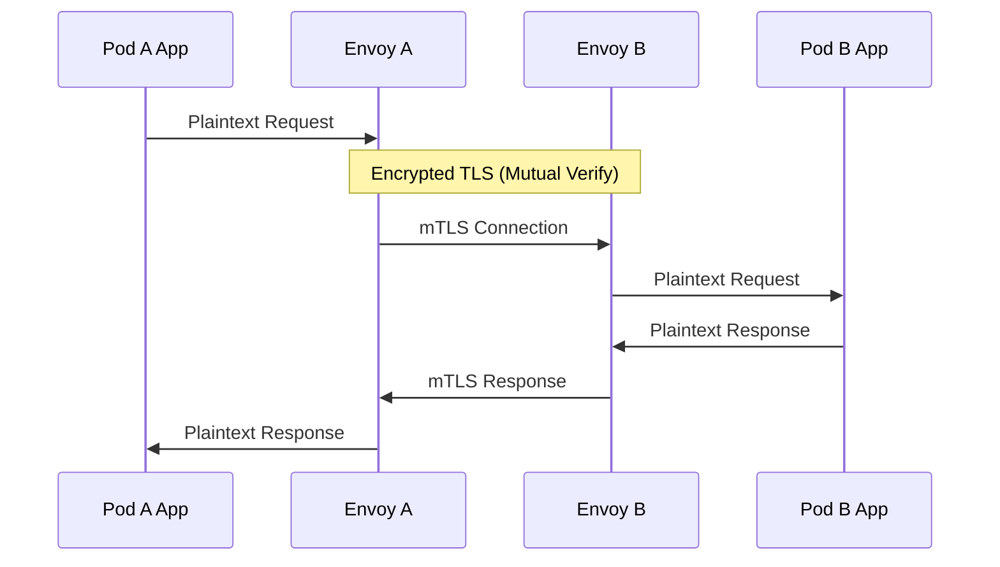
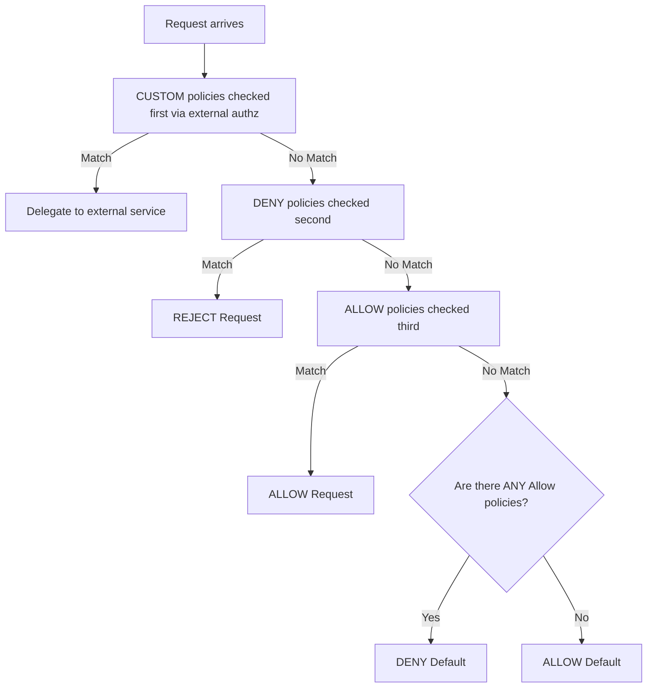
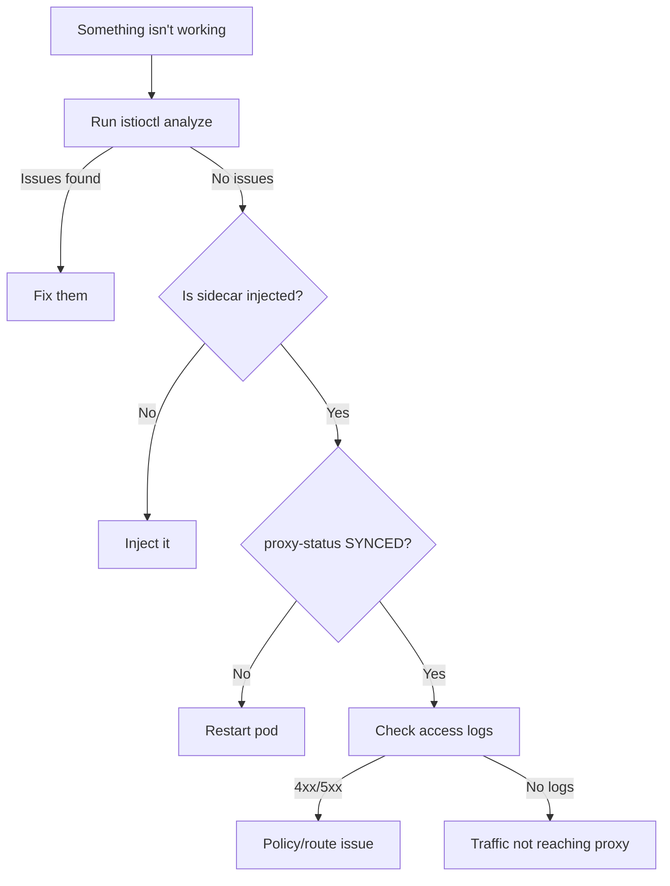

## Complexity: `[COMPLEX]`
## Time to Complete: 50-60 minutes

---

## Prerequisites

Before starting this module, you should have completely mastered the core routing concepts. Ensure you have completed:
- [Module 1: Installation & Architecture](../module-1.1-istio-installation-architecture/) — istiod, Envoy proxy injection, and the control plane.
- [Module 2: Traffic Management](../module-1.2-istio-traffic-management/) — VirtualService, DestinationRule, Gateway configurations.
- Basic understanding of Transport Layer Security (TLS), JSON Web Tokens (JWT), and Kubernetes Role-Based Access Control (RBAC) concepts.

---

## What You'll Be Able to Do

After completing this comprehensive module, you will be able to:

1. **Design** a comprehensive zero-trust network posture by configuring PeerAuthentication policies to enforce mTLS modes (STRICT, PERMISSIVE) across namespaces and workloads.
2. **Implement** RequestAuthentication with JWT validation and AuthorizationPolicy rules that explicitly control service-to-service access.
3. **Diagnose** mTLS handshake failures, rejected requests, and policy conflicts using `istioctl proxy-config` and proxy logs.
4. **Evaluate** proxy synchronization states and apply a systematic troubleshooting workflow using `istioctl analyze`, `proxy-config`, and `proxy-status` to resolve mesh issues.
5. **Configure** Gateway resources for external ingress with robust TLS termination and mutual TLS (mTLS) verification.

---

## Why This Module Matters

Security accounts for **15% of the ICA exam** and Troubleshooting accounts for **10%**. Together, that's a quarter of your score. Security questions will explicitly ask you to configure mTLS policies, set up JWT authentication, and write strict authorization rules. Troubleshooting questions will give you a broken configuration environment and ask you to find and fix the root cause.

In modern production environments, these are the exact skills that prevent catastrophic data breaches and drastically reduce Mean Time To Recovery (MTTR). A misconfigured PeerAuthentication can silently break service communication across an entire cluster. A missing AuthorizationPolicy can expose sensitive internal APIs to unauthorized actors. And when things inevitably go wrong, `istioctl analyze` and `istioctl proxy-config` are often the absolute only tools that can tell you exactly why traffic is failing.

### War Story: The Midnight mTLS Migration

At Acme Financial, Marcus, a Platform Engineer with four years of Kubernetes experience, was tasked with enabling mutual TLS (mTLS) across the entire production mesh. He'd read the official documentation and knew `STRICT` mode was the ultimate goal for zero-trust compliance. On a quiet Thursday evening, he applied the following mesh-wide PeerAuthentication policy:

```yaml
apiVersion: security.istio.io/v1
kind: PeerAuthentication
metadata:
  name: default
  namespace: istio-system
spec:
  mtls:
    mode: STRICT
```

Within 30 seconds, the monitoring dashboard lit up red. The payments service was calling a legacy service running *outside* the mesh (no sidecar). STRICT mTLS requires both sides to present valid certificates. The legacy service didn't have a sidecar, couldn't present a certificate, and every request failed with `connection reset by peer`. 

Orders stopped processing immediately. The on-call engineer reverted the change 8 minutes later, but Acme Financial lost $2.4M in unprocessed transactions during the outage.

**What Marcus should have done:**

<!-- markdown-link-check-disable -->
```yaml
# Step 1: Start with PERMISSIVE (accepts both mTLS and plaintext)
apiVersion: security.istio.io/v1
kind: PeerAuthentication
metadata:
  name: default
  namespace: istio-system
spec:
  mtls:
    mode: PERMISSIVE
```

```bash
# Step 2: Identify services without sidecars
# istioctl proxy-status  (shows which pods have proxies)
```

```yaml
# Step 3: Exclude specific ports or services
apiVersion: security.istio.io/v1
kind: PeerAuthentication
metadata:
  name: default
  namespace: istio-system
spec:
  mtls:
    mode: STRICT
  portLevelMtls:
    8080:
      mode: DISABLE    # Legacy service port
```

```yaml
# Step 4: Or apply STRICT per-namespace, not mesh-wide
apiVersion: security.istio.io/v1
kind: PeerAuthentication
metadata:
  name: default
  namespace: payments  # Only this namespace
spec:
  mtls:
    mode: STRICT
```
<!-- markdown-link-check-enable -->

**The Lesson**: Always start with PERMISSIVE mode, verify all communicating services have sidecars injected with `istioctl proxy-status`, and then progressively graduate to STRICT mode on a per-namespace basis.

> **The Building Security Analogy**
>
> Istio security works exactly like a modern, high-security office building. **PeerAuthentication** (mTLS) is the locked front door — it verifies everyone entering the building is exactly who they claim to be through a mutual certificate exchange. **RequestAuthentication** (JWT) is the badge reader mechanism — it cryptographically validates that the badge is legitimate, but it doesn't decide who can enter which specific rooms. **AuthorizationPolicy** is the access control list inside the security system — it decides which validated badge holders can open which specific doors. You absolutely need all three mechanisms operating together for complete, zero-trust security.

---

## Did You Know?

- **Istio rotates mTLS certificates every 24 hours by default**: Each workload in the mesh gets a short-lived SPIFFE certificate (`spiffe://<trust-domain>/ns/<namespace>/sa/<service-account>`) that's automatically rotated. There is zero manual certificate management needed for internal mesh traffic.
- **DENY policies are evaluated before ALLOW**: Istio's authorization engine strictly processes DENY rules first, then ALLOW rules, then CUSTOM rules. A DENY match immediately short-circuits the evaluation logic — the request is rejected regardless of any ALLOW rules.
- **`istioctl analyze` catches 40+ misconfiguration types**: Including orphaned VirtualServices, missing DestinationRules, conflicting security policies, and deprecated API versions. It is your best friend during the ICA exam.
- **Citadel handles immense scale natively**: The internal Certificate Authority (CA) in the istiod control plane can issue and rotate up to 10,000 certificates per second, supporting massively scaled enterprise clusters without requiring external dependencies.

---

## Section 1: Mutual TLS (mTLS) Fundamentals

### How mTLS Works in Istio

In a standard Kubernetes cluster without a service mesh, microservices communicate over plaintext HTTP or TCP. This allows any compromised pod in the cluster to sniff, intercept, or tamper with traffic. Istio solves this by deploying an Envoy proxy sidecar alongside every application container.



When Pod A sends a request to Pod B, the iptables rules in Pod A's network namespace redirect the outbound request to Pod A's Envoy sidecar. Envoy A initiates a mutual TLS handshake with Envoy B. Both proxies present their certificates and cryptographically verify the other's identity. Only after successful verification does Envoy A send the encrypted request to Envoy B, which decrypts it and forwards it to Pod B's application container over local loopback.

**Certificate Identity Definition**: Each workload receives a highly specific SPIFFE (Secure Production Identity Framework for Everyone) identity encoded directly into its certificate:

```text
spiffe://cluster.local/ns/default/sa/reviews
         └─ trust domain  └─ namespace  └─ service account
```

> **Pause and predict**: If you scale a deployment from 3 pods to 30 pods, do they all share the exact same certificate, or do they get unique certificates? Think about the SPIFFE ID structure.
> *Answer*: They all receive the exact same SPIFFE ID because they share the same namespace and service account, but Istiod generates unique certificates for each individual pod, all tied to that common SPIFFE ID.

---

## Section 2: PeerAuthentication

The `PeerAuthentication` resource explicitly controls the mTLS behavior for workloads receiving traffic within the mesh.

**Mesh-wide policy (applied in the istio-system namespace):**

```yaml
apiVersion: security.istio.io/v1
kind: PeerAuthentication
metadata:
  name: default
  namespace: istio-system        # Mesh-wide when in istio-system
spec:
  mtls:
    mode: STRICT                 # Require mTLS for all services
```

**Namespace-level policy:**

```yaml
apiVersion: security.istio.io/v1
kind: PeerAuthentication
metadata:
  name: default
  namespace: payments            # Only affects this namespace
spec:
  mtls:
    mode: STRICT
```

**Workload-level policy (targeting specific pods):**

```yaml
apiVersion: security.istio.io/v1
kind: PeerAuthentication
metadata:
  name: reviews-mtls
  namespace: default
spec:
  selector:
    matchLabels:
      app: reviews               # Only affects pods with this label
  mtls:
    mode: STRICT
```

**Port-level policy (disabling mTLS for specific ports):**

```yaml
apiVersion: security.istio.io/v1
kind: PeerAuthentication
metadata:
  name: reviews-mtls
  namespace: default
spec:
  selector:
    matchLabels:
      app: reviews
  mtls:
    mode: STRICT
  portLevelMtls:
    8080:
      mode: DISABLE              # Disable mTLS on port 8080 only
```

**mTLS Modes Explained:**

| Mode | Behavior | Use Case |
|------|----------|----------|
| `STRICT` | Only accepts mTLS traffic | Production (full encryption) |
| `PERMISSIVE` | Accepts both mTLS and plaintext | Migration period |
| `DISABLE` | No mTLS | Legacy services, debugging |
| `UNSET` | Inherits from parent | Default behavior |

**Policy priority (most specific wins):**

```text
Workload-level  >  Namespace-level  >  Mesh-level
(selector)         (namespace)          (istio-system)
```

---

## Section 3: DestinationRule TLS Settings

While `PeerAuthentication` controls the *server* side (inbound traffic), `DestinationRule` controls the *client* side (outbound traffic). When Envoy A talks to Envoy B, Envoy A consults the `DestinationRule` to determine how to shape the outbound connection.

```yaml
apiVersion: networking.istio.io/v1
kind: DestinationRule
metadata:
  name: reviews
spec:
  host: reviews
  trafficPolicy:
    tls:
      mode: ISTIO_MUTUAL          # Use Istio's mTLS certs
```

**DestinationRule TLS modes:**

| Mode | Description |
|------|-------------|
| `DISABLE` | No TLS |
| `SIMPLE` | Originate TLS (client verifies server) |
| `MUTUAL` | Originate mTLS (both verify each other) |
| `ISTIO_MUTUAL` | Use Istio's built-in mTLS certificates |

> **Exam tip**: In the vast majority of cases, you do not need to set the DestinationRule TLS mode explicitly for internal mesh traffic. Istio's control plane auto-detects when the destination has mTLS enabled and uses `ISTIO_MUTUAL` automatically. You only set this when you need to override behavior or integrate with external services.

---

## Section 4: Request Authentication (JWT)

`RequestAuthentication` validates JSON Web Tokens (JWT) attached to incoming HTTP requests. It cryptographically verifies that the token was signed by the stated issuer, has not expired, and has a valid structure. 

**Crucial Concept**: `RequestAuthentication` validates tokens that are present, but it does NOT enforce that a token is required. That is the job of `AuthorizationPolicy`.

### Basic JWT Validation Configuration

<!-- markdown-link-check-disable -->
```yaml
apiVersion: security.istio.io/v1
kind: RequestAuthentication
metadata:
  name: jwt-auth
  namespace: default
spec:
  selector:
    matchLabels:
      app: productpage
  jwtRules:
  - issuer: "https://accounts.google.com"
    jwksUri: "https://www.googleapis.com/oauth2/v3/certs"
  - issuer: "https://my-auth.example.com"
    jwksUri: "https://my-auth.example.com/.well-known/jwks.json"
    forwardOriginalToken: true     # Forward JWT to upstream
    outputPayloadToHeader: "x-jwt-payload"  # Extract claims to header
```
<!-- markdown-link-check-enable -->

**What RequestAuthentication actually does:**
1. If an incoming request contains a JWT, Envoy validates it against the `jwksUri` (JSON Web Key Set).
2. If the JWT is invalid (expired, wrong signature), Envoy rejects the request with an HTTP 401 Unauthorized error.
3. If the incoming request has NO JWT attached at all, **Envoy allows it through** (this surprises many engineers!).

### JWT with Claim-Based Routing

You can instruct Envoy to extract specific claims from the validated JWT and inject them into HTTP headers. This allows backend services to make routing or business logic decisions based on user identity without needing to parse the JWT themselves.

<!-- markdown-link-check-disable -->
```yaml
apiVersion: security.istio.io/v1
kind: RequestAuthentication
metadata:
  name: jwt-auth
  namespace: default
spec:
  selector:
    matchLabels:
      app: frontend
  jwtRules:
  - issuer: "https://auth.example.com"
    jwksUri: "https://auth.example.com/.well-known/jwks.json"
    outputClaimToHeaders:
    - header: x-jwt-sub
      claim: sub
    - header: x-jwt-groups
      claim: groups
```
<!-- markdown-link-check-enable -->

---

## Section 5: Authorization Policy Design

`AuthorizationPolicy` is Istio's powerful access control mechanism. It evaluates incoming traffic against a set of rules and decides whether to ALLOW or DENY the connection.

### Policy Actions and Evaluation Order

The evaluation order is strictly defined and crucial for understanding why traffic is permitted or dropped. DENY policies are evaluated before ALLOW policies.



> **Critical Paradigm Shift**: If there are NO AuthorizationPolicies attached to a workload, all traffic is intrinsically allowed. However, the absolute moment you create ANY `ALLOW` policy for a workload, the default behavior instantly flips to **deny-all**. From that moment forward, only traffic explicitly matched by an `ALLOW` rule is permitted.

### Constructing an ALLOW Policy

```yaml
apiVersion: security.istio.io/v1
kind: AuthorizationPolicy
metadata:
  name: allow-reviews
  namespace: default
spec:
  selector:
    matchLabels:
      app: reviews
  action: ALLOW
  rules:
  - from:
    - source:
        principals: ["cluster.local/ns/default/sa/productpage"]
    to:
    - operation:
        methods: ["GET"]
        paths: ["/reviews/*"]
```

This policy explicitly allows: GET requests targeting the `/reviews/*` path originating from the `productpage` service account. Because an ALLOW policy now exists, everything else attempting to reach the reviews service is immediately denied with a 403 Forbidden.

### Constructing a DENY Policy

```yaml
apiVersion: security.istio.io/v1
kind: AuthorizationPolicy
metadata:
  name: deny-external
  namespace: default
spec:
  selector:
    matchLabels:
      app: internal-api
  action: DENY
  rules:
  - from:
    - source:
        notNamespaces: ["default", "backend"]
    to:
    - operation:
        paths: ["/admin/*"]
```

This DENY policy blocks any request targeting `/admin/*` on the `internal-api` service if the request originates from a namespace other than `default` or `backend`.

### Enforcing JWT Requirements

To mandate that a request possesses a valid JWT, you must combine `RequestAuthentication` (to validate the token if present) with `AuthorizationPolicy` (to reject requests missing the token).

<!-- markdown-link-check-disable -->
```yaml
# Step 1: Validate JWT if present
apiVersion: security.istio.io/v1
kind: RequestAuthentication
metadata:
  name: require-jwt
  namespace: default
spec:
  selector:
    matchLabels:
      app: productpage
  jwtRules:
  - issuer: "https://auth.example.com"
    jwksUri: "https://auth.example.com/.well-known/jwks.json"
```

```yaml
# Step 2: DENY requests without valid JWT
apiVersion: security.istio.io/v1
kind: AuthorizationPolicy
metadata:
  name: require-jwt
  namespace: default
spec:
  selector:
    matchLabels:
      app: productpage
  action: DENY
  rules:
  - from:
    - source:
        notRequestPrincipals: ["*"]   # No valid JWT principal = deny
```
<!-- markdown-link-check-enable -->

### Namespace-Level Policy Control

You can create broad stroke policies that apply to entire namespaces, avoiding the need for `selector` blocks.

```yaml
# Allow all traffic within the namespace
apiVersion: security.istio.io/v1
kind: AuthorizationPolicy
metadata:
  name: allow-same-namespace
  namespace: backend
spec:
  action: ALLOW
  rules:
  - from:
    - source:
        namespaces: ["backend"]
```

```yaml
# Deny all traffic (explicit deny-all)
apiVersion: security.istio.io/v1
kind: AuthorizationPolicy
metadata:
  name: deny-all
  namespace: backend
spec:
  {}                               # Empty spec = deny all
```

### Common AuthorizationPolicy Patterns

**Allow specific HTTP methods only:**
```yaml
rules:
- to:
  - operation:
      methods: ["GET", "HEAD"]
```

**Allow traffic originating from specific service accounts:**
```yaml
rules:
- from:
  - source:
      principals: ["cluster.local/ns/frontend/sa/webapp"]
```

**Allow traffic based on deep JWT claims evaluation:**
<!-- markdown-link-check-disable -->
```yaml
rules:
- from:
  - source:
      requestPrincipals: ["https://auth.example.com/*"]
  when:
  - key: request.auth.claims[role]
    values: ["admin"]
```
<!-- markdown-link-check-enable -->

**Allow traffic from explicit CIDR blocks:**
```yaml
rules:
- from:
  - source:
      ipBlocks: ["10.0.0.0/8"]
```

---

## Section 6: Configure TLS at the Ingress Gateway

Securing traffic entering the cluster from the outside world is paramount. You must configure TLS at the ingress gateway to terminate external encrypted connections safely.

### Simple TLS (Server Certificate Only)

This is the standard HTTPS configuration where the server presents a certificate to the client.

```bash
# Create TLS secret
kubectl create -n istio-system secret tls my-tls-secret \
  --key=server.key \
  --cert=server.crt
```

```yaml
apiVersion: networking.istio.io/v1
kind: Gateway
metadata:
  name: secure-gateway
spec:
  selector:
    istio: ingressgateway
  servers:
  - port:
      number: 443
      name: https
      protocol: HTTPS
    hosts:
    - "app.example.com"
    tls:
      mode: SIMPLE
      credentialName: my-tls-secret
```

### Mutual TLS at Ingress (Client Certificates)

For highly secure entry points, you can force the external client to present a valid certificate upon connection.

```bash
# Create secret with CA cert for client verification
kubectl create -n istio-system secret generic my-mtls-secret \
  --from-file=tls.key=server.key \
  --from-file=tls.crt=server.crt \
  --from-file=ca.crt=ca.crt
```

```yaml
apiVersion: networking.istio.io/v1
kind: Gateway
metadata:
  name: mtls-gateway
spec:
  selector:
    istio: ingressgateway
  servers:
  - port:
      number: 443
      name: https
      protocol: HTTPS
    hosts:
    - "secure.example.com"
    tls:
      mode: MUTUAL                    # Require client certificate
      credentialName: my-mtls-secret
```

---

## Section 7: Advanced Troubleshooting

When service communication breaks down in Istio, guessing is futile. You need empirical data from the proxies themselves. The `istioctl` CLI provides a robust suite of inspection commands.

### The Power of `istioctl analyze`

This is the very first command you should execute when a configuration isn't behaving as expected.

```bash
# Analyze all namespaces
istioctl analyze --all-namespaces

# Analyze specific namespace
istioctl analyze -n default

# Analyze a specific file before applying
istioctl analyze my-virtualservice.yaml

# Common warnings/errors:
# IST0101: Referenced host not found
# IST0104: Gateway references missing secret
# IST0106: Schema validation error
# IST0108: Unknown annotation
# IST0113: VirtualService references undefined subset
```

### Inspecting State with `istioctl proxy-status`

This command visualizes the synchronization state between the istiod control plane and every Envoy proxy sidecar in your mesh.

```bash
istioctl proxy-status
```

**Understanding the Output:**

```text
NAME                              CDS    LDS    EDS    RDS    ECDS   ISTIOD
productpage-v1-xxx.default        SYNCED SYNCED SYNCED SYNCED SYNCED istiod-xxx
reviews-v1-xxx.default            SYNCED SYNCED SYNCED SYNCED SYNCED istiod-xxx
ratings-v1-xxx.default            STALE  SYNCED SYNCED SYNCED SYNCED istiod-xxx  ← Problem!
```

| Status | Meaning | Action |
|--------|---------|--------|
| `SYNCED` | Proxy has latest config from istiod | Normal |
| `NOT SENT` | istiod hasn't sent config (no changes) | Usually normal |
| `STALE` | Proxy hasn't acknowledged latest config | Investigate — restart pod or check connectivity |

**Decoding the xDS Protocol Types:**

| Type | Full Name | What It Configures |
|------|----------|-------------------|
| CDS | Cluster Discovery Service | Upstream clusters (services) |
| LDS | Listener Discovery Service | Inbound/outbound listeners |
| EDS | Endpoint Discovery Service | Endpoints (pod IPs) |
| RDS | Route Discovery Service | HTTP routing rules |
| ECDS | Extension Config Discovery | WASM extensions |

> **Stop and think**: You see a proxy status of STALE for your backend pod. What is the actual technical reality of the proxy sidecar in this state? Is it crashing, or is it just running an old routing table?
> *Answer*: The pod is likely completely healthy and serving traffic, but it is using an outdated configuration state. It has failed to acknowledge the latest xDS push from istiod, meaning recent routing or security changes have not been applied to it.

### Deep Inspection with `istioctl proxy-config`

When `analyze` shows no errors and `proxy-status` is `SYNCED`, but traffic still fails, you must inspect the actual Envoy internal configuration.

```bash
# List all clusters (upstream services) for a pod
istioctl proxy-config clusters productpage-v1-xxx.default

# List listeners (what ports Envoy is listening on)
istioctl proxy-config listeners productpage-v1-xxx.default

# List routes (HTTP routing rules)
istioctl proxy-config routes productpage-v1-xxx.default

# List endpoints (actual pod IPs)
istioctl proxy-config endpoints productpage-v1-xxx.default

# Show the full Envoy config dump
istioctl proxy-config all productpage-v1-xxx.default -o json

# Filter by specific service
istioctl proxy-config endpoints productpage-v1-xxx.default \
  --cluster "outbound|9080||reviews.default.svc.cluster.local"
```

### Uncovering Truth with Envoy Access Logs

Envoy access logs tell you exactly what HTTP requests entered the proxy, how long they took, and what HTTP status code was returned.

```bash
# Enable via mesh config
istioctl install --set meshConfig.accessLogFile=/dev/stdout -y

# View logs for a specific pod's sidecar
kubectl logs productpage-v1-xxx -c istio-proxy

# Sample log entry:
# [2024-01-15T10:30:00.000Z] "GET /reviews/1 HTTP/1.1" 200 - via_upstream
#   - 0 325 45 42 "-" "curl/7.68.0" "xxx" "reviews:9080"
#   "10.244.0.15:9080" outbound|9080||reviews.default.svc.cluster.local
#   10.244.0.10:50542 10.96.10.15:9080 10.244.0.10:50540
```

**Log Format Breakdown:**

```text
[timestamp] "METHOD PATH PROTOCOL" STATUS_CODE FLAGS
  - REQUEST_BYTES RESPONSE_BYTES DURATION_MS UPSTREAM_DURATION
  "USER_AGENT" "REQUEST_ID" "AUTHORITY"
  "UPSTREAM_HOST" UPSTREAM_CLUSTER
  DOWNSTREAM_LOCAL DOWNSTREAM_REMOTE DOWNSTREAM_PEER
```

### Common Issues and Fixes

| Issue | Symptoms | Diagnostic | Fix |
|-------|----------|-----------|-----|
| Missing sidecar | Service not in mesh, no mTLS | `kubectl get pod -o jsonpath='{.spec.containers[*].name}'` | Label namespace + restart pods |
| VirtualService not applied | Traffic ignores routing rules | `istioctl analyze` (IST0113) | Check hosts match, gateway reference exists |
| mTLS STRICT with non-mesh service | `connection reset by peer` | `istioctl proxy-status` (missing pod) | Use PERMISSIVE or add sidecar |
| Stale proxy config | Old routing rules in effect | `istioctl proxy-status` (STALE) | Restart the pod |
| Gateway TLS misconfigured | TLS handshake failure | `istioctl analyze` (IST0104) | Check credentialName matches K8s Secret |
| AuthorizationPolicy blocking | 403 Forbidden | `kubectl logs <pod> -c istio-proxy` | Check RBAC filters in access logs |
| Subset not defined | 503 `no healthy upstream` | `istioctl analyze` (IST0113) | Create DestinationRule with matching subsets |
| Port name wrong | Protocol detection fails | `kubectl get svc -o yaml` (check port names) | Name ports as `http-xxx`, `grpc-xxx`, `tcp-xxx` |

### Systematic Debugging Workflow

When debugging a broken mesh, follow this exact sequence to isolate the issue rapidly:



---

## Common Mistakes

| Mistake | Symptom | Solution |
|---------|---------|----------|
| STRICT mTLS with non-mesh services | Connection refused/reset | Use PERMISSIVE mode or add sidecars |
| RequestAuthentication without AuthorizationPolicy | Unauthenticated requests pass through | Add DENY policy for `notRequestPrincipals: ["*"]` |
| Creating ALLOW policy without catch-all | All non-matching traffic denied (surprise!) | Understand that any ALLOW policy = default deny |
| Empty AuthorizationPolicy spec | All traffic denied | `spec: {}` means deny-all, add rules for allowed traffic |
| Wrong namespace for mesh-wide policy | Policy only applies to one namespace | Mesh-wide PeerAuthentication must be in `istio-system` |
| Forgetting `credentialName` on Gateway TLS | TLS handshake fails | Create K8s Secret in `istio-system` namespace |
| Not checking port naming conventions | Protocol detection fails, policies don't apply | Name Service ports: `http-*`, `grpc-*`, `tcp-*` |
| Ignoring DENY-before-ALLOW evaluation order | ALLOW policy seems to not work | Check if a DENY policy is matching first |

---

## Quiz

**Q1: What is the primary difference between STRICT and PERMISSIVE mTLS modes?**

<details>
<summary>Show Answer</summary>

- **STRICT**: Only accepts mTLS-encrypted traffic. Plaintext connections are rejected. Use when all communicating services have sidecars.
- **PERMISSIVE**: Accepts both mTLS and plaintext traffic. Use during migration when some services don't have sidecars yet.

PERMISSIVE is the default mode. Always start with PERMISSIVE and graduate to STRICT after verifying all services have sidecars.

</details>

**Q2: You create a RequestAuthentication resource for a service. A request arrives entirely without any JWT token. What happens to the request?**

<details>
<summary>Show Answer</summary>

The request is **allowed through**. RequestAuthentication only validates tokens that are present — it does NOT require them. To reject requests without a valid JWT, add an AuthorizationPolicy:

```yaml
apiVersion: security.istio.io/v1
kind: AuthorizationPolicy
metadata:
  name: require-jwt
spec:
  selector:
    matchLabels:
      app: myservice
  action: DENY
  rules:
  - from:
    - source:
        notRequestPrincipals: ["*"]
```

</details>

**Q3: What is the exact evaluation order for AuthorizationPolicy actions in Istio?**

<details>
<summary>Show Answer</summary>

1. **CUSTOM** (external authorization) — checked first
2. **DENY** — checked second, short-circuits on match
3. **ALLOW** — checked third
4. If no policies exist → all traffic allowed
5. If ALLOW policies exist but none match → traffic denied

</details>

**Q4: Write an AuthorizationPolicy that securely allows only the `frontend` service account to call the `backend` service via GET on `/api/*`.**

<details>
<summary>Show Answer</summary>

```yaml
apiVersion: security.istio.io/v1
kind: AuthorizationPolicy
metadata:
  name: backend-policy
  namespace: default
spec:
  selector:
    matchLabels:
      app: backend
  action: ALLOW
  rules:
  - from:
    - source:
        principals: ["cluster.local/ns/default/sa/frontend"]
    to:
    - operation:
        methods: ["GET"]
        paths: ["/api/*"]
```

</details>

**Q5: A critical backend service returns `connection reset by peer` immediately after enabling STRICT mTLS. What is the most likely architectural cause?**

<details>
<summary>Show Answer</summary>

The calling service (or the target) doesn't have an Envoy sidecar. STRICT mode requires both sides to present mTLS certificates. Without a sidecar, the service can't participate in mTLS.

Diagnostic steps:
1. `istioctl proxy-status` — check if both pods appear
2. `kubectl get pod <pod> -o jsonpath='{.spec.containers[*].name}'` — look for `istio-proxy`
3. Fix: inject the sidecar, or use PERMISSIVE mode for that workload

</details>

**Q6: What data does `istioctl proxy-status` expose, and what does the STALE status definitively mean?**

<details>
<summary>Show Answer</summary>

`istioctl proxy-status` shows the synchronization state between istiod and every Envoy proxy in the mesh. For each proxy, it shows the status of 5 xDS types: CDS, LDS, EDS, RDS, ECDS.

- **SYNCED**: Proxy has the latest configuration
- **NOT SENT**: No config changes to send (normal)
- **STALE**: istiod sent config but the proxy hasn't acknowledged it — indicates a problem (network issue, overloaded proxy)

Fix STALE: restart the affected pod.

</details>

**Q7: How do you universally enable Envoy access logging for all injected sidecars?**

<details>
<summary>Show Answer</summary>

```bash
# During installation
istioctl install --set meshConfig.accessLogFile=/dev/stdout -y

# Or via IstioOperator
spec:
  meshConfig:
    accessLogFile: /dev/stdout
```

Then view logs with:
```bash
kubectl logs <pod-name> -c istio-proxy
```

</details>

**Q8: What is the specific CLI command to see all routing rules configured in a specific pod's Envoy proxy?**

<details>
<summary>Show Answer</summary>

```bash
istioctl proxy-config routes <pod-name>.<namespace>
```

This shows the Route Discovery Service (RDS) configuration — all HTTP routes the proxy knows about. To see more detail:

```bash
istioctl proxy-config routes <pod-name>.<namespace> -o json
```

For other config types: `clusters`, `listeners`, `endpoints`, `all`.

</details>

**Q9: You applied an AuthorizationPolicy with `action: ALLOW`, but suddenly ALL other traffic to the service is being permanently blocked. Why did this happen?**

<details>
<summary>Show Answer</summary>

This is by design. When any ALLOW policy exists for a workload, the default behavior becomes **deny-all** for that workload. Only traffic that explicitly matches an ALLOW rule is permitted.

If you want to allow additional traffic patterns, either:
1. Add more rules to the existing ALLOW policy
2. Create additional ALLOW policies
3. Remove the ALLOW policy if you want default-allow behavior

</details>

**Q10: How do you methodically debug why a VirtualService routing rule is failing to be applied?**

<details>
<summary>Show Answer</summary>

Systematic approach:

1. **`istioctl analyze -n <ns>`** — Check for IST0113 (missing subset), IST0101 (host not found)
2. **`istioctl proxy-status`** — Verify proxy is SYNCED
3. **`istioctl proxy-config routes <pod>`** — Check if the route appears in Envoy's config
4. **`kubectl logs <pod> -c istio-proxy`** — Check access logs for actual routing behavior
5. **Verify hosts match** — VirtualService `hosts` must match the service name or Gateway host
6. **Check `gateways` field** — If using Gateway, VirtualService must reference it
7. **Check namespace** — VirtualService must be in the same namespace as the service (or use `exportTo`)

</details>

---

## Hands-On Exercise: Security Implementation & Troubleshooting

### Exercise Objective
Configure mesh-wide mTLS, deploy strict authorization policies, and practice real-world troubleshooting of common Istio misconfigurations.

### Setup the Environment

```bash
# Ensure Istio is installed with demo profile
istioctl install --set profile=demo \
  --set meshConfig.accessLogFile=/dev/stdout -y

kubectl label namespace default istio-injection=enabled --overwrite

# Deploy Bookinfo
kubectl apply -f https://raw.githubusercontent.com/istio/istio/release-1.35/samples/bookinfo/platform/kube/bookinfo.yaml
kubectl apply -f https://raw.githubusercontent.com/istio/istio/release-1.35/samples/bookinfo/networking/destination-rule-all.yaml

kubectl wait --for=condition=ready pod --all -n default --timeout=120s
```

### Task 1: Enable STRICT mTLS Mesh-Wide

```bash
# Apply mesh-wide STRICT mTLS
kubectl apply -f - <<EOF
apiVersion: security.istio.io/v1
kind: PeerAuthentication
metadata:
  name: default
  namespace: istio-system
spec:
  mtls:
    mode: STRICT
EOF

# Verify mTLS is working
istioctl proxy-config clusters productpage-v1-$(kubectl get pods -l app=productpage -o jsonpath='{.items[0].metadata.name}' | cut -d'-' -f3-) | grep reviews
```

Verify the configuration: Traffic should still flow freely between all services because they all have sidecars dynamically injected.

```bash
kubectl exec $(kubectl get pod -l app=ratings -o jsonpath='{.items[0].metadata.name}') -c ratings -- curl -s productpage:9080/productpage | head -20
```

### Task 2: Create Explicit Authorization Policies

<!-- markdown-link-check-disable -->
```bash
# Deny all traffic to reviews (start restrictive)
kubectl apply -f - <<EOF
apiVersion: security.istio.io/v1
kind: AuthorizationPolicy
metadata:
  name: deny-all-reviews
  namespace: default
spec:
  selector:
    matchLabels:
      app: reviews
  action: DENY
  rules:
  - from:
    - source:
        notPrincipals: ["cluster.local/ns/default/sa/bookinfo-productpage"]
EOF
```

Verify the policy boundaries: Only the productpage pod should successfully reach the reviews pod. Requests originating from other services should face immediate 403 Forbidden rejections:

```bash
# This should work (productpage → reviews)
kubectl exec $(kubectl get pod -l app=productpage -o jsonpath='{.items[0].metadata.name}') \
  -c productpage -- curl -s -o /dev/null -w "%{http_code}" http://reviews:9080/reviews/1

# This should fail with 403 (ratings → reviews)
kubectl exec $(kubectl get pod -l app=ratings -o jsonpath='{.items[0].metadata.name}') \
  -c ratings -- curl -s -o /dev/null -w "%{http_code}" http://reviews:9080/reviews/1
```
<!-- markdown-link-check-enable -->

### Task 3: Applied Troubleshooting Practice

Intentionally introduce a routing failure and methodically resolve it:

```bash
# Create a VirtualService with a typo in the subset name
kubectl apply -f - <<EOF
apiVersion: networking.istio.io/v1
kind: VirtualService
metadata:
  name: reviews-broken
spec:
  hosts:
  - reviews
  http:
  - route:
    - destination:
        host: reviews
        subset: v99   # This subset doesn't exist!
EOF

# Now diagnose:
# Step 1: Analyze
istioctl analyze -n default
# Expected: IST0113 - Referenced subset not found

# Step 2: Check proxy config
istioctl proxy-config routes $(kubectl get pod -l app=productpage \
  -o jsonpath='{.items[0].metadata.name}').default | grep reviews

# Step 3: Fix it
kubectl apply -f - <<EOF
apiVersion: networking.istio.io/v1
kind: VirtualService
metadata:
  name: reviews-broken
spec:
  hosts:
  - reviews
  http:
  - route:
    - destination:
        host: reviews
        subset: v1    # Fixed!
EOF

# Step 4: Verify
istioctl analyze -n default
```

### Task 4: Deep Inspection of Envoy Configuration

```bash
# Get the productpage pod name
PP_POD=$(kubectl get pod -l app=productpage -o jsonpath='{.items[0].metadata.name}')

# View all clusters (upstream services)
istioctl proxy-config clusters $PP_POD.default

# View listeners
istioctl proxy-config listeners $PP_POD.default

# View routes
istioctl proxy-config routes $PP_POD.default

# View endpoints for reviews service
istioctl proxy-config endpoints $PP_POD.default \
  --cluster "outbound|9080||reviews.default.svc.cluster.local"

# Check access logs
kubectl logs $PP_POD -c istio-proxy --tail=10
```

### Exercise Success Criteria

- [ ] STRICT mTLS is enabled mesh-wide and all services communicate successfully.
- [ ] AuthorizationPolicy correctly restricts reviews access to productpage only.
- [ ] You can explicitly identify the IST0113 error from `istioctl analyze` for the broken VirtualService.
- [ ] You can expertly use `proxy-config` to inspect internal Envoy clusters, listeners, routes, and endpoints.
- [ ] Access logs definitively show raw request details in the istio-proxy container.
- [ ] Can configure Gateway for ingress with TLS

### Environment Cleanup

```bash
kubectl delete peerauthentication default -n istio-system
kubectl delete authorizationpolicy deny-all-reviews -n default
kubectl delete virtualservice reviews-broken -n default
kubectl delete -f https://raw.githubusercontent.com/istio/istio/release-1.35/samples/bookinfo/platform/kube/bookinfo.yaml
kubectl delete -f https://raw.githubusercontent.com/istio/istio/release-1.35/samples/bookinfo/networking/destination-rule-all.yaml
istioctl uninstall --purge -y
kubectl delete namespace istio-system
```

---

## Next Module

Continue to [Module 4: Istio Observability](../module-1.4-istio-observability/) to learn about Istio metrics, distributed tracing, access logging, and generating topology dashboards with Kiali and Grafana. Observability is **10% of the ICA exam** and provides the critical visibility required to maintain mesh health.

### Final Exam Prep Checklist

- [ ] Can install Istio with `istioctl` using different profiles
- [ ] Can configure automatic and manual sidecar injection
- [ ] Can write VirtualService for traffic splitting, header routing, fault injection
- [ ] Can write DestinationRule for subsets, circuit breaking, outlier detection
- [ ] Can configure Gateway for ingress with TLS
- [ ] Can set up ServiceEntry for egress control
- [ ] Can configure PeerAuthentication (STRICT/PERMISSIVE)
- [ ] Can write AuthorizationPolicy (ALLOW/DENY)
- [ ] Can use `istioctl analyze`, `proxy-status`, `proxy-config` for debugging
- [ ] Can read Envoy access logs and diagnose common issues

Good luck on your ICA exam!