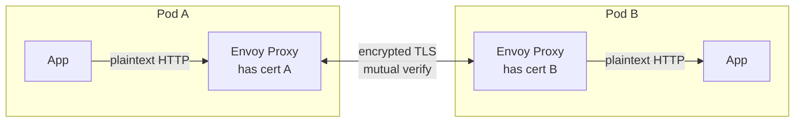
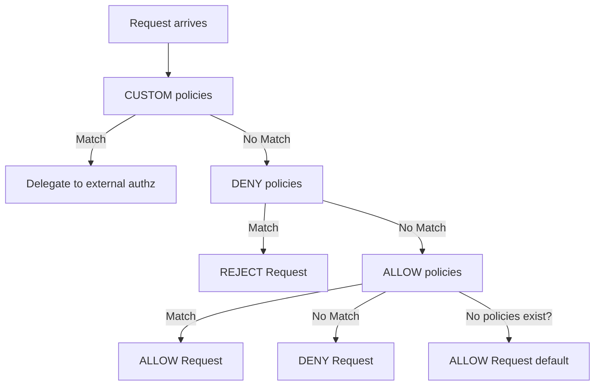
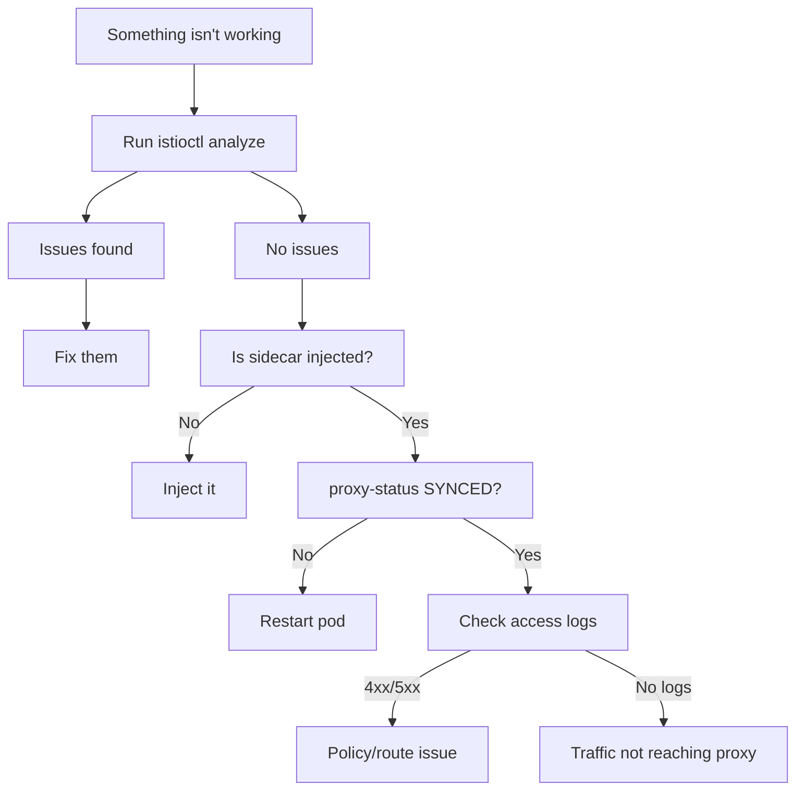
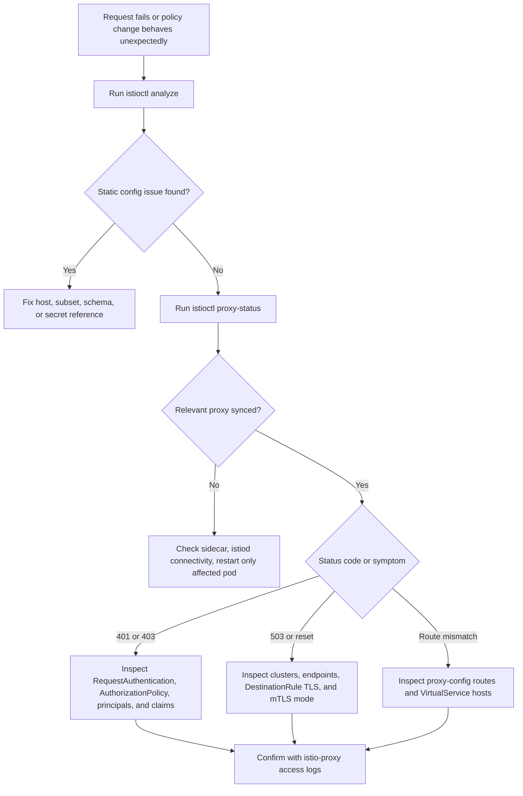

> **Complexity:** `[COMPLEX]`
> **Time to Complete:** `70-90 minutes`
> **Kubernetes version:** `1.35+`

---

## Prerequisites

Before starting this module, you should be comfortable reading Istio custom resources, following traffic through an injected sidecar, and translating a failed HTTP request into a hypothesis about identity, routing, or policy. The module assumes you have already worked through the earlier ICA modules and can run `kubectl` and `istioctl` against a disposable Kubernetes 1.35+ cluster without needing command-by-command orientation.

- [Module 1: Installation & Architecture](../module-1.1-istio-installation-architecture/) — istiod, Envoy, sidecar injection
- [Module 2: Traffic Management](../module-1.2-istio-traffic-management/) — VirtualService, DestinationRule, Gateway
- Basic understanding of TLS, JWT tokens, and RBAC concepts

---

## Learning Outcomes

After completing this module, you will be able to connect symptoms to the right Istio security layer, apply policies in a controlled sequence, and prove the result from proxy state rather than trusting that YAML was accepted by the Kubernetes API server. Each outcome is intentionally testable in the quiz or hands-on exercise because the ICA exam expects operational reasoning, not memorized manifest fragments.

1. **Diagnose** mTLS handshake failures, rejected requests, and complex policy conflicts using `istioctl analyze` and Envoy access logs.
2. **Implement** PeerAuthentication policies to enforce mutual TLS systematically across distributed namespaces and workloads reliably.
3. **Design** fine-grained AuthorizationPolicy rules that securely integrate JWT validation and role-based access controls for deep defense.
4. **Evaluate** complex proxy states using `istioctl proxy-status` and `proxy-config` to identify critical synchronization anomalies.
5. **Compare** STRICT and PERMISSIVE mTLS modes to formulate completely safe migration strategies for sensitive legacy services.

---

## Why This Module Matters

Hypothetical scenario: your team enables STRICT mTLS for a namespace after several weeks of successful traffic-management work, and the first visible symptom is not a helpful policy error but a flood of `connection reset by peer`, `503 no healthy upstream`, and `403 Forbidden` responses. The Kubernetes Services still exist, the Deployments still report ready replicas, and the application logs may show only timeout handling. In a mesh, the failing component is often the policy or proxy layer between two healthy Pods, which means ordinary application debugging can waste time unless you know where Istio makes each decision.

Istio security is powerful because it moves authentication, encryption, and authorization out of each application and into a consistent data-plane layer. That same separation is also why failures feel indirect: the app did not reject the request, the local Envoy proxy did after combining PeerAuthentication, RequestAuthentication, AuthorizationPolicy, DestinationRule, Gateway, and xDS state. The operational skill is learning to ask which layer made the decision, then proving that answer with `istioctl analyze`, `istioctl proxy-status`, `istioctl proxy-config`, and Envoy access logs.

Security and troubleshooting are tightly coupled on the ICA exam because secure configuration is only useful when you can keep it understandable under pressure. A correct AuthorizationPolicy can still become an outage if it silently blocks kubelet probes, an mTLS migration can still fail if one workload lacks a sidecar, and a Gateway can still terminate TLS incorrectly if its credential reference is in the wrong namespace. This module teaches the mental model first, then uses the original hands-on assets to practice controlled changes, deliberate breakage, and evidence-based repair.

> **Building security analogy**
>
> Istio security works like a modern high-security office building. **PeerAuthentication** is the lock on the service door because it decides whether the destination workload accepts plaintext, mTLS, or both. **RequestAuthentication** is the badge reader because it validates a JWT if a client presents one, but it does not decide which room the badge holder may enter. **AuthorizationPolicy** is the access-control rulebook because it combines peer identity, request identity, HTTP attributes, and custom authorization results into the final allow or deny decision.

Exercise scenario: a platform engineer wants to enable mTLS across the entire production mesh and starts with a mesh-wide PeerAuthentication resource in `istio-system`. The manifest is syntactically valid, but one critical dependency still communicates from outside the mesh and therefore cannot present an Istio-issued workload certificate. The lesson is not that STRICT mode is unsafe; the lesson is that STRICT mode is a server-side promise that every required caller can complete the mutual TLS handshake.

```yaml
apiVersion: security.istio.io/v1
kind: PeerAuthentication
metadata:
  name: default
  namespace: istio-system
spec:
  mtls:
    mode: STRICT
```

The safer migration starts by accepting both encrypted and plaintext traffic while you inventory which workloads actually have sidecars and which ports still represent legacy paths. PERMISSIVE mode is useful because it gives you time to observe traffic without breaking callers, but it is not the destination for sensitive service-to-service paths. As soon as the inventory is clear, you move enforcement closer to the workload or namespace where you can validate both clients and dependencies.

```yaml
# Step 1: Start with PERMISSIVE (accepts both mTLS and plaintext)
apiVersion: security.istio.io/v1
kind: PeerAuthentication
metadata:
  name: default
  namespace: istio-system
spec:
  mtls:
    mode: PERMISSIVE

# Step 2: Identify services without sidecars
# istioctl proxy-status  (shows which pods have proxies)

# Step 3: Exclude specific ports or services
apiVersion: security.istio.io/v1
kind: PeerAuthentication
metadata:
  name: default
  namespace: istio-system
spec:
  mtls:
    mode: STRICT
  portLevelMtls:
    8080:
      mode: DISABLE    # Legacy service port

# Step 4: Or apply STRICT per-namespace, not mesh-wide
apiVersion: security.istio.io/v1
kind: PeerAuthentication
metadata:
  name: default
  namespace: payments  # Only this namespace
spec:
  mtls:
    mode: STRICT
```

The hard lesson is to treat mesh security as a rollout, not a toggle. Start with PERMISSIVE where unknown callers exist, use `istioctl proxy-status` to verify that expected workloads have connected Envoy proxies, apply STRICT at a namespace or workload boundary, and use port-level exceptions only for explicitly documented legacy interfaces. Pause and predict: if you enable STRICT on the destination but the source has no sidecar, which side will reject the connection, and what evidence would you expect in proxy status or logs?

---

## Part 1: Mutual TLS (mTLS) Deep Dive

### 1.1 How mTLS Works in Istio

At its core, mTLS provides mutual authentication between two workloads, not merely encryption between two IP addresses. Each side proves its identity with a certificate issued for its Kubernetes service account, and the Envoy sidecars complete the handshake before the application container receives ordinary plaintext HTTP or gRPC. This split is important operationally because the application might be healthy while the proxy refuses the connection, so a failed request can be a security decision rather than an application crash.

```
Without mTLS:
Pod A ──── plaintext HTTP ────► Pod B
         (anyone can intercept)

With mTLS:
Pod A                                    Pod B
┌──────────────┐                        ┌──────────────┐
│ App          │                        │ App          │
│  ↓           │                        │  ↑           │
│ Envoy Proxy  │◄── encrypted TLS ────►│ Envoy Proxy  │
│ (has cert A) │    (mutual verify)     │ (has cert B) │
└──────────────┘                        └──────────────┘

Both sides verify each other's identity via SPIFFE certificates
issued by istiod's built-in CA.
```

The same flow appears below as a Mermaid diagram because it helps separate application traffic from sidecar-to-sidecar transport. Notice that the application containers do not need TLS libraries, private keys, or per-service certificate reload logic; Istio centralizes that responsibility in the data plane and distributes identity through the control plane.



**Certificate identity formulation**: Each individual workload automatically receives a unique SPIFFE (Secure Production Identity Framework for Everyone) identity. This standard allows systems to securely identify each other:

```
spiffe://cluster.local/ns/default/sa/reviews
         └─ trust domain  └─ namespace  └─ service account
```

Stop and think: why would a legacy application without a sidecar fail to communicate with a mesh workload when `STRICT` mode is enabled? The destination proxy is not checking whether the source Pod is important to the business; it is checking whether the incoming connection can prove a trusted workload identity, so a caller without Envoy cannot present the expected Istio certificate.

### 1.2 PeerAuthentication Configuration

PeerAuthentication resources dictate the inbound mTLS behavior for workloads residing in the mesh, which makes them server-side enforcement policies rather than client-side routing hints. A common mistake is to assume that enabling a policy makes every client automatically speak mTLS, but the actual enforcement point is the destination Envoy listener. The destination decides whether it will accept plaintext, require mutual TLS, or inherit a parent policy, while client behavior is either auto-detected by Istio or influenced by DestinationRule TLS settings.

The mesh-wide example is powerful because a policy named `default` in `istio-system` establishes the broadest baseline. Use this only after you have measured mesh participation because it changes the acceptance rule for every workload that does not have a more specific namespace or workload policy.

```yaml
apiVersion: security.istio.io/v1
kind: PeerAuthentication
metadata:
  name: default
  namespace: istio-system        # Mesh-wide when in istio-system
spec:
  mtls:
    mode: STRICT                 # Require mTLS for all services
```

The namespace-level example is the safer next step for most migrations because it limits the blast radius to one team or one application boundary. It is also easier to explain during an incident because the policy's namespace matches the destination workloads affected by the rule.

```yaml
apiVersion: security.istio.io/v1
kind: PeerAuthentication
metadata:
  name: default
  namespace: payments            # Only affects this namespace
spec:
  mtls:
    mode: STRICT
```

The workload-level example narrows enforcement to Pods selected by label, which is useful when one service in a namespace can be hardened before its neighbors. Label selection is also where configuration drift becomes dangerous, so verify labels with `kubectl get pod --show-labels` before assuming the policy targets what you intended.

```yaml
apiVersion: security.istio.io/v1
kind: PeerAuthentication
metadata:
  name: reviews-mtls
  namespace: default
spec:
  selector:
    matchLabels:
      app: reviews               # Only affects pods with this label
  mtls:
    mode: STRICT
```

The port-level example is a surgical override for the rare case where a workload has both mesh-native and legacy-facing ports. Treat it as temporary technical debt: it should name the exact port that cannot yet use mTLS, and it should be tracked so the exception does not become invisible platform behavior.

```yaml
apiVersion: security.istio.io/v1
kind: PeerAuthentication
metadata:
  name: reviews-mtls
  namespace: default
spec:
  selector:
    matchLabels:
      app: reviews
  mtls:
    mode: STRICT
  portLevelMtls:
    8080:
      mode: DISABLE              # Disable mTLS on port 8080 only
```

The modes table summarizes the behavior you are choosing when you write the policy. The important exam distinction is that `STRICT` is a rejection rule for plaintext inbound traffic, while `PERMISSIVE` is a migration rule that accepts both mTLS and plaintext until you can prove every required path is mesh-ready.

| Mode | Behavior | Use Case |
|------|----------|----------|
| `STRICT` | Only accepts mTLS traffic | Production (full encryption) |
| `PERMISSIVE` | Accepts both mTLS and plaintext | Migration period |
| `DISABLE` | No mTLS | Legacy services, debugging |
| `UNSET` | Inherits from parent | Default behavior |

When several PeerAuthentication resources could apply, Istio resolves them by specificity rather than by creation time. This priority model protects a workload-specific exception from being overwritten by a namespace or mesh baseline, but it also means you need to search for selectors when a workload behaves differently from the rest of its namespace.

```
Workload-level  >  Namespace-level  >  Mesh-level
(selector)         (namespace)          (istio-system)
```

### 1.3 DestinationRule TLS Settings

While PeerAuthentication controls the *server* side acceptance rules, DestinationRule can control the *client* side outbound transmission behavior. Modern Istio usually auto-detects when an in-mesh destination should use `ISTIO_MUTUAL`, but explicit DestinationRule TLS settings still matter when you need to override defaults, originate TLS to an external service, or diagnose why a client proxy is not forming the expected upstream cluster.

```yaml
apiVersion: networking.istio.io/v1
kind: DestinationRule
metadata:
  name: reviews
spec:
  host: reviews
  trafficPolicy:
    tls:
      mode: ISTIO_MUTUAL          # Use Istio's mTLS certs
```

DestinationRule TLS modes describe the client-side origination choice, not the destination's willingness to accept the connection. This is why mTLS troubleshooting often requires checking both sides: a destination may require STRICT mTLS while the source proxy has a stale or incorrect cluster configuration.

| Mode | Description |
|------|-------------|
| `DISABLE` | No TLS |
| `SIMPLE` | Originate TLS (client verifies server) |
| `MUTUAL` | Originate mTLS (both verify each other) |
| `ISTIO_MUTUAL` | Use Istio's built-in mTLS certificates |

Exam tip: in the vast majority of in-mesh cases, you do not need to set the DestinationRule TLS mode explicitly because Istio can use auto mTLS for eligible destinations. You should reach for explicit TLS settings when you are intentionally overriding the default, integrating with an external service, or proving a client-side cluster configuration during troubleshooting. Before running this, what output do you expect from `istioctl proxy-config clusters` if the source proxy has already received an `ISTIO_MUTUAL` cluster for the destination?

---

## Part 2: Request Authentication (JWT) Implementation

RequestAuthentication resources validate JSON Web Tokens attached to incoming requests, but they deliberately stop short of making authorization decisions. That design keeps cryptographic validation separate from access control: one object answers "is this token valid for the configured issuer," while another object answers "is this request allowed to reach this workload." The distinction is subtle enough to cause real operational surprises because a request with an invalid token is rejected, while a request with no token can still pass unless an AuthorizationPolicy requires an authenticated request principal.

### 2.1 Basic JWT Validation Mechanics

When implementing a RequestAuthentication policy, you provide the issuer and the public key endpoint so the proxy can cryptographically verify the signature of incoming JWTs. Envoy uses that public key material to validate token structure, issuer, signature, and expiry before forwarding the request upstream. If you configure multiple rules, the proxy can accept tokens from multiple issuers, which is useful during identity-provider migrations but dangerous if old issuers remain trusted longer than intended.

```yaml
apiVersion: security.istio.io/v1
kind: RequestAuthentication
metadata:
  name: jwt-auth
  namespace: default
spec:
  selector:
    matchLabels:
      app: productpage
  jwtRules:
  - issuer: "https://accounts.google.com"
    jwksUri: "https://www.googleapis.com/oauth2/v3/certs"
  - issuer: "https://my-auth.example.com"
    jwksUri: "https://my-auth.example.com/.well-known/jwks.json"
    forwardOriginalToken: true     # Forward JWT to upstream
    outputPayloadToHeader: "x-jwt-payload"  # Extract claims to header
```

The RequestAuthentication step has three practical outcomes that are worth memorizing because they explain most confusing JWT failures:
1. If a request arrives bearing a JWT, it meticulously validates it (checking issuer, structural signature, and active expiry status).
2. If the attached JWT is fundamentally invalid, it immediately rejects the request with an HTTP 401 Unauthorized response.
3. If the request arrives with NO JWT at all, **it allows the request to pass through completely unhindered** (this deeply surprises many engineers!).

To actually *require* the presence of a valid JWT, you must deploy a corresponding AuthorizationPolicy. That extra policy usually matches `requestPrincipals` when you want to allow only authenticated requests, or `notRequestPrincipals` in a DENY rule when you want to reject missing identity before considering more specific ALLOW rules. Keep the two resources separate in your mental model: RequestAuthentication creates verified request identity, and AuthorizationPolicy consumes that identity.

### 2.2 JWT with Claim-Based Routing

You can extract internal JWT claims and project them into HTTP headers for downstream authorization or routing logic. This is useful when an application needs a normalized identity attribute but should not parse the whole token itself, and it is also useful when a routing policy needs to branch on a claim such as group, tenant, or subject. The tradeoff is exposure: once claims are copied into headers, you must ensure that only the proxy can set or trust those headers.

```yaml
apiVersion: security.istio.io/v1
kind: RequestAuthentication
metadata:
  name: jwt-auth
  namespace: default
spec:
  selector:
    matchLabels:
      app: frontend
  jwtRules:
  - issuer: "https://auth.example.com"
    jwksUri: "https://auth.example.com/.well-known/jwks.json"
    outputClaimToHeaders:
    - header: x-jwt-sub
      claim: sub
    - header: x-jwt-groups
      claim: groups
```

This extraction process bridges the gap between raw cryptographic validation and business-level application logic. It should not become a substitute for application authorization when domain rules are complex, but it is effective for coarse-grained enforcement at the mesh edge. Which approach would you choose here and why: require a token at the ingress gateway only, require it again on the backend workload, or combine both with different policies for north-south and east-west traffic?

---

## Part 3: Authorization Policy Design

AuthorizationPolicy is Istio's final access-control mechanism, and it becomes the place where peer identity, request identity, HTTP method, path, namespace, IP range, and external authorization results are combined into an allow or deny decision. The rule language is expressive enough to model most service-to-service boundaries, but the default behavior changes depending on which policy actions exist. That is why policy design should start with the evaluation order before it starts with YAML snippets.

### 3.1 Policy Actions Evaluation Hierarchy

Understanding the exact evaluation sequence is crucial to preventing accidental lockouts or security breaches. Istio checks CUSTOM policies first, then DENY policies, and finally ALLOW policies, with a default allow only when no applicable AuthorizationPolicy exists for the workload. Once any ALLOW policy applies to a workload, traffic that does not match an ALLOW rule is denied, which is an intentional zero-trust behavior but a common source of surprise.

```
Request arrives
     │
     ▼
┌─ CUSTOM policies ─┐  (if any, checked first via external authz)
│  Match? → delegate │
└────────────────────┘
     │
     ▼
┌─── DENY policies ──┐  (checked second)
│  Match? → REJECT   │
└─────────────────────┘
     │
     ▼
┌── ALLOW policies ──┐  (checked third)
│  Match? → ALLOW    │
│  No match? → DENY  │  ← If ANY allow policy exists, default is deny
└─────────────────────┘
     │
     ▼
  No policies? → ALLOW (default)
```

The logical flowchart below captures the same ordering in a form you can use during incident triage. If you see a `403`, do not jump straight to the ALLOW rule you just edited; first ask whether a DENY or CUSTOM policy matched earlier and short-circuited the request.



Critical security warning: if there are no AuthorizationPolicies defined for a particular workload, all traffic is permitted by default. However, the exact moment you instantiate any applicable ALLOW policy, all traffic that does not explicitly match an ALLOW rule is automatically denied. Pause and predict: if you apply an ALLOW policy to a workload that permits traffic from the `frontend` service, what happens to critical health-check requests originating from the Kubernetes kubelet, and how would you verify whether probes are affected?

### 3.2 ALLOW Policy Fundamentals

An ALLOW policy explicitly permits selected traffic patterns while defaulting the rest to a denied state for the selected workload. This is the right model for sensitive services because it makes the intended callers visible, but it requires you to think about non-user traffic such as probes, metrics scraping, batch jobs, and administrative endpoints. In reviews, read the selector first, then read the source identities and operations, because a perfect rule on the wrong workload is still the wrong rule.

```yaml
apiVersion: security.istio.io/v1
kind: AuthorizationPolicy
metadata:
  name: allow-reviews
  namespace: default
spec:
  selector:
    matchLabels:
      app: reviews
  action: ALLOW
  rules:
  - from:
    - source:
        principals: ["cluster.local/ns/default/sa/productpage"]
    to:
    - operation:
        methods: ["GET"]
        paths: ["/reviews/*"]
```

This highly specific policy allows HTTP GET requests to the `/reviews/*` endpoint from the `productpage` service account and denies everything else that reaches the selected reviews workload. The principal string is derived from the SPIFFE identity, so it couples namespace and service account rather than Pod name or Deployment name. That coupling is a strength because Pods churn constantly, but it also means a service account rename can become an authorization outage.

### 3.3 DENY Policy Usage

A DENY policy acts as a high-priority rejection rule. Because it is evaluated before ALLOW policies, it is useful for blocking known-dangerous paths, namespaces, or IP ranges even when a broader ALLOW policy would otherwise permit the request. Use DENY sparingly and document it clearly, because a matching DENY can make a correct ALLOW policy look broken until you remember the evaluation order.

```yaml
apiVersion: security.istio.io/v1
kind: AuthorizationPolicy
metadata:
  name: deny-external
  namespace: default
spec:
  selector:
    matchLabels:
      app: internal-api
  action: DENY
  rules:
  - from:
    - source:
        notNamespaces: ["default", "backend"]
    to:
    - operation:
        paths: ["/admin/*"]
```

This directive denies any request aimed at the `/admin/*` endpoint on the selected internal API when the request originates outside the listed namespace boundaries. It is a useful pattern for administrative paths, but it should be paired with logs and tests so teams can distinguish intentional rejection from accidental lockout. When debugging, look for the path, method, source namespace, and response flag in the proxy access log before changing the policy.

### 3.4 Require JWT Integration (Combining Policies)

Because RequestAuthentication alone does not inherently require a token to be present, you must combine it with an explicit AuthorizationPolicy to enforce secure token presence across your architecture. The two-step process below first validates a token if one exists, then rejects requests that do not produce a request principal. This pattern is especially common at ingress gateways and public-facing APIs where anonymous requests should not reach the application at all.

```yaml
# Step 1: Validate JWT if present
apiVersion: security.istio.io/v1
kind: RequestAuthentication
metadata:
  name: require-jwt
  namespace: default
spec:
  selector:
    matchLabels:
      app: productpage
  jwtRules:
  - issuer: "https://auth.example.com"
    jwksUri: "https://auth.example.com/.well-known/jwks.json"
```

```yaml
# Step 2: DENY requests without valid JWT
apiVersion: security.istio.io/v1
kind: AuthorizationPolicy
metadata:
  name: require-jwt
  namespace: default
spec:
  selector:
    matchLabels:
      app: productpage
  action: DENY
  rules:
  - from:
    - source:
        notRequestPrincipals: ["*"]   # No valid JWT principal = deny
```

### 3.5 Namespace-Level Policies and Deny-All

You can apply policies broadly to an entire namespace to establish a baseline security posture, but broad policies are where small YAML mistakes have the largest operational effect. A namespace-level ALLOW policy can intentionally create a same-namespace boundary, while an empty policy can create a deny-all posture that must be opened with additional policies. Use these patterns when a team owns the whole namespace and agrees that services should not be reachable until explicitly allowed.

```yaml
# Allow all traffic within the namespace
apiVersion: security.istio.io/v1
kind: AuthorizationPolicy
metadata:
  name: allow-same-namespace
  namespace: backend
spec:
  action: ALLOW
  rules:
  - from:
    - source:
        namespaces: ["backend"]
```

```yaml
# Deny all traffic (explicit deny-all)
apiVersion: security.istio.io/v1
kind: AuthorizationPolicy
metadata:
  name: deny-all
  namespace: backend
spec:
  {}                               # Empty spec = deny all
```

### 3.6 Common AuthorizationPolicy Patterns

Mastering these common syntactical patterns will speed up policy authoring, but the deeper skill is knowing what each pattern proves. Method and path rules prove HTTP intent, principal rules prove workload identity, claim rules prove authenticated request identity, and IP rules prove network origin only as seen by the proxy. Combine them when you need defense in depth, and avoid combining them when a simpler principal-based rule is easier to test and maintain.

The following snippets are deliberately small so you can recognize the matching fields inside larger policies. Read each as a reusable fragment rather than a complete policy; the selector and action still determine where and how the fragment applies.

#### Allow specific HTTP methods strictly

```yaml
rules:
- to:
  - operation:
      methods: ["GET", "HEAD"]
```

#### Allow explicitly from strictly defined service accounts

```yaml
rules:
- from:
  - source:
      principals: ["cluster.local/ns/frontend/sa/webapp"]
```

#### Allow dynamically based on embedded JWT claims

```yaml
rules:
- from:
  - source:
      requestPrincipals: ["https://auth.example.com/*"]
  when:
  - key: request.auth.claims[role]
    values: ["admin"]
```

#### Allow strictly from specific IP CIDR blocks

```yaml
rules:
- from:
  - source:
      ipBlocks: ["10.0.0.0/8"]
```

---

## Part 4: TLS at Ingress

Securing the ingress gateway edge is where mesh security meets ordinary client-facing TLS. Inside the mesh, workload identity is normally represented by Istio-issued SPIFFE certificates; at the edge, users and external systems usually expect public DNS names, browser-trusted certificates, and sometimes client certificate authentication. Treat the ingress Gateway as a separate security boundary because it has to translate internet-facing TLS requirements into mesh routing decisions without weakening the policies that protect internal services.

### 4.1 Simple TLS Configuration (Server Certificate Only)

In SIMPLE mode, the client verifies the identity of the server, but the server does not demand a certificate back from the client. This is the normal HTTPS model for browser traffic and many public APIs: the gateway presents a certificate for `app.example.com`, the client verifies that certificate chain, and Istio forwards accepted requests through the configured Gateway and VirtualService path. The secret reference is operationally important because the gateway cannot terminate TLS if the credential is missing, malformed, or created in the wrong namespace for the deployment model.

First, inject your TLS material into the appropriate system namespace. In production you would normally automate certificate issuance and renewal, but the command below preserves the mechanical shape of the secret that the Gateway expects.

```bash
# Create TLS secret
kubectl create -n istio-system secret tls my-tls-secret \
  --key=server.key \
  --cert=server.crt
```

Next, reference it within your edge Gateway. The `credentialName` value must match the Kubernetes Secret name because Envoy receives the certificate material from Istio's secret distribution path, not from a file path inside your application container.

```yaml
apiVersion: networking.istio.io/v1
kind: Gateway
metadata:
  name: secure-gateway
spec:
  selector:
    istio: ingressgateway
  servers:
  - port:
      number: 443
      name: https
      protocol: HTTPS
    hosts:
    - "app.example.com"
    tls:
      mode: SIMPLE
      credentialName: my-tls-secret
```

### 4.2 Mutual TLS at Ingress (Client Certificates)

In MUTUAL mode, the gateway demands that the connecting client present a valid certificate, creating a fully authenticated two-way bridge at the edge. This is common for partner APIs, internal corporate clients, and machine-to-machine integrations where possession of a trusted client certificate is part of the access contract. It is not a replacement for AuthorizationPolicy inside the mesh; it authenticates the external TLS client at the gateway, while internal service access may still need workload identity, JWT claims, or path-specific policy.

```bash
# Create secret with CA cert for client verification
kubectl create -n istio-system secret generic my-mtls-secret \
  --from-file=tls.key=server.key \
  --from-file=tls.crt=server.crt \
  --from-file=ca.crt=ca.crt
```

```yaml
apiVersion: networking.istio.io/v1
kind: Gateway
metadata:
  name: mtls-gateway
spec:
  selector:
    istio: ingressgateway
  servers:
  - port:
      number: 443
      name: https
      protocol: HTTPS
    hosts:
    - "secure.example.com"
    tls:
      mode: MUTUAL                    # Require client certificate
      credentialName: my-mtls-secret
```

---

## Part 5: Systematic Troubleshooting

When a service mesh fails, the symptom is often separated from the cause by several layers of generated proxy configuration. A 403 can come from a DENY policy, an ALLOW policy defaulting everything else to deny, a missing JWT principal, or an external authorization service; a 503 can come from an undefined subset, an empty endpoint list, a stale proxy, or a healthy upstream that is unreachable because mTLS negotiation failed. A systematic approach prevents you from rewriting random manifests while the real signal is already visible in Istio analysis output or Envoy configuration.

### 5.1 istioctl analyze

`istioctl analyze` is the first command you should run when something is not working as expected because it checks Kubernetes and Istio resources together before you chase runtime symptoms. It catches errors such as references to missing hosts, undefined subsets, invalid schemas, and gateway credential problems that are easy to miss during manual YAML review. It does not prove that live traffic is healthy, but it narrows the problem space quickly and often explains why a proxy never received the configuration you expected.

```bash
# Analyze all namespaces
istioctl analyze --all-namespaces

# Analyze specific namespace
istioctl analyze -n default

# Analyze a specific file before applying
istioctl analyze my-virtualservice.yaml

# Common warnings/errors:
# IST0101: Referenced host not found
# IST0104: Gateway references missing secret
# IST0106: Schema validation error
# IST0108: Unknown annotation
# IST0113: VirtualService references undefined subset
```

### 5.2 istioctl proxy-status

After static analysis, check whether the distributed proxies are connected to istiod and fundamentally in sync with the control plane. `istioctl proxy-status` gives you a mesh-wide synchronization view across xDS resources, which is exactly what you need when one workload seems to ignore a recent policy or route. A stale proxy can make a fixed manifest appear broken because the local Envoy process has not acknowledged the latest configuration.

```bash
istioctl proxy-status
```

The output interpretation matters because the status columns map to different parts of Envoy behavior. A proxy can have routes synchronized while endpoints are stale, or listeners synchronized while clusters are wrong, so avoid reducing the whole table to a single healthy or unhealthy label.

```
NAME                              CDS    LDS    EDS    RDS    ECDS   ISTIOD
productpage-v1-xxx.default        SYNCED SYNCED SYNCED SYNCED SYNCED istiod-xxx
reviews-v1-xxx.default            SYNCED SYNCED SYNCED SYNCED SYNCED istiod-xxx
ratings-v1-xxx.default            STALE  SYNCED SYNCED SYNCED SYNCED istiod-xxx  ← Problem!
```

| Status | Meaning | Action |
|--------|---------|--------|
| `SYNCED` | Proxy has latest config from istiod | Normal |
| `NOT SENT` | istiod hasn't sent config (no changes) | Usually normal |
| `STALE` | Proxy hasn't acknowledged latest config | Investigate — restart pod or check connectivity |

Decoding the xDS config types gives you the vocabulary for deeper debugging. When an upstream service is missing, think CDS or EDS; when an HTTP path is routed incorrectly, think RDS; when traffic does not reach the application port at all, think LDS.

| Type | Full Name | What It Configures |
|------|----------|-------------------|
| CDS | Cluster Discovery Service | Upstream clusters (services) |
| LDS | Listener Discovery Service | Inbound/outbound listeners |
| EDS | Endpoint Discovery Service | Endpoints (pod IPs) |
| RDS | Route Discovery Service | HTTP routing rules |
| ECDS | Extension Config Discovery | WASM extensions |

### 5.3 istioctl proxy-config

The `istioctl proxy-config` suite lets you inspect what the Envoy proxy is actually configured to execute under the hood. This is the decisive step when Kubernetes objects look correct but runtime behavior disagrees, because the proxy config is the compiled result that Envoy will enforce. The goal is not to memorize every JSON field; the goal is to know which view answers your current question.

```bash
# List all clusters (upstream services) for a pod
istioctl proxy-config clusters productpage-v1-xxx.default

# List listeners (what ports Envoy is listening on)
istioctl proxy-config listeners productpage-v1-xxx.default

# List routes (HTTP routing rules)
istioctl proxy-config routes productpage-v1-xxx.default

# List endpoints (actual pod IPs)
istioctl proxy-config endpoints productpage-v1-xxx.default

# Show the full Envoy config dump
istioctl proxy-config all productpage-v1-xxx.default -o json

# Filter by specific service
istioctl proxy-config endpoints productpage-v1-xxx.default \
  --cluster "outbound|9080||reviews.default.svc.cluster.local"
```

### 5.4 Envoy Access Logs

Enabling proxy access logs is essential for visualizing each request as it flows through the abstracted mesh layers. Access logs show status codes, response flags, upstream clusters, request paths, duration, and authority values that often tell you whether the request reached the proxy, matched a route, reached an upstream, or failed at a policy boundary. Because logs can be noisy, enable a format and retention strategy that fit your environment rather than leaving raw debug output as your only incident tool.

```bash
# Enable via mesh config
istioctl install --set meshConfig.accessLogFile=/dev/stdout -y

# View logs for a specific pod's sidecar
kubectl logs productpage-v1-xxx -c istio-proxy

# Sample log entry:
# [2024-01-15T10:30:00.000Z] "GET /reviews/1 HTTP/1.1" 200 - via_upstream
#   - 0 325 45 42 "-" "curl/7.68.0" "xxx" "reviews:9080"
#   "10.244.0.15:9080" outbound|9080||reviews.default.svc.cluster.local
#   10.244.0.10:50542 10.96.10.15:9080 10.244.0.10:50540
```

The log format breakdown below is not just a reference; it is a checklist for interpretation. If there are no logs, traffic may not be reaching the proxy; if logs show 4xx responses, focus on authentication and authorization; if logs show 5xx or upstream flags, inspect clusters, endpoints, and mTLS.

```
[timestamp] "METHOD PATH PROTOCOL" STATUS_CODE FLAGS
  - REQUEST_BYTES RESPONSE_BYTES DURATION_MS UPSTREAM_DURATION
  "USER_AGENT" "REQUEST_ID" "AUTHORITY"
  "UPSTREAM_HOST" UPSTREAM_CLUSTER
  DOWNSTREAM_LOCAL DOWNSTREAM_REMOTE DOWNSTREAM_PEER
```

### 5.5 Common Issues and Methodical Fixes

The table below preserves the common failure modes from the original module, but you should read it as a diagnostic map rather than a list of unrelated facts. Each row connects one visible symptom to one command that can confirm the hypothesis, then to the smallest safe fix. In an incident, that discipline keeps the first repair small enough to validate before you change the next layer.

| Issue | Symptoms | Diagnostic | Fix |
|-------|----------|-----------|-----|
| Missing sidecar | Service not in mesh, no mTLS | `kubectl get pod -o jsonpath='{.spec.containers[*].name}'` | Label namespace + restart pods |
| VirtualService not applied | Traffic ignores routing rules | `istioctl analyze` (IST0113) | Check hosts match, gateway reference exists |
| mTLS STRICT with non-mesh service | `connection reset by peer` | `istioctl proxy-status` (missing pod) | Use PERMISSIVE or add sidecar |
| Stale proxy config | Old routing rules in effect | `istioctl proxy-status` (STALE) | Restart the pod |
| Gateway TLS misconfigured | TLS handshake failure | `istioctl analyze` (IST0104) | Check credentialName matches K8s Secret |
| AuthorizationPolicy blocking | 403 Forbidden | `kubectl logs <pod> -c istio-proxy` | Check RBAC filters in access logs |
| Subset not defined | 503 `no healthy upstream` | `istioctl analyze` (IST0113) | Create DestinationRule with matching subsets |
| Port name wrong | Protocol detection fails | `kubectl get svc -o yaml` (check port names) | Name ports as `http-api`, `grpc-api`, `tcp-api` |

### 5.6 Debugging Workflow

When something in your mesh inevitably stops working, follow this workflow in order unless you already have a stronger piece of evidence. The sequence starts with cheap static checks, then confirms proxy synchronization, then reads the exact route and upstream state, and only then changes configuration. Before running the second step, predict what you should see if the workload is missing a sidecar; that prediction helps you avoid interpreting an absent proxy as a stale one.

```
Step 1: istioctl analyze -n <namespace>
        → Catches 80% of misconfigurations

Step 2: istioctl proxy-status
        → Is the proxy connected? Is config synced?

Step 3: istioctl proxy-config routes <pod>
        → Does the proxy have the expected routing rules?

Step 4: kubectl logs <pod> -c istio-proxy
        → What does the access log show? 4xx? 5xx? Timeout?

Step 5: istioctl proxy-config clusters <pod>
        → Can the proxy see the upstream service?

Step 6: istioctl proxy-config endpoints <pod> --cluster <cluster>
        → Are there healthy endpoints?
```

```
                  Debugging Decision Tree

                 Something isn't working
                         │
                         ▼
              Run istioctl analyze
                   │          │
              Issues found    No issues
                   │          │
              Fix them        ▼
                         Is sidecar injected?
                           │          │
                          No          Yes
                           │          │
                    Inject it         ▼
                                proxy-status SYNCED?
                                  │          │
                                 No          Yes
                                  │          │
                           Restart pod       ▼
                                       Check access logs
                                         │          │
                                       4xx/5xx    No logs
                                         │          │
                                    Policy/route  Traffic not
                                    issue        reaching proxy
```

The decision flow below repeats the workflow visually for exam practice and operational runbooks. The most important branch is the split between "proxy has bad evidence" and "traffic never reached the proxy," because those failures require different owners and different tools.



### 5.7 Worked Example: Separating Policy Failure from Routing Failure

Imagine a learner reports that `productpage` can no longer call `reviews`, but they do not yet know whether the symptom is security or routing. Start by asking for the observable response. A `403` points you toward AuthorizationPolicy, RequestAuthentication, or external authorization, while a `503` points you toward route selection, subsets, clusters, endpoints, or upstream health. The exact status code is not everything, but it is enough to choose the next diagnostic branch.

If the response is `403`, inspect the selected AuthorizationPolicies before changing any VirtualService. Confirm whether an applicable DENY rule matches first, then check whether an ALLOW policy exists and fails to include the caller's principal, method, or path. The strongest evidence is an access log entry from the destination sidecar that shows the denied request, because it proves the request reached Envoy and was rejected at the policy layer rather than disappearing in service discovery.

If the response is `503`, pivot to route and endpoint evidence. Run `istioctl analyze` to catch an undefined subset, then inspect the client proxy routes to see whether Envoy has the expected route, and finally inspect endpoints for the upstream cluster. This order keeps you from editing authorization rules when the proxy simply has no healthy target for the route that matched the request.

The same habit applies to mTLS migration. A plaintext caller rejected by STRICT PeerAuthentication may look like a networking problem from the application perspective, but the right evidence is sidecar presence, proxy synchronization, and mTLS-capable cluster configuration. When you can explain why each command belongs to a layer, your troubleshooting becomes faster because every result either confirms or eliminates one class of failure.

Keep a small incident note while you troubleshoot: symptom, first command, observed evidence, and next hypothesis. That note prevents duplicated checks when another operator joins, and it gives you a clean explanation for why the final fix was a policy edit, a route edit, a sidecar restart, or an mTLS migration rollback.

---

## Patterns & Anti-Patterns

Strong Istio security implementations share a rollout shape: they begin with observation, move enforcement toward the smallest boundary that can be tested, and only then generalize the policy. That does not mean security should be slow; it means the first policy should be paired with a way to prove who it affects. In a mesh, proof comes from sidecar presence, xDS synchronization, access logs, and a narrow request that demonstrates the intended allow or deny path.

| Pattern | When to Use It | Why It Works | Scaling Consideration |
|---------|----------------|--------------|-----------------------|
| PERMISSIVE-to-STRICT migration | You have unknown callers, mixed sidecar coverage, or legacy dependencies | It accepts both plaintext and mTLS while you inventory real traffic and then hardens one boundary at a time | Track every exception and convert namespace policies to workload policies when only one service still needs flexibility |
| RequestAuthentication plus AuthorizationPolicy | You need JWT validation and enforcement rather than best-effort token checking | RequestAuthentication validates the token while AuthorizationPolicy requires and consumes the resulting request principal | Keep issuers and JWKS URIs owned by platform or identity teams so stale issuers do not linger |
| Principal-based workload authorization | You can express trust in terms of namespace and service account identity | SPIFFE principals survive Pod churn and Deployment rollouts better than IP or Pod-name matching | Standardize service account naming so policies remain readable across many namespaces |
| Evidence-first troubleshooting | You face 403, 503, route mismatch, or handshake symptoms under time pressure | `analyze`, `proxy-status`, `proxy-config`, and access logs each answer a different layer-specific question | Capture the workflow in runbooks so teams do not skip directly to restarts or broad policy deletion |

Anti-patterns usually appear when teams try to make the mesh disappear behind one giant default. Mesh security is not a single switch because every request combines source identity, destination policy, request attributes, routing configuration, and proxy sync state. The safer alternative is to make each control visible enough that a reviewer can explain both the expected success path and the expected failure path.

| Anti-Pattern | What Goes Wrong | Better Alternative |
|--------------|-----------------|--------------------|
| Mesh-wide STRICT before inventory | Non-mesh callers and legacy ports fail immediately, often with confusing transport errors | Start with PERMISSIVE, list connected proxies, test critical paths, then enforce per namespace or workload |
| RequestAuthentication without an enforcing policy | Invalid tokens fail, but anonymous requests may still reach the service | Add an AuthorizationPolicy that requires `requestPrincipals` or denies `notRequestPrincipals` |
| Broad ALLOW policy without probe awareness | Health checks, scrapers, and automation can be denied even though user traffic works | Include explicit rules for required operational callers or place probe endpoints outside the protected path |
| Debugging by deleting all policies | You restore traffic but lose the evidence needed to understand which rule failed | Disable the smallest suspected policy, preserve logs, and verify the exact route or principal before widening access |

## Decision Framework

Use the decision framework below when you need to choose the next action under uncertainty. Start by naming the symptom as precisely as possible, then choose the tool that can falsify one hypothesis at a time. This structure is intentionally conservative because most service-mesh incidents become worse when an operator changes PeerAuthentication, DestinationRule, and AuthorizationPolicy together before checking which layer made the original decision.



| Symptom | First Question | Best First Tool | Likely Layer | Safe Next Move |
|---------|----------------|-----------------|--------------|----------------|
| `401 Unauthorized` | Was a JWT present and valid for the configured issuer? | Access logs and RequestAuthentication review | Request authentication | Verify issuer, JWKS URI, expiry, and token location before editing authorization |
| `403 Forbidden` | Did a DENY match or did ALLOW default-deny reject the request? | Access logs plus AuthorizationPolicy review | Authorization | Check source principal, request principal, path, method, and DENY precedence |
| `503 no healthy upstream` | Does the proxy have clusters and endpoints for the intended destination? | `istioctl proxy-config clusters/endpoints` | Routing or endpoint discovery | Confirm DestinationRule subsets, Service selectors, and endpoint readiness |
| `connection reset by peer` after STRICT | Can both sides participate in Istio mTLS? | `istioctl proxy-status` and sidecar inspection | Peer authentication | Revert to PERMISSIVE for the boundary or inject the missing sidecar |
| TLS handshake failure at ingress | Can the gateway load the named credential and match the host? | `istioctl analyze` and gateway logs | Gateway TLS | Verify Secret namespace, `credentialName`, hosts, and certificate chain |

The framework also helps with exam pacing. If the question gives you a broken subset name, do not waste time inspecting JWT policies; if it gives you a missing token and a RequestAuthentication object, look for the AuthorizationPolicy that actually requires identity; if it gives you a stale proxy, do not assume your YAML is wrong until you have refreshed or repaired the proxy connection. Good troubleshooting is not a longer list of commands; it is choosing the command whose result will change your next decision.

## Did You Know?

- Istio graduated its core security APIs to `security.istio.io/v1`, which means PeerAuthentication, RequestAuthentication, and AuthorizationPolicy examples should use the stable API version in modern Kubernetes 1.35+ practice environments.
- Istio workload identities follow the SPIFFE URI pattern `spiffe://<trust-domain>/ns/<namespace>/sa/<service-account>`, so changing a service account name changes the principal that AuthorizationPolicy rules match.
- Envoy receives separate xDS resource types for clusters, listeners, endpoints, routes, and extension configuration, which is why `proxy-status` can show one column stale while the others remain synchronized.
- RequestAuthentication rejects invalid JWTs with authentication failure, but a request with no JWT is not rejected by that resource alone; authorization is the layer that makes identity mandatory.

---

## Common Mistakes

| Mistake | Why It Happens | How to Fix It |
|---------|----------------|---------------|
| Enabling STRICT mTLS with non-mesh services | The destination starts requiring Istio certificates, but one caller or port cannot present a sidecar-issued identity | Use PERMISSIVE during migration, inject the missing sidecar, or add a documented port-level exception while legacy traffic is removed |
| Using RequestAuthentication without AuthorizationPolicy | The policy validates tokens that are present but does not require anonymous requests to carry one | Add an AuthorizationPolicy that allows expected `requestPrincipals` or denies `notRequestPrincipals: ["*"]` |
| Creating an ALLOW policy without accounting for operational traffic | Any applicable ALLOW policy creates default deny for traffic that does not match the rules | Add explicit rules for probes, metrics, and required automation, then test both user and non-user paths |
| Treating `spec: {}` as harmless boilerplate | An empty AuthorizationPolicy is a deny-all policy for the selected scope | Use it only as an intentional baseline and pair it with explicit allow policies for every required caller |
| Placing a mesh-wide PeerAuthentication in the wrong namespace | Mesh-wide default only works from `istio-system`, while the same object elsewhere affects only that namespace | Put the mesh default in `istio-system` and use namespace or workload policies for narrower boundaries |
| Referencing a missing Gateway `credentialName` | The gateway cannot load the certificate or client CA material needed for TLS termination | Create the Kubernetes Secret in the expected namespace and rerun `istioctl analyze` before retesting traffic |
| Ignoring port naming conventions | Protocol detection and policy matching can behave unexpectedly when service ports are ambiguous | Name ports with protocol-aware prefixes such as `http-`, `grpc-`, or `tcp-` and review generated listeners |
| Forgetting DENY-before-ALLOW precedence | A DENY policy can reject a request before the ALLOW policy you are reading gets a chance to match | Search all applicable policies, inspect access logs, and remove or narrow the DENY only after proving it matched |

The mistakes above are deliberately specific because generic advice like "check your policy" is not useful during an outage. Each fix asks you to change the smallest boundary that explains the symptom, then verify from proxy evidence. That habit is what separates safe service-mesh operations from repeated broad rollbacks.

---

## Quiz

<details>
<summary>1. Your team enables STRICT mTLS with PeerAuthentication policies in a namespace and one legacy caller immediately receives connection resets. What should you check first, and why?</summary>

Start by checking whether both sides of the critical path have Envoy sidecars and appear in `istioctl proxy-status`. PeerAuthentication policies enforce mutual TLS at the destination, so a caller without a sidecar cannot present the required workload certificate when STRICT mode is active. If the caller is intentionally outside the mesh, use PERMISSIVE for the migration boundary or add a narrow port-level exception while you remove the legacy dependency. Do not first rewrite AuthorizationPolicy because a reset during handshake happens before HTTP authorization can explain the request.

</details>

<details>
<summary>2. You create RequestAuthentication for a service, but anonymous requests still reach the application. What resource is missing?</summary>

The missing resource is an AuthorizationPolicy that requires a valid request principal or denies requests without one. RequestAuthentication validates a JWT when a request carries one, and it rejects invalid tokens, but it does not require every request to include a token. A DENY policy using `notRequestPrincipals: ["*"]` is a common way to reject anonymous traffic after JWT validation has been configured.

```yaml
apiVersion: security.istio.io/v1
kind: AuthorizationPolicy
metadata:
  name: require-jwt
spec:
  selector:
    matchLabels:
      app: myservice
  action: DENY
  rules:
  - from:
    - source:
        notRequestPrincipals: ["*"]
```

</details>

<details>
<summary>3. A DENY policy blocks `/admin/*`, and a later ALLOW policy appears to permit your service account. Why does the request still fail?</summary>

The request still fails because Istio evaluates DENY policies before ALLOW policies. Once the DENY rule matches the request path and source conditions, evaluation short-circuits and the ALLOW rule never gets a chance to permit the request. The right fix is not to broaden the ALLOW rule; it is to narrow the DENY rule or adjust the administrative path policy after confirming the match in access logs. This is why policy debugging always starts with the action evaluation order.

</details>

<details>
<summary>4. You need only the `frontend` service account to call `backend` with GET requests on `/api/*`. What policy shape matches that requirement?</summary>

Use an ALLOW policy selected onto the backend workload, with a `principals` match for the frontend service account and an operation match for the GET method and `/api/*` path. This policy works because it expresses the trust relationship in workload identity rather than Pod IP address, and it limits the allowed operation to the API path instead of opening the whole service. Any non-matching caller or method is denied because an applicable ALLOW policy exists.

```yaml
apiVersion: security.istio.io/v1
kind: AuthorizationPolicy
metadata:
  name: backend-policy
  namespace: default
spec:
  selector:
    matchLabels:
      app: backend
  action: ALLOW
  rules:
  - from:
    - source:
        principals: ["cluster.local/ns/default/sa/frontend"]
    to:
    - operation:
        methods: ["GET"]
        paths: ["/api/*"]
```

</details>

<details>
<summary>5. A service returns `503 no healthy upstream` after a VirtualService change. Which Istio tools separate a route problem from an endpoint problem?</summary>

Run `istioctl analyze` first to catch missing subset or host references, then inspect the client proxy with `istioctl proxy-config routes` and `istioctl proxy-config endpoints`. If the route points at a subset that does not exist, analysis should usually identify the missing DestinationRule subset before runtime inspection. If the route exists but endpoints are empty, the problem is more likely Service selectors, readiness, endpoint discovery, or stale EDS. This separation matters because rewriting AuthorizationPolicy will not fix an upstream cluster with no healthy endpoints.

</details>

<details>
<summary>6. `istioctl proxy-status` shows one workload with STALE EDS while other columns are SYNCED. What does that imply?</summary>

It implies the proxy has not acknowledged the latest endpoint discovery configuration, even if other configuration types are current. The workload may still have valid listeners and routes while using stale endpoint data for upstream service selection. Check istiod connectivity, proxy health, and whether restarting only the affected Pod causes a fresh sync. Do not assume the Service or DestinationRule is wrong until you know whether the local proxy has the latest endpoint view.

</details>

<details>
<summary>7. You enable ingress SIMPLE TLS and clients report handshake failures. What configuration evidence should you gather before changing routes?</summary>

Gather evidence that the Gateway references a real certificate secret with the expected `credentialName`, that the secret is in the namespace where the gateway deployment expects credentials, and that the Gateway hosts match the client SNI or Host header. `istioctl analyze` can catch missing credentials or invalid references before you chase VirtualService routes. Route changes will not repair a gateway that cannot complete TLS termination. Only after TLS succeeds should you inspect route matching and upstream service behavior.

```bash
# During installation
istioctl install --set meshConfig.accessLogFile=/dev/stdout -y

# Or via IstioOperator
spec:
  meshConfig:
    accessLogFile: /dev/stdout
```

</details>

<details>
<summary>8. A VirtualService looks correct in Kubernetes, but traffic still follows the old path. What proxy command proves what Envoy actually knows?</summary>

Use `istioctl proxy-config routes <pod-name>.<namespace>` against the client-side proxy that is making the outbound request. Kubernetes storing the VirtualService only proves the API server accepted the object; the route dump proves whether Envoy has received and compiled the route into its active configuration. If the expected route is absent, return to `istioctl analyze`, proxy synchronization, gateway references, and host matching. If the route is present, inspect access logs and upstream clusters to find the next layer.

```bash
istioctl proxy-config routes <pod-name>.<namespace>
```

```bash
istioctl proxy-config routes <pod-name>.<namespace> -o json
```

</details>

---

## Hands-On Exercise: Security & Troubleshooting

### Objective

Configure mTLS, implement fine-grained authorization policies, and actively practice troubleshooting common Istio configuration issues using CLI diagnostic tools. The exercise deliberately uses Bookinfo because it gives you multiple services, service accounts, subsets, and HTTP paths without requiring you to build a separate application. Your goal is not only to make the commands succeed; your goal is to explain which layer each command proves and which failure would appear if that layer were wrong.

### Setup

Run this exercise in a disposable Kubernetes 1.35+ cluster with Istio available on your workstation. The demo profile is intentionally convenient rather than production-grade, and access logging is enabled so you can inspect the sidecar evidence instead of relying only on client symptoms. If your cluster already has Istio installed, adapt the installation step rather than reinstalling over a shared environment.

```bash
# Ensure Istio is installed with demo profile
istioctl install --set profile=demo \
  --set meshConfig.accessLogFile=/dev/stdout -y

kubectl label namespace default istio-injection=enabled --overwrite

# Deploy Bookinfo
kubectl apply -f https://raw.githubusercontent.com/istio/istio/release-1.22/samples/bookinfo/platform/kube/bookinfo.yaml
kubectl apply -f https://raw.githubusercontent.com/istio/istio/release-1.22/samples/bookinfo/networking/destination-rule-all.yaml

kubectl wait --for=condition=ready pod --all -n default --timeout=120s
```

### Task 1: Enable STRICT mTLS

Begin by enforcing mesh-wide cryptographic security requirements after the Bookinfo workloads are ready and sidecar injection is enabled. This is the controlled version of the migration scenario from the lesson: every Bookinfo service should have an injected proxy, so STRICT mode should not break ordinary service-to-service calls. If the verification request fails, do not immediately remove the policy; first confirm sidecar presence and proxy synchronization.

```bash
# Apply mesh-wide STRICT mTLS
kubectl apply -f - <<EOF
apiVersion: security.istio.io/v1
kind: PeerAuthentication
metadata:
  name: default
  namespace: istio-system
spec:
  mtls:
    mode: STRICT
EOF

# Verify mTLS is working
istioctl proxy-config clusters productpage-v1-$(kubectl get pods -l app=productpage -o jsonpath='{.items[0].metadata.name}' | cut -d'-' -f3-) | grep reviews
```

Verify securely: traffic should still work between all services because they all possess injected sidecars and can participate in Istio mTLS. A successful response proves the migration boundary is internally consistent, while a failed response gives you a clean opportunity to practice checking `proxy-status`, container lists, and cluster configuration before changing policy.

```bash
kubectl exec $(kubectl get pod -l app=ratings -o jsonpath='{.items[0].metadata.name}') -c ratings -- curl -s productpage:9080/productpage | head -20
```

<details>
<summary>Task 1 solution notes</summary>

The expected solution is a successful Bookinfo response after STRICT mTLS is applied. If the request fails, confirm that every Bookinfo Pod has an `istio-proxy` container and that `istioctl proxy-status` shows the relevant proxies synchronized before changing the PeerAuthentication policy.

</details>

### Task 2: Create Authorization Policies

Apply specific access control boundaries to prevent unauthorized peer identity from reaching the reviews workload. The policy below is written as a DENY rule so you can observe how a non-matching service account is rejected while the expected productpage identity remains allowed. In a production review, you would also ask whether the rule name matches the action clearly enough for another engineer to understand it during an incident.

```bash
# Deny all traffic to reviews (start restrictive)
kubectl apply -f - <<EOF
apiVersion: security.istio.io/v1
kind: AuthorizationPolicy
metadata:
  name: deny-all-reviews
  namespace: default
spec:
  selector:
    matchLabels:
      app: reviews
  action: DENY
  rules:
  - from:
    - source:
        notPrincipals: ["cluster.local/ns/default/sa/bookinfo-productpage"]
EOF
```

Verify securely: Only the productpage workload can reach reviews endpoints. Unauthorized requests from alternate services should definitively get blocked with a 403 Forbidden response:

```bash
# This should work (productpage → reviews)
kubectl exec $(kubectl get pod -l app=productpage -o jsonpath='{.items[0].metadata.name}') \
  -c productpage -- curl -s -o /dev/null -w "%{http_code}" http://reviews:9080/reviews/1

# This should fail with 403 (ratings → reviews)
kubectl exec $(kubectl get pod -l app=ratings -o jsonpath='{.items[0].metadata.name}') \
  -c ratings -- curl -s -o /dev/null -w "%{http_code}" http://reviews:9080/reviews/1
```

<details>
<summary>Task 2 solution notes</summary>

The productpage request should return a successful status, while the ratings request should return `403`. If both calls succeed, the policy selector, service account principal, or DENY match is not selecting the intended traffic; if both calls fail, check whether the expected productpage principal differs from the service account used by the deployed workload.

</details>

### Task 3: Troubleshooting Practice

Deliberately break a traffic-management configuration and systematically deduce the error before fixing it. The subset typo is a useful practice fault because it is visible to static analysis, route inspection, and runtime behavior, which lets you compare several sources of evidence. Resist the temptation to fix the typo before running the diagnostic commands; the learning value comes from seeing how each tool reports the same underlying mismatch.

```bash
# Create a VirtualService with a typo in the subset name
kubectl apply -f - <<EOF
apiVersion: networking.istio.io/v1
kind: VirtualService
metadata:
  name: reviews-broken
spec:
  hosts:
  - reviews
  http:
  - route:
    - destination:
        host: reviews
        subset: v99   # This subset doesn't exist!
EOF

# Now diagnose:
# Step 1: Analyze
istioctl analyze -n default
# Expected: IST0113 - Referenced subset not found

# Step 2: Check proxy config
istioctl proxy-config routes $(kubectl get pod -l app=productpage \
  -o jsonpath='{.items[0].metadata.name}').default | grep reviews

# Step 3: Fix it
kubectl apply -f - <<EOF
apiVersion: networking.istio.io/v1
kind: VirtualService
metadata:
  name: reviews-broken
spec:
  hosts:
  - reviews
  http:
  - route:
    - destination:
        host: reviews
        subset: v1    # Fixed!
EOF

# Step 4: Verify
istioctl analyze -n default
```

<details>
<summary>Task 3 solution notes</summary>

The expected diagnostic evidence is an analyzer warning for the nonexistent subset and a route view that shows Envoy trying to use the broken route once it is distributed. The fix is the smallest possible route correction: change the subset to one that exists in the DestinationRule, then rerun analysis to confirm the static configuration is clean.

</details>

### Task 4: Inspect Envoy Configuration

Dive into the low-level proxy primitives to visually confirm routing architecture from the client proxy's point of view. This is the point where Istio troubleshooting becomes concrete: clusters show upstream service abstractions, listeners show what Envoy accepts, routes show HTTP decisions, endpoints show actual Pod IP targets, and access logs show the request that exercised those structures. Capture one example from each view and connect it back to a symptom you could diagnose later.

```bash
# Get the productpage pod name
PP_POD=$(kubectl get pod -l app=productpage -o jsonpath='{.items[0].metadata.name}')

# View all clusters (upstream services)
istioctl proxy-config clusters $PP_POD.default

# View listeners
istioctl proxy-config listeners $PP_POD.default

# View routes
istioctl proxy-config routes $PP_POD.default

# View endpoints for reviews service
istioctl proxy-config endpoints $PP_POD.default \
  --cluster "outbound|9080||reviews.default.svc.cluster.local"

# Check access logs
kubectl logs $PP_POD -c istio-proxy --tail=10
```

<details>
<summary>Task 4 solution notes</summary>

The solution is not a single output string; it is a mapping between each command and the proxy layer it proves. Clusters should include upstream service abstractions, listeners should show accepted ports, routes should show HTTP routing decisions, endpoints should show concrete upstream Pods, and logs should show at least one request that exercised the path.

</details>

### Success Criteria

Use the checklist as a self-assessment rather than a completion form. A box is only complete when you can describe the evidence you observed and the layer it proves, because the ICA exam will often give you symptoms and ask for the next diagnostic move rather than asking you to paste a manifest.

- [ ] PeerAuthentication policies enforce mutual TLS mesh-wide and all participating services communicate successfully
- [ ] AuthorizationPolicy cleanly and correctly restricts backend reviews access to the productpage client only
- [ ] You can accurately identify the IST0113 error surfaced from `istioctl analyze` regarding the broken VirtualService
- [ ] You can properly use `proxy-config` to inspect and trace clusters, listeners, dynamic routes, and live endpoints
- [ ] Raw access logs clearly show nuanced request details inside the istio-proxy streaming container

### Cleanup

Restore your environment to a pristine baseline when you are done, especially if the cluster will be reused for later modules. Cleanup matters in service-mesh labs because security policies and VirtualServices can affect future exercises in ways that look unrelated to the learner who inherits the namespace.

```bash
kubectl delete peerauthentication default -n istio-system
kubectl delete authorizationpolicy deny-all-reviews -n default
kubectl delete virtualservice reviews-broken -n default
kubectl delete -f https://raw.githubusercontent.com/istio/istio/release-1.22/samples/bookinfo/platform/kube/bookinfo.yaml
kubectl delete -f https://raw.githubusercontent.com/istio/istio/release-1.22/samples/bookinfo/networking/destination-rule-all.yaml
istioctl uninstall --purge -y
kubectl delete namespace istio-system
```

---

## Sources

- https://istio.io/latest/docs/concepts/security/
- https://istio.io/latest/docs/reference/config/security/peer_authentication/
- https://istio.io/latest/docs/reference/config/security/request_authentication/
- https://istio.io/latest/docs/reference/config/security/authorization-policy/
- https://istio.io/latest/docs/tasks/security/authentication/mtls-migration/
- https://istio.io/latest/docs/tasks/security/authorization/authz-http/
- https://istio.io/latest/docs/tasks/security/authentication/jwt-route/
- https://istio.io/latest/docs/tasks/traffic-management/ingress/secure-ingress/
- https://istio.io/latest/docs/ops/diagnostic-tools/istioctl-analyze/
- https://istio.io/latest/docs/ops/diagnostic-tools/proxy-cmd/
- https://istio.io/latest/docs/ops/common-problems/security-issues/
- https://raw.githubusercontent.com/istio/istio/release-1.22/samples/bookinfo/platform/kube/bookinfo.yaml
- https://raw.githubusercontent.com/istio/istio/release-1.22/samples/bookinfo/networking/destination-rule-all.yaml

---

## Next Module

Continue your journey and transition to [Module 4: Istio Observability](../module-1.4-istio-observability/) to learn about tracking Istio metrics, configuring distributed tracing telemetry, parsing access logging pipelines, and constructing brilliant visual dashboards with Kiali and Grafana. Mastering observability constitutes **10% of the ICA exam**.
