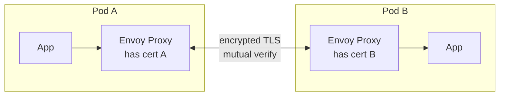
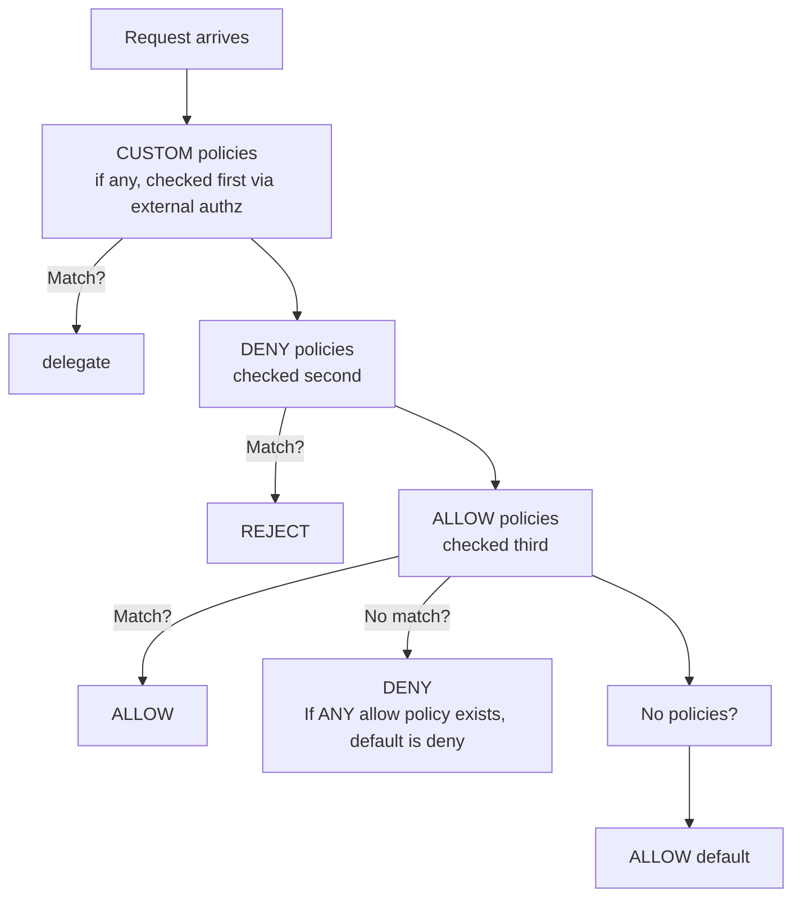
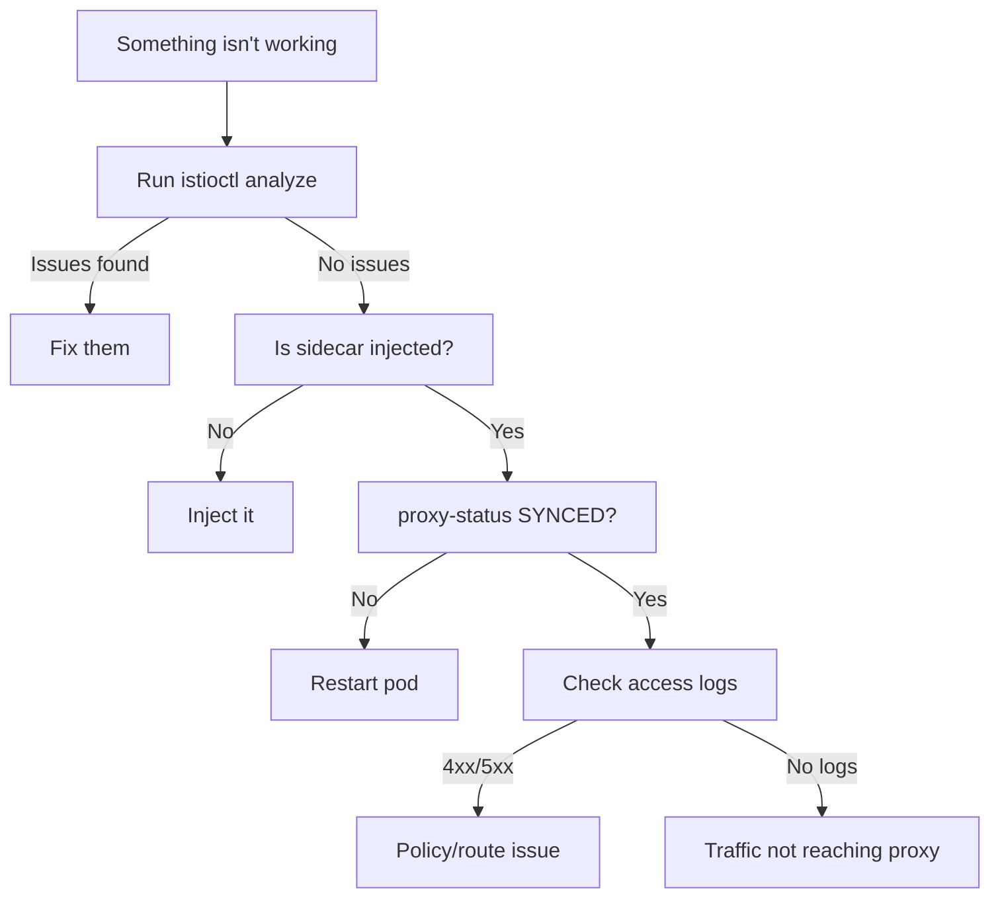

## Complexity: `[COMPLEX]`
## Time to Complete: 50-60 minutes

---

## Prerequisites

Before starting this module, you should have completed:
- **Module 1.1: Installation & Architecture** — understanding istiod, Envoy, and sidecar injection mechanics.
- **Module 1.2: Traffic Management** — working with VirtualService, DestinationRule, and Gateway resources.
- Basic understanding of Transport Layer Security (TLS), JSON Web Tokens (JWT), and Kubernetes Role-Based Access Control (RBAC) concepts.

---

## What You'll Be Able to Do

After completing this rigorous deep dive, you will be able to:

1. **Design** zero-trust authentication boundaries using `PeerAuthentication` to enforce mutual TLS (mTLS) modes across namespaces and workloads.
2. **Implement** robust identity verification by integrating `RequestAuthentication` for JWT validation alongside fine-grained `AuthorizationPolicy` access rules.
3. **Diagnose** complex mTLS handshake failures, unauthenticated request rejections, and policy evaluation conflicts using the `istioctl` command-line utility.
4. **Evaluate** Envoy access logs and proxy synchronization states to accurately pinpoint and resolve traffic disruptions in real-time.
5. **Compare** ALLOW and DENY policy evaluation orders to construct fail-safe access rules for secure microservice communication.

---

## Why This Module Matters

In 2019, a major financial corporation suffered a massive data breach affecting over 100 million customers. An attacker exploited a misconfigured web application firewall to gain initial access, then used a Server Side Request Forgery (SSRF) attack to access internal metadata services and extract privileged IAM credentials. With these credentials, the attacker moved laterally across the internal network, exfiltrating terabytes of sensitive data. This breach cost the company over $250 million in regulatory fines and remediation efforts, alongside immeasurable reputational damage.

While that specific incident occurred on cloud infrastructure virtual machines, the exact same lateral movement pattern threatens Kubernetes clusters every single day. If an attacker compromises a single vulnerable pod in your mesh, what stops them from querying your internal payment APIs or dumping your customer database? A "soft interior" network is a disaster waiting to happen.

This is where Istio Security becomes critical. By implementing STRICT mTLS, you ensure that every packet on the wire is encrypted and cryptographically authenticated. By applying rigorous AuthorizationPolicies, you enforce a Zero Trust architecture where a compromised frontend pod physically cannot communicate with a backend database, regardless of internal network visibility. Troubleshooting these zero-trust boundaries is equally critical—a misconfigured policy can block legitimate production traffic just as easily as an attacker. Security accounts for roughly 15% of the ICA exam, and Troubleshooting accounts for another 10%. Mastering these topics is non-negotiable for platform engineers.

---

## Did You Know?

- **Istio rotates mTLS certificates every 24 hours by default.** Each workload receives a short-lived SPIFFE certificate that is automatically rotated by the control plane. No manual certificate management or cron jobs are required.
- **In 2020, Istio consolidated its control plane.** The architecture moved from multiple microservices (Pilot, Citadel, Galley, Mixer) into a single unified binary called `istiod`, reducing CPU consumption by up to 50% in large-scale deployments.
- **DENY policies are evaluated before ALLOW.** Istio's authorization engine processes DENY rules first, short-circuiting the evaluation in microseconds if a match is found.
- **`istioctl analyze` catches over 40 distinct misconfiguration types.** This includes orphaned VirtualServices, missing DestinationRules, conflicting authorization policies, and deprecated API versions, making it your most powerful diagnostic tool.

---

## War Story: The Midnight mTLS Migration

**The Incident:**

Marcus, a seasoned Platform Engineer, was tasked with enabling mTLS across an entire production mesh encompassing dozens of microservices. He understood the architecture and knew `STRICT` mode was the ultimate goal for Zero Trust compliance. On a Thursday evening during a low-traffic window, he confidently applied a mesh-wide PeerAuthentication policy:

```yaml
apiVersion: security.istio.io/v1
kind: PeerAuthentication
metadata:
  name: default
  namespace: istio-system
spec:
  mtls:
    mode: STRICT
```

Within thirty seconds, the monitoring dashboard turned entirely red. The core payments service was attempting to call a legacy inventory service running *outside* the mesh (without an Envoy sidecar). STRICT mTLS required both the client and the server to present valid cryptographic certificates. Because the legacy service lacked a sidecar, it could not present a certificate, causing every single request to fail with a `connection reset by peer` error.

Orders immediately stopped processing. The on-call engineering team scrambled and reverted the change eight minutes later, but thousands of orders were lost or stalled during the outage window. 

**What Marcus should have done:**

A migration to mTLS must be progressive. He should have used the following sequence:

```yaml
# Step 1: Start with PERMISSIVE (accepts both mTLS and plaintext)
apiVersion: security.istio.io/v1
kind: PeerAuthentication
metadata:
  name: default
  namespace: istio-system
spec:
  mtls:
    mode: PERMISSIVE
```

Next, he should have audited the mesh to identify any services lacking sidecars:

```bash
# Step 2: Identify services without sidecars
# istioctl proxy-status  (shows which pods have proxies)
```

Once identified, he could explicitly exclude specific ports associated with legacy non-mesh services:

```yaml
# Step 3: Exclude specific ports or services
apiVersion: security.istio.io/v1
kind: PeerAuthentication
metadata:
  name: default
  namespace: istio-system
spec:
  mtls:
    mode: STRICT
  portLevelMtls:
    8080:
      mode: DISABLE    # Legacy service port
```

Alternatively, he could have applied the STRICT policy exclusively to namespaces that were fully onboarded to the mesh:

```yaml
# Step 4: Or apply STRICT per-namespace, not mesh-wide
apiVersion: security.istio.io/v1
kind: PeerAuthentication
metadata:
  name: default
  namespace: payments  # Only this namespace
spec:
  mtls:
    mode: STRICT
```

**Lesson**: Always begin with PERMISSIVE mode. Verify that all communicating services have injected sidecars using `istioctl proxy-status`, and only then progressively enable STRICT mode on a per-namespace or per-workload basis.

---

## Part 1: Mutual TLS (mTLS) Deep Dive

### 1.1 How mTLS Works in Istio

In a standard Kubernetes environment without a service mesh, traffic between pods flows in plaintext. Any compromised container on the same node or network segment could potentially sniff this traffic. 

Istio solves this by transparently intercepting traffic through the Envoy proxy sidecars. The proxies negotiate a secure TLS connection, mutually verifying each other's cryptographic identities.



**Certificate Identity (SPIFFE):**

Each workload is assigned a strong cryptographic identity based on the SPIFFE (Secure Production Identity Framework for Everyone) standard. The built-in Certificate Authority (Citadel, now part of `istiod`) issues these certificates.

```text
spiffe://cluster.local/ns/default/sa/reviews
         └─ trust domain  └─ namespace  └─ service account
```

> **Pause and predict**: If two pods are in the same namespace but use different Kubernetes Service Accounts, will their SPIFFE identities be the same or different? 
> *(Answer: They will be different. The identity is inherently tied to the Service Account, allowing you to create highly granular security rules.)*

### 1.2 PeerAuthentication

The `PeerAuthentication` resource defines how traffic is received by a workload. It specifies the acceptable mTLS modes for the *server* side of the connection.

**Mesh-wide policy:**
By applying the policy to the `istio-system` root namespace, it affects the entire mesh.

```yaml
apiVersion: security.istio.io/v1
kind: PeerAuthentication
metadata:
  name: default
  namespace: istio-system        # Mesh-wide when in istio-system
spec:
  mtls:
    mode: STRICT                 # Require mTLS for all services
```

**Namespace-level policy:**
Overrides the mesh-wide policy for a specific namespace.

```yaml
apiVersion: security.istio.io/v1
kind: PeerAuthentication
metadata:
  name: default
  namespace: payments            # Only affects this namespace
spec:
  mtls:
    mode: STRICT
```

**Workload-level policy:**
Targets specific pods using label selectors.

```yaml
apiVersion: security.istio.io/v1
kind: PeerAuthentication
metadata:
  name: reviews-mtls
  namespace: default
spec:
  selector:
    matchLabels:
      app: reviews               # Only affects pods with this label
  mtls:
    mode: STRICT
```

**Port-level policy:**
Useful when a specific port must remain plaintext (e.g., for legacy health checks).

```yaml
apiVersion: security.istio.io/v1
kind: PeerAuthentication
metadata:
  name: reviews-mtls
  namespace: default
spec:
  selector:
    matchLabels:
      app: reviews
  mtls:
    mode: STRICT
  portLevelMtls:
    8080:
      mode: DISABLE              # Disable mTLS on port 8080 only
```

**Understanding mTLS Modes:**

| Mode | Behavior | Use Case |
|------|----------|----------|
| `STRICT` | Only accepts mTLS traffic | Production (full encryption) |
| `PERMISSIVE` | Accepts both mTLS and plaintext | Migration period |
| `DISABLE` | No mTLS | Legacy services, debugging |
| `UNSET` | Inherits from parent | Default behavior |

**Policy Priority (Most Specific Wins):**

When multiple policies exist, Istio evaluates them from most specific to least specific:

```text
Workload-level  >  Namespace-level  >  Mesh-level
(selector)         (namespace)          (istio-system)
```

### 1.3 DestinationRule TLS Settings

While `PeerAuthentication` dictates what the server accepts, `DestinationRule` configures what the *client* proxy sends. 

```yaml
apiVersion: networking.istio.io/v1
kind: DestinationRule
metadata:
  name: reviews
spec:
  host: reviews
  trafficPolicy:
    tls:
      mode: ISTIO_MUTUAL          # Use Istio's mTLS certs
```

**DestinationRule TLS modes:**

| Mode | Description |
|------|-------------|
| `DISABLE` | No TLS |
| `SIMPLE` | Originate TLS (client verifies server) |
| `MUTUAL` | Originate mTLS (both verify each other) |
| `ISTIO_MUTUAL` | Use Istio's built-in mTLS certificates |

*Exam Tip: Istio automatically detects when a destination proxy supports mTLS and upgrades the connection dynamically. You rarely need to explicitly set `ISTIO_MUTUAL` in a DestinationRule unless you are overriding a default or integrating external services.*

---

## Part 2: Request Authentication (JWT)

End-user identity is typically managed via JSON Web Tokens (JWT). The `RequestAuthentication` resource instructs the Envoy proxy to validate the cryptographic signature and claims of incoming JWTs.

### 2.1 Basic JWT Validation

```yaml
apiVersion: security.istio.io/v1
kind: RequestAuthentication
metadata:
  name: jwt-auth
  namespace: default
spec:
  selector:
    matchLabels:
      app: productpage
  jwtRules:
  - issuer: "https://accounts.google.com"
    jwksUri: "https://www.googleapis.com/oauth2/v3/certs"
  - issuer: "https://my-auth.example.com"
    jwksUri: "https://my-auth.example.com/.well-known/jwks.json"
    forwardOriginalToken: true     # Forward JWT to upstream
    outputPayloadToHeader: "x-jwt-payload"  # Extract claims to header
```

**Crucial Concept**: `RequestAuthentication` *validates* a token if one is present. If the token is invalid or expired, the request is rejected with a `401 Unauthorized`. However, if the request contains *no token at all*, the request is **allowed through**. 

> **Stop and think**: Why is it dangerous to create a `RequestAuthentication` resource without a corresponding `AuthorizationPolicy`? What happens to a request that simply omits the Authorization header entirely?
> *(Answer: Without an AuthorizationPolicy to explicitly require the token, an attacker can simply drop the Authorization header and completely bypass the JWT validation phase.)*

### 2.2 JWT with Claim-Based Routing

You can instruct Envoy to extract specific claims from the validated JWT and inject them into HTTP headers for backend consumption.

```yaml
apiVersion: security.istio.io/v1
kind: RequestAuthentication
metadata:
  name: jwt-auth
  namespace: default
spec:
  selector:
    matchLabels:
      app: frontend
  jwtRules:
  - issuer: "https://auth.example.com"
    jwksUri: "https://auth.example.com/.well-known/jwks.json"
    outputClaimToHeaders:
    - header: x-jwt-sub
      claim: sub
    - header: x-jwt-groups
      claim: groups
```

---

## Part 3: Authorization Policy Engine

`AuthorizationPolicy` is the core access control mechanism in Istio. It enforces rules dictating who can access what resources, utilizing attributes from both mTLS (SPIFFE identities) and JWTs (claims).

### 3.1 Policy Actions and Evaluation Order

Understanding the exact order in which Istio evaluates policies is fundamental for troubleshooting.



**Critical Rule:** If there are NO AuthorizationPolicies applied to a workload, all traffic is allowed by default. However, the moment you create a single ALLOW policy, the default behavior instantly flips to **deny-all** for any traffic not explicitly matching the ALLOW rule.

### 3.2 ALLOW Policy Example

```yaml
apiVersion: security.istio.io/v1
kind: AuthorizationPolicy
metadata:
  name: allow-reviews
  namespace: default
spec:
  selector:
    matchLabels:
      app: reviews
  action: ALLOW
  rules:
  - from:
    - source:
        principals: ["cluster.local/ns/default/sa/productpage"]
    to:
    - operation:
        methods: ["GET"]
        paths: ["/reviews/*"]
```

This ensures that only the `productpage` service account can execute GET requests against the `/reviews/*` paths. All other requests to the reviews application are denied.

### 3.3 DENY Policy Example

```yaml
apiVersion: security.istio.io/v1
kind: AuthorizationPolicy
metadata:
  name: deny-external
  namespace: default
spec:
  selector:
    matchLabels:
      app: internal-api
  action: DENY
  rules:
  - from:
    - source:
        notNamespaces: ["default", "backend"]
    to:
    - operation:
        paths: ["/admin/*"]
```

This denies any request targeting the `/admin/*` path unless it originates from the `default` or `backend` namespaces.

### 3.4 Requiring a JWT

To force clients to provide a valid token, you must combine `RequestAuthentication` and `AuthorizationPolicy`.

```yaml
# Step 1: Validate JWT if present
apiVersion: security.istio.io/v1
kind: RequestAuthentication
metadata:
  name: require-jwt
  namespace: default
spec:
  selector:
    matchLabels:
      app: productpage
  jwtRules:
  - issuer: "https://auth.example.com"
    jwksUri: "https://auth.example.com/.well-known/jwks.json"
```

```yaml
# Step 2: DENY requests without valid JWT
apiVersion: security.istio.io/v1
kind: AuthorizationPolicy
metadata:
  name: require-jwt
  namespace: default
spec:
  selector:
    matchLabels:
      app: productpage
  action: DENY
  rules:
  - from:
    - source:
        notRequestPrincipals: ["*"]   # No valid JWT principal = deny
```

### 3.5 Namespace-Level Policies

You can scope policies broadly across entire namespaces.

```yaml
# Allow all traffic within the namespace
apiVersion: security.istio.io/v1
kind: AuthorizationPolicy
metadata:
  name: allow-same-namespace
  namespace: backend
spec:
  action: ALLOW
  rules:
  - from:
    - source:
        namespaces: ["backend"]
```

```yaml
# Deny all traffic (explicit deny-all)
apiVersion: security.istio.io/v1
kind: AuthorizationPolicy
metadata:
  name: deny-all
  namespace: backend
spec:
  {}                               # Empty spec = deny all
```

### 3.6 Common AuthorizationPolicy Patterns

**Allow specific HTTP methods:**

```yaml
rules:
- to:
  - operation:
      methods: ["GET", "HEAD"]
```

**Allow from specific service accounts:**

```yaml
rules:
- from:
  - source:
      principals: ["cluster.local/ns/frontend/sa/webapp"]
```

**Allow based on JWT claims:**

```yaml
rules:
- from:
  - source:
      requestPrincipals: ["https://auth.example.com/*"]
  when:
  - key: request.auth.claims[role]
    values: ["admin"]
```

**Allow specific IP ranges:**

```yaml
rules:
- from:
  - source:
      ipBlocks: ["10.0.0.0/8"]
```

---

## Part 4: TLS at Ingress Gateways

Securing the edge of your mesh is just as important as internal mTLS.

### 4.1 Simple TLS (Server Certificate Only)

First, provision a standard Kubernetes Secret containing the TLS materials.

```bash
# Create TLS secret
kubectl create -n istio-system secret tls my-tls-secret \
  --key=server.key \
  --cert=server.crt
```

Then, configure the Gateway to terminate TLS using `SIMPLE` mode.

```yaml
apiVersion: networking.istio.io/v1
kind: Gateway
metadata:
  name: secure-gateway
spec:
  selector:
    istio: ingressgateway
  servers:
  - port:
      number: 443
      name: https
      protocol: HTTPS
    hosts:
    - "app.example.com"
    tls:
      mode: SIMPLE
      credentialName: my-tls-secret
```

### 4.2 Mutual TLS at Ingress (Client Certificates)

If your architecture requires external clients to present certificates, configure the Gateway for `MUTUAL` mode.

```bash
# Create secret with CA cert for client verification
kubectl create -n istio-system secret generic my-mtls-secret \
  --from-file=tls.key=server.key \
  --from-file=tls.crt=server.crt \
  --from-file=ca.crt=ca.crt
```

```yaml
apiVersion: networking.istio.io/v1
kind: Gateway
metadata:
  name: mtls-gateway
spec:
  selector:
    istio: ingressgateway
  servers:
  - port:
      number: 443
      name: https
      protocol: HTTPS
    hosts:
    - "secure.example.com"
    tls:
      mode: MUTUAL                    # Require client certificate
      credentialName: my-mtls-secret
```

---

## Part 5: Troubleshooting Workflow & Diagnostics

When securing a mesh, things will inevitably break. Mastering the diagnostic toolchain is essential.

### 5.1 `istioctl analyze`

This command runs local validations against your K8s clusters and manifests, detecting misconfigurations before they cause outages.

```bash
# Analyze all namespaces
istioctl analyze --all-namespaces

# Analyze specific namespace
istioctl analyze -n default

# Analyze a specific file before applying
istioctl analyze my-virtualservice.yaml

# Common warnings/errors:
# IST0101: Referenced host not found
# IST0104: Gateway references missing secret
# IST0106: Schema validation error
# IST0108: Unknown annotation
# IST0113: VirtualService references undefined subset
```

### 5.2 `istioctl proxy-status`

Checks the synchronization state between the `istiod` control plane and the Envoy data plane.

```bash
istioctl proxy-status
```

**Output interpretation:**

```text
NAME                              CDS    LDS    EDS    RDS    ECDS   ISTIOD
productpage-v1-xxx.default        SYNCED SYNCED SYNCED SYNCED SYNCED istiod-xxx
reviews-v1-xxx.default            SYNCED SYNCED SYNCED SYNCED SYNCED istiod-xxx
ratings-v1-xxx.default            STALE  SYNCED SYNCED SYNCED SYNCED istiod-xxx  ← Problem!
```

| Status | Meaning | Action |
|--------|---------|--------|
| `SYNCED` | Proxy has latest config from istiod | Normal |
| `NOT SENT` | istiod hasn't sent config (no changes) | Usually normal |
| `STALE` | Proxy hasn't acknowledged latest config | Investigate — restart pod or check connectivity |

**Understanding xDS APIs:**

| Type | Full Name | What It Configures |
|------|----------|-------------------|
| CDS | Cluster Discovery Service | Upstream clusters (services) |
| LDS | Listener Discovery Service | Inbound/outbound listeners |
| EDS | Endpoint Discovery Service | Endpoints (pod IPs) |
| RDS | Route Discovery Service | HTTP routing rules |
| ECDS | Extension Config Discovery | WASM extensions |

### 5.3 `istioctl proxy-config`

When you need to look deeply into what Envoy is doing, you inspect its internal state.

```bash
# List all clusters (upstream services) for a pod
istioctl proxy-config clusters productpage-v1-xxx.default

# List listeners (what ports Envoy is listening on)
istioctl proxy-config listeners productpage-v1-xxx.default

# List routes (HTTP routing rules)
istioctl proxy-config routes productpage-v1-xxx.default

# List endpoints (actual pod IPs)
istioctl proxy-config endpoints productpage-v1-xxx.default

# Show the full Envoy config dump
istioctl proxy-config all productpage-v1-xxx.default -o json

# Filter by specific service
istioctl proxy-config endpoints productpage-v1-xxx.default \
  --cluster "outbound|9080||reviews.default.svc.cluster.local"
```

### 5.4 Envoy Access Logs

To see the raw traffic metrics, enable and inspect the Envoy access logs.

```bash
# Enable via mesh config
istioctl install --set meshConfig.accessLogFile=/dev/stdout -y

# View logs for a specific pod's sidecar
kubectl logs productpage-v1-xxx -c istio-proxy

# Sample log entry:
# [2024-01-15T10:30:00.000Z] "GET /reviews/1 HTTP/1.1" 200 - via_upstream
#   - 0 325 45 42 "-" "curl/7.68.0" "xxx" "reviews:9080"
#   "10.244.0.15:9080" outbound|9080||reviews.default.svc.cluster.local
#   10.244.0.10:50542 10.96.10.15:9080 10.244.0.10:50540
```

**Log Format Breakdown:**

```text
[timestamp] "METHOD PATH PROTOCOL" STATUS_CODE FLAGS
  - REQUEST_BYTES RESPONSE_BYTES DURATION_MS UPSTREAM_DURATION
  "USER_AGENT" "REQUEST_ID" "AUTHORITY"
  "UPSTREAM_HOST" UPSTREAM_CLUSTER
  DOWNSTREAM_LOCAL DOWNSTREAM_REMOTE DOWNSTREAM_PEER
```

### 5.5 Systematic Troubleshooting Workflow

When debugging routing or security issues, ad-hoc guessing wastes time. Follow this structured approach.

```text
Step 1: istioctl analyze -n <namespace>
        → Catches 80% of misconfigurations

Step 2: istioctl proxy-status
        → Is the proxy connected? Is config synced?

Step 3: istioctl proxy-config routes <pod>
        → Does the proxy have the expected routing rules?

Step 4: kubectl logs <pod> -c istio-proxy
        → What does the access log show? 4xx? 5xx? Timeout?

Step 5: istioctl proxy-config clusters <pod>
        → Can the proxy see the upstream service?

Step 6: istioctl proxy-config endpoints <pod> --cluster <cluster>
        → Are there healthy endpoints?
```

**Debugging Decision Tree:**



### 5.6 Common Symptom Matrix

| Issue | Symptoms | Diagnostic | Fix |
|-------|----------|-----------|-----|
| Missing sidecar | Service not in mesh, no mTLS | `kubectl get pod -o jsonpath='{.spec.containers[*].name}'` | Label namespace + restart pods |
| VirtualService not applied | Traffic ignores routing rules | `istioctl analyze` (IST0113) | Check hosts match, gateway reference exists |
| mTLS STRICT with non-mesh service | `connection reset by peer` | `istioctl proxy-status` (missing pod) | Use PERMISSIVE or add sidecar |
| Stale proxy config | Old routing rules in effect | `istioctl proxy-status` (STALE) | Restart the pod |
| Gateway TLS misconfigured | TLS handshake failure | `istioctl analyze` (IST0104) | Check credentialName matches K8s Secret |
| AuthorizationPolicy blocking | 403 Forbidden | `kubectl logs <pod> -c istio-proxy` | Check RBAC filters in access logs |
| Subset not defined | 503 `no healthy upstream` | `istioctl analyze` (IST0113) | Create DestinationRule with matching subsets |
| Port name wrong | Protocol detection fails | `kubectl get svc -o yaml` (check port names) | Name ports as `http-xxx`, `grpc-xxx`, `tcp-xxx` |

---

## Common Mistakes

| Mistake | Symptom | Solution |
|---------|---------|----------|
| STRICT mTLS with non-mesh services | Connection refused/reset | Use PERMISSIVE mode or add sidecars |
| RequestAuthentication without AuthorizationPolicy | Unauthenticated requests pass through | Add DENY policy for `notRequestPrincipals: ["*"]` |
| Creating ALLOW policy without catch-all | All non-matching traffic denied (surprise!) | Understand that any ALLOW policy = default deny |
| Empty AuthorizationPolicy spec | All traffic denied | `spec: {}` means deny-all, add rules for allowed traffic |
| Wrong namespace for mesh-wide policy | Policy only applies to one namespace | Mesh-wide PeerAuthentication must be in `istio-system` |
| Forgetting `credentialName` on Gateway TLS | TLS handshake fails | Create K8s Secret in `istio-system` namespace |
| Not checking port naming conventions | Protocol detection fails, policies don't apply | Name Service ports: `http-*`, `grpc-*`, `tcp-*` |
| Ignoring DENY-before-ALLOW evaluation order | ALLOW policy seems to not work | Check if a DENY policy is matching first |

---

## Quiz

**Q1: You are planning a migration of a large microservice architecture. What is the difference between STRICT and PERMISSIVE mTLS, and which should you use first?**

<details>
<summary>Show Answer</summary>

- **STRICT**: Only accepts mTLS-encrypted traffic. Plaintext connections are rejected. Use when all communicating services have sidecars.
- **PERMISSIVE**: Accepts both mTLS and plaintext traffic. Use during migration when some services don't have sidecars yet.

PERMISSIVE is the default mode. Always start with PERMISSIVE and graduate to STRICT after verifying all services have sidecars.

</details>

**Q2: You create a RequestAuthentication for a service. A request arrives without any JWT token. What happens?**

<details>
<summary>Show Answer</summary>

The request is **allowed through**. RequestAuthentication only validates tokens that are present — it does NOT require them. To reject requests without a valid JWT, add an AuthorizationPolicy:

```yaml
apiVersion: security.istio.io/v1
kind: AuthorizationPolicy
metadata:
  name: require-jwt
spec:
  selector:
    matchLabels:
      app: myservice
  action: DENY
  rules:
  - from:
    - source:
        notRequestPrincipals: ["*"]
```

</details>

**Q3: Your security team reports that a specific deny rule is being bypassed. To diagnose this, what is the evaluation order for AuthorizationPolicy actions?**

<details>
<summary>Show Answer</summary>

1. **CUSTOM** (external authorization) — checked first
2. **DENY** — checked second, short-circuits on match
3. **ALLOW** — checked third
4. If no policies exist → all traffic allowed
5. If ALLOW policies exist but none match → traffic denied

</details>

**Q4: A zero-trust initiative is underway. Write an AuthorizationPolicy that allows only the frontend service account to call the backend service via GET on `/api/*`.**

<details>
<summary>Show Answer</summary>

```yaml
apiVersion: security.istio.io/v1
kind: AuthorizationPolicy
metadata:
  name: backend-policy
  namespace: default
spec:
  selector:
    matchLabels:
      app: backend
  action: ALLOW
  rules:
  - from:
    - source:
        principals: ["cluster.local/ns/default/sa/frontend"]
    to:
    - operation:
        methods: ["GET"]
        paths: ["/api/*"]
```

</details>

**Q5: A service returns `connection reset by peer` after enabling STRICT mTLS. What is the most likely cause?**

<details>
<summary>Show Answer</summary>

The calling service (or the target) doesn't have an Envoy sidecar. STRICT mode requires both sides to present mTLS certificates. Without a sidecar, the service can't participate in mTLS.

Diagnostic steps:
1. `istioctl proxy-status` — check if both pods appear
2. `kubectl get pod <pod> -o jsonpath='{.spec.containers[*].name}'` — look for `istio-proxy`
3. Fix: inject the sidecar, or use PERMISSIVE mode for that workload

</details>

**Q6: During an incident, traffic drops mysteriously. What does `istioctl proxy-status` show, and what does STALE mean?**

<details>
<summary>Show Answer</summary>

`istioctl proxy-status` shows the synchronization state between istiod and every Envoy proxy in the mesh. For each proxy, it shows the status of 5 xDS types: CDS, LDS, EDS, RDS, ECDS.

- **SYNCED**: Proxy has the latest configuration
- **NOT SENT**: No config changes to send (normal)
- **STALE**: istiod sent config but the proxy hasn't acknowledged it — indicates a problem (network issue, overloaded proxy)

Fix STALE: restart the affected pod.

</details>

**Q7: You need to achieve compliance by auditing all mesh traffic. How do you enable Envoy access logging for all sidecars?**

<details>
<summary>Show Answer</summary>

```bash
# During installation
istioctl install --set meshConfig.accessLogFile=/dev/stdout -y

# Or via IstioOperator
spec:
  meshConfig:
    accessLogFile: /dev/stdout
```

Then view logs with:
```bash
kubectl logs <pod-name> -c istio-proxy
```

</details>

**Q8: A new routing rule is failing. What is the command to see all routing rules configured in a specific pod's Envoy proxy?**

<details>
<summary>Show Answer</summary>

```bash
istioctl proxy-config routes <pod-name>.<namespace>
```

This shows the Route Discovery Service (RDS) configuration — all HTTP routes the proxy knows about. To see more detail:

```bash
istioctl proxy-config routes <pod-name>.<namespace> -o json
```

For other config types: `clusters`, `listeners`, `endpoints`, `all`.

</details>

**Q9: You applied an AuthorizationPolicy with `action: ALLOW`, but now ALL traffic to the service is blocked except what matches the rule. Why?**

<details>
<summary>Show Answer</summary>

This is by design. When any ALLOW policy exists for a workload, the default behavior becomes **deny-all** for that workload. Only traffic that explicitly matches an ALLOW rule is permitted.

If you want to allow additional traffic patterns, either:
1. Add more rules to the existing ALLOW policy
2. Create additional ALLOW policies
3. Remove the ALLOW policy if you want default-allow behavior

</details>

**Q10: An integration test fails repeatedly. How do you debug why a VirtualService routing rule is not being applied?**

<details>
<summary>Show Answer</summary>

Systematic approach:

1. **`istioctl analyze -n <ns>`** — Check for IST0113 (missing subset), IST0101 (host not found)
2. **`istioctl proxy-status`** — Verify proxy is SYNCED
3. **`istioctl proxy-config routes <pod>`** — Check if the route appears in Envoy's config
4. **`kubectl logs <pod> -c istio-proxy`** — Check access logs for actual routing behavior
5. **Verify hosts match** — VirtualService `hosts` must match the service name or Gateway host
6. **Check `gateways` field** — If using Gateway, VirtualService must reference it
7. **Check namespace** — VirtualService must be in the same namespace as the service (or use `exportTo`)

</details>

---

## Hands-On Exercise: Security & Troubleshooting

### Objective
Configure mTLS, establish authorization policies, and practice troubleshooting common Istio disruptions.

### Setup

Execute the following commands to configure your environment. *(Note: While the sample URL references 1.22 for compatibility, ensure production clusters run Istio versions supported for K8s v1.35+.)*

```bash
# Ensure Istio is installed with demo profile
istioctl install --set profile=demo \
  --set meshConfig.accessLogFile=/dev/stdout -y

kubectl label namespace default istio-injection=enabled --overwrite

# Deploy Bookinfo
kubectl apply -f https://raw.githubusercontent.com/istio/istio/release-1.22/samples/bookinfo/platform/kube/bookinfo.yaml
kubectl apply -f https://raw.githubusercontent.com/istio/istio/release-1.22/samples/bookinfo/networking/destination-rule-all.yaml

kubectl wait --for=condition=ready pod --all -n default --timeout=120s
```

### Task 1: Enable STRICT mTLS

Apply a mesh-wide STRICT mTLS policy and verify that services can still communicate (because they all possess sidecars).

<details>
<summary>Solution</summary>

```bash
# Apply mesh-wide STRICT mTLS
kubectl apply -f - <<EOF
apiVersion: security.istio.io/v1
kind: PeerAuthentication
metadata:
  name: default
  namespace: istio-system
spec:
  mtls:
    mode: STRICT
EOF

# Verify mTLS is working
istioctl proxy-config clusters productpage-v1-$(kubectl get pods -l app=productpage -o jsonpath='{.items[0].metadata.name}' | cut -d'-' -f3-) | grep reviews
```

Verify traffic flows properly:

```bash
kubectl exec $(kubectl get pod -l app=ratings -o jsonpath='{.items[0].metadata.name}') -c ratings -- curl -s productpage:9080/productpage | head -20
```

</details>

### Task 2: Create Authorization Policies

Apply a policy that denies all traffic to the `reviews` application, except traffic originating from the `productpage` service account.

<details>
<summary>Solution</summary>

```bash
# Deny all traffic to reviews (start restrictive)
kubectl apply -f - <<EOF
apiVersion: security.istio.io/v1
kind: AuthorizationPolicy
metadata:
  name: deny-all-reviews
  namespace: default
spec:
  selector:
    matchLabels:
      app: reviews
  action: DENY
  rules:
  - from:
    - source:
        notPrincipals: ["cluster.local/ns/default/sa/bookinfo-productpage"]
EOF
```

Verify the enforcement:

```bash
# This should work (productpage → reviews)
kubectl exec $(kubectl get pod -l app=productpage -o jsonpath='{.items[0].metadata.name}') \
  -c productpage -- curl -s -o /dev/null -w "%{http_code}" http://reviews:9080/reviews/1

# This should fail with 403 (ratings → reviews)
kubectl exec $(kubectl get pod -l app=ratings -o jsonpath='{.items[0].metadata.name}') \
  -c ratings -- curl -s -o /dev/null -w "%{http_code}" http://reviews:9080/reviews/1
```

</details>

### Task 3: Troubleshooting Practice

Intentionally introduce a configuration error in a `VirtualService` and use `istioctl analyze` to diagnose and fix it.

<details>
<summary>Solution</summary>

```bash
# Create a VirtualService with a typo in the subset name
kubectl apply -f - <<EOF
apiVersion: networking.istio.io/v1
kind: VirtualService
metadata:
  name: reviews-broken
spec:
  hosts:
  - reviews
  http:
  - route:
    - destination:
        host: reviews
        subset: v99   # This subset doesn't exist!
EOF

# Now diagnose:
# Step 1: Analyze
istioctl analyze -n default
# Expected: IST0113 - Referenced subset not found

# Step 2: Check proxy config
istioctl proxy-config routes $(kubectl get pod -l app=productpage \
  -o jsonpath='{.items[0].metadata.name}').default | grep reviews

# Step 3: Fix it
kubectl apply -f - <<EOF
apiVersion: networking.istio.io/v1
kind: VirtualService
metadata:
  name: reviews-broken
spec:
  hosts:
  - reviews
  http:
  - route:
    - destination:
        host: reviews
        subset: v1    # Fixed!
EOF

# Step 4: Verify
istioctl analyze -n default
```

</details>

### Task 4: Inspect Envoy Configuration

Dive deep into the Envoy internals for the `productpage` pod using `proxy-config`.

<details>
<summary>Solution</summary>

```bash
# Get the productpage pod name
PP_POD=$(kubectl get pod -l app=productpage -o jsonpath='{.items[0].metadata.name}')

# View all clusters (upstream services)
istioctl proxy-config clusters $PP_POD.default

# View listeners
istioctl proxy-config listeners $PP_POD.default

# View routes
istioctl proxy-config routes $PP_POD.default

# View endpoints for reviews service
istioctl proxy-config endpoints $PP_POD.default \
  --cluster "outbound|9080||reviews.default.svc.cluster.local"

# Check access logs
kubectl logs $PP_POD -c istio-proxy --tail=10
```

</details>

### Success Criteria

- [ ] STRICT mTLS is correctly enabled mesh-wide, preserving communication because all workloads possess sidecars.
- [ ] AuthorizationPolicy accurately restricts `reviews` access to the `productpage` workload only.
- [ ] You successfully identified the `IST0113` error using `istioctl analyze` and resolved the missing subset.
- [ ] You independently executed `proxy-config` to inspect clusters, listeners, routes, and endpoints.
- [ ] Access logs successfully output comprehensive request metadata from the `istio-proxy` container.

### Cleanup

<details>
<summary>Solution</summary>

```bash
kubectl delete peerauthentication default -n istio-system
kubectl delete authorizationpolicy deny-all-reviews -n default
kubectl delete virtualservice reviews-broken -n default
kubectl delete -f https://raw.githubusercontent.com/istio/istio/release-1.22/samples/bookinfo/platform/kube/bookinfo.yaml
kubectl delete -f https://raw.githubusercontent.com/istio/istio/release-1.22/samples/bookinfo/networking/destination-rule-all.yaml
istioctl uninstall --purge -y
kubectl delete namespace istio-system
```

</details>

---

## Next Module

Now that you have secured the mesh and can troubleshoot traffic disruptions, it's time to gain total visibility into your microservices. Continue to [Module 1.4: Istio Observability](../module-1.4-istio-observability/) to learn how to harness Istio metrics, distributed tracing, and specialized dashboards like Kiali and Grafana. Observability comprises a vital **10% of the ICA exam**.

### Final Exam Prep Checklist

- [ ] Can install Istio with `istioctl` using diverse profiles.
- [ ] Can configure both automatic and manual sidecar injection mechanisms.
- [ ] Can write `VirtualService` rules for traffic splitting, header routing, and fault injection.
- [ ] Can write `DestinationRule` policies mapping to subsets, circuit breakers, and outlier detection logic.
- [ ] Can configure `Gateway` definitions mapping external ingress with appropriate TLS termination.
- [ ] Can establish `ServiceEntry` resources for precise egress traffic control.
- [ ] Can formulate and bind `PeerAuthentication` policies (STRICT vs. PERMISSIVE).
- [ ] Can structure robust `AuthorizationPolicy` guardrails prioritizing DENY statements over ALLOW rules.
- [ ] Can confidently utilize `istioctl analyze`, `proxy-status`, and `proxy-config` during rapid incident response.
- [ ] Can parse raw Envoy access logs to immediately diagnose HTTP errors, retries, and protocol mismatches.