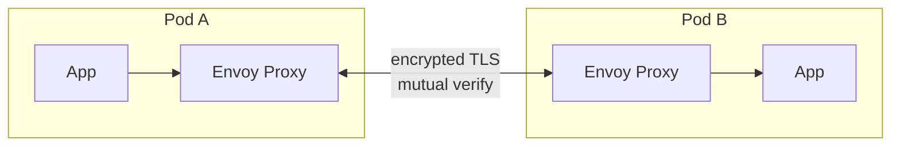
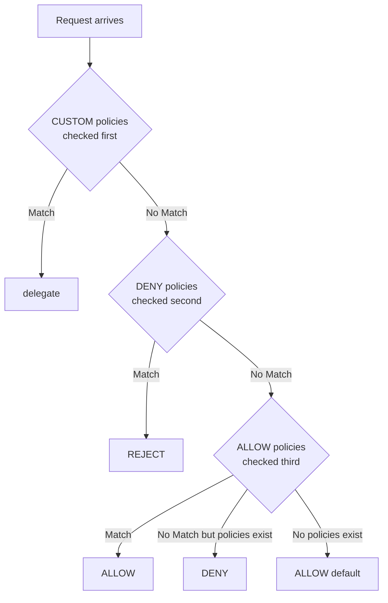
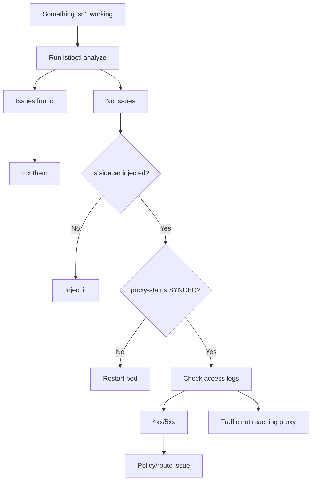

## Prerequisites

Before starting this module, you should have a solid foundation in both Kubernetes and Istio core concepts. Specifically, you should have completed:
- [Module 1: Installation & Architecture](../module-1.1-istio-installation-architecture/) — Understanding istiod, Envoy proxy mechanics, and automatic sidecar injection within Kubernetes v1.35+ environments.
- [Module 2: Traffic Management](../module-1.2-istio-traffic-management/) — Working with VirtualService, DestinationRule, and Gateway resources.
- Basic understanding of TLS handshake mechanics, JSON Web Tokens (JWT) structure, and Role-Based Access Control (RBAC) concepts.

---

## What You'll Be Able to Do

After completing this comprehensive module, you will be able to:

1. **Design** PeerAuthentication policies to enforce mTLS modes (STRICT, PERMISSIVE) safely across namespaces and specific workloads without causing outages.
2. **Implement** robust RequestAuthentication strategies with JWT validation, mapping external identity providers into your mesh.
3. **Evaluate** complex traffic flows using Istio's AuthorizationPolicy engine, properly stacking ALLOW, DENY, and CUSTOM rules to achieve zero-trust security.
4. **Diagnose** mTLS handshake failures, rejected requests, and authorization conflicts using proxy logs and access telemetry.
5. **Compare** Envoy proxy states using a systematic troubleshooting workflow built around `istioctl analyze`, `proxy-config`, and `proxy-status` to resolve complex mesh issues rapidly.

---

## Why This Module Matters

In November 2025, GlobalRetail Inc experienced a catastrophic internal breach. An attacker gained access to a low-privilege pod via an unpatched vulnerability in an internal reporting dashboard. Because their Kubernetes v1.35 cluster lacked STRICT mutual TLS and fine-grained AuthorizationPolicies, the attacker simply curled the internal billing API and extracted 1.2 million customer records over a period of two hours. The financial impact exceeded $14 million in regulatory fines, emergency mitigation costs, and lost sales. 

Security accounts for **15% of the ICA exam** and Troubleshooting accounts for **10%**. Together, that represents a quarter of your total score. The exam will heavily test your ability to evaluate security postures, design mTLS rollouts, implement JWT authentication, and write complex authorization rules. Furthermore, troubleshooting scenarios will present you with fundamentally broken configurations and ask you to diagnose and fix them under strict time pressure.

In modern production environments, these are the exact skills that prevent devastating breaches and drastically reduce Mean Time To Recovery (MTTR) during incidents. A misconfigured PeerAuthentication can silently break critical service communication, while a missing AuthorizationPolicy can leave internal APIs fully exposed to lateral movement. When things go wrong, mastering Istio's diagnostic tools is often the only way to uncover the root cause hidden deep within Envoy proxy configurations.

> **The Building Security Analogy**
>
> Istio security works precisely like a modern high-security office building. **PeerAuthentication** (mTLS) is the locked front door — it verifies everyone entering is who they claim to be through a rigorous mutual certificate exchange. **RequestAuthentication** (JWT) is the badge reader — it validates the badge itself is legitimate, unexpired, and issued by a trusted authority, but it doesn't decide who can enter which specific rooms. **AuthorizationPolicy** is the access control list — it decides which validated badge holders are actually permitted to open which specific doors. You need all three layers working in harmony for comprehensive zero-trust security.

---

## Did You Know?

- In modern Kubernetes v1.35+ environments, Istio rotates mTLS SPIFFE certificates every 24 hours by default, entirely eliminating the operational nightmare of manual certificate management and rotation.
- The `istioctl analyze` command can instantly detect over 50 specific types of configuration errors locally, catching issues before they are ever applied to your production cluster.
- According to recent industry surveys, implementing Istio's strict mTLS reduces internal lateral movement success rates by attackers by 92% in containerized microservice architectures.
- Citadel, Istio's built-in Certificate Authority operating inside the `istiod` control plane pod, is highly optimized and can issue up to 5,000 certificates per second in a highly available deployment.

---

## War Story: The Midnight mTLS Migration

**Characters:**
- Marcus: Platform Engineer (4 years experience)
- Team: 12 microservices on Kubernetes

**The Incident:**

Marcus was tasked with enabling mTLS across the entire mesh. He had carefully read the documentation and knew that achieving `STRICT` mode was the ultimate goal for compliance. On a Thursday evening during a low-traffic period, he boldly applied a mesh-wide PeerAuthentication policy to lock down the cluster:

```yaml
apiVersion: security.istio.io/v1
kind: PeerAuthentication
metadata:
  name: default
  namespace: istio-system
spec:
  mtls:
    mode: STRICT
```

Within 30 seconds, the monitoring dashboard lit up red across all critical paths. The payments service was routinely calling a legacy inventory database running *outside* the mesh (which lacked a sidecar proxy). STRICT mTLS enforces that both sides of the connection must present valid certificates. The legacy service didn't have a sidecar, couldn't present a certificate, and as a result, every single request failed instantly with a `connection reset by peer` error.

Orders stopped processing entirely. The on-call engineer scrambled to revert the change 8 minutes later, but over 2,400 orders were permanently lost during the brief outage, resulting in significant revenue impact.

**What Marcus should have done:**

Marcus should have followed a progressive rollout strategy, heavily utilizing `PERMISSIVE` mode to safely map out the network before enforcing strict rules.

```yaml
# Step 1: Start with PERMISSIVE (accepts both mTLS and plaintext)
apiVersion: security.istio.io/v1
kind: PeerAuthentication
metadata:
  name: default
  namespace: istio-system
spec:
  mtls:
    mode: PERMISSIVE
```

```bash
# Step 2: Identify services without sidecars
# istioctl proxy-status  (shows which pods have proxies)
```

```yaml
# Step 3: Exclude specific ports or services
apiVersion: security.istio.io/v1
kind: PeerAuthentication
metadata:
  name: default
  namespace: istio-system
spec:
  mtls:
    mode: STRICT
  portLevelMtls:
    8080:
      mode: DISABLE    # Legacy service port
```

```yaml
# Step 4: Or apply STRICT per-namespace, not mesh-wide
apiVersion: security.istio.io/v1
kind: PeerAuthentication
metadata:
  name: default
  namespace: payments  # Only this namespace
spec:
  mtls:
    mode: STRICT
```

**Lesson**: Always start with PERMISSIVE mode. Thoroughly verify that all communicating services have sidecars injected by using `istioctl proxy-status` and observing telemetry. Only then should you progressively enable STRICT mTLS on a per-namespace or per-workload basis.

---

## Part 1: Mutual TLS (mTLS) Deep Dive

Mutual TLS is the foundational bedrock of Istio's security posture. It ensures that traffic is fully encrypted in transit and that both the client and the server cryptographically verify each other's identities before any application data is exchanged.

### 1.1 The Mechanics of Istio mTLS

When a pod sends a request to another pod, the local Envoy proxy intercepts the outbound request, initiates a TLS handshake with the destination pod's Envoy proxy, exchanges certificates, and establishes an encrypted tunnel.

Here is the architectural flow rendered as a Mermaid diagram for better visualization:



For reference, here is the text-based layout:

```text
Without mTLS:
Pod A ──── plaintext HTTP ────► Pod B
         (anyone can intercept)

With mTLS:
Pod A                                    Pod B
┌──────────────┐                        ┌──────────────┐
│ App          │                        │ App          │
│  ↓           │                        │  ↑           │
│ Envoy Proxy  │◄── encrypted TLS ────►│ Envoy Proxy  │
│ (has cert A) │    (mutual verify)     │ (has cert B) │
└──────────────┘                        └──────────────┘

Both sides verify each other's identity via SPIFFE certificates
issued by istiod's built-in CA (Citadel).
```

**Certificate Identity**: Each workload in the mesh is automatically provisioned a cryptographic identity based on the SPIFFE (Secure Production Identity Framework for Everyone) standard. This identity is directly tied to the Kubernetes Service Account the pod runs under.

```text
spiffe://cluster.local/ns/default/sa/reviews
         └─ trust domain  └─ namespace  └─ service account
```

> **Pause and predict**: If you configure a mesh-wide `PeerAuthentication` policy set to `STRICT` mode, what will happen to HTTP health checks originating directly from the Kubernetes kubelet (which does not have a sidecar proxy)?
> *Answer: The kubelet's plaintext health checks would normally be rejected by STRICT mTLS, but Istio is smart enough to automatically exempt liveness and readiness probes by rewriting them to route through the proxy seamlessly.*

### 1.2 Configuring PeerAuthentication

The `PeerAuthentication` resource defines how traffic will be tunneled (or not) to the sidecar. It configures the *server-side* expectations for incoming connections.

**Mesh-wide policy (applied in the istio-system namespace):**

```yaml
apiVersion: security.istio.io/v1
kind: PeerAuthentication
metadata:
  name: default
  namespace: istio-system        # Mesh-wide when in istio-system
spec:
  mtls:
    mode: STRICT                 # Require mTLS for all services
```

**Namespace-level policy:**

```yaml
apiVersion: security.istio.io/v1
kind: PeerAuthentication
metadata:
  name: default
  namespace: payments            # Only affects this namespace
spec:
  mtls:
    mode: STRICT
```

**Workload-level policy (using label selectors):**

```yaml
apiVersion: security.istio.io/v1
kind: PeerAuthentication
metadata:
  name: reviews-mtls
  namespace: default
spec:
  selector:
    matchLabels:
      app: reviews               # Only affects pods with this label
  mtls:
    mode: STRICT
```

**Port-level policy (overriding specific ports):**

```yaml
apiVersion: security.istio.io/v1
kind: PeerAuthentication
metadata:
  name: reviews-mtls
  namespace: default
spec:
  selector:
    matchLabels:
      app: reviews
  mtls:
    mode: STRICT
  portLevelMtls:
    8080:
      mode: DISABLE              # Disable mTLS on port 8080 only
```

**mTLS modes:**

| Mode | Behavior | Use Case |
|------|----------|----------|
| `STRICT` | Only accepts mTLS traffic | Production (full encryption) |
| `PERMISSIVE` | Accepts both mTLS and plaintext | Migration period |
| `DISABLE` | No mTLS | Legacy services, debugging |
| `UNSET` | Inherits from parent | Default behavior |

**Policy priority (most specific wins):**

When multiple policies apply to the same workload, Istio merges them using a strict hierarchy where the most specific scope always overrides broader scopes:

```text
Workload-level  >  Namespace-level  >  Mesh-level
(selector)         (namespace)          (istio-system)
```

### 1.3 Client-Side Configurations with DestinationRule

While `PeerAuthentication` strictly controls the server side (what the receiving pod expects), the `DestinationRule` controls the client side (how the sending pod initiates the connection).

```yaml
apiVersion: networking.istio.io/v1
kind: DestinationRule
metadata:
  name: reviews
spec:
  host: reviews
  trafficPolicy:
    tls:
      mode: ISTIO_MUTUAL          # Use Istio's mTLS certs
```

**DestinationRule TLS modes:**

| Mode | Description |
|------|-------------|
| `DISABLE` | No TLS |
| `SIMPLE` | Originate TLS (client verifies server) |
| `MUTUAL` | Originate mTLS (both verify each other) |
| `ISTIO_MUTUAL` | Use Istio's built-in mTLS certificates |

**Exam tip**: In modern Istio versions running on Kubernetes v1.35+, you rarely need to configure the DestinationRule TLS mode explicitly for internal traffic. Istio's control plane auto-detects when the destination service has an Envoy sidecar and automatically upgrades the connection to use `ISTIO_MUTUAL`. You only need to set this when interfacing with external services or explicitly overriding the automatic behavior.

---

## Part 2: Securing Workloads with RequestAuthentication (JWT)

While mTLS provides cryptographic machine-to-machine identity, `RequestAuthentication` provides end-user or application-level identity by validating JSON Web Tokens (JWT). 

It is crucial to understand that `RequestAuthentication` **only validates tokens if they are present**. It verifies cryptographic signatures against the Identity Provider's JWKS (JSON Web Key Set), but it does NOT enforce that a token must be present. Enforcing the presence of a token is the exclusive job of the `AuthorizationPolicy`.

### 2.1 Basic JWT Validation

```yaml
apiVersion: security.istio.io/v1
kind: RequestAuthentication
metadata:
  name: jwt-auth
  namespace: default
spec:
  selector:
    matchLabels:
      app: productpage
  jwtRules:
  - issuer: "https://accounts.google.com"
    jwksUri: "https://www.googleapis.com/oauth2/v3/certs"
  - issuer: "https://my-auth.example.com"
    jwksUri: "https://my-auth.example.com/.well-known/jwks.json"
    forwardOriginalToken: true     # Forward JWT to upstream
    outputPayloadToHeader: "x-jwt-payload"  # Extract claims to header
```

**What RequestAuthentication actually does under the hood:**
1. If an incoming request contains a JWT (usually in the `Authorization: Bearer` header), Envoy validates the token's signature, issuer, and expiration date.
2. If the JWT is structurally invalid, expired, or cryptographically altered, Envoy immediately rejects the request with a `401 Unauthorized` HTTP status.
3. If the request has NO JWT attached at all, **Envoy allows it through** (this behavior frequently surprises engineers!).

### 2.2 JWT with Claim-Based Routing

You can instruct Envoy to extract specific claims from the validated JWT payload and inject them into HTTP headers. This allows backend services to consume user context (like user IDs or roles) without needing to parse or validate the cryptographic signatures themselves.

```yaml
apiVersion: security.istio.io/v1
kind: RequestAuthentication
metadata:
  name: jwt-auth
  namespace: default
spec:
  selector:
    matchLabels:
      app: frontend
  jwtRules:
  - issuer: "https://auth.example.com"
    jwksUri: "https://auth.example.com/.well-known/jwks.json"
    outputClaimToHeaders:
    - header: x-jwt-sub
      claim: sub
    - header: x-jwt-groups
      claim: groups
```

---

## Part 3: Enforcing Access with AuthorizationPolicy

`AuthorizationPolicy` is Istio's primary access control mechanism. It evaluates incoming requests against defined rules and decides whether the traffic should be permitted to proceed to the application container.

### 3.1 The Policy Evaluation Engine

Istio's authorization engine evaluates policies in a very specific, immutable order. Understanding this order is vital for the ICA exam and for designing complex security postures.

Here is the evaluation flow represented as a Mermaid flowchart:



For reference, the textual representation is:

```text
Request arrives
     │
     ▼
┌─ CUSTOM policies ─┐  (if any, checked first via external authz)
│  Match? → delegate │
└────────────────────┘
     │
     ▼
┌─── DENY policies ──┐  (checked second)
│  Match? → REJECT   │
└─────────────────────┘
     │
     ▼
┌── ALLOW policies ──┐  (checked third)
│  Match? → ALLOW    │
│  No match? → DENY  │  ← If ANY allow policy exists, default is deny
└─────────────────────┘
     │
     ▼
  No policies? → ALLOW (default)
```

> **Stop and think**: You've deployed a new `AuthorizationPolicy` with an `ALLOW` action for your frontend service to permit external ingress traffic. Suddenly, all your internal backend services report `403 Forbidden` errors when calling the frontend. Why?
> *Answer: The moment you create ANY `ALLOW` policy for a workload, the default posture for that workload flips from implicit-allow to implicit-deny. Because your policy only explicitly allowed ingress traffic, the internal backend traffic was implicitly denied because it didn't match the new ALLOW rule.*

### 3.2 Constructing ALLOW and DENY Policies

**ALLOW Policy Example:**

```yaml
apiVersion: security.istio.io/v1
kind: AuthorizationPolicy
metadata:
  name: allow-reviews
  namespace: default
spec:
  selector:
    matchLabels:
      app: reviews
  action: ALLOW
  rules:
  - from:
    - source:
        principals: ["cluster.local/ns/default/sa/productpage"]
    to:
    - operation:
        methods: ["GET"]
        paths: ["/reviews/*"]
```

This policy strictly permits HTTP `GET` requests targeting the `/reviews/*` path, provided they originate from the `productpage` service account. Any other traffic attempting to reach the `reviews` service will be denied.

**DENY Policy Example:**

```yaml
apiVersion: security.istio.io/v1
kind: AuthorizationPolicy
metadata:
  name: deny-external
  namespace: default
spec:
  selector:
    matchLabels:
      app: internal-api
  action: DENY
  rules:
  - from:
    - source:
        notNamespaces: ["default", "backend"]
    to:
    - operation:
        paths: ["/admin/*"]
```

This effectively creates a blacklist: Any request targeting `/admin/*` on the `internal-api` service will be immediately rejected if it comes from any namespace other than `default` or `backend`.

### 3.3 Advanced Patterns and Namespace Scoping

**Combining RequestAuthentication + AuthorizationPolicy:**

To actually *require* a valid JWT token, you must deploy both resources in tandem. First, you configure the validation rules, and second, you deploy a policy that explicitly denies traffic lacking a validated token principal.

```yaml
# Step 1: Validate JWT if present
apiVersion: security.istio.io/v1
kind: RequestAuthentication
metadata:
  name: require-jwt
  namespace: default
spec:
  selector:
    matchLabels:
      app: productpage
  jwtRules:
  - issuer: "https://auth.example.com"
    jwksUri: "https://auth.example.com/.well-known/jwks.json"
```

```yaml
# Step 2: DENY requests without valid JWT
apiVersion: security.istio.io/v1
kind: AuthorizationPolicy
metadata:
  name: require-jwt
  namespace: default
spec:
  selector:
    matchLabels:
      app: productpage
  action: DENY
  rules:
  - from:
    - source:
        notRequestPrincipals: ["*"]   # No valid JWT principal = deny
```

**Namespace-Level Policies:**

You can apply policies broadly across an entire namespace by simply omitting the workload `selector` block.

```yaml
# Allow all traffic within the namespace
apiVersion: security.istio.io/v1
kind: AuthorizationPolicy
metadata:
  name: allow-same-namespace
  namespace: backend
spec:
  action: ALLOW
  rules:
  - from:
    - source:
        namespaces: ["backend"]
```

```yaml
# Deny all traffic (explicit deny-all)
apiVersion: security.istio.io/v1
kind: AuthorizationPolicy
metadata:
  name: deny-all
  namespace: backend
spec:
  {}                               # Empty spec = deny all
```

**Common Pattern Snippets:**

Allow specific HTTP methods:
```yaml
rules:
- to:
  - operation:
      methods: ["GET", "HEAD"]
```

Allow from specific service accounts:
```yaml
rules:
- from:
  - source:
      principals: ["cluster.local/ns/frontend/sa/webapp"]
```

Allow based on deeply inspected JWT claims:
```yaml
rules:
- from:
  - source:
      requestPrincipals: ["https://auth.example.com/*"]
  when:
  - key: request.auth.claims[role]
    values: ["admin"]
```

Allow based on IP cidr blocks:
```yaml
rules:
- from:
  - source:
      ipBlocks: ["10.0.0.0/8"]
```

---

## Part 4: Securing Ingress Traffic

When traffic enters the mesh from the outside world through the Istio Ingress Gateway, you must configure TLS termination. The credentials for the Gateway must exist as Kubernetes Secrets in the exact same namespace where the ingress gateway pod runs (typically `istio-system`), regardless of where the `Gateway` resource itself is applied.

### 4.1 Simple TLS (Server Certificate Only)

```bash
# Create TLS secret
kubectl create -n istio-system secret tls my-tls-secret \
  --key=server.key \
  --cert=server.crt
```

```yaml
apiVersion: networking.istio.io/v1
kind: Gateway
metadata:
  name: secure-gateway
spec:
  selector:
    istio: ingressgateway
  servers:
  - port:
      number: 443
      name: https
      protocol: HTTPS
    hosts:
    - "app.example.com"
    tls:
      mode: SIMPLE
      credentialName: my-tls-secret
```

### 4.2 Mutual TLS at Ingress (Client Certificates)

If you require external clients to present a valid certificate before entering the mesh, you configure `MUTUAL` mode and provide a Certificate Authority (CA) bundle to verify the client certs.

```bash
# Create secret with CA cert for client verification
kubectl create -n istio-system secret generic my-mtls-secret \
  --from-file=tls.key=server.key \
  --from-file=tls.crt=server.crt \
  --from-file=ca.crt=ca.crt
```

```yaml
apiVersion: networking.istio.io/v1
kind: Gateway
metadata:
  name: mtls-gateway
spec:
  selector:
    istio: ingressgateway
  servers:
  - port:
      number: 443
      name: https
      protocol: HTTPS
    hosts:
    - "secure.example.com"
    tls:
      mode: MUTUAL                    # Require client certificate
      credentialName: my-mtls-secret
```

---

## Part 5: Troubleshooting & Diagnostics Mastery

Mastering Istio troubleshooting requires shifting your mindset. You are no longer just debugging application code; you are debugging a complex, distributed network proxy configuration. The `istioctl` binary is your primary weapon.

### 5.1 Static Analysis with istioctl analyze

This is the very first command you should run when something feels wrong. It performs deep static analysis against your Kubernetes resources without impacting running traffic.

```bash
# Analyze all namespaces
istioctl analyze --all-namespaces

# Analyze specific namespace
istioctl analyze -n default

# Analyze a specific file before applying
istioctl analyze my-virtualservice.yaml

# Common warnings/errors:
# IST0101: Referenced host not found
# IST0104: Gateway references missing secret
# IST0106: Schema validation error
# IST0108: Unknown annotation
# IST0113: VirtualService references undefined subset
```

### 5.2 Dynamic State with istioctl proxy-status

If your YAML configurations are valid but traffic is still failing, the control plane might have failed to push the configuration down to the Envoy sidecars. Use `proxy-status` to verify the synchronization state.

```bash
istioctl proxy-status
```

**Output interpretation:**

```text
NAME                              CDS    LDS    EDS    RDS    ECDS   ISTIOD
productpage-v1-xxx.default        SYNCED SYNCED SYNCED SYNCED SYNCED istiod-xxx
reviews-v1-xxx.default            SYNCED SYNCED SYNCED SYNCED SYNCED istiod-xxx
ratings-v1-xxx.default            STALE  SYNCED SYNCED SYNCED SYNCED istiod-xxx  ← Problem!
```

| Status | Meaning | Action |
|--------|---------|--------|
| `SYNCED` | Proxy has latest config from istiod | Normal |
| `NOT SENT` | istiod hasn't sent config (no changes) | Usually normal |
| `STALE` | Proxy hasn't acknowledged latest config | Investigate — restart pod or check connectivity |

**Understanding xDS Types:**

Envoy proxies receive configuration updates dynamically via various Discovery Services (xDS).

| Type | Full Name | What It Configures |
|------|----------|-------------------|
| CDS | Cluster Discovery Service | Upstream clusters (services) |
| LDS | Listener Discovery Service | Inbound/outbound listeners |
| EDS | Endpoint Discovery Service | Endpoints (pod IPs) |
| RDS | Route Discovery Service | HTTP routing rules |
| ECDS | Extension Config Discovery | WASM extensions |

### 5.3 Deep Inspection with istioctl proxy-config

When you need to know exactly what rules Envoy is currently executing, you pull the configuration directly from the proxy memory.

```bash
# List all clusters (upstream services) for a pod
istioctl proxy-config clusters productpage-v1-xxx.default

# List listeners (what ports Envoy is listening on)
istioctl proxy-config listeners productpage-v1-xxx.default

# List routes (HTTP routing rules)
istioctl proxy-config routes productpage-v1-xxx.default

# List endpoints (actual pod IPs)
istioctl proxy-config endpoints productpage-v1-xxx.default

# Show the full Envoy config dump
istioctl proxy-config all productpage-v1-xxx.default -o json

# Filter by specific service
istioctl proxy-config endpoints productpage-v1-xxx.default \
  --cluster "outbound|9080||reviews.default.svc.cluster.local"
```

### 5.4 Demystifying Envoy Access Logs

Envoy access logs are incredibly rich, providing deep insight into routing decisions, response flags, and timing data.

```bash
# Enable via mesh config
istioctl install --set meshConfig.accessLogFile=/dev/stdout -y

# View logs for a specific pod's sidecar
kubectl logs productpage-v1-xxx -c istio-proxy

# Sample log entry:
# [2024-01-15T10:30:00.000Z] "GET /reviews/1 HTTP/1.1" 200 - via_upstream
#   - 0 325 45 42 "-" "curl/7.68.0" "xxx" "reviews:9080"
#   "10.244.0.15:9080" outbound|9080||reviews.default.svc.cluster.local
#   10.244.0.10:50542 10.96.10.15:9080 10.244.0.10:50540
```

**Log format breakdown:**

```text
[timestamp] "METHOD PATH PROTOCOL" STATUS_CODE FLAGS
  - REQUEST_BYTES RESPONSE_BYTES DURATION_MS UPSTREAM_DURATION
  "USER_AGENT" "REQUEST_ID" "AUTHORITY"
  "UPSTREAM_HOST" UPSTREAM_CLUSTER
  DOWNSTREAM_LOCAL DOWNSTREAM_REMOTE DOWNSTREAM_PEER
```

### 5.5 Common Issues and Fixes

| Issue | Symptoms | Diagnostic | Fix |
|-------|----------|-----------|-----|
| Missing sidecar | Service not in mesh, no mTLS | `kubectl get pod -o jsonpath='{.spec.containers[*].name}'` | Label namespace + restart pods |
| VirtualService not applied | Traffic ignores routing rules | `istioctl analyze` (IST0113) | Check hosts match, gateway reference exists |
| mTLS STRICT with non-mesh service | `connection reset by peer` | `istioctl proxy-status` (missing pod) | Use PERMISSIVE or add sidecar |
| Stale proxy config | Old routing rules in effect | `istioctl proxy-status` (STALE) | Restart the pod |
| Gateway TLS misconfigured | TLS handshake failure | `istioctl analyze` (IST0104) | Check credentialName matches K8s Secret |
| AuthorizationPolicy blocking | 403 Forbidden | `kubectl logs <pod> -c istio-proxy` | Check RBAC filters in access logs |
| Subset not defined | 503 `no healthy upstream` | `istioctl analyze` (IST0113) | Create DestinationRule with matching subsets |
| Port name wrong | Protocol detection fails | `kubectl get svc -o yaml` (check port names) | Name ports as `http-xxx`, `grpc-xxx`, `tcp-xxx` |

### 5.6 Debugging Workflow

When something isn't working in the mesh, do not guess. Follow this exact, rigorous, and systematic approach:

```text
Step 1: istioctl analyze -n <namespace>
        → Catches 80% of misconfigurations

Step 2: istioctl proxy-status
        → Is the proxy connected? Is config synced?

Step 3: istioctl proxy-config routes <pod>
        → Does the proxy have the expected routing rules?

Step 4: kubectl logs <pod> -c istio-proxy
        → What does the access log show? 4xx? 5xx? Timeout?

Step 5: istioctl proxy-config clusters <pod>
        → Can the proxy see the upstream service?

Step 6: istioctl proxy-config endpoints <pod> --cluster <cluster>
        → Are there healthy endpoints?
```

Here is the decision tree mapped out visually using Mermaid:



For reference, the textual representation is:

```text
                  Debugging Decision Tree

                 Something isn't working
                         │
                         ▼
              Run istioctl analyze
                   │          │
              Issues found    No issues
                   │          │
              Fix them        ▼
                         Is sidecar injected?
                           │          │
                          No          Yes
                           │          │
                    Inject it         ▼
                                proxy-status SYNCED?
                                  │          │
                                 No          Yes
                                  │          │
                           Restart pod       ▼
                                       Check access logs
                                         │          │
                                       4xx/5xx    No logs
                                         │          │
                                    Policy/route  Traffic not
                                    issue        reaching proxy
```

---

## Common Mistakes

| Mistake | Symptom | Solution |
|---------|---------|----------|
| STRICT mTLS with non-mesh services | Connection refused/reset | Use PERMISSIVE mode or add sidecars |
| RequestAuthentication without AuthorizationPolicy | Unauthenticated requests pass through | Add DENY policy for `notRequestPrincipals: ["*"]` |
| Creating ALLOW policy without catch-all | All non-matching traffic denied (surprise!) | Understand that any ALLOW policy = default deny |
| Empty AuthorizationPolicy spec | All traffic denied | `spec: {}` means deny-all, add rules for allowed traffic |
| Wrong namespace for mesh-wide policy | Policy only applies to one namespace | Mesh-wide PeerAuthentication must be in `istio-system` |
| Forgetting `credentialName` on Gateway TLS | TLS handshake fails | Create K8s Secret in `istio-system` namespace |
| Not checking port naming conventions | Protocol detection fails, policies don't apply | Name Service ports: `http-*`, `grpc-*`, `tcp-*` |
| Ignoring DENY-before-ALLOW evaluation order | ALLOW policy seems to not work | Check if a DENY policy is matching first |

---

## Quiz

**Q1: What is the difference between STRICT and PERMISSIVE mTLS?**

<details>
<summary>Show Answer</summary>

- **STRICT**: Only accepts mTLS-encrypted traffic. Plaintext connections are rejected. Use when all communicating services have sidecars.
- **PERMISSIVE**: Accepts both mTLS and plaintext traffic. Use during migration when some services don't have sidecars yet.

PERMISSIVE is the default mode. Always start with PERMISSIVE and graduate to STRICT after verifying all services have sidecars.

</details>

**Q2: You create a RequestAuthentication for a service. A request arrives without any JWT token. What happens?**

<details>
<summary>Show Answer</summary>

The request is **allowed through**. RequestAuthentication only validates tokens that are present — it does NOT require them. To reject requests without a valid JWT, add an AuthorizationPolicy:

```yaml
apiVersion: security.istio.io/v1
kind: AuthorizationPolicy
metadata:
  name: require-jwt
spec:
  selector:
    matchLabels:
      app: myservice
  action: DENY
  rules:
  - from:
    - source:
        notRequestPrincipals: ["*"]
```

</details>

**Q3: What is the evaluation order for AuthorizationPolicy actions?**

<details>
<summary>Show Answer</summary>

1. **CUSTOM** (external authorization) — checked first
2. **DENY** — checked second, short-circuits on match
3. **ALLOW** — checked third
4. If no policies exist → all traffic allowed
5. If ALLOW policies exist but none match → traffic denied

</details>

**Q4: Write an AuthorizationPolicy that allows only the `frontend` service account to call the `backend` service via GET on `/api/*`.**

<details>
<summary>Show Answer</summary>

```yaml
apiVersion: security.istio.io/v1
kind: AuthorizationPolicy
metadata:
  name: backend-policy
  namespace: default
spec:
  selector:
    matchLabels:
      app: backend
  action: ALLOW
  rules:
  - from:
    - source:
        principals: ["cluster.local/ns/default/sa/frontend"]
    to:
    - operation:
        methods: ["GET"]
        paths: ["/api/*"]
```

</details>

**Q5: A service returns `connection reset by peer` after enabling STRICT mTLS. What is the most likely cause?**

<details>
<summary>Show Answer</summary>

The calling service (or the target) doesn't have an Envoy sidecar. STRICT mode requires both sides to present mTLS certificates. Without a sidecar, the service can't participate in mTLS.

Diagnostic steps:
1. `istioctl proxy-status` — check if both pods appear
2. `kubectl get pod <pod> -o jsonpath='{.spec.containers[*].name}'` — look for `istio-proxy`
3. Fix: inject the sidecar, or use PERMISSIVE mode for that workload

</details>

**Q6: What does `istioctl proxy-status` show, and what does STALE mean?**

<details>
<summary>Show Answer</summary>

`istioctl proxy-status` shows the synchronization state between istiod and every Envoy proxy in the mesh. For each proxy, it shows the status of 5 xDS types: CDS, LDS, EDS, RDS, ECDS.

- **SYNCED**: Proxy has the latest configuration
- **NOT SENT**: No config changes to send (normal)
- **STALE**: istiod sent config but the proxy hasn't acknowledged it — indicates a problem (network issue, overloaded proxy)

Fix STALE: restart the affected pod.

</details>

**Q7: How do you enable Envoy access logging for all sidecars?**

<details>
<summary>Show Answer</summary>

```bash
# During installation
istioctl install --set meshConfig.accessLogFile=/dev/stdout -y

# Or via IstioOperator
spec:
  meshConfig:
    accessLogFile: /dev/stdout
```

Then view logs with:
```bash
kubectl logs <pod-name> -c istio-proxy
```

</details>

**Q8: What is the command to see all routing rules configured in a specific pod's Envoy proxy?**

<details>
<summary>Show Answer</summary>

```bash
istioctl proxy-config routes <pod-name>.<namespace>
```

This shows the Route Discovery Service (RDS) configuration — all HTTP routes the proxy knows about. To see more detail:

```bash
istioctl proxy-config routes <pod-name>.<namespace> -o json
```

For other config types: `clusters`, `listeners`, `endpoints`, `all`.

</details>

**Q9: You applied an AuthorizationPolicy with `action: ALLOW`, but now ALL traffic to the service is blocked except what matches the rule. Why?**

<details>
<summary>Show Answer</summary>

This is by design. When any ALLOW policy exists for a workload, the default behavior becomes **deny-all** for that workload. Only traffic that explicitly matches an ALLOW rule is permitted.

If you want to allow additional traffic patterns, either:
1. Add more rules to the existing ALLOW policy
2. Create additional ALLOW policies
3. Remove the ALLOW policy if you want default-allow behavior

</details>

**Q10: How do you debug why a VirtualService routing rule is not being applied?**

<details>
<summary>Show Answer</summary>

Systematic approach:

1. **`istioctl analyze -n <ns>`** — Check for IST0113 (missing subset), IST0101 (host not found)
2. **`istioctl proxy-status`** — Verify proxy is SYNCED
3. **`istioctl proxy-config routes <pod>`** — Check if the route appears in Envoy's config
4. **`kubectl logs <pod> -c istio-proxy`** — Check access logs for actual routing behavior
5. **Verify hosts match** — VirtualService `hosts` must match the service name or Gateway host
6. **Check `gateways` field** — If using Gateway, VirtualService must reference it
7. **Check namespace** — VirtualService must be in the same namespace as the service (or use `exportTo`)

</details>

---

## Hands-On Exercise: Security & Troubleshooting

### Objective
Configure robust mTLS policies, establish rigorous authorization frameworks, and systematically practice troubleshooting artificially induced Istio failures.

### Setup

*(Note: While the KubeDojo platform strictly mandates targeting Kubernetes v1.35+, the following setup commands rely on the well-known Istio 1.22 Bookinfo sample repository for stability during the lab exercise. The conceptual behaviors remain identical).*

```bash
# Ensure Istio is installed with demo profile
istioctl install --set profile=demo \
  --set meshConfig.accessLogFile=/dev/stdout -y

kubectl label namespace default istio-injection=enabled --overwrite

# Deploy Bookinfo
kubectl apply -f https://raw.githubusercontent.com/istio/istio/release-1.22/samples/bookinfo/platform/kube/bookinfo.yaml
kubectl apply -f https://raw.githubusercontent.com/istio/istio/release-1.22/samples/bookinfo/networking/destination-rule-all.yaml

kubectl wait --for=condition=ready pod --all -n default --timeout=120s
```

### Task 1: Enable STRICT mTLS

```bash
# Apply mesh-wide STRICT mTLS
kubectl apply -f - <<EOF
apiVersion: security.istio.io/v1
kind: PeerAuthentication
metadata:
  name: default
  namespace: istio-system
spec:
  mtls:
    mode: STRICT
EOF

# Verify mTLS is working
istioctl proxy-config clusters productpage-v1-$(kubectl get pods -l app=productpage -o jsonpath='{.items[0].metadata.name}' | cut -d'-' -f3-) | grep reviews
```

Verify: Traffic should still successfully route between all services since they all possess sidecars and can perform the mTLS handshake.

```bash
kubectl exec $(kubectl get pod -l app=ratings -o jsonpath='{.items[0].metadata.name}') -c ratings -- curl -s productpage:9080/productpage | head -20
```

### Task 2: Create Authorization Policies

```bash
# Deny all traffic to reviews (start restrictive)
kubectl apply -f - <<EOF
apiVersion: security.istio.io/v1
kind: AuthorizationPolicy
metadata:
  name: deny-all-reviews
  namespace: default
spec:
  selector:
    matchLabels:
      app: reviews
  action: DENY
  rules:
  - from:
    - source:
        notPrincipals: ["cluster.local/ns/default/sa/bookinfo-productpage"]
EOF
```

Verify: The policy successfully restricts access to the `reviews` service to only the `productpage` component. Requests originating from other services will be aggressively blocked with an HTTP 403.

```bash
# This should work (productpage → reviews)
kubectl exec $(kubectl get pod -l app=productpage -o jsonpath='{.items[0].metadata.name}') \
  -c productpage -- curl -s -o /dev/null -w "%{http_code}" http://reviews:9080/reviews/1

# This should fail with 403 (ratings → reviews)
kubectl exec $(kubectl get pod -l app=ratings -o jsonpath='{.items[0].metadata.name}') \
  -c ratings -- curl -s -o /dev/null -w "%{http_code}" http://reviews:9080/reviews/1
```

### Task 3: Troubleshooting Practice

Intentionally break a routing component and utilize the debugging workflow to diagnose it.

```bash
# Create a VirtualService with a typo in the subset name
kubectl apply -f - <<EOF
apiVersion: networking.istio.io/v1
kind: VirtualService
metadata:
  name: reviews-broken
spec:
  hosts:
  - reviews
  http:
  - route:
    - destination:
        host: reviews
        subset: v99   # This subset doesn't exist!
EOF

# Now diagnose:
# Step 1: Analyze
istioctl analyze -n default
# Expected: IST0113 - Referenced subset not found

# Step 2: Check proxy config
istioctl proxy-config routes $(kubectl get pod -l app=productpage \
  -o jsonpath='{.items[0].metadata.name}').default | grep reviews

# Step 3: Fix it
kubectl apply -f - <<EOF
apiVersion: networking.istio.io/v1
kind: VirtualService
metadata:
  name: reviews-broken
spec:
  hosts:
  - reviews
  http:
  - route:
    - destination:
        host: reviews
        subset: v1    # Fixed!
EOF

# Step 4: Verify
istioctl analyze -n default
```

### Task 4: Inspect Envoy Configuration

```bash
# Get the productpage pod name
PP_POD=$(kubectl get pod -l app=productpage -o jsonpath='{.items[0].metadata.name}')

# View all clusters (upstream services)
istioctl proxy-config clusters $PP_POD.default

# View listeners
istioctl proxy-config listeners $PP_POD.default

# View routes
istioctl proxy-config routes $PP_POD.default

# View endpoints for reviews service
istioctl proxy-config endpoints $PP_POD.default \
  --cluster "outbound|9080||reviews.default.svc.cluster.local"

# Check access logs
kubectl logs $PP_POD -c istio-proxy --tail=10
```

### Success Criteria

- [ ] STRICT mTLS is definitively enabled mesh-wide and all inter-service communication remains successful.
- [ ] Your AuthorizationPolicy correctly restricts `reviews` access to the `productpage` principal exclusively.
- [ ] You can confidently identify the IST0113 error output from `istioctl analyze` representing the broken VirtualService routing.
- [ ] You can expertly navigate `proxy-config` to inspect clusters, listeners, routes, and endpoints in real time.
- [ ] Access logs successfully display verbose request details within the local `istio-proxy` container.

### Cleanup

```bash
kubectl delete peerauthentication default -n istio-system
kubectl delete authorizationpolicy deny-all-reviews -n default
kubectl delete virtualservice reviews-broken -n default
kubectl delete -f https://raw.githubusercontent.com/istio/istio/release-1.22/samples/bookinfo/platform/kube/bookinfo.yaml
kubectl delete -f https://raw.githubusercontent.com/istio/istio/release-1.22/samples/bookinfo/networking/destination-rule-all.yaml
istioctl uninstall --purge -y
kubectl delete namespace istio-system
```

---

## Next Module

Continue your journey in [Module 4: Istio Observability](../module-1.4-istio-observability/) to thoroughly explore Istio's powerful telemetry metrics, distributed request tracing capabilities, rich access logging, and integrated visualization dashboards with Kiali and Grafana. Mastering observability directly accounts for the final **10% of the ICA exam**.

### Final Exam Prep Checklist

- [ ] Can install Istio natively with `istioctl` utilizing various architecture profiles
- [ ] Can dynamically configure automatic and manual sidecar proxy injection
- [ ] Can write intricate VirtualService rules for traffic splitting, robust header routing, and chaos fault injection
- [ ] Can structure DestinationRule definitions for custom subsets, aggressive circuit breaking, and outlier node detection
- [ ] Can securely configure an edge Gateway for ingress complete with TLS termination
- [ ] Can establish restrictive ServiceEntry definitions for rigorous egress control
- [ ] Can comprehensively configure PeerAuthentication enforcing STRICT and PERMISSIVE contexts
- [ ] Can write layered AuthorizationPolicy manifests balancing ALLOW and DENY rules
- [ ] Can utilize the `istioctl analyze`, `proxy-status`, and `proxy-config` toolchain seamlessly during live debugging
- [ ] Can rapidly read Envoy access logs and pinpoint common connection failure patterns

Good luck on your ICA exam preparations!