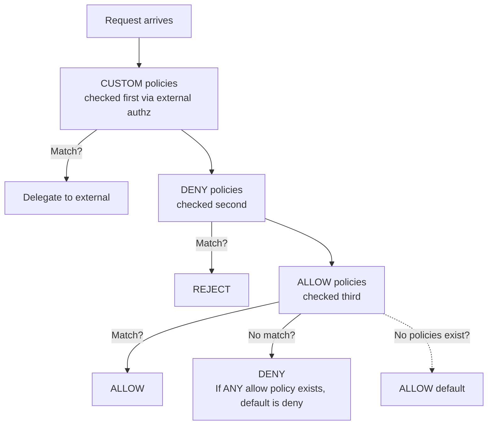
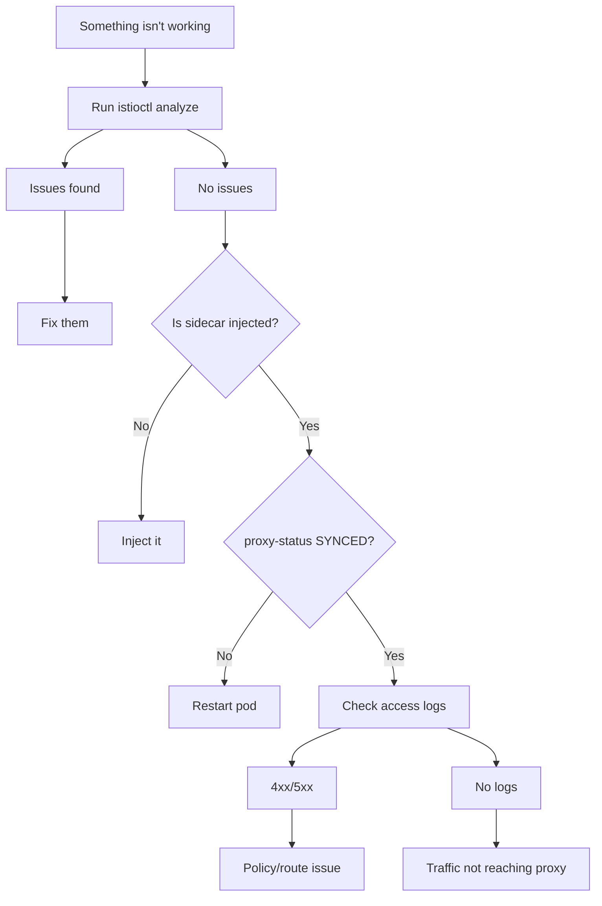

## Complexity: `[COMPLEX]`
## Time to Complete: 50-60 minutes

## Prerequisites

Before starting this module, you should have a solid foundation in both Kubernetes and Istio core components. Specifically, you must be comfortable with the concepts covered in previous modules:
- [Module 1.1: Installation & Architecture](../module-1.1-istio-installation-architecture/) — You should understand the control plane (`istiod`), the data plane (Envoy proxies), and how sidecar injection intercepts traffic.
- [Module 1.2: Traffic Management](../module-1.2-istio-traffic-management/) — You need to be familiar with `VirtualService`, `DestinationRule`, and `Gateway` resources, as security policies often interact directly with routing rules.
- General knowledge of Transport Layer Security (TLS), JSON Web Tokens (JWT), and Kubernetes Role-Based Access Control (RBAC) principles.

## What You'll Be Able to Do

After completing this deep-dive module, you will be able to:

1. **Design** comprehensive PeerAuthentication policies to enforce mTLS modes (STRICT, PERMISSIVE) gracefully across entire namespaces and specific workloads without causing downtime.
2. **Implement** robust RequestAuthentication strategies with external JWT validation and craft fine-grained AuthorizationPolicy rules that securely govern service-to-service access.
3. **Diagnose** complex mTLS handshake failures, unauthenticated request rejections, and overlapping policy conflicts using tools like `istioctl authn tls-check` and Envoy proxy access logs.
4. **Evaluate** multi-layered security architectures and apply a systematic troubleshooting workflow utilizing `istioctl analyze`, `proxy-config`, and `proxy-status` to resolve intricate service mesh outages.
5. **Compare** the evaluation order and behavioral nuances of DENY, ALLOW, and CUSTOM authorization policies to prevent unintended default-deny scenarios.

## Why This Module Matters

In modern cloud-native environments, the network perimeter is no longer a sufficient defense mechanism. Security must be implemented at the workload level, operating under a zero-trust model. This module represents a critical intersection of security engineering and operational resilience, accounting for approximately 25% of the total domain knowledge required for advanced certifications. Security configuration errors are incredibly common and their impact is often catastrophic.

Consider the highly publicized incident at a major financial technology firm in late 2023. The platform engineering team was tasked with enforcing strict mutual TLS (mTLS) compliance across a massive Kubernetes cluster running over 500 microservices. An engineer applied a mesh-wide STRICT mTLS policy to the `istio-system` namespace without first verifying the sidecar injection status of several critical legacy billing components. Because these legacy pods lacked the Envoy sidecar, they could not present the required client certificates. Within seconds of the policy being applied, the API gateway began rejecting thousands of transactions per minute with `connection reset by peer` errors. 

The resulting outage lasted for 42 minutes while the team frantically attempted to diagnose why internal traffic had suddenly halted. They lacked a systematic troubleshooting workflow, ignoring `istioctl proxy-status` and diving straight into application logs which showed nothing because the traffic was being dropped at the network layer. This incident cost the company an estimated $2.4 million in failed transactions and SLA penalties. Mastering the concepts in this module—specifically the progressive rollout of mTLS and the mastery of Istio's CLI diagnostic tools—is the exact knowledge required to prevent such disastrous scenarios.

> **The Building Security Analogy**
>
> Istio security works like a modern high-security office building. **PeerAuthentication** (mTLS) is the heavily guarded front door—it cryptographically verifies that everyone entering the network is exactly who they claim to be through a mutual exchange of certificates. **RequestAuthentication** (JWT) acts as the badge reader—it cryptographically validates that the presented identity badge was issued by a trusted authority and hasn't expired, but it doesn't actually decide which rooms the badge holder can enter. Finally, **AuthorizationPolicy** is the highly specific access control list—it evaluates the validated badge and explicitly decides whether that user is permitted to open a specific door or access a specific resource. You absolutely need all three layers functioning in harmony for a complete, zero-trust security posture.

## Did You Know?

- **Istio rotates mTLS certificates every 24 hours by default**: Each workload securely receives a short-lived SPIFFE certificate (`spiffe://<trust-domain>/ns/<namespace>/sa/<service-account>`) that is automatically rotated by the control plane. This completely eliminates the operational nightmare of manual certificate management.
- **DENY policies are evaluated before ALLOW**: Istio's authorization engine strictly processes DENY rules first, then ALLOW rules, and finally CUSTOM rules. A DENY match immediately short-circuits the evaluation process—the request is unconditionally rejected regardless of any subsequent ALLOW rules that might match.
- **`istioctl analyze` catches 40+ misconfiguration types**: This powerful diagnostic tool can instantly detect orphaned VirtualServices, missing DestinationRules, overlapping or conflicting security policies, and deprecated API usage. It is the single most valuable command for rapid problem resolution.
- **The default Authorization behavior flips instantly**: The moment you apply a single ALLOW policy to a workload, the implicit behavior for that workload switches from "allow-all" to "deny-all" for any request that doesn't explicitly match the ALLOW rule.

## War Story: The Midnight mTLS Migration

To fully grasp the stakes, let's look at another classic failure pattern. 

**Characters:**
- Marcus: Lead Platform Engineer
- Team: Managing 12 interconnected microservices on Kubernetes version 1.35

**The Incident:**

Marcus was executing a mandate to ensure all inter-service communication was encrypted. He had reviewed the documentation and determined that `STRICT` mode was the ultimate objective. During a Thursday evening maintenance window, he applied the following mesh-wide PeerAuthentication resource:

```yaml
apiVersion: security.istio.io/v1
kind: PeerAuthentication
metadata:
  name: default
  namespace: istio-system
spec:
  mtls:
    mode: STRICT
```

Instantly, the monitoring dashboards lit up red. The modern `payments` service was attempting to communicate with a deeply entrenched legacy inventory service that was running *outside* the mesh (it had no Envoy sidecar injected). Because STRICT mTLS strictly mandates that both the client and the server present valid SPIFFE certificates, the connection failed. The legacy service, lacking a proxy, couldn't participate in the cryptographic handshake. Every single request failed with a `connection reset by peer` error. The on-call engineers eventually rolled back the change, but thousands of operations failed during the confusion.

**What Marcus should have done:**

A professional migration to STRICT mTLS must be phased.

```yaml
# Step 1: Start with PERMISSIVE (accepts both mTLS and plaintext)
apiVersion: security.istio.io/v1
kind: PeerAuthentication
metadata:
  name: default
  namespace: istio-system
spec:
  mtls:
    mode: PERMISSIVE

# Step 2: Identify services without sidecars
# istioctl proxy-status  (shows which pods have proxies)

# Step 3: Exclude specific ports or services
apiVersion: security.istio.io/v1
kind: PeerAuthentication
metadata:
  name: default
  namespace: istio-system
spec:
  mtls:
    mode: STRICT
  portLevelMtls:
    8080:
      mode: DISABLE    # Legacy service port

# Step 4: Or apply STRICT per-namespace, not mesh-wide
apiVersion: security.istio.io/v1
kind: PeerAuthentication
metadata:
  name: default
  namespace: payments  # Only this namespace
spec:
  mtls:
    mode: STRICT
```

**Core Lesson**: Always initiate migrations using PERMISSIVE mode, exhaustively verify that all workloads have operational sidecars using `istioctl proxy-status`, and only then progressively enforce STRICT mode on a per-namespace basis.

---

## Part 1: Mutual TLS (mTLS) Deep Dive

### 1.1 How mTLS Works in Istio

Understanding the mechanics of mTLS is crucial for debugging. In a standard Kubernetes environment without a service mesh, pods communicate over plaintext HTTP. This means any compromised container in the cluster can easily sniff the network traffic, reading sensitive data in transit.

```mermaid
flowchart LR
    subgraph PodA [Pod A]
        AppA[App] --> EnvoyA[Envoy Proxy\n(has cert A)]
    end
    subgraph PodB [Pod B]
        EnvoyB[Envoy Proxy\n(has cert B)] --> AppB[App]
    end
    EnvoyA <-->|encrypted TLS\nmutual verify| EnvoyB
```

**Certificate identity**: Every workload injected with an Envoy proxy receives a cryptographically signed SPIFFE identity. The control plane (`istiod`) acts as the Certificate Authority (Citadel), distributing and rotating these certificates automatically.

```text
spiffe://cluster.local/ns/default/sa/reviews
         └─ trust domain  └─ namespace  └─ service account
```

> **Stop and think**: If the control plane (`istiod`) goes down temporarily, do existing mTLS connections drop? No. The Envoy proxies cache their certificates. Traffic continues to flow securely until the certificates expire (default 24 hours).

### 1.2 PeerAuthentication

The `PeerAuthentication` resource is how you dictate the mTLS behavior for workloads receiving traffic (the server-side configuration).

**Mesh-wide policy:**
By deploying the resource into the `istio-system` namespace, you establish the baseline for the entire cluster.

```yaml
apiVersion: security.istio.io/v1
kind: PeerAuthentication
metadata:
  name: default
  namespace: istio-system        # Mesh-wide when in istio-system
spec:
  mtls:
    mode: STRICT                 # Require mTLS for all services
```

**Namespace-level policy:**
You can override the mesh-wide baseline for specific namespaces. This is highly recommended for progressive rollouts.

```yaml
apiVersion: security.istio.io/v1
kind: PeerAuthentication
metadata:
  name: default
  namespace: payments            # Only affects this namespace
spec:
  mtls:
    mode: STRICT
```

**Workload-level policy:**
For granular control, you can target specific pods using label selectors.

```yaml
apiVersion: security.istio.io/v1
kind: PeerAuthentication
metadata:
  name: reviews-mtls
  namespace: default
spec:
  selector:
    matchLabels:
      app: reviews               # Only affects pods with this label
  mtls:
    mode: STRICT
```

**Port-level policy:**
You can even disable mTLS for specific ports on a workload, which is vital when exposing legacy metrics endpoints or health checks to external monitoring systems that lack sidecars.

```yaml
apiVersion: security.istio.io/v1
kind: PeerAuthentication
metadata:
  name: reviews-mtls
  namespace: default
spec:
  selector:
    matchLabels:
      app: reviews
  mtls:
    mode: STRICT
  portLevelMtls:
    8080:
      mode: DISABLE              # Disable mTLS on port 8080 only
```

**mTLS Modes Explained:**

| Mode | Behavior | Use Case |
|------|----------|----------|
| `STRICT` | Only accepts mTLS traffic | Production (full encryption) |
| `PERMISSIVE` | Accepts both mTLS and plaintext | Migration period |
| `DISABLE` | No mTLS | Legacy services, debugging |
| `UNSET` | Inherits from parent | Default behavior |

**Policy priority (most specific wins):**

Istio merges these policies based on specificity. A workload-level policy will always override a namespace-level policy, which in turn overrides a mesh-wide policy.

```text
Workload-level  >  Namespace-level  >  Mesh-level
(selector)         (namespace)          (istio-system)
```

### 1.3 DestinationRule TLS Settings

While `PeerAuthentication` controls what the *receiving* server requires, `DestinationRule` dictates how the *sending* client behaves.

```yaml
apiVersion: networking.istio.io/v1
kind: DestinationRule
metadata:
  name: reviews
spec:
  host: reviews
  trafficPolicy:
    tls:
      mode: ISTIO_MUTUAL          # Use Istio's mTLS certs
```

**DestinationRule TLS Modes:**

| Mode | Description |
|------|-------------|
| `DISABLE` | No TLS |
| `SIMPLE` | Originate TLS (client verifies server) |
| `MUTUAL` | Originate mTLS (both verify each other) |
| `ISTIO_MUTUAL` | Use Istio's built-in mTLS certificates |

> **Architectural Insight**: In modern Istio deployments, explicit `DestinationRule` TLS configurations are rarely needed for intra-mesh traffic. Istio employs "auto-mTLS," dynamically detecting if the destination pod has a sidecar and automatically upgrading the connection to `ISTIO_MUTUAL`. You primarily use this when routing traffic to external services or overriding default behaviors.

---

## Part 2: Request Authentication (JWT)

While mTLS secures the transport layer and cryptographically verifies the machine identity (the service account), it knows nothing about the end-user. This is where `RequestAuthentication` comes in. It validates JSON Web Tokens (JWTs) attached to incoming requests (usually in the `Authorization: Bearer <token>` header).

### 2.1 Basic JWT Validation

This resource instructs the Envoy proxy to cryptographically verify the signature and expiration of a JWT using the provided JSON Web Key Set (JWKS) URI.

```yaml
apiVersion: security.istio.io/v1
kind: RequestAuthentication
metadata:
  name: jwt-auth
  namespace: default
spec:
  selector:
    matchLabels:
      app: productpage
  jwtRules:
  - issuer: "https://accounts.google.com"
    jwksUri: "https://www.googleapis.com/oauth2/v3/certs"
  - issuer: "https://my-auth.example.com"
    jwksUri: "https://my-auth.example.com/.well-known/jwks.json"
    forwardOriginalToken: true     # Forward JWT to upstream
    outputPayloadToHeader: "x-jwt-payload"  # Extract claims to header
```

**The Great JWT Misconception:**
A common pitfall for engineers is deploying a `RequestAuthentication` policy and assuming their service is now secure. 
1. If a request arrives with a JWT, Envoy validates it against the JWKS URI. If invalid, it rejects it with a 401 Unauthorized.
2. If a request arrives with **NO JWT at all**, Envoy **allows it through**. 

`RequestAuthentication` merely validates tokens if they exist. To actually *enforce* the presence of a token, you must pair it with an `AuthorizationPolicy`.

### 2.2 JWT with Claim-Based Routing

You can configure the proxy to decode the validated JWT and inject specific claims into HTTP headers before forwarding the request to your application container. This offloads the burden of JWT parsing from your application code.

```yaml
apiVersion: security.istio.io/v1
kind: RequestAuthentication
metadata:
  name: jwt-auth
  namespace: default
spec:
  selector:
    matchLabels:
      app: frontend
  jwtRules:
  - issuer: "https://auth.example.com"
    jwksUri: "https://auth.example.com/.well-known/jwks.json"
    outputClaimToHeaders:
    - header: x-jwt-sub
      claim: sub
    - header: x-jwt-groups
      claim: groups
```

> **Pause and predict**: If the JWT does not contain the `groups` claim, what happens to the `x-jwt-groups` header? The proxy simply will not inject that specific header; the request still proceeds assuming the signature is valid.

---

## Part 3: Authorization Policy Rules

The `AuthorizationPolicy` resource is the final gatekeeper. It evaluates the verified identities (from mTLS and JWTs) and explicit HTTP request attributes against your defined rules.

### 3.1 Policy Actions

The order in which Istio evaluates authorization policies is rigid and incredibly important for complex architectures.



> **Critical**: If there are NO AuthorizationPolicies for a workload, all traffic is allowed. The moment you create ANY ALLOW policy, all traffic that doesn't match an ALLOW rule is denied.

### 3.2 ALLOW Policy

An `ALLOW` policy explicitly permits traffic matching its criteria. 

```yaml
apiVersion: security.istio.io/v1
kind: AuthorizationPolicy
metadata:
  name: allow-reviews
  namespace: default
spec:
  selector:
    matchLabels:
      app: reviews
  action: ALLOW
  rules:
  - from:
    - source:
        principals: ["cluster.local/ns/default/sa/productpage"]
    to:
    - operation:
        methods: ["GET"]
        paths: ["/reviews/*"]
```

This allows: GET requests to `/reviews/*` from the `productpage` service account. Everything else to the reviews service is denied.

### 3.3 DENY Policy

A `DENY` policy explicitly blocks traffic. Because DENY policies are evaluated before ALLOW policies, they are excellent for creating rigid security boundaries or blacklists.

```yaml
apiVersion: security.istio.io/v1
kind: AuthorizationPolicy
metadata:
  name: deny-external
  namespace: default
spec:
  selector:
    matchLabels:
      app: internal-api
  action: DENY
  rules:
  - from:
    - source:
        notNamespaces: ["default", "backend"]
    to:
    - operation:
        paths: ["/admin/*"]
```

This denies: Any request to `/admin/*` on the internal-api service from namespaces other than `default` or `backend`.

### 3.4 Require JWT (Combining Policies)

To actually enforce that a valid JWT is present on every request, you must deploy both resources. First, the validation policy:

```yaml
# Step 1: Validate JWT if present
apiVersion: security.istio.io/v1
kind: RequestAuthentication
metadata:
  name: require-jwt
  namespace: default
spec:
  selector:
    matchLabels:
      app: productpage
  jwtRules:
  - issuer: "https://auth.example.com"
    jwksUri: "https://auth.example.com/.well-known/jwks.json"
```

Next, the enforcement policy. The `requestPrincipals` attribute represents the authenticated user from the JWT. If it's missing, the request is denied.

```yaml
# Step 2: DENY requests without valid JWT
apiVersion: security.istio.io/v1
kind: AuthorizationPolicy
metadata:
  name: require-jwt
  namespace: default
spec:
  selector:
    matchLabels:
      app: productpage
  action: DENY
  rules:
  - from:
    - source:
        notRequestPrincipals: ["*"]   # No valid JWT principal = deny
```

### 3.5 Namespace-Level Policies

You can easily secure entire namespaces with broad policies.

```yaml
# Allow all traffic within the namespace
apiVersion: security.istio.io/v1
kind: AuthorizationPolicy
metadata:
  name: allow-same-namespace
  namespace: backend
spec:
  action: ALLOW
  rules:
  - from:
    - source:
        namespaces: ["backend"]
```

To create a literal lock-down where nothing can communicate unless explicitly allowed elsewhere:

```yaml
# Deny all traffic (explicit deny-all)
apiVersion: security.istio.io/v1
kind: AuthorizationPolicy
metadata:
  name: deny-all
  namespace: backend
spec:
  {}                               # Empty spec = deny all
```

### 3.6 Common AuthorizationPolicy Patterns

You should memorize these common attribute matches for the exam:

**Allow specific HTTP methods:**
```yaml
rules:
- to:
  - operation:
      methods: ["GET", "HEAD"]
```

**Allow from specific service accounts:**
```yaml
rules:
- from:
  - source:
      principals: ["cluster.local/ns/frontend/sa/webapp"]
```

**Allow based on JWT claims:**
Note the specific syntax `request.auth.claims[...]`.
```yaml
rules:
- from:
  - source:
      requestPrincipals: ["https://auth.example.com/*"]
  when:
  - key: request.auth.claims[role]
    values: ["admin"]
```

**Allow specific IP ranges:**
```yaml
rules:
- from:
  - source:
      ipBlocks: ["10.0.0.0/8"]
```

---

## Part 4: TLS at Ingress Gateways

To securely bring external traffic into your mesh, you must configure TLS at the ingress gateway. Can configure Gateway for ingress with TLS by linking Kubernetes secrets directly.

### 4.1 Simple TLS (Server Certificate Only)

This is the standard HTTPS setup where the gateway presents a certificate to the client browser. You must place the Kubernetes Secret in the same namespace as the ingress gateway deployment (typically `istio-system`).

```bash
# Create TLS secret
kubectl create -n istio-system secret tls my-tls-secret \
  --key=server.key \
  --cert=server.crt
```

The Gateway resource references the secret by name.

```yaml
apiVersion: networking.istio.io/v1
kind: Gateway
metadata:
  name: secure-gateway
spec:
  selector:
    istio: ingressgateway
  servers:
  - port:
      number: 443
      name: https
      protocol: HTTPS
    hosts:
    - "app.example.com"
    tls:
      mode: SIMPLE
      credentialName: my-tls-secret
```

### 4.2 Mutual TLS at Ingress (Client Certificates)

If you are building a secure API boundary, you might require the external client to present their own TLS certificate.

```bash
# Create secret with CA cert for client verification
kubectl create -n istio-system secret generic my-mtls-secret \
  --from-file=tls.key=server.key \
  --from-file=tls.crt=server.crt \
  --from-file=ca.crt=ca.crt
```

By setting the mode to `MUTUAL`, the ingress gateway enforces a two-way handshake with external clients.

```yaml
apiVersion: networking.istio.io/v1
kind: Gateway
metadata:
  name: mtls-gateway
spec:
  selector:
    istio: ingressgateway
  servers:
  - port:
      number: 443
      name: https
      protocol: HTTPS
    hosts:
    - "secure.example.com"
    tls:
      mode: MUTUAL                    # Require client certificate
      credentialName: my-mtls-secret
```

---

## Part 5: Troubleshooting and Diagnostics

When the mesh breaks, guessing is futile. You must rely on deterministic diagnostic commands.

### 5.1 istioctl analyze

The first command you should run when something isn't working:

```bash
# Analyze all namespaces
istioctl analyze --all-namespaces

# Analyze specific namespace
istioctl analyze -n default

# Analyze a specific file before applying
istioctl analyze my-virtualservice.yaml

# Common warnings/errors:
# IST0101: Referenced host not found
# IST0104: Gateway references missing secret
# IST0106: Schema validation error
# IST0108: Unknown annotation
# IST0113: VirtualService references undefined subset
```

### 5.2 istioctl proxy-status

Check if proxies are connected and in sync with istiod:

```bash
istioctl proxy-status
```

**Output interpretation:**

```text
NAME                              CDS    LDS    EDS    RDS    ECDS   ISTIOD
productpage-v1-xxx.default        SYNCED SYNCED SYNCED SYNCED SYNCED istiod-xxx
reviews-v1-xxx.default            SYNCED SYNCED SYNCED SYNCED SYNCED istiod-xxx
ratings-v1-xxx.default            STALE  SYNCED SYNCED SYNCED SYNCED istiod-xxx  ← Problem!
```

| Status | Meaning | Action |
|--------|---------|--------|
| `SYNCED` | Proxy has latest config from istiod | Normal |
| `NOT SENT` | istiod hasn't sent config (no changes) | Usually normal |
| `STALE` | Proxy hasn't acknowledged latest config | Investigate — restart pod or check connectivity |

**xDS types:**

| Type | Full Name | What It Configures |
|------|----------|-------------------|
| CDS | Cluster Discovery Service | Upstream clusters (services) |
| LDS | Listener Discovery Service | Inbound/outbound listeners |
| EDS | Endpoint Discovery Service | Endpoints (pod IPs) |
| RDS | Route Discovery Service | HTTP routing rules |
| ECDS | Extension Config Discovery | WASM extensions |

### 5.3 istioctl proxy-config

Deep inspection of what Envoy is actually configured to do:

```bash
# List all clusters (upstream services) for a pod
istioctl proxy-config clusters productpage-v1-xxx.default

# List listeners (what ports Envoy is listening on)
istioctl proxy-config listeners productpage-v1-xxx.default

# List routes (HTTP routing rules)
istioctl proxy-config routes productpage-v1-xxx.default

# List endpoints (actual pod IPs)
istioctl proxy-config endpoints productpage-v1-xxx.default

# Show the full Envoy config dump
istioctl proxy-config all productpage-v1-xxx.default -o json

# Filter by specific service
istioctl proxy-config endpoints productpage-v1-xxx.default \
  --cluster "outbound|9080||reviews.default.svc.cluster.local"
```

### 5.4 Envoy Access Logs

Enable access logs to see every request flowing through the mesh:

```bash
# Enable via mesh config
istioctl install --set meshConfig.accessLogFile=/dev/stdout -y

# View logs for a specific pod's sidecar
kubectl logs productpage-v1-xxx -c istio-proxy

# Sample log entry:
# [2024-01-15T10:30:00.000Z] "GET /reviews/1 HTTP/1.1" 200 - via_upstream
#   - 0 325 45 42 "-" "curl/7.68.0" "xxx" "reviews:9080"
#   "10.244.0.15:9080" outbound|9080||reviews.default.svc.cluster.local
#   10.244.0.10:50542 10.96.10.15:9080 10.244.0.10:50540
```

**Log format breakdown:**

```text
[timestamp] "METHOD PATH PROTOCOL" STATUS_CODE FLAGS
  - REQUEST_BYTES RESPONSE_BYTES DURATION_MS UPSTREAM_DURATION
  "USER_AGENT" "REQUEST_ID" "AUTHORITY"
  "UPSTREAM_HOST" UPSTREAM_CLUSTER
  DOWNSTREAM_LOCAL DOWNSTREAM_REMOTE DOWNSTREAM_PEER
```

### 5.5 Common Issues and Fixes

| Issue | Symptoms | Diagnostic | Fix |
|-------|----------|-----------|-----|
| Missing sidecar | Service not in mesh, no mTLS | `kubectl get pod -o jsonpath='{.spec.containers[*].name}'` | Label namespace + restart pods |
| VirtualService not applied | Traffic ignores routing rules | `istioctl analyze` (IST0113) | Check hosts match, gateway reference exists |
| mTLS STRICT with non-mesh service | `connection reset by peer` | `istioctl proxy-status` (missing pod) | Use PERMISSIVE or add sidecar |
| Stale proxy config | Old routing rules in effect | `istioctl proxy-status` (STALE) | Restart the pod |
| Gateway TLS misconfigured | TLS handshake failure | `istioctl analyze` (IST0104) | Check credentialName matches K8s Secret |
| AuthorizationPolicy blocking | 403 Forbidden | `kubectl logs <pod> -c istio-proxy` | Check RBAC filters in access logs |
| Subset not defined | 503 `no healthy upstream` | `istioctl analyze` (IST0113) | Create DestinationRule with matching subsets |
| Port name wrong | Protocol detection fails | `kubectl get svc -o yaml` (check port names) | Name ports as `http-xxx`, `grpc-xxx`, `tcp-xxx` |

### 5.6 Debugging Workflow

When something isn't working in the mesh, follow this systematic approach:

1. `istioctl analyze -n <namespace>`
2. `istioctl proxy-status`
3. `istioctl proxy-config routes <pod>`
4. `kubectl logs <pod> -c istio-proxy`
5. Verify hosts match — VirtualService `hosts` must match the service name or Gateway host.
6. Check `gateways` field — If using Gateway, VirtualService must reference it.



---

## Common Mistakes

| Mistake | Symptom | Solution |
|---------|---------|----------|
| STRICT mTLS with non-mesh services | Connection refused/reset | Use PERMISSIVE mode or add sidecars |
| RequestAuthentication without AuthorizationPolicy | Unauthenticated requests pass through | Add DENY policy for `notRequestPrincipals: ["*"]` |
| Creating ALLOW policy without catch-all | All non-matching traffic denied (surprise!) | Understand that any ALLOW policy = default deny |
| Empty AuthorizationPolicy spec | All traffic denied | `spec: {}` means deny-all, add rules for allowed traffic |
| Wrong namespace for mesh-wide policy | Policy only applies to one namespace | Mesh-wide PeerAuthentication must be in `istio-system` |
| Forgetting `credentialName` on Gateway TLS | TLS handshake fails | Create K8s Secret in `istio-system` namespace |
| Not checking port naming conventions | Protocol detection fails, policies don't apply | Name Service ports: `http-*`, `grpc-*`, `tcp-*` |
| Ignoring DENY-before-ALLOW evaluation order | ALLOW policy seems to not work | Check if a DENY policy is matching first |

---

## Quiz

**Q1: What is the difference between STRICT and PERMISSIVE mTLS?**

<details>
<summary>Show Answer</summary>

- **STRICT**: Only accepts mTLS-encrypted traffic. Plaintext connections are rejected. Use when all communicating services have sidecars.
- **PERMISSIVE**: Accepts both mTLS and plaintext traffic. Use during migration when some services don't have sidecars yet.

PERMISSIVE is the default mode. Always start with PERMISSIVE and graduate to STRICT after verifying all services have sidecars.

</details>

**Q2: You create a RequestAuthentication for a service. A request arrives without any JWT token. What happens?**

<details>
<summary>Show Answer</summary>

The request is **allowed through**. RequestAuthentication only validates tokens that are present — it does NOT require them. To reject requests without a valid JWT, add an AuthorizationPolicy:

```yaml
apiVersion: security.istio.io/v1
kind: AuthorizationPolicy
metadata:
  name: require-jwt
spec:
  selector:
    matchLabels:
      app: myservice
  action: DENY
  rules:
  - from:
    - source:
        notRequestPrincipals: ["*"]
```

</details>

**Q3: What is the evaluation order for AuthorizationPolicy actions?**

<details>
<summary>Show Answer</summary>

1. **CUSTOM** (external authorization) — checked first
2. **DENY** — checked second, short-circuits on match
3. **ALLOW** — checked third
4. If no policies exist → all traffic allowed
5. If ALLOW policies exist but none match → traffic denied

</details>

**Q4: Write an AuthorizationPolicy that allows only the `frontend` service account to call the `backend` service via GET on `/api/*`.**

<details>
<summary>Show Answer</summary>

```yaml
apiVersion: security.istio.io/v1
kind: AuthorizationPolicy
metadata:
  name: backend-policy
  namespace: default
spec:
  selector:
    matchLabels:
      app: backend
  action: ALLOW
  rules:
  - from:
    - source:
        principals: ["cluster.local/ns/default/sa/frontend"]
    to:
    - operation:
        methods: ["GET"]
        paths: ["/api/*"]
```

</details>

**Q5: A service returns `connection reset by peer` after enabling STRICT mTLS. What is the most likely cause?**

<details>
<summary>Show Answer</summary>

The calling service (or the target) doesn't have an Envoy sidecar. STRICT mode requires both sides to present mTLS certificates. Without a sidecar, the service can't participate in mTLS.

Diagnostic steps:
1. `istioctl proxy-status` — check if both pods appear
2. `kubectl get pod <pod> -o jsonpath='{.spec.containers[*].name}'` — look for `istio-proxy`
3. Fix: inject the sidecar, or use PERMISSIVE mode for that workload

</details>

**Q6: What does `istioctl proxy-status` show, and what does STALE mean?**

<details>
<summary>Show Answer</summary>

`istioctl proxy-status` shows the synchronization state between istiod and every Envoy proxy in the mesh. For each proxy, it shows the status of 5 xDS types: CDS, LDS, EDS, RDS, ECDS.

- **SYNCED**: Proxy has the latest configuration
- **NOT SENT**: No config changes to send (normal)
- **STALE**: istiod sent config but the proxy hasn't acknowledged it — indicates a problem (network issue, overloaded proxy)

Fix STALE: restart the affected pod.

</details>

**Q7: How do you enable Envoy access logging for all sidecars?**

<details>
<summary>Show Answer</summary>

```bash
# During installation
istioctl install --set meshConfig.accessLogFile=/dev/stdout -y

# Or via IstioOperator
spec:
  meshConfig:
    accessLogFile: /dev/stdout
```

Then view logs with:
```bash
kubectl logs <pod-name> -c istio-proxy
```

</details>

**Q8: What is the command to see all routing rules configured in a specific pod's Envoy proxy?**

<details>
<summary>Show Answer</summary>

```bash
istioctl proxy-config routes <pod-name>.<namespace>
```

This shows the Route Discovery Service (RDS) configuration — all HTTP routes the proxy knows about. To see more detail:

```bash
istioctl proxy-config routes <pod-name>.<namespace> -o json
```

For other config types: `clusters`, `listeners`, `endpoints`, `all`.

</details>

**Q9: You applied an AuthorizationPolicy with `action: ALLOW`, but now ALL traffic to the service is blocked except what matches the rule. Why?**

<details>
<summary>Show Answer</summary>

This is by design. When any ALLOW policy exists for a workload, the default behavior becomes **deny-all** for that workload. Only traffic that explicitly matches an ALLOW rule is permitted.

If you want to allow additional traffic patterns, either:
1. Add more rules to the existing ALLOW policy
2. Create additional ALLOW policies
3. Remove the ALLOW policy if you want default-allow behavior

</details>

**Q10: How do you debug why a VirtualService routing rule is not being applied?**

<details>
<summary>Show Answer</summary>

Systematic approach:

1. **`istioctl analyze -n <ns>`** — Check for IST0113 (missing subset), IST0101 (host not found)
2. **`istioctl proxy-status`** — Verify proxy is SYNCED
3. **`istioctl proxy-config routes <pod>`** — Check if the route appears in Envoy's config
4. **`kubectl logs <pod> -c istio-proxy`** — Check access logs for actual routing behavior
5. **Verify hosts match** — VirtualService `hosts` must match the service name or Gateway host
6. **Check `gateways` field** — If using Gateway, VirtualService must reference it
7. **Check namespace** — VirtualService must be in the same namespace as the service (or use `exportTo`)

</details>

---

## Hands-On Exercise: Security & Troubleshooting

### Objective
Configure mTLS, strict authorization policies, and actively practice troubleshooting common Istio configuration issues in a safe, sandboxed environment.

### Setup

```bash
# Ensure Istio is installed with demo profile
istioctl install --set profile=demo \
  --set meshConfig.accessLogFile=/dev/stdout -y

kubectl label namespace default istio-injection=enabled --overwrite

# Deploy Bookinfo
kubectl apply -f https://raw.githubusercontent.com/istio/istio/release-1.22/samples/bookinfo/platform/kube/bookinfo.yaml
kubectl apply -f https://raw.githubusercontent.com/istio/istio/release-1.22/samples/bookinfo/networking/destination-rule-all.yaml

kubectl wait --for=condition=ready pod --all -n default --timeout=120s
```

### Task 1: Enable STRICT mTLS

```bash
# Apply mesh-wide STRICT mTLS
kubectl apply -f - <<EOF
apiVersion: security.istio.io/v1
kind: PeerAuthentication
metadata:
  name: default
  namespace: istio-system
spec:
  mtls:
    mode: STRICT
EOF

# Verify mTLS is working
istioctl proxy-config clusters productpage-v1-$(kubectl get pods -l app=productpage -o jsonpath='{.items[0].metadata.name}' | cut -d'-' -f3-) | grep reviews
```

Verify the enforcement. Traffic should still route correctly between all services natively since they all have injected sidecars handling the complex TLS handshake.

```bash
kubectl exec $(kubectl get pod -l app=ratings -o jsonpath='{.items[0].metadata.name}') -c ratings -- curl -s productpage:9080/productpage | head -20
```

### Task 2: Create Authorization Policies

```bash
# Deny all traffic to reviews (start restrictive)
kubectl apply -f - <<EOF
apiVersion: security.istio.io/v1
kind: AuthorizationPolicy
metadata:
  name: deny-all-reviews
  namespace: default
spec:
  selector:
    matchLabels:
      app: reviews
  action: DENY
  rules:
  - from:
    - source:
        notPrincipals: ["cluster.local/ns/default/sa/bookinfo-productpage"]
EOF
```

Verify the enforcement constraints: Only `productpage` can reach the `reviews` application. Malicious or accidental requests originating from other services should be firmly denied with an HTTP 403 response.

```bash
# This should work (productpage → reviews)
kubectl exec $(kubectl get pod -l app=productpage -o jsonpath='{.items[0].metadata.name}') \
  -c productpage -- curl -s -o /dev/null -w "%{http_code}" http://reviews:9080/reviews/1

# This should fail with 403 (ratings → reviews)
kubectl exec $(kubectl get pod -l app=ratings -o jsonpath='{.items[0].metadata.name}') \
  -c ratings -- curl -s -o /dev/null -w "%{http_code}" http://reviews:9080/reviews/1
```

### Task 3: Troubleshooting Practice

Intentionally introduce a configuration flaw into the environment to simulate a real-world outage, then systematically diagnose and fix it.

```bash
# Create a VirtualService with a typo in the subset name
kubectl apply -f - <<EOF
apiVersion: networking.istio.io/v1
kind: VirtualService
metadata:
  name: reviews-broken
spec:
  hosts:
  - reviews
  http:
  - route:
    - destination:
        host: reviews
        subset: v99   # This subset doesn't exist!
EOF

# Now diagnose:
# Step 1: Analyze
istioctl analyze -n default
# Expected: IST0113 - Referenced subset not found

# Step 2: Check proxy config
istioctl proxy-config routes $(kubectl get pod -l app=productpage \
  -o jsonpath='{.items[0].metadata.name}').default | grep reviews

# Step 3: Fix it
kubectl apply -f - <<EOF
apiVersion: networking.istio.io/v1
kind: VirtualService
metadata:
  name: reviews-broken
spec:
  hosts:
  - reviews
  http:
  - route:
    - destination:
        host: reviews
        subset: v1    # Fixed!
EOF

# Step 4: Verify
istioctl analyze -n default
```

### Task 4: Inspect Envoy Configuration

```bash
# Get the productpage pod name
PP_POD=$(kubectl get pod -l app=productpage -o jsonpath='{.items[0].metadata.name}')

# View all clusters (upstream services)
istioctl proxy-config clusters $PP_POD.default

# View listeners
istioctl proxy-config listeners $PP_POD.default

# View routes
istioctl proxy-config routes $PP_POD.default

# View endpoints for reviews service
istioctl proxy-config endpoints $PP_POD.default \
  --cluster "outbound|9080||reviews.default.svc.cluster.local"

# Check access logs
kubectl logs $PP_POD -c istio-proxy --tail=10
```

### Success Criteria

- [ ] STRICT mTLS is comprehensively enabled mesh-wide and all workloads seamlessly communicate.
- [ ] AuthorizationPolicy accurately restricts sensitive `reviews` access to the `productpage` component exclusively.
- [ ] You independently identify the `IST0113` error leveraging `istioctl analyze` after deploying the broken VirtualService.
- [ ] You confidently traverse `proxy-config` outputs to audit clusters, internal listeners, specific routes, and backend endpoints.
- [ ] Proxy access logs prominently display deep telemetry and routing metrics within the `istio-proxy` sidecar context.
- [ ] Can configure Gateway for ingress with TLS.

### Cleanup

Restore the environment to its pristine initial state to prevent resource conflicts in subsequent modules.

```bash
kubectl delete peerauthentication default -n istio-system
kubectl delete authorizationpolicy deny-all-reviews -n default
kubectl delete virtualservice reviews-broken -n default
kubectl delete -f https://raw.githubusercontent.com/istio/istio/release-1.22/samples/bookinfo/platform/kube/bookinfo.yaml
kubectl delete -f https://raw.githubusercontent.com/istio/istio/release-1.22/samples/bookinfo/networking/destination-rule-all.yaml
istioctl uninstall --purge -y
kubectl delete namespace istio-system
```

---

## Next Module

Ready for more? Continue your learning journey in [Module 1.4: Istio Observability](../module-1.4-istio-observability/) to explore Istio metrics, deep distributed tracing configurations, rich access logging, and dynamic visual dashboards using Kiali, Prometheus, and Grafana. Observability is absolutely critical for debugging complex distributed networks.

### Final Exam Prep Checklist

- [ ] Can install Istio with `istioctl` using different profiles
- [ ] Can configure automatic and manual sidecar injection
- [ ] Can write VirtualService for traffic splitting, header routing, fault injection
- [ ] Can write DestinationRule for subsets, circuit breaking, outlier detection
- [ ] Can configure Gateway for ingress with TLS
- [ ] Can set up ServiceEntry for egress control
- [ ] Can configure PeerAuthentication (STRICT/PERMISSIVE)
- [ ] Can write AuthorizationPolicy (ALLOW/DENY)
- [ ] Can use `istioctl analyze`, `proxy-status`, `proxy-config` for debugging
- [ ] Can read Envoy access logs and diagnose common issues

Good luck mastering the service mesh!