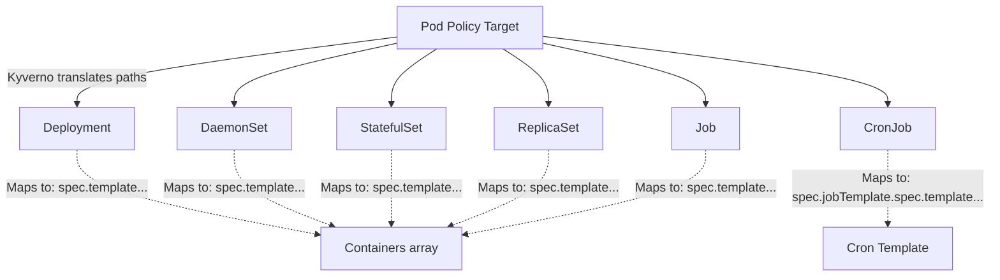

> **Complexity**: `[COMPLEX]` - Domain 5: Kyverno Advanced Policy Writing (32% of exam)
>
> **Time to Complete**: 90-120 minutes
>
> **Prerequisites**: Kyverno basics (install, ClusterPolicy vs Policy), Kubernetes admission controllers, familiarity with YAML and kubectl

---

## What You'll Be Able to Do

After completing this rigorous module, you will be able to:

1. **Design** complex Kyverno policies using Common Expression Language (CEL), JMESPath projections, RFC 6902 JSON patches, and dynamic API call variables to enforce strict security baselines.
2. **Implement** robust software supply chain security through image verification policies that validate Cosign signatures, Notary certificates, and vulnerability attestations.
3. **Evaluate** cluster state and automate lifecycle management by deploying scheduled CleanupPolicies to eliminate orphaned or non-compliant resources.
4. **Diagnose** policy evaluation scope and cluster compliance by leveraging autogen controls, conditional preconditions, and retroactive background scans.

---

## Why This Module Matters

Domain 5 is the single largest section of the KCA certification exam, comprising 32% of the overall score. You simply cannot pass without demonstrating mastery over advanced Kyverno policy writing. While basic validate and mutate rules are excellent starting points, production environments demand significantly more sophistication. The exam rigorously tests your ability to write CEL expressions, configure strict image verification, design TTL-based cleanup policies, manipulate data via complex JMESPath, apply precise JSON patches, manage autogen behavior, and utilize background scans alongside dynamic API call variables. This module systematically covers every one of those advanced topics with deep technical context and copy-paste-ready examples designed for Kubernetes v1.35+.

Consider a major security incident at a global logistics enterprise. The platform engineering team deployed Kyverno with a simple "require labels" policy to manage billing in their massive multi-tenant environment, assuming they had established adequate governance. Six months later, a sophisticated supply chain attack bypassed their basic admission controls. The attacker deployed a payload that stripped identifying labels post-admission and executed a privileged container escalation. The team had never configured `verifyImages` or advanced JSON patches to enforce security contexts dynamically. The incident cost the company over $4.2 million in regulatory fines and compute theft. 

After the incident post-mortem, the organization completely rewrote their policy engine. They implemented advanced CEL expressions for rapid validation, enforced strict signature verification for all container images, and utilized dynamic API lookups to strictly validate every workload against their central identity provider. The definitive lesson from this disaster: basic policies are table stakes, but advanced, multi-layered policies are where actual infrastructure security lives.

---

## Did You Know?

- Kyverno's CEL engine (standardized in Kubernetes ValidatingAdmissionPolicies and adopted by Kyverno) parses rules at admission time with strongly typed safety, reducing evaluation latency by up to 60% compared to equivalent JMESPath queries.
- The `verifyImages` rule type uniquely executes in two distinct webhook phases: first as a mutating webhook to pin the image tag to an immutable SHA256 digest, and then as a validating webhook, completely eliminating Time-of-Check to Time-of-Use (TOCTOU) race conditions.
- Kyverno `CleanupPolicy` resources are architecturally unique because they rely on an internal cron-based controller (e.g., `0 */6 * * *`) rather than reacting to synchronous API server admission requests.
- Kyverno background scans process up to 1000 existing cluster resources per minute by default, allowing administrators to retroactively generate PolicyReports across massive clusters without introducing latency to new API requests.

---

## 1. CEL (Common Expression Language)

Common Expression Language (CEL) is a lightweight, strongly-typed expression language originally developed by Google. In the Kubernetes ecosystem, CEL has become the standard for validation, primarily through its use in CustomResourceDefinition (CRD) validation rules and ValidatingAdmissionPolicies. Kyverno supports CEL as a highly performant alternative to JMESPath for validation expressions.

CEL expressions are compiled before they are evaluated, which provides immediate feedback on syntax errors and ensures that expressions are strongly typed. This makes CEL significantly faster and safer for simple boolean logic and field checks compared to traditional JSON processing languages.

### CEL Syntax Basics

The following example demonstrates how to enforce that all containers run as a non-root user. Notice how the CEL expression uses a C-like syntax to traverse the object graph and evaluate boolean conditions.

```yaml
apiVersion: kyverno.io/v1
kind: ClusterPolicy
metadata:
  name: require-run-as-nonroot
spec:
  validationFailureAction: Enforce
  rules:
    - name: check-nonroot
      match:
        any:
          - resources:
              kinds:
                - Pod
      validate:
        cel:
          expressions:
            - expression: >-
                object.spec.containers.all(c,
                  has(c.securityContext) &&
                  has(c.securityContext.runAsNonRoot) &&
                  c.securityContext.runAsNonRoot == true)
              message: "All containers must set securityContext.runAsNonRoot to true."
```

### CEL vs JMESPath: When to Use Which

Choosing between CEL and JMESPath depends entirely on the operation you are attempting to perform. While CEL is faster and safer for validation, it is deliberately limited in scope and cannot mutate data.

| Feature | CEL | JMESPath |
|---|---|---|
| **Syntax style** | C-like (`object.spec.x`) | Path-based (`request.object.spec.x`) |
| **Type safety** | Strongly typed at parse time | Loosely typed |
| **List operations** | `all()`, `exists()`, `filter()`, `map()` | Projections, filters |
| **String functions** | `startsWith()`, `contains()`, `matches()` | `starts_with()`, `contains()` |
| **Best for** | Simple field checks, boolean logic | Complex data transformations |
| **Mutation support** | No (validate only) | Yes (validate + mutate) |
| **Kyverno version** | 1.11+ | All versions |

**Exam tip**: CEL cannot be used in mutate rules. If an exam scenario requires altering the payload of an API request, you must use JMESPath and either JSON patches or strategic merge patches.

### CEL with `oldObject` for UPDATE Validation

A powerful feature of admission controllers is the ability to compare the incoming state against the existing state. In CEL, the existing state of the resource is accessible via `oldObject`. This is crucial for enforcing immutability on specific fields, such as preventing a team from removing a billing label after a resource has been provisioned.

```yaml
apiVersion: kyverno.io/v1
kind: ClusterPolicy
metadata:
  name: prevent-label-removal
spec:
  validationFailureAction: Enforce
  rules:
    - name: block-label-delete
      match:
        any:
          - resources:
              kinds:
                - Deployment
              operations:
                - UPDATE
      validate:
        cel:
          expressions:
            - expression: >-
                !has(oldObject.metadata.labels.app) ||
                has(object.metadata.labels.app)
              message: "The 'app' label cannot be removed once set."
```

---

## 2. verifyImages: Cosign and Attestation Checks

Securing the software supply chain requires cryptographic proof that a container image was built by a trusted entity and has not been tampered with. The `verifyImages` rule type enforces that container images are signed and optionally carry specific attestations (like a Software Bill of Materials or vulnerability scan report) before they can run in the cluster.

> **Stop and think**: Why is it crucial to set a higher `webhookTimeoutSeconds` (like 30s) when implementing image verification policies compared to simple label checks?
> *Because verifying an image requires Kyverno to reach out over the network to the container registry to fetch cryptographic signatures and attestations. Network latency and registry response times can easily exceed the default 10-second webhook timeout.*

### Cosign Signature Verification

Cosign (part of the Sigstore project) is the modern standard for container signing. It stores signatures directly in the OCI registry alongside the image.

```yaml
apiVersion: kyverno.io/v1
kind: ClusterPolicy
metadata:
  name: verify-image-signature
spec:
  validationFailureAction: Enforce
  webhookTimeoutSeconds: 30
  rules:
    - name: verify-cosign-signature
      match:
        any:
          - resources:
              kinds:
                - Pod
      verifyImages:
        - imageReferences:
            - "registry.example.com/*"
          attestors:
            - count: 1
              entries:
                - keys:
                    publicKeys: |-
                      -----BEGIN PUBLIC KEY-----
                      MFkwEwYHKoZIzj0CAQYIKoZIzj0DAQcDQgAEsLeM2H+JQfHi1PtMFbJFo3pABv2
                      OKjrFHxGnTYNeFJ4mDPOI8gMSMcKzfcWaVMPe8ZuGAsCmoAxmyBXnbPHTQ==
                      -----END PUBLIC KEY-----
```

### Notary Signature Verification

While Cosign is highly popular, many enterprise environments still rely on Notary (v1 or v2) for signing, often integrated deeply into enterprise registries. Kyverno supports validating these certificate-based signatures as well.

```yaml
apiVersion: kyverno.io/v1
kind: ClusterPolicy
metadata:
  name: verify-notary-signature
spec:
  validationFailureAction: Enforce
  rules:
    - name: verify-notary
      match:
        any:
          - resources:
              kinds:
                - Pod
      verifyImages:
        - imageReferences:
            - "registry.example.com/*"
          attestors:
            - entries:
                - certificates:
                    cert: |-
                      -----BEGIN CERTIFICATE-----
                      ...your certificate here...
                      -----END CERTIFICATE-----
```

### Attestation Checks (SBOM / Vulnerability Scan)

An attestation is a signed metadata document describing something about the image, such as its build provenance, an SBOM (Software Bill of Materials), or a vulnerability scan result. The policy below blocks any image that has critical vulnerabilities reported in its Trivy attestation payload.

```yaml
apiVersion: kyverno.io/v1
kind: ClusterPolicy
metadata:
  name: verify-vulnerability-scan
spec:
  validationFailureAction: Enforce
  rules:
    - name: check-vuln-attestation
      match:
        any:
          - resources:
              kinds:
                - Pod
      verifyImages:
        - imageReferences:
            - "registry.example.com/*"
          attestors:
            - entries:
                - keys:
                    publicKeys: |-
                      -----BEGIN PUBLIC KEY-----
                      ...
                      -----END PUBLIC KEY-----
          attestations:
            - type: https://cosign.sigstore.dev/attestation/vuln/v1
              conditions:
                - all:
                    - key: "{{ scanner }}"
                      operator: Equals
                      value: "trivy"
                    - key: "{{ result[?severity == 'CRITICAL'] | length(@) }}"
                      operator: LessThanOrEquals
                      value: "0"
```

---

## 3. Cleanup Policies

Kubernetes has internal garbage collection relying on owner references, but it lacks a native mechanism to clean up independent resources based on custom criteria or time-to-live (TTL). Kyverno bridges this gap with Cleanup Policies.

Cleanup policies automatically delete resources matching specific criteria on a defined schedule. They are defined using the `CleanupPolicy` (namespaced) or `ClusterCleanupPolicy` (cluster-wide) CustomResourceDefinitions. Unlike validating webhooks that react to API traffic, cleanup controllers operate autonomously.

### Basic CleanupPolicy: Delete Old Pods

This policy runs every 15 minutes and ensures that any Pods permanently stuck in the `Failed` phase across the cluster are purged, freeing up API server database space.

```yaml
apiVersion: kyverno.io/v2
kind: ClusterCleanupPolicy
metadata:
  name: delete-failed-pods
spec:
  match:
    any:
      - resources:
          kinds:
            - Pod
  conditions:
    any:
      - key: "{{ target.status.phase }}"
        operator: Equals
        value: Failed
  schedule: "*/15 * * * *"
```

### TTL-Based Cleanup

Time-To-Live (TTL) is incredibly useful for temporary environments, feature branch deployments, or short-lived diagnostic configurations.

```yaml
apiVersion: kyverno.io/v2
kind: CleanupPolicy
metadata:
  name: cleanup-old-configmaps
  namespace: staging
spec:
  match:
    any:
      - resources:
          kinds:
            - ConfigMap
          selector:
            matchLabels:
              temporary: "true"
  conditions:
    any:
      - key: "{{ time_since('', '{{ target.metadata.creationTimestamp }}', '') }}"
        operator: GreaterThan
        value: "24h"
  schedule: "0 */6 * * *"
```

Every 6 hours, the controller deletes ConfigMaps in the `staging` namespace labeled `temporary: "true"` that have existed for more than 24 hours.

### Cleanup Policy with Exclusions

Sometimes you want to clean up a broad category of resources, but explicitly exclude a protected subset. Exclusions are perfect for this pattern.

```yaml
apiVersion: kyverno.io/v2
kind: ClusterCleanupPolicy
metadata:
  name: cleanup-completed-jobs
spec:
  match:
    any:
      - resources:
          kinds:
            - Job
  exclude:
    any:
      - resources:
          selector:
            matchLabels:
              retain: "true"
  conditions:
    all:
      - key: "{{ target.status.succeeded }}"
        operator: GreaterThan
        value: 0
  schedule: "0 2 * * *"
```

---

## 4. Complex JMESPath

JMESPath is Kyverno's primary expression language. Originally designed for querying JSON payloads in the AWS CLI, it has been heavily extended by the Kyverno team with custom functions tailored for Kubernetes operations.

Advanced queries go well beyond simple field access; they allow you to project arrays, filter collections, format strings, and perform type conversions dynamically.

### Multi-Level Queries and Projections

Navigating Kubernetes objects often requires drilling into nested arrays. The following policy uses a JMESPath filter projection (`[?...]`) to evaluate all containers within a Pod simultaneously.

```yaml
apiVersion: kyverno.io/v1
kind: ClusterPolicy
metadata:
  name: limit-container-ports
spec:
  validationFailureAction: Enforce
  rules:
    - name: max-three-ports
      match:
        any:
          - resources:
              kinds:
                - Pod
      validate:
        message: "Each container may expose a maximum of 3 ports."
        deny:
          conditions:
            any:
              - key: "{{ request.object.spec.containers[?length(ports || `[]`) > `3`] | length(@) }}"
                operator: GreaterThan
                value: 0
```

### Key JMESPath Functions for the Exam

You must understand how to utilize these built-in functions during the certification exam. Note that JMESPath literals using backticks (like `` `[]` ``) must be properly quoted when embedded in YAML to prevent parsing errors.

```jmespath
# length() - count items or string length
"{{ request.object.spec.containers | length(@) }}"

# contains() - check if array/string contains a value
"{{ contains(request.object.metadata.labels.keys(@), 'app') }}"

# starts_with() / ends_with() - string prefix/suffix checks
"{{ starts_with(request.object.metadata.name, 'prod-') }}"

# join() - concatenate array elements
"{{ request.object.spec.containers[*].name | join(', ', @) }}"

# to_string() / to_number() - type conversion
"{{ to_number(request.object.spec.containers[0].resources.limits.cpu || '0') }}"

# merge() - combine objects
"{{ merge(request.object.metadata.labels, `{\"managed-by\": \"kyverno\"}`) }}"

# not_null() - return first non-null value
"{{ not_null(request.object.metadata.labels.team, 'unknown') }}"
```

### Multi-Level Projection Example

A hallmark of a well-designed policy is clear, actionable feedback to the user. This policy not only blocks non-compliant Pods but utilizes JMESPath string joining to tell the engineer exactly which containers are missing memory limits.

```yaml
apiVersion: kyverno.io/v1
kind: ClusterPolicy
metadata:
  name: require-resource-limits
spec:
  validationFailureAction: Enforce
  rules:
    - name: check-all-containers
      match:
        any:
          - resources:
              kinds:
                - Pod
      validate:
        message: >-
          All containers must define memory limits. Missing in:
          {{ request.object.spec.containers[?!contains(keys(resources.limits || `{}`), 'memory')].name | join(', ', @) }}
        deny:
          conditions:
            any:
              - key: "{{ request.object.spec.containers[?!contains(keys(resources.limits || `{}`), 'memory')] | length(@) }}"
                operator: GreaterThan
                value: 0
```

---

## 5. JSON Patches (RFC 6902)

Kyverno supports two distinct mutation approaches: **strategic merge patches** (overlay) and **RFC 6902 JSON patches**.

Strategic merge patching is unique to Kubernetes; it knows that lists like `containers` should be merged based on the `name` key. However, it is inherently limited. RFC 6902 JSON patches give you precise, low-level control with distinct operations: `add`, `remove`, `replace`, `move`, `copy`, and `test`.

> **Pause and predict**: If you use a JSON patch to add an element to an array with the path `/spec/containers/-`, what happens if you apply the policy multiple times to the same object?
> *JSON Patch operations are evaluated by the admission controller during creation or modification. Because the path `/-` appends without checking existence, if a controller re-triggers the mutation logic without idempotency checks, it could duplicate sidecar containers. Kyverno handles this gracefully, but caution is required in complex setups.*

### When to Use JSON Patch vs Strategic Merge

| Scenario | Use JSON Patch | Use Strategic Merge |
|---|---|---|
| Add a sidecar container | Yes | Works but verbose |
| Set a single field | Either works | Simpler syntax |
| Remove a field | Yes (only option) | Cannot remove |
| Conditional array element changes | Yes | No |
| Add to a specific array index | Yes | No |

### JSON Patch: Inject Sidecar Container

This is a classic platform engineering pattern: transparently injecting logging or security sidecars into developer workloads without requiring them to modify their deployment manifests.

```yaml
apiVersion: kyverno.io/v1
kind: ClusterPolicy
metadata:
  name: inject-logging-sidecar
spec:
  rules:
    - name: add-sidecar
      match:
        any:
          - resources:
              kinds:
                - Pod
              selector:
                matchLabels:
                  inject-sidecar: "true"
      mutate:
        patchesJson6902: |-
          - op: add
            path: "/spec/containers/-"
            value:
              name: log-collector
              image: fluent/fluent-bit:3.0
              resources:
                limits:
                  memory: "128Mi"
                  cpu: "100m"
              volumeMounts:
                - name: shared-logs
                  mountPath: /var/log/app
          - op: add
            path: "/spec/volumes/-"
            value:
              name: shared-logs
              emptyDir: {}
```

The `/-` at the end of the path array signifies "append to the end of the array."

### JSON Patch: Remove and Replace

```yaml
apiVersion: kyverno.io/v1
kind: ClusterPolicy
metadata:
  name: enforce-image-registry
spec:
  rules:
    - name: replace-image-registry
      match:
        any:
          - resources:
              kinds:
                - Pod
      mutate:
        patchesJson6902: |-
          - op: replace
            path: "/spec/containers/0/image"
            value: "registry.internal.example.com/nginx:1.27"
```

**Caution**: JSON Patch uses absolute integer array indices (`/0`, `/1`). If the targeted index does not exist in the incoming resource, the entire patch operation will fail. Strategic merge is generally safer when you do not definitively know the array length or position.

---

## 6. Autogen Rules

One of Kyverno's most powerful developer-experience features is Autogen. When you write a policy targeting Pods, Kyverno automatically translates and generates parallel rules for all Pod controllers (Deployments, DaemonSets, StatefulSets, Jobs, CronJobs, ReplicaSets). 

This means you write a single rule for Pods, and Kyverno intercepts the high-level controller deployments at the API gateway, blocking the Deployment directly rather than letting the Deployment succeed but constantly fail to spawn Pods (which leads to obscure ReplicaSet scaling failures).

### How Autogen Works

```text
┌─────────────────────────────────────────────────────┐
│  You write a policy matching: Pod                   │
│                                                     │
│  Kyverno auto-generates rules for:                  │
│  ├── Deployment    (spec.template.spec.containers)  │
│  ├── DaemonSet     (spec.template.spec.containers)  │
│  ├── StatefulSet   (spec.template.spec.containers)  │
│  ├── ReplicaSet    (spec.template.spec.containers)  │
│  ├── Job           (spec.template.spec.containers)  │
│  └── CronJob       (spec.jobTemplate.spec.template) │
└─────────────────────────────────────────────────────┘
```

Here is a visual representation of this controller hierarchy using Mermaid:



### Controlling Autogen Behavior

In some environments, you may only want policies applied to specific controllers. You can dictate autogen targets using the `pod-policies.kyverno.io/autogen-controllers` annotation:

```yaml
apiVersion: kyverno.io/v1
kind: ClusterPolicy
metadata:
  name: require-labels
  annotations:
    # Only auto-generate for Deployments and StatefulSets
    pod-policies.kyverno.io/autogen-controllers: Deployment,StatefulSet
spec:
  rules:
    - name: require-app-label
      match:
        any:
          - resources:
              kinds:
                - Pod
      validate:
        message: "The label 'app' is required."
        pattern:
          metadata:
            labels:
              app: "?*"
```

To disable autogen completely, bypassing all controller translation:

```yaml
metadata:
  annotations:
    pod-policies.kyverno.io/autogen-controllers: none
```

### Viewing Generated Rules

```bash
# After applying a Pod-targeting policy, inspect the generated rules:
k get clusterpolicy require-labels -o yaml | grep -A 5 "autogen-"
```

Kyverno dynamically injects the autogenerated rules directly into the policy object payload under `status.autogen` (or inline in the spec, depending on your cluster version). Each derived rule has a name prefixed with `autogen-`.

**Exam tip**: Autogen heavily relies on pattern matching within standard pod specifications (`spec.containers`). If your policy validates a field completely outside this standard envelope (for example `spec.nodeName` which may not exist identically in a CronJob), autogen will not be able to securely translate it and may silently skip generating that specific rule. Always verify the live state with `kubectl get clusterpolicy -o yaml`.

---

## 7. Background Scans

Kyverno operates fundamentally as an admission controller, intercepting requests in real-time. However, cluster states drift. Administrators modify policies, or resources are forcefully bypassed. By default, Kyverno addresses this through periodic background scans of existing resources.

### Configuring Background Scan Behavior

```yaml
apiVersion: kyverno.io/v1
kind: ClusterPolicy
metadata:
  name: audit-privileged-containers
spec:
  validationFailureAction: Audit
  background: true  # default is true
  rules:
    - name: deny-privileged
      match:
        any:
          - resources:
              kinds:
                - Pod
      validate:
        message: "Privileged containers are not allowed."
        pattern:
          spec:
            containers:
              - securityContext:
                  privileged: "!true"
```

When operating with `background: true` alongside `validationFailureAction: Audit`, the Kyverno background controller iteratively scans all existing Pods in the cluster and generates standardized `PolicyReport` entries for any violations discovered. Crucially, it does not block, terminate, or delete existing workloads.

### Admission-Only Enforcement

Certain policies—like restricting specific untrusted image tags—should only be enforced at the moment of admission. Scanning existing legacy workloads that are already running might trigger thousands of irrelevant alerts.

```yaml
apiVersion: kyverno.io/v1
kind: ClusterPolicy
metadata:
  name: block-latest-tag
spec:
  validationFailureAction: Enforce
  background: false  # only check at admission time
  rules:
    - name: no-latest
      match:
        any:
          - resources:
              kinds:
                - Pod
      validate:
        message: "The ':latest' tag is not allowed."
        pattern:
          spec:
            containers:
              - image: "!*:latest"
```

Setting `background: false` explicitly configures the engine to evaluate the rule exclusively during admission webhook execution.

### Reading Policy Reports

Kyverno generates Policy Reports conforming to the official `wg-policy-prototypes` standard, ensuring interoperability with visualization tools like Policy Reporter.

```bash
# List all policy reports (namespaced)
k get policyreport -A

# View a specific report's results
k get policyreport -n default -o yaml

# Cluster-scoped reports
k get clusterpolicyreport
```

---

## 8. Variables and API Calls

Advanced policies cannot rely on static data. By utilizing context variables, policies can pull dynamic configuration data from external sources, including the Kubernetes API itself, cluster ConfigMaps, or remote web services.

### Using ConfigMap as a Variable Source

In this scenario, we maintain a list of allowed enterprise registries in a ConfigMap. This decouples policy logic from configuration data, allowing security teams to update the allowed registries without modifying the core policy object.

```kubernetes
apiVersion: v1
kind: ConfigMap
metadata:
  name: allowed-registries
  namespace: kyverno
data:
  registries: "registry.example.com,gcr.io/my-project,docker.io/myorg"
---
apiVersion: kyverno.io/v1
kind: ClusterPolicy
metadata:
  name: restrict-registries-from-configmap
spec:
  validationFailureAction: Enforce
  rules:
    - name: check-registry
      match:
        any:
          - resources:
              kinds:
                - Pod
      context:
        - name: allowedRegistries
          configMap:
            name: allowed-registries
            namespace: kyverno
      validate:
        message: >-
          Image registry is not in the allowed list.
          Allowed: {{ allowedRegistries.data.registries }}
        deny:
          conditions:
            all:
              - key: "{{ request.object.spec.containers[].image | [0] | split(@, '/') | [0] }}"
                operator: AnyNotIn
                value: "{{ allowedRegistries.data.registries | split(@, ',') }}"
```

### Calling the Kubernetes API

Sometimes the admission request payload (`request.object`) does not contain all the necessary context. For instance, a Pod specification does not contain the labels of the Namespace it is being deployed into. You can execute dynamic API lookups during policy evaluation.

```yaml
apiVersion: kyverno.io/v1
kind: ClusterPolicy
metadata:
  name: require-namespace-label
spec:
  validationFailureAction: Enforce
  rules:
    - name: check-ns-label
      match:
        any:
          - resources:
              kinds:
                - Pod
      context:
        - name: nsLabels
          apiCall:
            urlPath: "/api/v1/namespaces/{{ request.namespace }}"
            jmesPath: "metadata.labels"
      validate:
        message: >-
          Pods can only be created in namespaces with a 'team' label.
          Namespace '{{ request.namespace }}' is missing the 'team' label.
        deny:
          conditions:
            any:
              - key: team
                operator: AnyNotIn
                value: "{{ nsLabels | keys(@) }}"
```

### API Call with POST (Service Call)

Kyverno can interface with entirely external, non-Kubernetes services using POST requests, allowing you to build comprehensive integrations with centralized enterprise identity or compliance platforms.

```yaml
context:
  - name: externalCheck
    apiCall:
      method: POST
      urlPath: "https://policy-check.internal/validate"
      data:
        - key: image
          value: "{{ request.object.spec.containers[0].image }}"
      jmesPath: "allowed"
```

---

## 9. Preconditions

Kyverno rules process operations linearly. Preconditions act as the initial gatekeeper; they evaluate boolean conditions before any complex validation, mutation, or API calls occur. This is essential for conditional enforcement and saving CPU cycles on irrelevant resources.

### Basic Precondition

```yaml
apiVersion: kyverno.io/v1
kind: ClusterPolicy
metadata:
  name: require-probes-in-prod
spec:
  validationFailureAction: Enforce
  rules:
    - name: check-readiness-probe
      match:
        any:
          - resources:
              kinds:
                - Pod
      preconditions:
        all:
          - key: "{{ request.namespace }}"
            operator: In
            value:
              - production
              - prod-*
      validate:
        message: "All containers in production namespaces must have a readinessProbe."
        pattern:
          spec:
            containers:
              - readinessProbe: {}
```

This rule exclusively fires for Pods provisioned in production namespaces. In staging, the precondition fails early, bypassing the validation block entirely and allowing deployments without probes.

### Preconditions with Complex Logic

Preconditions can stack boolean evaluations using `any` (OR logic) or `all` (AND logic).

```yaml
apiVersion: kyverno.io/v1
kind: ClusterPolicy
metadata:
  name: enforce-image-digest-for-critical
spec:
  validationFailureAction: Enforce
  rules:
    - name: digest-required
      match:
        any:
          - resources:
              kinds:
                - Pod
      preconditions:
        any:
          - key: "{{ request.object.metadata.labels.criticality || '' }}"
            operator: Equals
            value: "high"
          - key: "{{ request.namespace }}"
            operator: In
            value:
              - production
              - financial
      validate:
        message: >-
          Critical workloads must use image digests, not tags.
          Use image@sha256:... format.
        deny:
          conditions:
            any:
              - key: "{{ request.object.spec.containers[?!contains(@.image, '@sha256:')] | length(@) }}"
                operator: GreaterThan
                value: 0
```

### Precondition Operators Reference

Kyverno relies heavily on operators for conditional logic mapping. Familiarize yourself with these core operators.

| Operator | Description | Example |
|---|---|---|
| `Equals` / `NotEquals` | Exact match | `key: "foo"`, `value: "foo"` |
| `In` / `NotIn` | Membership check | `key: "foo"`, `value: ["foo","bar"]` |
| `GreaterThan` / `LessThan` | Numeric comparison | `key: "5"`, `value: 3` |
| `GreaterThanOrEquals` / `LessThanOrEquals` | Inclusive comparison | `key: "5"`, `value: 5` |
| `AnyIn` / `AnyNotIn` | Any element matches | Array-to-array comparison |
| `AllIn` / `AllNotIn` | All elements match | Array-to-array comparison |
| `DurationGreaterThan` | Time duration comparison | `key: "2h"`, `value: "1h"` |

---

## Common Mistakes

Writing advanced policies introduces significant complexity. Below are the most frequent pitfalls engineers encounter in production.

| Mistake | Problem | Solution |
|---|---|---|
| Using CEL in mutate rules | CEL only works with validate | Use JMESPath for mutation |
| Forgetting `webhookTimeoutSeconds` on `verifyImages` | Signature verification can be slow; default 10s may timeout | Set to 30s for image verification policies |
| Using `background: true` with `verifyImages` | Image verification cannot run in background scans | Kyverno ignores background for verifyImages, but be aware |
| JSON Patch with wrong array index | Index out of bounds causes patch failure | Use `/-` to append, or use strategic merge |
| Not quoting JMESPath backtick literals | `` `[]` `` and `` `{}` `` are JMESPath literals, not YAML | Wrap entire expression in double quotes |
| Assuming autogen works for all fields | Fields outside `spec.containers` may not translate | Verify with `kubectl get clusterpolicy -o yaml` |
| CleanupPolicy without RBAC | Kyverno SA needs delete permission on target resources | Ensure Kyverno ClusterRole covers cleanup targets |
| Precondition `any` vs `all` confusion | `any` = OR logic, `all` = AND logic | Think "any of these must be true" vs "all must be true" |

---

## Quiz

Test your comprehension of advanced policy mechanics.

**Question 1**: What is the key limitation of CEL compared to JMESPath in Kyverno?

<details>
<summary>Show Answer</summary>

CEL can only be used in `validate` rules. It cannot be used for `mutate`, `generate`, or `verifyImages` rules. If you need to modify resources, you must use JMESPath.

</details>

**Question 2**: In a `verifyImages` policy, what is the purpose of the `attestations` field?

<details>
<summary>Show Answer</summary>

The `attestations` field checks that an image carries specific in-toto attestations (such as vulnerability scan results, SBOM, or build provenance) in addition to a valid signature. You can define conditions on the attestation payload to enforce requirements like "zero critical vulnerabilities."

</details>

**Question 3**: How does a `CleanupPolicy` differ from a `validate` or `mutate` policy in terms of execution model?

<details>
<summary>Show Answer</summary>

CleanupPolicies run on a cron schedule (defined in the `schedule` field) and delete matching resources. They are not triggered by API admission webhooks. Validate and mutate policies run at admission time (and optionally during background scans).

</details>

**Question 4**: What does the JSON Patch path `"/spec/containers/-"` mean?

<details>
<summary>Show Answer</summary>

The `/-` suffix means "append to the end of the array." It adds a new element to the `containers` array without needing to know the current array length or specify an index.

</details>

**Question 5**: You write a ClusterPolicy targeting Pods. Without any annotations, which resource kinds will Kyverno auto-generate rules for?

<details>
<summary>Show Answer</summary>

Kyverno auto-generates rules for: Deployment, DaemonSet, StatefulSet, ReplicaSet, Job, and CronJob. These are all the built-in Pod controllers. The annotation `pod-policies.kyverno.io/autogen-controllers` can restrict or disable this behavior.

</details>

**Question 6**: What is the difference between `background: true` with `validationFailureAction: Audit` vs `validationFailureAction: Enforce`?

<details>
<summary>Show Answer</summary>

With `Audit`, background scans generate PolicyReport entries for non-compliant existing resources but do not block anything. With `Enforce`, background scans still generate reports (they cannot delete or block existing resources), but new admissions will be blocked. Background scans themselves never delete or modify resources -- they only report.

</details>

**Question 7**: In a policy context, how do you call the Kubernetes API to fetch information about the namespace where a Pod is being created?

<details>
<summary>Show Answer</summary>

Use the `apiCall` context variable with `urlPath: "/api/v1/namespaces/{{ request.namespace }}"`. You can then use `jmesPath` to extract specific fields from the API response. This call is made at admission time with Kyverno's service account credentials.

</details>

**Question 8**: A precondition block has `any` at the top level containing two conditions. When does the rule execute?

<details>
<summary>Show Answer</summary>

The rule executes when at least one of the two conditions is true. The `any` keyword means OR logic -- if any condition in the list evaluates to true, the precondition passes and the rule is evaluated. Use `all` for AND logic where every condition must be true.

</details>

**Question 9**: You need to remove the `hostNetwork: true` field from a Pod spec using mutation. Can you use strategic merge patch for this? Why or why not?

<details>
<summary>Show Answer</summary>

No. Strategic merge patches cannot remove fields -- they can only add or replace values. To remove a field, you must use a JSON Patch (RFC 6902) with `op: remove` and `path: "/spec/hostNetwork"`.

</details>

---

## Hands-On Exercise

### Objective

Build a multi-rule ClusterPolicy that combines five advanced techniques into a single cohesive artifact. You will test each rule sequentially to verify its execution.

### Prerequisites

Ensure you have a clean laboratory environment available.

```bash
# Start a kind cluster
kind create cluster --name kyverno-lab

# Install Kyverno
helm repo add kyverno https://kyverno.github.io/kyverno/
helm repo update
helm install kyverno kyverno/kyverno -n kyverno --create-namespace
```

### Step 1: Create the Combined Policy

Save this manifesto as `advanced-policy.yaml` and apply it to the cluster:

```yaml
apiVersion: kyverno.io/v1
kind: ClusterPolicy
metadata:
  name: advanced-kca-exercise
  annotations:
    pod-policies.kyverno.io/autogen-controllers: Deployment,StatefulSet
spec:
  validationFailureAction: Enforce
  background: true
  webhookTimeoutSeconds: 30
  rules:
    # Rule 1: CEL validation - require runAsNonRoot
    - name: cel-nonroot
      match:
        any:
          - resources:
              kinds:
                - Pod
      validate:
        cel:
          expressions:
            - expression: >-
                object.spec.containers.all(c,
                  has(c.securityContext) &&
                  has(c.securityContext.runAsNonRoot) &&
                  c.securityContext.runAsNonRoot == true)
              message: "All containers must set runAsNonRoot: true (CEL check)."

    # Rule 2: JMESPath - require memory limits with helpful message
    - name: jmespath-memory-limits
      match:
        any:
          - resources:
              kinds:
                - Pod
      preconditions:
        all:
          - key: "{{ request.namespace }}"
            operator: NotEquals
            value: kube-system
      validate:
        message: >-
          Memory limits are required. Missing in containers:
          {{ request.object.spec.containers[?!resources.limits.memory].name | join(', ', @) }}
        deny:
          conditions:
            any:
              - key: "{{ request.object.spec.containers[?!resources.limits.memory] | length(@) }}"
                operator: GreaterThan
                value: 0

    # Rule 3: JSON Patch mutation - add standard labels
    - name: add-managed-labels
      match:
        any:
          - resources:
              kinds:
                - Pod
      mutate:
        patchesJson6902: |-
          - op: add
            path: "/metadata/labels/managed-by"
            value: "kyverno"
          - op: add
            path: "/metadata/labels/policy-version"
            value: "v1"
```

```bash
k apply -f advanced-policy.yaml
```

### Step 2: Test -- Should Be BLOCKED

Execute a deployment attempt that violates the defined baselines.

```bash
# This Pod has no securityContext and no memory limits -- should fail
k run test-fail --image=nginx --restart=Never
```

*Expected behavior: The API Server returns an admission denied error, specifically citing the `cel-nonroot` rule failure.*

### Step 3: Test -- Should SUCCEED

Deploy a fully compliant specification.

```bash
# Create a compliant Pod
cat <<'EOF' | k apply -f -
apiVersion: v1
kind: Pod
metadata:
  name: test-pass
spec:
  containers:
    - name: nginx
      image: nginx:1.27
      securityContext:
        runAsNonRoot: true
        runAsUser: 1000
      resources:
        limits:
          memory: "128Mi"
          cpu: "100m"
EOF
```

### Step 4: Verify Mutation

Analyze the payload applied in Step 3 to confirm the JSON patch executed successfully.

```bash
# Check that Kyverno added the labels
k get pod test-pass -o jsonpath='{.metadata.labels}' | jq .
```

*Expected output: The JSON response must clearly include `"managed-by": "kyverno"` and `"policy-version": "v1"`.*

### Step 5: Verify Autogen

Confirm that Kyverno accurately intercepted your policy and generated the expected downstream controller rules.

```bash
# Check the policy for auto-generated rules
k get clusterpolicy advanced-kca-exercise -o yaml | grep "name: autogen"
```

*Expected behavior: You will see `autogen-cel-nonroot`, `autogen-jmespath-memory-limits`, and `autogen-add-managed-labels` rules generated explicitly for Deployment and StatefulSet resources.*

### Step 6: Check Background Scan Reports

Investigate any resources that were already present in the cluster and analyze their compliance state.

```bash
k get policyreport -A
```

### Success Criteria Checklist

- [ ] The non-compliant Pod (`test-fail`) is blocked with a clear, actionable error message.
- [ ] The compliant Pod (`test-pass`) is successfully admitted into the cluster.
- [ ] The admitted Pod possesses the dynamically injected `managed-by: kyverno` and `policy-version: v1` labels.
- [ ] Autogen rules exist for Deployment and StatefulSet resources exclusively (not DaemonSet or Job).
- [ ] PolicyReports are actively generated for any pre-existing non-compliant cluster resources.

### Cleanup

Tear down your laboratory environment to reclaim system resources.

```bash
kind delete cluster --name kyverno-lab
```

---

## Next Module

Continue your journey in **Module 2: Policy Exceptions and Multi-Tenancy** where you will learn how to design dynamic `PolicyException` resources, architect namespace-scoped enforcement barriers, and build sophisticated, reusable policy libraries for complex multi-tenant enterprise clusters.