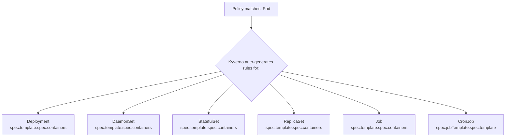

# Module 1.1: Advanced Kyverno Policies

> **Complexity**: `[COMPLEX]` - Domain 5: Kyverno Advanced Policy Writing (32% of exam)
>
> **Time to Complete**: 90-120 minutes
>
> **Prerequisites**: Kyverno basics (install, ClusterPolicy vs Policy), Kubernetes admission controllers, familiarity with YAML and kubectl

## Learning Outcomes

After completing this module, you will be able to:

1. **Design** advanced Kyverno validation policies that combine Common Expression Language, JMESPath projections, and preconditions for Kubernetes 1.35+ admission decisions.
2. **Implement** supply chain controls with `verifyImages` rules that evaluate Cosign signatures, Notary certificate material, and signed vulnerability attestations.
3. **Debug** unexpected Kyverno behavior by inspecting autogen translations, background scan reports, and the boundary between admission-time and controller-time execution.
4. **Evaluate** mutation strategies by comparing strategic merge patches with RFC 6902 JSON patches for precise, low-risk resource modification.
5. **Implement** cleanup automation with `CleanupPolicy` and `ClusterCleanupPolicy` resources while accounting for schedules, RBAC, exclusions, and TTL-style conditions.

## Why This Module Matters

Hypothetical scenario: your platform team has already installed Kyverno and has a few basic label policies in Audit mode, so the cluster appears to have a policy layer. A compromised build pipeline then pushes a container image with the same trusted tag that the deployment pipeline normally uses, and the registry accepts it because the push credentials are valid. If the admission path only checks labels, namespaces, and basic Pod fields, Kubernetes admits the workload because nothing in the API request proves who built the image, what scan evidence accompanied it, or whether the tag resolves to the digest that security reviewed.

That scenario is not a failure of Kubernetes admission control. It is a failure to encode the right security questions at the right decision point. Advanced Kyverno policies let you ask questions that a simple schema check cannot answer: whether every container satisfies a typed CEL predicate, whether an image carries a valid signature and attestation, whether a rule should run only for production namespaces, whether a mutation should append to an array without overwriting user intent, and whether stale objects should be removed later by a controller instead of blocked during admission.

This module treats Kyverno as a policy system with multiple execution modes, not as a collection of YAML snippets. You will preserve the mental model that matters on the KCA exam and in real clusters: validation rules decide whether an API request is allowed, mutation rules change the request before storage, image verification may call an external registry, autogen expands Pod rules to workload controllers, background scans report on existing resources, and cleanup policies delete matching objects on a schedule. That separation is the difference between a policy that protects a platform and a policy that surprises the people operating it.

The advanced features in this module also force you to think about ownership. A security team may own signature trust policy, a platform team may own default labels and cleanup schedules, and application teams may own the fields that describe how their workloads run. Kyverno sits between those groups at the API server boundary, so a poorly scoped rule can turn a governance requirement into an outage. A well-scoped rule, by contrast, documents the contract in executable form and gives developers fast feedback while the context is still fresh.

## CEL and JMESPath as Complementary Policy Languages

Kyverno began with JMESPath-style expressions because Kubernetes resources are JSON-shaped documents, and JMESPath is excellent at selecting, filtering, projecting, and transforming nested data. Modern Kubernetes also uses Common Expression Language for admission validation, and Kyverno supports CEL in validation rules for typed boolean checks. A useful way to think about the distinction is that CEL is the rule you would trust to decide a yes-or-no question quickly, while JMESPath is the query tool you reach for when you need to reshape or summarize fields before making that decision.

CEL expressions in Kyverno evaluate the admission object through variables such as `object` and, during update operations, `oldObject`. The syntax is intentionally close to the CEL used by Kubernetes admission features, so a learner who can read `object.spec.containers.all(...)` can transfer that skill beyond Kyverno. The tradeoff is that CEL does not mutate resources, and it is not designed to produce rich transformed payloads. When the policy goal is to enforce an invariant, CEL is often clearer; when the goal is to build a dynamic message, inspect optional arrays, or support a mutation, JMESPath remains central.

The following example validates every container in a Pod with CEL. Notice that the expression is written against `object.spec.containers`, not `request.object.spec.containers`, and that the `all()` macro must succeed for every element in the array. This is the kind of policy that belongs in admission, because a Pod that omits `runAsNonRoot` should be rejected before it becomes cluster state.

```yaml
apiVersion: kyverno.io/v1
kind: ClusterPolicy
metadata:
  name: require-run-as-nonroot
spec:
  validationFailureAction: Enforce
  rules:
    - name: check-nonroot
      match:
        any:
          - resources:
              kinds:
                - Pod
      validate:
        cel:
          expressions:
            - expression: >-
                object.spec.containers.all(c,
                  has(c.securityContext) &&
                  has(c.securityContext.runAsNonRoot) &&
                  c.securityContext.runAsNonRoot == true)
              message: "All containers must set securityContext.runAsNonRoot to true."
```

Pause and predict: if a Pod has three containers and only two of them set `runAsNonRoot: true`, what should the CEL expression return, and should the Pod be admitted? The expression returns `false` because `all()` behaves like a logical AND across the entire container list. Kyverno rejects the request because the validation expression failed, and that failure happens before the object is persisted.

| Feature | CEL | JMESPath |
|---|---|---|
| **Syntax style** | C-like (`object.spec.x`) | Path-based (`request.object.spec.x`) |
| **Type safety** | Strongly typed at parse time | Loosely typed |
| **List operations** | `all()`, `exists()`, `filter()`, `map()` | Projections, filters |
| **String functions** | `startsWith()`, `contains()`, `matches()` | `starts_with()`, `contains()` |
| **Best for** | Simple field checks, boolean logic | Complex data transformations |
| **Mutation support** | No (validate only) | Yes (validate + mutate) |
| **Kyverno version** | 1.11+ | All versions |

The table is easy to memorize, but the operational reason matters more. CEL gives you typed admission predicates that are concise and predictable; JMESPath gives you flexible document traversal for Kubernetes objects that may contain optional arrays, missing maps, and nested workload templates. If a policy only answers "is this allowed?", CEL is a strong candidate. If the policy needs to collect the names of offending containers, derive an allowed registry list, or generate patch values, JMESPath is usually the better fit.

You will often see both languages in the same policy library, and that is normal. Mature policy sets avoid forcing every problem through one expression style because that creates unreadable rules and brittle test cases. The practical skill is to recognize the shape of the question before writing syntax: typed invariant, nested projection, dynamic lookup, or mutation payload. When you can name that shape, the correct Kyverno feature becomes much easier to choose.

Update validation is where CEL starts to feel less like a syntax choice and more like an admission-control tool. The `oldObject` variable represents the existing resource before the update, so the policy can compare the proposed object with the stored object. That makes it possible to prevent destructive changes, such as removing a label that downstream network policy, cost reporting, or deployment automation depends on.

```yaml
apiVersion: kyverno.io/v1
kind: ClusterPolicy
metadata:
  name: prevent-label-removal
spec:
  validationFailureAction: Enforce
  rules:
    - name: block-label-delete
      match:
        any:
          - resources:
              kinds:
                - Deployment
              operations:
                - UPDATE
      validate:
        cel:
          expressions:
            - expression: >-
                !has(oldObject.metadata.labels.app) ||
                has(object.metadata.labels.app)
              message: "The 'app' label cannot be removed once set."
```

The logic reads as a safety rule: if the old object did not have the label, there is nothing to preserve; if it did have the label, the new object must still have it. This pattern is useful for fields that become part of an operational contract after creation. It is also safer than trying to repair the update with mutation, because the user receives a direct rejection and can decide whether the attempted removal was accidental or requires a coordinated policy change.

JMESPath becomes more important as soon as the policy needs to reason about nested arrays. Kubernetes Pods place most runtime details inside lists of containers, init containers, environment variables, ports, mounts, and resource requirements. A policy that checks only `containers[0]` is usually wrong, because it silently ignores every other container. Projections and filters let you write a rule that asks, "which containers violate the requirement?" and then use that answer both for denial and for a useful message.

```yaml
apiVersion: kyverno.io/v1
kind: ClusterPolicy
metadata:
  name: limit-container-ports
spec:
  validationFailureAction: Enforce
  rules:
    - name: max-three-ports
      match:
        any:
          - resources:
              kinds:
                - Pod
      validate:
        message: "Each container may expose a maximum of 3 ports."
        deny:
          conditions:
            any:
              - key: "{{ request.object.spec.containers[?length(ports || `[]`) > `3`] | length(@) }}"
                operator: GreaterThan
                value: 0
```

The expression uses `ports || `[]`` as a fallback because many containers do not declare any ports. Without the fallback, a missing field could turn a policy into a brittle rule that behaves differently across otherwise valid Pods. Before running a similar expression in your own policy, predict whether a container with no `ports` field should count as a violation. In this case it should not, because the rule is limiting declared ports rather than requiring a port declaration.

```text
# length() - count items or string length
"{{ request.object.spec.containers | length(@) }}"

# contains() - check if array/string contains a value
"{{ contains(request.object.metadata.labels.keys(@), 'app') }}"

# starts_with() / ends_with() - string prefix/suffix checks
"{{ starts_with(request.object.metadata.name, 'prod-') }}"

# join() - concatenate array elements
"{{ request.object.spec.containers[*].name | join(', ', @) }}"

# to_string() / to_number() - type conversion
"{{ to_number(request.object.spec.containers[0].resources.limits.cpu || '0') }}"

# merge() - combine objects
"{{ merge(request.object.metadata.labels, `{\"managed-by\": \"kyverno\"}`) }}"

# not_null() - return first non-null value
"{{ not_null(request.object.metadata.labels.team, 'unknown') }}"
```

These functions are common in KCA-style policy reading questions because they reveal whether you understand the shape of the Kubernetes object being evaluated. `length()` and `join()` often appear in messages, `contains()` is common in allow-list checks, conversion functions appear when YAML values may be parsed as strings, and `not_null()` prevents a missing optional field from breaking the policy path. The exam pressure point is not memorizing function names in isolation; it is tracing what each function receives and returns after Kyverno substitutes request data.

```yaml
apiVersion: kyverno.io/v1
kind: ClusterPolicy
metadata:
  name: require-resource-limits
spec:
  validationFailureAction: Enforce
  rules:
    - name: check-all-containers
      match:
        any:
          - resources:
              kinds:
                - Pod
      validate:
        message: >-
          All containers must define memory limits. Missing in:
          {{ request.object.spec.containers[?!contains(keys(resources.limits || `{}`), 'memory')].name | join(', ', @) }}
        deny:
          conditions:
            any:
              - key: "{{ request.object.spec.containers[?!contains(keys(resources.limits || `{}`), 'memory')] | length(@) }}"
                operator: GreaterThan
                value: 0
```

This policy does two things at once: it blocks Pods with missing memory limits and tells the developer which containers need attention. That is a practical difference in a multi-container workload, because a generic error message sends the developer back to scan YAML by hand. Good policy authors treat messages as part of the control, not decoration, because clear denial messages reduce help-desk tickets and shorten the feedback loop.

There is a testing lesson hidden in this example as well. A single-container happy path is not enough to validate a projection-heavy policy, because the expression may fail only when a second container lacks a field or when the optional map is absent. When you test JMESPath rules, include a resource with all fields present, a resource with one missing field, and a resource with the parent map missing entirely. That small test matrix catches most of the policy mistakes that otherwise appear only after a team deploys a more complicated workload.

The same testing habit applies to CEL rules, even though the syntax feels more strongly typed. Test the empty list, the single valid item, the mixed valid and invalid list, and the missing optional field case. Kubernetes manifests are often produced by Helm charts, operators, and CI templates, so the objects that reach admission may not look like the simple hand-written example in the policy review. A rule that survives those edge cases is much more likely to behave consistently when autogen later translates it into workload-controller templates.

## Supply Chain Verification with Images and Attestations

Image verification answers a question that ordinary Kubernetes validation cannot answer from the Pod manifest alone: is this image the artifact that a trusted actor signed, and does it carry the evidence required by the organization? A tag such as `nginx:1.27` is convenient for humans, but a tag is mutable by registry design. Kyverno `verifyImages` rules resolve image references to immutable digests and verify signatures or attestations during admission, so the admitted Pod points at content that can be traced.

This verification has a different operational profile from local field validation. A CEL expression can evaluate in process against the admission object, while image verification may need to contact an OCI registry, retrieve signature material, resolve tags, and parse signed metadata. That is why image policies often need a longer webhook timeout and a careful rollout path. Enforcing signatures on every registry at once can break deployments if the signing pipeline, registry access, or Kyverno trust configuration is incomplete.

```yaml
apiVersion: kyverno.io/v1
kind: ClusterPolicy
metadata:
  name: verify-image-signature
spec:
  validationFailureAction: Enforce
  webhookTimeoutSeconds: 30
  rules:
    - name: verify-cosign-signature
      match:
        any:
          - resources:
              kinds:
                - Pod
      verifyImages:
        - imageReferences:
            - "registry.example.com/*"
          attestors:
            - count: 1
              entries:
                - keys:
                    publicKeys: |-
                      -----BEGIN PUBLIC KEY-----
                      MFkwEwYHKoZIzj0CAQYIKoZIzj0DAQcDQgAEsLeM2H+JQfHi1PtMFbJFo3pABv2
                      OKjrFHxGnTYNeFJ4mDPOI8gMSMcKzfcWaVMPe8ZuGAsCmoAxmyBXnbPHTQ==
                      -----END PUBLIC KEY-----
```

The policy scopes verification to `registry.example.com/*`, which is important because public base images, internal images, and temporary test images may have different signing maturity. `attestors.count: 1` means one trusted entry must verify the image. A stricter organization might require multiple attestors for high-risk namespaces, but every additional requirement becomes another dependency in the admission path, so the design should match the criticality of the workload.

Notary-style verification uses certificate material rather than the public key block shown in the Cosign example. The policy shape is still familiar: match Pods, identify image references, and define trusted attestors. The main design question is where trust anchors are managed and how rotation is handled, because a policy hardwired to stale certificate material will fail after the signing infrastructure rotates.

```yaml
apiVersion: kyverno.io/v1
kind: ClusterPolicy
metadata:
  name: verify-notary-signature
spec:
  validationFailureAction: Enforce
  rules:
    - name: verify-notary
      match:
        any:
          - resources:
              kinds:
                - Pod
      verifyImages:
        - imageReferences:
            - "registry.example.com/*"
          attestors:
            - entries:
                - certificates:
                    cert: |-
                      -----BEGIN CERTIFICATE-----
                      ...your certificate here...
                      -----END CERTIFICATE-----
```

Signatures prove a trusted signer handled the image, but they do not prove the image is free of unacceptable vulnerabilities or that it was built from the expected source. Attestations add signed metadata alongside the artifact, often using in-toto formats. Kyverno can evaluate those attestation payloads and reject images that are signed but do not satisfy the evidence policy, which is the difference between "someone trusted signed it" and "it passed the security gate we care about."

```yaml
apiVersion: kyverno.io/v1
kind: ClusterPolicy
metadata:
  name: verify-vulnerability-scan
spec:
  validationFailureAction: Enforce
  rules:
    - name: check-vuln-attestation
      match:
        any:
          - resources:
              kinds:
                - Pod
      verifyImages:
        - imageReferences:
            - "registry.example.com/*"
          attestors:
            - entries:
                - keys:
                    publicKeys: |-
                      -----BEGIN PUBLIC KEY-----
                      ...
                      -----END PUBLIC KEY-----
          attestations:
            - type: https://cosign.sigstore.dev/attestation/vuln/v1
              conditions:
                - all:
                    - key: "{{ scanner }}"
                      operator: Equals
                      value: "trivy"
                    - key: "{{ result[?severity == 'CRITICAL'] | length(@) }}"
                      operator: LessThanOrEquals
                      value: "0"
```

Pause and predict: why does this policy still need signature trust if it is reading vulnerability data from an attestation? The answer is that an unsigned or untrusted attestation is just another blob of data. The useful security property comes from verifying that the metadata was produced and signed by a trusted process, then checking that the signed metadata says the image meets the vulnerability threshold.

For rollout, treat image verification as both a policy project and a supply chain project. Start by requiring signatures for a narrow registry path where the CI system already signs images, then add attestation checks after scan publishing is reliable. Use Audit mode or namespace scoping during migration so teams can see what would fail before enforcement blocks releases. Once enforcement begins, track webhook latency and registry availability because the admission controller now depends on systems outside the API server.

The most common design mistake is to treat `verifyImages` as a final switch at the end of a security program. In practice, it is a contract between CI, registry, admission, and incident response. CI must sign and attach evidence, the registry must make that evidence reachable, Kyverno must trust the right keys or certificates, and operators must know how to diagnose a failed verification without bypassing the policy. If any one of those pieces is missing, the correct policy may still fail in production because the surrounding system is not ready.

Another subtle point is that verification scope should follow risk. A training cluster might accept unsigned images from public registries while requiring signed internal application images, because the goal is to protect the software you build and deploy repeatedly. A regulated production namespace may require both signatures and vulnerability attestations, while a sandbox namespace may run in Audit mode to support experimentation. This is not a weaker policy model; it is an explicit risk model encoded in namespace, registry, and workload boundaries.

When verification fails, teach operators to separate trust failures from evidence failures. A trust failure means Kyverno could not verify the signer or certificate chain for the artifact. An evidence failure means the signature was valid, but the signed payload did not satisfy the policy condition, such as the scanner value or vulnerability threshold. Those failures point to different owners: trust configuration usually belongs to the platform or security team, while evidence content often belongs to the CI pipeline that produced the image metadata.

## Mutations, Preconditions, and Dynamic Context

Validation asks whether a resource should be admitted, while mutation changes the resource before it is stored. That difference sounds simple, but it drives the patch strategy. Strategic merge patches are readable overlays that work well for adding common labels or setting simple fields, while RFC 6902 JSON patches are explicit operation lists that can add, replace, or remove exact JSON paths. When a policy must append to an array, remove a field, or target an index, JSON patch gives the precision that strategic merge lacks.

| Scenario | Use JSON Patch | Use Strategic Merge |
|---|---|---|
| Add a sidecar container | Yes | Works but verbose |
| Set a single field | Either works | Simpler syntax |
| Remove a field | Yes (only option) | Cannot remove |
| Conditional array element changes | Yes | No |
| Add to a specific array index | Yes | No |

The safest mutation policy is narrow enough that users can predict it. Adding labels, injecting a known sidecar, or normalizing a registry can be reasonable when the platform owns that behavior. Rewriting arbitrary fields on every workload is riskier because developers may not realize the object they applied is not the object that Kubernetes stored. A useful rule of thumb is to mutate defaults and platform-owned fields, but validate user-owned intent when an unexpected value should be corrected by a human.

```yaml
apiVersion: kyverno.io/v1
kind: ClusterPolicy
metadata:
  name: inject-logging-sidecar
spec:
  rules:
    - name: add-sidecar
      match:
        any:
          - resources:
              kinds:
                - Pod
              selector:
                matchLabels:
                  inject-sidecar: "true"
      mutate:
        patchesJson6902: |-
          - op: add
            path: "/spec/containers/-"
            value:
              name: log-collector
              image: fluent/fluent-bit:3.0
              resources:
                limits:
                  memory: "128Mi"
                  cpu: "100m"
              volumeMounts:
                - name: shared-logs
                  mountPath: /var/log/app
          - op: add
            path: "/spec/volumes/-"
            value:
              name: shared-logs
              emptyDir: {}
```

The `/-` path suffix matters because it appends to the end of an array without requiring the policy author to know how many containers already exist. If the policy used `/spec/containers/1`, it would only work when index one exists or when the JSON patch semantics allow that exact add. If the patch used `replace`, the path would have to exist already, and an absent index would reject the admission request. Precision is powerful, but it also means invalid paths fail loudly.

```yaml
apiVersion: kyverno.io/v1
kind: ClusterPolicy
metadata:
  name: enforce-image-registry
spec:
  rules:
    - name: replace-image-registry
      match:
        any:
          - resources:
              kinds:
                - Pod
      mutate:
        patchesJson6902: |-
          - op: replace
            path: "/spec/containers/0/image"
            value: "registry.internal.example.com/nginx:1.27"
```

This replacement example is intentionally narrow because it targets only the first container. In a real multi-container policy, you would usually avoid a fixed index unless the object shape is controlled by the platform. The KCA lesson is that JSON patch can perform exact operations, but the policy author must understand the path and the failure mode. If the index does not exist, the mutation fails and the user sees an admission rejection rather than a partial patch.

Preconditions decide whether a rule should run after a resource has matched the broad resource selector. That makes them a policy performance and correctness tool. The `match` block might select Pods, while `preconditions` can limit the rule to production namespaces, specific labels, operations, image names, or other context. A skipped rule is not a pass or failure; Kyverno simply moves on because the rule was not relevant to that request.

```yaml
apiVersion: kyverno.io/v1
kind: ClusterPolicy
metadata:
  name: require-probes-in-prod
spec:
  validationFailureAction: Enforce
  rules:
    - name: check-readiness-probe
      match:
        any:
          - resources:
              kinds:
                - Pod
      preconditions:
        all:
          - key: "{{ request.namespace }}"
            operator: In
            value:
              - production
              - prod-*
      validate:
        message: "All containers in production namespaces must have a readinessProbe."
        pattern:
          spec:
            containers:
              - readinessProbe: {}
```

Preconditions are also where many policy bugs hide. Authors often put too much logic in `match`, which is mostly about resource selection, or they confuse `any` with `all`. Read `any` as OR and `all` as AND. If a rule should apply to high-criticality workloads or to workloads in financial namespaces, use `any`. If a rule should apply only when both the namespace and label match, use `all`.

```yaml
apiVersion: kyverno.io/v1
kind: ClusterPolicy
metadata:
  name: enforce-image-digest-for-critical
spec:
  validationFailureAction: Enforce
  rules:
    - name: digest-required
      match:
        any:
          - resources:
              kinds:
                - Pod
      preconditions:
        any:
          - key: "{{ request.object.metadata.labels.criticality || '' }}"
            operator: Equals
            value: "high"
          - key: "{{ request.namespace }}"
            operator: In
            value:
              - production
              - financial
      validate:
        message: >-
          Critical workloads must use image digests, not tags.
          Use image@sha256:... format.
        deny:
          conditions:
            any:
              - key: "{{ request.object.spec.containers[?!contains(@.image, '@sha256:')] | length(@) }}"
                operator: GreaterThan
                value: 0
```

| Operator | Description | Example |
|---|---|---|
| `Equals` / `NotEquals` | Exact match | `key: "foo"`, `value: "foo"` |
| `In` / `NotIn` | Membership check | `key: "foo"`, `value: ["foo","bar"]` |
| `GreaterThan` / `LessThan` | Numeric comparison | `key: "5"`, `value: 3` |
| `GreaterThanOrEquals` / `LessThanOrEquals` | Inclusive comparison | `key: "5"`, `value: 5` |
| `AnyIn` / `AnyNotIn` | Any element matches | Array-to-array comparison |
| `AllIn` / `AllNotIn` | All elements match | Array-to-array comparison |
| `DurationGreaterThan` | Time duration comparison | `key: "2h"`, `value: "1h"` |

Dynamic context extends the same idea by letting a policy read data that is not present in the submitted object. A ConfigMap can hold a list of allowed registries, or an API call can fetch the live Namespace so the policy can evaluate namespace labels and annotations. This is useful, but it is not free. Every external lookup introduces RBAC requirements, failure modes, and latency, so use it when the data genuinely needs to change independently from the policy definition.

```yaml
apiVersion: v1
kind: ConfigMap
metadata:
  name: allowed-registries
  namespace: kyverno
data:
  registries: "registry.example.com,gcr.io/my-project,docker.io/myorg"
```

```yaml
apiVersion: kyverno.io/v1
kind: ClusterPolicy
metadata:
  name: restrict-registries-from-configmap
spec:
  validationFailureAction: Enforce
  rules:
    - name: check-registry
      match:
        any:
          - resources:
              kinds:
                - Pod
      context:
        - name: allowedRegistries
          configMap:
            name: allowed-registries
            namespace: kyverno
      validate:
        message: >-
          Image registry is not in the allowed list.
          Allowed: {{ allowedRegistries.data.registries }}
        deny:
          conditions:
            all:
              - key: "{{ request.object.spec.containers[].image | [0] | split(@, '/') | [0] }}"
                operator: AnyNotIn
                value: "{{ allowedRegistries.data.registries | split(@, ',') }}"
```

ConfigMap context is best when the data is small, owned by the platform team, and safe to read during admission. If the allowed registry list changes weekly, keeping it in a ConfigMap avoids a policy edit for every change. If the list is large or requires complex matching, a simpler policy plus a CI-side policy test may be easier to operate than a dense admission expression.

```yaml
apiVersion: kyverno.io/v1
kind: ClusterPolicy
metadata:
  name: require-namespace-label
spec:
  validationFailureAction: Enforce
  rules:
    - name: check-ns-label
      match:
        any:
          - resources:
              kinds:
                - Pod
      context:
        - name: nsLabels
          apiCall:
            urlPath: "/api/v1/namespaces/{{ request.namespace }}"
            jmesPath: "metadata.labels"
      validate:
        message: >-
          Pods can only be created in namespaces with a 'team' label.
          Namespace '{{ request.namespace }}' is missing the 'team' label.
        deny:
          conditions:
            any:
              - key: team
                operator: AnyNotIn
                value: "{{ nsLabels | keys(@) }}"
```

An internal API call uses Kyverno's service account, so RBAC becomes part of the policy design. If the service account cannot read Namespaces, the policy cannot make this decision reliably. If the API server is slow or overloaded, the admission request waits. Which approach would you choose for a billing-code requirement: copy the annotation into each Pod template during CI, or query the live Namespace at admission time? The better answer depends on whether the namespace metadata is the authoritative source and how much admission latency you can tolerate.

```yaml
context:
  - name: externalCheck
    apiCall:
      method: POST
      urlPath: "https://policy-check.internal/validate"
      data:
        - key: image
          value: "{{ request.object.spec.containers[0].image }}"
      jmesPath: "allowed"
```

External service calls are a sharp tool. They allow centralized decisions that may be hard to encode in YAML, but they also make admission depend on a network service outside the API server's normal object graph. For exam purposes, remember that Kyverno can call APIs through context; for production design, reserve external calls for cases where the policy value clearly outweighs the reliability cost.

When a policy uses dynamic context, error handling becomes part of the user experience. A developer who receives "namespace is missing billing-code" can fix the namespace metadata or ask the owner to add it. A developer who receives a timeout because an external policy service is unavailable has no obvious action, even if their manifest is correct. That is why internal Kubernetes API calls and ConfigMap lookups are usually easier to operate than external service calls: the data source lives inside the same control plane and is governed by familiar RBAC and observability tools.

Preconditions also help reduce the cost of dynamic context because they can skip expensive work for resources that clearly do not need the rule. If only production workloads require a live namespace lookup, check the namespace or label first and avoid the lookup for development workloads. This keeps admission latency lower and makes policy intent more visible. It also makes test cases easier to write because you can separately verify the skipped case, the lookup case, and the denial case.

The other benefit of preconditions is communication. A rule with a broad match and a narrow precondition says, "this policy is about Pods, but only these Pods are relevant." That is easier to reason about than a dense `match` block that tries to express every business condition in resource selectors. During review, ask whether the precondition reads like the sentence you would say to a teammate. If it does not, the policy may be correct but still too hard to maintain.

## Autogen, Background Scans, and Cleanup Controllers

Most engineers rarely create bare Pods in production. They create Deployments, StatefulSets, DaemonSets, Jobs, CronJobs, and other controllers that contain a Pod template. Kyverno autogen exists because a Pod policy that ignores those templates would miss most real workloads. When a rule matches `Pod`, Kyverno can automatically create translated rules that inspect the embedded Pod template paths in common controllers.



Autogen is powerful because it protects controller-created Pods without requiring separate policies for every workload kind. It also creates a debugging responsibility. If a policy references fields that exist on Pods but not in the same location inside a controller template, the generated rule may not behave as the author expected. The first troubleshooting step is to inspect the stored ClusterPolicy and read the generated `autogen-` rules rather than guessing from the source YAML alone.

```yaml
apiVersion: kyverno.io/v1
kind: ClusterPolicy
metadata:
  name: require-labels
  annotations:
    # Only auto-generate for Deployments and StatefulSets
    pod-policies.kyverno.io/autogen-controllers: Deployment,StatefulSet
spec:
  rules:
    - name: require-app-label
      match:
        any:
          - resources:
              kinds:
                - Pod
      validate:
        message: "The label 'app' is required."
        pattern:
          metadata:
            labels:
              app: "?*"
```

This annotation limits autogen to Deployments and StatefulSets, which is useful when a policy is safe for long-running application controllers but inappropriate for Jobs or DaemonSets. The annotation is also a good exam clue: if a question says a Pod policy blocked a CronJob, autogen is probably involved unless the policy explicitly limited or disabled generated controllers.

```yaml
metadata:
  annotations:
    pod-policies.kyverno.io/autogen-controllers: none
```

Disabling autogen should be deliberate. It is appropriate when a policy truly targets only direct Pod creation, or when the rule inspects Pod fields in a way that cannot be safely translated into controller templates. Otherwise, disabling it creates a gap where a user can bypass a Pod admission rule simply by wrapping the same container spec in a Deployment.

```bash
# After applying a Pod-targeting policy, inspect the generated rules:
kubectl get clusterpolicy require-labels -o yaml | grep -A 5 "autogen-"
```

Background scans answer a different question: what about objects that already existed before the policy was created or before enforcement tightened? Admission webhooks see create and update requests, but they do not automatically re-admit every object in the cluster. Kyverno background scanning evaluates existing resources and writes PolicyReport objects so teams can see drift and violations without deleting or mutating running workloads.

```yaml
apiVersion: kyverno.io/v1
kind: ClusterPolicy
metadata:
  name: audit-privileged-containers
spec:
  validationFailureAction: Audit
  background: true  # default is true
  rules:
    - name: deny-privileged
      match:
        any:
          - resources:
              kinds:
                - Pod
      validate:
        message: "Privileged containers are not allowed."
        pattern:
          spec:
            containers:
              - securityContext:
                  privileged: "!true"
```

The important point is that background scans are reporting mechanisms, not retroactive admission. If an existing Pod violates this rule, Kyverno records the result in a PolicyReport; it does not kill the Pod because a validation policy changed. That behavior makes Audit mode useful during rollout. You can measure the impact of a policy, fix workloads, and then move toward Enforce for new admission requests.

```yaml
apiVersion: kyverno.io/v1
kind: ClusterPolicy
metadata:
  name: block-latest-tag
spec:
  validationFailureAction: Enforce
  background: false  # only check at admission time
  rules:
    - name: no-latest
      match:
        any:
          - resources:
              kinds:
                - Pod
      validate:
        message: "The ':latest' tag is not allowed."
        pattern:
          spec:
            containers:
              - image: "!*:latest"
```

Setting `background: false` is appropriate when the rule only makes sense at admission time, such as policies involving request-specific context or mutation behavior. It can also reduce noise for policies where existing resources are not useful to report. The exam distinction is simple: admission enforcement blocks creates and updates; background scans produce reports for existing resources.

```bash
# List all policy reports (namespaced)
kubectl get policyreport -A

# View a specific report's results
kubectl get policyreport -n default -o yaml

# Cluster-scoped reports
kubectl get clusterpolicyreport
```

Cleanup policies are controller-driven rather than admission-driven. A `CleanupPolicy` or `ClusterCleanupPolicy` runs on a schedule and deletes matching resources when its match and condition logic succeeds. That makes cleanup a good fit for failed Pods, completed Jobs, expired temporary ConfigMaps, and debug namespaces that should not live forever. It is not a substitute for admission validation, because a cleanup policy may run minutes or hours after the object was created.

```yaml
apiVersion: kyverno.io/v2
kind: ClusterCleanupPolicy
metadata:
  name: delete-failed-pods
spec:
  match:
    any:
      - resources:
          kinds:
            - Pod
  conditions:
    any:
      - key: "{{ target.status.phase }}"
        operator: Equals
        value: Failed
  schedule: "*/15 * * * *"
```

This cleanup rule uses the `target` variable because it evaluates resources found by the cleanup controller, not the `request.object` from admission. The schedule is cron-style, so the deletion occurs when the controller reconciles the policy. If the Kyverno service account lacks `delete` permission for the target kind, the policy cannot complete its job, even though the YAML itself may be valid.

```yaml
apiVersion: kyverno.io/v2
kind: CleanupPolicy
metadata:
  name: cleanup-old-configmaps
  namespace: staging
spec:
  match:
    any:
      - resources:
          kinds:
            - ConfigMap
          selector:
            matchLabels:
              temporary: "true"
  conditions:
    any:
      - key: "{{ time_since('', target.metadata.creationTimestamp, '') }}"
        operator: GreaterThan
        value: "24h"
  schedule: "0 */6 * * *"
```

TTL-style cleanup is a common platform hygiene pattern, but it should be paired with a visible ownership model. A label such as `temporary: "true"` communicates that the resource is eligible for automatic deletion, and the schedule communicates how quickly cleanup can happen. Without clear labels and conditions, cleanup feels arbitrary to application teams because a controller removes objects after the admission conversation is over.

```yaml
apiVersion: kyverno.io/v2
kind: ClusterCleanupPolicy
metadata:
  name: cleanup-completed-jobs
spec:
  match:
    any:
      - resources:
          kinds:
            - Job
  exclude:
    any:
      - resources:
          selector:
            matchLabels:
              retain: "true"
  conditions:
    all:
      - key: "{{ target.status.succeeded }}"
        operator: GreaterThan
        value: 0
  schedule: "0 2 * * *"
```

The `exclude` block is the safety valve. It lets the platform define a default cleanup behavior while preserving a documented escape route for jobs that must be retained for audit, debugging, or manual review. This is a better pattern than making cleanup policies so broad that teams fight them, or so weak that they never remove anything useful.

Cleanup design should also account for object ownership and controller behavior. Deleting a failed Pod owned by a Job is different from deleting the Job itself, because the owning controller may recreate or retain related objects depending on its own spec. Deleting a ConfigMap that a Deployment still references may not restart the workload immediately, but it can break future rollouts or recovery. Before enforcing cleanup in shared clusters, test the policy against realistic owner references and verify that the deletion target is the object you actually want to remove.

For KCA reasoning, keep the variable names straight. Admission policies usually reason about `request.object`, while cleanup policies reason about `target` because the controller is scanning existing objects. That distinction is more than syntax. It tells you whether the rule is responding to a user's API request or a scheduled reconciliation loop, which in turn tells you what data is available, what action is possible, and where to look when the behavior is surprising.

A useful cleanup rollout starts with observation even though cleanup itself is not an Audit-mode validation rule. Apply the policy to a narrow namespace, choose a schedule that lets you observe the first run, and create test objects with labels that should and should not match. After the first reconciliation, inspect the remaining objects and the Kyverno controller events. This proves the match, condition, exclusion, schedule, and RBAC path together instead of assuming each piece works because the YAML was admitted.

## Patterns & Anti-Patterns

Advanced Kyverno work succeeds when policy authors treat rules as operational interfaces. The YAML is only one part of the system; the other parts are rollout order, latency, RBAC, generated controller behavior, and the quality of the feedback sent to developers. The patterns below are the habits that make policies useful after the first successful demo.

| Pattern | When to Use It | Why It Works |
|---|---|---|
| Start advanced policies in scoped Audit mode | A rule affects many teams, checks image signatures, or depends on dynamic context | PolicyReports reveal impact before Enforce blocks releases |
| Prefer CEL for typed admission invariants | The rule is a direct yes-or-no validation over the submitted object | CEL keeps boolean checks readable and avoids projection-heavy expressions |
| Use JMESPath for messages and optional arrays | The rule must identify offending containers or tolerate missing fields | Projections produce actionable output without ignoring multi-container Pods |
| Inspect autogen output after every Pod policy | A Pod-targeting rule should protect Deployments, Jobs, or CronJobs | The generated rules show the exact translated paths Kyverno will evaluate |
| Pair cleanup with labels and exclusions | Resources can expire, but some need retention | Operators get predictable deletion behavior and documented opt-out criteria |

The anti-patterns are often tempting because they make the first policy shorter. They become expensive later because they hide failure modes until a deployment is blocked, a mutation surprises a team, or a cleanup controller deletes something that did not look temporary to its owner. Advanced policy authors spend a little more time making policy intent explicit so the cluster behaves predictably under pressure.

A healthy policy library also has an escalation path. Some violations should be hard failures because they protect core cluster safety, such as privileged containers or unsigned production images. Other violations should begin as reports because the organization needs time to repair manifests, update CI templates, or publish signatures consistently. The pattern is not "Audit forever" or "Enforce everything"; it is staged enforcement with evidence, ownership, and a clear date or condition for moving from observation to blocking.

| Anti-pattern | What Goes Wrong | Better Alternative |
|---|---|---|
| Mutating user-owned fields to "fix" every violation | Developers cannot predict what object Kubernetes stores | Validate unexpected intent and reserve mutation for platform-owned defaults |
| Using fixed JSON patch indexes in mixed workloads | Multi-container Pods fail or the wrong container changes | Append with `/-` or validate all containers before targeted mutation |
| Enforcing image verification before CI signs consistently | Healthy deployments fail because the supply chain is not ready | Roll out by registry path, namespace, or workload tier with audit evidence first |
| Treating background scans as enforcement | Existing violations remain running, and managers expect deletion that will not happen | Use reports for remediation planning and admission Enforce for future changes |
| Disabling autogen to silence a controller failure | Workloads bypass the intended Pod policy by using a controller | Fix the expression or limit autogen to supported controllers |
| Writing cleanup without RBAC review | The policy exists but the controller cannot delete targets | Confirm Kyverno has delete verbs for the exact resource kinds in scope |

## Decision Framework

When you design an advanced Kyverno policy, decide the execution mode before writing the expression. Ask whether the policy should block a request, modify a request, verify an image against external evidence, report on existing objects, or delete resources later. That first decision determines the variables available, the latency budget, the RBAC needs, and the failure mode visible to users.

```text
Start
  |
  v
Is the request allowed as submitted?
  |-- no, based only on object fields --> validate with CEL or JMESPath
  |-- no, based on image trust --------> verifyImages with signatures/attestations
  |-- yes, but needs platform defaults -> mutate with strategic merge or JSON patch
  |-- existing objects need visibility -> background scans and PolicyReports
  |-- old resources must be removed ----> CleanupPolicy or ClusterCleanupPolicy
```

Use this matrix when a scenario includes multiple Kyverno features and you need to choose the smallest correct mechanism. The goal is not to use the most advanced feature; the goal is to put the decision in the part of Kyverno that naturally owns it.

There is one more practical filter: ask who can fix the failure. If the application developer can fix the manifest immediately, an admission denial with a precise message is useful. If only the platform team can fix the trust configuration, a sudden denial may strand the developer with no local remedy. If the problem is historical drift across existing workloads, a PolicyReport gives teams a work queue without disrupting traffic. Matching the mechanism to the fixer keeps policy from becoming a blame machine.

Finally, keep policy libraries modular enough that a failure message points to one decision. A single large policy can be convenient to apply, but separate rules still need clear names, focused messages, and tests that isolate the behavior. When every denial says which rule failed and why, developers learn the platform contract through normal deployment feedback. When denials are vague or multiple unrelated concerns are bundled together, teams start asking for exceptions because fixing the actual issue feels slower than bypassing the policy.

| Requirement | Primary Mechanism | Tradeoff to Check |
|---|---|---|
| Block Pods missing `runAsNonRoot` | CEL validate rule | Clear and typed, but validate-only |
| Reject unsigned or unscanned images | `verifyImages` | Strong supply chain control, but registry latency matters |
| Add a standard sidecar | JSON patch mutation | Precise array append, but path errors reject admission |
| Check a namespace label from a Pod request | Context `apiCall` plus validate | Uses live cluster state, but needs RBAC and latency budget |
| Report existing privileged Pods | Background scan with PolicyReports | Non-disruptive visibility, not retroactive enforcement |
| Delete failed Pods or expired temporary objects | Cleanup policy | Asynchronous deletion, not admission-time blocking |

## Did You Know?

- Kubernetes 1.35+ continues the trend of using CEL for API-side validation, so Kyverno CEL practice transfers directly to native admission policy reasoning.
- Kyverno `verifyImages` can mutate an image tag to an immutable digest and validate the trust evidence during the same admission flow.
- `CleanupPolicy` and `ClusterCleanupPolicy` use scheduled controller reconciliation, which means they can delete old resources even when no user is creating or updating objects.
- PolicyReport resources give Kyverno a Kubernetes-native reporting surface that tools can watch without parsing admission webhook logs.

## Common Mistakes

| Mistake | Why It Happens | How to Fix It |
|---|---|---|
| Using CEL in mutate rules | CEL looks like a general policy language, but Kyverno supports it for validation logic rather than mutation payloads | Use CEL for boolean validation and use JMESPath, strategic merge, or JSON patch for mutation |
| Forgetting `webhookTimeoutSeconds` on `verifyImages` | Signature and attestation checks may call an OCI registry, so they are slower than local field checks | Increase the timeout for image verification policies and monitor admission latency |
| Expecting `background: true` to enforce against running Pods | Background scans evaluate existing resources and write reports, but they do not re-admit or terminate objects | Use PolicyReports for remediation and rely on Enforce for future create or update requests |
| Writing JSON patches with fragile array indexes | The policy author tests one Pod shape and forgets other workloads have different container counts | Append with `/-` when adding elements and validate array shape before replacing by index |
| Not quoting JMESPath backtick literals | YAML, template substitution, and JMESPath each have their own quoting rules | Wrap the full expression in double quotes and keep JMESPath literals in backticks |
| Assuming autogen handles every field safely | Pod template paths differ from top-level controller fields, so generated rules need inspection | Check the stored ClusterPolicy and review `autogen-` rules after applying the policy |
| Creating cleanup policies without delete RBAC | Cleanup is performed by a Kyverno controller service account, not by the user who wrote the policy | Grant delete permission for the exact target kinds and test cleanup in a non-production namespace |
| Mixing `any` and `all` without tracing the logic | Authors read nested conditions like prose and miss OR versus AND behavior | Translate each block into a truth table before relying on it in Enforce mode |

## Quiz

<details>
<summary>Question 1: Your team wants any Pod requesting a GPU to receive a toleration and node selector automatically. A junior engineer drafts a Kyverno mutate rule using CEL for the field injection. Will this design work?</summary>

No. CEL is appropriate for Kyverno validation expressions, but it is not the mechanism for constructing mutation payloads. The design should use a mutate rule with JMESPath-derived values, a strategic merge patch, or an RFC 6902 JSON patch depending on how precise the injected fields need to be. This question maps to the design outcome because the correct answer depends on choosing the right policy language for the rule type, not on remembering a command.

</details>

<details>
<summary>Question 2: During an audit, you find that all production images are signed with Cosign, but some signed images still contain critical vulnerabilities. What Kyverno control should you add?</summary>

Add attestation evaluation inside the `verifyImages` rule, not just a signature check. The signature proves that a trusted signer handled the image, while the signed vulnerability attestation provides evidence about scan results. A policy can require the expected scanner value and reject the image when the attested CRITICAL vulnerability count is above the accepted threshold. This implements the supply chain outcome because it combines identity trust with evidence about the artifact contents.

</details>

<details>
<summary>Question 3: A developer says a CleanupPolicy is deleting debug Pods immediately at creation time, but API server admission logs show no cleanup webhook denial. What should you explain first?</summary>

A CleanupPolicy does not run during synchronous admission, so it should not be described as an immediate admission denial. Cleanup policies run on schedules through a controller and delete matching existing resources after reconciliation. If a Pod is blocked at creation time, investigate validation, mutation failure, quota, or another admission webhook first. If the Pod is admitted and then disappears later, inspect cleanup schedules, match conditions, exclusions, and Kyverno controller RBAC.

</details>

<details>
<summary>Question 4: You need to inject a logging sidecar into Deployments with unknown numbers of existing containers. Which JSON patch path is safest and why?</summary>

Use `path: "/spec/containers/-"` when patching a Pod template container array, adjusted to the correct template path after autogen or when writing directly for a controller. The hyphen appends to the array, so the policy does not need to know the current container count. A fixed index can fail when the index does not exist, and `replace` is wrong because there may be no existing element to replace. This tests the mutation strategy outcome because the failure mode comes from RFC 6902 semantics.

</details>

<details>
<summary>Question 5: A Pod policy unexpectedly blocks a new CronJob even though no one created a standalone Pod. What Kyverno behavior should you inspect?</summary>

Inspect autogen on the stored ClusterPolicy. Kyverno can translate Pod-targeting rules into rules for workload controllers that contain Pod templates, including Jobs and CronJobs, unless annotations limit or disable that behavior. The next step is to run `kubectl get clusterpolicy <name> -o yaml` and examine generated rule names and paths. This tests the debug outcome because the answer requires looking at Kyverno's translated policy state rather than only the source file.

</details>

<details>
<summary>Question 6: A manager fears that enabling `validationFailureAction: Enforce` with `background: true` will terminate existing Pods that violate a new rule. Is that fear correct?</summary>

No. Enforce affects admission decisions for create and update requests, while background scans report on existing resources through PolicyReports. Kyverno does not terminate already-running Pods merely because a validation policy reports that they are non-compliant. The safe rollout plan is to read reports, fix workloads, and then rely on Enforce for future changes. This maps to the background-scan debug outcome because it separates report generation from admission enforcement.

</details>

<details>
<summary>Question 7: A policy must reject Pods when the target Namespace lacks a `billing-code` annotation, but the Pod manifest does not include Namespace annotations. How can Kyverno evaluate that requirement?</summary>

Use a `context` block with an internal `apiCall` to retrieve `/api/v1/namespaces/{{ request.namespace }}` and then evaluate the annotation with JMESPath in the validate rule. The policy also needs Kyverno's service account to have read access to Namespace objects. This is better than pretending the Pod contains data it does not have, but it adds latency and RBAC considerations. The scenario tests design and implementation because it connects dynamic context to admission-time validation.

</details>

<details>
<summary>Question 8: A cleanup rule should delete completed Jobs unless they carry `retain: "true"`. Which policy elements make that behavior predictable?</summary>

Use a `ClusterCleanupPolicy` matching Job resources, add an `exclude` selector for `retain: "true"`, and condition deletion on a completed status such as `target.status.succeeded` being greater than zero. The schedule determines when deletion happens, and Kyverno's controller RBAC determines whether deletion is actually possible. The retention label gives teams a visible escape route for audit or debugging needs. This tests the cleanup outcome because the correct answer includes schedule, match, exclusion, condition, and permissions.

</details>

## Hands-On Exercise

### Objective

Build a multi-rule ClusterPolicy that combines five advanced techniques: CEL validation, JMESPath projection, preconditions, JSON patches, and autogen control. You will test blocked and allowed Pods, inspect mutation results, and confirm that the policy generated workload-controller rules only for the controller kinds you selected.

### Prerequisites

```bash
# Start a kind cluster
kind create cluster --name kyverno-lab

# Install Kyverno
helm repo add kyverno https://kyverno.github.io/kyverno/
helm repo update
helm install kyverno kyverno/kyverno -n kyverno --create-namespace
```

### Step 1: Create the Combined Policy

Save this as `advanced-policy.yaml` and apply it. The policy intentionally combines validation and mutation so you can see how Kyverno handles a request before the object is stored.

```yaml
apiVersion: kyverno.io/v1
kind: ClusterPolicy
metadata:
  name: advanced-kca-exercise
  annotations:
    pod-policies.kyverno.io/autogen-controllers: Deployment,StatefulSet
spec:
  validationFailureAction: Enforce
  background: true
  webhookTimeoutSeconds: 30
  rules:
    # Rule 1: CEL validation - require runAsNonRoot
    - name: cel-nonroot
      match:
        any:
          - resources:
              kinds:
                - Pod
      validate:
        cel:
          expressions:
            - expression: >-
                object.spec.containers.all(c,
                  has(c.securityContext) &&
                  has(c.securityContext.runAsNonRoot) &&
                  c.securityContext.runAsNonRoot == true)
              message: "All containers must set runAsNonRoot: true (CEL check)."

    # Rule 2: JMESPath - require memory limits with helpful message
    - name: jmespath-memory-limits
      match:
        any:
          - resources:
              kinds:
                - Pod
      preconditions:
        all:
          - key: "{{ request.namespace }}"
            operator: NotEquals
            value: kube-system
      validate:
        message: >-
          Memory limits are required. Missing in containers:
          {{ request.object.spec.containers[?!resources.limits.memory].name | join(', ', @) }}
        deny:
          conditions:
            any:
              - key: "{{ request.object.spec.containers[?!resources.limits.memory] | length(@) }}"
                operator: GreaterThan
                value: 0

    # Rule 3: JSON Patch mutation - add standard labels
    - name: add-managed-labels
      match:
        any:
          - resources:
              kinds:
                - Pod
      mutate:
        patchesJson6902: |-
          - op: add
            path: "/metadata/labels/managed-by"
            value: "kyverno"
          - op: add
            path: "/metadata/labels/policy-version"
            value: "v1"
```

```bash
kubectl apply -f advanced-policy.yaml
```

### Step 2: Test a Pod That Should Be Blocked

Run this command and read the denial message. The Pod has no `securityContext` and no memory limits, so the CEL rule should reject it before it becomes cluster state.

```bash
# This Pod has no securityContext and no memory limits -- should fail
kubectl run test-fail --image=nginx --restart=Never
```

Expected output confirms the submission was denied by the `cel-nonroot` rule. If you see a different denial first, read all policy messages because multiple rules may evaluate during the same admission request.

### Step 3: Test a Pod That Should Succeed

Now create a compliant Pod that satisfies both validation rules. The mutation rule should add platform labels after validation succeeds and before the object is stored.

```bash
# Create a compliant Pod
cat <<'EOF' | kubectl apply -f -
apiVersion: v1
kind: Pod
metadata:
  name: test-pass
spec:
  containers:
    - name: nginx
      image: nginx:1.27
      securityContext:
        runAsNonRoot: true
        runAsUser: 1000
      resources:
        limits:
          memory: "128Mi"
          cpu: "100m"
EOF
```

### Step 4: Verify Mutation

Inspect the stored Pod rather than the original manifest. The difference between those two views is the whole point of a mutation exercise.

```bash
# Check that Kyverno added the labels
kubectl get pod test-pass -o jsonpath='{.metadata.labels}' | jq .
```

Expected output includes `"managed-by": "kyverno"` and `"policy-version": "v1"`. If the labels are missing, inspect the policy status and admission events because a mutation rule may have failed before storage.

### Step 5: Verify Autogen

Check the stored ClusterPolicy for generated rules. The annotation should restrict autogen to Deployments and StatefulSets.

```bash
# Check the policy for auto-generated rules
kubectl get clusterpolicy advanced-kca-exercise -o yaml | grep "name: autogen"
```

Expected: you see `autogen-cel-nonroot`, `autogen-jmespath-memory-limits`, and `autogen-add-managed-labels` rules generated for Deployment and StatefulSet. DaemonSets are intentionally omitted because the annotation limited the controller list.

If the generated rules do not appear, do not skip straight to controller logs. First confirm that the policy really matches `Pod`, that the annotation value is spelled correctly, and that the ClusterPolicy was admitted successfully. Then inspect the status fields and events for Kyverno errors. This order keeps the debugging process close to the object you changed before you investigate the wider controller runtime.

### Step 6: Check Background Scan Reports

Read the PolicyReports after Kyverno has had time to scan existing resources. Reports may include resources that existed before the policy was applied, but they should not imply that Kyverno deleted or restarted those resources.

```bash
kubectl get policyreport -A
```

### Success Criteria

- [ ] The non-compliant Pod (`test-fail`) is blocked with a clear error message.
- [ ] The compliant Pod (`test-pass`) is admitted to the API server.
- [ ] The admitted Pod possesses the injected `managed-by: kyverno` and `policy-version: v1` labels.
- [ ] Autogen rules exist for Deployment and StatefulSet only, confirming the annotation override.
- [ ] PolicyReports are generated for applicable pre-existing resources without deleting running Pods.

### Cleanup

```bash
kind delete cluster --name kyverno-lab
```

## Sources

- https://kyverno.io/docs/policy-types/cluster-policy/validate/
- https://kyverno.io/docs/policy-types/cluster-policy/mutate/
- https://kyverno.io/docs/policy-types/cluster-policy/verify-images/
- https://kyverno.io/docs/policy-types/cluster-policy/preconditions/
- https://kyverno.io/docs/policy-types/cluster-policy/external-data-sources/
- https://kyverno.io/docs/policy-types/cluster-policy/autogen/
- https://kyverno.io/docs/policy-reports/
- https://kyverno.io/docs/policy-types/cleanup-policy/
- https://kyverno.io/docs/policy-types/cluster-policy/jmespath/
- https://kyverno.io/docs/policy-types/cluster-policy/cel/
- https://kubernetes.io/docs/reference/using-api/cel/
- https://kubernetes.io/docs/reference/access-authn-authz/admission-controllers/
- https://docs.sigstore.dev/cosign/signing/overview/
- https://notaryproject.dev/docs/
- https://www.rfc-editor.org/rfc/rfc6902
- https://github.com/in-toto/attestation/blob/main/spec/README.md

## Next Module

Ready to tackle enterprise-grade scaling? Continue to **[Module 1.2: Kyverno Operations & CLI](module-1.2-kyverno-operations-cli/)** where you will practice `kyverno apply`, `kyverno test`, policy exceptions, metrics, and high-availability operations for production policy management.
