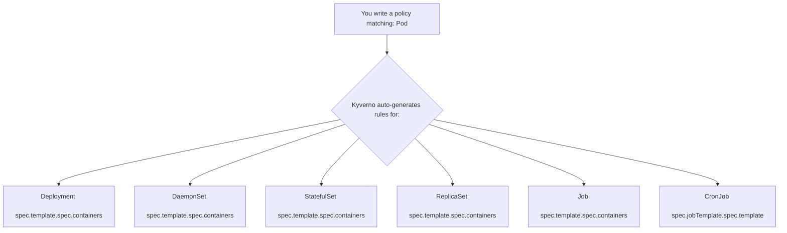

> **Complexity**: `[COMPLEX]` - Domain 5: Kyverno Advanced Policy Writing (32% of exam)
>
> **Time to Complete**: 90-120 minutes
>
> **Prerequisites**: Kyverno basics (install, ClusterPolicy vs Policy), Kubernetes admission controllers, familiarity with YAML and kubectl (v1.35+)

---

## Why This Module Matters

In late 2025, TradeLine Dynamics, a major global logistics firm, experienced a devastating supply chain attack that halted their automated routing systems for three days. The financial impact exceeded $14 million in service-level agreement penalties and lost revenue. The root cause was traced back to a compromised continuous integration pipeline, which pushed a maliciously modified, unsigned container image to their production Kubernetes clusters. The platform engineering team had deployed Kyverno but only implemented basic validation rules for namespace labels and resource quotas. They had completely overlooked advanced image verification and conditional enforcement.

This incident underscores a critical reality for Kubernetes administrators: basic policy enforcement is merely a foundation. True cluster security requires dynamic, context-aware policies that can cryptographically verify software supply chains, mutate resources on the fly, and perform complex logic without degrading API server performance. Domain 5 of the Kubernetes Certified Administrator (KCA) exam reflects this reality, representing a massive 32% of the total score. You cannot achieve certification without demonstrating mastery over these advanced capabilities.

In this module, you will transcend basic YAML configuration. You will learn to author sophisticated policies using the Common Expression Language (CEL) for high-performance validation, construct intricate JMESPath queries for deep payload inspection, and enforce zero-trust image supply chains using Cosign and Notary. We will also explore the operational lifecycle of policies, including garbage collection via CleanupPolicies and the nuanced behavior of background scans.

---

## What You'll Be Able to Do

After completing this module, you will be able to:

1. **Implement** multi-layered Kyverno policies utilizing the Common Expression Language (CEL) and JMESPath for high-performance, complex validation.
2. **Evaluate** and enforce image supply chain security by configuring cryptographically secure signature and attestation checks.
3. **Design** automated compliance and garbage collection routines using schedule-based CleanupPolicies.
4. **Diagnose** complex policy evaluation logic by mastering multi-level projections, context variables, and preconditions.
5. **Compare** the capabilities of JSON Patches against Strategic Merge Patches for precision resource mutation.

---

## Did You Know?

- Kyverno's native Common Expression Language (CEL) support allows validation rules to execute up to five times faster than equivalent JMESPath expressions by leveraging Kubernetes' native API server validation mechanisms.
- The `verifyImages` rule type is mathematically unique among admission controllers; it operates sequentially as both a mutating webhook (to resolve tags to immutable SHA256 digests) and a validating webhook (to cryptographically verify signatures) within a single API request.
- Background scans do not modify or delete active cluster state. When a policy is set to enforce mode, the background controller will flag existing non-compliant resources in a `PolicyReport` but relies on `CleanupPolicy` resources to perform actual garbage collection.
- A single Kyverno policy targeting the `Pod` resource will automatically generate up to six distinct validation rules covering Deployments, DaemonSets, StatefulSets, ReplicaSets, Jobs, and CronJobs.

---

## 1. The Evolution of Validation: CEL vs JMESPath

Historically, Kyverno relied entirely on JMESPath to evaluate constraints against incoming Kubernetes manifests. While incredibly flexible, JMESPath is untyped and evaluated at runtime, which can introduce latency during high-volume API server admission requests. To address this, Kyverno integrated the Common Expression Language (CEL). Originally developed by Google, CEL is a strictly typed, pre-compiled expression language that allows for blazingly fast boolean evaluations.

### CEL Syntax Basics

CEL syntax resembles C or Java, allowing you to traverse object properties using dot notation. Because it is strictly typed, errors are caught at parse time rather than at runtime.

```yaml
apiVersion: kyverno.io/v1
kind: ClusterPolicy
metadata:
  name: require-run-as-nonroot
spec:
  validationFailureAction: Enforce
  rules:
    - name: check-nonroot
      match:
        any:
          - resources:
              kinds:
                - Pod
      validate:
        cel:
          expressions:
            - expression: >-
                object.spec.containers.all(c,
                  has(c.securityContext) &&
                  has(c.securityContext.runAsNonRoot) &&
                  c.securityContext.runAsNonRoot == true)
              message: "All containers must set securityContext.runAsNonRoot to true."
```

In this policy, the `all()` macro iterates over every container `c`. The `has()` macro acts as a safe-navigation check to ensure the field exists before evaluating its value.

> **Pause and predict**: If you apply the above policy, what happens to a Pod that does not specify a `securityContext` at all? Because the expression requires `has(c.securityContext)` to evaluate to true, the absence of the context will cause the overall expression to fail, blocking the Pod.

### CEL vs JMESPath: When to Use Which

| Feature | CEL | JMESPath |
|---|---|---|
| **Syntax style** | C-like (`object.spec.x`) | Path-based (`request.object.spec.x`) |
| **Type safety** | Strongly typed at parse time | Loosely typed |
| **List operations** | `all()`, `exists()`, `filter()`, `map()` | Projections, filters |
| **String functions** | `startsWith()`, `contains()`, `matches()` | `starts_with()`, `contains()` |
| **Best for** | Simple field checks, boolean logic | Complex data transformations |
| **Mutation support** | No (validate only) | Yes (validate + mutate) |
| **Kyverno version** | 1.11+ | All versions |

### CEL with `oldObject` for UPDATE Validation

One of the most powerful features of CEL in Kyverno is state transition validation. During an `UPDATE` operation, the API server provides both the existing object state (`oldObject`) and the proposed new state (`object`).

```yaml
apiVersion: kyverno.io/v1
kind: ClusterPolicy
metadata:
  name: prevent-label-removal
spec:
  validationFailureAction: Enforce
  rules:
    - name: block-label-delete
      match:
        any:
          - resources:
              kinds:
                - Deployment
              operations:
                - UPDATE
      validate:
        cel:
          expressions:
            - expression: >-
                !has(oldObject.metadata.labels.app) ||
                has(object.metadata.labels.app)
              message: "The 'app' label cannot be removed once set."
```

This logic dictates that the operation is valid if the old object did not have the label, OR if the new object still has it.

---

## 2. Supply Chain Security with verifyImages

Securing the software supply chain requires cryptographic proof that the images executing in your cluster were built by trusted entities and have not been tampered with. The `verifyImages` rule enforces this by validating cryptographic signatures and in-toto attestations before admission.

### Cosign Signature Verification

Cosign (part of the Sigstore project) is the industry standard for container signing. The policy below ensures that any Pod attempting to run an image from `registry.example.com` must have a valid signature matching the provided public key.

```yaml
apiVersion: kyverno.io/v1
kind: ClusterPolicy
metadata:
  name: verify-image-signature
spec:
  validationFailureAction: Enforce
  webhookTimeoutSeconds: 30
  rules:
    - name: verify-cosign-signature
      match:
        any:
          - resources:
              kinds:
                - Pod
      verifyImages:
        - imageReferences:
            - "registry.example.com/*"
          attestors:
            - count: 1
              entries:
                - keys:
                    publicKeys: |-
                      -----BEGIN PUBLIC KEY-----
                      MFkwEwYHKoZIzj0CAQYIKoZIzj0DAQcDQgAEsLeM2H+JQfHi1PtMFbJFo3pABv2
                      OKjrFHxGnTYNeFJ4mDPOI8gMSMcKzfcWaVMPe8ZuGAsCmoAxmyBXnbPHTQ==
                      -----END PUBLIC KEY-----
```

Notice the `webhookTimeoutSeconds: 30` setting. Cryptographic verification requires network calls to the container registry, which can easily exceed the default admission webhook timeout of ten seconds.

### Notary Signature Verification

For environments utilizing Docker Notary for image trust, Kyverno provides native certificate verification.

```yaml
apiVersion: kyverno.io/v1
kind: ClusterPolicy
metadata:
  name: verify-notary-signature
spec:
  validationFailureAction: Enforce
  rules:
    - name: verify-notary
      match:
        any:
          - resources:
              kinds:
                - Pod
      verifyImages:
        - imageReferences:
            - "registry.example.com/*"
          attestors:
            - entries:
                - certificates:
                    cert: |-
                      -----BEGIN CERTIFICATE-----
                      ...your certificate here...
                      -----END CERTIFICATE-----
```

### Attestation Checks (SBOM / Vulnerability Scan)

Signatures only prove origin; they do not prove quality. Attestations are signed metadata payloads attached to the image. A common use case is evaluating a vulnerability scan attestation (such as from Trivy) to ensure zero critical vulnerabilities exist before deployment.

```yaml
apiVersion: kyverno.io/v1
kind: ClusterPolicy
metadata:
  name: verify-vulnerability-scan
spec:
  validationFailureAction: Enforce
  rules:
    - name: check-vuln-attestation
      match:
        any:
          - resources:
              kinds:
                - Pod
      verifyImages:
        - imageReferences:
            - "registry.example.com/*"
          attestors:
            - entries:
                - keys:
                    publicKeys: |-
                      -----BEGIN PUBLIC KEY-----
                      ...
                      -----END PUBLIC KEY-----
          attestations:
            - type: https://cosign.sigstore.dev/attestation/vuln/v1
              conditions:
                - all:
                    - key: "{{ scanner }}"
                      operator: Equals
                      value: "trivy"
                    - key: "{{ result[?severity == 'CRITICAL'] | length(@) }}"
                      operator: LessThanOrEquals
                      value: "0"
```

---

## 3. Automated Resource Lifecycle with Cleanup Policies

While admission webhooks are reactive, `CleanupPolicy` and `ClusterCleanupPolicy` resources operate proactively. They run on cron-like schedules to prune ephemeral or non-compliant resources, significantly reducing administrative overhead and cloud costs.

### Basic CleanupPolicy: Delete Old Pods

```yaml
apiVersion: kyverno.io/v2
kind: ClusterCleanupPolicy
metadata:
  name: delete-failed-pods
spec:
  match:
    any:
      - resources:
          kinds:
            - Pod
  conditions:
    any:
      - key: "{{ target.status.phase }}"
        operator: Equals
        value: Failed
  schedule: "*/15 * * * *"
```

This rule scans the entire cluster every fifteen minutes, targeting and deleting any Pod that has entered the `Failed` phase.

### TTL-Based Cleanup

Time-to-Live (TTL) garbage collection is essential for temporary resources like debug ConfigMaps.

```yaml
apiVersion: kyverno.io/v2
kind: CleanupPolicy
metadata:
  name: cleanup-old-configmaps
  namespace: staging
spec:
  match:
    any:
      - resources:
          kinds:
            - ConfigMap
          selector:
            matchLabels:
              temporary: "true"
  conditions:
    any:
      - key: "{{ time_since('', '{{ target.metadata.creationTimestamp }}', '') }}"
        operator: GreaterThan
        value: "24h"
  schedule: "0 */6 * * *"
```

> **Stop and think**: Why do CleanupPolicies require specific RBAC permissions granted to the Kyverno service account, unlike standard validation policies?
> Standard validation policies only inspect JSON payloads during the admission request phase and return an allow/deny response to the API server. Cleanup policies must issue active `DELETE` requests to the Kubernetes API, meaning the Kyverno service account must possess explicit `delete` verbs for the target resource kinds.

### Cleanup Policy with Exclusions

```yaml
apiVersion: kyverno.io/v2
kind: ClusterCleanupPolicy
metadata:
  name: cleanup-completed-jobs
spec:
  match:
    any:
      - resources:
          kinds:
            - Job
  exclude:
    any:
      - resources:
          selector:
            matchLabels:
              retain: "true"
  conditions:
    all:
      - key: "{{ target.status.succeeded }}"
        operator: GreaterThan
        value: 0
  schedule: "0 2 * * *"
```

---

## 4. Advanced JMESPath Projections

When CEL cannot be utilized (such as within mutation rules or when dealing with highly nested iterations), JMESPath remains the dominant querying engine. Advanced JMESPath relies heavily on projections and filters to extract meaningful data from complex Kubernetes manifests.

### Multi-Level Queries and Projections

```yaml
apiVersion: kyverno.io/v1
kind: ClusterPolicy
metadata:
  name: limit-container-ports
spec:
  validationFailureAction: Enforce
  rules:
    - name: max-three-ports
      match:
        any:
          - resources:
              kinds:
                - Pod
      validate:
        message: "Each container may expose a maximum of 3 ports."
        deny:
          conditions:
            any:
              - key: "{{ request.object.spec.containers[?length(ports || `[]`) > `3`] | length(@) }}"
                operator: GreaterThan
                value: 0
```

The filter `[?length(ports || \`[]\`) > \`3\`]` iterates over all containers, creating an array of those with more than three ports. If the length of that resulting array is greater than zero, the condition triggers a denial.

### Key JMESPath Functions for the Exam

```jmespath
# length() - count items or string length
"{{ request.object.spec.containers | length(@) }}"

# contains() - check if array/string contains a value
"{{ contains(request.object.metadata.labels.keys(@), 'app') }}"

# starts_with() / ends_with() - string prefix/suffix checks
"{{ starts_with(request.object.metadata.name, 'prod-') }}"

# join() - concatenate array elements
"{{ request.object.spec.containers[*].name | join(', ', @) }}"

# to_string() / to_number() - type conversion
"{{ to_number(request.object.spec.containers[0].resources.limits.cpu || '0') }}"

# merge() - combine objects
"{{ merge(request.object.metadata.labels, `{\"managed-by\": \"kyverno\"}`) }}"

# not_null() - return first non-null value
"{{ not_null(request.object.metadata.labels.team, 'unknown') }}"
```

### Multi-Level Projection Example

```yaml
apiVersion: kyverno.io/v1
kind: ClusterPolicy
metadata:
  name: require-resource-limits
spec:
  validationFailureAction: Enforce
  rules:
    - name: check-all-containers
      match:
        any:
          - resources:
              kinds:
                - Pod
      validate:
        message: >-
          All containers must define memory limits. Missing in:
          {{ request.object.spec.containers[?!contains(keys(resources.limits || `{}`), 'memory')].name | join(', ', @) }}
        deny:
          conditions:
            any:
              - key: "{{ request.object.spec.containers[?!contains(keys(resources.limits || `{}`), 'memory')] | length(@) }}"
                operator: GreaterThan
                value: 0
```

---

## 5. Precision Mutations using JSON Patches

Kyverno handles mutation via the MutatingAdmissionWebhook. While Strategic Merge Patches offer a simple overlay mechanism, they lack the ability to explicitly remove fields or append to exact array indices. For precision control, RFC 6902 JSON Patches are required.

### When to Use JSON Patch vs Strategic Merge

| Scenario | Use JSON Patch | Use Strategic Merge |
|---|---|---|
| Add a sidecar container | Yes | Works but verbose |
| Set a single field | Either works | Simpler syntax |
| Remove a field | Yes (only option) | Cannot remove |
| Conditional array element changes | Yes | No |
| Add to a specific array index | Yes | No |

### JSON Patch: Inject Sidecar Container

To inject a logging sidecar dynamically into specific workloads, JSON Patch allows for programmatic array appending.

```yaml
apiVersion: kyverno.io/v1
kind: ClusterPolicy
metadata:
  name: inject-logging-sidecar
spec:
  rules:
    - name: add-sidecar
      match:
        any:
          - resources:
              kinds:
                - Pod
              selector:
                matchLabels:
                  inject-sidecar: "true"
      mutate:
        patchesJson6902: |-
          - op: add
            path: "/spec/containers/-"
            value:
              name: log-collector
              image: fluent/fluent-bit:3.0
              resources:
                limits:
                  memory: "128Mi"
                  cpu: "100m"
              volumeMounts:
                - name: shared-logs
                  mountPath: /var/log/app
          - op: add
            path: "/spec/volumes/-"
            value:
              name: shared-logs
              emptyDir: {}
```

The `/-` index syntax specifically directs the Kubernetes API server to append the object to the end of the targeted array.

### JSON Patch: Remove and Replace

```yaml
apiVersion: kyverno.io/v1
kind: ClusterPolicy
metadata:
  name: enforce-image-registry
spec:
  rules:
    - name: replace-image-registry
      match:
        any:
          - resources:
              kinds:
                - Pod
      mutate:
        patchesJson6902: |-
          - op: replace
            path: "/spec/containers/0/image"
            value: "registry.internal.example.com/nginx:1.27"
```

---

## 6. Autogen Rules and Policy Scopes

A major architectural advantage of Kyverno is its autogen feature. When you write a policy targeting a Pod, Kyverno understands that Pods are rarely created naked. They are spawned by controllers. Instead of forcing administrators to write six different variations of a policy for each controller type, Kyverno automatically translates Pod-level policies to target the pod templates within workload controllers.

### How Autogen Works

Here is the native structure represented conceptually:

```text
┌─────────────────────────────────────────────────────┐
│  You write a policy matching: Pod                   │
│                                                     │
│  Kyverno auto-generates rules for:                  │
│  ├── Deployment    (spec.template.spec.containers)  │
│  ├── DaemonSet     (spec.template.spec.containers)  │
│  ├── StatefulSet   (spec.template.spec.containers)  │
│  ├── ReplicaSet    (spec.template.spec.containers)  │
│  ├── Job           (spec.template.spec.containers)  │
│  └── CronJob       (spec.jobTemplate.spec.template) │
└─────────────────────────────────────────────────────┘
```

We can visualize this architecture natively using a Mermaid hierarchy:



### Controlling Autogen Behavior

You can explicitly limit which controllers inherit the autogenerated rules by defining the `pod-policies.kyverno.io/autogen-controllers` annotation.

```yaml
apiVersion: kyverno.io/v1
kind: ClusterPolicy
metadata:
  name: require-labels
  annotations:
    # Only auto-generate for Deployments and StatefulSets
    pod-policies.kyverno.io/autogen-controllers: Deployment,StatefulSet
spec:
  rules:
    - name: require-app-label
      match:
        any:
          - resources:
              kinds:
                - Pod
      validate:
        message: "The label 'app' is required."
        pattern:
          metadata:
            labels:
              app: "?*"
```

To entirely disable autogen compilation:

```yaml
metadata:
  annotations:
    pod-policies.kyverno.io/autogen-controllers: none
```

### Viewing Generated Rules

```bash
# After applying a Pod-targeting policy, inspect the generated rules:
k get clusterpolicy require-labels -o yaml | grep -A 5 "autogen-"
```

---

## 7. Background Scans and API Interactions

Policies are not limited to the fleeting moment of an admission request. Kyverno's background controller continuously evaluates cluster state against active policies. Furthermore, policies can reach out to external data sources to make dynamic admission decisions.

### Configuring Background Scan Behavior

```yaml
apiVersion: kyverno.io/v1
kind: ClusterPolicy
metadata:
  name: audit-privileged-containers
spec:
  validationFailureAction: Audit
  background: true  # default is true
  rules:
    - name: deny-privileged
      match:
        any:
          - resources:
              kinds:
                - Pod
      validate:
        message: "Privileged containers are not allowed."
        pattern:
          spec:
            containers:
              - securityContext:
                  privileged: "!true"
```

### Admission-Only Enforcement

```yaml
apiVersion: kyverno.io/v1
kind: ClusterPolicy
metadata:
  name: block-latest-tag
spec:
  validationFailureAction: Enforce
  background: false  # only check at admission time
  rules:
    - name: no-latest
      match:
        any:
          - resources:
              kinds:
                - Pod
      validate:
        message: "The ':latest' tag is not allowed."
        pattern:
          spec:
            containers:
              - image: "!*:latest"
```

### Reading Policy Reports

```bash
# List all policy reports (namespaced)
k get policyreport -A

# View a specific report's results
k get policyreport -n default -o yaml

# Cluster-scoped reports
k get clusterpolicyreport
```

### Using ConfigMap as a Variable Source

```kubernetes
apiVersion: v1
kind: ConfigMap
metadata:
  name: allowed-registries
  namespace: kyverno
data:
  registries: "registry.example.com,gcr.io/my-project,docker.io/myorg"
---
apiVersion: kyverno.io/v1
kind: ClusterPolicy
metadata:
  name: restrict-registries-from-configmap
spec:
  validationFailureAction: Enforce
  rules:
    - name: check-registry
      match:
        any:
          - resources:
              kinds:
                - Pod
      context:
        - name: allowedRegistries
          configMap:
            name: allowed-registries
            namespace: kyverno
      validate:
        message: >-
          Image registry is not in the allowed list.
          Allowed: {{ allowedRegistries.data.registries }}
        deny:
          conditions:
            all:
              - key: "{{ request.object.spec.containers[].image | [0] | split(@, '/') | [0] }}"
                operator: AnyNotIn
                value: "{{ allowedRegistries.data.registries | split(@, ',') }}"
```

### Calling the Kubernetes API

```yaml
apiVersion: kyverno.io/v1
kind: ClusterPolicy
metadata:
  name: require-namespace-label
spec:
  validationFailureAction: Enforce
  rules:
    - name: check-ns-label
      match:
        any:
          - resources:
              kinds:
                - Pod
      context:
        - name: nsLabels
          apiCall:
            urlPath: "/api/v1/namespaces/{{ request.namespace }}"
            jmesPath: "metadata.labels"
      validate:
        message: >-
          Pods can only be created in namespaces with a 'team' label.
          Namespace '{{ request.namespace }}' is missing the 'team' label.
        deny:
          conditions:
            any:
              - key: team
                operator: AnyNotIn
                value: "{{ nsLabels | keys(@) }}"
```

### API Call with POST (Service Call)

```yaml
context:
  - name: externalCheck
    apiCall:
      method: POST
      urlPath: "https://policy-check.internal/validate"
      data:
        - key: image
          value: "{{ request.object.spec.containers[0].image }}"
      jmesPath: "allowed"
```

---

## 8. Contextual Execution with Preconditions

Preconditions evaluate boolean logic before the primary rule body is executed. This prevents expensive mutations or validation checks from occurring on objects that do not meet the initial criteria.

### Basic Precondition

```yaml
apiVersion: kyverno.io/v1
kind: ClusterPolicy
metadata:
  name: require-probes-in-prod
spec:
  validationFailureAction: Enforce
  rules:
    - name: check-readiness-probe
      match:
        any:
          - resources:
              kinds:
                - Pod
      preconditions:
        all:
          - key: "{{ request.namespace }}"
            operator: In
            value:
              - production
              - prod-*
      validate:
        message: "All containers in production namespaces must have a readinessProbe."
        pattern:
          spec:
            containers:
              - readinessProbe: {}
```

### Preconditions with Complex Logic

```yaml
apiVersion: kyverno.io/v1
kind: ClusterPolicy
metadata:
  name: enforce-image-digest-for-critical
spec:
  validationFailureAction: Enforce
  rules:
    - name: digest-required
      match:
        any:
          - resources:
              kinds:
                - Pod
      preconditions:
        any:
          - key: "{{ request.object.metadata.labels.criticality || '' }}"
            operator: Equals
            value: "high"
          - key: "{{ request.namespace }}"
            operator: In
            value:
              - production
              - financial
      validate:
        message: >-
          Critical workloads must use image digests, not tags.
          Use image@sha256:... format.
        deny:
          conditions:
            any:
              - key: "{{ request.object.spec.containers[?!contains(@.image, '@sha256:')] | length(@) }}"
                operator: GreaterThan
                value: 0
```

### Precondition Operators Reference

| Operator | Description | Example |
|---|---|---|
| `Equals` / `NotEquals` | Exact match | `key: "foo"`, `value: "foo"` |
| `In` / `NotIn` | Membership check | `key: "foo"`, `value: ["foo","bar"]` |
| `GreaterThan` / `LessThan` | Numeric comparison | `key: "5"`, `value: 3` |
| `GreaterThanOrEquals` / `LessThanOrEquals` | Inclusive comparison | `key: "5"`, `value: 5` |
| `AnyIn` / `AnyNotIn` | Any element matches | Array-to-array comparison |
| `AllIn` / `AllNotIn` | All elements match | Array-to-array comparison |
| `DurationGreaterThan` | Time duration comparison | `key: "2h"`, `value: "1h"` |

---

## Common Mistakes

| Mistake | Problem | Solution |
|---|---|---|
| Using CEL in mutate rules | CEL only works with validate | Use JMESPath for mutation |
| Forgetting `webhookTimeoutSeconds` on `verifyImages` | Signature verification can be slow; default 10s may timeout | Set to 30s for image verification policies |
| Using `background: true` with `verifyImages` | Image verification cannot run in background scans | Kyverno ignores background for verifyImages, but be aware |
| JSON Patch with wrong array index | Index out of bounds causes patch failure | Use `/-` to append, or use strategic merge |
| Not quoting JMESPath backtick literals | `` `[]` `` and `` `{}` `` are JMESPath literals, not YAML | Wrap entire expression in double quotes |
| Assuming autogen works for all fields | Fields outside `spec.containers` may not translate | Verify with `kubectl get clusterpolicy -o yaml` |
| CleanupPolicy without RBAC | Kyverno SA needs delete permission on target resources | Ensure Kyverno ClusterRole covers cleanup targets |
| Precondition `any` vs `all` confusion | `any` = OR logic, `all` = AND logic | Think "any of these must be true" vs "all must be true" |

---

## Quiz

**Question 1**: You are designing a Kyverno policy that automatically injects a sidecar container into Pods that have a specific label. You decide to use CEL for the mutation logic because of its strict type safety and high performance. Will this architectural approach succeed in a production environment?

<details>
<summary>Show Answer</summary>

CEL can only be used in `validate` rules. It cannot be used for `mutate`, `generate`, or `verifyImages` rules. If you need to modify resources, you must use JMESPath. The API server evaluation integration for CEL strictly prohibits state mutation.

</details>

**Question 2**: Your security team mandates that not only must container images be signed by the continuous integration system, but they must also carry a vulnerability scan attestation proving zero critical CVEs exist. Which field within the `verifyImages` rule is strictly required to enforce this policy?

<details>
<summary>Show Answer</summary>

The `attestations` field checks that an image carries specific in-toto attestations (such as vulnerability scan results, SBOM, or build provenance) in addition to a valid signature. You can define conditions on the attestation payload to enforce requirements like "zero critical vulnerabilities."

</details>

**Question 3**: A developer submits a pull request updating a `CleanupPolicy` to target older ephemeral Jobs. They then manually trigger an API request to modify one of those old Jobs, expecting the cleanup policy to fire and delete it immediately. Why does the Job remain active in the cluster despite the API request?

<details>
<summary>Show Answer</summary>

CleanupPolicies run on a cron schedule (defined in the `schedule` field) and delete matching resources. They are not triggered by API admission webhooks. Validate and mutate policies run at admission time (and optionally during background scans).

</details>

**Question 4**: During a debugging session, you review a JSON Patch designed to inject a new shared volume mount into a Pod specification. The path specified is `"/spec/containers/0/volumeMounts/-"`. What is the exact syntactic significance of the `/-` suffix in this RFC 6902 path?

<details>
<summary>Show Answer</summary>

The `/-` suffix means "append to the end of the array." It adds a new element to the `containers` array without needing to know the current array length or specify an index. This prevents out-of-bounds errors during admission mutation.

</details>

**Question 5**: You deploy a new `ClusterPolicy` that targets the `Pod` resource kind to enforce CPU limits. You deliberately omit all autogen-related annotations. A few minutes later, a platform engineer deploys a `DaemonSet`. Will this policy actively inspect and govern the pod templates created by that `DaemonSet`?

<details>
<summary>Show Answer</summary>

Kyverno auto-generates rules for: Deployment, DaemonSet, StatefulSet, ReplicaSet, Job, and CronJob. These are all the built-in Pod controllers. The annotation `pod-policies.kyverno.io/autogen-controllers` can restrict or disable this behavior.

</details>

**Question 6**: You configure a validation policy utilizing `background: true` alongside `validationFailureAction: Enforce`. The cluster already contains several running Pods that directly violate this new policy. Will Kyverno immediately terminate or evict these non-compliant Pods during its next scheduled background scan?

<details>
<summary>Show Answer</summary>

With `Audit`, background scans generate PolicyReport entries for non-compliant existing resources but do not block anything. With `Enforce`, background scans still generate reports (they cannot delete or block existing resources), but new admissions will be blocked. Background scans themselves never delete or modify resources -- they only report.

</details>

**Question 7**: You are tasked with writing a validation policy that aggressively blocks Pod creation if the destination namespace lacks a critical `billing-tier` label. Because the Pod manifest does not contain the namespace labels, how can your policy retrieve this data during the admission request phase?

<details>
<summary>Show Answer</summary>

Use the `apiCall` context variable with `urlPath: "/api/v1/namespaces/{{ request.namespace }}"`. You can then use `jmesPath` to extract specific fields from the API response. This call is made at admission time with Kyverno's service account credentials.

</details>

**Question 8**: In a complex policy, your precondition block defines a top-level `any` keyword containing two distinct conditional checks. One evaluates if the target namespace is `production`, while the other evaluates if the resource possesses a `critical` label. Under what circumstances will Kyverno proceed to evaluate the primary validation rule?

<details>
<summary>Show Answer</summary>

The rule executes when at least one of the two conditions is true. The `any` keyword means OR logic -- if any condition in the list evaluates to true, the precondition passes and the rule is evaluated. Use `all` for AND logic where every condition must be true.

</details>

**Question 9**: Your compliance framework requires a policy that actively removes the `hostNetwork: true` configuration from any incoming Pod specification, forcibly securing the workload. Can you achieve this field removal using a standard strategic merge patch within your mutation rule?

<details>
<summary>Show Answer</summary>

No. Strategic merge patches cannot remove fields -- they can only add or replace values. To remove a field, you must use a JSON Patch (RFC 6902) with `op: remove` and `path: "/spec/hostNetwork"`.

</details>

---

## Hands-On Exercise

### Objective

Build a multi-rule ClusterPolicy that seamlessly combines five advanced techniques. Test each rule iteratively to verify the policy executes accurately across the cluster.

### Step 1: Prerequisites

Initialize a local sandbox and deploy the Kyverno engine.

```bash
# Start a kind cluster
kind create cluster --name kyverno-lab

# Install Kyverno
helm repo add kyverno https://kyverno.github.io/kyverno/
helm repo update
helm install kyverno kyverno/kyverno -n kyverno --create-namespace
```

### Step 2: Create the Combined Policy

Save this manifesto as `advanced-policy.yaml`. This policy aggregates CEL validation, JMESPath querying, and JSON Patching into a unified enforcement envelope.

```yaml
apiVersion: kyverno.io/v1
kind: ClusterPolicy
metadata:
  name: advanced-kca-exercise
  annotations:
    pod-policies.kyverno.io/autogen-controllers: Deployment,StatefulSet
spec:
  validationFailureAction: Enforce
  background: true
  webhookTimeoutSeconds: 30
  rules:
    # Rule 1: CEL validation - require runAsNonRoot
    - name: cel-nonroot
      match:
        any:
          - resources:
              kinds:
                - Pod
      validate:
        cel:
          expressions:
            - expression: >-
                object.spec.containers.all(c,
                  has(c.securityContext) &&
                  has(c.securityContext.runAsNonRoot) &&
                  c.securityContext.runAsNonRoot == true)
              message: "All containers must set runAsNonRoot: true (CEL check)."

    # Rule 2: JMESPath - require memory limits with helpful message
    - name: jmespath-memory-limits
      match:
        any:
          - resources:
              kinds:
                - Pod
      preconditions:
        all:
          - key: "{{ request.namespace }}"
            operator: NotEquals
            value: kube-system
      validate:
        message: >-
          Memory limits are required. Missing in containers:
          {{ request.object.spec.containers[?!resources.limits.memory].name | join(', ', @) }}
        deny:
          conditions:
            any:
              - key: "{{ request.object.spec.containers[?!resources.limits.memory] | length(@) }}"
                operator: GreaterThan
                value: 0

    # Rule 3: JSON Patch mutation - add standard labels
    - name: add-managed-labels
      match:
        any:
          - resources:
              kinds:
                - Pod
      mutate:
        patchesJson6902: |-
          - op: add
            path: "/metadata/labels/managed-by"
            value: "kyverno"
          - op: add
            path: "/metadata/labels/policy-version"
            value: "v1"
```

Apply the configuration:

```bash
k apply -f advanced-policy.yaml
```

### Step 3: Test Validation Rejection

Deploy a non-compliant workload to observe the immediate API denial.

```bash
# This Pod has no securityContext and no memory limits -- should fail
k run test-fail --image=nginx --restart=Never
```

*Expected behavior: The API server rejects the request, citing the `cel-nonroot` validation failure.*

### Step 4: Test Valid Admission

Deploy a compliant workload mapping all required context fields.

```bash
# Create a compliant Pod
cat <<'EOF' | k apply -f -
apiVersion: v1
kind: Pod
metadata:
  name: test-pass
spec:
  containers:
    - name: nginx
      image: nginx:1.27
      securityContext:
        runAsNonRoot: true
        runAsUser: 1000
      resources:
        limits:
          memory: "128Mi"
          cpu: "100m"
EOF
```

### Step 5: Verify Mutation and Autogen Mechanics

Inspect the admitted workload to ensure JSON Patch injection succeeded.

```bash
# Check that Kyverno added the labels
k get pod test-pass -o jsonpath='{.metadata.labels}' | jq .
```

Inspect the policy status to confirm the autogen engine compiled rules for standard controllers.

```bash
# Check the policy for auto-generated rules
k get clusterpolicy advanced-kca-exercise -o yaml | grep "name: autogen"
```

### Step 6: Review Background Reports

Review the outputs of the continuous cluster scan.

```bash
k get policyreport -A
```

### Success Checklist

- [ ] The non-compliant Pod (`test-fail`) is actively blocked with a clear error message.
- [ ] The compliant Pod (`test-pass`) is successfully admitted.
- [ ] The admitted Pod possesses the dynamically injected `managed-by: kyverno` and `policy-version: v1` labels.
- [ ] Autogen compilation rules exist strictly for Deployments and StatefulSets (ignoring DaemonSets and Jobs as configured).
- [ ] PolicyReports are automatically generated for any pre-existing, non-compliant cluster resources.

### Sandbox Cleanup

```bash
kind delete cluster --name kyverno-lab
```

---

## Next Module

Continue to **Module 2: Policy Exceptions and Multi-Tenancy**, where you will learn to implement `PolicyException` resources, configure strict namespace-scoped enforcement boundaries, and architect reusable policy libraries tailored for highly segregated multi-tenant environments.