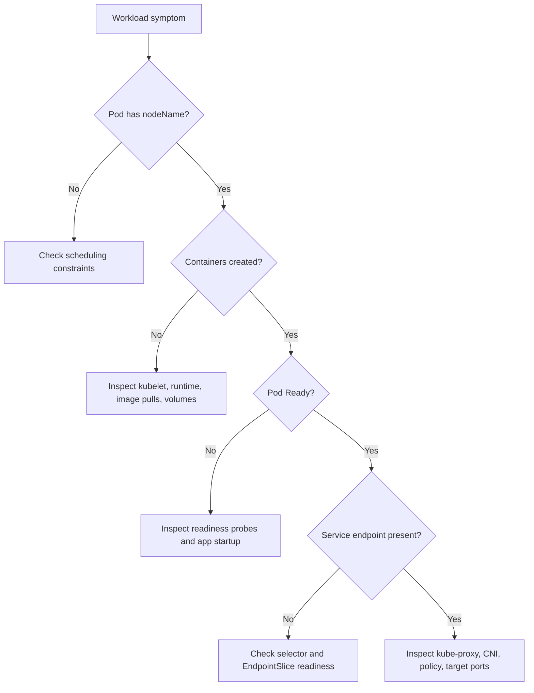

# Module 1.4: Kubernetes Architecture - Node Components

> **Complexity**: `[MEDIUM]` - Core architecture concepts
>
> **Time to Complete**: 45-55 minutes
>
> **Prerequisites**: Module 1.3. This module assumes you can already name the control-plane components and read basic Kubernetes object output, because the lesson now shifts from cluster decisions to the node agents that execute those decisions.

## What You'll Be Able to Do

After completing this module, you will be able to connect observable symptoms to the node component most likely to own them, then use that mapping to inspect real cluster state instead of guessing from a single status column:

1. **Diagnose** node readiness problems by connecting kubelet, kube-proxy, and container runtime signals to observable cluster symptoms.
2. **Compare** kube-proxy iptables, IPVS, and replacement designs so you can evaluate Service routing tradeoffs in Kubernetes 1.35+ clusters.
3. **Trace** a Pod from API server storage through scheduler assignment, kubelet reconciliation, runtime startup, readiness, and Service traffic.
4. **Implement** a node-level inspection workflow with the `k` alias that checks node conditions, Pod placement, runtime details, Services, and EndpointSlices.

## Why This Module Matters

During a regional checkout incident at a large online retailer, the application team saw a confusing symptom: Deployments were healthy in Git, the control plane accepted new manifests, and dashboards showed enough desired replicas, yet customers intermittently received connection resets during payment. The expensive part was not the first broken Pod; it was the thirty minutes of uncertainty while teams argued whether the scheduler, the network plugin, the load balancer, or the application image was responsible. In that window, orders backed up, call-center volume climbed, and the incident commander needed a simple answer: is the cluster still deciding correctly, or are the nodes failing to execute those decisions?

That distinction is the heart of Kubernetes architecture. The control plane stores desired state and chooses where work should run, but the node components turn that intent into running processes, network rules, health reports, and endpoint updates. If kubelet stops reporting, the API server may still be available while a node becomes `NotReady`. If kube-proxy rules are stale, Pods may be running while Services route poorly. If the container runtime cannot pull an image, scheduling succeeded but execution failed. A practitioner who can separate those layers can shorten an incident from broad speculation to a focused diagnostic path.

This module completes the architecture picture started in the control-plane lesson. You will learn what a node is, what kubelet, kube-proxy, and the container runtime each own, how node conditions affect scheduling and eviction, and how a Pod moves from a YAML object to an application receiving traffic. The goal is not memorizing component names for the KCNA exam; the goal is building a mental model you can apply when a cluster says one thing in the API and another thing on the machines doing the work.

## What a Node Really Is

A Kubernetes node is any machine that can run the node agent, reach the API server, host the container runtime, and participate in cluster networking. It can be a bare-metal server in a colocation rack, a virtual machine from a cloud provider, or a local VM created by a learning tool. Kubernetes does not care whether the CPU sits in a cloud instance or under your desk as long as the node satisfies the contracts expected by the control plane and the cluster network. That abstraction is powerful because it lets the same Deployment model target many infrastructure shapes, but it also hides important operational differences such as disk behavior, kernel features, and network policy support.

```
┌─────────────────────────────────────────────────────────────┐
│              WHAT IS A NODE?                                │
├─────────────────────────────────────────────────────────────┤
│                                                             │
│  A node can be:                                            │
│  • Physical server (bare metal)                            │
│  • Virtual machine (EC2, GCE VM, Azure VM)                │
│  • Cloud instance                                          │
│                                                             │
│  Every node runs:                                          │
│  ┌─────────────────────────────────────────────────────┐   │
│  │  kubelet      - Node agent                          │   │
│  │  kube-proxy   - Network proxy                       │   │
│  │  Container runtime - Runs containers                │   │
│  └─────────────────────────────────────────────────────┘   │
│                                                             │
│  Nodes register themselves with the control plane          │
│  Control plane assigns Pods to nodes                       │
│                                                             │
└─────────────────────────────────────────────────────────────┘
```

Think of a node as a small branch office receiving instructions from headquarters. The API server is where the official work orders live, the scheduler chooses which branch should handle a new order, and the node is the branch office that must open the boxes, start the equipment, check that the work is safe, and report progress. A branch can keep serving customers for a while if the phone line to headquarters is interrupted, but it cannot receive new assignments or provide fresh status until communication returns. That is why existing Pods often keep running during a temporary control-plane connectivity problem, while the node may still become `Unknown` or `NotReady` from the control plane's perspective.

A node is also a boundary where several independent systems meet. The kubelet is Kubernetes-specific and reconciles Pod specs, while the runtime follows container standards, and the network stack depends on Linux kernel capabilities plus your CNI plugin. This separation gives Kubernetes portability, but it means no single command explains every failure. A `Pending` Pod may never reach the kubelet because the scheduler cannot place it. A `ContainerCreating` Pod may be on the right node while the runtime pulls an image or mounts volumes. A `Running` Pod may still be unreachable because readiness failed or Service routing has not learned the endpoint.

That boundary is why node troubleshooting rewards patient sequencing. If you ask the wrong layer first, you can collect accurate output that still does not answer the question. For example, a healthy kubelet service on the host does not prove a Service selector matches the right Pods, and a correct EndpointSlice does not prove the runtime can start a new container tomorrow. The node is where these layers meet, but each layer has its own evidence, failure modes, and repair actions.

The KCNA-level expectation is not that you become a Linux networking expert in one lesson. The expectation is that you can read a symptom and avoid category errors. When a Pod has not been assigned, the scheduler and constraints are upstream of kubelet. When a Pod is assigned but stuck creating, kubelet and the runtime are in the path. When traffic cannot reach a ready Pod through a Service, endpoint state, kube-proxy behavior, and CNI policy deserve attention. That kind of classification is the foundation for deeper platform work later.

Before you inspect a real node, set the standard alias used throughout KubeDojo modules. The full command is `kubectl`, but after introducing the shortcut once, we use `k` because it keeps examples readable and mirrors common operator habits.

```bash
alias k=kubectl
k version --client
k get nodes -o wide
```

Pause and predict: if the API server becomes unreachable for two minutes but the node OS, kubelet, and runtime keep running, which visible facts do you expect to change first: the containers on the node, the Node condition in the API, or the Service endpoint list?

When you run `k get nodes`, the `STATUS` column is a summary, not a diagnosis. A node that says `Ready` is promising because the kubelet recently reported healthy status and the node conditions do not block normal scheduling, but that single word does not reveal disk pressure, runtime version, kernel version, taints, allocatable resources, or recent events. A real diagnostic workflow moves from the summary to `k describe node`, then to Pod placement, then to the node-level components when shell access is available. The mental model comes first; the command sequence only makes sense when you know which component owns each observed fact.

There is also a timing problem hidden inside every node status. Kubernetes is a reconciliation system, so the API usually reports the latest state that components have observed and published, not an instantaneous truth from inside every process. During a fast failure, the application container, kubelet status update, Node condition, endpoint removal, and client-facing outage may not change at the same instant. A strong operator therefore reads Kubernetes output as a sequence of reported facts and asks which component had enough time and connectivity to update which object.

## Diagnose Node Readiness Through kubelet

The kubelet is the primary node agent, and it is the component most directly responsible for turning Pod intent into local reality. It watches the API server for Pods assigned to its node, validates whether it can run them, asks the container runtime to create containers, mounts volumes through plugins, configures probes, updates Pod status, and publishes Node status. The kubelet does not decide which node should run a Pod; that is the scheduler's job. It also does not implement the container engine itself; it delegates that work through the Container Runtime Interface.

```
┌─────────────────────────────────────────────────────────────┐
│              KUBELET                                        │
├─────────────────────────────────────────────────────────────┤
│                                                             │
│  What it does:                                             │
│  ─────────────────────────────────────────────────────────  │
│  • Runs on every node in the cluster                       │
│  • Watches for Pod assignments from API server             │
│  • Ensures containers are running and healthy              │
│  • Reports node and Pod status back to API server          │
│                                                             │
│  How it works:                                             │
│  ─────────────────────────────────────────────────────────  │
│                                                             │
│  API Server: "Node 2, run Pod X"                          │
│       │                                                     │
│       ▼                                                     │
│  kubelet:                                                  │
│  1. Receives Pod spec                                      │
│  2. Pulls container images                                 │
│  3. Creates containers via runtime                         │
│  4. Monitors container health                              │
│  5. Reports status to API server                          │
│                                                             │
│  Key point:                                                │
│  kubelet doesn't manage containers not created by K8s     │
│                                                             │
└─────────────────────────────────────────────────────────────┘
```

The phrase "node agent" can sound small, but kubelet sits at a critical reconciliation point. A controller may create a ReplicaSet, a Deployment may ask for more replicas, and the scheduler may bind a Pod to a node, but nothing starts on that node until the kubelet sees the assignment and acts on it. This is why `k describe pod` often reveals a story in the event stream: scheduled, pulling image, pulled, created, started, probe failed, back-off, or ready. Those events are breadcrumbs from the node execution path, and many of them are produced because kubelet is coordinating with the runtime.

Kubelet also reports Node conditions. Conditions are not merely labels; they are signals consumed by humans, controllers, and scheduling logic. `Ready=False` tells the cluster not to place ordinary new Pods on the node. `DiskPressure=True` says local storage is low enough that the kubelet may evict Pods. `MemoryPressure=True` means memory pressure is affecting reliability, while `PIDPressure=True` indicates process limits are being exhausted. `NetworkUnavailable=True` usually points to networking setup that has not completed or has failed, which matters before you blame a Service or Ingress.

| Condition | Meaning |
|-----------|---------|
| **Ready** | Node is healthy and can accept Pods |
| **DiskPressure** | Disk capacity is low |
| **MemoryPressure** | Memory is running low |
| **PIDPressure** | Too many processes |
| **NetworkUnavailable** | Network not configured |

The kubelet is intentionally conservative when resources are scarce. If a node runs out of ephemeral storage, the problem may appear as image garbage collection, Pod eviction, or failed container creation depending on timing and workload behavior. A team that only watches CPU and memory can miss the simpler explanation that log growth filled the node filesystem. The practical lesson is that node readiness diagnosis should always include conditions, allocatable resources, and recent events before you jump into application logs.

Kubelet's conservatism can feel harsh because it may evict a Pod that was not the root cause of the pressure. That behavior is still part of the node's safety system. A node that cannot preserve enough memory, disk, or process capacity becomes unreliable for every workload on it, so kubelet protects the machine and reports pressure rather than pretending all assigned Pods are equally safe. Once you see kubelet as the local safety officer, pressure conditions and evictions become easier to interpret.

Use this inspection pattern when a node looks suspicious. It starts with the cluster API because that is what Kubernetes itself believes, then narrows toward the component that owns local execution.

```bash
k get nodes
k describe node <node-name>
k get pods -A -o wide --field-selector spec.nodeName=<node-name>
k get events -A --field-selector involvedObject.kind=Node,involvedObject.name=<node-name>
```

Before running this, what output do you expect if a node is healthy enough to report status but too full to accept new workloads? Look for a `Ready` condition that may still be true, a pressure condition that is true, recent eviction or disk warnings, and Pods that are clustered on that node because they were already running before the pressure became severe.

A useful war story comes from a platform team that investigated repeated "random" restarts in a logging-heavy namespace. The application team focused on crash loops, while the platform team noticed that every affected Pod had recently landed on the same worker node. `k describe node` showed `DiskPressure=True`, and the kubelet events showed image garbage collection failing to free enough space. The containers were not defective; the node's local storage was exhausted by logs and unused images, and kubelet was doing exactly what it is designed to do under pressure.

Another common incident begins with a node that is technically reachable but slow enough that status updates lag and probes fail. Application owners may see readiness failures, while platform engineers see kubelet warnings, and network engineers see no obvious packet drop. In that case, the correct question is not "which team owns Kubernetes" but "which contract is failing first." If kubelet cannot reliably observe and report container health, the API will become stale, controllers will react to stale data, and Service endpoint changes may trail the real condition of the workload.

Kubelet does not manage every process on the machine, and that boundary matters. If an administrator starts a container manually with a runtime command outside Kubernetes, kubelet does not automatically adopt it into the cluster's desired state. Kubernetes-owned containers are tied to Pod specs, UIDs, volumes, probes, security context, restart policy, and status reporting. Manual processes can still consume CPU, memory, disk, ports, or PIDs, so they can break a Kubernetes node without appearing as ordinary Kubernetes workloads. Good operators avoid unmanaged workloads on cluster nodes unless the node is explicitly designed for that role.

Node registration is another kubelet responsibility that creates visible cluster state. When a machine joins, kubelet authenticates to the API server, creates or updates the Node object, reports capacity and allocatable resources, and then keeps sending heartbeats. If the kubelet stops heartbeating, the control plane eventually treats the node as unhealthy even if its existing containers are still alive. This distinction is important during network partitions because the API is not a perfect mirror of every process; it is the latest state reported through Kubernetes contracts.

For exam and field work, the practical rule is simple: kubelet is the bridge between desired Pod specs and observed node state. It reads assigned work from the API, asks the runtime to perform container actions, checks health, updates status, and tells the control plane whether the node is still a good place to run work. If your diagnosis cannot explain what kubelet would read, do, or report at that moment, your diagnosis probably has a missing step.

## Trace Pod Execution Through the Container Runtime

The container runtime is the node component that actually pulls images, creates containers, starts processes, and manages container lifecycle. Kubernetes used to have a closer relationship with Docker Engine, but modern Kubernetes relies on the Container Runtime Interface so kubelet can talk to CRI-compliant runtimes such as containerd and CRI-O. This decoupling is one reason Kubernetes can evolve without bundling a particular runtime. It also means runtime-specific failures appear through kubelet and Pod events, not usually as direct scheduler errors.

```
┌─────────────────────────────────────────────────────────────┐
│              CONTAINER RUNTIME                              │
├─────────────────────────────────────────────────────────────┤
│                                                             │
│  What it does:                                             │
│  ─────────────────────────────────────────────────────────  │
│  • Pulls images from registries                            │
│  • Creates and starts containers                           │
│  • Manages container lifecycle                             │
│                                                             │
│  Kubernetes uses CRI (Container Runtime Interface):        │
│  ─────────────────────────────────────────────────────────  │
│                                                             │
│       kubelet                                              │
│          │                                                  │
│          │ CRI (gRPC)                                      │
│          ▼                                                  │
│    ┌─────────────────────────────────────────────────┐     │
│    │  containerd  │  CRI-O  │  Other CRI runtime    │     │
│    └─────────────────────────────────────────────────┘     │
│          │                                                  │
│          │ OCI (Open Container Initiative)                 │
│          ▼                                                  │
│    ┌───────────────┐                                       │
│    │  runc / kata  │  (low-level runtime)                 │
│    └───────────────┘                                       │
│                                                             │
│  Common runtimes:                                          │
│  • containerd - Default in most distributions              │
│  • CRI-O - Lightweight, Kubernetes-focused                │
│                                                             │
└─────────────────────────────────────────────────────────────┘
```

The runtime layer is easiest to understand by following responsibility downward. Kubelet knows the Pod specification and desired lifecycle. The CRI runtime knows how to pull image layers, prepare the container filesystem, create container metadata, and start the container process. The low-level OCI runtime, such as `runc` or a sandboxed alternative, handles the final Linux primitives like namespaces and cgroups. Each layer narrows the problem: Kubernetes intent at the top, container lifecycle in the middle, kernel isolation at the bottom.

The Pod abstraction adds one more detail that surprises many beginners: a Pod is not just a bag of unrelated containers. Containers in the same Pod share networking and can share volumes, and the Pod sandbox provides the shared network namespace. This is why the original draft mentioned the "pause" container. The pause container is not your application, but it gives the Pod a stable network namespace so application containers in that Pod can come and go while the Pod identity remains coherent.

Runtime failures often look like Kubernetes failures because the symptom appears in `k get pods`. An image pull error may show as `ImagePullBackOff`, a bad command may become `CrashLoopBackOff`, a missing volume may keep the Pod in `ContainerCreating`, and an unsupported runtime setting may appear in events. The scheduler is not responsible for any of those once the Pod is bound to a node. A precise diagnostic question is: did the Pod fail before node assignment, during kubelet-to-runtime execution, after process start, or after readiness should have allowed traffic?

This is also where image hygiene becomes an architectural concern instead of a registry detail. If teams use mutable tags carelessly, pull large images on under-provisioned nodes, or depend on credentials that are not available in the target namespace, kubelet and the runtime will expose the problem as Pod startup delay or failure. The node components are not misbehaving; they are revealing that the desired state cannot be turned into a local process under current conditions. Reliable clusters treat image availability, credential scope, and runtime compatibility as part of deployment design.

Here is a small Pod you can use in a learning cluster when you want to watch runtime-related events. The manifest is intentionally simple so the node execution path is easier to see.

```yaml
apiVersion: v1
kind: Pod
metadata:
  name: runtime-demo
spec:
  containers:
  - name: web
    image: nginx:stable
    ports:
    - containerPort: 80
```

Apply it and inspect the events. The first command creates desired state in the API server; the interesting story begins after the scheduler assigns a node and the target kubelet asks the runtime to do the container work.

```bash
k apply -f runtime-demo.yaml
k get pod runtime-demo -o wide
k describe pod runtime-demo
```

Pause and predict: if the image name is mistyped but the cluster has enough capacity and the scheduler successfully chooses a node, which phase or event would you expect to see? The Pod can be assigned to a node while kubelet repeatedly asks the runtime to pull an image that does not exist, so the failure belongs to runtime execution rather than scheduling.

The runtime version is visible through the Node object, which is a reminder that kubelet reports local facts up to the API. `containerd://...` is common in many distributions, while some clusters use CRI-O. You do not need to memorize every runtime detail for KCNA, but you should recognize that "Docker" is no longer the default mental answer. Since Kubernetes removed the legacy dockershim years ago, current clusters use CRI-compatible runtimes, and troubleshooting should follow that architecture.

Runtime choice rarely matters to an application developer on a quiet day, but it matters to platform teams that manage upgrades, sandboxing, image policies, and debugging tools. containerd is widely used because it is stable, focused, and integrated into many distributions. CRI-O is designed specifically for Kubernetes use cases and is common in some ecosystems. Sandboxed runtimes add isolation at a cost in startup time, compatibility, or operational complexity. Kubernetes hides many of these differences behind CRI, but it does not make them disappear.

```bash
k describe node <node-name> | grep "Container Runtime Version"
k get node <node-name> -o jsonpath='{.status.nodeInfo.containerRuntimeVersion}{"\n"}'
```

When node shell access is available, runtime tooling can confirm what the Kubernetes API suggests. Many production clusters restrict node SSH for good reasons, so API-first diagnostics remain valuable, but lower-level checks can be decisive during platform incidents. For CRI runtimes, `crictl` is a common debugging tool because it speaks the same CRI surface kubelet uses. The point is not to replace Kubernetes commands; it is to verify the runtime layer when Pod events imply the problem lives there.

```bash
sudo crictl ps
sudo crictl images
sudo crictl inspectp <pod-sandbox-id>
```

The runtime also interacts with image policy, credentials, filesystem pressure, and security settings. A private registry problem may appear as an authentication failure during image pull. A node disk problem may block new images even when CPU and memory are fine. A restrictive security profile can prevent a container process from starting. These are all node execution issues, but they require different fixes, so your diagnosis should name the failing layer before recommending a change.

A useful worked example is a Pod that alternates between `ContainerCreating` and image pull warnings after a node replacement. The manifest did not change, the scheduler can place the Pod, and the Service selector is irrelevant because the Pod never becomes ready. The event stream shows authentication failure against a private registry, which means kubelet reached the runtime, the runtime tried to fetch the image, and credentials failed at the registry boundary. The correct fix is image pull secret or registry access, not changing kube-proxy, scaling the Deployment, or editing readiness probes.

## Compare kube-proxy and Service Routing Designs

kube-proxy is the node component that makes the Service abstraction work at the node level. A Service gives clients a stable virtual IP and DNS name while Pods behind that Service are created, deleted, rescheduled, or replaced. kube-proxy watches Services and EndpointSlices through the API server, then configures local forwarding rules so traffic to the Service can reach one of the backing Pod IPs. The name "proxy" can mislead people because, in common modes, kube-proxy is not a traditional userspace process relaying every byte of traffic.

```
┌─────────────────────────────────────────────────────────────┐
│              KUBE-PROXY                                     │
├─────────────────────────────────────────────────────────────┤
│                                                             │
│  What it does:                                             │
│  ─────────────────────────────────────────────────────────  │
│  • Maintains network rules on nodes                        │
│  • Enables Service abstraction                             │
│  • Handles connection forwarding to Pods                   │
│                                                             │
│  How Services work:                                        │
│  ─────────────────────────────────────────────────────────  │
│                                                             │
│       Client                                               │
│          │                                                  │
│          │ Request to Service IP                           │
│          ▼                                                  │
│    ┌───────────┐                                           │
│    │kube-proxy │ → Looks up which Pods back this Service   │
│    └───────────┘                                           │
│          │                                                  │
│          │ Forwards to Pod IP                              │
│          ▼                                                  │
│    ┌───────────┐                                           │
│    │   Pod     │                                           │
│    └───────────┘                                           │
│                                                             │
│  Modes:                                                    │
│  • iptables (default) - Uses iptables rules               │
│  • IPVS - Higher performance for large clusters           │
│  • userspace - Legacy, rarely used                        │
│                                                             │
└─────────────────────────────────────────────────────────────┘
```

In iptables mode, kube-proxy writes packet-filtering and NAT rules into the Linux kernel. Traffic is handled by the kernel according to those rules, which means kube-proxy does not sit in the data path for every packet in the way a reverse proxy would. In IPVS mode, kube-proxy programs the Linux IP Virtual Server subsystem, which was designed for load balancing and can scale better in clusters with many Services. Userspace mode is historically important but rarely what you want to design around today.

| kube-proxy mode | How traffic is handled | Best fit | Tradeoff |
|-----------------|------------------------|----------|----------|
| userspace | kube-proxy receives and forwards connections | Legacy learning context | Extra copying and poor modern fit |
| iptables | Kernel rules perform NAT and selection | Default, broad compatibility | Large rule sets can become harder to manage at scale |
| IPVS | Kernel load-balancer tables select endpoints | Large Service counts or high churn | Requires IPVS kernel support and operational familiarity |
| eBPF replacement | CNI programs kernel behavior directly | Advanced networking and observability needs | Adds dependency on a capable CNI and deeper platform expertise |

Service routing has a separate readiness dependency that often explains "Pod is running but traffic fails" incidents. kubelet evaluates readiness probes and reports Pod readiness. The endpoints controller then includes ready Pods in EndpointSlices for the Service. kube-proxy watches those EndpointSlices and updates node-local routing state. If a Pod is `Running` but not `Ready`, it may be doing exactly what you want: staying out of Service traffic until it can handle requests safely.

Readiness is where application health and node networking meet. The application decides whether it can serve, kubelet checks that decision through the configured probe, the API records readiness, EndpointSlices publish eligible backends, and kube-proxy or the CNI programs traffic behavior. Each step can be correct while the overall user symptom is still "clients cannot reach the service." This is why a mature debugging path checks readiness and endpoints before diving into packet captures.

The practical inspection sequence checks Service, EndpointSlice, and Pod readiness together. A ClusterIP with no endpoints is not a kube-proxy mystery; it usually means the Service selector matches no ready Pods, or the selected Pods have not passed readiness. A Service with endpoints but failed connectivity pushes you toward network policy, node routing rules, CNI behavior, or application port mismatch. The distinction keeps you from restarting kube-proxy for a label typo.

```bash
k get svc node-demo-svc
k get endpoints node-demo-svc
k get endpointslices -l kubernetes.io/service-name=node-demo-svc
k get pod node-demo -o wide
```

Stop and think: kube-proxy is described as a "network proxy," but it actually maintains iptables or IPVS rules rather than proxying traffic directly. Why is this distinction important for understanding how Services work at scale?

The answer affects both performance and diagnosis. If every packet had to traverse a userspace forwarding process, kube-proxy CPU and process health would dominate Service performance. In the common kernel-rule model, kube-proxy's job is to keep rules synchronized with API state; the kernel handles the packets after that. A broken or delayed sync can still break traffic, but the data path and the control path are not the same thing. This is exactly the kind of architectural separation KCNA expects you to recognize.

Some clusters replace kube-proxy entirely through CNI capabilities, commonly with eBPF-based implementations. That does not remove the need for Service routing; it changes who programs the kernel behavior and how the platform observes it. eBPF approaches can provide better performance and richer visibility in large clusters, but they also move more responsibility into the networking platform. For a beginner, the safe mental model is: standard clusters often use kube-proxy to maintain Service routing rules, while advanced CNIs may provide a kube-proxy-free implementation of the same Service contract.

The operational tradeoff is supportability. kube-proxy in iptables mode is familiar to many administrators, so basic failure modes are widely documented and easy to discuss across teams. IPVS and eBPF designs may scale better or expose richer flow data, but they require the team to understand the chosen implementation well enough to troubleshoot it under pressure. Do not choose a routing mode only because it sounds faster; choose it because it solves a real scale or observability problem and your platform team can operate it.

## Trace Scheduling, Node Lifecycle, and Traffic

A Pod's journey begins before any node component acts. A user submits a Pod or higher-level workload object to the API server, the API server persists desired state, and the scheduler watches for Pods without a node assignment. The scheduler evaluates constraints, resources, taints, tolerations, affinity, and policies, then writes a binding that assigns the Pod to a node. Only after that binding exists does the target kubelet take responsibility for execution on the chosen machine.

```
┌─────────────────────────────────────────────────────────────┐
│              POD SCHEDULING AND EXECUTION                   │
├─────────────────────────────────────────────────────────────┤
│                                                             │
│  1. User creates Pod                                       │
│     kubectl apply -f pod.yaml                              │
│            │                                                │
│            ▼                                                │
│  2. API Server stores Pod                                  │
│     Pod stored in etcd (no node assigned yet)             │
│            │                                                │
│            ▼                                                │
│  3. Scheduler watches, sees unscheduled Pod               │
│     Evaluates nodes, picks best one                       │
│     Updates Pod with node assignment                       │
│            │                                                │
│            ▼                                                │
│  4. kubelet on target node sees assignment                │
│     "I need to run this Pod"                              │
│            │                                                │
│            ▼                                                │
│  5. kubelet instructs container runtime                   │
│     Pull image, create container, start it                │
│            │                                                │
│            ▼                                                │
│  6. Container runs                                         │
│     kubelet monitors health                               │
│     Reports status to API server                          │
│                                                             │
└─────────────────────────────────────────────────────────────┘
```

This flow explains the difference between `Pending`, `ContainerCreating`, `Running`, and `Ready`. A Pod can be pending because no node fits its requirements. A Pod can be assigned to a node and still wait while kubelet prepares volumes or the runtime pulls images. A container can be running while readiness fails, which keeps the Pod out of Service endpoints. A ready Pod can receive traffic only after Service endpoint state and node routing rules line up. The labels are compact, but the architecture behind them is layered.

Node lifecycle adds the same layered thinking at machine scale. A node joins when kubelet starts and registers with the API server. It becomes ready when health and configuration checks succeed. It runs assigned Pods while kubelet reports status. It becomes questionable when heartbeats stop, resources run low, or the network is unavailable. It leaves gracefully when operators drain it and delete it, or ungracefully when the cluster must treat it as lost.

```
┌─────────────────────────────────────────────────────────────┐
│              NODE LIFECYCLE                                 │
├─────────────────────────────────────────────────────────────┤
│                                                             │
│  1. Node Joins Cluster                                     │
│     • kubelet starts and registers with API server         │
│     • Node appears in "kubectl get nodes"                  │
│                                                             │
│  2. Node Ready                                             │
│     • Passes health checks                                 │
│     • Scheduler can place Pods on it                       │
│     Status: Ready                                          │
│                                                             │
│  3. Node Running                                           │
│     • Runs assigned Pods                                   │
│     • kubelet reports status periodically                  │
│                                                             │
│  4. Node Issues                                            │
│     • Misses heartbeats → Status: Unknown                 │
│     • Low resources → Status: NotReady                    │
│                                                             │
│  5. Node Removed                                           │
│     • Drained (Pods moved elsewhere)                      │
│     • Deleted from cluster                                 │
│                                                             │
└─────────────────────────────────────────────────────────────┘
```

Draining is the operational version of respecting that lifecycle. When you need to patch a node, replace hardware, or investigate a degraded machine, you do not simply power it off and hope controllers recover politely. You cordon the node to prevent new scheduling, drain it so eligible Pods move elsewhere, perform the work, and then uncordon it when it is ready to receive workloads again. Workloads controlled by Deployments usually recover well; singleton Pods, local storage, and strict disruption budgets require more care.

```bash
k cordon <node-name>
k drain <node-name> --ignore-daemonsets --delete-emptydir-data
k uncordon <node-name>
```

Which approach would you choose here and why: immediately deleting a suspicious node object, cordoning and draining the node, or leaving it schedulable while you collect evidence? In most production incidents, cordon first is a low-risk way to stop the node from receiving more work while preserving evidence and giving controllers time to maintain service availability.

The original architecture summary remains useful because it compresses the control-plane versus node division into a single picture. The control plane is the brain in the sense that it records desired state, schedules, and runs controllers. Nodes are the muscle in the sense that they run the actual workloads and report what happened. The analogy is imperfect because nodes also make local safety decisions, but it is a good first split when diagnosing symptoms.

```
┌─────────────────────────────────────────────────────────────┐
│              CONTROL PLANE vs NODE                          │
├─────────────────────────────────────────────────────────────┤
│                                                             │
│  CONTROL PLANE (Brain)          NODE (Muscle)              │
│  ──────────────────────────────────────────────────────    │
│                                                             │
│  Makes decisions                Executes decisions         │
│  Stores cluster state           Runs workloads             │
│  Schedules Pods                 Runs Pods                  │
│  Usually 3+ for HA             Many (10s to 1000s)        │
│                                                             │
│  Components:                    Components:                 │
│  • API Server                   • kubelet                  │
│  • etcd                         • kube-proxy               │
│  • Scheduler                    • Container runtime        │
│  • Controller Manager                                      │
│                                                             │
└─────────────────────────────────────────────────────────────┘
```

The most reliable troubleshooting habit is to place every symptom on this flow before taking action. If the Pod has no node name, investigate scheduling and constraints. If it has a node name but containers are not created, inspect kubelet events, runtime status, image pulls, volumes, and node conditions. If the Pod is ready but clients fail through the Service, inspect selectors, EndpointSlices, kube-proxy or CNI routing, and network policy. That sequence avoids a common beginner mistake: treating Kubernetes as one black box instead of a set of cooperating controllers and agents.

This sequence also protects you from noisy correlation. During an incident, many things change at once: autoscalers react, controllers create replacement Pods, endpoints update, alerts fire, and humans run commands. Without the flow, it is tempting to assume the most recent warning caused the outage. With the flow, you can ask whether that warning appears upstream or downstream from the symptom. A kube-proxy warning after EndpointSlices disappeared may be a consequence of endpoint churn, while an endpoint list with healthy addresses and node-local routing errors points closer to networking.

## Patterns & Anti-Patterns

Good node operations depend on stable habits more than heroic debugging. The pattern is to start from Kubernetes API facts, then descend only as far as the evidence requires. The anti-pattern is to skip the API, SSH into a node, restart random services, and destroy the event trail that would have told you whether kubelet, runtime, networking, or scheduling was responsible. The tables below summarize practical approaches that scale beyond a toy cluster.

| Pattern | When to Use It | Why It Works | Scaling Consideration |
|---------|----------------|--------------|-----------------------|
| API-first node triage | Any node readiness or Pod placement incident | It uses the same reported state controllers consume | Automate summaries from `k get`, `k describe`, and events before node access |
| Layered Pod tracing | Pods are Pending, creating, running but not ready, or unreachable | It maps each symptom to scheduler, kubelet, runtime, readiness, or Service routing | Teach teams one shared flow so handoffs do not reset diagnosis |
| Cordon before deep repair | A node is suspicious but not yet understood | It prevents new workload placement while preserving evidence | Combine with disruption budgets and drain plans for production changes |
| Runtime-aware image checks | Pulls, starts, or sandbox creation fail | It separates registry, image, runtime, and kernel problems | Standardize runtime tooling such as `crictl` for platform engineers |

| Anti-pattern | What Goes Wrong | Better Alternative |
|--------------|-----------------|--------------------|
| Restarting kubelet as the first move | It may hide evidence and can disrupt healthy Pods on that node | Inspect Node conditions, Pod events, and kubelet status first |
| Assuming `Running` means reachable | Services route to ready endpoints, not merely running processes | Check readiness, EndpointSlices, selectors, and target ports together |
| Treating Docker as the default runtime | Modern clusters commonly use containerd or CRI-O through CRI | Read `containerRuntimeVersion` and troubleshoot through CRI concepts |
| Debugging Services without checking endpoints | kube-proxy cannot route to backing Pods that are not selected or ready | Validate Service selector, ready Pods, Endpoints, and EndpointSlices before node rules |

The strongest pattern across both tables is ownership mapping. kubelet owns local reconciliation and status, the runtime owns container lifecycle mechanics, kube-proxy or the CNI owns Service routing behavior, and the control plane owns desired state plus scheduling decisions. Once you know who owns a fact, you can choose a command that asks the right part of the system. That is faster than collecting dozens of unrelated outputs and trying to assemble meaning afterward.

Ownership mapping also improves team communication. Saying "Kubernetes is broken" gives no one a useful next step, but saying "the scheduler bound the Pod, kubelet reports image pull failure, and the runtime cannot authenticate to the registry" points directly at credentials and registry access. Saying "the Pod is ready, EndpointSlices include its IP, but Service traffic fails from a client Pod" narrows the next conversation to routing, policy, DNS, or target ports. Precise language turns architecture knowledge into incident speed.

## Decision Framework

Use this decision framework when a workload fails and you need to decide which node component to inspect first. Begin with the visible Pod state because it tells you where the flow stopped. Then check the smallest set of related objects that can confirm or disprove the likely layer. The framework is intentionally conservative: it favors narrowing the problem before changing anything, because node components are shared infrastructure and a careless restart can affect many workloads.

| Symptom | First Question | Likely Layer | First Checks | Usual Next Action |
|---------|----------------|--------------|--------------|-------------------|
| Pod has no node name | Did scheduling happen? | Scheduler and constraints | `k describe pod`, events, node resources, taints | Adjust requests, tolerations, affinity, or capacity |
| Pod has node name but waits | Did kubelet and runtime create containers? | kubelet and runtime | Pod events, image pulls, volumes, node conditions | Fix image, registry, volume, runtime, or node pressure |
| Pod restarts repeatedly | Did the process start and then fail? | Application plus kubelet probes | logs, last state, probes, exit codes | Fix command, config, health checks, or resources |
| Pod is running but not ready | Is readiness blocking endpoints? | kubelet readiness and Service endpoints | readiness probe, EndpointSlices, Service selector | Fix readiness path, port, selector, or startup timing |
| Service has endpoints but traffic fails | Are node routing rules or policy blocking traffic? | kube-proxy, CNI, network policy | EndpointSlices, network policy, node rules, CNI health | Investigate routing mode, policy, DNS, or target port |
| Node is NotReady | Is kubelet reporting and are pressure conditions true? | kubelet, OS, network, runtime | Node conditions, events, runtime status, system service | Cordon, repair, drain, or replace the node |



The decision framework also helps during planned maintenance. If a node is healthy but scheduled for patching, the first action is operational isolation: cordon and drain according to workload disruption rules. If a node is unhealthy and already dropping traffic, cordon first may still reduce additional damage while you gather enough evidence to choose repair or replacement. If many nodes show the same symptom, widen your view to the control plane, cloud provider, CNI, registry, or a shared OS change instead of treating every node as an isolated accident.

The framework is not a replacement for detailed runbooks, but it gives those runbooks a backbone. A runbook that starts with "restart the agent" is fragile because it assumes the same layer fails every time. A runbook that starts with "classify the symptom by scheduling, kubelet reconciliation, runtime startup, readiness, endpoint publication, or routing" can survive more incidents because it tells the responder why each branch exists. That is the level of reasoning you should practice before the exam and before touching production clusters.

## Did You Know?

- **kubelet doesn't run as a container** - It is normally a system service that runs directly on the node OS because it must supervise containers, report node status, and keep working even when workload containers fail.

- **kube-proxy can be replaced** - Some CNI plugins, including eBPF-based designs, can implement Kubernetes Service routing without a separate kube-proxy process while preserving the Service abstraction.

- **Nodes can have taints** - Taints repel Pods unless those Pods have matching tolerations, which is how clusters reserve nodes for control-plane components, specialized hardware, or isolated workloads.

- **The pause container matters** - Every Pod has a sandbox that holds shared namespaces, and many runtimes implement that with a small pause container so application containers can share a stable Pod network identity.

## Common Mistakes

| Mistake | Why It Happens | How to Fix It |
|---------|----------------|---------------|
| Assuming kubelet only runs on worker nodes | Beginners separate "control plane" and "nodes" too sharply and forget that every machine running Pods needs a node agent | Remember that kubelet runs on every node that can host Pods, including many control-plane nodes in small or learning clusters |
| Treating kube-proxy as a traditional reverse proxy | The component name suggests every packet flows through a userspace process | Check whether the cluster uses iptables, IPVS, or a CNI replacement, then diagnose rule synchronization separately from packet forwarding |
| Saying the container runtime is Docker by default | Older tutorials and local tooling made Docker the familiar container word | Inspect `containerRuntimeVersion` and reason in terms of CRI runtimes such as containerd or CRI-O |
| Reading `Running` as "serving traffic" | The Pod phase is visible and easy to over-trust during incidents | Check readiness, Service selectors, Endpoints, and EndpointSlices before declaring the workload reachable |
| Restarting kubelet before collecting evidence | Restarting a service feels decisive when a node is noisy | Capture Node conditions, events, Pod placement, runtime status, and kubelet logs before changing the node |
| Ignoring pressure conditions when Pods fail | Teams often focus on application logs and miss node-level resource exhaustion | Include `DiskPressure`, `MemoryPressure`, `PIDPressure`, and eviction events in every node triage checklist |
| Deleting a Node object to "fix" a bad node | It removes an API object but does not repair the machine or explain the failure | Cordon, drain when appropriate, repair or replace the node, then let kubelet re-register cleanly |

## Quiz

<details><summary>1. Your team deploys a new service, and Pods stay `Pending` with no node name. Which component do you investigate first, and why is kubelet probably not the first suspect?</summary>

Start with scheduling constraints because the Pod has not yet been assigned to a node. The kubelet watches for Pods already bound to its own node, so it cannot act on a Pod that has no `nodeName`. Check events for resource shortages, taints without tolerations, node selectors, affinity rules, and admission decisions. Once the scheduler binds the Pod, kubelet and the runtime become relevant to container startup.

</details>

<details><summary>2. A Pod is assigned to `worker-a`, but it sits in `ImagePullBackOff`. How would you trace the failure through kubelet and the container runtime?</summary>

The scheduler has already done its job because the Pod has a node assignment. The target kubelet is now reconciling the Pod and asking the CRI runtime to pull the image, so inspect `k describe pod` events first for registry, tag, or credential errors. Then check the node's runtime version and, if you have node access, use CRI tooling to confirm image pull behavior. The fix is usually an image reference, registry access, credential, or node storage issue rather than a scheduling change.

</details>

<details><summary>3. A node briefly loses connectivity to the API server, but the node OS and containers remain healthy. What happens to existing Pods, and what does the control plane observe?</summary>

Existing containers usually keep running because kubelet and the runtime can continue supervising local processes for a while without constant API connectivity. The control plane, however, stops receiving fresh heartbeats and status updates, so the Node may become `Unknown` or `NotReady` after timeout behavior. Controllers may eventually create replacement Pods elsewhere if they believe the originals are lost. When connectivity returns, kubelet reports actual state and the cluster reconciles any duplicates or stale status.

</details>

<details><summary>4. A Service has a ClusterIP, but `k get endpointslices` shows no ready addresses. Why is restarting kube-proxy unlikely to solve the problem?</summary>

kube-proxy can only route to endpoints that exist in the Service endpoint data it watches. If EndpointSlices have no ready addresses, the likely causes are selector mismatch, Pods failing readiness, wrong labels, or target Pods not existing. Restarting kube-proxy may refresh local rules, but it will not invent endpoints that the API does not publish. Fix the selector or readiness problem first, then verify that EndpointSlices contain the expected Pod IPs.

</details>

<details><summary>5. Your platform team is comparing iptables mode, IPVS mode, and an eBPF CNI replacement for Service routing. What tradeoffs should guide the decision?</summary>

iptables mode is broadly compatible and common, which makes it a practical default for many clusters. IPVS can scale better for large numbers of Services because it uses kernel load-balancer tables, but it requires kernel support and operational familiarity. eBPF replacement designs can improve performance and observability while removing kube-proxy, but they shift responsibility into the CNI platform and require deeper networking expertise. The right choice depends on cluster scale, team skills, support model, and observability needs.

</details>

<details><summary>6. A node shows `DiskPressure=True`, and several Pods were evicted overnight. How do you diagnose the problem without blaming the applications too early?</summary>

Start with `k describe node` to confirm the pressure condition, allocatable storage signals, and recent events. Then inspect Pods on that node, especially ephemeral storage usage, log growth, image churn, and workloads without appropriate requests or limits. Kubelet may evict Pods to protect the node when local storage is exhausted, so evictions can be a node safety response rather than an application crash. The fix may involve log rotation, image cleanup, ephemeral storage requests, or replacing an undersized node.

</details>

<details><summary>7. You need to patch a worker node during business hours. Which node lifecycle workflow should you implement, and what risk does it reduce?</summary>

Use cordon and drain rather than abruptly shutting the node down. Cordoning prevents new Pods from being scheduled there, while draining evicts eligible Pods so controllers can recreate them elsewhere according to disruption rules. This reduces the chance of adding new work to a node that is about to change and gives the cluster a controlled path to maintain availability. You still need to account for DaemonSets, local storage, singleton Pods, and PodDisruptionBudgets before treating the operation as safe.

</details>

## Hands-On Exercise

Goal: inspect how `kubelet`, `kube-proxy`, and the container runtime work together on a node by tracing a Pod from scheduling to Service access. This exercise uses a cluster where you can create a simple Pod and Service, and it assumes you have already introduced the `k` alias for `kubectl`.

Setup begins by confirming that the alias is available and that the cluster can list nodes. If either command fails, fix your local access before continuing, because every later task depends on reading node and workload state from the API server.

```bash
alias k=kubectl
k get nodes -o wide
```

- [ ] List the nodes in the cluster and choose one worker node to observe.
  ```bash
  k get nodes -o wide
  k describe node <node-name> | grep -E "Ready|Kubelet Version|Container Runtime Version"
  ```

  <details><summary>Solution notes</summary>

  Choose a node that reports `Ready` and has enough space for a tiny nginx Pod. Record the kubelet version, runtime version, internal IP, and any taints because those facts explain later scheduling and execution behavior.

  </details>

- [ ] Confirm that the selected node is healthy and note its runtime and kubelet details.
  ```bash
  k get node <node-name>
  k describe node <node-name>
  ```

  <details><summary>Solution notes</summary>

  In the node description, inspect `Conditions`, `Capacity`, `Allocatable`, `System Info`, and recent events. A healthy learning node should show `Ready=True` and should not show active pressure conditions.

  </details>

- [ ] Create a Pod that is pinned to that node so the workload definitely lands there.
  ```bash
  cat <<'EOF' | k apply -f -
  apiVersion: v1
  kind: Pod
  metadata:
    name: node-demo
  spec:
    nodeName: <node-name>
    containers:
    - name: web
      image: nginx:stable
      ports:
      - containerPort: 80
  EOF
  ```

  <details><summary>Solution notes</summary>

  Pinning with `nodeName` is useful for this lab because it removes scheduler choice from the exercise. In production, prefer scheduling constraints instead of hard pinning unless you have a deliberate operational reason.

  </details>

- [ ] Watch the Pod move from `Pending` to `Running` and identify evidence that the kubelet acted on the node assignment.
  ```bash
  k get pod node-demo -w
  k describe pod node-demo
  ```

  <details><summary>Solution notes</summary>

  The event stream should show image pull, container creation, container start, and readiness-related information. Those events are the visible API record of kubelet coordinating with the runtime on the chosen node.

  </details>

- [ ] Check which component on the node actually runs the container by inspecting the reported container runtime.
  ```bash
  k describe node <node-name> | grep "Container Runtime Version"
  k get pod node-demo -o wide
  ```

  <details><summary>Solution notes</summary>

  The Node object reports the runtime through kubelet status, commonly as a `containerd://` or `cri-o://` value. The Pod `-o wide` output confirms that the Pod landed on the intended node and has a Pod IP.

  </details>

- [ ] Create a ClusterIP Service so traffic can be routed to the Pod through Kubernetes networking.
  ```bash
  k expose pod node-demo --name=node-demo-svc --port=80 --target-port=80
  k get svc node-demo-svc
  k get endpoints node-demo-svc
  ```

  <details><summary>Solution notes</summary>

  The Service selector targets the Pod labels created by `k expose pod`, and the endpoint should point to the Pod IP when the Pod is ready. This is the API state kube-proxy or a CNI replacement watches to program node-level Service routing.

  </details>

- [ ] Verify that the Service points to the Pod endpoint, showing the routing information kube-proxy uses on nodes.
  ```bash
  k describe svc node-demo-svc
  k get endpointslices -l kubernetes.io/service-name=node-demo-svc
  ```

  <details><summary>Solution notes</summary>

  Confirm that the Service port, target port, selector, and EndpointSlice address agree. If the EndpointSlice is empty, inspect Pod readiness and labels before investigating node routing rules.

  </details>

- [ ] Launch a temporary test Pod and send traffic to the Service to confirm end-to-end connectivity.
  ```bash
  k run curl-test --rm -it --image=curlimages/curl --restart=Never -- \
    curl -I http://node-demo-svc
  ```

  <details><summary>Solution notes</summary>

  A successful HTTP response confirms DNS, Service routing, endpoint selection, Pod networking, and the nginx container path are all working for this simple case. If it fails, use the decision framework to decide whether the failure is DNS, Service, endpoint, policy, or Pod readiness.

  </details>

- [ ] If node shell access is available, inspect the node-level agents directly.
  ```bash
  sudo systemctl status kubelet --no-pager
  sudo crictl ps
  sudo iptables -t nat -S | grep node-demo-svc
  ```

  <details><summary>Solution notes</summary>

  These commands are optional because many managed clusters restrict node access. When available, they let platform engineers compare API-level observations with local kubelet, runtime, and packet-rule state.

  </details>

- [ ] Clean up the exercise resources.
  ```bash
  k delete svc node-demo-svc
  k delete pod node-demo
  ```

  <details><summary>Solution notes</summary>

  Confirm that the Service and Pod are gone so the lab does not leave workloads or endpoint objects behind. Cleanup also helps you practice reading resource lifecycle transitions in a small, safe context.

  </details>

Use the verification commands below after the cleanup step only if you intentionally leave the resources in place for a few minutes while checking your notes. They are grouped here so you can quickly repeat the core observations: node health, Pod placement, Pod events, Service object, Endpoints, and EndpointSlices.

```bash
k get nodes
k get pod node-demo -o wide
k describe pod node-demo
k get svc node-demo-svc
k get endpoints node-demo-svc
k get endpointslices -l kubernetes.io/service-name=node-demo-svc
```

The success criteria are written as checkboxes because the exercise is not finished when the commands merely run. It is finished when you can connect each observed fact to the responsible node component and explain why that component was involved.

- [ ] The selected node shows `Ready` status.
- [ ] The node description shows both `Kubelet Version` and `Container Runtime Version`.
- [ ] The `node-demo` Pod schedules onto the intended node and reaches `Running`.
- [ ] The `node-demo-svc` Service has an endpoint that matches the Pod IP.
- [ ] A temporary client Pod successfully reaches the Service over HTTP.
- [ ] You can explain which task belongs to `kubelet`, `kube-proxy`, and the container runtime during the exercise.

## Sources

- [Kubernetes Components](https://kubernetes.io/docs/concepts/overview/components/)
- [Kubernetes Nodes](https://kubernetes.io/docs/concepts/architecture/nodes/)
- [Kubernetes Node Status](https://kubernetes.io/docs/reference/node/node-status/)
- [Kubernetes kubelet Reference](https://kubernetes.io/docs/reference/command-line-tools-reference/kubelet/)
- [Kubernetes kube-proxy Reference](https://kubernetes.io/docs/reference/command-line-tools-reference/kube-proxy/)
- [Kubernetes Services](https://kubernetes.io/docs/concepts/services-networking/service/)
- [Kubernetes EndpointSlices](https://kubernetes.io/docs/concepts/services-networking/endpoint-slices/)
- [Kubernetes Container Runtimes](https://kubernetes.io/docs/setup/production-environment/container-runtimes/)
- [Kubernetes CRI API](https://kubernetes.io/docs/concepts/architecture/cri/)
- [Kubernetes Taints and Tolerations](https://kubernetes.io/docs/concepts/scheduling-eviction/taint-and-toleration/)
- [Kubernetes Safely Drain a Node](https://kubernetes.io/docs/tasks/administer-cluster/safely-drain-node/)

## Next Module

[Module 1.5: Pods](../module-1.5-pods/) - Next you will zoom in from node components to the Pod, the smallest deployable unit that kubelet and the runtime actually create.
