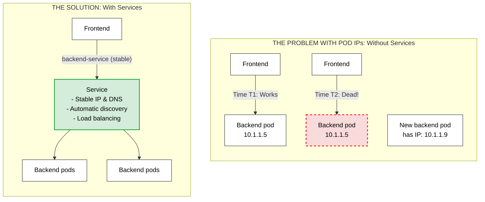
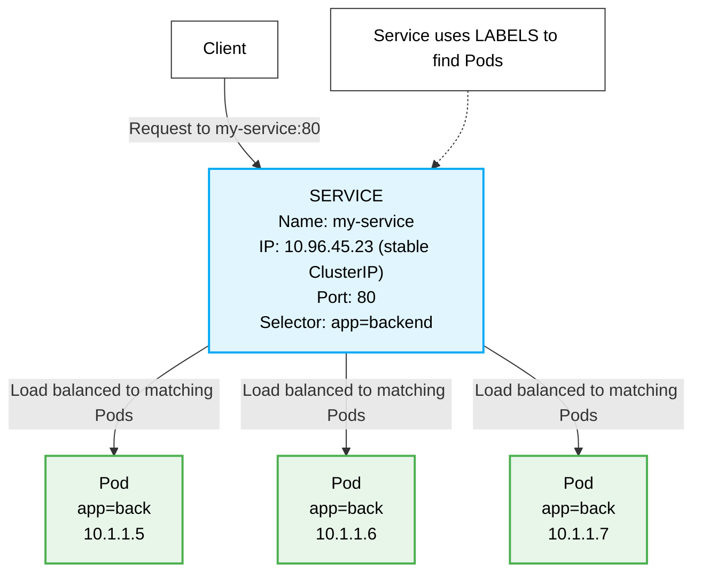
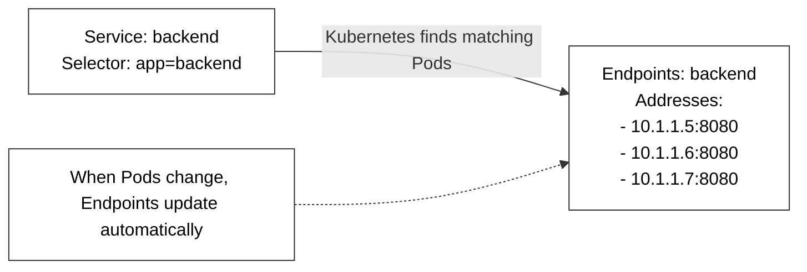
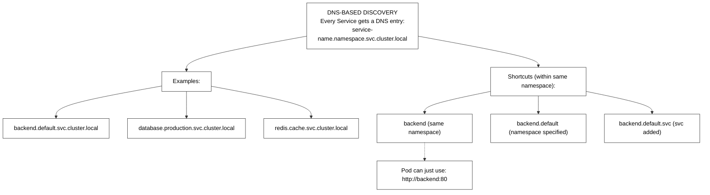
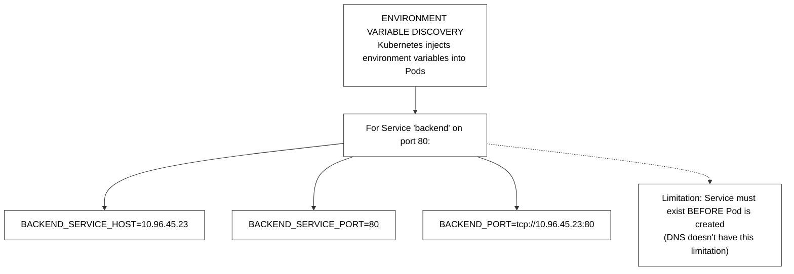
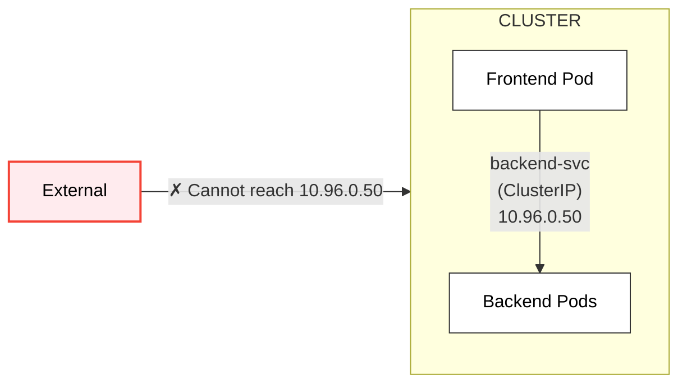
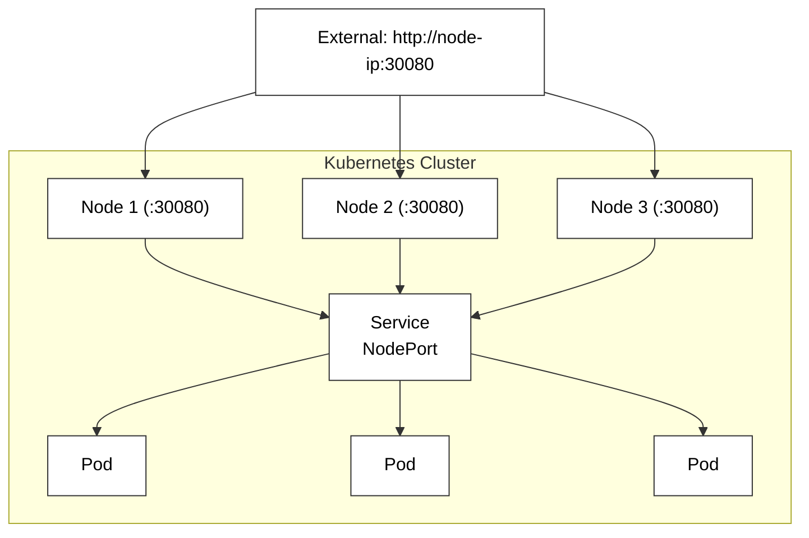
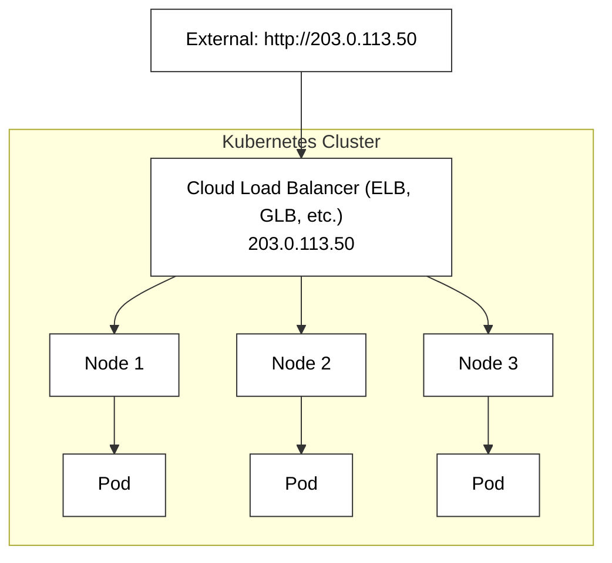
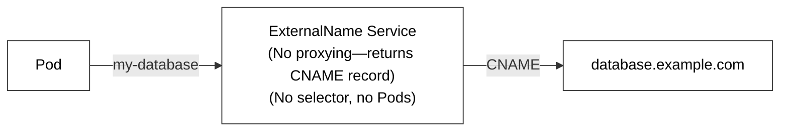

> **Complexity**: `[MEDIUM]` - Core networking concept
>
> **Time to Complete**: 35-40 minutes
>
> **Prerequisites**: Modules 1.5, 1.6

---

## Why This Module Matters

In December 2020, a leading global retail company experienced a catastrophic three-hour outage during their peak Black Friday shopping window, resulting in an estimated $15 million in lost revenue. The root cause was traced back to a fundamentally flawed microservice architecture that relied on hardcoded IP addresses instead of dynamic service discovery. When their backend cluster automatically scaled up to handle the unprecedented traffic surge, the newly provisioned Pods were assigned completely new, ephemeral IP addresses by the Kubernetes control plane.

The frontend components, lacking an abstraction layer, were completely unaware of these new IP addresses. They continued frantically sending traffic to nodes that were severely overloaded or had already been terminated, while dozens of freshly provisioned backend Pods sat completely idle. The system experienced cascading timeouts, database connection exhaustion, and ultimately, a complete user-facing failure during the most critical sales day of the year.

This incident perfectly illustrates the existential necessity of Kubernetes Services. Pods are mortal—they are created, destroyed, evicted, and rescheduled constantly, changing their IP addresses every single time. Services provide the essential abstraction layer: a stable, unchanging IP address and DNS name that reliably load balances traffic to healthy Pods, completely hiding the chaotic lifecycle of the underlying infrastructure from the applications that depend on it. Understanding Services is not just a requirement for the KCNA exam; it is the absolute foundation of reliable distributed systems.

---

## What You'll Be Able to Do

After completing this module, you will be able to:

1. **Diagnose** connectivity failures between microservices by analyzing Service selector mismatches and Endpoint health.
2. **Compare** and evaluate the architectural trade-offs between ClusterIP, NodePort, and LoadBalancer for external exposure.
3. **Design** a reliable service discovery strategy using native Kubernetes DNS for cross-namespace communication.
4. **Implement** Headless Services to support StatefulSets requiring direct Pod-to-Pod addressability.
5. **Evaluate** environment variable versus DNS-based discovery mechanisms to identify potential race conditions in application startup.

---

## Section 1: The Problem with Pod IPs

To understand why Services exist, we first must understand the fundamental behavior of Kubernetes Pods. Pods are designed to be ephemeral. When a worker node crashes, the Pods running on it are lost. The ReplicaSet controller immediately spins up replacement Pods on healthy nodes, but these new Pods receive entirely different IP addresses from the cluster's software-defined network.



If your frontend application is configured to connect directly to IP `10.1.1.5`, it will experience a hard failure the moment that specific Pod terminates. Clients cannot track changing IPs across thousands of microservices, and without a centralized entry point, there is no native way to distribute load balancing evenly across multiple replicas of the same application. 

Services solve this by acting as a rigid anchor point in a sea of changing infrastructure.

---

## Section 2: The Service Concept and Label Selectors

A **Service** is an abstraction that defines a logical set of Pods and a policy to access them. It acts as an internal load balancer, listening on a static IP address and port, and forwarding incoming network traffic to the appropriate backend containers.



The critical link between a Service and its backing Pods is the **Label Selector**. A Service does not maintain a static list of Pod IPs. Instead, it continuously queries the Kubernetes API for any Pods that match its defined labels. If a Pod has the label `app=backend`, and the Service selector is looking for `app=backend`, the Service automatically includes that Pod in its rotation. 

> **Pause and predict**: If Pod IPs change every time a Pod restarts, how would a frontend application reliably communicate with a backend that has 3 replicas? What mechanism would you need to abstract away the changing IPs?

You would need a networking construct that provides a single, unchanging IP address, coupled with a dynamic rule engine that automatically detects the changing IP addresses of the backend replicas. This is exactly what a Kubernetes Service provides.

---

## Section 3: Deep Dive into Endpoints

When a Service uses a label selector to find Pods, it stores the resulting IP addresses in a separate Kubernetes resource called an **Endpoints** object. 



The Endpoints object shares the exact same name as the Service. The Kubernetes control plane continuously monitors the cluster state. When a new Pod matching the Service selector transitions to the `Ready` state, its IP address is dynamically added to the Endpoints list. When a Pod fails its readiness probe or is terminated, its IP is instantly stripped from the Endpoints list, ensuring the Service never routes traffic to a dead container.

For highly scaled environments, Kubernetes utilizes **EndpointSlices**, which break down massive lists of IPs into smaller, more manageable chunks, drastically improving network update performance across the cluster.

---

## Section 4: Service Discovery (DNS vs Env Vars)

For microservices to communicate, they must be able to discover the stable IP addresses of the Services they depend on. Kubernetes provides two primary mechanisms for service discovery.

### DNS-Based Discovery (Recommended)

When you create a Service, the cluster's internal DNS server (usually CoreDNS) automatically generates a DNS A record for it. This is the industry-standard method for service discovery.



### Environment Variable Discovery (Legacy)

When a Pod is scheduled onto a node, the `kubelet` injects a set of environment variables corresponding to every Service currently active in the cluster.



The major flaw with environment variables is the strict ordering requirement. If your frontend Pod starts up, and a few seconds later the administrator creates the backend Service, the frontend Pod will not possess the environment variables for the backend. DNS entirely bypasses this race condition, which is why it is universally preferred.

---

## Section 5: Types of Services

Kubernetes offers four distinct Service types, each expanding on the capabilities of the previous tier to accommodate different network topologies.

### 1. ClusterIP (Default)

The standard, default Service type. It provisions a purely virtual IP address that is only routable from inside the cluster. 



```yaml
apiVersion: v1
kind: Service
metadata:
  name: internal-api
spec:
  type: ClusterIP  # Default if omitted
  selector:
    app: api
  ports:
    - port: 80
      targetPort: 8080
```
**Use Case:** Internal databases, caching layers, and backend microservices that should never be directly accessible from the public internet.

### 2. NodePort

NodePort exposes the Service on the exact same port across every single worker node in the cluster. It builds upon ClusterIP (meaning it gets a ClusterIP automatically), and adds a port ranging from 30000 to 32767.



```yaml
apiVersion: v1
kind: Service
metadata:
  name: test-frontend
spec:
  type: NodePort
  selector:
    app: frontend
  ports:
    - port: 80
      targetPort: 80
      nodePort: 30080
```
**Use Case:** Local development, temporary testing, or exposing services in bare-metal on-premises environments where a cloud load balancer is unavailable.

### 3. LoadBalancer

The industry standard for production public exposure. When defined, Kubernetes communicates directly with the underlying cloud provider (AWS, GCP, Azure) to asynchronously provision a native cloud load balancer, assigning a dedicated public IP address that routes traffic directly into the cluster.



```yaml
apiVersion: v1
kind: Service
metadata:
  name: production-web
spec:
  type: LoadBalancer
  selector:
    app: web
  ports:
    - port: 443
      targetPort: 8443
```
**Use Case:** Production external access. 

> **Stop and think**: A LoadBalancer Service creates an external cloud load balancer, which costs money. If you have 10 microservices that all need external access, would you create 10 LoadBalancer Services? What alternative approach might reduce cost while still routing external HTTP traffic to the right service?

Creating 10 LoadBalancer Services would provision 10 separate cloud appliances, resulting in exorbitant monthly billing. The superior architectural pattern is to provision a single LoadBalancer Service pointing to an Ingress Controller, which acts as a layer 7 router, directing traffic to the 10 microservices based on HTTP hostnames and URL paths using only one public IP.

### 4. ExternalName

Unlike the previous types, ExternalName does not proxy traffic or use label selectors. It functions purely at the DNS level, returning a CNAME record that redirects internal cluster requests to an external resource.



```yaml
apiVersion: v1
kind: Service
metadata:
  name: cloud-db
spec:
  type: ExternalName
  externalName: cluster.aws-rds.example.com
```
**Use Case:** Providing a seamless migration path for applications transitioning into the cluster while their dependencies (like managed relational databases) remain hosted externally. 

---

## Service Type Comparison

| Type | Internal | External | Use Case |
|------|----------|----------|----------|
| **ClusterIP** | ✓ | ✗ | Internal communication |
| **NodePort** | ✓ | ✓ (via node IP) | Development/testing |
| **LoadBalancer** | ✓ | ✓ (via LB IP) | Production external |
| **ExternalName** | ✓ | N/A | External DNS mapping |

---

## Common Mistakes

| Mistake | Why It Hurts | Correct Understanding |
|---------|--------------|----------------------|
| Using Pod IPs directly | IPs change when Pods restart, instantly breaking hardcoded connections. | Use Services for stable access and dynamic endpoint tracking. |
| LoadBalancer everywhere | Expensive and wasteful, as each Service provisions a dedicated cloud appliance. | Use Ingress for HTTP routing to share a single public IP. |
| Wrong selector labels | Service finds no Pods, leaving the Endpoints list completely empty. | Labels must match exactly, including casing and spelling. |
| Expecting external IP for ClusterIP | Won't work; ClusterIP is strictly isolated to the internal cluster network. | Use NodePort or LoadBalancer for external access. |
| Specifying nodePort in production | Limits port range (30000+) and can cause severe port allocation conflicts. | Let Kubernetes auto-assign ports, or use LoadBalancers. |
| Forgetting namespace in DNS | Cross-namespace DNS resolution fails if the FQDN is not specified. | Always use `<service>.<namespace>.svc.cluster.local`. |
| Defining Service after Pods | Legacy environment variables will not inject properly into the Pods. | Create Services before deployments, or exclusively use DNS. |

---

## Did You Know?

- **ClusterIP is virtual:** The ClusterIP doesn't actually exist on any network interface. It's handled entirely by `kube-proxy` rules. In Kubernetes v1.11 (July 2018), IPVS mode graduated to general availability, allowing kube-proxy to efficiently handle over 10,000 services without the latency degradation seen in legacy iptables.
- **LoadBalancer includes NodePort:** When you create a LoadBalancer Service, you also get a ClusterIP and NodePort automatically allocated under the hood. As of Kubernetes v1.24 (May 2022), administrators can set `allocateLoadBalancerNodePorts: false` to disable automatic NodePort allocation, saving thousands of ports.
- **Headless Services:** Setting `clusterIP: None` creates a headless Service that bypasses proxying entirely and returns the actual Pod IPs directly via DNS. A headless Service can return up to 100 A records per DNS query by default in CoreDNS version 1.8+.
- **Services are namespace-scoped:** A Service in namespace `dev` can only use its selector to find Pods residing in the `dev` namespace. However, the default Service CIDR subnet is `10.96.0.0/12`, providing 1,048,576 available virtual IP addresses across the entire cluster.

---

## Hands-On Exercise: The E-Commerce Routing Crisis

You are an SRE on call. A junior developer just deployed a new version of the internal checkout API, but the frontend dashboard is throwing `502 Bad Gateway` timeouts. Your job is to diagnose the routing failure, restore internal connectivity, and ensure the components are properly linked.

### Task 1: Recreate the Incident Environment
Apply the following manifest to your cluster. It contains a frontend deployment, a backend deployment, and a backend service. Do not fix the manifest before applying it!

```yaml
apiVersion: apps/v1
kind: Deployment
metadata:
  name: checkout-backend
spec:
  replicas: 2
  selector:
    matchLabels:
      app: checkout
      tier: backend
  template:
    metadata:
      labels:
        app: checkout
        tier: backend
    spec:
      containers:
      - name: api
        image: nginx:alpine
        ports:
        - containerPort: 80
---
apiVersion: v1
kind: Service
metadata:
  name: checkout-service
spec:
  selector:
    app: checkout
    tier: api-backend # Pay attention to this line
  ports:
  - port: 80
    targetPort: 80
```

**Success Checklist:**
- [ ] Save the YAML to `incident.yaml` and run `kubectl apply -f incident.yaml`.
- [ ] Run `kubectl get pods` and verify the backend Pods are in the `Running` state.
- [ ] Run `kubectl get endpoints checkout-service`. Notice that it shows `<none>` under addresses.
- [ ] Identify the mismatch between the Pod labels and the Service selector.
- [ ] Edit the Service to correct the issue and verify the endpoints populate.

<details>
<summary>Solution & Explanation</summary>

**The Diagnosis:**
The issue stems from a strict label selector mismatch. The Deployment assigns the labels `app: checkout` and `tier: backend` to the Pods. However, the Service is configured to look for Pods with `tier: api-backend`. Because the labels do not match exactly, the Service cannot find any valid Pods, resulting in an empty Endpoints list. When clients attempt to connect to the Service IP, the request is dropped, causing a timeout or gateway error.

**The Fix:**
You can resolve this dynamically by editing the live Service resource:
```bash
kubectl edit service checkout-service
```
Locate the `selector` block and change `tier: api-backend` to `tier: backend`. Save and exit the editor.

**The Verification:**
Immediately check the Endpoints again:
```bash
kubectl get endpoints checkout-service
```
You will now see the IP addresses of your two backend Pods listed, confirming that the Service has successfully discovered the healthy containers and resumed routing traffic.
</details>

---

## Quiz

1. **Your frontend Deployment connects to a backend using the backend Pod's IP address directly. After a routine update, the backend Pods are recreated with new IPs and the frontend can no longer reach them. What went wrong, and how should the frontend discover the backend?**
   <details>
   <summary>Answer</summary>
   Pod IPs are ephemeral -- they change every time a Pod is recreated. The frontend should connect through a Service, which provides a stable ClusterIP and DNS name (e.g., `backend.default.svc.cluster.local`). The Service uses label selectors to automatically track the current Pod IPs via Endpoints, so even when Pods are replaced, the Service routes traffic correctly.
   </details>

2. **A developer creates a Service with selector `app: web`, but no Pods are receiving traffic. When they run `kubectl get endpoints`, the list is empty. What is the most likely cause?**
   <details>
   <summary>Answer</summary>
   The Pods do not have a matching label. The Service selector `app: web` must exactly match a label on the Pods. Common causes include a typo in the label key or value (e.g., `app: Web` vs `app: web`), the Pods being in a different namespace, or the Pods not having the label at all. Check the Pod labels with `kubectl get pods --show-labels` and compare against the Service selector.
   </details>

3. **Your team runs a Kubernetes cluster on-premises with no cloud provider. A colleague wants to expose an application externally using a LoadBalancer Service. What will happen, and what alternative would you suggest?**
   <details>
   <summary>Answer</summary>
   Without a cloud provider, a LoadBalancer Service will stay in "Pending" state indefinitely because there is no cloud controller to provision an external load balancer. Alternatives include using a NodePort Service (accessible via any node's IP on a port in the 30000-32767 range), installing a bare-metal load balancer like MetalLB, or using an Ingress controller with NodePort to handle HTTP routing.
   </details>

4. **A microservices application has a frontend in the `web` namespace and a database in the `data` namespace. The frontend tries to connect to `postgres:5432` but gets a DNS resolution error. What is wrong, and how should the frontend reference the database Service?**
   <details>
   <summary>Answer</summary>
   Short DNS names like `postgres` only resolve within the same namespace. Since the frontend is in the `web` namespace and the database Service is in the `data` namespace, the frontend must use the fully qualified name: `postgres.data.svc.cluster.local` (or at minimum `postgres.data`). Services are namespace-scoped, and DNS resolution requires specifying the target namespace when communicating across namespace boundaries.
   </details>

5. **Your StatefulSet runs a 3-node database cluster where each replica has a different role (primary, replica-1, replica-2). A regular ClusterIP Service would load-balance across all three, but clients need to connect to specific instances. What type of Service would solve this problem?**
   <details>
   <summary>Answer</summary>
   A headless Service (with `clusterIP: None`) solves this. Instead of providing a single virtual IP with load balancing, a headless Service returns the individual Pod IPs via DNS. Combined with a StatefulSet, each Pod gets a predictable DNS name (e.g., `db-0.db-svc.default.svc.cluster.local`), allowing clients to connect directly to the primary or a specific replica by name.
   </details>

6. **You deploy a new microservice using a `NodePort` Service configured with port `8080` in the YAML definition. The API server immediately rejects the creation with a validation error. What is the most likely cause, and how do you resolve it?**
   <details>
   <summary>Answer</summary>
   The default NodePort range in a Kubernetes cluster is strictly limited to ports 30000-32767 for security and isolation purposes. If you explicitly specify a `nodePort` value of 8080, the API server rejects it because it falls completely outside of this permitted range. To resolve the error, you must either omit the field to let Kubernetes randomly assign a valid port, or explicitly declare a port between 30000 and 32767.
   </details>

7. **Why might an enterprise architecture team choose to use an `ExternalName` Service to access a managed database instead of simply hardcoding the database's DNS string directly into their application environment variables?**
   <details>
   <summary>Answer</summary>
   An `ExternalName` Service completely decouples the application code from the specific external environment it is executing against. By referencing a static internal Kubernetes DNS name (like `db.default.svc.cluster.local`), the application configuration remains totally identical across Dev, Staging, and Production. When promoting the application, administrators simply update the underlying `ExternalName` Service to point to the correct regional database CNAME, completely eliminating the need for application restarts or ConfigMap alterations.
   </details>

8. **During a severe incident response, you observe that your Service's `Endpoints` object successfully lists the correct Pod IPs under `NotReadyAddresses`, but all client traffic is dropping. You verify the Pods are running. Why is the Service actively refusing to route traffic to these existing containers?**
   <details>
   <summary>Answer</summary>
   Services dynamically restrict traffic routing strictly to Pods that are successfully passing their configured Readiness Probes. Even if a Pod is fully initialized in a `Running` state, Kubernetes will immediately shift its IP to the `NotReadyAddresses` list if the Readiness Probe fails due to CPU exhaustion or application deadlocks. To restore traffic flow, you must investigate the underlying application bottleneck causing the probe failure; once the probe passes, the Service automatically resumes network routing.
   </details>

---

## Summary

**Services provide**:
- Stable IP and DNS name
- Load balancing across Pods
- Service discovery

**Service types**:

| Type | Access | Use Case |
|------|--------|----------|
| **ClusterIP** | Internal only | Backend services |
| **NodePort** | Via node IP:port | Testing |
| **LoadBalancer** | Via cloud LB | Production external |
| **ExternalName** | DNS alias | External services |

**Discovery methods**:
- DNS: `service.namespace.svc.cluster.local` (preferred)
- Environment variables (legacy)

---

## Next Module

[Module 1.8: Namespaces and Labels](../module-1.8-namespaces-labels/) - Dive deeper into how Kubernetes organizes resources and creates logical boundaries across your cluster, setting the stage for advanced security constraints and resource quotas.