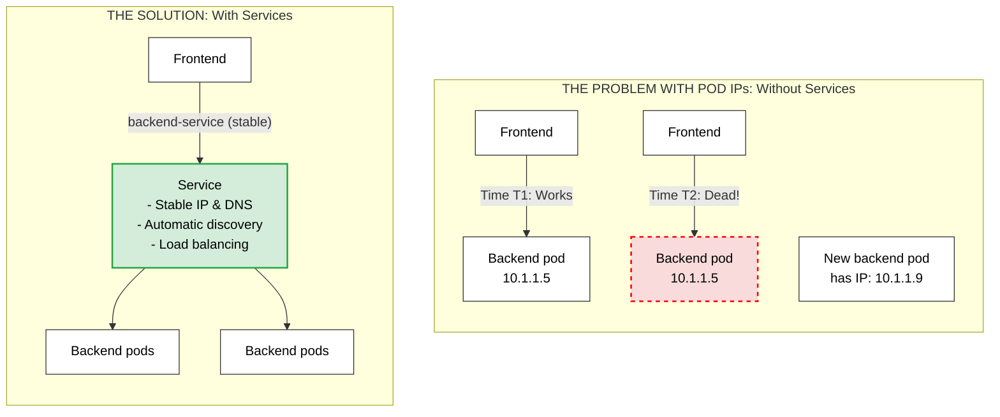
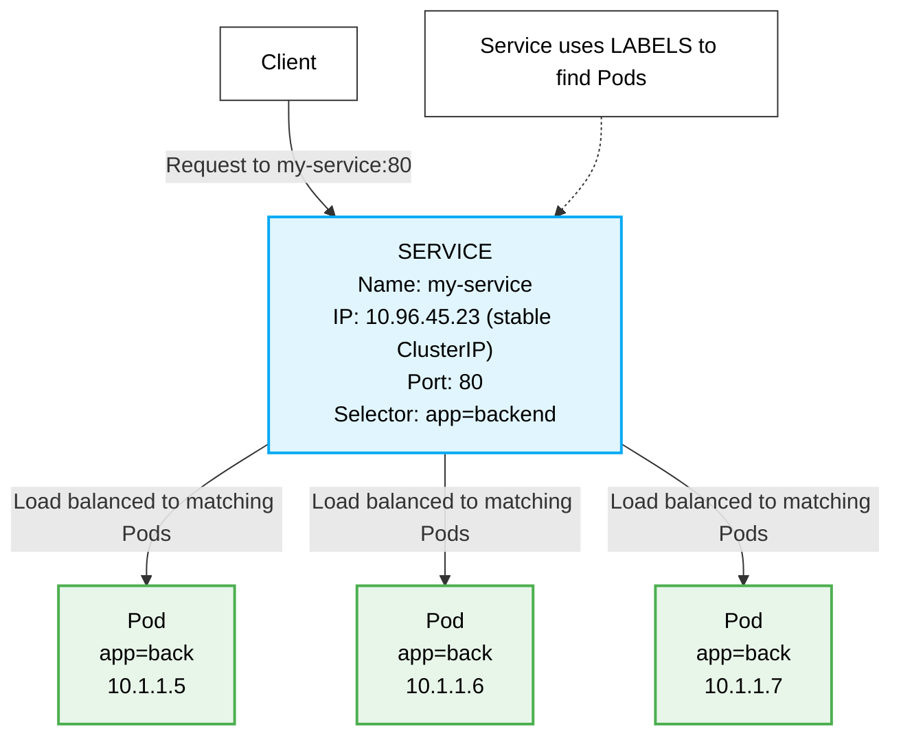
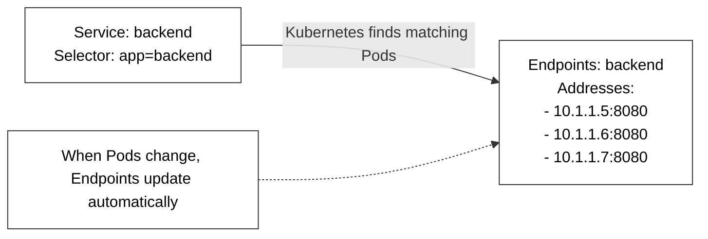
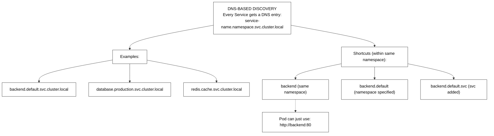
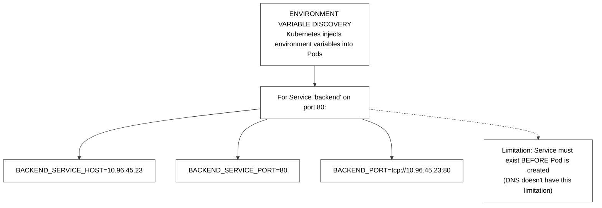
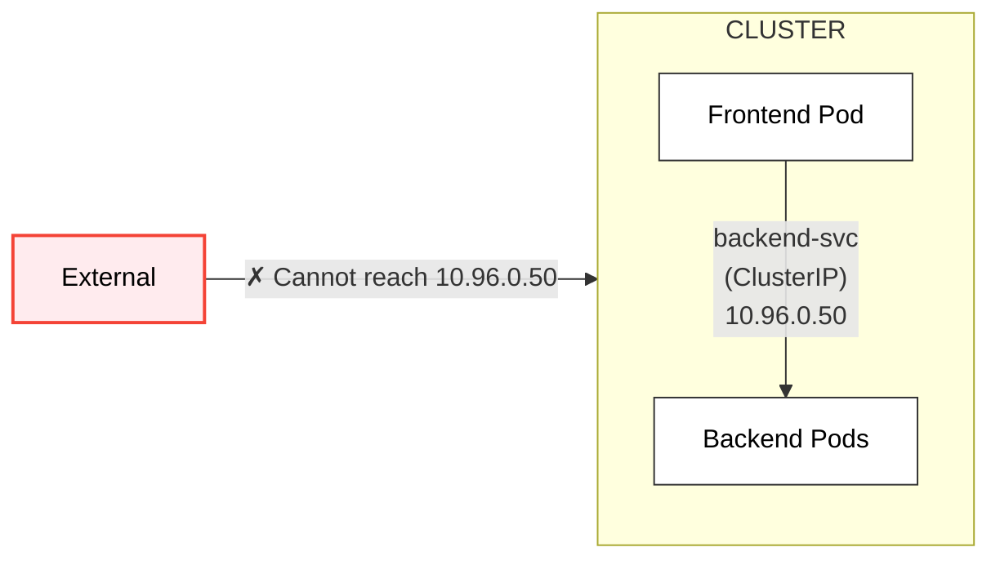
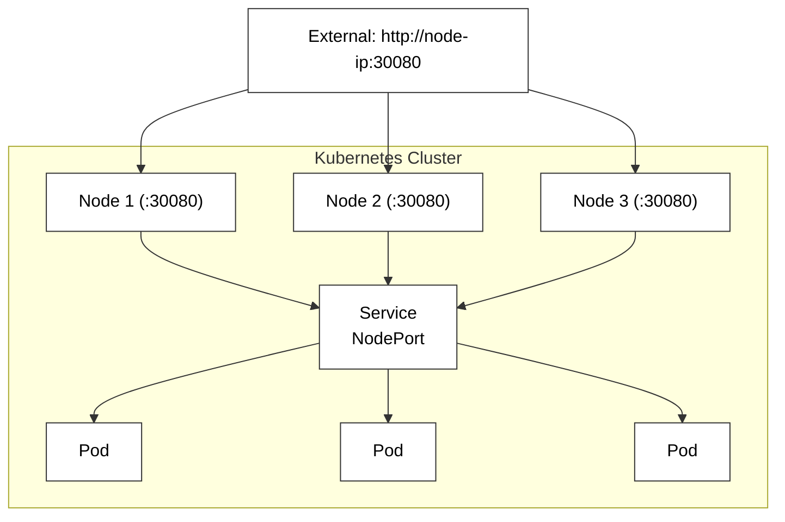
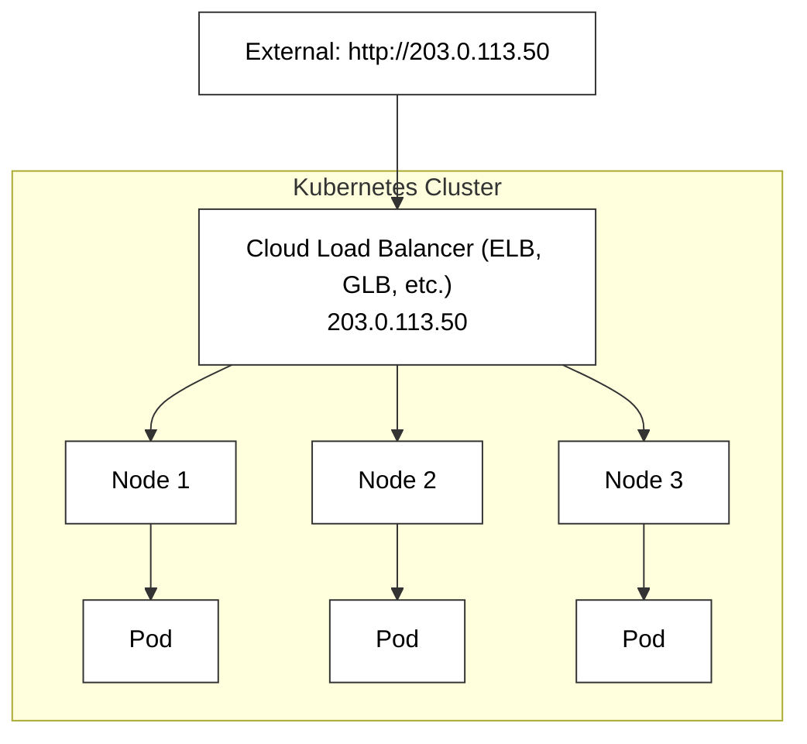
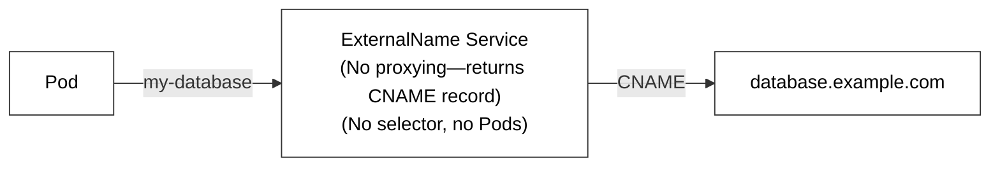
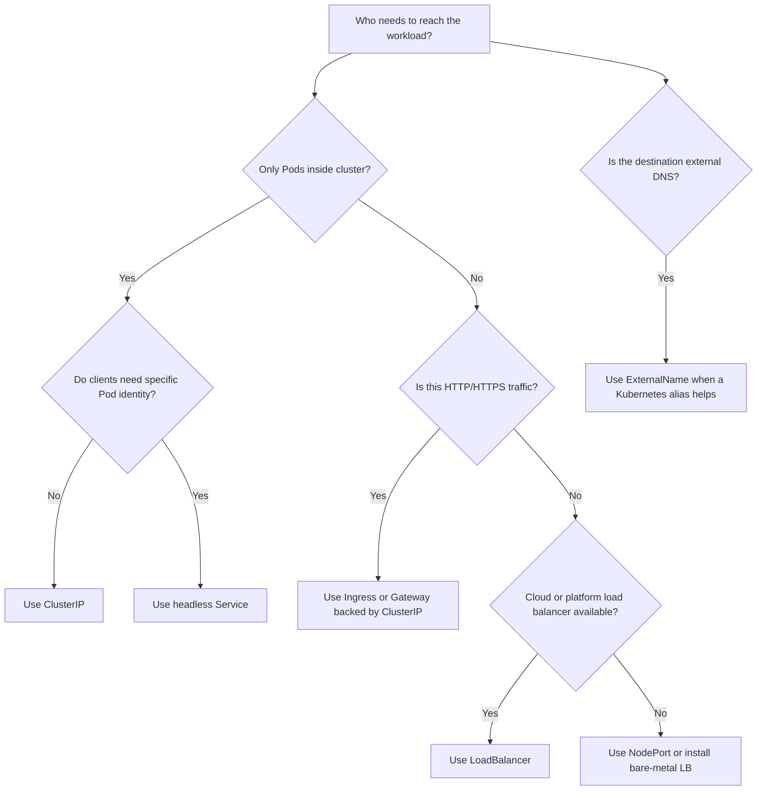

# Module 1.7: Services

> **Complexity**: `[MEDIUM]` - Core networking concept
>
> **Time to Complete**: 65-75 minutes
>
> **Prerequisites**: Modules 1.5, 1.6

## Learning Outcomes

After completing this module, you will be able to:

1. **Diagnose** Service selector, EndpointSlice, and readiness failures that break connectivity between Kubernetes workloads.
2. **Compare** ClusterIP, NodePort, LoadBalancer, ExternalName, and headless Services for internal and external exposure decisions.
3. **Design** a DNS-based service discovery strategy that works across namespaces without fragile startup ordering.
4. **Implement** headless Services for StatefulSets that need stable direct Pod addresses instead of load-balanced virtual IPs.
5. **Evaluate** environment variable discovery versus DNS discovery and identify race conditions before they reach production.

## Why This Module Matters

In December 2020, a large retail platform suffered a three-hour checkout outage during its highest-traffic seasonal sales window, and the internal post-incident estimate put lost revenue above fifteen million dollars. The failure did not begin with a broken database, a failed deployment tool, or a missing capacity reservation. It began when frontend components kept sending traffic to hardcoded backend Pod IP addresses after an autoscaling event replaced those Pods with new replicas on different nodes.

The replacement backend Pods were healthy, but they were invisible to clients that had been configured with old addresses. Traffic concentrated on a few dying targets while fresh capacity sat idle, timeouts propagated through the checkout path, retry storms exhausted connection pools, and support teams saw symptoms that looked like a general platform failure. The deeper problem was that the application had treated Pod identity as stable when Kubernetes deliberately treats Pods as replaceable infrastructure.

Kubernetes Services exist to remove that category of failure. A Service gives clients a stable virtual address and DNS name, then continuously tracks the current set of ready Pods behind that name through labels and EndpointSlices. In Kubernetes 1.35 and later, the same Service abstraction still underpins internal microservice traffic, cloud load balancer provisioning, legacy NodePort exposure, ExternalName DNS aliases, and the headless discovery pattern used by StatefulSets. The KCNA exam expects you to recognize these types, but production work expects more: you need to diagnose why a Service has no backends, choose the least risky exposure pattern, and explain what happens when readiness changes under live traffic.

Before we start running commands, set the usual short alias so every command in this module uses `k` for kubectl. The alias is only a shell convenience, but using it consistently makes the examples easier to scan and matches the operational style used across the rest of KubeDojo.

```bash
alias k=kubectl
k version --client
```

## Core Concept: Services Stabilize Ephemeral Pods

Pods are intentionally temporary. A Deployment may create them, delete them, roll them during an update, replace them after a node failure, or scale them up and down as demand changes. Each new Pod receives its own IP address from the cluster network, and that address is not a durable contract with clients. If a frontend stores a backend Pod IP in a configuration file, it is depending on an implementation detail that Kubernetes reserves the right to change whenever the scheduler, kubelet, or controller manager needs to converge the desired state.

A Service gives the application a different contract. Instead of asking clients to remember every backend Pod IP, Kubernetes allocates a stable virtual IP called a ClusterIP and creates a stable DNS name such as `checkout-service.default.svc.cluster.local`. Clients connect to that Service name, and the cluster data plane forwards traffic to one of the ready backend Pods that match the Service selector. The client does not need to know whether there are two replicas, five replicas, or a rolling update in progress.



The important teaching point in this diagram is not that Services make Pods immortal. They do not. Services let clients ignore Pod mortality by moving the stable identity from the Pod layer to the Service layer. That separation is similar to calling a company switchboard instead of memorizing every employee's desk phone; employees can move desks, join teams, or leave the company, while callers still use one stable number and the routing system handles the current destination.

When you diagnose Service traffic, always keep the two halves of the abstraction separate. The Service object defines the stable frontend contract: name, port, type, and selector. The backend list is derived from live Pod labels and readiness state. A Service can exist with a valid ClusterIP and DNS record while still routing nowhere because no ready Pods currently match its selector. That is why `k get svc` alone is rarely enough evidence during an incident.

Pause and predict: if a Deployment has three replicas and a Service selector that matches only two of their Pods because one Pod has a different label, what should happen to client traffic? The right prediction is that the Service routes only to the two matching ready Pods, because selectors are exact filters and Kubernetes will not guess that the third Pod probably belongs with the same application.

The control plane pieces are also worth naming because they show up in real debugging. The API server stores the Service object. Controllers observe Services and Pods, then maintain EndpointSlice objects that list matching ready network endpoints. kube-proxy or an implementation-specific replacement such as an eBPF data plane programs node-level forwarding rules. CoreDNS publishes the Service name so clients can resolve it. A failure in any layer can look like "the Service is down," but the fix depends on which layer stopped matching the intended state.

For KCNA, you do not need to memorize every internal packet path, but you do need to reason from symptoms to layers. If DNS resolution fails, you investigate the Service name, namespace, and CoreDNS. If DNS resolves but connections time out, you inspect Service ports, selectors, EndpointSlices, readiness, and NetworkPolicy. If a cloud LoadBalancer has no external address, you look at the cloud controller and provider integration rather than the application Pods first.

## Selectors and EndpointSlices: The Routing Contract

A Service usually finds backends through a label selector. Labels are simple key-value metadata attached to Kubernetes objects, and selectors are queries over those labels. The Service does not contain a permanent list of Pod names or IP addresses. Instead, Kubernetes continuously evaluates which Pods in the same namespace match the selector, which of those Pods are ready, and which addresses should be advertised as endpoints for the Service.



The preserved diagram above intentionally makes the selector relationship visible, and it also gives you a useful failure pattern to look for: the selector value and the Pod label value must match exactly. In real manifests this mismatch is often subtler than `backend` versus `back`. Teams accidentally use `component: api` in the Deployment template and `tier: api` in the Service, or they change labels during a chart refactor without updating the Service selector. Kubernetes treats those labels as different contracts, not as synonyms.

When a selector match succeeds, Kubernetes stores the concrete backend addresses in EndpointSlice resources. Older tools and documentation often mention Endpoints, and the classic Endpoints object still appears in many clusters, but EndpointSlices are the scalable API that splits backend addresses into smaller chunks. The split matters because a large Service can have hundreds or thousands of backends, and pushing one huge object update around the control plane would be slower and noisier than updating slices.



Readiness is the next part of the contract. A Pod can be Running while still being unready for Service traffic, because the container may be booting, warming a cache, waiting for a migration, or failing an application health check. Kubernetes uses readiness state to decide whether an address should receive traffic. If a Pod fails its readiness probe, the Pod can remain alive for debugging, but the Service should stop sending new client requests to it.

This is why a good incident diagnosis does not stop at `k get pods`. Running means the kubelet started the container process. Ready means Kubernetes believes the process can safely receive Service traffic. If a Service has no ready endpoints, clients may see connection failures even though every Pod row looks alive. The better sequence is `k get svc`, then `k get endpointslice -l kubernetes.io/service-name=<name>`, then `k describe pod` for readiness events and probe messages.

Before running this, what output do you expect if the Service selector is wrong but the backend Pods are healthy? You should expect the Pods to show `Running`, the Service to show a normal ClusterIP, and the endpoint list to be empty. That combination is a selector or readiness problem, not proof that the Service object failed to allocate.

There is one more selector boundary that catches beginners: a Service selects Pods only in its own namespace. A Service in `web` cannot select database Pods in `data`, even if the labels match perfectly. Cross-namespace communication uses DNS names and network policy, not cross-namespace Service selectors. This design keeps namespace boundaries meaningful and prevents a team from accidentally routing traffic into another team's workload just because they reused a common label such as `app: api`.

The safest label strategy is to treat Service selectors as a stable public interface inside the namespace. Labels used for selectors should be boring, durable, and documented in the chart or manifest. Decorative labels for ownership, cost center, Git revision, and release tooling can change frequently, but selector labels should not churn during every deployment because a selector edit can instantly disconnect clients from all backends.

## Discovery: DNS First, Environment Variables With Care

Once a Service exists, applications still need a way to find it. Kubernetes offers two built-in discovery mechanisms: DNS records and environment variables. DNS is the preferred mechanism for modern workloads because it resolves at runtime, works across namespaces when you use the correct name, and does not require Services to exist before dependent Pods are created. Environment variables are older, convenient for simple demos, and still visible in many clusters, but they carry an ordering trap.



DNS gives every normal Service a name in the form `<service>.<namespace>.svc.cluster.local`. Pods in the same namespace can usually use the short Service name, such as `backend`, because the Pod's DNS search path fills in the namespace and cluster suffix. Pods in another namespace should use at least `backend.default`, and production configuration is often clearest when it uses the fully qualified name for cross-namespace dependencies.

The danger with short names is ambiguity. If a frontend in the `web` namespace connects to `postgres`, Kubernetes DNS first looks for a Service named `postgres` in `web`. If the real database Service lives in `data`, the short name fails or resolves to a different local Service if one exists. A fully qualified name is longer, but it turns the namespace boundary into explicit configuration instead of a hidden assumption.



Environment variable discovery works differently. When a Pod starts, the kubelet can inject variables for Services that already exist in the namespace. If the backend Service is created later, existing Pods do not magically receive new environment variables. You would need to restart those Pods, and that restart requirement is exactly the race condition that makes environment variables a weak discovery strategy for independently deployed microservices.

Evaluate environment variable discovery versus DNS discovery by asking when the lookup happens. Environment variables are a snapshot taken at Pod startup. DNS is a query against cluster naming state at request time or connection time, with client-side caching behavior depending on the application runtime. That difference is practical during rollouts: DNS lets you create the Service before or after the client Pod, while environment variables require a strict creation order that many delivery pipelines eventually violate.

There are still narrow cases where Service environment variables are tolerable. A one-off job created after its dependencies, a tiny teaching cluster, or a legacy application that can only read host and port from environment variables may use them without drama. The moment services are independently deployed, scaled, or moved across namespaces, DNS is the better default because it matches the dynamic nature of Kubernetes itself.

War story: a platform team once spent an afternoon chasing what looked like random connection failures in a batch processor. The Service existed, DNS worked from a debug Pod, and the backend Pods were ready. The failing workers had been created minutes before the Service during a failed rollout, so their environment lacked the expected `PAYMENTS_SERVICE_HOST` variable. Restarting the workers fixed the symptom, but the durable fix was moving the application configuration to DNS names.

## Service Types and Exposure Boundaries

Kubernetes has several Service types because "make this reachable" means different things depending on the caller. Some traffic should stay inside the cluster. Some traffic should be reachable from developers or a bare-metal network. Some traffic needs a cloud provider to allocate an external load balancer. Some names should point to external DNS targets rather than local Pods. Choosing the right type is less about memorizing definitions and more about deciding which boundary the traffic must cross.

ClusterIP is the default and the safest starting point. It creates a virtual IP that is routable inside the cluster, plus the normal Service DNS name. Most internal microservice communication should use ClusterIP because it hides Pod churn without exposing the workload outside the cluster. Databases, caches, internal APIs, and message broker frontends usually belong here unless a specific platform design says otherwise.



```yaml
apiVersion: v1
kind: Service
metadata:
  name: internal-api
spec:
  type: ClusterIP  # Default if omitted
  selector:
    app: api
  ports:
    - port: 80
      targetPort: 8080
```

Notice the port translation in this manifest. Clients connect to Service port `80`, while the selected Pods receive traffic on container port `8080`. This lets you present a clean contract to callers while keeping the application container configuration unchanged. The Service port is the consumer-facing port inside the cluster; `targetPort` is the backend container port or named port; `nodePort`, when used, is the external port opened on every node.

NodePort extends ClusterIP by opening a port on each node, normally from the cluster's configured NodePort range. It is useful for local development, demos, simple bare-metal clusters, and as a building block behind some ingress or load balancer setups. It is not usually the best public production interface because it exposes high-numbered node ports, couples clients to node addresses, and spreads exposure across every eligible node.



```yaml
apiVersion: v1
kind: Service
metadata:
  name: test-frontend
spec:
  type: NodePort
  selector:
    app: frontend
  ports:
    - port: 80
      targetPort: 80
      nodePort: 30080
```

LoadBalancer builds on the same Service model but asks the cloud or platform integration to provision an external load balancer. In a managed cloud cluster, that may create an AWS Network Load Balancer, a Google Cloud load balancer, an Azure load balancer, or another provider-specific object. In a bare-metal cluster without an implementation such as MetalLB, the Service may remain pending because Kubernetes itself does not own an external appliance to allocate.



```yaml
apiVersion: v1
kind: Service
metadata:
  name: production-web
spec:
  type: LoadBalancer
  selector:
    app: web
  ports:
    - port: 443
      targetPort: 8443
```

LoadBalancer is appropriate when the Service itself is the external network boundary, especially for protocols that are not HTTP or when the platform team intentionally maps one external load balancer to one workload. For many HTTP services, though, creating a separate LoadBalancer per application is expensive and operationally noisy. A common pattern is to expose an ingress controller or Gateway implementation through one LoadBalancer Service, then route HTTP traffic by hostname or path inside the cluster.

Stop and think: if ten HTTP microservices need public traffic, what cost and operations tradeoff appears when you create ten LoadBalancer Services? You get simple one-Service-per-app ownership, but you may also create ten external appliances, ten public addresses, ten firewall surfaces, and ten places for TLS and access logging policy to drift. A shared ingress or Gateway boundary centralizes those concerns while still routing to internal ClusterIP Services.

ExternalName is different from the other Service types because it does not select Pods and does not create proxying rules. It creates a DNS CNAME-style alias so an internal Kubernetes name can point at an external DNS name. That can be helpful during migrations when applications inside the cluster should call `cloud-db.default.svc.cluster.local` even though the actual database still lives in a managed service outside the cluster.



```yaml
apiVersion: v1
kind: Service
metadata:
  name: cloud-db
spec:
  type: ExternalName
  externalName: cluster.aws-rds.example.com
```

ExternalName is clean when you want a stable Kubernetes-facing name for an external dependency, but it is not a magic network tunnel. Network routes, DNS behavior, TLS certificate names, and external firewall rules still need to work for the real destination. If the application validates that the server certificate belongs to `cluster.aws-rds.example.com`, simply connecting through `cloud-db.default.svc.cluster.local` may require configuration that preserves the expected server name.

Headless Services complete the exposure picture even though they are expressed as a ClusterIP variation rather than a separate `type`. Setting `clusterIP: None` tells Kubernetes not to allocate a virtual load-balanced IP. DNS queries return the individual backend Pod addresses instead. That is exactly what stateful systems often need because clients may need to connect to `db-0`, `db-1`, or `db-2` directly instead of being randomly balanced across replicas.

```yaml
apiVersion: v1
kind: Service
metadata:
  name: database-peers
spec:
  clusterIP: None
  selector:
    app: database
  ports:
    - name: peer
      port: 5432
      targetPort: 5432
```

The headless pattern is especially important with StatefulSets because each Pod has a stable ordinal identity. A regular ClusterIP Service is excellent when all replicas are interchangeable. A headless Service is better when the application protocol has membership, leader election, shard ownership, or replica-specific roles. The tradeoff is that clients or client libraries now see multiple backend addresses and may need to make smarter decisions about which instance to contact.

## Debugging Services in the Real Cluster

The fastest Service debugging path starts with a clear question: is the failure at name resolution, virtual Service configuration, backend selection, readiness, or external provisioning? Jumping straight to logs can waste time because an application may never receive traffic when the selector or port mapping is wrong. Kubernetes gives you enough object state to narrow the fault before you open a single application log.

Start with the Service contract. `k get svc checkout-service -o wide` tells you the Service type, ClusterIP, ports, and any external address. `k describe svc checkout-service` shows selectors, target ports, events, and the backend endpoint summary. If the selector line says `tier=api-backend` while Pods show `tier=backend`, you have found the problem without touching the application containers.

Next, inspect the derived backend list. In modern clusters, `k get endpointslice -l kubernetes.io/service-name=checkout-service` shows whether EndpointSlices exist for that Service. `k describe endpointslice` can reveal addresses, ports, readiness, and topology hints. In many clusters `k get endpoints checkout-service` is still a quick compatibility view, but EndpointSlice output is the better mental model for Kubernetes 1.35.

If endpoints are missing, compare labels and namespace first. `k get pods --show-labels` is blunt but effective, and `k get pods -l app=checkout,tier=backend` checks whether the selector actually returns the expected Pods. If that selector returns nothing while the Deployment exists, either the labels differ from the Service selector or the Pods live in a different namespace. If the selector returns Pods but endpoints remain unready, readiness probes and Pod conditions are the next layer.

Port mapping is the other common fault. A Service can select the right Pods and still fail if `targetPort` points to a port where the container is not listening. Named ports reduce that risk because the Service can target `http` while the Pod template defines which numeric container port currently owns that name. Numeric ports are acceptable, but the human reviewer must verify that Service `targetPort` and container `containerPort` describe the same application listener.

For external exposure, debug the provider boundary separately. A LoadBalancer Service with healthy endpoints but no external address often points to cloud controller permissions, subnet annotations, quota, unsupported Service annotations, or bare-metal clusters without a load balancer implementation. A NodePort Service that works from one network but not another may be blocked by node firewall rules, routing, or security groups rather than by Kubernetes selectors.

The following small incident manifest is intentionally broken. It creates healthy backend Pods and a Service whose selector does not match them. That makes it ideal for practicing the distinction between Pod health and Service discovery. Apply it only in a disposable namespace or local training cluster, then remove it when the exercise is complete.

```yaml
apiVersion: apps/v1
kind: Deployment
metadata:
  name: checkout-backend
spec:
  replicas: 2
  selector:
    matchLabels:
      app: checkout
      tier: backend
  template:
    metadata:
      labels:
        app: checkout
        tier: backend
    spec:
      containers:
      - name: api
        image: nginx:alpine
        ports:
        - containerPort: 80
---
apiVersion: v1
kind: Service
metadata:
  name: checkout-service
spec:
  selector:
    app: checkout
    tier: api-backend # Pay attention to this line
  ports:
  - port: 80
    targetPort: 80
```

The diagnosis should be mechanical. The Deployment template labels Pods with `tier: backend`, while the Service selector asks for `tier: api-backend`. Kubernetes does not infer intent, so the Service has no ready backend addresses. A frontend that connects through the Service DNS name would still resolve the name, but traffic would not reach any checkout backend until the selector is corrected or the Pod labels are changed to match.

```bash
k apply -f incident.yaml
k get pods --show-labels
k get svc checkout-service
k get endpoints checkout-service
k get endpointslice -l kubernetes.io/service-name=checkout-service
```

After you correct the selector, the endpoint objects should populate without recreating the Pods. That behavior is a useful reminder that Services are dynamic queries over current cluster state. The Service object does not need a rollout to notice a label match; controllers update the endpoint data as soon as the API state changes and readiness allows the Pods to receive traffic.

```bash
k edit service checkout-service
k get endpoints checkout-service
k describe service checkout-service
```

Which approach would you choose here and why: change the Service selector to match the existing Pods, or change the Deployment template labels to match the Service? In a running incident, editing the Service selector is often the fastest restoration if the Pod labels are correct for the release. In a chart or GitOps repository, the durable fix must update the source manifests so the next deployment does not reintroduce the mismatch.

## Reading Service State Like an Operator

The most useful operational habit is to treat Service state as a chain of evidence rather than a single object. A Service is not healthy merely because it exists, and a Pod is not a valid backend merely because it is Running. You are looking for a consistent story: the client can resolve the Service name, the Service exposes the expected port, the selector matches the intended Pods, those Pods are ready, and the data plane has programmed a route from the stable frontend address to the selected backend addresses.

This evidence chain gives you a calm debugging order during incidents. If the client says "name not found," start with DNS name construction, namespace, and CoreDNS availability. If the name resolves but connections fail immediately, inspect the Service port and target port. If the Service contract looks correct but no backends appear, compare labels and readiness. If backends are present but traffic still fails, move outward to NetworkPolicy, node routing, kube-proxy or replacement data plane behavior, and the application listener itself.

You should also separate symptoms seen by internal clients from symptoms seen by external clients. Internal clients use the ClusterIP and cluster DNS path even when the Service type is LoadBalancer. External clients depend on additional provider state, public address allocation, firewall rules, source ranges, node reachability, and sometimes health checks performed by the cloud load balancer. A LoadBalancer Service can have healthy internal endpoints while still failing externally because the provider object is misconfigured or still provisioning.

Port names are a small detail that prevent large mistakes. When a Pod exposes a named container port such as `http`, the Service can use `targetPort: http` instead of a number. That lets the Deployment own the actual listener number while the Service keeps a stable semantic reference. During a refactor from port `8080` to another internal port, the Service manifest can remain meaningful if the Pod template keeps the same port name attached to the new listener.

Session affinity is another feature worth recognizing even though it is not the default pattern for most stateless workloads. A normal Service may distribute new connections across ready backends without promising that the same client always returns to the same Pod. If an application requires sticky behavior, Kubernetes has Service-level options such as client IP affinity, but the stronger engineering answer is usually to remove local session state or store it in a shared backend. Sticky routing can hide statefulness that will later complicate rollouts and scaling.

Traffic policy controls add more nuance for external Services. `externalTrafficPolicy: Cluster` allows nodes to forward external traffic to any ready backend in the cluster, which improves spreading but can obscure the original client source IP depending on the implementation. `externalTrafficPolicy: Local` preserves source IP more directly and can reduce extra hops, but only nodes with local ready endpoints should receive traffic. That choice belongs in a platform design review, not in a copied manifest with no explanation.

For internal traffic, topology-aware routing and data plane implementations can influence where requests go, but they do not change the core Service contract. The Service still selects ready endpoints by labels, and clients still target the Service name or IP. Treat topology features as optimization layers after correctness is proven. If your selector is wrong or readiness is failing, no amount of topology tuning will restore a backend set that Kubernetes does not believe should receive traffic.

NetworkPolicy is a frequent source of confusion because it sits beside Services rather than inside them. A Service can select the right Pods and publish healthy endpoints while NetworkPolicy denies the connection from the client namespace or Pod labels. That is not a Service selector failure; it is an authorization or segmentation decision at the network layer. The practical test is to verify endpoints first, then check whether policy allows traffic from the calling workload to the backend Pods on the target port.

CoreDNS issues require a different mental model. If `checkout-service.svc-lab.svc.cluster.local` does not resolve from a debug Pod, the Service may be missing, the namespace may be wrong, or cluster DNS may be unavailable. If the name resolves to a ClusterIP but connections fail, DNS has already done its job and you should move to Service ports, endpoints, readiness, policy, and backend listeners. Keeping those phases distinct prevents circular debugging conversations where every network symptom is blamed on DNS.

In production reviews, ask whether the Service type expresses the least privilege network boundary. A database with a LoadBalancer Service is usually a warning sign unless there is a very specific controlled consumer outside the cluster. An internal API with NodePort may expose more node surface than the team intended. A headless Service for a stateless web application may push unnecessary endpoint selection complexity into clients. The right Service is the one whose exposure model matches the callers, not the one that happened to make a test curl command succeed.

The final operator skill is explaining Service failures in plain language. Instead of saying "kube-proxy is broken" before you have evidence, say "the Service name exists, but Kubernetes has no ready backend endpoints because the selector does not match the Pod labels." That sentence identifies the layer, the evidence, and the next fix. Clear diagnosis helps responders avoid risky restarts, broad redeployments, and random manifest edits while customer traffic is already impaired.

## Patterns & Anti-Patterns

Services reward boring, explicit design. The best production patterns are not clever; they make ownership, namespace boundaries, selector contracts, and exposure boundaries visible enough that another engineer can diagnose the system at 03:00. The anti-patterns usually begin when teams treat Services as transparent plumbing and forget that each Service encodes a contract with real reliability and security consequences.

Use stable selector labels as an interface between the Deployment and the Service. Labels such as `app.kubernetes.io/name`, `app.kubernetes.io/component`, or a locally standardized `app` and `tier` can work as long as they are consistent and durable. Avoid using rollout-specific labels, image tags, Git SHAs, or team metadata in selectors because those values change for reasons unrelated to network identity.

Use ClusterIP for internal dependencies by default. This is not only a security preference; it also keeps public exposure decisions centralized. If every team can promote an internal API to LoadBalancer without review, the platform loses control over public addresses, firewall posture, TLS policy, and cost. A ClusterIP Service behind an ingress or Gateway boundary preserves the stable backend contract while keeping external routing policy in one layer.

Use headless Services only when clients need backend identity. They are powerful for StatefulSets, peer discovery, and systems that have their own replication protocol, but they move balancing and endpoint choice closer to the application. If all replicas are interchangeable, a regular ClusterIP Service is simpler and usually safer because clients receive one stable name and Kubernetes handles backend selection.

| Pattern | When to Use | Why It Works | Scaling Consideration |
|---|---|---|---|
| Stable selector contract | Any Deployment-backed Service | Keeps routing independent from rollout metadata | Standardize labels before many teams copy manifests |
| ClusterIP-first design | Internal APIs, caches, and databases | Prevents accidental public exposure | Pair with ingress or Gateway for shared HTTP entry |
| Headless plus StatefulSet | Databases, brokers, quorum systems | Preserves direct Pod identity in DNS | Client libraries must handle multiple addresses |
| Named target ports | Apps whose listener ports may change | Keeps Service manifests readable and less brittle | Maintain matching names in Pod specs during refactors |

The first anti-pattern is hardcoding Pod IPs. It feels convenient during a quick test because `k get pod -o wide` shows an address and a curl command appears to work. The problem is that you have bypassed the controller model. The first rollout, node drain, eviction, or failed readiness transition can invalidate the address. Use a Service even for simple internal traffic so the application depends on Kubernetes' stable abstraction instead of one transient Pod.

The second anti-pattern is using LoadBalancer everywhere because it "just works" in a managed cloud. It may work technically, but it spreads cost, public attack surface, TLS policy, logging, and firewall rules across many separate provider objects. For HTTP traffic, prefer a shared ingress or Gateway boundary that routes to internal Services. Reserve one-Service-one-LoadBalancer designs for cases where protocol, ownership, or isolation truly requires them.

The third anti-pattern is changing Service selectors during normal rollouts. Some teams try to use selectors as a deployment switch, pointing a Service from old Pods to new Pods by editing labels or selectors manually. Kubernetes supports label-based routing, but casual selector edits can disconnect all traffic if the new label set is wrong. For application rollout behavior, Deployments, readiness probes, canary tooling, and traffic controllers provide safer mechanics.

| Anti-Pattern | What Goes Wrong | Better Alternative |
|---|---|---|
| Hardcoding Pod IPs | Clients break when Pods restart or move | Connect through Service DNS names |
| LoadBalancer for every HTTP app | Cost and policy sprawl across many external appliances | Use ingress or Gateway in front of ClusterIP Services |
| Selector labels tied to releases | A rollout can remove every backend from the Service | Keep selector labels stable and use Deployment rollout controls |
| Ignoring readiness in diagnosis | Running Pods are mistaken for traffic-ready Pods | Inspect EndpointSlices and readiness probe events |

## Decision Framework

Choosing a Service type is a boundary decision. Ask where the client runs, whether the backend replicas are interchangeable, whether traffic is HTTP or a raw protocol, and who owns the external network policy. The right answer for a local lab is not automatically the right answer for production, and the right answer for a public web application is not automatically the right answer for a database cluster.



The decision tree keeps ExternalName separate because it does not expose local Pods at all. If your dependency is an external managed database, ExternalName can give in-cluster applications a Kubernetes-style name while the database remains outside. If your dependency is a local database StatefulSet, ExternalName is the wrong tool because it will never select those Pods or create endpoint data.

| Requirement | Best Starting Point | Watch Out For |
|---|---|---|
| Internal stateless API | ClusterIP | Selector mismatch, wrong targetPort, readiness failures |
| Public HTTP application | Ingress or Gateway to ClusterIP | Controller availability, TLS ownership, path routing policy |
| Public non-HTTP protocol | LoadBalancer | Cloud quota, provider annotations, source range controls |
| Bare-metal temporary exposure | NodePort | Node firewall rules, high port range, node address coupling |
| Stateful peer discovery | Headless Service | Client responsibility for choosing specific endpoints |
| External DNS dependency | ExternalName | TLS server names, external firewall rules, no proxying |

For KCNA questions, eliminate choices by boundary. ClusterIP means internal only. NodePort means every node listens on a port from the configured range. LoadBalancer means Kubernetes asks an external provider or platform component for an address. ExternalName means DNS alias, not proxying. Headless means no virtual ClusterIP and direct endpoint answers. Once you know the boundary, the rest of the question is usually about selectors, DNS names, or readiness.

## Did You Know?

- **ClusterIP is virtual:** The ClusterIP does not actually exist as a normal network interface on a Pod. kube-proxy or the cluster data plane implements the forwarding behavior, and IPVS mode reached general availability in Kubernetes v1.11 in July 2018 for better large-scale Service handling.
- **LoadBalancer normally includes NodePort:** A LoadBalancer Service usually allocates a ClusterIP and node ports beneath it. Since Kubernetes v1.24, `allocateLoadBalancerNodePorts: false` can disable automatic NodePort allocation for providers that route directly to Pods or otherwise do not need node ports.
- **Headless Services skip the virtual IP:** Setting `clusterIP: None` makes DNS return backend addresses directly instead of routing through one virtual Service address. That is why StatefulSets commonly pair stable Pod names with a headless Service for peer identity.
- **Services are namespace-scoped:** A Service selector finds Pods only inside its own namespace, even when another namespace has matching labels. Cross-namespace communication works by using DNS names such as `<service>.<namespace>.svc.cluster.local`, not by selecting remote Pods.

## Common Mistakes

| Mistake | Why It Happens | How to Fix It |
|---|---|---|
| Using Pod IPs directly | The address is visible in `k get pod -o wide`, so it feels like a valid endpoint during testing. | Put a Service in front of the Pods and configure clients to use the Service DNS name. |
| Creating a Service selector that does not match Pod labels | Chart refactors, copied manifests, or inconsistent label keys leave the Service with no ready endpoints. | Compare `k describe svc` selectors with `k get pods --show-labels`, then fix the source manifest. |
| Treating Running as traffic-ready | Operators assume a started container is ready for client traffic even when readiness probes are failing. | Inspect EndpointSlices and Pod readiness conditions before blaming DNS or kube-proxy. |
| Using LoadBalancer for every HTTP service | Cloud load balancers are easy to request, so teams accidentally multiply cost and public exposure. | Route HTTP through an ingress or Gateway layer that forwards to internal ClusterIP Services. |
| Expecting ClusterIP to work from outside the cluster | The stable virtual IP is only meaningful on the cluster network. | Use ingress, Gateway, LoadBalancer, or NodePort depending on the external boundary. |
| Relying on Service environment variables for dynamic apps | Environment variables are injected only when the Pod starts, so late-created Services are missing. | Prefer DNS discovery and restart any legacy Pods that must consume Service environment variables. |
| Forgetting namespace in DNS names | Short names resolve in the caller's namespace first, which fails for cross-namespace dependencies. | Use `<service>.<namespace>.svc.cluster.local` or at least `<service>.<namespace>` when crossing namespaces. |

## Quiz

<details><summary>Your frontend Deployment connects directly to a backend Pod IP. After a routine rollout, the backend Pods are recreated and the frontend times out. What failed, and what should change?</summary>

The failure is a broken dependency on ephemeral Pod identity. Pod IPs can change whenever Pods are recreated, rescheduled, or replaced, so direct addressing is not a durable application contract. Put a Service in front of the backend and configure the frontend to use the Service DNS name. The Service will track the current ready backend addresses through selectors and EndpointSlices while the frontend keeps one stable target.

</details>

<details><summary>A Service named `checkout-service` has a ClusterIP, but `k get endpoints checkout-service` shows no addresses while two checkout Pods are Running. What do you inspect first?</summary>

Inspect the Service selector and the Pod labels before digging into application logs. A normal ClusterIP only proves the Service object exists; it does not prove any Pods match the selector or are ready. Use `k describe svc checkout-service` and `k get pods --show-labels` to compare the exact key-value pairs. If labels match, move next to readiness probes and EndpointSlice conditions.

</details>

<details><summary>Your platform runs on bare metal with no load balancer integration, and a developer creates a LoadBalancer Service that stays pending. What is the likely reason and the practical alternative?</summary>

Kubernetes requested an external load balancer, but no cloud controller or bare-metal implementation is available to allocate one. The Service object can exist while the external address remains pending because Kubernetes does not create physical or provider load balancers by itself. For a quick lab, NodePort may be enough. For a durable platform, install and operate a bare-metal load balancer solution or route HTTP through an ingress or Gateway design that your network supports.

</details>

<details><summary>A frontend in namespace `web` tries to call `postgres:5432`, but the database Service lives in namespace `data`. DNS resolution fails. What should the connection string use?</summary>

The short name `postgres` is resolved in the caller's namespace first, so the frontend is looking for `postgres.web.svc.cluster.local`. Cross-namespace communication should include the target namespace, such as `postgres.data` or the full `postgres.data.svc.cluster.local`. This design prevents a Service in one namespace from accidentally selecting or shadowing resources in another namespace. It also makes dependency ownership clearer in configuration reviews.

</details>

<details><summary>Your three-Pod database StatefulSet needs clients to connect to a specific replica by stable identity instead of being balanced across all replicas. Which Service pattern fits?</summary>

Use a headless Service with `clusterIP: None` and pair it with the StatefulSet's stable Pod identities. A regular ClusterIP Service intentionally hides individual backends behind one virtual address, which is wrong when clients must choose a specific replica, leader, or peer. The headless Service lets DNS return individual Pod addresses so the database protocol or client library can make replica-aware decisions.

</details>

<details><summary>A legacy worker expects `PAYMENTS_SERVICE_HOST`, but the Payments Service was created after the worker Pods. The variable is missing even though DNS works. What happened?</summary>

Service environment variables are injected when the Pod starts, so they represent a startup snapshot rather than live discovery. Because the Payments Service did not exist at worker creation time, the kubelet had no variable to inject into those already-running Pods. Restarting the workers can restore the expected variables, but the better design is to configure the application to use DNS so discovery does not depend on strict creation order.

</details>

<details><summary>A Service has endpoints listed as not ready, and clients cannot connect even though the Pods are Running. Why is Kubernetes withholding traffic?</summary>

Running only means the containers have started; it does not guarantee they are ready for client requests. Services route to ready endpoints, so a failing readiness probe can keep a Pod out of the traffic set while preserving it for inspection. Check the Pod conditions, readiness probe configuration, and application health endpoint. Once the readiness probe passes, the EndpointSlice should mark the address ready and Service traffic can resume.

</details>

## Hands-On Exercise: The E-Commerce Routing Crisis

You are the SRE on call for an internal checkout platform. A junior developer deployed a backend and created a Service for the frontend to use, but the dashboard shows gateway timeouts. Your task is to reproduce the failure, diagnose whether the problem is DNS, selector matching, readiness, or port mapping, then repair the Service without changing unrelated resources. The exercise uses the manifest from the debugging section so the failure mode stays focused on selector and endpoint behavior.

Create a disposable namespace if your cluster is shared, and keep every command scoped to that namespace. The commands below assume a namespace named `svc-lab`, but any namespace is fine if you substitute it consistently. The important practice is not the namespace name; it is the sequence of checking Service contract, Pod labels, endpoint data, and verification from a client.

### Task 1: Prepare the Lab Namespace

- [ ] Create a namespace named `svc-lab`.
- [ ] Confirm your current context is pointed at a safe training cluster.
- [ ] Save the broken checkout manifest as `incident.yaml`.

<details><summary>Solution</summary>

Run `k create namespace svc-lab`, then save the manifest from the debugging section to `incident.yaml`. If you use a shared cluster, add `-n svc-lab` to every command or set the namespace for your current context. A namespace keeps the labels and Services in this exercise from colliding with other training resources.

</details>

### Task 2: Recreate the Incident

- [ ] Apply `incident.yaml` into the lab namespace.
- [ ] Run `k get pods -n svc-lab --show-labels` and verify the backend Pods are Running.
- [ ] Run `k get svc -n svc-lab checkout-service` and confirm the Service has a ClusterIP.

<details><summary>Solution</summary>

Use `k apply -n svc-lab -f incident.yaml`, then inspect Pods and the Service. You should see healthy Pods because the Deployment is valid, and you should also see a ClusterIP because the Service object is valid. This proves the incident is not simply "Kubernetes failed to create the resources."

</details>

### Task 3: Diagnose the Empty Backend Set

- [ ] Run `k get endpoints -n svc-lab checkout-service`.
- [ ] Run `k get endpointslice -n svc-lab -l kubernetes.io/service-name=checkout-service`.
- [ ] Compare the Service selector with the Pod labels and write down the mismatch.

<details><summary>Solution</summary>

The Service selector asks for `tier: api-backend`, while the Pods have `tier: backend`. Because selectors require exact key-value matches, Kubernetes cannot add those Pod addresses to the Service backend set. EndpointSlice inspection confirms that the Service has no ready endpoints even though the Pods are Running.

</details>

### Task 4: Restore Service Routing

- [ ] Edit the Service selector so it matches the existing backend Pods.
- [ ] Verify the endpoints populate with Pod IP addresses.
- [ ] Use a temporary client Pod or port-forwarding method available in your cluster to confirm the Service responds.

<details><summary>Solution</summary>

Run `k edit service -n svc-lab checkout-service` and change `tier: api-backend` to `tier: backend`. After saving, run `k get endpoints -n svc-lab checkout-service` or inspect EndpointSlices again. The backend addresses should appear without recreating the Deployment, because the Service controller continuously reconciles selector matches.

The original long-form commands for the same repair are shown below for learners who have not kept the alias in their shell:

```bash
kubectl edit service checkout-service
```

```bash
kubectl get endpoints checkout-service
```

</details>

### Task 5: Evaluate the Production Fix

- [ ] Decide whether the durable fix belongs in the Service selector, the Deployment labels, or both source manifests.
- [ ] Explain how DNS discovery protects the frontend from future Pod IP changes.
- [ ] Clean up the namespace or resources when you are finished.

<details><summary>Solution</summary>

The durable fix belongs in source control wherever the selector and labels are defined, not only in a live edit. If the Deployment label `tier: backend` is the intended contract, update the Service manifest to match it and review future chart changes against that contract. DNS discovery protects the frontend because it keeps the frontend pointed at `checkout-service.svc-lab.svc.cluster.local` while Kubernetes updates endpoint data as Pods come and go.

</details>

### Success Criteria

- [ ] You can explain why the Service existed but had no ready backend addresses.
- [ ] You can show the exact selector and label mismatch that caused the outage.
- [ ] You can verify EndpointSlice or Endpoints data before and after the fix.
- [ ] You can justify DNS discovery over Pod IPs and over late-created environment variables.
- [ ] You can choose ClusterIP, NodePort, LoadBalancer, ExternalName, or headless Service for a realistic boundary.

## Sources

- [Kubernetes documentation: Services, Load Balancing, and Networking](https://kubernetes.io/docs/concepts/services-networking/service/)
- [Kubernetes documentation: DNS for Services and Pods](https://kubernetes.io/docs/concepts/services-networking/dns-pod-service/)
- [Kubernetes documentation: EndpointSlices](https://kubernetes.io/docs/concepts/services-networking/endpoint-slices/)
- [Kubernetes documentation: Service API reference](https://kubernetes.io/docs/reference/kubernetes-api/service-resources/service-v1/)
- [Kubernetes documentation: EndpointSlice API reference](https://kubernetes.io/docs/reference/kubernetes-api/service-resources/endpoint-slice-v1/)
- [Kubernetes documentation: Configure Liveness, Readiness and Startup Probes](https://kubernetes.io/docs/tasks/configure-pod-container/configure-liveness-readiness-startup-probes/)
- [Kubernetes documentation: StatefulSets](https://kubernetes.io/docs/concepts/workloads/controllers/statefulset/)
- [Kubernetes documentation: Ingress](https://kubernetes.io/docs/concepts/services-networking/ingress/)
- [Kubernetes documentation: Gateway API](https://kubernetes.io/docs/concepts/services-networking/gateway/)
- [Kubernetes documentation: Labels and Selectors](https://kubernetes.io/docs/concepts/overview/working-with-objects/labels/)
- [Kubernetes documentation: Network Policies](https://kubernetes.io/docs/concepts/services-networking/network-policies/)

## Next Module

[Module 1.8: Namespaces and Labels](../module-1.8-namespaces-labels/) - Dive deeper into how Kubernetes organizes resources and creates logical boundaries across your cluster, setting the stage for advanced security constraints and resource quotas.
