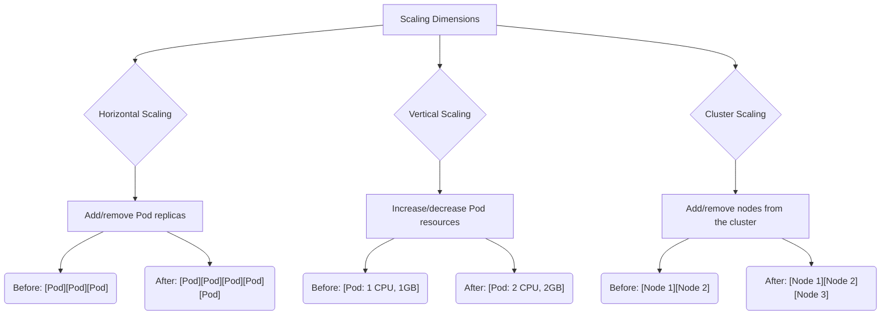
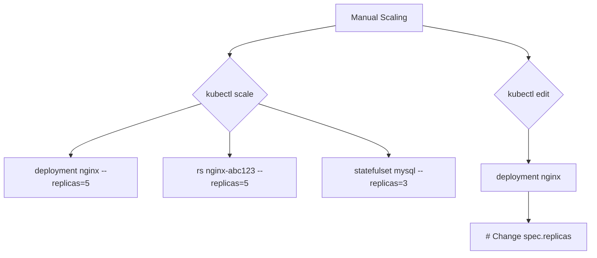
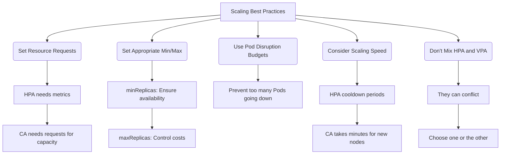
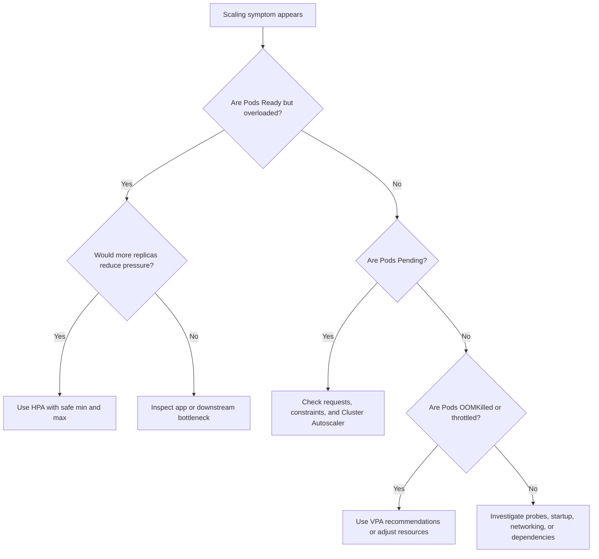

# Module 2.2: Scaling

**Complexity**: `[HIGH]` - advanced orchestration concepts with direct impact on reliability, cost, and application design. **Time to complete**: 45-60 minutes. **Prerequisites**: Module 2.1, Scheduling. This module assumes Kubernetes 1.35 or newer behavior for autoscaling APIs and examples. The full Kubernetes command is `kubectl`; in runnable commands after the setup line, this module uses the shorter exam-friendly alias `k`, defined as `alias k=kubectl`.

```bash
alias k=kubectl
```

## Learning Outcomes

After completing this module, you will be able to:

1. **Diagnose** scaling bottlenecks by separating application pressure, Pod resource pressure, and cluster capacity pressure.
2. **Implement** Horizontal Pod Autoscalers and interpret their replica decisions from CPU, memory, or custom metric signals.
3. **Evaluate** when horizontal, vertical, and cluster scaling solve different production problems, including their cost and latency tradeoffs.
4. **Design** resilient scaling configurations that combine resource requests, replica limits, Pod Disruption Budgets, and operational guardrails.

## Why This Module Matters

In late 2023, a large online retailer prepared for a national shopping event with dashboards, marketing forecasts, and a Kubernetes platform that looked calm during rehearsal. When the first campaign went live, checkout traffic climbed faster than the team expected, payment callbacks slowed, and several web Pods began saturating CPU while the cluster still appeared to have unused memory. The application did not fail in one dramatic crash; it degraded in layers as slow Pods made clients retry, retries amplified load, new Pods waited for image pulls, and replacement nodes needed minutes to join.

The incident review estimated tens of millions of dollars in lost orders and customer credits, but the technical lesson was more precise than "add more servers." The team had a Horizontal Pod Autoscaler with an aggressive maximum, but the Pods lacked realistic CPU requests, so utilization signals were misleading. The Cluster Autoscaler could add nodes, but only after Pods were already unschedulable, and the service had no spare warm capacity while new nodes booted. Their rollout policy also allowed too many replicas to be unavailable during maintenance, so a routine node drain collided with peak traffic.

Scaling is the point where Kubernetes stops being a container launcher and becomes a control system. It observes signals, compares them with intent, and changes desired state while the scheduler, controllers, cloud provider, and application all react at different speeds. A strong operator does not merely "turn on autoscaling"; they decide which signal represents user pain, which layer should react, how quickly it should react, and what guardrails prevent the reaction from making the outage worse. That is the practical skill this module builds.

## Understanding Scaling Dimensions

Scaling in Kubernetes has three dimensions, and each dimension answers a different operational question. Horizontal scaling asks whether the workload needs more replicas. Vertical scaling asks whether each replica has enough CPU or memory to do its work efficiently. Cluster scaling asks whether the cluster has enough nodes to schedule the Pods requested by workload controllers. Treat those as separate questions because a single symptom, such as latency, can come from any of the three layers.

When a stateless API receives more independent requests than its current Pods can handle, horizontal scaling is usually the first tool to reach for. More replicas let the Service spread traffic across more endpoints, which lowers per-Pod work and creates redundancy if one Pod disappears. This works best when requests do not depend on sticky local state, startup time is short, and downstream dependencies can tolerate the larger connection count. If the database is the real bottleneck, adding replicas only creates more callers waiting on the same constrained system.

Vertical scaling changes the resource envelope of a Pod rather than the number of Pods. It is useful when the application benefits from a larger heap, bigger cache, more CPU per worker, or fewer replicas with stronger individual capacity. The tradeoff is that Kubernetes cannot usually resize a running Pod in place for the classic VPA workflow; the Pod is recreated with new requests, so you must design for restart tolerance. For stateful systems and JVM-heavy services, vertical recommendations are often more valuable than blind replica growth.

Cluster scaling sits below both workload strategies. If HPA asks for six more Pods but every node lacks the requested CPU or memory, the scheduler marks those Pods as pending and waits for capacity. Cluster Autoscaler notices that unschedulable condition and asks the cloud or infrastructure provider for more nodes. This means cluster scaling is reactive to scheduling pressure, not a magic source of instant capacity. Node boot, kubelet registration, image pull, CNI setup, and readiness probes all add latency before users feel relief.

The diagram below preserves the three scaling dimensions from the original module. Read it from the user-facing layer downward: first decide whether more Pods would actually absorb load, then decide whether each Pod is right-sized, and finally decide whether the cluster has enough node capacity to honor those Pod requests. The arrows look simple, but the control loops operate on different clocks, which is why a reliable design often combines steady minimum replicas, realistic resource requests, and a cluster buffer.



Pause and predict: if an API has three replicas at 90 percent CPU, no pending Pods, and slow database queries, which layer should you investigate first? A beginner often answers "HPA," but the better answer is to split symptoms by layer. CPU pressure may justify more replicas, but slow database queries may mean each additional Pod increases contention. Kubernetes scaling can create capacity only for the resources Kubernetes controls, so your diagnosis should follow request flow instead of chasing the loudest graph.

## Manual Scaling as the Baseline

Manual scaling is not the end state for elastic production systems, but it is the baseline every operator should understand before delegating decisions to a controller. A Deployment stores desired replicas in `spec.replicas`, and the Deployment controller reconciles that desired count through ReplicaSets and Pods. When you run a scale command, you are not directly creating Pods; you are changing desired state and letting the normal controllers converge. That distinction matters because autoscalers work by changing the same field.

The original module showed manual scaling through both command-based and edit-based paths. In practice, `scale` is useful during incident response, temporary migrations, and demonstrations because it is explicit and quick. Editing the object is useful when you need to inspect the current spec or make a persistent GitOps-aligned change through a manifest. The danger is forgetting that a manual change may be overwritten by GitOps, by a Deployment manifest reapplied later, or by an autoscaler that owns the replica count.



```bash
kubectl scale deployment/nginx --replicas=5
```

For day-to-day work after defining the alias, the same operation is shorter and less error-prone during exam-style practice. The command below changes only desired replicas; it does not guarantee that five Pods become Ready immediately. The scheduler still needs space, the container runtime may need to pull images, readiness probes may fail, and PodDisruptionBudgets may affect voluntary removals during later scale-down or node drain actions. Always pair a scale command with observation commands so you see reconciliation rather than assuming completion.

```bash
k scale deployment/nginx --replicas=5
k get deploy nginx
k get pods -l app=nginx
```

Before running this in a real namespace, what output do you expect from `k get deploy nginx` if the cluster has capacity for only three of the five requested Pods? The desired replica count should show five, but available replicas may remain lower while some Pods sit in `Pending` or `ContainerCreating`. That mismatch is the beginning of useful diagnosis because it tells you whether the controller accepted intent, the scheduler found placement, and the Pods reached readiness.

Manual scaling also teaches a subtle ownership rule. Once an HPA targets a Deployment, the HPA controller updates the Deployment replica count repeatedly based on metrics. If a human manually scales that same Deployment from two replicas to ten, the HPA may soon overwrite the count because it considers the metric target authoritative. During incidents, teams often pause or adjust the autoscaler before applying a manual override, then document who owns the replica count until normal automation is restored.

## Horizontal Pod Autoscaler: Replica Automation

The Horizontal Pod Autoscaler, or HPA, automates the decision to add or remove replicas for a scalable workload such as a Deployment, ReplicaSet, or StatefulSet. Its core idea is simple: compare current demand with a target, calculate desired replicas, and update the workload scale subresource. The operational challenge is that the current demand must be measured correctly, the target must represent user-facing pressure, and the replica bounds must prevent both underreaction and runaway cost.

For CPU utilization, HPA uses the relationship between actual CPU usage and the Pod's requested CPU. If a container requests `100m` and uses `80m`, it is at 80 percent utilization for that resource. This is why resource requests are not documentation; they are inputs to the control loop. A request that is too low makes normal behavior look overloaded, causing unnecessary scale-out. A request that is too high makes real pressure appear mild, delaying scale-out until users already feel latency.

The preserved HPA diagram shows the basic control loop. Metrics Server or another metrics adapter provides current values, the HPA controller compares those values with the target, and the Deployment controller creates or removes replicas after HPA updates desired state. The calculation in the diagram is intentionally approximate because the real controller also applies tolerance, missing-metric handling, stabilization, and behavior policies. Still, the mental model is accurate enough for KCNA-level diagnosis and for reading production events.

```mermaid
flowchart TD
    subgraph HPA
        direction LR
        MS[Metrics Server] -- Current Metric Data --> HPA_Controller(HPA Controller)
        HPA_Controller -- Compares & Calculates --> Scaling_Logic(Scaling Logic)
        Scaling_Logic -- Scales --> Deployment[Deployment / ReplicaSet]

        subgraph Scaling_Logic
            direction TD
            Target_Metric[Target: 50% CPU]
            Current_Metric[Current: 80% CPU]
            Current_Replicas[Current replicas: 2]

            subgraph Calculation
                Desired_Replicas[Desired = Current Replicas × (Current Metric / Target Metric)]
                Example_Calc{Example: 2 × (80 / 50) ≈ 4}
            end

            Target_Metric & Current_Metric & Current_Replicas --> Calculation
            Calculation --> Scale_Action[Scale Deployment to 4 replicas]
        end
    end
```

An HPA object defines three kinds of intent: what to scale, how far it may scale, and what signals should drive the decision. The `scaleTargetRef` names the workload, `minReplicas` preserves a floor for availability and warm capacity, and `maxReplicas` protects budgets and downstream dependencies. The metric block below keeps the original module's essential configuration, using the stable `autoscaling/v2` API that supports resource, Pods, object, and external metrics.

```yaml
# Key HPA settings to understand:
apiVersion: autoscaling/v2
kind: HorizontalPodAutoscaler
spec:
  scaleTargetRef:
    apiVersion: apps/v1
    kind: Deployment
    name: my-app
  minReplicas: 2        # Never scale below this
  maxReplicas: 10       # Never scale above this
  metrics:
  - type: Resource
    resource:
      name: cpu
      target:
        type: Utilization
        averageUtilization: 50  # Target 50% CPU
```

In this example, the HPA keeps `my-app` between two and ten replicas while trying to keep average CPU utilization near 50 percent. If the application has four replicas at 90 percent CPU, the proportional calculation points toward roughly eight replicas. If the application has four replicas at 25 percent CPU, the calculation points toward fewer replicas, but scale-down stabilization slows the reduction so a brief lull does not remove capacity too quickly. That delay is a feature, not a bug.

HPA can scale on several metric types, and choosing the metric is an engineering decision. CPU is convenient because it is common and cheap to collect, but it is not always connected to user pain. Memory utilization is tricky because memory pressure often does not drop immediately when replicas increase. Queue depth, requests per second per Pod, and active connection count can be better signals when they describe work waiting to be processed. The table below preserves the original metric categories while framing them as choices.

| Type | Description | Example |
|------|-------------|---------|
| **Resource** | CPU, memory utilization | 50% CPU average |
| **Pods** | Custom metrics emitted by Pods | Requests per second, active connections |
| **Object** | Metrics from other Kubernetes objects | Queue length of a message broker |
| **External** | Metrics from outside the cluster | Cloud-specific metrics, external monitoring systems |

For a request-driven API, a common pattern is to use CPU as a first approximation, then graduate to request rate or latency-adjacent metrics once observability matures. For a worker pool, queue depth is often better because it measures backlog directly. For a gateway, active connections may track pressure better than CPU if TLS, buffering, or upstream waits dominate. The best metric is the one that rises before users are hurt and falls when extra replicas genuinely help.

Pause and predict: what happens if you set `maxReplicas` to a very large value for a service whose bottleneck is a shared database connection pool? HPA may keep adding Pods because per-Pod CPU remains high or request queues remain long, but each new Pod can open more database connections and intensify the real bottleneck. A disciplined maximum is not a pessimistic limit; it is a circuit breaker that forces humans to investigate when automation reaches the edge of the safe operating envelope.

Kubernetes 1.35-era HPA behavior also lets you tune scale-up and scale-down policies through the `behavior` field. You can limit how many replicas are added per interval, choose stabilization windows, and prevent sudden reductions that would drain warm caches or break connection-heavy workloads. Those knobs are valuable, but they cannot rescue a poor metric. Tune behavior only after the chosen signal has proven that it tracks the work users care about.

```yaml
apiVersion: autoscaling/v2
kind: HorizontalPodAutoscaler
metadata:
  name: checkout-api
spec:
  scaleTargetRef:
    apiVersion: apps/v1
    kind: Deployment
    name: checkout-api
  minReplicas: 3
  maxReplicas: 12
  metrics:
  - type: Resource
    resource:
      name: cpu
      target:
        type: Utilization
        averageUtilization: 60
  behavior:
    scaleDown:
      stabilizationWindowSeconds: 300
      policies:
      - type: Percent
        value: 25
        periodSeconds: 60
```

A practical war story: one platform team configured HPA for an internal API using CPU because that was the only metric available on launch day. During a partner import, latency spiked but CPU stayed modest because Pods were mostly waiting on an external service. HPA did nothing, and the team initially blamed Kubernetes. The fix was not more autoscaler tuning; it was adding a queue in front of the importer and scaling workers on queue depth, which represented work waiting rather than CPU consumed while waiting.

When HPA behaves unexpectedly, resist the urge to change the target percentage first. Read the HPA description, confirm whether metrics are present, compare current utilization with target utilization, and inspect recent events for messages about missing requests or failed metric retrieval. Then compare desired replicas with available replicas on the target Deployment. This sequence separates signal collection, autoscaler calculation, controller reconciliation, scheduler placement, and Pod readiness. Changing a threshold before locating the failed handoff often hides the real problem for the next incident.

HPA also interacts with rollout strategy in ways that are easy to miss. During a rolling update, the Deployment may temporarily run extra Pods because `maxSurge` permits new replicas before old ones disappear. HPA is still trying to manage desired scale while the rollout controller manages version replacement. If the new version uses more CPU during startup, HPA may scale out during the rollout, which is sometimes helpful and sometimes expensive. For critical services, test autoscaling during rollout, not only during steady-state load tests.

## Vertical Pod Autoscaler: Resource Right-Sizing

The Vertical Pod Autoscaler, or VPA, answers a different question from HPA. Instead of asking "how many Pods should exist," it asks "what CPU and memory requests should each Pod have." That distinction is important because the scheduler places Pods based on requests, HPA calculates utilization from requests, and Cluster Autoscaler decides whether more nodes are needed from pending Pods whose requests cannot fit. Bad requests distort all three systems.

VPA is an add-on rather than a built-in core controller, and it is usually discussed through three components. The Recommender observes historical usage and proposes CPU and memory values. The Admission Controller can apply recommendations when new Pods are created. The Updater can evict existing Pods so replacements start with new resource requests. That final behavior is powerful but disruptive, so many production teams run VPA in recommendation mode first and review its advice before enabling automatic updates.

The preserved VPA diagram captures the basic flow. A Pod starts with declared requests, the recommender observes real usage, and VPA produces a more suitable request range. If automatic update is enabled, the old Pod may be recreated, which means readiness probes, disruption budgets, rollout settings, and state management all become part of the scaling design. VPA is less like turning a dial on a running process and more like teaching Kubernetes what size envelope future Pods should request.

```mermaid
flowchart TD
    subgraph VPA
        Pod_Start[Pod starts with requests] --> VPA_Observe(VPA observes actual usage)
        VPA_Observe --> VPA_Recommend(VPA recommends optimal requests/limits)

        subgraph Initial_Requests
            Req_CPU_Init[cpu: 100m]
            Req_Mem_Init[memory: 128Mi]
        end

        subgraph Actual_Usage
            Usage_CPU[Actual cpu: 400m]
            Usage_Mem[Actual memory: 512Mi]
        end

        subgraph VPA_Recommendations
            Rec_CPU[cpu: 500m]
            Rec_Mem[memory: 600Mi]
        end

        Pod_Start -- Initial resources --> Initial_Requests
        VPA_Observe -- Observed usage --> Actual_Usage
        VPA_Recommend -- Recommendations --> VPA_Recommendations

        VPA_Modes(Modes)
        VPA_Modes --> Mode_Off[Off: Just recommendations]
        VPA_Modes --> Mode_Initial[Initial: Set on Pod creation]
        VPA_Modes --> Mode_Auto[Auto: Update running Pods (recreates)]
        VPA_Modes -- Note --> Addon[VPA is NOT built into Kubernetes core - It's an add-on]
    end
```

VPA is especially useful when teams do not know realistic requests at launch time. A new service often ships with copied values such as `100m` CPU and `128Mi` memory because those numbers look small and safe. After real traffic arrives, the service may constantly exceed CPU requests, get throttled under limits, or suffer OOMKills because memory limits are too tight. VPA recommendations turn that guesswork into evidence, which improves scheduling accuracy even if the team chooses to apply changes manually through GitOps.

The major conflict appears when HPA and VPA both act on CPU or memory for the same workload. HPA calculates utilization as usage divided by request, while VPA changes the request. If VPA raises CPU requests because Pods are busy, HPA may see lower percentage utilization and scale down replicas. If VPA lowers requests, HPA may see higher utilization and scale up. The controllers are each behaving logically, but together they create confusing feedback unless their responsibilities are separated.

A safe combination is to use VPA for recommendations on CPU and memory while HPA scales on a custom metric such as queue depth or request rate. Another safe pattern is to run VPA in `Initial` mode for workloads where Pods are frequently recreated anyway, such as short-lived batch Jobs or stateless services with strong disruption budgets. The risky pattern is enabling VPA `Auto` mode on a critical, singleton, stateful workload without testing eviction behavior. The request may become more accurate, but the restart can be the outage.

Before applying VPA recommendations, ask what the scheduler will do with the new requests. Raising a Pod from `500m` CPU to `2` CPU may reduce throttling, but it may also make the Pod impossible to place on current nodes. That can trigger Cluster Autoscaler, change bin-packing, and increase cost. Right-sizing is not only about the application process; it is also about the shape of the cluster and how efficiently workloads fit together.

Limits deserve separate judgment from requests. A CPU request influences scheduling and utilization math, while a CPU limit can cause throttling when the process wants more than its capped share. A memory request influences scheduling, while a memory limit can terminate the container when usage crosses the boundary. VPA recommendations often focus attention on requests because truthful requests improve placement, but teams should still choose limits based on failure isolation and language runtime behavior. A too-tight memory limit can be worse than a slightly inefficient request.

For exam preparation, remember that VPA recommendations are evidence, not a guarantee that automatic vertical scaling is safe. If a workload has one replica, stores local state, or takes a long time to become Ready, automatic eviction can be more disruptive than the resource pressure it solves. If a workload has many replicas, strong readiness checks, and a PDB that allows one voluntary disruption, automatic or initial-mode behavior may be reasonable. The right answer depends on availability design as much as resource graphs.

## Cluster Autoscaler: Node Infrastructure Automation

Cluster Autoscaler operates at the infrastructure layer. It does not watch CPU graphs and add nodes because the cluster looks busy; it looks for Pods that cannot be scheduled because no existing node can satisfy their constraints and resource requests. That design keeps the autoscaler tied to Kubernetes scheduling intent. A Pod that is pending because of insufficient CPU, memory, compatible node labels, or certain topology constraints may justify adding nodes if a node group can satisfy it.

Scale-up begins after the scheduler marks Pods as unschedulable. Cluster Autoscaler evaluates node groups, estimates whether a new node would fit the pending Pods, and asks the cloud provider or infrastructure integration to create capacity. Once the node joins, kubelet registers it, networking initializes, DaemonSets may run, and the scheduler can place previously pending Pods. This path is inherently slower than HPA because it involves real machines or virtual machines, not only Kubernetes objects.

Scale-down is cautious because removing a node can disrupt workloads. Cluster Autoscaler looks for nodes that have been underutilized long enough and checks whether their Pods can move elsewhere. It respects PodDisruptionBudgets, ignores Pods that cannot be safely evicted under its rules, and drains nodes before removal. If a critical Deployment has too few replicas or an overly strict PDB, scale-down may be blocked, which is often the correct outcome because availability beats infrastructure tidiness.

```mermaid
flowchart TD
    subgraph Cluster Autoscaler
        subgraph Scale Up
            A[Pods pending (unschedulable)] --> B(Cluster Autoscaler detects pending Pods)
            B --> C(Requests new node from cloud provider)
            C --> D(New node joins cluster)
            D --> E(Pending Pods get scheduled)
        end

        subgraph Scale Down
            F[Node has low utilization for X minutes] --> G(CA checks if Pods can move elsewhere)
            G --> H(Drains node (moves Pods))
            H --> I(Removes node from cloud)
        end

        Cloud_Integrations(Works with)
        Cloud_Integrations --> AWS[AWS Auto Scaling]
        Cloud_Integrations --> GCP[GCP MIG]
        Cloud_Integrations --> Azure[Azure VMSS]
    end
```

The most common disappointment with Cluster Autoscaler is expecting it to solve sudden traffic spikes instantly. HPA can decide to create more Pods within a controller sync loop, but if those Pods cannot fit, they wait. New nodes may take several minutes to boot and become useful, especially if large images must be pulled afterward. For user-facing systems, the answer is usually a blend of higher `minReplicas`, modest spare node capacity, faster images, readiness gates, and workload queues that absorb temporary pressure.

Cluster Autoscaler also depends on accurate resource requests. If requests are too low, the scheduler may pack too many Pods onto nodes, causing runtime contention that Cluster Autoscaler does not recognize as unschedulable pressure. If requests are too high, Pods may trigger new nodes even though actual usage would have fit on existing capacity. Requests are therefore the contract between application teams and the platform. They tell Kubernetes what the workload needs before it starts, not what it happened to use yesterday.

Stop and think: if several Pods are pending, what should you inspect before assuming the Cluster Autoscaler is broken? Start with `k describe pod` to read scheduling events, then inspect node selectors, taints, tolerations, topology spread constraints, resource requests, and quota. A Pod can be unschedulable for reasons no new generic node can fix. For example, a required GPU label, missing toleration, or impossible zone constraint may keep the Pod pending even while new ordinary nodes are added.

Node group design influences how useful Cluster Autoscaler can be. A cluster with only large general-purpose nodes may waste money when many small Pods trigger scale-up, while a cluster with only tiny nodes may fail to place a few large Pods even though total cluster CPU looks sufficient. Managed Kubernetes platforms usually expose node pools, managed instance groups, virtual machine scale sets, or similar abstractions. The autoscaler can only choose from those shapes. If no available shape fits the pending Pod, autoscaling capacity exists on paper but not in the form the scheduler needs.

Scale-down has its own operational traps. A node may look underutilized by CPU and memory, but it can still be hard to remove because it hosts Pods with local storage, strict disruption policies, or constraints that prevent rescheduling elsewhere. Teams sometimes loosen these protections to reduce cost, then discover during a maintenance event that the protections were preserving application assumptions. A better approach is to make workload mobility explicit: use replicated storage where appropriate, design Pods to tolerate eviction, and reserve strict no-eviction behavior for workloads that truly need it.

```bash
k get pods --field-selector=status.phase=Pending
k describe pod checkout-api-abc123
k get nodes
k describe node <node-name>
```

## Comparing the Scaling Mechanisms

HPA, VPA, and Cluster Autoscaler are not competing products. They are controllers at different layers of the same system, and each one changes a different part of desired state. HPA changes replica count. VPA changes resource requests and sometimes limits. Cluster Autoscaler changes the node pool. A clear mental model prevents the classic incident mistake of tuning the layer that is easiest to see rather than the layer that is actually constrained.

| Aspect | HPA | VPA | Cluster Autoscaler |
|--------|-----|-----|-------------------|
| **What scales** | Pod count | Pod resources | Node count |
| **Direction** | Horizontal | Vertical | Horizontal (of nodes) |
| **Trigger** | Metrics threshold | Usage patterns | Unschedulable Pods |
| **Built-in** | Yes | No (add-on) | No (add-on) |
| **Downtime** | No | Yes (Pod restart) | No |

For stateless web workloads, HPA is usually the most direct user-facing scaling tool because adding replicas can spread traffic without changing the application process. For memory-sensitive services or workloads with poor initial requests, VPA is often the best diagnostic and right-sizing tool. For clusters that run bursty workloads or use cost-sensitive node pools, Cluster Autoscaler is essential because workload-level scaling eventually needs physical capacity. None of these remove the need for application-level backpressure, rate limits, or downstream protection.

A useful comparison is restaurant operations. HPA adds more cashiers when the line grows, which helps only if there is enough counter space and each cashier can work independently. VPA gives each cashier a larger workstation or better equipment, which helps if each worker is constrained by their own tools. Cluster Autoscaler expands the building by opening more counters, which helps only after construction or staffing catches up. If the kitchen is the bottleneck, all three can still leave customers waiting.

## Scaling Best Practices: Mastering Elasticity

Effective scaling begins with resource requests because requests connect scheduling, HPA utilization, and node capacity. A Deployment without CPU requests may still run, but HPA cannot calculate CPU utilization in the expected way, the scheduler cannot reserve realistic capacity, and Cluster Autoscaler receives weak signals. A Deployment with inflated requests may look safe to the application team but expensive to the platform. Good requests are measured, reviewed, and adjusted as real traffic changes.

The original best-practices diagram correctly links requests, replica bounds, disruption budgets, scaling speed, and HPA/VPA interactions. The important refinement is that these are not independent checkboxes. They form a control system. `minReplicas` protects warm capacity, `maxReplicas` bounds blast radius, resource requests make placement truthful, PDBs protect voluntary disruptions, and scaling behavior settings dampen thrashing. When one piece is missing, the others often become harder to reason about during an incident.



Set `minReplicas` from availability and warm-capacity needs, not from average load. A critical API with one replica can be perfectly cheap and perfectly fragile. During a node drain, rollout, or Pod crash, a single replica means no redundancy. For many production services, a floor of two or three replicas is a reasonable starting point, but the right number depends on readiness time, traffic shape, zone design, and whether each replica can handle sudden load while new replicas start.

Set `maxReplicas` from downstream capacity and cost tolerance, not from optimism. If a service can safely run twelve replicas before saturating a database, setting a maximum of one hundred simply delays the moment when someone notices the real constraint. A good maximum says, "automation may operate freely up to this boundary; beyond it, humans need to understand the system." Pair that maximum with alerts so the team learns when the autoscaler is capped before customers learn it from errors.

Use PodDisruptionBudgets for workloads where voluntary disruption should be limited. Cluster Autoscaler scale-down, node upgrades, and manual drains all use eviction flows that can respect PDBs. A PDB does not protect against every failure; if a node dies abruptly, Kubernetes cannot ask permission first. It does protect against planned removals that would otherwise take down too many replicas at once. Treat PDBs as part of scaling because scale-down is a voluntary disruption workflow.

```yaml
apiVersion: policy/v1
kind: PodDisruptionBudget
metadata:
  name: checkout-api
spec:
  minAvailable: 2
  selector:
    matchLabels:
      app: checkout-api
```

Optimize startup time because scaling speed is bounded by the slowest step between desired replicas and Ready endpoints. Large container images, slow registries, expensive migrations at startup, long readiness delays, and cold caches all reduce the value of HPA. A service that takes eight minutes to become Ready cannot rely on reactive scaling for a two-minute burst. For that service, pre-warmed replicas, queueing, scheduled scaling before known events, or architectural changes may matter more than autoscaler tuning.

The last best practice is cultural: make autoscaling observable. Teams should be able to answer why HPA scaled, why it did not scale, why Pods are pending, why a node was not removed, and whether VPA recommendations changed after a release. Commands such as `k describe hpa`, `k get events`, and controller logs often tell the story. Without that visibility, autoscaling becomes superstition, and teams start changing thresholds during incidents without knowing which feedback loop they are disturbing.

Treat autoscaling changes like production code changes. Review the metric source, target value, replica bounds, request assumptions, and downstream capacity before merging a new HPA. Record why the chosen maximum is safe and what alert should fire when it is reached. For VPA, record whether recommendations are advisory, applied at Pod creation, or allowed to trigger eviction. For Cluster Autoscaler, record which node pools can expand and which workloads require special labels or tolerations. Future responders need those decisions more than they need another graph.

Scheduled events deserve a special scaling plan. If a marketing campaign, enrollment window, payroll run, or certification exam lab opens at a known time, reactive autoscaling should not be the only preparation. Pre-scaling the Deployment, warming caches, ensuring images are already present, and holding spare node capacity may be cheaper than losing traffic during the first minutes of load. After the event, let HPA and Cluster Autoscaler reduce capacity gradually while you watch error rates and queue depth. Predictable load is an opportunity to be boring.

```bash
k describe hpa checkout-api
k get events --sort-by=.lastTimestamp
k top pods
k top nodes
```

## Patterns & Anti-Patterns

Scaling patterns are reusable answers to recurring production shapes. They work because they align the autoscaler signal with the constraint that actually matters, then add guardrails for the ways automation can be wrong. A pattern is not a template to paste into every namespace. It is a decision you can defend from application behavior, failure modes, and operational cost.

| Pattern | When to Use | Why It Works | Scaling Consideration |
|---|---|---|---|
| HPA on request-serving stateless APIs | The workload handles independent requests and CPU or request rate tracks pressure. | More replicas spread work through the Service and preserve availability during Pod failures. | Keep realistic requests, a safe maximum, and readiness probes that remove cold Pods until useful. |
| VPA recommendation-first right-sizing | The team lacks confidence in CPU and memory requests or sees frequent throttling and OOMKills. | Recommendations improve scheduling truth without immediately evicting production Pods. | Review changes with cost and node shape in mind before applying them through manifests. |
| Queue-depth worker scaling | Work arrives asynchronously and users care about backlog drain time. | Queue depth measures waiting work directly, often better than CPU. | Protect downstream systems by limiting worker maximums and using retry backoff. |
| Warm capacity for critical paths | Traffic spikes faster than nodes or Pods can start. | Minimum replicas and spare node room absorb the first wave while autoscalers catch up. | Budget for idle headroom and alert when that buffer is consumed. |

Anti-patterns usually begin with a reasonable shortcut that outlives its context. A team copies requests from another service, sets `maxReplicas` high to "be safe," or enables every autoscaler because each one sounds beneficial. The system then becomes harder to predict because several controllers are changing related variables. A better alternative is to keep ownership clear: one signal for horizontal scaling, one request-management workflow, and one capacity-management policy.

| Anti-Pattern | What Goes Wrong | Better Alternative |
|---|---|---|
| Autoscaling without requests | HPA utilization and scheduler placement become unreliable. | Define measured CPU and memory requests for every container. |
| HPA and VPA both managing CPU on the same workload | VPA changes requests while HPA interprets utilization from those requests. | Use VPA in recommendation mode or scale HPA on a non-resource metric. |
| Treating Cluster Autoscaler as instant capacity | Pods wait while nodes boot, join, and pull images. | Keep warm capacity for critical services and optimize startup paths. |
| Unlimited replica maximums | Runaway scaling can overload dependencies and budgets. | Set maximums from downstream capacity and alert when the cap is reached. |

## Decision Framework

Choose the scaling layer by asking what is scarce, what signal proves scarcity, and how quickly relief must arrive. If current Pods are busy doing useful independent work and more replicas would spread that work, start with HPA. If each Pod is constrained by its own CPU or memory envelope, use VPA recommendations or explicit resource changes. If Pods are pending because the scheduler cannot place them, investigate Cluster Autoscaler and node group capacity. If none of those are true, scaling may be the wrong fix.



Use this framework during incidents as a discipline against noisy dashboards. Start from the user's symptom, then locate the layer where desired state stops becoming healthy capacity. Deployment desired replicas may be correct while Pods are pending. Pods may be Ready while the application is blocked on a database. Nodes may have allocatable CPU while topology constraints prevent placement. Scaling diagnosis is the art of finding the exact handoff where the system stops converting intent into throughput.

The same framework works during design reviews before anything is broken. Ask the service owner what the workload does when demand doubles, what happens when a replica disappears, how long a new replica takes to become useful, and what dependency fails first under load. Those answers tell you whether horizontal scaling is meaningful, whether vertical right-sizing matters more, and whether the platform must keep spare node capacity. Good scaling design is therefore an application conversation, not only a cluster configuration exercise.

Cost belongs in the decision framework, but it should not be the first question. A configuration that saves money by running one replica of a critical API is not efficient when it turns maintenance into downtime. A configuration that scales to a very high replica count without protecting downstream systems is not resilient when it converts one bottleneck into many failures. The useful cost question is narrower: after meeting availability and dependency-safety requirements, what is the smallest warm capacity and maximum envelope that still handles realistic demand?

| Decision Question | If the Answer Is Yes | Preferred Action |
|---|---|---|
| Are current replicas CPU-bound and stateless? | More Pods should reduce per-Pod work. | Configure or tune HPA. |
| Are Pods repeatedly OOMKilled or heavily throttled? | Each Pod's resource envelope is wrong. | Adjust requests and limits, using VPA recommendations where available. |
| Are new Pods unschedulable? | The scheduler cannot place requested capacity. | Inspect events, then tune Cluster Autoscaler or node groups. |
| Does load arrive faster than Pods or nodes can start? | Reactive scaling is too slow. | Increase warm capacity, pre-scale for known events, or add buffering. |
| Does scaling increase downstream failures? | Kubernetes capacity is not the limiting resource. | Add backpressure, rate limits, pools, or dependency-specific scaling. |

## Did You Know?

* The stable `autoscaling/v2` API lets HPA use resource, Pods, object, and external metrics, which is why modern HPA examples should not be limited to CPU-only thinking.
* Kubernetes documentation describes scalability targets of up to 5,000 nodes and 150,000 Pods for large clusters, but those limits assume careful control-plane, networking, and operational design.
* VPA is maintained in the Kubernetes autoscaler project as an add-on, so installing it is a platform decision rather than a default feature present in every cluster.
* A one-gigabyte container image can dominate scale-out time on a cold node because the Pod cannot become Ready until the image is pulled and the container starts.

## Common Mistakes

Here's a breakdown of common pitfalls when configuring and managing scaling in Kubernetes. Each mistake is specific because vague scaling advice is not helpful during an incident; operators need to know which signal is misleading, which controller is acting, and which safer correction preserves availability while improving capacity.

| Mistake | Why It Happens | How to Fix It |
|---|---|---|
| No resource requests set on Pods | Teams treat requests as optional metadata, but HPA, scheduling, and Cluster Autoscaler depend on them for decisions. | Set measured CPU and memory requests for every container, then review them after load tests and production traffic changes. |
| `minReplicas: 1` for critical services | Cost pressure makes the service look efficient until a rollout, crash, or node drain removes the only Ready Pod. | Use at least two replicas for production critical paths, then raise the floor when startup time or traffic spikes require warm capacity. |
| Scaling on the wrong metric | CPU is easy to collect, so teams use it even when queue depth, latency, or connections describe pressure better. | Identify the bottleneck and choose a metric that rises before users are hurt and falls when extra replicas actually help. |
| Ignoring scale-down stabilization | Teams expect instant cost savings and forget that quick scale-down can remove warm capacity during brief lulls. | Tune stabilization windows and scale-down policies so the service remains stable through normal traffic waves. |
| Mixing HPA and VPA on CPU or memory | VPA changes requests while HPA interprets utilization percentages from those same requests. | Run VPA in recommendation mode, or use HPA on a custom metric while VPA manages resource guidance. |
| Missing PodDisruptionBudgets | Voluntary node drains and upgrades can evict too many replicas while autoscaling or rollout activity is already happening. | Add PDBs for critical workloads and test drain behavior before relying on Cluster Autoscaler scale-down. |
| Expecting Cluster Autoscaler to fix spikes instantly | Node provisioning, registration, networking, and image pulls take time after Pods are already pending. | Keep warm capacity for user-facing paths, shrink images, and use queues or scheduled scaling for predictable events. |

## Quiz

<details><summary>Scenario: Your checkout API has four Ready replicas at 88 percent CPU, HPA targets 55 percent CPU, and the database still has spare capacity. What should you expect HPA to do, and what should you check next?</summary>

HPA should calculate a higher desired replica count because current CPU utilization is well above target and additional API replicas are likely to reduce per-Pod work. You should check the HPA events, current and desired replicas, and whether new Pods become Ready quickly. If Pods remain pending, the next bottleneck is cluster capacity or scheduling constraints rather than HPA math. If Pods become Ready but latency does not improve, revisit the assumption that CPU was the user-facing bottleneck.

</details>

<details><summary>Scenario: A worker Deployment has low CPU but a message queue is growing rapidly during imports. Which scaling signal would you choose and why?</summary>

Queue depth is a better signal than CPU because it measures work waiting to be processed. Low CPU could mean workers are blocked on I/O, rate limited by a dependency, or sleeping between retries. Scaling on queue depth can add workers when backlog grows, but you still need a maximum that protects downstream services. The answer is not merely "use HPA"; it is "use HPA with a metric that represents the work users need drained."

</details>

<details><summary>Scenario: Pods requested by an HPA stay in Pending after scale-out. What diagnosis path separates a Cluster Autoscaler issue from a scheduling constraint issue?</summary>

Start with `k describe pod` and read the scheduler events. If the events say insufficient CPU or memory and a matching node group can add capacity, Cluster Autoscaler should be involved. If the events mention unmatched node selectors, taints, topology spread, quota, or a missing GPU label, adding ordinary nodes may not help. You then inspect node group configuration and workload constraints before blaming the autoscaler controller.

</details>

<details><summary>Scenario: A JVM service has frequent OOMKills, slow garbage collection, and no clear benefit from additional replicas. Which autoscaling approach is most useful first?</summary>

VPA in recommendation mode is the most useful first step because the immediate question is whether each Pod has an appropriate memory request and limit. More replicas may increase total capacity, but they do not fix a Pod that crashes because its memory envelope is too small. Recommendation mode lets the team collect evidence without automatically evicting Pods. The resulting values can then be applied through the normal deployment workflow.

</details>

<details><summary>Scenario: A teammate enables HPA on CPU and VPA Auto on the same Deployment. What failure mode should you explain in review?</summary>

The controllers can create a feedback conflict because HPA reads CPU utilization as usage divided by request, while VPA changes the request. If VPA raises CPU requests, HPA may think utilization dropped and reduce replicas. If VPA lowers requests, HPA may scale out even if real traffic did not change. This makes behavior difficult to predict, so the safer design is VPA recommendations or HPA on a different metric.

</details>

<details><summary>Scenario: Cluster Autoscaler wants to remove an underutilized node, but the drain is blocked. Your critical API has three replicas and a PDB requiring all three available. What is happening?</summary>

The PDB is preventing voluntary disruption because evicting one Pod would reduce available replicas below the policy. Cluster Autoscaler is respecting that guardrail, which protects availability but can block node removal and keep costs higher. The fix is not to delete the PDB blindly; review whether the service truly needs all replicas available during voluntary disruption. Often `minAvailable: 2` or `maxUnavailable: 1` is a better balance for a three-replica service.

</details>

<details><summary>Scenario: New Pods spend a long time in ContainerCreating during every traffic spike. What are two likely causes and how would you confirm them?</summary>

Large images or slow image registries are common causes, and `k describe pod` events often reveal long pulls or image errors. Node-level constraints such as disk pressure or slow CNI setup can also delay container startup, so inspect node conditions and recent events. If image size is the issue, optimize the image or use a closer registry. If node pressure is the issue, adjust node sizing, requests, or storage monitoring.

</details>

## Hands-On Exercise: Implementing Autoscaling

This exercise builds a small Nginx workload, attaches an HPA, generates traffic, and asks you to observe the difference between desired replicas and Ready capacity. It is intentionally simple because the learning goal is the control loop, not Nginx performance engineering. You can use kind, minikube, or a disposable cloud cluster, but make sure you have permission to install Metrics Server or that your environment already provides metrics.

The preserved lab manifest deploys one Nginx Pod with CPU and memory requests so HPA has a utilization denominator. The Service exposes the Pod inside the cluster and can be adapted to local cluster behavior. In a production module, `nginx:latest` would be too loose for change control, but it is acceptable here as a disposable practice image. If your cluster blocks LoadBalancer Services, change the type to `ClusterIP` and keep the load generator inside the namespace.

```yaml
# deployment.yaml
apiVersion: apps/v1
kind: Deployment
metadata:
  name: nginx-deployment
  labels:
    app: nginx
spec:
  replicas: 1
  selector:
    matchLabels:
      app: nginx
  template:
    metadata:
      labels:
        app: nginx
    spec:
      containers:
      - name: nginx
        image: nginx:latest
        ports:
        - containerPort: 80
        resources:
          requests:
            cpu: "50m"
            memory: "64Mi"
          limits:
            cpu: "100m"
            memory: "128Mi"
---
# service.yaml
apiVersion: v1
kind: Service
metadata:
  name: nginx-service
spec:
  selector:
    app: nginx
  ports:
    - protocol: TCP
      port: 80
      targetPort: 80
  type: LoadBalancer # Or NodePort for local clusters
```

Apply the manifest and confirm that the Deployment reaches one Ready replica before creating the HPA. If your cluster does not already have Metrics Server, install it from the upstream components manifest and wait for the APIService to become available. The original module used the direct upstream URL, preserved here for continuity: `https://github.com/kubernetes-sigs/metrics-server/releases/latest/download/components.yaml`.

```bash
k apply -f deployment.yaml
k apply -f service.yaml
k get deploy nginx-deployment
k get apiservice v1beta1.metrics.k8s.io
```

Now create the HPA. The preserved one-line autoscale command is shown first, followed by the alias form you should use for practice. The command targets 50 percent CPU utilization with a floor of one replica and a ceiling of five replicas, which keeps the exercise small enough for local clusters while still showing the control loop.

```bash
kubectl autoscale deployment nginx-deployment --cpu-percent=50 --min=1 --max=5
```

```bash
k autoscale deployment nginx-deployment --cpu-percent=50 --min=1 --max=5
k get hpa
```

Generate load from inside the cluster so network path differences do not distract from the HPA behavior. The original module used a BusyBox shell loop, and that remains a useful lightweight approach. In another terminal, watch the HPA and Pods so you can see metrics, desired replicas, and Ready state change over time. Stop the load generator after a few minutes, then observe the slower scale-down behavior.

```bash
kubectl run -it --rm load-generator --image=busybox -- /bin/sh
# Inside the busybox pod:
while true; do wget -q -O- http://nginx-service.<namespace>.svc.cluster.local; done
# Replace <namespace> with your namespace if not default
```

```bash
k get svc nginx-service
watch k get hpa nginx-deployment
watch k get pods -l app=nginx
```

- [ ] Task 1: Apply the Deployment and Service manifest, then confirm the Deployment has one desired replica and one available replica.
- [ ] Task 2: Verify that Metrics Server is available or install it from the upstream components manifest.
- [ ] Task 3: Create the HPA with a CPU target of 50 percent, a minimum of one replica, and a maximum of five replicas.
- [ ] Task 4: Generate load from a temporary BusyBox Pod and observe whether desired replicas increase.
- [ ] Task 5: Stop the load generator and explain why scale-down is slower than scale-up.
- [ ] Task 6: Write one sentence identifying whether any delay you saw came from HPA metrics, Pod startup, or cluster capacity.

<details><summary>Solution notes for Tasks 1 and 2</summary>

After applying the manifest, `k get deploy nginx-deployment` should show one desired replica and eventually one available replica. If `k get apiservice v1beta1.metrics.k8s.io` reports unavailable, install Metrics Server with `k apply -f https://github.com/kubernetes-sigs/metrics-server/releases/latest/download/components.yaml` and wait before judging HPA behavior. Without metrics, HPA may exist but show unknown current utilization. That is a metrics pipeline problem, not a replica calculation problem.

</details>

<details><summary>Solution notes for Tasks 3 and 4</summary>

`k get hpa` should show the target Deployment and eventually a current CPU value once metrics arrive. During load, desired replicas should increase up to the configured maximum if CPU crosses the target long enough. If replicas do not increase, describe the HPA and inspect events before changing thresholds. The most useful question is whether HPA lacks metrics, sees metrics below target, or wants replicas that the Deployment cannot make Ready.

</details>

<details><summary>Solution notes for Tasks 5 and 6</summary>

Scale-down is intentionally slower because stabilization avoids thrashing when traffic dips briefly. If Pods started slowly, look at image pull time, readiness, and node capacity. If Pods stayed pending, inspect scheduler events and node resources. Your final sentence should name the layer you observed: HPA metrics, Pod startup, or cluster capacity. That habit is the same diagnosis pattern used in production.

</details>

Success criteria:

- [ ] You can show the Deployment, Service, and HPA objects with `k get`.
- [ ] You can explain the HPA target, minimum, and maximum without reading the command.
- [ ] You observed desired replicas change or identified why metrics were unavailable.
- [ ] You checked Pod readiness rather than assuming replica creation meant usable capacity.
- [ ] You can describe one reason scale-down does not happen instantly.
- [ ] You cleaned up the lab resources when finished.

```bash
k delete hpa nginx-deployment
k delete service nginx-service
k delete deployment nginx-deployment
```

## Sources

- [Kubernetes: Horizontal Pod Autoscaling](https://kubernetes.io/docs/tasks/run-application/horizontal-pod-autoscale/)
- [Kubernetes: Horizontal Pod Autoscaling Walkthrough](https://kubernetes.io/docs/tasks/run-application/horizontal-pod-autoscale-walkthrough/)
- [Kubernetes API: HorizontalPodAutoscaler autoscaling/v2](https://kubernetes.io/docs/reference/kubernetes-api/workload-resources/horizontal-pod-autoscaler-v2/)
- [Kubernetes: Resource Management for Pods and Containers](https://kubernetes.io/docs/concepts/configuration/manage-resources-containers/)
- [Kubernetes: Pod Disruption Budgets and Disruptions](https://kubernetes.io/docs/concepts/workloads/pods/disruptions/)
- [Kubernetes: Cluster Autoscaling](https://kubernetes.io/docs/tasks/administer-cluster/cluster-management/#cluster-autoscaling)
- [Kubernetes Autoscaler: Cluster Autoscaler](https://github.com/kubernetes/autoscaler/tree/master/cluster-autoscaler)
- [Kubernetes Autoscaler: Vertical Pod Autoscaler](https://github.com/kubernetes/autoscaler/tree/master/vertical-pod-autoscaler)
- [Kubernetes: Assigning Pods to Nodes](https://kubernetes.io/docs/concepts/scheduling-eviction/assign-pod-node/)
- [Kubernetes: Pod Priority and Preemption](https://kubernetes.io/docs/concepts/scheduling-eviction/pod-priority-preemption/)
- [Metrics Server Components Manifest](https://github.com/kubernetes-sigs/metrics-server/releases/latest/download/components.yaml)

## Next Module

[Module 2.3: Storage Orchestration](../module-2.3-storage/) - Delve into how Kubernetes manages persistent storage for stateful applications, decoupling data from compute.
