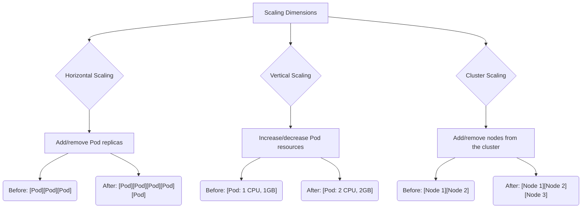
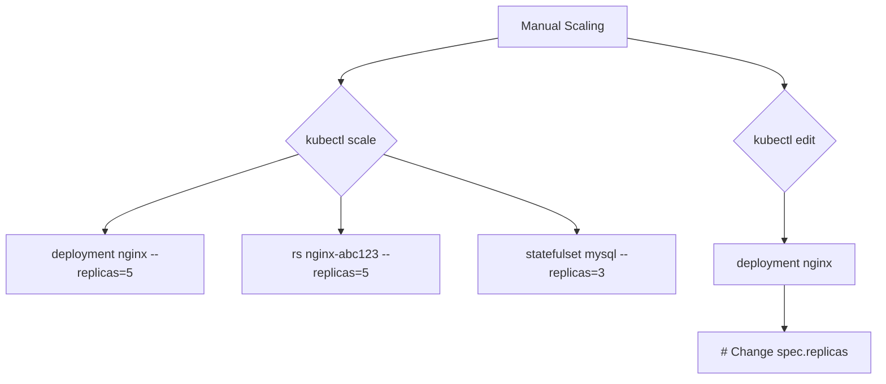
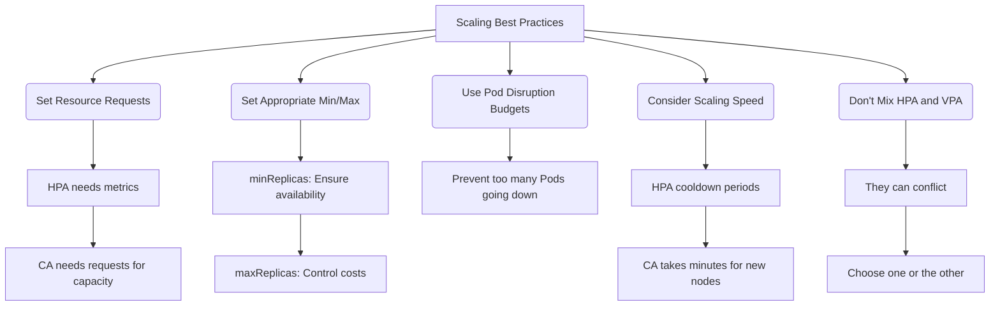

> **Complexity**: `[HIGH]` - Advanced orchestration concepts, impact on application design
>
> **Time to Complete**: 45-60 minutes
>
> **Prerequisites**: Module 2.1 (Scheduling)

---

## What You'll Be Able to Do

After completing this module, you will be able to:

1.  **Diagnose** common scaling challenges in Kubernetes clusters, distinguishing between application, Pod, and node-level bottlenecks.
2.  **Implement** Horizontal Pod Autoscalers (HPA) and Vertical Pod Autoscalers (VPA) to optimize application resource utilization and responsiveness.
3.  **Evaluate** the trade-offs and appropriate use cases for horizontal, vertical, and cluster scaling strategies in different workload scenarios.
4.  **Design** robust, fault-tolerant Kubernetes deployments by applying scaling best practices, including proper resource requests and Pod Disruption Budgets.

---

## Why This Module Matters

Imagine a major e-commerce platform, "Globomart," preparing for its annual Black Friday sale. Historically, traffic surges from hundreds to millions of users in minutes, putting immense strain on their infrastructure. In 2023, due to inadequate scaling configurations, Globomart's primary checkout service buckled under pressure. Their Kubernetes cluster, designed to be elastic, failed to provision new Pods and nodes fast enough. For three agonizing hours, customers faced endless loading screens and failed transactions. Analysts later estimated the direct revenue loss at **$50 million**, not to mention the irreparable damage to brand reputation.

This catastrophic event underscores a fundamental truth in cloud-native operations: **scaling is not optional; it's existential.** Kubernetes offers powerful tools to automatically adjust resources to match demand, but understanding *how* and *when* to use them is critical. Misconfigurations can lead to service outages, exorbitant cloud bills, or both. This module will equip you with the knowledge to wield Kubernetes' scaling capabilities effectively, transforming potential failures into seamless elasticity. You'll learn how to ensure your applications remain responsive and cost-efficient, even under extreme load, preventing your own "Globomart moment."

---

## Understanding Scaling Dimensions

Scaling in Kubernetes addresses how applications handle varying loads by adjusting the resources allocated to them. There are three primary dimensions of scaling:

### Horizontal Scaling (Scale Out/In)
This involves changing the *number* of Pod replicas for a given application. When demand increases, you add more identical Pods to distribute the load. When demand drops, you remove Pods to conserve resources. This is ideal for stateless applications where adding more instances linearly increases capacity.

### Vertical Scaling (Scale Up/Down)
This focuses on changing the *resources* (CPU, memory) allocated to individual Pods. If a single Pod is consistently CPU-bound or memory-starved, you can give it more resources. This is useful for stateful applications or those that benefit from having more powerful individual instances.

### Cluster Scaling
This involves adjusting the *number of nodes* in your Kubernetes cluster itself. If your existing nodes are fully utilized and new Pods are waiting to be scheduled, the cluster needs more physical capacity. Conversely, if nodes are underutilized, they can be removed to reduce infrastructure costs.

Here's a visual representation of these dimensions:



---

## Manual Scaling: The Baseline

Before diving into automation, it's crucial to understand how to manually adjust your application's replica count. This is often used for initial setup, troubleshooting, or for applications with very predictable, infrequent scaling needs.

The `kubectl scale` command allows you to change the number of replicas for Deployments, ReplicaSets, and StatefulSets.



**Example:**
To manually scale an `nginx` deployment to 5 replicas:
```bash
kubectl scale deployment/nginx --replicas=5
```
You can also directly edit the YAML definition of a resource and change the `spec.replicas` field. This is less common for runtime scaling but useful for persistent configuration.

---

## Horizontal Pod Autoscaler (HPA): Replica Automation

The **Horizontal Pod Autoscaler (HPA)** automatically adjusts the number of Pod replicas in a Deployment or ReplicaSet based on observed metrics like CPU utilization, memory usage, or custom metrics. It's a cornerstone of elasticity in Kubernetes, ensuring your application can handle fluctuating loads without manual intervention.

### How HPA Works

The HPA controller continuously monitors the metrics for your target workload (e.g., a Deployment). It compares the current metric value (e.g., average CPU utilization across all Pods) against a predefined target. If the current value deviates from the target, HPA calculates the desired number of replicas and updates the `replicas` field of your Deployment or ReplicaSet, triggering the Kubernetes controller to add or remove Pods.

```mermaid
flowchart TD
    subgraph HPA
        direction LR
        MS[Metrics Server] -- Current Metric Data --> HPA_Controller(HPA Controller)
        HPA_Controller -- Compares & Calculates --> Scaling_Logic(Scaling Logic)
        Scaling_Logic -- Scales --> Deployment[Deployment / ReplicaSet]

        subgraph Scaling_Logic
            direction TD
            Target_Metric[Target: 50% CPU]
            Current_Metric[Current: 80% CPU]
            Current_Replicas[Current replicas: 2]

            subgraph Calculation
                Desired_Replicas[Desired = Current Replicas × (Current Metric / Target Metric)]
                Example_Calc{Example: 2 × (80 / 50) ≈ 4}
            end

            Target_Metric & Current_Metric & Current_Replicas --> Calculation
            Calculation --> Scale_Action[Scale Deployment to 4 replicas]
        end
    end
```

### HPA Configuration Essentials

An HPA resource defines the scaling behavior for a target workload. Key parameters include the reference to the workload, minimum and maximum replica counts, and the metrics to be monitored.

```yaml
# Key HPA settings to understand:
apiVersion: autoscaling/v2
kind: HorizontalPodAutoscaler
spec:
  scaleTargetRef:
    apiVersion: apps/v1
    kind: Deployment
    name: my-app
  minReplicas: 2        # Never scale below this
  maxReplicas: 10       # Never scale above this
  metrics:
  - type: Resource
    resource:
      name: cpu
      target:
        type: Utilization
        averageUtilization: 50  # Target 50% CPU
```
In this example, the HPA will ensure `my-app` always has between 2 and 10 replicas, striving to maintain an average CPU utilization of 50% across all its Pods.

> **Pause and predict**: Consider a scenario where your application experiences a brief, intense burst of traffic, pushing CPU utilization far above your 50% target. HPA quickly scales up. What mechanism prevents HPA from rapidly scaling *down* immediately after the burst ends and CPU utilization drops, only to scale up again if traffic returns a moment later? Why is this important for application stability?

### HPA Metrics Types

HPA isn't limited to just CPU and memory. It supports various metric sources, allowing for highly flexible scaling strategies.

| Type | Description | Example |
|------|-------------|---------|
| **Resource** | CPU, memory utilization | 50% CPU average |
| **Pods** | Custom metrics emitted by Pods | Requests per second, active connections |
| **Object** | Metrics from other Kubernetes objects | Queue length of a message broker |
| **External** | Metrics from outside the cluster | Cloud-specific metrics, external monitoring systems |

---

## Vertical Pod Autoscaler (VPA): Resource Right-Sizing

While HPA manages the *number* of Pods, the **Vertical Pod Autoscaler (VPA)** focuses on optimizing the *resources* (CPU, memory requests and limits) assigned to individual Pods. It aims to prevent over-provisioning (wasting resources) and under-provisioning (causing performance issues or OOMKills). VPA continuously observes the actual resource usage of Pods over time and provides recommendations, or even automatically updates, their resource requests and limits.

### How VPA Works

VPA components (Recommender, Updater, Admission Plugin) work together:
1.  The VPA **Recommender** observes historical and current resource usage of Pods.
2.  Based on this observation, it recommends optimal CPU and memory requests/limits.
3.  The VPA **Updater** (if enabled) can then automatically apply these recommendations. This often involves evicting and recreating Pods with the new resource configurations.
4.  An VPA **Admission Webhook** can also intercept Pod creation requests and inject the recommended resource values before the Pod starts.

```mermaid
flowchart TD
    subgraph VPA
        Pod_Start[Pod starts with requests] --> VPA_Observe(VPA observes actual usage)
        VPA_Observe --> VPA_Recommend(VPA recommends optimal requests/limits)

        subgraph Initial_Requests
            Req_CPU_Init[cpu: 100m]
            Req_Mem_Init[memory: 128Mi]
        end

        subgraph Actual_Usage
            Usage_CPU[Actual cpu: 400m]
            Usage_Mem[Actual memory: 512Mi]
        end

        subgraph VPA_Recommendations
            Rec_CPU[cpu: 500m]
            Rec_Mem[memory: 600Mi]
        end

        Pod_Start -- Initial resources --> Initial_Requests
        VPA_Observe -- Observed usage --> Actual_Usage
        VPA_Recommend -- Recommendations --> VPA_Recommendations

        VPA_Modes(Modes)
        VPA_Modes --> Mode_Off[Off: Just recommendations]
        VPA_Modes --> Mode_Initial[Initial: Set on Pod creation]
        VPA_Modes --> Mode_Auto[Auto: Update running Pods (recreates)]
        VPA_Modes -- Note --> Addon[VPA is NOT built into Kubernetes core - It's an add-on]
    end
```

It's important to remember that VPA is *not* a built-in Kubernetes feature; it's an add-on. Also, VPA (in "Auto" mode) often needs to restart Pods to apply new resource requests, which can cause brief service disruptions.

---

## Cluster Autoscaler (CA): Node Infrastructure Automation

While HPA and VPA manage resources *within* the cluster, the **Cluster Autoscaler (CA)** manages the cluster's underlying infrastructure by adding or removing nodes. It ensures that there's always enough computational capacity (nodes) to run your Pods.

### How CA Works

The Cluster Autoscaler operates by constantly checking for two conditions:

*   **Scale Up:** If there are Pods in a `Pending` state that cannot be scheduled due to insufficient resources on existing nodes (e.g., no node has enough CPU or memory to accommodate them), CA detects this. It then requests the underlying cloud provider (e.g., AWS, GCP, Azure) to add new nodes to the cluster. Once new nodes join and register, the scheduler can place the pending Pods.
*   **Scale Down:** If nodes have been consistently underutilized for a certain period (e.g., their resource usage is below a threshold, and all Pods on them can be safely moved to other nodes), CA will drain those nodes (move their Pods) and then request the cloud provider to remove them, saving costs.

```mermaid
flowchart TD
    subgraph Cluster Autoscaler
        subgraph Scale Up
            A[Pods pending (unschedulable)] --> B(Cluster Autoscaler detects pending Pods)
            B --> C(Requests new node from cloud provider)
            C --> D(New node joins cluster)
            D --> E(Pending Pods get scheduled)
        end

        subgraph Scale Down
            F[Node has low utilization for X minutes] --> G(CA checks if Pods can move elsewhere)
            G --> H(Drains node (moves Pods))
            H --> I(Removes node from cloud)
        end

        Cloud_Integrations(Works with)
        Cloud_Integrations --> AWS[AWS Auto Scaling]
        Cloud_Integrations --> GCP[GCP MIG]
        Cloud_Integrations --> Azure[Azure VMSS]
    end
```

> **Stop and think**: You've configured your Cluster Autoscaler to add new nodes when Pods are pending. However, you notice that during traffic spikes, your applications still experience several minutes of degraded performance before new nodes become ready. What strategies could you employ to mitigate this delay and ensure a smoother user experience during unexpected load surges?

---

## Comparing Kubernetes Scaling Mechanisms

It's crucial to understand the distinct roles and characteristics of HPA, VPA, and Cluster Autoscaler to apply them effectively.

| Aspect | HPA | VPA | Cluster Autoscaler |
|--------|-----|-----|-------------------|
| **What scales** | Pod count | Pod resources | Node count |
| **Direction** | Horizontal | Vertical | Horizontal (of nodes) |
| **Trigger** | Metrics threshold | Usage patterns | Unschedulable Pods |
| **Built-in** | Yes | No (add-on) | No (add-on) |
| **Downtime** | No | Yes (Pod restart) | No |

---

## Scaling Best Practices: Mastering Elasticity

Effective scaling in Kubernetes goes beyond just deploying HPA or CA. It requires a holistic approach, incorporating resource management, availability considerations, and understanding the interplay between different autoscalers.



### Elaboration on Best Practices:

1.  **Always Set Resource Requests and Limits:** This is foundational. HPA uses requests to calculate utilization. The Kubernetes scheduler uses requests to determine where to place Pods, which is critical for the Cluster Autoscaler. Without requests, your applications might get starved, and autoscalers cannot make informed decisions.
2.  **Define Appropriate `minReplicas` and `maxReplicas`:**
    *   `minReplicas`: Set this to a value that ensures high availability and can absorb initial traffic spikes before HPA kicks in. A minimum of 2-3 replicas is often a good starting point for production services.
    *   `maxReplicas`: Crucial for cost control and preventing runaway scaling in case of misconfigured metrics or unexpected load patterns. Set it to a reasonable upper bound based on your budget and infrastructure limits.
3.  **Utilize Pod Disruption Budgets (PDBs):** PDBs specify the minimum number of available Pods (or maximum unavailable Pods) that must be maintained for a given workload during voluntary disruptions (like node drains by CA or manual upgrades). This prevents accidental outages during scaling operations.
4.  **Understand Scaling Latencies:**
    *   **HPA:** Has configurable cooldown periods (default often 5 minutes for scale down) to prevent "thrashing" (rapid scale up/down cycles). Factor this into your application's responsiveness needs.
    *   **Cluster Autoscaler:** Provisioning new nodes from a cloud provider can take several minutes. Design your application to handle this latency, perhaps with some pre-provisioned buffer capacity or gracefully degraded functionality.
5.  **Avoid Mixing HPA and VPA for CPU/Memory:** HPA and VPA can interfere with each other if both are trying to optimize the same resource (e.g., CPU). HPA might scale down replicas because VPA increased a Pod's CPU request, making its relative utilization appear lower. Generally, use HPA for horizontal scaling and VPA (often in recommendation mode) for right-sizing resource requests of individual Pods. If you need both, use HPA for metrics *other* than CPU/memory (e.g., custom metrics like queue depth) while VPA handles resource requests.

---

## Did You Know?

*   **HPA API Evolution:** The Horizontal Pod Autoscaler API has evolved from `v1` (CPU-only) to `v2beta1`, `v2beta2`, and now `v2`, which supports custom and external metrics, as well as more sophisticated scaling algorithms.
*   **Netflix's Spinnaker:** Major cloud-native companies like Netflix (creators of Spinnaker) have been dealing with massive scaling challenges for over a decade, often pioneering solutions that later influenced projects like Kubernetes. Their "Chaos Engineering" philosophy helps them test system resilience under extreme conditions.
*   **Container Image Size Impact:** Large container images can significantly slow down Pod startup times during horizontal scaling events, as nodes need to pull the image. Optimizing image size (e.g., multi-stage builds, smaller base images) can dramatically improve scaling responsiveness.
*   **Kubernetes Node Limits:** A single Kubernetes cluster can theoretically support up to 5,000 nodes and 150,000 Pods, with up to 100 Pods per node. Scaling beyond these limits often requires advanced techniques like federated clusters or hierarchical autoscaling.

---

## Common Mistakes

Here's a breakdown of common pitfalls when configuring and managing scaling in Kubernetes:

| Mistake | Why It Hurts | Correct Understanding |
|---------|--------------|----------------------|
| No resource requests/limits set on Pods | HPA can't calculate utilization; Scheduler can't place Pods efficiently, leading to `Pending` Pods and ineffective Cluster Autoscaling. | Always set `resources.requests` (e.g., `cpu: 100m`, `memory: 128Mi`) and ideally `resources.limits` for every container. |
| `minReplicas = 1` for critical services | Creates a single point of failure. During a scale-down, if HPA/CA removes the only Pod, or if that single Pod crashes, your service goes down entirely. | For any production workload, set `minReplicas` to at least 2 or 3 to ensure high availability and provide a buffer for initial load spikes. |
| Scaling on the wrong metric | Leads to ineffective scaling. For example, scaling a CPU-bound application on memory usage won't address the bottleneck. | Identify your application's actual bottleneck (CPU, memory, I/O, network, database connections) and choose the metric that directly reflects that pressure. |
| Ignoring scale-down cooldown periods | Unnecessary replicas linger, driving up costs. Or, rapid scale-down leads to "thrashing" if load fluctuates quickly. | Understand and configure HPA's `stabilizationWindowSeconds` to balance responsiveness with cost. For CA, be aware of node draining times. |
| Mixing HPA and VPA for the same resource (CPU/memory) | They will fight each other, leading to erratic scaling behavior and instability. | Decide whether you need horizontal (HPA) or vertical (VPA) scaling for a given resource. If both, use HPA for a different metric or use VPA in recommendation-only mode. |
| Not using Pod Disruption Budgets (PDBs) | Voluntary disruptions (e.g., node drains by CA, node upgrades) can remove too many Pods at once, causing application downtime. | Create a PDB for every critical workload to specify the minimum number of available Pods or maximum unavailable Pods during disruptions. |
| Relying solely on Cluster Autoscaler for immediate capacity | Node provisioning takes minutes. Applications will suffer during sharp, unexpected traffic spikes until new nodes are ready. | Combine CA with some level of pre-provisioned buffer capacity or use techniques like Pod auto-scaling based on queue depth for batch jobs. Consider a burstable node pool. |

---

## Quiz

1.  **Scenario:** Your microservice experiences intermittent latency spikes, but CPU utilization remains low. Investigation reveals high memory usage and frequent garbage collection cycles within the Pods.
    **Question:** Which autoscaling solution would be most effective in addressing this specific problem, and why?
    <details>
    <summary>Answer</summary>
    The Vertical Pod Autoscaler (VPA) would be most effective. The problem indicates a resource constraint (memory) within individual Pods, not a lack of Pods. VPA would observe the high memory usage, recommend increased memory requests and limits for the Pods, and (in `Auto` mode) apply these changes. This would likely reduce garbage collection pressure and latency without increasing the number of Pods, which HPA would do based on CPU, not addressing the root cause.
    </details>

2.  **Scenario:** A backend API experiences a sudden surge in requests during a marketing campaign, causing its average CPU utilization to jump from 30% to 90%. Your HPA is configured to target 50% CPU utilization with `minReplicas: 3` and `maxReplicas: 15`.
    **Question:** What will happen to your application, and approximately how many replicas would you expect HPA to create in the initial scaling event, assuming current replicas are 3?
    <details>
    <summary>Answer</summary>
    The HPA will detect the 90% CPU utilization, which is above its 50% target. It will calculate the desired replicas using the formula: `desiredReplicas = currentReplicas × (currentMetric / targetMetric)`. In this case, `desiredReplicas = 3 × (90 / 50) = 3 × 1.8 = 5.4`. Since HPA rounds up to the nearest whole number, it would scale the Deployment to 6 replicas. This will distribute the load across more Pods, bringing the average CPU utilization closer to the 50% target.
    </details>

3.  **Scenario:** You have a batch processing application that runs nightly. The application's Pods often get stuck in a `Pending` state for several minutes because there aren't enough nodes in the cluster. This delays your batch jobs.
    **Question:** What component is responsible for resolving this `Pending` state, and how does it typically achieve this?
    <details>
    <summary>Answer</summary>
    The Cluster Autoscaler (CA) is responsible for resolving this. When Pods are in a `Pending` state due to insufficient cluster resources, the CA detects this condition. It then communicates with the underlying cloud provider (e.g., AWS, GCP, Azure) to provision new virtual machines (nodes) and add them to the Kubernetes cluster. Once these new nodes join and become ready, the Kubernetes scheduler can then place the previously `Pending` batch processing Pods onto them, allowing the jobs to start.
    </details>

4.  **Scenario:** Your application has a Pod Disruption Budget (PDB) set to ensure at least 2 Pods are always available. You manually initiate a rolling update for the Deployment, which has 3 replicas. During the update, the Cluster Autoscaler decides to drain the node where one of your Pods is running due to underutilization.
    **Question:** How will the PDB interact with these two concurrent actions (rolling update and node drain), and what will be the likely outcome for your application's availability?
    <details>
    <summary>Answer</summary>
    The PDB will prevent both the rolling update and the node drain from causing more than one Pod to be unavailable simultaneously. The rolling update will proceed one Pod at a time. When the Cluster Autoscaler attempts to drain the node, it will respect the PDB. If only one Pod is left (due to the rolling update making another unavailable), the PDB will block the node drain until the rolling update completes and the Pod count is restored to at least two, or vice versa. This ensures your application maintains its minimum availability, preventing a full outage.
    </details>

5.  **Scenario:** A new developer, unfamiliar with Kubernetes scaling, configures an HPA for a Deployment to target 70% CPU utilization. Simultaneously, they configure a VPA in `Auto` mode for the *same* Deployment.
    **Question:** Describe the conflict that will arise between HPA and VPA in this situation, and explain why this configuration is problematic for application stability.
    <details>
    <summary>Answer</summary>
    A significant conflict will occur because both HPA and VPA will try to manage the Pods' CPU resources, but with conflicting goals. VPA will continuously observe actual CPU usage and try to adjust the `cpu.requests` of the Pods to "right-size" them. If VPA increases the `cpu.requests`, the HPA will perceive the *same actual CPU usage* as a lower *utilization percentage* (because utilization is `actual_usage / request`). This will cause HPA to incorrectly scale *down* the number of replicas. Conversely, if VPA decreases requests, HPA might scale *up*. This creates a constant tug-of-war, leading to erratic and unstable scaling behavior, potentially causing resource starvation or excessive cost.
    </details>

6.  **Scenario:** You observe that during peak load, your application's Pods quickly scale up to `maxReplicas`, but new Pods spend an excessive amount of time in `ContainerCreating` status.
    **Question:** What are two common reasons for Pods being stuck in `ContainerCreating` during scaling events, and what steps would you take to diagnose and resolve them?
    <details>
    <summary>Answer</summary>
    Two common reasons for Pods stuck in `ContainerCreating` are:
    1.  **Image Pull Delays:** The container image is large, or the image registry is slow/unresponsive.
        *   **Diagnosis:** Use `kubectl describe pod <pod-name>` and look for `ImagePullBackOff` or `ErrImagePull` events. Check image pull times in logs.
        *   **Resolution:** Optimize container image size (multi-stage builds), use a faster or closer container registry, or implement image pre-pulling on nodes.
    2.  **Insufficient Node Resources (especially ephemeral storage):** Even if CPU/memory are available, a node might lack sufficient ephemeral storage or other host-level resources for new containers.
        *   **Diagnosis:** Check `kubectl describe node <node-name>` for disk pressure or other resource exhaustion events. Look for `FailedCreatePodSandBox` errors.
        *   **Resolution:** Ensure nodes have adequate ephemeral storage, monitor disk usage, or update Pod `ephemeral-storage` requests/limits.

    Both issues contribute to slow scaling and can lead to degraded service performance during load spikes.
    </details>

---

## Hands-On Exercise: Implementing Autoscaling

This exercise will guide you through setting up and observing the behavior of the Horizontal Pod Autoscaler.

1.  **Prerequisite:** Ensure you have a running Kubernetes cluster (Minikube, Kind, or a cloud-based cluster).
2.  **Deploy a Sample Application:**
    First, deploy an Nginx deployment and a service.
    ```yaml
    # deployment.yaml
    apiVersion: apps/v1
    kind: Deployment
    metadata:
      name: nginx-deployment
      labels:
        app: nginx
    spec:
      replicas: 1
      selector:
        matchLabels:
          app: nginx
      template:
        metadata:
          labels:
            app: nginx
        spec:
          containers:
          - name: nginx
            image: nginx:latest
            ports:
            - containerPort: 80
            resources:
              requests:
                cpu: "50m"
                memory: "64Mi"
              limits:
                cpu: "100m"
                memory: "128Mi"
    ---
    # service.yaml
    apiVersion: v1
    kind: Service
    metadata:
      name: nginx-service
    spec:
      selector:
        app: nginx
      ports:
        - protocol: TCP
          port: 80
          targetPort: 80
      type: LoadBalancer # Or NodePort for local clusters
    ```
    Apply these: `kubectl apply -f deployment.yaml && kubectl apply -f service.yaml`

3.  **Deploy Metrics Server:**
    HPA relies on Metrics Server to collect CPU/memory metrics. If you don't have it, deploy it:
    `kubectl apply -f https://github.com/kubernetes-sigs/metrics-server/releases/latest/download/components.yaml`
    Wait a few moments, then verify it's running: `kubectl get apiservice v1beta1.metrics.k8s.io`

4.  **Create Horizontal Pod Autoscaler:**
    Define an HPA for your Nginx deployment, targeting 50% CPU utilization, with 1 to 5 replicas.
    ```bash
    kubectl autoscale deployment nginx-deployment --cpu-percent=50 --min=1 --max=5
    ```
    Verify the HPA: `kubectl get hpa`

5.  **Generate Load:**
    Simulate high CPU load. You can use a separate Pod running `busybox` or `alpine` to send requests to your Nginx service. First, get the service IP/Port: `kubectl get svc nginx-service`.
    Then run a client Pod:
    ```bash
    kubectl run -it --rm load-generator --image=busybox -- /bin/sh
    # Inside the busybox pod:
    while true; do wget -q -O- http://nginx-service.<namespace>.svc.cluster.local; done
    # Replace <namespace> with your namespace if not default
    ```
    Let this run for a few minutes.

6.  **Observe HPA in Action:**
    Monitor your HPA and Deployment:
    `watch kubectl get hpa nginx-deployment`
    `watch kubectl get pods -l app=nginx`
    You should see the HPA scale up the number of replicas as CPU utilization increases. Stop the `load-generator` and observe the HPA scaling back down (after its cooldown period).

    <details>
    <summary>Click for Success Checklist</summary>
    - [x] Successfully deployed Nginx application and service.
    - [x] Metrics Server is running and accessible.
    - [x] HPA created and targets Nginx deployment.
    - [x] Load generator successfully increased CPU utilization.
    - [x] HPA scaled up the number of Nginx Pods automatically.
    - [x] HPA scaled down Pods after load was removed.
    - [x] You can articulate *why* the HPA scaled and *what* triggered the scale-down.
    </details>

---

## Summary

In this module, we've explored the critical role of scaling in Kubernetes, moving beyond simple Pod creation to dynamic resource management. We covered:

*   **Scaling Dimensions**: The fundamental differences between horizontal (Pod count), vertical (Pod resources), and cluster (node count) scaling.
*   **Horizontal Pod Autoscaler (HPA)**: How it automatically adjusts Pod replicas based on metrics, ensuring applications can meet demand.
*   **Vertical Pod Autoscaler (VPA)**: Its function in right-sizing individual Pods' CPU and memory requests for optimal efficiency.
*   **Cluster Autoscaler (CA)**: The mechanism for dynamically adjusting the underlying node infrastructure to match cluster-wide resource demands.
*   **Manual Scaling**: Basic methods for direct control over replica counts.
*   **Scaling Best Practices**: Essential guidelines for robust, cost-effective, and stable auto-scaling configurations, including crucial advice like setting resource requests and avoiding conflicts between HPA and VPA.

Mastering these scaling techniques is paramount for building resilient and efficient cloud-native applications on Kubernetes.

---

## Next Module

[Module 2.3: Storage Orchestration](../module-2.3-storage/) - Delve into how Kubernetes manages persistent storage for stateful applications, decoupling data from compute.