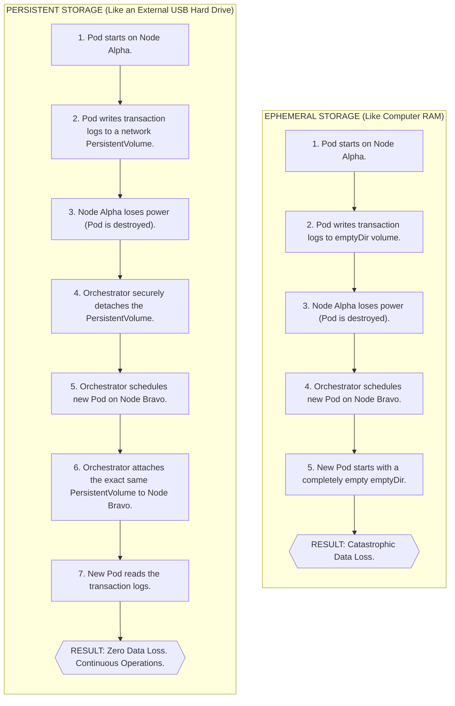
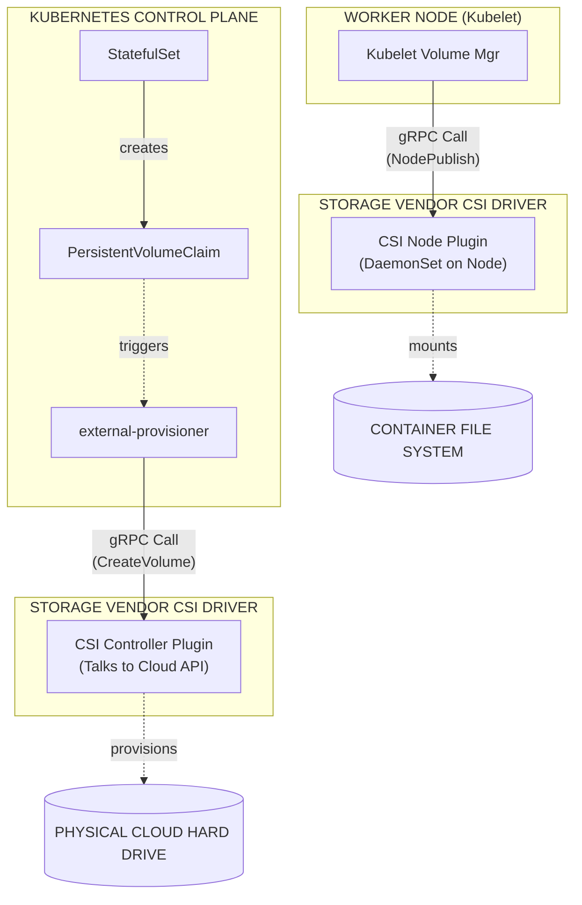

# Module 2.3: Storage Orchestration

**Complexity**: `[MEDIUM]` - Storage concepts. **Time to Complete**: 45-60 minutes. **Prerequisites**: Module 2.2 (Scaling). All commands in this module assume Kubernetes 1.35 or newer and use the standard shell shortcut `alias k=kubectl`, so `k get pods` means the same API request as the longer command while keeping examples readable.

---

## Learning Outcomes

After completing this module, you will be able to:

1. **Design** a persistent storage architecture for stateful Kubernetes workloads by comparing block, file, object, ephemeral, and persistent storage behaviors.
2. **Implement** dynamic storage provisioning with StorageClasses and PersistentVolumeClaims so volume creation follows workload demand instead of manual ticket queues.
3. **Diagnose** storage binding failures, topology mismatches, permission constraints, and access mode conflicts that prevent Pods from starting.
4. **Compare** Retain, Delete, and legacy Recycle reclaim policies so production data is protected during application decommissioning.
5. **Evaluate** Container Storage Interface (CSI) responsibilities and explain how vendor drivers integrate with the Kubernetes control plane and kubelet.

## Why This Module Matters

In January 2017, GitLab.com experienced one of the most public database incidents in modern operations. During an exhausting recovery attempt, an administrator removed data from the wrong database node while trying to repair replication, and roughly 300 gigabytes of production data disappeared before the team could stop the damage. The company spent hours broadcasting the recovery effort, rebuilding from incomplete backups, and explaining to customers why a platform built to host critical source code had lost some of its own state.

That incident did not happen inside Kubernetes, but it exposes the same uncomfortable truth that every platform engineer eventually faces: compute is replaceable, state is not. A stateless web Pod can vanish and return somewhere else without drama because its useful data lives behind another API. A database Pod, message broker, search index, or artifact registry cannot treat its local files as disposable scratch space. If the orchestrator deletes the Pod, reschedules it to another node, or evicts it during pressure, the application needs a storage contract that survives the compute lifecycle.

Kubernetes storage orchestration is the set of abstractions that creates that contract. The hard part is not memorizing the names PersistentVolume, PersistentVolumeClaim, StorageClass, or CSI driver; the hard part is predicting what happens when they interact with real failure domains, access modes, reclaim policies, and node placement. By the end of this module, you should be able to look at a stuck database Pod, a Pending claim, or a risky StorageClass default and reason through the operational consequence before it becomes a production incident.

## The Anatomy of Kubernetes Storage: Ephemeral vs. Persistent

Containers start from immutable images, but every running container also gets a writable layer for files created after startup. That layer is convenient for logs, temporary downloads, PID files, and caches that can be rebuilt, but it belongs to the container lifecycle. When the container is replaced, the layer is discarded with it. Kubernetes is intentionally comfortable destroying and recreating containers because that is how the platform repairs unhealthy workloads, rolls out new versions, and moves work away from failing nodes.

The first storage distinction is therefore not cloud versus on-premises or SSD versus network filesystem; it is whether the data must survive the thing that is writing it. An `emptyDir` volume survives individual container restarts inside the same Pod because the volume is attached to the Pod sandbox rather than to one container process. That makes it useful when a sidecar reads files written by the main container, or when an init container prepares data before the application starts. It does not make the data durable, because the volume still disappears when the Pod object is removed from the node.

Think of `emptyDir` like a hotel room desk. You can leave a notebook there while you step into the hallway, and another person sharing the room can read it. When checkout happens, housekeeping clears the desk for the next guest. The hotel building might still be standing, but the room assignment ended, so anything treated as part of that assignment is gone. A Pod deletion, scale-down, replacement after node pressure, or recreation by a controller is Kubernetes checking out of the room.

Persistent storage breaks that boundary. Instead of tying the data directory to the Pod, Kubernetes ties the Pod to a storage object that can exist before the Pod starts and after the Pod dies. The volume might be a cloud block disk, a managed network filesystem, a storage array LUN, or a local-path provisioned directory in a small lab cluster. The exact backend matters for performance and failure behavior, but the key Kubernetes idea is that the workload asks for storage through the API and receives a mount whose lifecycle is deliberately separate from the compute process.



Notice the careful wording in the persistent path: Kubernetes does not magically make every write safe across every disaster. It coordinates attachment, mount, and scheduling against the capabilities of the storage backend. If the backend is a single-zone block disk, the data may survive a Pod deletion but still be unavailable from another zone. If the backend is a shared filesystem, many nodes may mount it, but application-level file locking and latency become part of the design. Persistent storage gives you a survivable abstraction, not a free replacement for backup, replication, or database correctness.

Pause and predict: if a Pod uses `hostPath` to mount `/var/lib/app` directly from the worker node, what happens when the scheduler replaces that Pod on a different node? The answer should feel uncomfortable. The new Pod sees the new node's filesystem, not the old node's files, which means `hostPath` couples the workload to a specific machine while Kubernetes is trying to manage a pool of machines. That is why `hostPath` is usually reserved for node-level agents and tightly controlled platform components, not ordinary stateful applications.

A useful storage design starts by classifying the data. Scratch files, render buffers, and temporary decompression directories can often use `emptyDir`, especially when the application can recreate the content after restart. Database data directories, broker logs, uploads, and user-generated files need persistent storage because the business cares about the bytes after the Pod is gone. Large static datasets, model files, and shared media libraries may need read-only or read-write sharing across many nodes, which changes the backend choice before you write a single manifest.

The KCNA-level trap is assuming that a volume is automatically durable because it appears under `volumes:` in a Pod spec. A Kubernetes volume only says how a directory is made available to containers in the Pod. Durability comes from the volume type and the external system behind it. That is why the same `volumeMounts:` syntax can represent disposable scratch space, a single-node block device, or a managed distributed filesystem with replication and snapshots.

This distinction also affects how you read application documentation. Many upstream projects say "mount a volume here" without explaining whether that path contains state, cache, configuration, or generated output. A platform engineer has to translate that path into a Kubernetes lifecycle decision. If the path contains rebuildable cache, ephemeral storage may be fine. If it contains the only copy of user uploads, a PVC alone may still be incomplete because the application may need backup hooks, object storage migration, or a storage backend that supports multi-writer behavior.

The safest habit is to draw the lifecycle boundary before writing YAML. Ask what creates the bytes, who else reads them, whether another copy exists, how quickly the data changes, and what the business consequence is if the directory starts empty after a restart. Those questions sound slower than copying a manifest, but they prevent a common failure mode where the cluster appears healthy while the application quietly loses the state that made it useful.

## PersistentVolumes and PersistentVolumeClaims

Kubernetes separates storage ownership from storage consumption with two API objects. A PersistentVolume, or PV, represents a storage asset the cluster can use. A PersistentVolumeClaim, or PVC, represents an application's request for storage. This division is deliberate because platform teams and application teams need different levels of detail. Platform teams care about providers, zones, disk classes, encryption, reclaim behavior, and driver configuration. Application teams usually care about capacity, access mode, and the name they can mount into a Pod.

A PersistentVolume is cluster-scoped, which means it does not live inside a namespace. It can be provisioned manually by an administrator or created dynamically by a provisioner. In older static setups, administrators created PVs in advance, describing capacity, access modes, reclaim policy, and a backend-specific implementation. The following preserved example shows that style with a legacy AWS EBS in-tree field; on Kubernetes 1.35, production AWS clusters should use the EBS CSI driver, but the manifest is still useful for understanding the anatomy of a PV object found in older estates.

```yaml
# Example: A static PersistentVolume definition
apiVersion: v1
kind: PersistentVolume
metadata:
  name: manual-database-disk-01
spec:
  capacity:
    storage: 100Gi                  # The absolute physical size of the disk
  volumeMode: Filesystem            # Formatted with a standard filesystem (ext4/xfs)
  accessModes:
    - ReadWriteOnce                 # Can only be mounted to a single node
  persistentVolumeReclaimPolicy: Retain # Do not delete data if the claim is removed
  storageClassName: manual-slow-hdd # The arbitrary class category
  awsElasticBlockStore:             # The underlying provider implementation
    volumeID: vol-0abcdef1234567890
    fsType: ext4
```

A PersistentVolumeClaim is namespace-scoped, which means the consuming Pod and the claim must be in the same namespace. The PVC is not a disk; it is a request that says, in effect, "find or create storage that satisfies these constraints." The control plane compares the claim to available PVs by checking capacity, access mode, storage class, volume mode, and selector requirements. When a compatible PV is found, Kubernetes binds the claim and the volume in a one-to-one relationship.

```yaml
# Example: A user's PersistentVolumeClaim
apiVersion: v1
kind: PersistentVolumeClaim
metadata:
  name: database-storage-claim
  namespace: production             # PVCs strictly belong to a namespace
spec:
  accessModes:
    - ReadWriteOnce                 # Must match the PV's capabilities
  resources:
    requests:
      storage: 50Gi                 # The minimum acceptable size
  storageClassName: manual-slow-hdd # Must explicitly match the PV's class
```

That one-to-one binding is one of the most important rules in storage troubleshooting. If a PVC asks for 50Gi and the only matching PV is 100Gi, Kubernetes can bind the claim to the larger volume, but the leftover capacity is not returned to a shared pool for another claim. The entire PV becomes dedicated to that single PVC. This surprises teams coming from filesystems where many directories share one disk, but Kubernetes treats the PV as the allocation unit.

Static provisioning is useful when a storage asset already exists and must be preserved, such as a restored database disk, a forensic copy, or a manually prepared volume with special compliance handling. It scales poorly as a normal developer workflow because someone must create enough PVs of the right size, class, zone, and policy before applications request them. In a busy platform, that becomes a ticket queue disguised as infrastructure-as-code, and every mismatch shows up as a Pending PVC that blocks deployment.

Before running this in a lab, what output would you expect from `k get pvc database-storage-claim -n production` if no PV matches `manual-slow-hdd`? The claim remains `Pending`, and `k describe pvc` shows events explaining that no persistent volumes are available for the claim and no StorageClass can dynamically satisfy it. That event stream is usually more useful than staring at the YAML because it tells you which part of the matching contract failed.

The relationship between a Pod and a PVC is simple in the manifest but strict in execution. The Pod references the claim by name under `volumes:`, and each container mounts that volume at a chosen path. The kubelet on the selected node coordinates with the volume plugin or CSI node component to attach, format if needed, mount, and expose the storage into the container namespace. If any step fails, the Pod may sit in `Pending` or `ContainerCreating` while events mention attach errors, mount errors, or access mode conflicts.

That strictness is useful because it turns storage into an auditable API contract. You can inspect the claim, see which volume it bound, check the class that shaped provisioning, and follow events from the scheduler to the node. Without these objects, a failed mount would be a local mystery inside one machine. With them, the cluster leaves a trail that explains whether the problem is missing capacity, a wrong namespace, a driver failure, a topology mismatch, or an unsafe attachment that Kubernetes refused to perform.

## Dynamic Provisioning and StorageClasses

Dynamic provisioning removes the need for administrators to pre-create every PV. Instead, the administrator defines StorageClasses that describe available storage offerings, and applications request one of those classes through their PVCs. A StorageClass is a policy and driver reference, not a volume itself. It says which provisioner should create storage, what backend parameters to use, whether expansion is allowed, how reclaim should behave, and when the physical volume should be bound relative to Pod scheduling.

```yaml
# Example: A dynamic StorageClass definition
apiVersion: storage.k8s.io/v1
kind: StorageClass
metadata:
  name: extreme-performance-ssd
provisioner: ebs.csi.aws.com        # The driver responsible for API calls
parameters:
  type: io2                         # Cloud provider specific parameter
  iopsPerGB: "50"                   # Guaranteed IOPS performance
reclaimPolicy: Retain               # Protect the data
allowVolumeExpansion: true          # Allow resizing the disk later
volumeBindingMode: WaitForFirstConsumer # Crucial for multi-zone clusters
```

The StorageClass is where platform intent becomes visible. A class named `extreme-performance-ssd` should not merely be a pretty label; it should map to a backend with performance, durability, cost, and operational policies that justify the name. In a mature cluster, you might see a cheap class for disposable CI workspaces, a retained encrypted class for production databases, and a shared filesystem class for content libraries. Each class lets application manifests express intent without embedding provider-specific API calls.

The dynamic pipeline begins when a PVC references a StorageClass. If no suitable static PV already exists, the external provisioner associated with that class asks the storage backend to create a new volume. After the backend returns a volume identifier, the provisioner creates a PV object that points at the new storage and binds it to the waiting claim. From the developer's perspective, the claim changed from Pending to Bound; behind that small status transition, the platform created real infrastructure.

This automation is powerful enough to be dangerous. A developer deleting and recreating a namespace can trigger storage creation and destruction depending on reclaim policy. A typo in `storageClassName` can leave a workload blocked because the provisioner never receives a valid request. A default StorageClass can accidentally catch claims that forgot to specify a class, which is convenient for demos but risky for production if the default class uses cheap disks, the wrong zone behavior, or destructive cleanup.

The most subtle StorageClass field for distributed clusters is `volumeBindingMode`. With `Immediate`, provisioning happens as soon as the PVC is created. That is fine when the backend is not topology-constrained, but many block storage systems are tied to a zone. If a disk is created in Zone B before the scheduler selects a node, and the Pod later needs a GPU that only exists in Zone A, the workload cannot start because the disk cannot attach across zones.

`WaitForFirstConsumer` defers provisioning until a Pod that uses the claim is scheduled. The scheduler considers Pod resource requests, affinity, taints, topology constraints, and the PVC together, then the provisioner creates the volume in a place compatible with the chosen node. This one field turns storage provisioning from a blind first-come action into a coordinated scheduling decision. For multi-zone clusters, it is usually the safer default for block storage classes.

Stop and think: if a PVC uses a `WaitForFirstConsumer` class but no Pod ever references that PVC, should a cloud disk exist yet? In a correct late-binding flow, the claim can remain Pending without creating a billable physical volume because there is no first consumer. That Pending status is not automatically a failure; it is the storage system waiting for scheduling context.

Volume expansion is another dynamic provisioning feature that needs operational discipline. A StorageClass with `allowVolumeExpansion: true` lets a user increase the requested size on an existing PVC. Kubernetes can coordinate the backend resize and filesystem expansion for supported drivers, but shrinking is not the normal path because filesystems and block devices do not safely discard capacity on demand. Treat expansion as a planned maintenance action for important workloads, even when the API makes the YAML edit look easy.

A practical debugging sequence starts with the claim, then follows the chain outward. Run `k get pvc -A` to find claims that are Pending, `k describe pvc <name> -n <namespace>` to read binding events, `k get storageclass` to confirm the class exists, and `k describe storageclass <name>` to inspect provisioner, reclaim policy, and binding mode. If the claim is Bound but the Pod is stuck, shift to `k describe pod` and look for attach or mount events from the kubelet and CSI components.

StorageClass defaults deserve special review during platform onboarding. Many clusters mark one StorageClass as default so a PVC without `storageClassName` still gets provisioned. That is friendly for tutorials, but it can hide important decisions in production because the application team may not realize which reclaim policy, binding mode, encryption settings, or performance tier they inherited. A mature platform usually documents the default class plainly, limits who can create new classes, and uses admission policy or review standards for workloads that need production-grade retention.

Dynamic provisioning should also be tested under quota pressure, not only under happy-path creation. Cloud accounts and storage arrays have limits for total volumes, capacity, IOPS, snapshots, and attachments. If a provisioner cannot create another disk, the PVC remains Pending and the application never starts, even though the manifest is syntactically correct. That is why storage observability should include provisioner errors, backend quota dashboards, and alerts on claims that remain Pending longer than an expected provisioning window.

## Access Modes, Reclaim Policies, and Failure Behavior

Access modes describe how a volume may be mounted by nodes, not how many containers can see the mounted path inside one Pod. `ReadWriteOnce` allows the volume to be mounted read-write by a single node. Multiple Pods on that same node might be able to use the same RWO volume depending on the workload and controller, but another node cannot attach it at the same time. That is why RWO is a natural fit for many block storage-backed databases and a poor fit for shared web uploads across replicas.

`ReadOnlyMany` allows many nodes to mount the volume read-only. It is useful for static datasets, shared application assets, or model files that many workers need to read without modifying. `ReadWriteMany` allows many nodes to mount the same volume read-write, which requires a backend built for distributed file access and locking, such as NFS, CephFS, or a managed cloud filesystem. Standard block storage is not a shared filesystem; presenting one raw disk to several kernels as writable is a path to corruption.

`ReadWriteOncePod` is stricter than RWO because it limits read-write access to one Pod across the cluster. This matters when the security or correctness requirement is "one active writer Pod," not merely "one active writer node." In Kubernetes 1.35-era clusters with supported CSI drivers, RWOP can protect workloads where two Pods on the same node must not accidentally share the same data directory. It is a useful mode for single-writer stateful applications that need stronger scheduling enforcement.

Reclaim policy answers a different question: what should happen to the underlying storage when the PVC is deleted? `Delete` removes the PV and asks the backend to delete the physical storage. That is efficient for temporary environments, CI workspaces, and caches that should clean themselves up. It is unacceptable as an unreviewed default for critical production databases because an ordinary claim deletion can become a provider-level disk deletion.

`Retain` keeps the underlying storage after the claim is deleted. The PV moves to a Released state, and an administrator must inspect, back up, wipe, or manually rebind the asset before reuse. This is slower and more hands-on, but it creates a human checkpoint around valuable data. In real incident response, that checkpoint is often the difference between "we accidentally deleted the application object" and "we accidentally destroyed the only copy of the data."

`Recycle` is legacy behavior and should be treated as historical context rather than a modern design choice. It attempted to scrub a volume and return it to availability, but modern clusters generally prefer deleting and recreating storage or using explicit administrative workflows. For KCNA purposes, remember that Retain protects, Delete cleans up, and Recycle is deprecated legacy behavior that should not be selected for new designs.

Storage failures often look like scheduling failures because the Pod is the visible symptom. A Pod may remain Pending because its claim is not Bound, or it may enter ContainerCreating because the claim is Bound but the kubelet cannot attach or mount the volume. Events are the map. If events mention "unbound immediate PersistentVolumeClaims," investigate PVC and StorageClass binding. If they mention multi-attach errors, investigate access mode, existing attachments, and whether the previous Pod or node released the disk.

Consider a production database running as a StatefulSet on `Node-Alpha`. A network failure isolates that node from the control plane, so Kubernetes marks it NotReady and tries to maintain availability by creating a replacement Pod for `Node-Bravo`. The new Pod cannot start because the cloud provider still sees the RWO disk attached to `Node-Alpha`. From the provider's point of view, force-attaching the disk elsewhere could create split-brain writes if `Node-Alpha` is alive but partitioned.

Kubernetes tracks that physical relationship through a `VolumeAttachment` object for CSI-managed volumes. The control plane, attach-detach controller, kubelet, and CSI driver cooperate to ensure a disk is detached before it is attached somewhere else. That conservatism can feel frustrating during an outage, but it protects the filesystem from two kernels writing to the same block device. Manual force-detach is sometimes necessary, yet it should happen only after an operator confirms the old node cannot still be writing.

Permissions create another storage failure class that looks different from binding but is just as common. The volume may attach and mount successfully, while the container process cannot write because filesystem ownership, security context, SELinux labels, or driver mount options do not match the image's runtime user. In those cases the Pod may start and the application logs show permission errors rather than Kubernetes events. The fix belongs in the workload security context, image design, or storage class mount options, not in repeated claim deletion and recreation.

For stateful workloads, the best incident response posture is to treat storage events as data integrity signals rather than mere availability noise. A multi-attach error, mount timeout, or failed detach may be protecting you from corruption, not simply blocking your deployment. Slow down before overriding it. Confirm which node last wrote, whether the application can recover from an unclean shutdown, whether a snapshot should be taken first, and whether the driver documentation describes a supported force-detach path.

Which approach would you choose for a payment database: a dynamically provisioned class with `Delete`, or a retained class with explicit recovery procedures? The retained class is slower to clean up, but it encodes the value of the data into the platform. Cleanup convenience is not worth much if a bad pipeline run can remove the storage backing a regulated system.

## The Container Storage Interface (CSI)

Early Kubernetes storage integrations were in-tree, meaning provider-specific storage code lived inside the core Kubernetes source tree and release process. That created a maintenance problem for everyone. Storage vendors had to wait for Kubernetes releases to ship driver changes, Kubernetes maintainers had to review specialized provider code, and users inherited storage behavior tied to cluster upgrades rather than driver upgrades. The model did not scale with the number of clouds, arrays, filesystems, and backup tools that wanted to integrate.

CSI solves that by defining a standard interface between container orchestrators and storage systems. Kubernetes can call external CSI components through well-defined operations such as creating a volume, attaching it to a node, publishing it into a Pod, expanding it, or taking a snapshot when supported. The core control plane no longer needs built-in knowledge of every storage provider. It needs to coordinate API objects and call the driver that owns the backend.



A typical CSI deployment has controller-side components and node-side components. The controller plugin handles backend-level operations such as provisioning a new disk, deleting it, attaching it to a node, detaching it, and coordinating snapshots. It usually runs as a Deployment or StatefulSet with sidecars like an external provisioner, attacher, resizer, or snapshotter depending on the driver's capabilities. These sidecars watch Kubernetes API objects and translate state changes into CSI calls.

The node plugin runs on every worker node, usually as a DaemonSet, because each node needs local privileged code that can mount devices into the host filesystem. When the scheduler places a Pod on a node, the kubelet asks the local CSI node plugin to publish the volume. That step may involve discovering the device, formatting it if needed, mounting it at a staging path, and bind-mounting it into the Pod's container namespace. The application sees a directory; the node plugin performed the host-level work required to make that directory real.

CSI also makes storage features more modular. Volume snapshots, expansion, cloning, and topology awareness can be supported by drivers that implement the relevant parts of the specification and deploy the necessary sidecars. This does not mean every CSI driver supports every feature. A platform engineer must read the driver documentation, test the behavior in the cluster, and expose only the StorageClasses that match the organization's reliability and security requirements.

When diagnosing a CSI-backed volume, follow the responsibility boundary. If the PVC never becomes Bound, inspect the StorageClass, provisioner, and controller-side logs. If the PV is Bound but the Pod cannot mount it, inspect Pod events, node plugin logs, and `VolumeAttachment` objects. If a snapshot object never becomes ready, inspect snapshot controller and driver support. CSI gives you cleaner integration points, but it also gives you more components whose health matters.

## Patterns & Anti-Patterns

One reliable pattern is to design StorageClasses as service tiers rather than as provider trivia. A class called `prod-retained-rwo` or `shared-rwx` communicates behavior to application teams better than a name copied from a cloud disk SKU. The platform team can still tune provider parameters underneath, but the application manifest expresses the operational contract: retention, sharing model, binding mode, expansion, and expected workload type.

Another strong pattern is to use StatefulSets with `volumeClaimTemplates` for replicated stateful applications. Each replica receives its own stable claim, and the identity of the Pod matches the identity of its storage. This fits systems such as databases, queues, and consensus members where each replica owns distinct data. It also avoids the mistake of making several replicas fight over one RWO claim, which usually fails at scheduling time or corrupts assumptions at application time.

A third pattern is to pair Retain policies with documented recovery runbooks. Retain alone is not a backup plan; it only prevents automatic deletion. The runbook should explain who may rebind a Released volume, how to validate the data, how to snapshot before repair attempts, and how to wipe storage before reuse. Without that procedure, retained PVs accumulate as confusing leftovers, and operators may delete them later without understanding their value.

A common anti-pattern is treating a PVC as if it were a portable global disk. A claim is namespace-scoped, bound to one PV, and constrained by the backend's access modes and topology. Copying a Pod manifest into another namespace without creating the claim there will fail. Moving a workload across zones may fail if the volume lives in a different zone. Sharing one dataset across teams may require a shared filesystem or object storage rather than a single block PV.

Another anti-pattern is using dynamic provisioning as an excuse to ignore cost and quotas. StorageClasses can create real disks in seconds, and those disks may persist after workloads are forgotten depending on reclaim policy. Cloud providers also enforce attachment limits, throughput limits, and regional constraints. A cluster with many small RWO volumes can run out of per-node attachment slots before it runs out of CPU, which makes scheduling failures appear even when compute capacity looks healthy.

A final anti-pattern is solving application-level replication with Kubernetes volume sharing. RWX storage can let several Pods write to the same directory, but it does not turn an application into a safe distributed system. Databases, brokers, and indexes still need their own consistency model, locking behavior, and recovery design. Use shared storage where the application expects a shared filesystem, not as a shortcut around proper clustering.

## Decision Framework

Start the storage decision by asking whether the data must survive Pod deletion. If the answer is no, use ephemeral storage such as `emptyDir` and keep the capacity bounded so node disks do not become accidental dumping grounds. If the answer is yes, ask whether exactly one writer needs high-performance block semantics, many readers need the same immutable content, or many writers need a shared filesystem. That access pattern narrows the backend before capacity or price enters the conversation.

For single-writer databases and queues, choose an RWO or RWOP class backed by a reliable block storage driver, use `WaitForFirstConsumer` in topology-constrained clusters, and set reclaim policy according to data value. For shared media libraries, content management uploads, and build artifact directories, choose an RWX-capable filesystem and test application locking under concurrent writes. For large immutable datasets or public assets, object storage may be the cleaner architecture even if Kubernetes can mount a filesystem, because object APIs often scale better for distribution and lifecycle management.

Next, decide how much automation should be allowed at deletion time. Development namespaces often benefit from `Delete` because stale volumes waste money and slow experiments. Production systems usually deserve `Retain`, snapshots, backup integration, and an explicit decommissioning workflow. The best choice is not the one with the fewest YAML fields; it is the one where the storage lifecycle matches the consequence of losing the data.

Finally, decide what evidence you will use when something goes wrong. PVC status tells you whether binding succeeded. Pod events tell you whether scheduling, attachment, or mounting failed. StorageClass fields tell you whether late binding, reclaim, expansion, and provisioner selection match the design. CSI logs and `VolumeAttachment` objects tell you whether the backend and node plugins completed their side of the contract. A good storage design includes this diagnostic path before the first incident.

## Did You Know?

- In December 2021, with Kubernetes 1.23, CSI migration reached general availability for several major in-tree plugins, marking a major step away from provider code compiled into core Kubernetes binaries.
- AWS Nitro-based EC2 instances document a practical EBS attachment ceiling of 28 volumes for many instance families, and the root volume counts toward that limit.
- Kubernetes 1.20 introduced stable VolumeSnapshot API support, which gave backup vendors a Kubernetes-native way to coordinate point-in-time storage copies through CSI drivers.
- `ReadWriteOncePod` reached stable status in Kubernetes 1.29, giving supported CSI drivers a stricter single-Pod write mode than classic ReadWriteOnce node-level attachment.

## Common Mistakes

| Mistake | Why It Happens | How to Fix It |
|---------|----------------|---------------|
| **Using `emptyDir` for databases** | Teams see files survive a container restart and assume the storage is durable across Pod deletion. | Use a PersistentVolumeClaim for state that must survive rescheduling, and reserve `emptyDir` for scratch data. |
| **Assuming block storage supports RWX** | A single disk looks like shared capacity, so engineers expect many nodes to mount it safely. | Use an RWX-capable filesystem such as NFS, CephFS, or a managed cloud filesystem when many nodes need writes. |
| **Ignoring `volumeBindingMode`** | The claim binds before the scheduler knows which zone or node can run the Pod. | Prefer `WaitForFirstConsumer` for topology-constrained block storage in multi-zone clusters. |
| **Leaving production classes on `Delete`** | Dynamic provisioning examples optimize cleanup and accidentally become production defaults. | Use `Retain` for valuable data and document the manual recovery and cleanup workflow. |
| **Mounting a PVC from the wrong namespace** | Teams copy Pod manifests between namespaces and forget that PVCs are namespace-scoped. | Create the PVC in the same namespace as the consuming Pod, or redesign the sharing boundary explicitly. |
| **Treating Retain as backup** | Retain prevents automatic deletion but does not create another copy or validate recoverability. | Combine Retain with snapshots, backups, restore tests, and an ownership process for Released volumes. |
| **Skipping CSI driver capability checks** | Engineers assume every CSI driver supports snapshots, expansion, topology, and RWOP equally. | Read the driver documentation, test required features, and expose StorageClasses only for supported behavior. |

## Quiz

<details><summary>Question 1: A team stores PostgreSQL data in an `emptyDir` volume because the files survive container crashes during local tests. After a deployment scales the Pod to zero and back to one, the database is empty. Diagnose the mistake and name the safer Kubernetes storage object.</summary>

The team confused container restart survival with Pod lifecycle survival. `emptyDir` can survive restarts of containers inside the same Pod, but Kubernetes deletes the directory when the Pod itself is removed from the node. A database needs storage whose lifecycle is independent of the Pod, so the safer object is a PersistentVolumeClaim backed by a suitable PersistentVolume. The fix is not merely "use a volume"; it is to use a persistent volume type with a reclaim and backup policy appropriate for database data.

</details>

<details><summary>Question 2: Your image-processing service runs twelve replicas across three zones, and every replica must read and write the same uploaded media directory. The team proposes one RWO cloud block disk because it is fast. Evaluate the design.</summary>

The design does not match the access pattern. RWO block storage can be mounted read-write by one node, so replicas across several nodes cannot all write to that disk safely. The workload needs an RWX-capable shared filesystem or a redesign that stores uploaded objects in object storage and keeps Pods stateless. The right answer depends on application semantics, but a single RWO disk is not a safe multi-node shared directory.

</details>

<details><summary>Question 3: A production namespace deletion removes a PVC, and the cloud disk disappears too. Which StorageClass setting allowed this, and how would you change the production class?</summary>

The StorageClass used `reclaimPolicy: Delete`, either explicitly or through a default that was never reviewed for production. With Delete, removing the claim cascades to the PV and instructs the backend to remove the physical storage. For production data, create or select a class with `reclaimPolicy: Retain`, then add a runbook for inspecting, snapshotting, rebinding, or deleting Released volumes. Retain is not a substitute for backups, but it creates a critical manual checkpoint.

</details>

<details><summary>Question 4: A GPU Pod can only run in Zone A, but its PVC was already provisioned as a block disk in Zone B. The Pod remains Pending even though the cluster has free CPU and memory. What StorageClass behavior caused the mismatch?</summary>

The StorageClass likely used `volumeBindingMode: Immediate`, so the physical disk was created before the scheduler selected a node for the Pod. In a zone-constrained backend, that early decision can place the disk somewhere the eventual Pod cannot use it. The fix is to use `WaitForFirstConsumer` for that class, allowing the scheduler to choose a compatible node first and then provisioning the disk in the matching topology. Existing mismatched volumes may need migration or recreation depending on data value.

</details>

<details><summary>Question 5: A StatefulSet replacement Pod is stuck in ContainerCreating after its old node becomes NotReady. Events mention a multi-attach error for the volume. What should you inspect before forcing anything?</summary>

Inspect the Pod events, the old node state, the bound PV and PVC, and any `VolumeAttachment` object associated with the volume. The storage backend may still believe the RWO disk is attached to the old node, and Kubernetes avoids attaching it elsewhere because simultaneous writers could corrupt the filesystem. Before a manual force-detach, an operator should verify that the old node is truly powered off or unable to write. Force-detach is a recovery action with data integrity risk, not a normal scheduling shortcut.

</details>

<details><summary>Question 6: A PVC is Pending with a StorageClass that uses `WaitForFirstConsumer`, but no Pod references the claim yet. Is the Pending status automatically a fault?</summary>

No, not by itself. With `WaitForFirstConsumer`, the provisioner waits until a consuming Pod exists so the scheduler can account for node and topology constraints. The claim may remain Pending because Kubernetes deliberately has no placement context yet, and a physical disk may not have been created. It becomes a fault when a Pod does reference the claim and events show that scheduling or provisioning still cannot complete.

</details>

<details><summary>Question 7: An acquired cluster still uses legacy in-tree storage plugins, and leadership questions the value of CSI migration. Give the technical argument for moving to CSI-backed drivers.</summary>

CSI decouples storage driver release cycles from Kubernetes core releases. Vendors can patch drivers, add features, and support backend-specific behavior through external components instead of waiting for changes to land inside Kubernetes itself. The architecture also clarifies responsibilities between controller-side provisioning and node-side mounting, which improves troubleshooting and feature development. Migration reduces long-term operational risk, but it should be planned and tested because storage changes affect the most valuable workloads in the cluster.

</details>

## Hands-On Exercise

In this exercise, you will build a small dynamic provisioning flow, consume the claim from a Pod, and prove that data survives compute deletion. The lab uses the `rancher.io/local-path` provisioner commonly present in lightweight clusters such as k3s and some local environments; if your cluster uses a different default provisioner, keep the learning goal but adjust the provisioner name to one that exists in your environment. The important behaviors are late binding, PVC binding, Pod mounting, persistence across Pod replacement, and reclaim policy cleanup.

### Task 1: Define the Storage Foundation

Create a `StorageClass` named `local-delayed`. Configure it to use the `rancher.io/local-path` provisioner and `WaitForFirstConsumer`, so the volume is not provisioned until a Pod needs it.

<details>
<summary>Solution</summary>

```yaml
# storageclass.yaml
apiVersion: storage.k8s.io/v1
kind: StorageClass
metadata:
  name: local-delayed
provisioner: rancher.io/local-path
volumeBindingMode: WaitForFirstConsumer
reclaimPolicy: Delete
```
Apply with: `k apply -f storageclass.yaml`
</details>

### Task 2: Claim the Storage

Write a `PersistentVolumeClaim` named `web-content-claim` requesting exactly 2Gi of storage. It must specify `ReadWriteOnce` and explicitly reference the `local-delayed` StorageClass. After applying, check its status with `k get pvc web-content-claim`.

<details>
<summary>Solution</summary>

```yaml
# pvc.yaml
apiVersion: v1
kind: PersistentVolumeClaim
metadata:
  name: web-content-claim
spec:
  accessModes:
    - ReadWriteOnce
  resources:
    requests:
      storage: 2Gi
  storageClassName: local-delayed
```
Apply with: `k apply -f pvc.yaml`. It remains Pending because the StorageClass uses `WaitForFirstConsumer`, so the physical storage is not created until a Pod is scheduled to use the claim.
</details>

### Task 3: Deploy the Stateful Workload

Create an NGINX Pod named `persistent-web` that mounts the claim to `/usr/share/nginx/html`. Use an init container to write an `index.html` file before the main container starts.

<details>
<summary>Solution</summary>

```yaml
# pod.yaml
apiVersion: v1
kind: Pod
metadata:
  name: persistent-web
spec:
  initContainers:
  - name: content-creator
    image: busybox
    command: ['sh', '-c', 'echo "Storage Orchestration Successful" > /data/index.html']
    volumeMounts:
    - name: web-storage
      mountPath: /data
  containers:
  - name: nginx
    image: nginx:alpine
    ports:
    - containerPort: 80
    volumeMounts:
    - name: web-storage
      mountPath: /usr/share/nginx/html
  volumes:
  - name: web-storage
    persistentVolumeClaim:
      claimName: web-content-claim
```
Apply with: `k apply -f pod.yaml`
</details>

### Task 4: Verify Persistence Through Destruction

Run `k port-forward pod/persistent-web 8080:80` in one terminal and `curl 127.0.0.1:8080` in another terminal to verify the message. Delete the Pod with `k delete pod persistent-web`, remove the init container section from the manifest, recreate the same Pod, and run the port-forward check again. The custom page should still appear because the storage survived the compute replacement.

<details>
<summary>Solution</summary>

Yes. When you remove the init container and recreate the Pod, NGINX starts and mounts the same PersistentVolume through the same claim. Because the PV lifecycle is independent of the Pod lifecycle, the `index.html` file created during the first run is still present on disk. `curl 127.0.0.1:8080` should still return `Storage Orchestration Successful`.
</details>

### Task 5: Execute the Reclaim Policy

Run `k get pv` to observe the bound PersistentVolume. Then delete the claim with `k delete pvc web-content-claim` and run `k get pv` again. Explain what happened based on the StorageClass reclaim policy.

<details>
<summary>Solution</summary>

Because the StorageClass was configured with `reclaimPolicy: Delete`, deleting the PersistentVolumeClaim cascaded cleanup to the bound PersistentVolume and the local-path provisioner removed the underlying storage directory. In a lab, this is useful because it cleans up automatically. In production, the same behavior would be dangerous for valuable state unless backups, snapshots, and explicit deletion controls were in place.
</details>

**Success Checklist:**

- [ ] StorageClass is created with `volumeBindingMode: WaitForFirstConsumer`.
- [ ] PVC remains Pending until a consuming Pod is created, then becomes Bound.
- [ ] Pod writes data through the init container and serves it through NGINX.
- [ ] Data survives deleting and recreating the Pod without rerunning the init container.
- [ ] PV cleanup matches the configured `Delete` reclaim policy after the PVC is removed.

## Sources

- [Kubernetes: Persistent Volumes](https://kubernetes.io/docs/concepts/storage/persistent-volumes/)
- [Kubernetes: Storage Classes](https://kubernetes.io/docs/concepts/storage/storage-classes/)
- [Kubernetes: Dynamic Volume Provisioning](https://kubernetes.io/docs/concepts/storage/dynamic-provisioning/)
- [Kubernetes: Volumes](https://kubernetes.io/docs/concepts/storage/volumes/)
- [Kubernetes: Ephemeral Volumes](https://kubernetes.io/docs/concepts/storage/ephemeral-volumes/)
- [Kubernetes: Volume Snapshots](https://kubernetes.io/docs/concepts/storage/volume-snapshots/)
- [Kubernetes: Storage Capacity](https://kubernetes.io/docs/concepts/storage/storage-capacity/)
- [Kubernetes CSI Developer Documentation](https://kubernetes-csi.github.io/docs/)
- [Kubernetes CSI Drivers](https://kubernetes-csi.github.io/docs/drivers.html)
- [AWS EC2: Amazon EBS Volume Limits](https://docs.aws.amazon.com/AWSEC2/latest/UserGuide/volume_limits.html)
- [GitLab: GitLab.com Database Incident](https://about.gitlab.com/blog/2017/02/01/gitlab-dot-com-database-incident/)

## Next Module

[Module 2.4: Configuration and Secrets](../module-2.4-configuration/) - Now that you can persist application data safely, the next module shows how to inject configuration and sensitive values into workloads without baking them into container images.
