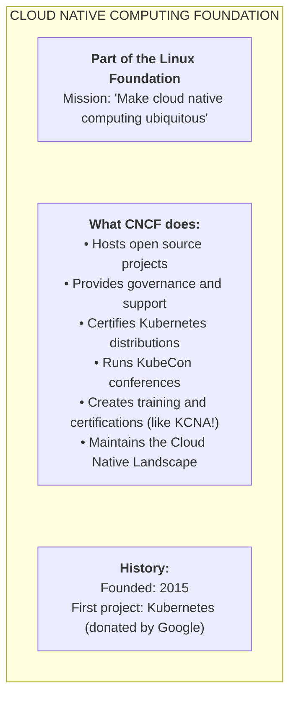
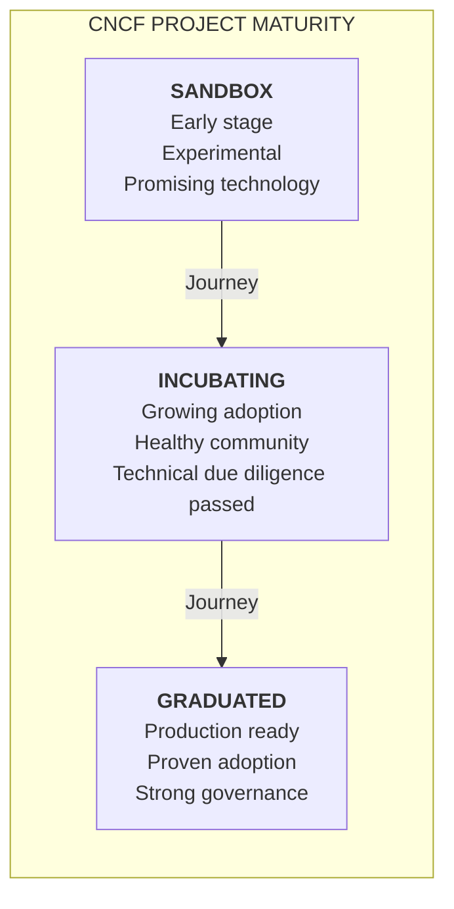
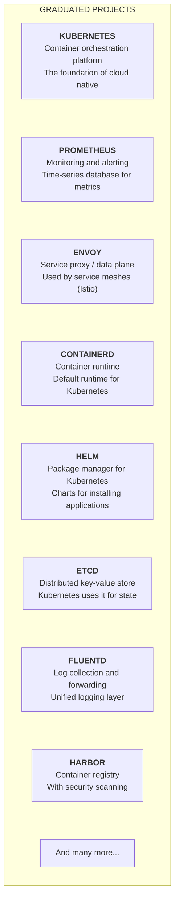
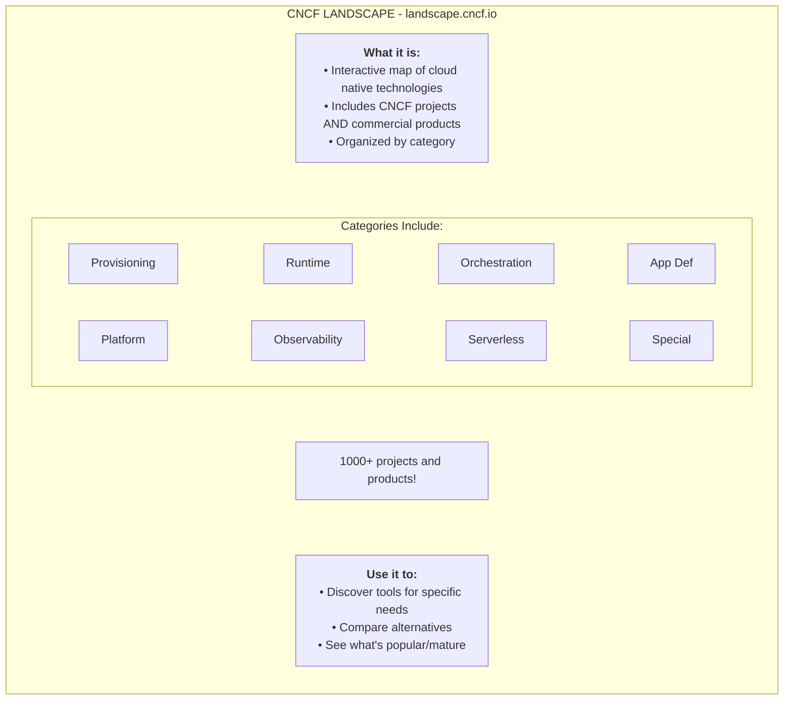
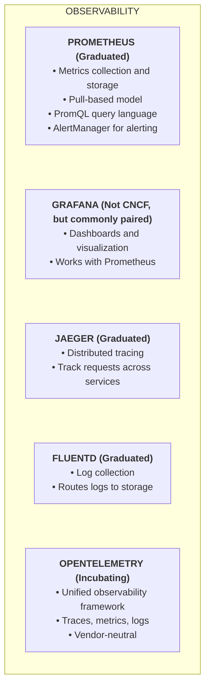
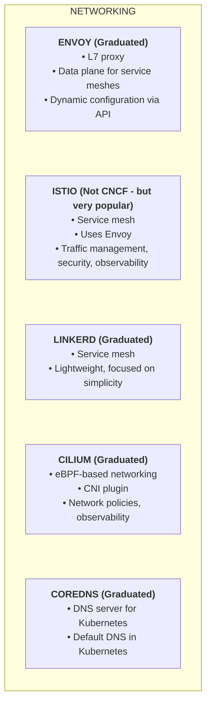
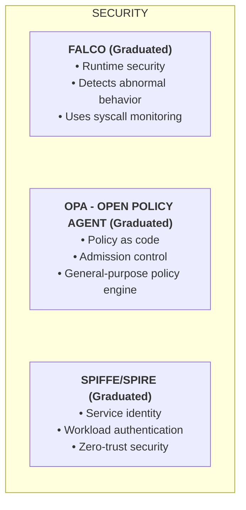
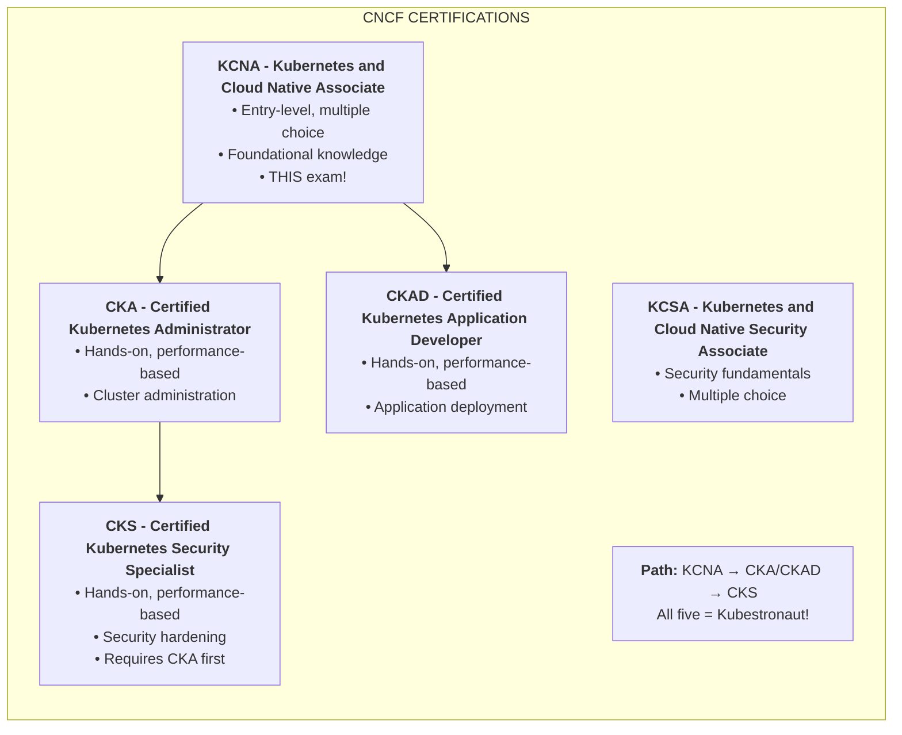

> **Complexity**: `[QUICK]` - Knowledge-based
>
> **Time to Complete**: 20-25 minutes
>
> **Prerequisites**: Module 3.1 (Cloud Native Principles)

---

## What You'll Be Able to Do

After completing this module, you will be able to:

1. **Explain** the CNCF's role in governing cloud native projects and Kubernetes
2. **Compare** project maturity levels: sandbox, incubating, and graduated
3. **Identify** key CNCF projects by category (monitoring, networking, storage, security)
4. **Evaluate** the CNCF landscape to find tools that solve specific infrastructure problems

---

## Why This Module Matters

The **Cloud Native Computing Foundation (CNCF)** is the home of Kubernetes and hundreds of other cloud native projects. KCNA tests your knowledge of the CNCF, its projects, and how they fit together. Understanding this ecosystem is essential.

---

## What is the CNCF?

---

## Project Maturity Levels

CNCF projects have three maturity levels:

---

> **Pause and predict**: CNCF has sandbox, incubating, and graduated project levels. If you were evaluating two monitoring tools -- one Graduated and one Sandbox -- for your company's production Kubernetes cluster, what does the maturity level tell you about risk, governance, and long-term viability?

## Key Graduated Projects

These are production-ready projects you should know:

### Project Categories

| Category | Examples |
|----------|----------|
| **Container Runtime** | containerd, CRI-O |
| **Orchestration** | Kubernetes |
| **Service Mesh** | Istio, Linkerd |
| **Observability** | Prometheus, Jaeger, Fluentd |
| **Storage** | Rook, Longhorn |
| **Networking** | Cilium, Calico, CoreDNS |
| **Security** | Falco, OPA, SPIFFE |
| **CI/CD** | Argo, Flux, Tekton |
| **Package Management** | Helm |

---

## The CNCF Landscape

---

## Key Projects to Know for KCNA

### Observability Stack

### Networking & Service Mesh

### Security

---

> **Stop and think**: The CNCF Landscape has over 1,000 entries, but not all of them are CNCF projects. Many are commercial products or projects hosted elsewhere. Why would the landscape include non-CNCF tools, and how could this be misleading for someone choosing production tooling?

## CNCF Certifications

---

## Did You Know?

- **Kubernetes was first** - Kubernetes was Google's first major open source donation to CNCF in 2015.

- **TOC decides graduation** - The Technical Oversight Committee (TOC) votes on which projects graduate based on adoption and technical criteria.

- **KubeCon is massive** - KubeCon + CloudNativeCon is one of the largest open source conferences, with 10,000+ attendees.

- **Landscape is huge** - The CNCF landscape has 1000+ projects and products. It can be overwhelming—focus on graduated/incubating projects first.

---

## Common Mistakes

| Mistake | Why It Hurts | Correct Understanding |
|---------|--------------|----------------------|
| Thinking all landscape tools are CNCF | Landscape includes non-CNCF tools | Check project affiliation |
| Ignoring maturity levels | May use experimental projects in prod | Prefer graduated for production |
| Confusing similar projects | Using wrong tool for the job | Understand project purposes |
| Memorizing all projects | There are too many | Focus on graduated ones |

---

## Quiz

1. **Your team needs a container registry with built-in vulnerability scanning and image signing for production use. A colleague suggests Docker Hub. What CNCF Graduated project is designed specifically for this use case, and what advantages does it offer over a public registry?**
   

   
Answer

   Harbor is a CNCF Graduated container registry that provides vulnerability scanning, image signing (with Notary/cosign), role-based access control, and image replication across registries. Unlike Docker Hub, Harbor can be self-hosted within your infrastructure, giving you control over where images are stored (important for compliance and data residency). It integrates with Trivy for scanning and supports OCI artifacts beyond container images. Its Graduated status means it has passed independent security audits and has proven production governance.
   

2. **A startup is evaluating two service mesh options: Linkerd (CNCF Graduated) and a newer mesh that just entered CNCF Sandbox with more features. The startup handles financial transactions. Which factors from the CNCF maturity model should guide their decision?**
   

   
Answer

   For financial transactions, the Graduated project (Linkerd) is the safer choice. Graduated status means: independent security audit completed, diverse maintainer base (no single-vendor dependency), proven production adoption across many organizations, and committed long-term governance. The Sandbox project may have attractive features, but it has not proven its security posture or governance resilience. Sandbox projects are early-stage experiments -- good for evaluation in non-critical environments, but risky for production financial workloads. Features matter less than stability and security when processing money.
   

3. **An engineer says "we need monitoring, so let's install Prometheus for metrics, Fluentd for logs, and Jaeger for traces." Map each tool to which observability pillar it serves and explain why all three are needed together rather than just one.**
   

   
Answer

   Prometheus serves the metrics pillar (numerical measurements over time -- CPU usage, request rates, error counts). Fluentd serves the logs pillar (event records with context -- error messages, audit trails, application events). Jaeger serves the traces pillar (request paths across distributed services -- which service is slow, where did the request fail). All three are needed because each answers a different question: metrics detect that something is wrong, traces locate where the problem is across services, and logs explain why the problem occurred. Using only one pillar leaves you blind to the other two dimensions.
   

4. **A developer asks why Kubernetes uses CoreDNS instead of just relying on the standard DNS server that comes with the operating system. What role does CoreDNS (a CNCF Graduated project) play specifically in Kubernetes?**
   

   
Answer

   CoreDNS is the cluster DNS server in Kubernetes. It provides DNS-based service discovery -- when a Pod looks up `backend.default.svc.cluster.local`, CoreDNS resolves it to the Service's ClusterIP. The host OS DNS server does not know about Kubernetes Services, Pods, or the `cluster.local` domain. CoreDNS watches the Kubernetes API to maintain an up-to-date mapping of Service names to IPs, enabling Pods to discover each other by name rather than hardcoded IP addresses. It is the default DNS server in Kubernetes and is essential for Service discovery to work.
   

5. **After passing KCNA, you want to pursue more Kubernetes certifications. You have a developer background and want to eventually earn all five for Kubestronaut status. In what order should you take the remaining certifications, and why does CKS require CKA first?**
   

   
Answer

   A recommended path after KCNA: take CKAD (since you have a developer background, application development is the natural next step), then CKA (administration skills build on your CKAD experience), then CKS (security specialization). KCSA can be taken at any time since it is multiple-choice like KCNA. CKS requires a valid CKA certification because security hardening requires hands-on cluster administration skills -- you need to know how to configure RBAC, admission controllers, and audit logging before you can secure them. The Kubestronaut title requires all five to be valid simultaneously.
   

---

## Summary

**CNCF**:
- Cloud Native Computing Foundation
- Part of Linux Foundation
- Hosts Kubernetes and 100+ projects

**Project maturity**:
- Sandbox → Incubating → Graduated
- Graduated = production ready

**Key projects by category**:
- **Orchestration**: Kubernetes
- **Runtime**: containerd
- **Observability**: Prometheus, Jaeger, Fluentd
- **Networking**: Envoy, CoreDNS, Cilium
- **Security**: Falco, OPA
- **Package management**: Helm

**Certifications**:
- KCNA → CKA/CKAD → CKS
- All five = Kubestronaut

---

## Next Module

[Module 3.3: Cloud Native Patterns](../module-3.3-patterns/) - Service mesh, serverless, and other cloud native architectural patterns.