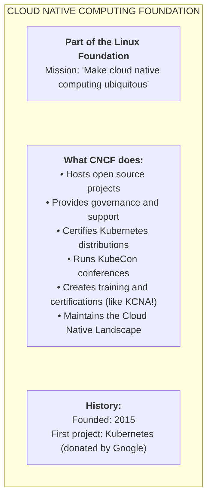
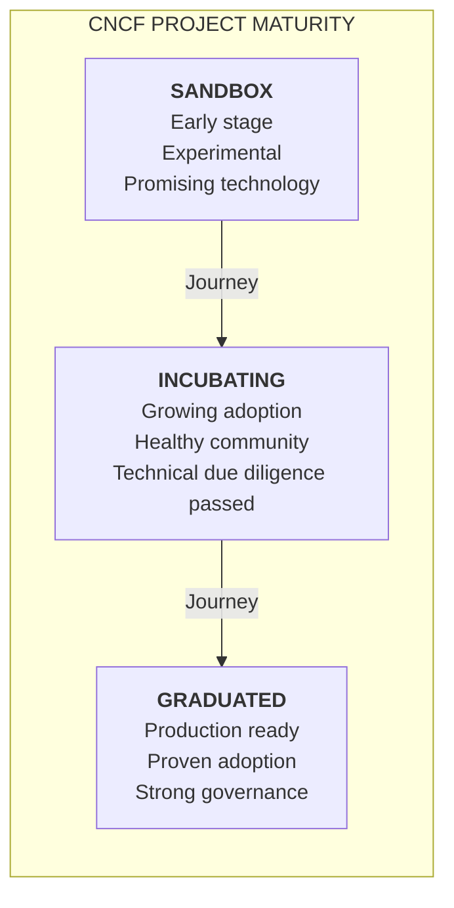
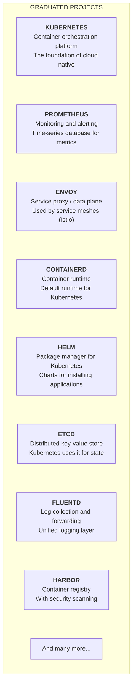
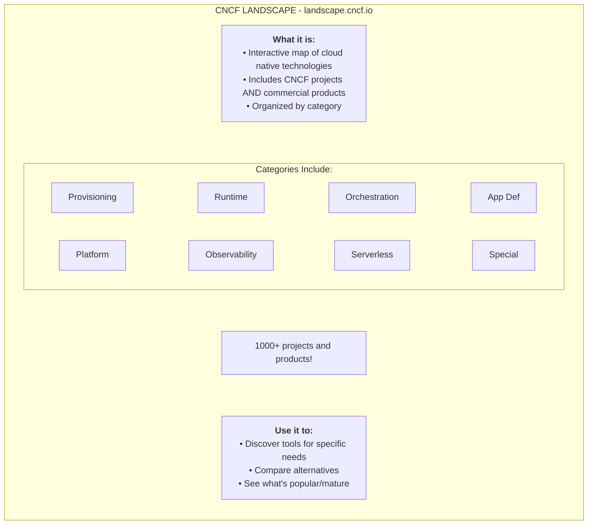
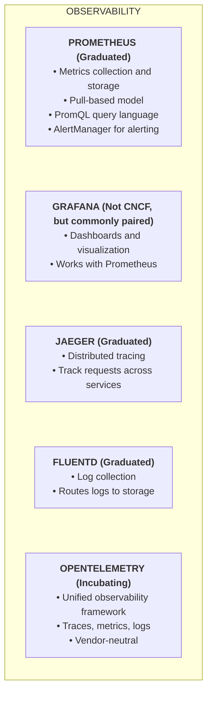
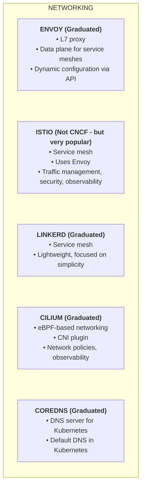
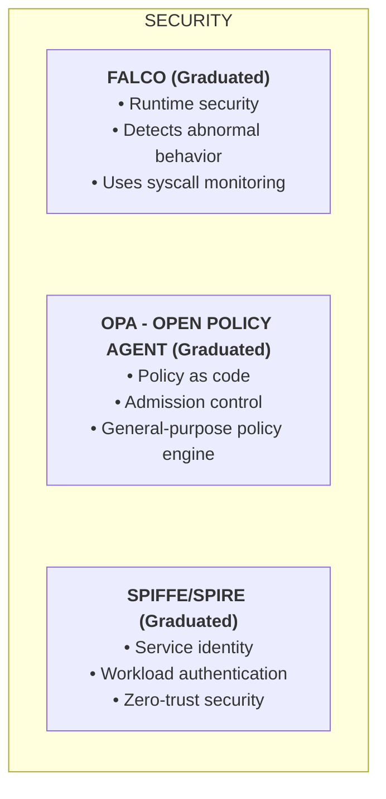
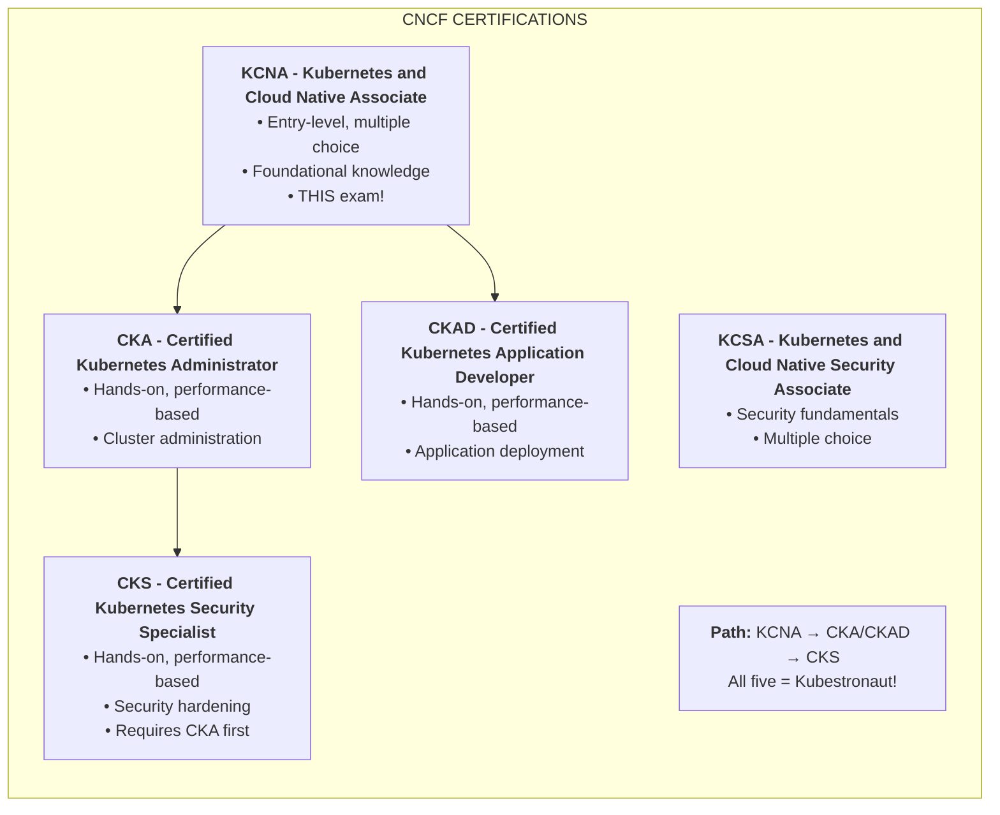

# Module 3.2: CNCF Ecosystem

> **Complexity**: `[QUICK]` - Knowledge-based
>
> **Time to Complete**: 35-45 minutes
>
> **Prerequisites**: Module 3.1 (Cloud Native Principles)
>
> **Focus**: ecosystem navigation, maturity signals, tool categories, and practical production selection tradeoffs.

## Learning Outcomes

After completing this module, you will be able to make defensible ecosystem decisions instead of memorizing project names without operational context.

1. **Evaluate** CNCF project maturity signals when selecting tools for production Kubernetes 1.35+ platforms.
2. **Compare** CNCF ecosystem projects across observability, networking, storage, security, runtime, and delivery categories.
3. **Design** a practical tool-selection path through the CNCF Landscape without treating every listed product as equally governed.
4. **Diagnose** risky architecture choices caused by confusing CNCF-hosted projects, commercial landscape entries, and Kubernetes defaults.
5. **Implement** a lightweight CNCF evaluation checklist using `alias k=kubectl` and the `k` shortcut for cluster discovery.

## Why This Module Matters

A payments company once traced a costly outage to a tooling decision that looked harmless during a migration planning meeting. The platform team had replaced a boring, well-understood logging path with a newer collector because the project appeared in a cloud native landscape view beside familiar names. When production traffic surged, the collector's operational behavior was still unfamiliar to the team, the escalation path was unclear, and engineers spent hours separating a product listing from a governed project relationship. The incident was not caused by open source itself. It was caused by reading an ecosystem map as if it were a production-readiness guarantee.

That failure pattern is common because the cloud native world is large, fast-moving, and full of overlapping names. Kubernetes is only one project in a larger ecosystem that includes runtimes, registries, network plugins, service meshes, policy engines, observability systems, delivery tools, and security projects. Some are hosted by the Cloud Native Computing Foundation, some are merely adjacent, some are commercial offerings, and some are defaults in a Kubernetes distribution without being the only defensible choice. A KCNA candidate does not need to memorize every logo, but a working engineer must learn how to ask better questions than "is this popular?"

This module teaches the CNCF as a governance and ecosystem lens, not as a catalog to memorize. You will connect maturity levels to operational risk, map common projects to the problems they solve, and practice using the landscape as a discovery tool while keeping production judgment intact. By the end, you should be able to explain why a project such as Kubernetes, Prometheus, Envoy, containerd, Helm, CoreDNS, Falco, Open Policy Agent, SPIFFE, or Fluentd appears in cloud native conversations, and you should also be able to say what its presence does not prove.

## What the CNCF Actually Does

The Cloud Native Computing Foundation is part of the Linux Foundation, and its most visible role is hosting Kubernetes and many related open source projects. Hosting does not mean the CNCF writes every line of code or chooses every feature. It means the foundation provides neutral governance structures, trademark stewardship, community processes, project services, event programs, certification programs, and a public home where vendors and individuals can collaborate without one company owning the entire table. That neutrality matters because cloud native infrastructure usually spans many vendors, clouds, operating systems, and organizational boundaries.

Think of the CNCF as a public workshop and standards town square rather than a single product company. A product company can optimize for its roadmap, sales motion, or proprietary integration path. A foundation has a different job: it reduces coordination risk for shared infrastructure that many competitors depend on. Kubernetes benefited from that arrangement because many vendors could build distributions, services, integrations, and training around a common upstream project without presenting every collaboration as a bilateral business deal.

This distinction is useful when you read project pages. A CNCF project is not automatically the right tool for your cluster, and a non-CNCF project is not automatically unsafe. The foundation gives you signals about governance, community health, maturity, and ecosystem adoption, but you still need to evaluate fit, maintenance effort, security posture, and operational complexity. In a production platform, those signals are inputs to a decision, not a substitute for one.

The CNCF also maintains certifications and conformance programs that reduce ambiguity around Kubernetes itself. Certified Kubernetes distributions must pass conformance tests, which helps teams trust that core API behavior will be portable across conformant offerings. That does not make every cluster identical, because cloud load balancers, storage classes, networking defaults, identity systems, and upgrade processes still vary. It does give teams a common baseline for Kubernetes API expectations, which is essential when applications move between local development, managed services, and enterprise platforms.

Pause and predict: if two vendors both sell "Kubernetes platforms," but only one emphasizes upstream conformance and clear CNCF project relationships, what extra questions would you ask before moving a regulated workload? A mature answer would separate API compatibility, operational support, governance, security patch flow, and the vendor's added components. Those categories prevent you from treating a familiar logo as a complete risk assessment.

For KCNA, you should remember that the CNCF's mission is broader than Kubernetes while still recognizing Kubernetes as the foundation's first and most influential project. The exam expects you to know the foundation's role, broad project categories, maturity vocabulary, the Cloud Native Landscape, and the relationship between certifications such as KCNA, KCSA, CKA, CKAD, and CKS. In the real world, the same knowledge helps you avoid tool selection by name recognition alone.

## Project Maturity Levels

CNCF maturity levels are a shorthand for how much confidence the foundation has in a project's adoption, governance, and operational readiness. The three public stages are Sandbox, Incubating, and Graduated. They do not measure whether the code is clever, whether a demo is impressive, or whether a vendor has a strong conference booth. They measure whether a project has moved from early exploration toward broader production use, stronger maintainership, clearer governance, and more demanding technical due diligence.

Sandbox projects are where promising ideas can enter the CNCF community before they have proven broad production use. That stage can be healthy and valuable, especially when a team wants to learn an emerging pattern or contribute early. It is also a warning against assuming production readiness. If a payment processor, hospital platform, or public-sector identity service depends on a Sandbox component, the engineering team should have a deliberate reason, a rollback plan, and enough internal expertise to own the risk.

Incubating projects sit in the middle. They have shown more adoption, stronger governance, and enough technical seriousness to pass a higher bar than Sandbox. Incubating does not mean perfect or simple. It means the project has evidence that it can sustain a larger user base and maintain a healthier community. For many organizations, Incubating projects can be reasonable production choices when the use case is strong and the team has done the normal due diligence around security, upgrades, support, and integration.

Graduated projects have cleared the CNCF's highest maturity stage. They usually have broad adoption, documented governance, active maintainers from more than one organization, security practices, and a track record of production use. Graduated status still does not remove operational work. Prometheus, Envoy, containerd, Kubernetes, Helm, and CoreDNS all require design decisions, capacity planning, upgrades, and human judgment. Graduation tells you the project is no longer merely a promising experiment; it does not tell you that your team can run it well by installing defaults.

The practical way to use maturity is to connect it to blast radius. A Sandbox project might be acceptable in a non-critical developer portal, a research environment, or an isolated observability experiment. The same project might be a poor choice in the request path for financial transactions. A Graduated project might be a better default for core networking, service discovery, cluster state, runtime behavior, or alerting, because a failure in those areas can affect every application on the platform.

Pause and predict: CNCF has Sandbox, Incubating, and Graduated project levels. If you were evaluating two monitoring tools, one Graduated and one Sandbox, for your company's production Kubernetes cluster, what does the maturity level tell you about risk, governance, and long-term viability? The useful answer is not simply "choose Graduated." The useful answer is that Graduated lowers governance and adoption risk, while Sandbox demands a stronger local justification, a narrower deployment scope, and a clearer exit strategy.

A good engineering review also looks beyond the stage label. Ask whether maintainers respond to security issues, whether releases are predictable, whether upgrade notes are clear, whether the project has production case studies similar to your environment, and whether your team understands the failure modes. Maturity levels make the first filter easier, but the final decision still belongs to the people who will operate the system at 03:00 when an alert fires.

## Key Graduated Projects and Categories

The CNCF ecosystem is easier to learn when you group projects by the infrastructure problem they solve. Kubernetes orchestrates workloads, containerd runs containers, etcd stores Kubernetes state, CoreDNS provides service discovery, Envoy proxies traffic, Prometheus stores metrics, Fluentd forwards logs, Helm packages Kubernetes resources, and Harbor provides a registry with enterprise controls. Each project has its own scope, and confusing those scopes is one of the fastest ways to design a platform that looks complete on a diagram but fails during operations.

Start with the runtime path because it sits underneath nearly every workload. Kubernetes schedules Pods and reconciles desired state, but it does not directly implement every low-level container operation itself. A container runtime such as containerd handles the mechanics of pulling images, managing containers, and interacting with the host runtime environment through Kubernetes interfaces. That separation lets Kubernetes focus on orchestration while the runtime focuses on container lifecycle details. In production, runtime choice affects image behavior, node troubleshooting, security hardening, and upgrade planning.

The control-plane state path is equally important. Kubernetes stores cluster state in etcd, and that means etcd health is cluster health. A team that treats etcd as an invisible implementation detail may discover too late that backup, restore, latency, disk performance, and quorum behavior determine whether a control plane can recover cleanly. KCNA will not ask you to administer etcd like CKA might, but you should know why it appears in the CNCF ecosystem and why it is not interchangeable with an application database.

The service discovery path introduces CoreDNS. In a Kubernetes cluster, Pods should not depend on hardcoded Pod IP addresses because Pods are ephemeral. CoreDNS integrates with the Kubernetes API so a workload can resolve names such as a Service DNS name instead of chasing changing endpoints. That is a cloud native pattern in miniature: applications depend on a stable abstraction, while platform components continuously reconcile the changing infrastructure underneath.

Observability projects answer different questions. Prometheus collects and stores numeric time-series metrics, which are excellent for alerting on symptoms such as latency, error rate, saturation, and resource usage. Fluentd collects and forwards logs, which carry event context and application messages. Jaeger helps trace a request across distributed services. OpenTelemetry provides vendor-neutral APIs, SDKs, and collectors for telemetry signals. These tools complement each other because a metric can tell you something is wrong, a trace can narrow where it happened, and logs can explain why.

Networking and service-mesh projects sit in the request path, so their risk profile deserves extra attention. Envoy is a high-performance proxy often used as a data plane for service meshes. Linkerd is a CNCF Graduated service mesh with a focus on simplicity, while Istio is widely used and associated with Envoy even though the ecosystem relationship is more nuanced than "all service mesh equals CNCF." Cilium brings eBPF-based networking, policy, and observability capabilities into the cluster networking conversation. The names matter less than the operating question: who owns traffic behavior when a request fails?

Security projects cover different layers, not one magic shield. Falco detects suspicious runtime behavior, Open Policy Agent provides policy as code, and SPIFFE with SPIRE gives workloads a consistent identity model. These projects can support zero-trust architecture, admission control, runtime detection, and workload authentication, but they need policies, ownership, and response processes. Installing a security project without deciding who responds to findings is like installing a smoke detector without giving anyone responsibility for evacuation.

### Project Categories

| Category | Examples |
|----------|----------|
| **Container Runtime** | containerd, CRI-O |
| **Orchestration** | Kubernetes |
| **Service Mesh** | Istio, Linkerd |
| **Observability** | Prometheus, Jaeger, Fluentd |
| **Storage** | Rook, Longhorn |
| **Networking** | Cilium, Calico, CoreDNS |
| **Security** | Falco, OPA, SPIFFE |
| **CI/CD** | Argo, Flux, Tekton |
| **Package Management** | Helm |

This category table is a learning aid, not a shopping list. Some entries are CNCF-hosted projects, some are common cloud native projects, and some may have different governance homes or statuses over time. A tool's category tells you the problem domain; its project page, maturity level, maintainers, release history, and integration model tell you whether it belongs in your platform. When KCNA asks you to identify a project category, answer the category. When your team asks whether to adopt a project, answer with evidence.

A practical way to remember the categories is to follow a request and a deployment from source to runtime. A delivery tool packages or applies manifests, Helm may template and install the application, Kubernetes schedules it, containerd runs the container, CoreDNS helps it find peers, Cilium or another networking layer moves traffic, Envoy or a mesh may proxy requests, Prometheus and tracing tools observe behavior, Falco and policy tools watch for violations, and storage projects provide persistent data paths. The ecosystem is a chain of responsibilities, not a pile of unrelated logos.

Before running this mentally in your own platform, what output do you expect if you list the components your cluster depends on and group them by category? Many teams discover duplicated responsibilities, such as two policy systems with unclear ownership or three observability collectors sending overlapping data. That discovery is useful because complexity is often hidden at category boundaries. The goal is not to reduce every platform to one project per row; the goal is to make every overlap intentional.

## The CNCF Landscape as a Discovery Tool

The CNCF Landscape is an interactive map of cloud native technologies. It is useful because the ecosystem is too large for one person to hold in memory, and because categories help you discover alternatives when a problem is specific but your starting point is vague. For example, "we need better supply-chain security" is not one tool decision. It may involve registry policy, image signing, vulnerability scanning, admission control, software bills of materials, workload identity, and runtime detection. A landscape view helps you explore those neighborhoods.

The most important warning is already inside the diagram: the landscape includes CNCF projects and commercial products. That is helpful for discovery, but it can mislead beginners who treat everything on the map as foundation-hosted or production-vetted. A logo on the landscape might represent a vendor product, a related open source project, a foundation project, or an ecosystem service. The map tells you "this belongs in the conversation." It does not tell you "this is governed by CNCF" or "this is ready for your production cluster."

Use the landscape in three passes. First, identify the category that matches the problem you actually have, such as observability, runtime, storage, networking, application definition, provisioning, or security. Second, separate CNCF-hosted projects from non-hosted entries and note maturity levels where they exist. Third, compare the remaining candidates against your constraints: managed versus self-hosted, compliance requirements, staff experience, integration with Kubernetes 1.35+ APIs, upgrade cadence, support model, and failure blast radius.

This approach prevents a common mistake: starting with a tool name and then inventing a justification. Better selection starts with the operational problem. If your problem is "developers cannot tell which service caused latency," the category may point toward tracing and telemetry. If your problem is "teams deploy unsigned images," the category points toward registry, signing, admission, and policy controls. If your problem is "cluster DNS failures break every namespace," the category tells you to study CoreDNS and service discovery, not to begin with dashboards.

Stop and think: the CNCF Landscape has over 1,000 entries, but not all of them are CNCF projects. Many are commercial products or projects hosted elsewhere. Why would the landscape include non-CNCF tools, and how could this be misleading for someone choosing production tooling? The balanced answer is that a broad ecosystem map helps discovery and comparison, but it must be paired with governance checks, maturity checks, and architecture review before adoption.

War story: a platform team at a media company once adopted two adjacent delivery tools because both appeared in the same landscape category and both had strong community attention. The first tool reconciled desired state from Git, while the second managed progressive rollout behavior. That combination can be valid, but the team had not defined ownership boundaries, so failed releases produced conflicting signals and two teams each assumed the other system was authoritative. The post-incident fix was not "remove one logo"; it was to document the control loop each tool owned, the alert each team owned, and the rollback path each service followed.

You can practice the same discipline with a simple checklist. For each candidate, write the problem it solves in one sentence, the Kubernetes object or runtime path it touches, the maturity or governance signal you can verify, the failure mode you most fear, and the person or team who will operate it. If you cannot fill in those fields, you are still in discovery. That is fine, but it means the tool should not move into the critical path yet.

## Key Projects to Know for KCNA

KCNA does not require deep administration of every project, but it does expect pattern recognition. You should be able to hear a scenario and connect it to likely project categories. A question about time-series metrics points toward Prometheus. A question about request traces points toward Jaeger or OpenTelemetry. A question about logs points toward Fluentd or related collectors. A question about package installation points toward Helm. A question about service discovery inside Kubernetes points toward CoreDNS. A question about policy as code points toward Open Policy Agent.

### Observability Stack

Prometheus is usually the first observability project KCNA learners meet because Kubernetes platforms need metrics. Its pull model, labels, and PromQL query language make it powerful for alerting and operational dashboards. It is not a general-purpose log system, and it is not a distributed trace viewer. That limitation is a strength when used correctly: Prometheus is optimized for numeric time series, so teams can ask precise questions about rates, errors, duration, and saturation without mixing every event record into the same store.

Jaeger and OpenTelemetry belong to a different part of the story. Distributed tracing helps you follow one request through several services, which matters when a user-facing action touches an API gateway, authentication service, payment service, inventory service, and database adapter. OpenTelemetry standardizes how applications create and export telemetry, which reduces vendor lock-in and makes instrumentation more portable. In many modern designs, OpenTelemetry collects or emits signals while backends such as Prometheus-compatible metrics stores, tracing systems, and log platforms handle storage and analysis.

Fluentd and related log collectors help move event records from workloads to destinations where humans and systems can inspect them. Logs are verbose and contextual, which makes them useful during debugging but expensive if handled carelessly. A strong platform design decides what logs are collected, how sensitive data is filtered, how retention works, and how developers query logs during incidents. The CNCF label does not solve those policy choices; it gives you a trusted project around which to design them.

Grafana appears in many Kubernetes conversations because it is commonly paired with Prometheus, but the diagram correctly notes that common pairing is not the same as CNCF project status. This is an important exam and engineering distinction. The cloud native ecosystem includes tools that are popular, useful, and widely adopted without being CNCF-hosted. When you compare projects, avoid turning governance status into a moral judgment. Instead, state the relationship accurately and then evaluate the operational fit.

### Networking & Service Mesh

Networking projects are high leverage because they sit between services. Envoy is an L7 proxy, which means it understands application-layer protocols and can participate in retries, routing, load balancing, telemetry, and security policy. A service mesh often deploys a proxy data plane and a control plane that configures proxy behavior. That design can unlock strong traffic management and identity patterns, but it also adds moving parts to every request. The right question is not "should every platform have a mesh?" The right question is "what traffic problem justifies this operational cost?"

CoreDNS is less flashy but fundamental. Kubernetes service discovery depends on DNS names that map to Services and endpoints inside the cluster. When developers say one Pod can reach another by a stable service name, CoreDNS is part of that experience. If CoreDNS fails, applications may appear broken even though their containers are running. That is why service discovery belongs in platform reliability conversations, not only in exam flash cards.

Cilium shows how cloud native networking continues to evolve. Its eBPF foundation allows networking, security, and observability features to happen efficiently in the Linux kernel path. That capability is powerful, but it also requires teams to understand kernel version requirements, datapath behavior, network policies, and integration with managed Kubernetes offerings. A mature platform review compares the feature value against the expertise required to troubleshoot it.

Service mesh choices are especially prone to cargo-cult adoption. A team hears that large technology companies use a mesh and assumes the pattern is mandatory. In reality, a mesh is useful when you need consistent mTLS, fine-grained traffic policy, retries, telemetry, or progressive delivery across many services and teams. For a small internal application with simple traffic, the mesh may add more risk than value. CNCF maturity can guide which projects are safer bets, but architecture still begins with the workload.

### Security

Security projects often look overlapping until you map them to moments in the workload lifecycle. Open Policy Agent can evaluate policy decisions, including admission decisions before a workload enters the cluster. Falco watches runtime behavior and can detect suspicious activity after workloads are running. SPIFFE and SPIRE address workload identity, helping systems authenticate workloads consistently across environments. These are different controls at different times, and a mature architecture can use more than one without pretending they solve the same problem.

Policy as code is especially valuable because it turns hidden platform rules into reviewable artifacts. If a company forbids privileged containers, requires approved registries, or mandates labels for ownership, admission policy can enforce those rules before risky resources are accepted. The tradeoff is that policy can block delivery if rules are unclear, untested, or owned by a team that does not collaborate with application developers. A good platform treats policy as a product interface, with documentation, examples, exception paths, and auditability.

Runtime detection solves a different problem. Even well-reviewed workloads can behave unexpectedly because of vulnerabilities, misconfiguration, compromised dependencies, or human mistakes. Falco-style detection helps surface behavior such as unusual shell activity, sensitive file access, or unexpected network actions. Detection is not prevention by itself. It becomes useful when alerts are tuned, routed, investigated, and connected to incident response playbooks.

Workload identity gives distributed systems a safer way to authenticate services than static shared secrets. SPIFFE defines a standard identity format, and SPIRE can issue and rotate identities for workloads. That matters when services span clusters, clouds, or trust domains. As with every security control, the project is only part of the answer. Teams still need threat models, key management practices, monitoring, and ownership for identity lifecycle decisions.

### CNCF Certifications

CNCF certifications form a learning path, but they test different depths. KCNA and KCSA are associate-level exams focused on foundational knowledge. CKA, CKAD, and CKS are performance-based exams that require hands-on work in a live environment. That difference matters when you plan your study. KCNA asks you to recognize concepts and reason about ecosystem roles, while CKA asks you to administer clusters, CKAD asks you to build and troubleshoot applications, and CKS asks you to secure Kubernetes with administrator-level competence.

The certification path also reinforces why ecosystem knowledge is not trivia. A developer preparing for CKAD benefits from knowing Helm, container images, service discovery, and observability. An administrator preparing for CKA benefits from knowing container runtimes, CoreDNS, etcd, networking, and storage. A security engineer preparing for KCSA or CKS benefits from knowing policy, runtime detection, workload identity, and supply-chain concepts. KCNA gives you the map before later exams ask you to drive through specific neighborhoods.

## Patterns & Anti-Patterns

For a quick module, the most useful pattern is category-first selection. Start by naming the operational problem, then choose the category, then evaluate projects inside that category. This pattern works because it keeps teams from chasing logos before they agree on the failure they are trying to prevent. For example, "we need observability" is too broad, but "we need to alert on API error rate and latency" points toward metrics, while "we need to find which service slowed a checkout request" points toward tracing.

Another strong pattern is maturity-aware rollout. A Graduated project can often enter a broader proof of concept sooner, while a Sandbox project should usually start in a narrow, reversible environment. This does not punish innovation; it protects production from avoidable surprises. Teams that document the maturity level, expected blast radius, support model, and rollback path are more likely to adopt useful new projects without confusing experimentation with platform commitment.

A third pattern is explicit ownership by responsibility. If Prometheus alerts, someone owns the alert rules and routing. If CoreDNS is critical, someone owns service discovery health. If Open Policy Agent blocks deployments, someone owns policy review and exception handling. CNCF projects are building blocks, but building blocks do not assign on-call duties. Production platforms become reliable when each component has a clear owner, a monitoring path, and an upgrade plan.

The matching anti-pattern is logo-driven architecture. This happens when a diagram is built from popular project names rather than user needs, platform constraints, and team capacity. It is tempting because the ecosystem is exciting and conference talks make tools look finished. The better alternative is to write the workload problem first, then justify each component with the category it serves and the operational burden it adds.

Another anti-pattern is treating maturity as the only decision input. A Graduated project can still be the wrong choice if it solves the wrong problem, conflicts with your managed platform, or exceeds your team's capacity. A Sandbox project can be reasonable for a contained experiment with strong ownership. Maturity reduces uncertainty; it does not erase context. The better alternative is to combine maturity with architecture fit, supportability, security posture, and blast-radius analysis.

A final anti-pattern is installing controls without response paths. Teams sometimes deploy policy engines, runtime detectors, scanners, or tracing systems and assume the platform is safer because dashboards exist. In practice, an ignored alert is just a noisy log line with better branding. The better alternative is to define who reviews findings, which findings block releases, how exceptions are approved, and how evidence is retained for later audit or incident review.

## Decision Framework

Use CNCF maturity and the landscape as a funnel. The first question is the problem category: runtime, orchestration, observability, networking, security, storage, delivery, registry, or application definition. The second question is whether the tool is CNCF-hosted, merely listed in the landscape, or outside the foundation entirely. The third question is maturity and adoption. The fourth question is operational fit: who runs it, how it fails, how it upgrades, and how it integrates with Kubernetes 1.35+ clusters you actually operate.

For production-critical paths, prefer boring evidence over novelty. Core request routing, DNS, container runtime behavior, cluster state, identity, and alerting should favor projects and products with strong adoption, clear governance, security practices, and support routes. That does not mean every tool must be Graduated, but it does mean the burden of proof rises as blast radius rises. A Sandbox project in a core request path needs a better reason than "the feature list is longer."

For learning, innovation, or isolated internal workflows, the decision can be more flexible. Sandbox and Incubating projects are valuable places to explore emerging patterns, especially when the deployment is reversible and the team is ready to contribute feedback. The key is honesty about the environment. A lab, developer experience add-on, or non-critical reporting pipeline can tolerate more experimentation than an admission controller that blocks every production deployment.

When two tools appear to solve the same problem, compare their control loops. Ask what Kubernetes resources they watch, what they change, where their desired state lives, and what happens when their controller is down. Many cloud native incidents come from overlapping controllers that each believe they are responsible for the same outcome. A decision framework that includes control-loop ownership will catch risks that a feature checklist misses.

The final decision should produce a short written record. State the selected category, the chosen project or product, its CNCF relationship, its maturity signal, the alternatives considered, the expected failure mode, the owner, and the first rollback step. This record does not need to be bureaucratic. It needs to be specific enough that another engineer can understand why the choice was made and what must be watched after adoption.

One more useful test is to imagine the project failing at the worst possible moment. If a registry is unavailable, can workloads still roll out from cached images, or does every deployment stop? If DNS is unstable, do application owners know how to distinguish service discovery failure from application failure? If policy blocks a release, is there an emergency exception path that leaves an audit trail? These questions turn abstract ecosystem knowledge into readiness evidence.

Finally, decide what kind of dependency you are accepting. Some projects are direct runtime dependencies, some are management-plane dependencies, some are developer workflow dependencies, and some are observability or audit dependencies. The same maturity signal means different things in each position. A dashboard outage may be tolerable for a short period, while a DNS or admission-control outage can stop the platform immediately. That dependency class should shape your rollout pace more than enthusiasm for any individual project.

## Did You Know?

- **Kubernetes was first** - Kubernetes was Google's first major open source donation to CNCF in 2015.

- **TOC decides graduation** - The Technical Oversight Committee reviews project progress and votes on maturity movement based on adoption, governance, and technical criteria.

- **KubeCon is massive** - KubeCon + CloudNativeCon events regularly draw thousands of open source practitioners, vendors, maintainers, and platform engineers into the same ecosystem conversation.

- **Landscape is huge** - The CNCF landscape has 1000+ projects and products, so useful navigation starts with categories and maturity filters rather than memorization.

## Common Mistakes

| Mistake | Why It Happens | How to Fix It |
|---------|----------------|---------------|
| Thinking every landscape entry is a CNCF project | The landscape mixes CNCF-hosted projects, vendor products, and related ecosystem tools in one visual map. | Open the project page, confirm foundation status, and record whether the tool is hosted, listed, or merely adjacent. |
| Choosing a Sandbox project for a critical path without a risk plan | Teams focus on features and forget that early maturity can mean fewer production references and less governance history. | Limit early use to low-blast-radius environments or document the ownership, rollback, and support plan before production. |
| Treating Graduated status as automatic fit | Maturity proves community and governance strength, not that the tool matches your architecture or team skills. | Compare the project scope, failure modes, upgrade process, and staff experience against the problem you need to solve. |
| Confusing observability pillars | Metrics, logs, and traces are often grouped together, so learners assume one tool can answer every incident question. | Map Prometheus to metrics, Fluentd to logs, Jaeger or OpenTelemetry to traces, then design how the signals work together. |
| Mixing service mesh and CNI responsibilities | Both affect traffic, but they operate at different layers and expose different controls. | Identify whether the problem is pod networking, network policy, L7 routing, identity, telemetry, or progressive delivery. |
| Installing policy or security tools without owners | A tool may produce alerts or blocks, but nobody has defined review, exception, or incident response paths. | Assign owners, escalation rules, exception workflows, and success metrics before enforcing controls broadly. |
| Memorizing project names without categories | The ecosystem is too large, and isolated names do not help during scenario questions or design reviews. | Study by category and user problem, then connect representative projects to the responsibility they carry. |

## Quiz

Your team needs a container registry with vulnerability scanning and access controls for production images. A colleague suggests using a public registry alone because it is familiar. Which CNCF ecosystem project should you evaluate, and what production concerns should drive the decision?

Harbor is the CNCF Graduated project designed for an enterprise container registry use case. The important reasoning is not only that Harbor can store images, but that production platforms often need access control, vulnerability scanning integration, replication, retention, and governance around where artifacts live. A public registry may still be useful for public images, but private production images usually need stronger organizational control. The decision should compare compliance, availability, operational ownership, and integration with admission or signing policies.

A startup is comparing Linkerd, which is CNCF Graduated, with a newer Sandbox service mesh that has more features. The workload processes financial transactions. How should CNCF maturity influence the recommendation?

Graduated maturity should carry significant weight because the service mesh sits directly in the request path for high-value transactions. Linkerd's maturity signal suggests broader adoption, stronger governance, and a longer production track record, while a Sandbox mesh should require a narrower experiment and a clear rollback plan. The answer is not that Sandbox projects are bad; it is that their uncertainty must match the blast radius. For financial traffic, stability, security practices, and operational familiarity usually matter more than a longer feature list.

An engineer proposes Prometheus for metrics, Fluentd for logs, and Jaeger for traces after an outage where nobody could explain slow requests. How do these projects divide responsibility, and why is that division useful?

Prometheus handles numeric time-series metrics such as request rate, error rate, latency, and saturation, which are strong signals for alerting and trend analysis. Fluentd handles log collection and forwarding, which preserves contextual event records that help explain application behavior. Jaeger handles distributed tracing, which follows one request across multiple services to show where time was spent. The division is useful because incidents usually require symptom detection, path localization, and contextual explanation rather than a single generic data stream.

A developer asks why Kubernetes uses CoreDNS instead of relying only on the node operating system's DNS resolver. What role does CoreDNS play in Kubernetes service discovery?

CoreDNS knows how to resolve Kubernetes Service names because it integrates with the Kubernetes API and the cluster DNS domain. The node operating system's normal resolver does not automatically know that a name such as a service in a namespace should resolve to a Service address. CoreDNS turns changing cluster endpoints into stable names that applications can use. That makes it a core reliability dependency even though it is easy to overlook when everything is healthy.

Your architecture review finds a product listed in the CNCF Landscape, and one teammate argues that this proves it is CNCF governed and production ready. How do you diagnose the misunderstanding?

The misunderstanding is treating the landscape as a certification or maturity guarantee. The landscape is a discovery map that includes CNCF projects, non-CNCF open source projects, and commercial products, so listing alone does not prove foundation hosting or production readiness. The correct diagnosis is to check the project's actual relationship to CNCF, its maturity level if applicable, its maintainers, release history, security posture, and operational fit. The review should separate "belongs in this ecosystem category" from "safe for our critical path."

A platform team wants to implement a lightweight CNCF evaluation checklist before adopting a new network policy tool. What should the checklist include beyond the tool name?

The checklist should include the problem category, the Kubernetes or runtime path touched, CNCF relationship, maturity signal, alternatives considered, expected failure mode, owner, support route, and rollback step. Network policy affects traffic behavior, so the team should also identify how the tool interacts with the CNI, observability, and existing security controls. A good checklist keeps the adoption discussion grounded in operational risk rather than feature excitement. It also gives future reviewers a concise record of why the choice was made.

After KCNA, a developer wants to continue toward hands-on Kubernetes certifications and eventually earn all five major CNCF Kubernetes credentials. Which path makes sense, and why does CKS require CKA first?

A developer often takes CKAD next because it focuses on application deployment, configuration, and troubleshooting, then CKA to deepen cluster administration, and then CKS for security specialization. KCSA can be taken independently because it is an associate security exam rather than a hands-on administration prerequisite. CKS requires CKA because security hardening depends on administrator-level cluster skills such as RBAC, audit logging, admission control, and control-plane configuration. The path should match the learner's role, but the prerequisite reflects the operational depth needed for security work.

## Hands-On Exercise

This exercise builds a compact evaluation worksheet for CNCF ecosystem choices. You do not need a large cluster, and you do not need to install new projects. If you have access to any Kubernetes 1.35+ learning cluster, use it for the discovery tasks. If you do not, complete the written parts and treat the commands as examples to run later. Before using the shortcut, define it in your shell with `alias k=kubectl`; the rest of the exercise uses `k` as the Kubernetes command.

The goal is to practice thinking like a platform reviewer. You will identify a platform problem, map it to a CNCF category, inspect what your cluster already exposes, and decide what maturity evidence you would require before adopting a new component. Keep your notes short, but make each note operational. A sentence such as "Prometheus does metrics" is too thin. A sentence such as "Prometheus would alert on checkout error rate, and the platform team would own rule review and retention" is useful.

As you work, be honest about uncertainty. A good evaluation worksheet can say that more research is needed before production, because that is a stronger engineering answer than pretending a logo or maturity label answers every question. The important habit is to connect each candidate to a category, a failure mode, and a human owner. Once those are visible, your team can decide whether to proceed, narrow the scope, or postpone adoption until the operational story is stronger.

### Tasks

- [ ] Choose one scenario: missing metrics, unclear service-to-service latency, weak image governance, inconsistent network policy, or confusing deployment ownership.
- [ ] Map the scenario to one primary CNCF Landscape category and one backup category that might also be involved.
- [ ] Run `k version --short` or, if your client does not support that output, run `k version` and confirm you are thinking in Kubernetes 1.35+ terms.
- [ ] Run `k get pods -A` and identify at least two platform components that look like DNS, networking, observability, policy, or delivery infrastructure.
- [ ] Pick one candidate CNCF project from this module and write its CNCF relationship, maturity signal, owner, likely failure mode, and rollback question.
- [ ] Decide whether the candidate belongs in production now, a limited proof of concept, or research only, and justify the decision with blast-radius reasoning.

Solution guide

A solid answer starts with the problem, not the tool. For missing metrics, the primary category might be observability, with Prometheus as a candidate and OpenTelemetry as an instrumentation consideration. For weak image governance, the primary category might be registry or security, with Harbor, signing, scanning, and admission policy in the discussion. For inconsistent network policy, networking is primary, but security and observability may also be involved. Your cluster inspection should help you notice that platform components already exist, which means new tools must integrate with current DNS, networking, and policy paths rather than being considered in isolation.

### Success Criteria

- [ ] Your worksheet names the operational problem before naming a project.
- [ ] Your category choice distinguishes CNCF-hosted projects from general landscape entries.
- [ ] Your maturity note explains risk in terms of blast radius, not popularity.
- [ ] Your cluster discovery notes use the `k` shortcut after defining `alias k=kubectl`.
- [ ] Your final recommendation includes an owner, a failure mode, and a rollback question.

## Sources

- [CNCF home](https://www.cncf.io/)
- [CNCF projects](https://www.cncf.io/projects/)
- [CNCF project metrics](https://www.cncf.io/project-metrics/)
- [CNCF Landscape](https://landscape.cncf.io/)
- [CNCF project proposal process](https://github.com/cncf/toc/blob/main/process/project_proposals.adoc)
- [CNCF graduation criteria](https://github.com/cncf/toc/blob/main/process/graduation_criteria.adoc)
- [Kubernetes overview](https://kubernetes.io/docs/concepts/overview/)
- [Prometheus overview](https://prometheus.io/docs/introduction/overview/)
- [OpenTelemetry documentation](https://opentelemetry.io/docs/what-is-opentelemetry/)
- [CoreDNS Kubernetes plugin](https://coredns.io/plugins/kubernetes/)
- [Helm documentation](https://helm.sh/docs/intro/using_helm/)
- [Fluentd documentation](https://docs.fluentd.org/)

## Next Module

[Module 3.3: Cloud Native Patterns](../module-3.3-patterns/) - Service mesh, serverless, and other cloud native architectural patterns that build on this ecosystem map.
