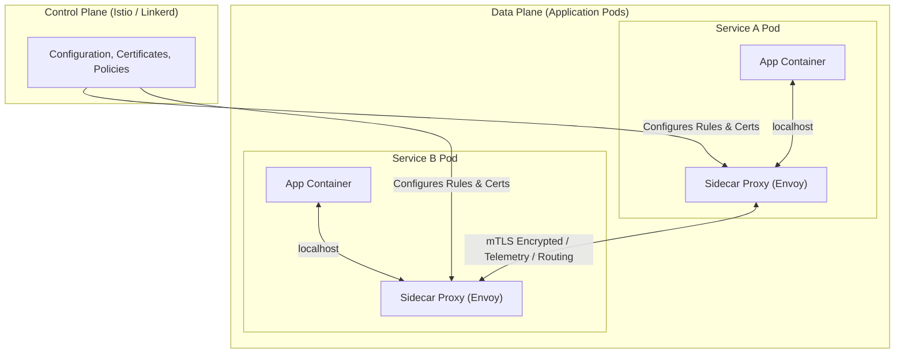
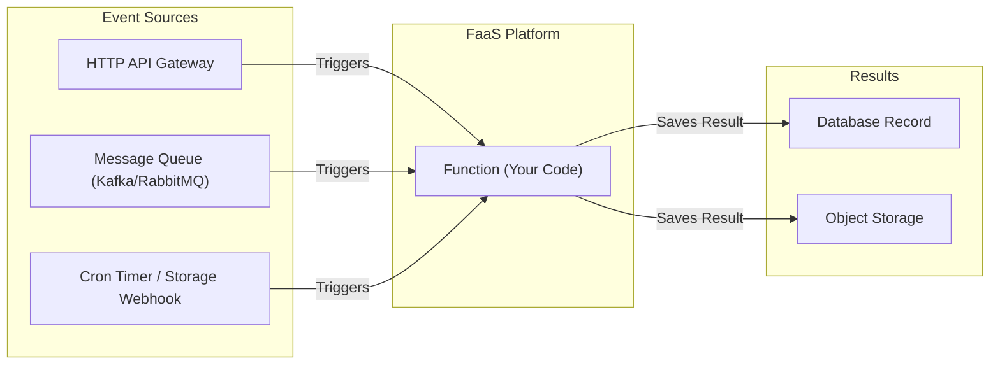
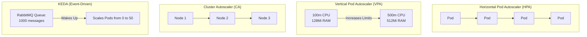
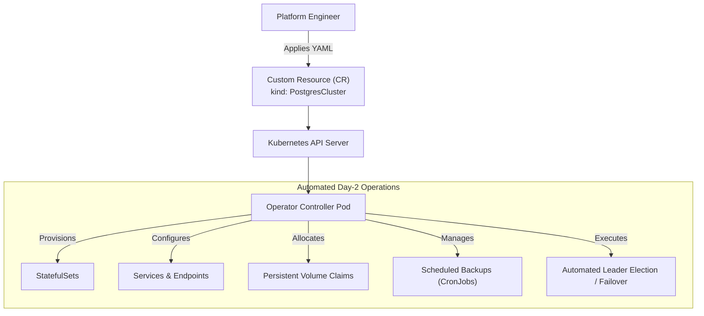
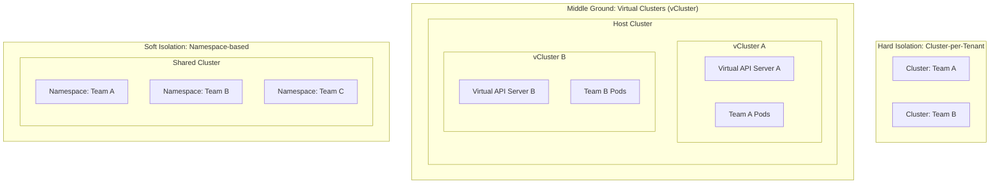
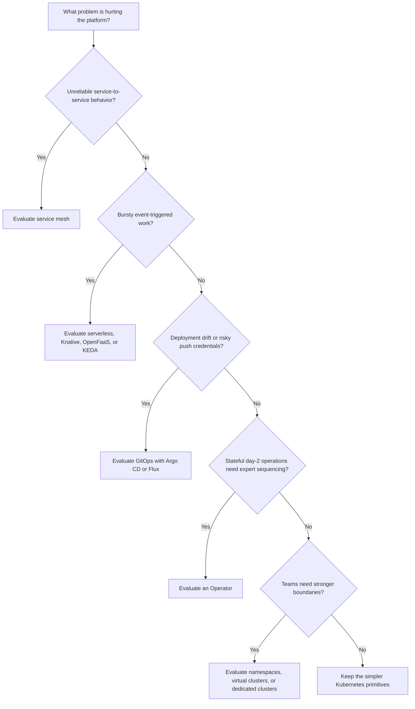

# Module 3.3: Cloud Native Patterns

**Complexity**: `[MEDIUM]` architecture concepts. **Time to Complete**: 60-75 minutes. **Prerequisites**: Module 3.2, working Kubernetes vocabulary, and a Kubernetes 1.35+ cluster for the optional practice. We use the `k` alias for kubectl in examples; configure it with `alias k=kubectl` before running commands.

## Learning Outcomes

After completing this module, you will be able to make architecture choices that connect patterns to operational symptoms, implementation constraints, and verifiable production outcomes:

1. **Design** resilient microservice architecture with service mesh patterns that handle unreliable networks without pushing every retry, timeout, and authorization rule into application code.
2. **Evaluate** trade-offs between serverless event-driven architectures, traditional container deployments, and service mesh topologies for realistic workload profiles.
3. **Implement** GitOps deployment workflows that keep live cluster state aligned with the declared desired state stored in version control.
4. **Diagnose** performance and scaling bottlenecks by selecting the correct autoscaling mechanism: HPA, VPA, Cluster Autoscaler, or KEDA.
5. **Compare** multi-tenancy isolation models, from namespace boundaries through virtual clusters to dedicated physical clusters, while balancing security, autonomy, and cost.

## Why This Module Matters

The control-loop design pattern in this module is illustrated by the Knight Capital 2012 story in *Infrastructure as Code*, where uneven rollout state and weak reconciliation turned a mixed fleet into a systemic failure. <!-- incident-xref: knight-capital-2012 -->

Cloud native architecture is the discipline of deciding which control loops should exist, where they should run, and what they should be allowed to change. A small team can sometimes survive with a few Deployments, Services, and hand-written runbooks, because everyone knows the traffic path and the blast radius is visible. As the system grows, the fragile parts move away from individual containers and into the spaces between them: service-to-service calls, certificate rotation, traffic splitting, deployment drift, queue backlogs, resource pressure, tenant boundaries, and stateful failover. These problems are not solved by memorizing more commands; they are solved by choosing patterns that make the desired behavior explicit and continuously enforced.

This module teaches the patterns that appear again and again in Kubernetes and CNCF environments: service mesh, serverless and event-driven execution, GitOps, autoscaling, Operators, and multi-tenancy. The goal is not to convince you to install every project you see. A service mesh can be a brilliant safety layer in a large polyglot platform and a costly distraction in a three-service prototype. GitOps can close a serious audit gap, yet still frustrate teams that treat Git as an afterthought. Operators can automate complex database care, but they can also become a hidden dependency with their own failure modes. You will learn to evaluate each pattern by the operational pressure it removes, the new responsibility it introduces, and the point at which the trade becomes worth making.

## Designing Resilient Microservice Architecture with Service Mesh Patterns

When a monolith becomes a fleet of microservices, the network stops being plumbing and becomes part of the application design. A single user request may enter through an API gateway, call an identity service, ask a pricing service for a discount, reserve inventory, write an order, publish an event, and return a response before the browser times out. Each hop can be slow, unavailable, misconfigured, or reachable only through a policy that changed yesterday. The application developer still owns business behavior, but the platform now needs a repeatable way to handle transport behavior across many teams and languages.

The old answer was to import client libraries that handled retries, timeouts, tracing, and circuit breaking inside application code. That worked reasonably well when most services were written in one language and shared one framework, but it breaks down in a polyglot organization. A Java team may use one retry policy, a Go team another, and a Python batch worker may forget the policy entirely. The result is not merely inconsistent style; it is inconsistent failure behavior during the exact moment when uniform behavior matters most. A downstream service can be overwhelmed by enthusiastic retries from one client while another client gives up too quickly and creates false errors.

The service mesh pattern moves much of that communication behavior into infrastructure. Instead of asking every service to implement the same network safety logic, the platform injects or provides proxies that sit beside workloads and mediate traffic. The application still opens a connection, but the proxy can add mutual TLS, enforce identity-aware authorization, collect telemetry, retry with limits, and route a controlled percentage of traffic to a new version. This is like putting trained traffic controllers at every intersection rather than asking every driver to negotiate priority rules from memory.



The diagram shows the classic sidecar model. The control plane stores policy, certificate material, routing rules, and configuration, while the data plane performs the actual request handling. The application container talks to its local proxy over localhost, and the proxy talks to the destination proxy over the network. That extra hop is not free. It consumes CPU and memory, it can add latency, and it gives the platform team another distributed system to upgrade. The reason teams still accept the cost is that the mesh can apply one tested communication policy across hundreds of services without waiting for every team to patch libraries.

Pause and predict: if a service mesh adds one proxy beside every application container, what happens to resource planning when the platform grows from 20 Pods to 400 Pods? The first-order answer is that total container count and proxy resource consumption rise sharply, but the deeper answer is about ownership. You trade per-team application complexity for centralized platform complexity. That trade is attractive when the fleet is large, regulated, polyglot, or sensitive to cascading failures, and it is wasteful when the network graph is simple enough for ordinary Kubernetes Services and application-level timeouts.

| Feature | Description |
|---------|-------------|
| **mTLS (Mutual TLS)** | Automatic, transparent encryption between services. The control plane automatically rotates certificates, ensuring zero-trust network security within the cluster. |
| **Traffic management** | Advanced routing rules allowing for canary releases, such as sending exactly 5% of traffic to v2 of a service, and A/B testing based on HTTP headers. |
| **Retries/Timeouts** | Automatic retry logic with exponential backoff and jitter to survive transient network blips without overwhelming struggling downstream services. |
| **Circuit breaking** | The ability to fail fast when a downstream service is struggling, returning an immediate error to prevent cascading resource exhaustion across the cluster. |
| **Observability** | Automatic generation of golden signal metrics, distributed tracing headers, and access logs for all network hops. |
| **Access control** | Fine-grained service-to-service authorization, such as allowing the frontend service to read from billing while blocking writes. |

The most important service mesh capability is often not encryption or tracing by itself, but policy consistency. If one team owns checkout, another owns inventory, and another owns payment, a mesh lets the platform define common defaults for timeout budgets, mTLS, and identity. The policies can still be adjusted service by service, but the starting point is no longer an empty page. During an incident, that consistency reduces the number of places you must inspect before deciding whether a symptom is caused by application logic, network policy, a certificate problem, or a failing dependency.

| Mesh | Key Characteristics |
|------|---------------------|
| **Istio** | The most feature-rich and widely adopted mesh. Uses Envoy proxies. Historically complex to manage, but highly powerful. Ambient mesh reduces sidecar dependence for some use cases. |
| **Linkerd** | Built specifically for Kubernetes, focused on being lightweight, fast, and simple to operate. A CNCF Graduated project that uses custom Rust-based micro-proxies. |
| **Cilium** | An advanced networking and security project leveraging eBPF in the Linux kernel to provide mesh capabilities, often without requiring sidecar proxies. |

Istio, Linkerd, and Cilium illustrate that a pattern is not the same as one implementation. Istio usually appeals to organizations that need deep traffic management, broad integration, and a large ecosystem, while Linkerd appeals to teams that want a smaller operational surface and a Kubernetes-native feel. Cilium approaches some service mesh concerns from the networking layer with eBPF, which can remove some proxy overhead while changing the debugging model. A KCNA-level architect should not reduce this choice to popularity. The useful question is which operational problem is most painful: advanced routing, ease of operation, kernel-level networking policy, or a consistent identity layer.

A practical service mesh war story usually starts with a service that is slow rather than dead. During a flash sale, an inventory service may start waiting on database locks, which causes checkout requests to pile up. Without circuit breakers, callers keep connections open and retry aggressively, so frontend Pods exhaust worker threads and the customer-facing site fails even though the original bottleneck was deeper in the graph. With a mesh policy, the proxy can enforce a timeout, limit retries, and fail fast when the dependency is unhealthy. The business may still need a fallback response, but the platform prevents one slow service from turning every caller into another casualty.

Here is the mental model to keep close when evaluating service mesh designs. The mesh does not remove the need for good application behavior; it creates a shared safety rail for communication behavior. Your service still needs idempotent operations before retries are safe, useful error handling before fallback behavior is meaningful, and observability conventions before traces tell a coherent story. The mesh can standardize the transport layer, but it cannot decide whether retrying a payment request is legally or financially acceptable. Architecture work is the conversation between those layers.

```text
+----------------------+       +----------------------+
|  Service Owner       |       |  Platform Owner      |
|----------------------|       |----------------------|
| Business behavior    |       | Mesh control plane   |
| Idempotency rules    |       | Certificates         |
| Domain fallbacks     |       | Retry limits         |
| User-facing errors   |       | Traffic policy       |
+----------------------+       +----------------------+
           \                           /
            \                         /
             +-----------------------+
             | Reliable service path |
             +-----------------------+
```

Before running any mesh pilot, write down the failure you expect the mesh to prevent and the metric that will prove improvement. If the target is encrypted service-to-service traffic, measure plaintext traffic removal and certificate rotation health. If the target is safer rollout, measure the percentage of traffic shifted during canaries and the rollback time when error rates climb. If the target is observability, check whether traces actually connect caller and callee spans across the services that matter. A mesh installed without a success criterion becomes another layer that people blame without understanding.

## Evaluating Serverless Event-Driven Architectures and Container Deployments

Containers made it easier to package long-running services, but not every workload deserves to run all day. Image resizing, webhook processing, report generation, queue consumers, and scheduled cleanup jobs often have long idle periods followed by short bursts of work. If you run those workloads as permanent Deployments, you pay for readiness even when there is nothing to process. Serverless and event-driven patterns ask a different question: what if compute existed only when an event needs work, and the platform handled the scaling boundary for you?

Serverless does not mean there are no servers. It means the developer is shielded from server provisioning, node maintenance, and most scaling decisions. In Function-as-a-Service platforms, an event arrives, the platform starts or reuses an execution environment, the function runs, and the platform tears down or parks capacity when demand disappears. The economic model is powerful because idle time can approach zero cost, but the design constraints are equally real. Functions must be stateless, bounded in execution time, fast to start, and careful about external systems because concurrency can rise faster than a database can tolerate.



The event-driven diagram looks simple because it hides the most important design decision: the event source becomes part of the reliability model. A queue can absorb bursts, preserve work, and let consumers process at a controlled rate. An HTTP trigger may create a better user experience for synchronous requests, but it also ties function latency directly to user latency. A timer trigger works for housekeeping, yet it can accidentally start expensive work at the same moment every environment runs its own schedule. The platform can scale execution, but the architect must still decide how events are buffered, retried, deduplicated, and observed.

| Aspect | Description |
|--------|-------------|
| **No server management** | The underlying platform dynamically allocates compute resources. Developers do not manage nodes, system packages, or worker pools directly. |
| **Auto-scaling** | The system automatically scales out concurrent function instances as the event queue grows and scales down to zero when there are no events. |
| **Event-driven** | Functions are dormant until an explicit event, such as a file upload, database row insertion, queue message, or web request, triggers execution. |
| **Pay-per-use** | Billing is calculated from actual execution time and memory consumed, so idle time is usually far cheaper than permanent capacity. |
| **Stateless** | Functions cannot rely on local file systems or memory spanning invocations. Required state must live in an external database, object store, or cache. |
| **Short-lived** | Execution environments have strict timeouts, often in the range of minutes, forcing workloads into smaller and idempotent units. |

Traditional container Deployments are still the right choice for many workloads. A latency-sensitive API that must keep warm connections to a database may perform better as a steady set of Pods than as functions that repeatedly cold start. A service that holds in-memory caches, streams bidirectional connections, or coordinates long transactions may fight the serverless model. Conversely, a thumbnail generator that handles nothing for hours and then processes thousands of uploads is a natural serverless candidate. The design lens is not modern versus old; it is workload shape, latency tolerance, state needs, and the cost of idle readiness.

In Kubernetes environments, serverless patterns often arrive through Knative, OpenFaaS, or KEDA. Knative Serving can run containers behind request-driven scale-to-zero behavior, while Knative Eventing gives a structured model for brokers, triggers, and event delivery. OpenFaaS packages functions and existing binaries so teams can deploy function-style workloads on a cluster they already operate. KEDA, which appears again in the autoscaling section, watches external event sources and feeds scaling signals into Kubernetes workloads. These tools blur the line between containers and serverless because the unit of execution may still be a container image, while the operational behavior becomes event-driven.

Which approach would you choose for a payment authorization API that receives steady traffic during the day and must respond in less than 200 milliseconds at the 95th percentile? A permanent Deployment is usually a better first answer because cold starts, burst concurrency, and downstream connection churn can threaten the user path. Now change the example to a fraud report generator triggered by a queue after the order completes. The serverless or event-driven answer becomes more attractive because the work is asynchronous, bursty, retryable, and detached from the immediate customer response. Same cluster, same organization, different workload shape.

The failure mode of serverless architecture is often hidden coupling through shared dependencies. Functions scale quickly, and that is the point, but a database connection limit or third-party API quota may not scale with them. A queue with ten thousand messages can create a surge of function invocations that all try to update the same table or call the same downstream endpoint. Good event-driven design uses backpressure, concurrency limits, idempotency keys, dead-letter queues, and explicit retry policies. Without those controls, serverless becomes a very efficient way to overload the next system in line.

For the KCNA exam and for real platform work, treat serverless as a pattern with boundaries rather than a synonym for cloud provider functions. The architectural idea is event-triggered execution, automatic scaling, and minimal idle management. The implementation may be AWS Lambda, Google Cloud Functions, Knative, OpenFaaS, or a KEDA-scaled Deployment. The question to ask is whether the workload becomes simpler when compute follows events, or whether it becomes harder because the workload really wanted durable connections, warm state, or predictable local resources.

## Implementing GitOps Deployment Workflows for Declarative State

Kubernetes is built around reconciliation: you declare the desired state, and controllers work to make the actual state match. GitOps extends that idea beyond a single Kubernetes object and applies it to the delivery workflow. Instead of treating a CI server as a powerful actor that pushes changes into the cluster, GitOps treats Git as the authoritative record and runs an agent inside the cluster to pull and apply the desired state. The deployment system becomes another reconciliation loop, not a one-time command fired from a pipeline.

Traditional push-based CI/CD often starts well and becomes risky over time. A CI job builds an image, authenticates to the cluster, runs a deployment command, and reports success. That means an external system now needs credentials capable of changing production, and those credentials often live beside build logs, plugins, and third-party integrations. If an operator later runs an emergency command with `k scale` or edits a Deployment directly, the live cluster may drift away from the repository. The next incident review has two histories: what Git says should exist and what the cluster actually ran.

```mermaid
graph LR
    subgraph Source_of_Truth ["Single Source of Truth"]
        Git["Git Repository<br/>(Contains Desired State YAML)"]
    end
    
    subgraph K8s_Cluster ["Kubernetes Cluster"]
        Agent["GitOps Agent<br/>(Argo CD / Flux)"]
        State["Cluster API<br/>(Actual State)"]
    end

    Agent -->|1. Continuously Pulls| Git
    Agent -->|2. Compares| State
    Agent -->|3. Reconciles (Applies changes)| State
```

The pull-based GitOps model changes the credential story. The CI system may still build images and update manifests, but it only needs permission to write to Git or open a pull request. The in-cluster agent holds the Kubernetes credentials and watches the repository for changes. If a build server is compromised, the attacker does not automatically receive direct access to the production API server. They may still attempt a malicious commit, so branch protection, review, signing, and policy checks matter, but the cluster boundary is much tighter than a world where every CI runner can push arbitrary manifests.

| Principle | Description |
|-----------|-------------|
| **Declarative** | The entire system is configured declaratively with YAML, JSON, Helm, Kustomize, or similar desired-state formats. |
| **Versioned** | Desired state is stored in Git, providing review history, commit identity, rollback points, and a durable audit trail. |
| **Automated** | In-cluster agents continuously compare the declared state with the live state and reconcile differences without manual deployment commands. |
| **Audited** | The Git commit log becomes the primary record of production changes, which is essential for regulated environments and incident reconstruction. |

GitOps is not just automation with a fashionable name. The defining property is convergence toward the repository. If someone changes a replica count by hand during an incident, the GitOps agent should mark the application as drifted and either reverse the change automatically or require an intentional sync decision, depending on policy. That behavior can surprise teams at first because the cluster seems to reject emergency work. The better interpretation is that emergency work now needs a visible path back into source control, so the system does not preserve invisible state after the adrenaline fades.

Stop and think: in a push pipeline, where do production credentials live, and how many systems can use them? In a pull-based GitOps pipeline, which system needs cluster credentials, and which systems only need Git permissions? This credential map is one of the clearest ways to evaluate whether a process is truly GitOps or merely a CI job that happens to read YAML from a repository.

The operational design of GitOps has trade-offs. Automatic synchronization can correct drift quickly, but it can also revert a manual mitigation while an incident is still unfolding. Manual synchronization gives humans a gate, but it may slow recovery or let drift persist longer. Monorepos simplify global visibility, while environment-specific repositories can create clearer ownership boundaries. Image automation can reduce toil, but if every successful build updates production automatically, teams may lose the review point that made GitOps attractive. The pattern is powerful precisely because it makes these choices explicit.

The hands-on exercise later simulates desired state reversal with a normal Deployment rather than installing Argo CD or Flux. That is deliberate. You do not need a full GitOps controller to understand the core mechanism. If a file says three replicas and the live cluster has one replica, reapplying the file restores the declared state. Argo CD and Flux industrialize that loop with diffing, health checks, sync policies, drift detection, and repository integration. The conceptual move is the same: the desired state wins unless you change the desired state.

## Diagnosing Performance and Scaling Bottlenecks with Autoscaling Patterns

Autoscaling is not one feature; it is a set of control loops acting at different layers. A Pod can need more replicas, a container can need different resource requests, the cluster can need more nodes, and an event-driven worker can need to wake from zero because a queue is filling. Confusing these layers leads to expensive and unstable systems. The Horizontal Pod Autoscaler, Vertical Pod Autoscaler, Cluster Autoscaler, and KEDA each answer a different scaling question, so diagnosis starts by asking which resource is actually constrained.



HPA changes the number of replicas for a scalable workload. If each Pod can handle a similar slice of traffic and the bottleneck is per-Pod CPU, memory-related custom metrics, request rate, or queue depth, horizontal scaling is usually the first tool to consider. HPA works best when the application is stateless or when state is externalized cleanly enough that adding replicas increases useful capacity. It works poorly when all replicas contend for one locked database row, when a singleton worker must process tasks in order, or when the metric arrives too late to prevent backlog growth.

VPA changes the requested resources for Pods. It is valuable when a workload is under-requested, over-requested, or difficult to scale horizontally, but it often needs to recreate Pods to apply recommendations. That eviction behavior matters. A stateless API with many replicas may tolerate right-sizing events, while a database or queue node needs careful disruption planning. VPA also conflicts with HPA when both react to the same resource signal, because one controller may add replicas while the other changes per-Pod requests, causing unstable feedback.

Cluster Autoscaler works below the Pod layer. If HPA creates more Pods and the scheduler cannot place them because no node has capacity, those Pods remain Pending. Cluster Autoscaler notices unschedulable Pods and asks the cloud or infrastructure provider for more nodes, then later removes underused nodes when it can do so safely. This means HPA and Cluster Autoscaler often operate as a pair: one decides that more replicas are needed, and the other makes room for those replicas. If you diagnose only the Deployment and ignore node capacity, you may miss why scaling stalled.

KEDA extends the autoscaling story toward event-driven workloads. It can watch external systems such as queues, streams, databases, and cloud services, then scale a Kubernetes workload based on event pressure. This is especially useful when CPU is a lagging signal. A queue consumer may sit at low CPU while the queue grows because it has too few replicas, or it may need to scale from zero before any Pod metrics exist. KEDA bridges external demand and Kubernetes scaling primitives, which makes it a natural companion to serverless patterns on clusters.

If you have a deployment named `web-frontend`, you can implement basic autoscaling imperatively to test the HPA behavior:

```bash
# Autoscale the frontend between 2 and 10 replicas, targeting 70% CPU utilization
k autoscale deployment web-frontend --cpu-percent=70 --min=2 --max=10
```

Before running this, what output do you expect from `k get hpa` after load begins? The HPA should show the current metric value moving toward the target and the replica count changing within the configured bounds. If the metric reads as unknown, the problem is not the HPA formula; it is usually missing metrics infrastructure, a workload without resource requests, or a custom metric adapter that is not reporting. This is why autoscaling diagnosis starts with observability. A controller cannot make a useful decision from a signal it cannot see.

A realistic scaling incident might begin with a checkout worker falling behind on a message queue. CPU sits at 30%, so an HPA based on CPU does not react, but customers wait because queued work is aging. Adding Cluster Autoscaler alone does nothing because no Pending Pods exist. Increasing VPA recommendations might make each worker larger, but it still ignores the queue signal. KEDA or an HPA using queue depth as a custom metric matches the bottleneck because it scales based on the work waiting to be processed. The right autoscaler is the one whose input signal describes the real constraint.

Scaling also has financial and human consequences. Aggressive HPA settings can multiply Pods faster than downstream services can handle, which turns a small spike into a database outage. Conservative settings can preserve dependencies but let latency climb. Cluster Autoscaler can save money by removing idle nodes, but frequent scale-up and scale-down cycles may create scheduling delays. VPA can reduce waste by correcting oversized requests, but surprise evictions can harm availability. Good autoscaling policy is not maximum automation; it is a controlled feedback loop with bounds, cooldowns, and metrics that match user impact.

## Using Operators to Automate Stateful Day-2 Operations

Kubernetes controllers are excellent at keeping stateless workloads alive. If a Pod disappears, a ReplicaSet creates another one. If a node fails, the scheduler places replacement Pods elsewhere when possible. Stateful systems are harder because replacing a process is not the same as preserving correctness. A PostgreSQL cluster, Kafka installation, or distributed cache has ordering, quorum, backups, restore procedures, version compatibility, and failover rules. A generic Deployment controller cannot know which replica is primary, which backup is valid, or when a schema migration is safe.

The Operator pattern extends Kubernetes by encoding domain-specific operational knowledge into a controller. Instead of asking an administrator to create a pile of StatefulSets, Services, PVCs, Secrets, Jobs, and ConfigMaps by hand, the platform introduces a Custom Resource Definition that describes the domain object directly. A user can request a `PostgresCluster` or a `KafkaTopic`, and the Operator watches that request, creates the lower-level resources, and keeps reconciling them as conditions change. The pattern is powerful because it makes expert runbook actions repeatable and observable through the Kubernetes API.



An Operator has three core pieces. The Custom Resource Definition teaches the Kubernetes API a new type and schema. The Custom Resource is the user-facing instance of that type, such as a specific database cluster with a version, replica count, storage size, and backup schedule. The controller is the program that watches those resources and reconciles reality. If the desired database says three replicas and only two are healthy, the controller decides the correct domain-specific action. That might mean creating a new Pod, promoting a replica, restoring from backup, or refusing a risky change until a condition is safe.

The phrase codifying operational knowledge is easy to say and easy to underestimate. A human database administrator may know not to fail over during a backup, not to delete a volume that contains the only good replica, and not to upgrade across incompatible major versions without an intermediate step. An Operator can encode those rules, but only if the authors understand the domain deeply and expose status clearly. A weak Operator can be worse than no Operator because it gives users a false sense of automation while hiding complex decisions in a controller few people can debug.

Popular examples show why the pattern spread. The Prometheus Operator simplifies monitoring stack deployment by turning Prometheus, Alertmanager, and scrape configuration into Kubernetes resources. cert-manager automates certificate issuance, validation, and renewal so teams do not hand-rotate TLS material. Strimzi automates Apache Kafka clusters, which have significant operational complexity around brokers, topics, listeners, and rolling updates. PostgreSQL Operators from vendors and open source projects automate clustering, backups, failover, and maintenance tasks that would otherwise require careful human coordination.

Operators also introduce platform responsibilities. The controller itself needs upgrades, RBAC, metrics, logs, backups for its managed state, and a tested recovery plan. CRDs are cluster-scoped resources, so installing one for a tenant can affect the whole cluster API surface. A poorly designed Operator may fight manual recovery attempts or create resources faster than the platform can support. When you adopt an Operator, you are adopting software that makes production decisions on your behalf. That is worth doing for complex domains, but it deserves the same review you would give any critical automation.

The decision test is simple: if the correct operation requires domain-specific sequencing that a generic Kubernetes controller cannot know, an Operator may be appropriate. If the application is a stateless web service with ordinary rollout needs, a Deployment, Service, Ingress, and GitOps workflow are usually enough. Operators shine when they automate day-2 actions such as backup, restore, failover, rebalancing, certificate renewal, shard management, or safe version upgrades. They are overkill when they merely wrap three static YAML files and add another controller to monitor.

## Comparing Multi-Tenancy Isolation Models

As Kubernetes adoption spreads through an organization, a platform team eventually faces a deceptively simple question: should every team share one cluster, or should every team get its own? Shared clusters improve utilization and centralize operations, but they require strong boundaries. Dedicated clusters provide clean isolation, but they multiply control planes, upgrades, policy distribution, and cost. Multi-tenancy is the architecture of those boundaries. It determines who can see which API objects, who can consume which resources, who can install cluster-wide extensions, and how much damage one tenant can cause to another.



Namespace-based multi-tenancy is the common starting point. Each team receives one or more namespaces, RBAC restricts which users and service accounts can operate there, ResourceQuotas prevent one tenant from consuming all cluster capacity, LimitRanges set default requests and limits, and NetworkPolicies restrict traffic between tenants. This model is cost-effective and operationally simple because the platform team manages one cluster. Its weakness is that namespaces are not hard security boundaries by themselves. Cluster-scoped resources, node-level attacks, permissive RBAC, missing NetworkPolicies, and shared admission configuration can all undermine the isolation story.

Cluster-per-tenant isolation sits at the other end of the spectrum. Each team, product, or environment receives a dedicated Kubernetes cluster with its own control plane and worker nodes. This model provides the clearest blast-radius boundary and lets tenants use different cluster-scoped extensions without colliding. It is attractive for regulated workloads, hostile tenants, unusual networking needs, or teams that require independent lifecycle control. The cost is operational multiplication. Every cluster needs upgrades, monitoring, policy enforcement, identity integration, backup decisions, and capacity planning, so the model scales only if the platform has strong automation.

Virtual clusters occupy the middle ground. A tool such as vCluster runs a lightweight Kubernetes control plane inside a namespace on a host cluster, giving the tenant a separate API endpoint while workloads still run on shared physical nodes. Tenants can often create CRDs and test cluster-scoped behavior inside their virtual control plane without affecting other tenants or the host cluster. This is especially useful for development environments, CI sandboxes, and platform experiments where teams need more autonomy than a namespace gives but do not need the expense of a full physical cluster.

The security model must be stated honestly. Namespace isolation can be strong enough for cooperative internal teams when RBAC, quotas, admission policies, Pod Security controls, and NetworkPolicies are consistently enforced. It is not enough for untrusted tenants who may try to escape boundaries or exploit node-level vulnerabilities. Virtual clusters improve API isolation and tenant autonomy, but they still depend on the host cluster for actual compute isolation. Dedicated clusters provide the strongest tenant boundary, yet they do not eliminate the need for identity, network, supply chain, and workload security controls inside each cluster.

Multi-tenancy also affects developer experience. A namespace tenant may need to ask the platform team whenever a CRD, admission policy, or cluster role changes. A virtual cluster tenant can test more freely, which reduces platform bottlenecks for teams building Operators or controllers. A dedicated cluster tenant can move fastest within its own boundary, but may drift from organizational standards unless the platform team automates baseline configuration. The best model is rarely universal. Many organizations use namespace isolation for ordinary application teams, virtual clusters for sandboxes, and dedicated clusters for regulated or unusually risky workloads.

## Patterns & Anti-Patterns

Cloud native patterns are useful only when they are tied to a problem shape. A service mesh is a pattern for consistent service communication, not a badge of maturity. GitOps is a pattern for declared and audited state, not a substitute for testing. Operators are a pattern for domain-specific reconciliation, not a way to make any YAML look sophisticated. The following tables summarize the practical signals that a pattern fits and the warning signs that it is being used as decoration.

| Pattern | Use When | Why It Works | Scaling Considerations |
|---------|----------|--------------|------------------------|
| **Service mesh for shared communication policy** | Many services need consistent mTLS, traffic routing, telemetry, and authorization across languages. | Proxies and a control plane centralize behavior that would otherwise be duplicated in every codebase. | Budget proxy resources, standardize defaults, and prove that operational teams can debug the mesh during incidents. |
| **Event-driven serverless workloads** | Work is bursty, asynchronous, idempotent, and triggered by queues, files, timers, or webhooks. | Compute follows events, so idle cost drops and scaling can respond to external demand. | Protect downstream systems with concurrency limits, backpressure, retries, and dead-letter handling. |
| **GitOps reconciliation** | Teams need a clear audit trail, drift correction, and a secure pull-based deployment model. | Git stores desired state, while in-cluster agents compare and reconcile actual state continuously. | Define sync policy, rollback rules, environment promotion, and emergency-change handling before production use. |
| **Operator-managed stateful systems** | Day-2 operations require domain-specific sequencing, failover, backup, restore, or safe upgrades. | A controller encodes expert runbooks and exposes the domain through Kubernetes resources. | Treat the Operator as production software with lifecycle, observability, RBAC, and recovery requirements. |
| **Layered multi-tenancy** | Different teams need different degrees of autonomy, isolation, and cost efficiency. | Namespaces, virtual clusters, and dedicated clusters give a menu of boundaries instead of one rigid model. | Match isolation level to trust, regulatory needs, cluster-scoped extension requirements, and platform automation capacity. |

| Anti-Pattern | What Goes Wrong | Better Alternative |
|--------------|-----------------|--------------------|
| **Installing a mesh before naming the failure** | The team inherits proxy overhead and control-plane complexity without knowing what success means. | Start with timeout, mTLS, rollout, or telemetry goals, then pilot the mesh against measurable outcomes. |
| **Calling any push pipeline GitOps** | External CI systems still hold cluster credentials, and manual changes still create invisible drift. | Run an in-cluster agent such as Argo CD or Flux and make Git the source of desired state. |
| **Scaling on CPU when demand lives in a queue** | Workers fall behind while CPU remains low, so HPA never reacts to the real bottleneck. | Scale on queue depth or event pressure with KEDA or a custom metric adapter. |
| **Treating namespaces as hard security boundaries** | Missing NetworkPolicies, broad RBAC, or shared cluster-scoped resources let tenants affect each other. | Combine RBAC, quotas, network policy, admission controls, and stronger isolation where trust is low. |
| **Using Operators for static applications** | A controller adds upgrade and debugging burden without automating meaningful day-2 behavior. | Use ordinary Deployments, Helm, Kustomize, and GitOps for simple stateless services. |
| **Letting serverless concurrency run unbounded** | A burst of events overwhelms databases, APIs, or rate-limited dependencies. | Set concurrency limits, retry budgets, backpressure, and dead-letter queues around event consumers. |

Notice that the better alternative is not always a different product. Often it is a sharper boundary, a better metric, or a written policy that explains how automation behaves under stress. Mature cloud native architecture does not collect patterns for their own sake. It removes uncertainty from the places where uncertainty turns into outages, audit gaps, or runaway cost.

## Decision Framework

When you face a platform design decision, start with the symptom and work backward to the control loop that should own it. If service calls fail differently across teams, a service mesh may centralize communication policy. If deployments drift from review history, GitOps may put reconciliation where it belongs. If a queue grows while CPU stays calm, KEDA or a custom metric may describe demand better than HPA. If a database needs failover, backup, and upgrade sequencing, an Operator may encode the missing runbook. If tenants need different levels of trust and autonomy, the multi-tenancy model must become explicit.



| Decision Pressure | Prefer This Pattern | Be Careful When |
|-------------------|--------------------|-----------------|
| Inconsistent retries, timeouts, mTLS, authorization, or traffic splitting across many services | Service mesh | The service graph is small, latency budget is tight, or platform operators cannot support the mesh yet. |
| Bursty asynchronous work, webhook handlers, queue consumers, or tasks with long idle periods | Serverless or event-driven scaling | The workload needs long-lived local state, warm connections, or strict low-latency synchronous responses. |
| Production state must match reviewed declarations and CI should not hold cluster admin credentials | GitOps | Emergency workflows are undefined or teams bypass Git during incidents. |
| Databases, Kafka, monitoring stacks, or certificate workflows require day-2 automation | Operator | The Operator hides risky actions, lacks clear status, or automates a simple static deployment. |
| Teams share infrastructure but need controlled autonomy and resource fairness | Namespace or virtual-cluster tenancy | Tenants are untrusted or need hard compliance boundaries that require dedicated clusters. |

The simplest valid architecture is usually the best starting point, but simple does not mean manual. A Deployment with good probes, resource requests, and GitOps delivery can be simpler and safer than an early mesh. A queue worker with KEDA can be simpler and cheaper than a permanently warm fleet. A dedicated cluster can be simpler for a regulated payment workload if the alternative is dozens of fragile namespace exceptions. The decision framework is there to prevent pattern cargo culting. Choose the smallest control loop that directly addresses the failure mode you can name.

## Did You Know?

- **Service meshes are changing shape:** Istio's ambient mode reduces the need for per-Pod sidecars in some deployments, while Cilium uses eBPF to move parts of networking and security enforcement closer to the Linux kernel.
- **GitOps was popularized in 2017:** Weaveworks coined and spread the term while building Flux, and the OpenGitOps project later described vendor-neutral principles for the practice.
- **Operator maturity has levels:** The Operator Framework describes a path from basic installation through seamless upgrades, full lifecycle management, deep insight, and auto-pilot behavior.
- **KEDA graduated in August 2023:** The Kubernetes Event-Driven Autoscaler became a CNCF Graduated project, reflecting broad adoption of event-driven scaling on Kubernetes.

## Common Mistakes

| Mistake | Why It Happens | How to Fix It |
|---------|----------------|---------------|
| Installing a service mesh for three simple services | Teams equate mesh adoption with platform maturity before they have mesh-shaped problems. | Start with ordinary Services, NetworkPolicies, probes, and application timeouts; revisit the mesh when communication policy becomes inconsistent or risky. |
| Treating serverless as a free scaling button | The scale-to-zero story hides cold starts, concurrency spikes, and downstream limits. | Model latency, concurrency, retries, and dependency capacity before moving user-facing paths to functions. |
| Calling Jenkins plus `k apply` a GitOps workflow | The manifests may live in Git, but the cluster still trusts an external pusher and can drift silently. | Use an in-cluster reconciler such as Argo CD or Flux, and make Git the desired-state source. |
| Combining HPA and VPA on the same CPU signal | Both controllers react to the same pressure and can create feedback loops with evictions and replica changes. | Use HPA for replica count and VPA for recommendation or separate resource concerns, then test disruption behavior. |
| Scaling workers on CPU when backlog is the user problem | CPU can remain low while a queue grows, so the autoscaler misses demand. | Scale on queue length, event age, or domain-specific custom metrics with KEDA or an adapter. |
| Treating namespaces as secure tenant walls | Namespaces organize objects, but they do not automatically isolate network, resources, or cluster-scoped permissions. | Add RBAC, ResourceQuotas, LimitRanges, NetworkPolicies, Pod Security controls, and stronger isolation for untrusted tenants. |
| Using an Operator to wrap static YAML | A controller feels sophisticated, but it adds lifecycle risk without automating real operations. | Reserve Operators for domains with backup, failover, restore, upgrade, or reconciliation logic that generic controllers cannot know. |
| Ignoring drift during incidents | Manual commands feel faster under pressure, and teams forget to reflect them back into desired state. | Define an emergency GitOps path, record temporary changes, and reconcile the repository before closing the incident. |

## Quiz

<details><summary>1. Your team owns 30 microservices, and each team has implemented its own retry logic, timeout values, and tracing headers. A slow inventory service caused checkout and frontend Pods to exhaust threads during a sale. How would you design resilient microservice architecture with service mesh patterns, and what trade-off would you explain to leadership?</summary>

A service mesh can move consistent timeout, retry, circuit-breaking, mTLS, and telemetry behavior into the infrastructure layer so every service call follows a shared policy. That reduces the chance that one team's aggressive retry code overwhelms a struggling dependency while another team's service fails too quickly. The trade-off is that the platform now operates a mesh control plane and a data plane, which consume resources and add debugging complexity. Leadership should approve the pattern only if the cost is tied to measurable goals such as fewer cascading failures, encrypted service traffic, safer canaries, or complete request tracing.

</details>

<details><summary>2. A product team wants to evaluate serverless event-driven architectures, traditional container deployments, and service mesh topologies for an image-processing feature. Uploads are bursty, processing can run after the user receives a confirmation, and the database has strict connection limits. Which design would you choose first, and what safeguards are required?</summary>

An event-driven design is a strong fit because image processing is asynchronous and bursty, so workers can scale with queue pressure rather than running permanently. KEDA, Knative, OpenFaaS, or a cloud function platform could all implement the pattern, depending on the platform constraints. The database connection limit is the main warning, so the design needs concurrency caps, idempotency keys, retry budgets, and dead-letter handling. A service mesh might still help with telemetry or mTLS, but it does not replace the need to control event-driven fan-out.

</details>

<details><summary>3. An engineer commits a Deployment change to Git, but the cluster does not update. A teammate suggests running `k apply` directly against production to move faster. In a GitOps deployment workflow, why is that risky, and what should the team inspect instead?</summary>

Directly applying the change creates or reinforces drift because the live cluster can move away from the reviewed desired state in Git. A GitOps controller may later reverse the manual change, or worse, the team may forget that production contains invisible state that is absent from the repository. The team should inspect the GitOps agent status, sync policy, repository access, manifest rendering, health checks, and admission errors. The fix should restore the reconciliation path rather than bypass it, because the deployment workflow is valuable only when desired state remains authoritative.

</details>

<details><summary>4. A queue-backed worker has a growing backlog, customer notifications are delayed, and CPU utilization stays below 35%. HPA is configured on CPU, VPA is producing larger resource recommendations, and no Pods are Pending. How do you diagnose the performance and scaling bottleneck, and which autoscaling mechanism fits?</summary>

The symptom says demand is accumulating in the queue, not that each Pod is CPU-bound or that the cluster lacks nodes. HPA on CPU will not react because its input signal does not describe the user-visible bottleneck, and Cluster Autoscaler has nothing to do because there are no unschedulable Pods. VPA may right-size workers, but it does not solve the backlog trigger. KEDA or an HPA backed by a queue-depth custom metric is the better mechanism because it scales replicas from the event pressure that actually matters.

</details>

<details><summary>5. A database team manages PostgreSQL with hand-written StatefulSets, Services, PVCs, and runbooks. Failover still requires a human to promote a replica and update routing. How would an Operator change the architecture, and what risk remains?</summary>

An Operator would expose a database-specific Custom Resource such as a Postgres cluster and run a controller that reconciles the lower-level Kubernetes objects. It can automate provisioning, backup scheduling, failover, endpoint updates, and safe maintenance operations that a generic controller does not understand. The remaining risk is that the Operator itself becomes critical production software. The team must monitor it, understand its status, test upgrades, control its RBAC, and verify that its automated decisions match the organization's recovery expectations.

</details>

<details><summary>6. A platform team needs to compare multi-tenancy isolation models for internal application teams, controller developers, and a regulated payment workload. Which boundaries would you recommend for each case, and why?</summary>

Cooperative internal application teams can often start with namespace tenancy if RBAC, quotas, NetworkPolicies, Pod Security controls, and admission rules are consistently enforced. Controller developers who need to install CRDs or test cluster-scoped behavior are good candidates for virtual clusters, because they get API autonomy without the cost of full clusters. A regulated payment workload may justify a dedicated cluster because the required blast-radius boundary, audit posture, and lifecycle control are stronger than namespace isolation can honestly provide. The key is matching isolation strength to trust, risk, and autonomy needs rather than forcing one model everywhere.

</details>

<details><summary>7. A security auditor finds that an external CI server has administrator credentials for production and can run deployment commands from outside the private network. How does GitOps reduce this attack path, and what controls still matter?</summary>

GitOps reduces the attack path by moving cluster write credentials into an in-cluster agent that pulls desired state from Git. The external CI system can build images and propose manifest updates without needing direct access to the Kubernetes API server. If the CI system is compromised, the attacker must still pass through Git controls rather than immediately running arbitrary cluster commands. Branch protection, code review, signed commits, policy checks, and image provenance still matter because Git becomes the main path into production state.

</details>

<details><summary>8. A team wants to install a service mesh, KEDA, an Operator, and virtual clusters in the same quarter because all are common cloud native patterns. What decision framework would you use to slow the rollout without blocking useful progress?</summary>

Ask the team to name the specific failure mode or operational pressure for each pattern, then select the smallest control loop that addresses the most urgent one. If the biggest problem is deployment drift, start with GitOps before adding a mesh. If the biggest problem is queue backlog, pilot KEDA on one worker before changing unrelated services. If tenant autonomy is blocking controller development, virtual clusters may be useful, while an Operator should wait until there is a domain with real day-2 automation needs. This keeps architecture tied to evidence instead of adopting patterns as a collection exercise.

</details>

## Hands-On Exercise: Simulating Desired State Reversal

This exercise demonstrates the core GitOps idea without requiring you to install Argo CD or Flux. You will create a Deployment from a declarative file, manually create drift, and then reapply the file to watch Kubernetes return toward the declared state. In a real GitOps environment, an in-cluster agent performs this comparison and reconciliation continuously; here, your terminal stands in for that agent so the mechanism stays visible.

### Setup

Use any disposable Kubernetes 1.35+ cluster where you can create Deployments. The commands assume the `k` alias is already configured, and they use the default namespace so the object names are easy to inspect. If you are working in a shared cluster, create a temporary namespace first and clean it up after the exercise.

### Task 1: Deploy a declarative workload

Create a deployment using a declarative YAML file, save the following content as `nginx-deploy.yaml`, and apply it so the declared replica count becomes visible in the live cluster:

```yaml
apiVersion: apps/v1
kind: Deployment
metadata:
  name: demo-nginx
spec:
  replicas: 3
  selector:
    matchLabels:
      app: demo
  template:
    metadata:
      labels:
        app: demo
    spec:
      containers:
      - name: nginx
        image: nginx:1.24
```

```bash
k apply -f nginx-deploy.yaml
```

The important detail is not the nginx image. The important detail is that the file declares three replicas, and that file is the desired state you intend the cluster to match. In a GitOps workflow, this file would live in a repository, and a controller would compare the repository version with the live Deployment.

### Task 2: Simulate manual drift

Imagine a frantic operator logs into the cluster during an incident and manually scales the deployment down using an imperative command, bypassing the YAML source of truth.

```bash
k scale deployment demo-nginx --replicas=1
k get pods
```

Only one Pod should remain once the scale operation completes. This is useful during a lesson because it makes drift obvious, but it is risky in production if the change is not captured in the source of truth. The live cluster now says one replica, while the file still says three replicas.

### Task 3: Simulate the GitOps reversion

In a real GitOps setup, an agent such as Argo CD or Flux would notice the drift during a sync cycle. We will simulate that reconciliation by reapplying the authoritative file.

```bash
k apply -f nginx-deploy.yaml
k get pods
```

Kubernetes should create two additional Pods to restore the declared state of three replicas. This is the heart of GitOps: manual state does not win merely because someone typed it during a stressful moment. The declared state wins, and the correct way to make a durable change is to change the declaration.

### Task 4: Connect the exercise to a production workflow

Write down where the declarative file would live, who would review it, and which controller would reconcile it in a production environment. Then decide how your team would handle an emergency manual change. The goal is not to ban urgent action; the goal is to ensure urgent action has a path back into Git before everyone forgets why production changed.

<details><summary>Solution notes</summary>

A production version usually stores the manifest in a Git repository watched by Argo CD, Flux, or a similar in-cluster agent. The repository should have branch protection and review requirements appropriate to the environment. Emergency changes should either go through a fast review path or be followed immediately by a commit that records the intended temporary state. If the controller is configured for automatic sync, remember that it may reverse manual changes quickly, so incident runbooks must account for reconciliation behavior.

</details>

### Success Criteria

- [ ] You applied the initial YAML file successfully and observed three desired replicas for `demo-nginx`.
- [ ] You manually scaled the deployment down, simulating drift between live state and declared state.
- [ ] You re-applied the YAML and observed Kubernetes converge back to the declared state.
- [ ] You explained how a GitOps agent would automate the same comparison and reconciliation loop.
- [ ] You identified how emergency manual changes should be captured back into Git.

## Sources

- [Kubernetes documentation: Horizontal Pod Autoscaling](https://kubernetes.io/docs/tasks/run-application/horizontal-pod-autoscale/)
- [Kubernetes documentation: Resource management for Pods and containers](https://kubernetes.io/docs/concepts/configuration/manage-resources-containers/)
- [Kubernetes documentation: Multi-tenancy](https://kubernetes.io/docs/concepts/security/multi-tenancy/)
- [Kubernetes documentation: Custom Resources](https://kubernetes.io/docs/concepts/extend-kubernetes/api-extension/custom-resources/)
- [OpenGitOps principles](https://opengitops.dev/)
- [Argo CD documentation](https://argo-cd.readthedocs.io/en/stable/)
- [Flux documentation](https://fluxcd.io/flux/)
- [Istio documentation: Traffic Management](https://istio.io/latest/docs/concepts/traffic-management/)
- [Linkerd documentation](https://linkerd.io/2.16/overview/)
- [Cilium documentation: Service Mesh](https://docs.cilium.io/en/stable/network/servicemesh/)
- [KEDA documentation](https://keda.sh/docs/latest/)
- [Knative documentation](https://knative.dev/docs/)
- [Operator SDK documentation](https://sdk.operatorframework.io/docs/)
- [vCluster documentation](https://www.vcluster.com/docs)

## Next Module

[Module 3.4: Observability Fundamentals](../module-3.4-observability-fundamentals/) - Now that you can choose cloud native architecture patterns, the next step is learning how to see what those patterns are doing in production through metrics, logs, and traces.
