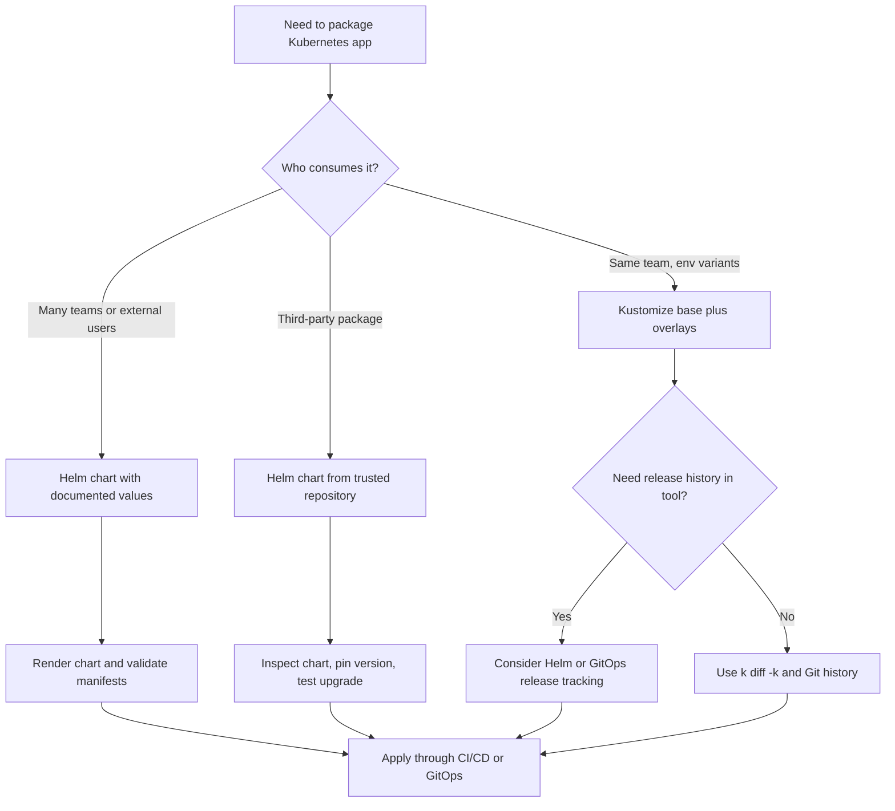

# Module 4.2: Application Packaging

> **Complexity**: `[MEDIUM]` - Tool concepts
>
> **Time to Complete**: 35-40 minutes
>
> **Prerequisites**: Module 4.1 (CI/CD Fundamentals), basic Deployment and Service manifests, and comfort reading YAML

## Learning Outcomes

After completing this module, you will be able to make packaging decisions from evidence instead of habit. Each outcome below connects to a core section, a scenario question, or the hands-on review, so treat the list as a map of the skills you will practice rather than a set of terms to memorize.

1. **Compare** Helm and Kustomize as Kubernetes application packaging approaches for Kubernetes 1.35+ delivery workflows.
2. **Design** a Helm chart structure that separates templates, values, dependencies, and release lifecycle concerns.
3. **Diagnose** when Kustomize overlays are a better fit than Helm templates for environment-specific configuration.
4. **Evaluate** packaging strategies for multi-environment deployments across dev, staging, and production.
5. **Implement** a repeatable packaging review that checks rendered manifests before they reach a cluster.

## Why This Module Matters

In late 2023, a payments team at a large retailer spent a full launch evening chasing a production outage that did not come from Kubernetes itself. The Deployment was valid, the Service was valid, and the container image had passed every pipeline check, yet the checkout API kept recycling because production had a memory limit copied from a small development namespace. The bad value lived in one of several nearly identical YAML files, and the on-call engineer fixed the staging copy first because the filenames looked alike at a glance. By the time the production manifest was corrected, customers had seen failed payments, support had opened an incident bridge, and the team had learned that raw manifests do not stay simple once environments multiply.

That kind of failure is why application packaging matters. Kubernetes gives you an API for declaring desired state, but it does not automatically tell you how to organize the many objects that make up one application across teams, environments, and release versions. Packaging tools sit in the space between application code and cluster reconciliation: they help you reuse a known structure, change the few values that should differ, preview the YAML that will be applied, and keep enough release history to recover when a change behaves differently in the real cluster than it did in a review.

KCNA does not expect you to become a Helm chart author overnight, and it does not ask you to memorize every Kustomize transformer. It does expect you to recognize the operational problem each tool solves, choose the approach that matches a delivery scenario, and explain the trade-off in plain language. In this module, you will work from the pain of duplicated manifests toward Helm charts, Kustomize overlays, mixed workflows, and a practical preflight review that uses the `kubectl` alias `k` for Kubernetes 1.35+ commands.

Before you run any command examples in a real shell, define the short alias used throughout this module:

```bash
alias k=kubectl
```

## The Problem with Raw Manifests

Raw manifests are the right starting point because they teach you the Kubernetes API without an extra layer. A Deployment, a Service, a ConfigMap, an Ingress, and a PersistentVolumeClaim are all ordinary API objects, and applying them directly helps you see how the cluster responds. The trouble begins when the same application needs a dev version with one replica, a staging version with production-like routing, and a production version with stronger resource limits, stricter labels, and a pinned image tag. If each environment owns a complete copy of every YAML file, the cost of one structural change grows with every copied directory.

```text
┌─────────────────────────────────────────────────────────────┐
│              THE MANIFEST PROBLEM                           │
├─────────────────────────────────────────────────────────────┤
│                                                             │
│  Managing many YAML files:                                 │
│  ─────────────────────────────────────────────────────────  │
│                                                             │
│  my-app/                                                   │
│  ├── deployment.yaml                                      │
│  ├── service.yaml                                         │
│  ├── configmap.yaml                                       │
│  ├── secret.yaml                                          │
│  ├── ingress.yaml                                         │
│  └── pvc.yaml                                             │
│                                                             │
│  Problems:                                                 │
│  ─────────────────────────────────────────────────────────  │
│                                                             │
│  1. DUPLICATION                                           │
│     Same app for dev/staging/prod = 3x files              │
│     Only difference: image tag, replicas, resources       │
│                                                             │
│  2. NO TEMPLATING                                         │
│     Can't parameterize values                              │
│     Hardcoded everywhere                                  │
│                                                             │
│  3. NO VERSIONING                                         │
│     What version is deployed?                             │
│     How to rollback?                                      │
│                                                             │
│  4. NO DEPENDENCIES                                       │
│     App needs Redis → manage separately                   │
│                                                             │
└─────────────────────────────────────────────────────────────┘
```

The diagram shows the central tension: Kubernetes manifests are precise, but precision becomes fragility when copied by hand. Imagine a restaurant recipe copied into three binders for lunch service, dinner service, and a catering kitchen. If the chef changes the allergy warning in only two binders, the third binder is now dangerous even though every page still looks professional. Kubernetes manifests behave the same way; a missed label selector, an old image tag, or a forgotten Secret reference can remain syntactically valid while still being operationally wrong.

The first packaging lesson is to separate what should remain stable from what should vary. Stable structure includes the resource kinds, selector relationships, ports, labels, probes, and most security settings that define how the application runs. Variable configuration includes replica counts, image tags, hostnames, resource requests, feature flags, and optional dependencies that differ by environment or customer. Packaging tools do not remove the need to understand the underlying objects; they give you a disciplined way to keep the stable structure in one place while making the variable pieces explicit.

Pause and predict: if a team copies the same Deployment into dev, staging, and production, what happens when the Service selector changes but one environment keeps the old label? The answer is not a YAML parsing failure; it is usually a quiet traffic failure where Pods exist, the Service exists, and endpoints are empty or wrong. That distinction is important for KCNA because packaging is not only about developer convenience. It is a reliability practice that reduces the number of valid-but-wrong combinations a release process can create.

The second packaging lesson is that rendered YAML must remain inspectable. Whether a tool starts from templates, overlays, generated ConfigMaps, or chart dependencies, Kubernetes still receives ordinary API objects in the end. A healthy packaging workflow therefore includes a moment where the team reviews the generated result before applying it. You should be able to answer basic questions such as which image tag will be deployed, how many replicas will run, which namespace receives the objects, and which labels connect the Service to the Pods.

```bash
k apply --dry-run=server -f deployment.yaml
k diff -f deployment.yaml
```

These commands are intentionally simple because they show the baseline that packaging tools must preserve. Server-side dry run asks the Kubernetes API server to validate an object without persisting it, while `k diff` shows what would change compared with live state. Helm and Kustomize add higher-level ways to produce manifests, but a careful operator still brings the conversation back to the rendered objects and the cluster API that will accept or reject them.

Another way to think about raw manifests is to separate correctness from maintainability. A single Deployment file can be perfectly correct, but a directory of copied Deployments can be unmaintainable because the team no longer knows which differences are intentional. Packaging tools help by creating a smaller review surface. Instead of asking a reviewer to compare hundreds of repeated lines, you ask them to inspect a base, a template, a values file, or a patch that captures the intended difference.

That smaller review surface also supports incident response. During an outage, the operator needs to answer fast questions: which image was deployed, which environment-specific value changed, which package version introduced it, and how do we return to the last known-good shape? A repository full of copied YAML forces the operator to infer those answers from filenames and commit history. A good package makes the answers explicit enough that the operator can move from symptoms to rollback or fix with less guesswork.

There is still a trap: packaging can hide complexity if teams stop looking at the generated output. A Helm chart with clever conditionals can produce surprising YAML, and a Kustomize overlay can transform object names in ways that surprise a hand-written patch. That is why this module keeps returning to render, diff, and validate. The package source should be clean, but the rendered manifest is the contract Kubernetes actually sees.

For KCNA, avoid reducing this topic to a tool popularity contest. The exam-level skill is to diagnose the shape of a delivery problem and match it to a packaging model. If the problem is repeated environment variation, overlays may be enough. If the problem is distributing a reusable package to many consumers, a chart may be better. If the problem is safely adopting a third-party component, discovery, trust, version pinning, and rendered-manifest review become part of the answer.

## Helm: Charts, Values, and Releases

Helm is often described as the package manager for Kubernetes, but the phrase only becomes useful when you unpack the three nouns behind it. A chart is a versioned package that contains templates, default values, metadata, and optional dependencies. A release is one installed instance of that chart in a cluster. A repository is a place where charts are published and discovered, much like a package registry for language libraries. This model is powerful because it treats a Kubernetes application as something that can be installed, upgraded, rolled back, and shared with teams that did not write the original manifests.

```text
┌─────────────────────────────────────────────────────────────┐
│              HELM                                           │
├─────────────────────────────────────────────────────────────┤
│                                                             │
│  "The package manager for Kubernetes"                     │
│  CNCF Graduated project                                   │
│                                                             │
│  Key concepts:                                             │
│  ─────────────────────────────────────────────────────────  │
│                                                             │
│  CHART                                                     │
│  Package containing Kubernetes resources                  │
│  Templates + values + metadata                            │
│                                                             │
│  RELEASE                                                   │
│  Instance of a chart in a cluster                         │
│  Same chart can have multiple releases                    │
│                                                             │
│  REPOSITORY                                                │
│  Collection of charts (like npm registry)                │
│                                                             │
│  Chart structure:                                         │
│  ─────────────────────────────────────────────────────────  │
│                                                             │
│  my-app/                                                   │
│  ├── Chart.yaml          # Metadata (name, version)      │
│  ├── values.yaml         # Default values                │
│  ├── templates/                                           │
│  │   ├── deployment.yaml                                 │
│  │   ├── service.yaml                                    │
│  │   └── _helpers.tpl                                   │
│  └── charts/             # Dependencies                   │
│                                                             │
└─────────────────────────────────────────────────────────────┘
```

The chart structure in the diagram is worth reading as a contract between chart authors and chart consumers. `Chart.yaml` names the package and records versions, so tools and humans can discuss exactly which package changed. `values.yaml` provides defaults that make the chart installable without a long command line, while the `templates/` directory turns those values into Kubernetes objects. The optional `charts/` directory captures dependencies, which matters when an application needs a database, cache, metrics exporter, or another component installed alongside it.

Helm templating is based on Go templates, so it can do string substitution, conditionals, loops, helper templates, and value transformation. That power is the reason charts can support many deployment shapes from one package. It is also the reason charts can become hard to read when every field is wrapped in logic. A good chart should feel like a carefully labeled form: the structure is recognizable, the values are documented, and the generated manifest can be inspected without reverse engineering a maze of nested conditions.

```text
┌─────────────────────────────────────────────────────────────┐
│              HELM TEMPLATING                                │
├─────────────────────────────────────────────────────────────┤
│                                                             │
│  Template (templates/deployment.yaml):                    │
│  ─────────────────────────────────────────────────────────  │
│                                                             │
│  apiVersion: apps/v1                                      │
│  kind: Deployment                                          │
│  metadata:                                                 │
│    name: {{ .Release.Name }}-app                         │
│  spec:                                                     │
│    replicas: {{ .Values.replicas }}                      │
│    template:                                               │
│      spec:                                                 │
│        containers:                                         │
│        - name: app                                        │
│          image: {{ .Values.image.repository }}:{{         │
│                    .Values.image.tag }}                   │
│          resources:                                        │
│            {{- toYaml .Values.resources | nindent 12 }}  │
│                                                             │
│  Values (values.yaml):                                    │
│  ─────────────────────────────────────────────────────────  │
│                                                             │
│  replicas: 3                                               │
│  image:                                                    │
│    repository: nginx                                      │
│    tag: 1.25                                              │
│  resources:                                                │
│    limits:                                                 │
│      cpu: 100m                                            │
│      memory: 128Mi                                        │
│                                                             │
│  Override values:                                         │
│  ─────────────────────────────────────────────────────────  │
│  helm install my-release ./my-app \                       │
│    --set replicas=5 \                                     │
│    --set image.tag=1.26                                   │
│                                                             │
│  Or use values file:                                      │
│  helm install my-release ./my-app -f prod-values.yaml    │
│                                                             │
└─────────────────────────────────────────────────────────────┘
```

The example shows why Helm is attractive for reusable packaging. The template expresses the stable Deployment structure, and `values.yaml` expresses the knobs a consumer is expected to change. A development team can install the same chart with a small dev values file, while production can use a different values file with more replicas, tighter resources, and a different image tag. The release name becomes part of the object names, so the same chart can be installed more than once in the same cluster when the naming and namespace model allow it.

```yaml
# values-prod.yaml
replicas: 5
image:
  repository: ghcr.io/example/checkout-api
  tag: "1.26.3"
resources:
  limits:
    cpu: 500m
    memory: 512Mi
  requests:
    cpu: 250m
    memory: 256Mi
```

```bash
helm template checkout ./my-app -f values-prod.yaml
helm install checkout ./my-app -f values-prod.yaml --namespace payments --create-namespace
helm upgrade checkout ./my-app -f values-prod.yaml --namespace payments
helm rollback checkout --namespace payments
```

`helm template` deserves special attention because it lets you inspect the generated YAML without changing the cluster. `helm install` creates a release, `helm upgrade` updates that release, and `helm rollback` returns to a previous revision when an upgrade needs to be reversed. In a mature workflow, these commands are not random operator tricks; they are pipeline stages that render, validate, diff, apply, and record what happened. The chart is the package, but the release history is the operational memory that helps an on-call engineer answer what changed.

| Command | Purpose |
|---------|---------|
| `helm install` | Install a chart |
| `helm upgrade` | Upgrade a release |
| `helm rollback` | Rollback to previous version |
| `helm uninstall` | Remove a release |
| `helm list` | List releases |
| `helm repo add` | Add chart repository |
| `helm search` | Search for charts |

Before running this in a lab cluster, what output do you expect from `helm template` if the values file sets `replicas: 5` but the template accidentally hardcodes `replicas: 2`? The rendered YAML will show `2`, because templates control the final manifest and values only matter where the chart author references them. That is the practical debugging habit to build: do not assume a values file is active just because it exists. Render the chart and confirm that the value appears in the object Kubernetes will actually receive.

A common war story around Helm starts with a platform team publishing a chart that supports dozens of options because every consuming service asked for one more toggle. Six months later, nobody can tell which combinations are supported, and a harmless-looking upgrade changes a nested default used by only one service. The better pattern is to keep the public values surface narrow, document the supported combinations, and add chart tests or schema validation for risky inputs. Helm gives you release mechanics, but it does not automatically design a clean interface for your chart consumers.

The chart author should therefore think like an API designer. Values are not just variables; they are the public interface of the package. If a value is exposed, consumers will depend on it, copy it into their repositories, and expect it to keep working across upgrades. If every internal template detail becomes configurable, the chart stops being a useful abstraction and becomes a remote-control panel with too many unlabeled switches.

Release lifecycle is the second reason Helm matters. A release records that a particular chart, with particular values, was installed into a particular namespace under a particular name. When an upgrade fails, the team can ask Helm for release history and choose a rollback target. That does not remove the need for database backup, application compatibility testing, or careful migration planning, but it gives the Kubernetes object layer an operational memory that raw `k apply` does not provide by itself.

Dependencies are the third reason Helm shows up in real delivery systems. An application may need Redis, PostgreSQL, a metrics exporter, or another supporting component, and a chart can declare chart dependencies so related packages are resolved together. This is useful when the dependency is genuinely part of the installable application. It is dangerous when teams hide infrastructure ownership inside an app chart and accidentally let one service team upgrade a shared dependency used by other services.

When you review a Helm chart, read from the outside inward. Start with the chart metadata and values file to understand the promised interface, then render the templates to see the real objects, then inspect the templates only where the rendered output raises questions. That order protects you from staring at template syntax too early. It also matches how most chart consumers experience Helm: they mainly interact with values, release commands, and rendered Kubernetes resources.

## Kustomize: Bases, Overlays, and Patches

Kustomize takes a different path. Instead of rendering templates with placeholders, it starts with ordinary Kubernetes YAML and applies declarative transformations on top. A base directory contains the shared resources, and overlays describe how an environment changes that base. This makes Kustomize appealing for teams that already have good manifests and mainly need controlled variation across environments. It is also built into `kubectl` as `k apply -k`, which lowers the tool adoption barrier for Kubernetes teams that do not want another package manager in the critical path.

```text
┌─────────────────────────────────────────────────────────────┐
│              KUSTOMIZE                                      │
├─────────────────────────────────────────────────────────────┤
│                                                             │
│  "Kubernetes native configuration management"             │
│  Built into kubectl (kubectl apply -k)                    │
│                                                             │
│  Key difference from Helm:                                │
│  ─────────────────────────────────────────────────────────  │
│  • NO templating                                          │
│  • Uses overlays and patches                              │
│  • Pure Kubernetes YAML                                   │
│                                                             │
│  Structure:                                                │
│  ─────────────────────────────────────────────────────────  │
│                                                             │
│  my-app/                                                   │
│  ├── base/                    # Common resources          │
│  │   ├── kustomization.yaml                              │
│  │   ├── deployment.yaml                                 │
│  │   └── service.yaml                                    │
│  └── overlays/                                            │
│      ├── dev/                 # Dev-specific             │
│      │   ├── kustomization.yaml                          │
│      │   └── replica-patch.yaml                          │
│      └── prod/                # Prod-specific            │
│          ├── kustomization.yaml                          │
│          └── replica-patch.yaml                          │
│                                                             │
│  How it works:                                            │
│  ─────────────────────────────────────────────────────────  │
│                                                             │
│  Base: The original resources                             │
│  Overlay: Modifications applied on top of base           │
│                                                             │
│        [Base]                                              │
│           │                                                │
│     ┌─────┴─────┐                                         │
│     ▼           ▼                                         │
│  [Overlay:   [Overlay:                                    │
│   Dev]       Prod]                                        │
│                                                             │
└─────────────────────────────────────────────────────────────┘
```

The "no templating" point is the heart of Kustomize, not a limitation to wave away. Plain YAML means the base files look like the objects Kubernetes will eventually receive, which makes review approachable for developers who understand the API but do not know Go template syntax. An overlay can add a namespace, prefix names, change an image tag, increase replicas, generate a ConfigMap, or patch a field. The result is still generated, so you should inspect it, but the mental model is more like editing transparent layers on a map than running a programming language over a template.

```text
┌─────────────────────────────────────────────────────────────┐
│              KUSTOMIZE EXAMPLE                              │
├─────────────────────────────────────────────────────────────┤
│                                                             │
│  base/kustomization.yaml:                                 │
│  ─────────────────────────────────────────────────────────  │
│  apiVersion: kustomize.config.k8s.io/v1beta1             │
│  kind: Kustomization                                      │
│  resources:                                                │
│  - deployment.yaml                                        │
│  - service.yaml                                           │
│                                                             │
│  overlays/prod/kustomization.yaml:                        │
│  ─────────────────────────────────────────────────────────  │
│  apiVersion: kustomize.config.k8s.io/v1beta1             │
│  kind: Kustomization                                      │
│  resources:                                                │
│  - ../../base                                             │
│  namePrefix: prod-                                        │
│  replicas:                                                 │
│  - name: my-app                                           │
│    count: 5                                               │
│  images:                                                   │
│  - name: nginx                                            │
│    newTag: "1.26"                                         │
│                                                             │
│  Apply:                                                   │
│  ─────────────────────────────────────────────────────────  │
│  kubectl apply -k overlays/prod/                         │
│                                                             │
│  Kustomize features:                                      │
│  • namePrefix/nameSuffix: Add prefix to all names        │
│  • namespace: Set namespace for all resources            │
│  • images: Override image tags                           │
│  • replicas: Override replica counts                     │
│  • patches: Modify any field                             │
│  • configMapGenerator: Create ConfigMaps from files      │
│  • secretGenerator: Create Secrets from files            │
│                                                             │
└─────────────────────────────────────────────────────────────┘
```

The base-and-overlay pattern works best when the environments share a stable shape. If dev, staging, and production all run the same application with the same core objects, Kustomize can keep the base authoritative and let each overlay carry only the differences. Production can raise replicas and pin the image, dev can use a smaller resource profile, and staging can add an Ingress hostname that mirrors production. You get a clear review signal because an overlay file should be small enough for a teammate to understand why that environment is different.

```yaml
# overlays/prod/kustomization.yaml
apiVersion: kustomize.config.k8s.io/v1beta1
kind: Kustomization
resources:
  - ../../base
namespace: payments
namePrefix: prod-
replicas:
  - name: checkout-api
    count: 5
images:
  - name: ghcr.io/example/checkout-api
    newTag: "1.26.3"
patches:
  - path: resource-limits.yaml
```

```bash
k kustomize overlays/prod
k diff -k overlays/prod
k apply -k overlays/prod
```

The command sequence mirrors the discipline you saw with Helm. `k kustomize` renders the overlay locally, `k diff -k` compares the rendered result with live state, and `k apply -k` applies it. Kustomize is not a release manager, so it will not record a release history in the same way Helm does. That trade-off is acceptable when Git is the source of truth and your deployment controller or pipeline records changes elsewhere, but it matters if your recovery process depends on a built-in rollback command.

Which approach would you choose here and why: a team owns ten internal services, all with nearly identical manifests, and only image tags, hostnames, and replica counts differ per environment? Kustomize is often the cleaner default because it keeps the Kubernetes objects recognizable and avoids teaching every service team a chart values interface. If the same team later wants to publish a reusable database-backed application to other departments, the balance may shift toward Helm because consumers need a package with versioned defaults and documented installation commands.

A practical Kustomize incident usually looks less dramatic than a broken template but just as expensive. A team adds `namePrefix: prod-` in an overlay, but a hand-written patch still targets the unprefixed name or a Service monitor expects the old label. The render step is where that mistake should be caught. If the generated Deployment is named `prod-checkout-api`, your patches and selectors must land on the transformed names and labels you intend, not the names you remember from the base.

Kustomize also teaches a useful discipline about ownership. The base should describe the common application truth, not the preferences of one environment disguised as a default. If production has five replicas and dev has one, the base can choose a minimal value, while the production overlay makes the production intent visible. If a base contains production-only annotations, storage classes, or hostnames, every non-production overlay must spend effort undoing those choices, which is a sign that the base is carrying the wrong responsibility.

Patches should be precise enough to communicate intent. A patch that changes one resource limit or one annotation is easier to review than a patch that replaces a large block of Deployment spec. When patches become broad, the overlay starts to look like a copied manifest with extra steps, and the team loses the maintenance benefit it wanted. In that situation, either simplify the variation, split the base, or reconsider whether a chart with a values interface would express the differences more honestly.

Because Kustomize does not provide Helm-style release history, teams often pair it with GitOps controllers or CI/CD records. That is a reasonable architecture when the repository is the source of truth and every environment change arrives through a pull request. The important point is to know where rollback information lives. If the answer is Git, make sure the rendered effect of a commit is easy to reconstruct and that the deployment controller reports which revision is currently applied.

## Choosing Between Helm, Kustomize, and Mixed Workflows

Helm and Kustomize overlap because both can produce environment-specific Kubernetes manifests, but they optimize for different organizational problems. Helm is strongest when you package software for installation by many consumers who need a stable versioned interface. Kustomize is strongest when one team owns the base manifests and needs transparent environment overlays. The wrong choice is not usually catastrophic on day one; the cost shows up later when templates become unreadable, overlays become too many to reason about, or nobody can reconstruct which package version is actually running.

```text
┌─────────────────────────────────────────────────────────────┐
│              HELM vs KUSTOMIZE                              │
├─────────────────────────────────────────────────────────────┤
│                                                             │
│  HELM:                                                     │
│  ─────────────────────────────────────────────────────────  │
│  + Powerful templating                                    │
│  + Package versioning                                     │
│  + Dependency management                                  │
│  + Large ecosystem (Artifact Hub)                        │
│  + Release tracking                                       │
│  - Complex template syntax                                │
│  - Must learn Go templating                              │
│                                                             │
│  KUSTOMIZE:                                               │
│  ─────────────────────────────────────────────────────────  │
│  + No templating = pure YAML                             │
│  + Built into kubectl                                     │
│  + Easy to understand                                     │
│  + No new syntax to learn                                 │
│  - Limited compared to templating                        │
│  - No package versioning                                 │
│  - No dependency management                               │
│                                                             │
│  When to use what:                                        │
│  ─────────────────────────────────────────────────────────  │
│                                                             │
│  Helm:                                                     │
│  • Distributing apps to others                           │
│  • Complex templating needs                              │
│  • Need dependency management                             │
│  • Using third-party charts                              │
│                                                             │
│  Kustomize:                                               │
│  • Internal apps with environment variations             │
│  • Simple overlays (dev/staging/prod)                    │
│  • Teams unfamiliar with templating                      │
│  • GitOps workflows                                       │
│                                                             │
│  Both together:                                            │
│  • Helm for base chart                                    │
│  • Kustomize for environment overlays                    │
│                                                             │
└─────────────────────────────────────────────────────────────┘
```

Use Helm when the application package itself is the product. A database chart, an ingress controller chart, a monitoring stack chart, or a platform-provided service template all benefit from versioned releases, dependency metadata, and a clear values contract. Helm also fits when the application shape changes based on options: enable an Ingress only for some installations, add extra sidecars for some consumers, or install a dependent chart when a feature is enabled. Those are real packaging needs, not just environment differences.

Use Kustomize when the application shape is mostly fixed and you want environment variation without another templating language. A team that practices GitOps may prefer Kustomize because the repository can show base resources and overlays as plain Kubernetes files, while the controller reconciles the generated result. It is especially effective when review culture is strong: a small overlay diff clearly shows that production changed from three replicas to five, or that staging now uses a new image tag. The simplicity helps new contributors diagnose what changed.

Mixed workflows are common, but they should be deliberate. A platform team might use Helm to consume a third-party chart, render it into a base, and then use Kustomize overlays to apply organization-specific labels, namespaces, or environment patches. Another team might deploy a Helm chart through a GitOps controller that supports Helm values per environment. The risk is layering tools until nobody knows where a field came from. If a value can be changed in Helm defaults, a values file, a Kustomize patch, and a deployment controller override, debugging becomes archaeology.

> **Stop and think**: Helm uses Go templating to generate YAML, while Kustomize uses overlays on plain YAML without any templating. Which approach would be easier for a team that has never used either tool? Which would be more powerful for distributing an application to external users who need to customize many settings?

The easiest answer for a new team is often Kustomize because the base remains normal Kubernetes YAML. The more powerful answer for broad distribution is often Helm because consumers can install a versioned chart with their own values and, if needed, chart dependencies. Those answers can both be true because "easy to start" and "powerful to distribute" are different goals. KCNA questions often test that distinction: a tool is not better in the abstract, it is better for a scenario.

The following matrix turns the comparison into a review habit. Read it from left to right when a team proposes a packaging strategy, and ask whether the operational need is really package distribution, environment variation, dependency management, or transparent Git review. A good answer should name the dominant need and the cost the team is accepting.

| Scenario | Stronger Default | Why It Fits | Watch For |
|----------|------------------|-------------|-----------|
| Internal app with dev, staging, and production differences | Kustomize | Base manifests stay readable, overlays carry small changes | Overlay sprawl and patches that silently miss targets |
| Platform template consumed by many service teams | Helm | Versioned chart, documented values, release history | Values surface becoming too broad or underdocumented |
| Third-party infrastructure component | Helm | Vendor chart and Artifact Hub ecosystem reduce packaging effort | Trust, image provenance, and chart upgrade notes |
| GitOps repository with cluster-specific changes | Kustomize | Plain YAML works naturally with pull-request review | No built-in Helm-style release rollback |
| Application with optional dependent services | Helm | Dependencies and templating express optional components | Dependency upgrades can change behavior unexpectedly |
| Vendor chart plus local policy labels | Both | Helm supplies upstream package, Kustomize applies local overlays | Too many override layers hiding the source of a field |

The matrix is not meant to force a universal standard across every team. It is meant to expose the assumption behind a choice. A platform team may standardize on Helm because its central problem is distributing a supported interface to many service teams. A product team may standardize on Kustomize because its central problem is reviewing environment differences in Git. Both standards can be coherent if they name the problem they optimize for and document the cases where another approach is allowed.

The hardest scenarios are usually transitional. A team begins with raw manifests, adopts Kustomize for environment overlays, then later wants to publish the same application as a reusable platform package. Another team installs a vendor Helm chart, then needs local policy labels, network settings, and cluster-specific patches. In these moments, resist the urge to layer tools without a design. Draw the path from source files to rendered YAML and mark which layer owns each field that matters operationally.

One practical rule helps keep mixed workflows healthy: the later layer should customize local deployment context, not rewrite the product model. For example, Kustomize can add a namespace, labels required by a platform, or a cluster-specific storage class to Helm-rendered output. It should not routinely change container commands, probes, or core application settings that the chart values interface already owns. If the later layer keeps overriding core chart behavior, the chart interface and the local requirements are probably mismatched.

## Other Packaging Tools and Artifact Discovery

Helm and Kustomize dominate KCNA-level packaging discussions, but they are not the whole landscape. Other tools exist because configuration has competing needs: programmability, type checking, validation, image resolution, progressive deployment, and operator-driven lifecycle management. You do not need deep syntax knowledge for every tool at this stage. You do need to recognize that packaging approaches sit on a spectrum from "plain YAML with patches" to "configuration as a typed or programmable language" to "custom controllers that manage application lifecycle."

```text
┌─────────────────────────────────────────────────────────────┐
│              OTHER TOOLS                                    │
├─────────────────────────────────────────────────────────────┤
│                                                             │
│  JSONNET / TANKA                                          │
│  ─────────────────────────────────────────────────────────  │
│  • Data templating language                               │
│  • Generate JSON/YAML programmatically                   │
│  • Used by Grafana Labs                                   │
│                                                             │
│  CUE                                                      │
│  ─────────────────────────────────────────────────────────  │
│  • Configuration language                                 │
│  • Strong typing and validation                          │
│  • Merge-able configurations                             │
│                                                             │
│  CARVEL (formerly k14s)                                   │
│  ─────────────────────────────────────────────────────────  │
│  • ytt: YAML templating                                  │
│  • kbld: Image building/resolving                        │
│  • kapp: Deployment tool                                 │
│  • CNCF sandbox project                                  │
│                                                             │
│  OPERATORS                                                │
│  ─────────────────────────────────────────────────────────  │
│  • For complex stateful apps                             │
│  • Custom controllers                                    │
│  • Beyond simple packaging                               │
│                                                             │
└─────────────────────────────────────────────────────────────┘
```

Jsonnet and Tanka appeal to teams that want programmable configuration with reusable functions and data structures. CUE appeals to teams that want validation and constraints built into the configuration language itself. Carvel provides a suite of tools around templating, image resolution, and application deployment. Operators go beyond packaging by adding a controller that watches custom resources and performs lifecycle actions, which is useful for stateful systems that need domain-specific automation. The decision is less about fashion and more about whether the team needs simple variation, reusable packaging, typed configuration, or active reconciliation logic.

Artifact discovery adds another operational question: when should you build a package yourself, and when should you use a package from the ecosystem? Artifact Hub is a CNCF project that indexes Helm charts and other cloud native artifacts, making it a common starting point when teams need a known application such as PostgreSQL, Prometheus, cert-manager, or an ingress controller. Discovery is useful, but it does not replace review. A chart found through a hub still needs source inspection, version pinning, values review, and a test installation before it belongs in production.

```text
┌─────────────────────────────────────────────────────────────┐
│              ARTIFACT HUB                                   │
├─────────────────────────────────────────────────────────────┤
│                                                             │
│  artifacthub.io                                           │
│  CNCF project                                              │
│                                                             │
│  Central repository for:                                  │
│  ─────────────────────────────────────────────────────────  │
│  • Helm charts                                            │
│  • OPA policies                                           │
│  • Falco rules                                            │
│  • OLM operators                                          │
│  • And more...                                            │
│                                                             │
│  Use it to:                                               │
│  • Find charts for popular applications                  │
│  • Discover alternatives                                  │
│  • Check chart quality/security                          │
│                                                             │
│  Example: Need PostgreSQL?                                │
│  → Search "postgresql" on Artifact Hub                   │
│  → Find Bitnami chart                                    │
│  → helm repo add bitnami https://charts.bitnami.com/...  │
│  → helm install my-postgres bitnami/postgresql          │
│                                                             │
└─────────────────────────────────────────────────────────────┘
```

A safe third-party chart workflow starts with questions a beginner can learn to ask. Who publishes the chart, and is the repository the one you expect? Which container images will it deploy, and are they pinned to versions you can track? What CustomResourceDefinitions, ClusterRoles, webhooks, or privileged settings does it install? Does the chart provide values for resource requests, persistence, network exposure, and security context? These questions matter because installing a chart is not just downloading YAML; it is trusting a package to create objects in your cluster.

```bash
helm repo add bitnami https://charts.bitnami.com/bitnami
helm repo update
helm show chart bitnami/postgresql
helm show values bitnami/postgresql > postgresql-values.yaml
helm template my-postgres bitnami/postgresql -f postgresql-values.yaml
```

The review sequence above is intentionally cautious. `helm show chart` reveals chart metadata, `helm show values` exposes the configurable surface, and `helm template` lets you inspect the objects before installation. A production team would add policy checks, image scanning, namespace scoping, and an upgrade test in a non-production cluster. For KCNA, the key is recognizing that Artifact Hub helps you find packages, while Helm and your delivery process decide how those packages become cluster state.

Operators belong in the packaging conversation because they represent another kind of boundary. A Helm chart or Kustomize overlay usually describes a set of objects to create, while an operator watches custom resources and performs ongoing actions after installation. That difference matters for stateful systems such as databases, message queues, or certificate authorities. A chart can install the initial objects, but an operator may handle backup hooks, failover, upgrades, and domain-specific reconciliation that static YAML cannot express well.

Typed configuration tools such as CUE address a different problem: preventing invalid combinations before they become YAML. If a platform team repeatedly sees invalid resource settings, missing labels, or incompatible feature flags, stronger configuration validation may be more valuable than more template power. The trade-off is that the team must teach another language or toolchain and integrate it into reviews. As with Helm and Kustomize, the question is whether the additional abstraction reduces real operational risk.

Artifact discovery should also include maintenance expectations. A chart that looks active today may change ownership, deprecate a value, rename a resource, or alter default security settings in a future release. Pinning versions and reading release notes are not bureaucratic chores; they are how teams convert an external artifact into a controlled internal dependency. The same mindset applies to policies, operators, and other packages listed in a hub. Discovery starts the evaluation, but ownership begins when you decide to run it.

## Patterns & Anti-Patterns

Application packaging succeeds when the tool boundary matches the team boundary. If the platform team publishes a chart, the chart interface should be stable enough for application teams to consume without reading every template. If a service team owns overlays, those overlays should be small and obvious enough for the service team to review during normal pull requests. If a GitOps controller reconciles the final manifests, the repository should make it clear which rendered shape is intended for each cluster. The pattern is not "use the popular tool"; the pattern is "make the source of each deployment decision visible."

| Pattern | When to Use It | Why It Works | Scaling Consideration |
|---------|----------------|--------------|-----------------------|
| Values file per environment | Helm chart has the same structure across dev, staging, and production | Differences are explicit and reviewable without copying templates | Keep values documented and validate risky fields with schema or tests |
| Base plus overlays | Internal manifests share most objects and only a few fields differ | Reviewers see the common base and the environment-specific changes separately | Periodically remove dead overlays and verify patches still match rendered names |
| Render before apply | Any packaged workflow that produces YAML | Teams inspect what Kubernetes will receive before changing live state | Automate rendering, validation, diff, and policy checks in the pipeline |
| Version pinning | Third-party charts or images enter production | Reproducibility improves because upgrades become explicit events | Track chart version, app version, image tag, and upgrade notes together |

Anti-patterns usually begin as shortcuts. A chart author adds a quick conditional for one team, an overlay owner copies a base to avoid learning patches, or an operator installs the latest chart from a repository during an incident because it seems faster. Each shortcut can work once and still leave behind a delivery system that is harder to reason about. Packaging should reduce the number of places a decision can hide, not create new hiding places.

| Anti-Pattern | What Goes Wrong | Better Alternative |
|--------------|-----------------|--------------------|
| Copying entire environment directories | Shared fixes drift because every copy must be edited by hand | Keep a base or chart template and isolate environment values |
| Turning Helm templates into a programming project | Reviewers cannot predict rendered YAML from the chart | Keep templates boring, render in CI, and document supported values |
| Using Kustomize patches for unrelated product variants | Overlay logic becomes a second application model | Split the base or use a chart when the application shape truly varies |
| Installing third-party charts without review | Cluster-wide permissions, webhooks, or default storage settings surprise the team | Inspect chart metadata, values, rendered manifests, and release notes first |

## Decision Framework

Start a packaging decision by naming the change axis. If the application changes mostly by environment, Kustomize may be enough. If the application changes mostly by consumer or feature option, Helm is often a better package boundary. If the source is a third-party chart but your organization needs local labels, namespaces, or policy patches, a mixed workflow may be justified. The decision should also include how the team will preview manifests, record release state, and roll back a bad change.



Use the framework as a conversation script rather than a rigid law. Ask who changes the package, who consumes it, how many environments exist, whether dependencies need to be managed, and how rollback is performed. A small internal service may not need the ceremony of a public chart. A platform component consumed by dozens of teams should not rely on everyone editing patches correctly. A production database chart should not be upgraded because a repository has a new version; it should be upgraded because the team reviewed the change and tested the release path.

| Decision Question | Choose Helm When | Choose Kustomize When | Consider Both When |
|-------------------|------------------|-----------------------|--------------------|
| Who is the consumer? | Many teams need a package interface | One team owns the manifests | Upstream package needs local policy |
| What varies? | Optional components and many values | Small environment differences | Chart defaults plus cluster overlays vary |
| How is rollback handled? | Helm release history is useful | Git history and deployment controller are enough | Helm records package revisions and Git records environment intent |
| How readable must the source be? | Consumers read values more than templates | Reviewers need plain YAML | Rendered output is reviewed regardless of source |
| How are dependencies handled? | Chart dependencies should install together | Dependencies are managed separately | Helm handles dependencies, overlays add local configuration |

The final decision is incomplete until you define the preflight check. For Helm, render with the selected values and inspect the release plan. For Kustomize, build the overlay and diff it against the cluster. For either tool, validate the generated objects with the Kubernetes API when possible, then apply through a repeatable pipeline rather than a one-off command pasted into a terminal.

A strong decision record should be short but specific. It should say which package source is authoritative, which fields each environment may change, how rendered manifests are reviewed, where release history lives, and what rollback command or Git operation the on-call engineer should use first. That record gives future maintainers a way to judge whether the packaging approach is still serving the application. Without it, teams often inherit a toolchain but not the reasoning that made the toolchain sensible.

You can practice the framework by testing it against uncomfortable edge cases. If a Helm chart has only one consumer and no dependencies, ask whether a Kustomize base would be simpler. If a Kustomize overlay contains a dozen patches that change application behavior, ask whether a chart values interface would be clearer. If a mixed workflow makes a production field hard to trace, ask which layer should own that field and remove the duplicate override. Good packaging decisions stay revisable because applications and teams change over time.

## Did You Know?

- **Helm v3 removed Tiller** - Helm v2 required a server component named Tiller inside the cluster, while Helm v3 removed that server-side component to simplify security and rely on the user's Kubernetes credentials.
- **Kustomize is built into kubectl** - Kubernetes has included `kubectl apply -k` support since version 1.14, which is why many teams can adopt overlays without installing a separate binary.
- **Helm uses Go templates** - Chart templates use Go's template language, so functions, conditionals, loops, and helper templates can generate many object shapes from one chart.
- **Charts can have dependencies** - A chart can declare other charts as dependencies, allowing related packages to be installed together when the dependency relationship is intentional and reviewed.

## Common Mistakes

| Mistake | Why It Happens | How to Fix It |
|---------|----------------|---------------|
| Duplicating manifests for dev, staging, and production | Copying files feels faster than learning packaging until the first shared change drifts | Use Helm values or Kustomize overlays so common structure has one owner |
| Building complex Helm templates for every possible option | Chart authors try to satisfy every consumer request inside one template set | Keep templates simple, document supported values, and split charts when products diverge |
| Not versioning charts or pinning chart versions | Teams treat chart repositories like live examples instead of release artifacts | Record chart version, app version, and image tag in the release process |
| Hardcoding secrets in values files or generated manifests | Local testing examples get promoted into shared repositories | Use Kubernetes Secret objects carefully and prefer external secret management for real credentials |
| Applying a Kustomize overlay without rendering it first | The overlay looks small, so reviewers assume the output is obvious | Run `k kustomize overlays/prod` and `k diff -k overlays/prod` before apply |
| Mixing Helm values and Kustomize patches for the same field | Multiple override layers grow organically across teams and tools | Assign one owner for each field and document whether Helm or Kustomize controls it |
| Installing third-party charts straight from search results | Artifact discovery is mistaken for trust and production readiness | Inspect source, values, rendered manifests, permissions, images, and upgrade notes before install |

## Quiz

<details><summary>Your team deploys the same API to dev, staging, and production. Each environment needs a different image tag, replica count, and hostname, but the Deployment and Service structure stay the same. How would you evaluate Helm versus Kustomize?</summary>

Kustomize is a strong fit because the application shape is stable and the differences are environment-specific. A base can hold the shared Deployment and Service, while overlays change image tags, replicas, and hostnames without copying every manifest. Helm can also solve the problem with values files, especially if the team already uses charts, but it adds a templating layer that may not be necessary. The reasoning should focus on what varies and who consumes the package, not on which tool is more powerful in general.

</details>

<details><summary>A platform group wants to publish one standardized application package for many service teams. Teams should set image, replicas, resource limits, and ingress host, while the platform group owns the object structure. Which packaging approach best supports that design?</summary>

Helm is usually the better default because it creates a versioned chart with a documented values interface. Service teams can install or upgrade the chart with their own values files without editing the templates directly. The platform group can review and release changes to the chart structure as a package, while release history helps diagnose what changed. Kustomize can share bases, but it is less natural as a product-like package for many independent consumers.

</details>

<details><summary>A Helm upgrade changes a production Deployment in a way the team did not expect. The values file looked correct during review. What should you inspect before deciding whether the values file or template caused the issue?</summary>

Render the chart with the same values file using `helm template` and inspect the generated Deployment. If the rendered YAML contains the unexpected field, the template logic or default values are producing it, even if the values file appears correct. If the rendered YAML looks right but the live object differs, inspect the actual release, admission controllers, and later patches from another tool. The key reasoning is that Kubernetes receives rendered manifests, not your intention inside a values file.

</details>

<details><summary>A Kustomize production overlay adds a name prefix, and afterward a Service no longer routes to Pods even though both objects exist. What is the most likely packaging-level diagnosis?</summary>

The overlay may have transformed names or labels in a way that left selectors and targets misaligned, or a patch may have landed on the wrong resource after name changes. Kustomize keeps YAML readable, but transformations still produce a generated result that must be inspected. Running `k kustomize overlays/prod` and checking labels, selectors, and object names should be the first step. The fix is to adjust the base, overlay, or patch so the rendered Service selector matches the rendered Pod labels.

</details>

<details><summary>A team finds a PostgreSQL chart through Artifact Hub and wants to install it directly into production because the chart is popular. What review steps should happen first?</summary>

Popularity is not a production readiness check. The team should inspect the publisher and repository, pin a chart version, review the default values, render the manifests, check container images, and look for cluster-scoped permissions, storage settings, webhooks, and security contexts. They should test installation and upgrade in a non-production namespace or cluster before production. Artifact Hub helps with discovery, while the delivery process must still establish trust and operational fit.

</details>

<details><summary>Your organization uses both Helm and Kustomize, and a replica count can be changed in the Helm values file or in a Kustomize patch. Why is this risky, and how would you redesign it?</summary>

This is risky because two override layers can fight over the same field, making it difficult to explain why the rendered Deployment has a particular replica count. During an incident, engineers may change the Helm value while the Kustomize patch continues to override it, or the reverse may happen. Redesign the workflow so one layer owns the field, then document that ownership in the package review process. A mixed workflow can be reasonable, but each field should have one clear source of intent.

</details>

<details><summary>A CI pipeline validates raw YAML with `k apply --dry-run=server`, but the team moves to Helm charts. What should change in the validation stage?</summary>

The pipeline should render the Helm chart with the exact values intended for the environment, then validate the rendered YAML. Validating only the templates or only a default values file misses the object Kubernetes will receive. A strong pipeline runs `helm template`, stores or streams the output, performs schema and policy checks, and then uses server-side dry run or an equivalent validation step against a suitable cluster API. The goal is the same as before: verify the final manifests before they change live state.

</details>

## Hands-On Exercise: Package and Review a Small Application

This exercise is a guided packaging review that you can run in a local Kubernetes 1.35+ practice cluster, or read through as a command-level walkthrough if you do not have a cluster available. You will create a small Deployment and Service, model how Kustomize changes the environment-specific values, compare that with the Helm values concept, and practice the preflight checks that prevent a package from becoming a mystery. The point is not to build a perfect production chart. The point is to make the rendered YAML visible before you trust it.

### Setup

Create a scratch directory outside the repository if you are running the commands locally. The examples use `nginx` because the image is familiar, not because it is a recommendation for application architecture. If your cluster already has a namespace named `packaging-lab`, choose a different name and apply the same value consistently.

```bash
mkdir -p packaging-lab/base packaging-lab/overlays/dev packaging-lab/overlays/prod
cd packaging-lab
k create namespace packaging-lab --dry-run=client -o yaml > namespace.yaml
```

### Tasks

- [ ] Create a base Deployment and Service that use the image `nginx:1.25` and the app label `checkout-api`.
- [ ] Add a base `kustomization.yaml` that lists the Deployment and Service as shared resources.
- [ ] Create a dev overlay that keeps one replica and changes the image tag to `1.26`.
- [ ] Create a prod overlay that sets five replicas, uses the same image tag, and adds the namespace `packaging-lab`.
- [ ] Render both overlays and compare the generated replica counts, image tags, names, labels, and selectors.
- [ ] Write a short packaging decision: would this application be better as Kustomize overlays, a Helm chart, or a mixed workflow?

<details><summary>Solution for tasks 1 and 2</summary>

Create the shared manifests first. These files are deliberately ordinary Kubernetes YAML so you can see what belongs in the stable base before overlays change environment-specific fields.

```yaml
# base/deployment.yaml
apiVersion: apps/v1
kind: Deployment
metadata:
  name: checkout-api
  labels:
    app: checkout-api
spec:
  replicas: 1
  selector:
    matchLabels:
      app: checkout-api
  template:
    metadata:
      labels:
        app: checkout-api
    spec:
      containers:
        - name: web
          image: nginx:1.25
          ports:
            - containerPort: 80
```

```yaml
# base/service.yaml
apiVersion: v1
kind: Service
metadata:
  name: checkout-api
  labels:
    app: checkout-api
spec:
  selector:
    app: checkout-api
  ports:
    - port: 80
      targetPort: 80
```

```yaml
# base/kustomization.yaml
apiVersion: kustomize.config.k8s.io/v1beta1
kind: Kustomization
resources:
  - deployment.yaml
  - service.yaml
```

</details>

<details><summary>Solution for tasks 3 and 4</summary>

Create overlays that keep the base intact and change only the environment intent. The dev overlay changes the image tag while leaving the default replica count alone. The prod overlay sets the namespace and raises replicas because production availability expectations differ from the local or development environment.

```yaml
# overlays/dev/kustomization.yaml
apiVersion: kustomize.config.k8s.io/v1beta1
kind: Kustomization
resources:
  - ../../base
namePrefix: dev-
images:
  - name: nginx
    newTag: "1.26"
```

```yaml
# overlays/prod/kustomization.yaml
apiVersion: kustomize.config.k8s.io/v1beta1
kind: Kustomization
resources:
  - ../../base
namespace: packaging-lab
namePrefix: prod-
replicas:
  - name: checkout-api
    count: 5
images:
  - name: nginx
    newTag: "1.26"
```

</details>

<details><summary>Solution for tasks 5 and 6</summary>

Render the overlays before applying anything. The important observation is that dev and prod are generated from the same base but produce different names, replica counts, and namespace behavior. If the Service selector no longer matches the Pod labels, or the Deployment still shows the wrong image tag, you want to catch that here rather than after a production apply.

```bash
k kustomize overlays/dev
k kustomize overlays/prod
k diff -k overlays/prod
```

For the decision note, Kustomize is a reasonable answer because the application shape is stable and only environment values differ. Helm would become more attractive if a platform team wanted to distribute this as a reusable package with documented values for many service teams. A mixed workflow would be overkill unless the team consumed an upstream chart and needed a small local overlay for policy labels or namespace conventions.

</details>

### Success Criteria

- [ ] The base manifests contain one Deployment and one Service with matching labels and selectors.
- [ ] The dev overlay renders an image tag of `1.26` without copying the full Deployment.
- [ ] The prod overlay renders five replicas and places objects in the `packaging-lab` namespace.
- [ ] You can explain which fields are stable base structure and which fields are environment-specific configuration.
- [ ] You can justify Helm, Kustomize, or a mixed workflow using consumer, variation, dependency, and rollback criteria.

## Next Module

**Next Module**: [Module 4.3: Release Strategies](/k8s/kcna/part4-application-delivery/module-4.3-release-strategies/) connects packaging to rollout choices such as blue-green, canary, and progressive delivery.

## Sources

- [Helm Charts documentation](https://helm.sh/docs/topics/charts/)
- [Helm install command](https://helm.sh/docs/helm/helm_install/)
- [Helm upgrade command](https://helm.sh/docs/helm/helm_upgrade/)
- [Helm rollback command](https://helm.sh/docs/helm/helm_rollback/)
- [Helm chart best practices](https://helm.sh/docs/chart_best_practices/)
- [Kubernetes Kustomize task guide](https://kubernetes.io/docs/tasks/manage-kubernetes-objects/kustomization/)
- [Kustomize kustomization reference](https://kubectl.docs.kubernetes.io/references/kustomize/kustomization/)
- [Kustomize built-ins reference](https://kubectl.docs.kubernetes.io/references/kustomize/builtins/)
- [kubectl apply reference](https://kubernetes.io/docs/reference/kubectl/generated/kubectl_apply/)
- [Artifact Hub documentation](https://artifacthub.io/docs/)
- [Artifact Hub repositories documentation](https://artifacthub.io/docs/topics/repositories/)
- [Kubernetes Secrets documentation](https://kubernetes.io/docs/concepts/configuration/secret/)

## KCNA Curriculum Complete!

Congratulations. You have completed the KCNA application delivery sequence covering CI/CD fundamentals, application packaging, and release strategy selection.

| Part | Topic | Weight |
|------|-------|--------|
| Part 1 | Kubernetes Fundamentals | 44% |
| Part 2 | Container Orchestration | 28% |
| Part 3 | Cloud Native Architecture (incl. Observability) | 12% |
| Part 4 | Application Delivery | 16% |

Use the packaging decision framework from this module as a final exam review tool. If you can explain why a team would choose Helm, Kustomize, or both, and if you can describe how to inspect the rendered manifests before rollout, you are ready for the KCNA level of application delivery questions.
