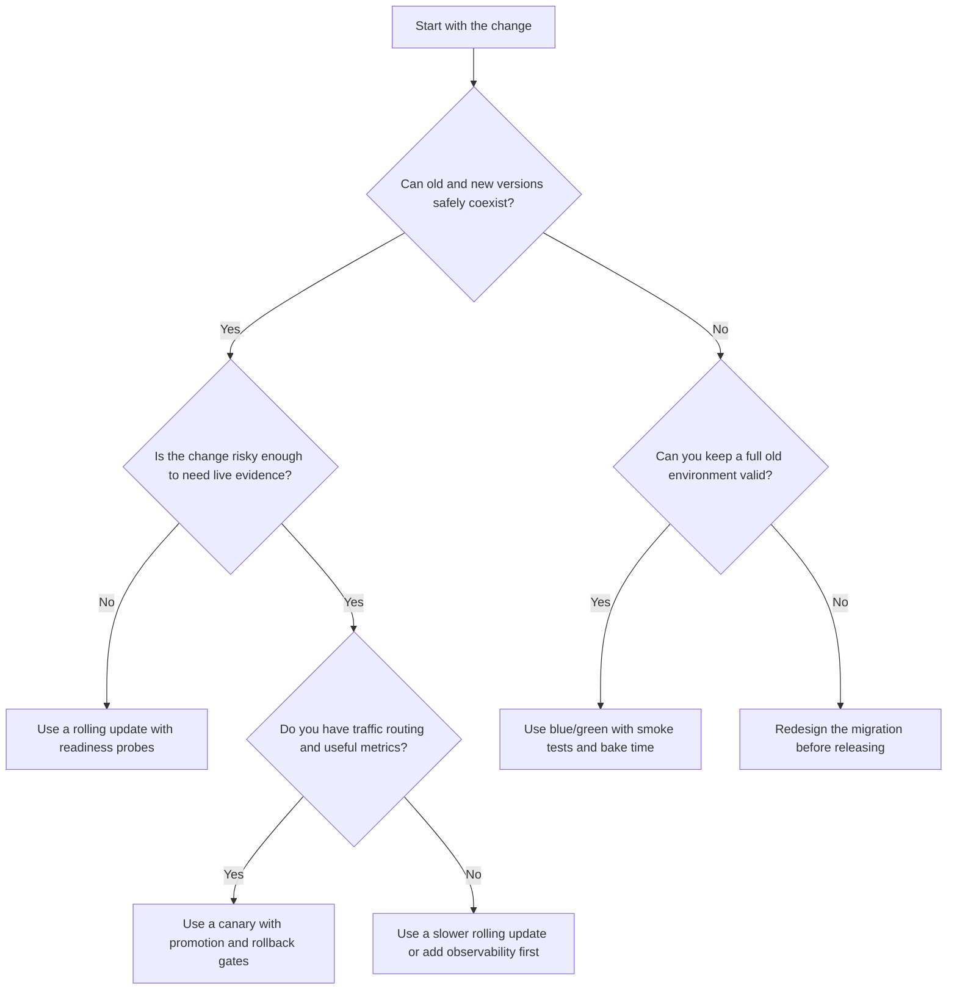

# Module 4.3: Release Strategies

> **Complexity**: `[MEDIUM]` - Delivery strategy and operational trade-offs
>
> **Time to Complete**: 40-50 minutes
>
> **Prerequisites**: [Module 4.1: CI/CD Fundamentals](../module-4.1-ci-cd/), [Module 4.2: Application Packaging](../module-4.2-application-packaging/), basic Deployment and Service concepts

## Learning Outcomes

After completing this module, you will be able to evaluate release strategies as operational risk controls, not just as different ways to update Pods. Each outcome is practiced in the core lesson and assessed again in the quiz or hands-on exercise.

1. **Compare** rolling update, blue/green, and canary release strategies by blast radius, rollback speed, resource cost, and operational complexity.
2. **Diagnose** how Kubernetes Deployments use `maxSurge`, `maxUnavailable`, readiness probes, and rollout history to control rolling update behavior.
3. **Evaluate** when mixed-version risk, database compatibility, persistent connections, and traffic patterns make one release strategy safer than another.
4. **Design** promotion, rollback, and metric gates for a Kubernetes 1.35+ release so that failed changes are detected before every user is affected.

## Why This Module Matters

In June 2019, a major UK bank pushed a database migration to production using a single big-bang deployment. Every customer-facing service, including mobile banking, online transfers, and card payments, went down simultaneously at 14:23 on a Friday afternoon. The rollback took 9 hours, 1.9 million customers could not access their accounts over an entire weekend, and the bank was fined 48.65 million GBP by regulators. Post-incident analysis showed that the deepest failure was not a missing unit test or a malformed manifest; it was a release strategy that sent a risky change to everyone at once with no incremental validation path and no fast way to redirect traffic.

The fix was not simply "write better code." The organization changed how it exposed production to new versions. Later migrations used progressive release controls, better readiness checks, and rollback decisions tied to observable symptoms instead of conference-room optimism. That shift matters because Kubernetes can reconcile Deployments all day long, yet it is unable to decide whether your new payment path is safe for every customer. The cluster can replace Pods, but the release strategy determines how much damage one bad change can do before a human or automated controller stops it.

Release strategies are therefore a practical risk-management language. Rolling updates optimize for routine compatibility, blue/green deployments optimize for clean traffic switches and fast rollback, and canary releases optimize for learning from a small slice of real traffic before wider promotion. KCNA questions often describe a scenario with clues like "backward-compatible," "instant rollback," "small percentage," "database schema," or "metrics-driven." Your job is to translate those clues into a strategy choice and explain the trade-off clearly enough that another engineer could act on it.

The most useful professional habit is to describe a release in terms of assumptions. A routine rolling update assumes that version 1 and version 2 can both handle the same requests, storage records, events, and clients during the rollout window. A blue/green deployment assumes the team can afford two complete environments and that switching traffic back still leaves the old environment valid. A canary assumes that a small sample of traffic will reveal the important failure modes quickly enough to stop promotion. When those assumptions are written down before the rollout, the strategy becomes an engineering decision rather than a ritual.

Before you run any Kubernetes command examples in this module, define the short `kubectl` alias used throughout the KubeDojo curriculum. The examples target Kubernetes 1.35+ behavior and use the alias `k` once it has been introduced.

```bash
alias k=kubectl
```

## Release Strategy as Blast-Radius Control

A release strategy answers a narrower question than a CI/CD pipeline does. The pipeline decides whether a change is built, tested, packaged, and eligible for deployment; the release strategy decides how production is exposed to that eligible change. That distinction is important because a fully tested artifact can still fail when it meets real data, real user behavior, real latency, and real dependencies. A strategy gives the team control over sequencing, observation, and recovery so the first production symptom is not automatically a full production incident.

The most useful mental model is blast radius: the share of users, requests, systems, or business operations harmed if the new version is wrong. A rolling update starts with a small blast radius and grows as more Pods are replaced. A blue/green deployment keeps the blast radius at zero while the green environment is tested, then jumps to the full user base when traffic switches. A canary release makes blast radius an explicit dial by routing a chosen percentage or audience segment to the new version before promotion.

Cost is the other side of that control. If you want instant rollback, you usually keep an old environment alive long enough to switch back. If you want precise percentage routing, you usually need an ingress controller, service mesh, or progressive delivery controller that can split traffic and read metrics. If you want a simple built-in path, the Deployment controller gives you rolling updates with a small resource surge, but it also creates a period where old and new Pods serve traffic at the same time.

Pause and predict: if version 2 writes a field that version 1 is unable to parse, which strategy creates the largest hidden risk: rolling update, blue/green, or canary? The answer is not based on which controller is newer or more advanced. It depends on whether old and new versions can safely coexist against the same clients, queues, and database records. Mixed-version compatibility is the hinge that turns a normal rolling update into a dangerous deployment.

A worked example makes the distinction concrete. Imagine a checkout API with 12 replicas and a new image that changes only an error message for invalid coupons. The old and new versions can serve the same requests, the database contract is unchanged, and the team has readiness probes that fail until the application can reach its dependencies. A rolling update is a sensible default because the blast radius grows gradually, extra capacity stays modest, and rollback is a reverse rollout if a problem appears.

Now change only one fact: the new checkout API encrypts stored payment metadata in a format the old API is unable to read. The Deployment controller can still roll Pods one at a time, but the business system may break because old Pods and new Pods disagree about the data contract. In that scenario, the team either needs an expand-and-contract migration that makes both versions compatible or a strategy such as blue/green that performs a coordinated traffic switch after the green side has been validated against the new contract.

Canary looks safer at first glance because it limits traffic, but canary is not magic isolation. If canary Pods write incompatible rows to a shared database, stable Pods may still read those rows and fail for users who never touched the canary path. For canary to be safe, the team needs compatible data formats, careful routing, or isolation boundaries that keep side effects from leaking into stable traffic. Percentage routing reduces request exposure; it does not automatically reduce every shared-state risk.

Release strategy choices also depend on how quickly the team can detect failure. A gradual rollout without meaningful signals is just a slow way to discover a bad release. A blue/green switch without smoke tests is a fast way to move every user to an unproven environment. A canary without baseline metrics is only a smaller guess. The operational question is always the same: what evidence will tell us to continue, pause, or roll back?

A useful release review therefore starts before any command is typed. The reviewer asks what will be true while the release is in progress, what will be true after rollback, and what signal will be trusted if opinions differ. For a customer-facing API, that might mean confirming backward compatibility, checking capacity for surge Pods, identifying the exact dashboard panel that represents user-facing errors, and agreeing on who can pause promotion. For an internal batch worker, the same review might focus on queue compatibility, idempotency, and whether a bad worker can poison shared jobs. The strategy should fit the system's real coupling, not just the shape of the Kubernetes objects.

## Rolling Updates: Kubernetes Built-In Gradual Replacement

Rolling updates are the default Deployment strategy in Kubernetes, and they are the strategy you should expect for ordinary backward-compatible changes. When the Pod template changes, the Deployment controller creates a new ReplicaSet and gradually shifts replicas from the old ReplicaSet to the new one. The application is not intentionally taken down during the update because at least some Pods should remain available while new Pods start, pass readiness checks, and join Service endpoints.

Kubernetes controls that replacement with `maxUnavailable` and `maxSurge`. `maxUnavailable` limits how many desired replicas may be unavailable during the rollout, while `maxSurge` limits how many extra Pods may exist above the desired replica count. The defaults are 25 percent for both, which means Kubernetes can temporarily add capacity and remove old Pods while staying within a controlled availability envelope. These values sound mechanical, but they encode a real business decision: how much spare capacity you can afford and how much temporary unavailability the service can tolerate.

```text
Rolling Update Sequence (4 replicas, maxUnavailable=1, maxSurge=1)
─────────────────────────────────────────────────────────────────

Step 1: Steady state
  [v1] [v1] [v1] [v1]                    4 pods running

Step 2: New pod created (surge), one old pod terminating
  [v1] [v1] [v1] [v1:terminating] [v2:starting]

Step 3: v2 passes readiness probe, next old pod terminates
  [v1] [v1] [v1:terminating] [v2] [v2:starting]

Step 4: Continues until all replaced
  [v1:terminating] [v2] [v2] [v2:starting]

Step 5: Complete
  [v2] [v2] [v2] [v2]                    4 pods running
```

The protected sequence above is the classic happy path, but the detail to notice is the readiness gate between "starting" and "serving." Kubernetes does not know that your application has loaded feature flags, connected to a dependency, warmed a cache, or verified a schema unless you express that through probes and application behavior. If the readiness probe checks only whether the HTTP server process is listening, Kubernetes may send production traffic to a Pod that is unable to complete useful requests. A rollout can therefore look healthy to the controller while users see intermittent 500 responses.

Here is a minimal Deployment fragment that makes the rollout controls visible. The values are conservative for a service with limited spare capacity because only one extra Pod can be created and one desired Pod can be unavailable during the update.

```yaml
apiVersion: apps/v1
kind: Deployment
metadata:
  name: checkout-api
spec:
  replicas: 4
  strategy:
    type: RollingUpdate
    rollingUpdate:
      maxSurge: 1
      maxUnavailable: 1
  selector:
    matchLabels:
      app: checkout-api
  template:
    metadata:
      labels:
        app: checkout-api
    spec:
      containers:
        - name: checkout-api
          image: ghcr.io/example/checkout-api:1.35.0
          ports:
            - containerPort: 8080
          readinessProbe:
            httpGet:
              path: /ready
              port: 8080
            periodSeconds: 5
            failureThreshold: 2
```

After applying a Deployment like this, the operator watches the rollout rather than assuming that an apply command means success. The command `k rollout status deployment/checkout-api` follows the Deployment condition until it completes or stalls, and `k rollout history deployment/checkout-api` shows the recorded revisions that can be used for rollback. If a broken version is already progressing, `k rollout pause deployment/checkout-api` buys time to investigate before the controller replaces more Pods.

```bash
k apply -f checkout-deployment.yaml
k rollout status deployment/checkout-api
k rollout history deployment/checkout-api
k rollout pause deployment/checkout-api
k rollout undo deployment/checkout-api
```

The most common rolling-update failure is not that Kubernetes updates too slowly. It is that Kubernetes updates exactly as instructed while the application violates the assumptions behind the strategy. Database migrations are the usual source of pain because old and new code may need to read and write the same data during the mixed-version window. A safe migration often uses an expand-and-contract pattern: first add new fields or tables in a way old code tolerates, then deploy code that can read both forms, then switch writers, and only later remove the old shape after every version that needed it is gone.

Rollout speed should be treated as a capacity setting, not just a convenience setting. If a service has 4 replicas and each one already runs close to saturation during peak traffic, allowing one unavailable Pod may remove more capacity than the remaining Pods can absorb. If image pulls are slow or startup includes cache warming, a high surge may briefly consume CPU, memory, and node networking in a way that harms neighboring workloads. A cautious operator sizes `maxSurge` and `maxUnavailable` from actual spare capacity, startup profile, and service-level objectives instead of copying the defaults into every Deployment.

Another subtle rolling-update risk is client behavior. Even when Pods are compatible, clients may retry, cache responses, or maintain connection pools that hide a bad version until enough traffic accumulates. A new Pod that fails one request in 50 may not trip a basic readiness probe, but it can still create noisy customer symptoms when the rollout reaches half the fleet. This is why rollout observation should include application metrics labeled by version or ReplicaSet. If stable and new Pods are indistinguishable in metrics, the operator sees only a blended average and may miss the version-specific failure.

Before running this in a real cluster, what output would you expect if a new Pod never passes readiness? A healthy answer is that the rollout should stall rather than complete, the old Pods should continue serving within the availability budget, and `k rollout status` should report that the Deployment has not reached the desired state. If the rollout completes anyway while users fail, your probe probably tested the wrong thing.

Rolling updates fit routine service changes, dependency bumps, compatible API changes, and small fixes where the new and old versions can safely coexist. They are less appropriate for breaking data changes, changes that require every request to see the same version, or releases where rollback must be instantaneous. Kubernetes can undo a rollout, but undo is another rollout in the opposite direction, so the recovery time depends on replica count, image pull time, startup time, readiness delay, and cluster capacity.

## Blue/Green Deployments: Clean Switching and Fast Reversal

Blue/green deployment runs two complete versions side by side. Blue is the current production environment, and green is the candidate environment. The team deploys green, tests it while blue still serves users, and then changes the traffic path so users reach green. If green misbehaves after the switch, rollback can be as fast as moving the Service selector, Ingress rule, or gateway route back to blue, assuming the old environment and compatible data remain available.

The phrase "complete environment" deserves attention. In a small service, it may mean two Deployments and one Service selector. In a larger system, it may include ConfigMaps, Secrets, background workers, scheduled jobs, cache warmers, ingress rules, and dashboards that all need to point at the right color. Blue/green works best when the team has a clean inventory of what belongs to one color and what is shared. If the shared pieces are poorly understood, the green side may look isolated in a diagram while still mutating the same database, queue, or external dependency as blue.

```text
Blue/Green Deployment
─────────────────────────────────────────────────────────────────

Phase 1: Blue is live, Green is deploying
                          ┌─────────────┐
  Users ──> Service ──────>│  Blue (v1)  │   LIVE
                          │  4 replicas  │
                          └─────────────┘
                          ┌─────────────┐
              (no traffic) │  Green (v2) │   TESTING
                          │  4 replicas  │
                          └─────────────┘

Phase 2: Green passes smoke tests, traffic switches
                          ┌─────────────┐
              (no traffic) │  Blue (v1)  │   STANDBY
                          │  4 replicas  │
                          └─────────────┘
                          ┌─────────────┐
  Users ──> Service ──────>│  Green (v2) │   LIVE
                          │  4 replicas  │
                          └─────────────┘

Phase 3: After confidence period, Blue is scaled down
                          ┌─────────────┐
  Users ──> Service ──────>│  Green (v2) │   LIVE
                          │  4 replicas  │
                          └─────────────┘
```

The diagram preserves the key operational idea: the switch is sharp, but testing happens before the switch. That is why blue/green is attractive for changes that are unable to tolerate mixed-version serving. If the old and new versions must not receive traffic at the same time, a rolling update creates exactly the wrong shape. Blue/green gives the team a place to run smoke tests, synthetic transactions, schema checks, and dependency verification against the complete new environment before real users are redirected.

A simple Kubernetes implementation uses two Deployments with different version labels and one Service selector that points at whichever version is live. In production, teams often wrap this with GitOps, ingress routing, or a deployment controller, but the Service selector model is enough to understand the mechanics for KCNA. The Service does not care which Deployment created the Pods; it routes to Pods whose labels match its selector.

```yaml
apiVersion: v1
kind: Service
metadata:
  name: checkout-api
spec:
  selector:
    app: checkout-api
    release: blue
  ports:
    - port: 80
      targetPort: 8080
---
apiVersion: apps/v1
kind: Deployment
metadata:
  name: checkout-api-blue
spec:
  replicas: 4
  selector:
    matchLabels:
      app: checkout-api
      release: blue
  template:
    metadata:
      labels:
        app: checkout-api
        release: blue
    spec:
      containers:
        - name: checkout-api
          image: ghcr.io/example/checkout-api:1.35.0
---
apiVersion: apps/v1
kind: Deployment
metadata:
  name: checkout-api-green
spec:
  replicas: 4
  selector:
    matchLabels:
      app: checkout-api
      release: green
  template:
    metadata:
      labels:
        app: checkout-api
        release: green
    spec:
      containers:
        - name: checkout-api
          image: ghcr.io/example/checkout-api:1.36.0
```

The actual switch can be a small patch, but the small command hides a large responsibility. When you run `k patch service checkout-api -p '{"spec":{"selector":{"app":"checkout-api","release":"green"}}}'`, new connections should flow to green as endpoints update. Existing long-lived connections may remain on blue, clients may cache connection pools, and upstream load balancers may take time to observe endpoint changes. For HTTP request-response services this is often acceptable; for WebSocket, gRPC streaming, or stateful protocols, the switchover plan needs connection draining and client behavior checks.

```bash
k get endpoints checkout-api
k patch service checkout-api -p '{"spec":{"selector":{"app":"checkout-api","release":"green"}}}'
k get endpoints checkout-api
```

Blue/green has a clear cost implication: for the transition window, you usually pay for both environments. If a service normally runs 20 Pods, the cluster needs room for 40 Pods while both colors exist. In cloud environments that is compute cost, and in quota-constrained clusters it may be impossible without temporarily scaling other workloads down. Teams often keep blue running for a bake period after green goes live so rollback stays fast, which extends the cost but reduces recovery risk.

The deeper rollback issue is data. Switching traffic back to blue is easy only if blue can still operate against the current state of the world. If green has already performed irreversible migrations, published incompatible events, or written records old code is unable to parse, the Service selector can move traffic back but the old application may still fail. A serious blue/green plan therefore includes a migration strategy, a rollback boundary, and a decision about when the old color is no longer safe to keep as a recovery path.

Teams sometimes discover another blue/green problem during incident response: observability follows the service name rather than the color. If every dashboard shows only `checkout-api` totals, the team may switch to green and lose the ability to compare green against blue during the bake period. Version labels, release labels, and color-aware dashboards make the switch auditable. The goal is to answer questions like "did green increase latency for card payments?" or "are errors still coming from old blue sessions?" without manually filtering logs after customers have already noticed symptoms.

Blue/green also changes who owns the release moment. A rolling update can begin when a Deployment is applied and then progress according to controller settings. A blue/green release may deploy green hours before the actual traffic switch, and the switch may require coordination with support, database owners, and incident commanders. That coordination is useful for high-risk releases, but it is overhead for low-risk ones. The team should reserve blue/green ceremony for changes where the clean switch and fast reversal are worth the extra capacity and operational synchronization.

Which approach would you choose here and why: a blue/green switch for a checkout UI CSS change, or a rolling update with strong readiness probes? The blue/green version may be technically possible, but it spends extra capacity and operational attention on a change that probably does not need a hard switch. Strategy selection is not about choosing the fanciest option; it is about matching safety controls to the actual failure modes of the change.

## Canary Releases: Progressive Delivery with Evidence

Canary releases send a small part of traffic to the new version first. If the canary behaves like the stable version or improves the intended metric without harming guardrails, the team increases traffic. If metrics degrade, traffic shifts back to stable and the release stops. The name comes from coal miners using canaries as an early warning for toxic air, but the modern lesson is more precise: a canary is useful only when the team can observe the right symptoms soon enough to act.

```text
Canary Release (progressive traffic shift)
─────────────────────────────────────────────────────────────────

Stage 1: Canary gets 5% of traffic
                            ┌────────────────┐
  Users ──> Ingress ──95%──>│  Stable (v1)   │
               │            │  10 replicas    │
               │            └────────────────┘
               │            ┌────────────────┐
               └────5%─────>│  Canary (v2)   │
                            │  1 replica      │
                            └────────────────┘

              Watching: error rate, p99 latency, CPU usage

Stage 2: Metrics healthy after 10 min -- promote to 25%
                            ┌────────────────┐
  Users ──> Ingress ──75%──>│  Stable (v1)   │
               │            │  8 replicas     │
               │            └────────────────┘
               │            ┌────────────────┐
               └───25%─────>│  Canary (v2)   │
                            │  3 replicas     │
                            └────────────────┘

Stage 3: Full promotion (or instant rollback if metrics degrade)
                            ┌────────────────┐
  Users ──> Ingress ──────> │  New Stable(v2)│
                            │  10 replicas    │
                            └────────────────┘
```

The canary diagram is deliberately framed around metrics, not just traffic percentages. Five percent can be tiny for a regional internal API and enormous for a global consumer platform. A social network with 50 million daily users might expose hundreds of thousands of people even at a small percentage, while a business-to-business API with 200 daily users may not get enough traffic for statistical confidence. The safe canary size depends on user volume, failure severity, observability quality, and how quickly the team can roll back.

Kubernetes Services can approximate a canary by sending traffic across stable and canary Pods in proportion to replica counts, but that approach is imprecise. If you run 9 stable Pods and 1 canary Pod behind one Service, roughly one tenth of requests may hit the canary, assuming traffic distributes evenly and Pods have similar capacity. This works for simple experiments, but it cannot target a header, pause at exact weights, or separate canary metrics cleanly unless the observability labels are designed for it.

Ingress controllers, service meshes, and progressive delivery controllers make canaries more deliberate. NGINX Ingress can route a percentage of traffic through canary annotations, while Istio and other meshes can express weighted routes between stable and canary Services. Argo Rollouts and Flagger add automation around traffic shifting, metric analysis, promotion, and rollback. Those tools do not remove the need for human judgment; they automate a decision process that the team must define carefully.

Audience selection is part of that decision process. Some teams start canaries with internal users, a single region, a low-risk tenant, or requests carrying a specific header before using raw percentage routing. That can be safer than sending the first canary traffic to a random slice of all customers, especially when the failure mode might be highly visible or hard to reverse. The trade-off is representativeness: an internal or low-risk cohort may not exercise the same data, devices, languages, or traffic patterns as the broader population. A mature canary plan explains both why the first cohort is safe and when the sample becomes representative enough to promote.

```yaml
apiVersion: networking.k8s.io/v1
kind: Ingress
metadata:
  name: checkout-api-canary
  annotations:
    nginx.ingress.kubernetes.io/canary: "true"
    nginx.ingress.kubernetes.io/canary-weight: "5"
spec:
  ingressClassName: nginx
  rules:
    - host: checkout.example.com
      http:
        paths:
          - path: /
            pathType: Prefix
            backend:
              service:
                name: checkout-api-canary
                port:
                  number: 80
```

A good canary promotion gate combines technical and business signals. Technical guardrails usually include 5xx error rate, p99 latency, saturation, restart count, and dependency failure rate. Business guardrails depend on the domain: payment authorization success, checkout completion, video start failures, search click-through, or message delivery latency. If the canary improves CPU use but silently drops orders, it is not healthy. If business metrics look fine but p99 latency doubles for one region, the rollout still deserves investigation.

The hardest part is choosing a baseline. Metrics must compare the canary against stable traffic under similar conditions, not against an unrelated dashboard from last week. Traffic mix, time of day, region, client version, and dependency health can all distort conclusions. Automated canary analysis tools usually compare labeled canary and stable metrics during the same time window because the shared environment noise affects both groups. That comparison is one reason canaries are powerful for large systems with enough traffic to produce meaningful signals.

Canary rollback must be designed before promotion begins. If the canary is purely stateless, rollback may be as simple as setting the canary weight back to zero and leaving stable traffic alone. If the canary sends new event formats, warms caches with new keys, or calls a downstream dependency differently, rollback may also require draining queues, invalidating cache entries, or stopping background workers. The release plan should list those side effects so the team does not discover during an incident that "shift traffic back" handles only the front door.

Small systems can still use canary thinking even without exact weighted routing. A team might deploy one canary Pod behind a separate internal Service, run synthetic checks against it, then manually shift a small customer group through an Ingress rule. Another team might use a feature flag to expose a code path to selected tenants while the underlying Deployment rolls normally. These are not identical to a service-mesh canary, but they preserve the core idea: expose a risky change to a limited, observable audience before it becomes the default behavior.

War story: a media platform once canaried a new transcoder that passed error-rate checks because the service returned HTTP 200 for every job. The actual problem was degraded video quality for a subset of older codecs, and the first alarm came from support tickets rather than automated analysis. The team fixed the release process by adding domain-specific quality metrics to the canary gate. The strategy had limited blast radius, but the metrics had been too generic to catch the real failure mode.

Stop and think: a canary deployment sends 5 percent of traffic to the new version, but 5 percent of 10 million daily users is 500,000 people. Is 5 percent always safe? Consider how many users are exposed, whether the failure is reversible, whether the canary touches shared state, how fast metrics arrive, and whether you can isolate the canary to lower-risk cohorts before broad exposure.

## Patterns & Anti-Patterns

Reliable release strategies are built from patterns that connect compatibility, routing, and evidence. The first pattern is backward-compatible rolling delivery: use rolling updates when the old and new versions can safely serve at the same time, and make readiness probes prove that a Pod can perform real work before it receives traffic. This works well for routine application releases because it keeps resource overhead low and uses the Deployment controller Kubernetes already provides.

The second pattern is separated environment switching. Use blue/green when mixed-version serving is unsafe or when the team needs a complete green environment for smoke testing before customer traffic moves. The pattern scales best when the service is small enough to duplicate or important enough that duplicate capacity is justified. It also requires a clear rule for how long the old color stays alive and what data changes would make rollback unsafe.

The third pattern is metrics-driven progressive delivery. Use canary when the change is uncertain, the blast radius should be explicitly controlled, and the team has metrics that can detect both technical and domain-specific failure. This pattern scales well for high-traffic systems because small percentages can produce enough data for confident decisions. It scales poorly when traffic is too sparse, metrics are delayed, or the failure mode is not observable before harm accumulates.

The anti-patterns are usually strategy assumptions made invisible. A team may say "we use rolling updates" while ignoring the database contract that makes mixed versions unsafe. Another team may say "we use blue/green" while deleting blue immediately after the switch, removing the very rollback benefit they paid for. A third team may say "we use canary" while checking only CPU and memory, missing the business symptom that users actually feel.

| Pattern or Anti-Pattern | When It Appears | Why It Works or Fails | Operational Check |
|---|---|---|---|
| Backward-compatible rolling update | Routine service changes with compatible APIs and data | Works because old and new Pods can share traffic safely | Confirm readiness probes, rollout status, and rollback history |
| Blue/green with bake time | Breaking changes or migrations that need a clean switch | Works because green is tested before traffic and blue remains a fast return path | Confirm duplicate capacity and data rollback boundary |
| Metrics-driven canary | Risky feature, performance change, or algorithm update | Works because promotion depends on live evidence from a limited audience | Confirm baseline, guardrails, and automatic stop conditions |
| Rolling update over incompatible schema | Code and migration are released together without compatibility | Fails because old Pods and new Pods disagree during the mixed-version window | Use expand-and-contract or a coordinated switch |
| Blue/green without connection draining | Long-lived clients keep using old endpoints after switch | Fails because traffic is split in ways the team did not plan | Test WebSocket, gRPC, and client pool behavior |
| Canary without meaningful metrics | Traffic is split but only generic infrastructure metrics are watched | Fails because the canary can harm users while dashboards stay green | Add domain metrics and compare canary against stable |

These patterns also interact with organizational maturity. A small team with no service mesh can still make excellent decisions by using rolling updates conservatively and choosing blue/green for the few changes that need a hard switch. A larger platform team may automate canary promotion across dozens of services, but that automation is only as good as the guardrails service owners provide. The mature behavior is not to force every release into one pattern; it is to make the choice explicit before the rollout starts.

One practical way to make the choice explicit is to add a release-strategy line to every change record. Instead of writing "deploy checkout API," write "rolling update because this is backward-compatible, with `maxUnavailable` kept at one and rollback through Deployment history." For a riskier change, write "canary starting with one region, promote only if p99 latency and payment authorization success stay within threshold." This small discipline forces the author to name the assumption, and it gives reviewers a concrete claim to challenge before production traffic is involved.

## Decision Framework

Choosing a release strategy starts with compatibility, then moves to recovery speed, observability, and cost. If old and new versions are unable to coexist safely, avoid any strategy that creates mixed-version serving unless you first change the application or database migration plan. If instant rollback is required and the old environment can remain valid, blue/green is a strong candidate. If the change is uncertain but measurable under real traffic, canary gives the team a controlled learning path. If the change is routine and compatible, rolling update is usually the simplest reliable answer.

| Factor | Rolling Update | Blue/Green | Canary |
|--------|---------------|------------|--------|
| **Rollback speed** | Minutes (reverse rollout) | Seconds (selector switch) | Seconds (shift traffic back) |
| **Resource overhead** | Minimal (+25% surge) | High (2x during switch) | Low-moderate (+5-25%) |
| **Mixed-version risk** | Yes, during rollout | No, clean switch | Yes, by design |
| **Blast radius** | Grows as rollout progresses | All-or-nothing | Controlled (5% then 25% etc.) |
| **Complexity** | Low (built into Kubernetes) | Medium (two Deployments + routing) | High (needs metrics + routing) |
| **Best for** | Routine, backward-compatible updates | Breaking changes, database migrations | Risky changes, new features, large user bases |
| **Worst for** | Schema-breaking changes | Resource-constrained environments | Changes without observable metrics |

Read the matrix from left to right as a trade-off table, not a ranking. Rolling updates are low complexity because the Deployment controller does the work, but they assume compatibility. Blue/green gives clean separation and fast reversal, but it demands duplicate capacity and a rollback-safe data story. Canary gives the best control over blast radius, but it depends on routing precision and high-quality metrics. None of the strategies is universally superior; each buys one form of safety by spending another resource.



The framework deliberately includes "redesign the migration" because some release problems are not solved by deployment mechanics alone. If the new version writes irreversible data and the old version is unable to read it, there may be no safe rollback after the first write. If the canary affects a shared queue consumed by stable workers, percentage routing at the ingress may not isolate the side effect. If every client maintains a persistent connection for hours, a Service selector switch may not move traffic the way a diagram suggests. Good release design notices these facts before the change enters production.

For the KCNA exam, listen for scenario language. "Backward-compatible," "minor bug fix," and "readiness probes" point toward rolling updates. "Instant rollback," "breaking change," "no mixed versions," and "complete environment" point toward blue/green. "Small percentage," "progressive," "metrics," "service mesh," and "uncertain performance impact" point toward canary. When the question includes resource quotas, persistent connections, or database migration details, treat those as constraints that may disqualify the obvious first answer.

In real work, the final decision often combines strategies. A team might use blue/green for the traffic switch between two complete environments, then use a feature flag inside green to canary a new behavior for a small customer group. Another team might use a rolling update for infrastructure-compatible code while canarying a high-risk algorithm behind a flag. KCNA keeps the categories separate so you can recognize them, but production systems often layer controls. The important part is to know which control is limiting which risk: Deployment settings manage Pod replacement, traffic routing manages exposure, and metrics decide whether exposure should grow.

A final release review should also name the stop condition in operational language. "Roll back if it looks bad" is too vague because different people will notice different symptoms and argue about whether they matter. "Pause promotion if canary p99 latency is more than 20 percent above stable for two analysis windows, or if checkout completion drops below the stable baseline" gives the operator a concrete trigger. For blue/green, the stop condition might be a failed synthetic transaction, a mismatched endpoint count, or a data validation check before the traffic switch. For rolling update, it might be a stalled rollout, rising version-specific errors, or readiness failures that show new Pods are not earning traffic. Clear stop conditions turn release safety from taste into a shared operating contract.

## Did You Know?

1. **Google deploys over 800,000 times per week** across parts of its infrastructure. Public SRE writing describes automated canary analysis as a way to compare dozens of signals before a release is allowed to continue.
2. **The term "blue/green deployment" was popularized by Jez Humble and David Farley** in their 2010 book *Continuous Delivery*. The color names are arbitrary; some organizations use red/black or active/passive for a similar traffic-switching idea.
3. **Kubernetes rolling updates were not always the default abstraction.** Before Deployments became stable, older workflows used client-side rolling update commands for ReplicationControllers, which made the client connection part of the update process.
4. **The 2023 DORA report found large gaps between high and low software delivery performers.** The operational lesson is not that teams should deploy recklessly fast, but that small, recoverable, well-observed releases make frequent delivery possible.

## Common Mistakes

| Mistake | Why It Happens | How to Fix It |
|---|---|---|
| No readiness probes on rolling updates | Team assumes a started container is the same as a ready application | Add readiness probes that check useful dependencies or application paths before Pods enter Service endpoints |
| Using blue/green for services with persistent connections without draining | WebSocket, gRPC, or client pools do not follow selector changes immediately | Test connection behavior, drain old endpoints, and define how long blue remains available |
| Canary without baseline metrics | Team splits traffic but has no normal stable measurement for comparison | Compare canary and stable metrics in the same time window with labels that separate versions |
| Deploying incompatible database schema changes with rolling updates | Migration and code rollout happen together because both passed CI | Use expand-and-contract migrations or a coordinated blue/green switch with a rollback-safe data plan |
| Setting `maxUnavailable` too high | Team wants faster rollouts and treats availability budget as a speed knob | Size the budget against real spare capacity and verify that remaining Pods can handle peak load |
| Treating canary percentage as canary safety | A small percentage feels safe without considering actual user count | Choose canary stages from user volume, failure severity, observability delay, and reversibility |
| Deleting blue immediately after a green switch | Team wants to reclaim resources as soon as traffic moves | Keep blue for a defined bake period and remove it only after rollback is no longer needed |
| Rolling back traffic while ignoring data side effects | Operators assume routing rollback returns the whole system to the old state | Document what green or canary may have written, emitted, or mutated before relying on rollback |

## Knowledge Check

Test your understanding with scenario-based questions. Try to answer before revealing the explanation, and look for the clues that connect each scenario back to blast radius, compatibility, rollback speed, metrics, and resource cost.

<details>
<summary>Question 1: Your team runs an e-commerce platform with 20 backend Pods. You are deploying a minor bug fix to search autocomplete. The fix is backward-compatible, readiness probes are meaningful, and the business can tolerate a gradual replacement. Which release strategy should you choose?</summary>

A rolling update is the right choice because the scenario explicitly says the change is backward-compatible and the readiness probes provide a useful gate before new Pods receive traffic. The blast radius grows gradually, resource overhead stays modest, and Kubernetes Deployments already provide rollout status and rollback history. Blue/green would spend duplicate capacity for little benefit, while canary would add routing and metric complexity that is not justified by the low-risk change. This compares rolling update, blue/green, and canary by matching risk, cost, and complexity to the situation.
</details>

<details>
<summary>Question 2: A payment service rewrite changes a database schema so old code is unable to read new rows and new code is unable to read old rows. The team asks whether a rolling update with `maxSurge: 1` and `maxUnavailable: 0` is safe. What do you diagnose?</summary>

The rollout settings preserve availability at the Pod level, but they do not solve mixed-version data incompatibility. During a rolling update, old and new Pods run at the same time, so both versions may read or write data the other is unable to interpret. The safer answer is to redesign the migration with an expand-and-contract sequence or use a coordinated blue/green switch only after the data rollback boundary is understood. This diagnosis focuses on Deployment mechanics, readiness, `maxSurge`, `maxUnavailable`, and the limits of rollout history when the data contract is broken.
</details>

<details>
<summary>Question 3: A global streaming platform wants to release a new recommendation algorithm. Internal tests look promising, but engineers worry about p99 latency and engagement changes under real traffic. They have Istio routing and Prometheus metrics. Which strategy fits?</summary>

A canary release fits because the risk is uncertain, observable, and worth testing against a limited real audience before full promotion. Istio can provide weighted routing, and Prometheus can compare stable and canary metrics during the same window. The promotion gate should include latency, error rate, saturation, and the relevant business metric, not only Pod health. This design uses canary promotion and rollback gates so a failed algorithm is detected before every user is affected.
</details>

<details>
<summary>Question 4: During a rolling update, new Pods pass readiness but return 500 responses on about one tenth of requests. The rollout is halfway complete. What should the operator check and do first?</summary>

The operator should suspect that readiness is too shallow or that the new version fails only on a business path the probe does not exercise. The immediate response is to pause the rollout with `k rollout pause deployment/<name>`, inspect metrics and logs, and roll back with `k rollout undo deployment/<name>` if the new version is harming users. The longer-term fix is to improve readiness and release metrics so Deployment status reflects useful application readiness. This evaluates rolling update behavior through readiness probes, rollout history, and rollback controls.
</details>

<details>
<summary>Question 5: Your cluster has only 15 percent spare capacity, and a service normally runs 40 Pods. The upcoming change is routine and compatible, but leadership asks for blue/green because rollback sounds faster. How would you evaluate the choice?</summary>

Blue/green is probably infeasible because it normally requires capacity for a second full environment, which would mean roughly doubling the service during the switch. A conservative rolling update can fit the resource limit if `maxSurge` is sized within the spare capacity and `maxUnavailable` does not overload the remaining Pods. Canary may also be feasible if the change becomes riskier, but it needs routing and useful metrics. The decision compares rollback speed against resource cost and operational complexity rather than treating one strategy as automatically safest.
</details>

<details>
<summary>Question 6: A team switches a Service selector from blue to green for a WebSocket-heavy application. New users reach green, but many existing sessions stay connected to blue for hours. Was blue/green the wrong strategy?</summary>

Blue/green was not necessarily wrong, but the plan missed persistent connection behavior. Selector changes affect endpoint selection for new connections; they do not force every existing stream to reconnect instantly. The fix is to design connection draining, client reconnection behavior, and a bake period where blue remains healthy until old sessions naturally leave or are deliberately migrated. This evaluates traffic patterns and persistent connections as release-strategy constraints.
</details>

<details>
<summary>Question 7: A canary uses 5xx rate and CPU as promotion gates, then ships a version that returns successful responses while calculating discounts incorrectly. What was missing from the release design?</summary>

The canary had infrastructure guardrails but lacked a domain-specific business metric. A release can be technically healthy and still wrong for users if it corrupts pricing, drops orders, or changes behavior in a way generic metrics do not reveal. The promotion design should add checks such as discount calculation error rate, checkout completion, refund volume, or synthetic transactions that verify the business path. This question tests the design of metric gates for canary promotion and rollback.
</details>

## Hands-On Exercise

In this exercise you will reason through one release plan and inspect the Kubernetes objects that would support it. You do not need a production cluster; a local Kubernetes 1.35+ environment such as kind, minikube, or a disposable namespace is enough. The goal is not to memorize commands but to connect Deployment settings, Service selectors, and rollout decisions to the strategy trade-offs you just studied.

Use the `kubectl` alias `k` before starting if your shell does not already have it. The example namespace keeps the exercise isolated, and the images use public demo containers rather than private credentials or realistic secrets.

```bash
alias k=kubectl
k create namespace release-lab
```

### Tasks

1. Create a Deployment named `web-blue` with 4 replicas, label it `app=web,release=blue`, and expose it with a Service named `web` that selects the blue label.
2. Create a second Deployment named `web-green` with the same `app=web` label, a `release=green` label, and a different image tag so you can distinguish it from blue.
3. Inspect the Service endpoints, then patch the Service selector from `release=blue` to `release=green` and confirm that endpoint targets changed.
4. Change the image on one Deployment and watch `k rollout status` so you can see the Deployment controller report progress.
5. Write a short release decision: would this application use rolling update, blue/green, or canary for a risky database change, and what rollback or metric gate would you require?

<details>
<summary>Suggested Solution</summary>

```bash
cat <<'YAML' > /tmp/release-lab.yaml
apiVersion: apps/v1
kind: Deployment
metadata:
  name: web-blue
  namespace: release-lab
spec:
  replicas: 4
  selector:
    matchLabels:
      app: web
      release: blue
  template:
    metadata:
      labels:
        app: web
        release: blue
    spec:
      containers:
        - name: web
          image: nginx:1.27
          ports:
            - containerPort: 80
---
apiVersion: apps/v1
kind: Deployment
metadata:
  name: web-green
  namespace: release-lab
spec:
  replicas: 4
  selector:
    matchLabels:
      app: web
      release: green
  template:
    metadata:
      labels:
        app: web
        release: green
    spec:
      containers:
        - name: web
          image: nginx:1.28
          ports:
            - containerPort: 80
---
apiVersion: v1
kind: Service
metadata:
  name: web
  namespace: release-lab
spec:
  selector:
    app: web
    release: blue
  ports:
    - port: 80
      targetPort: 80
YAML

k apply -f /tmp/release-lab.yaml
k -n release-lab get pods --show-labels
k -n release-lab get endpoints web
k -n release-lab patch service web -p '{"spec":{"selector":{"app":"web","release":"green"}}}'
k -n release-lab get endpoints web
k -n release-lab set image deployment/web-green web=nginx:1.29
k -n release-lab rollout status deployment/web-green
```

A strong written decision would say that a risky database change should not use a normal rolling update unless the schema migration is compatible across old and new versions. Blue/green may fit if both environments can be validated and rollback remains data-safe, while canary may fit only if canary side effects do not poison shared state and the team has metrics that catch the relevant failure mode. The key is to state the compatibility assumption and the rollback or promotion gate explicitly.
</details>

### Success Criteria

- [ ] You can explain how the Service selector determines whether blue or green receives new traffic.
- [ ] You can compare rolling update, blue/green, and canary for the same application by blast radius and rollback speed.
- [ ] You can diagnose how `maxSurge`, `maxUnavailable`, readiness probes, and rollout history affect a rolling update.
- [ ] You can evaluate whether database compatibility or persistent connections make mixed-version release strategies unsafe.
- [ ] You can design at least one promotion or rollback metric gate for a canary or blue/green release.

Clean up the namespace when you are finished so the exercise does not leave demo objects behind.

```bash
k delete namespace release-lab
```

## Sources

- [Kubernetes documentation: Deployments](https://kubernetes.io/docs/concepts/workloads/controllers/deployment/)
- [Kubernetes documentation: Performing a rolling update](https://kubernetes.io/docs/tutorials/kubernetes-basics/update/update-intro/)
- [Kubernetes documentation: Configure liveness, readiness, and startup probes](https://kubernetes.io/docs/tasks/configure-pod-container/configure-liveness-readiness-startup-probes/)
- [Kubernetes documentation: Services, Load Balancing, and Networking](https://kubernetes.io/docs/concepts/services-networking/service/)
- [Kubernetes documentation: `kubectl rollout`](https://kubernetes.io/docs/reference/kubectl/generated/kubectl_rollout/)
- [Kubernetes documentation: `kubectl patch`](https://kubernetes.io/docs/reference/kubectl/generated/kubectl_patch/)
- [NGINX Ingress Controller documentation: Canary deployments](https://kubernetes.github.io/ingress-nginx/user-guide/nginx-configuration/annotations/#canary)
- [Istio documentation: Traffic management](https://istio.io/latest/docs/concepts/traffic-management/)
- [Argo Rollouts documentation: Canary strategy](https://argo-rollouts.readthedocs.io/en/stable/features/canary/)
- [Flagger documentation: Progressive delivery](https://docs.flagger.app/)
- [Google SRE Workbook: Canarying releases](https://sre.google/workbook/canarying-releases/)
- [DORA 2023 Accelerate State of DevOps Report](https://dora.dev/research/2023/dora-report/)

## Next Module

[Back to KCNA Overview](/k8s/kcna/) - Revisit the KCNA map and connect release strategies to the broader application delivery domain.
