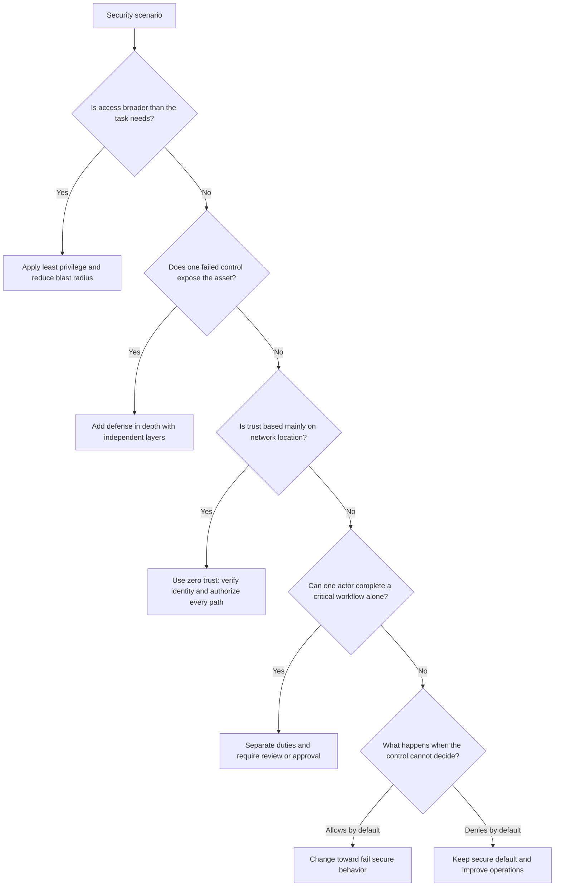

# Module 1.3: Security Principles

**Complexity**: `[MEDIUM]` - Foundational concepts. **Time to Complete**: 45-60 minutes. **Prerequisites**: [Module 1.2: Cloud Provider Security](../module-1.2-cloud-provider-security/). This module assumes you can recognize core Kubernetes objects and now need a reliable way to evaluate whether those objects are configured with secure operating principles.

## Learning Outcomes

After completing this module, you will be able to perform security review work rather than merely recite definitions. Each outcome below maps to a scenario, a decision point, or a hands-on review task later in the module.

1. **Evaluate** Kubernetes configurations against defense in depth, least privilege, zero trust, and separation of duties.
2. **Design** layered security controls that reduce attack surface and limit blast radius when a workload is compromised.
3. **Diagnose** whether a Kubernetes control fails secure or fails open, then explain the operational tradeoff.
4. **Implement** a practical review workflow that maps CIA triad goals to RBAC, NetworkPolicy, Pod Security, and workload settings.

## Why This Module Matters

In 2023, the MOVEit Transfer compromise showed how quickly a single exposed system can become a business crisis. Attackers exploited one managed file transfer product, then used the access to steal data from hundreds of organizations across government, finance, health care, and education. Public estimates placed the total downstream cost in the billions of dollars once response work, legal exposure, customer notification, and operational disruption were counted. The lesson was not merely that one product had a serious flaw; the deeper lesson was that many organizations had trusted one perimeter control too much and had not sufficiently limited what a successful compromise could reach.

Kubernetes clusters create the same kind of risk in a more dynamic form. A pod is rarely just a pod; it may carry a service account token, talk to other services, mount configuration, call the Kubernetes API, and run on a node shared with unrelated workloads. If that pod is configured with broad RBAC, privileged container settings, unrestricted network egress, and no admission guardrails, a single application bug can turn into a cluster-wide incident. If the same pod is surrounded by layered controls, narrow permissions, verified service-to-service communication, and secure defaults, the same bug may remain a contained workload event instead of becoming a platform compromise.

This module teaches the principles behind those choices. Kubernetes changes quickly, and this course targets Kubernetes 1.35+, but the principles are older and more durable than any one API version. Defense in depth, least privilege, zero trust, separation of duties, fail secure design, the CIA triad, attack surface reduction, and blast radius management give you a way to reason when the exact command, product, or incident is unfamiliar. KCSA questions often describe a situation rather than ask for a command, so your job is to recognize which principle is being tested and choose the control that makes the system more resilient.

## Core Security Principles

Security principles are not slogans to memorize; they are decision tools for moments when two reasonable engineering goals conflict. Teams want fast deployments, reliable services, convenient debugging, and low operational overhead, but attackers benefit whenever those goals erase boundaries. The practical skill is learning to ask what assumption a design makes, what happens when that assumption fails, and which control keeps the failure from spreading.

The first principle is defense in depth, which means no single control should be treated as the whole security strategy. A firewall, a private subnet, or an admission policy may be valuable, but each one has failure modes. Someone can misconfigure a rule, a vulnerability can bypass a layer, a credential can be stolen, or a trusted component can become malicious after compromise. Defense in depth accepts that individual controls fail and designs the system so an attacker must defeat several independent controls before reaching the most valuable target.

```text
┌─────────────────────────────────────────────────────────────┐
│              DEFENSE IN DEPTH                               │
├─────────────────────────────────────────────────────────────┤
│                                                             │
│  SINGLE CONTROL (Fragile)                                  │
│                                                             │
│  Firewall ─────────────────────────────────→ Protected     │
│                                               Resource      │
│  If firewall fails, resource is exposed                    │
│                                                             │
│  ───────────────────────────────────────────────────────── │
│                                                             │
│  LAYERED CONTROLS (Resilient)                              │
│                                                             │
│  Firewall → Network Policy → RBAC → Pod Security → App     │
│                                                   Auth     │
│                                                             │
│  Multiple failures required to reach the resource          │
│                                                             │
└─────────────────────────────────────────────────────────────┘
```

In Kubernetes, defense in depth is visible when a request must pass several checks before it can cause damage. A user authenticates to the API server, authorization checks whether the user may perform the requested verb, admission controllers evaluate the resulting object, Pod Security admission rejects dangerous pod settings, NetworkPolicy constrains traffic after the pod starts, and application authorization still checks what the user can do inside the service. None of those controls is perfect, but together they make the attack path longer, noisier, and easier to interrupt.

| Layer | Security Control |
|-------|-----------------|
| Cloud | VPC, security groups, IAM |
| Cluster | RBAC, audit logging |
| Network | Network policies, service mesh |
| Workload | Pod Security Standards |
| Container | SecurityContext, capabilities |
| Application | Authentication, authorization |

The second principle is least privilege, which says every identity and workload should receive only the access required for its current job. Least privilege is difficult because it adds friction during design and operations. A broad permission is easy to grant and hard to audit later; a precise permission takes thought, testing, and maintenance as the workload changes. The payoff is that stolen credentials, exploited containers, and mistaken commands have less room to cause damage.

```text
┌─────────────────────────────────────────────────────────────┐
│              LEAST PRIVILEGE                                │
├─────────────────────────────────────────────────────────────┤
│                                                             │
│  BAD: Overly permissive                                    │
│  ┌──────────────────────────────────────────────────────┐  │
│  │  Role: cluster-admin                                 │  │
│  │  Resources: * (everything)                           │  │
│  │  Verbs: * (all actions)                              │  │
│  │  "Just give them admin so they can do their job"     │  │
│  └──────────────────────────────────────────────────────┘  │
│                                                             │
│  GOOD: Precisely scoped                                    │
│  ┌──────────────────────────────────────────────────────┐  │
│  │  Role: deployment-reader                             │  │
│  │  Resources: deployments                              │  │
│  │  Verbs: get, list, watch                             │  │
│  │  Namespace: team-a                                   │  │
│  │  "Grant exactly what's needed, nothing more"         │  │
│  └──────────────────────────────────────────────────────┘  │
│                                                             │
└─────────────────────────────────────────────────────────────┘
```

Least privilege shows up in Kubernetes at several levels. A human operator should normally receive a namespace-scoped Role instead of a ClusterRoleBinding to cluster-admin. A workload should use a dedicated ServiceAccount instead of the default ServiceAccount shared by unrelated pods. A container should drop Linux capabilities by default and add back only the rare capability it needs. A network policy should deny traffic first and then allow only the specific peer and port required for the application path.

| Area | Least Privilege Example |
|------|------------------------|
| RBAC | Namespace-scoped roles over cluster-wide |
| Capabilities | Drop all, add only needed |
| Network | Deny all, allow specific |
| Service accounts | Dedicated per workload |
| File access | Read-only root filesystem |

Zero trust extends least privilege from permissions into assumptions about location and identity. Traditional perimeter thinking says traffic inside the network is more trustworthy than traffic outside it. Kubernetes makes that assumption especially risky because pods are short lived, nodes are shared, and internal service names are easy to reach from many places. Zero trust says each request still needs authentication, authorization, encryption where appropriate, and context-sensitive evaluation even when the request originates from inside the cluster.

```text
┌─────────────────────────────────────────────────────────────┐
│              ZERO TRUST vs PERIMETER SECURITY               │
├─────────────────────────────────────────────────────────────┤
│                                                             │
│  TRADITIONAL (Castle and Moat)                             │
│  ┌────────────────────────────────────────────────┐        │
│  │  FIREWALL                                      │        │
│  │  ┌──────────────────────────────────────────┐ │        │
│  │  │  Inside = Trusted                        │ │        │
│  │  │  All internal traffic allowed            │ │        │
│  │  │  Once inside, move freely               │ │        │
│  │  └──────────────────────────────────────────┘ │        │
│  └────────────────────────────────────────────────┘        │
│  Problem: Attacker inside can access everything            │
│                                                             │
│  ZERO TRUST                                                │
│  ┌────────────────────────────────────────────────┐        │
│  │  Every request verified:                      │        │
│  │  • Who is making the request?                 │        │
│  │  • Is the device compliant?                   │        │
│  │  • Is this request normal for this identity? │        │
│  │  • Encrypt all traffic, internal or not      │        │
│  └────────────────────────────────────────────────┘        │
│  Benefit: Breach of one system doesn't give access to all │
│                                                             │
└─────────────────────────────────────────────────────────────┘
```

Zero trust does not mean every cluster must immediately adopt a service mesh or a complex identity platform. It starts with refusing to treat namespace membership, node location, or private IP addresses as proof of trust. In a small cluster, that might mean RBAC for every API request, default-deny NetworkPolicies in sensitive namespaces, TLS for ingress and backend traffic, and admission policies that reject workloads missing clear identity boundaries. In a larger platform, the same principle may grow into workload identity, mTLS, certificate rotation, policy-as-code, and continuous authorization decisions.

| Principle | Kubernetes Implementation |
|-----------|--------------------------|
| Verify identity | Strong authentication (OIDC, certificates) |
| Verify authorization | RBAC for every request |
| Assume breach | Network policies (deny by default) |
| Encrypt traffic | TLS everywhere, service mesh |
| Limit blast radius | Namespace isolation |

Separation of duties addresses a different failure mode: the person or automation that creates a risky change should not be the only party able to approve, deploy, and audit that change. This principle is sometimes described as bureaucracy, but its purpose is practical. People make mistakes under pressure, insiders can abuse excessive authority, and compromised credentials are more useful when one account can complete an entire sensitive workflow alone. Separating duties creates a second decision point before a dangerous change reaches production.

```text
┌─────────────────────────────────────────────────────────────┐
│              SEPARATION OF DUTIES                           │
├─────────────────────────────────────────────────────────────┤
│                                                             │
│  BAD: One person does everything                           │
│                                                             │
│  Developer writes code                                      │
│      ↓                                                      │
│  Same person deploys to production                         │
│      ↓                                                      │
│  Same person approves their own changes                    │
│                                                             │
│  Risk: Malicious or erroneous changes go undetected       │
│                                                             │
│  ───────────────────────────────────────────────────────── │
│                                                             │
│  GOOD: Responsibilities divided                            │
│                                                             │
│  Developer → Code review → Security scan → Approval →     │
│                                           Different        │
│                                           person/team      │
│  deploys                                                   │
│                                                             │
│  Benefit: Checks and balances prevent single point of     │
│  compromise                                                │
│                                                             │
└─────────────────────────────────────────────────────────────┘
```

In Kubernetes operations, separation of duties often appears in deployment pipelines and production access. Developers may author manifests, but a separate review or admission policy approves privileged settings. Platform engineers may maintain ClusterRoles, but application teams receive namespace-bound RoleBindings. Security teams may define baseline Pod Security admission labels, but service teams tune their own application configuration inside those boundaries. The important detail is that separation should protect critical processes without forcing every routine action through a manual bottleneck.

Pause and predict: if RBAC only grants additive permissions and has no deny rules, how would you prevent one specific user from reading Secrets in a namespace where a broad group Role already allows that action? The answer is not to create a deny binding, because Kubernetes RBAC does not work that way. You would remove or narrow the broad grant, bind the sensitive permission to a smaller group, separate the user from that group, or move the sensitive object into a namespace with different access boundaries.

Fail secure design asks what the system does when a security dependency is unavailable, ambiguous, or misconfigured. A fail-open control prioritizes continuity by allowing access when it cannot decide. A fail-secure control denies or rejects the action until it can make a safe decision. Neither choice is free: fail secure may interrupt operations, while fail open may turn an outage into an intrusion. Security-sensitive controls usually need fail secure behavior because attackers can intentionally create partial failures to bypass checks.

```text
┌─────────────────────────────────────────────────────────────┐
│              FAIL SECURE vs FAIL OPEN                       │
├─────────────────────────────────────────────────────────────┤
│                                                             │
│  FAIL OPEN (Dangerous)                                     │
│  ├── If authorization service is down, allow all requests │
│  ├── If network policy controller fails, allow all traffic│
│  └── "Better to be available than secure"                  │
│                                                             │
│  FAIL SECURE (Correct)                                     │
│  ├── If authorization service is down, deny all requests  │
│  ├── If network policy controller fails, block traffic    │
│  └── "Better to be secure than available"                  │
│                                                             │
│  Default deny exemplifies fail secure:                     │
│  - Network policy with no rules = deny all                │
│  - RBAC with no bindings = no access                      │
│  - Pod security admission = reject non-compliant pods     │
│                                                             │
└─────────────────────────────────────────────────────────────┘
```

Kubernetes has several defaults and behaviors that illustrate fail secure reasoning. If no RBAC binding grants a user a verb on a resource, the request is denied. If a namespace uses restricted Pod Security admission and a pod asks for privileged mode, the API server rejects the object before it runs. If a namespace has a default-deny NetworkPolicy for ingress, traffic is blocked until a policy explicitly allows it. Your operational task is to make those secure failures visible, diagnosable, and recoverable rather than weakening the control when teams complain that it blocked something.

## Security Concepts That Connect the Principles

The CIA triad is a compact way to ask what a control protects. Confidentiality means information is seen only by authorized parties. Integrity means information and system behavior are accurate, complete, and not secretly modified. Availability means the service remains usable when legitimate users need it. Most Kubernetes controls protect more than one pillar, but naming the main pillar helps you explain why a control belongs in the design.

```text
┌─────────────────────────────────────────────────────────────┐
│                    CIA TRIAD                                │
├─────────────────────────────────────────────────────────────┤
│                                                             │
│                   CONFIDENTIALITY                           │
│                        /\                                   │
│                       /  \                                  │
│                      /    \                                 │
│                     /      \                                │
│                    /   CIA  \                               │
│                   /          \                              │
│                  /____________\                             │
│          INTEGRITY            AVAILABILITY                  │
│                                                             │
│  CONFIDENTIALITY: Only authorized access to data          │
│  • Encryption, access control, authentication              │
│                                                             │
│  INTEGRITY: Data is accurate and unmodified               │
│  • Checksums, digital signatures, audit logs               │
│                                                             │
│  AVAILABILITY: Systems accessible when needed              │
│  • Redundancy, backups, DDoS protection                    │
│                                                             │
└─────────────────────────────────────────────────────────────┘
```

Confidentiality in Kubernetes often starts with Secrets, but it does not end there. A Secret is only useful if RBAC restricts who can read it, etcd encryption protects it at rest, service account tokens are scoped, network paths do not leak it to unintended consumers, and audit logs show suspicious access. Integrity appears when images are signed, admission policy rejects unknown registries, deployment pipelines record who changed a manifest, and audit trails make tampering difficult to hide. Availability appears when resource quotas, limits, replicas, PodDisruptionBudgets, and cluster redundancy prevent one workload or failure domain from starving the rest of the platform.

| Pillar | Kubernetes Examples |
|--------|-------------------|
| Confidentiality | Secrets encryption, RBAC, network policies |
| Integrity | Image signing, admission control, etcd integrity |
| Availability | Replicas, PDBs, cluster redundancy |

Attack surface is the sum of places an attacker can interact with the system. Some attack surface is obvious, such as a public API server endpoint, an internet-facing Ingress, or a NodePort service. Other attack surface is internal, such as pod-to-pod traffic, service account tokens, container images with unnecessary tools, kubelet access, and overly broad API permissions from inside a pod. You cannot remove all attack surface because useful systems must accept legitimate input, but you can remove entry points that do not serve a clear purpose.

```text
┌─────────────────────────────────────────────────────────────┐
│              KUBERNETES ATTACK SURFACE                      │
├─────────────────────────────────────────────────────────────┤
│                                                             │
│  EXTERNAL ATTACK SURFACE                                   │
│  ├── API server endpoint                                   │
│  ├── Ingress controllers                                   │
│  ├── Exposed services (LoadBalancer, NodePort)             │
│  └── SSH to nodes                                          │
│                                                             │
│  INTERNAL ATTACK SURFACE                                   │
│  ├── Pod-to-pod communication                              │
│  ├── Service account tokens                                │
│  ├── Kubernetes API from pods                              │
│  ├── kubelet API                                           │
│  └── etcd access                                           │
│                                                             │
│  MINIMIZE ATTACK SURFACE:                                  │
│  • Disable unused features                                 │
│  • Remove unnecessary packages from images                 │
│  • Use private clusters                                    │
│  • Restrict network access                                 │
│                                                             │
└─────────────────────────────────────────────────────────────┘
```

Reducing attack surface is not the same as hiding systems from view. A private cluster endpoint reduces exposure, but it does not excuse weak RBAC. A minimal image reduces the tools available after compromise, but it does not replace patching. A deny-by-default NetworkPolicy reduces reachable services, but it does not replace application authentication. The strongest designs combine smaller attack surface with layered controls so that fewer attempts reach the system and successful attempts have less room to move.

Pause and predict: consider two compromised pods, one running with a cluster-admin ServiceAccount and one running with a namespace-scoped read-only ServiceAccount. The application bug may be identical in both pods, but the blast radius is very different because the stolen identity carries different authority. The first compromise can modify cluster resources, read secrets across namespaces, and hide evidence more easily; the second compromise may only inspect limited resources in one namespace. This is why blast radius is the consequence side of least privilege.

```text
┌─────────────────────────────────────────────────────────────┐
│              BLAST RADIUS EXAMPLES                          │
├─────────────────────────────────────────────────────────────┤
│                                                             │
│  LARGE BLAST RADIUS (Bad)                                  │
│  • cluster-admin ServiceAccount                            │
│    → Compromise = full cluster access                      │
│  • Privileged container                                    │
│    → Compromise = node access                              │
│  • Default ServiceAccount with secrets access              │
│    → Compromise = all namespace secrets                    │
│                                                             │
│  SMALL BLAST RADIUS (Good)                                 │
│  • Namespace-scoped ServiceAccount                         │
│    → Compromise = limited to one namespace                 │
│  • Non-privileged, capability-dropped container            │
│    → Compromise = limited to container processes           │
│  • Dedicated ServiceAccount, no secrets access             │
│    → Compromise = minimal impact                           │
│                                                             │
│  GOAL: Minimize blast radius at every layer               │
│                                                             │
└─────────────────────────────────────────────────────────────┘
```

Blast radius is also an operations concept. When a deployment breaks production, a small blast radius means the failure affects one namespace, one service, or one tenant rather than the entire platform. Security and reliability overlap here because scoped permissions, namespaces, quotas, staged rollouts, and policy boundaries all make failure smaller. A KCSA scenario may describe an attacker, a mistaken engineer, or a broken controller; the same principle applies because the platform should keep a local failure local.

## Applying Principles to Kubernetes

The practical way to apply these principles is to review a real workload path from the outside inward. Start with who can reach the workload, then ask which identity the workload uses, what the identity can do, what traffic the workload can send and receive, how the container is constrained, how changes reach production, and what happens when a control fails. This order prevents a common mistake where teams harden one visible layer, such as container settings, while leaving API access or network movement wide open.

```text
┌─────────────────────────────────────────────────────────────┐
│              PRINCIPLES IN ACTION                           │
├─────────────────────────────────────────────────────────────┤
│                                                             │
│  SCENARIO: Deploy a web app that needs database access     │
│                                                             │
│  DEFENSE IN DEPTH                                          │
│  ├── Cloud: VPC with private subnets                       │
│  ├── Cluster: RBAC for deployment permissions              │
│  ├── Network: Network policy for DB access only            │
│  ├── Pod: Restricted security context                      │
│  └── App: Input validation, prepared statements            │
│                                                             │
│  LEAST PRIVILEGE                                           │
│  ├── ServiceAccount: Only secrets it needs                 │
│  ├── RBAC: Read deployments in its namespace only          │
│  ├── Capabilities: All dropped, none added                 │
│  ├── Network: Egress only to database pod                  │
│  └── Database: User with SELECT only, specific tables      │
│                                                             │
│  ZERO TRUST                                                │
│  ├── mTLS between web app and database                     │
│  ├── Network policy denying all except explicit allow      │
│  ├── Short-lived database credentials                      │
│  └── All API calls authenticated                           │
│                                                             │
└─────────────────────────────────────────────────────────────┘
```

Imagine a web application that reads customer records from a database. Defense in depth says the database should not rely only on the application being bug-free. NetworkPolicy should allow traffic from the web pods to the database service on the database port and deny unrelated pod traffic. RBAC should prevent the web ServiceAccount from reading unrelated Secrets or modifying Deployments. Pod Security should prevent privileged mode, host namespaces, and unnecessary Linux capabilities. Application authorization should still check whether a user is allowed to read a specific record.

Least privilege makes the review more precise. The web application needs to connect to the database, but it probably does not need to list all pods in the namespace, read every Secret, or write to the root filesystem. The deployment pipeline may need permission to update a Deployment, but the running application usually does not. Separating those identities matters because the running pod is exposed to application-layer attacks, while the deployment identity should be protected in CI with approval and audit controls.

Zero trust changes how you think about internal traffic. A service name such as `postgres.default.svc.cluster.local` is not proof that the caller is trustworthy, and a private pod IP is not a security boundary. The database should authenticate the application, and the cluster should restrict which pods can reach the database endpoint. If a service mesh is present, mTLS can provide workload identity and encryption between services, but the same principle still requires authorization at the application and data layers.

The fail secure question comes later in the review because it concerns behavior under stress. If an admission webhook is down, should the cluster allow privileged pods until the webhook recovers, or reject new pods that cannot be evaluated? For security-sensitive policies, the safer answer is usually rejection with clear alerting and an operational runbook. That answer may be uncomfortable during an outage, which is why the platform team must treat policy availability as production infrastructure rather than a side tool.

Before running this, what output do you expect from a permission check for a newly created ServiceAccount with no RoleBinding? The alias below introduces `k` as the short form for `kubectl`, which is the convention used throughout KubeDojo. In a real cluster, the expected result is denial because Kubernetes RBAC grants no access unless a binding explicitly allows it.

```bash
alias k=kubectl
k auth can-i get secrets --as=system:serviceaccount:demo:web -n demo
```

That command is a useful habit because it turns a principle into a testable statement. Instead of saying "the web app has limited access," you can ask Kubernetes whether the identity can perform specific verbs against specific resources. You can repeat the same review for network access by checking NetworkPolicy coverage, for pod settings by checking securityContext and Pod Security admission, and for change control by checking who can approve or merge deployment changes.

```bash
k auth can-i list pods --as=system:serviceaccount:demo:web -n demo
k auth can-i create deployments --as=system:serviceaccount:demo:web -n demo
k auth can-i get secrets --as=system:serviceaccount:demo:web -n demo
```

Which approach would you choose here and why: one shared ServiceAccount for all workloads in a namespace, or one ServiceAccount per workload? The shared account is simpler at first, but it makes audit trails unclear and forces permissions to grow until they satisfy every workload. A dedicated account per workload costs a little more manifest work, but it keeps permissions understandable, limits blast radius, and makes incident response faster because you know which workload owned the token.

### Worked Review: Turning Principles into a Kubernetes Design

A useful security review begins with a plain-language statement of what the workload is supposed to do. Suppose the application receives HTTPS requests from an Ingress, reads product data from a database, writes no customer records, and exposes a metrics endpoint for Prometheus. That description is deliberately ordinary, because most cluster incidents do not start with exotic architecture. They start when ordinary services accumulate permissions, network paths, and runtime settings that nobody has looked at together.

The first review question is about identity. The workload needs an identity so Kubernetes and other systems can distinguish it from neighboring workloads, but that identity should not become a general-purpose key to the namespace. A dedicated ServiceAccount named for the application gives you a stable place to bind the few permissions the workload needs. If the application never calls the Kubernetes API, the best answer may be to avoid mounting a token at all, which removes an entire credential from the pod.

The second question is about the permissions attached to that identity. Many real manifests drift into broad permissions because someone copies a Role from a controller, a troubleshooting pod, or a deployment tool. For an ordinary web service, access to list pods, read all ConfigMaps, or get Secrets may be unnecessary. The review should ask for evidence: which code path uses this permission, which resource names are needed, and what breaks if the permission is removed? That evidence-based approach keeps least privilege from becoming guesswork.

The third question is about traffic. The application needs ingress from the Ingress controller and egress to the database, and Prometheus needs ingress to the metrics port. Everything else should be treated as unknown until someone documents it. That model fits zero trust because internal pod location does not automatically imply permission to talk. It also fits fail secure design because default-deny policies block new or accidental paths until the team makes a deliberate allow rule.

The fourth question is about the container boundary. A workload that runs as root, allows privilege escalation, keeps many Linux capabilities, and writes freely to its root filesystem gives an attacker more post-exploitation options. A restricted securityContext does not make application bugs disappear, but it narrows what the attacker can do after exploiting one. In defense-in-depth terms, container hardening is the layer that matters after application validation fails and before node-level damage becomes possible.

The fifth question is about change authority. If the same developer can modify the Deployment, approve the pull request, bypass policy, and deploy to production, the process has no real separation of duties. That does not mean every change requires a committee. It means the risky actions, such as adding privileged mode, binding cluster-admin, disabling NetworkPolicy, or exposing a service publicly, should require a separate approval or an admission policy that blocks them by default.

The sixth question is about observability and audit. Security controls that nobody can explain during an incident become brittle because teams either ignore alerts or remove the control to restore service. Audit logs should show who changed RBAC, who created privileged pods, and which identity attempted denied API calls. Network and admission failures should produce messages that lead an engineer toward the missing policy or unsafe setting. A fail-secure system is only maintainable when the failure is visible and actionable.

These questions deliberately overlap because real principles reinforce one another. A dedicated ServiceAccount is least privilege, but it also improves blast radius and auditability. A default-deny NetworkPolicy is zero trust, but it also supports defense in depth and fail secure defaults. A protected deployment workflow is separation of duties, but it also preserves integrity because unauthorized manifest changes are harder to introduce. When a KCSA scenario asks for the best control, look for the option that solves the immediate problem while strengthening adjacent principles.

Consider the database path in the worked example. If the web application has a SQL injection flaw, application authorization and parameterized queries are the first defenses. If those fail, the database user should still have only the operations the application needs, such as reading selected tables instead of altering schema or reading unrelated data. If the pod is compromised, NetworkPolicy should prevent the attacker from using that pod as a general scanner. If the ServiceAccount token is stolen, RBAC should prevent cluster-level changes.

Now consider the metrics path. Monitoring systems often need broad visibility, so teams accidentally make them broad network bridges as well. A better design distinguishes visibility from unrestricted reachability. Prometheus can scrape metrics from selected ports without receiving permission to connect to application admin ports, database ports, or internal debug endpoints. That narrower rule protects confidentiality because metrics access is limited, and it protects availability because a compromised monitoring component has fewer ways to disturb production services.

Resource controls deserve the same review because availability is part of security. A pod without CPU or memory limits may become a denial-of-service source after a bug, bad traffic pattern, or compromise. Namespace quotas help keep one team from consuming the entire cluster. PodDisruptionBudgets help protect service capacity during voluntary maintenance. These controls are not glamorous, but they are often the difference between an isolated workload issue and a platform-wide outage.

Secret handling ties confidentiality, least privilege, and separation of duties together. A workload should receive only the secret material it needs, and human access to production secrets should be exceptional rather than routine. If a developer needs temporary access during an incident, the access should be scoped, approved, logged, and removed. That design is stricter than adding a permanent group binding, but it is also easier to defend after the incident because the organization can show who had access, why they had it, and when it ended.

Admission policy is the place where many of these decisions become automatic. A policy that rejects privileged pods, host namespace access, unsafe capabilities, or images from unknown registries turns review decisions into enforceable defaults. The tradeoff is that admission policy becomes part of the production path, so it must be tested, monitored, and rolled out carefully. A policy that blocks unsafe workloads without clear error messages creates friction; a policy that explains the violation teaches teams how to fix their manifests.

Namespace design is another practical boundary. Namespaces are not hard security containers by themselves, but they are useful places to attach RBAC, NetworkPolicy, ResourceQuota, LimitRange, and Pod Security admission labels. A namespace per team, environment, or application tier can make policy ownership clearer. The danger is treating namespaces as stronger isolation than they are. Sensitive multi-tenant designs may need separate clusters, stronger node isolation, or additional controls beyond namespace policy.

When you review an existing cluster, avoid trying to fix every weakness at once. Start with the paths that combine high exposure and high privilege, such as internet-facing services with broad ServiceAccounts, privileged workloads in production namespaces, or tooling namespaces that can reach many tenants. Reducing those paths first gives the largest risk reduction for the least disruption. Then move toward baseline policies that prevent the same risky patterns from reappearing in new workloads.

The final step is to document the accepted shape of the design. A short review note should name the workload identity, allowed API permissions, allowed network flows, container restrictions, exception owners, and operational fallback. That note becomes a teaching artifact for future reviewers and a checklist for incident response. If the workload is compromised six months later, the team should be able to answer quickly what the attacker could reach, what logs should exist, and which controls were expected to stop lateral movement.

## Patterns & Anti-Patterns

Patterns are repeatable designs that make secure behavior the default. They matter because human review alone does not scale in a busy platform. A team may remember to scope a Role carefully during a security push, then accidentally create a broad ClusterRoleBinding three months later during an outage. Good patterns make the secure path easier to choose and make dangerous exceptions visible enough to discuss.

| Pattern | When to Use It | Why It Works | Scaling Consideration |
|---------|----------------|--------------|-----------------------|
| Default deny, explicit allow | Sensitive namespaces, database tiers, production workloads | It implements zero trust and fail secure behavior by blocking unknown paths first | Requires service owners to document real traffic flows before broad rollout |
| Dedicated ServiceAccount per workload | Any workload that calls the Kubernetes API or mounts tokens | It supports least privilege, auditability, and smaller blast radius | Automate account and RoleBinding templates so teams do not copy stale manifests |
| Policy-backed deployment pipeline | Production clusters and regulated environments | It separates authorship, approval, scanning, and deployment authority | Keep emergency access time-bound and logged so incidents do not bypass governance permanently |
| Layered workload hardening | Internet-facing services and multi-tenant clusters | It combines Pod Security, securityContext, RBAC, and network controls | Measure exceptions by namespace so platform teams can reduce risky drift over time |

One anti-pattern is using cluster-admin as a debugging tool. Teams fall into it because a blocked command during an incident feels worse than a vague future security risk. The better approach is to create time-bound, namespace-scoped access with explicit approval and audit logging, then remove it when the incident ends. That still lets engineers debug production, but it prevents emergency access from becoming standing access.

Another anti-pattern is trusting internal traffic because the cluster network is private. Private addressing reduces exposure from the internet, but it does not defend against a compromised pod, a malicious dependency, or an engineer who accidentally deploys a test tool with broad connectivity. The better alternative is to treat internal traffic as untrusted until identity, policy, and application authorization say otherwise. NetworkPolicy is often the first practical step, while mTLS and workload identity add stronger verification when the platform is ready.

| Anti-Pattern | What Goes Wrong | Better Alternative |
|--------------|-----------------|-------------------|
| One shared privileged platform namespace | A compromised tool can reach every tenant or system component | Split tools by function, use dedicated identities, and scope permissions narrowly |
| Policy exceptions with no owner | Temporary bypasses remain after the original need disappears | Require expiration, owner, reason, and review date for every exception |
| Admission policy that fails open silently | Attackers can target policy outages to deploy unsafe workloads | Fail secure for critical controls and alert on policy unavailability |
| Container hardening without RBAC review | A non-root container may still hold a token with excessive API power | Review pod runtime settings and Kubernetes identity permissions together |

The strongest teams treat these patterns as operational habits rather than one-time project artifacts. They build templates for secure ServiceAccounts, baseline NetworkPolicies, Pod Security labels, resource limits, and review workflows. They also make exception paths explicit because every real organization needs exceptions sometimes. The difference between mature and immature security is not the absence of exceptions; it is whether exceptions are narrow, visible, justified, and temporary.

## Decision Framework

When you read a KCSA scenario, first identify what failed or what could fail. If the scenario describes one control being bypassed, think defense in depth. If it describes broad access, shared credentials, or admin convenience, think least privilege and blast radius. If it describes trusting internal network location, think zero trust. If it describes one person approving their own change or one automation path controlling everything, think separation of duties. If it describes an unavailable policy service or ambiguous authorization decision, think fail secure.



Use the framework as a diagnostic loop, not as a rigid flowchart. Real configurations often violate several principles at once, and the best fix may address more than one. For example, replacing a shared cluster-admin ServiceAccount with workload-specific accounts implements least privilege, reduces blast radius, improves auditability, and supports separation of duties when deployment automation owns the binding instead of the workload author. A good security review names the primary principle but still explains the secondary benefits.

| Scenario Signal | Primary Principle | Kubernetes Control to Consider | Tradeoff |
|-----------------|-------------------|--------------------------------|----------|
| One firewall or one admission policy protects the whole path | Defense in depth | Add RBAC, Pod Security, NetworkPolicy, and application checks | More controls require more observability and ownership |
| A workload can read all Secrets or update all Deployments | Least privilege | Narrow Role rules and use dedicated ServiceAccounts | Requires more specific manifests and permission tests |
| Internal pods can reach every service by default | Zero trust | Default-deny NetworkPolicies and authenticated service calls | Requires traffic discovery and careful rollout |
| The author of a risky manifest can approve and deploy it | Separation of duties | Protected branches, review gates, and deployment approvals | Adds process overhead for production changes |
| Policy service outage allows unsafe resources | Fail secure | Reject unevaluated requests and alert on policy health | Can block deployments during control-plane incidents |

The tradeoff column is important because secure designs that ignore operations often get bypassed. A fail-secure admission policy that blocks deployments without clear error messages will create pressure for broad exceptions. A default-deny NetworkPolicy rollout without traffic discovery will break services and teach teams to fear policy. A least-privilege RBAC model without a quick permission testing workflow will cause engineers to ask for admin rights. Good security engineering makes the secure path understandable enough that teams can keep using it under pressure.

One practical way to keep the framework usable is to write review findings as cause, consequence, and correction. The cause names the configuration choice, such as a ClusterRoleBinding to cluster-admin. The consequence names the principle and the operational risk, such as excessive blast radius after credential theft. The correction names the Kubernetes control and the rollout concern, such as replacing the binding with namespace Roles and testing expected commands with `k auth can-i` before removing the old access.

This style prevents vague review comments. "Improve RBAC" is not enough because it does not tell the owner which permission is too broad or what narrower permission would still let the service work. A stronger finding says that the deployment controller needs update on Deployments in one namespace, while the running web workload does not need get on Secrets. That sentence teaches least privilege, describes the exact Kubernetes boundary, and gives the owner a testable path forward.

The same style works for network findings. "Add NetworkPolicy" is weaker than saying that the database namespace currently accepts traffic from every pod, which violates zero trust and creates lateral-movement risk after any pod compromise. The correction can propose a default-deny policy plus an allow rule from the application label to the database port. If monitoring also needs access, the finding should name the metrics port separately so visibility does not become unrestricted reachability.

For pod security findings, be clear about what the risky setting enables. Privileged mode is dangerous because it collapses much of the container boundary and can expose host-level capabilities to an attacker who starts inside the application. Allowing privilege escalation, host namespaces, writable root filesystems, and broad Linux capabilities each expands the post-exploitation toolkit in a different way. A good correction names the restricted setting and explains what legitimate application behavior must be tested after the change.

For fail secure findings, distinguish policy behavior from policy operations. A webhook that denies requests when unavailable may be correctly fail secure, but the platform still needs alerts, dashboards, and a runbook so operators can restore it quickly. A webhook that allows requests when unavailable may preserve deployments, but it also creates a bypass path during exactly the moment when the control cannot evaluate risk. The review should not pretend the tradeoff disappears; it should recommend the safer default and the operational investment required to live with it.

For separation of duties findings, identify both the human process and the technical enforcement. A written rule that says production changes require approval is weak if repository settings allow authors to approve their own pull requests or if the same CI credential can deploy any manifest without policy checks. Stronger designs combine protected branches, required review, admission policy, scoped deployment identities, and audit trails. That combination turns an organizational principle into controls the platform can actually enforce.

Finally, use the CIA triad to explain why a finding matters to the service owner. Confidentiality findings usually involve Secrets, credentials, sensitive network paths, or unintended data access. Integrity findings usually involve who can change workloads, images, policy, or cluster state. Availability findings usually involve resource exhaustion, missing redundancy, unsafe disruption, or failure behavior during policy outages. Mapping each finding to a pillar makes the review easier to prioritize because the owner can see which business risk the Kubernetes control reduces.

## Did You Know?

- **Defense in depth** comes from military strategy, where layered positions made attackers spend time and resources before reaching the protected asset.
- **Least privilege** was formalized by Jerome Saltzer in the 1970s, long before containers, cloud IAM, or Kubernetes RBAC existed.
- **Zero Trust** was described by Forrester Research in 2010, and Google's BeyondCorp publications later showed how large organizations could apply it at enterprise scale.
- **The CIA triad** dates back to early information-security teaching and remains useful because almost every control protects confidentiality, integrity, availability, or some combination of the three.

## Common Mistakes

| Mistake | Why It Happens | How to Fix It |
|---------|----------------|---------------|
| Treating one layer as enough | A firewall, private cluster, or admission webhook feels like a complete answer when the team is moving quickly | Add independent layers such as RBAC, NetworkPolicy, Pod Security, audit logging, and application authorization |
| Granting "temporary" admin access with no expiry | Incidents reward speed, and teams forget to remove emergency permissions after the pressure drops | Use time-bound RoleBindings, approval records, and a review job that flags expired access |
| Trusting all internal pod traffic | Teams assume private IP space means trusted traffic, even though compromised pods are already inside that network | Start with default-deny policies in sensitive namespaces and allow only documented service paths |
| Sharing one ServiceAccount across many workloads | Copying a working manifest is faster than designing identity per service | Create a dedicated ServiceAccount, Role, and RoleBinding for each workload that needs API access |
| Failing open for policy outages | Availability pressure makes teams allow unevaluated requests during control failures | Fail secure for critical controls, monitor policy health, and document recovery procedures |
| Separating duties only on paper | The written process says review is required, but the same identity can still merge and deploy alone | Enforce protected branches, deployment approvals, and distinct production permissions |
| Hardening containers while ignoring API permissions | Runtime settings are visible in pod specs, while RBAC bindings are reviewed elsewhere | Review securityContext, ServiceAccount, RoleBindings, and NetworkPolicy together for each workload |

## Quiz

<details>
<summary>1. Your team reviews a Kubernetes configuration where a web pod runs non-root, but its ServiceAccount can get all Secrets in the namespace and update Deployments. Evaluate the configuration against defense in depth and least privilege.</summary>

The non-root setting is a useful container-layer control, but it does not make the workload safe by itself. The ServiceAccount violates least privilege because a normal web application rarely needs broad Secret read access or Deployment update access. It also weakens defense in depth because an application exploit can jump from code execution inside the container to powerful Kubernetes API actions. A better design uses a dedicated ServiceAccount with only the specific API verbs the workload needs, and many web workloads should not mount an API token at all.

</details>

<details>
<summary>2. A cluster has a default-deny NetworkPolicy in production, but a monitoring rollout failed because Prometheus cannot scrape metrics. The team proposes allowing all traffic from the monitoring namespace to every pod. Which principle should guide the fix?</summary>

The guiding principle is least privilege, supported by zero trust. Monitoring needs access to specific metrics endpoints, not unrestricted access to every port on every workload. A blanket allow rule would create a large internal attack path if the monitoring namespace were compromised. The better fix is to allow traffic only from the Prometheus pods to the documented metrics ports in the namespaces that expose metrics, then verify that application traffic remains denied by default.

</details>

<details>
<summary>3. During an outage, an admission webhook that enforces restricted Pod Security is unavailable. New pod creation fails, but existing workloads keep running. Diagnose whether this is fail secure or fail open and explain the tradeoff.</summary>

This is fail secure behavior because the API server refuses to admit new workloads when it cannot complete the security evaluation. The tradeoff is operational pain: teams may be blocked from deploying until the webhook recovers. The security benefit is that an attacker cannot use the webhook outage as a window to create privileged pods. The right operational response is to restore the webhook, monitor its availability, and keep a documented emergency process rather than changing the policy to allow unevaluated pods.

</details>

<details>
<summary>4. A developer can write a manifest, approve the pull request, and trigger the production deployment with the same account. The manifest grants a workload cluster-admin. Which security principles are violated?</summary>

The workflow violates separation of duties because one account can author, approve, and deploy a critical change without an independent checkpoint. The manifest also violates least privilege because cluster-admin is far broader than most workloads need, and it increases blast radius if the workload is compromised. Defense in depth is weakened because process, identity, and runtime controls all depend on the same unchecked path. A better workflow requires review from another owner, policy checks for privileged permissions, and deployment authority that is separate from ordinary authoring rights.

</details>

<details>
<summary>5. A private cluster has no public API endpoint, but every pod can reach every other pod and all workloads use the default ServiceAccount. How would zero trust change the design?</summary>

Zero trust would reject the idea that private network location is enough to establish trust. The design should add explicit workload identities, restrict service account permissions, and use NetworkPolicies that allow only documented service paths. Sensitive services should authenticate callers and use encryption where appropriate, even for internal traffic. The private API endpoint is still useful, but it is only one layer in a broader design.

</details>

<details>
<summary>6. A compromised pod consumes all CPU on a node, starving unrelated workloads. Map the incident to the CIA triad and identify Kubernetes controls that reduce the risk.</summary>

The incident primarily affects availability because legitimate workloads cannot get the resources they need. Kubernetes controls include container resource requests and limits, namespace ResourceQuotas, LimitRanges that provide defaults, and PodDisruptionBudgets that protect application capacity during voluntary disruption. These controls also reduce blast radius because one compromised or buggy workload has less ability to harm unrelated services. The security lesson is that availability controls are part of security, not only reliability.

</details>

<details>
<summary>7. You inherit a namespace with no NetworkPolicies, broad RoleBindings, privileged containers, and no clear owner for exceptions. Implement a review workflow that maps CIA triad goals to concrete Kubernetes checks.</summary>

Start by listing confidentiality risks: Secret access, service account token use, and network paths to sensitive services. Then review integrity risks such as who can update Deployments, which images are allowed, and whether admission policy prevents unsafe pod settings. Next review availability risks including resource limits, quotas, replicas, and disruption budgets. The workflow should assign owners to exceptions, narrow RBAC, add dedicated ServiceAccounts, introduce default-deny NetworkPolicies, and use Pod Security admission so future changes are checked before they run.

</details>

## Hands-On Exercise: Principle Application

This exercise uses review rather than a live cluster because the goal is to practice security reasoning. You will inspect a deliberately unsafe configuration, identify which principles are violated, and rewrite the design in words before touching YAML. That mirrors real platform work: the command is usually easy after the team agrees what boundary the system should enforce.

**Scenario**: Review this configuration and identify which security principle each violates, then use the surrounding module concepts to explain how a safer replacement would reduce blast radius, preserve availability, and avoid trusting internal access by default.

```yaml
# Configuration 1
apiVersion: rbac.authorization.k8s.io/v1
kind: ClusterRoleBinding
metadata:
  name: dev-access
subjects:
- kind: Group
  name: developers
roleRef:
  kind: ClusterRole
  name: cluster-admin
---
# Configuration 2
apiVersion: v1
kind: Pod
metadata:
  name: web-app
spec:
  containers:
  - name: app
    image: webapp:latest
    securityContext:
      privileged: true
---
# Configuration 3
# Network policy: none defined
# All pods can communicate with all other pods
```

Work through the review in five steps. First, name the principle violated by each configuration and explain the consequence in one sentence. Second, propose a narrower RBAC design for the developers group. Third, propose safer pod security settings for the web application. Fourth, describe the first NetworkPolicy you would add if this namespace contained an application and a database. Fifth, write one sentence explaining how your changes reduce blast radius if the web application is compromised.

- [ ] Evaluate Configuration 1 for least privilege and separation of duties, then replace cluster-admin with a namespace-scoped access model.
- [ ] Evaluate Configuration 2 for defense in depth and blast radius, then describe a non-privileged container baseline.
- [ ] Evaluate Configuration 3 for zero trust and fail secure design, then describe a default-deny NetworkPolicy rollout.
- [ ] Implement a review workflow that maps confidentiality, integrity, and availability goals to RBAC, Pod Security, NetworkPolicy, and resource controls.
- [ ] Diagnose whether each proposed fix would keep a single compromised workload from becoming a cluster-wide incident.

<details>
<summary>Solution guidance</summary>

Configuration 1 violates least privilege because the developers group receives cluster-admin across the cluster. It also weakens separation of duties if the same group can create, approve, and deploy production changes. Replace it with namespace-scoped Roles for normal work, separate production deployment permissions, and time-bound elevated access for emergencies.

Configuration 2 violates defense in depth and least privilege because privileged mode gives the container powerful host-level access. If the application is compromised, the attacker may be able to affect the node rather than only the container process. A safer baseline runs as non-root, disallows privilege escalation, drops capabilities, uses a read-only root filesystem where practical, and relies on Pod Security admission to reject unsafe settings.

Configuration 3 violates zero trust because it assumes internal pod traffic is trustworthy by default. It also fails secure design because traffic is allowed until a policy says otherwise. Add a default-deny policy first in a controlled namespace, observe required flows, then allow only specific application-to-database and monitoring-to-metrics paths.

</details>

**Success criteria:** use this checklist to confirm that your written review connects concrete Kubernetes settings to security principles, rather than only naming the risky fields.

- [ ] Each unsafe configuration is mapped to at least one named security principle.
- [ ] Your RBAC replacement removes cluster-admin from routine developer access.
- [ ] Your pod baseline removes privileged mode and limits container capabilities.
- [ ] Your network design starts from default deny and adds explicit allow rules.
- [ ] Your final explanation names how the redesign reduces attack surface or blast radius.

## Sources

- [Kubernetes Authorization Overview](https://kubernetes.io/docs/reference/access-authn-authz/authorization/)
- [Kubernetes RBAC Good Practices](https://kubernetes.io/docs/concepts/security/rbac-good-practices/)
- [Kubernetes Service Accounts](https://kubernetes.io/docs/concepts/security/service-accounts/)
- [Kubernetes Network Policies](https://kubernetes.io/docs/concepts/services-networking/network-policies/)
- [Kubernetes Pod Security Standards](https://kubernetes.io/docs/concepts/security/pod-security-standards/)
- [Kubernetes Pod Security Admission](https://kubernetes.io/docs/concepts/security/pod-security-admission/)
- [Kubernetes Security Context](https://kubernetes.io/docs/tasks/configure-pod-container/security-context/)
- [Kubernetes Secrets Good Practices](https://kubernetes.io/docs/concepts/security/secrets-good-practices/)
- [Kubernetes Audit Logging](https://kubernetes.io/docs/tasks/debug/debug-cluster/audit/)
- [NIST SP 800-207 Zero Trust Architecture](https://csrc.nist.gov/publications/detail/sp/800-207/final)

## Next Module

[Module 2.1: Control Plane Security](/k8s/kcsa/part2-cluster-component-security/module-2.1-control-plane-security/) - Next, you will apply these principles to the Kubernetes control plane components that enforce authentication, authorization, admission, scheduling, and cluster state.
