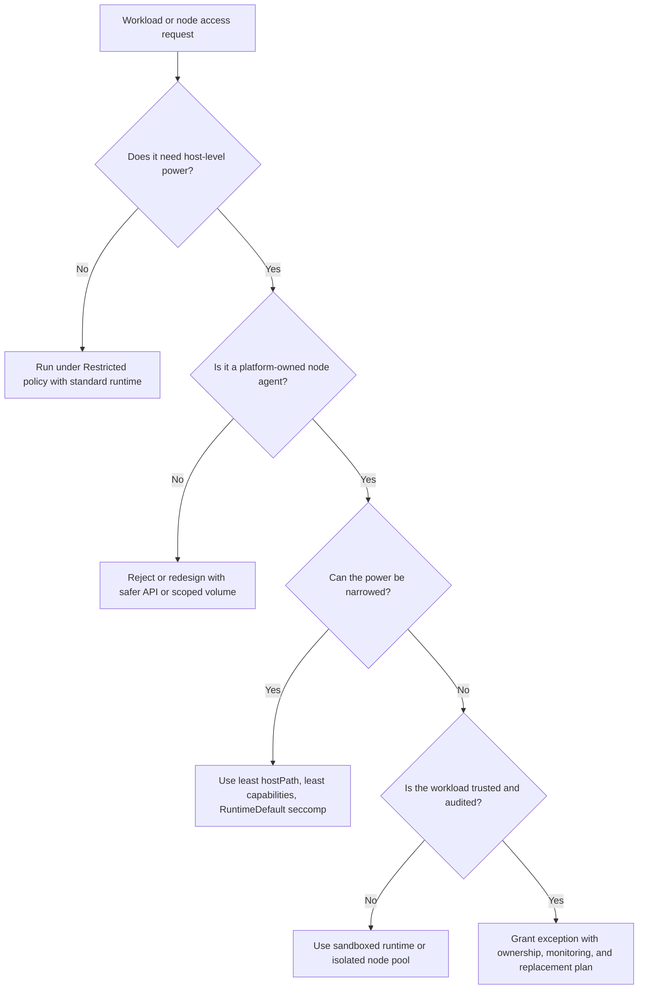

# Module 2.2: Node Security

> **Complexity**: `[MEDIUM]` - Core knowledge
>
> **Time to Complete**: 40-55 minutes
>
> **Prerequisites**: [Module 2.1: Control Plane Security](../module-2.1-control-plane-security/)
>
> **Kubernetes Version Target**: 1.35+

The command examples in this module use `k` as the short alias for kubectl. If your shell does not already have it, run `alias k=kubectl` before the hands-on section so commands such as `k get nodes` behave as shown.


## Learning Outcomes

After completing this module, you will be able to perform the following review tasks in a realistic cluster security conversation:

1. **Evaluate** kubelet authentication, authorization, and read-only endpoint settings to determine whether node APIs are exposed safely.
2. **Assess** pod specifications that request privileged containers, host namespaces, hostPath mounts, or Linux capabilities and explain the node-level risk.
3. **Diagnose** likely node compromise paths by connecting exposed kubelet APIs, writable runtime sockets, kernel escapes, and service account token exposure.
4. **Design** a node hardening plan that combines minimal operating systems, runtime isolation, patching, access control, and Node authorization.


## Why This Module Matters

In late 2018, Tesla disclosed that attackers had abused a poorly secured Kubernetes environment to run cryptocurrency mining workloads in its cloud account. The public reports focused on exposed administration surfaces and credential theft, but the lesson for node security was blunt: once an attacker reaches the machinery that actually runs pods, the control plane is no longer an abstract boundary. A worker node sees pod filesystems, mounted service account tokens, runtime sockets, logs, local network traffic, and kubelet credentials; those are exactly the ingredients an intruder needs to convert one weak workload into a broader incident with real cloud cost and operational damage.

Node security matters because worker nodes are where Kubernetes promises meet Linux reality. The API server can reject unsafe manifests, admission controllers can enforce policy, and RBAC can be carefully scoped, yet a node still has to pull images, mount volumes, start containers, apply cgroups, connect pods to networks, and report status. Each of those actions needs power, and power creates a target. If an attacker controls a privileged pod, the kubelet API, or the container runtime socket, the conversation changes from "can they call the Kubernetes API" to "can they act as the machine that the API trusts to run workloads."

This module teaches node security as a chain of trust rather than a checklist of flags. You will start with the node components and the kubelet API, move through runtime isolation and escape paths, then design a hardened node posture that works for Kubernetes 1.35+ clusters. The goal is not to memorize every dangerous field; the goal is to recognize how a small configuration decision changes the blast radius when a workload, node credential, or Linux kernel boundary fails.


## Node Architecture and Trust Boundaries

A Kubernetes node is best understood as a trusted execution environment with several powerful local agents. The kubelet is the node's representative to the control plane, the container runtime creates and supervises containers, kube-proxy or its replacement manages service routing, and the operating system kernel enforces most isolation boundaries. That architecture is efficient because the control plane does not need to manipulate Linux primitives directly, but it also means the node becomes a concentration point for credentials, local APIs, and kernel-level privilege.

```
┌─────────────────────────────────────────────────────────────┐
│              KUBERNETES NODE                                │
├─────────────────────────────────────────────────────────────┤
│                                                             │
│  ┌─────────────────────────────────────────────────────┐   │
│  │                    KUBELET                           │   │
│  │  • Node agent                                       │   │
│  │  • Manages pod lifecycle                            │   │
│  │  • Communicates with API server                     │   │
│  └─────────────────────────────────────────────────────┘   │
│                           │                                 │
│                           ▼                                 │
│  ┌─────────────────────────────────────────────────────┐   │
│  │              CONTAINER RUNTIME                       │   │
│  │  containerd, CRI-O                                  │   │
│  │  • Actually runs containers                         │   │
│  │  • Pulls images                                     │   │
│  └─────────────────────────────────────────────────────┘   │
│                           │                                 │
│                           ▼                                 │
│  ┌─────────────┐ ┌─────────────┐ ┌─────────────────────┐   │
│  │  CONTAINER  │ │  CONTAINER  │ │     CONTAINER       │   │
│  │   Pod A     │ │   Pod B     │ │      Pod C          │   │
│  └─────────────┘ └─────────────┘ └─────────────────────┘   │
│                                                             │
│  ┌─────────────────────────────────────────────────────┐   │
│  │                   KUBE-PROXY                         │   │
│  │  • Network rules (iptables/IPVS)                    │   │
│  │  • Service routing                                  │   │
│  └─────────────────────────────────────────────────────┘   │
│                                                             │
└─────────────────────────────────────────────────────────────┘
```

The diagram looks simple, yet it hides three important trust boundaries. First, the kubelet receives instructions from the API server and then performs local actions that ordinary API users cannot perform directly. Second, the runtime translates pod configuration into namespaces, cgroups, mounts, devices, and processes that share one host kernel. Third, the operating system owns the last line of defense, so kernel bugs, excessive Linux capabilities, and writable host paths can defeat assumptions made at the Kubernetes layer.

Think of a node like a secure warehouse. The control plane is the dispatch office, but the node is the loading dock where goods actually move, doors open, tools are stored, and workers carry keys. A dispatch clerk can have excellent paperwork controls, yet the warehouse still needs locked doors, limited keys, camera coverage, and a process for replacing broken locks. Node hardening is the Kubernetes version of that warehouse discipline.

Before you evaluate a specific setting, ask which boundary it affects. Kubelet authentication affects who can talk to the node agent. Kubelet authorization affects what authenticated callers can ask the node agent to do. Runtime configuration affects how much host power a container receives. Operating system hardening affects how much useful terrain remains if a workload escapes its intended container boundary. Pause and predict: if a pod can read the host's container runtime socket, which boundary has already failed, and which component will the attacker try to command next?

The practical inspection path starts by collecting node and pod context without assuming the cluster is safe. The following commands are deliberately read-oriented; they help you see which nodes exist, which versions they report, and which pods are concentrated on a node before you decide where deeper inspection is justified.

```bash
k get nodes -o wide
k describe node <node-name>
k get pods --all-namespaces --field-selector spec.nodeName=<node-name> -o wide
```

Those commands do not prove a node is hardened, but they build the map for a useful security review. A node running many privileged DaemonSets deserves different attention than a node that runs only restricted application pods. A node hosting ingress, storage, monitoring, and logging agents has a larger local trust footprint than a node dedicated to stateless workloads. When incident responders skip this mapping step, they often inspect the noisiest symptom first and miss the node where privilege actually converges.

The kubelet also has a credential identity that the API server can recognize as a node. In a properly configured cluster, that identity belongs to the `system:nodes` group and uses a `system:node:<nodeName>` username pattern, allowing Node authorization and the NodeRestriction admission plugin to constrain what the kubelet can read or modify. That relationship is a major containment mechanism: it means a compromised kubelet should not automatically read secrets for pods scheduled on other nodes.

The limitation is that containment still assumes the node identity is constrained and that the attacker has not stolen a stronger credential from a pod on the same node. A cluster-admin token mounted into one application pod can undo careful node authorization, because the attacker does not need kubelet permissions if the application gives them better credentials. Node security therefore overlaps with workload identity hygiene, admission policy, and secret management; it is not a separate topic that ends at the operating system boundary.

This overlap is why a node review should include both "inside the node" and "around the node" evidence. Inside the node, you care about kubelet configuration, runtime version, kernel posture, host services, local credentials, and whether privileged agents are expected. Around the node, you care about RBAC, admission controls, network reachability, image provenance, logging, and how quickly the platform can replace the machine. A narrow review that only checks one layer can produce comforting answers while leaving an easy path through another layer.

For example, a cluster might have perfect Pod Security Admission labels on application namespaces but still allow a legacy service account to proxy to kubelets. Another cluster might have strict RBAC but run old node images with a vulnerable runtime. A third cluster might use a hardened OS but let product teams deploy privileged troubleshooting pods during incidents. The security posture is the combined result of these decisions, so your assessment should describe the chain an attacker would need to complete and the control that breaks each step.


## Kubelet API Security

The kubelet is the most security-critical component on a worker node because it accepts requests that can inspect and affect running containers. It exposes an HTTPS endpoint, commonly associated with port 10250, that supports operations such as logs, exec, metrics, stats, and pod inspection depending on version and configuration. Those capabilities are necessary for normal Kubernetes administration, but they are dangerous if anonymous users, overbroad client certificates, or arbitrary service accounts can reach them without delegated authorization.

```
┌─────────────────────────────────────────────────────────────┐
│              KUBELET API SECURITY                           │
├─────────────────────────────────────────────────────────────┤
│                                                             │
│  KUBELET API CAPABILITIES (if exposed)                     │
│  • Execute commands in containers                          │
│  • Read container logs                                     │
│  • Port-forward to containers                              │
│  • View pods on the node                                   │
│                                                             │
│  DANGEROUS ENDPOINTS                                        │
│  • /exec - Execute arbitrary commands                      │
│  • /run - Run commands in containers                       │
│  • /pods - List all pods                                   │
│  • /logs - Read container logs                             │
│                                                             │
│  ATTACK SCENARIO                                            │
│  1. Attacker finds exposed kubelet (port 10250)            │
│  2. Connects without authentication                        │
│  3. Executes into any container on that node               │
│  4. Steals secrets, pivots to other systems                │
│                                                             │
└─────────────────────────────────────────────────────────────┘
```

The historical read-only kubelet port, commonly associated with 10255, made this risk easier to underestimate because the name sounded harmless. Reading pod lists, logs, stats, or environment-derived clues is not harmless during reconnaissance. Even when an endpoint does not directly allow command execution, it can reveal namespaces, service names, image tags, internal ports, and workload placement. Attackers use that information to choose a weaker pod, locate secrets, or target a privileged DaemonSet that already runs on every node.

Secure kubelet configuration has two major pieces: authentication identifies the caller, and authorization decides whether that caller may perform the requested action. Anonymous authentication should be disabled, client certificates should be anchored to a trusted CA when used, token authentication should delegate to the API server, and authorization should use Webhook mode so the kubelet calls the Kubernetes authorization API before allowing sensitive operations. In older flag language this meant `--anonymous-auth=false`, `--authentication-token-webhook=true`, `--client-ca-file=<cluster-ca>`, and `--authorization-mode=Webhook`; in configuration-file language the same posture is represented by the following protected example.

| Flag | Purpose | Secure Setting |
|------|---------|----------------|
| `--anonymous-auth` | Allow anonymous requests | `false` |
| `--authorization-mode` | How to authorize | `Webhook` (checks with API server) |
| `--client-ca-file` | CA for client certs | Set to cluster CA |
| `--read-only-port` | Read-only API port | `0` (disabled) |
| `--protect-kernel-defaults` | Protect kernel settings | `true` |
| `--hostname-override` | Override hostname | Avoid (can bypass authorization) |

```yaml
# Example kubelet configuration (kubelet-config.yaml)
apiVersion: kubelet.config.k8s.io/v1beta1
kind: KubeletConfiguration
authentication:
  anonymous:
    enabled: false
  webhook:
    enabled: true
authorization:
  mode: Webhook
readOnlyPort: 0
protectKernelDefaults: true
```

The `nodes/proxy` permission deserves special caution because it can look like a read permission in RBAC review while still allowing access to kubelet subresources that perform active operations. Kubernetes maps kubelet paths into node resources and subresources, and some WebSocket-backed operations are authorized through HTTP verbs that do not feel dangerous at first glance. When a role grants broad node proxy access to a user or service account, you should treat that grant as potential command execution on containers running on the target node, not as a harmless observability permission.

Worked example: a platform team discovers that a monitoring integration can call kubelet metrics but also has broader node proxy permissions than intended. The quick fix is not to disable monitoring; the better fix is to separate metrics access from general kubelet proxy access, restrict who can reach kubelet ports at the network layer, and ensure the kubelet itself delegates authorization instead of accepting any authenticated request. Before running this review in your own cluster, what output do you expect from `k auth can-i get nodes/proxy --as system:serviceaccount:<namespace>:<service-account>` for a normal application service account, and what would concern you?

```bash
k auth can-i get nodes/proxy --as system:serviceaccount:payments:api
k auth can-i get nodes/stats --as system:serviceaccount:monitoring:metrics-agent
k auth can-i '*' nodes/proxy --as system:serviceaccount:monitoring:metrics-agent
```

Those checks are API-server authorization checks, so they do not replace host firewalling or kubelet configuration inspection. They do, however, expose a common blind spot: many teams review ClusterRoles for pod, secret, and deployment verbs while ignoring node subresources. A service account that cannot list secrets may still be able to proxy to kubelets if a broad operations role was granted years earlier, and that can be enough to inspect pods or execute commands depending on the kubelet endpoint and authorization mode.

Kubelet configuration also intersects with node identity. The `--hostname-override` option can create surprising authorization outcomes when the name used by the kubelet does not match the Node object expected by the API server and Node authorizer. Cloud providers may also determine node names in provider-specific ways. For KCSA-level analysis, the key point is not to memorize every naming rule; it is to recognize that node identity must be predictable, unique, and aligned with Node authorization, otherwise the control plane cannot reliably constrain a kubelet to its own resources.

In a real review, you usually cannot SSH to every node and read a local file, especially when the organization uses managed Kubernetes. Start with what the API can show: node versions, roles, kubelet-reported configuration where exposed by the distribution, RBAC grants involving `nodes/proxy`, and network paths to kubelet ports. Then compare those findings with provider documentation, cluster bootstrap configuration, and admission policies. The strongest reviews combine direct node configuration evidence with control-plane evidence that unsafe access paths are not granted.

The network layer is easy to overlook because kubelet authentication and authorization feel sufficient once they are correctly configured. They are necessary, but they are not a reason to expose kubelet ports broadly. A strong posture limits kubelet reachability to the control plane, approved node agents, and tightly controlled administrative paths. If an application subnet, developer VPN, or unrelated monitoring network can scan every worker node, the cluster has increased the number of identities and workloads that can test the kubelet boundary.

During incident response, kubelet logs and API server audit logs can help determine whether an attacker tried to use this path. Look for denied SubjectAccessReviews involving node subresources, unexpected requests to kubelet proxy paths, unusual exec activity, and service accounts that suddenly interact with nodes after never doing so before. Detection is not a substitute for configuration, but it confirms whether the control is being stressed. A good KCSA answer explains the preventive setting and the evidence you would expect when that setting blocks an attack.


## Container Runtime and Isolation

The container runtime is responsible for turning pod intent into isolated Linux processes. Kubernetes tells the runtime what to start, but the kernel enforces most of the boundaries through namespaces, cgroups, capabilities, mount propagation, seccomp, AppArmor, SELinux, and device access. This split is why a Kubernetes manifest can look harmless while a runtime result is dangerous: a small field such as `privileged: true` changes what the runtime asks the kernel to allow.

```
┌─────────────────────────────────────────────────────────────┐
│              CONTAINER RUNTIME ISOLATION                    │
├─────────────────────────────────────────────────────────────┤
│                                                             │
│  LINUX ISOLATION MECHANISMS                                │
│                                                             │
│  NAMESPACES (Process isolation)                            │
│  ├── pid    - Process IDs                                  │
│  ├── net    - Network stack                                │
│  ├── mnt    - Mount points                                 │
│  ├── uts    - Hostname                                     │
│  ├── ipc    - Inter-process communication                  │
│  ├── user   - User/group IDs                               │
│  └── cgroup - Cgroup membership                            │
│                                                             │
│  CGROUPS (Resource limits)                                 │
│  ├── CPU limits                                            │
│  ├── Memory limits                                         │
│  └── Block I/O limits                                      │
│                                                             │
│  SECURITY MODULES                                          │
│  ├── seccomp  - System call filtering                      │
│  ├── AppArmor - Mandatory access control (Ubuntu/Debian)   │
│  └── SELinux  - Mandatory access control (RHEL/CentOS)     │
│                                                             │
└─────────────────────────────────────────────────────────────┘
```

Namespaces are the visibility layer. A pod normally gets its own process namespace, network namespace, and mount namespace, so processes inside the pod see a narrow version of the system. Cgroups are the accounting and limiting layer, making sure a container cannot consume unlimited CPU, memory, or block I/O. Mandatory access control and syscall filtering then reduce what a process can do even if it has a bug or is tricked into making a dangerous system call. None of these controls is magic; each one narrows a specific class of behavior.

Container root is a frequent source of confusion. A process can run as UID 0 inside a container without automatically receiving unrestricted host root power, because namespaces and capability sets shape what that UID can see and do. The danger rises when the pod also receives host namespaces, privileged mode, powerful capabilities, or writable host mounts. Pause and predict: a container runs as root inside its own namespace, has no added capabilities, uses the RuntimeDefault seccomp profile, and has no hostPath volumes; which host resources can it directly modify, and which extra fields would change your answer?

Runtime sockets deserve special treatment because they convert filesystem write access into container creation power. If a pod can write to the host's containerd socket, CRI-O socket, or an old Docker socket, the attacker may be able to ask the runtime to start a new privileged container, mount the host filesystem, or inspect other containers. That is not a minor hostPath mistake; it is effectively handing the attacker the local machinery used by kubelet to create workloads.

Kubernetes supports RuntimeClass so administrators can select different runtime handlers for different workload risk profiles. A standard runtime such as containerd or CRI-O is appropriate for trusted workloads when combined with least-privilege pod security controls. Sandboxed runtimes such as gVisor or Kata Containers add another boundary, either by interposing a user-space kernel layer or by placing workloads in lightweight virtual machines. The cost is compatibility, operational complexity, and performance overhead, so runtime choice should follow risk rather than fashion.

```
┌─────────────────────────────────────────────────────────────┐
│              CONTAINER RUNTIME OPTIONS                      │
├─────────────────────────────────────────────────────────────┤
│                                                             │
│  STANDARD RUNTIMES                                         │
│  ├── containerd (default)                                  │
│  └── CRI-O                                                 │
│  Good isolation, shares kernel with host                   │
│                                                             │
│  SANDBOXED RUNTIMES (Stronger isolation)                   │
│  ├── gVisor (runsc)                                        │
│  │   └── User-space kernel, intercepts syscalls            │
│  │                                                          │
│  └── Kata Containers                                       │
│      └── Lightweight VMs, separate kernel                  │
│                                                             │
│  Use sandboxed runtimes for:                               │
│  • Untrusted workloads                                     │
│  • Multi-tenant environments                               │
│  • Sensitive data processing                               │
│                                                             │
└─────────────────────────────────────────────────────────────┘
```

A RuntimeClass object is small, but it depends on node preparation. The runtime handler must exist in the CRI configuration on eligible nodes, and scheduling constraints may be needed when only some nodes support the runtime. The following example shows the Kubernetes side of that contract; it does not install gVisor or Kata by itself, and that distinction is important during design reviews.

```yaml
apiVersion: node.k8s.io/v1
kind: RuntimeClass
metadata:
  name: sandboxed
handler: runsc
scheduling:
  nodeSelector:
    runtime.kubedojo.io/sandboxed: "true"
```

```yaml
apiVersion: v1
kind: Pod
metadata:
  name: untrusted-worker
  namespace: tenant-a
spec:
  runtimeClassName: sandboxed
  containers:
    - name: worker
      image: registry.k8s.io/pause:3.10
      securityContext:
        allowPrivilegeEscalation: false
        capabilities:
          drop: ["ALL"]
        seccompProfile:
          type: RuntimeDefault
```

The decision to use sandboxing should come after you classify the workload. A batch job that processes untrusted customer-supplied files may justify extra isolation even if it runs slower. A latency-sensitive internal service with no untrusted code path may get more value from strict pod security, fast patching, and narrow RBAC. Which approach would you choose for a shared build platform that runs pull-request code from many teams, and why would a standard runtime plus policy enforcement still leave residual risk?

War story: a company running an internal CI platform allowed build pods to mount a host cache directory for speed. The mount looked limited because it pointed at a cache path rather than `/`, but the build image also ran as root and had enough filesystem tools to place executable content where a node-level maintenance job later consumed it. The incident did not start as a kernel escape; it started as a convenience mount that crossed a trust boundary. The fix combined narrower volumes, non-root execution, RuntimeDefault seccomp, admission policy, and moving untrusted builds onto sandbox-capable nodes.

When you review runtime isolation, separate controls that reduce likelihood from controls that reduce impact. Dropping Linux capabilities, disabling privilege escalation, using RuntimeDefault seccomp, and avoiding host namespaces reduce what a compromised process can do from inside its container. Sandboxed runtimes and dedicated node pools reduce impact if an escape attempt succeeds or if the workload itself is untrusted. Both categories are useful, but they answer different questions, and confusing them leads to weak designs.

This distinction matters for exception handling. If a vendor agent requires one extra capability, you can evaluate that capability directly and ask whether AppArmor, SELinux, seccomp, or a read-only mount keeps the exception bounded. If a platform runs arbitrary pull-request code, the problem is not one extra capability; the problem is that the workload is adversarial by design. That situation usually calls for isolation at the node-pool and runtime layers, plus strict credential boundaries, because ordinary application hardening assumes the workload owner is not trying to break the host.


## Node-Level Attacks and Blast Radius

Node-level attacks usually follow one of two paths. Misconfiguration-based attacks exploit excessive pod privileges, host namespaces, runtime sockets, or writable host paths that administrators intentionally allowed. Vulnerability-based attacks exploit a bug in the runtime, kernel, device driver, or privileged agent. Both paths matter because a well-configured cluster can still need emergency patching, and a fully patched cluster can still be compromised by a pod that is allowed to act like the host.

```
┌─────────────────────────────────────────────────────────────┐
│              CONTAINER ESCAPE VECTORS                       │
├─────────────────────────────────────────────────────────────┤
│                                                             │
│  MISCONFIGURATION-BASED                                    │
│                                                             │
│  Privileged containers                                     │
│  ├── privileged: true                                      │
│  ├── Full access to host devices                           │
│  └── Can mount host filesystem, load kernel modules        │
│                                                             │
│  Host namespaces                                           │
│  ├── hostPID: true - See host processes                    │
│  ├── hostNetwork: true - Use host network                  │
│  └── hostIPC: true - Share host IPC                        │
│                                                             │
│  Host path mounts                                          │
│  ├── Mount sensitive paths (/, /etc, /var/run/docker.sock)│
│  └── Can read/write host filesystem                        │
│                                                             │
│  VULNERABILITY-BASED                                        │
│                                                             │
│  Runtime vulnerabilities                                   │
│  ├── CVE-2019-5736 (runc)                                  │
│  └── CVE-2020-15257 (containerd)                           │
│                                                             │
│  Kernel vulnerabilities                                    │
│  └── Privilege escalation through kernel exploits          │
│                                                             │
└─────────────────────────────────────────────────────────────┘
```

Privileged containers are not simply containers with a few extra permissions. In Kubernetes, privileged mode grants broad access to host devices and relaxes many isolation controls, making the container much closer to a host process. Host namespaces have narrower but still serious effects: `hostPID` exposes host processes, `hostNetwork` places the pod directly onto the node network stack, and `hostIPC` shares inter-process communication resources. Each field may be legitimate for a small class of node agents, yet each one also removes a layer that defenders expect to exist.

HostPath volumes are especially subtle because the field can be safe or catastrophic depending on path, access mode, and workload identity. A read-only mount of a narrow log directory for a trusted node logging agent carries one risk profile. A writable mount of `/`, `/etc`, `/var/lib/kubelet`, or a runtime socket carries a completely different profile. The safe question is never "is hostPath allowed"; the safe question is "which path, which direction, which workload, which node pool, and which compensating controls?"

```yaml
apiVersion: v1
kind: Pod
metadata:
  name: dangerous-debugger
  namespace: tools
spec:
  hostPID: true
  hostNetwork: true
  containers:
    - name: shell
      image: busybox:1.37
      command: ["sh", "-c", "sleep 3600"]
      securityContext:
        privileged: true
      volumeMounts:
        - name: host-root
          mountPath: /host
  volumes:
    - name: host-root
      hostPath:
        path: /
        type: Directory
```

That pod specification is a review exercise, not a recommendation. It combines host namespaces, privileged mode, and a writable host root mount, which gives a compromised container a practical route to inspect host processes, alter files, and interact with node-level state. A legitimate debugging need might temporarily require one of those powers, but combining all of them in a reusable tool image invites persistence, credential theft, and accidental drift. A production exception should be temporary, audited, narrowly scoped, and blocked by default admission policy outside a break-glass workflow.

Once the attacker controls a node, the impact depends on what credentials and workloads are present there. They can usually read files mounted into pods on that node, inspect local container state, attempt to steal service account tokens, search logs for secrets, and tamper with pod traffic or node agents. If the kubelet credential is constrained by Node authorization, API access should be limited to node-relevant resources. If the attacker steals a more privileged workload credential, the blast radius follows that credential instead.

```
┌─────────────────────────────────────────────────────────────┐
│              NODE COMPROMISE IMPACT                         │
├─────────────────────────────────────────────────────────────┤
│                                                             │
│  IF A NODE IS COMPROMISED, ATTACKER CAN:                   │
│                                                             │
│  ON THAT NODE                                              │
│  ├── Access all containers on the node                     │
│  ├── Read secrets mounted in pods                          │
│  ├── Impersonate any pod's service account                 │
│  ├── Access node's kubelet credentials                     │
│  └── Intercept pod network traffic                         │
│                                                             │
│  WITH NODE KUBELET CREDENTIALS                             │
│  ├── Query API server for node's pods                      │
│  ├── Cannot (with Node authz) access other nodes' data     │
│  └── Limited blast radius if Node authz mode is enabled    │
│                                                             │
│  DEFENSE: Node authorization mode limits what kubelet      │
│  credentials can access to resources for that node only    │
│                                                             │
└─────────────────────────────────────────────────────────────┘
```

The most important design habit is to separate local compromise from cluster compromise. A node compromise is already severe, but it should not automatically allow reading every Secret, modifying every Deployment, or impersonating cluster administrators. Node authorization, NodeRestriction, short-lived service account tokens, narrow RBAC, and admission controls all serve that containment goal. If one compromised worker node can become a complete control-plane compromise, the cluster is relying on luck rather than layered defense.

You can inspect risky pod fields with ordinary API queries before an incident. The commands below are not a full policy engine, but they help you find obvious host privilege concentration during a review. They are also useful for validating whether admission policy is working: in a locked-down namespace, you should not see ordinary application pods requesting these powers.

```bash
k get pods --all-namespaces -o jsonpath='{range .items[?(@.spec.hostPID==true)]}{.metadata.namespace}/{.metadata.name}{"\n"}{end}'
k get pods --all-namespaces -o jsonpath='{range .items[?(@.spec.hostNetwork==true)]}{.metadata.namespace}/{.metadata.name}{"\n"}{end}'
k get pods --all-namespaces -o jsonpath='{range .items[*]}{.metadata.namespace}/{.metadata.name}{" "}{range .spec.volumes[?(@.hostPath)]}{.hostPath.path}{" "}{end}{"\n"}{end}'
```

Treat the results as a conversation starter rather than a verdict. A CNI plugin or storage CSI node plugin may legitimately run with host access, but it should live in a restricted namespace, use a reviewed image, have narrow RBAC, and be owned by a platform team. An application pod in a product namespace that requests the same access is different evidence. The same field can be acceptable for a node agent and unacceptable for a customer-facing service.

Kernel and runtime vulnerabilities add urgency to patching because they bypass intention. CVE-2019-5736 in runc showed that a container runtime bug could allow overwrite of the host runc binary under certain conditions, and CVE-2020-15257 showed that containerd's CRI plugin could expose an unsafe abstract Unix domain socket behavior. The lesson is not that those exact bugs define today's threat; the lesson is that runtime and kernel patching belong in the security design, not in an operations backlog that waits for convenient maintenance windows.

A useful compromise model also includes scheduling. If every sensitive workload can land next to every risky workload, the cluster turns a single node compromise into a data gathering opportunity. Taints, tolerations, node selectors, topology spread, and separate node groups are not only availability tools; they also help decide which credentials and data coexist on a machine. The goal is not perfect separation for every service, but deliberate separation for workloads with different trust levels, regulatory impact, or tenant ownership.

Responding to a suspected node compromise should be decisive. Cordon the node so new pods do not arrive, preserve relevant evidence if your incident process requires it, rotate credentials that were present on the node, and replace the machine from a trusted image rather than trying to clean it in place. Then inspect whether admission, RBAC, and scheduling allowed the attacker to reach more than the local node. If the investigation stops after deleting one bad pod, the same path may still be available on the next node.


## Hardening Nodes Without Losing Operability

Node hardening reduces the useful attack surface available after the first mistake. Minimal operating systems remove general-purpose packages and shells, immutable node designs make persistent host changes harder, and automated replacement keeps drift from accumulating. Those properties are valuable because attackers prefer familiar post-exploitation tools: package managers, compilers, shells, SSH, writable system directories, and long-lived local credentials. Removing them does not prevent every compromise, but it can make compromise noisier, shorter-lived, and harder to turn into persistence.

```
┌─────────────────────────────────────────────────────────────┐
│              NODE OS HARDENING                              │
├─────────────────────────────────────────────────────────────┤
│                                                             │
│  MINIMIZE ATTACK SURFACE                                   │
│  ├── Use minimal OS (Bottlerocket, Flatcar, Talos)         │
│  ├── Remove unnecessary packages                           │
│  ├── Disable unnecessary services                          │
│  └── Use immutable infrastructure                          │
│                                                             │
│  KEEP UPDATED                                              │
│  ├── Regular security patches                              │
│  ├── Automated patching where possible                     │
│  └── Container runtime updates                             │
│                                                             │
│  RESTRICT ACCESS                                           │
│  ├── Disable SSH if possible                               │
│  ├── If SSH needed, key-only authentication               │
│  ├── Use bastion hosts                                     │
│  └── Audit all node access                                 │
│                                                             │
│  ENABLE SECURITY FEATURES                                  │
│  ├── SELinux or AppArmor enforcing mode                   │
│  ├── Seccomp default profile                              │
│  └── Kernel parameter hardening                           │
│                                                             │
└─────────────────────────────────────────────────────────────┘
```

Minimal node operating systems are not all the same, but they share a purpose-built philosophy. Bottlerocket is designed for running containers on AWS, Flatcar Container Linux continues the minimal and update-oriented lineage of CoreOS, Talos exposes an API-driven model with no SSH by default, and Google's Container-Optimized OS targets container workloads on Google Cloud. The common security value is smaller default surface area and more predictable node lifecycle management.

| OS | Description |
|------|-------------|
| **Bottlerocket** | AWS-developed, purpose-built for containers |
| **Flatcar Container Linux** | CoreOS successor, minimal and immutable |
| **Talos** | API-driven, no SSH, fully immutable |
| **Container-Optimized OS** | Google's minimal container host |

The benefits of a minimal node operating system are practical rather than cosmetic, because each removed package, daemon, and login path reduces the number of post-exploitation tools already waiting on the host:
- Smaller attack surface
- Faster patching
- Immutable (changes require rebuild)
- Designed for container workloads

The operational tradeoff is real. Removing SSH changes debugging habits, immutable filesystems change how teams apply emergency fixes, and automated node replacement requires workload disruption budgets to be correct. A hardened node plan that ignores operations will be bypassed during the first outage. A practical plan gives engineers supported alternatives: `k debug node` where policy allows it, ephemeral debug containers for workload troubleshooting, centralized logs, node metrics, provider serial console procedures, and documented break-glass access with time-limited approvals.

Kubernetes provides several controls that complement the operating system. Pod Security Admission can enforce Baseline or Restricted standards for ordinary namespaces, blocking privileged pods, host namespace use, dangerous capabilities, and many hostPath patterns before they reach a node. RuntimeDefault seccomp should be the default expectation for Linux workloads, with custom profiles reserved for teams that can explain the required syscall differences. AppArmor or SELinux enforcement adds another local policy layer when supported by the distribution.

```yaml
apiVersion: v1
kind: Namespace
metadata:
  name: payments
  labels:
    pod-security.kubernetes.io/enforce: restricted
    pod-security.kubernetes.io/enforce-version: v1.35
    pod-security.kubernetes.io/audit: restricted
    pod-security.kubernetes.io/audit-version: v1.35
    pod-security.kubernetes.io/warn: restricted
    pod-security.kubernetes.io/warn-version: v1.35
```

That namespace policy does not harden the node by itself, but it prevents ordinary workloads from asking the node for excessive power. Platform namespaces may need Baseline, Privileged, or carefully scoped exemptions for CNI, CSI, observability, or security agents. The important design property is explicitness. If privileged access exists, it should be concentrated in known namespaces with ownership, review, and monitoring rather than scattered across application teams as an accidental default.

Patching strategy should be designed around replacement rather than heroic in-place repair. In a healthy cluster, nodes can be drained, replaced, and rejoined without special drama because workloads have readiness probes, disruption budgets, replicated controllers, and externalized state. If a cluster cannot tolerate node replacement, the security problem is bigger than patch scheduling. Every unreplaceable node becomes an exception that accumulates kernel fixes, runtime updates, and emergency configuration changes until it is too risky to touch.

```bash
k cordon <node-name>
k drain <node-name> --ignore-daemonsets --delete-emptydir-data
# Replace or patch the node using your provider or node image process.
k uncordon <node-name>
```

Access control for humans should follow the same replacement mindset. SSH should be disabled when the node OS and provider workflow support it; if SSH remains necessary, it should require key-only authentication, bastion or zero-trust access, session logging, and a short list of responders. Long-lived shared SSH keys are a node compromise multiplier because they are difficult to revoke, hard to attribute, and often copied into places where audit teams cannot see them.

The final layer is detection. A hardened node should produce useful signals when something violates the expected baseline: unexpected privileged pods, new hostPath mounts, kubelet authorization failures, process execution through node debug paths, runtime socket access, kernel audit events, and node image drift. You do not need every detection product to pass the KCSA, but you should be able to explain what evidence would show that node hardening is working and what evidence would trigger containment.

Operability also means designing for failed upgrades and failed assumptions. A node image rollout might uncover a kernel module dependency that no one documented, or a stricter seccomp default might break a legacy workload that previously relied on a blocked syscall. The answer is not to abandon hardening; it is to stage changes through canary node pools, observe workload behavior, and keep rollback images available. Mature teams treat hardening as a release process with tests, telemetry, and ownership, not as a one-time checklist performed during an audit.

Cost and capacity planning belong in the same conversation. Sandboxed runtimes may need more CPU or memory overhead, separate node pools may reduce bin-packing efficiency, and faster patching may require extra surge capacity during replacement. Those costs are visible, while the cost of a node compromise is uncertain until it happens. The engineering job is to put numbers around both sides: how much capacity is needed to patch weekly, how many workloads require privileged access, how many nodes host untrusted code, and how long credentials remain valid after pod compromise.


## Patterns & Anti-Patterns

Node security improves fastest when teams standardize a small number of proven patterns instead of debating every manifest from first principles. The patterns below work because they make dangerous power visible, restrict it to narrow ownership boundaries, and preserve operational paths for debugging and repair. They are not vendor-specific; the exact implementation may differ across managed Kubernetes, self-managed kubeadm clusters, and hardened node operating systems.

| Pattern | When to Use | Why It Works | Scaling Considerations |
|---|---|---|---|
| Hardened kubelet baseline | Every cluster, including development clusters | Disables anonymous access, delegates authorization, removes read-only exposure, and protects expected kernel defaults | Bake into node images or bootstrap templates so new node pools inherit the posture automatically |
| Privileged workload isolation | CNI, CSI, observability, and security agents that need host power | Keeps high-risk pods in reviewed namespaces with known owners, RBAC, image provenance, and monitoring | Use namespace labels, admission exemptions, and separate node pools for agents when tenant risk is high |
| RuntimeClass for untrusted execution | Build systems, plugin execution, customer-supplied code, or multi-tenant processing | Adds a second isolation boundary beyond standard namespaces and cgroups | Label compatible nodes, document overhead, and test syscall compatibility before forcing migration |
| Immutable node lifecycle | Production node pools where reliability and repeatability matter | Replaces drift-prone repair with image-based rollout, drain, replacement, and auditability | Requires disruption budgets, automated node group rollout, and clear rollback procedures |

Anti-patterns usually come from urgency rather than ignorance. A team needs to debug a production outage, so it creates a privileged shell pod. A monitoring agent cannot read metrics, so someone grants broad node proxy access. A build cache is slow, so a writable hostPath appears. Each decision feels local, but the cluster gradually becomes full of small exceptions that an attacker can chain into node control.

| Anti-Pattern | What Goes Wrong | Better Alternative |
|---|---|---|
| Permanent privileged debug pod | A troubleshooting tool becomes a standing root-equivalent entry point on every node where it can schedule | Use temporary break-glass workflows, time-bound access, and audited node debugging with explicit cleanup |
| Broad `nodes/proxy` RBAC | A service account intended for monitoring may gain access to kubelet APIs that perform active operations | Grant only required node subresources and validate with `k auth can-i` tests for the exact service account |
| Writable runtime socket mount | Any compromise of the pod can turn into local container creation and host filesystem access | Avoid runtime socket mounts; use purpose-built APIs, read-only telemetry, or tightly reviewed node agents |
| Manual package repair on nodes | Snowflake nodes drift from the image baseline and retain emergency changes after the incident | Drain and replace nodes from a patched image, then improve observability so direct repair is less tempting |

The practical rule is to make exceptions expensive enough to require thought but supported enough that engineers do not invent side doors. A denied privileged pod should point to a documented process for node-agent approval or incident break-glass access. A blocked hostPath should explain which safe volume patterns exist. Security controls fail socially when they only say no; they succeed when the secure path is also the maintained path.

One pattern worth calling out across all rows is ownership. A privileged DaemonSet with a named owning team, documented threat model, narrow ClusterRole, approved image source, and monitored change path is reviewable. A privileged DaemonSet that "everyone uses for debugging" is not reviewable because no one is accountable for its risk. The same applies to node pools, runtime classes, and break-glass access; technical controls need an owner who can answer why they exist and when they should be removed.


## Decision Framework

Use this decision framework when reviewing a node security request or investigating a suspected node-level weakness. It starts with the requested power, then asks whether the workload is trusted, whether a less powerful control exists, and whether the node pool can contain the residual risk. The sequence matters because jumping directly to runtime choice can hide simpler fixes such as removing a hostPath or tightening a ClusterRole.



| Decision Question | Prefer This | When the Answer Changes |
|---|---|---|
| Does the workload need host process, network, or filesystem visibility? | Keep default pod namespaces and avoid hostPath | Temporary incident response, CNI, CSI, node monitoring, or security telemetry may justify a scoped exception |
| Is the code trusted by the platform team? | Standard runtime with Restricted policy | Untrusted tenant code or build execution may justify RuntimeClass sandboxing or dedicated node pools |
| Can a Kubernetes API replace host access? | Use API permissions with narrow RBAC | Some node agents genuinely need local device, network, or filesystem access |
| Can the node be replaced quickly? | Patch through image rollout and node replacement | Stateful or fragile workloads require reliability work before security patching can be dependable |
| Would a node compromise expose cluster-admin credentials? | Remove broad tokens from pods and enforce narrow RBAC | Legacy automation may require redesign before the blast radius is acceptable |

For KCSA scenarios, your answer should usually name the failing boundary and the containment control. "Disable anonymous kubelet access" is better than "secure the kubelet" because it identifies the authentication boundary. "Move untrusted builds to a sandboxed RuntimeClass and dedicated node pool" is better than "use gVisor" because it connects the workload risk to scheduling, runtime, and operational isolation. Strong answers explain both the immediate fix and the reason that fix changes attacker options.

Use the same language when you write tickets or change requests. Instead of saying "harden nodes," say "disable kubelet anonymous authentication in the node bootstrap template," "remove writable runtime socket mounts from application namespaces," or "move untrusted build jobs to nodes labeled for the sandboxed RuntimeClass." Specific language makes verification possible. If the proposed change cannot be verified with a command, a policy check, a node image diff, or an audit event, refine the change until it can.


## Did You Know?

- **The kubelet read-only port (10255)** was historically used for debugging but exposed pod information without authentication. It is now disabled by default in modern Kubernetes, but older clusters and inherited node images are still worth checking during reviews.

- **Container escape vulnerabilities** are regularly discovered. CVE-2019-5736 in runc allowed a container to overwrite the host runc binary under certain conditions, which is why runtime patching belongs in the same risk conversation as pod policy.

- **gVisor** was developed by Google to add stronger isolation for multi-tenant container execution by intercepting many Linux system calls in a user-space kernel layer rather than sending them directly to the host kernel.

- **Node authorization mode** became available in Kubernetes 1.7 to limit what kubelet credentials can access, and it remains a key containment control when a worker node credential is stolen.


## Common Mistakes

| Mistake | Why It Happens | How to Fix It |
|---|---|---|
| Leaving kubelet anonymous authentication enabled | Older bootstrap templates and copied flags preserve defaults that treat unauthenticated callers as anonymous users | Set anonymous authentication to false, use webhook authentication where appropriate, and verify network paths to kubelet ports |
| Using `AlwaysAllow` kubelet authorization | Teams focus on API server RBAC and forget that kubelet authorization is a separate delegated check | Configure kubelet authorization mode as Webhook and test sensitive access paths through `nodes/proxy` reviews |
| Treating read-only kubelet data as harmless | Pod lists, logs, metrics, and stats reveal workload names, namespaces, ports, and secret-handling clues | Disable the read-only port, restrict metrics access to approved agents, and monitor unexpected kubelet requests |
| Granting broad `nodes/proxy` permissions to service accounts | Monitoring or operations integrations are given wildcard node access to make setup fast | Grant only required subresources, split metrics from proxy access, and validate with `k auth can-i` as the service account |
| Allowing writable hostPath volumes for application pods | Teams use host storage as a shortcut for caching, debugging, or log access | Replace with PVCs, projected data, read-only narrow paths, or reviewed node-agent patterns owned by the platform team |
| Keeping permanent privileged debug tools deployed | Incident pressure turns a temporary workaround into a reusable root-equivalent pod | Use time-bound break-glass procedures, admission exceptions with expiry, and post-incident cleanup checks |
| Patching nodes manually over SSH | Operators need a fast repair path and the cluster cannot tolerate normal node replacement | Build an image-based patch workflow, fix disruption budgets, drain nodes cleanly, and remove routine SSH dependence |
| Running untrusted workloads on the standard runtime in shared node pools | Multi-tenant risk is underestimated because containers are assumed to be complete isolation boundaries | Use RuntimeClass sandboxing, dedicated node pools, strict pod security, and workload identity isolation |


## Quiz

<details><summary>1. Your security scanner reports that worker nodes accept anonymous kubelet requests and use `AlwaysAllow` authorization. The nodes are reachable from an internal application subnet. What is the likely attack path, and which settings change the outcome?</summary>

An attacker who reaches the kubelet HTTPS endpoint can attempt to list pods, read logs, and potentially execute commands through kubelet APIs without a meaningful identity or authorization decision. The immediate fixes are to disable anonymous authentication and set kubelet authorization to Webhook so authenticated requests are checked through the API server authorization path. Network segmentation still matters because kubelet ports should not be broadly reachable from application subnets. The reasoning is boundary-based: authentication decides who is calling, authorization decides what they can do, and network controls reduce who can try.

</details>

<details><summary>2. A product team asks for `hostPID: true`, `hostNetwork: true`, `privileged: true`, and a writable host root mount so they can troubleshoot latency. How would you assess the risk and propose a safer path?</summary>

That pod combines several node boundary removals at once, giving a compromised container visibility into host processes, direct use of the host network stack, broad device and kernel-related power, and write access to the host filesystem. It is not acceptable as a normal production application deployment. A safer path is to use supported observability data first, then a temporary audited debug workflow if host access is truly required. If an exception is approved, it should be time-bound, owned by the platform team, isolated to the affected nodes, and removed after the incident.

</details>

<details><summary>3. A monitoring service account needs kubelet metrics, and a proposed ClusterRole grants wildcard access to `nodes/proxy`. What should you check before approving it?</summary>

You should verify exactly which node subresources the agent needs and whether metrics access can be granted without general proxy access. Broad `nodes/proxy` permissions can authorize access to kubelet APIs that are not merely read-only, including paths associated with active container operations depending on kubelet behavior and authorization mapping. Run `k auth can-i` checks as the service account for `nodes/stats`, `nodes/metrics`, and `nodes/proxy`, then reduce the role to the narrowest working set. The approval should also consider network reachability to kubelet ports and whether the agent namespace is tightly controlled.

</details>

<details><summary>4. Your organization runs customer-submitted build jobs on the same node pool as internal services. The build jobs use standard containerd and Restricted pod security. Is that enough isolation, and what design would you evaluate?</summary>

Restricted pod security is a strong baseline, but customer-submitted build jobs are untrusted code, so the residual risk of kernel or runtime escape is higher than for normal internal services. You should evaluate a sandboxed RuntimeClass such as gVisor or a VM-based runtime, plus a dedicated node pool that does not colocate untrusted builds with sensitive internal services. The tradeoff is overhead and compatibility, so the design should include testing for build tools that need unusual syscalls or filesystem behavior. The reasoning is that untrusted code changes the runtime isolation requirement, not just the admission policy requirement.

</details>

<details><summary>5. An attacker compromises one worker node and steals the kubelet credential. What limits whether the incident becomes cluster-wide data exposure?</summary>

Node authorization limits kubelet credentials to resources related to the node, such as pods and secrets for pods bound to that node, when the kubelet identity is correctly formed and NodeRestriction is used for related write constraints. That containment can prevent one stolen node credential from reading secrets across every node. The incident can still become cluster-wide if a pod on that node mounted a highly privileged service account token or stored administrator credentials in logs or files. The correct assessment therefore examines both node identity controls and workload credentials present on the compromised node.

</details>

<details><summary>6. A team wants to keep SSH on every node because it makes emergency repair faster. What security and operational questions would you ask before accepting that design?</summary>

You should ask who can access SSH, how keys are issued and revoked, whether sessions are logged, whether bastion or zero-trust controls are enforced, and why normal drain-and-replace workflows are insufficient. SSH can be a legitimate break-glass tool, but routine SSH repair creates drift and gives attackers a familiar persistence path. A stronger design uses immutable node images, automated replacement, centralized logs, and documented emergency access with time limits. The goal is not to remove operability; it is to make the supported repair path auditable and repeatable.

</details>

<details><summary>7. A namespace enforces the Restricted Pod Security Standard, but a storage CSI node plugin still runs as privileged in a platform namespace. Is that a policy failure?</summary>

Not necessarily. Some platform-owned node agents need elevated host access to manage networking, storage, security telemetry, or node lifecycle tasks. The policy question is whether the privileged workload is isolated to a reviewed namespace, owned by a trusted team, granted narrow RBAC, monitored, and excluded from ordinary application deployment paths. Restricted policy for application namespaces and controlled exemptions for platform namespaces can coexist. It becomes a failure when privileged exceptions are undocumented, reusable by application teams, or broader than the agent actually needs.

</details>


## Hands-On Exercise: Node Security Assessment

In this exercise, you will assess a deliberately weak kubelet configuration and a risky pod request, then design a hardened response. You do not need a live cluster for the reasoning steps, but the optional commands are written so they can run in a Kubernetes 1.35+ lab cluster where you have read permissions. Focus on explaining why each control changes attacker options rather than merely naming a secure value.

**Scenario**: Review this kubelet configuration and identify security issues as if you were preparing a platform-team change request:

```yaml
apiVersion: kubelet.config.k8s.io/v1beta1
kind: KubeletConfiguration
authentication:
  anonymous:
    enabled: true
  webhook:
    enabled: false
authorization:
  mode: AlwaysAllow
readOnlyPort: 10255
protectKernelDefaults: false
```

### Tasks

- [ ] Identify every insecure kubelet setting in the scenario and map each one to authentication, authorization, information disclosure, or kernel baseline enforcement.
- [ ] Write a corrected kubelet configuration that disables anonymous access, enables webhook authentication, delegates authorization, disables the read-only port, and protects kernel defaults.
- [ ] Review the dangerous debugger pod from the node-level attack section and list which fields violate a Restricted policy expectation.
- [ ] Use `k auth can-i` to test whether an ordinary application service account can access `nodes/proxy`, then explain what result you expect in a hardened cluster.
- [ ] Design a node hardening plan for a mixed cluster that runs trusted services, platform agents, and untrusted build jobs.
- [ ] Define success criteria for proving the hardened posture is working after the change.

<details><summary>Solution: kubelet configuration assessment</summary>

The insecure settings are `anonymous.enabled: true`, `webhook.enabled: false`, `authorization.mode: AlwaysAllow`, `readOnlyPort: 10255`, and `protectKernelDefaults: false`. Anonymous authentication allows unauthenticated callers to receive an identity instead of being rejected, while disabled webhook authentication prevents bearer-token validation through the API server. `AlwaysAllow` means authenticated requests are not meaningfully checked, the read-only port can disclose pod and node information, and disabled kernel default protection allows the kubelet to continue when expected kernel settings differ from the hardened baseline.

**Secure configuration:**

```yaml
authentication:
  anonymous:
    enabled: false
  webhook:
    enabled: true
authorization:
  mode: Webhook
readOnlyPort: 0
protectKernelDefaults: true
```

</details>

<details><summary>Solution: dangerous pod review</summary>

The dangerous debugger pod violates normal Restricted expectations through `hostPID: true`, `hostNetwork: true`, `privileged: true`, and a writable hostPath mount of `/`. `hostPID` exposes host processes, `hostNetwork` removes the pod network namespace boundary, privileged mode grants broad host-level power, and the host root mount gives the container direct filesystem access to the node. A break-glass debugging process might temporarily allow a narrower version of one of these controls, but a reusable application pod should not combine them.

</details>

<details><summary>Solution: RBAC check</summary>

Run checks like these with a real namespace and service account name from your lab:

```bash
k auth can-i get nodes/proxy --as system:serviceaccount:payments:api
k auth can-i get nodes/stats --as system:serviceaccount:payments:api
k auth can-i '*' nodes/proxy --as system:serviceaccount:payments:api
```

In a hardened cluster, an ordinary application service account should not be able to access `nodes/proxy` or wildcard node proxy operations. A dedicated monitoring agent might have narrow access to metrics or stats, but that permission should be granted to a reviewed service account in a controlled namespace. If the application service account can access `nodes/proxy`, investigate ClusterRoleBindings that grant broad node subresource access.

</details>

<details><summary>Solution: mixed-cluster hardening plan</summary>

Trusted services should run under Restricted Pod Security Admission on standard runtime nodes with RuntimeDefault seccomp, dropped capabilities, no host namespaces, and no writable hostPath volumes. Platform agents that genuinely need host access should run in platform-owned namespaces with explicit exemptions, narrow RBAC, reviewed images, and monitoring for changes. Untrusted build jobs should move to a dedicated node pool with a sandboxed RuntimeClass where feasible, no sensitive colocated workloads, and short-lived workload credentials. All node pools should use hardened kubelet configuration, Node authorization, image-based patching, and a drain-and-replace lifecycle.

</details>

<details><summary>Solution: success criteria</summary>

Success means the weak kubelet settings are removed from bootstrap templates or node configuration, application service accounts cannot access `nodes/proxy`, ordinary namespaces enforce Restricted policy, and risky host privileges appear only in documented platform namespaces. It also means nodes can be patched or replaced through a repeatable workflow, not manual SSH repair. Finally, monitoring should alert on unexpected privileged pods, new writable hostPath mounts, kubelet authorization failures, and node image drift so the controls remain true after the first rollout.

</details>

### Success Criteria

- [ ] The corrected kubelet configuration uses `anonymous.enabled: false`, `webhook.enabled: true`, `authorization.mode: Webhook`, `readOnlyPort: 0`, and `protectKernelDefaults: true`.
- [ ] Your pod review identifies privileged mode, host namespaces, and writable hostPath as separate node-level risks.
- [ ] Your RBAC test expectation explains why ordinary application service accounts should not access `nodes/proxy`.
- [ ] Your hardening plan separates trusted services, platform-owned privileged agents, and untrusted workloads.
- [ ] Your final explanation connects each control to the attacker action it prevents or contains.


## Sources

- [Kubernetes: Kubelet authentication/authorization](https://kubernetes.io/docs/reference/access-authn-authz/kubelet-authn-authz/)
- [Kubernetes: Using Node Authorization](https://kubernetes.io/docs/reference/access-authn-authz/node/)
- [Kubernetes: Authorization overview](https://kubernetes.io/docs/reference/access-authn-authz/authorization/)
- [Kubernetes: Nodes](https://kubernetes.io/docs/concepts/architecture/nodes/)
- [Kubernetes: Pod Security Standards](https://kubernetes.io/docs/concepts/security/pod-security-standards/)
- [Kubernetes: Linux kernel security constraints for Pods and containers](https://kubernetes.io/docs/concepts/security/linux-kernel-security-constraints/)
- [Kubernetes: RuntimeClass](https://kubernetes.io/docs/concepts/containers/runtime-class/)
- [Kubernetes: Debugging Kubernetes nodes with kubectl](https://kubernetes.io/docs/tasks/debug/debug-cluster/kubectl-node-debug/)
- [containerd: CRI plugin configuration](https://github.com/containerd/containerd/blob/main/docs/cri/config.md)
- [CRI-O: Configuration documentation](https://github.com/cri-o/cri-o/blob/main/docs/crio.conf.5.md)
- [gVisor: Architecture guide](https://gvisor.dev/docs/architecture_guide/)
- [Kata Containers: Architecture](https://github.com/kata-containers/kata-containers/blob/main/docs/design/architecture/README.md)
- [AWS Bottlerocket documentation](https://bottlerocket.dev/en/os/latest/)
- [Flatcar Container Linux documentation](https://www.flatcar.org/docs/latest/)
- [Talos Linux documentation](https://www.talos.dev/latest/introduction/what-is-talos/)


## Next Module

[Module 2.3: Network Security](../module-2.3-network-security/) continues the same defense-in-depth story by moving from node-local trust boundaries to CNI plugins, service mesh security, policy enforcement, and network-level controls.
