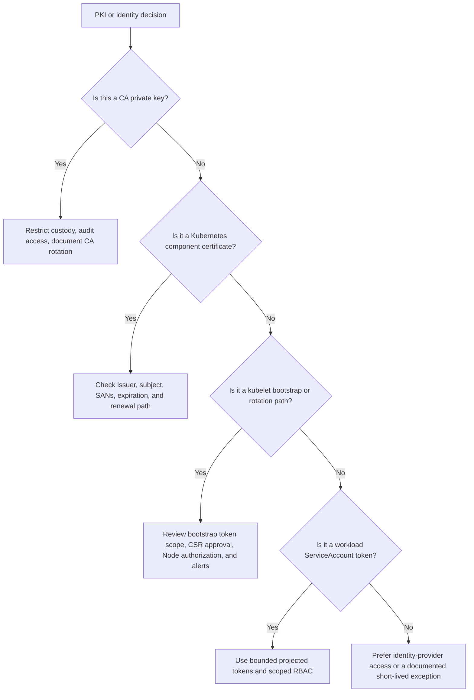

# Module 2.4: PKI and Certificates

> **Complexity**: `[MEDIUM]` - Core knowledge | **Time to Complete**: 45-60 minutes | **Prerequisites**: [Module 2.3: Network Security](../module-2.3-network-security/)

This module uses Kubernetes 1.35+ behavior and the short command alias `k` for `kubectl`. If you run the examples in a lab cluster, define the alias once with `alias k=kubectl`, then keep using `k` so the commands match the lesson and the troubleshooting flow stays concise.


## What You'll Be Able to Do

After completing this module, you will be able to apply these outcomes during cluster reviews, certificate incidents, and KCSA-style scenario analysis:

1. **Map** Kubernetes PKI architecture to the server, client, CA, and ServiceAccount credentials used by core components
2. **Diagnose** certificate authentication failures by inspecting identity fields, trust roots, expiration, and rotation behavior
3. **Evaluate** PKI security risks from compromised CA keys, overpowered certificate groups, weak lifecycle controls, and legacy tokens
4. **Design** certificate bootstrap, renewal, and monitoring practices that reduce blast radius without breaking cluster operations


## Why This Module Matters

In February 2020, a well-known certificate authority incident forced emergency certificate replacement across many customer environments because some issued certificates violated browser ecosystem rules. The problem was not Kubernetes-specific, but the operational lesson lands hard in Kubernetes: certificates are quiet infrastructure until a trust decision fails, and then the failure looks like everything failing at once. Teams had to inventory certificates, understand who trusted which issuer, decide which systems could rotate safely, and coordinate replacement under business pressure rather than during a calm maintenance window.

Kubernetes clusters carry the same kind of hidden dependency. The API server presents a serving certificate to every client, kubelets authenticate to the API server with client certificates, etcd can use a separate certificate authority for peer and client trust, and the aggregation layer has its own front-proxy trust chain. If any of those credentials expires, is issued with the wrong identity, or is signed by the wrong CA, the symptom rarely says "your PKI model is stale." Instead, operators see nodes become `NotReady`, control-plane components refuse connections, log streaming fails, or admission and extension APIs return confusing TLS errors.

This module teaches PKI as a cluster security control rather than as a collection of certificate files. You will trace how Kubernetes turns X.509 fields into usernames and groups, why kubeadm stores several authorities under `/etc/kubernetes/pki`, how bootstrap and rotation solve the new-node credential problem, and why ServiceAccount tokens are related to identity even though they are not X.509 certificates. The goal is to make certificate failures diagnosable and certificate design reviewable before an outage or audit turns them into an urgent mystery.


## Map the Kubernetes Trust Model

Public key infrastructure gives Kubernetes a way to answer two questions before trusting a network connection: is the other side presenting a certificate signed by an authority I trust, and does the identity inside that certificate match the action being requested? This matters because almost every important cluster component speaks to the API server or to another control-plane component over TLS. The certificate is not only encryption decoration; it is part of the authentication system that decides whether a kubelet, scheduler, controller manager, admin user, or API extension should be believed.

Kubernetes clusters normally use more than one trust root because different communication paths deserve different blast radii. The main cluster CA signs many client and server certificates used around the API server. etcd often has its own CA so a compromise in the general cluster trust path does not automatically grant etcd peer or client trust. The front-proxy CA supports the aggregation layer, where the API server accepts requests from an authenticating proxy before forwarding them to extension API servers. Keeping these authorities conceptually separate makes incident response less chaotic because you can reason about which credentials must be replaced after a specific compromise.

```text
┌─────────────────────────────────────────────────────────────┐
│              KUBERNETES PKI                                 │
├─────────────────────────────────────────────────────────────┤
│                                                             │
│                      CLUSTER CA                             │
│                          │                                  │
│            ┌─────────────┼─────────────┐                   │
│            │             │             │                    │
│            ▼             ▼             ▼                    │
│      ┌─────────┐   ┌─────────┐   ┌─────────┐              │
│      │ API     │   │ etcd    │   │ Front   │              │
│      │ Server  │   │ CA      │   │ Proxy   │              │
│      │ cert    │   │         │   │ CA      │              │
│      └─────────┘   └─────────┘   └─────────┘              │
│            │                                                │
│            ├── kubelet client certs                        │
│            ├── controller-manager client cert              │
│            ├── scheduler client cert                       │
│            └── admin/user client certs                     │
│                                                             │
│  SEPARATE CAs:                                             │
│  • Cluster CA - signs most certificates                    │
│  • etcd CA - can be separate for isolation                 │
│  • Front Proxy CA - for aggregation layer                  │
│                                                             │
└─────────────────────────────────────────────────────────────┘
```

The diagram is deliberately simple, but it captures the design pressure. A single CA for everything is easier to understand on day one, yet it creates a larger failure domain if the private key leaks. Several authorities add operational overhead because you must store, renew, monitor, and document more material, but they also let you separate the API server's client trust from etcd's peer trust and the aggregator's proxy trust. Security architecture is often the art of paying manageable complexity to avoid unmanageable incidents.

Server certificates prove the identity of endpoints that other components connect to. When a client connects to the API server, it expects the server certificate to be valid for the API server's DNS names and addresses. When the API server connects to etcd, it validates etcd's serving certificate against the etcd trust root. When a user or control-plane component calls the kubelet's HTTPS endpoint for logs or exec-style operations, the kubelet serving certificate is supposed to prove the node-side server identity rather than leaving clients to accept an unauthenticated endpoint.

| Component | Certificate Purpose |
|-----------|---------------------|
| API Server | Proves identity to clients |
| etcd | Proves identity to API server |
| Kubelet | Proves identity for its server API |

Client certificates prove the identity of callers. The API server can authenticate a certificate-bearing client by verifying the signature chain, checking validity time, and reading the subject fields that Kubernetes maps into a username and groups. This is why a certificate for a kubelet is not interchangeable with a certificate for an admin user. They may both be signed by the cluster CA, but they carry different identity strings, and Kubernetes authorization then decides what each identity may do.

| Client | Connects To | CN (Common Name) | O (Organization/Groups) |
|--------|-------------|------------------|-------------------------|
| kubelet | API Server | system:node:nodename | system:nodes |
| controller-manager | API Server | system:kube-controller-manager | |
| scheduler | API Server | system:kube-scheduler | |
| admin | API Server | kubernetes-admin | system:masters |

Pause and predict: if an attacker steals a client certificate signed by the cluster CA but the certificate has only `CN=system:node:worker-1` and `O=system:nodes`, do they automatically become a cluster administrator? The right answer separates authentication from authorization. The certificate may authenticate successfully as a node identity, but the Node authorizer and RBAC bindings still shape what that authenticated identity can do; the danger is serious, but it is not identical to stealing an admin certificate.

The high-risk identity field is often the Organization field because Kubernetes maps it to groups. A certificate with `O=system:masters` is especially dangerous because default clusters bind that group to broad administrative power. Many certificate mistakes come from treating the subject like a label printed on a badge rather than as an input to the authorization system. In a secure review, you inspect both the issuer and the subject, because a valid signature with an overpowered group can be just as dangerous as a weak private-key permission.

```text
┌─────────────────────────────────────────────────────────────┐
│              CERTIFICATE → KUBERNETES IDENTITY              │
├─────────────────────────────────────────────────────────────┤
│                                                             │
│  X.509 CERTIFICATE                                         │
│  ┌─────────────────────────────────────────────────────┐   │
│  │  Subject:                                           │   │
│  │    CN = system:node:worker-1                        │   │
│  │    O  = system:nodes                                │   │
│  └─────────────────────────────────────────────────────┘   │
│                         │                                   │
│                         ▼                                   │
│  KUBERNETES IDENTITY                                       │
│  ┌─────────────────────────────────────────────────────┐   │
│  │  Username: system:node:worker-1                     │   │
│  │  Groups:   ["system:nodes"]                         │   │
│  └─────────────────────────────────────────────────────┘   │
│                                                             │
│  CN (Common Name) → Kubernetes username                    │
│  O  (Organization) → Kubernetes groups (can have multiple) │
│                                                             │
└─────────────────────────────────────────────────────────────┘
```

A useful analogy is a building badge signed by a trusted badge office. The guard first checks that the badge was issued by the office and has not expired. Then the guard reads the role printed on it and applies the access policy for that role. If the badge office's private stamp is stolen, an attacker can make convincing badges for any role. If a normal employee badge is stolen, the damage depends on what doors that role can open, how quickly the badge expires, and whether access can be constrained somewhere else.

In kubeadm-managed clusters, the certificate layout makes this trust model visible on disk. The files under `/etc/kubernetes/pki` are not just implementation clutter; they are the material roots and leaf credentials that keep the control plane communicating. A reviewer should know which files are public certificates, which are private keys, which CA signs which path, and which credentials are used by ServiceAccount signing rather than TLS. That difference matters during backup, restore, node replacement, and compromise response.

```text
/etc/kubernetes/pki/
├── ca.crt, ca.key                    # Cluster CA
├── apiserver.crt, apiserver.key      # API Server
├── apiserver-kubelet-client.crt/key  # API → kubelet
├── front-proxy-ca.crt/key            # Aggregation layer CA
├── front-proxy-client.crt/key        # Aggregation client
├── etcd/
│   ├── ca.crt, ca.key                # etcd CA
│   ├── server.crt, server.key        # etcd server
│   ├── peer.crt, peer.key            # etcd peer communication
│   └── healthcheck-client.crt/key    # Health check client
└── sa.key, sa.pub                    # ServiceAccount signing
```

Notice that `sa.key` and `sa.pub` appear beside TLS material but serve a different purpose. They are used to sign and verify ServiceAccount tokens, not to terminate TLS handshakes. That proximity can mislead new operators into treating all files in the directory as interchangeable certificates. During an incident, mixing those categories wastes time. If kubelet client certificate authentication is failing, ServiceAccount signing keys are not the first place to investigate; if projected ServiceAccount tokens are rejected, the API server's TLS serving certificate is unlikely to be the root cause.

The first worked example is a certificate subject inspection. Suppose `openssl` shows `CN = system:kube-controller-manager`, no Organization field, and issuer `CN = kubernetes`. The username is `system:kube-controller-manager`, the certificate itself supplies no groups, and the issuer suggests the cluster CA signed it in a kubeadm-style cluster. From there, you would check whether that username has the expected RBAC bindings and whether the certificate is still within its validity window before blaming the controller manager binary or network path.

```text
Certificate:
    Subject: CN = system:kube-controller-manager
    Issuer: CN = kubernetes
    Validity
        Not Before: Jan  1 00:00:00 2024 GMT
        Not After : Jan  1 00:00:00 2025 GMT
    Subject Public Key Info:
        Public Key Algorithm: rsaEncryption
```

This sample also shows why certificate troubleshooting should be methodical. You can derive the authenticated Kubernetes username from the Common Name, confirm there are no group memberships from the Organization field, identify the issuing CA, and compare the `Not After` time with the current time. If the date is past, authentication should fail even if the subject is perfect. If the date is valid but the issuer is not trusted by the API server, authentication should still fail. PKI diagnosis is a chain of necessary conditions, not a single magic field.


## Diagnose Certificate Authentication and Rotation

Certificate failures often surface as TLS errors, but the root causes live in several layers. A client might distrust the server because the server certificate was signed by the wrong CA, has the wrong subject alternative names, or has expired. A server might reject the client because the client certificate has expired, chains to an untrusted CA, or presents an identity that authorization later denies. A kubelet might have a valid old certificate but fail to rotate because the bootstrap or rotation path is misconfigured. Good diagnosis walks those layers in a repeatable order.

The basic kubeadm and OpenSSL commands are intentionally simple. `kubeadm certs check-expiration` gives a cluster-oriented view of kubeadm-managed certificates, while `openssl x509` lets you inspect a single file. The second command is useful even outside kubeadm when you have the certificate file but not the lifecycle tooling that produced it. Neither command proves authorization, but both answer the first operational question during a certificate incident: is this credential still valid in time, and who issued it?

```bash
# kubeadm clusters
kubeadm certs check-expiration

# Manual check with openssl
openssl x509 -in /etc/kubernetes/pki/apiserver.crt -noout -dates
```

Before running this, what output would you expect if the API server serving certificate expired yesterday but the cluster CA remains valid for several more years? The server certificate should show a `Not After` date in the past, while the CA would still validate as a trust root. That distinction matters because renewing the API server serving certificate is a smaller operation than rotating the entire cluster CA, and an incident commander should not choose the most disruptive remedy before proving it is necessary.

Certificate expiration is a security feature because credentials should not be valid forever, yet it creates an operational deadline that the cluster will enforce without sympathy. kubeadm defaults have historically used long-lived CAs and shorter-lived component certificates, while kubelet client certificates can rotate automatically when configured correctly. Managed Kubernetes providers may hide much of this lifecycle from you, but the security concept remains the same: each credential has a validity window, and the cluster's availability depends on renewing important credentials before that window closes.

```text
┌─────────────────────────────────────────────────────────────┐
│              CERTIFICATE EXPIRATION                         │
├─────────────────────────────────────────────────────────────┤
│                                                             │
│  TYPICAL VALIDITY PERIODS:                                 │
│  • Cluster CA: 10 years (kubeadm default)                  │
│  • Component certs: 1 year (kubeadm default)               │
│  • kubelet client certs: 1 year                            │
│                                                             │
│  WHEN CERTIFICATES EXPIRE:                                 │
│  • Component can't authenticate                            │
│  • TLS connections fail                                    │
│  • Cluster operations break                                │
│                                                             │
│  CERTIFICATE ROTATION:                                     │
│  • Automatic: kubelet auto-rotation (if enabled)           │
│  • Manual: kubeadm certs renew                            │
│  • Managed K8s: Provider handles it                       │
│                                                             │
└─────────────────────────────────────────────────────────────┘
```

Kubelet rotation deserves special attention because every worker node needs a client identity before it can report status and receive normal API interactions. A kubelet that cannot authenticate may still run existing pods for a while, but the control plane loses reliable management of that node. New scheduling decisions, status updates, log retrieval, and exec operations can degrade or fail. From the user's perspective, that looks like a node problem, but the cause may be a certificate lifecycle problem hidden under node status noise.

TLS bootstrap solves the chicken-and-egg problem of a new node that needs a certificate to talk to the API server but cannot already have a trusted node certificate. The kubelet starts with a limited bootstrap credential, submits a CertificateSigningRequest, and receives a signed client certificate after approval. The bootstrap credential should be narrowly scoped and short-lived because it is the temporary bridge into the trust system. If that bridge is stolen, an attacker may be able to request a node credential unless approval, node authorization, and monitoring controls catch the abuse.

```text
┌─────────────────────────────────────────────────────────────┐
│              KUBELET TLS BOOTSTRAP                          │
├─────────────────────────────────────────────────────────────┤
│                                                             │
│  PROBLEM: New node needs certificate to talk to API server │
│           But how does it get the certificate?             │
│                                                             │
│  SOLUTION: Bootstrap tokens                                │
│                                                             │
│  1. Node starts with bootstrap token                       │
│     (limited permissions, short-lived)                     │
│                                                             │
│  2. Node connects to API server                            │
│     ├── Authenticates with bootstrap token                 │
│     └── Requests certificate signing (CSR)                 │
│                                                             │
│  3. CSR approved (auto or manual)                          │
│     └── API server signs certificate                       │
│                                                             │
│  4. Node receives signed certificate                       │
│     └── Uses cert for all future communication            │
│                                                             │
│  5. Kubelet auto-rotates certificate before expiry         │
│                                                             │
└─────────────────────────────────────────────────────────────┘
```

CertificateSigningRequests are powerful because they turn a request object into a signed credential. Kubernetes supports automatic approval paths for expected kubelet behavior, but a human or controller should still treat CSR approval as a security decision. Approving the wrong subject can mint an identity that remains useful until expiration. Approving a request into an overpowered group can be equivalent to granting broad RBAC. The approval subresource therefore belongs behind strict RBAC, audit logging, and operational review.

```text
┌─────────────────────────────────────────────────────────────┐
│              CSR SECURITY CONSIDERATIONS                    │
├─────────────────────────────────────────────────────────────┤
│                                                             │
│  AUTO-APPROVAL RISKS:                                      │
│  • If bootstrap token is compromised, attacker can get     │
│    valid node certificate                                  │
│  • Rogue node could join cluster                           │
│                                                             │
│  MITIGATIONS:                                              │
│  • Short-lived bootstrap tokens                            │
│  • Node authorization mode limits what node certs can do   │
│  • Network controls on who can reach API server            │
│  • Monitor for unexpected CSRs                             │
│                                                             │
└─────────────────────────────────────────────────────────────┘
```

Use `k` to inspect the CSR queue during a node-join or rotation investigation. The important columns are not enough by themselves, but they tell you whether requests are pending, approved, or denied, and they give you a trail to inspect with `describe`. In a real incident, you would compare the request username, signer name, usages, and requested subject against the expected kubelet bootstrap or rotation pattern before approving anything manually.

```bash
alias k=kubectl
k get certificatesigningrequests
k describe certificatesigningrequest <csr-name>
k certificate approve <csr-name>
```

Do not approve CSRs by habit during an outage. An attacker who can create pressure at the same time as a suspicious request may benefit from an operator's desire to make red dashboards green. The safer pattern is to document what a legitimate kubelet CSR looks like in your environment, require a second-person review for unusual subjects or signer names, and alert on unexpected CSR volume. Operational speed and security review can coexist if the expected path is documented before the incident.

A practical war story illustrates the diagnostic sequence. A platform team replaced several worker nodes after a hardware refresh and saw them join briefly, then drift into `NotReady`. The initial suspicion was a CNI problem because pods could not be scheduled reliably, but `k get certificatesigningrequests` showed pending kubelet client certificate requests. The bootstrap token was valid, yet the controller that normally approved node CSRs had been restricted during a hardening change. Restoring the correct approval policy and reviewing the requested node identities fixed the join path without changing the network layer at all.

Certificate monitoring should be boring by design. Track the expiration of kubeadm-managed certificates, kubelet client certificates, and any manually issued admin or automation certificates. Alert well before the deadline, and make renewal a rehearsed operational procedure rather than a once-per-year memory test. When the CA itself approaches expiry, plan earlier because CA rotation touches more trust relationships and may require reissuing many dependent certificates. A leaf certificate renewal is maintenance; a rushed CA rotation is a high-risk migration.


## Evaluate PKI Security Risks and ServiceAccount Identity

The most severe Kubernetes PKI incident is compromise of a CA private key. A stolen leaf certificate lets the attacker authenticate as the identity inside that certificate until it expires or authorization is removed. A stolen CA key lets the attacker mint new certificates for any identity trusted by that CA, including highly privileged users and components. Kubernetes does not provide a simple built-in certificate revocation path like a universal CRL or OCSP check for every client certificate authentication flow, so prevention and short validity windows matter more than after-the-fact revocation.

```text
┌─────────────────────────────────────────────────────────────┐
│              CLUSTER CA                                     │
├─────────────────────────────────────────────────────────────┤
│                                                             │
│  LOCATION (kubeadm clusters):                              │
│  • /etc/kubernetes/pki/ca.crt (public certificate)         │
│  • /etc/kubernetes/pki/ca.key (private key - PROTECT!)     │
│                                                             │
│  CA COMPROMISE = CLUSTER COMPROMISE                        │
│  If the CA private key is stolen:                          │
│  • Attacker can generate any certificate                   │
│  • Can impersonate any user, node, or component            │
│  • Full cluster access                                     │
│                                                             │
│  PROTECT THE CA KEY:                                       │
│  • Restrict file permissions (600)                         │
│  • Restrict access to control plane nodes                  │
│  • Consider HSM for production                             │
│  • Audit any access                                        │
│                                                             │
└─────────────────────────────────────────────────────────────┘
```

The mitigation stack starts with private-key protection. CA keys should not be broadly readable on control-plane nodes, copied into chat threads, baked into images, stored in casual backups, or left on operator laptops after cluster creation. File mode checks are the minimum. Stronger environments move CA operations behind controlled signing workflows, hardware-backed key storage, or provider-managed control planes where most operators never touch the private CA key directly. The best key compromise response is the one you never need because the key was never casually exposed.

When a leaf certificate is compromised, you still have useful containment options even without classic revocation. Remove or narrow the RBAC permissions bound to the username or group so authentication no longer leads to meaningful authorization. Replace the compromised certificate with a shorter-lived credential or a different authentication mechanism. Rotate related kubeconfigs, audit API server requests from the identity, and shorten future validity periods where operationally possible. If the CA key is compromised, however, assume the trust root is poisoned and plan a much broader rotation.

ServiceAccount identity belongs in this module because it solves a similar problem for workloads, even though modern ServiceAccount tokens are JWTs rather than X.509 certificates. A pod needs an identity to call the API server, and Kubernetes needs a way to issue that identity with bounded scope and lifetime. Older clusters commonly used long-lived token Secrets that persisted independently of pods. Kubernetes 1.24 and later shifted the default behavior toward bounded projected tokens, which are time-limited, audience-bound, and rotated automatically for mounted workloads.

```text
┌─────────────────────────────────────────────────────────────┐
│              SERVICE ACCOUNT TOKENS                         │
├─────────────────────────────────────────────────────────────┤
│                                                             │
│  LEGACY TOKENS (pre-1.24)                                  │
│  • Stored in Secrets                                       │
│  • Never expire                                            │
│  • Mounted to all pods automatically                       │
│  • Security risk!                                          │
│                                                             │
│  BOUND SERVICE ACCOUNT TOKENS (1.24+)                      │
│  • JWTs signed by API server                               │
│  • Time-limited (default 1 hour)                           │
│  • Audience-bound                                          │
│  • Automatically rotated                                   │
│  • Projected into pods via volume                          │
│                                                             │
│  TOKEN PROJECTION EXAMPLE:                                 │
│  ┌───────────────────────────────────────────────────┐    │
│  │  volumes:                                         │    │
│  │  - name: token                                    │    │
│  │    projected:                                     │    │
│  │      sources:                                     │    │
│  │      - serviceAccountToken:                       │    │
│  │          expirationSeconds: 3600                  │    │
│  │          audience: api                            │    │
│  └───────────────────────────────────────────────────┘    │
│                                                             │
└─────────────────────────────────────────────────────────────┘
```

Bound tokens reduce blast radius in three ways. Time limits shrink the usefulness of a stolen token. Audience binding reduces where a token can be replayed successfully. Pod binding and projected volume rotation tie the credential more closely to the workload lifecycle instead of leaving a reusable Secret behind after the original pod disappears. None of these features excuses weak RBAC, but they make the identity material less durable and less portable for an attacker.

| Legacy Tokens | Bound Tokens |
|---------------|--------------|
| Never expire | Time-limited |
| Any audience | Audience-bound |
| Stored in Secret | Projected volume |
| Manual rotation | Auto-rotation |
| Persist after pod deletion | Invalidated with pod |

Which approach would you choose for an application that calls only the Kubernetes API server from inside one namespace, and why? In a Kubernetes 1.35+ cluster, the default answer should be a projected, bounded ServiceAccount token with RBAC scoped to the application's required verbs and resources. A manually created long-lived token Secret should require a documented exception because it creates a credential that behaves more like an unmanaged password than a rotating workload identity.

You can identify legacy token Secrets and review which ServiceAccounts still have manually created static tokens. The exact cleanup plan depends on the workload, but the investigation should distinguish tokens automatically projected into running pods from explicit `kubernetes.io/service-account-token` Secrets that might be used by old automation. Deleting a token without checking consumers can break a deployment pipeline, yet leaving hundreds of unused static tokens creates unnecessary attack surface.

```bash
k get secrets -A --field-selector type=kubernetes.io/service-account-token
k get serviceaccounts -A
k describe serviceaccount -n default default
```

Weak certificate design also includes overbroad human certificates. Some clusters distribute admin kubeconfigs backed by client certificates in `system:masters` because it is convenient during setup. That practice creates durable cluster-admin credentials that may live in home directories, CI variables, or shared password managers long after the original need ends. Prefer identity-provider-backed authentication for humans where possible, use short-lived credentials, and reserve certificate-based admin access for controlled break-glass paths with audit and expiration discipline.

The subtle risk is operational normalization. A team that has never experienced certificate compromise may treat the CA key, admin certificate, and ServiceAccount signing key as just more cluster files. Over time, those files get copied into backup scripts, troubleshooting bundles, migration archives, and tickets. A strong platform standard names the sensitive files, describes allowed storage locations, limits who can read them, and requires evidence that backups protect private keys with the same seriousness as production secrets.


## Implement Secure Lifecycle Practices

Secure certificate operations combine inventory, rotation, monitoring, and least privilege. Inventory tells you what credentials exist and who depends on them. Rotation makes sure credentials do not live longer than the risk model allows. Monitoring turns expiration into planned work instead of surprise outage work. Least privilege ensures that a certificate or token compromise does not immediately become full cluster compromise. If any of those pieces is missing, the others carry more pressure than they should.

```text
┌─────────────────────────────────────────────────────────────┐
│              CERTIFICATE SECURITY CHECKLIST                 │
├─────────────────────────────────────────────────────────────┤
│                                                             │
│  PROTECT PRIVATE KEYS                                      │
│  ☐ CA key has restricted permissions (600)                 │
│  ☐ CA key accessible only to necessary processes           │
│  ☐ Consider HSM for CA key in production                   │
│                                                             │
│  MANAGE EXPIRATION                                         │
│  ☐ Monitor certificate expiration dates                    │
│  ☐ Enable kubelet certificate rotation                     │
│  ☐ Plan for CA rotation before expiry                      │
│                                                             │
│  MINIMIZE TRUST                                            │
│  ☐ Use separate CA for etcd (optional)                     │
│  ☐ Don't share CA across clusters                          │
│  ☐ Revoke compromised certificates                         │
│                                                             │
│  USE SHORT-LIVED CREDENTIALS                               │
│  ☐ Bound service account tokens                            │
│  ☐ Short-lived user certificates where possible            │
│  ☐ Rotate credentials regularly                            │
│                                                             │
└─────────────────────────────────────────────────────────────┘
```

The original checklist says "revoke compromised certificates," but in Kubernetes practice that usually means using compensating controls because there is no universal built-in revocation check for client certificates. You can remove RBAC grants, disable or replace bootstrap tokens, rotate the affected CA when the trust root is compromised, and shorten future lifetimes. That nuance is important: saying "revoke it" is easy in a checklist, while the real response depends on whether the stolen material is a leaf credential, a token, or a CA private key.

Certificate inventory should be part of cluster handover documentation. Record which authorities exist, which components trust each authority, where private keys are stored, how expiration is monitored, and which process renews each certificate class. In kubeadm clusters, include the kubeadm renewal commands and the restart behavior for static pods. In managed clusters, document which certificates the provider owns and which workload or admission certificates remain your responsibility. "The provider handles Kubernetes PKI" is often partly true and dangerously incomplete.

| Concept | Key Points |
|---------|------------|
| **Cluster CA** | Root of trust - protect the private key |
| **Certificate Identity** | CN = username, O = groups |
| **Expiration** | Certificates expire - monitor and rotate |
| **ServiceAccount Tokens** | Use bound tokens (1.24+) for better security |
| **TLS Bootstrap** | Secure way for new nodes to join |

For component certificates, the safest renewal procedure is the one you have practiced in a non-production cluster that matches production closely enough to reveal restart and dependency behavior. Some certificates are read only at process start, so renewing the file is not the same as making the component use it. Static pods may need manifests touched or components restarted depending on the path. A renewal runbook should state not only the command but also the expected post-renewal checks, including API server health, node readiness, etcd health, and certificate dates after restart.

```bash
kubeadm certs check-expiration
kubeadm certs renew apiserver
kubeadm certs renew apiserver-kubelet-client
kubeadm certs renew front-proxy-client
```

For kubelet rotation, confirm the configuration rather than assuming it is enabled. The kubelet can rotate client certificates when configured to do so and when the CSR approval path functions correctly. The control-plane side also needs controllers and RBAC that allow legitimate node requests. A cluster with rotation configured but approvals stuck pending still has a lifecycle risk. A cluster with approvals working but no monitoring can still surprise you when an unrelated certificate class expires.

```yaml
apiVersion: kubelet.config.k8s.io/v1beta1
kind: KubeletConfiguration
rotateCertificates: true
serverTLSBootstrap: true
```

`serverTLSBootstrap` is worth reviewing separately from client rotation. Kubelet client certificates authenticate the kubelet to the API server, while kubelet serving certificates help clients authenticate the kubelet HTTPS endpoint. Some clusters historically tolerated self-signed kubelet serving certificates, which can force clients into insecure verification behavior. If your security objective includes verified kubelet endpoints for operations such as logs and exec paths, server certificate bootstrapping and approval policy need explicit review.

A monitoring design should alert before expiration and also catch unexpected certificate issuance. Expiration monitoring can read certificate files from control-plane nodes, inspect kubeadm output, or ingest metrics if your platform exposes them. Issuance monitoring can watch CSR objects and audit events. The first protects availability, while the second protects trust. A cluster that alerts only on expiration may miss a sudden batch of suspicious CSRs; a cluster that watches CSRs but ignores dates may still go down during an otherwise preventable renewal miss.

```bash
k get certificatesigningrequests
k get events -A --field-selector reason=CertificateApproved
openssl x509 -in /etc/kubernetes/pki/apiserver.crt -noout -subject -issuer -dates
```

When you design certificate validity periods, avoid a false choice between "short" and "operable." Extremely short lifetimes reduce exposure but require reliable automation and observability. Long lifetimes reduce renewal workload but increase the value of stolen material and encourage people to forget the process. A reasonable design chooses shorter lifetimes where automation is mature, keeps CA lifetimes longer but heavily protected, and treats manual human certificates as exceptions rather than the default access model.

Another practical lifecycle pattern is separating cluster identity from workload identity. Kubernetes component PKI should not become the identity system for every application-to-application call in the cluster. Workload mTLS, SPIFFE-style identities, or service mesh certificates may be appropriate for application traffic, but they solve a different problem than kubelet and API server authentication. Blending these systems without documentation creates confusion during outages because operators may not know whether a failed TLS connection belongs to Kubernetes PKI, mesh PKI, ingress PKI, or an application-specific trust store.

Admission webhooks are a useful example because they sit near the control plane but are usually owned by platform add-ons or application teams. A validating or mutating webhook needs a serving certificate that the API server trusts when it calls the webhook service. If the certificate expires, lacks the service DNS name, or is not backed by the CA bundle configured in the webhook object, API requests can fail in surprising places such as pod creation, deployment updates, or custom resource writes. The problem feels like an admission outage, but the root cause is often ordinary certificate hygiene.

Webhook certificates also show why subject alternative names matter as much as issuers. A certificate can be signed by the right CA and still fail verification if it is not valid for the service name the API server dials. In a typical cluster, that name might look like `webhook-service.namespace.svc`, and the certificate must cover the DNS names your configuration actually uses. When debugging webhook TLS failures, compare the webhook `clientConfig.caBundle`, the Service name and namespace, the certificate SANs, and the serving pod's mounted secret before changing admission policy.

The same reasoning applies to aggregated API servers. The aggregation layer uses front-proxy trust so the main API server can authenticate requests that arrive through the proxy path and extension servers can receive authenticated user information. If the front-proxy client certificate or CA bundle is wrong, extension APIs may fail even while core resources such as Pods and Services still work. That partial failure mode is a clue: when only aggregated APIs break, investigate the aggregation trust path before assuming the entire API server PKI is broken.

Backup and restore planning must include PKI material with the same specificity as etcd snapshots. Restoring an etcd snapshot without the matching certificates, ServiceAccount signing keys, and kubeconfigs can leave a cluster whose data exists but whose components cannot trust each other. Conversely, restoring old private keys into a new environment can accidentally resurrect trust relationships you meant to retire. A disaster recovery plan should state which keys are backed up, how they are encrypted, who can decrypt them, and how restored clusters avoid colliding with live cluster identities.

Certificate algorithms and key sizes are less visible during day-to-day Kubernetes work, but they still belong in a security review. Kubernetes itself relies on Go's TLS and X.509 behavior, while your issuing process chooses key type, key length, and signing algorithm. The practical KCSA-level point is not to memorize every cryptographic option; it is to notice weak or obsolete choices and route them to your platform standard. If a cluster has a mixture of modern provider-issued certificates and hand-generated legacy material, the hand-generated path is often where old defaults remain.

Finally, remember that certificate lifecycle decisions should be tested from the client perspective. A renewal job that exits successfully has completed only one part of the work. The stronger validation is to connect through the real endpoint, confirm the peer certificate that clients receive, verify the chain and SANs, and exercise a Kubernetes request with the expected identity. That end-to-end check catches load balancers still serving an old certificate, pods still mounting an old Secret, and kubeconfigs still trusting the wrong CA bundle.

That client-perspective validation is also the safest way to close an incident. It gives the team evidence that trust, identity, authorization, and component reload behavior all agree after the fix, rather than relying on one renewed file as a proxy for the whole path.


## Patterns & Anti-Patterns

PKI patterns are useful only when they include the operational reason behind them. A separate etcd CA is not inherently virtuous if nobody monitors it, and short-lived certificates are not inherently safe if rotation is unreliable. The patterns below are meant to help you choose controls that match the cluster's operating model. They also make the anti-patterns easier to spot during reviews because each anti-pattern is a distorted version of a legitimate goal such as convenience, speed, or standardization.

| Pattern | When to Use It | Why It Works | Scaling Considerations |
|---------|----------------|--------------|------------------------|
| Separate control-plane trust roots | Production clusters with self-managed etcd, aggregation, or strict blast-radius requirements | Limits which paths are affected when one CA or signing workflow is compromised | Requires separate monitoring, backup, renewal, and incident runbooks for each authority |
| Automated kubelet client rotation | Any cluster with long-running worker nodes | Prevents node credentials from becoming silent one-year failure points | CSR approval policy and alerting must be tested, not assumed |
| Provider-managed CA custody | Managed Kubernetes where the provider owns control-plane PKI | Reduces operator exposure to the most sensitive private keys | You still own workload certificates, webhook certificates, and access credentials outside provider control |
| Short-lived human access | Clusters with many administrators, contractors, or CI systems | Shrinks the usefulness of leaked kubeconfigs and encourages identity-provider audit trails | Requires a reliable login workflow and clear break-glass process |

Anti-patterns usually begin as convenience shortcuts. A shared CA across clusters avoids extra files during cluster creation, but it lets a credential from one environment authenticate somewhere else if the receiving API server trusts the same root. A static `system:masters` certificate makes a demo easy, but it becomes a durable superuser credential when copied into a real operations laptop. A manual CSR approval habit speeds up node recovery, but it can also mint attacker-requested credentials during exactly the kind of noisy incident where humans are least careful.

| Anti-Pattern | What Goes Wrong | Better Alternative |
|--------------|-----------------|--------------------|
| Sharing one cluster CA across development, staging, and production | A credential or CA compromise in one environment crosses trust boundaries | Generate independent authorities per cluster and document their scope |
| Treating `system:masters` as a normal admin group | Every leaked certificate with that group becomes broad cluster-admin access | Use scoped RBAC groups and reserve break-glass admin certificates for controlled use |
| Approving CSRs without inspecting signer, subject, and usages | A rogue or malformed request can become a trusted certificate | Define expected CSR patterns and require review for unusual requests |
| Ignoring ServiceAccount token mode during upgrades | Long-lived legacy tokens remain after workloads move to newer Kubernetes versions | Inventory static token Secrets and migrate consumers to projected bounded tokens |
| Renewing certificate files without restarting dependent components | The file changes but the process keeps using the old credential | Include component restart and post-renewal validation in the runbook |


## Decision Framework

A certificate decision framework starts with the asset at risk. If the asset is a CA private key, the control objective is preventing unauthorized signing and planning for rare but disruptive trust-root replacement. If the asset is a leaf certificate, the objective is reducing lifetime, limiting authorization, and monitoring use. If the asset is a ServiceAccount token, the objective is audience, lifetime, pod binding, and RBAC scope. Treating every credential as "just a secret" misses the different blast radius attached to each one.



Use the flowchart as a review guide rather than as a replacement for judgment. A webhook serving certificate, for example, may not be a Kubernetes component certificate in the kubeadm sense, but it still needs SAN correctness, expiration monitoring, and a renewal process. A CI system using a kubeconfig may not be a human, but it still deserves short lifetime, scoped RBAC, and a rotation owner. The framework keeps you from jumping straight to commands before naming the trust relationship.

| Decision | Prefer This | Avoid This | Tradeoff |
|----------|-------------|------------|----------|
| Human cluster access | OIDC or another identity-provider-backed method with short sessions | Long-lived client certificates in `system:masters` | Stronger audit and revocation depend on identity-provider availability |
| Node joining | TLS bootstrap with limited tokens and reviewed CSR approval | Preloading reusable node certificates across images | Bootstrap adds moving parts but prevents shared node credentials |
| etcd trust | Separate etcd CA in production self-managed clusters | Reusing the general cluster CA without documenting blast radius | Separate trust roots need separate renewal monitoring |
| Workload API identity | Bound projected ServiceAccount tokens | Manually created static token Secrets | Some old automation may need migration work |
| CA compromise response | Rotate trust root and reissue affected credentials | Pretend a stolen CA key can be fixed by deleting one certificate | CA rotation is disruptive, so prevention is cheaper |

The final decision question is who owns the lifecycle. A security policy that says "certificates must rotate" is incomplete unless it says which tool performs renewal, which team receives alerts, which environment proves the runbook, and which post-checks show success. Kubernetes PKI failures cross team boundaries because they affect nodes, control-plane components, user access, and workloads. Ownership should be explicit enough that the on-call engineer knows whether to call the platform team, the identity team, the cloud provider, or the application owner.


## Did You Know?

- **Kubernetes 1.24 changed the ServiceAccount default story** by moving away from automatic long-lived token Secrets for newly created ServiceAccounts, which is why old clusters can still contain risky static tokens after an upgrade.

- **The `system:masters` group is powerful by default** because standard clusters bind it to `cluster-admin`, so a client certificate with `O=system:masters` should be treated like a break-glass credential rather than a normal user login.

- **kubeadm commonly uses a 10-year CA and one-year component certificates**, which creates two different operational clocks: a long trust-root planning horizon and shorter recurring leaf-certificate renewals.

- **Kubernetes CertificateSigningRequest objects are API resources**, so CSR creation, approval, and denial can be audited through Kubernetes mechanisms instead of being invisible filesystem events.


## Common Mistakes

| Mistake | Why It Happens | How to Fix It |
|---------|----------------|---------------|
| Leaving `revision` runbooks vague about who owns certificate renewal | Teams assume kubeadm, the cloud provider, or another team handles every certificate class | Name the owner, tool, alert path, and post-renewal checks for each certificate family |
| Giving routine users certificates with `O=system:masters` | It works during setup and avoids RBAC design work | Use scoped groups, identity-provider login, and short-lived break-glass credentials only when necessary |
| Approving CSRs based only on urgency | Node outages create pressure to clear pending requests quickly | Inspect signer name, requested subject, usages, and expected node identity before approval |
| Sharing one CA across clusters | Standardized automation reuses the same files for convenience | Generate independent CAs per cluster and document which trust roots belong to which environment |
| Monitoring only API server certificate expiration | The API server is visible, while kubelet, etcd, and front-proxy paths are less obvious | Inventory all kubeadm and non-kubeadm certificates, then alert before each important expiration window |
| Treating ServiceAccount token Secrets as harmless leftovers | Old tokens look like normal Kubernetes Secrets after upgrades | Find static `kubernetes.io/service-account-token` Secrets, validate consumers, and migrate to projected bounded tokens |
| Renewing certificates without validating component reload | Operators assume new files are enough | Restart or roll dependent components as required, then verify subject, issuer, dates, and cluster health |


## Quiz

<details><summary>Your team rotated the API server serving certificate, but `k get nodes` from operator laptops now fails with a certificate trust error. The API server pod is running. What do you check first, and why?</summary>

Start by checking whether the new API server certificate chains to the CA that client kubeconfigs trust and whether its subject alternative names include the endpoint clients use. A running API server only proves the process started; it does not prove clients trust the presented certificate. If the certificate was signed by the wrong CA or lacks the load balancer DNS name, clients reject the TLS handshake before Kubernetes authentication or RBAC can matter. The fix is to issue a serving certificate with the correct issuer and SANs, then restart the component if it does not reload the file automatically.

</details>

<details><summary>A kubelet on `worker-5` stops updating status shortly after its client certificate expires. Existing pods still appear to serve traffic for a while. How do you explain the symptom and the blast radius?</summary>

The kubelet needs a valid client certificate to authenticate to the API server, so expiration breaks the node's management channel even if already-running containers continue executing on the node. The control plane may mark the node unhealthy, stop receiving fresh status, and fail operations that require kubelet API communication such as logs or exec. The blast radius is primarily the affected node unless the same rotation problem exists across many nodes. The durable fix is to renew the certificate and correct kubelet rotation or CSR approval so the failure does not repeat.

</details>

<details><summary>An engineer requests approval for a CSR whose subject includes `O=system:masters`, saying it is needed for quick troubleshooting. What is the security decision?</summary>

Do not approve it as a routine troubleshooting credential because Kubernetes maps the Organization field to groups, and `system:masters` is broadly privileged in standard clusters. Approving the CSR would mint a cluster-admin-style client certificate that remains useful until it expires, and Kubernetes does not offer a simple universal revocation switch for that certificate. The better decision is to provide a scoped role for the troubleshooting task or use a documented break-glass process with short lifetime, approval, and audit. Urgency changes the process speed, not the risk represented by that group.

</details>

<details><summary>A managed Kubernetes cluster hides the control-plane CA private key from customers. Does that mean the platform team has no PKI responsibilities left?</summary>

No. Provider-managed control-plane PKI reduces exposure to the provider-owned CA keys, but the platform team may still own webhook serving certificates, ingress certificates, workload mTLS, ServiceAccount token use, kubeconfigs, and any certificates used by add-ons. The team also needs to understand which trust paths the provider owns so incidents are routed correctly. Assuming the provider owns everything creates blind spots for application and extension certificates. A good inventory separates provider-owned credentials from customer-owned credentials.

</details>

<details><summary>A security scan finds many `kubernetes.io/service-account-token` Secrets created before the cluster moved to Kubernetes 1.35+. What risk do they pose, and what migration path should you choose?</summary>

Legacy ServiceAccount token Secrets are risky because they can be long-lived, reusable, and detached from the lifecycle of the pod that originally needed API access. If one leaks through logs, backups, or overly broad Secret read permissions, it can remain useful until manually removed or its permissions are reduced. The migration path is to identify consumers, replace them with projected bounded tokens where possible, scope RBAC tightly, and then delete unused static tokens. Deleting first without checking consumers can break old automation, so inventory comes before cleanup.

</details>

<details><summary>During a node-join incident, pending CSRs appear at the same time as unexpected node names you do not recognize. What do you do before approving anything?</summary>

Inspect each CSR's signer name, requested subject, usages, and requester identity, then compare them with your documented kubelet bootstrap pattern and expected node inventory. Unexpected node names during an incident can indicate misconfiguration, automation drift, or an attempted rogue node join. Approval creates trusted client certificates, so it should not be used as a generic queue-clearing action. If the requests are not expected, deny or leave them pending while you investigate bootstrap token exposure, node provisioning logs, and API server audit events.

</details>

<details><summary>A cluster shares the same CA across development and production. A developer certificate from development is leaked. Why is the auditor concerned even if production RBAC looks separate?</summary>

The auditor is concerned because the production API server may trust the same CA that signed the development certificate, so authentication can cross an environment boundary before authorization is evaluated. RBAC might still limit the exact actions, but the trust model has already accepted a credential from the wrong security domain. If any shared groups or overbroad bindings exist, the leak can become a production access incident. Independent CAs per cluster reduce that blast radius and make leaked credentials valid only in their intended environment.

</details>


## Hands-On Exercise: Certificate Analysis and PKI Review

This exercise uses read-only inspection and small reasoning tasks so you can practice PKI diagnosis without changing a real cluster. If you have a disposable kubeadm lab cluster, run the commands there. If you are reading without a cluster, use the sample certificate output from the first task and focus on the reasoning steps. The goal is not to memorize commands; it is to build a repeatable way to connect issuer, subject, validity, trust root, and Kubernetes authorization.

### Task 1: Decode a certificate identity

Use the sample certificate output in this module or inspect a kubeadm certificate with `openssl`. Determine the Kubernetes username, groups, issuer, and expiration date. Then write one sentence explaining whether the certificate proves a server identity, a client identity, or only what the sample provides enough evidence to infer.

<details><summary>Solution</summary>

For the sample certificate, the username is `system:kube-controller-manager` because Kubernetes maps the Common Name to the username for X.509 client certificate authentication. The sample shows no Organization field, so it supplies no certificate-based group membership. The issuer is `CN = kubernetes`, which is commonly the kubeadm cluster CA name. The certificate expires on January 1, 2025, based on the `Not After` field.

</details>

### Task 2: Inspect kubeadm certificate expiration

On a disposable kubeadm cluster, run `kubeadm certs check-expiration` and then inspect one certificate directly with OpenSSL. Compare the tool output with the raw `Not After` date and note whether the certificate is a CA or a leaf certificate.

<details><summary>Solution</summary>

The kubeadm command should list kubeadm-managed certificates and their residual time. The OpenSSL command should show the raw validity dates for the specific file you inspect. If the certificate is a CA, plan rotation more carefully because dependent certificates and trust bundles may need replacement. If it is a leaf certificate, renewal is usually narrower, but the consuming component may still need a restart or rollout to load the renewed file.

</details>

### Task 3: Review CSR approval safety

Run `k get certificatesigningrequests` in a lab cluster or review a saved CSR from your environment. For one request, identify the signer name, requester, requested subject, and usages. Decide whether you would approve it, deny it, or investigate further.

<details><summary>Solution</summary>

A legitimate kubelet client CSR should match the signer and identity pattern expected by your cluster's bootstrap and rotation configuration. If the requested subject includes an unexpected node name, privileged group, unusual signer, or usages that do not match the intended credential, do not approve it just because a node is unhealthy. Investigate the provisioning path and requester identity first. Approval should be treated as credential issuance, not as a harmless status change.

</details>

### Task 4: Find legacy ServiceAccount token risk

Run the ServiceAccount token Secret query from the module in a non-production cluster or against a read-only context. Count how many static token Secrets exist and choose one to trace back to its namespace and ServiceAccount. Decide whether it is still needed.

<details><summary>Solution</summary>

Static `kubernetes.io/service-account-token` Secrets may be legitimate for old automation, but they should not be assumed safe merely because they are Kubernetes objects. Trace the Secret to its ServiceAccount, check whether any workloads or external jobs still reference it, and compare the permissions attached to that ServiceAccount. If it is unused, delete it through the normal change path. If it is used, migrate the consumer to a projected bounded token or another short-lived identity mechanism.

</details>

### Task 5: Build a renewal runbook checklist

Write a short renewal checklist for one certificate family: API server serving certificate, kubelet client certificates, etcd certificates, or front-proxy client certificate. Include owner, alert lead time, renewal command or provider action, restart behavior, and post-renewal validation.

<details><summary>Solution</summary>

A strong checklist names the owner and does not rely on memory. For an API server serving certificate in a kubeadm cluster, it might include `kubeadm certs check-expiration`, `kubeadm certs renew apiserver`, a planned static pod restart or manifest touch if required, client verification against the API endpoint, and a final OpenSSL check of subject, issuer, SANs, and dates. The exact commands vary by environment, but the checklist must prove the renewed certificate is actually in use.

</details>

### Success Criteria

- [ ] You can map a certificate Common Name to a Kubernetes username and Organization fields to Kubernetes groups.
- [ ] You can distinguish a CA private key compromise from a leaf certificate compromise and choose an appropriate response.
- [ ] You can inspect certificate expiration with kubeadm or OpenSSL and explain what must happen after renewal.
- [ ] You can evaluate a CSR before approval by checking signer, subject, usages, and requester identity.
- [ ] You can identify legacy ServiceAccount token Secrets and plan a migration toward bounded projected tokens.


## Sources

- [Kubernetes: Certificates and Certificate Signing Requests](https://kubernetes.io/docs/reference/access-authn-authz/certificate-signing-requests/)
- [Kubernetes: X.509 Client Certificates](https://kubernetes.io/docs/reference/access-authn-authz/authentication/#x509-client-certificates)
- [Kubernetes: PKI Certificates and Requirements](https://kubernetes.io/docs/setup/best-practices/certificates/)
- [Kubernetes: Managing TLS in a Cluster](https://kubernetes.io/docs/tasks/tls/managing-tls-in-a-cluster/)
- [Kubernetes: kubeadm certs](https://kubernetes.io/docs/reference/setup-tools/kubeadm/kubeadm-certs/)
- [Kubernetes: Certificate Management with kubeadm](https://kubernetes.io/docs/tasks/administer-cluster/kubeadm/kubeadm-certs/)
- [Kubernetes: TLS Bootstrapping](https://kubernetes.io/docs/reference/access-authn-authz/kubelet-tls-bootstrapping/)
- [Kubernetes: Node Authorization](https://kubernetes.io/docs/reference/access-authn-authz/node/)
- [Kubernetes: ServiceAccount Token Management](https://kubernetes.io/docs/reference/access-authn-authz/service-accounts-admin/)
- [Kubernetes: Configure Service Accounts for Pods](https://kubernetes.io/docs/tasks/configure-pod-container/configure-service-account/)
- [Kubernetes: RBAC Authorization](https://kubernetes.io/docs/reference/access-authn-authz/rbac/)
- [Kubernetes: kubelet Configuration API](https://kubernetes.io/docs/reference/config-api/kubelet-config.v1beta1/)


## Next Module

[Module 3.1: Pod Security](/k8s/kcsa/part3-security-fundamentals/module-3.1-pod-security/) - Next you will move from cluster-component identity to pod-level security controls, including SecurityContext, Pod Security Standards, and container isolation decisions.
