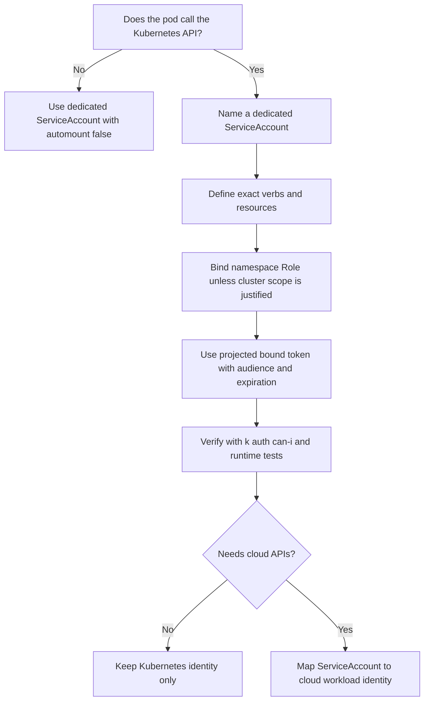

# Module 3.4: ServiceAccount Security

> **Complexity**: `[MEDIUM]` - Core knowledge
>
> **Time to Complete**: 45-55 minutes
>
> **Prerequisites**: [Module 3.3: Secrets Management](../module-3.3-secrets/)

## Learning Outcomes

After completing this module, you will be able to review real workload manifests, explain the identity risk, and implement safer ServiceAccount designs:

1. **Assess** ServiceAccount configurations for excessive API access, auto-mounted tokens, and unsafe default identity usage.
2. **Evaluate** the risk of default ServiceAccount usage across namespaces and design safer pod identity boundaries.
3. **Diagnose** lateral movement paths enabled by misconfigured ServiceAccount permissions, leaked tokens, and broad RBAC bindings.
4. **Implement** bound ServiceAccount token projection with scoped audience, expiration, and workload-specific RBAC.
5. **Compare** Kubernetes ServiceAccount identity with cloud workload identity patterns for AWS, Google Cloud, and Azure.

## Why This Module Matters

A retail engineering team once treated Kubernetes ServiceAccounts as background plumbing. Their payment dashboard ran in a production namespace, but the pod never called the Kubernetes API during normal operation, so nobody reviewed the identity mounted into the container. Months earlier, a troubleshooting shortcut had bound a broad role to the namespace's `default` ServiceAccount, and that shortcut stayed behind after the incident ticket closed. When an attacker exploited a server-side request forgery bug in the dashboard, the first useful file they reached was the mounted ServiceAccount token, and that single token gave them enough API access to enumerate pods, read selected Secrets, and find cloud credentials that were never meant to leave the cluster.

The company did not lose data because ServiceAccounts are inherently dangerous. It lost control because every pod identity had been treated like a generic keycard instead of a scoped credential with a clear purpose, expiration, and audience. The team spent several days rotating Secrets, rebuilding trust in audit logs, and proving to customers that the compromised dashboard could not reach their data path. The cloud bill for the incident response environment and unauthorized compute was roughly $50,000, but the larger cost was the discovery that a convenience setting had become a lateral movement path.

This module teaches ServiceAccount security as an operational discipline rather than a checkbox. You will learn how pods authenticate to the Kubernetes API in Kubernetes 1.35+, why default identities create hidden blast radius, how bound tokens reduce but do not erase risk, and how RBAC decisions shape the attack paths available after a container compromise. You will also practice reviewing a flawed manifest, replacing it with a safer identity design, and deciding when a pod should have no API token at all.

## ServiceAccounts as Pod Identity

ServiceAccounts are Kubernetes identities for software, not human users. A human normally authenticates through a certificate, an OIDC identity provider, or an external credential plugin, then Kubernetes authorizes that user through RBAC or another authorizer. A pod uses a ServiceAccount so that in-cluster code can make authenticated API calls without embedding a person's credential in an image, Secret, or environment variable. That distinction matters because a pod identity is copied into running workloads, so every permission attached to it must be judged as reachable by application code and by anyone who compromises that application.

The default mental model is a keycard, but a better operational model is a signed work badge. The badge says which namespace issued the identity, which ServiceAccount name it represents, which audience should accept it, and when the token expires. Kubernetes can authenticate the badge, then authorization decides whether that identity may list pods, update leases, read ConfigMaps, create Jobs, or perform any other API action. If the badge is mounted into a pod that never needs the Kubernetes API, it becomes a gift to an attacker with no business value to the application.

```
┌─────────────────────────────────────────────────────────────┐
│              SERVICEACCOUNT OVERVIEW                        │
├─────────────────────────────────────────────────────────────┤
│                                                             │
│  WHAT IS A SERVICEACCOUNT?                                 │
│  • Identity for pods to authenticate to API server         │
│  • Namespace-scoped resource                               │
│  • Every pod has one (default if not specified)            │
│                                                             │
│  HOW IT WORKS:                                             │
│  1. Pod created with serviceAccountName                    │
│  2. Token projected into pod at /var/run/secrets/...       │
│  3. Pod uses token to authenticate API requests            │
│  4. API server validates token, extracts identity          │
│  5. RBAC checked against ServiceAccount                    │
│                                                             │
│  DEFAULT SERVICEACCOUNT:                                   │
│  • Every namespace has "default" ServiceAccount            │
│  • Pods use it if none specified                           │
│  • May have unintended permissions                         │
│                                                             │
└─────────────────────────────────────────────────────────────┘
```

A ServiceAccount is namespace-scoped, but the permissions granted to it are not automatically namespace-limited. A RoleBinding in one namespace can grant namespace-scoped rights, while a ClusterRoleBinding can grant cluster-wide rights to the same ServiceAccount subject. That means the name `system:serviceaccount:payments:checkout-api` might be limited to updating one Lease object, or it might be able to read Secrets across the cluster, depending entirely on the RBAC bindings around it. The object name alone tells you almost nothing about the real blast radius.

In mature clusters, ServiceAccounts become part of the platform contract between application teams and the cluster team. Application owners describe what their workload must do, platform owners provide a template that creates the identity and minimal binding, and security reviewers can test the resulting permission set without reading the application source code. That contract breaks when identities are implicit, shared, or patched manually after deployment. The safest ServiceAccount design is therefore not only technically narrow; it is also legible to the next engineer who audits the namespace during an incident.

For hands-on commands in this module, the examples use the common alias `k` for `kubectl`. If your shell does not already define it, run this once before practicing, then read every `k auth can-i` result as a question about what the pod identity can actually do.

```bash
alias k=kubectl
```

The first review question for any workload is not "which ServiceAccount should it use?" The first question is "does this workload need to call the Kubernetes API at all?" A static web server, a queue consumer that talks only to an application broker, or a sidecar that exports local metrics may need no Kubernetes API token. A controller, operator, admission webhook, leader-election participant, or app that watches ConfigMaps might need API access, but even then the verbs and resources should be narrow enough that a compromised pod cannot become a cluster reconnaissance tool.

Pause and predict: a pod runs with no `serviceAccountName` in a namespace where the `default` ServiceAccount has no explicit RoleBinding. Before you inspect the cluster, what API discovery or authorization checks do you expect that pod identity to perform, and which assumptions would you refuse to make without running `k auth can-i`?

The safe design habit is to make pod identity explicit even when a pod has no API access. A workload that names a dedicated ServiceAccount with `automountServiceAccountToken: false` is easier to audit than a workload that silently inherits the namespace default. Explicit identity also prevents later drift: if someone binds a role to `default` for a separate experiment, your application does not accidentally inherit the new permission because it never used `default` in the first place.

This is also why ServiceAccount review belongs in the same conversation as image, Secret, and network review. A hardened image can still leak a token if application code is exploitable, and a well-encrypted Secret store still suffers if a pod identity can read every Secret through the API. Network policies may slow an attacker moving between pods, but they do not stop a stolen token from calling the API server if egress allows that path. ServiceAccount security is one of the few controls that directly shapes what a compromised workload can ask the control plane to do.

## Token Evolution and Bound Projection

ServiceAccount token behavior changed because the original model was too forgiving for modern clusters. Older Kubernetes clusters created long-lived Secret-backed tokens for ServiceAccounts, and those tokens could remain valid long after the pod that used them disappeared. They were convenient for early automation, but they were also easy to leak through Secret access, backups, logs, or broad namespace permissions. Kubernetes 1.35+ clusters rely on bound ServiceAccount tokens for normal pod authentication, which means tokens are projected into the pod, expire, rotate, and can be restricted to a specific audience.

```
┌─────────────────────────────────────────────────────────────┐
│              SERVICEACCOUNT TOKEN TYPES                     │
├─────────────────────────────────────────────────────────────┤
│                                                             │
│  LEGACY TOKENS (pre-1.24)                                  │
│  ├── Stored in Secrets                                     │
│  ├── Never expire                                          │
│  ├── Not audience-bound                                    │
│  ├── Auto-mounted to all pods                              │
│  └── SECURITY RISK - avoid                                 │
│                                                             │
│  BOUND SERVICE ACCOUNT TOKENS (1.24+)                      │
│  ├── JWT tokens signed by API server                       │
│  ├── Time-limited (default 1 hour, configurable)           │
│  ├── Audience-bound (specific to intended recipient)       │
│  ├── Projected via volume (not Secret)                     │
│  └── Automatically rotated before expiration               │
│                                                             │
│  TOKEN LOCATION IN POD:                                    │
│  /var/run/secrets/kubernetes.io/serviceaccount/            │
│  ├── token     - The JWT token                             │
│  ├── ca.crt    - Cluster CA certificate                    │
│  └── namespace - Pod's namespace                           │
│                                                             │
└─────────────────────────────────────────────────────────────┘
```

Bound tokens are still bearer tokens. Anyone who can read the token file can use that token until it expires, unless additional controls block the path. The improvement is that stolen tokens have a smaller usefulness window, can be tied to an intended audience, and are delivered through a projected volume that the kubelet can refresh. This is a major reduction in exposure compared with permanent Secret-backed credentials, but it is not permission design. A short-lived token for an overprivileged ServiceAccount is still a short-lived path to excessive API access.

The TokenRequest API is the control plane mechanism behind explicit token requests. You can request a token with a defined audience and expiration, and you can bind it to a particular object such as a pod. In practice, most application teams use projected ServiceAccount token volumes in pod specs rather than creating TokenRequest objects by hand, but reading the API shape helps you see the security properties Kubernetes is trying to express.

```yaml
apiVersion: authentication.k8s.io/v1
kind: TokenRequest
metadata:
  name: my-token
  namespace: default
spec:
  audiences:
  - api                      # Who can use this token
  expirationSeconds: 3600    # 1 hour
  boundObjectRef:            # Optional: bind to specific pod
    kind: Pod
    name: my-pod
    uid: abc-123
```

The `audiences` field is often misunderstood. An audience is not a permission, and it does not decide whether the ServiceAccount can read a Secret or update a Lease. It says which recipient should accept the token. A token intended for the Kubernetes API should not be accepted by a cloud identity service unless that service is deliberately configured to trust it, and a token intended for a cloud workload identity exchange should not be casually reused as a general cluster API credential. Audience scoping narrows where a stolen token can be replayed.

Expiration is another control that reduces damage only when clients and operators respect it. A one-hour token limits the window for replay, but it does not help if an attacker can immediately use that token to create another credential, read a long-lived cloud key, or patch a Deployment to add their own backdoor. For that reason, token lifetime should be paired with narrow RBAC, admission controls, and monitoring for suspicious API calls by ServiceAccount subjects. Treat token expiration as a useful timer, not as a substitute for permission design.

When a long-running pod uses a projected ServiceAccount token, the pod should not crash when the original token nears expiration. The kubelet refreshes the projected file before expiration, and well-behaved clients reread or reload credentials as needed. The risk appears when applications cache the token forever at startup, use custom clients that never reload files, or copy the token into another location where rotation no longer applies. In those cases, the pod may start failing API calls later, and the failure mode looks like authentication errors rather than a clean restart.

Pause and predict: bound ServiceAccount tokens expire and rotate, but your application reads the token once into a global variable during process startup. What failure would you expect after the token expires, and how would you prove whether the client library reloads credentials from the projected file?

During incident response, token type changes the containment plan. If the stolen credential is a current bound token, responders still review audit logs and rotate dependent credentials, but they can reason about a natural expiration window. If the stolen credential is a legacy Secret-backed token, responders must assume it remains useful until deleted or invalidated, and they must search backups, CI logs, and Secret readers for possible exposure. That difference is why legacy token inventory is worth doing before an incident, when nobody is guessing under pressure.

## Configuring Token Mounting Deliberately

The safest ServiceAccount configuration is the one that matches the workload's real API behavior. If a pod does not need the Kubernetes API, disable automatic token mounting at the ServiceAccount or pod level, and preferably both for clarity. If a pod does need API access, use a dedicated ServiceAccount, grant minimal RBAC, and mount a projected token with a specific audience and expiration. This separates the identity question from the permission question, which makes audits and incident response much faster.

```yaml
apiVersion: v1
kind: ServiceAccount
metadata:
  name: my-app
  namespace: production
automountServiceAccountToken: false  # Don't auto-mount token
```

The ServiceAccount-level `automountServiceAccountToken: false` setting is a default for pods that use that account. It communicates the owner's intent: token access is not part of normal operation. However, a pod spec can override token mounting, so admission policy and review discipline still matter. Treat the ServiceAccount setting as a strong local default, not as an unbreakable cluster security boundary.

```yaml
apiVersion: v1
kind: Pod
metadata:
  name: my-app
spec:
  serviceAccountName: my-app
  automountServiceAccountToken: false  # Override at pod level
  containers:
  - name: app
    image: myapp:1.0
```

For workloads that need API access, an explicit projected volume makes the token visible as a deliberate design choice. The example below mounts a token at a custom path with a one-hour lifetime and an `api` audience. This does not grant any permission by itself; the ServiceAccount still needs an RBAC Role or ClusterRole binding for the verbs and resources the application actually uses. The value is that token delivery is scoped, reviewable, and easier to distinguish from accidental automatic mounting.

```yaml
apiVersion: v1
kind: Pod
metadata:
  name: api-client
spec:
  serviceAccountName: api-caller
  containers:
  - name: app
    image: myapp:1.0
    volumeMounts:
    - name: token
      mountPath: /var/run/secrets/tokens
      readOnly: true
  volumes:
  - name: token
    projected:
      sources:
      - serviceAccountToken:
          path: api-token
          expirationSeconds: 3600
          audience: api
```

The tradeoff is operational friction. Teams sometimes leave automatic mounting enabled because it avoids revisiting manifests when a library starts using leader election, service discovery, or ConfigMap watching. That convenience is exactly why the setting deserves review. If API access is needed, document the reason in the workload design and prove the minimum permission with `k auth can-i --as=system:serviceaccount:<namespace>:<name>`. If API access is not needed, a missing token should be treated as the desired state rather than an inconvenience.

A practical rollout plan starts with observation rather than immediate denial. Inventory pods that mount the default token, group them by owner and image, and ask which workloads actually call the Kubernetes API. Many simple applications can move to token-free operation quickly, while controllers and platform add-ons need a more careful RBAC review. This staged approach prevents a security cleanup from becoming an outage campaign, and it gives teams evidence they can use in future reviews instead of relying on inherited assumptions.

Consider a controller that updates Lease objects for leader election. It does not need to list every pod, read every Secret, or create privileged workloads. Its ServiceAccount might need `get`, `create`, `update`, and `patch` on `leases.coordination.k8s.io` in one namespace, and nothing else. This is the difference between "the controller can coordinate with its peer" and "the controller can become the attacker's cluster inventory tool." The same token delivery mechanism can support either outcome, so RBAC review must follow token review.

When you do allow a token, choose a mount path and audience that make the use case clear. The default path is familiar, but an explicit projected volume at a custom path can help reviewers see that the workload intentionally requested a token for a named integration. That clarity helps during debugging as well: if the application reads `/var/run/secrets/tokens/api-token`, the team knows which volume, audience, and expiration to inspect. Security controls that are easy to inspect are more likely to survive the next release.

## Default ServiceAccounts and Namespace Drift

Every namespace has a `default` ServiceAccount, and pods use it when `serviceAccountName` is omitted. That behavior is useful for quick experiments, but it is a weak foundation for production because the identity is shared by every unspecified pod in the namespace. If anyone binds a role to `default`, all unnamed workloads inherit the permission. The problem might stay invisible for months because manifests still deploy successfully, tests still pass, and the token file appears in the same familiar path inside each container.

```
┌─────────────────────────────────────────────────────────────┐
│              DEFAULT SERVICEACCOUNT RISKS                   │
├─────────────────────────────────────────────────────────────┤
│                                                             │
│  PROBLEM:                                                  │
│  • Every namespace has "default" ServiceAccount            │
│  • Pods use it automatically if not specified              │
│  • Token auto-mounted to pods                              │
│  • May have roles bound (often more than needed)           │
│                                                             │
│  ATTACK SCENARIO:                                          │
│  1. Attacker compromises application container             │
│  2. Reads token from /var/run/secrets/...                  │
│  3. Uses token to query Kubernetes API                     │
│  4. Discovers secrets, other pods, escalates               │
│                                                             │
│  MITIGATIONS:                                              │
│  • Disable auto-mount for default SA                       │
│  • Create dedicated SAs for each application               │
│  • Don't bind roles to default SA                          │
│  • Use automountServiceAccountToken: false                 │
│                                                             │
└─────────────────────────────────────────────────────────────┘
```

The most common drift pattern starts innocently. A developer needs a pod to read a ConfigMap during a migration, so they bind a Role to `default` in the namespace. Later, another team deploys an unrelated web app without specifying a ServiceAccount. That web app now carries the same token and permission, even though its owners never requested API access. If the web app is compromised, the attacker gets the migration permission for free. In larger namespaces, this creates a shared identity problem that is hard to unwind because many pods depend on the same implicit account for different reasons.

Namespace drift is especially hard to see in organizations that separate application repositories from platform repositories. The pod manifest might live in one repo, the RoleBinding might be installed by a shared Helm chart, and a manual emergency change might exist only in cluster state. A reviewer who reads only one repo can miss the effective permission set. That is why live authorization checks and cluster inventory matter: they reveal what the API server will actually allow today, not what one source file appears to intend.

```yaml
# Disable token mounting on default SA
apiVersion: v1
kind: ServiceAccount
metadata:
  name: default
  namespace: production
automountServiceAccountToken: false
```

Securing the default ServiceAccount is a namespace hygiene step, not a complete identity program. Set `automountServiceAccountToken: false` on `default`, avoid binding roles to it, and make workloads name their intended ServiceAccount explicitly. Then add policy review that flags pod specs without `serviceAccountName`, because a missing field is no longer just a style issue. It is a signal that the workload identity boundary was not intentionally designed.

Policy enforcement can turn that hygiene into a stable standard. Admission policies can reject pods in production namespaces when they omit `serviceAccountName`, use `default`, or request automatic token mounting without an approved label. The exact mechanism varies by cluster, but the principle is consistent: prevent implicit identity from reaching production unnoticed. Start with audit mode if you expect many violations, then move high-confidence rules to enforcement after teams have migration examples and a clear exception path.

### War Story: The $50,000 Dashboard Breach

In a real-world incident at a mid-sized tech company, developers deployed an internal monitoring dashboard using the `default` ServiceAccount in a production namespace. To make setup "easier," someone had previously bound a `ClusterRole` with `get secrets` permissions to this default account.

When an attacker discovered a simple Server-Side Request Forgery vulnerability in the dashboard application, they did not need to break out of the container to inflict massive damage. They simply directed the vulnerable application to read the auto-mounted token at `/var/run/secrets/kubernetes.io/serviceaccount/token`. Using this token, the attacker queried the Kubernetes API, downloaded every Secret in the cluster, extracted cloud provider credentials, and spun up cryptocurrency miners. The result was a $50,000 cloud bill and a frantic, full-scale credentials rotation, all stemming from a leaked token that should never have been mounted in the first place.

The lesson is not that every `default` ServiceAccount already has dangerous permissions. Many clusters will show limited access when you test it. The lesson is that a shared implicit identity makes future drift hard to reason about. A safe namespace should make the secure path boring: every app has a named ServiceAccount, pods without API needs receive no token, and any RBAC binding to `default` is treated as a security exception that requires a short-lived migration plan.

During a breach, boring identity design is valuable because it narrows the investigation. If each application has a dedicated ServiceAccount, responders can search audit logs for one subject and understand which API calls were possible. If half the namespace uses `default`, every pod that inherited that identity becomes part of the question. The same distinction affects cloud response when workload identity is involved: a dedicated subject maps to one cloud role, while shared identity forces broader credential review.

## RBAC, Lateral Movement, and Attack Paths

ServiceAccount security becomes concrete when you trace what an attacker can do after reading a token file. Authentication answers "who is this request claiming to be?" Authorization answers "what may this identity do?" Lateral movement happens when a token grants enough Kubernetes API access to discover targets, read credentials, create pods, exec into containers, patch workloads, or abuse admission gaps. The pod compromise is the first event, but the ServiceAccount permission set often decides whether the incident stays local or becomes a cluster-wide response.

```
┌─────────────────────────────────────────────────────────────┐
│              SERVICEACCOUNT ATTACK SCENARIOS                │
├─────────────────────────────────────────────────────────────┤
│                                                             │
│  TOKEN THEFT                                               │
│  1. Compromise container                                   │
│  2. Read /var/run/secrets/.../token                       │
│  3. Use token to access API                                │
│  Mitigation: automountServiceAccountToken: false           │
│                                                             │
│  PRIVILEGE ESCALATION                                      │
│  1. SA has create pods permission                          │
│  2. Create privileged pod with same SA                     │
│  3. Escape to host                                         │
│  Mitigation: Don't give SAs create pods permission         │
│                                                             │
│  SECRET EXTRACTION                                         │
│  1. SA has get secrets permission                          │
│  2. Query API for all secrets                              │
│  3. Extract credentials                                    │
│  Mitigation: Minimal RBAC, namespace isolation             │
│                                                             │
│  LATERAL MOVEMENT                                          │
│  1. SA has list pods permission                            │
│  2. Discover other applications                            │
│  3. Target other pods                                      │
│  Mitigation: Network policies, minimal RBAC                │
│                                                             │
└─────────────────────────────────────────────────────────────┘
```

Some permissions deserve special scrutiny because they are more powerful than they first appear. `get secrets` can expose database passwords, cloud credentials, signing keys, and application tokens. `create pods` can become privilege escalation when admission allows hostPath mounts, privileged containers, or use of more powerful ServiceAccounts. `pods/exec` can turn API access into remote command execution inside other workloads. `patch deployments` can replace an image or add an environment variable that exfiltrates data. Even `list pods` can help an attacker map service names, namespaces, image versions, and high-value targets.

Do not evaluate RBAC verbs in isolation from admission policy and workload placement. A ServiceAccount with `create pods` is much less dangerous in a namespace that enforces the Restricted Pod Security Standard and blocks host access, but it is still a deployment capability that can run arbitrary images. A ServiceAccount with `patch deployments` might not read Secrets directly, yet it can alter a workload so that the workload prints its mounted Secret or sends data elsewhere. Kubernetes security reviews require this chain-of-consequence thinking because permissions combine across resources.

Before running this in a real cluster, what output do you expect from `k auth can-i --as=system:serviceaccount:production:checkout-api --list` for a well-designed checkout workload? A strong answer should name only the resources the app truly needs, explain why broad discovery or Secret reads are absent, and identify which permissions would trigger an incident review.

The review workflow should combine static manifest inspection with live authorization checks. Static inspection shows which ServiceAccount a workload names, whether automatic mounting is disabled, and which RBAC objects mention that subject. Live checks show what the authorizer currently permits after aggregated ClusterRoles, group bindings, and inherited subjects are considered. In a busy cluster, both views are needed because YAML in one repository may not include bindings installed by another team, an operator, or a platform add-on.

```bash
k auth can-i --as=system:serviceaccount:production:checkout-api get secrets -n production
k auth can-i --as=system:serviceaccount:production:checkout-api create pods -n production
k auth can-i --as=system:serviceaccount:production:checkout-api update leases.coordination.k8s.io -n production
```

The best time to remove an unsafe permission is before the application depends on it. If a team has already shipped with a broad ServiceAccount, start by observing the API calls it actually makes, narrow the Role, and deploy the narrower binding behind a rollback plan. Do not confuse "the app did not break during the first minute" with proof that the permission set is correct. Controllers may use rare paths during resync, leader changes, or failure recovery, so review logs and tests should include those paths before you delete the old binding.

Audit logs are the bridge between theory and real behavior. Filter for `user.username` values that begin with `system:serviceaccount:` and sort by namespace, ServiceAccount name, verb, resource, and response code. A healthy application identity should show a small, explainable set of calls that match the workload's purpose. A surprising Secret read, pod creation, or cluster-scoped list call is not automatically malicious, but it is a signal to review the Role, the code path, and the owner who approved that permission.

## Workload Identity and Cloud Credentials

Kubernetes ServiceAccounts also matter because cloud platforms can use them as the starting point for workload identity. The unsafe pattern is to store static AWS, Google Cloud, or Azure credentials in Kubernetes Secrets and mount them into pods. That works in the same way leaving a spare building key under a mat works: it is convenient until too many people know where the key lives. Anyone with `get secrets` access, an etcd backup, or a compromised pod that can read the mounted Secret may gain long-lived cloud access that Kubernetes cannot rotate for you.

```
┌─────────────────────────────────────────────────────────────┐
│              WORKLOAD IDENTITY                              │
├─────────────────────────────────────────────────────────────┤
│                                                             │
│  WITHOUT WORKLOAD IDENTITY:                                │
│  • Store cloud credentials as K8s Secrets                  │
│  • Long-lived, static credentials                          │
│  • Same credentials for all pods using the Secret          │
│  • Manual rotation required                                │
│                                                             │
│  WITH WORKLOAD IDENTITY:                                   │
│  • K8s ServiceAccount → Cloud IAM role                     │
│  • Short-lived, auto-rotated tokens                        │
│  • Per-pod identity                                        │
│  • No static credentials                                   │
│                                                             │
│  IMPLEMENTATIONS:                                          │
│  • AWS: IAM Roles for Service Accounts (IRSA)              │
│  • GCP: Workload Identity                                  │
│  • Azure: Workload Identity (formerly AAD Pod Identity)    │
│                                                             │
└─────────────────────────────────────────────────────────────┘
```

Cloud workload identity changes the trust exchange. Instead of handing every pod a static cloud key, the cluster presents a Kubernetes-issued identity token to the cloud provider's identity service, and the provider returns short-lived credentials for a mapped role. The security benefit is not magic; it comes from shorter lifetime, explicit mapping, provider-side audit trails, and removal of static credentials from Kubernetes Secrets. The tradeoff is that misconfigured mappings can still grant too much cloud access, so IAM policy review remains as important as Kubernetes RBAC review.

```yaml
apiVersion: v1
kind: ServiceAccount
metadata:
  name: s3-reader
  annotations:
    eks.amazonaws.com/role-arn: arn:aws:iam::123456:role/S3Reader
---
apiVersion: v1
kind: Pod
metadata:
  name: app
spec:
  serviceAccountName: s3-reader
  containers:
  - name: app
    image: myapp:1.0
    # AWS SDK automatically uses projected token
```

The AWS IRSA example shows the pattern, but the design principle applies across providers. A Kubernetes ServiceAccount represents the workload, and a cloud IAM binding maps that workload to a cloud role. The Kubernetes side should still disable unneeded API tokens, keep RBAC minimal, and avoid sharing one ServiceAccount across unrelated applications. The cloud side should keep the IAM policy minimal, restrict trust to the expected cluster issuer and subject, and make credential use visible in provider audit logs.

Cloud identity also changes how you think about namespace boundaries. In Kubernetes, a namespace can separate RBAC and resource names, but cloud IAM does not automatically know that `production/reporting` and `staging/reporting` should have different data access. The mapping between ServiceAccount subject and cloud role must encode that environment boundary deliberately. If staging and production share one cloud role because their Kubernetes names look similar, a compromised lower-environment pod may gain access to production cloud resources even when Kubernetes RBAC appears separated.

Which approach would you choose here and why: a static cloud key stored as a Kubernetes Secret, or workload identity mapped from a dedicated ServiceAccount? A strong answer should mention rotation, auditability, blast radius, and the operational cost of configuring issuer trust correctly.

The practical migration from static keys to workload identity should be done in small steps. First, create a dedicated ServiceAccount and narrow cloud role that matches one workload. Next, deploy the workload with both old and new authentication paths available only long enough to validate behavior. Then remove the static Secret mount, delete the old key from the provider, and verify audit logs show the new role being used. This sequence avoids a big-bang credential change while still ending with no reusable cloud key inside Kubernetes.

One subtle cloud identity failure mode is assuming that Kubernetes RBAC and cloud IAM always protect the same resources. A ServiceAccount might have almost no Kubernetes API permission but still map to a powerful cloud role that can read object storage, create compute, or decrypt keys outside the cluster. The reverse can also happen: a tightly scoped cloud role may be paired with an overprivileged Kubernetes RoleBinding. Review both planes together, because attackers follow whichever permission path gives them useful data or persistence first.

## Patterns & Anti-Patterns

The strongest ServiceAccount programs are boring in the best sense. A reviewer can open a workload manifest, see a named ServiceAccount, see that automatic token mounting is disabled unless there is a clear API use case, and trace a small RoleBinding to the exact verbs the app needs. The pattern scales because each application owns one identity boundary, and platform teams can write admission checks that detect missing fields, default account use, or forbidden bindings before manifests reach production.

```
┌─────────────────────────────────────────────────────────────┐
│              SERVICEACCOUNT SECURITY CHECKLIST              │
├─────────────────────────────────────────────────────────────┤
│                                                             │
│  MINIMIZE ACCESS                                           │
│  ☐ Create dedicated SA per application                     │
│  ☐ Don't reuse SAs across different apps                   │
│  ☐ Grant minimal RBAC permissions                          │
│  ☐ Use namespace-scoped roles                              │
│                                                             │
│  TOKEN MANAGEMENT                                          │
│  ☐ Disable auto-mount when API access not needed          │
│  ☐ Use bound tokens (short-lived, audience-bound)          │
│  ☐ Clean up legacy token Secrets                           │
│                                                             │
│  CLOUD INTEGRATION                                         │
│  ☐ Use workload identity instead of static credentials     │
│  ☐ Map SAs to cloud roles with least privilege             │
│                                                             │
│  DEFAULT SA                                                │
│  ☐ Disable auto-mount on default SA                        │
│  ☐ Don't bind roles to default SA                          │
│  ☐ Explicitly specify SA in all pods                       │
│                                                             │
└─────────────────────────────────────────────────────────────┘
```

| Pattern | When to Use It | Why It Works | Scaling Consideration |
|---------|----------------|--------------|-----------------------|
| Dedicated ServiceAccount per application | Any workload with distinct ownership or API needs | It keeps identity, audit, and RBAC blast radius aligned to one app | Name accounts consistently so reviews and dashboards can group them by namespace and owner |
| Token-free workload by default | Pods that do not call the Kubernetes API | A compromised container cannot steal a token that was never mounted | Use admission policy to flag missing `automountServiceAccountToken: false` for simple app templates |
| Narrow RoleBinding with `k auth can-i` proof | Controllers, leader election, config watchers, and operators | Live authorization checks catch permissions that static review misses | Add expected `can-i` checks to release review for high-risk workloads |
| Workload identity for cloud access | Pods that need AWS, Google Cloud, or Azure APIs | It removes static cloud keys from Kubernetes Secrets and improves audit trails | Keep cloud IAM policies as narrow as Kubernetes RBAC, because either side can widen blast radius |

Anti-patterns usually come from convenience, not malice. Teams reuse the namespace default because it works, bind a ClusterRole because a namespace Role failed during testing, or mount cloud credentials as a Secret because the SDK finds them automatically. These choices are understandable during development, but production clusters need different defaults. The safer alternative is to make the narrow path easier than the broad path through templates, policy, and review checklists.

Templates should encode the patterns so individual teams are not forced to rediscover them. A production chart can create a ServiceAccount by default, disable automatic token mounting unless an explicit value enables it, and generate RoleBindings from a small list of approved capabilities. Platform teams can then review exceptions rather than every routine deployment. This is not only safer; it is faster for application teams because the common path no longer requires them to understand every RBAC detail before shipping a static service.

| Anti-Pattern | What Goes Wrong | Better Alternative |
|--------------|-----------------|--------------------|
| Binding roles to `default` | Every unnamed pod in the namespace inherits the permission | Keep `default` token-free and require named ServiceAccounts |
| Granting `cluster-admin` to an app ServiceAccount | A single pod compromise becomes full cluster control | Start with no RBAC, add only required verbs and resources, then verify with `k auth can-i` |
| Sharing one ServiceAccount across many apps | Audit logs and incident blast radius no longer map to one workload | Use one identity per app, controller, or operational responsibility |
| Storing static cloud keys in Secrets | Secret readers and compromised pods gain long-lived cloud access | Use provider workload identity and short-lived cloud credentials |

## Decision Framework

When you review a ServiceAccount design, make the first decision about API need, not token format. Bound tokens are safer than legacy tokens, but a safer token mounted into the wrong pod is still unnecessary exposure. The decision path below starts from the workload's behavior, then moves to token delivery, RBAC scope, and cloud identity. This order prevents a common mistake where teams carefully configure projected tokens for a pod that should have had no token at all.



| Decision Point | Prefer This | Avoid This | Reasoning |
|----------------|-------------|------------|-----------|
| Pod has no API need | `automountServiceAccountToken: false` at ServiceAccount and pod level | Silent inheritance from `default` | The safest token is the one that is not mounted |
| Pod needs one namespace resource | Namespace Role and RoleBinding | ClusterRoleBinding for convenience | Namespace scope limits the damage from token theft |
| Pod needs leader election | Lease-specific verbs on `leases.coordination.k8s.io` | Broad update rights on ConfigMaps, Pods, or Deployments | Leader election should not become general write access |
| Pod needs cloud access | Workload identity mapped to a narrow IAM role | Static credentials mounted from a Secret | Short-lived cloud credentials reduce rotation and leakage risk |
| Existing app uses broad permissions | Observe real API calls, narrow gradually, test failure paths | Delete broad binding without understanding rare paths | Controlled reduction avoids production outages while still improving security |

Use this framework during design reviews and incident response. During design, it helps you choose the least risky identity before workloads ship. During incident response, it helps you answer the urgent question: "If this pod was compromised, which identities, APIs, and cloud roles should we assume the attacker tried?" That answer drives token rotation, RBAC cleanup, log review, and the scope of customer communication.

The framework is intentionally conservative because ServiceAccount mistakes rarely fail closed. A pod with too little access usually produces an authorization error that can be fixed with a targeted Role update. A pod with too much access may run quietly for months, then turn a routine application vulnerability into a control-plane incident. Prefer starting narrow, measuring the exact missing permission, and adding the smallest justified grant. That habit creates short debugging loops and avoids permissions that nobody remembers approving.

In exam and real review settings, write down the decision before writing YAML. Start with a sentence such as "this workload serves static HTTP and does not call the Kubernetes API," or "this controller updates Lease objects for leader election in one namespace." That sentence constrains the manifest you are allowed to create. If the YAML contains a token mount, Secret read, pod creation grant, or cluster-scoped binding that the sentence does not justify, the design is drifting before it ever reaches a cluster.

## Did You Know?

- **Every pod has a ServiceAccount** - if you do not specify one, it uses the `default` ServiceAccount in the namespace.
- **Bound tokens are JWTs** - you can decode their header and payload, but you cannot forge them without the signing key.
- **Legacy tokens persist** - even though Kubernetes 1.24+ uses bound tokens by default, old Secret-based tokens may still exist in upgraded clusters.
- **`automountServiceAccountToken` has two layers** - it can be set at both ServiceAccount and Pod level, and the pod-level setting overrides the ServiceAccount-level default.

## Common Mistakes

| Mistake | Why It Happens | How to Fix It |
|---------|----------------|---------------|
| Using the `default` ServiceAccount for production pods | It works without adding fields to manifests, so teams do not notice they created shared identity | Create a dedicated ServiceAccount per workload and require `serviceAccountName` in production templates |
| Leaving tokens mounted in pods that never call the API | Automatic mounting is easy to overlook because the application still starts normally | Set `automountServiceAccountToken: false` on the ServiceAccount and pod, then test that the app still works |
| Binding a ClusterRole when a Role would work | A cluster-scoped binding can appear to fix a namespace test failure quickly | Start with a namespace RoleBinding, then document and review any cluster-scoped permission separately |
| Granting `get secrets` to application ServiceAccounts | Teams use Secrets as configuration and forget that Secret reads expose credentials | Move non-sensitive config to ConfigMaps and restrict Secret reads to controllers that truly need them |
| Reusing one ServiceAccount across unrelated apps | Shared Helm charts or copy-pasted manifests make reuse feel efficient | Parameterize the chart so each release gets a workload-specific ServiceAccount and RoleBinding |
| Keeping legacy token Secrets after upgrades | Old objects remain after cluster upgrades and may not be visible in normal pod specs | Inventory `kubernetes.io/service-account-token` Secrets, confirm no workload references them, then remove unused ones |
| Storing cloud provider keys in Kubernetes Secrets | It is the fastest way to make SDK authentication work during early development | Use AWS IRSA, Google Cloud Workload Identity, or Azure Workload Identity with narrow cloud IAM permissions |

## Quiz

<details><summary>Your team deploys a static web frontend with no Kubernetes API calls, but the pod spec omits `serviceAccountName` and does not disable token mounting. What should you change, and why?</summary>

Create a dedicated ServiceAccount for the frontend and set `automountServiceAccountToken: false` on both the ServiceAccount and the pod. The key point is that the app does not need an API token, so mounting one only gives a compromised container an authentication credential to steal. Naming the ServiceAccount also prevents the pod from inheriting future permissions accidentally added to `default`. This assesses ServiceAccount configuration rather than assuming the absence of explicit RBAC makes the token harmless.

</details>

<details><summary>A namespace's `default` ServiceAccount currently has a RoleBinding that allows `get` and `list` on ConfigMaps. A new payment pod ships without `serviceAccountName`. How do you evaluate the risk?</summary>

The payment pod inherits the `default` ServiceAccount, so it inherits those ConfigMap permissions even if the payment team never requested API access. The immediate risk is shared identity drift: one namespace-level shortcut now applies to unrelated workloads. Use `k auth can-i --as=system:serviceaccount:<namespace>:default --list` to confirm effective rights, then move the migration workload to a dedicated account and remove the binding from `default`. The payment pod should receive its own token-free ServiceAccount unless it has a real API need.

</details>

<details><summary>An attacker compromises a pod and uses its ServiceAccount to create a privileged pod in the same namespace. Which controls would have broken the lateral movement chain?</summary>

Several controls could have interrupted the chain. Disabling token mounting would have prevented easy token theft if the original pod did not need API access. Minimal RBAC would have removed `create pods` from the ServiceAccount, and Pod Security Standards or an admission policy would have rejected the privileged pod even if the attacker had pod creation rights. Network policy and runtime hardening help reduce follow-on damage, but the ServiceAccount and admission controls are the main breaks in this specific Kubernetes API attack path.

</details>

<details><summary>A controller uses leader election and starts failing with authentication errors after running for about an hour. The projected token file exists and appears recently updated. What do you diagnose first?</summary>

First check whether the controller or its client library reads the token only once at startup instead of reloading the projected token file. Bound ServiceAccount tokens expire and rotate, so a cached token can become invalid while the file on disk is healthy. Confirm the token audience and expiration, inspect client configuration, and review logs for authentication failures that match token expiry timing. The fix is usually to use a Kubernetes client that reloads credentials correctly or to restart the credential source logic when the token file changes.

</details>

<details><summary>A team wants to mount AWS access keys from a Kubernetes Secret because the SDK already supports that path. How do you compare this with ServiceAccount-based workload identity?</summary>

Static AWS keys in a Secret are long-lived and become available to anyone who can read that Secret or compromise a pod that mounts it. Workload identity maps a dedicated Kubernetes ServiceAccount to a cloud IAM role and returns short-lived credentials through the provider's identity flow. The ServiceAccount still needs careful Kubernetes RBAC, and the IAM role still needs least privilege, but the design removes static cloud keys from the cluster and improves auditability. The tradeoff is setup complexity around issuer trust and role mapping.

</details>

<details><summary>A security scanner finds old `kubernetes.io/service-account-token` Secrets after a cluster upgrade. Why are they important, and what is a safe cleanup path?</summary>

Legacy ServiceAccount token Secrets are important because they can be long-lived credentials that survive beyond the pod or workflow that originally needed them. Do not delete them blindly, because older integrations may still reference a manually created token Secret. Inventory the Secrets, find workloads or external systems that reference them, migrate those users to projected bound tokens or the TokenRequest API, and then remove unused legacy tokens. This cleanup reduces the value of old backups, leaked Secrets, and stale RBAC access.

</details>

<details><summary>You review a pod that needs to update one Lease object for leader election. The proposed Role allows `get`, `list`, `watch`, `create`, `update`, and `patch` on all ConfigMaps and Leases. What would you change?</summary>

Narrow the Role to the coordination API resource the application actually uses, usually `leases.coordination.k8s.io`, and include only the verbs needed by the leader election library. Broad ConfigMap rights are unnecessary if the application uses Leases, and broad list or watch rights may expose extra cluster information. After changing the Role, verify expected behavior with `k auth can-i` checks and a failover test. The goal is to implement the ServiceAccount's real job, not a general troubleshooting permission set.

</details>

## Hands-On Exercise: ServiceAccount Security Review

In this exercise, you will review a deliberately flawed setup, identify the identity and RBAC problems, and replace it with a safer design. You can do the reasoning on paper, but the commands are written so you can also run them in a disposable Kubernetes 1.35+ cluster. Do not run this in a shared production cluster, because the first manifest intentionally grants excessive access for review purposes.

The important skill is to explain both the obvious and hidden issues. The `cluster-admin` binding is obviously unsafe, but the pod also fails to name the intended ServiceAccount, uses the `default` namespace, and leaves token mounting implicit. A strong review catches all of those because real incidents often combine one dramatic mistake with several quiet defaults. When you write the secure version, resist the urge to add RBAC "just in case." If nginx does not call the Kubernetes API, the correct RoleBinding is no RoleBinding.

As you work through the exercise, separate evidence from preference. "I dislike the default namespace" is weaker than "the default namespace often lacks ownership boundaries, and this manifest gives no reason the workload belongs there." "ClusterRoleBinding feels too broad" is weaker than "this subject receives `cluster-admin`, so a stolen token can perform any API action accepted by admission." KCSA-style reasoning rewards that precision because the goal is to identify how an attacker would use each misconfiguration.

**Scenario**: Review the following setup and identify the ServiceAccount, namespace, RBAC, and token-mounting issues before writing a safer replacement:

```yaml
# ServiceAccount with too much access
apiVersion: v1
kind: ServiceAccount
metadata:
  name: app-sa
  namespace: default
---
apiVersion: rbac.authorization.k8s.io/v1
kind: ClusterRoleBinding
metadata:
  name: app-admin
subjects:
- kind: ServiceAccount
  name: app-sa
  namespace: default
roleRef:
  kind: ClusterRole
  name: cluster-admin
  apiGroup: rbac.authorization.k8s.io
---
apiVersion: v1
kind: Pod
metadata:
  name: web-app
  namespace: default
spec:
  # serviceAccountName not specified
  containers:
  - name: app
    image: nginx:1.25
```

### Tasks

- [ ] Identify every place where the manifest relies on the `default` namespace, the `default` ServiceAccount, or implicit token mounting.
- [ ] Explain why the `ClusterRoleBinding` creates excessive API access and how it could support lateral movement after pod compromise.
- [ ] Write a safer ServiceAccount and pod manifest for an nginx workload that does not call the Kubernetes API.
- [ ] Add a minimal Role and RoleBinding only if you can justify a real API action the workload performs.
- [ ] Run `k auth can-i` checks for the unsafe and safe identities to compare their effective permissions.
- [ ] Confirm the final design has no mounted ServiceAccount token for the nginx pod unless you intentionally add projected token access.

<details>
<summary>Security Issues</summary>

1. **cluster-admin bound to app-sa**
   - Full cluster access from any pod using app-sa
   - Massive over-privilege
   - Fix: Use minimal, namespace-scoped Role

2. **ClusterRoleBinding instead of RoleBinding**
   - Grants cluster-wide permissions
   - Fix: Use RoleBinding for namespace scope

3. **ServiceAccount in default namespace**
   - default namespace often not properly secured
   - Fix: Use dedicated namespace

4. **Pod doesn't specify serviceAccountName**
   - Will use `default` SA, not `app-sa`
   - The app-sa with cluster-admin is unused here
   - But `default` SA might have its own issues

5. **No automountServiceAccountToken: false**
   - Token mounted unnecessarily
   - nginx doesn't need API access
   - Fix: Add automountServiceAccountToken: false

**Secure version:**
```yaml
apiVersion: v1
kind: ServiceAccount
metadata:
  name: nginx-sa
  namespace: production
automountServiceAccountToken: false
---
apiVersion: v1
kind: Pod
metadata:
  name: web-app
  namespace: production
spec:
  serviceAccountName: nginx-sa
  automountServiceAccountToken: false
  containers:
  - name: app
    image: nginx:1.25
# No RBAC binding needed if pod doesn't access API
```

</details>

<details>
<summary>Suggested Verification Commands</summary>

```bash
k create namespace production
k apply -f unsafe-serviceaccount-review.yaml
k auth can-i --as=system:serviceaccount:default:app-sa '*' '*'
k auth can-i --as=system:serviceaccount:default:default get configmaps -n default
k apply -f secure-nginx-serviceaccount.yaml
k auth can-i --as=system:serviceaccount:production:nginx-sa get secrets -n production
k describe pod web-app -n production
```

The unsafe identity should demonstrate why a ClusterRoleBinding to `cluster-admin` is unacceptable for an application ServiceAccount. The safe nginx identity should not need any RBAC binding at all, so `can-i get secrets` should be denied. When you inspect the pod, confirm that token mounting is disabled by design rather than hidden by accident.

</details>

### Success Criteria

- [ ] You can explain why a pod with no `serviceAccountName` uses the namespace's `default` ServiceAccount.
- [ ] You can show how `cluster-admin` on a ServiceAccount turns token theft into full cluster control.
- [ ] You can produce a secure nginx manifest with a dedicated ServiceAccount and `automountServiceAccountToken: false`.
- [ ] You can justify whether the workload needs any RBAC binding, and the default answer is no for static nginx.
- [ ] You can use `k auth can-i` to compare unsafe and safe ServiceAccount permissions.
- [ ] You can describe how projected bound tokens would be added only for a workload with a real API need.

## Summary

ServiceAccount security is about controlling pod identity. The practical goal is not to memorize every token field, but to make each workload's identity, token exposure, and permissions match its real behavior. A pod that never calls the Kubernetes API should not receive a token. A pod that does call the API should use a dedicated ServiceAccount, a projected bound token when appropriate, and RBAC narrow enough that a stolen token does not become a cluster map or privilege escalation tool.

| Aspect | Risk | Mitigation |
|--------|------|------------|
| **Default SA** | Shared identity | Create dedicated SAs |
| **Token mounting** | Attack surface | automountServiceAccountToken: false |
| **RBAC** | Over-privilege | Minimal, namespace-scoped |
| **Cloud access** | Static credentials | Use workload identity |
| **Legacy tokens** | Never expire | Clean up, use bound tokens |

The durable habit is to review ServiceAccounts the way you review network exposure or Secret handling. Ask whether the token is needed, whether the identity is dedicated, whether the RBAC scope is explainable, whether cloud credentials are short-lived, and whether the default namespace identity has drifted into a shared privilege bucket. If you can answer those questions quickly during normal review, incident response becomes narrower and less frantic when a container is compromised.

The final signal of a healthy ServiceAccount design is that denial is expected in most directions. A static web pod should be denied when it tries to read Secrets, create pods, list nodes, or update Deployments, and those denials should not surprise anyone. A controller should be allowed only for the API calls that match its controller loop, and denied for unrelated resources. When teams become comfortable seeing intentional denials, they stop treating every authorization error as a platform defect and start treating it as useful evidence that least privilege is working.

## Sources

- [Kubernetes Service Accounts](https://kubernetes.io/docs/concepts/security/service-accounts/)
- [Configure Service Accounts for Pods](https://kubernetes.io/docs/tasks/configure-pod-container/configure-service-account/)
- [TokenRequest API](https://kubernetes.io/docs/reference/kubernetes-api/authentication-resources/token-request-v1/)
- [Managing Service Accounts](https://kubernetes.io/docs/reference/access-authn-authz/service-accounts-admin/)
- [Kubernetes Authentication](https://kubernetes.io/docs/reference/access-authn-authz/authentication/)
- [Kubernetes Authorization](https://kubernetes.io/docs/reference/access-authn-authz/authorization/)
- [Kubernetes RBAC](https://kubernetes.io/docs/reference/access-authn-authz/rbac/)
- [Projected Volumes](https://kubernetes.io/docs/concepts/storage/projected-volumes/)
- [Pod Security Standards](https://kubernetes.io/docs/concepts/security/pod-security-standards/)
- [Amazon EKS IAM Roles for Service Accounts](https://docs.aws.amazon.com/eks/latest/userguide/iam-roles-for-service-accounts.html)
- [Google Kubernetes Engine Workload Identity Federation](https://cloud.google.com/kubernetes-engine/docs/how-to/workload-identity)
- [Azure Kubernetes Service Workload Identity](https://learn.microsoft.com/en-us/azure/aks/workload-identity-overview)

## Next Module

[Module 3.5: Network Policies](../module-3.5-network-policies/) - Next, you will control pod-to-pod network traffic so a compromised workload cannot freely scan or reach every service in the cluster.
