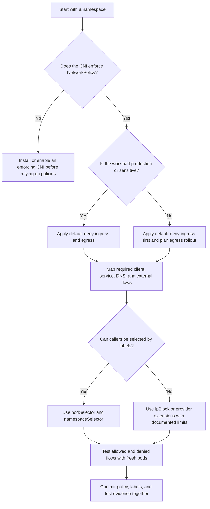

# Module 3.5: Network Policies

> **Complexity**: `[MEDIUM]` - Core knowledge
>
> **Time to Complete**: 45-60 minutes
>
> **Prerequisites**: [Module 3.4: ServiceAccount Security](../module-3.4-serviceaccounts/)
>
> **Kubernetes target**: 1.35+

For the command examples in this module, create the standard KubeDojo shortcut once with `alias k=kubectl`, then use `k` for every Kubernetes command you run. The alias is only a shell convenience, but it keeps the lab focused on network behavior instead of typing mechanics, and it mirrors the fast command style you need during KCSA practice.

## Learning Outcomes

After completing this module, you will be able to perform these security tasks with evidence from manifests, labels, and live traffic tests:

1. **Evaluate** network policy coverage to identify unprotected pods, namespaces, and lateral movement paths.
2. **Design** default-deny and least-privilege ingress and egress rules for multi-tier workloads.
3. **Diagnose** selector, CNI, DNS, and port mismatches that make policies appear ineffective.
4. **Compare** policy combinations, namespace selectors, pod selectors, and IP blocks when modeling allowed traffic.
5. **Implement** a tested network policy set that preserves required application flows while denying everything else.

## Why This Module Matters

In 2021, a retailer's internal platform team investigated a breach that started with a small web workload and spread through service-to-service calls nobody had drawn on an architecture diagram. The first compromised pod did not need cluster administrator rights, a stolen kubeconfig, or a kernel exploit; it needed only the default Kubernetes network behavior, where pods can usually initiate traffic to any other pod unless a network plugin enforces a policy. By the time responders found the source, the attacker had mapped private APIs, reached data-processing services that were never exposed through an ingress controller, and forced the company to pause several internal pipelines while logs were reconstructed.

That kind of incident is painful because it violates an assumption many teams carry without saying it aloud: if a Service is not public, it feels private. In Kubernetes, a Service is often private only from the outside world, while the cluster interior can still be a flat apartment hallway where every door opens to every neighbor. NetworkPolicy is the built-in Kubernetes API for replacing that hallway with room keys, visitor rules, and locked utility closets, but it only works when the CNI plugin enforces it and when teams write policies that match the traffic they actually intend.

This module teaches NetworkPolicy as an operational control, not just a YAML object. You will learn how selection creates isolation, why policies are additive instead of ordered, how ingress and egress combine, and how to test the result before a bad rule becomes an outage. The goal is not to memorize every field; the goal is to look at a namespace and answer, with evidence, which pods can talk to which destinations and what will happen when a pod is compromised.

## Network Policy Fundamentals

Kubernetes starts from an intentionally permissive network model because the platform was designed to make distributed applications easy to assemble. Pods receive routable pod IPs, Services create stable virtual destinations, and workloads are expected to find each other by DNS names rather than hand-managed firewall rules. That model accelerates development, but it also means a single vulnerable workload can become a scanner, a relay, or a data-exfiltration point unless the cluster adds boundaries around pod traffic.

NetworkPolicy is that boundary at the Kubernetes API level. A policy does not attach to a packet path directly; it selects pods in one namespace and declares which ingress, egress, or both kinds of traffic are allowed for those selected pods. The enforcement work is delegated to the CNI provider, such as Calico or Cilium, which translates the policy into dataplane rules. If the CNI ignores NetworkPolicy, the API server will still accept the object, but your security boundary will be imaginary.

```
┌─────────────────────────────────────────────────────────────┐
│              NETWORK POLICY BASICS                          │
├─────────────────────────────────────────────────────────────┤
│                                                             │
│  DEFAULT BEHAVIOR (No policies):                           │
│  • All pods can reach all other pods                       │
│  • All pods can reach external endpoints                   │
│  • All pods accept traffic from anywhere                   │
│                                                             │
│  WITH NETWORK POLICY:                                      │
│  • Pods selected by policy have restricted traffic         │
│  • Unselected pods still have full connectivity            │
│  • Policies are additive (union of allowed traffic)        │
│                                                             │
│  KEY INSIGHT:                                              │
│  Applying ANY policy to a pod creates implicit deny        │
│  for the specified direction (ingress/egress)              │
│                                                             │
└─────────────────────────────────────────────────────────────┘
```

The key idea in the diagram is isolation by selection. A pod that is not selected by any ingress policy remains non-isolated for ingress, so it accepts traffic as before. A pod selected by at least one ingress policy becomes ingress-isolated, so only the union of allowed ingress rules may reach it. The same logic applies independently to egress, which means a pod can be locked down for inbound traffic while still sending outbound traffic freely, or vice versa.

That independence surprises teams during incident response. An ingress policy on a database protects the database from random callers, but it does not stop a compromised web pod from attempting outbound connections to other services. An egress policy on the web pod limits what the web pod can initiate, but it does not automatically allow responses unless the connection was permitted in the first place. Good segmentation usually needs both sides modeled: protect sensitive receivers and constrain risky senders.

Pause and predict: if a namespace has one policy that selects only pods labeled `app=backend`, what happens to a new pod labeled `app=debug` in the same namespace? The answer is that the debug pod remains unrestricted for any direction not selected by a policy, which is why namespace-level default-deny policies are the usual starting point rather than an optional hardening detail.

You should also treat NetworkPolicy as a workload control, not a node firewall. Policies target pods, labels, namespaces, ports, and CIDR blocks; they do not express every network security concept from traditional infrastructure. Traffic from node processes, host-network pods, and some CNI-specific paths may sit outside the behavior you expect from pod-to-pod rules. That is not a reason to avoid policies; it is a reason to understand their scope and combine them with Pod Security Standards, admission controls, and cloud firewalls.

## Policy Structure

A NetworkPolicy object has three questions at its center. First, which pods does this policy select? Second, which traffic direction does it isolate? Third, which peers and ports remain allowed after isolation begins? If you can answer those questions while reading a policy, you can reason about most real configurations without needing a mental packet tracer.

```yaml
apiVersion: networking.k8s.io/v1
kind: NetworkPolicy
metadata:
  name: example-policy
  namespace: production
spec:
  # 1. Which pods does this policy apply to?
  podSelector:
    matchLabels:
      app: backend

  # 2. What direction(s) does it control?
  policyTypes:
  - Ingress
  - Egress

  # 3. What traffic is allowed IN?
  ingress:
  - from:
    - podSelector:
        matchLabels:
          app: frontend
    ports:
    - protocol: TCP
      port: 8080

  # 4. What traffic is allowed OUT?
  egress:
  - to:
    - podSelector:
        matchLabels:
          app: database
    ports:
    - protocol: TCP
      port: 5432
```

The `podSelector` under `spec` always selects the pods being protected, and it is evaluated within the namespace where the policy lives. In the example, only pods in the `production` namespace with `app=backend` become isolated by this policy. A pod in another namespace with the same label is not selected by this object, because NetworkPolicy is namespaced even when its peer rules can reference other namespaces.

The `policyTypes` field tells Kubernetes whether to consider ingress, egress, or both. If you write an `ingress` section but omit `policyTypes`, Kubernetes can infer ingress, but relying on inference makes reviews harder. In security-sensitive modules, explicit direction is a gift to the next engineer, because it prevents a reader from asking whether the absence of egress rules means "deny all egress" or "this policy does not isolate egress."

The allow rules describe peers and ports. A peer may be selected by pod labels, namespace labels, or IP CIDR blocks, and a port may include a protocol plus a numeric or named port. When a rule omits ports, it allows all ports for the matched peers; when it omits peers with an empty `from: []` or `to: []` shape, the meaning depends on the exact field placement. That is why production policies deserve review with rendered examples, not just a quick glance at indentation.

```
┌─────────────────────────────────────────────────────────────┐
│              NETWORK POLICY SELECTORS                       │
├─────────────────────────────────────────────────────────────┤
│                                                             │
│  podSelector                                               │
│  • Match pods by labels                                    │
│  • Within same namespace as policy                         │
│  from:                                                     │
│  - podSelector:                                            │
│      matchLabels:                                          │
│        app: frontend                                       │
│                                                             │
│  namespaceSelector                                         │
│  • Match namespaces by labels                              │
│  • Then all pods in matching namespaces                    │
│  from:                                                     │
│  - namespaceSelector:                                      │
│      matchLabels:                                          │
│        env: production                                     │
│                                                             │
│  ipBlock                                                   │
│  • Match by CIDR range                                     │
│  • For external IPs                                        │
│  from:                                                     │
│  - ipBlock:                                                │
│      cidr: 10.0.0.0/8                                      │
│      except:                                               │
│      - 10.0.1.0/24                                         │
│                                                             │
│  COMBINED (AND logic):                                     │
│  from:                                                     │
│  - podSelector:            # Pods with app: web           │
│      matchLabels:          # AND                          │
│        app: web            # in namespaces with env: prod │
│    namespaceSelector:                                      │
│      matchLabels:                                          │
│        env: production                                     │
│                                                             │
└─────────────────────────────────────────────────────────────┘
```

Selectors are where many policy reviews succeed or fail. A `podSelector` inside a peer rule without a `namespaceSelector` means pods in the same namespace as the policy. A `namespaceSelector` by itself means all pods in matching namespaces. A combined `podSelector` and `namespaceSelector` in the same list item means pods matching the pod labels inside namespaces matching the namespace labels. That one indentation decision changes the rule from broad to precise.

Before running this in a real namespace, what output do you expect from `k get pods --show-labels -n production` if the policy should protect only backend pods? If the labels are inconsistent, the policy may be perfectly valid YAML while selecting nothing useful. That is why network policy work starts with inventory commands and label design, not with copying a policy from a wiki.

| Selector shape | Match scope | Common use | Review question |
|---|---|---|---|
| `podSelector` in `spec` | Target pods in the policy namespace | Choose protected workload | Which pods become isolated? |
| Peer `podSelector` only | Peer pods in the same namespace | Same-team service calls | Are cross-namespace callers accidentally excluded? |
| Peer `namespaceSelector` only | All pods in selected namespaces | Namespace-wide ingress from platform components | Is "all pods" too broad? |
| Combined peer selectors | Matching pods inside matching namespaces | Least-privilege cross-namespace calls | Are namespace labels controlled and stable? |
| `ipBlock` | CIDR ranges, usually external addresses | External APIs or metadata exclusions | Does the provider preserve the source or destination IP you expect? |

When a policy does not behave as expected, read it as a set of set operations. The protected pods are one set, the allowed peers are another set, and the allowed ports are a third set. Kubernetes is not reading your service topology diagram; it is evaluating labels and fields. A small mismatch such as `tier: api` on pods but `app: api` in the policy can turn a carefully designed boundary into a silent gap.

A useful worked example is to read the policy from the target outward. Suppose `example-policy` selects pods labeled `app=backend` in `production`. Those selected pods become isolated for ingress and egress because both directions are listed in `policyTypes`. The ingress rule allows same-namespace pods labeled `app=frontend` to reach TCP 8080, while the egress rule allows same-namespace pods labeled `app=database` on TCP 5432 as destinations. If the database pods actually live in a different namespace, the policy will not allow that egress, even though the label name looks right.

Now reverse the perspective and read it as a caller. A frontend pod may have egress freedom if no egress policy selects it, but the backend still needs an ingress allow before traffic succeeds. A database pod may accept traffic from the backend only if its own ingress policy allows that path, or if it is not ingress-isolated at all. This two-sided reasoning prevents a common mistake where teams update only the receiver policy and forget that the sender later receives a default-deny egress baseline.

Label governance is part of policy design because labels become access-control inputs. If any developer can relabel a pod from `tier=debug` to `tier=web`, then a policy trusting `tier=web` inherits that weak label process. Production clusters should treat security-significant labels like interface contracts: document their owners, apply them through Deployment templates, and review changes to namespace labels with the same care as changes to RBAC bindings.

## Default-Deny and Least-Privilege Design

The safest NetworkPolicy program begins by changing the default from "everything is allowed" to "nothing is allowed unless someone can explain why." In practice, that means default-deny policies for ingress and egress in each application namespace, followed by narrow allow policies for the actual traffic graph. This pattern is stricter than many teams start with, but it makes the review surface explicit and prevents new pods from arriving with full connectivity by accident.

```yaml
# Deny all ingress in namespace
apiVersion: networking.k8s.io/v1
kind: NetworkPolicy
metadata:
  name: default-deny-ingress
  namespace: production
spec:
  podSelector: {}       # Empty = all pods
  policyTypes:
  - Ingress
  # No ingress rules = deny all ingress
```

The empty `podSelector: {}` in the `spec` does not mean "match no pods." It means "match all pods in this namespace," which is why it is the foundation for a namespace baseline. Because the policy has `policyTypes: [Ingress]` and no ingress rules, every selected pod becomes ingress-isolated with no allowed inbound peers except traffic that another policy also allows. The denial is not caused by an explicit deny rule; it is the absence of allowed ingress after isolation begins.

```yaml
# Deny all egress in namespace
apiVersion: networking.k8s.io/v1
kind: NetworkPolicy
metadata:
  name: default-deny-egress
  namespace: production
spec:
  podSelector: {}
  policyTypes:
  - Egress
  # No egress rules = deny all egress
```

Egress default-deny is more operationally disruptive than ingress default-deny because applications often rely on hidden outbound dependencies. DNS, telemetry, license checks, external APIs, package repositories, and cloud metadata endpoints may all be part of the actual runtime path. The right answer is not to skip egress; the right answer is to roll it out with observation, test pods, and service owners who can identify required destinations.

```yaml
# Deny all (both directions)
apiVersion: networking.k8s.io/v1
kind: NetworkPolicy
metadata:
  name: default-deny-all
  namespace: production
spec:
  podSelector: {}
  policyTypes:
  - Ingress
  - Egress
```

A single default-deny-all policy is compact, but separate ingress and egress policies can be easier to stage because you can enforce one direction while observing the other. Mature teams often combine a baseline controller or template with application-owned allow policies. The platform team owns the invariant that every namespace starts closed, while the application team owns the evidence that specific flows are required.

DNS is the first egress exception most teams need. Service names such as `api.backend.svc.cluster.local` depend on CoreDNS or kube-dns, and even applications that use environment variables often make DNS calls through libraries, sidecars, or telemetry agents. If you deny egress without allowing DNS, the outage looks like a broken application even though the policy is doing exactly what you asked.

```yaml
apiVersion: networking.k8s.io/v1
kind: NetworkPolicy
metadata:
  name: allow-dns
  namespace: production
spec:
  podSelector: {}
  policyTypes:
  - Egress
  egress:
  - to:
    - namespaceSelector: {}
      podSelector:
        matchLabels:
          k8s-app: kube-dns
    ports:
    - protocol: UDP
      port: 53
    - protocol: TCP
      port: 53
```

The DNS example deliberately shows both UDP and TCP port 53. UDP handles most queries, but TCP may be used for larger responses, retries, or specific resolver behavior, so allowing only UDP can create intermittent failures that are hard to reproduce. The namespace selector shown here is broad because cluster DNS lives outside the application namespace, but in a real cluster you should verify the actual namespace and labels used by your DNS deployment before applying the rule.

Some namespaces need an internal collaboration zone where workloads can talk to each other but not to the rest of the cluster. That model is weaker than per-service least privilege, yet it is still a major improvement over a flat cluster when used for tightly owned workloads with similar sensitivity. It is also a useful migration step when a team is not ready to map every individual flow on day one.

```yaml
apiVersion: networking.k8s.io/v1
kind: NetworkPolicy
metadata:
  name: allow-same-namespace
  namespace: production
spec:
  podSelector: {}
  policyTypes:
  - Ingress
  ingress:
  - from:
    - podSelector: {}  # Any pod in same namespace
```

For a three-tier application, the better target is usually service-to-service policy: ingress controller to web, web to API, API to database, and nothing else. That design matches how engineers already talk about the system and gives incident responders a short list of expected paths. If a compromised web pod starts scanning database ports directly, the policy should make that path fail even before credentials or application-layer authorization are considered.

```yaml
# Allow ingress to web tier from anywhere
apiVersion: networking.k8s.io/v1
kind: NetworkPolicy
metadata:
  name: web-ingress
  namespace: app
spec:
  podSelector:
    matchLabels:
      tier: web
  policyTypes:
  - Ingress
  ingress:
  - from: []  # Empty = allow from anywhere
    ports:
    - port: 443
---
# Allow web to reach API
apiVersion: networking.k8s.io/v1
kind: NetworkPolicy
metadata:
  name: api-ingress
  namespace: app
spec:
  podSelector:
    matchLabels:
      tier: api
  policyTypes:
  - Ingress
  ingress:
  - from:
    - podSelector:
        matchLabels:
          tier: web
    ports:
    - port: 8080
---
# Allow API to reach database
apiVersion: networking.k8s.io/v1
kind: NetworkPolicy
metadata:
  name: db-ingress
  namespace: app
spec:
  podSelector:
    matchLabels:
      tier: database
  policyTypes:
  - Ingress
  ingress:
  - from:
    - podSelector:
        matchLabels:
          tier: api
    ports:
    - port: 5432
```

This example allows web ingress from anywhere because it represents a public-facing tier, but many clusters should replace that broad peer with an ingress controller namespace selector. The phrase "from anywhere" can mean the internet, the node network, or the pod network depending on CNI and traffic path, so do not treat it as a harmless shortcut. The safer habit is to describe the real caller and encode that caller with labels whenever the dataplane makes it possible.

A practical rollout often starts with a war-room exercise rather than a production change. One team I worked with placed a default-deny policy in a staging namespace and immediately discovered that the API tier made outbound calls to a legacy metrics collector during startup. The dependency was not on the architecture diagram, but the failing connection created a concrete decision: either document and allow it, remove it, or keep the namespace open forever. NetworkPolicy is useful partly because it forces those hidden dependencies into daylight.

Default deny also changes how you design deployment pipelines. A new service should not ship with a policy added days later after someone remembers segmentation; the policy is part of the service interface. Review the Deployment labels, Service selectors, NetworkPolicy selectors, and smoke tests together in the same pull request. If the application cannot start under the policy, that is not a network team problem alone, because the application has an undocumented dependency.

For brownfield namespaces, avoid a surprise enforcement day. Start by inventorying Services, pod labels, namespace labels, and observed connections from logs or CNI flow records if your platform provides them. Draft policies from that evidence, then test in staging or with a subset of workloads before applying namespace-wide egress restrictions. This staged rollout is slower than dropping in default-deny all at once, but it reduces the risk that a security improvement becomes an availability incident.

Least privilege does not mean every policy must be tiny and unreadable. A policy that clearly allows `web` to call `api` on one port is better than ten micro-policies with overlapping selectors nobody can reason about. Favor names that describe intent, such as `allow-web-to-api`, and keep comments focused on why a flow exists. The reviewer should be able to connect the policy name, the labels, and the application architecture without opening five unrelated dashboards.

The migration end state is a namespace where every workload has an expected traffic contract. Web pods accept ingress from the ingress controller, call the API, and resolve DNS; API pods accept web calls, call the database, and resolve DNS; database pods accept API calls and initiate no arbitrary outbound traffic. That contract is small enough to test, and small contracts are what make segmentation reliable during an incident.

## Policy Behavior Details

NetworkPolicy rules are additive, not ordered. There is no first-match processing like a traditional firewall chain, and there is no explicit deny rule in the upstream NetworkPolicy API. If multiple policies select the same pod for the same direction, the allowed traffic is the union of all matching allow rules. This is powerful for shared ownership, because a platform team can own one policy and an application team can own another, but it also means you cannot use a later policy to override an earlier broad allow.

```
┌─────────────────────────────────────────────────────────────┐
│              POLICY COMBINATION                             │
├─────────────────────────────────────────────────────────────┤
│                                                             │
│  SCENARIO: Two policies select the same pod                │
│                                                             │
│  Policy A allows:    Policy B allows:                      │
│  - from: app=web     - from: app=api                       │
│  - port: 80          - port: 8080                          │
│                                                             │
│  RESULT: Union of both                                     │
│  - from: app=web on port 80      ✓ Allowed                │
│  - from: app=api on port 8080    ✓ Allowed                │
│  - from: app=web on port 8080    ✗ Denied                 │
│  - from: app=other               ✗ Denied                 │
│                                                             │
│  Policies are OR'd together (additive)                     │
│  Within a policy, from/to elements are OR'd               │
│  Within a from/to element, selectors are AND'd            │
│                                                             │
└─────────────────────────────────────────────────────────────┘
```

The union behavior explains why policy reviews must look at all policies selecting a pod, not only the newest one in a pull request. A narrow new policy can be technically correct while an older broad policy already allows the same pod to receive traffic from an entire namespace. When diagnosing a surprising allow, run `k get netpol -n <namespace>` and inspect every policy whose `spec.podSelector` matches the target pod labels.

```yaml
# OR: Traffic from EITHER app=web OR app=api
ingress:
- from:
  - podSelector:
      matchLabels:
        app: web
  - podSelector:            # Separate list item = OR
      matchLabels:
        app: api

# AND: Traffic from pods that are BOTH in production namespace
#      AND have label app=web
ingress:
- from:
  - podSelector:            # Same list item = AND
      matchLabels:
        app: web
    namespaceSelector:
      matchLabels:
        env: production
```

The OR-versus-AND rule is one of the most important details in this module. Separate peers in a `from` or `to` list are alternatives, so traffic matching any one of them is allowed. A `podSelector` and `namespaceSelector` inside the same peer item are combined, so both must match. This is not obvious from indentation alone, especially when a reviewer is scanning a long YAML file under pressure.

Pause and predict: two network policies both select the same pod. Policy A allows ingress from `app: frontend` on port 80, and Policy B allows ingress from `app: monitoring` on port 9090; can a `frontend` pod reach this pod on port 9090? It cannot, because union is applied to complete allowed rule combinations, not to every source and every port as independent buckets that can be mixed freely.

Connections also have state in the underlying dataplane, even though NetworkPolicy is described declaratively. When you apply a new default-deny policy, existing TCP connections may remain alive briefly depending on the CNI implementation and connection tracking. For security validation, test new connections from fresh client pods and avoid concluding that a policy failed only because an existing stream survived for a short interval.

| Behavior | What it means | Operational consequence |
|---|---|---|
| Policies are additive | Allowed traffic is the union of matching policies | Broad legacy allows can hide the effect of narrow new policies |
| No explicit deny | Isolation denies everything not allowed | You remove access by removing or narrowing allows |
| Direction is independent | Ingress and egress isolation are separate | Receiver protection does not constrain sender behavior |
| Selectors are label-based | Current labels define matches | Relabeling a pod or namespace can change access immediately |
| CNI enforcement varies | API acceptance is not proof of enforcement | Test the dataplane, not only object creation |

This behavior favors a review style based on questions rather than hope. Which policies select this target pod? Which direction has isolation? Which peers are allowed by the union? Which labels could change the answer? If a reviewer cannot answer those questions from the manifests and test output, the policy set is not ready for production enforcement.

One practical review technique is to build a small truth table for the target pod. Put each expected caller down the left side, each important port across the top, and mark whether the flow should be allowed or denied. Then compare the table against all policies selecting the target. This catches accidental mixing of sources and ports, especially when two policies select the same pods for different operational reasons such as application traffic and monitoring.

Another technique is to search for selectors that are broader than their names. A policy named `allow-prometheus` should not select every pod in the `monitoring` namespace unless that is truly the contract. A policy named `allow-frontend` should not rely on a namespace selector alone if only one frontend Deployment should call the API. Names are not enforced by Kubernetes, but mismatches between names and selectors are excellent review signals.

## Egress Control

Ingress policy is often easier to sell because it protects important services from unwanted callers. Egress policy is harder because it constrains what an application can initiate, and application owners may not know every outbound dependency. Security teams still need egress control because compromised workloads commonly try to scan neighbors, reach cloud metadata services, call command-and-control endpoints, or exfiltrate data through allowed internet paths.

```
┌─────────────────────────────────────────────────────────────┐
│              EGRESS POLICY CONSIDERATIONS                   │
├─────────────────────────────────────────────────────────────┤
│                                                             │
│  WHY CONTROL EGRESS:                                       │
│  • Prevent data exfiltration                               │
│  • Limit lateral movement                                  │
│  • Compliance requirements                                 │
│  • Reduce attack surface                                   │
│                                                             │
│  WHAT TO ALLOW:                                            │
│  • DNS (almost always required)                            │
│  • Required backend services                               │
│  • External APIs (specific IPs if possible)                │
│  • Monitoring endpoints                                    │
│                                                             │
│  CHALLENGES:                                               │
│  • Dynamic IPs of external services                        │
│  • Cloud metadata endpoints (169.254.169.254)              │
│  • Cluster services (kube-system)                          │
│                                                             │
│  TIP: Start with audit/monitoring, then enforce            │
│                                                             │
└─────────────────────────────────────────────────────────────┘
```

The most sensitive egress destination in many cloud clusters is the instance metadata service. Workloads that can reach metadata endpoints may be able to obtain credentials or identity documents depending on the cloud provider, node configuration, and workload identity setup. Modern cloud platforms provide mitigations, but network policy can still add a useful layer by blocking the link-local metadata address for pods that have no business calling it.

```yaml
# Block access to cloud metadata service
apiVersion: networking.k8s.io/v1
kind: NetworkPolicy
metadata:
  name: block-metadata
  namespace: production
spec:
  podSelector: {}
  policyTypes:
  - Egress
  egress:
  - to:
    - ipBlock:
        cidr: 0.0.0.0/0
        except:
        - 169.254.169.254/32  # AWS/GCP metadata
```

Read the metadata policy carefully: it allows egress to all IPv4 destinations except the metadata IP. That is not a default-deny posture, and it should not be presented as one. It is a targeted mitigation for one dangerous destination, useful when a team is not ready for full egress allow-listing, but it still permits broad outbound communication. In high-assurance namespaces, prefer default-deny egress plus explicit DNS, service, and external API rules.

External APIs create another complication because Kubernetes NetworkPolicy works with IP blocks, not domain names. If an application calls a vendor endpoint whose IPs change frequently, a static `ipBlock` rule may be brittle. Some CNIs offer extended policy features for DNS-aware egress or fully qualified domain names, but those are provider-specific extensions, not portable Kubernetes NetworkPolicy. The KCSA-level skill is to recognize the limitation and document when a vendor feature is being used.

Which approach would you choose here and why: allow all internet egress except metadata for a legacy namespace, or block all egress and add only the three known outbound services? For a production payment workload, the second approach is usually worth the operational effort because it sharply limits exfiltration paths. For a temporary migration namespace with incomplete dependency maps, the first approach might be a staged improvement, but it should come with a deadline and monitoring plan.

Do not forget responses. NetworkPolicy implementations are generally stateful for allowed connections, so if a pod is allowed to initiate a TCP connection to an API, return packets for that connection are handled by the dataplane. You do not normally need a separate ingress rule on the client pod for the response. You do, however, need the server's ingress policy to allow the client and the client's egress policy to allow the server, because both endpoints may be isolated independently.

Egress policy also needs ownership boundaries. Application teams can usually name the services they call, but platform teams often own DNS, telemetry, certificate issuance, and image-pull paths. If those platform dependencies are represented inconsistently across namespaces, every application team will reinvent a slightly different policy and one of them will miss a required flow. A reusable baseline for DNS and sanctioned platform endpoints keeps application policies focused on application-specific traffic.

When a workload calls the public internet, require a reason that is more precise than "the app needs outbound access." Does it call a payment provider, an identity service, a package repository, or an internal API exposed through a public address? Each answer has different failure modes and different alternatives. Private connectivity, service mesh egress gateways, CNI-specific domain policy, or an explicit `ipBlock` exception may all be reasonable, but they should be chosen deliberately rather than hidden behind an all-egress allow.

## Troubleshooting and Verification

Troubleshooting NetworkPolicy requires a different rhythm from debugging an application exception. The API object can be valid while the dataplane ignores it, the selector can be valid while matching the wrong pods, and the rule can be correct while DNS or an older broad allow changes the result. A good investigation starts with the enforcement layer, then narrows to selection, direction, peers, ports, and live connection tests.

```
┌─────────────────────────────────────────────────────────────┐
│              TROUBLESHOOTING CHECKLIST                      │
├─────────────────────────────────────────────────────────────┤
│                                                             │
│  1. CNI SUPPORTS NETWORK POLICIES?                         │
│     • Flannel: NO (basic networking only)                  │
│     • Calico: YES                                          │
│     • Cilium: YES                                          │
│     • Weave: YES                                           │
│                                                             │
│  2. POLICY SELECTS THE POD?                                │
│     kubectl get netpol -n <ns>                             │
│     kubectl describe netpol <name> -n <ns>                 │
│                                                             │
│  3. POD LABELS MATCH?                                      │
│     kubectl get pod --show-labels                          │
│                                                             │
│  4. NAMESPACE LABELS MATCH? (if using namespaceSelector)   │
│     kubectl get ns --show-labels                           │
│                                                             │
│  5. CORRECT PORTS?                                         │
│     Check port numbers and protocols                       │
│                                                             │
│  6. EGRESS INCLUDES DNS?                                   │
│     Most common egress issue                               │
│                                                             │
└─────────────────────────────────────────────────────────────┘
```

Start by proving the CNI supports policy enforcement. In a managed cluster, read the provider documentation and inspect the installed CNI components; in a local lab, know that some simple networking plugins do not enforce NetworkPolicy. If enforcement is missing, `k apply -f policy.yaml` can succeed while traffic stays open. That failure mode is dangerous because it gives teams the comfort of a security object without the effect of a security control.

Next, inspect labels from both sides of the connection. For the target, use `k get pod -n <namespace> --show-labels` and compare the output with every `spec.podSelector` in that namespace. For cross-namespace peers, use `k get ns --show-labels` and confirm that namespace labels exist before relying on `namespaceSelector`. Namespace labels are often managed less carefully than pod labels, so a missing `name=backend` label can make a precise rule silently fail.

Then test with disposable client pods and explicit ports. A command such as `k run netshoot -n frontend --rm -it --image=nicolaka/netshoot --restart=Never -- curl -m 3 http://api.backend.svc.cluster.local:8080/health` gives you a fresh connection attempt through the same DNS and Service path the application uses. For egress DNS checks, test both name resolution and direct IP connection when possible; the difference tells you whether DNS is the broken dependency or the service path itself is denied.

Be careful with Services during troubleshooting. A NetworkPolicy selects pods, while clients often connect to Service names that load-balance to selected pods. If the Service selector points to pods with labels that differ from your policy assumptions, you may be testing the wrong backend. The most reliable review compares Deployment labels, pod template labels, Service selectors, and NetworkPolicy selectors in one pass.

Finally, treat policy verification as evidence you can save. Capture the policy manifests, the relevant labels, and a short table of expected allowed and denied flows. This turns "we think it works" into a reviewable artifact and gives future incident responders a baseline for strange traffic. In regulated environments, that evidence is often as important as the YAML itself because it demonstrates that segmentation was tested, not merely declared.

There is a subtle difference between "denied by policy" and "failed for some other reason." A curl timeout might mean egress was blocked, ingress was blocked, the Service has no endpoints, the port is wrong, DNS failed, or the application is not listening. Good verification uses paired tests: direct IP and DNS name, allowed source and denied source, expected port and a nearby blocked port. The paired tests make the conclusion stronger because they isolate the policy decision from unrelated application failure.

For debugging, prefer temporary pods with clear images over modifying production workloads. A short-lived network toolbox pod gives you curl, dig, nc, and route inspection without changing the app container or granting it tools it should not carry in production. Delete the pod after testing and record the command output in the review. This keeps verification repeatable while avoiding the bad habit of baking diagnostic packages into production images.

If a policy appears ineffective, do not immediately blame Kubernetes. First confirm that the target pod is selected, then confirm the direction is isolated, then look for another additive allow, and only then investigate CNI enforcement. This order keeps the investigation grounded in the most common mistakes. It also gives you useful evidence for a platform ticket if you eventually discover that enforcement is missing or provider-specific behavior is involved.

## Patterns & Anti-Patterns

Good network policy programs are built from repeatable patterns. The details vary between namespaces, but the shape of a reliable rollout is consistent: isolate by default, allow named flows, test from both sides, and keep labels stable enough that the policy remains true after a redeploy. Anti-patterns usually come from treating NetworkPolicy as a one-time YAML task instead of an access model that must evolve with the application.

| Pattern | When to Use | Why It Works | Scaling Considerations |
|---|---|---|---|
| Namespace default-deny baseline | Every application namespace that runs workloads | New pods do not arrive with unlimited ingress or egress | Automate it with namespace templates or admission policy so teams cannot forget it |
| Tier-based allow policies | Web, API, worker, and database services with clear roles | Rules match the mental model engineers use during incidents | Keep labels boring and stable, such as `app`, `tier`, and `component` |
| Cross-namespace labels | Shared platform services, ingress controllers, and controlled dependencies | Namespace labels make ownership boundaries explicit | Protect namespace labeling rights because labels become access decisions |
| Test matrix before enforcement | Any namespace with production traffic | Expected allowed and denied flows are validated before rollout | Store the matrix near the manifests so future reviews can repeat it |

| Anti-Pattern | What Goes Wrong | Better Alternative |
|---|---|---|
| Relying on ingress-only policies | Compromised pods can still scan and call outbound services | Add egress policies for sensitive workloads and high-risk namespaces |
| Using broad namespace selectors forever | Any pod in a selected namespace becomes a trusted caller | Combine namespace and pod selectors for specific cross-namespace access |
| Treating `ipBlock` as a domain allow-list | Vendor IP changes break traffic or force overly broad CIDRs | Use stable private endpoints, provider-specific DNS policy features, or documented exceptions |
| Applying policies without traffic tests | Valid YAML can still select the wrong pods or omit DNS | Test expected paths with fresh client pods and capture the results |

The most useful pattern is not a specific YAML snippet; it is the habit of writing down a traffic contract. For each workload, record who may call it, which port they use, which outbound services it needs, and which tests prove the rule. When that contract changes, the policy changes with it. This keeps NetworkPolicy from becoming a stale security decoration that nobody trusts.

The most damaging anti-pattern is a broad allow that nobody remembers. Because policies are additive, one old "temporary" policy can quietly keep access open while new narrow policies pass review. Periodically search for policies with empty peer lists, all-namespace selectors, and large CIDR ranges, then require owners to justify them. A policy review that ignores old allows is only reviewing part of the access graph.

## Decision Framework

Choosing a NetworkPolicy design starts with the risk of the namespace, the clarity of the traffic graph, and the operational tolerance for mistakes. A low-risk development namespace may begin with ingress default-deny and same-namespace allow while the team learns. A production namespace handling customer data should move toward both-direction default-deny and explicit service-to-service rules. The decision is not whether security matters; it is how much precision you can support with reliable labels, tests, and ownership.



| Situation | Recommended design | Tradeoff |
|---|---|---|
| New production namespace | Default-deny all plus explicit DNS and service rules | More upfront work, much clearer blast-radius control |
| Legacy namespace with unknown egress | Default-deny ingress, observe egress, then enforce staged egress | Slower security improvement, lower outage risk |
| Shared platform ingress controller | Namespace and pod selectors for controller-to-web traffic | Requires stable labels on platform namespaces and pods |
| External vendor API | Private endpoint or documented `ipBlock` exception | Portable policy is limited when destination IPs change |
| Emergency incident containment | Narrow egress policy on compromised workload replicas | Fast reduction in outbound paths, but must avoid breaking forensic access |

Use ingress policies when the main concern is protecting a receiver, such as a database or internal API. Use egress policies when the main concern is constraining a sender, such as a web workload exposed to untrusted input. Use both when the namespace contains sensitive data, internet-facing workloads, or any service that would be useful during lateral movement. If you can only implement one direction today, document the remaining risk explicitly rather than pretending the namespace is segmented.

A strong design also names the non-goals. NetworkPolicy does not replace authentication, authorization, TLS, secret management, image scanning, runtime detection, or cloud firewalls. It reduces the set of network paths available after something goes wrong. That reduction matters because attackers chain small permissions together, and removing unnecessary paths makes every later step harder.

The framework becomes easier to apply when you tie each policy choice to a failure story. If an attacker controls a web pod, egress policy decides whether that pod can probe the database directly, reach a metadata service, or call arbitrary internet destinations. If a developer accidentally deploys a debug pod, default-deny decides whether it arrives with full namespace reachability. If a namespace label changes, cross-namespace policy decides whether trust expands or contracts. Each question turns abstract segmentation into a specific operational result.

For KCSA preparation, practice explaining tradeoffs aloud. "Use default-deny ingress because receivers should not accept unknown callers" is a stronger answer than "it is best practice." "Use egress allow-listing for sensitive workloads because compromised senders need outbound limits" is stronger than "egress is more secure." Certification scenarios often reward the engineer who can connect a control to the risk it reduces, and real incidents demand the same reasoning under time pressure.

## Did You Know?

- **Network policies do not apply cleanly to host-network pods** - pods with `hostNetwork: true` use the node network namespace, which can bypass the pod-network assumptions behind policy enforcement.
- **Empty `podSelector: {}` means all pods in the policy namespace** - this is the exact mechanism used by default-deny policies, not a placeholder for later editing.
- **Policies are namespaced but can reference other namespaces** - a policy lives in one namespace and selects target pods there, while peer rules can use namespace labels to describe allowed callers or destinations.
- **Policy order does not matter** - Kubernetes NetworkPolicy is additive, so creation time and manifest order do not create priority or override behavior.

## Common Mistakes

| Mistake | Why It Happens | How to Fix It |
|---|---|---|
| Forgetting DNS in egress | Teams list application services but forget that service names require resolver traffic before connections start. | Add UDP and TCP port 53 egress to the actual DNS pods and verify with a fresh client pod. |
| Assuming the CNI enforces policies | The API server accepts NetworkPolicy objects even when the installed networking plugin ignores them. | Confirm CNI capability from provider docs and prove enforcement with an allowed and denied traffic test. |
| Missing namespace labels | Cross-namespace rules depend on labels that many teams never apply or protect. | Label namespaces deliberately, restrict who can change those labels, and include `k get ns --show-labels` in reviews. |
| Confusing AND and OR selectors | Separate peer list items look visually similar to combined selectors in YAML. | Put `podSelector` and `namespaceSelector` in the same peer item when both must match. |
| Skipping default deny | Teams write allow policies for known services but leave unselected pods unrestricted. | Start every namespace with default-deny ingress and planned egress isolation, then add narrow allows. |
| Allowing entire namespaces forever | It is faster to trust a namespace than to identify the exact pods that need access. | Combine namespace and pod selectors, and periodically review broad allows for stale exceptions. |
| Testing only existing connections | Connection tracking can keep old sessions alive briefly after a policy change. | Test new connections from fresh pods and capture both successful and denied attempts. |

## Quiz

<details>
<summary>Your team deploys a default-deny ingress policy to `production`, but the frontend can still reach the backend. What do you check first, and why?</summary>

Start by checking whether the CNI plugin enforces NetworkPolicy at all, because the API server can store a policy even when the dataplane ignores it. Then verify that the default-deny policy uses `podSelector: {}` in the correct namespace and that no older policy also selects the backend with a broad allow. Finally, test with a new connection from a fresh pod rather than relying on an existing TCP session, because connection tracking can make an old flow survive briefly.

</details>

<details>
<summary>A developer wants to allow only `app=web` pods from namespaces labeled `env=production`, but their policy allows far more callers. What likely happened?</summary>

They probably placed `podSelector` and `namespaceSelector` as separate peer list items, which makes the rule an OR. That allows either same-namespace pods matching `app=web` or all pods in namespaces labeled `env=production`, depending on the exact policy namespace. The fix is to put both selectors in the same peer item so the source pod and source namespace must both match.

</details>

<details>
<summary>After egress policies are enabled, applications can connect to literal IP addresses but fail when using service names. What does that tell you?</summary>

That pattern points strongly to missing DNS egress. The application path is not necessarily blocked; the resolver cannot translate names before the connection starts. Allow UDP and TCP port 53 to the cluster DNS pods, confirm the DNS namespace and labels, and then retest both name resolution and the original service call from a new pod.

</details>

<details>
<summary>A pod with `hostNetwork: true` appears in a namespace with strict default-deny policies. How should you evaluate the risk?</summary>

Treat it as a segmentation exception because host-network pods use the node network namespace rather than an ordinary pod network path. NetworkPolicy may not constrain that pod the way it constrains normal pods, so it can undermine assumptions about lateral movement. Review why host networking is needed, whether Pod Security Standards should block it, and what node-level or cloud-level controls cover the gap.

</details>

<details>
<summary>An auditor says fifteen namespaces without policies can still be a cluster risk even if sensitive apps live elsewhere. Are they right?</summary>

Yes, because unprotected namespaces can serve as staging areas for scanning, discovery, and outbound traffic during lateral movement. Ingress policies on sensitive namespaces help, but they do not remove the risk created by unrestricted senders elsewhere. A defensible posture applies at least a default-deny baseline broadly, then grants specific flows according to workload need.

</details>

<details>
<summary>You add a narrow API ingress policy, but traffic from an unexpected monitoring namespace is still allowed. What explains the result?</summary>

Another policy probably selects the same API pods and allows the monitoring namespace, because NetworkPolicy allows are additive. The new narrow policy cannot override an older broad policy, and there is no priority order in the upstream API. List every policy in the namespace, compare each `spec.podSelector` with the API pod labels, and remove or narrow the stale allow.

</details>

<details>
<summary>A team proposes `ipBlock: 0.0.0.0/0` for egress because their vendor API changes addresses. How do you respond?</summary>

That rule is effectively broad internet egress and should be treated as a temporary exception, not least privilege. Kubernetes NetworkPolicy does not provide portable domain-name allow-listing, so the team must either use stable private connectivity, a CNI-specific DNS-aware feature, or a documented `ipBlock` range with monitoring and review. The important reasoning is to make the residual exfiltration path visible instead of hiding it behind the phrase "vendor dependency."

</details>

## Hands-On Exercise: Design Network Policies

In this lab, you will design and verify policies for a small multi-namespace application. The architecture is intentionally simple so that you can focus on the access model: public traffic reaches a web tier, the web tier calls an API, the API calls a database, and every other path should fail. Use a disposable cluster or namespace set, run `alias k=kubectl` before the commands, and keep your manifests in a temporary working directory.

**Scenario**: Design network policies for the architecture below, where the arrows are the only intended application data paths and every other pod-to-pod path should be denied after the policy set is applied.

```
┌─────────────────────────────────────────────────────────────┐
│  namespace: frontend                                        │
│  ┌─────────┐                                               │
│  │   web   │ ← External traffic (ingress controller)       │
│  │  :443   │                                               │
│  └────┬────┘                                               │
└───────┼─────────────────────────────────────────────────────┘
        │
        ▼
┌─────────────────────────────────────────────────────────────┐
│  namespace: backend                                         │
│  ┌─────────┐     ┌─────────┐                               │
│  │   api   │────→│   db    │                               │
│  │  :8080  │     │  :5432  │                               │
│  └─────────┘     └─────────┘                               │
└─────────────────────────────────────────────────────────────┘
```

The requirements are deliberately strict so you can practice turning a human traffic contract into policy objects and verification evidence:

1. Default deny all in both namespaces.
2. Web can receive from ingress-nginx namespace.
3. Web can reach API in backend namespace.
4. API can reach DB in the same namespace.
5. Nothing else is allowed.

### Tasks

1. Create or identify the `frontend`, `backend`, and `ingress-nginx` namespaces, then label them with stable names that policies can select.
2. Draft default-deny policies for both application namespaces, covering ingress and egress.
3. Add an ingress allow policy for the web pods from the ingress controller namespace on port 443.
4. Add cross-namespace web-to-API access and same-namespace API-to-database access on the required ports.
5. Add DNS egress only where the workloads need service-name resolution, then test expected allowed and denied paths from fresh client pods.
6. Write a short verification table showing which flows succeeded, which flows failed, and which policy explains each result.

<details>
<summary>Solution</summary>

```yaml
# Label namespaces first
# kubectl label ns frontend name=frontend
# kubectl label ns backend name=backend
# kubectl label ns ingress-nginx name=ingress-nginx

---
# Default deny in frontend
apiVersion: networking.k8s.io/v1
kind: NetworkPolicy
metadata:
  name: default-deny
  namespace: frontend
spec:
  podSelector: {}
  policyTypes:
  - Ingress
  - Egress
---
# Default deny in backend
apiVersion: networking.k8s.io/v1
kind: NetworkPolicy
metadata:
  name: default-deny
  namespace: backend
spec:
  podSelector: {}
  policyTypes:
  - Ingress
  - Egress
---
# Allow ingress to web from ingress-nginx
apiVersion: networking.k8s.io/v1
kind: NetworkPolicy
metadata:
  name: web-ingress
  namespace: frontend
spec:
  podSelector:
    matchLabels:
      app: web
  policyTypes:
  - Ingress
  ingress:
  - from:
    - namespaceSelector:
        matchLabels:
          name: ingress-nginx
    ports:
    - port: 443
---
# Allow web to reach API + DNS
apiVersion: networking.k8s.io/v1
kind: NetworkPolicy
metadata:
  name: web-egress
  namespace: frontend
spec:
  podSelector:
    matchLabels:
      app: web
  policyTypes:
  - Egress
  egress:
  - to:
    - namespaceSelector:
        matchLabels:
          name: backend
      podSelector:
        matchLabels:
          app: api
    ports:
    - port: 8080
  - to:  # DNS
    - namespaceSelector: {}
      podSelector:
        matchLabels:
          k8s-app: kube-dns
    ports:
    - port: 53
      protocol: UDP
---
# Allow API ingress from web
apiVersion: networking.k8s.io/v1
kind: NetworkPolicy
metadata:
  name: api-ingress
  namespace: backend
spec:
  podSelector:
    matchLabels:
      app: api
  policyTypes:
  - Ingress
  ingress:
  - from:
    - namespaceSelector:
        matchLabels:
          name: frontend
      podSelector:
        matchLabels:
          app: web
    ports:
    - port: 8080
---
# Allow API to reach DB + DNS
apiVersion: networking.k8s.io/v1
kind: NetworkPolicy
metadata:
  name: api-egress
  namespace: backend
spec:
  podSelector:
    matchLabels:
      app: api
  policyTypes:
  - Egress
  egress:
  - to:
    - podSelector:
        matchLabels:
          app: db
    ports:
    - port: 5432
  - to:  # DNS
    - namespaceSelector: {}
      podSelector:
        matchLabels:
          k8s-app: kube-dns
    ports:
    - port: 53
      protocol: UDP
---
# Allow DB ingress from API
apiVersion: networking.k8s.io/v1
kind: NetworkPolicy
metadata:
  name: db-ingress
  namespace: backend
spec:
  podSelector:
    matchLabels:
      app: db
  policyTypes:
  - Ingress
  ingress:
  - from:
    - podSelector:
        matchLabels:
          app: api
    ports:
    - port: 5432
```

</details>

### Success Criteria

- [ ] Both application namespaces have default-deny policies for ingress and egress.
- [ ] The web tier receives only the intended ingress-controller traffic on port 443.
- [ ] The web tier can initiate API traffic on port 8080 and cannot initiate database traffic directly.
- [ ] The API tier can initiate database traffic on port 5432 and cannot initiate arbitrary external egress.
- [ ] DNS egress is present only where service-name resolution is required and has been tested.
- [ ] Your verification table includes at least one expected allow and one expected deny for each namespace.

The most important lab habit is to test negative paths deliberately. A policy set that only proves the happy path may still allow lateral movement. When you can show that web-to-API works, web-to-database fails, random backend-to-web fails, and DNS behaves as intended, you have evidence that the policy expresses the design rather than merely existing in the API server.

After the lab, read your manifests as if you were responding to an incident. Ask which single compromised pod would have the most useful network reach, whether a debug pod without expected labels would be isolated, and whether an old monitoring exception could still allow traffic you meant to remove. This final review is where the exercise becomes operational skill rather than YAML practice.

## Sources

- [Kubernetes Documentation: Network Policies](https://kubernetes.io/docs/concepts/services-networking/network-policies/)
- [Kubernetes Documentation: Declare Network Policy](https://kubernetes.io/docs/tasks/administer-cluster/declare-network-policy/)
- [Kubernetes Documentation: DNS for Services and Pods](https://kubernetes.io/docs/concepts/services-networking/dns-pod-service/)
- [Kubernetes Documentation: Pod Security Standards](https://kubernetes.io/docs/concepts/security/pod-security-standards/)
- [Kubernetes Documentation: Services, Load Balancing, and Networking](https://kubernetes.io/docs/concepts/services-networking/)
- [Kubernetes API Reference: NetworkPolicy v1](https://kubernetes.io/docs/reference/generated/kubernetes-api/v1.35/#networkpolicy-v1-networking-k8s-io)
- [Kubernetes API Reference: NetworkPolicySpec v1](https://kubernetes.io/docs/reference/generated/kubernetes-api/v1.35/#networkpolicyspec-v1-networking-k8s-io)
- [Kubernetes API Reference: NetworkPolicyPeer v1](https://kubernetes.io/docs/reference/generated/kubernetes-api/v1.35/#networkpolicypeer-v1-networking-k8s-io)
- [Calico Documentation: Kubernetes Network Policy](https://docs.tigera.io/calico/latest/network-policy/get-started/kubernetes-policy/kubernetes-policy)
- [Cilium Documentation: Network Policy](https://docs.cilium.io/en/stable/security/policy/)

## Next Module

[Module 4.1: Attack Surfaces](/k8s/kcsa/part4-threat-model/module-4.1-attack-surfaces/) - Next you will map the Kubernetes attack surface so these segmentation controls fit into a broader threat model.
