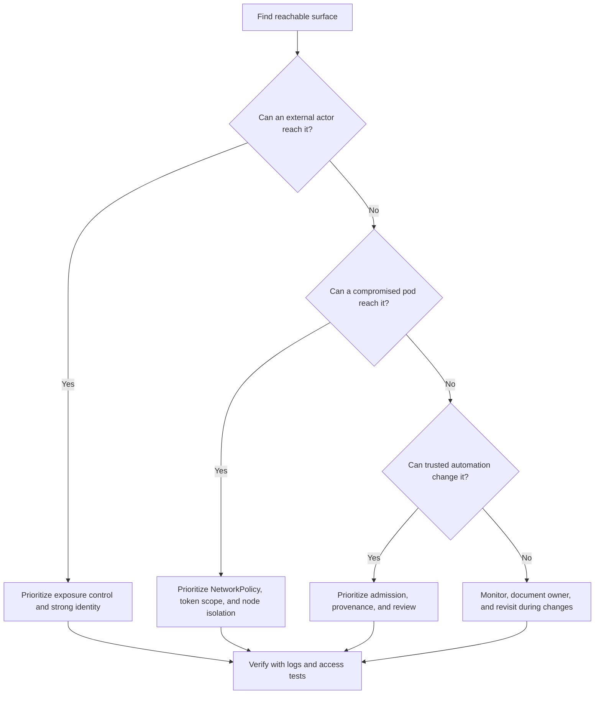

# Module 4.1: Attack Surfaces

| Complexity | Time to Complete | Prerequisites |
|------------|------------------|---------------|
| `[MEDIUM]` - Threat awareness | 35-45 minutes | [Module 3.5: Network Policies](/k8s/kcsa/part3-security-fundamentals/module-3.5-network-policies/) |

## Learning Outcomes

After completing this module, you will be able to:

1. **Evaluate** API server, kubelet, ingress, pod, and supply chain attack surfaces in a Kubernetes 1.35 cluster.
2. **Diagnose** internal lateral movement paths from compromised pods through service account tokens, kubelet reachability, network access, and host namespace exposure.
3. **Design** attack surface reduction strategies that combine private endpoints, RBAC, NetworkPolicy, Pod Security Standards, image controls, and audit logging.
4. **Compare** external attackers, compromised pods, malicious insiders, and supply chain attackers by likely target, blast radius, and control priority.

## Why This Module Matters

The clusters that get breached are rarely breached through exotic kernel exploits or cinematic zero-day chains. They are breached through exposed management surfaces — admin consoles with no password, kubelet APIs without authentication, etcd ports left open during a hasty migration. The textbook 2018 case at a major automotive company is documented in [the CKS GUI security module](../../../cks/part1-cluster-setup/module-1.5-gui-security/) <!-- incident-xref: tesla-2018-cryptojacking --> — attackers used the environment to run mining workloads while hiding network traffic behind a content delivery network. A single reachable control point turned a cloud-native platform into an attacker-operated workload scheduler, and the operational cost was not limited to wasted compute because the same path could have exposed secrets, service identities, or customer data.

That story is the reason attack surface thinking comes before vulnerability trivia. A vulnerability is a flaw in a component, but an attack surface is the reachable set of opportunities where flaws, credentials, weak defaults, and design assumptions can be tested. Kubernetes expands that set because it is both an API-driven control plane and a distributed runtime: users talk to the API server, pods talk to services, kubelets talk to the control plane, controllers talk to cloud APIs, images come from registries, and operators add ingress controllers, observability agents, admission webhooks, and CI/CD automation around the core system.

This module teaches you to map those entry points as an engineer responsible for Kubernetes 1.35 and later clusters, not as someone memorizing a list of scary ports. You will learn to ask who can reach a surface, what they can do there, which identity they can borrow, and what the blast radius becomes if that surface fails. Run `alias k=kubectl` once in your shell before the hands-on section; throughout the lesson, `k get` and similar commands assume that alias so the examples stay readable without changing the meaning of the Kubernetes operations.

## What an Attack Surface Means in Kubernetes

An attack surface is the complete set of points where an attacker can interact with a system, influence it, extract information from it, or move through it after gaining a foothold. In Kubernetes, that includes obvious internet-facing services, but it also includes internal-only APIs, mounted tokens, host namespace settings, admission paths, cloud metadata endpoints, container images, and the human workflows that push manifests into production. The practical security question is not "Do we have an attack surface?" because every useful system does. The question is whether each exposed path is necessary, authenticated, authorized, monitored, and constrained to a tolerable blast radius.

```text
┌─────────────────────────────────────────────────────────────┐
│              ATTACK SURFACE DEFINITION                      │
├─────────────────────────────────────────────────────────────┤
│                                                             │
│  Attack Surface = All entry points an attacker can target  │
│                                                             │
│  LARGER ATTACK SURFACE:                                    │
│  • More exposed services                                   │
│  • More open ports                                         │
│  • More users with access                                  │
│  • More complex configurations                             │
│  = More opportunities for attackers                        │
│                                                             │
│  SMALLER ATTACK SURFACE:                                   │
│  • Minimal exposed services                                │
│  • Restricted network access                               │
│  • Few privileged users                                    │
│  • Simple, hardened configurations                         │
│  = Fewer opportunities for attackers                       │
│                                                             │
│  GOAL: Minimize attack surface while maintaining function  │
│                                                             │
└─────────────────────────────────────────────────────────────┘
```

The important word in that diagram is "function." A secure cluster that cannot serve traffic, deploy releases, rotate credentials, or recover from incidents is not a production system; it is an expensive museum piece. Attack surface reduction is therefore a design discipline, not an exercise in turning everything off. You decide which surfaces must remain reachable, make the remaining paths deliberate, and remove accidental reachability created by defaults, shortcuts, legacy debug ports, broad network routes, or convenience permissions that no current workflow requires.

Think of a cluster like a large office building. The front doors are ingress and load balancers, the reception desk is authentication, the badge readers are authorization, the service corridors are pod networks, the maintenance rooms are kubelet and node access, and the loading dock is your supply chain. A breach rarely depends on every door being unlocked. It often depends on one neglected side entrance, followed by a hallway that was never segmented because everyone assumed the front desk was enough.

The same idea applies to configuration as much as network reachability. A pod that cannot be reached from the internet may still expose a large surface if it mounts the host filesystem, runs as privileged, carries a broadly authorized token, and can send traffic to every service in the cluster. Conversely, an internet-facing application can be an acceptable surface when it is expected, patched, authenticated where appropriate, monitored, and isolated from high-value dependencies. The security goal is not to hide every component; it is to make every reachable component earn its place.

Attack surface also changes over time, which is why a one-time launch review is not enough. A cluster may begin with a private API endpoint and strict workloads, then gain a new ingress class, a metrics stack, a certificate controller, a service mesh, a backup agent, and a data science namespace with unusual image requirements. Each addition can be legitimate, but each also creates another place where identity, network paths, credentials, webhooks, or privileged containers may appear. Treat surface mapping as routine platform hygiene rather than a special audit activity.

Pause and predict: if a cluster has strong RBAC, encrypted secrets, and Pod Security Standards enforced, but the API server is reachable from the internet, what failure mode still worries you most? The answer is not that RBAC suddenly stops working. The problem is that a public management endpoint invites continuous credential attacks, discovery attempts, exploit probes, and misconfiguration testing against the one API that can describe and change nearly everything in the cluster.

## Kubernetes Attack Surface Map

Kubernetes attack surfaces are easiest to reason about in layers: external entry points, internal runtime paths, and supply chain inputs. External surfaces are reachable before an attacker has a pod or account in the cluster, so they usually determine how initial access happens. Internal surfaces matter after a workload, token, node, or user account is compromised, and they determine whether the incident stays small or becomes a cluster-wide event. Supply chain surfaces sit earlier in the lifecycle, where a trusted image, dependency, chart, or pipeline can carry malicious behavior into the cluster without looking like an intrusion at runtime.

```text
┌─────────────────────────────────────────────────────────────┐
│              KUBERNETES ATTACK SURFACE MAP                  │
├─────────────────────────────────────────────────────────────┤
│                                                             │
│  EXTERNAL ATTACK SURFACE (from outside cluster)            │
│  ┌─────────────────────────────────────────────────────┐   │
│  │  • Kubernetes API server                            │   │
│  │  • Ingress/Load Balancers                           │   │
│  │  • NodePort services                                │   │
│  │  • SSH to nodes                                     │   │
│  │  • Cloud provider APIs                              │   │
│  │  • Container registries                             │   │
│  └─────────────────────────────────────────────────────┘   │
│                                                             │
│  INTERNAL ATTACK SURFACE (from inside cluster)             │
│  ┌─────────────────────────────────────────────────────┐   │
│  │  • Pod-to-pod networking                            │   │
│  │  • Kubernetes API (from pods)                       │   │
│  │  • kubelet API                                      │   │
│  │  • etcd                                             │   │
│  │  • Service account tokens                           │   │
│  │  • Secrets                                          │   │
│  │  • Host filesystem (if mounted)                     │   │
│  │  • Container runtime                                │   │
│  └─────────────────────────────────────────────────────┘   │
│                                                             │
│  SUPPLY CHAIN ATTACK SURFACE                               │
│  ┌─────────────────────────────────────────────────────┐   │
│  │  • Container images                                 │   │
│  │  • Base images                                      │   │
│  │  • Application dependencies                         │   │
│  │  • CI/CD pipelines                                  │   │
│  │  • Helm charts/manifests                            │   │
│  └─────────────────────────────────────────────────────┘   │
│                                                             │
└─────────────────────────────────────────────────────────────┘
```

The map deliberately includes both Kubernetes-native components and the systems around them. A private API server does not protect you from a compromised GitHub Actions workflow that can deploy any manifest. A locked-down pod security profile does not protect you from an ingress controller that routes hostile traffic to an application with a remote code execution bug. A signed image policy does not protect you from a service account that can list secrets across namespaces. Attack surface analysis is useful because it keeps these controls in the same conversation instead of treating each checklist as a separate island.

When you evaluate a surface, start with four questions. Who can reach it from the network or workflow? What identity is used when it accepts a request? What action becomes possible if the identity or component is abused? What evidence would show the attempt or the successful action? These questions turn a broad phrase like "the kubelet is exposed" into a concrete risk statement such as "any pod on the node network can attempt authenticated kubelet API calls, and successful access could expose logs, exec paths, and pod metadata unless node firewalling and kubelet authn/authz are enforced."

The evidence question is often the one teams skip, and that omission weakens the whole model. If a surface is important enough to keep exposed, it is important enough to log, alert, and periodically test. For the API server, evidence may be audit records for create, update, delete, impersonate, and bind operations. For ingress, evidence may be controller logs, WAF findings, certificate events, and backend request traces. For workloads, evidence may be admission decisions, runtime alerts, CNI flow records, and denied API authorizations. Without evidence, teams rely on memory, and memory decays faster than clusters change.

It helps to write the map as attacker stories rather than inventory rows. "A user on the internet can reach the API endpoint but must authenticate through OIDC and pass RBAC" is more useful than "API server: public." "A compromised pod in namespace payments can reach DNS, the payment processor, and the worker service, but not the database admin endpoint" is more useful than "NetworkPolicy exists." Stories force you to include reachability, identity, permission, and blast radius in one sentence, which makes weak assumptions easier to spot during review.

Before running any scanner or checklist, write down your expected top three surfaces for the cluster you operate. Which approach would you choose here and why: spend the first day making the API server private, blocking pod egress by default, or enforcing image admission? There is no universal answer, because the right priority depends on current exposure, attacker reachability, and whether the cluster is more likely to be breached through public services, workload compromise, or deployment automation.

## External Entry Points: API Server, Ingress, and Cloud Edges

The Kubernetes API server is the most powerful external surface because it is the front door to cluster state and cluster mutation. Every meaningful administrative operation eventually becomes an API request: creating pods, reading secrets, binding roles, approving certificates, installing webhooks, and changing networking objects. A public API endpoint is not automatically a breach, especially in managed Kubernetes where public endpoints are common, but it creates a high-value target that must survive stolen credentials, weak client networks, unauthenticated discovery, denial-of-service pressure, and the occasional implementation vulnerability.

```text
┌─────────────────────────────────────────────────────────────┐
│              API SERVER ATTACK SURFACE                      │
├─────────────────────────────────────────────────────────────┤
│                                                             │
│  PUBLIC API SERVER                                         │
│  • Accessible from internet                                │
│  • Target for brute force                                  │
│  • Target for credential stuffing                          │
│  • Vulnerable to API exploits                              │
│                                                             │
│  ATTACK SCENARIOS:                                         │
│  1. Stolen credentials → Full cluster access               │
│  2. Anonymous auth enabled → Information disclosure        │
│  3. API vulnerability → Remote code execution              │
│  4. RBAC misconfiguration → Privilege escalation           │
│                                                             │
│  MITIGATIONS:                                              │
│  • Private API endpoint (VPN/bastion required)             │
│  • Strong authentication (OIDC, certificates)              │
│  • Disable anonymous auth                                  │
│  • Network firewall rules                                  │
│  • API audit logging                                       │
│                                                             │
└─────────────────────────────────────────────────────────────┘
```

Private API endpoints reduce exposure by forcing administrative traffic through a controlled network path, such as a VPN, bastion, private link, or corporate zero trust access layer. That move is valuable, but it shifts some risk rather than deleting it. The VPN becomes a critical surface, bastion hosts need hardening and logging, and emergency access procedures must still work during incidents. Good designs make the API server private, keep authentication strong with OIDC or client certificates, disable anonymous access, use least-privilege RBAC, and collect audit events that can distinguish normal controller behavior from suspicious human or token activity.

Ingress controllers and load balancers are different because they are supposed to accept untrusted traffic. Their job is to expose applications, terminate TLS, route requests, and sometimes apply authentication, rate limits, or web application firewall rules. The attack surface is therefore not just the controller binary; it includes ingress annotations, TLS settings, host rules, path rewrites, backend applications, default backends, admission controls around who may create ingress objects, and cloud load balancer features that may be enabled by annotations. A misrouted host rule can expose an internal service just as surely as a vulnerable controller can.

```text
┌─────────────────────────────────────────────────────────────┐
│              INGRESS ATTACK SURFACE                         │
├─────────────────────────────────────────────────────────────┤
│                                                             │
│  WHAT'S EXPOSED:                                           │
│  • Ingress controller (nginx, traefik, etc.)               │
│  • Backend applications through ingress                    │
│  • TLS termination point                                   │
│                                                             │
│  ATTACK SCENARIOS:                                         │
│  1. Ingress controller vulnerability                       │
│  2. Application vulnerabilities (OWASP Top 10)             │
│  3. Misrouted traffic (host header attacks)                │
│  4. TLS/certificate issues                                 │
│  5. Path traversal to unintended backends                  │
│                                                             │
│  MITIGATIONS:                                              │
│  • Keep ingress controller updated                         │
│  • WAF (Web Application Firewall)                          │
│  • Strict ingress rules                                    │
│  • Strong TLS configuration                                │
│  • Rate limiting                                           │
│                                                             │
└─────────────────────────────────────────────────────────────┘
```

NodePort services deserve special attention because they expose every selected node on a high port range, even when the application owner only meant to test something quickly. In a small lab, a NodePort feels harmless because it is convenient and visible. In a cloud VPC with permissive security groups, it can create an internet-reachable path to a service that never passed the same review as an ingress route. LoadBalancer services have a similar problem when teams forget that a service object can request external infrastructure through cloud controller integration.

Cloud provider APIs and registries sit at the edge of the Kubernetes trust boundary. If an attacker obtains a cloud identity that can update node security groups, modify load balancers, read registry images, or change managed cluster settings, the Kubernetes API may be bypassed entirely. If an attacker can push a trusted image tag or alter a Helm chart in a deployment repository, admission and runtime controls may be asked to defend against code that the platform believes is legitimate. That is why a serious external surface review includes DNS, cloud IAM, registry permissions, CI/CD credentials, and release automation along with the visible cluster endpoints.

External surface reduction has a political component because owners often disagree about what counts as necessary exposure. Application teams may view an unauthenticated health endpoint as harmless, while security teams see it as a fingerprinting source. Platform teams may view public managed API endpoints as normal, while compliance teams require private management paths. The best reviews avoid vague arguments by documenting the user, purpose, identity control, network control, data sensitivity, and fallback plan for each endpoint. Once those facts are visible, the decision becomes an engineering tradeoff rather than a debate over fear.

War story: a platform team once removed a set of public NodePort services and celebrated the exposure reduction, only to discover that a cloud load balancer controller recreated equivalent public listeners from service annotations in another namespace. The first fix had targeted the symptom, not the workflow that produced the exposure. The durable fix was to restrict which teams could create external load balancers, add admission checks for risky annotations, and create a standard ingress path with logging and ownership. Attack surface reduction sticks when it changes the path that creates exposure.

## Internal Runtime Surfaces: Pods, Tokens, Kubelet, and Nodes

Internal attack surface analysis begins with the assumption that one workload will eventually be compromised. A public application may have a code flaw, a dependency may behave badly, a secret may be printed into logs, or a developer may deploy a debugging image during an incident. The question is what the attacker can do next from inside that pod. Kubernetes defaults have improved over time, but a pod still has network reachability, a process namespace inside a shared kernel, mounted volumes, environment variables, DNS, and often a service account token unless the workload disables token automounting or uses carefully scoped projected tokens.

```text
┌─────────────────────────────────────────────────────────────┐
│              POD-LEVEL ATTACK SURFACE                       │
├─────────────────────────────────────────────────────────────┤
│                                                             │
│  SCENARIO: Attacker compromises application in pod         │
│                                                             │
│  WHAT THEY CAN ACCESS:                                     │
│                                                             │
│  ALWAYS AVAILABLE:                                         │
│  ├── Container filesystem                                  │
│  ├── Environment variables (may contain secrets)           │
│  ├── Mounted volumes                                       │
│  └── Network (all pods by default)                         │
│                                                             │
│  IF TOKEN MOUNTED (default):                               │
│  ├── Kubernetes API access                                 │
│  ├── Service account permissions                           │
│  └── Secrets accessible via RBAC                           │
│                                                             │
│  IF MISCONFIGURED:                                         │
│  ├── privileged: true → Host access                        │
│  ├── hostPath mounts → Host filesystem                     │
│  ├── hostNetwork → Host network                            │
│  ├── hostPID → Host processes                              │
│  └── Excessive RBAC → Cluster compromise                   │
│                                                             │
└─────────────────────────────────────────────────────────────┘
```

The service account token is a common pivot point because it turns application compromise into API access. A token with only permission to read one ConfigMap may be low impact, while a token bound to a broad Role or ClusterRole can let an attacker list secrets, create pods, read logs, or impersonate operational workflows. The defensive pattern is to give workloads explicit service accounts, disable token mounting for pods that do not call the API, scope RBAC to the namespace and verbs actually needed, and test with `k auth can-i` before assuming a role is harmless.

Network reachability is the other major internal multiplier. Without NetworkPolicies, many Kubernetes networks permit broad pod-to-pod traffic by default, which means one compromised application can scan services, call internal admin endpoints, probe databases, or reach cloud metadata unless other controls stop it. Default-deny ingress policies reduce who can call a workload, and default-deny egress policies reduce where a compromised workload can call out. Neither policy type fixes a vulnerable application, but together they convert a successful exploit into a contained incident rather than a discovery tour through the namespace.

Internal surfaces are harder to explain to non-platform stakeholders because they are not visible on the public internet. A finance system owner may understand why a public admin panel is dangerous but underestimate why a pod in another namespace should not reach their database proxy. Use blast-radius language instead of network jargon. Say that a successful exploit in a low-value service should not automatically grant a path to payroll data, cloud credentials, or the build system. That framing makes NetworkPolicy, service account scoping, and namespace boundaries feel like business controls rather than platform preferences.

Kubelet is a node agent, but its API is security-sensitive enough to treat as a privileged internal surface. The kubelet can expose pod metadata, logs, exec-like behavior, and node-related operations depending on configuration, authentication, authorization, and version. Modern secure clusters should disable anonymous kubelet access, disable the old read-only port, require webhook authentication and authorization where appropriate, and restrict network reachability to node and control-plane paths that genuinely need it. If a pod network can freely reach every kubelet, the cluster has an internal management plane exposure even when the public API endpoint is private.

```text
┌─────────────────────────────────────────────────────────────┐
│              KUBELET ATTACK SURFACE                         │
├─────────────────────────────────────────────────────────────┤
│                                                             │
│  KUBELET API (port 10250)                                  │
│  • /exec - Execute commands in containers                  │
│  • /run - Run commands                                     │
│  • /pods - List pods                                       │
│  • /logs - Read logs                                       │
│                                                             │
│  ATTACK SCENARIOS:                                         │
│  1. Anonymous kubelet access → Execute in any container    │
│  2. Node compromise → Kubelet credentials stolen           │
│  3. Network access to kubelet → Bypass API server auth     │
│                                                             │
│  MITIGATIONS:                                              │
│  • Disable anonymous auth                                  │
│  • Disable read-only port (10255)                          │
│  • Network isolation for kubelet                           │
│  • Node authorization mode                                 │
│                                                             │
└─────────────────────────────────────────────────────────────┘
```

Host access settings are where a normal pod can become a node-level incident. `privileged: true`, `hostPath` mounts, `hostNetwork`, `hostPID`, broad Linux capabilities, writable root filesystems, and root users all increase the surface exposed to malicious code running inside the container. Some workloads need narrow exceptions, especially CNI plugins, storage agents, observability collectors, and node maintenance tools. The mistake is treating those exceptions as ordinary application settings instead of privileged infrastructure decisions that require ownership, namespace isolation, admission review, and compensating monitoring.

Node compromise is also a boundary crossing because a node hosts many workloads and holds credentials used to report status, pull images, and communicate with the control plane. A compromised node may reveal logs, mounted volumes, container runtime state, and workload metadata that were never meant to be shared across tenants. Even when managed Kubernetes reduces direct node administration, operators still choose node images, daemonsets, SSH policy, kernel update cadence, and security group reachability. That makes node hardening part of attack surface reduction rather than a separate operating system checklist.

Pause and predict: an attacker compromises a pod that has `automountServiceAccountToken: false`, runs as non-root, has no added capabilities, and has a read-only root filesystem. What attack surface remains? They can still use allowed network paths, read mounted data and environment variables, exploit the application process, attempt kernel or runtime escape bugs, abuse writable volumes, reach DNS, and potentially contact external endpoints if egress is open, which is why hardening one layer never replaces segmentation and observation.

Etcd is often hidden from application teams, but it remains part of the internal surface because it stores Kubernetes state, including secret objects unless an external secrets pattern is used. Direct etcd access should be tightly restricted to control-plane components, protected with TLS, encrypted at rest where required, and monitored like a database that can reveal or alter cluster state. A managed service may hide those knobs, but the design principle still applies: if a component can read or mutate the source of truth, it belongs in the highest-risk part of your model.

## Threat Actors and Blast Radius

Attack surface analysis becomes practical when you describe the actor, not just the component. An external attacker with no credentials has a different path than a malicious insider with legitimate access, and both differ from code that arrives through your supply chain. A compromised pod is not the same actor as a compromised node, even if both are "inside" the cluster, because the starting identity, network position, and available system calls are different. Good threat models preserve those differences so the mitigation is not reduced to generic advice like "use least privilege."

```text
┌─────────────────────────────────────────────────────────────┐
│              THREAT ACTORS                                  │
├─────────────────────────────────────────────────────────────┤
│                                                             │
│  EXTERNAL ATTACKER                                         │
│  • No initial access                                       │
│  • Targets: Exposed services, stolen credentials           │
│  • Goal: Initial foothold                                  │
│                                                             │
│  COMPROMISED POD                                           │
│  • Limited container access                                │
│  • Targets: Other pods, secrets, API, container escape     │
│  • Goal: Lateral movement, escalation                      │
│                                                             │
│  MALICIOUS INSIDER                                         │
│  • Legitimate credentials                                  │
│  • Targets: Abuse permissions, plant backdoors             │
│  • Goal: Data theft, persistence                           │
│                                                             │
│  SUPPLY CHAIN ATTACKER                                     │
│  • Compromises trusted components                          │
│  • Targets: Images, dependencies, CI/CD                    │
│  • Goal: Widespread compromise                             │
│                                                             │
│  EACH ACTOR HAS DIFFERENT ATTACK SURFACE                   │
│                                                             │
└─────────────────────────────────────────────────────────────┘
```

For an external attacker, the first priority is reachable infrastructure: API server endpoints, ingress routes, load balancers, NodePorts, SSH, VPNs, bastions, registries, and cloud APIs. The best reductions are exposure controls, strong identity, rate limiting, patch management, and alerting on failed or unusual access. This actor may never touch the pod network unless an application exploit, stolen credential, or misconfigured endpoint gives them the first foothold. That is why internet-facing inventory must be kept current and tied to ownership.

For a compromised pod, the first priority changes to lateral movement and privilege escalation. The attacker already has code execution inside the cluster network, so the risk depends on egress rules, service discovery, API token permissions, mounted data, host access, and runtime isolation. This actor may not need to defeat the API server from the internet because the service account token and in-cluster DNS give them a friendlier route. A design that looks secure from outside can still fail badly if every namespace trusts every other namespace by default.

For a malicious insider, the surface is shaped by legitimate permissions and weak review processes. A developer with namespace-admin rights may create a privileged pod, bind a stronger role, add a secret-reading sidecar, or deploy a webhook that changes future workloads. The control priority is not only authentication; it is separation of duties, auditability, policy-as-code, admission control, and fast detection of unusual actions by otherwise valid users. Insiders also remind us that attack surface includes workflows, not only sockets.

For a supply chain attacker, runtime controls may see normal-looking behavior because the malicious code arrives as a trusted artifact. The attacker may compromise a base image, dependency, build script, Helm chart, admission webhook image, or CI/CD credential. The best reductions happen before deployment through provenance, signing, software bills of materials, dependency review, immutable tags or digests, registry access controls, and admission policies that reject unknown artifacts. Runtime egress controls and DNS monitoring still matter because malicious code eventually needs to act.

Comparing actors prevents overfitting your controls to the last incident you read about. If the most realistic actor is an external attacker, public exposure and credential resilience may deserve the first investment. If the realistic actor is a compromised workload, internal segmentation and token scoping may produce more immediate risk reduction. If the realistic actor is a trusted pipeline gone wrong, image provenance and admission policy may outrank another perimeter firewall rule. Mature programs keep all four actor views alive and rotate attention as the platform changes.

The blast-radius question should always include data, control, and persistence. Data blast radius asks what the attacker can read, such as secrets, database credentials, logs, mounted volumes, or customer records. Control blast radius asks what the attacker can change, such as pods, role bindings, admission webhooks, images, or cloud routes. Persistence blast radius asks whether the attacker can survive restarts, deploy backdoors, create new credentials, or hide in automation. The same surface may be tolerable for one dimension and unacceptable for another.

## Designing Attack Surface Reduction

Attack surface reduction starts with inventory, but it succeeds through ownership and prioritization. Inventory tells you what is exposed; ownership tells you who can change it; prioritization tells you which surface reduction will reduce actual risk this week. A cluster with a public API endpoint, anonymous kubelet access, broad NodePorts, privileged application pods, and mutable image tags has too many problems for one heroic hardening sprint. You rank surfaces by reachability, privilege, exploitability, business importance, and whether a mitigation can be shipped without breaking required operations.

```text
┌─────────────────────────────────────────────────────────────┐
│              ATTACK SURFACE REDUCTION                       │
├─────────────────────────────────────────────────────────────┤
│                                                             │
│  NETWORK                                                   │
│  ☐ Private API server endpoint                             │
│  ☐ Network policies (default deny)                         │
│  ☐ No unnecessary NodePort/LoadBalancer services           │
│  ☐ Firewall rules for node access                          │
│                                                             │
│  AUTHENTICATION                                            │
│  ☐ Disable anonymous auth (API server, kubelet)            │
│  ☐ Short-lived credentials                                 │
│  ☐ Strong authentication (MFA, certificates)               │
│                                                             │
│  WORKLOADS                                                 │
│  ☐ No privileged containers                                │
│  ☐ No host namespace sharing                               │
│  ☐ Read-only root filesystem                               │
│  ☐ Disable service account token mounting                  │
│  ☐ Minimal container images                                │
│                                                             │
│  NODES                                                     │
│  ☐ Minimal OS (Bottlerocket, Flatcar)                      │
│  ☐ Disable SSH if possible                                 │
│  ☐ Regular patching                                        │
│                                                             │
└─────────────────────────────────────────────────────────────┘
```

The reduction checklist should not be applied blindly. Private API endpoints are powerful but require reliable operator access, emergency procedures, and automation paths that do not depend on a single workstation. Default-deny NetworkPolicies are powerful but require application teams to understand dependencies, DNS, metrics, and external calls. Disabling service account token automounting is powerful but can break controllers or apps that legitimately call the API. Minimal images are powerful but can slow incident response if teams rely on shell tools inside production containers instead of approved debug workflows.

A useful worked example begins with a namespace that hosts a public web API, a worker, and a database client. The web API needs ingress from the internet and egress to the worker service, DNS, and one external payment endpoint. The worker needs no ingress from the internet, limited ingress from the web API, and egress to the database service and object storage. Neither workload needs to call the Kubernetes API. The attack surface reduction design is therefore private API access for humans, ingress only for the web API, namespace default-deny policies, explicit egress rules, service accounts with no token automounting, restricted Pod Security Standards, image digests, and audit alerts for unexpected role bindings.

Here is a small set of commands you can run in a lab cluster to begin that review. These commands do not prove security by themselves, but they quickly show whether the surface is being shaped deliberately. Use them as prompts for investigation, then inspect the matching manifests and cloud settings before making production changes.

```bash
alias k=kubectl

k get svc -A
k get ingress -A
k get pods -A -o custom-columns='NS:.metadata.namespace,NAME:.metadata.name,SA:.spec.serviceAccountName,HOSTNET:.spec.hostNetwork,HOSTPID:.spec.hostPID'
k auth can-i --as=system:serviceaccount:default:default list secrets
k get networkpolicy -A
```

Before running this in your own lab, what output do you expect for services and NetworkPolicies? If the namespace has no policies, the absence is not neutral information. It usually means the CNI will allow more traffic than the application design requires, and the next step is to add a default-deny baseline before opening only the paths the workload actually needs.

Attack surface reduction also needs evidence, because unverified hardening becomes folklore. API audit logs should show denied and unusual privileged operations. Network flow logs or CNI observability should show whether default-deny policies are blocking unexpected calls. Admission controller logs should show rejected privileged pods, host namespace settings, unsigned images, or mutable tags. Registry and CI/CD logs should show who built and promoted images. If you cannot observe a surface, you cannot confidently claim it has been reduced.

A staged plan usually works better than a sweeping lockdown because it gives teams time to learn their real dependencies. Start with inventory and read-only checks, then enforce in a narrow namespace, then broaden with exception handling and clear rollback conditions. For example, a platform team might first report all privileged pods, then block new privileged application pods while allowing named infrastructure namespaces, then add expiration dates to exceptions, and finally alert on any unexpected host namespace usage. Each stage reduces surface while creating operational knowledge for the next stage.

Be careful with compensating controls that sound stronger than they are. A web application firewall in front of ingress does not compensate for a service account that can read all secrets. Image scanning does not compensate for a public kubelet path. Encryption at rest for secrets does not compensate for a role that can read those secrets through the API. Compensating controls are valid only when they interrupt the same attacker path or reduce the same blast radius. Otherwise, they may improve the environment while leaving the specific surface unchanged.

## Patterns & Anti-Patterns

The strongest pattern is deliberate exposure by contract. Each externally reachable endpoint should have an owner, a reason to exist, an authentication story, a monitoring story, and a documented retirement condition. This works because it transforms exposure from an accident into a managed asset. It also scales well across teams because platform engineers can provide standard ingress classes, private API access patterns, registry policies, and service templates while application teams retain responsibility for the business services they expose.

| Pattern | When to Use It | Why It Works | Scaling Consideration |
|---------|----------------|--------------|-----------------------|
| Private management plane | Clusters with production data, regulated workloads, or broad operator access | Removes the API server from routine internet probing and forces access through controlled networks | Maintain break-glass access, automation paths, and audit trails for the access layer |
| Namespace default-deny plus explicit allow | Multi-team clusters or any namespace with sensitive services | Turns lateral movement from a default capability into an approved dependency graph | Provide policy templates and flow visibility so teams can debug safely |
| Least-privilege workload identity | Applications that do not need broad Kubernetes API access | Limits token abuse after pod compromise and makes `k auth can-i` evidence meaningful | Review role bindings during release, not only during security audits |
| Admission control for privileged settings and images | Clusters with many deployers or automated pipelines | Blocks risky surfaces before they become running workloads | Version policies with exceptions, owners, and expiration dates |

Another strong pattern is separate handling for infrastructure workloads. CNI agents, CSI drivers, node exporters, log collectors, and security tools often require host mounts, host networking, or elevated permissions. Treating those workloads like ordinary apps causes confusion because the exception becomes normalized. Treating them as infrastructure creates a narrower control path: dedicated namespaces, restricted deployers, pinned images, runtime monitoring, and clear ownership for each privileged capability.

The first anti-pattern is perimeter-only thinking. Teams make the API server private and add a polished ingress layer, then assume the cluster is secure while pod-to-pod traffic remains wide open and service account tokens can read more than needed. This happens because external exposure is visible to network teams, while internal reachability is less obvious until an incident. The better approach is to pair every perimeter reduction with an internal blast-radius reduction, then test both from an attacker starting point.

The second anti-pattern is debug-driven privilege creep. Someone adds `hostNetwork`, `hostPID`, `hostPath`, or `privileged: true` to fix an urgent operational problem, and the manifest remains in production because it worked. This happens because debugging under pressure rewards speed over review. The better approach is to maintain approved debug tooling, use ephemeral containers or dedicated break-glass workflows where appropriate, and require time-limited exceptions for host-level access.

The third anti-pattern is trusting the supply chain because runtime settings look clean. A pod can run as non-root, drop capabilities, and avoid the API while still exfiltrating data through normal HTTPS if the image itself is malicious. This happens because runtime hardening is easier to see in a manifest than build provenance. The better approach is to combine image signing, digest pinning, SBOM review, dependency scanning, registry access controls, and egress monitoring so the artifact and its behavior are both constrained.

A fourth anti-pattern is treating managed Kubernetes as if the provider owns every surface. Managed services remove a large amount of control-plane toil, but customers still make decisions about endpoint exposure, authorized networks, node pools, workload identity, admission controls, registry trust, network policy, and application ingress. The provider may protect the underlying service, yet a customer can still create a public load balancer to an unsafe workload or bind a service account to excessive permissions. Shared responsibility becomes real only when the team lists which surfaces remain under its control.

The pattern that counters all of these anti-patterns is reviewable intent. A reviewer should be able to look at a manifest, policy, or cloud setting and answer why it exists, who owns it, what actor it defends against, and when it should be revisited. If those answers are absent, the surface may still be necessary, but it is not yet well managed. This is where lightweight documentation helps: a short annotation, a policy exception record, or a runbook link can prevent future teams from normalizing an emergency choice as a permanent default.

## Decision Framework

When you need to choose the next attack surface reduction, avoid ranking controls by popularity. Rank them by attacker path. Start with the actor most likely to reach the cluster today, identify the highest-privilege surface they can touch, and choose a mitigation that removes reachability or reduces blast radius without blocking required operations. If two controls have similar risk reduction, choose the one that creates better evidence, because evidence makes the next decision easier.



| Situation | First Reduction | Second Reduction | Evidence to Collect |
|-----------|-----------------|------------------|---------------------|
| Public API server with broad admin access | Restrict API endpoint reachability and require strong identity | Review cluster-admin bindings and audit high-risk verbs | API audit events, access layer logs, RBAC review output |
| Namespace with no NetworkPolicies | Add default-deny ingress and egress baselines | Add explicit app, DNS, and external endpoint allows | CNI flow logs, failed connection tests, app health checks |
| Pods with mounted tokens but no API need | Set explicit service accounts and disable automounting | Remove unused Roles and RoleBindings | `k auth can-i` output and denied audit events |
| Host namespace or privileged application pods | Move capability to approved infrastructure workflow or remove it | Add admission policy with owner-approved exceptions | Admission rejects, exception registry, runtime alerts |
| Mutable tags and broad registry write access | Pin images by digest and restrict who can push release tags | Add signing and provenance checks at admission | Registry audit logs, admission decisions, build attestations |

Use this framework iteratively. A team may first make the API server private because the endpoint is internet-facing, then discover that compromised pods can still reach every internal service, then discover that CI/CD can deploy privileged pods without review. That sequence is normal. Attack surface work is a loop of discovery, reduction, and verification rather than a one-time hardening event.

When two teams disagree about priority, ask each team to describe the first three attacker actions after success. If the API server remains public, the actions may be credential testing, discovery, and privileged API calls after a stolen token. If pod egress remains open, the actions may be service scanning, database probing, and external exfiltration. If image provenance remains weak, the actions may be build compromise, trusted deployment, and quiet outbound communication. Comparing those short paths usually reveals which control removes the most dangerous next action.

The framework is also useful after an incident, when teams are tempted to add controls wherever they feel anxiety. Start with the actual attacker path and mark every surface that helped the attacker progress. Then mark the surfaces that would have detected or stopped the path earlier. This produces a remediation plan tied to evidence rather than a broad wish list. It also exposes uncomfortable gaps, such as logs that existed but were not reviewed, policies that were written but not enforced, or exceptions that nobody owned.

## Did You Know?

- **Kubernetes disabled the insecure API server port by default years ago**, but kubelet and component misconfigurations still appear in real audits because clusters inherit old bootstrap templates, custom node images, or copied lab settings.
- **The kubelet secure port is 10250**, and that single port can expose sensitive node and pod operations when authentication, authorization, and network reachability are not configured carefully.
- **The old kubelet read-only port is 10255**, and even read-only metadata can help attackers discover namespaces, pod names, workloads, and targets for the next step in an intrusion.
- **Container images commonly contain hundreds of operating system packages**, so switching from a general-purpose base image to a minimal or distroless image can remove a large number of libraries that production code never needed.

## Common Mistakes

| Mistake | Why It Happens | How to Fix It |
|---------|----------------|---------------|
| Treating a public API server as harmless because RBAC exists | Teams focus on authorization and forget that public reachability invites credential attacks and exploit probing | Prefer private endpoints where feasible, require strong identity, disable anonymous auth, and alert on unusual API access |
| Leaving default service account tokens mounted everywhere | The default works for simple demos, so teams do not notice which workloads never call the API | Use explicit service accounts, set `automountServiceAccountToken: false` where possible, and verify with `k auth can-i` |
| Shipping namespaces without baseline NetworkPolicies | Application teams assume cluster networking is private enough once ingress is controlled | Start with default-deny ingress and egress, then allow only documented dependencies such as DNS and required services |
| Allowing privileged or host namespace settings for routine apps | Debugging pressure turns temporary exceptions into permanent manifests | Move node-level tasks to approved infrastructure components and enforce Pod Security Standards plus admission exceptions |
| Exposing NodePort services for convenience | NodePort is easy to test and often bypasses the normal ingress review path | Use ingress or internal services by default, and review cloud firewall rules before exposing node ports |
| Ignoring kubelet network reachability | The kubelet feels like an implementation detail owned by the platform | Disable anonymous access and read-only ports, then restrict node management paths with firewalls or security groups |
| Trusting clean runtime settings while accepting unknown images | Manifest hardening is visible, but build provenance and registry permissions are less familiar | Pin by digest, require trusted registries, add image signing or attestation checks, and monitor egress behavior |
| Reviewing surfaces once during cluster launch | Clusters change through releases, controllers, cloud settings, and emergency fixes | Re-run exposure reviews after major platform changes and record owners for every public or privileged surface |

## Quiz

<details><summary>Your team has a public API server, strong OIDC authentication, and several users bound to `cluster-admin`. A manager asks whether making the API endpoint private is still worth doing. How do you evaluate the tradeoff?</summary>

Making the API endpoint private is still valuable because it reduces who can attempt to reach the management plane in the first place. Strong OIDC protects authentication, but it does not remove credential phishing, stolen sessions, excessive permissions, or API exploit probing from the risk model. The tradeoff is operational: you must preserve reliable automation, incident response, and break-glass access through the private path. The best answer is to pair private reachability with RBAC cleanup and audit logging, not to treat any single control as complete protection.

</details>

<details><summary>An attacker compromises a pod with `automountServiceAccountToken: false`, no added capabilities, and a read-only root filesystem. The incident commander says lateral movement is impossible. What do you check next?</summary>

You check network reachability, mounted volumes, environment variables, writable volumes, DNS, external egress, and any paths to cloud metadata or internal services. Disabling the service account token removes an important API pivot, but it does not remove the pod network or the application process itself. If no default-deny egress policy exists, the attacker may still scan services or exfiltrate data through ordinary outbound connections. The correct diagnosis is that pod hardening reduced privilege escalation paths, while NetworkPolicy and monitoring still determine blast radius.

</details>

<details><summary>A security review finds that kubelet anonymous authentication is disabled, but pods can still reach node IPs on port 10250. Why is this still an attack surface worth reducing?</summary>

Authentication reduces the chance that an unauthenticated request succeeds, but network reachability still lets attackers probe a sensitive node API from compromised workloads. Every reachable management endpoint increases reconnaissance value, log noise, and exposure to future credential or implementation failures. Restricting kubelet access to the control plane and approved node-management paths creates defense in depth. You should verify both kubelet authn/authz settings and firewall or security group rules rather than accepting either control alone.

</details>

<details><summary>A developer wants `hostNetwork: true` for a production debugging pod and argues that the namespace has a default-deny NetworkPolicy. How do you respond?</summary>

`hostNetwork: true` changes the pod's network position because the pod uses the node network stack instead of normal pod networking. Many NetworkPolicy implementations govern pod network traffic, so the debugging pod may bypass the intended namespace segmentation and gain access to node-local services or ports. The safer response is to use an approved debugging workflow with time-limited access, clear ownership, and logging. If host networking is truly required, treat it as an infrastructure exception rather than a routine application setting.

</details>

<details><summary>Your platform has private API access and good NetworkPolicies, but the deployment pipeline can push mutable image tags from a broad CI credential. Which attack surface is being under-modeled?</summary>

The under-modeled surface is the supply chain path that turns build and registry access into trusted runtime code. Private API access and NetworkPolicies reduce other paths, but they do not prove that the image being deployed was built from expected source by an expected workflow. An attacker who controls the pipeline or registry credential can ship malicious code that looks like a normal release. The fix is to restrict registry writes, pin images by digest, require signing or provenance checks, and monitor runtime egress for behavior that should not exist.

</details>

<details><summary>A penetration test ranks a public NodePort lower than a public API server. Under what conditions could the NodePort still become the more urgent fix?</summary>

The NodePort becomes more urgent when the exposed application is highly vulnerable, unauthenticated, connected to sensitive data, or reachable through permissive cloud firewall rules across many nodes. Risk is not only about component power; it is about reachable exploitability and business impact. A well-protected API endpoint may be harder to abuse than a forgotten NodePort serving an admin panel with weak authentication. The right ranking should consider exploit evidence, data exposure, ownership, and how quickly each mitigation can be applied.

</details>

<details><summary>You are asked to design an attack surface reduction plan for a cluster with no NetworkPolicies, several privileged pods, and no image signing. Which first step creates the best learning before broad rollout?</summary>

Start with a scoped assessment in one representative namespace and map required traffic, service account permissions, privileged settings, and image sources. That creates evidence before you enforce controls that might break production. A good first implementation is a default-deny policy plus explicit allows for one application, paired with removal of unnecessary token automounting and documentation of any privileged workload owner. Once the pattern works, admission and signing controls can be rolled out with exception handling informed by the assessment.

</details>

## Hands-On Exercise: Attack Surface Assessment

In this exercise, you will review a deliberately unsafe cluster fragment, classify each surface by actor and blast radius, and design a reduction plan that could be implemented without changing every control at once. You do not need a running cluster for the first half because the goal is to practice reading configuration as an attacker would. If you do have a lab cluster, use the command checks after the written review to compare your expected findings with actual objects.

**Scenario**: Review this cluster configuration and identify attack surface concerns:

```yaml
# API Server flags
--anonymous-auth=true
--authorization-mode=AlwaysAllow

# Kubelet config
authentication:
  anonymous:
    enabled: true
readOnlyPort: 10255

# Sample pod
apiVersion: v1
kind: Pod
spec:
  hostNetwork: true
  hostPID: true
  containers:
  - name: app
    image: ubuntu:latest
    securityContext:
      privileged: true
```

### Tasks

- [ ] Classify each finding as external, internal, node-level, or supply chain attack surface.
- [ ] Rank the findings by likely blast radius if an unauthenticated external attacker or compromised pod can reach them.
- [ ] Write a safer replacement for the API server and kubelet settings in plain language, including authentication and authorization changes.
- [ ] Write a safer pod security design that removes host namespace usage, privileged mode, and mutable image tags unless a documented infrastructure exception exists.
- [ ] List the evidence you would collect after remediation, including at least one API audit signal, one network signal, and one admission or runtime signal.

<details><summary>Suggested classification and ranking</summary>

The API server settings are the most severe external management-plane surface because `anonymous-auth=true` and `authorization-mode=AlwaysAllow` combine unauthenticated reachability with no authorization enforcement. The kubelet settings are a severe internal or node-management surface because anonymous kubelet access and the read-only port expose node and pod information that can support reconnaissance and, depending on other settings, further abuse. The pod settings are severe internal-to-node escalation paths because `hostNetwork`, `hostPID`, and `privileged: true` move the workload much closer to the host. The mutable `ubuntu:latest` image is a supply chain and operations surface because the deployed artifact can change without a manifest change and contains more packages than a minimal production image usually needs.

</details>

<details><summary>Suggested remediation plan</summary>

Disable anonymous API server access, use a real authorization mode such as RBAC or the managed provider equivalent, and make the API endpoint private where operationally feasible. Disable anonymous kubelet access, keep the read-only port disabled, and restrict kubelet reachability to approved control-plane or node-management paths. Replace the pod with a non-root, non-privileged workload, no host namespaces, no hostPath mount unless separately justified, a read-only root filesystem where possible, and an image pinned by digest from a trusted registry. If the workload truly needs host access, move it into an infrastructure namespace with an owner, admission exception, and monitoring.

</details>

<details><summary>Suggested evidence after remediation</summary>

For API changes, collect API audit events showing denied unauthenticated requests and reviewed privileged actions by named users or service accounts. For kubelet changes, collect node firewall or security group evidence showing restricted reachability and kubelet configuration evidence showing anonymous access and the read-only port disabled. For workload changes, collect admission controller decisions rejecting privileged or host namespace settings outside approved exceptions, plus runtime or inventory evidence showing no unexpected privileged application pods. For network containment, collect CNI flow logs or test results showing that compromised-pod assumptions no longer imply unrestricted lateral movement.

</details>

### Optional Lab Checks

If you have a lab cluster, run these read-only checks and compare the output to your written expectations. The commands are intentionally simple because the learning goal is interpretation. A clean result does not prove the cluster is perfect, but a surprising result gives you a concrete surface to investigate with the owner.

```bash
alias k=kubectl

k get svc -A
k get ingress -A
k get networkpolicy -A
k get pods -A -o custom-columns='NS:.metadata.namespace,NAME:.metadata.name,PRIV:.spec.containers[*].securityContext.privileged,HOSTNET:.spec.hostNetwork,HOSTPID:.spec.hostPID,SA:.spec.serviceAccountName'
k auth can-i --as=system:serviceaccount:default:default list secrets
```

### Success Criteria

- [ ] You can explain why the API server finding is a management-plane exposure, not just another open port.
- [ ] You can explain why kubelet reachability matters even when the public API endpoint is private.
- [ ] You can distinguish pod hardening, NetworkPolicy, and supply chain controls instead of treating them as interchangeable.
- [ ] You can propose a staged reduction plan that removes unnecessary exposure while preserving required operations.
- [ ] You can name the evidence that would prove the reduction is working after the configuration changes.

## Summary

Attack surface is the sum of all entry points, but the useful engineering habit is to connect each entry point to reachability, identity, action, blast radius, and evidence. The table below preserves the quick reference from the original module, now framed as the final review pass after the deeper analysis. Use it to make sure your reduction plan covers external exposure, internal movement, and supply chain inputs instead of over-investing in only the most visible category.

| Surface Type | Examples | Reduction Strategy |
|-------------|----------|-------------------|
| **External** | API server, Ingress, NodePort | Private endpoints, firewalls |
| **Internal** | Pod network, kubelet, API from pods | Network policies, disable tokens |
| **Supply Chain** | Images, dependencies, CI/CD | Scanning, signing, minimal images |

The working principles are simple enough to remember but demanding to implement consistently. What is not exposed cannot be attacked through that path, privileges should be minimized at every layer, breach assumptions should shape internal controls, and different actors should be mapped to different surfaces. If you can explain those principles with concrete objects from your own cluster, you are ready to move from attack surface mapping to vulnerability analysis.

## Sources

- [Kubernetes Documentation: Controlling Access to the Kubernetes API](https://kubernetes.io/docs/concepts/security/controlling-access/)
- [Kubernetes Documentation: Using RBAC Authorization](https://kubernetes.io/docs/reference/access-authn-authz/rbac/)
- [Kubernetes Documentation: Authorization Overview](https://kubernetes.io/docs/reference/access-authn-authz/authorization/)
- [Kubernetes Documentation: Kubelet Authentication and Authorization](https://kubernetes.io/docs/reference/access-authn-authz/kubelet-authn-authz/)
- [Kubernetes Documentation: Network Policies](https://kubernetes.io/docs/concepts/services-networking/network-policies/)
- [Kubernetes Documentation: Pod Security Standards](https://kubernetes.io/docs/concepts/security/pod-security-standards/)
- [Kubernetes Documentation: Service Accounts](https://kubernetes.io/docs/concepts/security/service-accounts/)
- [Kubernetes Documentation: Secrets](https://kubernetes.io/docs/concepts/configuration/secret/)
- [Kubernetes Documentation: Images](https://kubernetes.io/docs/concepts/containers/images/)
- [Kubernetes Documentation: Admission Controllers](https://kubernetes.io/docs/reference/access-authn-authz/admission-controllers/)
- [CIS Kubernetes Benchmark](https://www.cisecurity.org/benchmark/kubernetes)
- [NSA and CISA Kubernetes Hardening Guidance](https://media.defense.gov/2022/Aug/29/2003068942/-1/-1/0/CTR_Kubernetes_Hardening_Guidance_1.2_20220829.PDF)

## Next Module

[Module 4.2: Common Vulnerabilities](../module-4.2-vulnerabilities/) - Next you will connect these exposed surfaces to the vulnerability classes and misconfigurations attackers try to exploit.
