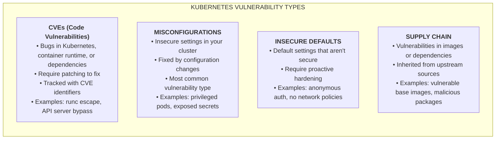
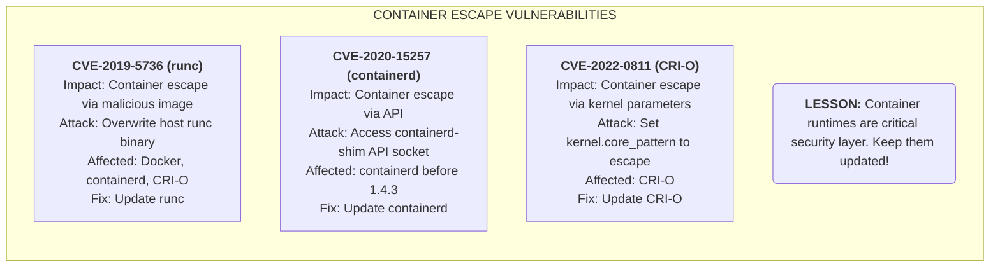
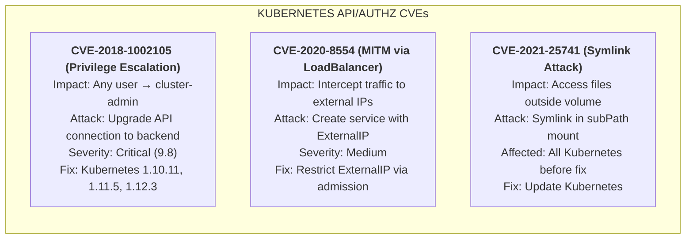
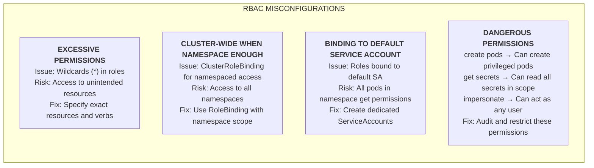
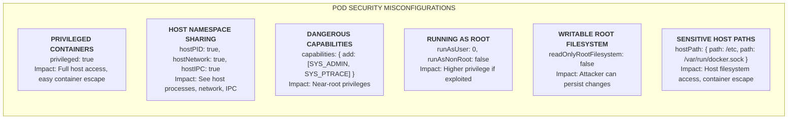
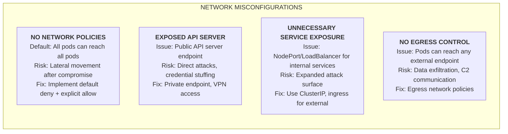
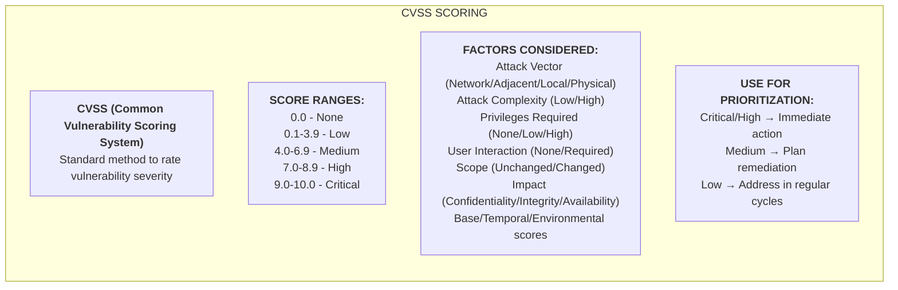
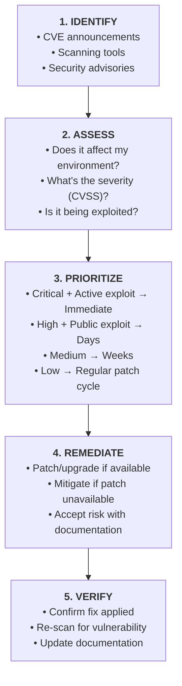

# Module 4.2: Common Vulnerabilities

**Complexity**: `[MEDIUM]` threat awareness and prioritization. **Time to Complete**: 25-30 minutes. **Prerequisites**: [Module 4.1: Attack Surfaces](../module-4.1-attack-surfaces/). This module assumes Kubernetes 1.35 or newer, and command examples use the `alias k=kubectl` shorthand after naming `kubectl` once.

## What You'll Be Able to Do

After completing this module, you will be able to perform these tasks in a real triage conversation, where the hard part is connecting technical evidence to a defensible remediation decision.

1. **Diagnose** Kubernetes vulnerability categories, including CVEs, misconfigurations, insecure defaults, and supply-chain exposure.
2. **Assess** severity and exploitability by combining CVSS, runtime reachability, exposed attack surfaces, and business context.
3. **Prioritize** remediation across runtime CVEs, RBAC mistakes, pod security gaps, network exposure, and vulnerable images.
4. **Implement** a repeatable vulnerability response workflow that scans, mitigates, verifies, and documents security decisions.

## Why This Module Matters

In December 2018, Kubernetes disclosed CVE-2018-1002105, a critical API server vulnerability that could let any authenticated user escalate privileges through an upgraded connection to a backend API server. The frightening part was not only the CVSS 9.8 score; it was the operational shape of the bug. A user who already had ordinary credentials could potentially cross the control-plane boundary, act as cluster-admin, and leave very little evidence in older audit configurations, so the incident forced platform teams to treat patching as a control-plane emergency rather than a routine maintenance ticket.

Real incidents rarely arrive as neat textbook categories. A security dashboard might show a critical runtime CVE, a high-severity application dependency issue, dozens of medium image findings, a namespace full of privileged pods, and a cluster with no default-deny network policy. Leaders may ask for everything to be fixed immediately, while application teams worry about downtime, regressions, and missed release windows. The KCSA skill is not memorizing every CVE identifier; it is learning how to separate urgent exploit paths from noisy findings and then explain the tradeoff in terms an operations team can act on.

This module teaches a practical vulnerability model for Kubernetes. You will compare code flaws with configuration flaws, connect CVSS scoring to actual cluster exposure, and practice building a response plan that does not confuse scanning volume with risk reduction. Keep one question in mind as you read: if an attacker compromised one workload today, which vulnerability would most help them reach the node, the API server, or another tenant?

## Vulnerability Categories

Kubernetes vulnerability management starts by separating where the weakness lives. A CVE in `runc`, `containerd`, the API server, or a language library is a code vulnerability because the defective behavior is inside software that must be patched or replaced. A pod running as privileged, a RoleBinding attached to the default ServiceAccount, or an unrestricted LoadBalancer service is a configuration vulnerability because the dangerous behavior comes from how the platform was assembled. Both categories can lead to the same outcome, but they move through different ownership paths, release calendars, and verification methods.



The distinction matters because the mitigation clock is different for each category. A runtime CVE may require node image updates, coordinated draining, and validation that every node is running the fixed package; the application owner cannot solve it by editing a Deployment manifest. A misconfiguration may be remediated immediately with a namespace label, RBAC binding change, admission rule, or NetworkPolicy, but it can also break workloads that depended on the insecure behavior. Supply-chain exposure sits between those worlds because it may require rebuilding images, changing base images, pinning dependencies, and proving that a vulnerable package is no longer reachable.

Pause and predict: if a scanner finds a vulnerable package inside a container image and a separate audit finds `hostPath` mounts to `/var/run`, which issue is more likely to become a node compromise after an application remote-code-execution bug? The answer depends on exploitability, but the `hostPath` finding deserves special attention because it can turn an ordinary application foothold into direct host interaction. KCSA questions often test this reasoning pattern rather than asking you to remember the exact syntax of a scanner.

A useful mental model is to ask what has to change for the vulnerability to disappear. If the answer is "install a fixed package or upgrade a component," you are probably dealing with a CVE or dependency issue. If the answer is "stop granting this permission, reject this manifest, or restrict this network path," you are probably dealing with a configuration issue. If the answer is "stop inheriting unnecessary software from upstream," the finding belongs to supply-chain management, even when the scanner reports it with a CVE identifier.

That model also clarifies evidence. For code vulnerabilities, you need version evidence, image digests, package lists, or advisory references that prove the defective code is gone. For configuration vulnerabilities, you need cluster-state evidence such as policy labels, rejected manifests, RBAC answers, or observed traffic controls. For insecure defaults, you need both the changed setting and a guardrail that prevents teams from drifting back to the default during future deployments.

The categories also help you choose who should be in the room. Runtime and node CVEs need platform operations because node replacement, kubelet settings, and maintenance windows are involved. Application dependency CVEs need service owners because they know how the package is used and how quickly a rebuild can be tested. RBAC, admission, and network misconfigurations usually need both platform and application input because the platform owns guardrails while the application team owns legitimate access requirements. Good triage is partly technical classification and partly routing the work to the people who can actually change the risk.

### Notable Kubernetes CVEs

Container escape CVEs are memorable because they violate a basic mental model: a container should not become the host. The following examples affected different layers of the container stack, but each teaches the same lesson. Kubernetes schedules workloads, yet container isolation also depends on lower-level runtime components that Kubernetes does not magically repair when only the control plane is upgraded.



The operational trap is patching the wrong layer. If CVE-2019-5736 is present because the node image contains a vulnerable `runc`, upgrading the Kubernetes API server alone does not remove the vulnerable binary from worker nodes. The fix path usually involves updating the runtime package or managed node image, draining nodes safely, replacing them, and then confirming the fixed runtime version. Before running remediation in a real cluster, ask what output you expect from `k get nodes -o wide` before and after the rollout: you should see nodes recycle or report the new image version, not merely a healthy control-plane version.

Container runtime findings are especially sensitive in shared clusters because the vulnerable layer is below tenant boundaries. A low-privilege workload in one namespace may run on the same node as a sensitive workload in another namespace, and the runtime is part of the isolation story for both. If an exploit gives access to the host, namespace-level RBAC and NetworkPolicy may no longer be enough because the attacker can interact with kubelet credentials, host files, or other workloads on that node. This is why runtime updates usually belong to a platform patch lane with rehearsed node replacement, not to an application team backlog.

Managed Kubernetes does not remove this responsibility; it changes the interface. Some providers patch control planes automatically but require customers to upgrade node pools, replace machine images, or roll managed node groups. Other providers expose node image versions, security bulletins, and upgrade channels. A good vulnerability response asks which part of the stack the provider owns, which part the customer owns, and what evidence proves the provider-managed fix has actually reached the cluster.

Kubernetes core CVEs are different because they often involve authentication, authorization, admission, or storage behaviors inside the platform itself. These issues are dangerous because the API server is the trust broker for the entire cluster. When a control-plane bug undermines authorization, even a well-hardened workload security context may not protect the cluster from a user or service account that can reach the vulnerable path.



Notice how the mitigation language changes across these examples. CVE-2018-1002105 requires patching Kubernetes because the vulnerable behavior is in the API server request path. CVE-2020-8554 is commonly mitigated with admission control and policy that restricts who may use external IP behavior, because the dangerous capability depends on service configuration. CVE-2021-25741 requires a Kubernetes fix, but it also reminds you to scrutinize workloads that use `subPath` mounts, symlinks, and filesystem tricks because a storage convenience can become a boundary bypass.

Control-plane CVEs require extra care because short-term mitigation may be possible but incomplete. Restricting API server reachability through private endpoints, VPN access, or bastion hosts can reduce who can attempt exploitation, but it does not repair a vulnerable authorization path for users who still authenticate. Tightening RBAC may reduce the number of accounts that can reach the vulnerable behavior, but it may not protect against a vulnerability that affects any authenticated subject. Treat mitigation as a risk reducer while the upgrade is prepared, not as a substitute for the fixed release.

Audit logging changes the response posture for these issues. If a vulnerability involves API server behavior, the team should ask whether audit logs capture the relevant verbs, resources, users, and response codes. In older or underconfigured clusters, the absence of evidence is not proof that exploitation did not occur. For KCSA reasoning, the important point is that prevention, detection, and patching all matter, but patching removes the defective path while detection only helps you investigate it.

Control-plane upgrades should be planned with compatibility in mind, but compatibility cannot become a permanent reason to run a vulnerable release. Review deprecated APIs, admission webhooks, controllers, and client libraries before the upgrade window so the security fix is not blocked by surprises that could have been found earlier. For managed clusters, confirm the provider’s supported skew between control plane, kubelet, and client versions. For self-managed clusters, rehearse etcd backup, rollback expectations, and post-upgrade health checks before an emergency forces the team to improvise.

### Common Misconfigurations

Misconfigurations dominate Kubernetes risk because they are easy to create during normal delivery work. A developer asks for "just enough access to debug production," a platform team grants a wildcard Role to unblock an incident, and months later that temporary permission is still bound to a ServiceAccount used by many pods. The cluster did exactly what it was configured to do, which is why scanners often report configuration findings as vulnerabilities even when no CVE is involved.



RBAC mistakes are especially serious because Kubernetes permissions compose in surprising ways. A subject that can create pods in a namespace may be able to mount ServiceAccount tokens, select images, request host access if admission allows it, or run a workload that reads secrets mounted into that namespace. A subject that can `get secrets` can often become any workload identity in scope because ServiceAccount tokens and credentials are secrets. When reviewing RBAC, do not only ask whether a verb sounds administrative; ask what an attacker could build by combining that verb with pod creation, secret access, impersonation, and namespace reachability.

The most reliable RBAC review starts from subjects, not from roles. List users, groups, and ServiceAccounts that exist in a namespace, then ask what each can do if its credential is stolen. This keeps the review grounded in attacker movement rather than in abstract YAML. A wildcard rule may look convenient, but its real meaning is future permission inheritance: when the API gains new resources or when operators install custom resources, the wildcard may automatically include capabilities nobody reviewed.

Default ServiceAccounts deserve special scrutiny because they are easy to forget. If a namespace has a powerful RoleBinding to the default ServiceAccount, every pod that does not specify a dedicated identity may inherit that power. Even when BoundServiceAccountTokenVolume and token expiration reduce some historical risk, a compromised pod can still use the mounted token while it is valid. Least privilege means workloads should have identities that match their actual API needs, and many workloads should not need an API token at all.

Impersonation permissions deserve the same attention as direct permissions. A user who cannot delete secrets directly may still become dangerous if they can impersonate a ServiceAccount or group that has broader access. Aggregated ClusterRoles can also surprise teams because labels may cause permissions to flow into standard roles. During review, follow the chain from subject to binding to role to effective permission, and then test the result with `k auth can-i` using the exact user or ServiceAccount that would exist during an attack.



Pod security weaknesses are dangerous because they reduce the distance between application compromise and node compromise. Running as root inside a container is not automatically the same as root on the host, but it raises the impact of a kernel bug, unsafe mount, writable filesystem, or runtime escape. Privileged mode, host namespaces, and broad Linux capabilities remove layers that were supposed to make exploitation harder. A good review asks whether the workload truly needs each exception, whether the exception is isolated to a dedicated namespace, and whether admission control prevents the same exception from spreading silently.

Pod Security Standards provide a shared vocabulary for these choices. The Restricted profile aims to remove the risky defaults most application workloads do not need, while Baseline permits a broader but still controlled set of settings. Privileged workloads may be legitimate for node agents, storage drivers, or networking components, but they should be rare, named, and isolated. The common mistake is treating the exception profile as a namespace convenience rather than as a documented security boundary decision.

Security context fields also interact with image design. A container that needs to write into its root filesystem, run as UID 0, and install packages at startup is harder to lock down than an image built to run as a non-root user with writable application directories explicitly mounted. This is one reason vulnerability management starts before deployment manifests. Build practices, image contents, file ownership, and runtime security controls either reinforce each other or force operators into repeated exceptions.

HostPath deserves a separate warning because it looks like a convenient file-sharing tool and behaves like a hole through the container boundary. Mounting a narrow directory may be defensible for a node agent that reads logs or exposes device files, but mounting sensitive paths such as `/etc`, container runtime sockets, or broad host directories gives an attacker powerful primitives after workload compromise. If a workload needs host access, the review should ask why a Kubernetes-native API, CSI driver, projected volume, or purpose-built DaemonSet cannot provide a safer interface.



Network misconfigurations shape what happens after the first workload is compromised. Without NetworkPolicy enforcement, a pod that should only talk to one backend may scan peer services, reach databases, call internal admin endpoints, or exfiltrate data directly to the internet. API server exposure has a different profile because attackers do not need to compromise a pod first; they can attack authentication, stolen credentials, or vulnerable API paths from outside the cluster. Which approach would you choose for a regulated production namespace and why: a broad allow-all policy with service-level authentication, or a default deny policy with explicit ingress and egress? The safer answer usually starts with network denial and then documents required flows, because it makes unexpected communication visible during review.

NetworkPolicy is also a dependency on the cluster networking implementation. Kubernetes stores the policy objects, but enforcement comes from a network plugin that supports them. A team can create beautiful policy manifests and still have no traffic reduction if the CNI does not implement policy or if egress behavior is outside the plugin’s configured scope. Verification must therefore include a functional test or provider guarantee, not merely the existence of YAML in Git.

Exposure reviews should include Service types as well as policy objects. A `ClusterIP` service is reachable inside the cluster, a `NodePort` opens a port on nodes, and a `LoadBalancer` may create external infrastructure. Ingress controllers, gateways, and service meshes add more paths that can accidentally expose admin or metrics endpoints. When triaging a vulnerability, ask whether the affected workload is internet-facing, cluster-internal, node-local, or unreachable without another foothold; that answer often changes remediation urgency.

Egress control is often the missing half of containment. Ingress rules can protect a vulnerable service from unwanted callers, but egress rules limit where a compromised pod can send data or retrieve tools. Many attacks need outbound access for command-and-control, payload download, credential exfiltration, or cloud metadata access. A practical policy program starts with sensitive namespaces, allows known dependencies, and uses logging or flow data to discover legitimate traffic before enforcing strict egress broadly.

### Vulnerability Scoring and Context

CVSS is a useful severity language, not an automatic scheduling system. The base score captures intrinsic characteristics such as attack vector, privileges required, user interaction, scope, and impact, which helps teams compare findings from different vendors. Kubernetes operators still need environmental context because a critical CVE in an unused library is not the same operational risk as a high-severity runtime escape on every node. The right question is not "what is the score?" but "what can an attacker actually reach, with what privileges, in this cluster?"



Consider an image scan that reports 150 CVEs: two Critical, eight High, dozens of Medium findings, and many Low findings in unused packages. Management may demand that all findings disappear before deployment, but that can push teams into unhelpful theater such as rebuilding repeatedly without changing exposure. A better response groups findings by exploit path: internet-facing remote-code-execution issues, vulnerabilities in packages actually loaded by the process, runtime or kernel escape issues, and unreachable packages inherited from a bloated base image. The last group still matters, but it is usually handled by base-image reduction and scheduled rebuilds rather than by blocking every release.

Environmental scoring is where Kubernetes context becomes visible. A network attack vector matters more when the service is reachable from the internet or from many untrusted tenants. Privileges required matter differently if every pod gets an overpowered token by default. User interaction may sound irrelevant for server workloads until you remember that CI systems, admission webhooks, image registries, and operators may process attacker-controlled artifacts. CVSS gives you the grammar, but the cluster architecture gives you the sentence.

Exploit maturity should influence timing without becoming panic. A critical CVE with public exploit code and active exploitation belongs in an emergency path because the attacker’s cost is low. A high CVE with no known exploit may still be urgent if the component is exposed and business impact is severe. A medium CVE in an internal-only dependency may be scheduled if compensating controls exist. The decision should be recorded in enough detail that a later reviewer can see why the team chose the timeline.

Business context is not an excuse to downgrade security; it is how you describe impact accurately. A vulnerable batch job in a development namespace with synthetic data is different from the same vulnerability in a payment service that processes customer records. A compromised observability component may be more serious than its data classification suggests because it can see logs, tokens, and traffic from many teams. When you assess a finding, include the technical exploit path and the business asset it threatens so the priority is understandable outside the security team.

### Vulnerability Discovery

Discovery has to cover images, cluster configuration, admission posture, and runtime behavior because no single tool sees the whole platform. Image scanners such as Trivy and Grype inspect packages, operating-system layers, and language dependencies. Configuration tools such as kube-bench compare control-plane and node settings against benchmark recommendations. Runtime tools such as Falco look for suspicious behavior after workloads start, while policy engines such as OPA Gatekeeper or admission policies prevent known-bad manifests from being accepted in the first place.

| Tool | Purpose |
|------|---------|
| **Trivy** | Container image scanning |
| **Grype** | Container image scanning |
| **kube-bench** | CIS benchmark checks |
| **kubeaudit** | Security auditing |
| **Falco** | Runtime threat detection |
| **Polaris** | Best practice validation |
| **OPA/Gatekeeper** | Policy enforcement |

The table is intentionally mixed because vulnerability work crosses team boundaries. A platform security team may own kube-bench findings for API server flags, a developer team may own image CVEs introduced by an application dependency, and a cluster operations team may own runtime version updates. If those findings flow into one ticket queue without ownership labels, the queue becomes noise. Good programs attach each finding to a component owner, a remediation action, an acceptance rule, and a verification command that proves the finding changed state.

Scanning frequency should match change frequency. Images should be scanned when built, when admitted to environments, and when new vulnerability intelligence changes the status of an existing digest. Cluster configuration should be checked after upgrades, node pool changes, policy updates, and provider configuration changes. Runtime detection should run continuously because it observes behavior that static scanners cannot see, such as unexpected shell execution or writes to sensitive paths. The scan schedule is part of the control, not an administrative afterthought.

False positives and false negatives both require discipline. A false positive should be documented with evidence, such as package reachability analysis or provider-managed responsibility, so the same debate does not happen every day. A false negative should be investigated when an incident, advisory, or manual review finds exposure the tooling missed. Mature teams tune scanners, but they do not silence categories just because the dashboard is uncomfortable. The goal is signal that leads to action, not a perfect-looking report.

```text
[INFO] 1 Control Plane Security Configuration
[PASS] 1.1.1 Ensure API server pod file permissions (score)
[FAIL] 1.1.2 Ensure API server pod file ownership (score)
[WARN] 1.2.1 Ensure anonymous-auth is not disabled (info)
...

== Summary ==
45 checks PASS
10 checks FAIL
5 checks WARN
```

The sample kube-bench output shows why raw counts can mislead. A file permission failure may be low operational risk if a managed control plane owns the filesystem and prevents direct host access, while anonymous authentication on a self-managed API server may be urgent because it changes who can reach unauthenticated endpoints. Before fixing everything in one maintenance window, review what each control protects, whether the cluster provider manages it, and whether changing it can break existing clients. A staged plan with audit logging first often reduces both security risk and outage risk.

Benchmark findings should be mapped to the deployment model. A self-managed cluster on virtual machines exposes different responsibilities from a managed control plane where API server flags are not customer-editable. If a benchmark expects direct file ownership checks on control-plane nodes that you cannot access, the finding may become a provider attestation requirement rather than a local command. The security question remains valid, but the evidence format changes from host inspection to provider documentation, configuration settings, or support commitments.

Admission and scanner results should feed each other. If scanners repeatedly find privileged pods, missing resource boundaries, mutable image tags, or default ServiceAccount token use, those findings are candidates for admission policy because the organization has already decided they are unacceptable. If admission policy repeatedly blocks legitimate workloads, the rule may need a clearer exception path or better templates. This feedback loop turns vulnerability discovery into prevention instead of letting the same mistakes reappear in every release.

### Vulnerability Response

Response is a loop, not a heroic one-time patch. You identify findings through advisories, scanners, audits, or incident reports; assess whether the affected component exists and is reachable; prioritize based on exploitability and impact; remediate through patching or configuration; and verify that the cluster state changed. The loop also creates evidence for future reviews, because a documented accepted risk is different from a forgotten scanner finding that nobody owns.



Verification should be concrete enough that another engineer can repeat it. For a runtime CVE, verification may include node image versions, package versions, drained-and-replaced node counts, and a clean scanner result. For RBAC, verification may include `k auth can-i` checks against the affected ServiceAccount and namespace. For pod security, verification may include namespace labels, admission rejection tests, and a search for remaining privileged workloads. The habit is simple: every remediation ticket should end with proof, not just a comment that the team believes the issue is fixed.

Mitigation is not the same as remediation, and the difference matters during incident pressure. A mitigation reduces the likelihood or impact while the defect remains, such as restricting API access, blocking a dangerous Service type, or isolating an exposed namespace. Remediation removes the defect or misconfiguration, such as upgrading the fixed component, rebuilding the image, or deleting the overbroad binding. A response plan should name both when both are needed, because stakeholders may accept a short mitigation only if they can see the durable fix is scheduled.

Communication is part of vulnerability handling because priorities compete with reliability work. A useful update says what was found, whether the environment is affected, what an attacker could gain, what mitigation is already in place, what action is next, and what evidence will close the ticket. Avoid saying "critical scanner finding" as the whole explanation. The better message is "affected runtime exists on worker nodes that run production workloads, a container escape would give host access, node replacement begins tonight, and verification will attach fixed runtime versions."

The response loop should also include exception management. Some findings cannot be fixed immediately because a vendor patch is unavailable, a legacy workload needs redesign, or an upgrade requires business testing. In those cases, the team should document the owner, compensating controls, expiry date, and review trigger. An accepted risk without an expiry date is usually deferred work in disguise, and deferred security work tends to become invisible until the next audit or incident.

Verification should be proportional to the risk of the finding. A low-severity unused package may only need a clean image scan after the next rebuild, while a runtime escape should require node-level evidence, workload rescheduling evidence, and possibly a second independent scan. A cluster-wide RBAC fix should include negative tests that prove the dangerous action is denied, not just a manifest diff that appears narrower. The more severe the blast radius, the more the closure evidence should prove the attacker path is gone.

## Patterns & Anti-Patterns

Effective vulnerability programs turn recurring decisions into patterns. The goal is not to create bureaucracy; it is to stop every finding from becoming a unique argument between security, platform, and application teams. When the decision rules are visible, teams can move faster because they know which findings block deployment, which require emergency maintenance, and which can be accepted with compensating controls while a safer rollout is prepared.

| Pattern | When to Use It | Why It Works | Scaling Consideration |
|---------|----------------|--------------|-----------------------|
| Risk-based triage | Scanner volume exceeds team capacity | Combines CVSS with reachability and component ownership | Requires a written SLA so teams do not re-litigate every finding |
| Default-deny plus explicit allow | Production namespaces with sensitive data or shared tenancy | Limits lateral movement after one pod is compromised | Needs service ownership data and observability for blocked traffic |
| Dedicated workload identities | Any workload that talks to the API server or cloud services | Prevents default ServiceAccount sprawl and narrows blast radius | Requires templates so teams do not hand-write every account and binding |
| Patch lanes for platform components | Runtime, node image, API server, and CNI vulnerabilities | Keeps infrastructure fixes separate from application release calendars | Needs rehearsed node replacement and rollback procedures |

Anti-patterns usually come from pressure, not ignorance. A team grants cluster-admin because debugging is urgent, leaves privileged mode enabled because a legacy agent needs it, or ignores medium findings because the dashboard is already full. These choices may be understandable during an incident, but they become vulnerabilities when nobody records the exception, sets an expiry date, or verifies that a safer replacement exists.

One strong pattern is to define vulnerability service-level objectives by category rather than by scanner score alone. For example, actively exploited runtime escapes, internet-facing remote-code-execution issues, and control-plane privilege-escalation flaws can share an emergency lane, while non-reachable dependency findings can follow a scheduled rebuild lane. The details vary by organization, but the principle is stable: remediation timelines should reflect attacker opportunity and impact, not only a colored severity badge.

Another strong pattern is policy-as-code at admission time. If the organization has decided that production namespaces must reject privileged pods, host networking, default ServiceAccount tokens, or mutable image tags, then the cluster should enforce that decision before deployment rather than asking reviewers to catch it manually. Admission policy does not replace education, because teams still need to understand why a manifest is rejected, but it turns known mistakes into fast feedback instead of late audit findings.

A third pattern is to keep a vulnerability inventory that tracks running artifacts, not only repositories. Source repositories tell you what teams intend to build, but clusters run image digests, node images, Helm releases, controllers, CRDs, and provider-managed components. During an advisory, the fastest teams can answer whether the affected component is deployed, where it runs, who owns it, and what version is active. That inventory reduces the time between public disclosure and environment-specific assessment.

| Anti-Pattern | What Goes Wrong | Better Alternative |
|--------------|-----------------|--------------------|
| Treating scanner counts as risk | Teams chase low-impact package noise while reachable exploit paths remain open | Rank by exploitability, exposure, privilege gain, and asset sensitivity |
| Patching Kubernetes but not nodes | Runtime CVEs remain present because the vulnerable binary lives on workers | Track API server, kubelet, runtime, OS image, and CNI versions separately |
| Binding powerful roles to default ServiceAccounts | Every pod in a namespace inherits broad API access | Create dedicated ServiceAccounts and bind only required verbs in namespace scope |
| Allowing permanent privileged exceptions | Temporary compatibility workarounds become normal deployment posture | Use namespace isolation, admission exemptions with expiry, and replacement plans |

## Decision Framework

When a finding arrives, start by placing it on two axes: exploitability and blast radius. Exploitability asks whether an attacker can reach the vulnerable component with the privileges required for exploitation. Blast radius asks what the attacker gains after success: a single process, a namespace, node root, cluster-admin, or access to sensitive data. A medium finding with cluster-wide blast radius can outrank a high finding in an unreachable library, and a high runtime escape can outrank many image findings because it changes the boundary between container and host.

| Finding Type | First Question | Immediate Mitigation | Durable Fix |
|--------------|----------------|----------------------|-------------|
| Runtime or node CVE | Are affected nodes running exploitable workloads? | Cordon high-risk nodes or restrict risky workloads | Update runtime or replace node images |
| Kubernetes control-plane CVE | Can authenticated or external users reach the vulnerable path? | Restrict API access and monitor audit logs | Upgrade Kubernetes to a fixed release |
| Application image CVE | Is the vulnerable package loaded or reachable? | Block exposed workloads or reduce ingress | Rebuild with patched dependency or smaller base image |
| RBAC misconfiguration | What can this subject do if its token is stolen? | Remove dangerous verbs or bindings | Redesign least-privilege roles and ownership |
| Pod security gap | Does the workload need host access or privilege? | Isolate namespace and add admission guardrails | Remove privilege, capabilities, host namespaces, or unsafe mounts |
| Network exposure | Can a compromised pod move laterally or exfiltrate? | Add default-deny and critical allow rules | Maintain service-specific policies with tests |

Use a simple response sequence when decisions are contested. First, confirm whether the affected component exists in the environment and whether the scanner matched the correct version. Second, decide whether the vulnerable behavior is reachable from an attacker-controlled path. Third, identify the highest privilege or data access the attacker can gain. Fourth, choose the smallest mitigation that reduces risk while the durable fix is tested. This sequence keeps the team from arguing about severity labels alone.

For code CVEs, the decision often hinges on reachability and update mechanics. If the affected package is in a running process that accepts untrusted input, the finding moves toward the emergency lane. If the package is present but unused, the team may accept short-term risk while rebuilding the image from a smaller base. If the component is the container runtime or kubelet, the team should think in node pools and maintenance windows, because the fix may require replacing infrastructure rather than redeploying an application.

For configuration vulnerabilities, the decision often hinges on blast radius and compatibility. Removing a wildcard Role may be straightforward if audit logs show the verbs are unused, but it may require a staged rollout if controllers depend on broad access. Enforcing Restricted Pod Security may be safe for new namespaces while legacy namespaces need migration plans. Adding egress policy may require observability first so the team does not block legitimate dependencies blindly. Good configuration remediation narrows privilege while preserving the ability to debug failures.

For supply-chain exposure, the decision often hinges on provenance and rebuild control. An image from a trusted internal pipeline with a known digest, signed metadata, and a current base image is easier to assess than a mutable tag pulled from a public registry. A dependency pinned through a lockfile is easier to reproduce than a package installed dynamically at container startup. The framework should reward teams that make artifacts explainable, because explainable artifacts are easier to patch under pressure.

When two findings look equal, prefer the fix that collapses the most attacker paths. Removing privileged mode from a widely used deployment may reduce the impact of several future application bugs, while updating one unused package may only improve a scanner score. Conversely, patching a runtime escape may protect every namespace on affected nodes, which can outrank many local application fixes. This is why blast-radius reduction is a practical prioritization tool rather than a theoretical exercise.

The framework should end with an explicit decision statement. A strong statement names the finding, category, affected scope, exploit path, chosen priority, immediate mitigation, durable fix, owner, and verification evidence. That may sound formal, but it prevents ambiguity when several teams are involved. It also gives reviewers a compact record that proves the team considered both scanner severity and Kubernetes-specific context before choosing the remediation path.

## Did You Know?

- **CVE-2018-1002105 carried a CVSS 9.8 score** because an authenticated user could potentially escalate through the API server connection upgrade path, making it one of the most serious Kubernetes authorization incidents.

- **A container image can report 100+ vulnerabilities even when the application uses only a fraction of the installed packages**, which is why minimal images and reachability analysis matter as much as raw scanner totals.

- **Distroless and scratch-style images often reduce reported CVE volume by 50-90%** because they remove shells, package managers, and unused operating-system packages that attackers commonly abuse after gaining execution.

- **NetworkPolicy is not enforced by Kubernetes alone**; it requires a network plugin that implements policy, so a manifest can exist without actually reducing traffic if the cluster networking layer does not support it.

## Common Mistakes

| Mistake | Why It Happens | How to Fix It |
|---------|----------------|---------------|
| Ignoring critical runtime CVEs | Teams assume a Kubernetes version upgrade also patches node runtime packages | Track runtime versions separately and replace or update affected nodes |
| Scanning but not assigning owners | Findings land in a shared dashboard where nobody has remediation authority | Add owner, component, due date, and verification evidence to every finding |
| Treating all high CVEs equally | CVSS is used without checking whether the vulnerable code is reachable | Combine CVSS with exposure, loaded package status, and compensating controls |
| Only scanning container images | Image tools miss RBAC, pod security, API server, and network misconfigurations | Pair image scanning with kube-bench, admission policy, and runtime detection |
| Granting cluster-wide RBAC for namespace work | ClusterRoleBinding feels faster during debugging or incident response | Use RoleBinding for namespace scope and expire temporary elevated access |
| Leaving privileged pods unreviewed | Legacy agents or storage components are copied into new namespaces without context | Require documented justification, namespace isolation, and admission exemptions with expiry |
| Patching without staged verification | Security urgency overrides rollout discipline and breaks workloads unexpectedly | Test in staging, drain nodes gradually, and define rollback plus proof commands |
| Ignoring egress paths | Teams focus on ingress because it is customer-facing and easier to inventory | Add egress policy for sensitive namespaces and monitor unexpected outbound traffic |

## Quiz

<details><summary>Your scan reports CVE-2019-5736 in `runc`, a high-severity Log4Shell finding in one image, and several namespaces with no NetworkPolicy. As you diagnose Kubernetes vulnerability categories, which issue should you investigate first, and what evidence would change your priority?</summary>
Investigate the `runc` finding first because a runtime escape can affect every workload on vulnerable nodes and crosses the container-to-host boundary. The first evidence to collect is whether the affected runtime version is actually present on worker nodes and whether those nodes run untrusted or internet-facing workloads. The Log4Shell issue may become the top priority if the vulnerable application is internet-exposed and the runtime finding is a false positive or already patched. The missing NetworkPolicy remains important because it worsens blast radius after compromise, but it is usually a containment gap rather than the first exploit step.</details>

<details><summary>A team says a critical OpenSSL CVE in a container image should block deployment, but the Go application does not link to OpenSSL and the package comes from the base image. How do you assess the finding?</summary>
Start by separating severity from reachability. The CVSS score describes the library vulnerability, but the deployment decision depends on whether the vulnerable library is loaded, called, or usable by an attacker who gains code execution. You should not ignore it, because unused packages increase post-compromise tooling and may become reachable later. A balanced answer is to permit deployment only if exposure is low and policy allows it, then rebuild with a smaller or patched base image within the agreed SLA.</details>

<details><summary>Your kube-bench report shows failed file permissions, anonymous authentication warnings, and missing audit configuration. A colleague wants to change every setting in one weekend. What staged plan is safer?</summary>
Begin with controls that improve visibility and carry low breakage risk, such as enabling or improving audit logging where the platform supports it. Then fix file permissions or managed-node settings that can be validated without changing authentication behavior. Authentication changes should be staged after reviewing audit logs for clients that rely on anonymous access, because disabling it blindly may break health checks or integrations. The security goal is still remediation, but staged changes preserve troubleshooting clarity.</details>

<details><summary>A developer has `create pods` in a production namespace but no explicit permission to read secrets. Why might that still be dangerous?</summary>
Creating pods can become a path to other permissions because the developer may be able to schedule a pod that uses a powerful ServiceAccount already present in the namespace. If admission allows privileged settings or host mounts, pod creation may also create a path toward node-level access. Even without direct `get secrets`, the pod can receive mounted tokens or interact with services reachable from the namespace. Least-privilege reviews must evaluate what a subject can cause Kubernetes to create, not only what it can read directly.</details>

<details><summary>A production namespace runs with no NetworkPolicy, and one workload has a remote-code-execution bug. What risk does the missing policy add after the first exploit?</summary>
The missing policy allows lateral movement because the compromised pod can attempt to reach peer services, databases, internal admin endpoints, and possibly the API server depending on routing and credentials. The remote-code-execution bug is the entry point, while the network gap expands the attacker’s options after entry. Default-deny policy would not fix the application bug, but it could reduce the blast radius by allowing only expected flows. That is why containment controls are prioritized alongside direct vulnerability fixes.</details>

<details><summary>An admission policy blocks privileged pods, but a storage driver needs one privileged DaemonSet. How should the platform team handle the exception without weakening the whole cluster?</summary>
The team should isolate the driver in a dedicated namespace, document why the privilege is required, and scope any admission exemption only to the exact namespace, ServiceAccount, or workload identity. The exception should have an owner and review date so it does not become a reusable loophole for unrelated workloads. Additional controls such as node selectors, taints, runtime monitoring, and restricted RBAC reduce the blast radius. The important reasoning is that exceptions can be safe only when they are narrow, visible, and actively maintained.</details>

<details><summary>Your team fixed a vulnerable base image and updated RBAC bindings. What verification evidence should be attached to the remediation ticket?</summary>
For the image fix, attach the new image digest, the scanner result showing the vulnerable package is removed or patched, and the rollout status proving workloads now run the new image. For RBAC, attach `k auth can-i` checks for the affected ServiceAccount and namespace, plus a diff or manifest reference showing the removed binding. Evidence should be repeatable by another engineer and tied to the original finding. A ticket that only says "fixed" does not prove that cluster state changed.</details>

## Hands-On Exercise: Vulnerability Assessment

This exercise asks you to act like the engineer on triage duty rather than like a scanner. You receive a mixed report containing runtime CVEs, workload misconfigurations, image vulnerabilities, and hygiene findings. Your job is to rank the findings, write a short rationale for the first three, and define verification evidence for each remediation so the work can be reviewed later.

```text
CRITICAL: CVE-2019-5736 in runc (container escape)
HIGH:     Privileged containers in production namespace
HIGH:     CVE-2021-44228 (Log4Shell) in app image
MEDIUM:   No network policies defined
MEDIUM:   Default ServiceAccount token mounted
LOW:      Container image using :latest tag
LOW:      CVE-2020-0000 in unused library
```

Use the `k` alias when you sketch verification commands, and assume the cluster is Kubernetes 1.35 or newer. You do not need a live cluster to complete the reasoning exercise, but your answers should be operational enough that a teammate could translate them into tickets. The value is in explaining why one finding outranks another, not in claiming that every issue can be fixed instantly.

When you write the ranking, include the category next to each item: runtime CVE, application CVE, pod security misconfiguration, network misconfiguration, ServiceAccount default, image hygiene, or low-reachability dependency finding. That small label prevents a common triage mistake where every item is treated as an identical scanner output. It also makes the stakeholder update stronger because you can explain that the plan covers both direct exploit paths and containment weaknesses.

- [ ] Rank the seven findings from highest to lowest priority, using exploitability and blast radius as the main criteria.
- [ ] For the top three findings, write the owner you would assign: platform runtime, application team, namespace owner, or security platform.
- [ ] For each top finding, define one immediate mitigation and one durable fix.
- [ ] Add one verification command or evidence artifact for each top finding, such as a scanner result, node runtime version, `k auth can-i` check, or admission rejection test.
- [ ] Identify one finding that should not block deployment immediately and justify the acceptance condition.
- [ ] Write a short stakeholder update that explains the plan without using scanner jargon as the only rationale.

<details><summary>Suggested prioritization and rationale</summary>
Rank CVE-2019-5736 first if vulnerable `runc` is present on worker nodes because it is a container escape that can affect many workloads and crosses into host compromise. Rank Log4Shell next if the affected application is exposed or receives attacker-controlled input, because remote code execution can become the initial foothold. Rank privileged production containers close behind, or ahead of Log4Shell if the vulnerable application is not reachable, because privileged mode can make any application compromise much more damaging. No NetworkPolicy and default ServiceAccount token mounting are important containment issues, while `:latest` and an unused library CVE are usually scheduled fixes unless policy or exposure changes the context.</details>

<details><summary>Example verification evidence</summary>
For the runtime CVE, collect node image or package evidence showing the fixed `runc` version and attach the rollout or replacement record for affected nodes. For Log4Shell, attach the rebuilt image digest and scanner output showing the vulnerable library version is removed or fixed, then confirm the Deployment uses the new digest. For privileged containers, attach a query result showing no unexpected privileged workloads remain in the production namespace and an admission policy test showing a new privileged pod is rejected unless it matches a documented exception. For containment gaps, attach NetworkPolicy manifests and proof that expected traffic still works while unexpected traffic is blocked.</details>

### Success Criteria

- [ ] Your top priority is justified by both exploitability and blast radius, not by severity label alone.
- [ ] At least one code vulnerability and one configuration vulnerability are represented in your top-three discussion.
- [ ] Every proposed fix includes verification evidence that another engineer could repeat.
- [ ] Your stakeholder update distinguishes immediate mitigation from durable remediation.

## Sources

- [Kubernetes: Security Overview](https://kubernetes.io/docs/concepts/security/)
- [Kubernetes: Pod Security Standards](https://kubernetes.io/docs/concepts/security/pod-security-standards/)
- [Kubernetes: RBAC Authorization](https://kubernetes.io/docs/reference/access-authn-authz/rbac/)
- [Kubernetes: Network Policies](https://kubernetes.io/docs/concepts/services-networking/network-policies/)
- [Kubernetes: Auditing](https://kubernetes.io/docs/tasks/debug/debug-cluster/audit/)
- [Kubernetes: Securing a Cluster](https://kubernetes.io/docs/tasks/administer-cluster/securing-a-cluster/)
- [Kubernetes: Admission Controllers](https://kubernetes.io/docs/reference/access-authn-authz/admission-controllers/)
- [Kubernetes: Configure Service Accounts for Pods](https://kubernetes.io/docs/tasks/configure-pod-container/configure-service-account/)
- [NVD: CVE-2018-1002105](https://nvd.nist.gov/vuln/detail/CVE-2018-1002105)
- [NVD: CVE-2019-5736](https://nvd.nist.gov/vuln/detail/CVE-2019-5736)
- [containerd Security Advisory: CVE-2020-15257](https://github.com/containerd/containerd/security/advisories/GHSA-36xw-fx78-c5r4)
- [CRI-O Security Advisory: CVE-2022-0811](https://github.com/cri-o/cri-o/security/advisories/GHSA-6x2m-w449-qwx7)
- [Kubernetes Security Announcement: CVE-2021-25741](https://groups.google.com/g/kubernetes-security-announce/c/nyfdhK24H7s)

## Next Module

[Module 4.3: Container Escape](../module-4.3-container-escape/) - Understanding and preventing container breakout scenarios, including how runtime flaws, unsafe mounts, and privileged workload settings combine into practical breakout paths.
