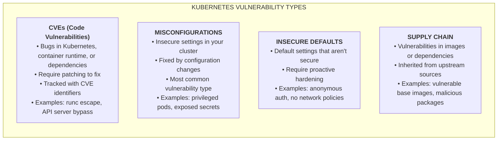
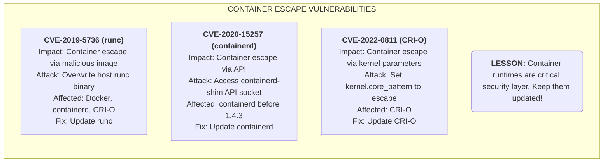
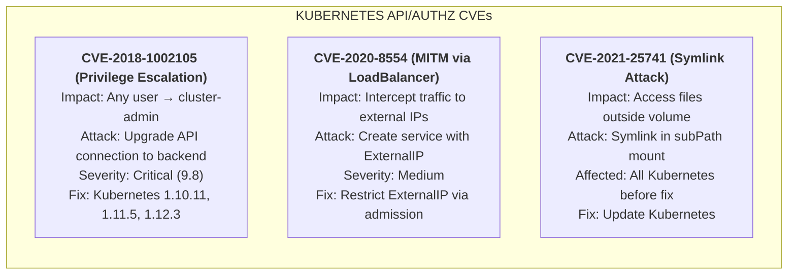
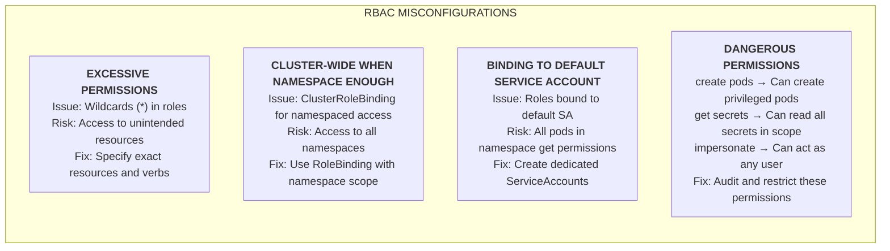
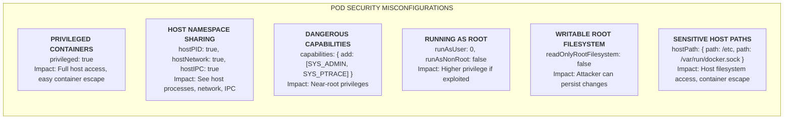
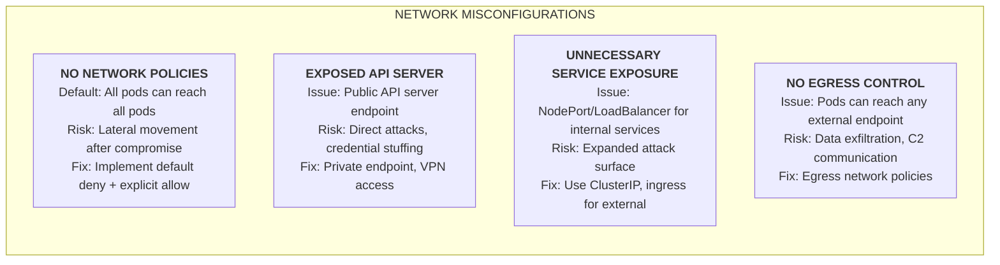
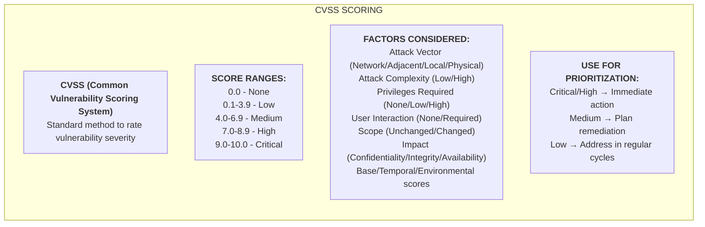
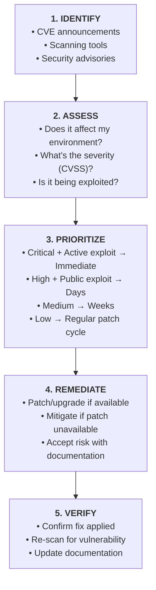

> **Complexity**: `[MEDIUM]` - Threat awareness
>
> **Time to Complete**: 25-30 minutes
>
> **Prerequisites**: [Module 4.1: Attack Surfaces](../module-4.1-attack-surfaces/)

---

## What You'll Be Able to Do

After completing this module, you will be able to:

1. **Identify** common Kubernetes vulnerability categories: CVEs, misconfigurations, and insecure defaults
2. **Assess** vulnerability severity using CVSS scores and exploitability context
3. **Evaluate** the difference between code vulnerabilities and configuration vulnerabilities
4. **Explain** mitigation strategies for the most common Kubernetes vulnerability patterns

---

## Why This Module Matters

Understanding common vulnerabilities helps you anticipate attacks and prioritize defenses. Kubernetes vulnerabilities come in two forms: code vulnerabilities (CVEs) and misconfigurations. Both can lead to cluster compromise, but misconfigurations are far more common.

KCSA tests your awareness of common vulnerability patterns and their mitigations.

---

## Vulnerability Categories



---

## Notable Kubernetes CVEs

### Container Escape CVEs



> **Stop and think**: CVE-2019-5736 affected runc — the container runtime used by Docker, containerd, and CRI-O. If your cluster uses containerd, does patching Kubernetes itself fix this vulnerability? What component actually needs updating?

### Kubernetes Core CVEs



---

## Common Misconfigurations

### RBAC Misconfigurations



### Pod Security Misconfigurations



### Network Misconfigurations



---

> **Pause and predict**: Your vulnerability scanner reports 150 CVEs in a container image: 2 Critical, 8 High, 40 Medium, 100 Low. Management wants all 150 fixed before deployment. Is this realistic, and how would you prioritize?

## Vulnerability Scoring (CVSS)



---

## Vulnerability Discovery

### Tools for Finding Vulnerabilities

| Tool | Purpose |
|------|---------|
| **Trivy** | Container image scanning |
| **Grype** | Container image scanning |
| **kube-bench** | CIS benchmark checks |
| **kubeaudit** | Security auditing |
| **Falco** | Runtime threat detection |
| **Polaris** | Best practice validation |
| **OPA/Gatekeeper** | Policy enforcement |

### Example: kube-bench Output

```
[INFO] 1 Control Plane Security Configuration
[PASS] 1.1.1 Ensure API server pod file permissions (score)
[FAIL] 1.1.2 Ensure API server pod file ownership (score)
[WARN] 1.2.1 Ensure anonymous-auth is not disabled (info)
...

== Summary ==
45 checks PASS
10 checks FAIL
5 checks WARN
```

---

## Vulnerability Response



---

## Did You Know?

- **Most breaches are from misconfigurations**, not zero-days. Fixing configs is often more impactful than chasing CVEs.

- **The average container image has 100+ vulnerabilities**. Prioritization is essential—you can't fix everything.

- **CVE-2018-1002105** was a critical Kubernetes vulnerability that allowed any authenticated user to become cluster-admin. It's why keeping Kubernetes updated matters.

- **Distroless images** have 50-90% fewer CVEs than traditional base images like Ubuntu or Alpine.

---

## Common Mistakes

| Mistake | Why It Hurts | Solution |
|---------|--------------|----------|
| Ignoring critical CVEs | Exploitation risk | Patch critical immediately |
| Scanning but not fixing | False sense of security | Track remediation |
| Only scanning images | Misses runtime issues | Add config scanning |
| No vulnerability SLA | Inconsistent response | Define response times |
| Patching without testing | May break applications | Test in staging first |

---

## Quiz

1. **A vulnerability scan reports CVE-2019-5736 (runc container escape, CVSS 8.6) on your nodes, and separately a misconfiguration finding that 40% of pods run as root. Your team can only address one this week. Which should you prioritize and why?**
   <details>
   <summary>Answer</summary>
   Prioritize the runc CVE first. While misconfigurations are more common, CVE-2019-5736 enables container escape through a malicious image — an attacker can overwrite the host runc binary and gain root on the node. It affects the container runtime itself, meaning all containers on affected nodes are vulnerable regardless of their security settings. The root-running pods are concerning but require an additional exploit to cause harm beyond the container. Fix order: patch runc immediately (runtime update, not Kubernetes update), then address the root container misconfiguration by enforcing Pod Security Standards.
   </details>

2. **Your kube-bench scan shows 10 FAIL findings. Three are authentication issues (anonymous auth enabled), four are file permission problems, and three are missing audit configurations. A colleague says "fix all 10 this weekend." Why might a staged approach be safer?**
   <details>
   <summary>Answer</summary>
   Changing authentication settings (disabling anonymous auth) could break workloads that unknowingly rely on anonymous access, monitoring systems, or health check endpoints. Applying all changes simultaneously means if something breaks, you can't identify which change caused it. Staged approach: (1) Enable audit logging first — this is additive and won't break anything; (2) Fix file permissions — low risk, immediate security improvement; (3) Disable anonymous auth during a maintenance window after verifying no workloads depend on it by enabling audit logging first to see what anonymous requests exist. Test each change in a staging environment first. This demonstrates that vulnerability remediation requires operational planning, not just security urgency.
   </details>

3. **A container image scan reveals a Critical CVE in OpenSSL, but the application inside the container is written in Go and doesn't use OpenSSL at all. The library was included by the base image. Should this block deployment?**
   <details>
   <summary>Answer</summary>
   It depends on context. If the vulnerable OpenSSL is installed but never loaded by any process in the container, the exploitability is very low — the CVSS base score doesn't account for whether the library is actually reachable. However, it should still be addressed because: an attacker who gains code execution might use the vulnerable library, a future application change might introduce OpenSSL usage, and audit compliance often doesn't distinguish unused vulnerabilities. Best approach: use a minimal base image (distroless, scratch) that doesn't include OpenSSL at all — this eliminates the finding entirely. Don't block deployment, but track it and rebuild with a patched base image within the defined SLA.
   </details>

4. **CVE-2018-1002105 allowed any authenticated user to escalate to cluster-admin through the API server. Your cluster is on a version that's affected. You can't upgrade immediately due to application compatibility concerns. What short-term mitigations could reduce the risk?**
   <details>
   <summary>Answer</summary>
   Short-term mitigations: (1) Restrict who can authenticate — remove unnecessary user accounts, audit all ClusterRoleBindings, and limit the number of authenticated users who could exploit this; (2) Enable and monitor audit logging to detect exploitation attempts; (3) Make the API server private (VPN/bastion only) to reduce who can reach it; (4) Use network policies to restrict pod access to the API server; (5) Disable the aggregation layer if not in use (the vulnerability exploited API aggregation). These reduce likelihood while you plan the upgrade. However, for a CVSS 9.8 vulnerability with a public exploit, the upgrade should be prioritized over application compatibility. The risk of cluster compromise heavily outweighs the risk of temporary application disruption. Delaying the patch provides a massive window of opportunity for an attacker to gain full control of the environment.
   </details>

5. **Your organization has both a vulnerability scanning tool (Trivy) and a configuration auditing tool (kube-bench). Explain what each tool catches that the other misses, and why you need both.**
   <details>
   <summary>Answer</summary>
   Trivy scans container images for CVEs in OS packages and language dependencies — it finds code vulnerabilities like Log4Shell, OpenSSL flaws, and vulnerable libraries. It misses cluster configuration issues entirely. kube-bench checks Kubernetes cluster configuration against CIS Benchmarks — it finds misconfigurations like anonymous auth enabled, missing audit logging, and kubelet insecure settings. It doesn't scan container images at all. Together they cover both categories: Trivy protects against "what you're deploying" vulnerabilities, while kube-bench protects against "how your cluster is configured" vulnerabilities. Most breaches involve misconfigurations (kube-bench territory) but the highest-impact incidents involve code vulnerabilities (Trivy territory). Both are essential layers in defense in depth.
   </details>

---

## Hands-On Exercise: Vulnerability Assessment

**Scenario**: You receive this vulnerability scan report. Prioritize the findings:

```
CRITICAL: CVE-2019-5736 in runc (container escape)
HIGH:     Privileged containers in production namespace
HIGH:     CVE-2021-44228 (Log4Shell) in app image
MEDIUM:   No network policies defined
MEDIUM:   Default ServiceAccount token mounted
LOW:      Container image using :latest tag
LOW:      CVE-2020-XXXX in unused library
```

**Rank them by priority and explain:**

<details>
<summary>Prioritization</summary>

1. **CVE-2019-5736 (CRITICAL)** - Container escape, active exploitation
   - Fix: Update runc immediately
   - Impact: Container escape to host

2. **CVE-2021-44228 Log4Shell (HIGH)** - Remote code execution
   - Fix: Update app image urgently
   - Impact: RCE in container

3. **Privileged containers (HIGH)** - Misconfiguration
   - Fix: Remove privileged flag, use specific capabilities
   - Impact: Easy container escape if compromised

4. **No network policies (MEDIUM)** - Misconfiguration
   - Fix: Implement default deny + explicit allow
   - Impact: Lateral movement possible

5. **Default SA token (MEDIUM)** - Misconfiguration
   - Fix: Disable automount, use dedicated SAs
   - Impact: API access from compromised pod

6. **:latest tag (LOW)** - Best practice violation
   - Fix: Use immutable tags with digests
   - Impact: Unpredictable versions

7. **Unused library CVE (LOW)** - Low impact
   - Fix: Remove unused dependency
   - Impact: Minimal (library unused)

</details>

---

## Summary

Kubernetes vulnerabilities come in multiple forms:

| Type | Examples | Response |
|------|----------|----------|
| **Critical CVEs** | runc escape, K8s priv esc | Immediate patching |
| **High CVEs** | Log4Shell, API bypasses | Urgent patching |
| **Misconfigurations** | Privileged pods, no RBAC | Configuration fixes |
| **Insecure Defaults** | Anonymous auth, no policies | Proactive hardening |

Key practices:
- Scan regularly (images, configs, runtime)
- Prioritize by severity and exploitability
- Fix misconfigurations—they're the most common issue
- Keep components updated
- Have a defined vulnerability response process

---

## Next Module

[Module 4.3: Container Escape](../module-4.3-container-escape/) - Understanding and preventing container breakout scenarios.